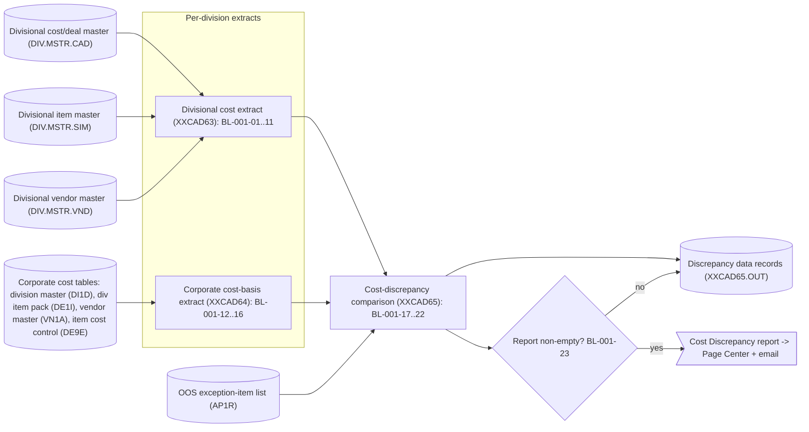
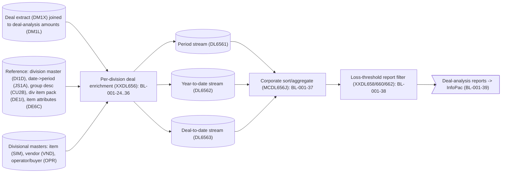

# BP-001 — Item Master Data Management: Extracted Business Logic

**Status:** Draft — business-logic extraction derived from the call-dependency graph, grounded in mainframe source under `docs/legacy/src`
**Companion to:** [BP-001-item-master-data-management-call-graph.md](BP-001-item-master-data-management-call-graph.md) and [BP-001-item-master-data-management.md](BP-001-item-master-data-management.md)
**Scope:** Two end-to-end business processes — Process A (Cost Out-of-Sync, job `MCCAD65J`) and Process B (Deal-Analysis End-of-Period, job `MCDL656J`) — expressed as discrete, fully-attributed business rules.

---

## 1. Purpose, scope, and method

This document re-expresses the BP-001 cost/deal pipelines as **business logic** — the *what* — separated from the *how* (file mechanics, cursor mechanics, package binding, diagnostics). The primary source is the call-dependency graph; the mainframe source was consulted only to resolve exact field semantics and formulas.

Two end-to-end processes are covered:

- **Process A — Cost Out-of-Sync.** Per division, build a "current/future cost picture" from the divisional cost/deal master and an independent picture from the corporate cost-basis tables, compare them item-by-item, and emit a discrepancy report to the corporate output-distribution channels.
- **Process B — Deal-Analysis End-of-Period.** Per division, enrich settled deal transactions with item, vendor, group, and buyer attributes; split each enriched deal into period / year-to-date / deal-to-date streams; aggregate corporately; and print deal gain/loss reports.

### 1.1 What is in scope (business logic) vs out of scope (implementation)

Captured as rules (the *what*): data validations, classifications, transformations, code mappings, match/merge logic, enrichment lookups, routing decisions, aggregations, and the operational hard-fail convention.

Treated as implementation and **not** turned into rules (the *how*): opening/closing files, file-status interrogation, DB2 `SET CURRENT PACKAGESET`, cursor open/fetch/close mechanics, multi-row fetch buffering, `GET DIAGNOSTICS`, display/logging statements, and the job-step return-code propagation (`COND=(4,LT)`). These are summarized once in §6.3 because they are environment-specific, not business intent. The single exception is the platform hard-fail convention, which is a genuine operational rule (BL-001-11 / BL-001-35).

### 1.2 Rule attributes

Each rule lists: **Rule ID** and the coarse companion rule it refines (`BR-001-NN`); **Logic type**; **Trigger conditions**; **Input data schema**; **Plain-English description**; **Pseudocode** (CLRS 4th-edition convention); **Output data schema**.

### 1.3 Pseudocode convention (CLRS 4th edition)

- Indentation denotes block structure; there are no `begin`/`end` brackets.
- `=` is assignment; `==`, `≠`, `≤`, `≥` are comparisons; `and`, `or`, `not` are boolean (short-circuiting).
- `//` begins a comment.
- Keywords: `if` / `elseif` / `else`, `while`, `repeat … until`, `for … to` / `downto`, `return`, `error "…"`.
- Procedures are named in capitals, e.g. `PROCESS-COST-ROW`; object attributes use dot notation, e.g. `row.listCost`; arrays are 1-indexed, e.g. `fetchedRows[i]`.
- A sentinel "far-future" date constant `FAR_FUTURE_DATE` denotes the literal `2999-01-01` used by the legacy code to mean "no value present".
- No COBOL, SQL, or JCL text appears in any pseudocode block; all identifiers are plain-English. The originating mnemonic is given in the schema and prose, per §1.4.

### 1.4 Identifier-translation rule

Every cryptic or mnemonic identifier is rendered in plain English with the original in parentheses on first use within a rule and in every schema row, e.g. *current cost (`DCS-CUR-COST`)*, *cost basis code (`COST_BASIS_CD`)*, *deletion switch (`DELT_SW`)*. The master mapping is in §3.

### 1.5 Logical type vocabulary (used in all schemas)

| Logical type | Meaning |
|---|---|
| `string(n)` | fixed-length character field of length n |
| `integer` | whole number |
| `amount(i.f)` | signed decimal money/quantity, i integer digits and f fractional digits |
| `date-iso` | calendar date as `YYYY-MM-DD` text |
| `date-julian` | Acme Julian date `CCYYDDD` (century/year + day-of-year) |
| `timestamp` | date-time to microsecond precision |
| `code(n)` | enumerated character code of length n |
| `flag` | single-character yes/no indicator |

---

## 2. End-to-end process maps

### 2.1 Process A — Cost Out-of-Sync (`MCCAD65J`)



### 2.2 Process B — Deal-Analysis End-of-Period (`MCDL656J`)



---

## 3. Master identifier-translation glossary

### 3.1 Divisional cost/deal record — item-cost layout (`DCSFCAD`, segment `CDIC`)

| Plain-English name | Original | Logical type |
|---|---|---|
| Acme item number | `CDKY-ACME-ITEM-NUM` | integer (6) |
| order-window last date (Julian) | `CDKY-ORDER-LAST-YYDDD` | date-julian |
| list order/effective date (Julian) | `CDIC-LIST-ORDER-YYDDD` | date-julian |
| list cost amount | `CDIC-LIST-COST` | amount(7.4) |
| list amount type code | `CDIC-LIST-AMT-TYPE` | code(1) |

### 3.2 Divisional/corporate cost extract record (`XXCAD65C`, tags `DCS` / `DE9E`)

| Plain-English name | Original (DCS / DE9E) | Logical type |
|---|---|---|
| division code | `*-DIV-CODE` | string(2) |
| item number | `*-ITEM-NUM` | integer(6) |
| current effective date | `*-CUR-EFF-DT` | date-iso |
| current cost | `*-CUR-COST` | amount(11.4) |
| future effective date | `*-FUT-EFF-DT` | date-iso |
| future cost | `*-FUT-COST` | amount(11.4) |
| cost basis | `*-COST-BASIS` | code(2) |
| multiple-cost-row marker | `*-MULT-CAD-SW` | flag |

### 3.3 Item master record (`DCSFITM`, key segment `ITKY`, vendor segment `ITVN`)

| Plain-English name | Original | Logical type |
|---|---|---|
| item status | `ITKY-ITEM-STATUS` | code(2) — active when blank or `A` (`ITKY-ACTIVE-ITEM`) |
| item record key | `ITKY-RECORD-KEY` | string(10) |
| owning vendor number | `ITKY-VENDOR-NBR` | string(10) |
| buyer code | `ITVN-BUYER` | string(5) |

### 3.4 Vendor master record (`DCSFVND`, key `VNKY`, root `VNRT`)

| Plain-English name | Original | Logical type |
|---|---|---|
| record status code | `VNKY-RECORD-STATUS-CODE` | code(1) — active = `A` |
| cost-control flag | `VNRT-COST-CONTROL-FLAG` | flag — enabled = `Y` |
| vendor record type | `VNKY-RECORD-TYPE` | code(1) — grocery = `0` |
| vendor number | `VNKY-VENDOR-NBR` | integer(10) |
| vendor short name | `VNKY-VENDORS-SHORT-NAME` | string(12) |

### 3.5 Corporate item-cost-control table (`ACME.ITM_COST_CNTL_DE9E`, DCLGEN `DGDE9E`)

| Plain-English name | Original | Logical type |
|---|---|---|
| division partition | `DIV_PART` | integer |
| cost class type | `CLS_TYP` | code(6) — item cost = `ITMCST` |
| cost class id | `CLS_ID` | code(10) — base cost = `BASCOST` |
| catalog (item) number | `CATLG_NUM` | integer |
| billing effective timestamp | `BILL_EFF_TS` | timestamp |
| purchase-order effective date | `PO_EFF_DT` | date-iso |
| cost amount | `COST_AMT` | amount(11.4) |
| cost basis code | `COST_BASIS_CD` | code(3) — warehouse-EU = `WEU` |
| deletion switch | `DELT_SW` | flag — deleted = anything but `N` |

### 3.6 Division master, div item pack, vendor master cost tables

| Plain-English name | Original | Source |
|---|---|---|
| Acme division code | `MCLANE_DIV` | division master (`DGDI1D`) |
| division partition | `DIV_PART` | division master (`DGDI1D`) |
| user division name | `USER_DIV_NAME` | division master (`DGDI1D`) |
| item status code | `ITEM_STAT_CD` | div item pack (`DGDE1I`) — active=`ACT`, discontinued=`DIS`, inactive=`INA` |
| cost-basis-record vendor id | `DIV_CBR_VNDR` | div item pack (`DGDE1I`) |
| former primary vendor id | `OLD_PRIM_VNDR_ID` | div item pack (`DGDE1I`) |
| vendor cost-control switch | `COST_CNTRL_SW` | vendor master (`DGVN1A`) — on = `Y` |

### 3.7 Deal extract / deal-analysis amounts (`DGDM1X` ⋈ `DGDM1L`), period table (`DGJS1A`), group desc (`DGCU2B`), item attributes (`DGDE6C`)

| Plain-English name | Original | Source |
|---|---|---|
| item number | `IITEM2` / `ITEM_NUM` | deal extract / deal-analysis |
| vendor deal id | `IVNDL0` | deal extract |
| deal id | `IDEAL2` / `DEAL_ID` | deal extract / deal-analysis |
| deal payment form | `CDFRM0` | deal extract |
| deal type | `CDLTP2` | deal extract |
| sales-reporting group number | `ISRPG2` | deal extract |
| deal master-case amount | `AMDEL3` / `DEAL_MSTRCS_AMT` | deal extract / deal-analysis |
| deal total amount | `ATTDL3` | deal extract |
| ceded deal amount | `ACEDL3` / `DEAL_CEDED_AMT` | deal extract / deal-analysis |
| deal first code date | `DFINVH` | deal extract |
| deal last code date | `DLINVH` | deal extract |
| auto-billback amount | `DEAL_BILBCK_AMT` | deal-analysis |
| accrued auto-billback amount | `DEALBILBCKAMTACRL` | deal-analysis |
| Acme period number | `MCLANE_PRD_NUM` / `MCLANE_PRD` | deal-analysis / period table |
| Acme period year | `MCLANE_PRD_YR` / `MCLANE_YR` | deal-analysis / period table |
| calendar date | `DT` | period table (`DGJS1A`) |
| group/class description | `DESC` | group desc (`DGCU2B`) — class type `GRPCDE` |
| item description | `ITEM_DESC` | item attributes (`DGDE6C`) |
| item size | `ITEM_SIZE` | item attributes (`DGDE6C`) |
| item pack | `ITEM_PCK` | item attributes (`DGDE6C`) |

### 3.8 Operator/buyer record (`DCSFOPR`) and deal output record (`XXDL670C`)

| Plain-English name | Original | Logical type |
|---|---|---|
| operator key | `OT-KEY` (prefix `OT-PREFX` = `O`, number `OT-OPNBR`) | string |
| buyer name | `OT-NAME` | string |
| deal-output buyer name | `*-BUYER` | string(20) |
| deal-output gain/loss | `*-DEAL-GAIN-LOSS` | amount(7.2) |

### 3.9 Cost-out-of-sync comparison switches (reader card `MCCAD651`)

| Plain-English name | Original | Card column |
|---|---|---|
| compare current effective date | `WS-CUR-EFF-DT-SW` | 02 |
| compare current cost | `WS-CUR-COST-SW` | 04 |
| compare future effective date | `WS-FUT-EFF-DT-SW` | 06 |
| compare future cost | `WS-FUT-COST-SW` | 08 |
| compare cost basis | `WS-COST-BASIS-SW` | 10 |
| emit exception lines (report switch) | `WS-AP1R-SW` | 12 |

---

## 4. Process A — Cost Out-of-Sync (`MCCAD65J`)

**Entry points / data sources:** divisional cost/deal master, divisional item master, divisional vendor master, the four corporate cost tables, the OOS exception-item list, and two reader-parameter cards.
**Data sinks:** the Cost Discrepancy report (to Page Center and email) and the discrepancy data extract.

### 4.A Stage 1 — Divisional cost extract (program `XXCAD63`)

Reads the division's cost/deal master, already sorted so all cost rows of one item are contiguous, and produces one extract record per item holding that item's current and future cost picture — but only for items whose owning vendor is active and cost-controlled.

#### BL-001-01 — Validate the current-cost reader switch
- **Logic type:** data validation
- **Maps to:** new (operational precondition)
- **Trigger:** program start, after reading the divisional reader card (`MCCAD631`), before any cost processing.
- **Input schema:** reader switch value (`WS-RDR-SW`): code(1); count of non-comment cards read (`WS-READ-RDR-CNT`): integer.
- **Description:** A single control card supplies the current-cost-zeroing switch (see BL-001-07). The switch is valid only if exactly one non-comment card was read and its value is `Y` or `N`; otherwise the extract is abandoned without producing output (normal termination, not a hard fail).
- **Pseudocode:**

```
VALIDATE-READER-SWITCH(cardCount, switchValue)
    if cardCount == 0 or (switchValue ≠ "Y" and switchValue ≠ "N")
        // current-cost-zeroing rule is undefined; produce nothing
        return INVALID
    return VALID
```

- **Output schema:** validity decision (drives normal-vs-abort path); no data record.

#### BL-001-02 — Group cost rows by item (control break)
- **Logic type:** control / aggregation boundary
- **Maps to:** new (supports BR-001-03)
- **Trigger:** each cost/deal record read; the item number differs from the item being accumulated.
- **Input schema:** current row item number (`CDKY-ACME-ITEM-NUM`): integer(6); accumulated item number (`WS-SAVE-ITEM`): integer(6).
- **Description:** Because the input is pre-sorted by item, a change of item number marks the end of one item's cost rows. On a break, the accumulated cost picture is flushed (BL-001-07 onward) and the per-item working values reset before the new item is accumulated.
- **Pseudocode:**

```
ON-EACH-COST-ROW(row)
    if row.itemNumber ≠ accumulatedItemNumber
        FLUSH-ITEM(accumulatedItem)                 // BL-001-07..11
        RESET-ITEM-ACCUMULATORS()
        accumulatedItemNumber = row.itemNumber
    CLASSIFY-COST-ROW(row)                           // BL-001-03 / 05 / 06
```

- **Output schema:** triggers an extract write (see BL-001-07); resets `currentCostFound`, `futureCostFound`, current-cost-row count, saved list cost.

#### BL-001-03 — Recognise the current cost row
- **Logic type:** classification
- **Maps to:** BR-001-03
- **Trigger:** a cost row whose order window is still open today, i.e. order-window last date is not before today AND today is within `[list order date, order-window last date]`.
- **Input schema:** today (system date, Julian); order-window last date (`CDKY-ORDER-LAST-YYDDD`): date-julian; list order date (`CDIC-LIST-ORDER-YYDDD`): date-julian; list cost (`CDIC-LIST-COST`): amount(7.4).
- **Description:** A cost row is the item's *current* cost when today falls inside its order window. The first such row seeds the current cost and current effective date; the row also feeds the cost-basis mapping (BL-001-04) and the multiple-row sameness test (BL-001-05). Rows whose window already closed (order-window last date before today) are stale and ignored.
- **Pseudocode:**

```
CLASSIFY-COST-ROW(row)
    if row.orderLastDate < today
        return                                       // stale row: ignore
    if today ≥ row.listOrderDate and today ≤ row.orderLastDate
        currentCostRowCount = currentCostRowCount + 1
        currentCostFound = TRUE
        extract.currentCost = row.listCost
        extract.currentEffectiveDate = TO-ISO-DATE(row.listOrderDate)
        extract.costBasis = MAP-LIST-AMOUNT-TYPE(row.listAmountType)   // BL-001-04
        TRACK-COST-SAMENESS(row.listCost)                              // BL-001-05
    RECOGNISE-FUTURE-COST(row)                                         // BL-001-06
```

- **Output schema:** current cost (`DCS-CUR-COST`); current effective date (`DCS-CUR-EFF-DT`); current-cost-found flag; current-cost-row count.

#### BL-001-04 — Map list amount type to cost basis
- **Logic type:** data transformation (code mapping)
- **Maps to:** BR-001-04, BR-001-05, BR-001-06
- **Trigger:** a current cost row is recognised (BL-001-03).
- **Input schema:** list amount type code (`CDIC-LIST-AMT-TYPE`): code(1).
- **Description:** The divisional list-amount type is translated to the canonical two-character cost basis: type `F` ("per master case") becomes master-case basis `ACME`; type `1` ("per hundredweight") becomes hundredweight basis `CW`; any other type becomes standard-case basis `SC`. This canonical basis is what later participates in the cost-basis comparison.
- **Pseudocode:**

```
MAP-LIST-AMOUNT-TYPE(listAmountType)
    if listAmountType == "F"
        return "ACME"          // master-case basis
    elseif listAmountType == "1"
        return "CW"          // hundredweight basis
    else
        return "SC"          // standard-case basis
```

- **Output schema:** cost basis (`DCS-COST-BASIS`): code(2) ∈ {`ACME`,`CW`,`SC`}.

#### BL-001-05 — Detect cost agreement across multiple current rows
- **Logic type:** classification
- **Maps to:** new (supports BL-001-07)
- **Trigger:** a second or later current cost row for the same item is recognised.
- **Input schema:** current-cost-row count; this row's list cost (`CDIC-LIST-COST`); first row's saved list cost (`WS-SAVE-LIST-COST`): amount(7.4).
- **Description:** When an item has more than one open current cost row, the program records whether they all carry the same cost. The first current row's cost is saved; each subsequent row that differs flips the "same cost" indicator to "different". This indicator decides, under reader switch `N`, whether the current cost is zeroed at flush time.
- **Pseudocode:**

```
TRACK-COST-SAMENESS(thisListCost)
    if currentCostRowCount == 1
        savedListCost = thisListCost
        costsAgree = TRUE
    elseif currentCostRowCount > 1
        if thisListCost ≠ savedListCost
            costsAgree = FALSE
```

- **Output schema:** costs-agree indicator (`WS-SAME-CST-SW`: `Y` agree / `N` differ).

#### BL-001-06 — Recognise the future cost row
- **Logic type:** classification
- **Maps to:** BR-001-03
- **Trigger:** no future cost captured yet for the item AND a cost row's list order date is after today.
- **Input schema:** future-cost-found flag (`WS-FUT-COST-SW`); list order date (`CDIC-LIST-ORDER-YYDDD`): date-julian; today; list cost (`CDIC-LIST-COST`): amount(7.4).
- **Description:** The first cost row whose effective date is in the future becomes the item's *future* cost and future effective date. Only the first qualifying row is taken.
- **Pseudocode:**

```
RECOGNISE-FUTURE-COST(row)
    if not futureCostFound and row.listOrderDate > today
        futureCostFound = TRUE
        extract.futureCost = row.listCost
        extract.futureEffectiveDate = TO-ISO-DATE(row.listOrderDate)
```

- **Output schema:** future cost (`DCS-FUT-COST`); future effective date (`DCS-FUT-EFF-DT`); future-cost-found flag.

#### BL-001-07 — Resolve the cost picture at item flush (multiple-row and missing-value handling)
- **Logic type:** data transformation
- **Maps to:** new (refines BR-001-03)
- **Trigger:** an item control break (BL-001-02) or end-of-file with at least one row read.
- **Input schema:** current-cost-row count; costs-agree indicator (`WS-SAME-CST-SW`); current-cost reader switch (`WS-RDR-SW`); current/future found flags; division (program parameter); accumulated item number (`WS-SAVE-ITEM`).
- **Description:** Before writing the item's extract record the cost picture is normalised: (a) if the item had more than one open current cost row, the current cost is either always zeroed (reader switch `Y`) or zeroed only when the rows disagreed (reader switch `N`), the current effective date is set to the far-future sentinel, and the multiple-cost-row marker is set; (b) if no current cost was found, the current cost is zeroed and dated with the sentinel; (c) if no future cost was found, the future cost is zeroed and dated with the sentinel.
- **Pseudocode:**

```
FLUSH-ITEM(item)
    if currentCostRowCount > 1
        if readerSwitch == "Y"
            extract.currentCost = 0
        elseif readerSwitch == "N" and costsAgree == FALSE
            extract.currentCost = 0
        extract.currentEffectiveDate = FAR_FUTURE_DATE
        extract.multipleCostRowMarker = "M"
    if not currentCostFound
        extract.currentEffectiveDate = FAR_FUTURE_DATE
        extract.currentCost = 0
    if not futureCostFound
        extract.futureEffectiveDate = FAR_FUTURE_DATE
        extract.futureCost = 0
    extract.divisionCode = division
    extract.itemNumber = item
    VALIDATE-AND-WRITE-ITEM(item)                    // BL-001-09 / 10 / 11
```

- **Output schema:** finalised extract record (`DCS-RCD`): division code, item number, current/future effective date and cost, cost basis, multiple-cost-row marker.

#### BL-001-08 — Convert Acme Julian dates to calendar dates
- **Logic type:** data transformation
- **Maps to:** new (representation normalisation)
- **Trigger:** whenever a current or future effective date is taken from a cost row.
- **Input schema:** Acme Julian date (`CDIC-LIST-ORDER-YYDDD`): date-julian.
- **Description:** Cost-row dates are stored as century/year + day-of-year. They are converted to an ISO calendar date (`YYYY-MM-DD`) for the extract so downstream comparison and reporting are calendar-based.
- **Pseudocode:**

```
TO-ISO-DATE(julianDate)
    dayNumber = DAYS-SINCE-EPOCH(julianDate)         // day-of-year -> absolute day
    return CALENDAR-DATE(dayNumber)                  // absolute day -> YYYY-MM-DD
```

- **Output schema:** effective date as `date-iso`.

#### BL-001-09 — Require an active owning item
- **Logic type:** data validation
- **Maps to:** new (companion to BR-001-01/02)
- **Trigger:** an item's extract is ready to write; the item master is read by item key.
- **Input schema:** item status (`ITKY-ITEM-STATUS`): code(2); owning vendor number (`ITKY-VENDOR-NBR`): string(10).
- **Description:** The item must exist on the item master and be active (status blank or `A`). If the item is missing it is logged and skipped (no extract). If present but inactive, it is skipped. Only an active item proceeds to vendor validation.
- **Pseudocode:**

```
VALIDATE-AND-WRITE-ITEM(item)
    record = READ-ITEM-MASTER(item)
    if record is NOT-FOUND
        LOG("item not found on item master"); return
    if not record.isActive                           // status blank or "A"
        return
    VALIDATE-VENDOR-AND-WRITE(record.owningVendorNumber)   // BL-001-10
```

- **Output schema:** owning vendor number passed to BL-001-10; or no output (skip).

#### BL-001-10 — Require an active, cost-controlled vendor before writing
- **Logic type:** data validation (write gate)
- **Maps to:** BR-001-01, BR-001-02
- **Trigger:** an active item's owning vendor is read by vendor key.
- **Input schema:** vendor record status code (`VNKY-RECORD-STATUS-CODE`): code(1); vendor cost-control flag (`VNRT-COST-CONTROL-FLAG`): flag.
- **Description:** The item's extract is written only if the owning vendor exists, is active (status `A`), and has cost control enabled (`Y`). Missing vendors are logged and skipped; inactive or non-cost-controlled vendors are silently skipped. This is the gate that keeps the cost-out-of-sync comparison limited to cost-controlled vendors.
- **Pseudocode:**

```
VALIDATE-VENDOR-AND-WRITE(vendorNumber)
    vendor = READ-VENDOR-MASTER(vendorNumber)
    if vendor is NOT-FOUND
        LOG("vendor not found"); return
    if vendor.statusCode == "A" and vendor.costControlEnabled
        WRITE-EXTRACT-RECORD()                        // emit DCS record
```

- **Output schema:** one divisional cost extract record (`DCS-RCD`) per qualifying item.

#### BL-001-11 — Hard-fail on unrecoverable file errors
- **Logic type:** error handling (operational rule)
- **Maps to:** BR-001-10
- **Trigger:** any file open/read/write returns a status other than the accepted set (`00`/`97`/`04`, or "not found" `23`/`10` which is treated as a soft skip).
- **Input schema:** file status (`WS-SIM-STATUS`, `WS-VND-STATUS`, `WS-OUT-STATUS`): code(2).
- **Description:** Any genuinely unexpected access failure terminates the program with return code 16, which (via the job-level guard) stops the whole pipeline. "Record not found" is *not* a hard fail — it is the soft skip in BL-001-09/10.
- **Pseudocode:**

```
CHECK-FILE-STATUS(status)
    if status in {"00", "97", "04"}
        return OK
    if status in {"23", "10"}
        return NOT-FOUND                              // soft: skip this item
    SET-RETURN-CODE(16)
    error "unrecoverable file access"
```

- **Output schema:** return code 16 on hard fail; otherwise control continues.

### 4.B Stage 2 — Corporate cost-basis extract (program `XXCAD64`)

A pure reader over the corporate cost tables that builds the same per-item current/future cost picture as Stage 1, but from the authoritative cost-basis records. This is the "other side" of the comparison.

#### BL-001-12 — Select eligible cost-basis rows
- **Logic type:** data validation / set selection
- **Maps to:** new (corporate analogue of BR-001-01/02)
- **Trigger:** building the per-item cost-basis set for the parameter division.
- **Input schema:** division item-pack item status (`ITEM_STAT_CD`): code(3); vendor cost-control switch (`COST_CNTRL_SW`): flag; cost class type (`CLS_TYP`): code(6); cost class id (`CLS_ID`): code(10); deletion switch (`DELT_SW`): flag; division partition (`DIV_PART`): integer.
- **Description:** A cost-basis row is eligible only when its item is active or discontinued (`ACT`/`DIS`), its cost-basis vendor is cost-controlled (`Y`), the row is the item-cost base-cost class (`ITMCST`/`BASCOST`), the row is not deleted (`N`), and the row belongs to the partition of the requested division. These filters mirror, on the corporate side, the active-item / active-vendor / cost-control gating of Stage 1.
- **Pseudocode:**

```
IS-ELIGIBLE-COST-ROW(row, divisionPartition)
    return row.divisionPartition == divisionPartition
       and row.itemStatus in {"ACT", "DIS"}
       and row.vendorCostControlled == TRUE
       and row.costClassType == "ITMCST"
       and row.costClassId == "BASCOST"
       and row.notDeleted == TRUE                     // deletion switch == "N"
```

- **Output schema:** the eligible cost-basis row set per item (catalog number, PO effective date, billing effective timestamp, cost basis code, cost amount).

#### BL-001-13 — Choose the current and future cost per item
- **Logic type:** data selection / classification
- **Maps to:** new (corporate analogue of BR-001-03)
- **Trigger:** for each item in the eligible set.
- **Input schema:** purchase-order effective date (`PO_EFF_DT`): date-iso; billing effective timestamp (`BILL_EFF_TS`): timestamp; today.
- **Description:** The item's *current* cost is the eligible row with the latest PO effective date that is on or before today; its *future* cost is the eligible row with the earliest PO effective date after today. Where multiple rows share that PO effective date, the one with the latest billing effective timestamp wins. This yields at most one current and one future cost per item.
- **Pseudocode:**

```
CHOOSE-CURRENT-AND-FUTURE(eligibleRows, today)
    currentCandidates = { r in eligibleRows : r.poEffectiveDate ≤ today }
    futureCandidates  = { r in eligibleRows : r.poEffectiveDate > today }
    current = ARGMAX r in currentCandidates BY (r.poEffectiveDate, r.billingTimestamp)
    future  = LATEST-BILL r in futureCandidates BY MIN(r.poEffectiveDate)
    return (current, future)
```

- **Output schema:** chosen current row and future row (each: catalog number, PO effective date, cost amount, cost basis code).

#### BL-001-14 — Assemble one extract record per item (control break)
- **Logic type:** control / aggregation boundary
- **Maps to:** new (mirrors BL-001-02)
- **Trigger:** processing fetched rows in catalog-number order; the catalog number changes.
- **Input schema:** catalog number (`CATLG_NUM`): integer; PO effective date (`PO_EFF_DT`): date-iso; today; current/future found flags.
- **Description:** Rows arrive grouped and ordered by catalog number. On a catalog-number break the prior item's record is flushed. Within an item, the first row dated on/before today seeds the current cost; the first row dated after today seeds the future cost.
- **Pseudocode:**

```
ON-EACH-FETCHED-ROW(row)
    if row.catalogNumber ≠ accumulatedCatalogNumber
        WRITE-COST-BASIS-RECORD(accumulatedItem)     // BL-001-16
        RESET(); accumulatedCatalogNumber = row.catalogNumber
    if row.poEffectiveDate ≤ today and not currentCostFound
        currentCostFound = TRUE
        extract.currentEffectiveDate = row.poEffectiveDate
        extract.currentCost = row.costAmount
    if row.poEffectiveDate > today and not futureCostFound
        futureCostFound = TRUE
        extract.futureEffectiveDate = row.poEffectiveDate
        extract.futureCost = row.costAmount
    extract.costBasis = MAP-COST-BASIS-CODE(row.costBasisCode)   // BL-001-15
```

- **Output schema:** in-progress cost-basis extract record (`DE9E-RCD`).

#### BL-001-15 — Map cost-basis code to canonical basis
- **Logic type:** data transformation (code mapping)
- **Maps to:** new (corporate analogue of BL-001-04)
- **Trigger:** each fetched cost-basis row.
- **Input schema:** cost basis code (`COST_BASIS_CD`): code(3).
- **Description:** The corporate three-character cost-basis code is reduced to the canonical two-character basis: warehouse-EU (`WEU`) becomes hundredweight basis `CW`; everything else becomes master-case basis `ACME`. (The corporate side only distinguishes these two, unlike the divisional three-way mapping in BL-001-04.)
- **Pseudocode:**

```
MAP-COST-BASIS-CODE(costBasisCode)
    if costBasisCode == "WEU"
        return "CW"
    else
        return "ACME"
```

- **Output schema:** cost basis (`DE9E-COST-BASIS`): code(2) ∈ {`CW`,`ACME`}.

#### BL-001-16 — Default missing current/future cost at flush
- **Logic type:** data transformation (default)
- **Maps to:** new (mirrors BL-001-07 missing-value handling)
- **Trigger:** writing an item's cost-basis extract record.
- **Input schema:** current/future found flags; division (program parameter); catalog number (`CATLG_NUM`).
- **Description:** If the item had no current cost, the current cost is zeroed and dated with the far-future sentinel; likewise for a missing future cost. The division code and item number are stamped before the record is written.
- **Pseudocode:**

```
WRITE-COST-BASIS-RECORD(item)
    if not currentCostFound
        extract.currentEffectiveDate = FAR_FUTURE_DATE
        extract.currentCost = 0
    if not futureCostFound
        extract.futureEffectiveDate = FAR_FUTURE_DATE
        extract.futureCost = 0
    extract.divisionCode = division
    extract.itemNumber = item
    EMIT(extract)
```

- **Output schema:** one corporate cost-basis extract record (`DE9E-RCD`) per item — same layout as the divisional extract.

### 4.C Stage 3 — Cost-discrepancy comparison (program `XXCAD65`)

A two-file match/merge over the merged divisional extract and merged corporate extract (both pre-sorted on division+item), driven by the six comparison switches and an exception-item set.

#### BL-001-17 — Load the out-of-sync exception-item set
- **Logic type:** data load
- **Maps to:** new (resolves BR-001-09 input)
- **Trigger:** initialization, before the merge.
- **Input schema:** exception parameter rows (`AP1R`) filtered to application `CAD`, partition `0`, parameter id `CAD_OOS_EXCEPT`; each yields a 6-digit item number.
- **Description:** A configured list of items is flagged as "known out-of-sync exceptions". For these items, discrepancies are reported as a soft "no updates" note rather than as field-level discrepancies — but only when the report switch (BL-001-21) is on.
- **Pseudocode:**

```
LOAD-EXCEPTION-ITEMS()
    for each row in EXCEPTION-PARAMETER-SET("CAD", "CAD_OOS_EXCEPT")
        exceptionItem[row.itemNumber] = TRUE
```

- **Output schema:** exception-item membership set (`WS-EXC-ITEM-SW` indexed by item number).

#### BL-001-18 — Match/merge the two cost extracts
- **Logic type:** matching / merge
- **Maps to:** BR-001-11, BR-001-12, BR-001-13, BR-001-14
- **Trigger:** the main loop until both extracts are exhausted.
- **Input schema:** divisional extract key+data (`DCS-KEY`, `DCS-DATA`); corporate extract key+data (`DE9E-KEY`, `DE9E-DATA`). Key = division code + item number.
- **Description:** Both files are read in lockstep on the division+item key. When keys match and the data is identical, both advance with no report line (in sync). When keys match but data differs, the discrepancy engine (BL-001-20) runs, then both advance. When one key is greater than the other, the trailing record is an orphan handled by BL-001-19. At end-of-file on one side, its key is set to the maximum so the remaining side drains as orphans.
- **Pseudocode:**

```
MERGE-EXTRACTS()
    divRow = READ-DIVISIONAL(); corpRow = READ-CORPORATE()
    while not (divEOF and corpEOF)
        PRINT-HEADER-IF-NEEDED()
        if divRow.key == corpRow.key
            if divRow.data == corpRow.data
                divRow = READ-DIVISIONAL(); corpRow = READ-CORPORATE()
            else
                CHECK-DISCREPANCIES(divRow, corpRow)         // BL-001-20
                divRow = READ-DIVISIONAL(); corpRow = READ-CORPORATE()
        elseif divRow.key > corpRow.key
            REPORT-ORPHAN(corpRow, side = CORPORATE)         // BL-001-19
            corpRow = READ-CORPORATE()
        else
            REPORT-ORPHAN(divRow, side = DIVISIONAL)         // BL-001-19
            divRow = READ-DIVISIONAL()
```

- **Output schema:** drives report lines and the discrepancy data extract.

#### BL-001-19 — Report an orphan item (present on only one side)
- **Logic type:** data validation / reporting
- **Maps to:** BR-001-13, BR-001-14, BR-001-09
- **Trigger:** the two keys are unequal, so one side has an item the other lacks.
- **Input schema:** orphan side's division code and item number; exception-item membership; report switch (`WS-AP1R-SW`).
- **Description:** An item present only on the corporate side is reported "ITEM NOT FOUND AT DCS"; present only on the divisional side, "ITEM NOT FOUND AT CBR". If the orphan is a configured exception item and the report switch is on, the line is replaced by the soft "ITEM EXCEPTION - NO UPDATES" note instead.
- **Pseudocode:**

```
REPORT-ORPHAN(row, side)
    if exceptionItem[row.itemNumber] and reportSwitch == "Y"
        WRITE-REPORT-LINE(row.divisionCode, row.itemNumber, "ITEM EXCEPTION - NO UPDATES")
    elseif side == CORPORATE
        WRITE-REPORT-LINE(row.divisionCode, row.itemNumber, "ITEM NOT FOUND AT DCS")
    else
        WRITE-REPORT-LINE(row.divisionCode, row.itemNumber, "ITEM NOT FOUND AT CBR")
```

- **Output schema:** one report line on the Cost Discrepancy report.

#### BL-001-20 — Compare enabled fields and emit discrepancy lines
- **Logic type:** data validation (field comparison)
- **Maps to:** BR-001-07, BR-001-08
- **Trigger:** keys match but data differs (from BL-001-18).
- **Input schema:** five comparison switches (`WS-CUR-EFF-DT-SW`, `WS-CUR-COST-SW`, `WS-FUT-EFF-DT-SW`, `WS-FUT-COST-SW`, `WS-COST-BASIS-SW`); the paired divisional/corporate values for current effective date, current cost, future effective date, future cost, cost basis; multiple-cost-row marker (`DCS-MULT-CAD-SW`); exception membership; report switch.
- **Description:** Each enabled switch compares its field between the two sides. A mismatch normally writes a field-specific discrepancy line ("CURRENT EFFECTIVE DATE", "CURRENT COST" — annotated with the multiple-cost-row marker — "FUTURE EFFECTIVE DATE", "FUTURE COST", "COST BASIS") and sets the write flag. For a configured exception item with the report switch on, the first mismatch instead emits a single "ITEM EXCEPTION - NO UPDATES" soft line (BL-001-21) and suppresses the field lines. All mismatches are soft: the run continues. If any field line was written, the enriched data record is produced (BL-001-22).
- **Pseudocode:**

```
CHECK-DISCREPANCIES(divRow, corpRow)
    writeData = FALSE
    isException = exceptionItem[divRow.itemNumber]
    exceptionLineWritten = FALSE
    for each field in [currentEffectiveDate, currentCost, futureEffectiveDate, futureCost, costBasis]
        if not field.compareEnabled
            continue
        if divRow[field] ≠ corpRow[field]
            if isException
                if reportSwitch == "Y" and not exceptionLineWritten
                    WRITE-EXCEPTION-LINE(divRow)              // BL-001-21
                    exceptionLineWritten = TRUE
            else
                WRITE-FIELD-DISCREPANCY-LINE(field, divRow, corpRow)
                writeData = TRUE
    if writeData
        enriched = ENRICH-DISCREPANT-ITEM(divRow.divisionCode, divRow.itemNumber)  // BL-001-22
        WRITE-DATA-EXTRACT(enriched)
```

- **Output schema:** zero or more report lines; sets the write flag that gates the discrepancy data extract.

#### BL-001-21 — Emit the exception soft-fail line
- **Logic type:** control (soft-fail)
- **Maps to:** BR-001-09
- **Trigger:** a discrepancy is found on a configured exception item AND the report switch is on AND no exception line was already written for this item.
- **Input schema:** division code; item number; exception membership; report switch.
- **Description:** For configured exceptions, a single "ITEM EXCEPTION - NO UPDATES" line is written in place of the field-level discrepancy lines, signalling that the discrepancy is known and intentionally not acted upon. It is written at most once per item.
- **Pseudocode:**

```
WRITE-EXCEPTION-LINE(row)
    WRITE-REPORT-LINE(row.divisionCode, row.itemNumber, "ITEM EXCEPTION - NO UPDATES")
```

- **Output schema:** one report line; no data extract record.

#### BL-001-22 — Enrich a discrepant item for the data extract
- **Logic type:** data enrichment
- **Maps to:** new (supports BR-001-07/08 output)
- **Trigger:** at least one field discrepancy line was written for a matched item.
- **Input schema:** division code (`MCLANE_DIV`); item/catalog number (`CATLG_NUM`); corporate cost tables joined to the active, cost-controlled, non-deleted base-cost record.
- **Description:** For a confirmed discrepancy, the authoritative corporate cost-basis row (latest PO effective date, latest billing timestamp) is re-read to capture the division partition, catalog number, PO effective date, billing effective timestamp and (last-change timestamp + 1 microsecond). If no such row exists, the current date/timestamp are synthesised from the division master instead. The result is written to the discrepancy data extract.
- **Pseudocode:**

```
ENRICH-DISCREPANT-ITEM(divisionCode, itemNumber)
    row = LATEST-BASE-COST-ROW(divisionCode, itemNumber)   // active, cost-controlled, not deleted
    if row is NOT-FOUND
        row = SYNTHESISE-FROM-DIVISION-MASTER(divisionCode, itemNumber, today)
    return (row.divisionPartition, row.catalogNumber, row.poEffectiveDate,
            row.billingTimestamp, row.lastChangeTimestamp + 1 microsecond)
```

- **Output schema:** one discrepancy data record (`OUT-RCD`): division partition, item number, PO effective date, billing effective timestamp, last-change timestamp.

#### BL-001-23 — Gate report distribution on report content
- **Logic type:** control
- **Maps to:** new (job-level orchestration of `MCCAD65J`)
- **Trigger:** after the comparison step, before distributing the report.
- **Input schema:** discrepancy report dataset (row count).
- **Description:** The Cost Discrepancy report is distributed to Page Center and emailed only if it contains at least one row; an empty report is not sent. (All intermediate per-division and merged temporary datasets are then deleted.)
- **Pseudocode:**

```
DISTRIBUTE-REPORT-IF-NONEMPTY(report)
    if ROW-COUNT(report) > 0
        SEND-TO-PAGE-CENTER(report)
        EMAIL(report)
    PURGE-TEMPORARY-DATASETS()
```

- **Output schema:** report delivered to Page Center + email (or suppressed); temporary datasets purged.

---

## 5. Process B — Deal-Analysis End-of-Period (`MCDL656J`)

**Entry points / data sources:** the deal extract joined to deal-analysis amounts, the date→period table, division master, group description, division item pack, item attributes, and the divisional item / vendor / operator-buyer masters.
**Data sinks:** three per-division deal streams (period / year-to-date / deal-to-date), a per-division summary report, and — after corporate aggregation — six InfoPac deal-analysis reports.

### 5.A Stage 1 — Divisional deal enrichment (program `XXDL656`)

Matches deal-extract rows to deal-analysis amounts, drops the current open period and any future-dated rows, computes deal gain/loss, enriches each row with group/item/vendor/buyer attributes, and routes it into the period, year-to-date, and deal-to-date streams.

#### BL-001-24 — Resolve the reporting period and year
- **Logic type:** data transformation
- **Maps to:** new
- **Trigger:** initialization, once per run.
- **Input schema:** current date; date→period table (`DT JS1A` → `MCLANE_YR`, `MCLANE_PRD`).
- **Description:** The reporting period and fiscal year are taken from the date five days before today, looked up in the calendar→fiscal-period table. The five-day lag lets a period close before its deals are analysed. The resolved period/year become the reference against which every deal row is classified and routed.
- **Pseudocode:**

```
RESOLVE-REPORTING-PERIOD(today)
    referenceDate = today - 5 days
    (reportingYear, reportingPeriod) = FISCAL-PERIOD-OF(referenceDate)
    return (reportingYear, reportingPeriod)
```

- **Output schema:** reporting year (`JS1A-ACME-YR`): integer; reporting period (`JS1A-ACME-PRD`): integer.

#### BL-001-25 — Build the vendor short-name lookup
- **Logic type:** data load
- **Maps to:** new
- **Trigger:** initialization, after files open.
- **Input schema:** vendor master records; vendor record type (`VNKY-RECORD-TYPE`); vendor number (`VNKY-VENDOR-NBR`); vendor short name (`VNKY-VENDORS-SHORT-NAME`).
- **Description:** The vendor master is read sequentially and an in-memory table maps each grocery vendor (record type `0`) number to its short name, used to label enriched deal rows by vendor.
- **Pseudocode:**

```
BUILD-VENDOR-NAME-TABLE()
    for each vendor in VENDOR-MASTER
        if vendor.recordType == "0"                  // grocery vendor
            vendorName[vendor.number] = vendor.shortName
```

- **Output schema:** vendor-number → short-name table (`VT00`).

#### BL-001-26 — Select settled deal rows
- **Logic type:** data selection
- **Maps to:** new
- **Trigger:** building the deal working set for the division.
- **Input schema:** deal extract joined to deal-analysis on item number and deal id; deal-analysis amounts: ceded (`DEAL_CEDED_AMT`), master-case (`DEAL_MSTRCS_AMT`), auto-billback (`DEAL_BILBCK_AMT`), accrued auto-billback (`DEALBILBCKAMTACRL`).
- **Description:** A deal row is in scope only when its extract matches a deal-analysis row on both item number and deal id, and at least one analysis amount (ceded, master-case, auto-billback, accrued auto-billback) is positive. Rows with no monetary activity are excluded.
- **Pseudocode:**

```
IS-SETTLED-DEAL(dealRow)
    return dealRow.cededAmount > 0
        or dealRow.masterCaseAmount > 0
        or dealRow.autoBillbackAmount > 0
        or dealRow.accruedAutoBillbackAmount > 0
```

- **Output schema:** the in-scope deal working set (item number, vendor deal id, deal id, payment form, deal type, group number, deal amounts, first/last code dates, period number, period year).

#### BL-001-27 — Skip future-year deal rows
- **Logic type:** data validation / filter
- **Maps to:** new
- **Trigger:** per deal row.
- **Input schema:** deal row period year (`MCLANE_PRD_YR`); reporting year (`JS1A-ACME-YR`).
- **Description:** Any deal row whose period year is later than the reporting year is skipped (and excluded from the matched-row count). Only the reporting year and earlier are analysed.
- **Pseudocode:**

```
SKIP-IF-FUTURE-YEAR(dealRow)
    if dealRow.periodYear > reportingYear
        matchedRowCount = matchedRowCount - 1
        return SKIP
    return KEEP
```

- **Output schema:** keep/skip decision.

#### BL-001-28 — Skip the current open period
- **Logic type:** data validation / filter
- **Maps to:** new
- **Trigger:** per deal row that passed BL-001-27.
- **Input schema:** deal row period year; deal row period number (`MCLANE_PRD_NUM`); current calendar year (first 4 chars of current date); reporting period (`JS1A-ACME-PRD`).
- **Description:** A deal row in the still-open current period — its period year equals the current calendar year and its period number equals the reporting period — is skipped, because the current period is not yet final.
- **Pseudocode:**

```
SKIP-IF-CURRENT-OPEN-PERIOD(dealRow)
    if dealRow.periodYear == currentCalendarYear
       and dealRow.periodNumber == reportingPeriod
        matchedRowCount = matchedRowCount - 1
        return SKIP
    return KEEP
```

- **Output schema:** keep/skip decision.

#### BL-001-29 — Compute deal gain/loss
- **Logic type:** data transformation (calculation)
- **Maps to:** new
- **Trigger:** per retained deal row.
- **Input schema:** master-case amount (`DEAL_MSTRCS_AMT`); auto-billback amount (`DEAL_BILBCK_AMT`); accrued auto-billback amount (`DEALBILBCKAMTACRL`); ceded deal amount (`DEAL_CEDED_AMT`) — all amount(9.2).
- **Description:** A deal's gain/loss is the income earned (master-case amount + auto-billback amount + accrued auto-billback amount) minus the amount ceded. The combined auto-billback (current + accrued) is also what is carried into the output record's auto-billback field.
- **Pseudocode:**

```
COMPUTE-DEAL-GAIN-LOSS(dealRow)
    income = dealRow.masterCaseAmount
           + dealRow.autoBillbackAmount
           + dealRow.accruedAutoBillbackAmount
    return income - dealRow.cededAmount
```

- **Output schema:** deal gain/loss (`WS-DEAL-GAIN-LOSS` → `*-DEAL-GAIN-LOSS`): amount(7.2).

#### BL-001-30 — Accumulate current-period report totals
- **Logic type:** aggregation
- **Maps to:** new
- **Trigger:** a retained deal row whose period number and year equal the reporting period and year.
- **Input schema:** deal gain/loss; ceded amount; master-case amount; auto-billback amount; accrued auto-billback amount; period/year vs reporting period/year.
- **Description:** For deal rows in the reporting period of the reporting year, running totals of gain/loss, ceded amount, master-case amount, and combined auto-billback are accumulated for the per-division summary report (BL-001-36).
- **Pseudocode:**

```
ACCUMULATE-PERIOD-TOTALS(dealRow, gainLoss)
    if dealRow.periodNumber == reportingPeriod and dealRow.periodYear == reportingYear
        totalGainLoss   = totalGainLoss   + gainLoss
        totalCeded      = totalCeded      + dealRow.cededAmount
        totalMasterCase = totalMasterCase + dealRow.masterCaseAmount
        totalBillback   = totalBillback   + dealRow.autoBillbackAmount
                                          + dealRow.accruedAutoBillbackAmount
```

- **Output schema:** report total accumulators (`TOT-DEAL-GAIN-LOSS`, `TOT-CEDED-DEAL-AMT9`, `TOT-DEAL-MSTRCS-AMT9`, `TOT-DEAL-BILBCK-AMT`).

#### BL-001-31 — Enrich with group description
- **Logic type:** data enrichment
- **Maps to:** new
- **Trigger:** a retained deal row whose sales-reporting group number is non-zero.
- **Input schema:** sales-reporting group number (`ISRPG2`): integer; division partition (`DIV_PART`); group description (`CU2B.DESC` where class type `GRPCDE`).
- **Description:** When the deal row carries a group number, the corresponding group description for the division is looked up and attached to the output; absence of the group (no row found) simply leaves the group name blank.
- **Pseudocode:**

```
ENRICH-GROUP-NAME(dealRow)
    groupName = ""
    if dealRow.groupNumber ≠ 0
        groupName = GROUP-DESCRIPTION(divisionPartition, dealRow.groupNumber)  // may be empty
    return groupName
```

- **Output schema:** group name (`WS00-GRPNM` → `*-GRPNM`): string(25).

#### BL-001-32 — Enrich with item attributes and primary vendor (with fallback)
- **Logic type:** data enrichment
- **Maps to:** new
- **Trigger:** per retained deal row.
- **Input schema:** item/catalog number; division partition; item attributes (`DE6C`: `ITEM_PCK`, `ITEM_SIZE`, `ITEM_DESC`); division item pack former primary vendor id (`DE1I.OLD_PRIM_VNDR_ID`).
- **Description:** The item's pack, size, description, and former primary vendor id are looked up by joining the division item pack to the item-attribute table. If the catalog number is absent, the item is marked UNKNOWN — description "CATLG NUM NOT IN TABLE", size and buyer "UNKNOWN", blank vendor — and that marking later routes the row as an "INVALID ITEM" at write time.
- **Pseudocode:**

```
ENRICH-ITEM-ATTRIBUTES(dealRow)
    attrs = ITEM-ATTRIBUTES(divisionPartition, dealRow.itemNumber)
    if attrs is NOT-FOUND
        return { description: "CATLG NUM NOT IN TABLE", size: "UNKNOWN",
                 buyer: "UNKNOWN", vendor: BLANK, found: FALSE }
    return { pack: attrs.pack, size: attrs.size, description: attrs.description,
             vendor: attrs.formerPrimaryVendorId, found: TRUE }
```

- **Output schema:** item pack (`*-PACK`), size (`*-SIZE`), description (`*-DESC`), vendor number (`*-VEN`); found indicator.

#### BL-001-33 — Enrich with buyer and buyer name
- **Logic type:** data enrichment
- **Maps to:** new
- **Trigger:** the item was found by BL-001-32.
- **Input schema:** item master buyer code (`ITVN-BUYER`); operator/buyer master keyed by `O` + buyer number → buyer name (`OT-NAME`).
- **Description:** For a found item, the divisional item master yields the buyer code; the leading portion of that code keys the operator/buyer master to obtain the buyer name. A missing item-master record leaves the buyer blank; a missing operator record leaves the buyer name unchanged. Genuine read errors are hard fails (BL-001-35).
- **Pseudocode:**

```
ENRICH-BUYER(dealRow)
    itemRecord = READ-ITEM-MASTER(dealRow.itemNumber)
    if itemRecord is NOT-FOUND
        buyerCode = BLANK
    else
        buyerCode = itemRecord.buyerCode
    operator = READ-OPERATOR-MASTER("O", buyerCode)
    if operator is FOUND
        buyerName = operator.name
    return (buyerCode, buyerName)
```

- **Output schema:** buyer name (`WS00-BUYER` → `*-BUYER`): string(20).

#### BL-001-34 — Route the enriched deal into the period/YTD/deal-to-date streams
- **Logic type:** routing
- **Maps to:** new
- **Trigger:** per retained, enriched deal row.
- **Input schema:** deal row period number and year; reporting period and year; current calendar year; enriched deal record.
- **Description:** Each enriched deal is independently tested for three destinations: (1) **deal-to-date** — written unless the row is the current period of the current calendar year; (2) **period** — written when the row's period and year equal the reporting period and year; (3) **year-to-date** — written when the row's year equals the reporting year and either the reporting period is 1 or the row's period is before the reporting period. A given deal can therefore land in more than one stream. Items flagged UNKNOWN (BL-001-32) are written as "INVALID ITEM".
- **Pseudocode:**

```
ROUTE-DEAL(dealRow, record)
    // deal-to-date
    if not (dealRow.periodNumber == reportingPeriod and dealRow.periodYear == currentCalendarYear)
        WRITE-DEAL-TO-DATE(record)
    // period
    if dealRow.periodNumber == reportingPeriod and dealRow.periodYear == reportingYear
        WRITE-PERIOD(record)
    // year-to-date
    if dealRow.periodYear == reportingYear
       and (reportingPeriod == 1 or dealRow.periodNumber < reportingPeriod)
        WRITE-YEAR-TO-DATE(record)
```

- **Output schema:** records appended to deal-to-date stream (`DL6563`), period stream (`DL6561`), and/or year-to-date stream (`DL6562`); each record carries the full enriched deal layout (`XXDL670C`) including computed gain/loss and combined auto-billback.

#### BL-001-35 — Hard-fail on unrecoverable file/SQL errors
- **Logic type:** error handling (operational rule)
- **Maps to:** BR-001-10
- **Trigger:** any master open/read/write or DB2 access returns an unexpected status (not the accepted set; "not found" `23` is a soft skip for the item/operator reads).
- **Input schema:** file statuses (`WS-SIM-STAT`, `WS-VEN-STAT`, `WS-OPR-STAT`, `WS-LI/PE/YR/RP-STAT`); SQL return code.
- **Description:** Unexpected access failures terminate with return code 16, stopping the pipeline. Output-stream write failures are explicitly subject to this same convention.
- **Pseudocode:**

```
CHECK-ACCESS(status)
    if status == "00" or status == "97"
        return OK
    if status == "23"
        return NOT-FOUND                              // soft: blank attribute, continue
    CLOSE-ALL(); SET-RETURN-CODE(16)
    error "unrecoverable access"
```

- **Output schema:** return code 16 on hard fail.

#### BL-001-36 — Produce the per-division deal summary report
- **Logic type:** reporting / aggregation output
- **Maps to:** new
- **Trigger:** after all deal rows are processed.
- **Input schema:** report total accumulators (BL-001-30); division name (`USER_DIV_NAME`); reporting period and year.
- **Description:** A one-page divisional summary prints the reporting period/year and the accumulated totals — ceded amount, master-case (income) amount, combined auto-billback, and total gain/loss — for routing to InfoPac.
- **Pseudocode:**

```
WRITE-DIVISION-SUMMARY()
    EMIT-REPORT(divisionName, reportingPeriod, reportingYear,
                totalCeded, totalMasterCase, totalBillback, totalGainLoss)
```

- **Output schema:** divisional deal summary report (`DL6560` extract) → InfoPac.

### 5.B Stage 2 — Corporate aggregation and reporting (`MCDL656J` + `XXDL658`/`660`/`662`)

#### BL-001-37 — Aggregate divisional deal streams corporately
- **Logic type:** aggregation
- **Maps to:** new (job orchestration)
- **Trigger:** after all divisions have produced their period/YTD/deal-to-date streams.
- **Input schema:** the 30 divisions' deal streams (`DIV.PERM.DIVDL6561/6562/6563`), each carrying vendor, buyer, and deal amounts.
- **Description:** The divisional streams are merged and summed corporately into vendor-summary and buyer/vendor-summary orderings (one corporate amount per vendor across all divisions), forming the inputs to the three deal-analysis report formatters.
- **Pseudocode:**

```
AGGREGATE-CORPORATE(divisionStreams)
    byVendor      = SUM-BY(divisionStreams, key = vendor)
    byBuyerVendor = SUM-BY(divisionStreams, key = (buyer, vendor))
    return (byVendor, byBuyerVendor)
```

- **Output schema:** corporate vendor and buyer/vendor summary datasets (`ACME.PERM.MCDL6561..6566`).

#### BL-001-38 — Report only vendors whose loss exceeds the threshold
- **Logic type:** data validation / report filtering
- **Maps to:** new
- **Trigger:** the deal-analysis report formatters run over the aggregated data.
- **Input schema:** per-vendor total gain/loss; loss threshold (`RDRAMT`, configured as `050000-`).
- **Description:** The period / year-to-date / deal-to-date report formatters print only those vendors whose summed loss exceeds the configured threshold; vendors within tolerance are omitted, focusing the report on material deal losses.
- **Pseudocode:**

```
SHOULD-REPORT-VENDOR(vendorTotalGainLoss, lossThreshold)
    return vendorTotalGainLoss ≤ -lossThreshold       // loss magnitude exceeds threshold
```

- **Output schema:** filtered set of vendor report lines.

#### BL-001-39 — Distribute deal-analysis reports to InfoPac
- **Logic type:** control
- **Maps to:** new (job orchestration)
- **Trigger:** after each formatter completes.
- **Input schema:** the six formatted report streams (period / YTD / deal-to-date, each in buyer/vendor and vendor orderings).
- **Description:** The six formatted deal-analysis reports plus the concatenated divisional summaries are routed to the InfoPac output-distribution writers; staged temporary and corporate datasets are then purged.
- **Pseudocode:**

```
DISTRIBUTE-DEAL-REPORTS(reports)
    for each report in reports
        ROUTE-TO-INFOPAC(report)
    PURGE-STAGED-DATASETS()
```

- **Output schema:** six InfoPac deal-analysis reports + divisional summaries delivered; staged datasets purged.

---

## 6. Data sources, sinks, and implementation notes

### 6.1 Entry points and data sources

| Process | Entry point | Sources (the "what" they supply) |
|---|---|---|
| A | Per-division extract jobs | Divisional cost/deal master (current/future cost rows); divisional item master (active-item check, owning vendor); divisional vendor master (active + cost-control check); corporate division master, division item pack, vendor master, item cost-control tables; OOS exception-item list; reader cards `MCCAD631` (current-cost switch) and `MCCAD651` (six comparison switches) |
| B | Per-division enrichment job | Deal extract joined to deal-analysis amounts; date→fiscal-period table; division master; group description; division item pack; item attributes; divisional item/vendor/operator-buyer masters |

### 6.2 Data sinks

| Process | Sink | Content |
|---|---|---|
| A | Cost Discrepancy report → Page Center + email | Per-item discrepancy lines, orphan lines, exception soft-fail lines (BL-001-18..23) |
| A | Discrepancy data extract | Enriched authoritative cost-basis record per discrepant item (BL-001-22) |
| B | Period / year-to-date / deal-to-date streams | Enriched deal rows routed by period/year (BL-001-34) |
| B | Divisional summary + six InfoPac reports | Period/YTD/deal-to-date deal gain/loss by buyer-vendor and by vendor, loss-threshold filtered (BL-001-36..39) |

### 6.3 Implementation details deliberately excluded from the rules

The following are environment-specific mechanics (the *how*), summarized here rather than modelled as business rules: physical file open/close and VSAM key positioning; file-status and SQLCODE interrogation; DB2 `SET CURRENT PACKAGESET` and bind/attach; cursor declare/open/multi-row-fetch/close buffering (100-row rowsets); `GET DIAGNOSTICS` condition harvesting and the linked DB2 error subroutine; record-count display/logging; report pagination and header emission; and the job-step return-code propagation guard (`COND=(4,LT)`), which simply turns any step's return code above 4 into a pipeline stop. The one operational convention promoted to a rule is the return-code-16 hard fail (BL-001-11, BL-001-35).

---

## 7. Rule index and traceability

| Rule | Title | Logic type | Companion `BR-001` |
|---|---|---|---|
| BL-001-01 | Validate current-cost reader switch | validation | — |
| BL-001-02 | Group cost rows by item | control | — (supports 03) |
| BL-001-03 | Recognise current cost row | classification | 03 |
| BL-001-04 | Map list amount type to cost basis | transformation | 04, 05, 06 |
| BL-001-05 | Detect cost agreement across rows | classification | — |
| BL-001-06 | Recognise future cost row | classification | 03 |
| BL-001-07 | Resolve cost picture at flush | transformation | 03 (refine) |
| BL-001-08 | Convert Julian to calendar date | transformation | — |
| BL-001-09 | Require active owning item | validation | — |
| BL-001-10 | Require active cost-controlled vendor | validation | 01, 02 |
| BL-001-11 | Hard-fail on file errors | error handling | 10 |
| BL-001-12 | Select eligible cost-basis rows | selection | — |
| BL-001-13 | Choose current/future cost | selection | 03 (analogue) |
| BL-001-14 | Assemble cost-basis record per item | control | — |
| BL-001-15 | Map cost-basis code to canonical basis | transformation | 04/05/06 (analogue) |
| BL-001-16 | Default missing current/future cost | transformation | — |
| BL-001-17 | Load OOS exception-item set | data load | 09 (input) |
| BL-001-18 | Match/merge the two extracts | matching/merge | 11, 12, 13, 14 |
| BL-001-19 | Report orphan item | validation/reporting | 13, 14, 09 |
| BL-001-20 | Compare enabled fields, emit discrepancies | validation | 07, 08 |
| BL-001-21 | Emit exception soft-fail line | control | 09 |
| BL-001-22 | Enrich discrepant item | enrichment | 07/08 (output) |
| BL-001-23 | Gate report distribution | control | — |
| BL-001-24 | Resolve reporting period/year | transformation | — |
| BL-001-25 | Build vendor short-name lookup | data load | — |
| BL-001-26 | Select settled deal rows | selection | — |
| BL-001-27 | Skip future-year rows | validation/filter | — |
| BL-001-28 | Skip current open period | validation/filter | — |
| BL-001-29 | Compute deal gain/loss | transformation | — |
| BL-001-30 | Accumulate period totals | aggregation | — |
| BL-001-31 | Enrich with group description | enrichment | — |
| BL-001-32 | Enrich with item attributes/vendor | enrichment | — |
| BL-001-33 | Enrich with buyer and buyer name | enrichment | — |
| BL-001-34 | Route into period/YTD/deal-to-date | routing | — |
| BL-001-35 | Hard-fail on file/SQL errors | error handling | 10 |
| BL-001-36 | Produce per-division summary | reporting | — |
| BL-001-37 | Aggregate divisional streams | aggregation | — |
| BL-001-38 | Report vendors exceeding loss threshold | validation/filter | — |
| BL-001-39 | Distribute deal reports to InfoPac | control | — |

---

## 8. Assumptions, gaps, and open questions

- **Sentinel date semantics.** The literal `2999-01-01` (`FAR_FUTURE_DATE`) is used by both extracts to mean "no current/future cost present". It is documented as business intent here; confirm downstream consumers treat it as "absent" rather than a real effective date. `[SME]`
- **Loss-threshold formatter logic (BL-001-38).** The report formatters `XXDL658`/`XXDL660`/`XXDL662` are outside the four anchor programs; their exact threshold comparison and column layout are inferred from the `RDRAMT` card (`050000-`) and the program narrative. Confirm against formatter source. `[RAG]`
- **Exception-item width.** The exception-item set is keyed on a 6-digit item number; confirm no division-qualified exceptions exist. `[SME]`
- **`ACME.ITEM_MASTER_IM3I`** referenced in the companion spec appears in no source member under `docs/legacy/src`; it is not touched by these two pipelines and is carried forward as a gap from the call-graph analysis. `[GAP]`
- **Shared record layouts.** The divisional item (`DCSFITM`), vendor (`DCSFVND`), and cost/deal (`DCSFCAD`) layouts are assumed identical across all divisions; the programs assume a single shared schema. `[SME]`
- **Item-attribute vs current-period totals.** BL-001-30 accumulates totals only for the reporting period/year; confirm the divisional summary is intended to reflect just that period and not deal-to-date. `[SME]`
