# BP-001 — Item Master Data Management: Code Call Dependency Graph

**Status:** Draft — derived directly from mainframe source under `docs/legacy/src`
**Companion to:** [BP-001-item-master-data-management.md](BP-001-item-master-data-management.md)
**Anchor entrypoints:** `MCCAD65J` (cost out-of-sync pipeline), `MCDL656J` (deal-analysis EOP pipeline)
**Scope:** Exhaustive forward call/dependency graph from JCL entrypoint to data resolution for both anchor pipelines, plus reverse blast-radius maps for the shared item tables.

---

## 1. Methodology and notation

### 1.1 How this graph was derived

Every node and edge in this report is grounded in the actual source under `docs/legacy/src`:

- **JCL orchestration** — read from `acme.perm.jcl/MCCAD65J.jcl` and `acme.perm.jcl/MCDL656J.jcl`, and the invoked procedures in `ds.perm.proclib/` (`XXCAD63P`, `XXCAD64P`, `XXCAD65P`, `XXDL656P`, `XXDL658P`, `XXDL660P`, `XXDL662P`).
- **Program control flow** — read from `sclm.perm.prod.source/` (`XXCAD63.cbl`, `XXCAD64.cbl`, `XXCAD65.cbl`, `XXDL656.cbl`) at the paragraph (`PERFORM`) level, including every `IF`/`EVALUATE`/`AT END` branch.
- **Data resolution** — file `SELECT … ASSIGN`/`FD` to JCL `DD`, plus every `EXEC SQL` statement mapped to its DB2 table via the `DGxxxx` DCLGEN includes in `DB2P.PERM.DCLGEN/`.

**Key structural finding:** None of the four BP-001 COBOL programs issue a dynamic `CALL` to another program. The "downstream" of each program is therefore: (a) VSAM/sequential file I/O, (b) `COPY` of record-layout copybooks, and (c) `EXEC SQL` against DB2 tables. The only linked subroutine is the DB2 error handler `DBDB2ER` (pulled in via the `DB2ERRP2`/`DB2GDP1` SQL `INCLUDE` macros, not a COBOL `CALL`). The graph is consequently complete and fully traceable.

### 1.2 DCLGEN → DB2 table map (verified)

| DCLGEN copybook | DB2 table | BP-001 role |
|---|---|---|
| `DGDI1D` | `ACME.DIVMSTRDI1D` | Division master (corporate ↔ division mapping) |
| `DGDE1I` | `ACME.DIV_ITEM_PACK_DE1I` | Division item pack |
| `DGDE6C` | `ACME.UIN_ITEM_DE6C` | UIN-keyed item attributes |
| `DGDE6V` | `ACME.ITEM_VNDR_DE6V` | Item–vendor relationship |
| `DGDE6Y` | `ACME.ITEM_UPC_DE6Y` | Item ↔ UPC |
| `DGDE9E` | `ACME.ITM_COST_CNTL_DE9E` | Item cost control (CBR "cost basis record") |
| `DGVN1A` | `ACME.VNDR_MSTR_VN1A` | Vendor master |
| `DGCU2B` | `ACME.CLS_GRP_DESC_CU2B` | Class/group description |
| `DGJS1A` | `ACME.DT_JS1A` | Date → Acme period/year |
| `DGDM1X` | `DEALDM1X` | Deal extract (history) |
| `DGDM1L` | `DEAL_ANALYSIS_DM1L` | Deal-analysis amounts |

> `ACME.ITEM_MASTER_IM3I` named in the BP-001 spec does **not** appear in any source member under `docs/legacy/src` (no `IM3I` / `ITEM_MASTER` reference). It is carried as a gap in §8.

### 1.3 Mermaid legend

The same node-shape vocabulary is used in every diagram below:

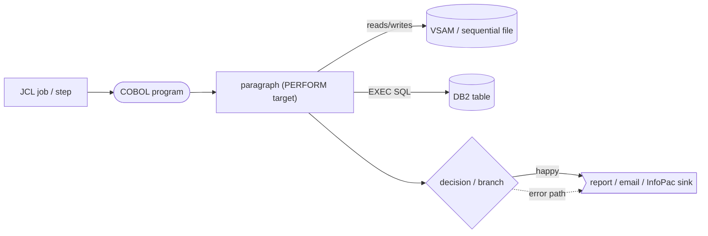

- Rounded `([ ])` = a program load module (PGM=).
- Cylinder `[( )]` = a persisted data store (VSAM dataset, sequential dataset, or DB2 table).
- Diamond `{ }` = a conditional; both branches are always shown.
- Solid edge = happy path / normal flow. Dotted edge = error / abend / soft-fail path.
- Edge labels reference business rules `BR-001-xx` from the BP-001 spec where applicable.

---

## 2. System context

Two independent batch jobs make up BP-001. Both fan out per division, read the divisional VSAM masters and corporate DB2 item tables, and emit reports to Acme's output-distribution channels (JES output classes routed to Page Center / InfoPac, plus an XMITIP email). There is **no MQ or event-queue** interface anywhere in BP-001 — all asynchronous "messaging" is mainframe report distribution (see §6).

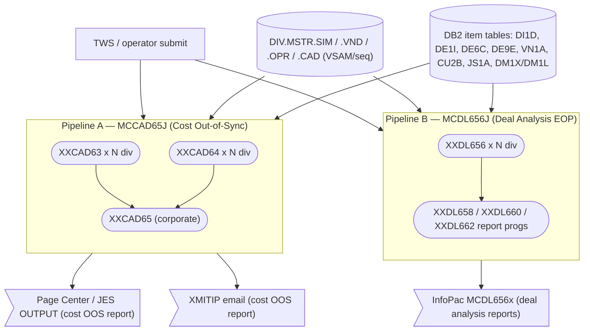

Trigger sources (from BP-001 §1): item-master pushes from upstream merchandising, buyer-driven CICS changes, and the costing pipeline. The two jobs in this report are the **costing/analysis consumers** of the item master; they validate and report on item cost and deal data rather than mutate the masters (both jobs are read-only against the item tables — see §5).

---

## 3. Pipeline A — `MCCAD65J` (Cost Out-of-Sync Report)

**Purpose:** Build the corporate "Cost Discrepancy" / out-of-sync report by comparing the cost picture extracted from the divisional CAD master (`XXCAD63`) against the cost picture computed from the corporate CBR cost-control DB2 tables (`XXCAD64`), per item, across all divisions.

### 3.1 Job-level orchestration (`MCCAD65J`)

The job runs the `XXCAD63P` + `XXCAD64P` proc pair once **per division** (31 divisions: `HP, MD, ME, MI, MK, MN, MO, MP, MS, MW, MY, MZ, NC, NE, PA, NW, SE, SO, SW, SZ, WJ, MG, FE, NT, GM, GA, GF, WK, C1, C2, C3`, set via the `DI2` symbolic). It then merges all divisional extracts into the corporate (`ACME`) datasets, runs the single corporate `XXCAD65` comparison, and conditionally distributes the report.

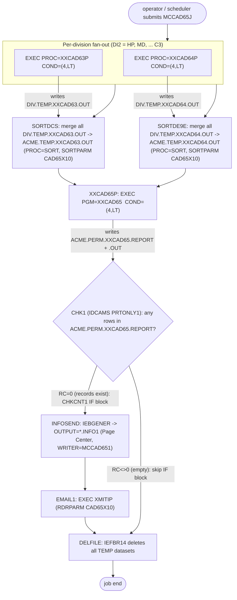

**Orchestration notes**

- Every step carries `COND=(4,LT)`: if any prior step returns > 4, all subsequent steps are bypassed. This is the job-level guard that turns a `RETURN-CODE = 16` abend (BR-001-10) into a hard stop of the pipeline.
- `SETDI2 SET DI2=xx` precedes each division's proc pair; the proc substitutes `&DI2` into every dataset name (`&DI2..MSTR.SIM`, `&DI2..TEMP.XXCAD63.OUT`, etc.).
- The two `SORT` merges concatenate 31 divisional files into one corporate `ACME.TEMP.*` file each, using sort-control member `DS.PERM.SORTPARM(CAD65X10)`.
- The `CHKCNT1 IF CHK1.RC = 0 THEN … ENDCNT1 ENDIF` JES construct gates report distribution on whether the report dataset is non-empty (checked by IDCAMS member `PRTONLY1`).

### 3.2 `XXCAD63` — divisional CAD cost extract

`XXCAD63` (proc `XXCAD63P`) is run per division. The proc first `SORT`s `&DI2..MSTR.CAD` into `&DI2..TEMP.CAD` (sort member `CAD63X10`), then `EXEC PGM=XXCAD63,PARM=&DI2`. The program reads the sorted CAD records grouped by item, derives the current/future cost picture, validates the owning item (SIM) and its vendor (VND), and writes one output record per item.

**File / DD wiring (from `XXCAD63P` + `XXCAD63.cbl` `SELECT`s):**

| Logical file | DD | Dataset | Access | Copybook |
|---|---|---|---|---|
| `XXCAD` | `XXCAD` | `&DI2..TEMP.CAD` (sorted CAD) | input, sequential | `DCSFCAD` |
| `XXSIM` | `XXSIM` | `&DI2..MSTR.SIM` | input, VSAM (KSDS, key `ITKY-RECORD-KEY`) | `DCSFITM` |
| `XXVND` | `XXVND` | `&DI2..MSTR.VND` | input, VSAM (KSDS, key `VNKY-RECORD-KEY`) | `DCSFVND` |
| `XXRDR` | `XXRDR` | `ACME.PERM.RDRPARM(MCCAD631)` | input, switch card | inline `RDR-REC` |
| `XXOUT` | `XXOUT` | `&DI2..TEMP.XXCAD63.OUT` | output, sequential | `XXCAD65C` (tag `DCS`) |

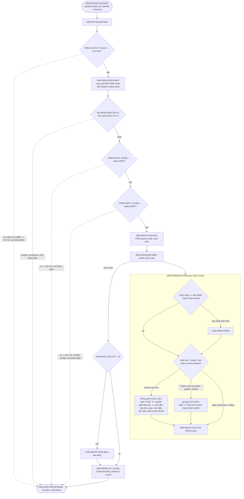

**`4100-WRITE-PARA` → `4300-READ-SIM` → `4400-READ-VND` → `4500-WRITE-OUT` resolution chain** (this is where item/vendor validation gates the write):

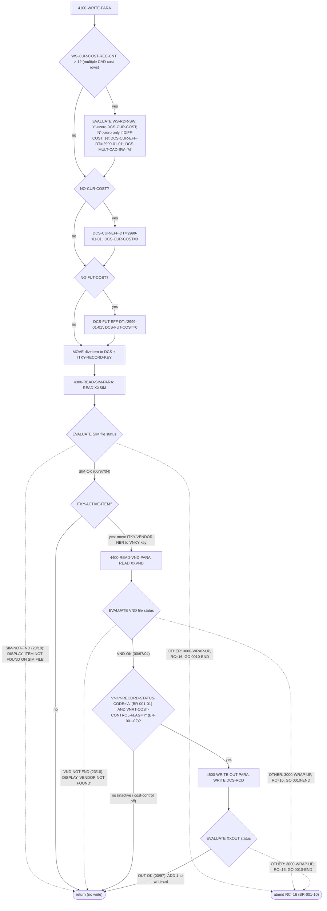

**Rules realized in `XXCAD63`:** BR-001-01 (`VNKY-RECORD-STATUS-CODE='A'`), BR-001-02 (`VNRT-COST-CONTROL-FLAG='Y'`), BR-001-04/05/06 (basis-code mapping in `2000-PROCESS-PARA`), BR-001-10 (file status `23`/`10` → `RETURN-CODE 16`). The CAD-record current/future evaluation feeds `WS-CUR-COST-SW` / `WS-FUT-COST-SW` (BR-001-03).

### 3.3 `XXCAD64` — corporate CBR cost extract (the `XXDE9E` side)

`XXCAD64` (proc `XXCAD64P`, run per division) is a **pure DB2 reader**. It opens one multi-row-fetch cursor `DE9E_CSR` that joins the four cost tables to produce, per catalog item, the current and future "cost basis record" (CBR) cost picture, and writes the sequential extract `&DI2..TEMP.XXCAD64.OUT` (later merged into `ACME.TEMP.XXCAD64.OUT`, read by `XXCAD65` as `XXDE9E`).

**DB2 tables joined by `DE9E_CSR`:** `ACME.DIVMSTRDI1D` (`DGDI1D`), `ACME.DIV_ITEM_PACK_DE1I` (`DGDE1I`), `ACME.VNDR_MSTR_VN1A` (`DGVN1A`), `ACME.ITM_COST_CNTL_DE9E` (`DGDE9E`). Filters: `DE1I.ITEM_STAT_CD IN ('ACT','DIS')`, `VN1A.COST_CNTRL_SW='Y'`, `DE9E.CLS_TYP='ITMCST'`, `DE9E.CLS_ID='BASCOST'`, `DE9E.DELT_SW='N'`, current (`PO_EFF_DT <= CURRENT_DATE`, max) vs future (`> CURRENT_DATE`, min) via the CTEC/CTEF common-table-expressions.

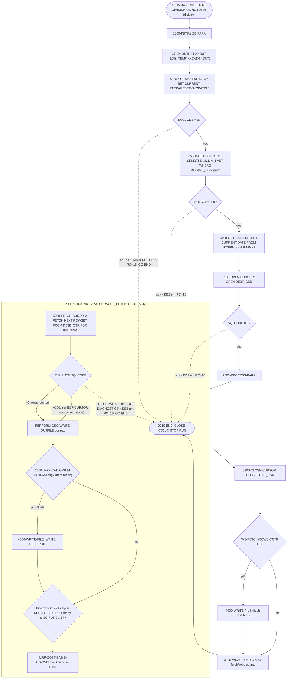

> `XXCAD64` is not named in the BP-001 spec's program table, but it is an inseparable half of `MCCAD65J`: it produces the `XXDE9E` (CBR) side that `XXCAD65` compares against the `XXCAD` (DCS) side. It should be added to the spec's program inventory.

### 3.4 `XXCAD65` — corporate cost-discrepancy comparison

`XXCAD65` (proc `XXCAD65P`) is the single corporate comparison step. It performs a classic **two-file match/merge** between the merged DCS extract (`XXCAD` = `ACME.TEMP.XXCAD63.OUT`) and the merged CBR extract (`XXDE9E` = `ACME.TEMP.XXCAD64.OUT`), both pre-sorted by the job. It also loads an exception-item set from DB2 (`AP1R_CSR`) and is driven by six Y/N switches read from the `XXRDR` card (`MCCAD651`).

**File / DD wiring (`XXCAD65P` + `XXCAD65.cbl`):**

| Logical file | DD | Dataset | Access | Copybook |
|---|---|---|---|---|
| `XXRDR` | `XXRDR` | `ACME.PERM.RDRPARM(MCCAD651)` | input switch card | inline `RDR-REC` |
| `XXCAD` | `XXCAD` | `ACME.TEMP.XXCAD63.OUT` (DCS) | input, sequential | `XXCAD65C` (tag `DCS`) |
| `XXDE9E` | `XXDE9E` | `ACME.TEMP.XXCAD64.OUT` (CBR) | input, sequential | `XXCAD65C` (tag `DE9E`) |
| `XXOUT` | `XXOUT` | `ACME.PERM.XXCAD65.OUT` | output, sequential | `XXCAD66C` (tag `OUT`) |
| `XXRPT` | `XXRPT` | `ACME.PERM.XXCAD65.REPORT` | output, print (133-byte) | inline report lines |
| (DB2) | `SQLBATCH` | `ACME.ITM_COST_CNTL_DE9E` + `AP1R` | `EXEC SQL` | `DGDE9E` |

**`MCCAD651` switch card → working-storage switches** (resolves the BP-001 open question on `WS-AP1R-SW`):

| Card col | WS switch | Meaning | Sample value |
|---|---|---|---|
| 02 | `WS-CUR-EFF-DT-SW` | compare current effective date | `N` |
| 04 | `WS-CUR-COST-SW` | compare current cost | `Y` |
| 06 | `WS-FUT-EFF-DT-SW` | compare future effective date | `Y` |
| 08 | `WS-FUT-COST-SW` | compare future cost | `Y` |
| 10 | `WS-COST-BASIS-SW` | compare cost basis | `N` |
| 12 | `WS-AP1R-SW` | "report switch" — gate AP1R exception-item lines (BR-001-09) | `N` |

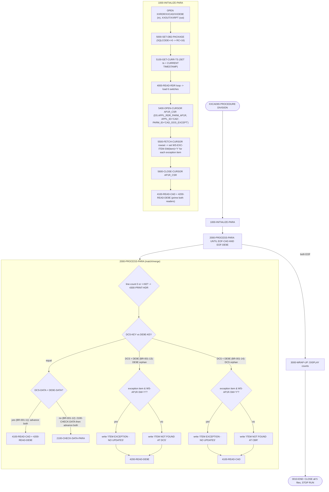

At EOF on either reader, `4100-READ-CAD` / `4200-READ-DE9E` move `HIGH-VALUES` into the key so the surviving file drains as orphans.

**`2100-CHECK-DATA-PARA` — the discrepancy engine** (runs only when keys match but data differs). Each enabled switch drives one comparison; a mismatch either writes the exception soft-fail line (BR-001-09) or a field-specific discrepancy line (BR-001-07/08), then sets `WS-WRITE-SW`:

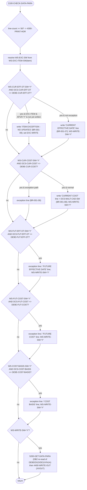

**`5200-GET-DATA-PARA` DB2 access:** joins `ACME.DIVMSTRDI1D`, `ACME.DIV_ITEM_PACK_DE1I`, `ACME.VNDR_MSTR_VN1A`, `ACME.ITM_COST_CNTL_DE9E` filtered to the discrepant item; on `SQLCODE +100` it falls back to `5300-CUR-DATE-PARA` (synthesize current date from `DI1D`); any other non-zero SQLCODE → `7000-MAIN-DB2-ERR` → `RETURN-CODE 16`.

**Pipeline A data sources/sinks summary**

- Sources (per division): `&DI2..MSTR.CAD`, `&DI2..MSTR.SIM` (VSAM), `&DI2..MSTR.VND` (VSAM); DB2 `DI1D`, `DE1I`, `VN1A`, `DE9E`; `DS.APPL_RDR_PARM_AP1R`; reader cards `MCCAD631`, `MCCAD651`.
- Intermediate: `DIV.TEMP.CAD`, `DIV.TEMP.XXCAD63.OUT`, `DIV.TEMP.XXCAD64.OUT` → merged `ACME.TEMP.XXCAD63.OUT`, `ACME.TEMP.XXCAD64.OUT`.
- Sinks: `ACME.PERM.XXCAD65.REPORT` (print) and `ACME.PERM.XXCAD65.OUT` (data) → Page Center (`*.INFO1`, WRITER `MCCAD651`) + XMITIP email. All TEMP datasets deleted by `DELFILE`.

---

## 4. Pipeline B — `MCDL656J` (Deal Analysis End-of-Period Reports)

**Purpose:** Enrich raw deal-transaction data with item, vendor, and buyer attributes per division (`XXDL656`), then sort/aggregate the divisional extracts corporately and print three deal-analysis reports (period / year-to-date / deal-to-date) by buyer-vendor and by vendor (`XXDL658`/`XXDL660`/`XXDL662`), routed to InfoPac.

### 4.1 Job-level orchestration (`MCDL656J`)

```mermaid
flowchart TD
  start(["operator / scheduler submits MCDL656J"])

  subgraph fan ["Per-division fan-out (DI2 = SW, SE, NC, ... C3 — 30 divisions)"]
    direction TB
    p656["EXEC PROC=XXDL656P (XXDL656P.RPRDT -> &DI2..TEMP.&DI2.DL6560)"]
  end

  copy1["COPY1: IEBGENER concat all DIV.TEMP.DIVDL6560 -> OUTPUT=*.MCINFO (InfoPac MCDL6560)"]
  deltemp["DELTEMP: IEFBR14 delete DIV.TEMP.DIVDL6560"]
  br01["IEFBR01: delete ACME.PERM.MCDL6561..6566"]

  subgraph sorts1 ["SORT1/2/3 (sum by vendor)"]
    s1["SORT1: DIV.PERM.DIVDL6561 -> ACME.PERM.MCDL6561"]
    s2["SORT2: ...DL6562 -> MCDL6562"]
    s3["SORT3: ...DL6563 -> MCDL6563"]
  end
  subgraph sorts2 ["SORT4/5/6 (by buyer/vendor)"]
    s4["SORT4 -> MCDL6564"]
    s5["SORT5 -> MCDL6565"]
    s6["SORT6 -> MCDL6566"]
  end

  bv658["BVDL6581: PROC=XXDL658P RDRSRT='BUYER / VENDOR' -> *.MCINFO1"]
  bv660["BVDL6601: PROC=XXDL660P -> *.MCINFO2"]
  bv662["BVDL6621: PROC=XXDL662P -> *.MCINFO3"]
  br02["IEFBR02: delete MCDL6564..6566"]

  subgraph sorts3 ["SORT7/8/9 (by vendor/buyer)"]
    s7["SORT7 -> MCDL6564"]
    s8["SORT8 -> MCDL6565"]
    s9["SORT9 -> MCDL6566"]
  end

  vb658["VBDL6581: PROC=XXDL658P RDRSRT='VENDOR' -> *.MCINFO4"]
  vb660["VBDL6601: PROC=XXDL660P -> *.MCINFO5"]
  vb662["VBDL6621: PROC=XXDL662P -> *.MCINFO6"]
  br03["IEFBR03: delete MCDL6561..6566 and all DIV.PERM.DIVDL656x"]
  done(["job end"])

  start --> fan
  p656 -->|"writes DIV.PERM.DIVDL6561/2/3 + RPRDT report"| copy1
  fan --> copy1
  copy1 --> deltemp --> br01
  br01 --> sorts1 --> sorts2
  sorts2 --> bv658 --> bv660 --> bv662 --> br02 --> sorts3
  sorts3 --> vb658 --> vb660 --> vb662 --> br03 --> done
```

**Orchestration notes**

- `XXDL656P` runs once per division (30 divisions; note `GF` is absent from this job's list, unlike `MCCAD65J`). Each run writes three permanent divisional deal files (`DIV.PERM.DIVDL6561/6562/6563`) plus a divisional report (`RPRDT` → `DIV.TEMP.DIVDL6560`).
- `COPY1` (IEBGENER) concatenates the 30 divisional `DL6560` report extracts to InfoPac writer `MCDL6560` (`OUTPUT=*.MCINFO`).
- The `SORT1..SORT9` steps (PROC=SORT) merge+summarize the divisional `DL6561/2/3` files into the corporate `MCDL6561..6566` files using inline `SORT FIELDS`/`SUM FIELDS` control cards (vendor, then buyer/vendor, then vendor/buyer orderings).
- `XXDL658P`/`XXDL660P`/`XXDL662P` are downstream report formatters (period / YTD / deal-to-date). They are parameterized by an inline `RDRSRT` card (`BUYER / VENDOR` vs `VENDOR`) and an `RDRAMT` threshold card (`050000-`), and route to InfoPac writers `MCINFO1..MCINFO6`. These procs are outside the four anchor programs and are treated as report sinks here (their COBOL bodies, `XXDL658`/`660`/`662`, are not part of the BP-001 anchor source set).
- `IEFBR01/02/03` (IEFBR14 steps) perform staged dataset cleanup.

### 4.2 `XXDL656` — divisional deal enrichment

`XXDL656` (proc `XXDL656P`, `EXEC PGM=XXDL656,PARM=&DI2`) reads deal rows from a DB2 cursor joining the deal extract/analysis tables, enriches each with group name, item description/pack/size, vendor, and buyer name (from DB2 + three VSAM masters), and splits each enriched row across up to three sequential output files based on period/year.

**File / DD wiring (`XXDL656P` + `XXDL656.cbl`):**

| Logical file | DD | Dataset | Access | Copybook |
|---|---|---|---|---|
| `SI-FILE` | `XXSIM` | `&DI2..MSTR.SIM` | input, VSAM (key `ITKY-RECORD-KEY`) | `DCSFITM` |
| `VN-FILE` | `XVEND1` | `&DI2..MSTR.VND` | input, VSAM (key `VNKY-RECORD-KEY`) | `DCSFVND` |
| `YB-FILE` | `XCSXX1` | `&DI2..MSTR.OPR` | input, VSAM (key `OT-KEY`) | `DCSFOPR` |
| `LI-FILE` | `DL6563` | `&DI2..PERM.&DI2.DL6563` | output, sequential | `XXDL670C` (tag `LI00`) |
| `PE-FILE` | `DL6561` | `&DI2..PERM.&DI2.DL6561` | output, sequential | `XXDL670C` (tag `PE00`) |
| `YR-FILE` | `DL6562` | `&DI2..PERM.&DI2.DL6562` | output, sequential | `XXDL670C` (tag `YR00`) |
| `RP-FILE` | `RPRDT` | `&DI2..TEMP.&DI2.DL6560` | output, print report | inline `RP00-REC` |
| (DB2) | `SQLBATCH` | see SQL targets below | `EXEC SQL` | `DGJS1A`,`DGCU2B`,`DGDE1I`,`DGDE6C`,`DGDM1X`,`DGDI1D`,`DGDM1L` |

**DB2 access by paragraph:**

| Paragraph | SQL | Table(s) |
|---|---|---|
| `5000-SET-DB2-PACKAGE` | `SET CURRENT PACKAGESET='DIVBATCH'` | — |
| `5025-GET-DIV-PART` | `SELECT DIV_PART, USER_DIV_NAME` | `ACME.DIVMSTRDI1D` (`DGDI1D`) |
| `5050-GET-CURR-TIMSTMP` | `SELECT CURRENT TIMESTAMP` | `SYSIBM.SYSDUMMY1` |
| `5075-GET-ACME-PRD` | `SELECT MCLANE_YR, MCLANE_PRD WHERE DT=CURRENT DATE-5 DAYS` | `ACME.DT_JS1A` (`DGJS1A`) |
| `5100/5200/5300 DM00-CUR1` | `OPEN/FETCH 100 ROWS/CLOSE` cursor | `DEALDM1X` (`DGDM1X`) ⋈ `DEAL_ANALYSIS_DM1L` (`DGDM1L`) |
| `5400-GET-GRP` | `SELECT DESC WHERE CLS_TYP='GRPCDE'` | `ACME.CLS_GRP_DESC_CU2B` (`DGCU2B`) |
| `5500-GET-ITM-DATA` | `SELECT ITEM_PCK/SIZE/DESC, OLD_PRIM_VNDR_ID` | `ACME.DIV_ITEM_PACK_DE1I` (`DGDE1I`) ⋈ `ACME.UIN_ITEM_DE6C` (`DGDE6C`) |

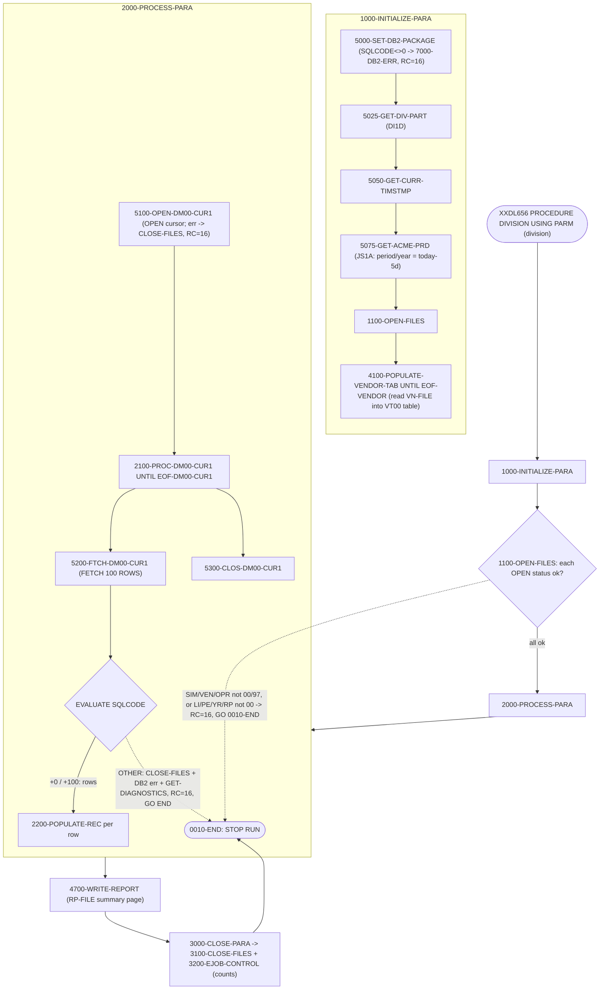

**`2200-POPULATE-REC` — per-row enrichment and routing** (the data-resolution core):

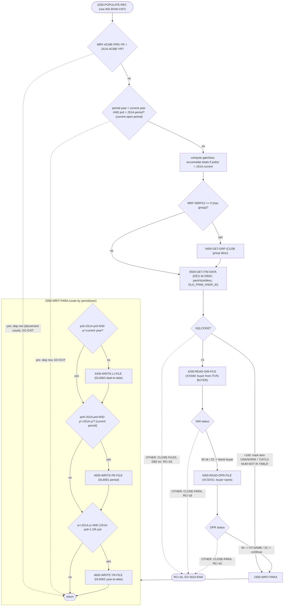

Each of `4400/4500/4600-WRITE-*-FILE` checks its file status after `WRITE`; any non-`00` → DISPLAY error, `3000-CLOSE-PARA`, `RETURN-CODE 16`, `GO 0010-END-PROCESSING` (the BR-001-10 abend convention applied to the sequential outputs).

**Pipeline B data sources/sinks summary**

- Sources (per division): `&DI2..MSTR.SIM`, `&DI2..MSTR.VND`, `&DI2..MSTR.OPR` (VSAM); DB2 `DI1D`, `JS1A`, `DM1X`/`DM1L`, `CU2B`, `DE1I`, `DE6C`.
- Per-division sinks: `&DI2..PERM.&DI2.DL6561/6562/6563` (data) + `&DI2..TEMP.&DI2.DL6560` (report).
- Corporate: `ACME.PERM.MCDL6561..6566` (sort outputs, transient).
- Final report sinks: InfoPac writers `MCDL6560` (raw divisional reports) and `MCINFO1..MCINFO6` (six formatted deal-analysis reports via `XXDL658/660/662`).

---

## 5. Data dictionary and external-interface inventory

### 5.1 VSAM / sequential datasets

| Dataset (pattern) | Org | Used by (DD) | Direction | Notes |
|---|---|---|---|---|
| `DIV.MSTR.CAD` | seq | `XXCAD63P` SORTIN | in | sorted to `DIV.TEMP.CAD` via `CAD63X10` |
| `DIV.MSTR.SIM` | VSAM KSDS | `XXCAD63`/`XXDL656` `XXSIM` | in | item master, key `ITKY-RECORD-KEY` |
| `DIV.MSTR.VND` | VSAM KSDS | `XXCAD63` `XXVND`, `XXDL656` `XVEND1` | in | vendor master, key `VNKY-RECORD-KEY` |
| `DIV.MSTR.OPR` | VSAM KSDS | `XXDL656` `XCSXX1` | in | operator/buyer master, key `OT-KEY` |
| `DIV.TEMP.CAD` | seq | `XXCAD63` `XXCAD` | in/out | sorted CAD input to XXCAD63 |
| `DIV.TEMP.XXCAD63.OUT` | seq | `XXCAD63` `XXOUT` | out | DCS extract → merged `ACME.TEMP.XXCAD63.OUT` |
| `DIV.TEMP.XXCAD64.OUT` | seq | `XXCAD64` `XXOUT` | out | CBR extract → merged `ACME.TEMP.XXCAD64.OUT` |
| `ACME.TEMP.XXCAD63.OUT` | seq | `XXCAD65` `XXCAD` | in | merged DCS side |
| `ACME.TEMP.XXCAD64.OUT` | seq | `XXCAD65` `XXDE9E` | in | merged CBR side |
| `ACME.PERM.XXCAD65.REPORT` | seq print | `XXCAD65` `XXRPT` | out | cost discrepancy report → Page Center/email |
| `ACME.PERM.XXCAD65.OUT` | seq | `XXCAD65` `XXOUT` | out | discrepancy data records |
| `DIV.PERM.DIVDL6561/2/3` | seq FB | `XXDL656` `DL6561/2/3` | out | period/YTD-by-year/deal-to-date deal rows |
| `DIV.TEMP.DIVDL6560` | seq print | `XXDL656` `RPRDT` | out | divisional deal report → InfoPac `MCDL6560` |
| `ACME.PERM.MCDL6561..6566` | seq FB | `MCDL656J` SORT*/report procs | in/out | corporate sort/aggregation outputs |

### 5.2 DB2 tables (all access is read-only `SELECT`/cursor `FETCH`)

| Table | DCLGEN | Read by | Purpose in BP-001 |
|---|---|---|---|
| `ACME.DIVMSTRDI1D` | `DGDI1D` | XXCAD64, XXCAD65, XXDL656 | division ↔ DIV_PART/MCLANE_DIV resolution |
| `ACME.DIV_ITEM_PACK_DE1I` | `DGDE1I` | XXCAD64, XXCAD65, XXDL656 | div item pack, item status, primary vendor |
| `ACME.UIN_ITEM_DE6C` | `DGDE6C` | XXDL656 | item desc / pack / size |
| `ACME.ITM_COST_CNTL_DE9E` | `DGDE9E` | XXCAD64, XXCAD65 | CBR cost (current/future) |
| `ACME.VNDR_MSTR_VN1A` | `DGVN1A` | XXCAD64, XXCAD65 | vendor cost-control filter |
| `ACME.CLS_GRP_DESC_CU2B` | `DGCU2B` | XXDL656 | group description |
| `ACME.DT_JS1A` | `DGJS1A` | XXDL656 | date → Acme period/year |
| `DEALDM1X` ⋈ `DEAL_ANALYSIS_DM1L` | `DGDM1X` / `DGDM1L` | XXDL656 | deal transactions + analysis amounts |
| `DS.APPL_RDR_PARM_AP1R` | (inline) | XXCAD65 | OOS exception-item list (`PARM_ID='CAD_OOS_EXCEPT'`) |
| `SYSIBM.SYSDUMMY1` | — | XXCAD64, XXCAD65, XXDL656 | current date/timestamp |

> Note: `ACME.ITEM_VNDR_DE6V` (`DGDE6V`) and `ACME.ITEM_UPC_DE6Y` (`DGDE6Y`) — both prominent in the BP-001 spec — are **not** referenced by any of the four anchor programs. They belong to the wider item-master process (see blast radius §6), not to these two cost/deal pipelines. (`DE6V` was historically in `XXCAD64`/`XXCAD65`'s cursors but was removed per the `RS0227` maintenance entries.)

### 5.3 Record-layout copybooks

| Copybook | Describes | Used by |
|---|---|---|
| `DCSFCAD` | CAD cost/deal record | XXCAD63 (`XXCAD`) |
| `DCSFITM` | SIM item record (`ITKY-*`) | XXCAD63, XXDL656 (`XXSIM`) |
| `DCSFVND` | VND vendor record (`VNKY-*`, `VNRT-*`) | XXCAD63, XXDL656 (`XXVND`/`XVEND1`) |
| `DCSFOPR` | OPR operator/buyer record (`OT-*`) | XXDL656 (`XCSXX1`) |
| `XXCAD65C` | DCS/DE9E cost record (tag-replaced `DCS`/`DE9E`) | XXCAD63, XXCAD64, XXCAD65 |
| `XXCAD66C` | XXCAD65 OUT record (tag `OUT`) | XXCAD65 (`XXOUT`) |
| `XXDL670C` | deal output record (tags `LI00`/`PE00`/`YR00`/`WS00`) | XXDL656 |
| `DBDB2ERL`,`DB2ERRW2`,`DB2GDW1` | DB2 error/diagnostics linkage (WS) | XXCAD64, XXCAD65, XXDL656 |
| `DB2ERRP2`,`DB2GDP1` | DB2 error/diagnostics procedures (calls `DBDB2ER`) | XXCAD64, XXCAD65, XXDL656 |
| `SQLCA` | SQL communication area | all DB2 programs |

### 5.4 Control / parameter members

| Member | Type | Consumed by | Effect |
|---|---|---|---|
| `ACME.PERM.RDRPARM(MCCAD631)` | switch card | XXCAD63 (`XXRDR`) | col 2 = current-cost switch (`N` default): controls zeroing of `DCS-CUR-COST` when multiple CAD rows |
| `ACME.PERM.RDRPARM(MCCAD651)` | switch card | XXCAD65 (`XXRDR`) | 6 Y/N switches (cur-eff-dt, cur-cost, fut-eff-dt, fut-cost, cost-basis, AP1R report) — see §3.4 |
| `DS.PERM.SORTPARM(CAD63X10)` | sort ctl | `XXCAD63P` SORTCAD | sort `DIV.MSTR.CAD` |
| `DS.PERM.SORTPARM(CAD65X10)` | sort ctl | `MCCAD65J` SORTDCS/SORTDE9E | merge divisional extracts |
| `DS.PERM.RDRPARM(PRTONLY1)` | IDCAMS ctl | `MCCAD65J` CHK1 | report empty-check (sets `CHK1.RC`) |
| `DS.PERM.RDRPARM(CAD65X10)` | XMITIP ctl | `MCCAD65J` EMAIL1 | email recipients/subject for OOS report |
| `DS.PERM.SQLBATCH(SQLINFO)` | DB2 bind ctl | XXCAD64/65, XXDL656 | DB2 batch attach |

### 5.5 External interfaces — there is no message/event queue

BP-001 has **no MQ, Kafka, or event-queue** integration. All "asynchronous" output is mainframe report distribution:

| Interface | Mechanism | Source step |
|---|---|---|
| Page Center | JES `OUTPUT CLASS=3, WRITER=MCCAD651`, fed by IEBGENER (`SYSUT2 DD SYSOUT=(,),OUTPUT=*.INFO1`) | `MCCAD65J` INFOSEND |
| Email | `EXEC XMITIP` with control member `CAD65X10` | `MCCAD65J` EMAIL1 |
| InfoPac (deal reports) | JES `OUTPUT CLASS=3, WRITER=MCDL6560..6566`, fed by IEBGENER + report procs | `MCDL656J` COPY1, BVDL658x/660x/662x, VBDL658x/660x/662x |

Inbound triggers (item-master pushes, CICS buyer changes, costing pipeline) arrive as **populated VSAM masters and DB2 tables**, which these jobs then read — i.e., the integration contract is the shared dataset/table, not a queue.

---

## 6. Reverse blast-radius maps (shared item tables)

The forward graph above touches only a handful of item tables. The modernization risk, however, lives in the **fan-in**: how many of the 311 COBOL programs under `sclm.perm.prod.source/` reference each shared item table. Counts below are computed by source reference (`rg -l '<TABLE>' --glob '*.cbl'`) and corroborate the BP-001 spec's blast-radius figures.

| Table | DCLGEN | Programs referencing | Spec figure |
|---|---|---|---|
| `ACME.DIVMSTRDI1D` | `DGDI1D` | **138** | 124 |
| `ACME.UIN_ITEM_DE6C` | `DGDE6C` | **72** | 64 |
| `ACME.DIV_ITEM_PACK_DE1I` | `DGDE1I` | **69** | 62 |
| `ACME.ITEM_VNDR_DE6V` | `DGDE6V` | **43** | 35 |
| `ACME.ITEM_UPC_DE6Y` | `DGDE6Y` | **38** | 30 |
| `ACME.ITEM_MASTER_IM3I` | (none found) | **0** | (suppression cluster) |

> The slightly higher counts vs. the spec are expected: a raw source-text reference counts both `EXEC SQL` users and copybook/DCLGEN includes, whereas the spec's figures appear to count distinct binding programs. The relative ordering is identical.

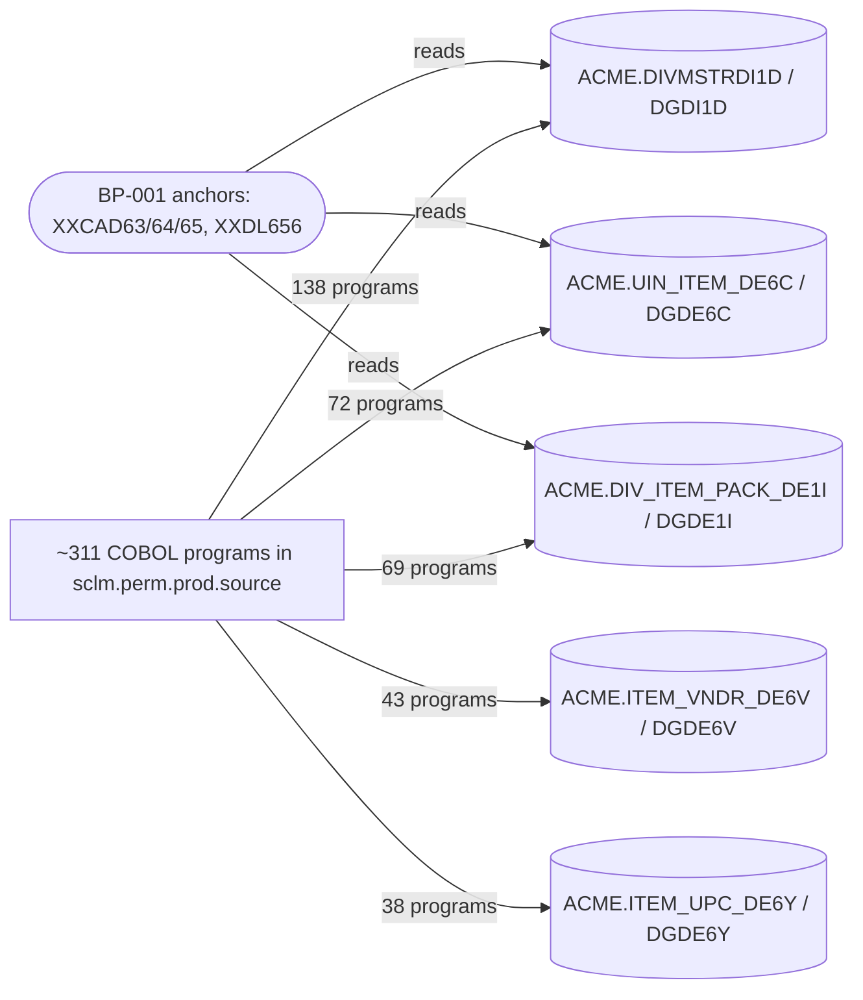

Representative referencing programs (first 10 alphabetically per table; full set via `rg -l`):

- **`ACME.DIVMSTRDI1D`** (138): `D2101, D2118, D2128, D8050, DSDEI60, DSDEI61, M901401, M9091, MCBSM01, MCBSM02, …`
- **`ACME.UIN_ITEM_DE6C`** (72): `D2118, D2128, D2189, D8050, DSCST96, M9091, MCCAD02, MCCAD11, MCCAD20, MCCAD21, …`
- **`ACME.DIV_ITEM_PACK_DE1I`** (69): `D2101, D2118, D2128, D8050, DSCST96, DSDEI60, M901401, M9091, MCBSM06, MCCAD02, …`
- **`ACME.ITEM_VNDR_DE6V`** (43): `D8050, DSCST96, MCBSM06, MCCAD10, MCCAD11, MCCIC90, MCCST03, MCCST04, MCCST05, MCCST06, …`
- **`ACME.ITEM_UPC_DE6Y`** (38): `D8050, MCCAD11, MCCAD21, MCCBT02, MCCBT07, MCCIC20, MCCST03, MCCST06, MCCST10, MCCST11, …`

**Modernization implication (carry-forward from BP-001 §8):** any DAL change to `DI1D`/`DE6C`/`DE1I` touches a large fraction of the platform. Introduce a read facade (and a separate write facade) over these five tables *before* refactoring any individual consumer, and cut over per division (the `DIV.MSTR.*` masters are per-division, so a single division — e.g. `WJ` or `FE` — can be validated in isolation).

---

## 7. End-to-end resolution summary

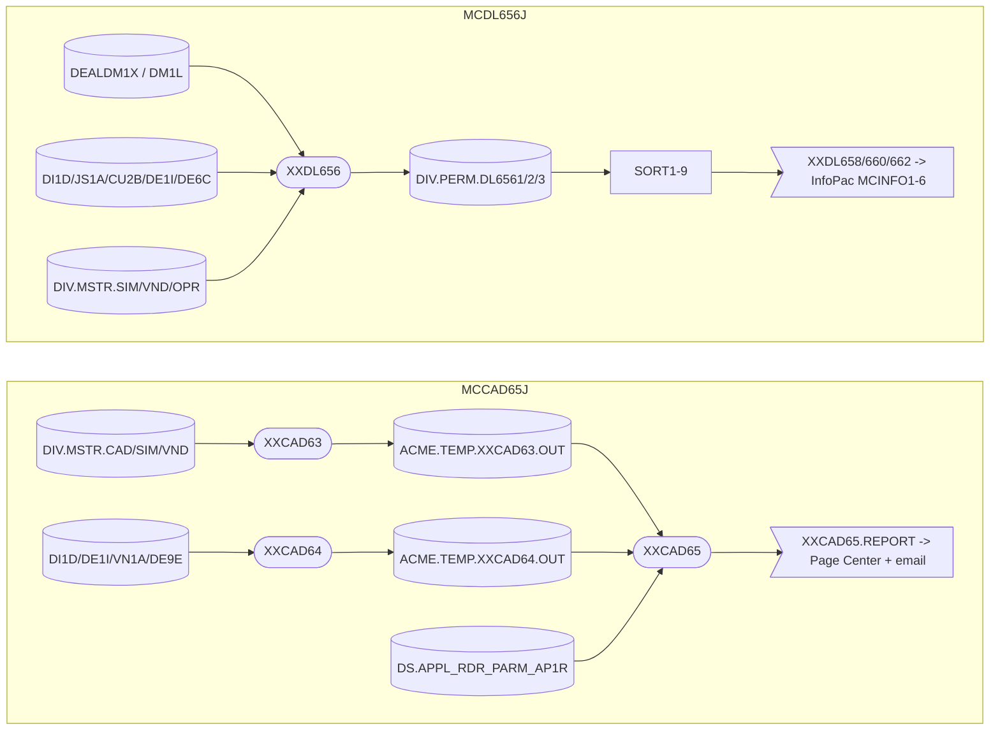

Both pipelines resolve **from a per-division entrypoint, through VSAM + DB2 reads, to mainframe report sinks**, with `RETURN-CODE 16` as the universal hard-fail (BR-001-10) and `COND=(4,LT)` as the job-level propagation guard.

---

## 8. Assumptions, gaps, and open questions

Resolved during this analysis:

- **`WS-AP1R-SW` source (BP-001 §7 open question):** supplied by reader card `ACME.PERM.RDRPARM(MCCAD651)` **column 12** ("REPORT SWITCH"); it gates whether AP1R exception items (loaded by `AP1R_CSR` from `DS.APPL_RDR_PARM_AP1R`, `PARM_ID='CAD_OOS_EXCEPT'`) produce the `"ITEM EXCEPTION - NO UPDATES"` soft-fail line (BR-001-09). Sample production value is `N` (off).
- **`XXCAD64` role (RAG question on the XXCAD65 chain):** `XXCAD65` is reached only via `MCCAD65J`, and its `XXDE9E` input is produced by `XXCAD64` (proc `XXCAD64P`), which is invoked per division alongside `XXCAD63` in the same job. `XXCAD64` should be added to the BP-001 program inventory.
- **Discrepancy soft vs hard fail (BR-001-07/08):** confirmed soft — all comparison mismatches in `2100-CHECK-DATA-PARA` write a report line and continue; only file/SQL failures escalate to `RETURN-CODE 16`.

Still open / carried forward:

- `[GAP]` **`ACME.ITEM_MASTER_IM3I`** is referenced in the BP-001 spec but appears in **no** source member under `docs/legacy/src` (no `IM3I`/`ITEM_MASTER` text). Either the table name/DCLGEN differs in production, or it is touched only by programs outside this export. Needs confirmation before it can be placed in any graph.
- `[SME]` `DIV.MSTR.SIM` record layout — is `DCSFITM` identical across all 30–32 divisions, or do divisions differ? The programs assume a single shared layout.
- `[SME]` `ACME.ITEM_VNDR_DE6V` and `ACME.ITEM_UPC_DE6Y`: prominent in the spec but unused by these two pipelines (DE6V was removed from `XXCAD64`/`65` per `RS0227`). Identify which BP-001 sub-process actually writes them (likely the CIC/UPC programs surfaced in §6, e.g. `MCCIC20`, `MCCAD11`).
- `[CODMOD]` Full enumeration of every program that **writes** `ACME.ITEM_*` (the §6 counts include readers). A write-only fan-in requires parsing `UPDATE`/`INSERT`/`DELETE` statements, not bare references.
- `[RAG]` Report formatter bodies `XXDL658`/`XXDL660`/`XXDL662` are invoked by `MCDL656J` but their COBOL is outside the BP-001 anchor set; their internal logic is treated here as a report sink.

---

## 9. Source index

| Artifact | Path |
|---|---|
| Job `MCCAD65J` | `docs/legacy/src/acme.perm.jcl/MCCAD65J.jcl` |
| Job `MCDL656J` | `docs/legacy/src/acme.perm.jcl/MCDL656J.jcl` |
| Procs | `docs/legacy/src/ds.perm.proclib/{XXCAD63P,XXCAD64P,XXCAD65P,XXDL656P,XXDL658P,XXDL660P,XXDL662P}.jcl` |
| Programs | `docs/legacy/src/sclm.perm.prod.source/{XXCAD63,XXCAD64,XXCAD65,XXDL656}.cbl` |
| DCLGENs | `docs/legacy/src/DB2P.PERM.DCLGEN/{DGDI1D,DGDE1I,DGDE6C,DGDE6V,DGDE6Y,DGDE9E,DGVN1A,DGCU2B,DGJS1A,DGDM1X,DGDM1L}.cpy` |
| Reader cards | `docs/legacy/src/acme.perm.rdrparm/{MCCAD631,MCCAD651}.txt` |
