# BP-001 — Item Master Data Management: Business-Process Graph

**Status:** Draft — structured-BPMN process graph derived from the extracted business logic.
**Conforms to:** [process-graph-meta-model.md](../../../../../reference/process-graph-meta-model.md) (the canonical meta-model: element vocabulary, purity axioms, rule→element taxonomy, and the FSM-projection definition).
**Companion to:** [BP-001 business logic](BP-001-item-master-data-management-business-logic.md), [BP-001 call graph](BP-001-item-master-data-management-call-graph.md), and [BP-001 overview](../BP-001-item-master-data-management.md).
**Scope:** The two BP-001 processes — Process A (Cost Out-of-Sync, `MCCAD65J`) and Process B (Deal-Analysis End-of-Period, `MCDL656J`) — re-expressed as pure BPMN processes with a derived finite-state-machine projection.

---

## 1. Meta-model (reference)

This graph is a faithful re-projection of the companion business-logic rules (`BL-001-NN`) into the **structured BPMN** meta-model defined in [process-graph-meta-model.md](../../../../../reference/process-graph-meta-model.md). That reference is authoritative; only a working summary is repeated here.

- **Governing axiom (separation).** Work and routing are disjoint: Activities never branch, Gateways never do work, and a branch condition lives on the sequence flow leaving a gateway.
- **Execution semantics.** The token (Petri-net) game of §2 of the meta-model; the model is sound and block-structured, which is what makes the §-FSM projection well-defined.
- **Element legend (Mermaid rendering, per meta-model §3.4):**

| Element | Shape | Meaning |
|---|---|---|
| Event | `(( ))` circle | Start / End / Intermediate milestone; Error End is red |
| Task | `[ ]` rectangle | a unit of work (`Script` / `Service` / `Business Rule` / `Send`) |
| Gateway | `{ }` rhombus | routing only (`XOR` / `IOR` / `AND`); condition on outgoing flows |
| Sub-Process | `[[ ]]` | iteration (`Loop` / `Multi-Instance`), e.g. control breaks and merges |
| Data | `[( )]` cylinder | Data Object (transient) / Data Store (persistent); carries a typed id (`DSN:`/`DB2:`/`REC:`/`WS:`) or `[derived]`/`[sink]` per meta-model §3.3.1 |
| External participant | `{{ }}` hexagon | an external system/integration endpoint (`MQ:`/`API:`/`HOOK:`/`MAIL:`/`RPT:`/`FT:`), reached only by Message Flow (dotted `msg ▷ out / ◁ in`), per meta-model §3.5 |

- **Coverage rule.** Every `BL-001-NN` maps to **exactly one** flow node (see the conformance tables in §2.7 and §3.4).
- **FSM.** Each process carries a derived Mealy projection (§2.8, §3.5) per meta-model §7.

A single self-contained Mermaid source for Process A is also kept in the `diagrams/` subfolder at `diagrams/BP-001-A-process-graph.mmd`.

---

## 2. Process A — Cost Out-of-Sync (`MCCAD65J`)

Three stages: the divisional cost extract (`XXCAD63`, `BL-001-01..11`) and the corporate cost-basis extract (`XXCAD64`, `BL-001-12..16`) build independent per-item cost pictures; the comparison stage (`XXCAD65`, `BL-001-17..23`) merges them and gates report distribution. The two extracts share no data and are modelled as a concurrent `AND` block (the legacy sequential job-step order is an implementation choice).

### 2.1 Orchestration

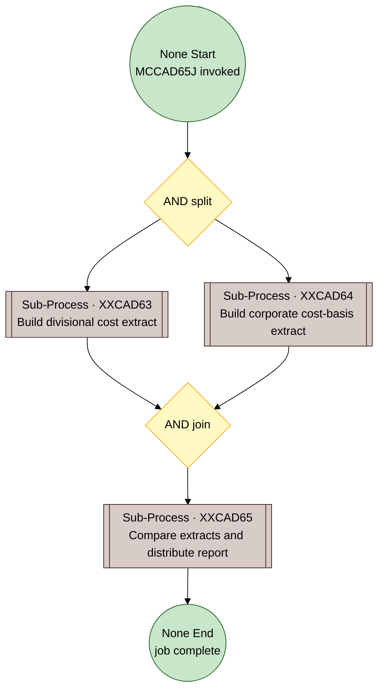

### 2.2 Stage 1 — Divisional cost extract (`XXCAD63`, BL-001-01..11)

Reader-switch validation (01) runs once at entry; the per-item logic is a Multi-Instance sub-process whose instance boundary *is* the control break (02). Per-row classification is a Loop sub-process expanded in §2.3.

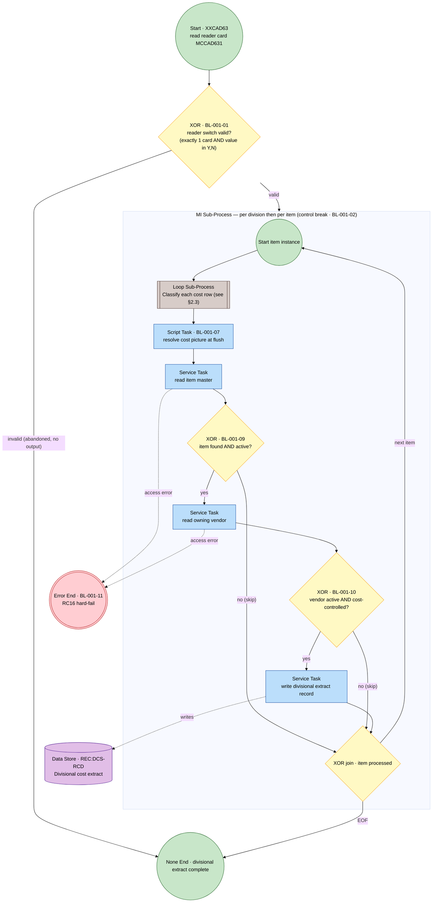

### 2.3 Stage 1 — row-classification loop body (BL-001-03/04/05/06/08)

A classification rule that branches *and* seeds is a Gateway (the test) whose true branch carries its transform Tasks; the sub-transforms (04, 05, 08) keep their own nodes. BL-001-08 appears at both date seeds.

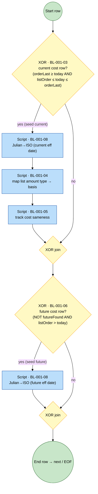

### 2.4 Stage 2 — Corporate cost-basis extract (`XXCAD64`, BL-001-12..16)

Control break (14) is the MI instance boundary (per catalog item). Eligibility (12) filters rows; selection (13), mapping (15), defaulting (16) are Tasks.

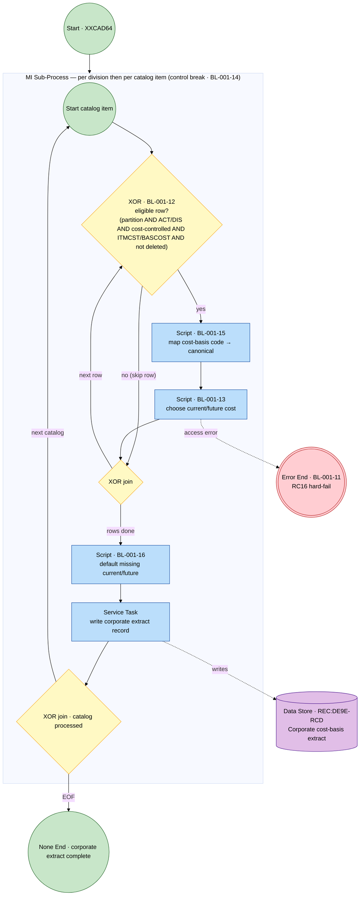

### 2.5 Stage 3 — Comparison and report orchestration (`XXCAD65`, BL-001-17..23)

Exception-set load (17) at entry; merge as a Loop sub-process (18, expanded in §2.6); report gate (23) with a single purge on both branches (23 purges regardless).

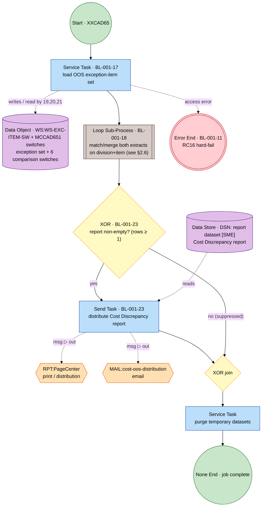

The report distribution is an external integration (§3.5 of the meta-model): `RPT:PageCenter` and `MAIL:cost-oos-distribution` are external participants reached by Message Flow (out, fire-and-forget, at-least-once); the report dataset itself remains data-at-rest. Confirm the report DD name `[SME]`.

### 2.6 Stage 3 — merge loop body (BL-001-18/19/20/21/22)

`g18a` is a 3-way exclusive gateway (`=`, `>`, `<` — mutually exclusive and exhaustive). The exception soft-line task (21) is shared by orphan and discrepancy paths.

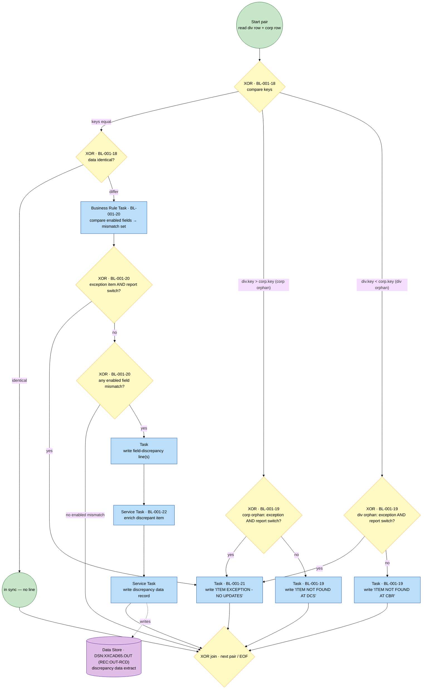

The hard-fail convention (BL-001-11) wraps every Service Task here per §4 / meta-model §6.4.

### 2.7 Process A — rule → element conformance

| BL-001 | Title | Logic type | BPMN element | Where |
|---|---|---|---|---|
| 01 | Validate reader switch | validation | XOR Gateway (+ None End "abandoned") | §2.2 |
| 02 | Group cost rows by item | control break | MI Sub-Process boundary (per item) | §2.2 |
| 03 | Recognise current cost row | classification | XOR Gateway (test) + seed branch | §2.3 |
| 04 | Map amount type → basis | transformation | Script Task | §2.3 |
| 05 | Track cost sameness | classification | Script Task | §2.3 |
| 06 | Recognise future cost row | classification | XOR Gateway (test) + seed branch | §2.3 |
| 07 | Resolve cost picture at flush | transformation | Script Task | §2.2 |
| 08 | Julian → calendar | transformation | Script Task (2 placements) | §2.3 |
| 09 | Require active item | validation | XOR Gateway | §2.2 |
| 10 | Require active cost-controlled vendor | validation | XOR Gateway | §2.2 |
| 11 | Hard-fail on file errors | error handling | Error Boundary → Error End | §4 / all stages |
| 12 | Select eligible cost-basis rows | selection | XOR Gateway (filter) | §2.4 |
| 13 | Choose current/future cost | selection | Script Task | §2.4 |
| 14 | Assemble record per item | control break | MI Sub-Process boundary (per catalog) | §2.4 |
| 15 | Map cost-basis code → canonical | transformation | Script Task | §2.4 |
| 16 | Default missing current/future | transformation | Script Task | §2.4 |
| 17 | Load OOS exception set | data load | Service Task | §2.5 |
| 18 | Match/merge extracts | matching/merge | Loop Sub-Process + 2 XOR Gateways | §2.6 |
| 19 | Report orphan item | reporting | 2 XOR Gateways + 2 Tasks | §2.6 |
| 20 | Compare enabled fields | validation | Business Rule Task + 2 XOR Gateways | §2.6 |
| 21 | Emit exception soft line | control | Task (shared) | §2.6 |
| 22 | Enrich discrepant item | enrichment | Service Task | §2.6 |
| 23 | Gate report distribution | control | XOR Gateway + Send Task → `RPT:PageCenter` / `MAIL:` (Message Flow) + purge | §2.5 |

### 2.8 Process A — derived FSM projection (Mealy)

**Orchestration** — anchors {`START`, `EXTRACTS_READY`, `MERGE_COMPLETE`, `END`}:

```
START          --[valid switch]  / { run XXCAD63 ∥ XXCAD64 } --> EXTRACTS_READY
START          --[invalid switch]/ { }                        --> END   (abandoned, no output)
EXTRACTS_READY --[true]          / { 17, merge-loop }         --> MERGE_COMPLETE
MERGE_COMPLETE --[rows ≥ 1]      / { 23:distribute, purge }   --> END
MERGE_COMPLETE --[rows = 0]      / { purge }                  --> END
```
`∥` is the AND region; expand to the Petri reachability product (meta-model §7.1) for interleavings.

**Per merge pair** — states {`PAIR_READ`, `PAIR_DONE`} (`PAIR_DONE` loops to `PAIR_READ` until EOF → `MERGE_COMPLETE`):

```
PAIR_READ --[keysEq ∧ identical]                                  / { }                       --> PAIR_DONE
PAIR_READ --[keysEq ∧ ¬identical ∧ exc ∧ sw]                      / {20, 21}                  --> PAIR_DONE
PAIR_READ --[keysEq ∧ ¬identical ∧ ¬(exc∧sw) ∧ ¬mismatch]         / {20}                      --> PAIR_DONE
PAIR_READ --[keysEq ∧ ¬identical ∧ ¬(exc∧sw) ∧ mismatch]          / {20, fieldLine, 22}       --> PAIR_DONE
PAIR_READ --[¬keysEq ∧ exc ∧ sw]                                  / {21}                      --> PAIR_DONE
PAIR_READ --[¬keysEq ∧ ¬(exc∧sw)]                                 / {19}                      --> PAIR_DONE
```
Guards are mutually exclusive and exhaustive (deterministic Mealy); effects are the `BL-001` ids fired.

---

## 3. Process B — Deal-Analysis End-of-Period (`MCDL656J`)

Two stages: divisional enrichment (`XXDL656`, `BL-001-24..36`) filters and enriches settled deals and routes each into the period / year-to-date / deal-to-date streams; corporate aggregation/reporting (`MCDL656J` + `XXDL658/660/662`, `BL-001-37..39`) sums across divisions and prints loss reports.

### 3.1 Orchestration

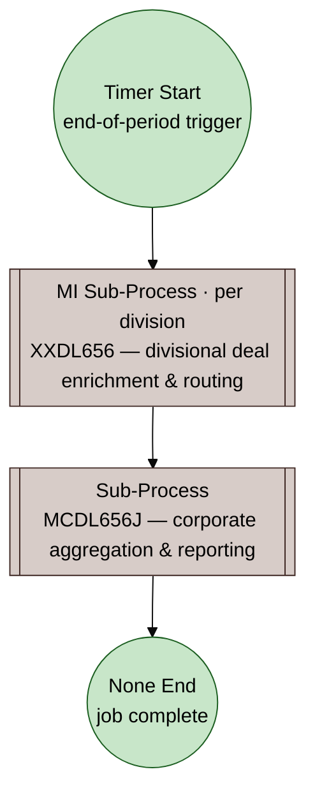

### 3.2 Stage 1 — Divisional deal enrichment (`XXDL656`, BL-001-24..36)

Initialization (24, 25) once per division; per-deal-row filters (26/27/28), gain/loss (29), enrichment (31/32/33), and routing (34, expanded in §3.3). The control break is the per-row loop boundary.

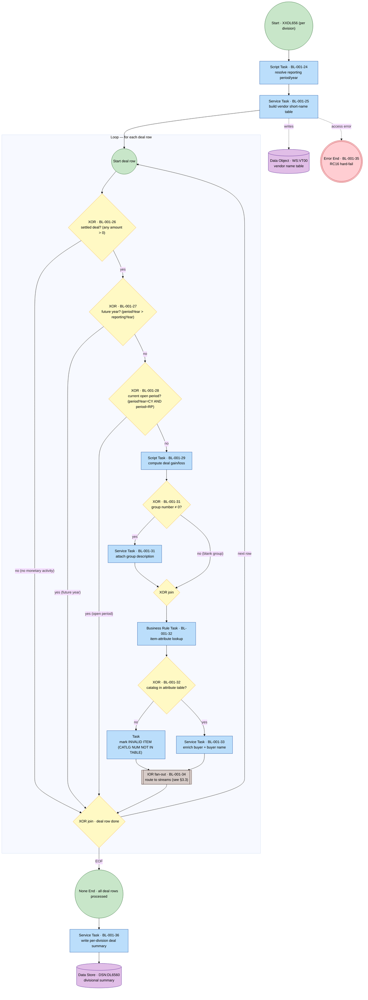

### 3.3 Stage 1 — routing fan-out (BL-001-34, with BL-001-30)

The three stream tests are independent — a deal can land in 1–3 streams — so they are one Inclusive (`IOR`) split/join, not a serial chain. Period-total accumulation (30) is the data effect of the period write.

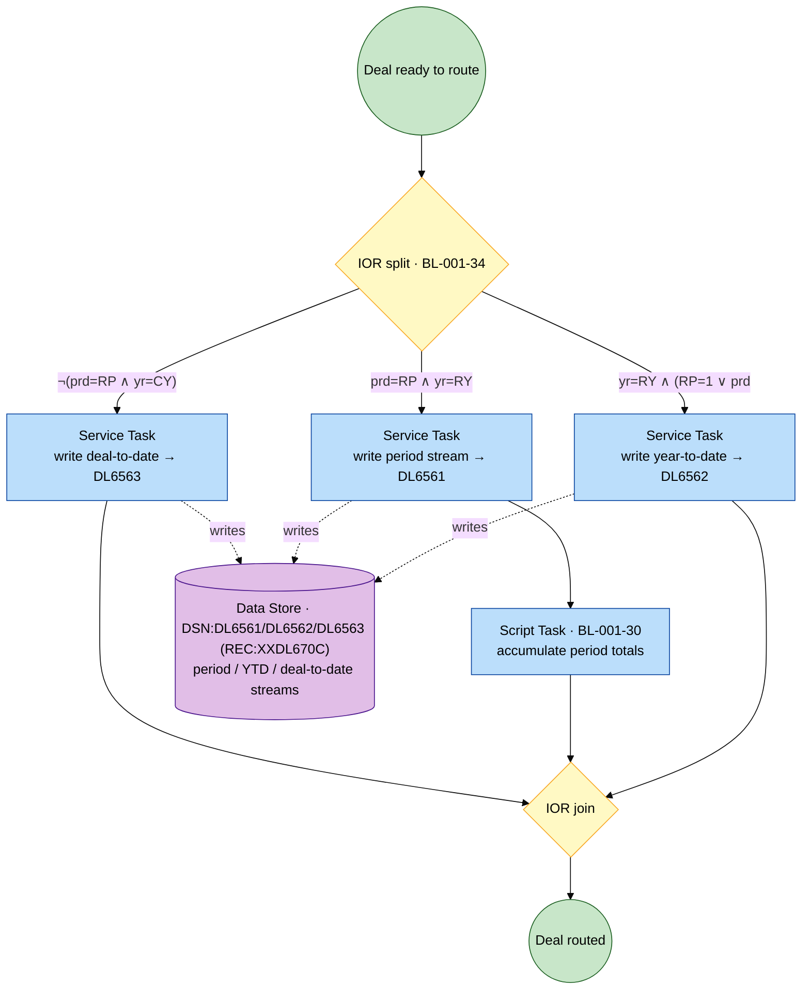

### 3.4 Stage 2 — Corporate aggregation and reporting (`MCDL656J`, BL-001-37..39)

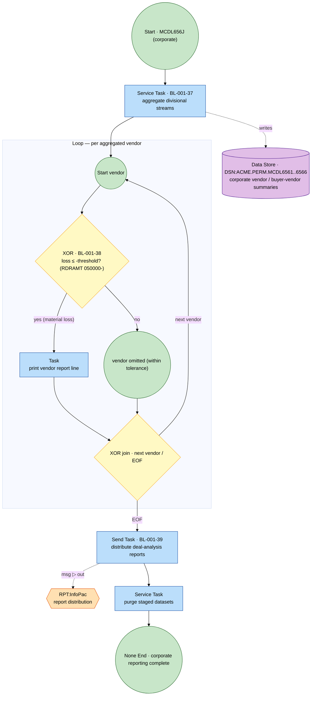

Per meta-model §3.5, `RPT:InfoPac` is an external participant reached by Message Flow (out, fire-and-forget); the six formatted report streams remain data-at-rest upstream of the Send Task.

### 3.5 Process B — rule → element conformance

| BL-001 | Title | Logic type | BPMN element | Where |
|---|---|---|---|---|
| 24 | Resolve reporting period/year | transformation | Script Task | §3.2 |
| 25 | Build vendor short-name table | data load | Service Task | §3.2 |
| 26 | Select settled deal rows | selection | XOR Gateway (filter) | §3.2 |
| 27 | Skip future-year rows | filter | XOR Gateway | §3.2 |
| 28 | Skip current open period | filter | XOR Gateway | §3.2 |
| 29 | Compute deal gain/loss | calculation | Script Task | §3.2 |
| 30 | Accumulate period totals | aggregation | Script Task (period branch) | §3.3 |
| 31 | Enrich with group description | enrichment | XOR Gateway + Service Task | §3.2 |
| 32 | Enrich item attributes | enrichment | Business Rule Task + XOR Gateway | §3.2 |
| 33 | Enrich buyer + buyer name | enrichment | Service Task | §3.2 |
| 34 | Route into period/YTD/deal-to-date | routing | IOR split/join + 3 Service Tasks | §3.3 |
| 35 | Hard-fail on file/SQL errors | error handling | Error Boundary → Error End | §4 / all stages |
| 36 | Per-division deal summary | reporting | Service Task | §3.2 |
| 37 | Aggregate divisional streams | aggregation | Service Task | §3.4 |
| 38 | Report vendors exceeding loss threshold | filter | XOR Gateway | §3.4 |
| 39 | Distribute reports to InfoPac | control | Send Task → `RPT:InfoPac` (Message Flow) | §3.4 |

### 3.6 Process B — derived FSM projection (Mealy)

**Orchestration** — anchors {`START`, `DIVISIONS_DONE`, `END`}:

```
START          --[timer] / { 24, 25, per-division enrich loop } --> DIVISIONS_DONE
DIVISIONS_DONE --[true]  / { 37, per-vendor threshold filter, 39, purge } --> END
```

**Per deal row** — states {`ROW_READ`, `ROW_DONE`} (`ROW_DONE` loops to `ROW_READ` until EOF → division summary 36):

```
ROW_READ --[¬settled]                              / {26}                                   --> ROW_DONE  (skipped)
ROW_READ --[settled ∧ futureYear]                  / {26, 27}                               --> ROW_DONE  (skipped)
ROW_READ --[settled ∧ ¬futureYear ∧ openPeriod]    / {26, 27, 28}                           --> ROW_DONE  (skipped)
ROW_READ --[settled ∧ ¬futureYear ∧ ¬openPeriod]   / {29, 31, 32, (33 | INVALID), 34:set, [30 if period]} --> ROW_DONE
```
The `34:set` effect is the subset of {deal-to-date, period(+30), year-to-date} whose guards held (big-step per meta-model §7.2); `(33 | INVALID)` is the enrichment outcome depending on the item-found gateway.

---

## 4. Cross-cutting rule — operational hard-fail (`BL-001-11`, `BL-001-35`)

Every data-access Task in both processes is guarded by the reusable hard-fail boundary (meta-model §6.4): `NOT-FOUND` (status 23/10) is an ordinary soft-skip XOR branch; any other unexpected status raises an Error caught by an Error Boundary Event → `Error End · RC16`, which the job-level guard turns into a pipeline stop. It is modelled once rather than wired into each access.

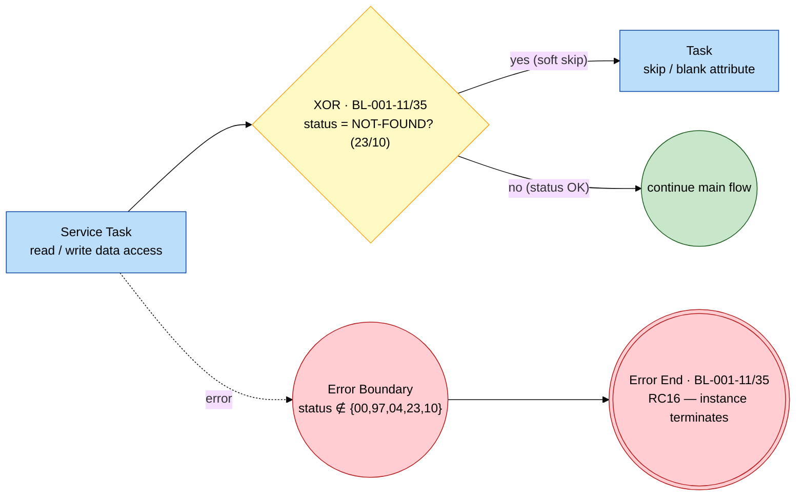

---

## 5. Conformance and traceability

This graph conforms to [process-graph-meta-model.md](../../../../../reference/process-graph-meta-model.md):

- **Total coverage.** All 39 rules map to exactly one flow node — §2.7 (`BL-001-01..23`) and §3.5 (`BL-001-24..39`). Rules previously absent or smeared onto edges in the prior draft are now first-class nodes, notably **BL-001-17** (exception-set load, §2.5) and the transform/enrichment rules **04, 05, 07, 08, 13, 15, 16, 22, 24, 25, 29, 30, 33, 36, 37** (Tasks).
- **Purity.** Each diagram is block-structured (matched split/join gateways), loops are confined to Loop/MI sub-processes, exceptions exit via Error End, and XOR guards are mutually exclusive and total — so each process is sound (meta-model P1–P9 ⇒ P6).
- **Concurrency.** Process A's two extracts are an `AND` block; Process B's stream routing is an `IOR` fan-out (the one place the prior serial chain misrepresented the logic).
- **External integrations.** Report distribution is modelled as external participants reached by Message Flow (meta-model §3.5): Process A's `RPT:PageCenter` + `MAIL:cost-oos-distribution` (§2.5) and Process B's `RPT:InfoPac` (§3.4); report datasets remain data-at-rest.
- **FSM.** Derived Mealy projections are in §2.8 and §3.6; the exact reachability-graph FSM is obtainable per meta-model §7.1.
- **Source artifacts.** Standalone Mermaid sources are in the `diagrams/` subfolder at `diagrams/BP-001-A-process-graph.mmd` and `diagrams/BP-001-B-process-graph.mmd`.
