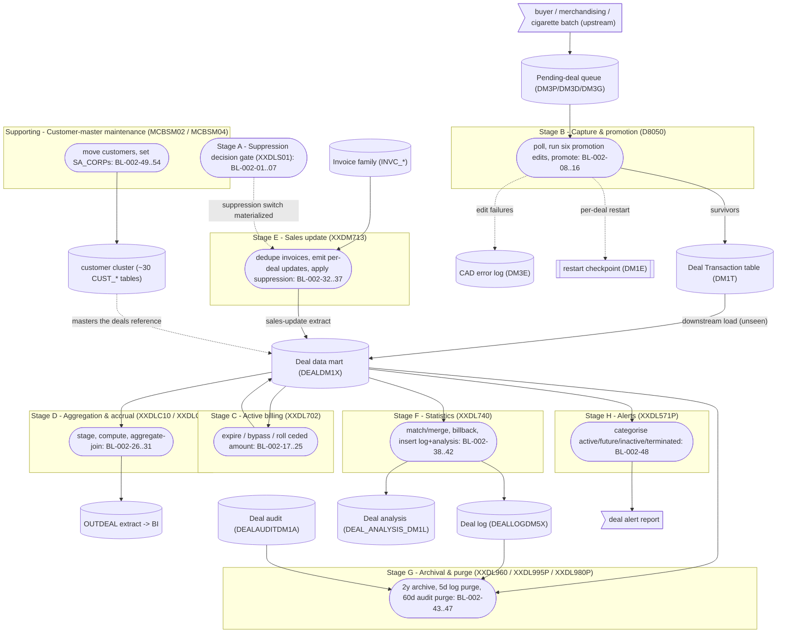

# BP-002 — Deal Management & Analysis: Extracted Business Logic

**Status:** Draft — business-logic extraction derived from the call-dependency graph, grounded in mainframe source under `docs/legacy/src`
**Companion to:** [BP-002-deal-management-and-analysis-call-graph.md](BP-002-deal-management-and-analysis-call-graph.md) and [BP-002-deal-management-and-analysis.md](../BP-002-deal-management-and-analysis.md)
**Sibling precedent:** [BP-001 business logic](../BP-001/BP-001-item-master-data-management-business-logic.md) (same notation/house style)
**Scope:** One end-to-end business process — the **deal lifecycle** — from pending-deal capture through active billing, accrual/aggregation, invoice-driven sales update, statistics, and archival/purge, expressed as discrete, fully-attributed business rules. The **suppression decision** (`XXDLS01`) is modelled as a supporting decision gate, and **customer-master maintenance** (`MCBSM02`/`MCBSM04`) as a supporting feeder sub-process.

---

## 1. Purpose, scope, and method

This document re-expresses the BP-002 deal lifecycle as **business logic** — the *what* — separated from the *how* (file mechanics, cursor mechanics, package binding, CICS transport verbs, lock-retry plumbing, diagnostics). The primary source is the call-dependency graph; the mainframe source was consulted only to resolve exact field semantics and formulas (for example, the `DEALDM1X` DCLGEN `DGDM1X` was read to fix the date-field and amount-field types used in the schemas below).

The lifecycle is a **data-flow chain of independently scheduled programs**: each program's output table or file is the next program's input; the deal programs do not call one another. The single business process below therefore reads as a sequence of stages (A through H), each a separately scheduled program or job-step, joined by the central deal data mart (`DEALDM1X`) and its feeder tables.

### 1.1 What is in scope (business logic) vs out of scope (implementation)

Captured as rules (the *what*): data validations, classifications, transformations, code mappings, match/merge logic, enrichment lookups, routing decisions, aggregations, eligibility predicates, deduplication, suppression gating, and the operational hard-fail convention.

Treated as implementation and **not** turned into rules (the *how*): opening/closing files, file-status interrogation, DB2 `SET CURRENT PACKAGESET`, cursor open/fetch/close and multi-row rowset buffering, `DECLARE GLOBAL TEMPORARY TABLE` mechanics, the `LOCK TABLE … IN EXCLUSIVE MODE` wait-and-retry plumbing (timer call, operator alert every fifteen tries), the CICS transport verbs (`READQ`/`WRITE`/`ENQ`/`DEQ`/`SYNCPOINT`/`LINK`) used to move and commit data, the DB2 error subroutine wiring (`DBDB2ER` via the `DB2ERRP2` include macro, `DSNTIAR`), record-count displays, and the job-step return-code propagation guard (`COND=(4,LT)`). These are summarized once in §7.3 because they are environment-specific, not business intent. The two exceptions promoted to rules are genuine operational rules: the platform hard-fail convention (BL-002-90) and the per-deal transactional unit-of-work boundary in capture (BL-002-15), because they carry business meaning (pipeline stop; all-or-nothing promotion).

### 1.2 Rule attributes

Each rule lists: **Rule ID** and the coarse companion rule it refines (`BR-002-NN`); **Logic type**; **Trigger conditions**; **Input data schema**; **Plain-English description**; **Pseudocode** (CLRS 4th-edition convention); **Output data schema**.

### 1.3 Pseudocode convention (CLRS 4th edition)

- Indentation denotes block structure; there are no `begin`/`end` brackets.
- `=` is assignment; `==`, `≠`, `≤`, `≥` are comparisons; `and`, `or`, `not` are boolean (short-circuiting).
- `//` begins a comment.
- Keywords: `if` / `elseif` / `else`, `while`, `repeat … until`, `for … to` / `downto`, `return`, `error "…"`.
- Procedures are named in capitals, e.g. `PROMOTE-PENDING-DEAL`; object attributes use dot notation, e.g. `deal.cededAmount`; arrays are 1-indexed, e.g. `fetchedRows[i]`.
- A sentinel "default date" constant `DEFAULT_DATE` denotes the literal `1900-01-01` used by the legacy code to mean "no value present" in a date column.
- No COBOL, SQL, or JCL text appears in any pseudocode block; all identifiers are plain-English. The originating mnemonic is given in the schema and prose, per §1.4.

### 1.4 Identifier-translation rule

Every cryptic or mnemonic identifier is rendered in plain English with the original in parentheses on first use within a rule and in every schema row, e.g. *ceded deal amount (`ACEDL3`)*, *deal purchase-status code (`CDLST0`)*, *last purchase-history date (`DLBUYH`)*. The master mapping is in §3.

### 1.5 Logical type vocabulary (used in all schemas)

| Logical type | Meaning |
|---|---|
| `string(n)` | fixed-length character field of length n |
| `integer` | whole number |
| `amount(i.f)` | signed decimal money/quantity, i integer digits and f fractional digits |
| `quantity(i)` | signed whole-number quantity, i integer digits |
| `date-iso` | calendar date as `YYYY-MM-DD` text |
| `timestamp` | date-time to microsecond precision |
| `code(n)` | enumerated character code of length n |
| `flag` | single-character yes/no indicator |

---

## 2. End-to-end process map — the deal lifecycle



**Lifecycle reading:** `pending → capture/promote (D8050 → DM1T) → [unseen load] → deal mart (DEALDM1X) → active billing (XXDL702) → accrual (XXDLC20) / aggregation (XXDLC10) → OUTDEAL`, with **invoice-driven sales update** (`XXDM713`) writing back into the deal mart under the **suppression gate** (`XXDLS01`), **statistics** (`XXDL740`) emitting the log and analysis tables, and the **weekly archival/purge/alert chain** trimming the mart, log, and audit tables. **Customer-master maintenance** (`MCBSM02`/`MCBSM04`) keeps the customer cluster the deals hang off.

---

## 3. Master identifier-translation glossary

### 3.1 Deal data mart record (`DEALDM1X`, DCLGEN `DGDM1X`, names `DM1X-`)

| Plain-English name | Original | Logical type |
|---|---|---|
| item number | `IITEM2` | integer |
| deal id | `IDEAL2` | integer |
| universal item number | `IIUIN2` | integer |
| vendor number | `IVNNO2` | integer |
| buyer number | `IBYNO2` | integer |
| deal purchase-status code | `CDLST0` | code(1) — pending=`P`, active=`A`, future=`F` |
| deal billing-status code | `CDLSB0` | code(1) — pending=`P`, active=`A`, future=`F`, terminated=`T` |
| deal type code | `CDLTP2` | integer — group/diverter/bracket bypass = 04/07/08/09; group = 8 |
| rolled-into-current-deal flag | `CDDLI0` | flag — already rolled = `Y` |
| ceded deal amount | `ACEDL3` | amount(3.2) |
| count/recount billback amount | `ABLBK3` | amount(7.2) |
| floor-stock billback amount | `AFLST3` | amount(7.2) |
| outstanding deal quantity | `QDURM3` | quantity(7) |
| deal master-case amount | `DEAL_MSTRCS_AMT` (`DEAL-MSTRCS-AMT`) | amount(5.2) |
| ceded deal amount (post-conversion) | `CEDED_DEAL_AMT` (`CEDED-DEAL-AMT`) | amount(5.2) |
| deal payment-form code | `CDFRM0` | code(2) |
| first purchase-history date | `DFBUYH` | date-iso |
| last purchase-history date | `DLBUYH` | date-iso |
| first invoice-history date (deal start) | `DFINVH` | date-iso |
| last invoice-history date (deal end) | `DLINVH` | date-iso |
| first shipment-history date | `DFSHPH` | date-iso |
| last shipment-history date | `DLSHPH` | date-iso |
| sales-reporting group number | `ISRPG2` | integer |

> The amount fields carried as `DECIMAL(5,2)` in the table (`ACEDL3` is `S9(3)V9(2)` in the COBOL layout) are shown as `amount(3.2)`; the later `DEAL_*` columns are `amount(5.2)`. The legacy "no value" date marker in any `date-iso` column is the literal `1900-01-01` (`DEFAULT_DATE`).

### 3.2 Pending-deal capture records (`DM3P`/`DM3D`/`DM3G`) and promotion targets

| Plain-English name | Original | Source / type |
|---|---|---|
| pending-deals queue | `ACME.PENDINGDEALSDM3P` (`DM3P`) | polled queue |
| divisional pending-deal detail | `ACME.DIVPENDDEALSDM3D` (`DM3D`) | divisional path |
| group pending-deal detail | `ACME.GRPPENDDEALDM3G` (`DM3G`) | group path |
| deal type code (staged) | `TS3P-CDLTP2` | integer — group = 8 |
| deal master-case amount (pending) | `DM3P-DEAL-MSTRCS-AMT` | amount |
| deal transaction table | `ACME.DEALTRANDM1T` (`DM1T`) | promotion target (system of record) |
| CAD error log | `ACME.CAD_ERR_LOG_DM3E` (`DM3E`) | rejection sink |
| validation error code | `DM3E-ERR-CD` | integer — see §4.B error-code table |
| restart checkpoint store | `DM1E` (sequence key `DM1E-SEQNCE`) | CICS-written restart file |
| deal-program run audit | `ACME.DEAL_PGM_AUD_DM2A` (`DM2A`) | run-audit sink |
| division master | `ACME.DIVMSTRDI1D` (`DI1D`) | division lookup |
| division item (alternate/pack) | `ACME.DIV_ITEM_ALT_DE1A` / `ACME.DIV_ITEM_PACK_DE1I` | item-at-division lookup |
| item cost | `ACME.ITM_COST_DE8E` | licensing-limit cost |
| corporate-vendor-control switch | `VN1A-CRP-VNDR-CNTL-SW` | flag — corporate-controlled = `Y` |
| item status code (division item) | `DE1I-ITEM-STAT-CD` | code(3) — discontinued/inactive = `INA` |

### 3.3 Suppression linkage (`XXDLS01`, copybook `DLS01LNK`, names `DLS01-`)

| Plain-English name | Original | Logical type |
|---|---|---|
| division code (input) | `DLS01-DIV-CODE` | code |
| division part (input) | `DLS01-DIV-PART` | integer |
| customer number (input) | (linkage customer key) | integer |
| item number (input) | (linkage item key) | integer |
| deal type (input) | (linkage deal type) | integer |
| invoice date (input) | (linkage invoice date) | date-iso |
| form of payment (input) | (linkage payment form) | code |
| deal-suppression switch (output) | `DLS01-DEAL-SUPP-SW` | flag — suppressed = `Y`, allowed = `N` |
| return code (output) | `DLS01-RET-CODE` | integer — ok=0, DB2 read fault=+11, package fault=+16 |
| customer-suppression cache | `WS-CUST-SW(customerNumber)` | per-call array of flag |
| item-suppression cache | `WS-ITEM-SW(itemNumber)` | per-call array of flag |
| suppression profile cluster | `ACME.PROF_HDR_PR1P` / `PROF_CUS_PR3Q` / `PROF_ITM_PR5Q` / `PROF_ITM_GRP_PR3P` | profile tables |
| customer cross-reference | `ACME.CUST_XREF_CU1X` | flag `DELT_SW` (deleted = not `N`) |

### 3.4 Active-billing working fields (`XXDL702`)

| Plain-English name | Original | Logical type |
|---|---|---|
| processing date | `WS00-DPDATH` (from reader card `RD00-DPDATH`) | date-iso |
| loaded deal row (array element) | `TB1X-…` (e.g. `TB1X-DLINVH`) | deal-mart row image |
| output deal current start date | `OUT-CURR-DEAL-START-DT` | date-iso |
| output deal current end date | `OUT-CURR-DEAL-END-DT` | date-iso |
| output ceded amount | `OUT-DEAL-CEDED-AMT` | amount |
| rewrite-required switch | `REWRITE-S1` | flag — write = `Y` |
| item retail pack | `WS-ITEM-RPK` / `DE6C-ITEM-RPK` | quantity — floor-stock divisor |

### 3.5 Aggregation / accrual staging (`XXDLC10`/`XXDLC20`)

| Plain-English name | Original | Logical type |
|---|---|---|
| audit-transaction input record | `IN-REC` (XXDLC10) | input row |
| accrual input amount | `IN-VEN-NXT-BILBCK-AMT` (XXDLC20) | amount |
| end-of-processing date | `EOP-DT` (from `RDR1` → `RDR-DT`) | date-iso |
| audit staging table | `SESSION.AUD_DEALS` (division, transaction, item, deal, qty, amount, date) | session temp table |
| accrual staging table | `SESSION.ACCR_DEALS` (item, deal, amount) | session temp table |
| transaction-type code | `TRANS` | code — `DLAM` = deal-amount transaction (sign special-case) |
| aggregated output record | `OUT-REC` → `OUTDEAL` | output row |
| date→period table | `ACME.DT_JS1A` (`JS1A`) | calendar→Acme period/year |

### 3.6 Sales-update fields (`XXDM713`, output layout `DM4X`)

| Plain-English name | Original | Logical type |
|---|---|---|
| invoice header/detail/item | `ACME.INVC_HDR_BD1H` / `INVC_DTL_COMN_BD1D` / `INVC_DTL_ITEM_BD2D` | invoice family |
| processed-invoice timestamp marker | `ACME.INVC_TS_BD2T` (`TS_TYP='DL6'`) | dedup marker |
| A/R processing-date control | `CF1D-DARPDH` | date-iso — invalid = `1900-01-01` |
| prior-job completion marker | `CF1D-FAR020` | timestamp — un-run = `1900-…000000` |
| deal id 1/2/3 on invoice line | `DEAL-ID1` / `DEAL-ID2` / `DEAL-ID3` | integer — absent = 0 |
| per-deal suppression switch | `MRF-DEAL-ID-SUPR-SWn` (`…-DEAL-ID-SUPR-SW`) | flag — suppressed = `Y` |
| sales-update disposition code | `OL-SDTUP0` (`SDTUP0`) | code(1) — apply = `S`, suppressed = `X` |
| sales-update output record | `OL-REC` → `OL-FILE` (`DMDLU`) | output row |
| pick-slot / disposition guards | pick-slot `OUT`, disposition `C` | line-skip conditions |

### 3.7 Statistics config and amounts (`XXDL740`)

| Plain-English name | Original | Logical type |
|---|---|---|
| application system parameter | `DS.APPL_SYS_PARM_AP1S` (`PARM_ID LIKE 'DL740_%'`, `APPL_ID='GLENT'`) | config rows |
| sorted-update input record | `TX-FILE` (`DL7401`) | sorted transaction |
| AP vendor master | `AP-FILE` (`MCVEN`, random by vendor) | vendor master |
| buyer master | `BY-FILE` (`XCSXX1`, random by buyer) | buyer master |
| item (SIM) master | `SI-FILE` (`XXSIMMF`, dynamic) | item master |
| deal log (insert target) | `DEALLOGDM5X` (`DM5X`) | log table |
| deal analysis (insert target) | `DEAL_ANALYSIS_DM1L` (`DM1L`) | analysis table |
| next-bill-back date | `DNXBBH` | date-iso |

### 3.8 Archival / purge fields (`XXDL960`, `XXDL995P`, `XXDL980P`)

| Plain-English name | Original | Logical type |
|---|---|---|
| current century-year | `WS00-CURR-CCYY` | integer — cutoff = current − 2 |
| current timestamp at run | `WK00-DMCROH` | timestamp |
| deal-log selection timestamp | `FCURRF` | timestamp — purge threshold 5 days |
| audit retention parameter | `DS.APPL_SYS_PARM_AP1S.XXDL980_DM1A_DAYS` | integer — default 60 |
| deal audit table | `DEALAUDITDM1A` (`DM1A`) | purge target |

### 3.9 Customer-master fields (`MCBSM02`/`MCBSM04`)

| Plain-English name | Original | Logical type |
|---|---|---|
| customer move input record | `INFILE` (from-division / to-division) | input row |
| division partition | `DIV_PART` (from `ACME.DIVMSTRDI1D`) | integer |
| customer cross-reference | `ACME.CUST_XREF_CU1X` | cluster table |
| division-customer status | `ACME.DIV_CUST_STAT_CU1S` (`STAT_CHG_TS`) | timestamp |
| customer-branch hold status | to-division CBR status | code — hold = `HLD` |
| delete-salesman-rows switch | `WS-DELETE-SLSM-ROWS-SW` | flag — keep = `N` |
| end-of-file switch | `WS-EOF` | flag — end = `Y` |
| DB2 error classification | `LINK-SQL-CODE-TYPE` / `LINK-DBDB2ER-RC` | code / integer — fatal type = `OTHER` |
| customer-master report | `PRINT-FILE` (`PRINTER1`) | report sink |
| licence extract | `LICDATA` (MCBSM04) | output file |

---

## 4. The deal lifecycle process — stages

**Entry points / data sources:** the pending-deal queue (`DM3P`/`DM3D`/`DM3G`) fed by buyers, merchandising, and the cigarette batch; the central deal data mart (`DEALDM1X`); the invoice family (`INVC_*`); the suppression profile cluster; division/item/vendor/buyer masters; the date→period table; and per-stage reader cards (processing date, end-of-processing date).
**Data sinks:** the deal-transaction table (`DM1T`), the CAD error log (`DM3E`), the aggregated `OUTDEAL` extract → BI, the deal log (`DM5X`) and deal-analysis (`DM1L`) tables, the deal-alert report, and the trimmed deal mart / log / audit tables after purge.

### 4.A Stage A — Suppression decision gate (program `XXDLS01`)

A pure, side-effect-free decision function of (customer, item, deal). It answers one question — should this deal be suppressed for this customer/item on this invoice date? — through three nested checks (customer, then item, then deal), short-circuiting as soon as any level clears the deal. Its only mutable state is two per-call caches that let repeated keys skip the database.

#### BL-002-01 — Reset per-call caches on first call or division change
- **Logic type:** control / cache management
- **Maps to:** BR-002-02
- **Trigger:** entry to the decision function when this is the first call of the run, or the requested division code or division part differs from the one cached from the previous call.
- **Input schema:** first-call switch (`WS-FIRST-SW`): flag; requested division code (`DLS01-DIV-CODE`): code; requested division part (`DLS01-DIV-PART`): integer; cached division code/part (`WS00-DIV-CODE`/`WS00-DIV-PART`).
- **Description:** The customer-suppression cache (`WS-CUST-SW`) and item-suppression cache (`WS-ITEM-SW`) are valid only within one division. On the first call, or whenever the caller switches to a different division code or part, both caches are cleared so stale per-customer/per-item answers from the previous division cannot leak across the boundary. The first-call switch is then turned off.
- **Pseudocode:**

```
RESET-CACHES-IF-NEEDED(request)
    if firstCall == TRUE
       or request.divisionCode ≠ cachedDivisionCode
       or request.divisionPart ≠ cachedDivisionPart
        CLEAR(customerSuppressionCache)
        CLEAR(itemSuppressionCache)
        firstCall = FALSE
    cachedDivisionCode = request.divisionCode
    cachedDivisionPart = request.divisionPart
```

- **Output schema:** cleared/retained caches; first-call switch set to off.

#### BL-002-02 — Seed the decision and copy the request keys
- **Logic type:** initialization
- **Maps to:** BR-002-01
- **Trigger:** after cache management, once per call.
- **Input schema:** request keys — division code/part, customer number, item number, deal type, invoice date, form of payment.
- **Description:** The returned suppression switch (`DLS01-DEAL-SUPP-SW`) is seeded to "not suppressed" (`N`) and the return code to zero, so that any path that finds no suppressing profile returns "allowed" by default. The request keys are copied into working keys used by the three checks.
- **Pseudocode:**

```
SEED-DECISION(request)
    decision.suppressionSwitch = "N"        // default: allowed
    decision.returnCode = 0
    workingKeys = COPY(request)
    return decision
```

- **Output schema:** suppression switch seeded `N`; return code 0; working keys populated.

#### BL-002-03 — Customer-level suppression check
- **Logic type:** data validation (eligibility lookup)
- **Maps to:** BR-002-03
- **Trigger:** after seeding, when the customer-suppression cache for this customer number is not already marked "suppressed" (`Y`).
- **Input schema:** customer number; division key; profile header (`ACME.PROF_HDR_PR1P`), customer profile (`ACME.PROF_CUS_PR3Q`), division master (`ACME.DIVMSTRDI1D`), customer cross-reference (`ACME.CUST_XREF_CU1X`); profile type must be deal-suppression (`PROF_TYP='DLS'`), profile active (`OK_TO_ACTIVE_SW='Y'`), customer not deleted (`DELT_SW='N'`).
- **Description:** The function asks whether an active deal-suppression profile exists for this customer (joining profile header, customer profile, division master, and a non-deleted customer cross-reference). If such a profile exists, the customer is a suppression candidate and processing proceeds to the item check; if not, the deal is allowed and the function returns "not suppressed" immediately. A cached "suppressed" answer for this customer skips the lookup. The first lookup result is cached.
- **Pseudocode:**

```
CHECK-CUSTOMER-SUPPRESSION(customerNumber, divisionKey)
    if customerSuppressionCache[customerNumber] == "Y"
        return CANDIDATE
    found = ACTIVE-SUPPRESSION-PROFILE-EXISTS-FOR-CUSTOMER(customerNumber, divisionKey)
    if found
        customerSuppressionCache[customerNumber] = "Y"
        return CANDIDATE
    else
        customerSuppressionCache[customerNumber] = "N"
        return ALLOWED          // no customer profile -> deal allowed
```

- **Output schema:** customer cache entry set `Y`/`N`; decision `CANDIDATE` (proceed) or `ALLOWED` (return not-suppressed).

#### BL-002-04 — Item-level suppression check (gated on customer match)
- **Logic type:** data validation (eligibility lookup)
- **Maps to:** BR-002-04
- **Trigger:** only when the customer check returned `CANDIDATE`, and the item-suppression cache for this item number is unset.
- **Input schema:** item number; division part; profile header (`ACME.PROF_HDR_PR1P`), item profile (`ACME.PROF_ITM_PR5Q`); profile type deal-suppression (`'DLS'`), profile active (`OK_TO_ACTIVE_SW='Y'`), item profile division part in {corporate `0`, this division part}, catalogue number equals the item.
- **Description:** Having found a customer-level suppression candidacy, the function checks whether an active deal-suppression profile exists for the item (either corporate-wide or for this division part). If one exists, processing proceeds to the deal-level check; if none exists, the deal is allowed. The result is cached per item.
- **Pseudocode:**

```
CHECK-ITEM-SUPPRESSION(itemNumber, divisionPart)
    if itemSuppressionCache[itemNumber] is set
        return itemSuppressionCache[itemNumber]
    found = ACTIVE-SUPPRESSION-PROFILE-EXISTS-FOR-ITEM(itemNumber, divisionPart)
    if found
        itemSuppressionCache[itemNumber] = CANDIDATE
    else
        itemSuppressionCache[itemNumber] = ALLOWED
    return itemSuppressionCache[itemNumber]
```

- **Output schema:** item cache entry set; decision `CANDIDATE` (proceed) or `ALLOWED` (return not-suppressed).

#### BL-002-05 — Deal-level suppression decision (gated on customer and item match)
- **Logic type:** data validation (final eligibility)
- **Maps to:** BR-002-05
- **Trigger:** only when both the customer and item checks returned `CANDIDATE`.
- **Input schema:** deal type; form of payment; invoice date; the profile cluster joined for an effective-dated deal-suppression profile (`PR1P ⋈ PR3Q ⋈ PR5Q ⋈ CU1X ⋈ DI1D` with effective date ≤ invoice date ≤ end date) optionally narrowed by a deal-type/form-of-payment classifier group (`PROF_ITM_GRP_PR3P`, class type `DLSTYP`); the classifier key is the **last digit of the deal type concatenated with the form of payment**.
- **Description:** The final check looks for an effective-dated suppression profile that covers the invoice date for this customer+item, then narrows by a deal-type/payment classifier: the profile suppresses the deal if it has no classifier restriction, or if its classifier id matches "(last digit of deal type) concatenated with (form of payment)". If such a profile is found, the deal is suppressed (`Y`); otherwise it is allowed (`N`).
- **Pseudocode:**

```
DECIDE-DEAL-SUPPRESSION(dealType, formOfPayment, invoiceDate)
    classifierKey = LAST-DIGIT(dealType) ‖ formOfPayment
    profile = EFFECTIVE-SUPPRESSION-PROFILE(invoiceDate)        // covers invoiceDate
    if profile exists
       and (profile.classifierId is ABSENT or profile.classifierId == classifierKey)
        return "Y"          // suppress
    return "N"              // allow
```

- **Output schema:** suppression switch (`DLS01-DEAL-SUPP-SW`) ∈ {`Y`,`N`}.

#### BL-002-06 — Map database faults to documented return codes
- **Logic type:** error handling
- **Maps to:** BR-002-06
- **Trigger:** any of the three checks encounters a database outcome other than "row found" or "no row found"; or the initial package binding fails.
- **Input schema:** check outcome category (found / not-found / fault); diagnostic area.
- **Description:** A "row found" or "no row found" outcome is a normal business answer and never an error. Any other database fault during a check sets the return code to the read-fault value (`+11`), captures the diagnostic area for the caller, and abandons the call; a package-binding fault sets the package-fault value (`+16`). Faults are never silently swallowed — the caller always learns the decision was not computed.
- **Pseudocode:**

```
CLASSIFY-OUTCOME(outcome)
    if outcome == FOUND or outcome == NOT-FOUND
        return NORMAL
    if outcome == PACKAGE-FAULT
        decision.returnCode = 16
    else
        decision.returnCode = 11
        SAVE-DIAGNOSTICS()
    return ABANDON
```

- **Output schema:** return code (`DLS01-RET-CODE`) ∈ {0, +11, +16}; saved diagnostics on fault.

#### BL-002-07 — Return the final suppression switch
- **Logic type:** control (function return)
- **Maps to:** BR-002-07
- **Trigger:** any terminal point of the decision function.
- **Input schema:** suppression switch; return code.
- **Description:** The function returns exactly one of two business answers — suppress (`Y`) or allow (`N`) — alongside the return code. Downstream stages (notably sales update, BL-002-37) treat `Y` as "do not apply this deal".
- **Pseudocode:**

```
RETURN-DECISION(decision)
    return (decision.suppressionSwitch, decision.returnCode)
```

- **Output schema:** deal-suppression switch (`DLS01-DEAL-SUPP-SW`): flag; return code (`DLS01-RET-CODE`): integer.

### 4.B Stage B — Capture and promotion (program `D8050`)

The lifecycle gateway. It polls the pending-deal queue, fetches each staged pending deal, runs six promotion edits, and either promotes the survivor into the deal-transaction table (the hand-off out of "pending") or rejects it into the CAD error log with a distinct error code. Each promoted deal is a single all-or-nothing transactional unit with its own restart checkpoint.

#### BL-002-08 — Poll the pending-deal queue
- **Logic type:** control (work intake)
- **Maps to:** BR-002-40
- **Trigger:** the capture transaction runs.
- **Input schema:** pending-deals queue (`ACME.PENDINGDEALSDM3P`): pending-deal rows.
- **Description:** The transaction periodically polls the pending-deals queue for newly staged deals to capture, processing them one at a time until none remain. (The mechanics of staging rows into a per-task work queue are transport, summarized in §7.3.)
- **Pseudocode:**

```
POLL-PENDING-DEALS()
    repeat
        deal = NEXT-STAGED-PENDING-DEAL()
        if deal is NONE
            return                       // queue drained
        PROCESS-PENDING-DEAL(deal)
    until no more staged deals
```

- **Output schema:** a stream of pending deals routed to BL-002-09.

#### BL-002-09 — Route a pending deal by deal type (group vs divisional)
- **Logic type:** routing / classification
- **Maps to:** BR-002-41
- **Trigger:** a pending deal is fetched.
- **Input schema:** staged deal type code (`TS3P-CDLTP2`): integer.
- **Description:** A pending deal whose deal-type code equals 8 is a **group deal** and is processed against the group pending-deal detail (`DM3G`); every other type is a **divisional deal** processed against the divisional pending-deal detail (`DM3D`). The route determines which set of edits and which overlap check apply.
- **Pseudocode:**

```
ROUTE-PENDING-DEAL(deal)
    if deal.dealTypeCode == 8
        return PROCESS-GROUP-DEAL(deal)         // over DM3G
    else
        return PROCESS-DIVISIONAL-DEAL(deal)    // over DM3D
```

- **Output schema:** routing decision (group path / divisional path).

#### BL-002-10 — Promotion edit: item exists at the division
- **Logic type:** data validation
- **Maps to:** BR-002-42
- **Trigger:** before promotion, for each pending deal; the division master and the division-item record are read.
- **Input schema:** division code; item number; division master (`ACME.DIVMSTRDI1D`); division item (`ACME.DIV_ITEM_ALT_DE1A`/`DE1I`).
- **Description:** The deal's item must exist at the deal's division. If the division or the item-at-division cannot be found, the deal fails with **error code 2** (division/item not found) and is rejected (BL-002-14).
- **Pseudocode:**

```
EDIT-ITEM-EXISTS(deal)
    if not DIVISION-EXISTS(deal.divisionCode)
       or not ITEM-EXISTS-AT-DIVISION(deal.divisionCode, deal.itemNumber)
        return REJECT(errorCode = 2)
    return PASS
```

- **Output schema:** pass, or rejection with error code 2.

#### BL-002-11 — Promotion edit: full-case item only (no store-stock)
- **Logic type:** data validation
- **Maps to:** BR-002-42
- **Trigger:** the item exists at the division (BL-002-10 passed).
- **Input schema:** item store-stock indicator (item-is-store-stock).
- **Description:** Only full-case items may be promoted. A store-stock (split-case) item fails with **error code 1** and is rejected.
- **Pseudocode:**

```
EDIT-FULL-CASE(deal)
    if deal.item.isStoreStock
        return REJECT(errorCode = 1)
    return PASS
```

- **Output schema:** pass, or rejection with error code 1.

#### BL-002-12 — Promotion edit: item not discontinued (unless terminating)
- **Logic type:** data validation
- **Maps to:** BR-002-42
- **Trigger:** the full-case edit passed.
- **Input schema:** division-item status code (`DE1I-ITEM-STAT-CD`): code(3) — discontinued/inactive = `INA`; deal action code (action ≠ `T` terminate).
- **Description:** A discontinued item (status `INA`) may not be promoted unless the deal's action is a termination (`T`). A discontinued item on a non-terminating action fails with **error code 16**.
- **Pseudocode:**

```
EDIT-NOT-DISCONTINUED(deal)
    if deal.item.statusCode == "INA" and deal.actionCode ≠ "T"
        return REJECT(errorCode = 16)
    return PASS
```

- **Output schema:** pass, or rejection with error code 16.

#### BL-002-13 — Promotion edits: corporate-vendor control, licensing limit, overlap, existing-terminated
- **Logic type:** data validation (compound)
- **Maps to:** BR-002-42
- **Trigger:** the item-status edit passed.
- **Input schema:** corporate-vendor-control switch (`VN1A-CRP-VNDR-CNTL-SW`): flag (corporate-controlled = `Y`); payment form (`BB`/`OI`) and backdated indicator (deal buy/ceded date before today); pending master-case amount (`DM3P-DEAL-MSTRCS-AMT`), item retail pack (`DE6C-ITEM-RPK`), item cost (`DE8E-COST-AMT`); overlapping active-deal dates from `DM3D`; existing deal-mart row with the same corporate deal id and action ≠ `C`.
- **Description:** Four further edits gate promotion. (a) **Corporate-vendor control:** the vendor must be corporate-controlled (`Y`); a local vendor fails with **error code 9**. (b) **Licensing limit:** for back-dated `BB`/`OI` deals, the per-unit deal value (pending master-case amount divided by item retail pack) must not exceed the item cost; exceeding it flags **error code 5** (the run continues to the overlap check). (c) **Overlap:** the deal dates must not overlap an existing active deal; an overlap fails with **error code 6** for group deals or **7** for divisional deals. (d) **Existing terminated deal:** if a terminated deal-mart row already carries the same corporate deal id and the action is not "create" (`C`), the deal fails with **error code 19**. A group-only special case forces a `'NA'` form to `01` and deletes with **error code 18**.
- **Pseudocode:**

```
EDIT-VENDOR-LICENSE-OVERLAP(deal)
    if not deal.vendorCorporateControlled               // not "Y"
        return REJECT(errorCode = 9)
    if deal.paymentForm in {"BB", "OI"} and deal.isBackdated
        if (deal.pendingMasterCaseAmount / deal.item.retailPack) > deal.item.cost
            FLAG(errorCode = 5)                          // licensing limit exceeded
    if OVERLAPS-EXISTING-ACTIVE-DEAL(deal)
        return REJECT(errorCode = (deal.isGroup ? 6 : 7))
    if EXISTING-TERMINATED-SAME-CORP-DEAL(deal) and deal.actionCode ≠ "C"
        return REJECT(errorCode = 19)
    if deal.isGroup and deal.form == "NA"
        FORCE-FORM(deal, "01"); return REJECT(errorCode = 18)
    return PASS
```

- **Output schema:** pass, or rejection with error code 5 / 6 / 7 / 9 / 18 / 19.

#### BL-002-14 — Reject a failed deal to the CAD error log
- **Logic type:** data validation outcome / routing
- **Maps to:** BR-002-43
- **Trigger:** any promotion edit (BL-002-10..13) fails.
- **Input schema:** rejected pending deal; assigned error code; full diagnostic context (program id, division, timestamps).
- **Description:** A deal that fails any edit is written to the CAD error log (`DM3E`) with its distinct error code and full diagnostic context, and the rejected pending row is deleted from its detail table so it is not re-evaluated. The verified error-code mapping is the contract.
- **Pseudocode:**

```
REJECT(deal, errorCode)
    WRITE-ERROR-LOG(deal, errorCode, diagnosticContext)   // DM3E insert
    DELETE-PENDING-ROW(deal)                              // from DM3D / DM3G
```

- **Output schema:** one CAD error-log row (`DM3E`) with error code; the pending detail row deleted.

> **Verified `DM3E` error-code mapping:** 1 = store-stock / not full case; 2 = division or item not found; 5 = licensing limit exceeded; 6 = overlapping dates (group); 7 = overlapping dates (division); 9 = vendor not corporate-controlled; 16 = item discontinued (`INA`); 18 = group-only `'NA'` forced-`01` delete; 19 = existing terminated deal with the same corporate deal id.

#### BL-002-15 — Promote the survivor into the deal-transaction table (transactional unit)
- **Logic type:** data transformation / persistence (operational rule)
- **Maps to:** BR-002-44
- **Trigger:** all six edits passed and the supporting division and division-item reads succeeded.
- **Input schema:** validated pending deal enriched with division and division-item attributes.
- **Description:** A surviving deal is built into a deal-transaction record and inserted into the deal-transaction table (`DM1T`) — the system-of-record hand-off out of "pending" — and its pending detail row is marked processed. The whole promotion of one deal is a single transactional unit: it is committed only when the build and both supporting reads succeeded; otherwise it is rolled back as a whole and a restart-error record is written. (For group deals, the division detail row is marked processed only once all associated group rows are done.)
- **Pseudocode:**

```
PROMOTE-PENDING-DEAL(deal)
    if READ-DIVISION(deal) == OK and READ-DIVISION-ITEM(deal) == OK
        record = BUILD-DEAL-TRANSACTION(deal)
        INSERT-DEAL-TRANSACTION(record)               // DM1T
        WRITE-RESTART-CHECKPOINT(deal)                // BL-002-16
        MARK-PENDING-PROCESSED(deal)
        COMMIT-UNIT-OF-WORK()
    else
        ROLLBACK-UNIT-OF-WORK()
        WRITE-RESTART-ERROR(deal)
```

- **Output schema:** one deal-transaction row (`DM1T`); pending detail marked processed; committed (or rolled-back) unit of work.

#### BL-002-16 — Write a per-deal restart checkpoint
- **Logic type:** state management (recovery)
- **Maps to:** BR-002-45
- **Trigger:** during promotion, when the division, timestamp, or item changes from the prior checkpoint.
- **Input schema:** restart sequence number (`DM1E-SEQNCE`); program id; division code; timestamp; CICS error info; SQL error info.
- **Description:** A restart record is written to the restart store (`DM1E`) keyed by a unique sequence number, carrying enough context (program id, division, timestamp, and any CICS/SQL error info) to resume the capture run from the last committed deal. (The physical write verb is transport, §7.3.)
- **Pseudocode:**

```
WRITE-RESTART-CHECKPOINT(deal)
    checkpoint.sequence = NEXT-SEQUENCE()
    checkpoint.programId = thisProgram
    checkpoint.divisionCode = deal.divisionCode
    checkpoint.timestamp = NOW()
    EMIT-RESTART(checkpoint)                          // DM1E
```

- **Output schema:** one restart record (`DM1E`) keyed by sequence number.

### 4.C Stage C — Active billing (program `XXDL702`)

Run per division against a processing date, this stage walks the items of the division, loads each item's deals from the deal mart, and for active billing deals decides whether to expire them, bypass them, or roll a ceded amount into the current-deal fields. Only deals it actually modifies are written to the current/future deal extract.

#### BL-002-17 — Validate the processing date
- **Logic type:** data validation
- **Maps to:** new (operational precondition for BR-002-10..15)
- **Trigger:** after reading the processing-date reader card, before any deal processing.
- **Input schema:** processing date (`RD00-DPDATH`): text in `YYYY-MM-DD` shape — four-digit year, `-` separators, month ≤ 12, day in 01..31.
- **Description:** The run's processing date must be a well-formed calendar date (numeric four-digit year, dash separators, month not exceeding 12, day between 1 and 31). A malformed date abandons the run cleanly (it is a precondition failure, not a data-corruption hard fail). The validated date becomes the "today" against which deals are aged.
- **Pseudocode:**

```
VALIDATE-PROCESSING-DATE(card)
    if not (IS-NUMERIC(card.year) and card.separatorsOK
            and card.month ≤ 12 and 1 ≤ card.day ≤ 31)
        DISPLAY("invalid date"); return INVALID
    processingDate = card
    return VALID
```

- **Output schema:** validated processing date (`WS00-DPDATH`): date-iso; or normal abandonment.

#### BL-002-18 — Detect that a deal needs rewriting
- **Logic type:** classification
- **Maps to:** BR-002-13 (supports)
- **Trigger:** per loaded deal row, before status branching.
- **Input schema:** ceded deal amount (`ACEDL3`): amount(3.2); first invoice-history date (`DFINVH`): date-iso.
- **Description:** A deal is provisionally marked for rewrite when it carries a non-zero ceded amount or its first invoice-history date is not the default `1900-01-01`. This rewrite mark gates whether the deal is ultimately written to the extract (BL-002-24).
- **Pseudocode:**

```
DETECT-REWRITE(deal)
    if deal.cededAmount ≠ 0 or deal.firstInvoiceDate ≠ DEFAULT_DATE
        deal.rewriteRequired = TRUE
```

- **Output schema:** rewrite-required switch (`REWRITE-S1`): flag.

#### BL-002-19 — Branch by purchase and billing status
- **Logic type:** routing
- **Maps to:** new (supports BR-002-10..12)
- **Trigger:** per loaded deal row.
- **Input schema:** deal purchase-status code (`CDLST0`): code(1) ∈ {`P`,`A`,`F`}; deal billing-status code (`CDLSB0`): code(1) ∈ {`P`,`A`,`F`}.
- **Description:** Each deal is dispatched to a status-specific handler by its purchase status (pending/active/future) and billing status (pending/active/future). The active-billing handler carries the core expiry/bypass/roll-up rules (BL-002-20..22); the other handlers update status, quantity, and dates on the deal mart.
- **Pseudocode:**

```
BRANCH-BY-STATUS(deal)
    if deal.purchaseStatus == "P"   then HANDLE-PENDING-PURCHASE(deal)
    if deal.billingStatus  == "P"   then HANDLE-PENDING-BILLING(deal)
    if deal.purchaseStatus == "A"   then HANDLE-ACTIVE-PURCHASE(deal)
    if deal.billingStatus  == "A"   then HANDLE-ACTIVE-BILLING(deal)      // BL-002-20..22
    if deal.purchaseStatus == "F"   then HANDLE-FUTURE-PURCHASE(deal)
    if deal.billingStatus  == "F"   then HANDLE-FUTURE-BILLING(deal)
```

- **Output schema:** dispatch to the relevant handler.

#### BL-002-20 — Expire an active billing deal past its end date
- **Logic type:** classification / state transition
- **Maps to:** BR-002-11
- **Trigger:** an active-billing deal whose end date is before the processing date.
- **Input schema:** processing date (`WS00-DPDATH`): date-iso; deal end date = last invoice-history date (`DLINVH`): date-iso.
- **Description:** When the processing date is past the deal's end date, the deal is expired: its billing status becomes terminated (`T`), the deal mart is updated, and a "requeue" marker is set. Expiry takes precedence over the bypass and roll-up rules.
- **Pseudocode:**

```
HANDLE-ACTIVE-BILLING(deal)
    if processingDate > deal.endDate           // DLINVH
        deal.billingStatus = "T"               // terminated
        UPDATE-DEAL-MART(deal)
        deal.requeue = "Y"
        return
    BYPASS-OR-ROLL(deal)                        // BL-002-21
```

- **Output schema:** deal billing status set `T`; deal-mart row updated.

#### BL-002-21 — Bypass group / diverter / bracket deal types
- **Logic type:** data validation (exclusion)
- **Maps to:** BR-002-10
- **Trigger:** an active-billing deal that was not expired.
- **Input schema:** deal type code (`CDLTP2`): integer ∈ bypass set {04, 07, 08, 09}.
- **Description:** Deals whose type code is in the group/diverter/bracket set (04, 07, 08, 09) are not subject to the ceded-amount roll-up; they exit the handler unchanged. (This resolves the companion spec's open question on which type codes are group/diverter/bracket.)
- **Pseudocode:**

```
BYPASS-OR-ROLL(deal)
    if deal.dealTypeCode in {4, 7, 8, 9}
        return                                  // bypassed: no roll-up
    ROLL-CEDED-AMOUNT(deal)                      // BL-002-22
```

- **Output schema:** bypass decision (no change), or proceed to roll-up.

#### BL-002-22 — Roll the ceded amount into the current deal
- **Logic type:** data transformation
- **Maps to:** BR-002-12
- **Trigger:** a non-bypassed active-billing deal that is not already rolled into the current deal and carries a non-zero ceded amount.
- **Input schema:** rolled-into-current-deal flag (`CDDLI0`): flag (already rolled = `Y`); ceded deal amount (`ACEDL3`): amount(3.2); deal start = first invoice-history date (`DFINVH`); deal end = last invoice-history date (`DLINVH`).
- **Description:** A deal not yet rolled into the current deal (`CDDLI0 ≠ 'Y'`) with a non-zero ceded amount has its start and end dates copied into the output current-deal start/end fields and its ceded amount added into the output ceded amount; the rewrite mark is set. (The "`'Y'` type" means a deal already rolled into the current deal.)
- **Pseudocode:**

```
ROLL-CEDED-AMOUNT(deal)
    if deal.rolledIntoCurrent ≠ "Y" and deal.cededAmount ≠ 0
        output.currentDealStartDate = deal.startDate        // DFINVH
        output.currentDealEndDate   = deal.endDate          // DLINVH
        output.cededAmount = output.cededAmount + deal.cededAmount
        deal.rewriteRequired = TRUE
```

- **Output schema:** output current-deal start/end dates; output ceded amount (`OUT-DEAL-CEDED-AMT`); rewrite-required switch.

#### BL-002-23 — Recompute floor-stock and count/recount billback amounts
- **Logic type:** data transformation (calculation)
- **Maps to:** new (supports BR-002-13 output)
- **Trigger:** while building an item's output record.
- **Input schema:** floor-stock billback amount (`AFLST3`): amount(7.2); count/recount billback amount (`ABLBK3`): amount(7.2); item retail pack (`WS-ITEM-RPK`): quantity.
- **Description:** The floor-stock billback and count/recount billback amounts are recomputed from the item retail pack so the output extract carries pack-normalised billback figures. (The exact arithmetic is the legacy floor-stock calculation; it is captured here as "normalise by retail pack".)
- **Pseudocode:**

```
RECOMPUTE-BILLBACK(item)
    output.floorStockBillback = NORMALISE-BY-PACK(item.floorStockBillback, item.retailPack)
    output.countRecountBillback = NORMALISE-BY-PACK(item.countRecountBillback, item.retailPack)
```

- **Output schema:** recomputed floor-stock (`AFLST3`) and count/recount (`ABLBK3`) billback amounts on the output record.

#### BL-002-24 — Default blank output dates, then write only when modified
- **Logic type:** data transformation (default) + conditional output
- **Maps to:** BR-002-14, BR-002-13, BR-002-15
- **Trigger:** after processing all loaded deals for an item.
- **Input schema:** all output deal dates; output ceded/future amounts; rewrite-required switch (`REWRITE-S1`).
- **Description:** After an item's deals are processed: if every output date is blank and the ceded/future amount is zero, the item produced no change and is skipped (clean exit). Otherwise, any blank output date is initialised to the default `1900-01-01`, and the output record is written to the current/future deal extract **only if** the rewrite mark is set. An item with no deals at all also exits cleanly.
- **Pseudocode:**

```
FINALISE-ITEM(item)
    if ALL-OUTPUT-DATES-BLANK(item) and item.cededAndFutureAmount == 0
        return                                  // nothing to write
    for each d in OUTPUT-DATES(item)
        if d is BLANK
            d = DEFAULT_DATE                     // 1900-01-01
    if item.rewriteRequired == "Y"
        WRITE-DEAL-EXTRACT(item); BUMP-COUNTERS()
```

- **Output schema:** zero or one current/future deal-extract record (`OUT-RCD`) per item.

#### BL-002-25 — Update the deal mart for status-changed deals
- **Logic type:** data transformation / persistence
- **Maps to:** new (supports BR-002-11)
- **Trigger:** a pending/active/future handler changed a deal's status, quantity, or dates.
- **Input schema:** item number (`IITEM2`); deal id (`IDEAL2`); changed status, quantity, and dates.
- **Description:** When a status handler changes a deal's status, quantity, or dates, the deal-mart row is updated in place, keyed by item number and deal id. (The exclusive lock taken on the deal mart during the run is transport, §7.3.)
- **Pseudocode:**

```
UPDATE-DEAL-MART(deal)
    row = DEAL-MART-ROW(deal.itemNumber, deal.dealId)
    row.status = deal.status
    row.quantity = deal.quantity
    row.dates = deal.dates
    PERSIST(row)
```

- **Output schema:** updated deal-mart row (`DEALDM1X`).

### 4.D Stage D — Aggregation and accrual (programs `XXDLC10` and `XXDLC20`)

Structural twins. Each reads a flat input file, stages its rows in a session temporary table, then opens an aggregating join of that staging table to the deal mart and master tables and writes one aggregated `OUTDEAL` record per result row. `XXDLC10` aggregates audit transactions; `XXDLC20` aggregates accruals over an end-of-processing-date window. The division comes from a console-supplied parameter.

#### BL-002-26 — Stage input rows in the session aggregation table
- **Logic type:** data load / staging
- **Maps to:** BR-002-61, BR-002-71
- **Trigger:** for each input record, until end of the input file.
- **Input schema (XXDLC10):** audit-transaction record (`IN-REC`) carrying division, transaction type, item, deal id, quantity, amount, date. **Input schema (XXDLC20):** accrual record carrying item, deal id, accrual amount (`IN-VEN-NXT-BILBCK-AMT`).
- **Description:** Each input row is inserted into a per-session staging table — audit staging (`SESSION.AUD_DEALS`: division, transaction, item, deal, qty, amount, date) for aggregation, or accrual staging (`SESSION.ACCR_DEALS`: item, deal, amount) for accrual. A duplicate key or "no row" outcome on insert is tolerated and simply skipped (the row is already staged); inserts contribute to a staged-row count.
- **Pseudocode:**

```
STAGE-INPUT-ROW(row)
    amount = COMPUTE-AMOUNT(row)                 // BL-002-27 (XXDLC10)
    outcome = INSERT-STAGING(row, amount)
    if outcome == OK
        stagedCount = stagedCount + insertedRows
    elseif outcome in {DUPLICATE, NO-ROW}
        // already staged: tolerate
    else
        error "staging insert failed"            // BL-002-90 hard fail
```

- **Output schema:** rows in the session staging table; staged-row count.

#### BL-002-27 — Compute the staged amount and sign by transaction type (aggregation only)
- **Logic type:** data transformation
- **Maps to:** BR-002-62
- **Trigger:** per audit-transaction input row (XXDLC10).
- **Input schema:** transaction-type code (`TRANS`): code; quantity; amount.
- **Description:** For aggregation, the staged amount and quantity are computed from the input fields, with the deal-amount transaction type (`DLAM`) treated as a sign special-case (its amount sign is adjusted before staging) so that the later aggregation nets correctly. (The accrual twin stages the accrual amount directly.)
- **Pseudocode:**

```
COMPUTE-AMOUNT(row)
    if row.transactionType == "DLAM"
        return ADJUST-SIGN(row.amount)           // deal-amount sign special-case
    return row.amount
```

- **Output schema:** signed staged amount and quantity.

#### BL-002-28 — Read the accrual window's end-of-processing date (accrual only)
- **Logic type:** data validation / parameter intake
- **Maps to:** BR-002-70
- **Trigger:** initialization of the accrual run (XXDLC20).
- **Input schema:** end-of-processing date card (`RDR1` → `RDR-DT`): date-iso.
- **Description:** The accrual run reads an end-of-processing date that bounds the accrual window; only accruals up to that date participate. (Aggregation has no such date card.)
- **Pseudocode:**

```
READ-ACCRUAL-WINDOW(card)
    endOfProcessingDate = card.date              // EOP-DT
    return endOfProcessingDate
```

- **Output schema:** end-of-processing date (`EOP-DT`): date-iso.

#### BL-002-29 — Aggregate-join staged rows to the deal mart and build the unique item key
- **Logic type:** aggregation / matching
- **Maps to:** BR-002-62, BR-002-72
- **Trigger:** after staging, for each row of the aggregating join.
- **Input schema:** staging table (`SESSION.AUD_DEALS` / `SESSION.ACCR_DEALS`); deal mart (`DEALDM1X`); division master (`ACME.DIVMSTRDI1D`); date→period table (`ACME.DT_JS1A`). Accrual aggregates by deal part, item number, and deal id.
- **Description:** The staged rows are joined to the deal mart and the division/period masters and aggregated per deal: aggregation nets audit amounts per item/deal; accrual sums accrual amounts by deal part, item number, and deal id. Each result row is given a unique item key built from the joined identifiers, and one output record is produced per result row.
- **Pseudocode:**

```
AGGREGATE-JOIN()
    for each result in JOIN(stagingTable, dealMart, divisionMaster, periodTable)
        result.itemKey = BUILD-UNIQUE-ITEM-KEY(result)
        WRITE-OUTPUT(result)                     // OUTDEAL
        fetchedCount = fetchedCount + 1
```

- **Output schema:** aggregated `OUTDEAL` records → BI; fetched-row count.

#### BL-002-30 — Handle "no work" and finalization counts
- **Logic type:** control / reporting
- **Maps to:** BR-002-65
- **Trigger:** first input read returns end-of-file (no work), or end of the run.
- **Input schema:** input end-of-file indicator; output-written count; deal-mart-fetched count; completion timestamp; division.
- **Description:** If the first input read hits end-of-file, the run reports "nothing to process" and ends cleanly. At normal end, the run reports the number of `OUTDEAL` records written, the number of deal-mart rows fetched, the completion timestamp, and the division.
- **Pseudocode:**

```
FINALISE-RUN()
    if inputWasEmpty
        DISPLAY("no records to process"); return
    DISPLAY(outputWrittenCount, dealMartFetchedCount, NOW(), division)
```

- **Output schema:** finalization display; clean end.

#### BL-002-31 — Failed-open behaviour (correctness divergence between the twins)
- **Logic type:** error handling (operational)
- **Maps to:** BR-002-64
- **Trigger:** the output extract file fails to open.
- **Input schema:** output-file open status.
- **Description:** **Intended** behaviour on a failed output open is to set return code 16 and stop the run. The accrual twin (`XXDLC20`) does this correctly. The aggregation twin (`XXDLC10`) has a **latent bug**: its failed-open handler has the return-code assignment commented out and is performed rather than branched to, so control falls through and the run continues after a failed open. This divergence is carried as an open item (§9) for SME confirmation; the business intent is "stop on failed open".
- **Pseudocode:**

```
ON-FAILED-OPEN()
    SET-RETURN-CODE(16)          // intended
    error "output open failed"   // intended: stop
    // NOTE: XXDLC10 currently omits the return code and does not stop (latent bug)
```

- **Output schema:** return code 16 and stop (intended); fall-through in `XXDLC10` (defect).

### 4.E Stage E — Invoice-driven sales update (program `XXDM713`)

Run per division, this stage reads the invoice family for a processing date, deduplicates already-processed invoices, and emits up to three deal-sales-update records per invoice line — one per deal id carried on the line — honouring the suppression decision materialised upstream. It is the point where the `XXDLS01` suppression result is applied on the sales path.

#### BL-002-32 — Validate the A/R control date
- **Logic type:** data validation
- **Maps to:** new (precondition for BR-002-31 sales path)
- **Trigger:** after opening files, before fetching invoices.
- **Input schema:** A/R processing-date control (`CF1D-DARPDH`): date-iso (invalid = `1900-01-01`).
- **Description:** The accounts-receivable processing-date control must be populated (not the default `1900-01-01`); an unset control date is a hard fail (the sales window is undefined).
- **Pseudocode:**

```
VALIDATE-AR-DATE(control)
    if control.arProcessingDate == DEFAULT_DATE
        WRITE-ERROR-REPORT("A/R date invalid"); SET-RETURN-CODE(16)
        error "A/R control date not set"
```

- **Output schema:** proceed, or return code 16 hard fail.

#### BL-002-33 — Require the upstream sales-margin job to have run
- **Logic type:** data validation (precondition)
- **Maps to:** new
- **Trigger:** after the A/R date check.
- **Input schema:** prior-job completion marker (`CF1D-FAR020`): timestamp (un-run = `1900-…000000`).
- **Description:** A prior sales-margin job (`DSMAR32`/`DSMAR02`) must have completed, evidenced by a non-default completion timestamp on the control row. If it has not run, the stage hard-fails with an operator instruction to run it first.
- **Pseudocode:**

```
REQUIRE-PRIOR-JOB(control)
    if control.priorJobCompletion == DEFAULT_TIMESTAMP
        DISPLAY("must run DSMAR02 first"); SET-RETURN-CODE(16)
        error "prior sales-margin job not run"
```

- **Output schema:** proceed, or return code 16 hard fail.

#### BL-002-34 — Deduplicate already-processed invoices
- **Logic type:** data validation (deduplication)
- **Maps to:** new (supports BR-002-31 idempotency)
- **Trigger:** the first line of a new invoice number is encountered.
- **Input schema:** invoice number; processed-invoice timestamp marker (`ACME.INVC_TS_BD2T`, marker type `TS_TYP='DL6'`).
- **Description:** For each new invoice, the stage checks the processed-invoice timestamp table for a deal-sales marker (`DL6`). If a marker exists (row found, or a duplicate-insert outcome), the invoice was already processed and is flagged so all its lines are skipped. If no marker exists, a new marker is written and the invoice is processed. This makes the sales update idempotent across re-runs.
- **Pseudocode:**

```
DEDUP-INVOICE(invoiceNumber)
    outcome = READ-PROCESSED-MARKER(invoiceNumber, type = "DL6")
    if outcome in {FOUND, DUPLICATE}
        return ALREADY-PROCESSED                 // skip all lines
    if outcome == NOT-FOUND
        WRITE-PROCESSED-MARKER(invoiceNumber)
        return NEW
    error "marker read failed"                   // BL-002-90
```

- **Output schema:** invoice processing flag (already-processed / new); a new timestamp marker when new.

#### BL-002-35 — Skip non-eligible invoice lines
- **Logic type:** data validation (filter)
- **Maps to:** new
- **Trigger:** per invoice line of a not-already-processed invoice.
- **Input schema:** invoice-already-processed flag; pick-slot indicator (`OUT`); disposition code (`C`); deal ids on the line (`DEAL-ID1`/`DEAL-ID2`/`DEAL-ID3`): integer (absent = 0).
- **Description:** A line is skipped when its invoice was already processed, when its pick-slot is `OUT`, when its disposition code is `C`, or when none of its three deal ids is non-zero (no deal to update). Only a line with at least one non-zero deal id and an eligible pick-slot/disposition proceeds to record emission.
- **Pseudocode:**

```
LINE-ELIGIBLE(line)
    if line.invoiceAlreadyProcessed
        return FALSE
    if line.pickSlot == "OUT" or line.disposition == "C"
        return FALSE
    if line.dealId1 == 0 and line.dealId2 == 0 and line.dealId3 == 0
        return FALSE
    return TRUE
```

- **Output schema:** line eligibility decision.

#### BL-002-36 — Emit up to three per-deal sales-update records
- **Logic type:** data transformation (fan-out)
- **Maps to:** new
- **Trigger:** an eligible invoice line.
- **Input schema:** the invoice line; its non-zero deal ids (`DEAL-ID1/2/3`).
- **Description:** For each non-zero deal id on the line, one sales-update record (`OL-REC`, layout `DM4X`) is built and written to the sales-update extract. A line can therefore emit up to three records — one per deal id present.
- **Pseudocode:**

```
EMIT-SALES-UPDATES(line)
    for each dealId in [line.dealId1, line.dealId2, line.dealId3]
        if dealId ≠ 0
            record = BUILD-SALES-UPDATE(line, dealId)
            record.disposition = DISPOSITION-FOR(line, dealId)   // BL-002-37
            WRITE-SALES-UPDATE(record)
```

- **Output schema:** up to three sales-update records (`OL-FILE`) per line.

#### BL-002-37 — Apply the suppression decision to the sales-update disposition
- **Logic type:** data transformation (suppression gating)
- **Maps to:** BR-002-31
- **Trigger:** while building each per-deal sales-update record.
- **Input schema:** per-deal suppression switch (`MRF-DEAL-ID-SUPR-SWn`, the materialised `XXDLS01` decision): flag; output disposition code (`OL-SDTUP0`).
- **Description:** Each sales-update record's disposition is set to "apply" (`S`) normally, or to "suppressed" (`X`) when the per-deal suppression switch for that deal id is `Y`. This is where the suppression decision computed by `XXDLS01` (BL-002-05/07) is honoured on the sales path: a suppressed deal still produces a record, but marked `X` so it does not contribute downstream.
- **Pseudocode:**

```
DISPOSITION-FOR(line, dealId)
    if SUPPRESSION-SWITCH(line, dealId) == "Y"
        return "X"                               // suppressed
    return "S"                                   // apply
```

- **Output schema:** sales-update disposition code (`SDTUP0`) ∈ {`S`,`X`}.

### 4.F Stage F — Deal statistics update (program `XXDL740`)

Run daily per division, this is the largest stage. It is configuration-driven (parameters read from input VSAM and the application system-parameter table), merges a sorted update stream against the deal mart, recomputes billback amounts, and on a key match inserts deal-log and deal-analysis rows and a deal-statistics report.

#### BL-002-38 — Load configuration parameters
- **Logic type:** data load (configuration)
- **Maps to:** BR-002-50
- **Trigger:** initialization.
- **Input schema:** input configuration VSAM; application system parameter (`DS.APPL_SYS_PARM_AP1S`, `APPL_ID='GLENT'`, `PARM_ID LIKE 'DL740_%'`).
- **Description:** Output formatting and subroutine selection are driven by configuration values loaded from input VSAM and the application system-parameter table (parameter ids beginning `DL740_`), not by code constants. The loaded values parameterise the report and processing behaviour.
- **Pseudocode:**

```
LOAD-CONFIG()
    for each row in SYSTEM-PARAMETERS(application = "GLENT", idPrefix = "DL740_")
        config[row.parameterId] = row.value
    MERGE-VSAM-CONFIG(config)
    return config
```

- **Output schema:** in-memory configuration table driving report/processing options.

#### BL-002-39 — Merge the sorted update stream against the deal mart
- **Logic type:** matching / merge
- **Maps to:** new (supports BR-002-50 processing)
- **Trigger:** the main processing loop, until all inputs are exhausted.
- **Input schema:** sorted-update record key (`TX-FILE`, `DL7401`); deal-mart deal key (item number, deal id); randomly-read AP vendor (`AP-FILE`), buyer (`BY-FILE`), and item (`SI-FILE`) masters.
- **Description:** The sorted updates and the deal-mart deals are merged on their key. When the update key is less than the deal key, the update has no matching deal (handled as a less-than case); when keys are equal, the matched deal is processed and statistics rows are inserted (BL-002-41); when the update key is greater, the deal is processed without an update (the greater-than case runs the billback recompute and next-bill-date). Master attributes are pulled by random read on vendor, buyer, and item keys.
- **Pseudocode:**

```
MERGE-UPDATES-AND-DEALS()
    while not END-OF-ALL-INPUTS
        cmp = COMPARE(updateKey, dealKey)
        if cmp == LESS
            HANDLE-UPDATE-WITHOUT-DEAL()
        elseif cmp == EQUAL
            PROCESS-MATCH()                       // BL-002-40, BL-002-42
        else  // GREATER
            PROCESS-DEAL-WITHOUT-UPDATE()         // BL-002-40, BL-002-41
```

- **Output schema:** dispatch to the less/equal/greater handlers.

#### BL-002-40 — Recompute billback price and next-bill date
- **Logic type:** data transformation (calculation)
- **Maps to:** new
- **Trigger:** processing a deal in the equal or greater-than case.
- **Input schema:** deal billback inputs; next-bill-back date basis (`DNXBBH`): date-iso.
- **Description:** For a processed deal, the billback price is recomputed through the staged billback steps and the next-bill-back date is advanced. These feed the deal-analysis amounts and the statistics report.
- **Pseudocode:**

```
RECOMPUTE-BILLBACK-AND-NEXT-DATE(deal)
    deal.billbackPrice = COMPUTE-BILLBACK-PRICE(deal)
    deal.nextBillDate  = NEXT-BILL-DATE(deal)
    return deal
```

- **Output schema:** recomputed billback price; advanced next-bill-back date (`DNXBBH`).

#### BL-002-41 — Insert deal-log and deal-analysis rows
- **Logic type:** data transformation / persistence
- **Maps to:** new (supports BR-002-52 targets)
- **Trigger:** a key match (equal case), or the greater-than case, produces a statistics row.
- **Input schema:** matched deal and recomputed amounts; deal log (`DEALLOGDM5X`); deal analysis (`DEAL_ANALYSIS_DM1L`).
- **Description:** On a qualifying deal, one row is inserted into the deal log (`DM5X`) and one into the deal-analysis table (`DM1L`) capturing the deal's statistics. (The exclusive locks held on these tables during the run are transport, §7.3.)
- **Pseudocode:**

```
INSERT-STATISTICS(deal)
    INSERT-DEAL-LOG(deal)                         // DEALLOGDM5X
    INSERT-DEAL-ANALYSIS(deal)                    // DEAL_ANALYSIS_DM1L
```

- **Output schema:** one deal-log row (`DM5X`) and one deal-analysis row (`DM1L`).

#### BL-002-42 — Produce the deal-statistics report
- **Logic type:** reporting
- **Maps to:** new
- **Trigger:** after all deals are processed.
- **Input schema:** accumulated statistics; configuration-driven format (BL-002-38).
- **Description:** A deal-statistics report (header, detail lines, and a billback-extract file) is written in the configured format, summarising the day's deal statistics for the division.
- **Pseudocode:**

```
WRITE-STATISTICS-REPORT(stats, config)
    WRITE-HEADER(config)
    for each line in stats
        WRITE-DETAIL(line)
    WRITE-BILLBACK-EXTRACT(stats)
```

- **Output schema:** deal-statistics report (`QM-FILE`) and billback extract (`BB-FILE`).

### 4.G Stage G — Archival and purge (programs `XXDL960`, `XXDL995P`, `XXDL980P`)

The weekly trim of the deal stores. `XXDL960` archives deal-mart rows older than two years; `XXDL995P` purges deal-log rows older than five days; `XXDL980P` purges deal-audit rows past a configurable retention. All are row-by-row and idempotent.

#### BL-002-43 — Compute the two-year archival cutoff
- **Logic type:** data transformation (date arithmetic)
- **Maps to:** BR-002-20
- **Trigger:** initialization of the archival run, per division.
- **Input schema:** current century-year (`WS00-CURR-CCYY`): integer; run timestamp (`WK00-DMCROH`): timestamp.
- **Description:** The archival cutoff is today with the year reduced by two; deal-mart rows must predate this cutoff to be eligible. The division must also be resolvable on the division master, or the run hard-fails "division not found".
- **Pseudocode:**

```
COMPUTE-CUTOFF(today)
    cutoff = today with year = (year(today) - 2)
    return cutoff
```

- **Output schema:** archival cutoff date.

#### BL-002-44 — Decide archival eligibility (AND across date and quantity guards)
- **Logic type:** data validation (eligibility predicate)
- **Maps to:** BR-002-21
- **Trigger:** per fetched deal-mart row.
- **Input schema:** last purchase-history date (`DLBUYH`): date-iso; last invoice-history date (`DLINVH`): date-iso; last shipment-history date (`DLSHPH`): date-iso; outstanding deal quantity (`QDURM3`): quantity(7); cutoff date; default date `1900-01-01`.
- **Description:** A deal-mart row is eligible for deletion only when **all** of the following hold: the purchase-history date is before the cutoff (this is the mandatory driver); the invoice-history date is either the default `1900-01-01` or before the cutoff; the shipment-history date is either the default or before the cutoff; and the outstanding deal quantity is zero. The invoice/ship dates therefore block deletion only when they are *populated and newer than the cutoff*. (This resolves the companion spec's AND-vs-OR open question: it is a logical AND.)
- **Pseudocode:**

```
IS-ARCHIVABLE(row, cutoff)
    if not (row.purchaseDate < cutoff)
        return FALSE                              // mandatory driver
    if row.invoiceDate ≠ DEFAULT_DATE and not (row.invoiceDate < cutoff)
        return FALSE
    if row.shipDate ≠ DEFAULT_DATE and not (row.shipDate < cutoff)
        return FALSE
    if row.outstandingQuantity ≠ 0
        return FALSE
    return TRUE
```

- **Output schema:** keep/delete decision for the row.

#### BL-002-45 — Delete eligible rows one at a time (idempotent)
- **Logic type:** data transformation / persistence
- **Maps to:** BR-002-22, BR-002-23
- **Trigger:** an archivable row (BL-002-44 returned delete).
- **Input schema:** eligible deal-mart row; deleted-row counter.
- **Description:** Eligible rows are deleted from the deal mart one at a time via the selection cursor (no bulk delete), incrementing a deleted count. Re-running the archival is a no-op because the next run re-selects only still-eligible (still-aged) rows.
- **Pseudocode:**

```
ARCHIVE-DEAL-MART(cutoff)
    for each row in DEAL-MART-CURSOR()
        if IS-ARCHIVABLE(row, cutoff)
            DELETE row
            deletedCount = deletedCount + 1
```

- **Output schema:** deleted deal-mart rows; deleted-row count.

#### BL-002-46 — Purge deal-log rows older than five days
- **Logic type:** data transformation / persistence (retention)
- **Maps to:** BR-002-90
- **Trigger:** the weekly deal-log purge step (`XXDL995P`).
- **Input schema:** deal-log selection timestamp (`FCURRF`): timestamp; five-day threshold.
- **Description:** Deal-log rows whose selection timestamp is older than five days from the current date are purged, keyed by division. The five-day retention is a fixed threshold.
- **Pseudocode:**

```
PURGE-DEAL-LOG(today)
    threshold = today - 5 days
    for each row in DEAL-LOG-ROWS()
        if row.selectionTimestamp < threshold
            DELETE row
```

- **Output schema:** purged deal-log rows (`DEALLOGDM5X`).

#### BL-002-47 — Purge deal-audit rows past the configurable retention
- **Logic type:** data transformation / persistence (retention)
- **Maps to:** BR-002-91
- **Trigger:** the weekly deal-audit purge step (`XXDL980P`).
- **Input schema:** audit retention parameter (`DS.APPL_SYS_PARM_AP1S.XXDL980_DM1A_DAYS`): integer (default 60 when absent).
- **Description:** Deal-audit rows older than the configured retention (in days) are purged. The retention is read from the application system-parameter table; if the parameter is absent, a default of 60 days applies.
- **Pseudocode:**

```
PURGE-DEAL-AUDIT(today)
    retentionDays = SYSTEM-PARAMETER("XXDL980_DM1A_DAYS")
    if retentionDays is ABSENT
        retentionDays = 60                        // default
    threshold = today - retentionDays days
    for each row in DEAL-AUDIT-ROWS()
        if row.auditTimestamp < threshold
            DELETE row
```

- **Output schema:** purged deal-audit rows (`DEALAUDITDM1A`).

### 4.H Stage H — Deal alerts (program `XXDL571P`)

The third weekly report step. It reads a processing date, builds a ±7-day window around it, and categorises each deal — joined to item, division, and customer-class masters — as active, future, inactive, or terminated for the deal-alert report.

#### BL-002-48 — Categorise deals into active / future / inactive / terminated
- **Logic type:** classification
- **Maps to:** BR-002-92
- **Trigger:** per deal, for the alert report.
- **Input schema:** processing date (from `RDR1`): date-iso; window = processing date ± 7 days; deal-mart row joined to item category, item authorisation, customer-class group, division master, and division item pack; deal start/end dates.
- **Description:** Around a ±7-day window of the processing date, each deal is classified for the alert report: **active** when the window overlaps its live date range; **future** when its start is after the window; **inactive** when it is outside the window without being terminated; **terminated** when its billing status is terminated. The classification drives which alert lines are produced.
- **Pseudocode:**

```
CATEGORISE-DEAL(deal, processingDate)
    windowStart = processingDate - 7 days
    windowEnd   = processingDate + 7 days
    if deal.isTerminated
        return "terminated"
    if deal.startDate > windowEnd
        return "future"
    if deal.startDate ≤ windowEnd and deal.endDate ≥ windowStart
        return "active"
    return "inactive"
```

- **Output schema:** deal category ∈ {active, future, inactive, terminated} per deal; alert report lines.

---

## 5. Supporting sub-process — customer-master maintenance (`MCBSM02` / `MCBSM04`)

These two batch programs maintain the customer cluster the deals reference. `MCBSM02` moves customers between divisions and maintains their class-group membership; `MCBSM04` processes customers and corporate sales accounts (SA_CORPs) across ~30 customer / classification / division-customer tables. They are launched from the customer-side job and have no COBOL callers.

> **Grounded correction to BR-002-80/81.** The current `MCBSM02` source is a **customer move / class-group maintenance** program, not a generic "deletion-candidate selector". The threshold present is **30 days** against the division-customer status-change timestamp (`STAT_CHG_TS`) when the to-division customer-branch status is `HLD`, **not** a 45-day test on a create timestamp. The user id `MCBSM02` is an author stamp, and `XXEBM39` does not appear in either program. The companion spec's BR-002-80/81 appear to describe a different/older member (carried to §9).

#### BL-002-49 — Drive the customer-move loop to end of input
- **Logic type:** control (work intake)
- **Maps to:** BR-002-82
- **Trigger:** after initialization, until the move-input file is exhausted.
- **Input schema:** customer-move input record (`INFILE`): from-division / to-division; end-of-file switch (`WS-EOF`): flag.
- **Description:** The program reads the customer-move input one record at a time and processes each move until the end-of-file switch is set. Each record names a customer and a from/to division pair.
- **Pseudocode:**

```
PROCESS-MOVES()
    record = READ-MOVE-INPUT()
    while not endOfFile
        MOVE-CUSTOMER(record)                     // BL-002-50
        record = READ-MOVE-INPUT()
```

- **Output schema:** a stream of customer moves routed to BL-002-50.

#### BL-002-50 — Move a customer across the customer cluster
- **Logic type:** data transformation (multi-table maintenance)
- **Maps to:** new (refines BR-002-80)
- **Trigger:** per customer-move record.
- **Input schema:** from-division / to-division; division partition (`DIV_PART`, from `ACME.DIVMSTRDI1D`); customer-cluster tables (customer cross-reference `CU1X`, division-customer `CU1Q`, customer-class `CU2A`, division-customer-type `CU2I`, customer-service-type `CU1G`, integer-value `CU6I`, class-group `CU6C`/`CU6W`, …).
- **Description:** For each move, the division partitions of the from- and to-divisions are resolved, then the customer's rows are inserted, updated, or deleted across the customer cluster to reflect the new division. The unit of work is committed per move.
- **Pseudocode:**

```
MOVE-CUSTOMER(move)
    fromPart = DIVISION-PARTITION(move.fromDivision)
    toPart   = DIVISION-PARTITION(move.toDivision)
    APPLY-CLUSTER-CHANGES(move.customer, fromPart, toPart)   // insert/update/delete cluster
    if SHOULD-KEEP-SALESMAN-ROWS(move)                       // BL-002-51
        // retain salesman rows
    COMMIT-WORK()
```

- **Output schema:** updated customer-cluster rows; committed unit of work.

#### BL-002-51 — Retain salesman rows for recently-held customers (30-day test)
- **Logic type:** data validation (conditional retention)
- **Maps to:** new (grounded correction of BR-002-81)
- **Trigger:** during a move whose to-division customer-branch status is `HLD`.
- **Input schema:** to-division customer-branch status (= `HLD`); division-customer status-change timestamp (`STAT_CHG_TS`, from `ACME.DIV_CUST_STAT_CU1S`): timestamp; 30-day threshold (current timestamp − 30 days).
- **Description:** When the destination division's customer-branch status is `HLD`, the salesman rows are kept (not deleted) if the customer's status changed within the last 30 days — i.e. its status-change timestamp is older than (now − 30 days) means it may be cleaned, but a more recent change keeps the salesman rows. The retention switch defaults to "keep" under this condition.
- **Pseudocode:**

```
SHOULD-KEEP-SALESMAN-ROWS(move)
    if move.toDivisionBranchStatus ≠ "HLD"
        return FALSE
    threshold = NOW() - 30 days
    if move.statusChangeTimestamp < threshold
        return TRUE                               // keep salesman rows
    return FALSE
```

- **Output schema:** keep-salesman-rows switch (`WS-DELETE-SLSM-ROWS-SW = 'N'` when keeping).

#### BL-002-52 — Process customers and corporate sales accounts (MCBSM04)
- **Logic type:** data transformation (multi-table maintenance)
- **Maps to:** new (refines BR-002-80)
- **Trigger:** the customer/SA_CORP processing run, over its two input files.
- **Input schema:** customer input (`INFILE1`) and SA_CORP input (`INFILE2`); ~30 customer/classification/division-customer tables; customer-build subroutine (`MCCUB03`).
- **Description:** `MCBSM04` processes each customer from its first input — selecting division/customer-master/class rows and inserting/updating class-group, switch-value, code-value, division-customer-type, unit-contract, and customer-master rows, emitting a licence extract — then inactivates the customer's old-division rows, and finally processes each corporate sales account (SA_CORP) from its second input via the customer-build subroutine. Each customer/SA_CORP is committed as a unit of work.
- **Pseudocode:**

```
PROCESS-CUSTOMERS-AND-SA-CORPS()
    for each customer in CUSTOMER-INPUT
        APPLY-CUSTOMER-CHANGES(customer)          // class-group, contracts, master, licence
        INACTIVATE-OLD-DIVISION(customer)
        COMMIT-WORK()
    for each saCorp in SA-CORP-INPUT
        BUILD-CUSTOMER(saCorp)                    // MCCUB03
        APPLY-SA-CORP-CHANGES(saCorp)
        COMMIT-WORK()
```

- **Output schema:** updated customer/classification rows; licence extract (`LICDATA`); inactivated old-division rows.

#### BL-002-53 — Classify DB2 errors into recoverable vs fatal
- **Logic type:** error handling
- **Maps to:** BR-002-83
- **Trigger:** any DB2 access in `MCBSM02`/`MCBSM04` returns a non-zero condition.
- **Input schema:** DB2 error classification (`LINK-SQL-CODE-TYPE`): code; handler return code (`LINK-DBDB2ER-RC`): integer.
- **Description:** DB2 errors are passed to the shared error handler, which classifies them. A recoverable edit-type error is displayed and processing continues; a fatal error (classification `OTHER`, or handler return `+9999`) rolls back the unit of work and forces an abend. This bounds each move/customer as a unit of work that either commits or rolls back.
- **Pseudocode:**

```
HANDLE-DB2-ERROR(error)
    classification = CLASSIFY(error)
    if classification.returnCode == 0 and classification.type ≠ "OTHER"
        DISPLAY(error); return CONTINUE           // recoverable edit error
    ROLLBACK-WORK(); FORCE-ABEND()                // fatal
```

- **Output schema:** continue (recoverable) or rollback + abend (fatal).

#### BL-002-54 — Produce the customer-master maintenance report
- **Logic type:** reporting
- **Maps to:** BR-002-84
- **Trigger:** at finalization.
- **Input schema:** per-program totals; program name; run timestamp; division.
- **Description:** A report is written to the print file carrying the program name, run timestamp, division, and the totals of rows moved/affected — the audit trail of the customer-master maintenance run.
- **Pseudocode:**

```
WRITE-CUSTOMER-REPORT(totals)
    EMIT-REPORT(programName, NOW(), division, totals)
```

- **Output schema:** customer-master maintenance report (`PRINT-FILE`).

---

## 6. Cross-program lifecycle invariants and the hard-fail convention

These rules are not local to one stage; they are properties the whole lifecycle must preserve.

#### BL-002-55 — Pending-origin invariant
- **Logic type:** lifecycle invariant
- **Maps to:** BR-002-30
- **Trigger:** any deal entering active billing.
- **Input schema:** deal provenance (pending queue → capture → deal mart).
- **Description:** A deal that never existed in the pending-deals queue cannot become an active billing deal. The only sanctioned path into the deal mart is capture/promotion (Stage B) via the deal-transaction table; nothing may inject an active deal that bypassed the pending queue.
- **Pseudocode:**

```
ASSERT-PENDING-ORIGIN(deal)
    if not deal.cameFromPendingQueue
        error "deal entered lifecycle without pending origin"
```

- **Output schema:** invariant assertion (no data output).

#### BL-002-56 — Suppression gate invariant
- **Logic type:** lifecycle invariant
- **Maps to:** BR-002-31
- **Trigger:** a deal participates in accrual (Stage D, `XXDLC20`) or sales update (Stage E).
- **Input schema:** the deal's suppression switch (`DLS01-DEAL-SUPP-SW`, materialised as `DEAL-ID-SUPR-SW`).
- **Description:** A deal whose suppression decision is `Y` must not contribute to accruals or to applied sales updates. On the sales path this is enforced by the `S`/`X` disposition (BL-002-37); the accrual-path enforcement is carried as an open item (§9).
- **Pseudocode:**

```
ASSERT-SUPPRESSION-HONOURED(deal)
    if deal.suppressionSwitch == "Y" and deal.contributesToAccrualOrSales
        error "suppressed deal contributed downstream"
```

- **Output schema:** invariant assertion (no data output).

#### BL-002-57 — Archive-after-report invariant
- **Logic type:** lifecycle invariant
- **Maps to:** BR-002-32
- **Trigger:** the weekly chain runs archival (Stage G, `XXDL960`).
- **Input schema:** weekly-chain step order (reports/alerts before archival).
- **Description:** A deal removed by archival must already be reflected in the downstream reports/BI — i.e. archival follows the report cycle. The weekly chain orders the report and alert steps before the archival step so no deal is purged before it has been reported.
- **Pseudocode:**

```
ASSERT-ARCHIVE-AFTER-REPORT(weeklyChain)
    if INDEX-OF(weeklyChain, "archive") < INDEX-OF(weeklyChain, "report")
        error "archival precedes reporting"
```

- **Output schema:** invariant assertion (no data output).

#### BL-002-90 — Hard-fail on unrecoverable errors (operational convention)
- **Logic type:** error handling (operational rule)
- **Maps to:** new (platform convention)
- **Trigger:** any batch stage encounters an unrecoverable file/SQL error or a failed precondition designated fatal.
- **Input schema:** error status / SQLCODE; designated-fatal flag.
- **Description:** Unrecoverable errors set the batch return code to 16, which the job-step guard (`COND=(4,LT)`) propagates as a pipeline stop. Normal business outcomes — "row not found", "no work to process", a malformed reader card handled by clean abandonment — are *not* hard fails. This is the single operational convention promoted to a rule across all batch stages.
- **Pseudocode:**

```
HARD-FAIL-IF-UNRECOVERABLE(status)
    if status is NORMAL-BUSINESS-OUTCOME           // found / not-found / no-work
        return CONTINUE
    SET-RETURN-CODE(16)
    error "unrecoverable error - stop pipeline"
```

- **Output schema:** return code 16 on hard fail; otherwise control continues.

---

## 7. Data sources, sinks, and implementation notes

### 7.1 Entry points and data sources

| Stage | Entry point | Sources (the "what" they supply) |
|---|---|---|
| A Suppression | Called subroutine (per deal decision) | Suppression profile cluster (`PR1P`/`PR3Q`/`PR5Q`/`PR3P`), customer cross-reference (`CU1X`), division master (`DI1D`); request keys (division, customer, item, deal type, invoice date, form of payment) |
| B Capture | CICS polling transaction | Pending-deals queue (`DM3P`/`DM3D`/`DM3G`); division master; division-item (`DE1A`/`DE1I`); item cost (`DE8E`); vendor control (`VN1A`); CAD remark (`DM3R`) |
| C Active billing | Batch per division | Processing-date card (`RDR1`); deal mart (`DEALDM1X`); division item pack (`DE1I`) |
| D Aggregation / accrual | Batch (division from console) | Audit-transaction file (`INAUD`) / accrual file (`INACCR`); end-of-processing-date card (`RDR1`, C20); deal mart; division master; date→period (`JS1A`) |
| E Sales update | Batch per division | Invoice family (`BD1H`/`BD1D`/`BD2D`); processed-invoice markers (`BD2T`); A/R control (`CF1D`); division master; materialised suppression switch |
| F Statistics | Batch per division (daily) | Sorted-update file (`DL7401`); item/vendor/buyer/cost-center masters; system parameters (`AP1S`); deal mart; vendor xref (`DI3X`) |
| G Archival / purge | Batch per division (weekly) | Deal mart; deal log (`DM5X`); deal audit (`DM1A`); system parameters (`AP1S`) |
| H Alerts | Batch per division (weekly) | Processing-date card (`RDR1`); deal mart joined to item/division/customer-class masters |
| Customer-master | Batch (customer-side job) | Customer-move input (`INFILE`); customer/SA_CORP inputs (`INFILE1/2`); ~30 customer-cluster tables; division master |

### 7.2 Data sinks

| Stage | Sink | Content |
|---|---|---|
| A | return value to caller | suppression switch `Y`/`N` + return code (no persisted sink) |
| B | Deal-transaction table (`DM1T`) | promoted deals (system-of-record hand-off) |
| B | CAD error log (`DM3E`); restart store (`DM1E`); run audit (`DM2A`) | rejected deals with error codes; per-deal restart checkpoints; run audit |
| C | Current/future deal extract (`XXOUT`); deal mart (`DEALDM1X`) | modified deals only; in-place status/date/amount updates |
| D | `OUTDEAL` extract → BI | aggregated deal / accrual rows |
| E | Sales-update extract (`OL-FILE`, `DM4X`); processed-invoice markers (`BD2T`) | up to three per-deal records per line with `S`/`X` disposition |
| F | Deal log (`DM5X`); deal analysis (`DM1L`); statistics report + billback extract | per-deal statistics rows; report |
| G | Trimmed deal mart / deal log / deal audit | rows older than 2y / 5d / configurable-retention deleted |
| H | Deal-alert report | deals categorised active/future/inactive/terminated |
| Customer-master | Customer cluster; licence extract (`LICDATA`); print report | updated/inactivated customer rows; licence data; audit report |

### 7.3 Implementation details deliberately excluded from the rules

The following are environment-specific mechanics (the *how*), summarized here rather than modelled as business rules: DB2 `SET CURRENT PACKAGESET` and package binding; cursor declare/open/multi-row-fetch/close and rowset buffering; `DECLARE GLOBAL TEMPORARY TABLE` creation; physical file open/close and VSAM key positioning; file-status and SQLCODE interrogation; the `LOCK TABLE … IN EXCLUSIVE MODE` wait-and-retry loop (timer call between retries, operator `*TIMER3` alert every fifteen tries) used by Stages C and F; the CICS transport verbs (`READQ`/`WRITE`/`ENQ`/`DEQ`/`LINK`/`HANDLE`) that move and serialize data and the `CM510ZO` link that builds the capture work-queue; the DB2 error subroutine wiring (`DBDB2ER` via the `DB2ERRP2` include macro, `DSNTIAR` translation) and forced-abend utilities (`UT503XP`/`ILBOABN0`); date/fiscal utilities (`DATETIME`/`UT516XP`/`DC502YP`/`XXDC608`) called for representation conversions; record-count displays and report pagination; and the job-step return-code propagation guard (`COND=(4,LT)`). The operational conventions promoted to rules are the return-code-16 hard fail (BL-002-90) and the per-deal transactional unit of work in capture (BL-002-15). The CICS `SYNCPOINT`/`SYNCPOINT ROLLBACK` and batch `COMMIT WORK`/`ROLLBACK WORK` verbs are the transport realising those unit-of-work boundaries.

---

## 8. Rule index and traceability

| Rule | Title | Logic type | Stage | Companion `BR-002` |
|---|---|---|---|---|
| BL-002-01 | Reset per-call caches on first call / division change | control | A | 02 |
| BL-002-02 | Seed the decision and copy request keys | initialization | A | 01 |
| BL-002-03 | Customer-level suppression check | validation | A | 03 |
| BL-002-04 | Item-level suppression check (gated) | validation | A | 04 |
| BL-002-05 | Deal-level suppression decision (gated) | validation | A | 05 |
| BL-002-06 | Map database faults to return codes | error handling | A | 06 |
| BL-002-07 | Return the final suppression switch | control | A | 07 |
| BL-002-08 | Poll the pending-deal queue | control | B | 40 |
| BL-002-09 | Route by deal type (group vs divisional) | routing | B | 41 |
| BL-002-10 | Edit: item exists at division (err 2) | validation | B | 42 |
| BL-002-11 | Edit: full-case only (err 1) | validation | B | 42 |
| BL-002-12 | Edit: not discontinued unless terminating (err 16) | validation | B | 42 |
| BL-002-13 | Edits: vendor control / licence / overlap / terminated (err 5/6/7/9/18/19) | validation | B | 42 |
| BL-002-14 | Reject failed deal to CAD error log | validation/routing | B | 43 |
| BL-002-15 | Promote survivor (transactional unit) | transformation | B | 44 |
| BL-002-16 | Write per-deal restart checkpoint | state mgmt | B | 45 |
| BL-002-17 | Validate the processing date | validation | C | — |
| BL-002-18 | Detect rewrite-required | classification | C | 13 |
| BL-002-19 | Branch by purchase/billing status | routing | C | — |
| BL-002-20 | Expire active billing deal past end | classification | C | 11 |
| BL-002-21 | Bypass group/diverter/bracket types | validation | C | 10 |
| BL-002-22 | Roll ceded amount into current deal | transformation | C | 12 |
| BL-002-23 | Recompute floor-stock / count billback | transformation | C | 13 |
| BL-002-24 | Default blank dates, write only when modified | transformation/control | C | 14, 13, 15 |
| BL-002-25 | Update deal mart for status-changed deals | transformation | C | 11 |
| BL-002-26 | Stage input rows in session table | data load | D | 61, 71 |
| BL-002-27 | Compute staged amount/sign by type | transformation | D | 62 |
| BL-002-28 | Read accrual end-of-processing date | validation | D | 70 |
| BL-002-29 | Aggregate-join + unique item key | aggregation | D | 62, 72 |
| BL-002-30 | "No work" + finalization counts | control/reporting | D | 65 |
| BL-002-31 | Failed-open divergence (latent bug) | error handling | D | 64 |
| BL-002-32 | Validate A/R control date | validation | E | — |
| BL-002-33 | Require prior sales-margin job | validation | E | — |
| BL-002-34 | Deduplicate already-processed invoices | validation | E | — |
| BL-002-35 | Skip non-eligible invoice lines | validation | E | — |
| BL-002-36 | Emit up to three per-deal records | transformation | E | — |
| BL-002-37 | Apply suppression to disposition (S/X) | transformation | E | 31 |
| BL-002-38 | Load configuration parameters | data load | F | 50 |
| BL-002-39 | Merge sorted updates against deal mart | matching/merge | F | 50 |
| BL-002-40 | Recompute billback price / next-bill date | transformation | F | — |
| BL-002-41 | Insert deal-log + deal-analysis rows | transformation | F | 52 |
| BL-002-42 | Produce deal-statistics report | reporting | F | — |
| BL-002-43 | Compute two-year archival cutoff | transformation | G | 20 |
| BL-002-44 | Archival eligibility (AND predicate) | validation | G | 21 |
| BL-002-45 | Row-by-row idempotent delete | transformation | G | 22, 23 |
| BL-002-46 | Purge deal log > 5 days | transformation | G | 90 |
| BL-002-47 | Purge deal audit (configurable retention) | transformation | G | 91 |
| BL-002-48 | Categorise deals for alerts | classification | H | 92 |
| BL-002-49 | Drive customer-move loop to EOF | control | Cust | 82 |
| BL-002-50 | Move customer across cluster | transformation | Cust | 80 |
| BL-002-51 | Retain salesman rows (30-day HLD test) | validation | Cust | 81 (corrected) |
| BL-002-52 | Process customers / SA_CORPs (MCBSM04) | transformation | Cust | 80 |
| BL-002-53 | Classify DB2 errors (recoverable vs fatal) | error handling | Cust | 83 |
| BL-002-54 | Produce customer-master report | reporting | Cust | 84 |
| BL-002-55 | Pending-origin invariant | lifecycle invariant | X | 30 |
| BL-002-56 | Suppression gate invariant | lifecycle invariant | X | 31 |
| BL-002-57 | Archive-after-report invariant | lifecycle invariant | X | 32 |
| BL-002-90 | Hard-fail on unrecoverable errors | error handling | all | — |

---

## 9. Assumptions, gaps, and open questions

Resolved during this analysis (grounded in source / the call graph):

- **Active-billing bypass codes (BL-002-21 / BR-002-10):** the group/diverter/bracket bypass set is deal-type codes `{04, 07, 08, 09}`.
- **"Rolled-into-current-deal" semantics (BL-002-22 / BR-002-12):** the `Y` type (`CDDLI0='Y'`) marks a deal already rolled into the current deal; the ceded roll-up runs only when it is not `Y` and the ceded amount is non-zero.
- **Archival AND-vs-OR (BL-002-44 / BR-002-21):** verified **AND** — the last purchase-history date (`DLBUYH`) before cutoff is mandatory; the invoice/ship history dates block deletion only when populated (not `1900-01-01`) and newer than the cutoff; and outstanding deal quantity (`QDURM3`) must be zero.
- **`DM3E` error-code mapping (BL-002-10..14 / BR-002-42):** 1, 2, 5, 6, 7, 9, 16, 18, 19 as tabulated in §4.B.
- **`MCBSM02` correction (BL-002-50/51 / BR-002-80/81):** it is a customer move / class-group maintenance program with a **30-day** test on the division-customer status-change timestamp under a `HLD` branch status, not a 45-day create-timestamp deletion cursor; `XXEBM39` is absent.

Still open / carried forward:

- `[SME]` **Outstanding deal quantity (`QDURM3`).** Used as a zero-guard in archival eligibility; modelled as "outstanding deal quantity (`quantity(7)`)". Confirm the precise business meaning of this quantity column.
- `[SME]` **Accrual-path suppression (BL-002-56 / BR-002-31).** Sales-path suppression is realised via the `S`/`X` disposition (BL-002-37); confirm how/whether the accrual run (`XXDLC20`) enforces the same suppression gate.
- `[SME]` **`XXDLC10` failed-open (BL-002-31 / BR-002-64).** The aggregation twin's failed-open handler currently falls through (return code commented out, performed not branched); confirm whether the intended "stop on failed open" should be restored on cutover.
- `[GAP]` **Deal-transaction loader (BL-002-15).** `D8050` is the only program in the corpus that writes the deal-transaction table (`DM1T`); the loader that moves `DM1T` into the deal mart (`DEALDM1X`) is not in the exported source, so that lifecycle edge is unseen.
- `[GAP]` **Suppression caller (Stage A).** No source member issues a literal call to `XXDLS01`; its caller is outside the exported corpus, so the exact request-key provenance (the `DLS01LNK` linkage population) is inferred from the linkage layout.
- `[SME]` **Statistics subroutine reach (Stage F / BR-002-51).** `DATETIME`/`UT516XP`/`DC502YP` are live calls treated here as representation utilities (implementation); `XXDC608`/`DSNTIAR`/`ILBOABN0` are documented in the program header but reached only through the DB2-error macro / forced-abend path — confirm there are no additional direct call sites.
- `[SME]` **Deal-alert window edges (BL-002-48 / BR-002-92).** The active/future/inactive/terminated categorisation is modelled from the ±7-day window and deal date range; confirm the exact boundary handling (inclusive/exclusive) against the formatter source.

---

*All rules above were derived from the BP-002 call-dependency graph and the companion spec; the mainframe source under `docs/legacy/src` (notably the `DGDM1X` DCLGEN) was consulted only to fix field types and resolve ambiguous data. Claims not directly verifiable in the exported corpus are marked `[SME]` / `[GAP]`.*
