# BP-002 — Deal Management & Analysis: Code Call Dependency Graph

**Status:** Draft — derived directly from mainframe source under `docs/legacy/src`
**Companion to:** [BP-002-deal-management-and-analysis.md](../BP-002-deal-management-and-analysis.md)
**Sibling precedent:** [BP-001 call-graph](../BP-001/BP-001-item-master-data-management-call-graph.md) (same notation/house style)
**Anchor entrypoints:** CICS txn `D8050` (capture); batch procs `XXDL702P`, `XXDLC10`/`XXDLC20`, `XXDM713P`, `XXDL960P`, `XXDL740P`, `MCBSM02P`, `MCBSM04P`; subroutine `XXDLS01` (called)
**Scope:** Exhaustive, paragraph-level forward call/dependency graph from entrypoint to data resolution for the ten core lifecycle programs, plus a lighter overview that places the remaining BP-002 programs/jobs around the core. Every node and edge is grounded in the actual source; happy and error/abend paths and all conditional branches are shown.

---

## 1. Methodology and notation

### 1.1 How this graph was derived

Every node and edge in this report is grounded in the source tree under `docs/legacy/src`:

- **Program control flow** — read from `sclm.perm.prod.source/*.cbl` at the paragraph (`PERFORM`) level, including every `IF` / `EVALUATE` / `AT END` / `GO TO` branch on both the happy and error paths.
- **Entrypoint / orchestration** — read from `acme.perm.jcl/*.jcl` (jobs) and `ds.perm.proclib/*.jcl` (procs); each program is tied to the proc/job that issues `EXEC PGM=` (or, for `D8050`, the CICS transaction surface).
- **Data resolution** — file `SELECT … ASSIGN` / `FD` mapped to the proc `DD` statement and dataset; every `EXEC SQL` statement mapped to its DB2 table via the `DGxxxx` DCLGEN includes in `DB2P.PERM.DCLGEN/` (verified map in §1.2).
- **Dynamic calls** — COBOL `CALL <working-storage-field>` are resolved by reading the `VALUE` clause of the named field (e.g. `W-UT503XP VALUE 'UT503XP'`). Literal calls (`CALL 'TIMER'`) are taken verbatim.

**Key structural findings (verified against source):**

1. The lifecycle has **two entrypoint styles**: `D8050` is an **online CICS** program (uses `EXEC CICS READQ/WRITE/ENQ/DEQ/SYNCPOINT`), while every other core program is a **batch** program launched per division (`PARM='&DI2'`) from a proc.
2. Inter-program `CALL`s in the batch programs are confined to **utility subroutines** — the DB2 error formatter `DBDB2ER` (via `CALL WS-DBDB2ER` or the `DB2ERRP2` SQL `INCLUDE` macro), `UT503XP`, `UT516XP`, `DC502YP`, `DATETIME`/`'TIMER'`, and (`MCBSM02`/`MCBSM04`) the customer subroutines `MCCUB03` / `MCCUI73` / `DSBSM31`. The deal programs do **not** call each other; they are **chained by data** (one program's output table/file is the next program's input). The lifecycle graph is therefore a **data-flow chain of independently scheduled programs**, not a call tree.
3. **There is no MQ / Kafka / event-queue interface anywhere in BP-002.** The only "messaging/queue" surface is `D8050`'s **CICS Temporary-Storage / Transient-Data queues** and `EXEC CICS ENQ/DEQ` resource locks (§7). All batch "asynchronous" hand-offs are DB2 tables and sequential datasets.
4. `XXDLS01` (suppression) is referenced by **no other source member** in the corpus as a literal `CALL 'XXDLS01'`; it is a callable pure-decision subroutine whose caller is outside the exported source (flagged `[GAP]` in §10). The invoice feed `XXDM713` reads a **pre-computed** deal-suppression switch (`…-DEAL-ID-SUPR-SW`), which is the suppression decision materialized upstream.

### 1.2 DCLGEN → DB2 table map (verified)

Resolved by reading `DB2P.PERM.DCLGEN/DG*.cpy` (`EXEC SQL DECLARE <table> TABLE`):

| DCLGEN | DB2 table | BP-002 role |
|---|---|---|
| `DGDM3P` | `ACME.PENDINGDEALSDM3P` | Pending deals — polled by `D8050` |
| `DGDM3D` | `ACME.DIVPENDDEALSDM3D` | Divisional pending-deal detail (read/updated/deleted by `D8050`) |
| `DGDM3G` | `ACME.GRPPENDDEALDM3G` | Group pending-deal detail (read/updated/deleted by `D8050`) |
| `DGDM1T` | `ACME.DEALTRANDM1T` | **Deal Transaction** — system-of-record target of `D8050` promotion |
| `DGDM3E` | `ACME.CAD_ERR_LOG_DM3E` | **CAD error log** — `D8050` validation failures |
| `DGDM2A` | `ACME.DEAL_PGM_AUD_DM2A` | Deal program audit (`D8050` run audit insert) |
| `DGDM3R` | `ACME.CAD_REMARK_DM3R` | CAD remark (read by `D8050`) |
| `DGDM1X` | `DEALDM1X` | **Deal data mart** — central lifecycle table (read/updated/deleted by 702/740/C10/C20/960) |
| `DGDM1L` | `DEAL_ANALYSIS_DM1L` | Deal-analysis amounts (`XXDL740` insert; exclusive-lock target) |
| `DGDM5X` | `DEALLOGDM5X` | Deal log (`XXDL740` insert; exclusive-lock target; purged by `XXDL995P`) |
| `DGDM1A` | `DEALAUDITDM1A` | Deal audit (purged by `XXDL980P`) |
| `DGDI1D` | `ACME.DIVMSTRDI1D` | Division master (read by nearly every program) |
| `DGDI3X` | `ACME.MCLANE_XREF_DI3X` | Vendor cross-reference (`XXDL740` `DI3X-CUR1`) |
| `DGJS1A` | `ACME.DT_JS1A` | Date → Acme period/year (C10/C20/740) |
| `DGDE1I` | `ACME.DIV_ITEM_PACK_DE1I` | Division item pack (`XXDL702` `DE1I-CUR`, `XXDL740`) |
| `DGCU1X` | `ACME.CUST_XREF_CU1X` | Customer cross-reference (`XXDLS01`, `MCBSM02`) |
| `DGAP1S` | `DS.APPL_SYS_PARM_AP1S` | Application system parameter (config / retention thresholds) |

> `DM1E` (the `D8050` **restart** store) has **no DCLGEN** — it is not a DB2 table. Source shows it is written via `EXEC CICS WRITE` (a restart file/queue keyed by `DM1E-SEQNCE`), confirming the BP-002 spec's "restart file" description. The suppression-cluster tables `ACME.PROF_HDR_PR1P`, `ACME.PROF_CUS_PR3Q`, `ACME.PROF_ITM_PR5Q`, `ACME.PROF_ITM_GRP_PR3P` are embedded SQL in `XXDLS01` (DCLGENs `DGPR1P`/`DGPR3Q`/`DGPR5Q`/`DGPR3P` per the program's table comment block).

### 1.3 Mermaid legend

The same node-shape vocabulary is used in every diagram:

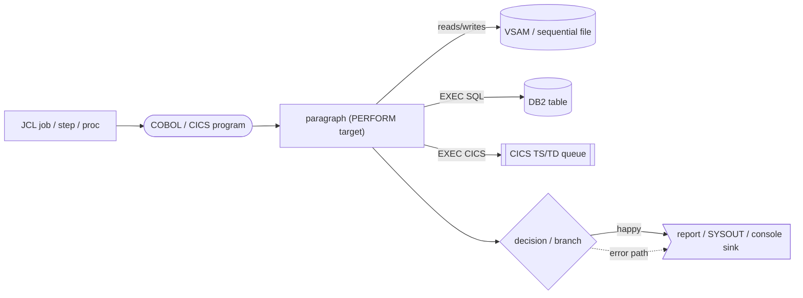

- Rounded `([ ])` = a program load module (`PGM=`) or CICS program.
- Cylinder `[( )]` = a persisted data store (DB2 table, VSAM/sequential dataset).
- Subroutine `[[ ]]` = a CICS queue (Temporary Storage / Transient Data).
- Diamond `{ }` = a conditional; **both** branches are always shown.
- Solid edge = happy path / normal flow. **Dotted edge = error / abend / soft-fail path.**
- Edge labels reference business rules `BR-002-xx` from the BP-002 spec where applicable.
- `RC=16` (`MOVE +16 TO RETURN-CODE`) is the universal batch hard-fail; `COND=(4,LT)` in the procs propagates it as a pipeline stop.

---

## 2. System context — the deal lifecycle

BP-002 is the lifecycle-bearing process. The programs are **chained by data stores**, each scheduled independently (CICS poll, daily, weekly, end-of-period). The diagram below is the system context; §4 expands each box to paragraph level.

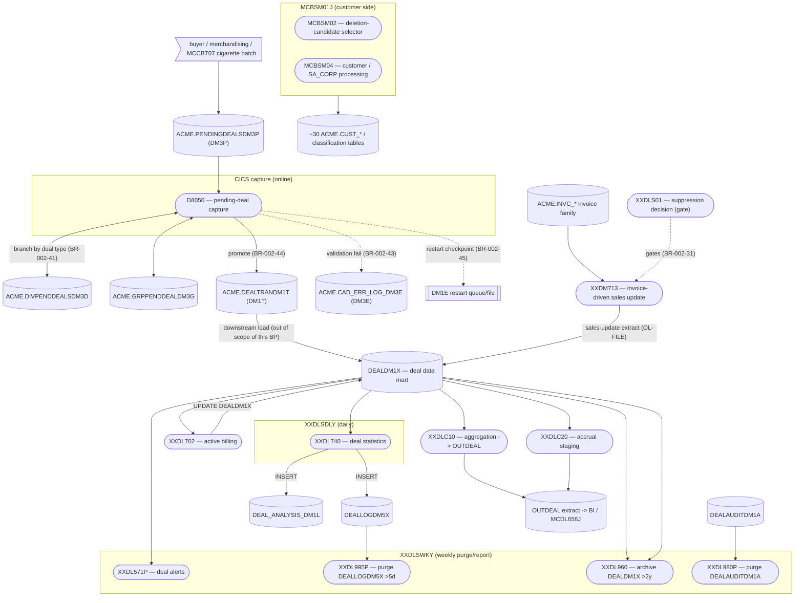

**Lifecycle reading:** `pending (DM3P) → capture (D8050 → DM1T) → … → active billing (XXDL702 on DEALDM1X) → accrual (XXDLC20) / aggregation (XXDLC10) → sales update (XXDM713) → statistics (XXDL740) → alerts/purge/archival (XXDLSWKY chain)`, with **suppression** (`XXDLS01`) as a pure decision gate and **MCBSM02/04** maintaining the customer master the deals hang off.

---

## 3. Entrypoint inventory

Resolved from `acme.perm.jcl/` and `ds.perm.proclib/` (`EXEC PGM=` / `EXEC PROC=`):

| Program | Entry style | Proc | Parent job | Notes |
|---|---|---|---|---|
| `D8050` | **CICS transaction** | — | — | Online polling txn; no `EXEC PGM=` in batch JCL. Uses `EXEC CICS`. |
| `XXDLS01` | **Called subroutine** | — | — | `PROCEDURE DIVISION USING DLS01LNK-REC`; caller not in exported corpus `[GAP]`. |
| `XXDL702` | batch, per division | `XXDL702P` (`PGM=XXDL702,PARM='&DI2'`) | proc not referenced by an exported job `[GAP]` | `COND=(4,LT)`. |
| `XXDLC10` | batch | — | **no JCL/proc in corpus** `[GAP]` | Reads `INAUD`, writes `OUTDEAL`. Division from `ACCEPT`. |
| `XXDLC20` | batch | — | **no JCL/proc in corpus** `[GAP]` | Reads `RDR1`+`INACCR`, writes `OUTDEAL`. |
| `XXDM713` | batch, per division | `XXDM713P` (`PGM=XXDM713,PARM=&DI2`) | `XXDL650J` (step `XXDM713P`) | After `XXDL655P`/`XXDL652P`; `COND=(4,LT)`. |
| `XXDL960` | batch, per division | `XXDL960P` (`PGM=XXDL960,PARM='&DI2'`) | `XXDLSWKY` (weekly, step 5 of purge chain) | `COND=(4,LT)`. |
| `XXDL740` | batch, per division | `XXDL740P` (`PGM=XXDL740,PARM='&DI2'`) | `XXDLSDLY` (daily) | Many VSAM masters + DB2. |
| `MCBSM02` | batch | `MCBSM02P` (`PGM=MCBSM02,COND=(0,NE)`) | `MCBSM01J` | `INFILE=DS.PERM.DSBSM1S1`. |
| `MCBSM04` | batch | `MCBSM04P` (`PGM=MCBSM04,COND=(0,NE)`) | `MCBSM01J` | `INFILE1/2=DS.PERM.DSBSM3S1/2`, `LICDATA`. |

**Parent-job step sequences (verified):**

- `XXDLSDLY` (daily): `XXDLSBKP → DELTEMP → SORT1 → XXDL740P → XXDL520P → XXDL521P → XXDL711P`.
- `XXDLSWKY` (weekly): **`XXDL530P → XXDL570P → XXDL571P → XXDL995P → XXDL960P → XXDL980P`** — the 6-step report+purge chain (BR-002-90/91/92).
- `XXDLSEOP` (end-of-period): `XXDL510P → XXDL540P → XXDL550P → DELACCR → XXDL741P → XXDL742P`.
- `XXDL650J`: `XXDL655P → SORT1 → XXDL652P → XXDM713P → SORTBD2T → XXDL699P → IEFBR14`.
- `MCBSM01J`: `MCBSM01P → MCBSM02P → MCBSM03P → MCBSM04P → LICPRT(SORT) → MCBSM05P → MCBSM07P → XXBSM20P`.

---

## 4. Core anchor deep dives (paragraph level)

Each subsection: entry/linkage, file+DD+DCLGEN wiring, paragraph-level control-flow flowchart (happy = solid, error/abend = dotted, all branches drawn), data sources/sinks, and `BR-002-xx` traceability.

### 4.1 `XXDLS01` — Deal Suppression decision function

**Entry:** `PROCEDURE DIVISION USING DLS01LNK-REC` (copybook `DLS01LNK`). A pure, in-process, **called** subroutine — no files, no CICS, only embedded DB2 reads. Inputs: division code/part, customer number, item number, deal type, invoice date, form of payment. Output: `DLS01-DEAL-SUPP-SW ∈ {'Y','N'}` and `DLS01-RET-CODE`.

**Data sources (all `SELECT … FETCH FIRST ROW ONLY`, read-only):** `ACME.PROF_HDR_PR1P`, `ACME.PROF_CUS_PR3Q`, `ACME.PROF_ITM_PR5Q`, `ACME.PROF_ITM_GRP_PR3P`, `ACME.CUST_XREF_CU1X`, `ACME.DIVMSTRDI1D`. **No data sinks** (the only state mutated is the per-call in-memory caches `WS-CUST-TABLE` / `WS-ITEM-TABLE`).

```mermaid
flowchart TD
  s(["0000-MAINLINE-PARA — USING DLS01LNK-REC"]) --> reset{"WS-FIRST-SW='Y' OR DLS01-DIV-CODE ≠ WS00-DIV-CODE OR DLS01-DIV-PART ≠ WS00-DIV-PART? (BR-002-02)"}
  reset -->|yes| clr["WS-FIRST-SW='N'; clear WS-CUST-TABLE, WS-ITEM-TABLE"]
  reset -->|no| init
  clr --> init["1000-INITIALIZE-PARA"]

  init --> pkg["SET CURRENT PACKAGESET = :W-DB2-PACKAGESET"]
  pkg --> pkgChk{"SQLCODE = 0?"}
  pkgChk -.->|"no: RET-CODE=+16, GO 0000-END"| endp(["0000-END-PROCESSING: GOBACK"])
  pkgChk -->|yes| seed["RET-CODE=0; DEAL-SUPP-SW='N'; copy linkage inputs to WS00-* keys"]
  seed --> proc["2000-PROCESS-PARA"]

  proc --> cust["2100-LOAD-CUST-SWITCH"]
  cust --> custCache{"WS-CUST-SW(custNum)?"}
  custCache -->|"'N' (known not-suppressed)"| custDone["leave cache 'N'"]
  custCache -->|"'Y' (cached)"| custProceed
  custCache -->|"unset (≠'Y')"| custSql["SELECT 1 FROM PR1P,PR3Q,DI1D,CU1X WHERE PROF_TYP='DLS' AND OK_TO_ACTIVE_SW='Y' AND CU1X.DELT_SW='N' AND keys… FETCH FIRST ROW ONLY (BR-002-03)"]
  custSql --> custEval{"EVALUATE SQLCODE"}
  custEval -->|"0: WS-CUST-SW(custNum)='Y'"| custProceed{"WS-CUST-SW(custNum)='Y'?"}
  custEval -->|"100: WS-CUST-SW(custNum)='N'"| custProceed
  custEval -.->|"other: RET-CODE=+11, save SQLCA, GO 0000-END"| endp

  custProceed -->|no| endp2(["return SUPP-SW='N'"])
  custProceed -->|yes| item["2200-LOAD-ITEM-SWITCH (BR-002-04)"]
  item --> itemCache{"WS-ITEM-SW(itemNum)?"}
  itemCache -->|"'N'"| itemProceed
  itemCache -->|"'Y'"| itemProceed
  itemCache -->|"unset"| itemSql["SELECT 1 FROM PR1P,PR5Q WHERE PROF_TYP='DLS' AND OK_TO_ACTIVE_SW='Y' AND PR5Q.DIV_PART IN (0,:part) AND PR5Q.CATLG_NUM=:item FETCH FIRST ROW ONLY"]
  itemSql --> itemEval{"EVALUATE SQLCODE"}
  itemEval -->|"0: ITEM-SW='Y'"| itemProceed{"WS-ITEM-SW(itemNum)='Y'?"}
  itemEval -->|"100: ITEM-SW='N'"| itemProceed
  itemEval -.->|"other: RET-CODE=+11, save SQLCA, GO 0000-END"| endp

  itemProceed -->|no| endp2
  itemProceed -->|yes| deal["2300-LOAD-DEAL-SWITCH (BR-002-05)"]
  deal --> dealSql["SELECT 'Y' FROM (PR1P⋈PR3Q⋈PR5Q⋈CU1X⋈DI1D WHERE EFF_DT≤:invDt≤END_DT …) X LEFT JOIN PROF_ITM_GRP_PR3P (CLS_TYP='DLSTYP') Y ON PROF_ID WHERE Y.CLS_ID IS NULL OR Y.CLS_ID = (lastDigit(dealType) ‖ formOfPayment) FETCH FIRST ROW ONLY"]
  dealSql --> dealEval{"EVALUATE SQLCODE"}
  dealEval -->|"+0: DEAL-SUPP-SW='Y'"| endp
  dealEval -->|"+100: DEAL-SUPP-SW='N'"| endp
  dealEval -.->|"other: RET-CODE=+11, save SQLCA, GO 0000-END"| endp
```

**Notes / rules realized:** BR-002-01 (`DEAL-SUPP-SW` seeded `'N'`), BR-002-02 (cache reset on first-call or division change — lines 92-98), BR-002-03/04/05 (the three nested suppression checks; item is only checked if customer matched, deal only if both matched — lines 135-140), BR-002-06 (`WHEN OTHER → RET-CODE=+11`, `MOVE SQLCA TO DLS01-SQLCA`, never silently swallowed), BR-002-07 (final switch is `'Y'`/`'N'`). The package-set failure path returns `+16`. The caches are `OCCURS 999999` arrays indexed directly by customer/item number — a per-call short-circuit so repeated keys skip DB2.

> **Decision-function purity** (modernization §8 of the spec): `XXDLS01` is side-effect-free except for its caches; it is the cleanest extraction candidate.

---

### 4.2 `XXDL702` — Active Billing Deal handler

**Entry:** `PROCEDURE DIVISION USING PARM-DATA` (`PARM='&DI2'` = division). Proc `XXDL702P`.

**File / DD wiring (`XXDL702P` + `XXDL702.cbl` `SELECT`s):**

| Logical file | DD | Dataset | Access |
|---|---|---|---|
| `READER` | `RDR1` | processing-date card | input — the run/processing date `RD00-DPDATH` |
| `XXROF` | `XXROF` | `&&&DI2.DM7001` (passed) | output — reader-echo record |
| `XXOUT` | `XXOUT` | `&DI2..PERM.DL702.DEALS` | output — `OUT-RCD` current/future deal extract |
| (DB2) | `SQLBATCH` | `DEALDM1X`, `ACME.DIV_ITEM_PACK_DE1I`(+`DE1O`,`DE6C`,`DI1D`) | `EXEC SQL` cursors `DM00-CUR1`, `DE1I-CUR` |

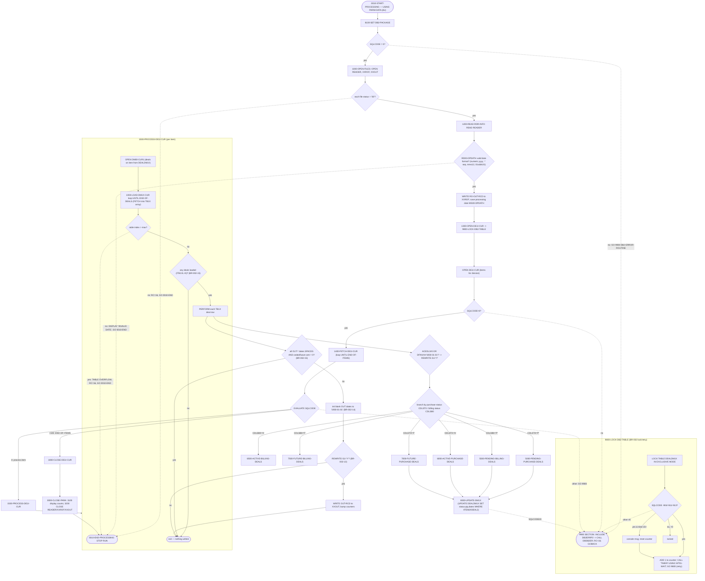

**`6500-ACTIVE-BILLING-DEALS` (the BR-002-10/11/12 core):**

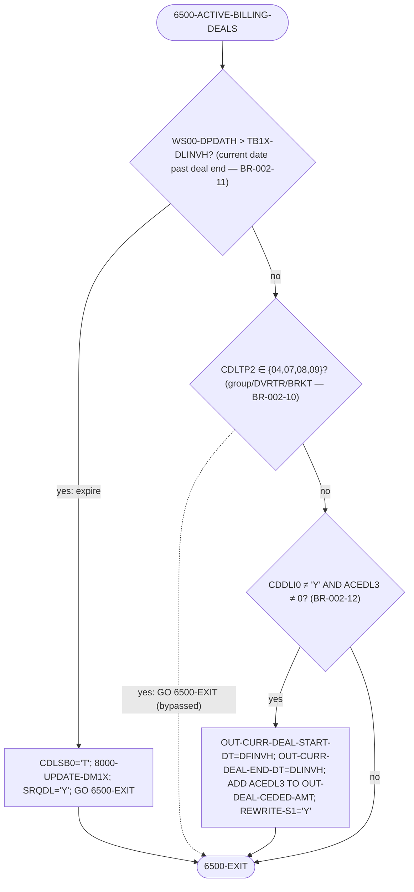

**Notes / rules realized:** BR-002-10 (bypass `CDLTP2 = 04/07/08/09` — **resolves the spec's open question** on which type codes are group/DVRTR/BRKT), BR-002-11 (`WS00-DPDATH > DLINVH` ⇒ status `'T'` terminated), BR-002-12 (`CDDLI0 ≠ 'Y'` — **the "'Y' type" = a deal already rolled into the current deal** — AND non-zero `ACEDL3` ⇒ copy start/end + `ADD ACEDL3 TO OUT-DEAL-CEDED-AMT`), BR-002-13 (`WRITE OUT-RCD` only when `REWRITE-S1='Y'`), BR-002-14 (blank `OUT-*` dates set to `'1900-01-01'` before write), BR-002-15 (no deals → clean exit). `8200-FLOR-STOCK-CALCULATION` recomputes floor-stock (`AFLST3`) and count/recount (`ABLBK3`) billback amounts from `WS-ITEM-RPK`. The exclusive `LOCK TABLE DEALDM1X` with `CALL 'TIMER'` retry on `-904/-911/-913` mirrors the `XXDL740` lock pattern. DB2 errors funnel to the `9900-DB2-ERROR-ROUTINE` SECTION (`INCLUDE DB2ERRP2` → `CALL DBDB2ER`, `RC=16`, `GOBACK`).

---

### 4.3 / 4.4 `XXDLC10` (aggregation) & `XXDLC20` (accrual) — twin extract programs

These two are structural **twins**: read a flat input file → stage rows in a **`SESSION.` DB2 global temporary table** → open a cursor joining the temp table to `DEALDM1X` + `ACME.DIVMSTRDI1D` + `ACME.DT_JS1A` → write the aggregated `OUTDEAL` extract. The division is taken from `ACCEPT WS-ACCEPT-INPUT` (SYSIN). Differences are tabulated after the shared flowchart.

| Logical file | DD | XXDLC10 | XXDLC20 |
|---|---|---|---|
| input | `INAUD` / `INACCR` | audit transactions (`IN-REC`) | accrual records (`IN-VEN-NXT-BILBCK-AMT`) |
| date card | — / `RDR1` | (none) | end-of-processing date `RDR-DT → EOP-DT` (BR-002-70) |
| output | `OUTDEAL` | aggregated deal extract | aggregated accrual extract |
| temp table | `SESSION.AUD_DEALS` | `(DIV_ID,TRANS,ITEM_NUM,DEAL_ID,QTY,AMT,DT)` | `SESSION.ACCR_DEALS` `(ITEM_NUM,DEAL_ID,AMT)` (BR-002-71/72) |
| cursor `DEAL-CSR` | join | `DEALDM1X ⋈ SESSION.AUD_DEALS ⋈ DIVMSTRDI1D ⋈ DT_JS1A` (BR-002-62) | `DEALDM1X ⋈ SESSION.ACCR_DEALS ⋈ DIVMSTRDI1D ⋈ DT_JS1A` |

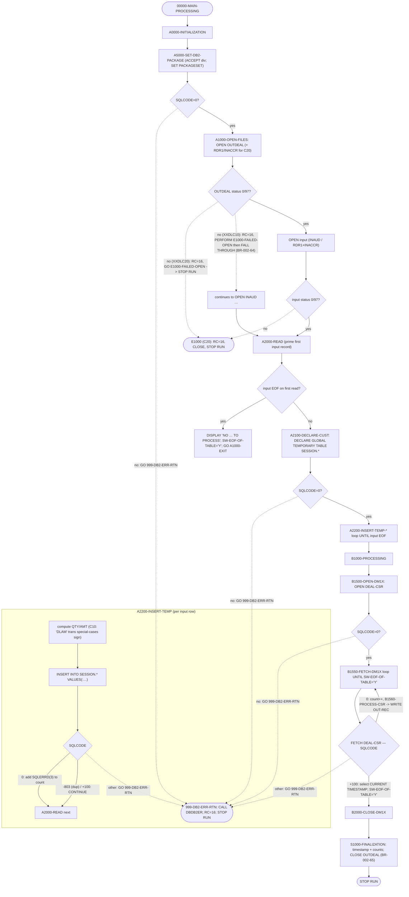

**Notes / rules realized:** BR-002-60 (`B1000-PROCESSING` loops until `SW-EOF-OF-TABLE='Y'`), BR-002-61 (temp staging of div/trans/item/deal/qty/amt/date), BR-002-62 (aggregating join to `DEALDM1X` + masters; unique item key built in `B1560`), BR-002-65 (`S1000` displays OUTDEAL-written + DM1X-fetched + timestamp + division). BR-002-70/71/72 are XXDLC20-specific (reads `EOP-DT` from `RDR1`; `SESSION.ACCR_DEALS` aggregates by item/deal).

> **BR-002-64 confirmed (latent bug in `XXDLC10`):** in `A1000-OPEN-FILES` a bad `OUTDEAL` open does `MOVE +16 TO RETURN-CODE` then **`PERFORM E1000-FAILED-OPEN`** (not `GO TO`), and `E1000-FAILED-OPEN` has its `MOVE +16 TO RETURN-CODE` **commented out** (line 598) and **no `STOP RUN`** — so control **falls through** and the program keeps running after a failed open. The twin `XXDLC20` does it correctly: `GO TO E1000-FAILED-OPEN`, which keeps `MOVE +16` and ends with `STOP RUN` (lines 596-598). This is a real divergence between the twins, worth `[SME]` confirmation.

---

### 4.5 `XXDL960` — Deal Archival (purge `DEALDM1X` > 2 years)

**Entry:** `PROCEDURE DIVISION USING PARM-DATA` (`PARM='&DI2'`). Proc `XXDL960P`; weekly via `XXDLSWKY` step 5. **No files** — pure DB2 cursor read + row-by-row delete. Cursor `DM00-CUR1` selects from `DEALDM1X`.

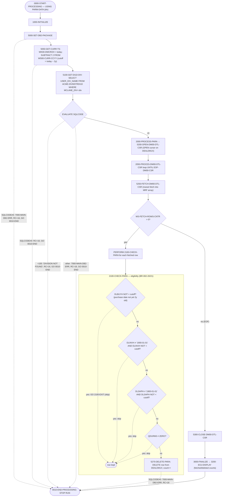

**Notes / rules realized:** BR-002-20 (eligible when older than 2 years), BR-002-22 (cursor + row-by-row delete, no bulk delete). **BR-002-21 AND/OR semantics resolved:** the four sequential `GO TO …-EXIT` guards make the predicate a logical **AND** — a row is deleted only when `DLBUYH < (today−2y)` **AND** (`DLINVH` is the `'1900-01-01'` default **or** `< cutoff`) **AND** (`DLSHPH` is default **or** `< cutoff`) **AND** `QDURM3 = 0`. So the purchase-history date `DLBUYH` is the mandatory driver; the invoice/ship history dates only block deletion when they are *populated and newer than the cutoff*. Idempotency (BR-002-23) holds because re-running re-selects only still-eligible rows.

---

### 4.6 `XXDM713` — Deal Sales Update (invoice-driven)

**Entry:** `PROCEDURE DIVISION USING PARM-DATA` (`PARM=&DI2`). Proc `XXDM713P`; parent job `XXDL650J` (after `XXDL655P`/`XXDL652P`). Reads the invoice family and emits per-deal sales-update records.

**File / DD wiring:**

| Logical file | DD | Dataset | Access |
|---|---|---|---|
| `OL-FILE` | `DMDLU` | `&DI2..PERM.&DI2.DM7121` (DISP=MOD) | output — sales-update records (`DM4X` layout) |
| `QE-FILE` | (SYSOUT/report) | error + summary report | output |
| `BDDTS` | `BDDTS` | `&DI2..TEMP.BDDTS3` | output — processed-invoice timestamp markers |
| (DB2) | `SQLBATCH` | `ACME.INVC_HDR_BD1H ⋈ INVC_DTL_COMN_BD1D ⋈ INVC_DTL_ITEM_BD2D` (cursor `BDD_CUR`), `ACME.INVC_TS_BD2T`, `ACME.DIVMSTRDI1D`, control table `CF1D` | `EXEC SQL` |

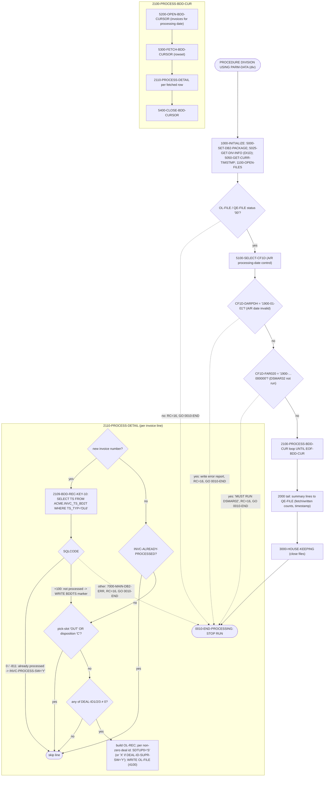

**Notes / rules realized:** `XXDM713` is the **invoice-side** producer of deal-sales updates (cross-ref BP-005). It reads the invoice header/detail/item tables, deduplicates already-processed invoices via `INVC_TS_BD2T` (`TS_TYP='DL6'`, also catching `-811` duplicate), and writes up to **three** sales-update records per invoice line (one per `DEAL-ID1/2/3`). The per-deal **suppression switch** `MRF-DEAL-ID-SUPR-SWn` drives `OL-SDTUP0 = 'S'` (apply) vs `'X'` (suppressed) — this is **where the `XXDLS01` suppression decision is honored on the sales path (BR-002-31)**. Hard-fails: file open, invalid A/R control date, un-run `DSMAR32`, and any unexpected SQLCODE all set `RC=16` and `GO 0010-END`.

---

### 4.7 `D8050` — Pending-Deal Capture (CICS polling transaction)

**Entry:** CICS transaction (online), `PROCEDURE DIVISION` with no `USING`. The lifecycle **gateway**: it polls pending deals, runs six promotion edits, and promotes survivors from the pending tables (`DM3P`/`DM3D`/`DM3G`) into the **Deal Transaction** table `ACME.DEALTRANDM1T` (`DM1T`). Failures go to the **CAD error log** `ACME.CAD_ERR_LOG_DM3E` (`DM3E`); restart checkpoints to the **`DM1E` VSAM file** via `EXEC CICS WRITE`.

**External interfaces (verified):** `EXEC CICS LINK PROGRAM('CM510ZO')` (loads `ICPDL2` and builds the per-task **TS queue**), `EXEC CICS READQ` (reads staged pending rows from that TS queue in `X10000`), `EXEC CICS WRITE` (`DM1E` restart file), `EXEC CICS SYNCPOINT` / `SYNCPOINT ROLLBACK` (unit-of-work commit/back-out per deal), `EXEC CICS ENQ`/`DEQ` (serialize), `EXEC CICS HANDLE`/`IGNORE`. **No MQ.**

**DB2 access:** reads `ACME.PENDINGDEALSDM3P`, `ACME.DIVPENDDEALSDM3D`, `ACME.GRPPENDDEALDM3G`, `ACME.DIVMSTRDI1D`(`DV1D`), `ACME.DIV_ITEM_ALT_DE1A`(`DE1I-*`), `ACME.ITM_COST_DE8E`, `ACME.CAD_REMARK_DM3R`, vendor `VN1A`; writes `ACME.DEALTRANDM1T` (INSERT), `ACME.CAD_ERR_LOG_DM3E` (INSERT via `C00900`), `ACME.DEAL_PGM_AUD_DM2A` (run audit), `DM3D`/`DM3G` (UPDATE/DELETE).

**Top-level flow (`A00000-MAIN`):**

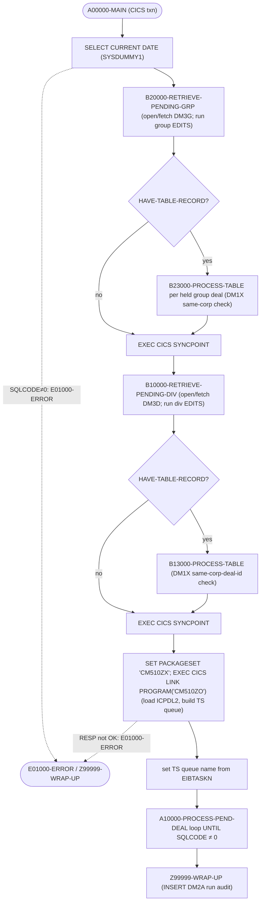

**Per-deal promotion (`A10000` → `A11000`/`A12000`):**

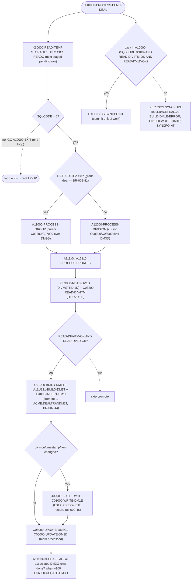

**The six promotion edits (`B10000` divisional / `B20000` group) — each failure deletes the pending row and inserts a `DM3E` row with a distinct error code (BR-002-42 / BR-002-43):**

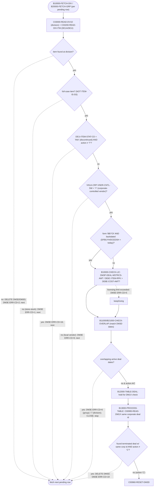

**Notes / rules realized:** BR-002-40 (polls `DM3P`), BR-002-41 (`CDLTP2 = 8` ⇒ group path `DM3G`, else divisional `DM3D`), BR-002-42 (the six edits with verified `DM3E-ERR-CD` mapping: **division/item-not-found=2, store-stock=1, item-discontinued=16, corporate-vendor-control=9, licensing-limit=5, overlap=6 group / 7 division, existing-terminated-same-corp-deal=19**; plus group-only `ERR-CD=18` for the `'NA'` forced-`01` delete), BR-002-43 (failures → `C00900-INSERT-DM3E` into `ACME.CAD_ERR_LOG_DM3E` plus delete of the rejected pending row), BR-002-44 (`C04000-INSERT-DM1T` into `ACME.DEALTRANDM1T`), BR-002-45 (`C01000-WRITE-DM1E` via `EXEC CICS WRITE` to the VSAM restart file), BR-002-47 (`CM510ZO` via `EXEC CICS LINK` during init loads `ICPDL2` and builds the TS queue read by `X10000`). Each promoted deal is a CICS **unit of work** committed by `SYNCPOINT`; any read/build failure triggers `SYNCPOINT ROLLBACK` + a restart-error `DM1E` record. The run-level audit row is written to `ACME.DEAL_PGM_AUD_DM2A` in `Z99999-WRAP-UP`.

> **Gateway risk (spec §8):** breaking `D8050` stalls the whole lifecycle. The six edits are the **deal-promotion contract** and should become named, testable validators; the `DM3P → DM1T` semantics must be preserved on cutover.

---

### 4.8 `XXDL740` — Deal Statistics Update Report

**Entry:** `PROCEDURE DIVISION USING PARM-DATA` (`PARM='&DI2'`). Proc `XXDL740P`; daily via `XXDLSDLY`. The largest core program (~4,500 lines, ~57 paragraphs). Config-driven (VSAM + `DS.APPL_SYS_PARM_AP1S` `GL-CUR` cursor on `PARM_ID LIKE 'DL740_%'`), random-access masters, exclusive locks on the three deal tables, and a `DEAL_ANALYSIS_DM1L` / `DEALLOGDM5X` insert path.

**File / DD wiring (`XXDL740P` + `SELECT`s):**

| Logical file | DD | Dataset | Access |
|---|---|---|---|
| `SI-FILE` | `XXSIMMF` | `&DI2..MSTR.SIM` | input (dynamic) — item master |
| `AP-FILE` | `MCVEN` | `ACME.MSTR.VEN` | input (random by vendor) — AP vendor (BR-002-54) |
| `MV-FILE` | `XVEND1` | `&DI2..MSTR.VND` | input — division vendor |
| `BY-FILE` | `XCSXX1` | `&DI2..MSTR.OPR` | input (random by buyer) — buyer (BR-002-54) |
| `UP-FILE` | `XXUPD` | `ACME.MSTR.UPD` | input — cost-center |
| `BB-FILE` | `XXDMD` | `&DI2..MSTR.DMD` | input — BB extracts |
| `TX-FILE` | `DL7401` | `&DI2..TEMP.DM7401` | input — sorted updates |
| `QM-FILE` | `RPQDM` | report | output |
| (DB2) | `SQLBATCH` | cursors `DI3X-CUR1`, `DM1X-CUR1`, `DL00-CUR1`, `GL-CUR`; tables `DEALDM1X`, `DEALLOGDM5X`, `DEAL_ANALYSIS_DM1L`, `ACME.MCLANE_XREF_DI3X`, `DIVMSTRDI1D`, `DIV_ITEM_PACK_DE1I`, `ITEM_GRP_DE1E`, `ITEM_UPC_DE6Y`, `CLS_GRP_DESC_CU2B`, `DS.APPL_SYS_PARM_AP1S` | `EXEC SQL` |

```mermaid
flowchart TD
  s(["0010-START-PROCESSING — USING PARM-DATA (div)"]) --> initp["1000-INITIALIZE-PARA"]

  subgraph initb ["1000-INITIALIZE-PARA"]
    direction TB
    ld["1100-LOAD-DATE → 6300-CALL-DATETIME (CALL 'DATETIME'); SET PACKAGESET; current time"]
    ld --> di3x["1125/1150/1175-DI3X-CURSOR: load vendor xref array from ACME.MCLANE_XREF_DI3X (UNTIL DI3X-EOF)"]
    di3x --> dsetup["1200-DATE-SETUP (CALL DA-UT516XP→UT516XP fiscal dates)"]
    dsetup --> stop{"WS-STOP-RUN-FLAG = SPACES?"}
    stop -->|yes| lk1["1300-DEALDM1X (LOCK TABLE … EXCLUSIVE)"]
    lk1 --> lk2["1400-DEALLOGDM5X (LOCK)"]
    lk2 --> lk3["1500-DEAL-ANALYS (LOCK DEAL_ANALYSIS_DM1L)"]
    lk3 --> fo["1700-FILE-OPEN; 1800-LOAD-TABLE (config from AP1S GL-CUR / 9220-GET-TAB-VALUES)"]
  end

  subgraph lockretry ["1300/1400/1500 — exclusive-lock wait/retry (BR-002-52)"]
    direction TB
    lkloop["PERFORM UNTIL WS-PERFORM-FLAG='Y'"]
    lkloop --> lksql["LOCK TABLE <t> IN EXCLUSIVE MODE"]
    lksql --> lkeval{"SQLCODE -904/-911/-913?"}
    lkeval -->|"yes & counter=15"| lkmsg["console *TIMER3 alert; reset counter"]
    lkeval -->|"yes"| lkwait["counter++; CALL 'TIMER' USING WTxx-WAIT; retry"]
    lkeval -->|"no"| lkok["WS-PERFORM-FLAG='Y'"]
    lkmsg --> lkwait
  end

  initp -.->|"after each 1300/1400/1500: IF SQLCODE≠0 → 999-DB2-ERR-RTN"| dberr(["999-DB2-ERR-RTN (DB2ERRP2 → DBDB2ER / DSNTIAR); RC=16"])
  initp --> proc["2000-PROCESS-PARA: 2100-MAIN-PROCESS loop UNTIL END-OF-ALL = ALL 'Y'"]

  subgraph mp ["2100-MAIN-PROCESS"]
    direction TB
    rseq["2110-READ-SEQ (TX-FILE sorted updates; random reads AP/BY/SI per BR-002-54)"]
    rseq --> cmp{"compare update key vs deal: < / = / >"}
    cmp -->|"<"| less["2120-UPD-LESS-DEAL"]
    cmp -->|"="| eq["2130-UPD-EQ-DEAL"]
    cmp -->|">"| gt["2140-UPD-GT-DEAL → 2140-BLBCK-PRC-1..5 (billback) → 2140-UPD-CHECK; 2141-NEXT-BILL-DATE"]
    eq --> ins["5500-INS-DEALLOG (INSERT DEALLOGDM5X); 5600-INS-DEALANA (INSERT DEAL_ANALYSIS_DM1L via DL00-CUR1)"]
    gt --> ins
  end

  proc --> rpt["4100-DEAL-STAT-REPORT → 4110-WRITE-HEADER / 4120-REPORT-PROCESS / 4130-WRITE-DETAIL / 4200-WRITE-BB-FILE"]
  rpt --> close["3000-CLOSE-PARA → 3100-CLOSE-FILE"]
  close --> endp(["0010-END-PROCESSING: STOP RUN"])

  fo -.->|"file OPEN/READ/WRITE error"| abort(["E1000-ABORT / E1001-ABORT: display FD/status/record; 3000-CLOSE; (forced abend via ILBOABN0)"])
  ins -.->|"INSERT SQLCODE≠0"| dberr
```

**Notes / rules realized:** BR-002-50 (config from input VSAM + `DS.APPL_SYS_PARM_AP1S` `GL-CUR` (`APPL_ID='GLENT'`, `PARM_ID LIKE 'DL740_%'`) drives `1800-LOAD-TABLE`/`9220-GET-TAB-VALUES`), BR-002-51 (**verified active calls:** `DATETIME` (6300), `UT516XP` via `DA-UT516XP` (1759/2196/3458), `DC502YP` (4305); `XXDC608`, `DSNTIAR`, `ILBOABN0` are named in the program's subroutine-doc block and reached through the DB2 error macro / forced-abend path rather than direct `CALL` sites in this source version), BR-002-52 (the `LOCK TABLE … IN EXCLUSIVE MODE` wait-and-retry loop on each of `DEALDM1X`/`DEALLOGDM5X`/`DEAL_ANALYSIS_DM1L`, `CALL 'TIMER'` between retries, operator `*TIMER3` alert every 15 tries — verified verbatim), BR-002-53 (`E1000`/`E1001-ABORT` file-abort handlers; forced abend), BR-002-54 (`AP-FILE` random by vendor, `BY-FILE` random by buyer, `SI-FILE` dynamic).

---

### 4.9 `MCBSM02` — Customer move / class-group maintenance

**Entry:** `PROCEDURE DIVISION` (batch). Proc `MCBSM02P` (`COND=(0,NE)` — runs only if all prior steps were clean), parent `MCBSM01J`. Input `INFILE = DS.PERM.DSBSM1S1` (customer move records: from-division / to-division), report to `PRINTER1`.

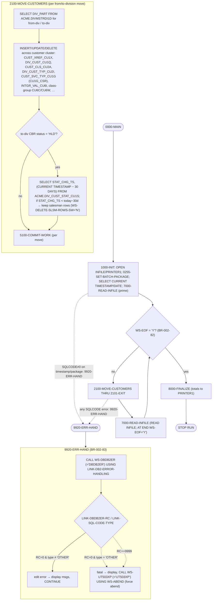

**Notes / rules realized & corrections:** BR-002-82 (main loop `UNTIL WS-EOF='Y'`, `7000-READ-INFILE` sets EOF — confirmed), BR-002-84 (`PRINTER1` report with program/timestamp/division), BR-002-83 (DB2 errors via `CALL DBDB2ER`; fatal → abend; `5100-COMMIT-WORK` / `5200-ROLLBACK-WORK` manage the unit of work). Calls resolved: `DBDB2ER` (`WS-DBDB2ER`), `UT503XP` (`WS-UT503XP`, abend utility), `MCCUI73` (`WS-MCCUI73-PGM`), `DSBSM31` (`WS-DSBSM31-PGM`), `MCCUB03`.

> **Grounded corrections to BR-002-80/81 (flagged in §10):** the current `MCBSM02` source is a **customer move / class-group maintenance** program (not a generic "deletion-candidate selector"). The date threshold present is **30 DAYS** (`CURRENT TIMESTAMP − 30 DAYS` against `STAT_CHG_TS` of `ACME.DIV_CUST_STAT_CU1S` when the to-division CBR status is `'HLD'`), **not 45 days on `CREATE_TS`**. User-id `'MCBSM02'` is used as an author stamp on written rows; **`'XXEBM39'` does not appear anywhere in `MCBSM02` or `MCBSM04`**. The spec's BR-002-80/81 appear to describe a different/older program.

---

### 4.10 `MCBSM04` — Customer / SA_CORP processing orchestrator

**Entry:** `PROCEDURE DIVISION` (batch). Proc `MCBSM04P` (`COND=(0,NE)`), parent `MCBSM01J`. Inputs `INFILE1=DS.PERM.DSBSM3S1`, `INFILE2=DS.PERM.DSBSM3S2`; outputs `LICDATA=DS.PERM.MCBSM04.LICDATA` and `PRINTER1`. Touches ~30 customer/classification/division-customer tables — a JCL-launched leaf with no COBOL callers.

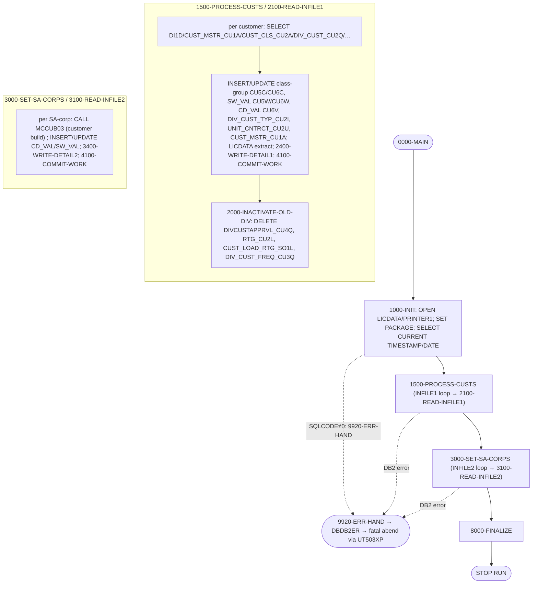

**Notes / rules realized:** customer/SA_CORP orchestrator with the documented paragraph spine `0000-MAIN → 1000-INIT → 1500-PROCESS-CUSTS → 3000-SET-SA-CORPS → 8000-FINALIZE`. DB2 access spans ~30 `ACME.CUST_*` / classification / division-customer tables (verified in the table dump: `CUST_MSTR_CU1A`, `CUST_CLS_CU2A`, `DIV_CUST_CU1Q/CU2Q`, `DIV_CUST_TYP_CU2I`, `DIVCUSTAPPRVL_CU4Q`, `UNIT_CNTRCT_CU2U`, `CUST_LICNS_CU1K`, `CUST_LOAD_RTG_SO1L`, `RTG_CU2L`, `CUST_CNTCT_CU2C`, `CD_VAL_CU4V/CU6V`, `SW_VAL_CU5W/CU6W`, `CLS_GRP_ATRBT_CU5C/CU6C`, `CUST_CLS_GRP_CU2E`, `ENT_CLS_HIER_CM1J`, `ITEMAUTHST1A`, `DS.APPL_SYS_PARM_AP1S`, `DS.APPL_DIV_PARM_AP2S`). Calls resolved: `MCCUB03` (customer build), `DBDB2ER` (`WS-DBDB2ER`), `UT503XP` (`WS-UT503XP`, abend). `4100-COMMIT-WORK` / `4200-ROLLBACK-WORK` bound the unit of work; fatal DB2 errors abend through `9920-ERR-HAND`.

---

## 5. Lighter overview — the rest of BP-002 around the core

The ten core programs sit inside a wider set of reporting, group/mass-deal, and JCL-orchestrated cycles. The graph below places them; boxes drawn at full paragraph depth in §4 are marked `(★)`.

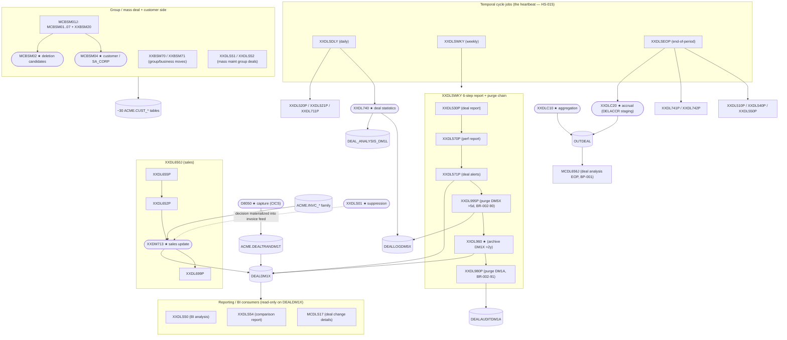

**Notes on the wider set (from BP-002 spec §2 + verified orchestration):**

- The **6-step weekly chain** (`XXDLSWKY`) is the verified parent of `XXDL960`: `XXDL530P` (upcoming/recent buy/ship report) → `XXDL570P` (perf report) → `XXDL571P` (deal alerts; reads processing date from `RDR1`, ±7-day window, categorises active/future/inactive/terminated — BR-002-92) → `XXDL995P` (purge `DEALLOGDM5X` > 5 days via `FCURRF` — BR-002-90) → `XXDL960P` (archive `DEALDM1X` > 2y) → `XXDL980P` (purge `DEALAUDITDM1A`, retention = `DS.APPL_SYS_PARM_AP1S.XXDL980_DM1A_DAYS`, default 60 — BR-002-91).
- `XXDLC10` / `XXDLC20` produce the `OUTDEAL` extract that feeds BI / `MCDL656J` (the BP-001 EOP deal-analysis pipeline).
- Reporting consumers (`XXDLS50`, `XXDLS54`, `MCDLS17`, `XXDL740`) are **read-mostly** on `DEALDM1X` (`XXDL740` also inserts the log/analysis tables).
- The **customer side** (`MCBSM01J`) maintains the `ACME.CUST_*` master the deals reference; `MCBSM02`/`MCBSM04` are drawn at full depth in §4.9 / §4.10.

---

## 6. Data dictionary

### 6.1 DB2 tables (BP-002 core)

| Table | DCLGEN | Written by | Read by | Role |
|---|---|---|---|---|
| `ACME.PENDINGDEALSDM3P` | `DGDM3P` | upstream (`MCCBT07`, buyer) | `D8050` | Pending-deal capture queue |
| `ACME.DIVPENDDEALSDM3D` | `DGDM3D` | `D8050` (UPDATE/DELETE) | `D8050` | Divisional pending detail |
| `ACME.GRPPENDDEALDM3G` | `DGDM3G` | `D8050` (UPDATE/DELETE) | `D8050` | Group pending detail |
| `ACME.DEALTRANDM1T` | `DGDM1T` | `D8050` (INSERT) | — *(no consumer in corpus, see §10)* | Deal Transaction system-of-record |
| `ACME.CAD_ERR_LOG_DM3E` | `DGDM3E` | `D8050` | (9 programs) | CAD validation-error log |
| `ACME.DEAL_PGM_AUD_DM2A` | `DGDM2A` | `D8050` (INSERT) | (2 programs) | Deal-program run audit |
| `ACME.CAD_REMARK_DM3R` | `DGDM3R` | — | `D8050` | CAD remark text |
| `DEALDM1X` | `DGDM1X` | `XXDL702` (UPDATE), `XXDM713`→load, `XXDL960` (DELETE) | 41 programs | **Central deal data mart** |
| `DEAL_ANALYSIS_DM1L` | `DGDM1L` | `XXDL740` (INSERT) | 6 programs | Deal-analysis amounts (lock target) |
| `DEALLOGDM5X` | `DGDM5X` | `XXDL740` (INSERT), `XXDL995P` (purge) | 3 programs | Deal log (lock target) |
| `DEALAUDITDM1A` | `DGDM1A` | `XXDL980P` (purge) | 1 program | Deal audit (60-day retention) |
| `ACME.DIVMSTRDI1D` | `DGDI1D` | — | 138 programs | Division master |
| `ACME.MCLANE_XREF_DI3X` | `DGDI3X` | — | `XXDL740` | Vendor cross-reference |
| `ACME.DT_JS1A` | `DGJS1A` | — | C10/C20/740 | Date → Acme period/year |
| `ACME.DIV_ITEM_PACK_DE1I` | `DGDE1I` | — | `XXDL702`, `XXDL740` | Division item pack/status |
| `ACME.PROF_HDR_PR1P` / `PROF_CUS_PR3Q` / `PROF_ITM_PR5Q` / `PROF_ITM_GRP_PR3P` | (embedded) | — | `XXDLS01` | Suppression profile cluster |
| `ACME.CUST_XREF_CU1X` | `DGCU1X` | `MCBSM02` (DELETE) | `XXDLS01`, `MCBSM02` | Customer cross-reference |
| `ACME.INVC_HDR_BD1H` / `INVC_DTL_COMN_BD1D` / `INVC_DTL_ITEM_BD2D` / `INVC_TS_BD2T` | (BP-005) | `XXDM713` (BD2T markers via BDDTS) | `XXDM713` | Invoice family (sales source) |
| `DS.APPL_SYS_PARM_AP1S` | `DGAP1S` | `MCBSM04`/`XXDL980P` | many | Config / retention parameters |
| `ACME.*CUST_* / classification* (~30)` | (CUxx) | `MCBSM02`/`MCBSM04` | `MCBSM02`/`MCBSM04` | Customer master cluster (§4.9/§4.10) |

### 6.2 Sequential / VSAM datasets

| Dataset (pattern) | DD | Program | Direction | Notes |
|---|---|---|---|---|
| processing-date card | `RDR1` | `XXDL702`, `XXDLC20` | in | run/EOP date |
| `&DI2..PERM.DL702.DEALS` | `XXOUT` | `XXDL702` | out | current/future deal extract |
| `&&&DI2.DM7001` | `XXROF` | `XXDL702` | out | reader echo (passed to `XXDL701`) |
| `INAUD` | `INAUD` | `XXDLC10` | in | audit transactions |
| `INACCR` | `INACCR` | `XXDLC20` | in | accrual records |
| `OUTDEAL` | `OUTDEAL` | `XXDLC10`/`XXDLC20` | out | aggregated deal/accrual extract → BI |
| `&DI2..PERM.&DI2.DM7121` | `DMDLU` | `XXDM713` | out (MOD) | per-deal sales updates (`DM4X`) |
| `&DI2..TEMP.BDDTS3` | `BDDTS` | `XXDM713` | out | processed-invoice timestamp markers |
| `&DI2..MSTR.SIM` | `XXSIMMF` | `XXDL740` | in | item (SIM) master |
| `ACME.MSTR.VEN` | `MCVEN` | `XXDL740` | in (random by vendor) | AP vendor master |
| `&DI2..MSTR.VND` | `XVEND1` | `XXDL740` | in | division vendor master |
| `&DI2..MSTR.OPR` | `XCSXX1` | `XXDL740` | in (random by buyer) | buyer master |
| `&DI2..MSTR.DMD` | `XXDMD` | `XXDL740` | in | BB extracts |
| `&DI2..TEMP.DM7401` | `DL7401` | `XXDL740` | in | sorted updates |
| `ACME.MSTR.UPD` | `XXUPD` | `XXDL740` | in | cost-center |
| `DS.PERM.DSBSM1S1` | `INFILE` | `MCBSM02` | in | deletion-candidate input |
| `DS.PERM.DSBSM3S1/2` | `INFILE1/2` | `MCBSM04` | in | customer/SA_CORP input |
| `DS.PERM.MCBSM04.LICDATA` | `LICDATA` | `MCBSM04` | out | licence extract |
| `PRINTER1` | `PRINTER1` | `MCBSM02`/`MCBSM04` | out | `PRINT-FILE` report (SYSOUT) |
| `SESSION.AUD_DEALS` / `SESSION.ACCR_DEALS` | (DB2 GTT) | `XXDLC10`/`XXDLC20` | scratch | in-session staging table |

### 6.3 Common copybooks / linkage

`DLS01LNK` (`XXDLS01` linkage), `DB2ERRP2`/`DB2GDP1` (SQL `INCLUDE` macros that `CALL DBDB2ER`), `SQLCA`, and the per-program DCLGEN includes (§1.2).

---

## 7. External-interface inventory

BP-002 has **no MQ / Kafka / event-queue** interface (the only `MQ*` calls in the entire 311-program tree are in `MCCST40`/`MCCST50`/`MCCST51`, which are BP-004 costing). All "asynchronous" hand-offs are **DB2 tables, sequential datasets, or CICS queues**.

### 7.1 CICS surfaces (only `D8050`)

| Interface | CICS verb | Resource | Purpose |
|---|---|---|---|
| Temp-Storage queue | `EXEC CICS READQ` (in `X10000`) | per-task TS queue built by `CM510ZO` | staged pending-deal rows consumed one at a time |
| Subprogram link | `EXEC CICS LINK PROGRAM('CM510ZO')` | `CM510ZO` | loads `ICPDL2`, builds the TS queue (BR-002-47) |
| Restart file | `EXEC CICS WRITE` (in `C01000`) | `DM1E` VSAM | restart checkpoint keyed by `DM1E-SEQNCE` (BR-002-45) |
| Unit of work | `EXEC CICS SYNCPOINT` / `SYNCPOINT ROLLBACK` | — | commit per promoted deal / back-out on edit failure |
| Resource lock | `EXEC CICS ENQ` / `DEQ` | resource name | serialize capture |
| Condition handling | `EXEC CICS HANDLE` / `IGNORE` | — | CICS error trapping |

### 7.2 Batch resource locks & waits

| Mechanism | Programs | Detail |
|---|---|---|
| `LOCK TABLE … IN EXCLUSIVE MODE` + `CALL 'TIMER'` retry | `XXDL702` (`9800`), `XXDL740` (`1300`/`1400`/`1500`) | retry on SQLCODE `-904`/`-911`/`-913`; operator `*TIMER3` alert every 15 tries (BR-002-52) |
| `DECLARE GLOBAL TEMPORARY TABLE SESSION.*` | `XXDLC10`, `XXDLC20` | per-session scratch staging |
| `COMMIT WORK` / `ROLLBACK WORK` | `MCBSM02`, `MCBSM04` | per-move unit of work; fatal → abend |

### 7.3 Report / console sinks

`SYSOUT` displays (every program), `PRINTER1` (`MCBSM02`/`MCBSM04` `PRINT-FILE`), `QM-FILE`/`QE-FILE` report files (`XXDL740`/`XXDM713`), `OUTDEAL` extract → BI / `MCDL656J` (`XXDLC10`/`XXDLC20`), and `UPON CONSOLE` operator alerts (lock waits). The DB2 error path everywhere routes through `DBDB2ER` (via `CALL` or the `DB2ERRP2` `INCLUDE` macro) and, for fatal cases, an abend (`UT503XP`/`ILBOABN0`).

---

## 8. Cross-program data flow & reverse blast radius

Source-reference counts (`rg -l '<TABLE>' --glob '*.cbl'` across the 311 programs in `sclm.perm.prod.source/`):

| Table | DCLGEN | # programs referencing | Note |
|---|---|---|---|
| `ACME.DIVMSTRDI1D` | `DGDI1D` | **138** | platform-wide division master |
| `DEALDM1X` | `DGDM1X` | **41** | matches spec "40"; the deal hub |
| `ACME.PENDINGDEALSDM3P` | `DGDM3P` | **33** | matches spec "31" |
| `ACME.DIVPENDDEALSDM3D` | `DGDM3D` | **24** | divisional pending |
| `ACME.GRPPENDDEALDM3G` | `DGDM3G` | **19** | group pending |
| `ACME.CAD_ERR_LOG_DM3E` | `DGDM3E` | **9** | error log readers |
| `DEAL_ANALYSIS_DM1L` | `DGDM1L` | **6** | analysis amounts |
| `DEALLOGDM5X` | `DGDM5X` | **3** | deal log |
| `ACME.DEAL_PGM_AUD_DM2A` | `DGDM2A` | **2** | run audit |
| `ACME.DEALTRANDM1T` | `DGDM1T` | **1** | **only `D8050`** — see gap §10 |
| `DEALAUDITDM1A` | `DGDM1A` | **1** | only the purge program |

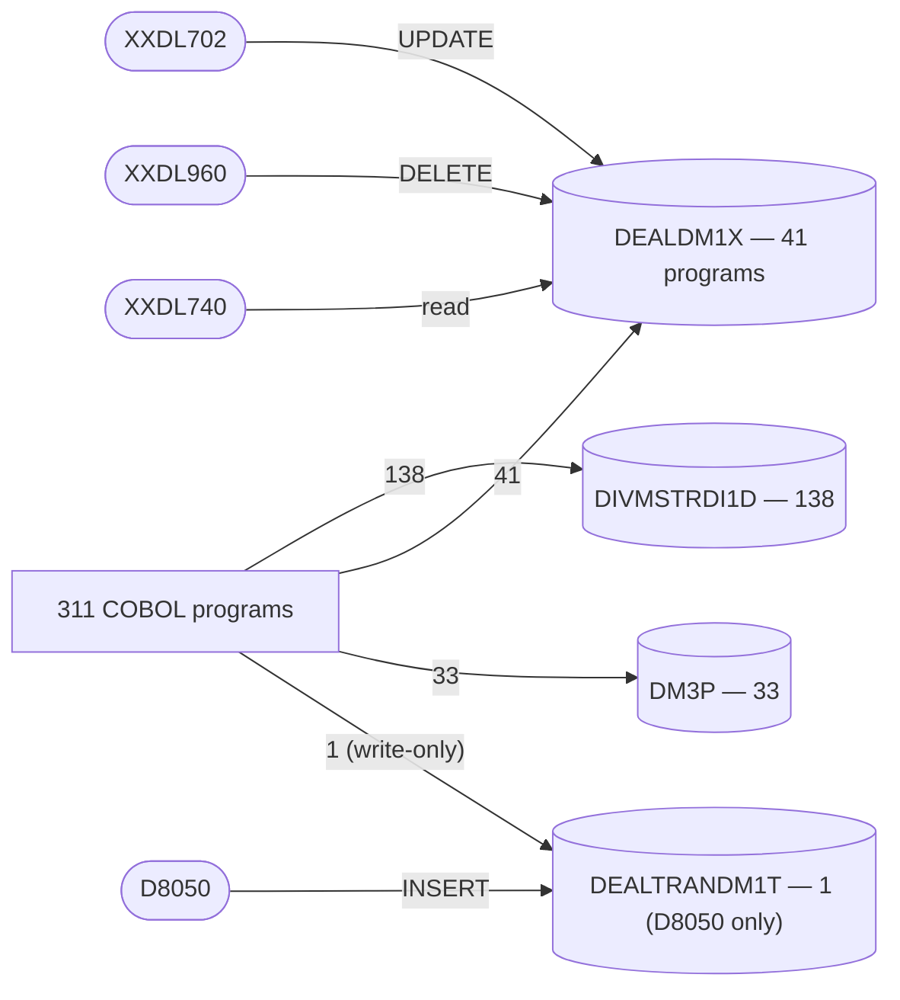

**Modernization implication:** `DEALDM1X` (41) and `DIVMSTRDI1D` (138) are the high-fan-in tables — a DAL change ripples platform-wide; introduce read/write facades before refactoring consumers. `ACME.DEALTRANDM1T` has fan-in **1** (only `D8050` writes it, and nothing in the exported corpus reads it) — the `DM1T → DEALDM1X` load is therefore an **unseen edge** (external loader / unexported member), flagged in §10. **MQ note:** the only `MQ*` calls in the entire source tree are in `MCCST40`/`MCCST50`/`MCCST51` (BP-004 costing), so the "no event queue" finding is specific to BP-002, not the platform.

---

## 9. End-to-end resolution summary

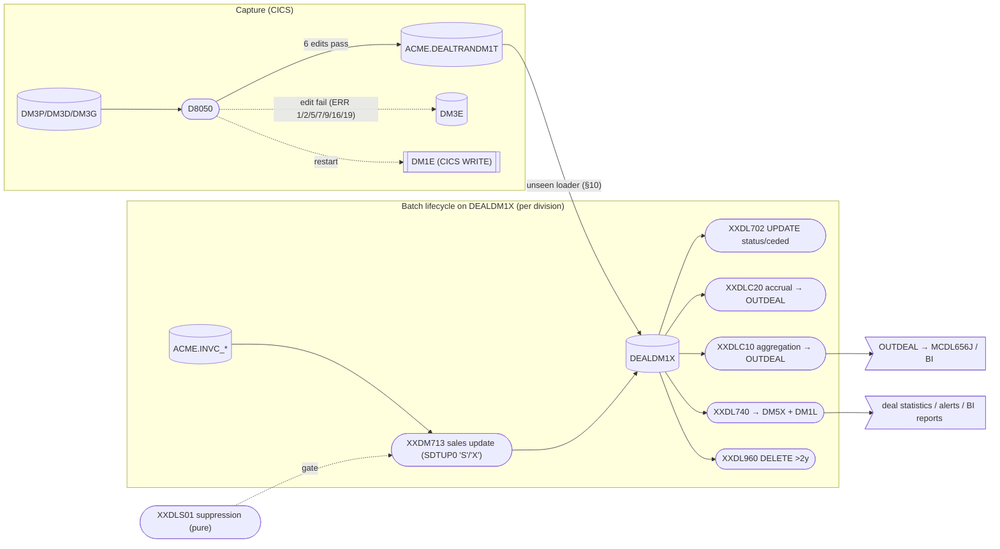

Every batch program resolves **from a per-division entrypoint (`PARM='&DI2'`), through DB2 + VSAM reads, to a DB2 update/insert/delete or a sequential/report sink**, with `RETURN-CODE 16` as the universal hard-fail and `COND=(4,LT)` as the proc-level propagation guard. `D8050` resolves **from the CICS TS queue, through six promotion edits, to `ACME.DEALTRANDM1T`** (happy) or `ACME.CAD_ERR_LOG_DM3E` (edit fail), each deal a `SYNCPOINT`-bounded unit of work with a `DM1E` restart checkpoint.

---

## 10. Assumptions, gaps, and open questions

Resolved during this analysis (grounded in source):

- **BR-002-10 deal-type bypass codes:** `XXDL702` bypasses `CDLTP2 ∈ {04, 07, 08, 09}` (group / DVRTR / BRKT). The spec's open question on which codes these are is answered.
- **BR-002-12 "'Y' type":** the `CDDLI0 = 'Y'` flag means the deal is already rolled into the current deal; the ceded-amount roll-up runs only when `CDDLI0 ≠ 'Y'` AND `ACEDL3 ≠ 0`.
- **BR-002-21 (`XXDL960` AND vs OR):** verified **AND** — `DLBUYH < (today−2y)` is mandatory, and each of `DLINVH`/`DLSHPH` blocks deletion only when populated (`≠ '1900-01-01'`) and newer than the cutoff, plus `QDURM3 = 0`.
- **BR-002-64 (`XXDLC10` commented-out RC):** confirmed — `XXDLC10`'s `E1000-FAILED-OPEN` has `MOVE +16 TO RETURN-CODE` commented out and is `PERFORM`ed (falls through), whereas the twin `XXDLC20` keeps it and `STOP RUN`s. Latent bug.
- **BR-002-42 edit error codes:** `D8050` writes `DM3E` with `ERR-CD` = 2 (item/div not found), 1 (store-stock/not full case), 16 (item discontinued `'INA'`), 9 (vendor not corporate-controlled), 5 (licensing limit), 6/7 (overlapping dates — 6 group, 7 division), 19 (existing terminated deal, same corporate deal id), plus 18 (group-only `'NA'` forced-`01` delete).
- **`DM1T` real name:** `ACME.DEALTRANDM1T` (DCLGEN `DGDM1T`); `DM1E` is a VSAM/CICS file (no DCLGEN), written via `EXEC CICS WRITE`.

Still open / carried forward:

- `[SME]` **BR-002-80/81 (`MCBSM02`)** — the current source is a customer **move / class-group maintenance** program with a **30-day** `STAT_CHG_TS` test on `DIV_CUST_STAT_CU1S` (CBR status `'HLD'`), **not** a 45-day `CREATE_TS` deletion-candidate cursor; `'XXEBM39'` is absent. Confirm whether the spec describes an older program or a different member.
- `[GAP]` **`ACME.DEALTRANDM1T` consumer / `DM1T → DEALDM1X` loader** — `D8050` is the only program in the corpus that touches `DM1T`; the program that loads `DM1T` into `DEALDM1X` is not in the exported source.
- `[GAP]` **`XXDLC10` / `XXDLC20` entrypoints** — no JCL/proc in the corpus issues `EXEC PGM=XXDLC10`/`XXDLC20`; division comes from `ACCEPT`. Their parent jobs are unexported.
- `[GAP]` **`XXDL702P` parent job** and **`XXDLS01` caller** — proc/subroutine present, invoker not in the corpus.
- `[SME]` `XXDL740` — confirm whether `XXDC608`/`DSNTIAR`/`ILBOABN0` (documented in the program header but not found as live `CALL` sites in this version) are reached only through the `DB2ERRP2` macro and the forced-abend path.
- `[SME]` Lifecycle invariants BR-002-30/31/32 — the suppression gate on the sales path is realized in `XXDM713` via `SDTUP0 = 'X'` for suppressed deal ids; confirm the accrual gate (BR-002-31 for `XXDLC20`) and that archival (BR-002-32) follows the report cycle (`XXDLSWKY` orders `XXDL571P`/reports before `XXDL960P`).

---

## 11. Source index

| Artifact | Path |
|---|---|
| Core programs | `docs/legacy/src/sclm.perm.prod.source/{D8050,XXDLS01,XXDL702,XXDLC10,XXDLC20,XXDM713,XXDL960,XXDL740,MCBSM02,MCBSM04}.cbl` |
| Procs | `docs/legacy/src/ds.perm.proclib/{XXDL702P,XXDM713P,XXDL960P,XXDL740P,MCBSM02P,MCBSM04P,XXDL530P,XXDL570P,XXDL571P,XXDL995P,XXDL980P}.jcl` |
| Parent jobs | `docs/legacy/src/acme.perm.jcl/{XXDLSDLY,XXDLSWKY,XXDLSEOP,XXDL650J,MCBSM01J}.jcl` |
| DCLGENs | `docs/legacy/src/DB2P.PERM.DCLGEN/{DGDM3P,DGDM3D,DGDM3G,DGDM1T,DGDM3E,DGDM2A,DGDM3R,DGDM1X,DGDM1L,DGDM5X,DGDM1A,DGDI1D,DGDI3X,DGJS1A,DGDE1I,DGCU1X,DGAP1S}.cpy` |
| Linkage / error copybooks | `DLS01LNK`, `DB2ERRP2`, `DB2GDP1`, `SQLCA` |
| BP-002 spec | `docs/legacy/03-technical/specs/BP-002-deal-management-and-analysis.md` |

---

*All nodes and edges above were derived by reading the cited source members under `docs/legacy/src`. Claims not directly verifiable in the exported corpus are marked `[SME]` / `[GAP]`.*
