# BP-002 — Deal Management & Analysis: Business-Process Graph

**Status:** Draft — structured-BPMN process graph derived from the extracted business logic.
**Conforms to:** [process-graph-meta-model.md](../../../../../reference/process-graph-meta-model.md) (the canonical meta-model: element vocabulary, purity axioms, rule→element taxonomy, and the FSM-projection definition).
**Companion to:** [BP-002 business logic](BP-002-deal-management-and-analysis-business-logic.md), [BP-002 call graph](BP-002-deal-management-and-analysis-call-graph.md), and [BP-002 overview](../BP-002-deal-management-and-analysis.md).
**Scope:** The BP-002 **deal lifecycle** — a data-flow chain of independently-scheduled programs (Stages A–H) plus the supporting customer-master feeder — re-expressed as a **collaboration of pure BPMN processes** with a derived finite-state-machine projection per stage. Because the deal programs never call one another (they are coupled only through the shared deal mart `DEALDM1X` and feeder tables), each stage is its own process (own Start/End); cross-stage coupling is a **shared Data Store**, never a Sequence Flow (meta-model P9).

---

## 1. Meta-model (reference)

This graph is a faithful re-projection of the companion business-logic rules (`BL-002-NN`) into the **structured BPMN** meta-model defined in [process-graph-meta-model.md](../../../../../reference/process-graph-meta-model.md). That reference is authoritative; only a working summary is repeated here.

- **Governing axiom (separation).** Work and routing are disjoint: Activities never branch, Gateways never do work, and a branch condition lives on the sequence flow leaving a gateway.
- **Execution semantics.** The token (Petri-net) game of §2 of the meta-model; each stage process is sound and block-structured, which is what makes the FSM projection well-defined.
- **Collaboration, not orchestration.** BP-002 is not a single token process. It is a **collaboration** of independently-scheduled stage processes joined by shared Data Stores (§2). Each stage carries its own Start/End, diagram, rule→element table, and FSM.
- **Element legend (Mermaid rendering, per meta-model §3.4):**

| Element | Shape | Meaning |
|---|---|---|
| Event | `(( ))` circle | Start / End / Intermediate milestone; Error End is red |
| Task | `[ ]` rectangle | a unit of work (`Script` / `Service` / `Business Rule` / `Send` / `Receive`) |
| Gateway | `{ }` rhombus | routing only (`XOR` / `IOR` / `AND`); condition on outgoing flows |
| Sub-Process | `[[ ]]` | iteration (`Loop` / `Multi-Instance`), e.g. control breaks and merges |
| Data | `[( )]` cylinder | Data Object (transient) / Data Store (persistent); carries a typed id (`DB2:`/`DSN:`/`REC:`/`WS:`) or `[derived]`/`[sink]` per meta-model §3.3.1 |
| External participant | `{{ }}` hexagon | an external system/integration endpoint (`RPT:`/`FT:`/`MQ:`/`API:`), reached only by Message Flow (dotted `msg ▷ out / ◁ in`), per meta-model §3.5 |

- **Coverage rule.** Every `BL-002-NN` maps to **exactly one** flow node (see the per-stage conformance tables and the consolidated traceability table in §14).
- **Rendering legend (`classDef` header, used verbatim in every Mermaid block, per meta-model §3.4):**

```
%%{init: {'theme': 'base'}}%%
flowchart TD
  classDef ev   fill:#c8e6c9,stroke:#1b5e20,color:#000;
  classDef task fill:#bbdefb,stroke:#0d47a1,color:#000;
  classDef gw   fill:#fff9c4,stroke:#f9a825,color:#000;
  classDef err  fill:#ffcdd2,stroke:#b71c1c,color:#000;
  classDef data fill:#e1bee7,stroke:#4a148c,color:#000;
  classDef sub  fill:#d7ccc8,stroke:#3e2723,color:#000;
  classDef ext  fill:#ffe0b2,stroke:#e65100,color:#000;
```

Standalone self-contained Mermaid sources for each stage are kept in the `diagrams/` subfolder as `diagrams/BP-002-A-process-graph.mmd` … `diagrams/BP-002-H-process-graph.mmd`, `diagrams/BP-002-cust-process-graph.mmd`, the data-flow overview `diagrams/BP-002-lifecycle-collaboration.mmd`, and the cross-stage deal-entity state machine `diagrams/BP-002-deal-lifecycle-fsm.mmd`.

---

## 2. Lifecycle collaboration map (data-flow overview)

This is a **non-token collaboration view**, not a single executable process: it shows each stage as a black-box pool and the **shared Data Stores** that couple them. No Sequence Flow crosses a pool boundary (meta-model P9); every coupling is a read/write of a shared store. The detailed token process for each stage follows in §3–§11.

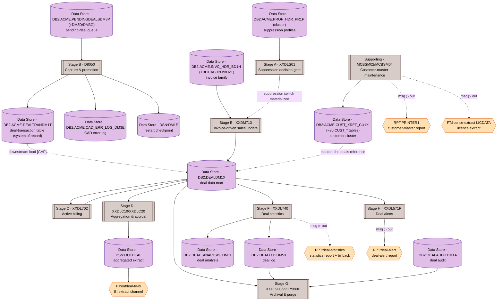

**Lifecycle reading:** `pending (DM3P) → capture/promote (D8050 → DM1T) → [downstream load, unseen] → deal mart (DEALDM1X) → active billing (XXDL702) → aggregation/accrual (XXDLC10/20 → OUTDEAL → BI)`, with **invoice-driven sales update** (`XXDM713`) writing back into the mart under the **suppression gate** (`XXDLS01`), **statistics** (`XXDL740`) emitting the log and analysis tables, and the **weekly archival/purge/alert chain** trimming the mart, log, and audit stores. **Customer-master maintenance** (`MCBSM02`/`MCBSM04`) keeps the customer cluster the deals hang off. The `DM1T → DEALDM1X` loader is not in the exported corpus (`[GAP]`, §14.3).

### 2.1 Deal-entity lifecycle state machine (cross-stage)

The nine stage FSMs (§3–§11) each project *control flow inside one program*. This section gives the orthogonal **entity-centric** projection: the lifecycle of a single **deal** as it moves through its purchase/billing status codes (`CDLST0 ∈ {P,A,F}`, `CDLSB0 ∈ {P,A,F,T}`), with each independently-scheduled stage acting as a **transition operator on shared state** (`DEALDM1X`).

This is the only legitimate "whole-process" super-graph (see the analysis behind §2): it is a state machine over **data-at-rest**, not a token flow — there is no control handoff between stages, so it cannot be a merged BPMN process without violating P9. Its value is that it spans stages and makes the lifecycle invariants (§13) visually checkable: the only edge into `Pending` is Stage B (pending-origin, BL-002-55), and `Terminated → Archived` sits downstream of the report/alert steps (archive-after-report, BL-002-57).

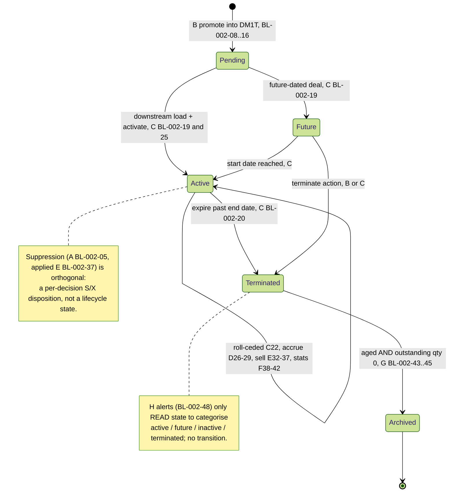

**Transition table (driver = stage · rules; guard = condition):**

| From | To | Driver | Guard |
|---|---|---|---|
| `[*]` | `Pending` | B · BL-002-08..16 | promotion edits pass; survivor inserted to `DM1T` |
| `Pending` | `Future` | C · BL-002-19 | deal start date is in a future period |
| `Pending` | `Active` | C · BL-002-19/25 | deal is in the current open billing window |
| `Future` | `Active` | C | processing date reaches the deal start |
| `Active` | `Active` | C22 / D26-29 / E32-37 / F38-42 | bill / accrue / sell / report — value changes, status unchanged |
| `Active` | `Terminated` | C · BL-002-20 | processing date > deal end date (`DLINVH`) |
| `Future` | `Terminated` | B or C | explicit terminate action (`action = T`) |
| `Terminated` | `Archived` | G · BL-002-43..45 | `DLBUYH < cutoff` ∧ inv/ship aged ∧ `QDURM3 = 0` |
| `Archived` | `[*]` | — | row deleted from `DEALDM1X` |

The self-loop on `Active` is where most of the lifecycle's *work* happens (billing roll-up, accrual, sales update, statistics) without changing the deal's lifecycle state — each is a separate scheduled stage reading and rewriting the shared mart. Suppression (Stage A) and alerts (Stage H) are deliberately **not** transitions: the former is an orthogonal per-decision flag, the latter a read-only classification.

---

## 3. Stage A — Suppression decision gate (`XXDLS01`, BL-002-01..07)

A pure, side-effect-free decision function of (customer, item, deal), invoked per deal by an upstream caller (the literal call site is outside the exported corpus, `[GAP]` §14.3 — modelled as a Message Start carrying the `DLS01LNK` request keys). It answers one question — should this deal be suppressed? — through three nested eligibility checks that **short-circuit to "allowed" (`N`)** as soon as any level clears the deal. Its only mutable state is two per-call caches (`WS-CUST-SW`, `WS-ITEM-SW`) valid within one division.

Per the meta-model classify-and-seed convention (§5.2), the cache-staleness test (01) is a Gateway carrying the rule id with the clear-caches write on its true branch; the three lookups (03/04/05) are Gateways carrying their rule ids, with the unlabeled Service Tasks performing the cached DB read (the read mechanics are not separate rules). All "allowed" branches converge on a single XOR join before the return (BP-001 §2.2 join convention).

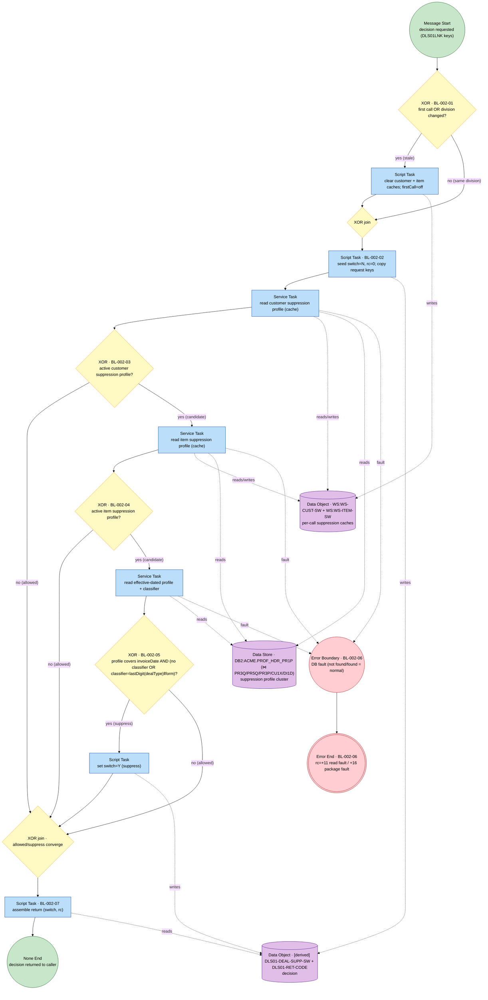

`row found` / `no row found` are normal business answers (ordinary XOR branches); only an unexpected DB fault raises the Error Boundary → Error End with the documented return codes (BL-002-06). The fault path is the Stage-A specialization of the cross-cutting hard-fail convention (§12), distinguished by its `+11`/`+16` return codes rather than RC16.

### 3.1 Stage A — rule → element conformance

| BL-002 | Title | Logic type | BPMN element | Where |
|---|---|---|---|---|
| 01 | Reset per-call caches on first call / division change | control / cache | XOR Gateway (test) + clear-caches seed Task | §3 |
| 02 | Seed the decision and copy request keys | initialization | Script Task | §3 |
| 03 | Customer-level suppression check | validation | XOR Gateway (+ allowed exit) | §3 |
| 04 | Item-level suppression check (gated) | validation | XOR Gateway (+ allowed exit) | §3 |
| 05 | Deal-level suppression decision (gated) | validation | XOR Gateway (+ suppress seed) | §3 |
| 06 | Map database faults to return codes | error handling | Error Boundary → Error End (+11/+16) | §3 |
| 07 | Return the final suppression switch | control | Script Task → None End | §3 |

### 3.2 Stage A — derived FSM projection (Mealy)

Anchors {`START`, `RETURNED`}; the function is acyclic (single call), so the projection is a flat decision fan:

```
START --[stale]/{01:clear} ; then ¬custProfile          / {02}            --> RETURNED (N allowed)
START --[custProfile ∧ ¬itemProfile]                     / {02, 03}        --> RETURNED (N allowed)
START --[custProfile ∧ itemProfile ∧ ¬dealProfile]       / {02, 03, 04}    --> RETURNED (N allowed)
START --[custProfile ∧ itemProfile ∧ dealProfile]        / {02, 03, 04, 05:suppress} --> RETURNED (Y suppress)
START --[any DB fault]                                    / {06}            --> RETURNED (rc +11/+16, no decision)
```
Guards are mutually exclusive and exhaustive; effects are the `BL-002` ids fired. The `01:clear` cache effect is a side branch of every transition (taken when the caches are stale) and is omitted from the per-row guards for readability.

---

## 4. Stage B — Capture and promotion (`D8050`, BL-002-08..16)

The lifecycle gateway out of "pending". The CICS transaction polls the pending-deal queue (08, a `Loop` Sub-Process whose instance is one polled deal), routes each deal by type (09), runs the six promotion edits (10/11/12/13), and either rejects the deal into the CAD error log with a distinct error code (14) or promotes the survivor into the deal-transaction table as a single all-or-nothing transactional unit (15) with its own restart checkpoint (16).

The four edits inside `BL-002-13` are a compound validation whose result *and* its assigned error code are consumed downstream, so it is a **Business Rule Task** (rule id) feeding a structural XOR (meta-model §5.2 case b2). The licensing-limit check (`err 5`) is **non-blocking** — it writes an `err 5` line to the error log and lets processing continue to the overlap check — so it is a data-write side effect of the task, not a routing branch. All reject codes ride on the gateway guards converging on the single reject Task (14).

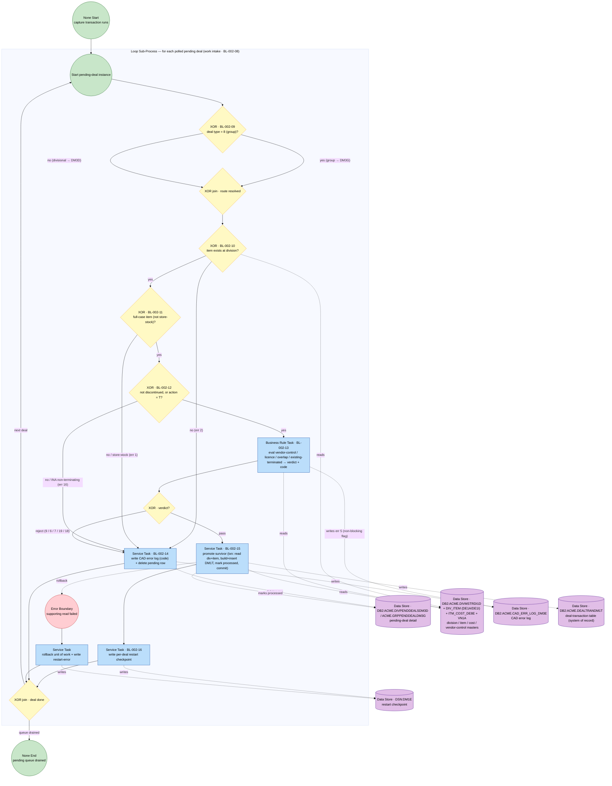

**Verified `DM3E` error-code mapping (guards above):** 1 = store-stock / not full case; 2 = division or item not found; 5 = licensing limit exceeded (non-blocking flag); 6 = overlapping dates (group); 7 = overlapping dates (division); 9 = vendor not corporate-controlled; 16 = item discontinued (`INA`); 18 = group-only `'NA'` forced-`01` delete; 19 = existing terminated deal with same corporate deal id. For group deals, the division detail row is marked processed only once all associated group rows are done. Data-access faults follow the hard-fail convention (§12).

### 4.1 Stage B — rule → element conformance

| BL-002 | Title | Logic type | BPMN element | Where |
|---|---|---|---|---|
| 08 | Poll the pending-deal queue | control / work intake | Loop Sub-Process boundary (per polled deal) | §4 |
| 09 | Route by deal type (group vs divisional) | routing | XOR Gateway (+ join) | §4 |
| 10 | Edit: item exists at division (err 2) | validation | XOR Gateway | §4 |
| 11 | Edit: full-case only (err 1) | validation | XOR Gateway | §4 |
| 12 | Edit: not discontinued unless terminating (err 16) | validation | XOR Gateway | §4 |
| 13 | Edits: vendor / licence / overlap / terminated (err 5/6/7/9/18/19) | validation (compound) | Business Rule Task + structural XOR | §4 |
| 14 | Reject failed deal to CAD error log | validation outcome / routing | Service Task (shared sink) | §4 |
| 15 | Promote survivor (transactional unit) | transformation / persistence | Service Task (+ Error Boundary rollback) | §4 |
| 16 | Write per-deal restart checkpoint | state management | Service Task | §4 |

### 4.2 Stage B — derived FSM projection (Mealy)

**Per pending deal** — states {`DEAL_READ`, `DEAL_DONE`} (`DEAL_DONE` loops to `DEAL_READ` until the queue drains → `QUEUE_DRAINED`):

```
DEAL_READ --[¬itemExists]                                           / {09, 10:rej(2)}                 --> DEAL_DONE
DEAL_READ --[itemExists ∧ storeStock]                              / {09, 10, 11:rej(1)}             --> DEAL_DONE
DEAL_READ --[ok ∧ INA ∧ action≠T]                                  / {09, 10, 11, 12:rej(16)}        --> DEAL_DONE
DEAL_READ --[ok ∧ 13.reject(code)]                                 / {09..12, 13, 14:rej(code)}      --> DEAL_DONE
DEAL_READ --[ok ∧ 13.pass ∧ reads OK]                              / {09..13, 15:promote, 16}        --> DEAL_DONE
DEAL_READ --[ok ∧ 13.pass ∧ supporting read fault]                / {09..13, 15:rollback+restart-err}--> DEAL_DONE
```
Guards are mutually exclusive and exhaustive; `13.reject(code)` enumerates codes {9, 6, 7, 19, 18}; the non-blocking `err 5` licence flag is a data side-effect of `13` (omitted from guards).

---

## 5. Stage C — Active billing (`XXDL702`, BL-002-17..25)

Run per division against a processing date. After validating that date (17, a soft abandonment on a malformed card — not a hard fail), the stage walks the division's items as a `Multi-Instance` Sub-Process; each item loads and processes its deals (per-deal `Loop`, expanded in §5.1), then the item is finalized — billbacks recomputed (23), blank dates defaulted, and the output record written **only if** a deal actually changed it (24).

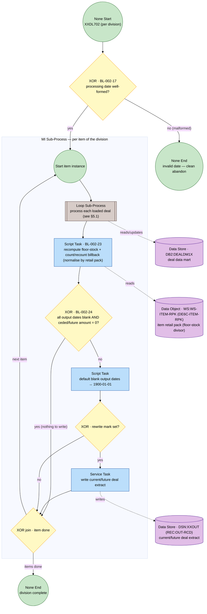

### 5.1 Stage C — per-deal loop body (BL-002-18/19/20/21/22/25)

Expiry (20) takes precedence over the bypass exclusion (21), which takes precedence over the ceded roll-up (22). The status dispatch (19) sends non-active-billing deals straight to the deal-mart status update (25), which is also where an expired deal lands. `BL-002-25` is a single node reached from both the expire branch and the other-status branch.

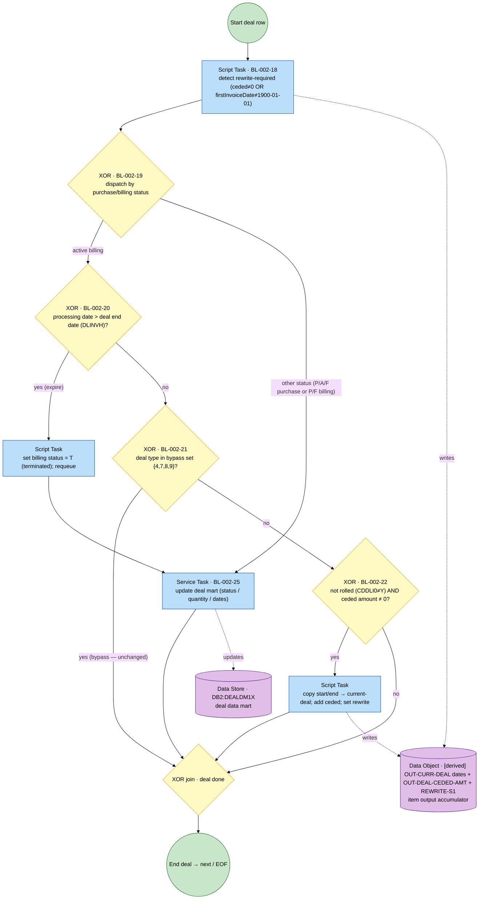

The hard-fail convention (§12) wraps every deal-mart read/write. Note `BL-002-25` is the single deal-mart status-update node referenced by §5.1 (expire + other-status handlers).

### 5.2 Stage C — rule → element conformance

| BL-002 | Title | Logic type | BPMN element | Where |
|---|---|---|---|---|
| 17 | Validate the processing date | validation | XOR Gateway (+ clean-abandon None End) | §5 |
| 18 | Detect rewrite-required | classification | Script Task | §5.1 |
| 19 | Branch by purchase/billing status | routing | XOR Gateway | §5.1 |
| 20 | Expire active billing deal past end | classification / state | XOR Gateway (test) + set-T seed Task | §5.1 |
| 21 | Bypass group/diverter/bracket types | validation (exclusion) | XOR Gateway | §5.1 |
| 22 | Roll ceded amount into current deal | transformation | XOR Gateway (test) + roll seed Task | §5.1 |
| 23 | Recompute floor-stock / count billback | transformation (calc) | Script Task | §5 |
| 24 | Default blank dates, write only when modified | transformation / control | XOR Gateway (test) + default/write seed Tasks | §5 |
| 25 | Update deal mart for status-changed deals | transformation / persistence | Service Task | §5.1 |

### 5.3 Stage C — derived FSM projection (Mealy)

**Orchestration** — anchors {`START`, `DIVISION_DONE`}:

```
START --[invalid date]/ { 17 }                 --> DIVISION_DONE (clean abandon)
START --[valid date]  / { per-item MI loop }   --> DIVISION_DONE
```

**Per deal row** — states {`DEAL_READ`, `DEAL_DONE`}:

```
DEAL_READ --[otherStatus]                                        / {18, 19, 25}        --> DEAL_DONE
DEAL_READ --[activeBilling ∧ expired]                            / {18, 19, 20, 25}    --> DEAL_DONE
DEAL_READ --[activeBilling ∧ ¬expired ∧ bypassType]              / {18, 19, 21}        --> DEAL_DONE
DEAL_READ --[activeBilling ∧ ¬expired ∧ ¬bypass ∧ (¬rolled ∧ ceded≠0)] / {18, 19, 22} --> DEAL_DONE
DEAL_READ --[activeBilling ∧ ¬expired ∧ ¬bypass ∧ ¬(¬rolled ∧ ceded≠0)] / {18, 19}    --> DEAL_DONE
```

**Per item** (finalize, after the deal loop) — states {`ITEM_DEALS_DONE`, `ITEM_DONE`}:

```
ITEM_DEALS_DONE --[allBlank ∧ amount=0]            / {23, 24}            --> ITEM_DONE (no write)
ITEM_DEALS_DONE --[¬(allBlank ∧ amount=0) ∧ rewrite]/ {23, 24:default+write}--> ITEM_DONE
ITEM_DEALS_DONE --[¬(allBlank ∧ amount=0) ∧ ¬rewrite]/ {23, 24:default}   --> ITEM_DONE (no write)
```

---

## 6. Stage D — Aggregation and accrual (`XXDLC10` / `XXDLC20`, BL-002-26..31)

Structural twins: each reads a flat input file, stages its rows in a session temporary table (26), then opens an aggregating join of that staging table to the deal mart and masters and writes one `OUTDEAL` record per result row (29). The diagram below **overlays both twins**; two nodes are twin-specific — the signed-amount computation (27) exists only in the aggregation twin `XXDLC10`, and the accrual-window date read (28) only in the accrual twin `XXDLC20`. The division comes from a console parameter.

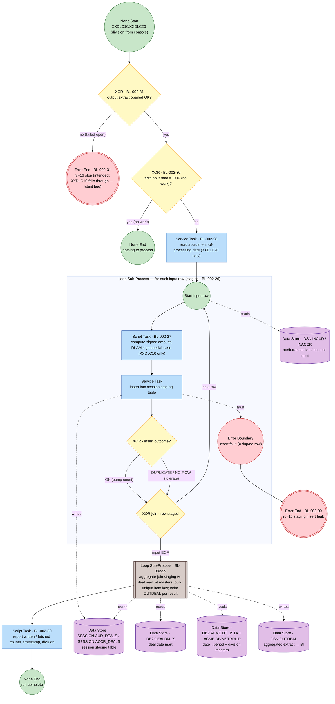

`DUPLICATE`/`NO-ROW` on insert are tolerated (the row is already staged); any other insert fault is the cross-cutting hard-fail (§12). `BL-002-30` has two placements — the "no work" entry gate and the finalization count display — consistent with its dual trigger in the source.

### 6.1 Stage D — twin divergence note (`BL-002-31`)

The intended behaviour on a failed output-file open is **set return code 16 and stop** (`XXDLC20` does this). `XXDLC10` carries a latent bug: its failed-open handler has the return-code assignment commented out and is *performed* rather than *branched to*, so control falls through and the run continues after a failed open. The diagram models the **intended** Error End; the defect is carried as an open item (§14.3) for SME confirmation on cutover.

### 6.2 Stage D — rule → element conformance

| BL-002 | Title | Logic type | BPMN element | Where |
|---|---|---|---|---|
| 26 | Stage input rows in session table | data load / staging | Loop Sub-Process boundary (per input row) | §6 |
| 27 | Compute staged amount/sign by type (agg only) | transformation | Script Task | §6 |
| 28 | Read accrual end-of-processing date (accrual only) | validation / intake | Service Task | §6 |
| 29 | Aggregate-join + unique item key | aggregation / matching | Loop Sub-Process (per join result) | §6 |
| 30 | "No work" + finalization counts | control / reporting | XOR Gateway (no-work) + Script Task (finalize) | §6 |
| 31 | Failed-open divergence (latent bug) | error handling | XOR Gateway → Error End (intended) | §6 / §6.1 |

### 6.3 Stage D — derived FSM projection (Mealy)

Anchors {`START`, `STAGED`, `RUN_DONE`}:

```
START   --[failed open]              / { 31 }              --> RUN_DONE (rc16 stop, intended)
START   --[open OK ∧ first EOF]      / { 31, 30 }          --> RUN_DONE (no work)
START   --[open OK ∧ ¬first EOF]     / { 31, 30, (28 accrual), staging loop } --> STAGED
STAGED  --[true]                     / { 29:aggregate-join+write, 30:counts } --> RUN_DONE
```

**Per input row** — states {`ROW_READ`, `ROW_STAGED`}:

```
ROW_READ --[insert OK]               / { (27 agg), 26:insert }   --> ROW_STAGED
ROW_READ --[dup / no-row]            / { (27 agg), 26:tolerate } --> ROW_STAGED
ROW_READ --[other fault]             / { 90 }                    --> (Error End)
```

---

## 7. Stage E — Invoice-driven sales update (`XXDM713`, BL-002-32..37)

Run per division. Two hard-fail preconditions (32, 33) gate the run; then a per-invoice `Loop` deduplicates already-processed invoices (34) and a nested per-line `Loop` filters non-eligible lines (35) and fans out up to three per-deal sales-update records (36), each stamped with the **materialised `XXDLS01` suppression decision** as its `S`/`X` disposition (37). The suppression switch reaches this stage as shared data (collaboration edge from Stage A, §2), never as a sequence flow.

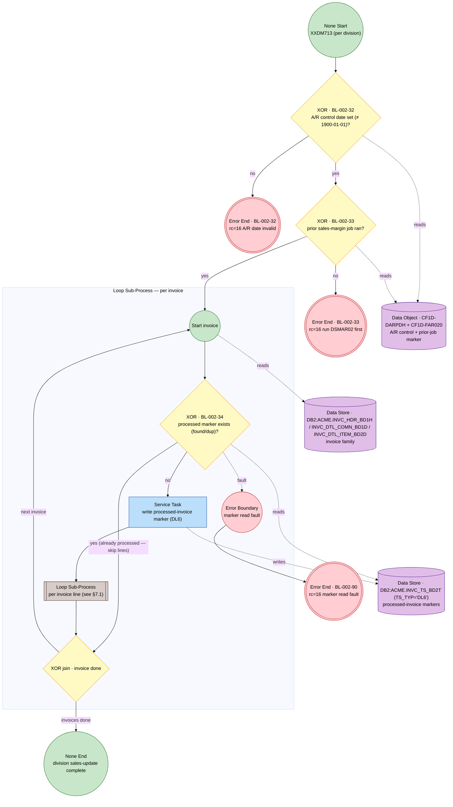

### 7.1 Stage E — per-line eligibility and per-deal fan-out (BL-002-35/36/37)

A line is skipped if its invoice was already processed, its pick-slot is `OUT`, its disposition is `C`, or none of its three deal ids is non-zero (35). An eligible line fans out one record per non-zero deal id (36, a `Multi-Instance` over up to three ids), each stamped `S` (apply) or `X` (suppressed) by the per-deal suppression switch (37).

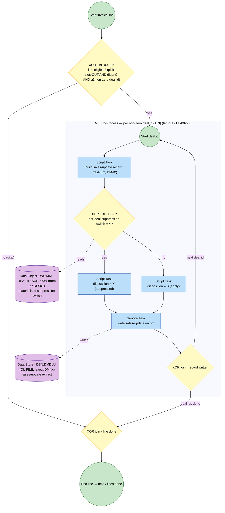

### 7.2 Stage E — rule → element conformance

| BL-002 | Title | Logic type | BPMN element | Where |
|---|---|---|---|---|
| 32 | Validate A/R control date | validation | XOR Gateway → Error End | §7 |
| 33 | Require prior sales-margin job | validation (precondition) | XOR Gateway → Error End | §7 |
| 34 | Deduplicate already-processed invoices | validation (dedup) | XOR Gateway (+ marker write) | §7 |
| 35 | Skip non-eligible invoice lines | validation (filter) | XOR Gateway | §7.1 |
| 36 | Emit up to three per-deal records | transformation (fan-out) | MI Sub-Process (per deal id) | §7.1 |
| 37 | Apply suppression to disposition (S/X) | transformation | XOR Gateway (+ S/X seed Tasks) | §7.1 |

### 7.3 Stage E — derived FSM projection (Mealy)

**Orchestration** — anchors {`START`, `DIVISION_DONE`}:

```
START --[A/R date invalid]            / { 32 }                       --> (Error End rc16)
START --[A/R OK ∧ prior job not run]  / { 32, 33 }                   --> (Error End rc16)
START --[A/R OK ∧ prior job ran]      / { 32, 33, per-invoice loop } --> DIVISION_DONE
```

**Per invoice** — states {`INV_READ`, `INV_DONE`}:

```
INV_READ --[marker found/dup]   / { 34 }                  --> INV_DONE (skip lines)
INV_READ --[no marker]          / { 34:write, line loop } --> INV_DONE
INV_READ --[marker read fault]  / { 90 }                  --> (Error End)
```

**Per line / per deal id**:

```
LINE_READ --[¬eligible]                 / { 35 }              --> LINE_DONE
LINE_READ --[eligible] (per deal id k)  / { 35, 36, 37:S|X }  --> LINE_DONE
```
The `37:S|X` effect is `X` when the per-deal suppression switch is `Y`, else `S`; the fan-out emits one record per non-zero deal id (big-step per meta-model §7.2).

---

## 8. Stage F — Deal statistics update (`XXDL740`, BL-002-38..42)

Run daily per division. Configuration-driven: report formatting and subroutine selection load from VSAM and the application system-parameter table (38). The core is a sorted-update / deal-mart **two-file merge** (39, a `Loop` Sub-Process with a 3-way `=/</>` exclusive gateway per meta-model §6.2), which recomputes billback price and next-bill date (40) and inserts the deal-log and deal-analysis rows (41) on qualifying deals, then emits the statistics report (42).

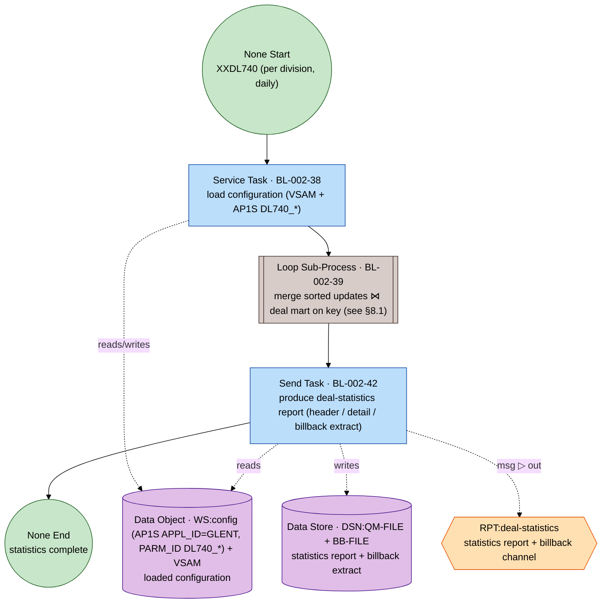

### 8.1 Stage F — merge loop body (BL-002-39/40/41)

The sorted update key and the deal-mart deal key are compared in a 3-way exclusive gateway (`<`, `=`, `>` — mutually exclusive and exhaustive, satisfying P4). The matched (`=`) and deal-without-update (`>`) cases both recompute billback (40) and insert statistics rows (41); the update-without-deal (`<`) case is handled without those steps. Master attributes (vendor / buyer / item) are pulled by random read.

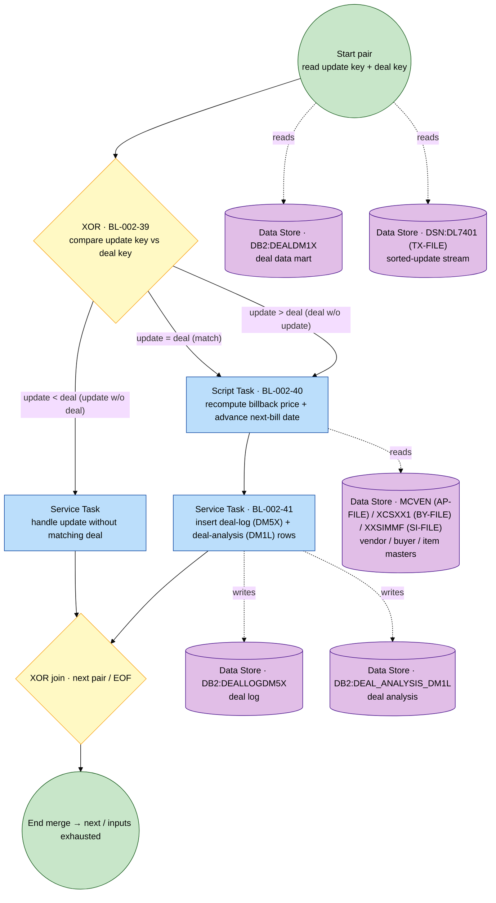

Every random read / insert is wrapped by the hard-fail convention (§12). `RPT:deal-statistics` is an external participant reached by Message Flow (out, fire-and-forget, at-least-once); the report and billback datasets remain data-at-rest upstream of the Send Task (meta-model §3.5).

### 8.2 Stage F — rule → element conformance

| BL-002 | Title | Logic type | BPMN element | Where |
|---|---|---|---|---|
| 38 | Load configuration parameters | data load | Service Task | §8 |
| 39 | Merge sorted updates against deal mart | matching / merge | Loop Sub-Process + 3-way XOR | §8.1 |
| 40 | Recompute billback price / next-bill date | transformation (calc) | Script Task | §8.1 |
| 41 | Insert deal-log + deal-analysis rows | transformation / persistence | Service Task | §8.1 |
| 42 | Produce deal-statistics report | reporting | Send Task → `RPT:deal-statistics` | §8 |

### 8.3 Stage F — derived FSM projection (Mealy)

**Orchestration** — anchors {`START`, `MERGE_DONE`, `END`}:

```
START      --[true] / { 38, merge loop } --> MERGE_DONE
MERGE_DONE --[true] / { 42:report }       --> END
```

**Per merge pair** — states {`PAIR_READ`, `PAIR_DONE`}:

```
PAIR_READ --[update < deal]  / { 39:handle-update }   --> PAIR_DONE
PAIR_READ --[update = deal]  / { 39, 40, 41 }         --> PAIR_DONE
PAIR_READ --[update > deal]  / { 39, 40, 41 }         --> PAIR_DONE
```
Guards are mutually exclusive and exhaustive over the key comparison.

---

## 9. Stage G — Archival and purge (`XXDL960` / `XXDL995P` / `XXDL980P`, BL-002-43..47)

The weekly trim of the deal stores: three independent, row-by-row, idempotent purge programs. Each is its own process (own Start/End); they are siblings, not steps of one token flow.

### 9.1 Deal-mart archival (`XXDL960`, BL-002-43/44/45)

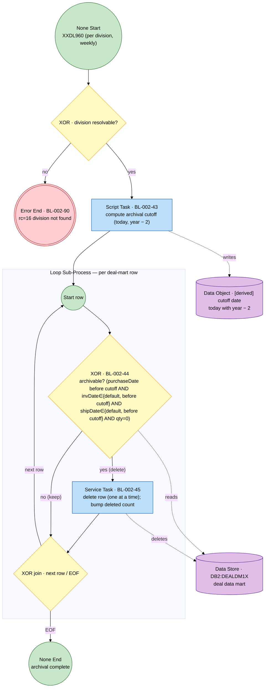

### 9.2 Deal-log purge (`XXDL995P`, BL-002-46) and deal-audit purge (`XXDL980P`, BL-002-47)

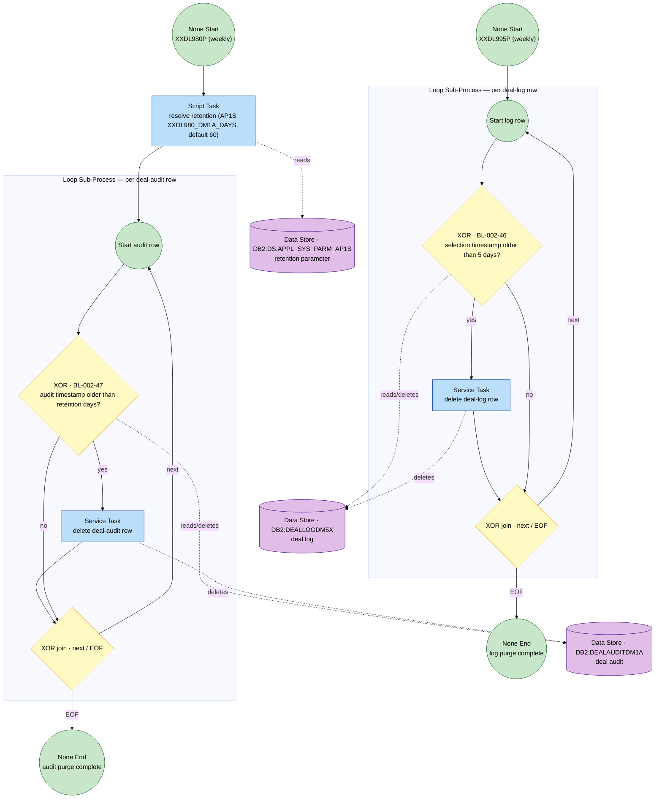

The retention resolution (`default 60`) is the seed of `BL-002-47`; the 5-day threshold is the seed of `BL-002-46`. All deletes are idempotent (a re-run re-selects only still-aged rows).

### 9.3 Stage G — rule → element conformance

| BL-002 | Title | Logic type | BPMN element | Where |
|---|---|---|---|---|
| 43 | Compute two-year archival cutoff | transformation (date) | Script Task (+ division-not-found hard fail) | §9.1 |
| 44 | Archival eligibility (AND predicate) | validation | XOR Gateway (compound AND guard) | §9.1 |
| 45 | Row-by-row idempotent delete | transformation / persistence | Service Task | §9.1 |
| 46 | Purge deal log > 5 days | transformation / persistence | XOR Gateway (test) + delete seed Task | §9.2 |
| 47 | Purge deal audit (configurable retention) | transformation / persistence | XOR Gateway (test) + delete seed Task | §9.2 |

### 9.4 Stage G — derived FSM projection (Mealy)

Three independent machines (one per program); each is a per-row loop:

```
// XXDL960 (archival)
ROW_READ --[archivable]    / { 44, 45 } --> ROW_DONE
ROW_READ --[¬archivable]   / { 44 }     --> ROW_DONE
// XXDL995P (log purge)
LOG_READ --[older than 5d] / { 46 }     --> LOG_DONE
LOG_READ --[within 5d]     / { 46 }     --> LOG_DONE
// XXDL980P (audit purge)
AUD_READ --[older than N]  / { 47 }     --> AUD_DONE
AUD_READ --[within N]      / { 47 }     --> AUD_DONE
```
For `XXDL960`, `START --[division not found] / {90} --> (Error End)`; `43` runs once at entry to seed the cutoff.

---

## 10. Stage H — Deal alerts (`XXDL571P`, BL-002-48)

The third weekly report step. It reads a processing date, builds a ±7-day window, and classifies each deal — joined to item, division, and customer-class masters — into one of four categories for the alert report. The classification is a single 4-way exclusive gateway whose branches each emit the matching alert line.

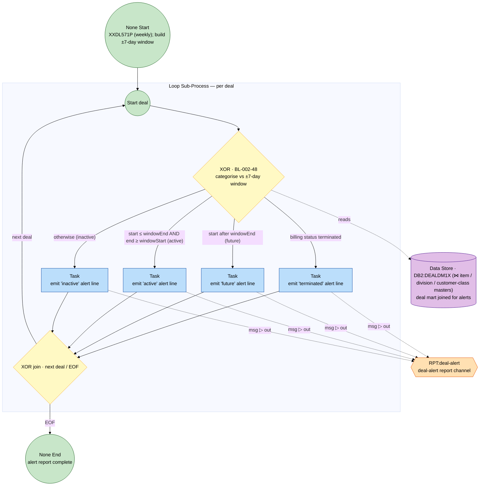

The four guards are mutually exclusive and exhaustive (the classification evaluates terminated → future → active → inactive in that precedence). `RPT:deal-alert` is an external participant reached by Message Flow (meta-model §3.5).

### 10.1 Stage H — rule → element conformance

| BL-002 | Title | Logic type | BPMN element | Where |
|---|---|---|---|---|
| 48 | Categorise deals for alerts | classification | XOR Gateway (4-way) + emit Tasks → `RPT:deal-alert` | §10 |

### 10.2 Stage H — derived FSM projection (Mealy)

**Per deal** — states {`DEAL_READ`, `DEAL_DONE`}:

```
DEAL_READ --[terminated]                       / { 48:terminated } --> DEAL_DONE
DEAL_READ --[¬term ∧ start>windowEnd]          / { 48:future }     --> DEAL_DONE
DEAL_READ --[¬term ∧ start≤end_w ∧ end≥start_w]/ { 48:active }     --> DEAL_DONE
DEAL_READ --[otherwise]                        / { 48:inactive }   --> DEAL_DONE
```

---

## 11. Supporting — Customer-master maintenance (`MCBSM02` / `MCBSM04`, BL-002-49..54)

Two batch programs maintain the customer cluster the deals reference. `MCBSM02` moves customers between divisions and maintains class-group membership; `MCBSM04` processes customers and corporate sales accounts (`SA_CORP`) across ~30 cluster tables. They have no COBOL callers (launched from the customer-side job) and are independent processes coupled to the lifecycle only through the customer cluster (§2). The DB2-error classifier (53) and the maintenance report (54) are shared by both.

> **Grounded correction.** `MCBSM02` is a customer-move / class-group maintenance program; the retention test is **30 days** against `STAT_CHG_TS` under a `HLD` to-division branch status — not a 45-day create-timestamp deletion (companion `BR-002-80/81`, §14.3).

### 11.1 `MCBSM02` — customer move (BL-002-49/50/51/53/54)

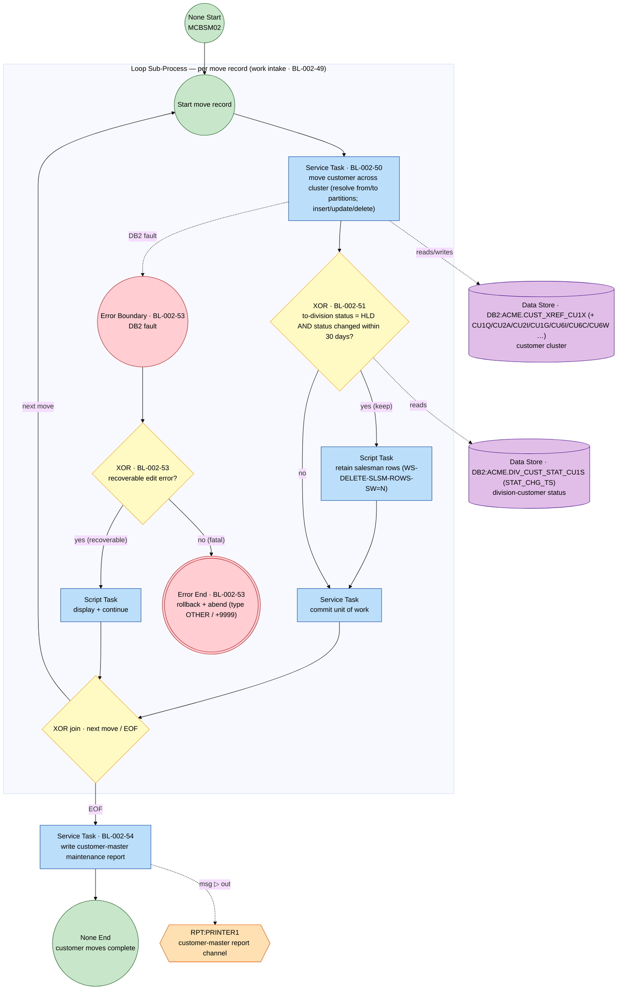

### 11.2 `MCBSM04` — customer / SA_CORP processing (BL-002-52/53/54)

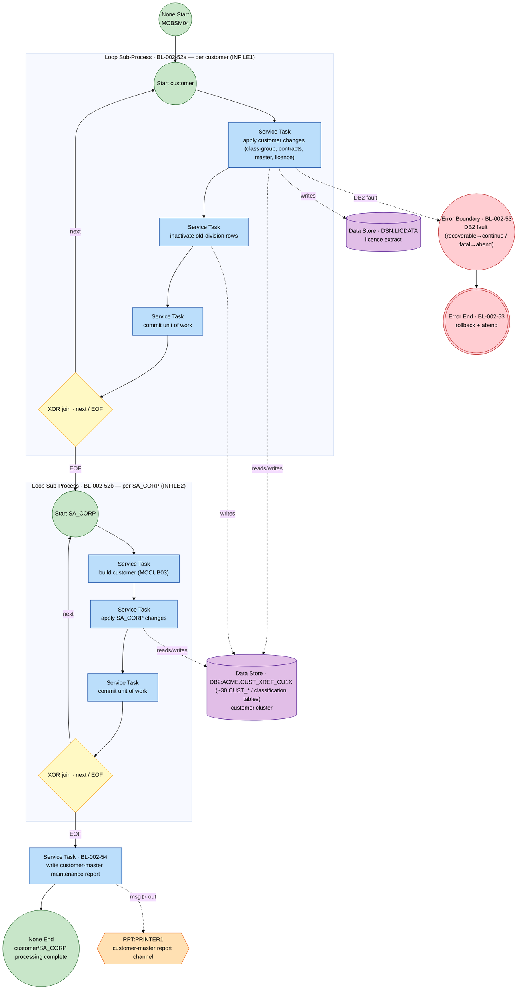

### 11.3 Supporting — rule → element conformance

| BL-002 | Title | Logic type | BPMN element | Where |
|---|---|---|---|---|
| 49 | Drive customer-move loop to EOF | control / work intake | Loop Sub-Process boundary | §11.1 |
| 50 | Move customer across cluster | transformation | Service Task | §11.1 |
| 51 | Retain salesman rows (30-day HLD test) | validation | XOR Gateway (+ keep seed) | §11.1 |
| 52 | Process customers / SA_CORPs (MCBSM04) | transformation | two Loop Sub-Processes | §11.2 |
| 53 | Classify DB2 errors (recoverable vs fatal) | error handling | Error Boundary + XOR → Error End | §11.1 / §11.2 |
| 54 | Produce customer-master report | reporting | Service Task → `RPT:PRINTER1` | §11.1 / §11.2 |

### 11.4 Supporting — derived FSM projection (Mealy)

**`MCBSM02` per move** — states {`MOVE_READ`, `MOVE_DONE`}:

```
MOVE_READ --[HLD ∧ changed<30d]        / { 50, 51:keep, commit } --> MOVE_DONE
MOVE_READ --[¬(HLD ∧ changed<30d)]     / { 50, 51, commit }      --> MOVE_DONE
MOVE_READ --[DB2 recoverable fault]    / { 50, 53:continue }     --> MOVE_DONE
MOVE_READ --[DB2 fatal fault]          / { 50, 53:rollback+abend}--> (Error End)
```

**`MCBSM04`** — anchors {`START`, `CUSTOMERS_DONE`, `END`}:

```
START          --[true] / { 52a per-customer loop } --> CUSTOMERS_DONE
CUSTOMERS_DONE --[true] / { 52b per-SA_CORP loop, 54 } --> END
```
DB2 faults in either loop follow `53` (recoverable → continue, fatal → rollback + abend).

---

## 12. Cross-cutting — operational hard-fail (`BL-002-90`)

Every data-access Task across all stages is guarded by the reusable hard-fail boundary (meta-model §6.4). A normal business outcome — `row found`, `no row found`, `no work to process`, or a malformed reader card handled by clean abandonment — is **not** a hard fail and stays an ordinary XOR branch. Any other unrecoverable file/SQL error sets the batch return code to 16, which the job-step guard (`COND=(4,LT)`) propagates as a pipeline stop. It is modelled once here rather than wired into every access.

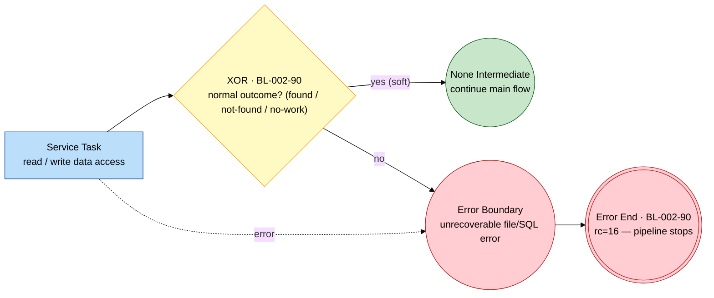

**Stage specializations.** Stage A maps DB faults to its own return codes (`+11` read / `+16` package) rather than RC16 (BL-002-06, §3); the customer-master programs route DB2 faults through the recoverable/fatal classifier (BL-002-53, §11); and Stage D's failed-open is RC16 in the accrual twin but a latent fall-through in `XXDLC10` (BL-002-31, §6.1). These are the same convention with stage-specific fault taxonomies.

---

## 13. Cross-cutting — lifecycle invariants (`BL-002-55/56/57`)

`BL-002-55`, `BL-002-56`, and `BL-002-57` are not units of work or routing decisions; they are **properties of the whole collaboration** that the topology of §2 must preserve. The meta-model's element vocabulary (§3) has no node type for an invariant — Activities do work, Gateways route, Events occur — so, rather than force a non-conformant pseudo-node, each invariant is realized by a **structural feature of the collaboration graph** and is documented (not drawn) here. This is the one deliberate, declared departure from the strict one-node-per-rule coverage rule (called out in the §14 checklist).

| BL-002 | Invariant | Realized by (structural enforcement) |
|---|---|---|
| 55 | Pending-origin: no deal reaches active billing without a pending origin | Collaboration topology (§2): the **only** writer into `DM1T → DEALDM1X` is Stage B capture; no other pool writes the mart's create path. The graph admits no edge that injects a deal bypassing the pending queue. |
| 56 | Suppression-gate: a `Y`-suppressed deal must not contribute to accrual or applied sales | The `S`/`X` disposition gateway in Stage E (BL-002-37, §7.1) on the sales path; the accrual-path enforcement is an open item (§14.3). |
| 57 | Archive-after-report: archival follows the report/alert cycle | Weekly-chain step ordering: the Stage F/H report and alert pools precede the Stage G archival pool, so no row is purged before it has been reported. |

Each invariant is therefore checkable against the collaboration map and the named gateway, but carries no token-flow node of its own.

---

## 14. Conformance and traceability

### 14.1 Consolidated rule → element map (all 58 rules)

| Rule | Title | BPMN element | Where |
|---|---|---|---|
| BL-002-01 | Reset per-call caches | XOR Gateway + clear-caches seed Task | §3.1 |
| BL-002-02 | Seed decision / copy keys | Script Task | §3.1 |
| BL-002-03 | Customer-level suppression check | XOR Gateway | §3.1 |
| BL-002-04 | Item-level suppression check | XOR Gateway | §3.1 |
| BL-002-05 | Deal-level suppression decision | XOR Gateway + suppress seed | §3.1 |
| BL-002-06 | Map DB faults to return codes | Error Boundary → Error End (+11/+16) | §3.1 |
| BL-002-07 | Return suppression switch | Script Task → None End | §3.1 |
| BL-002-08 | Poll pending-deal queue | Loop Sub-Process boundary | §4.1 |
| BL-002-09 | Route by deal type | XOR Gateway | §4.1 |
| BL-002-10 | Edit: item exists (err 2) | XOR Gateway | §4.1 |
| BL-002-11 | Edit: full-case only (err 1) | XOR Gateway | §4.1 |
| BL-002-12 | Edit: not discontinued (err 16) | XOR Gateway | §4.1 |
| BL-002-13 | Edits: vendor/licence/overlap/terminated | Business Rule Task + XOR | §4.1 |
| BL-002-14 | Reject to CAD error log | Service Task | §4.1 |
| BL-002-15 | Promote survivor (txn) | Service Task + Error Boundary | §4.1 |
| BL-002-16 | Write restart checkpoint | Service Task | §4.1 |
| BL-002-17 | Validate processing date | XOR Gateway + clean-abandon End | §5.2 |
| BL-002-18 | Detect rewrite-required | Script Task | §5.2 |
| BL-002-19 | Branch by purchase/billing status | XOR Gateway | §5.2 |
| BL-002-20 | Expire active billing deal | XOR Gateway + set-T seed | §5.2 |
| BL-002-21 | Bypass group/diverter/bracket | XOR Gateway | §5.2 |
| BL-002-22 | Roll ceded amount | XOR Gateway + roll seed | §5.2 |
| BL-002-23 | Recompute billbacks | Script Task | §5.2 |
| BL-002-24 | Default dates / conditional write | XOR Gateway + default/write seeds | §5.2 |
| BL-002-25 | Update deal mart (status change) | Service Task | §5.2 |
| BL-002-26 | Stage input rows | Loop Sub-Process boundary | §6.2 |
| BL-002-27 | Compute staged amount/sign | Script Task | §6.2 |
| BL-002-28 | Read accrual window date | Service Task | §6.2 |
| BL-002-29 | Aggregate-join + unique key | Loop Sub-Process | §6.2 |
| BL-002-30 | No-work + finalization counts | XOR Gateway + Script Task | §6.2 |
| BL-002-31 | Failed-open divergence | XOR Gateway → Error End | §6.2 |
| BL-002-32 | Validate A/R control date | XOR Gateway → Error End | §7.2 |
| BL-002-33 | Require prior sales-margin job | XOR Gateway → Error End | §7.2 |
| BL-002-34 | Deduplicate invoices | XOR Gateway + marker write | §7.2 |
| BL-002-35 | Skip non-eligible lines | XOR Gateway | §7.2 |
| BL-002-36 | Emit ≤3 per-deal records | MI Sub-Process | §7.2 |
| BL-002-37 | Apply suppression disposition (S/X) | XOR Gateway + S/X seeds | §7.2 |
| BL-002-38 | Load configuration | Service Task | §8.2 |
| BL-002-39 | Merge updates vs deal mart | Loop Sub-Process + 3-way XOR | §8.2 |
| BL-002-40 | Recompute billback / next-bill date | Script Task | §8.2 |
| BL-002-41 | Insert log + analysis rows | Service Task | §8.2 |
| BL-002-42 | Deal-statistics report | Send Task → `RPT:deal-statistics` | §8.2 |
| BL-002-43 | Two-year archival cutoff | Script Task | §9.3 |
| BL-002-44 | Archival eligibility (AND) | XOR Gateway (compound) | §9.3 |
| BL-002-45 | Idempotent row delete | Service Task | §9.3 |
| BL-002-46 | Purge deal log > 5d | XOR Gateway + delete seed | §9.3 |
| BL-002-47 | Purge deal audit (retention) | XOR Gateway + delete seed | §9.3 |
| BL-002-48 | Categorise deals for alerts | XOR Gateway (4-way) → `RPT:deal-alert` | §10.1 |
| BL-002-49 | Drive customer-move loop | Loop Sub-Process boundary | §11.3 |
| BL-002-50 | Move customer across cluster | Service Task | §11.3 |
| BL-002-51 | Retain salesman rows (30-day) | XOR Gateway + keep seed | §11.3 |
| BL-002-52 | Process customers / SA_CORPs | two Loop Sub-Processes | §11.3 |
| BL-002-53 | Classify DB2 errors | Error Boundary + XOR → Error End | §11.3 |
| BL-002-54 | Customer-master report | Service Task → `RPT:PRINTER1` | §11.3 |
| BL-002-55 | Pending-origin invariant | collaboration topology (no node) | §13 |
| BL-002-56 | Suppression-gate invariant | Stage E S/X gateway (no node) | §13 |
| BL-002-57 | Archive-after-report invariant | weekly-chain ordering (no node) | §13 |
| BL-002-90 | Hard-fail on unrecoverable errors | Error Boundary → Error End (RC16) | §12 |

### 14.2 Conformance checklist (meta-model §8)

- [x] **Purity (P1–P9).** Each stage process has one Start per pool, block-structured matched split/join gateways, loops confined to `Loop`/`MI` Sub-Processes (P7), exceptions exit via `Error End` (P8), and Sequence Flow never crosses a pool boundary — cross-stage coupling is the shared deal mart / feeder Data Stores (P9, §2).
- [x] **Total coverage.** All 58 rules (`BL-002-01..57` + `90`) appear in §14.1. **Declared deviation:** the three lifecycle *invariants* (`55/56/57`) are properties, not work/routing, so they are realized by collaboration structure rather than a token-flow node (§13) — the one intentional exception to strict one-node coverage, made because the meta-model vocabulary (§3) has no invariant element.
- [x] **No orphan data.** Every Data node has at least one reader and one writer across the collaboration (e.g. the deal mart is written by B/C/E and read by C/D/F/G/H).
- [x] **Data identity.** Every Data node carries a typed id (`DB2:`/`DSN:`/`REC:`/`WS:`/`SESSION.`) or a `[derived]` tag, per meta-model §3.3.1.
- [x] **Integration identity.** Report/extract endpoints are external participants reached only by Message Flow with endpoint ids (`RPT:deal-statistics`, `RPT:deal-alert`, `RPT:PRINTER1`, `FT:outdeal-to-bi`, `FT:licence-extract`), per meta-model §3.5; the underlying report/extract datasets remain data-at-rest.
- [x] **Traceability.** Every rule-bearing node carries its `BL-002-NN` id; per-stage rule→element tables (§3.1–§11.3) plus the consolidated map (§14.1).
- [x] **Soundness.** Each stage's `RG(N)` yields option-to-complete + proper completion with no dead activities (P3+P4+P5 ⇒ P6); XOR guards are mutually exclusive and total throughout.
- [x] **Concurrency handling.** The lifecycle has no intra-process AND region; cross-stage concurrency is interleaving of independently-scheduled pools coordinated by shared stores (collaboration §2), not an in-process parallel gateway. Stage E's fan-out is a `MI` per deal id; Stage F's merge is a 3-way XOR `Loop`.
- [x] **FSM projection.** A derived Mealy projection is provided per stage (§3.2, §4.2, §5.3, §6.3, §7.3, §8.3, §9.4, §10.2, §11.4); the exact reachability-graph FSM is obtainable per meta-model §7.1. An orthogonal cross-stage **deal-entity lifecycle state machine** (data-at-rest, not token flow) is provided in §2.1.
- [x] **Rendering.** Every Mermaid block uses the §3.4 legend (`ev`/`task`/`gw`/`err`/`data`/`sub`/`ext`).

### 14.3 Assumptions, gaps, and open questions (carried from the business-logic spec)

Resolved during extraction (grounded in source / the call graph):

- **Active-billing bypass codes (BL-002-21):** group/diverter/bracket bypass set is deal-type `{04, 07, 08, 09}`.
- **Rolled-into-current semantics (BL-002-22):** `CDDLI0='Y'` marks an already-rolled deal; roll-up runs only when not `Y` and ceded ≠ 0.
- **Archival AND-vs-OR (BL-002-44):** verified **AND** — `DLBUYH < cutoff` mandatory; invoice/ship dates block only when populated and newer than cutoff; `QDURM3 = 0`.
- **`DM3E` error-code mapping (BL-002-10..14):** 1, 2, 5, 6, 7, 9, 16, 18, 19 (§4).
- **`MCBSM02` correction (BL-002-50/51):** customer-move / class-group maintenance with a **30-day** `STAT_CHG_TS` test under a `HLD` branch status — not a 45-day create-timestamp deletion; `XXEBM39` absent (§11).

Still open / carried forward:

- `[SME]` **Outstanding deal quantity (`QDURM3`)** — confirm the precise business meaning of the archival zero-guard column (BL-002-44, §9.1).
- `[SME]` **Accrual-path suppression (BL-002-56)** — sales-path suppression is the `S`/`X` disposition (BL-002-37); confirm whether/how the accrual run (`XXDLC20`) enforces the same gate.
- `[SME]` **`XXDLC10` failed-open (BL-002-31)** — the aggregation twin falls through on a failed open (return code commented out, performed not branched); confirm the intended "stop on failed open" is restored on cutover (§6.1).
- `[SME]` **Report/extract endpoint ids** — `RPT:deal-statistics`, `RPT:deal-alert`, `FT:outdeal-to-bi`, `FT:licence-extract` are placeholder endpoint ids; confirm the actual print/distribution channel names (e.g. PageCenter / InfoPac / EDI) and the BI hand-off mechanism.
- `[SME]` **Deal-alert window edges (BL-002-48)** — confirm inclusive/exclusive boundary handling of the ±7-day window against the formatter source.
- `[GAP]` **Deal-transaction loader (BL-002-15)** — `D8050` writes `DM1T`; the loader moving `DM1T → DEALDM1X` is not in the exported corpus, so that lifecycle edge (§2) is unseen.
- `[GAP]` **Suppression caller (Stage A)** — no exported member issues a literal `XXDLS01` call; the request-key provenance is inferred from the `DLS01LNK` linkage layout (modelled as a Message Start, §3).

---

## 15. Source artifacts

Standalone, self-contained Mermaid sources accompany this document for direct rendering:

| File | Contents |
|---|---|
| `diagrams/BP-002-lifecycle-collaboration.mmd` | §2 lifecycle collaboration / data-flow map |
| `diagrams/BP-002-deal-lifecycle-fsm.mmd` | §2.1 deal-entity lifecycle state machine (cross-stage) |
| `diagrams/BP-002-A-process-graph.mmd` | Stage A suppression decision gate (§3) |
| `diagrams/BP-002-B-process-graph.mmd` | Stage B capture & promotion (§4) |
| `diagrams/BP-002-C-process-graph.mmd` | Stage C active billing — orchestration (§5) |
| `diagrams/BP-002-D-process-graph.mmd` | Stage D aggregation & accrual twins (§6) |
| `diagrams/BP-002-E-process-graph.mmd` | Stage E sales update — orchestration (§7) |
| `diagrams/BP-002-F-process-graph.mmd` | Stage F statistics — orchestration (§8) |
| `diagrams/BP-002-G-process-graph.mmd` | Stage G archival & purge (§9) |
| `diagrams/BP-002-H-process-graph.mmd` | Stage H deal alerts (§10) |
| `diagrams/BP-002-cust-process-graph.mmd` | Supporting customer-master maintenance (§11) |
