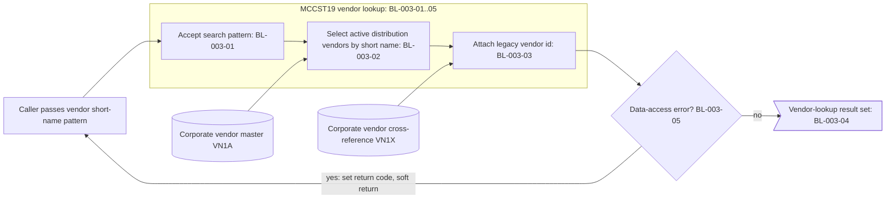
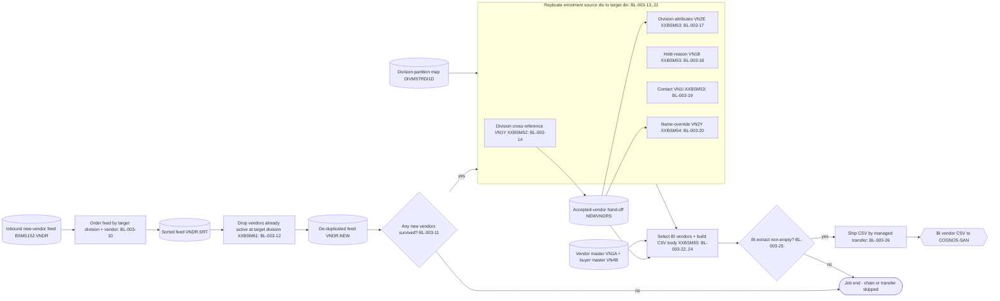

# BP-003 — Vendor Data Management: Extracted Business Logic

**Status:** Draft — business-logic extraction derived from the call-dependency graph, grounded in mainframe source under `docs/legacy/src`
**Companion to:** [BP-003-vendor-data-management-call-graph.md](BP-003-vendor-data-management-call-graph.md) and [BP-003-vendor-data-management.md](../BP-003-vendor-data-management.md)
**Conforms to:** [`business-logic-template.md`](../../../../../reference/business-logic-template.md)
**Scope:** Two independent end-to-end business processes — Process A (Vendor Lookup by Short Name, called routine `MCCST19`) and Process B (Vendor Load for a New Division, batch job `MCBSM52J`) — expressed as discrete, fully-attributed business rules. The spec-declared per-vendor handlers `AUTHORKAY` / `AUTHORMCLANE` are absent from the source drop and are carried as gaps (§8), not rules.

---

## 1. Purpose, scope, and method

This document re-expresses the two BP-003 vendor pipelines as **business logic** — the *what* — separated from the *how* (file mechanics, cursor mechanics, package binding, diagnostics). The primary source is the call-dependency graph; the mainframe source was consulted only to resolve exact field semantics and widths (each consultation is cited inline).

Two unrelated end-to-end processes are covered:

- **Process A — Vendor Lookup by Short Name (`MCCST19`).** A synchronous callable routine: a client passes a vendor short-name pattern and the routine returns a held DB2 result set of active distribution-trade vendors matching the pattern, each enriched with its legacy/old vendor id from the corporate cross-reference. Pure read; no files, no reports.
- **Process B — Vendor Load for a New Division (`MCBSM52J`).** A batch pipeline that replicates an existing vendor's enrolment from a **source division** to a **target division**: sort the inbound new-vendor extract, drop vendors already active at the target division (`XXBSM61`), copy the division↔vendor cross-reference (`XXBSM52`→`VN1Y`), copy the division/hold/contact satellites (`XXBSM53`→`VN2E`/`VN1B`/`VN1I`), copy the name-override (`XXBSM54`→`VN2Y`), then build a BI vendor CSV (`XXBSM55`) and ship it to the Cognos SAN by managed file transfer.

### 1.1 What is in scope (business logic) vs out of scope (implementation)

Captured as rules (the *what*): data validations, classifications, transformations, code mappings, set selections, enrichment lookups, routing/distribution decisions, the output build, and the operational fail conventions.

Treated as implementation and **not** turned into rules (the *how*): opening/closing files and cursors, cursor declare/open/fetch/close and `WITH HOLD WITH RETURN` mechanics, file-status and `SQLCODE` interrogation, `SET CURRENT PACKAGESET`, multi-row fetch buffering, `GET DIAGNOSTICS` / the linked DB2 error subroutine handshake, `COMMIT`-every-1000, scratch-table purge/reload mechanics, pre-delete/idempotent-restart utility steps, the inter-program hand-off **file** mechanics, the header-concatenation utility step, and the managed-file-transfer plumbing. These are summarized once in §6.3. The exceptions promoted to rules are the two operational fail conventions: the called-routine soft return-to-caller (BL-003-05) and the batch return-code-16 hard fail (BL-003-27).

### 1.2 Rule attributes

Each rule lists, in order: **Logic type** (one primary type from the closed §5 vocabulary of the template, optional parenthetical subtype); **Maps to** (the coarse companion rule `BR-003-xx`, or `new` with a one-clause reason); **Derives from** (the originating call-graph node id(s), plus any source member consulted); **Trigger**; **Input schema**; **Description** (the *what*, no mechanics); **Pseudocode** (CLRS 4th-edition convention); **Output schema**.

### 1.3 Pseudocode convention (CLRS 4th edition)

- Indentation denotes block structure; there are no `begin`/`end` brackets.
- `=` is assignment; `==`, `≠`, `≤`, `≥` are comparisons; `and`, `or`, `not` are boolean (short-circuiting).
- `//` begins a comment.
- Keywords: `if` / `elseif` / `else`, `while`, `repeat … until`, `for … to` / `downto`, `return`, `error "…"`.
- Procedures are named in capitals with hyphens, e.g. `REPLICATE-DIV-VENDOR-XREF`; object attributes use dot notation, e.g. `row.divisionId`.
- No COBOL, SQL, or JCL text appears in any pseudocode block; all identifiers are plain-English. The originating mnemonic is given in the schema and prose, per §1.4.

### 1.4 Identifier-translation rule

Every cryptic or mnemonic identifier is rendered in plain English with the original in parentheses on first use within a rule and in every schema row, e.g. *current vendor id (`VNDR_ID`)*, *legacy/old vendor id (`OLD_VNDR_ID`)*, *deletion switch (`DELT_SW`)*. The master mapping is in §3.

### 1.5 Logical type vocabulary (used in all schemas)

| Logical type | Meaning |
|---|---|
| `string(n)` | fixed-length character field of length n |
| `integer` / `integer(n)` | whole number (optionally n digits) |
| `amount(i.f)` | signed decimal money/quantity, i integer digits and f fractional digits |
| `date-iso` | calendar date as `YYYY-MM-DD` text |
| `timestamp` | date-time to (stated) sub-second precision |
| `code(n)` | enumerated character code of length n (values enumerated in prose) |
| `flag` | single-character yes/no indicator |

---

## 2. End-to-end process maps

### 2.1 Process A — Vendor Lookup by Short Name (`MCCST19`)



### 2.2 Process B — Vendor Load for a New Division (`MCBSM52J`)



> Shared rules span the stages: the division-partition mapping (BL-003-16) feeds the partition-keyed satellites; the corporate-substitution recognition (BL-003-13) and the duplicate-key soft-skip (BL-003-21) apply across `XXBSM52/53/54`; the hard-fail convention (BL-003-27) applies job-wide.

---

## 3. Master identifier-translation glossary

### 3.1 `MCCST19` call linkage interface

| Plain-English name | Original | Logical type |
|---|---|---|
| vendor short-name search pattern | `IN-VEND-NM` | string(20) — call linkage (input) |
| caller return code | `OUT-RETURN-CD` (`PIC S9(4) COMP`) | integer — call linkage (output); data-access status on error |
| search-key copy of the pattern | `VN1A-VNDR-SHRT-NM` | string(20) — working key |

### 3.2 Corporate vendor master (`ACME.VNDR_MSTR_VN1A`, DCLGEN `DGVN1A`)

| Plain-English name | Original | Logical type |
|---|---|---|
| current vendor id | `VNDR_ID` | integer(10) |
| vendor short name | `VNDR_SHRT_NM` | string(20) |
| vendor name | `VNDR_NM` | string(40) |
| vendor status | `STAT` | code(3) — active = `ACT` |
| vendor trade-class | `CLS_TRD` | code(3) — distribution = `DIS` |
| buyer id | `BUYR_ID` | integer |

### 3.3 Corporate vendor cross-reference (`ACME.CRP_VNDR_XREF_VN1X`, DCLGEN `DGVN1X`)

| Plain-English name | Original | Logical type |
|---|---|---|
| current vendor id | `VNDR_ID` | integer(10) — join key |
| legacy/old vendor id | `OLD_VNDR_ID` | integer(10) |

### 3.4 Inbound sorted vendor record (`BSM51VND`, FB 80)

| Plain-English name | Original | Logical type |
|---|---|---|
| cost-class id | `CLS-ID` | string(10) |
| source Acme division code | `FROM-ACME-DIV` | string(2) — record pos 15–16 |
| target Acme division code | `TO-ACME-DIV` | string(2) — record pos 19–20 |
| vendor id | `VNDR-ID` / `VENDR-ID` | integer(10) |

> Sort key (call graph §4.1): target-division (cols 17–18) + vendor-id (cols 19–28). The binary half-word division-partition fields adjacent to the character division codes are resolved from `BSM51VND.cpy`.

### 3.5 Accepted-vendor hand-off record (`XXBSM52C` → `ACME.PERM.NEWVNDRS`)

| Plain-English name | Original | Logical type |
|---|---|---|
| accounts-payable vendor id | `DCS-AP-VNDR` | integer(10) |
| vendor-management vendor id | `VENMGT-VNDR` | integer(10) |
| source division code | `FROM-DIV` | string(2) |
| target division code | `TO-DIV` | string(2) |

### 3.6 Per-run scratch driver table (`TEMP.VNDR_ID_DIV_T312`, no DCLGEN)

| Plain-English name | Original (as joined) | Logical type |
|---|---|---|
| source division code | `FROM_DIV` | string(2) |
| target division code | `TO_DIV` | string(2) |
| vendor id | `DCS_VNDR` | integer(10) |

> Column names inferred from the join predicates in call graph §4.3–§4.6 (no DCLGEN exists — see §8).

### 3.7 Division↔vendor cross-reference (`ACME.DIV_VNDR_XREF_VN1Y`, DCLGEN `DGVN1Y`)

| Plain-English name | Original | Logical type |
|---|---|---|
| vendor id | `VNDR_ID` | integer(10) |
| legacy/old vendor id | `OLD_VNDR_ID` | integer(10) |
| division id | `DIV_ID` | code(3) |
| deletion switch | `DELT_SW` | flag — not-deleted = `N` |
| active-status flag | `VN1A_STAT` | code(3) — active = `ACT` |
| owning user id | `USER_ID` | string(8) — set to `XXBSM52` on insert |

### 3.8 Vendor satellites — division attributes / hold-reason / contact / name-override

| Plain-English name | Original | Logical type | In table (DCLGEN) |
|---|---|---|---|
| division partition | `DIV_PART` | integer | `VN2E`/`VN1B`/`VN1I` (re-keyed to target) — `DGVN2E`/`DGVN1B`/`DGVN1I` |
| division id | `DIV_ID` | code(3) | `VN2Y` (re-keyed to target) — `DGVN2Y` |
| vendor id | `VNDR_ID` / `OLD_VNDR_ID` | integer(10) | all four |
| owning user id | `USER_ID` | string(8) | `VN2Y` set to `XXBSM54` on insert |

### 3.9 Division master (`ACME.DIVMSTRDI1D`, DCLGEN `DGDI1D`)

| Plain-English name | Original | Logical type |
|---|---|---|
| Acme division code | `MCLANE_DIV` | string(2) |
| division partition | `DIV_PART` | integer |

### 3.10 Buyer master (`ACME.BUYR_MSTR_VN4B`, DCLGEN `DGVN4B`)

| Plain-English name | Original | Logical type |
|---|---|---|
| buyer id | `BUYR_ID` | integer |
| buyer/operator code | `DCS_OPER_ID` | string(5) |

### 3.11 Corporate-substitution switch (`CORPVNDR`)

| Plain-English name | Original | Logical type |
|---|---|---|
| corporate-substitution switch | `CORPVNDR` | flag — `N` (always, this job) / `Y` (dormant) |

### 3.12 BI CSV record (`XXBSM55C` → `ACME.PERM.BSM55S1`)

| Plain-English name | Original | Logical type |
|---|---|---|
| source division code | `FROM-ACME-DIV` | string(2) |
| target division code | `TO-ACME-DIV` | string(2) |
| buyer/operator code | `BUYER` (`DCS_OPER_ID`) | string(5) |
| vendor id | `VNDR-ID` (`DCS_VNDR`) | integer(10) |
| CSV-safe vendor name | `VNDR-NAME` (`VN1A.VNDR_NM`) | string(40) |

---

## 4. Process A — Vendor Lookup by Short Name (`MCCST19`)

**Entry points / data sources:** a synchronous caller (`CALL 'MCCST19' USING IN-VEND-NM, OUT-RETURN-CD`); the corporate vendor master (`VN1A`) and corporate vendor cross-reference (`VN1X`).
**Data sinks:** one held DB2 result set returned to the caller (`API:vendor-lookup`, `RESULT SETS = 1`); the caller return code carries the data-access status on error.

The routine accepts a short-name pattern, selects the active distribution-trade vendors that match it, enriches each with its legacy/old vendor id, and exposes the matched rows as a single held result set; any data-access error is reported back through the return code without abending.

#### BL-003-01 — Accept the caller's vendor short-name search pattern
- **Logic type:** transformation (normalisation)
- **Maps to:** BR-003-01
- **Derives from:** `MCCST19` (`PROCEDURE DIVISION USING IN-VEND-NM, OUT-RETURN-CD`); linkage-to-search-key assignment in the main paragraph; field width resolved from `DB2P.PERM.DCLGEN/DGVN1A.cpy` (`VNDR_SHRT_NM CHAR(20)`).
- **Trigger:** the routine is invoked with a caller-supplied short-name value.
- **Input schema:** vendor short-name search pattern (`IN-VEND-NM`): string(20).
- **Description:** The caller passes a 20-character vendor short-name pattern. The routine adopts that value verbatim as the search key for the vendor-master pattern match (`VN1A-VNDR-SHRT-NM`). No upper-casing, trimming, or wildcard insertion is performed — the caller owns case and leading/trailing-space handling — so the pattern is used exactly as received. (`TC-003-02` leading-spaces behaviour is therefore caller-defined; see §8.)
- **Pseudocode:**

```
ACCEPT-SEARCH-PATTERN(callerShortName)
    searchPattern = callerShortName            // taken verbatim, no normalisation
    return searchPattern
```

- **Output schema:** vendor short-name search pattern (`VN1A-VNDR-SHRT-NM`): string(20).

#### BL-003-02 — Select only active distribution-trade vendors matching the short-name pattern
- **Logic type:** selection (set selection)
- **Maps to:** BR-003-01, BR-003-03
- **Derives from:** `MCCST19` cursor declaration `VN1A_NM` (call graph §3.3 "(declaration)"); predicates `CLS_TRD='DIS' AND STAT='ACT' AND VNDR_SHRT_NM LIKE :VN1A-VNDR-SHRT-NM` resolved from `MCCST19.cbl`.
- **Trigger:** a vendor lookup is requested (the result-set query is opened against the corporate vendor master).
- **Input schema:** vendor short-name search pattern (`VN1A-VNDR-SHRT-NM`): string(20); per-vendor short name (`VNDR_SHRT_NM`): string(20); vendor status (`STAT`): code(3) — active = `ACT`; vendor trade-class (`CLS_TRD`): code(3) — distribution = `DIS`.
- **Description:** From the corporate vendor master the routine selects only vendors that are simultaneously (a) active (status `ACT`), (b) of the distribution trade class (`DIS`), and (c) whose short name matches the caller's pattern. Inactive and non-distribution vendors are excluded at the data layer — this resolves the open BR-003-03 question: exclusion is driven by the corporate vendor-master status column (`STAT`), not by a divisional VSAM status code.
- **Pseudocode:**

```
IS-SELECTED-VENDOR(vendor, searchPattern)
    return vendor.status == "ACT"
       and vendor.tradeClass == "DIS"
       and MATCHES-PATTERN(vendor.shortName, searchPattern)   // short-name pattern match
```

- **Output schema:** the qualifying set of vendor-master rows (each: current vendor id `VNDR_ID`, short name `VNDR_SHRT_NM`).

#### BL-003-03 — Attach the legacy vendor id from the corporate cross-reference
- **Logic type:** enrichment
- **Maps to:** BR-003-02
- **Derives from:** `MCCST19` cursor `VN1A_NM` join `INNER JOIN ACME.CRP_VNDR_XREF_VN1X ON VN1A.VNDR_ID = VN1X.VNDR_ID`, projecting `VN1X.OLD_VNDR_ID`; id widths from `DGVN1A.cpy`/`DGVN1X.cpy`.
- **Trigger:** for each vendor selected by BL-003-02.
- **Input schema:** current vendor id (`VN1A.VNDR_ID`): integer(10); cross-reference current vendor id (`VN1X.VNDR_ID`): integer(10); legacy/old vendor id (`VN1X.OLD_VNDR_ID`): integer(10).
- **Description:** Each selected vendor is enriched with its legacy/old vendor id by matching the vendor's current id against the corporate vendor cross-reference. The match is exact and mandatory: a vendor with no corresponding cross-reference row is dropped from the result (inner-join semantics), so every returned row carries both the current and the legacy id, giving the caller the unified corporate-vendor view.
- **Pseudocode:**

```
ENRICH-WITH-LEGACY-ID(vendor)
    xref = CORP-XREF-FOR(vendor.currentVendorId)    // by current vendor id
    if xref is NOT-FOUND
        return DROP                                  // no corporate view -> exclude row
    vendor.legacyVendorId = xref.oldVendorId
    return vendor
```

- **Output schema:** enriched vendor row: current vendor id (`VNDR_ID`): integer(10), legacy/old vendor id (`OLD_VNDR_ID`): integer(10), short name (`VNDR_SHRT_NM`): string(20).

#### BL-003-04 — Return the matched vendors as a single result set to the caller
- **Logic type:** reporting
- **Maps to:** BR-003-01, BR-003-02
- **Derives from:** `MCCST19` `RESULT SETS = 1`; cursor `VN1A_NM` declared `WITH HOLD WITH RETURN` and opened in the main paragraph; endpoint `API:vendor-lookup` (call graph §3.6, §5.4).
- **Trigger:** the vendor selection succeeds (no error condition raised by BL-003-05).
- **Input schema:** the enriched qualifying vendor rows from BL-003-03.
- **Description:** The routine returns the matched vendors to its caller as one open result set (it does not pass rows back through the linkage parameters). The result set is held open across the routine's return so the caller can read each row at its own pace. Exactly one result set is produced per call; if no vendors qualify, the result set is empty rather than an error.
- **Pseudocode:**

```
RETURN-VENDOR-RESULT-SET(qualifyingVendors)
    resultSet = qualifyingVendors        // 0..n rows: currentVendorId, legacyVendorId, shortName
    EXPOSE-TO-CALLER(resultSet)          // single held result set; caller reads rows
    return resultSet
```

- **Output schema:** vendor-lookup result set (`API:vendor-lookup`, `RESULT SETS = 1`): zero or more rows of (current vendor id, legacy/old vendor id, short name).

#### BL-003-05 — On any data-access error, surface the error code to the caller without aborting
- **Logic type:** error-handling (operational rule)
- **Maps to:** new (operational soft-return convention)
- **Derives from:** `MCCST19.9900-DB2-ERROR-ROUTINE` and the two non-zero-`SQLCODE` gates after the result-set open and after the post-open timestamp set; dynamic `CALL 'DBDB2ER'`; `OUT-RETURN-CD` carries `SQLCODE` (`MCCST19.cbl`).
- **Trigger:** the vendor-master access (result-set open) or the subsequent system-timestamp read reports any non-success condition.
- **Input schema:** data-access status code (`SQLCODE`): integer; routine name (`WS-PROGRAM-NAME`): string(8).
- **Description:** If either the vendor selection or the subsequent system-timestamp read fails, the routine places the underlying data-access status code into its return-code output parameter (`OUT-RETURN-CD`), invokes the shared error-reporting handler (`DBDB2ER`) to log the diagnostic, and returns normally to the caller. This is a **soft** return-to-caller convention: the routine does **not** abend and does **not** raise a hard return code 16 — it relies on the caller to inspect the return code and decide how to proceed. (A non-zero code means "lookup failed"; a zero code with an empty result set means "no matches".)
- **Pseudocode:**

```
HANDLE-ACCESS-OUTCOME(accessStatus)
    if accessStatus ≠ 0
        callerReturnCode = accessStatus      // pass the status back, do not abend
        REPORT-DB2-ERROR(accessStatus)       // shared diagnostic handler
        return SOFT-RETURN-TO-CALLER
    return CONTINUE
```

- **Output schema:** caller return code (`OUT-RETURN-CD`): integer = data-access status code on failure, otherwise unchanged/zero; soft return to caller (no abend).

---

## 5. Process B — Vendor Load for a New Division (`MCBSM52J`)

**Entry points / data sources:** the operator/scheduler-launched batch job; the inbound new-vendor feed (`BSM51S2.VNDR`); the division↔vendor cross-reference (`VN1Y`), corporate cross-reference (`VN1X`), division master (`DIVMSTRDI1D`), vendor master (`VN1A`), buyer master (`VN4B`); the per-run scratch driver table; the inline corporate-substitution switch card.
**Data sinks:** five DB2 satellite tables populated by `INSERT` (`VN1Y`, `VN2E`, `VN1B`, `VN1I`, `VN2Y`); the BI vendor CSV (`BSM55S1` → `.CSV`) shipped to `FT:COGNOS-SAN`.

### 5.A Stage 0 — Job-level orchestration (`MCBSM52J`)

#### BL-003-10 — Order the inbound feed by target division and vendor
- **Logic type:** transformation (normalisation)
- **Maps to:** new (precondition for the active-dedup match)
- **Derives from:** `MCBSM52J` step `SORT1`.
- **Trigger:** job start, after recall/pre-delete steps, before the dedup program.
- **Input schema:** inbound new-vendor feed records (`BSM51S2.VNDR`): target Acme division code (`TO-ACME-DIV`): string(2); vendor id (`VNDR-ID`): integer(10).
- **Description:** The inbound new-vendor extract is re-ordered so that all records for a given target division and vendor are contiguous and ascending. This ordering is the precondition for the downstream per-(vendor, target-division) dedup probe and for the grouped BI output.
- **Pseudocode:**

```
ORDER-FEED(records)
    return SORT-ASCENDING(records, by = (targetDivisionCode, vendorId))
```

- **Output schema:** sorted feed (`VNDR.SRT`), same layout as input.

#### BL-003-11 — Gate the insert chain on new vendors surviving dedup
- **Logic type:** validation (write-gate)
- **Maps to:** BR-003-10
- **Derives from:** `MCBSM52J` gate `DSCNT1` (IDCAMS count of `BSM51S2.VNDR.NEW`).
- **Trigger:** after the dedup program (`XXBSM61`) completes.
- **Input schema:** de-duplicated feed (`VNDR.NEW`): record count.
- **Description:** The whole replication chain (`XXBSM52`→`XXBSM55`) runs only when at least one vendor survived dedup — i.e. there is genuinely a new-division enrolment to perform. An empty dedup output is a normal "nothing to do" outcome that skips the insert chain; it is not an error.
- **Pseudocode:**

```
GATE-INSERT-CHAIN(dedupFeed)
    if ROW-COUNT(dedupFeed) > 0
        return RUN-CHAIN
    return SKIP-CHAIN          // soft skip, not a failure
```

- **Output schema:** run/skip decision over the insert chain.

### 5.B Stage 1 — Dedup against vendors already active at the target division (`XXBSM61`)

#### BL-003-12 — Keep only vendors not already active at the target division
- **Logic type:** validation (filter)
- **Maps to:** BR-003-11
- **Derives from:** `XXBSM61.5100-CHECK-VNDR` (the `SQLCODE` `+100`/`0`/`-811`/other branches); reads `ACME.DIV_VNDR_XREF_VN1Y`.
- **Trigger:** each sorted inbound record.
- **Input schema:** target Acme division code (`TO-ACME-DIV`): string(2), used as the cross-reference division id (`DIV_ID`): code(3); vendor id (`VNDR_ID`): integer(10); division↔vendor cross-reference filtered on deletion switch (`DELT_SW`=`N`) and active-status flag (`VN1A_STAT`=`ACT`).
- **Description:** For each (vendor, target-division) pair the program probes the division↔vendor cross-reference for an existing **non-deleted, active** enrolment. A vendor already active at the target division is dropped (it must not be re-created); only vendors with no such enrolment ("not found") are passed forward. The active filter (added per PIR14188) means a deleted/inactive prior enrolment does not block a re-load.
- **Pseudocode:**

```
DEDUP-VENDOR(record)
    status = PROBE-DIV-VENDOR-XREF(record.targetDivision, record.vendorId)
                                    // non-deleted AND active only
    if status == NOT-FOUND
        EMIT-TO-NEW-FEED(record)              // eligible for new-division load
    elseif status == FOUND or status == AMBIGUOUS-MATCH
        return SKIP                            // already active at target division
    else
        error "unexpected database error"     // BL-003-27
```

- **Output schema:** de-duplicated feed (`VNDR.NEW`), records eligible for loading.

> Plain-English mapping of the source decision: "not found" = keep; "found" = skip; "ambiguous match" (a multi-row response to a single-row probe) = treated as already-active, skip; any other status = unexpected error → hard fail (BL-003-27).

### 5.C Stage 2 — Build the division↔vendor cross-reference (`XXBSM52` → `VN1Y`)

#### BL-003-13 — Recognise the corporate-substitution switch
- **Logic type:** classification
- **Maps to:** new (operational mode recognition; dormant in this job)
- **Derives from:** `XXBSM52.1600-READ-CORPVNDR` (and the analogous switch reads in `XXBSM53`/`XXBSM54`).
- **Trigger:** program initialisation, after loading the scratch driver.
- **Input schema:** corporate-substitution switch (`CORPVNDR`): flag.
- **Description:** A single-byte control switch declares whether the replication should substitute the **corporate** cross-reference's legacy/old vendor id (from `VN1X`) in place of the source vendor id. In this job the switch is always `N`, so the substitution path is dormant; the rule records the recognition because it gates the `VN1X` pre-lookup in the cross-reference, contact, and name-override copies (BL-003-14/19/20).
- **Pseudocode:**

```
READ-SUBSTITUTION-SWITCH()
    switch = READ-SWITCH-CARD()            // single byte
    if switch == "Y"
        return SUBSTITUTE-CORPORATE-OLD-ID
    return USE-SOURCE-VENDOR-ID            // always this branch in this job
```

- **Output schema:** substitution mode (`Y`/`N`) consumed by the copy rules.

#### BL-003-14 — Replicate the division↔vendor cross-reference at the target division (`VN1Y`)
- **Logic type:** transformation
- **Maps to:** BR-003-12
- **Derives from:** `XXBSM52.3200-FETCH-CURSOR`, `.3300-INSERT-VN1Y` (duplicate-key `-803`); reads `VN1Y ⋈ VN1X ⋈ TEMP`, writes `ACME.DIV_VNDR_XREF_VN1Y`.
- **Trigger:** each surviving vendor, after the scratch driver (`TEMP.VNDR_ID_DIV_T312`) is loaded from the dedup feed.
- **Input schema:** source-division cross-reference row (`VN1Y` at `DIV_ID`=source division, joined to corporate xref `VN1X` on `DELT_SW`=`N`); target division code (`TO_DIV`); substitution mode (BL-003-13).
- **Description:** For each accepted vendor the program reads the vendor's existing division↔vendor cross-reference row at the **source** division and writes a copy re-keyed to the **target** division, stamping the owning user as `XXBSM52`. Under the (dormant) corporate-substitution mode the corporate legacy/old vendor id would be used; here the source vendor id is carried through. Duplicate rows are soft-skipped (BL-003-21).
- **Pseudocode:**

```
REPLICATE-DIV-VENDOR-XREF(vendor, sourceDivision, targetDivision)
    for each row in SOURCE-XREF-ROWS(vendor, sourceDivision)
        newRow = CLONE-ROW(row)
        newRow.divisionId = targetDivision
        newRow.owningUser = "XXBSM52"
        INSERT-OR-SKIP-DUP(newRow)                       // BL-003-21
        RECORD-ACCEPTED(vendor, sourceDivision, targetDivision)   // BL-003-15
```

- **Output schema:** one division↔vendor cross-reference row (`VN1Y`) at the target division per source row.

#### BL-003-15 — Record each accepted vendor for the downstream stages
- **Logic type:** control (distribution)
- **Maps to:** new (inter-stage hand-off of the accepted set)
- **Derives from:** `XXBSM52.3500-NEW-VNDRS-WRITE` (→ `ACME.PERM.NEWVNDRS`).
- **Trigger:** each vendor whose source cross-reference was replicated (BL-003-14).
- **Input schema:** vendor ids (`DCS-AP-VNDR`, `VENMGT-VNDR`): integer(10); source division (`FROM-DIV`): string(2); target division (`TO-DIV`): string(2).
- **Description:** Every accepted vendor and its source/target division pair is recorded as the authoritative "vendors actually loaded" set, which the satellite, name-override, and BI-CSV stages consume — so they operate on exactly the vendors `XXBSM52` enrolled, not the raw dedup feed.
- **Pseudocode:**

```
RECORD-ACCEPTED(vendor, sourceDivision, targetDivision)
    APPEND-ACCEPTED-SET(vendor.apVendorId, vendor.venmgtVendorId,
                        sourceDivision, targetDivision)
```

- **Output schema:** accepted-vendor hand-off records (`NEWVNDRS`).

### 5.D Stage 3 — Division / hold-reason / contact satellites (`XXBSM53`)

#### BL-003-16 — Map a Acme division code to its division partition
- **Logic type:** enrichment
- **Maps to:** new (supports BR-003-12 re-keying)
- **Derives from:** `XXBSM53.3200/4200/5200` joins to `ACME.DIVMSTRDI1D` (×2: source and target).
- **Trigger:** whenever a partition-keyed satellite copy (`VN2E`/`VN1B`/`VN1I`) must re-key a row from source to target division.
- **Input schema:** source Acme division code and target Acme division code (`MCLANE_DIV`): string(2); division master.
- **Description:** The partition-keyed satellites store rows by division partition, not by Acme division code, so both the source and the target Acme division codes are translated to their numeric division partitions through the division master. The source partition selects the rows to copy; the target partition re-keys them.
- **Pseudocode:**

```
DIVISION-PARTITION(mclaneDivisionCode)
    return LOOKUP-DIV-MASTER(mclaneDivisionCode).divisionPartition
```

- **Output schema:** source division partition and target division partition (`DIV_PART`): integer.

#### BL-003-17 — Replicate the vendor-division attributes at the target division (`VN2E`)
- **Logic type:** transformation
- **Maps to:** BR-003-12
- **Derives from:** `XXBSM53.3200-FETCH-VN2E`, `.3300-INSERT-VN2E` (duplicate-key `-803` → count & skip); reads `TEMP ⋈ DIVMSTRDI1D(×2) ⋈ VN2E`.
- **Trigger:** per accepted vendor, after the scratch driver is reloaded from the hand-off set.
- **Input schema:** source-division vendor-division attribute row (`VN2E`); source/target division partitions (BL-003-16).
- **Description:** The vendor's division-attribute row at the source division is copied to the target division, with the division key replaced by the **target** division partition. Duplicate rows are counted and soft-skipped (BL-003-21).
- **Pseudocode:**

```
REPLICATE-VENDOR-DIV-ATTRS(vendor, sourcePartition, targetPartition)
    for each row in SOURCE-VN2E-ROWS(vendor, sourcePartition)
        newRow = CLONE-ROW(row)
        newRow.divisionPartition = targetPartition
        INSERT-OR-SKIP-DUP(newRow)              // BL-003-21
```

- **Output schema:** one vendor-division attribute row (`VN2E`) at the target division per source row.

#### BL-003-18 — Replicate the vendor hold-reason at the target division (`VN1B`)
- **Logic type:** transformation
- **Maps to:** BR-003-12
- **Derives from:** `XXBSM53.4200-FETCH-VN1B`, `.4300-INSERT-VN1B` (duplicate-key `-803` → count & skip); reads `TEMP ⋈ DIVMSTRDI1D(×2) ⋈ VN1B`.
- **Trigger:** per accepted vendor, after the `VN2E` chain completes.
- **Input schema:** source-division hold-reason row (`VN1B`); source/target division partitions (BL-003-16).
- **Description:** The vendor's hold-reason row at the source division is copied to the target division, re-keyed to the target division partition. Duplicate rows are counted and soft-skipped (BL-003-21).
- **Pseudocode:**

```
REPLICATE-HOLD-REASON(vendor, sourcePartition, targetPartition)
    for each row in SOURCE-VN1B-ROWS(vendor, sourcePartition)
        newRow = CLONE-ROW(row)
        newRow.divisionPartition = targetPartition
        INSERT-OR-SKIP-DUP(newRow)              // BL-003-21
```

- **Output schema:** one hold-reason row (`VN1B`) at the target division per source row.

#### BL-003-19 — Replicate the vendor contact at the target division (`VN1I`)
- **Logic type:** transformation
- **Maps to:** BR-003-12
- **Derives from:** `XXBSM53.5200-FETCH-VN1I`, `.5300-INSERT-VN1I` (duplicate-key `-803` → count & skip); reads `TEMP ⋈ DIVMSTRDI1D(×2) ⋈ VN1I`.
- **Trigger:** per accepted vendor, after the `VN1B` chain completes.
- **Input schema:** source-division contact row (`VN1I`); source/target division partitions (BL-003-16); substitution mode (BL-003-13) — under `Y`, a corporate `VN1Y ⋈ VN1X` pre-lookup supplies the legacy/old vendor id.
- **Description:** The vendor's contact row at the source division is copied to the target division, re-keyed to the target division partition. Under the dormant corporate-substitution mode the corporate legacy/old vendor id would be pre-resolved; here the source id is carried. Duplicate rows are counted and soft-skipped (BL-003-21).
- **Pseudocode:**

```
REPLICATE-CONTACT(vendor, sourcePartition, targetPartition)
    for each row in SOURCE-VN1I-ROWS(vendor, sourcePartition)
        newRow = CLONE-ROW(row)
        newRow.divisionPartition = targetPartition
        INSERT-OR-SKIP-DUP(newRow)              // BL-003-21
```

- **Output schema:** one contact row (`VN1I`) at the target division per source row.

### 5.E Stage 4 — Vendor name-override (`XXBSM54` → `VN2Y`)

#### BL-003-20 — Replicate the vendor name-override at the target division (`VN2Y`)
- **Logic type:** transformation
- **Maps to:** BR-003-12
- **Derives from:** `XXBSM54.3200-FETCH-CURSOR`, `.3300-INSERT-VN2Y` (duplicate-key `-803`); reads `VN2Y ⋈ TEMP`, writes `ACME.VNDR_NM_OVRRD_VN2Y`.
- **Trigger:** per accepted vendor, after the scratch driver is reloaded from the hand-off set.
- **Input schema:** source-division name-override row (`VN2Y` where `DIV_ID`=source division and `OLD_VNDR_ID`=vendor); target division code (`TO_DIV`); substitution mode (BL-003-13).
- **Description:** The vendor's name-override row at the source division is copied to the target division, stamping the owning user as `XXBSM54`. Under the dormant corporate-substitution mode the corporate legacy/old vendor id would be substituted; here the source id is carried. Duplicate rows are soft-skipped (BL-003-21).
- **Pseudocode:**

```
REPLICATE-NAME-OVERRIDE(vendor, sourceDivision, targetDivision)
    for each row in SOURCE-VN2Y-ROWS(vendor, sourceDivision)
        newRow = CLONE-ROW(row)
        newRow.divisionId = targetDivision
        newRow.owningUser = "XXBSM54"
        INSERT-OR-SKIP-DUP(newRow)              // BL-003-21
```

- **Output schema:** one name-override row (`VN2Y`) at the target division per source row.

### 5.F Stage 5 — Shared write convention (used across `XXBSM52/53/54`)

#### BL-003-21 — Soft-skip duplicate-key inserts
- **Logic type:** validation (filter)
- **Maps to:** new (operational idempotency rule)
- **Derives from:** `XXBSM52.3300-INSERT-VN1Y`, `XXBSM53.3300/4300/5300`, `XXBSM54.3300-INSERT-VN2Y` (all duplicate-key `-803`).
- **Trigger:** any satellite write that violates the target table's unique key.
- **Input schema:** the write outcome from any of the five replication rules (BL-003-14/17/18/19/20).
- **Description:** When a row being replicated already exists at the target division (duplicate key), the write is counted and skipped rather than treated as an error — making re-runs idempotent and tolerating partial prior loads. Only genuinely unexpected database errors escalate to the hard fail (BL-003-27).
- **Pseudocode:**

```
INSERT-OR-SKIP-DUP(row)
    outcome = STORE-ROW(row)
    if outcome == DUPLICATE-KEY
        duplicateCount = duplicateCount + 1     // soft skip
    elseif outcome ≠ OK
        error "unexpected database error"       // BL-003-27
```

- **Output schema:** stored row, or an incremented duplicate counter; no failure on duplicate.

### 5.G Stage 6 — Build the BI vendor CSV (`XXBSM55`)

#### BL-003-22 — Select the newly-enrolled target-division vendors for BI
- **Logic type:** selection (set selection)
- **Maps to:** BR-003-10
- **Derives from:** `XXBSM55.3200-FETCH-CURSOR` (group/order by); reads `TEMP ⋈ VN1Y ⋈ VN1A ⋈ VN4B`; vendor name `VN1A.VNDR_NM` joined via `VN1A.BUYR_ID = VN4B.BUYR_ID` (resolved from `DGVN1A`/`DGVN4B`).
- **Trigger:** after the scratch driver is reloaded from the hand-off set.
- **Input schema:** division↔vendor cross-reference (`VN1Y` where `DIV_ID`=target division and `DELT_SW`=`N`); vendor master (`VN1A`); buyer master (`VN4B` where `BUYR_ID`=`VN1A.BUYR_ID`).
- **Description:** The BI extract selects exactly the vendors now enrolled at the **target** (non-deleted) division, joined to the vendor master for the name and the buyer master for the buyer code, grouped and ordered by target division, buyer, and vendor. This produces one BI row per enrolled (division, buyer, vendor) so the BI feed reflects the just-completed new-division load.
- **Pseudocode:**

```
SELECT-BI-VENDORS(targetDivision)
    rows = ENROLLED-TARGET-VENDORS(targetDivision)   // VN1Y not-deleted, ⋈ VN1A ⋈ VN4B
    return GROUP-AND-ORDER(rows, by = (targetDivision, buyerCode, vendorId))
```

- **Output schema:** selected BI rows: source division, target division, buyer code (`DCS_OPER_ID`), vendor id, vendor name (`VNDR_NM`).

#### BL-003-23 — Sanitise the vendor name for CSV safety
- **Logic type:** transformation (normalisation)
- **Maps to:** new (output-format safety)
- **Derives from:** `XXBSM55.3200-FETCH-CURSOR` (the name `REPLACE`).
- **Trigger:** each selected BI row.
- **Input schema:** vendor name (`VN1A.VNDR_NM`): string(40).
- **Description:** The vendor name is stripped of characters that would corrupt a comma-separated record — commas, double-quotes, and apostrophes — so each name occupies exactly one CSV field without breaking column alignment or quoting.
- **Pseudocode:**

```
SANITISE-NAME(vendorName)
    cleaned = vendorName
    cleaned = REMOVE-CHAR(cleaned, comma)
    cleaned = REMOVE-CHAR(cleaned, doubleQuote)
    cleaned = REMOVE-CHAR(cleaned, apostrophe)
    return cleaned
```

- **Output schema:** CSV-safe vendor name: string(40).

#### BL-003-24 — Build the five-column BI CSV record
- **Logic type:** reporting
- **Maps to:** BR-003-10
- **Derives from:** `XXBSM55.3300-WRITE-REPORT` (five-column CSV); writes `ACME.PERM.BSM55S1`.
- **Trigger:** each selected BI row (after name sanitisation).
- **Input schema:** source division (`FROM-ACME-DIV`); target division (`TO-ACME-DIV`); buyer code (`BUYER`/`DCS_OPER_ID`); vendor id (`VNDR-ID`/`DCS_VNDR`); sanitised vendor name (`VNDR-NAME`).
- **Description:** Each selected vendor becomes one comma-delimited record carrying source division, target division, buyer code, vendor id, and sanitised vendor name (with a trailing comma after the name). The accumulated records form the BI CSV body.
- **Pseudocode:**

```
BUILD-CSV-RECORD(row)
    return JOIN-WITH-COMMA(row.sourceDivision, row.targetDivision,
                           row.buyerCode, row.vendorId, row.cleanName) + ","
```

- **Output schema:** one CSV body record (`BSM55S1`).

#### BL-003-25 — Gate the file transfer on a non-empty BI extract
- **Logic type:** validation (write-gate)
- **Maps to:** BR-003-10
- **Derives from:** `MCBSM52J` gate `DSCNT2` (IDCAMS count of `BSM55S1`), step `COPY0`.
- **Trigger:** after the BI CSV body is built.
- **Input schema:** BI CSV body (`BSM55S1`): record count.
- **Description:** The header concatenation and the outbound managed transfer happen only when the BI extract has at least one row; an empty extract is a normal "nothing to send" outcome that skips both — not an error.
- **Pseudocode:**

```
GATE-TRANSFER(biBody)
    if ROW-COUNT(biBody) > 0
        return PREPEND-HEADER-AND-SEND       // assemble header + body, then transfer
    return SKIP-TRANSFER                      // soft skip
```

- **Output schema:** send/skip decision; on send, header + body assembled into the CSV payload (`BSM55S1.CSV`).

#### BL-003-26 — Ship the BI CSV to the Cognos SAN
- **Logic type:** control
- **Maps to:** BR-003-10
- **Derives from:** `MCBSM52J` step `MFTTRAN1` (`PROC=DSBPXPGM`, `fteCreateTransfer`); sink `FT:COGNOS-SAN`.
- **Trigger:** the BI extract was non-empty (BL-003-25).
- **Input schema:** assembled CSV payload (`BSM55S1.CSV`): header + body.
- **Description:** The assembled BI vendor CSV (header + sanitised body) is transmitted to the Cognos BI SAN by managed file transfer, completing the new-division load by publishing the loaded vendors to BI.
- **Pseudocode:**

```
SHIP-BI-CSV(csvPayload)
    SEND-MANAGED-TRANSFER(csvPayload, destination = COGNOS-SAN)
```

- **Output schema:** BI vendor CSV delivered to `FT:COGNOS-SAN`.

### 5.H Stage 7 — Shared hard-fail convention

#### BL-003-27 — Hard-fail and propagate-skip on unrecoverable file/database errors
- **Logic type:** error-handling (operational rule)
- **Maps to:** new (operational convention)
- **Derives from:** call graph §7 fail convention; `XXBSM61.7000-MAIN-DB2-ERR`, `XXBSM52/53/54.999-DB2-ERR-RTN`, `XXBSM55.E1000-ABORT` / `999-DB2-ERR-RTN`; job `COND=(4,LT)`.
- **Trigger:** any COBOL file status outside the accepted set, or any unexpected database return code (i.e. not "found"/"not found"/"duplicate") in any program of the chain.
- **Input schema:** file status / database return code from any step.
- **Description:** Any genuinely unexpected file or database failure terminates the program with return code 16; the job's step-condition guard (`COND=(4,LT)`) then bypasses every remaining step, stopping the pipeline. Database errors are funnelled through the shared error subroutine. This is distinct from the soft outcomes: the duplicate-key skip (BL-003-21) and the empty-extract gates (BL-003-11/25) are not failures.
- **Pseudocode:**

```
CHECK-ACCESS(status)
    if status == OK
        return OK
    if status in {NOT-FOUND, DUPLICATE}
        return SOFT                       // handled by BL-003-12 / BL-003-21
    CLOSE-ALL(); SET-RETURN-CODE(16)
    error "unrecoverable access"          // step-condition guard skips all later steps
```

- **Output schema:** return code 16 on hard fail; downstream steps skipped.

---

## 6. Data sources, sinks, and implementation notes

### 6.1 Entry points and data sources

| Process | Entry point | Sources (the "what" they supply) |
|---|---|---|
| A | Synchronous caller (`CALL 'MCCST19'`) | Caller short-name pattern; corporate vendor master (active distribution-trade vendors matching the pattern); corporate vendor cross-reference (legacy/old vendor id) |
| B | Operator/scheduler-launched batch job | Inbound new-vendor feed; division↔vendor cross-reference and corporate cross-reference (source-division enrolment); division master (division-partition map); vendor master + buyer master (BI name/buyer); corporate-substitution switch card; per-run scratch driver |

### 6.2 Data sinks

| Process | Sink | Content |
|---|---|---|
| A | `API:vendor-lookup` result set (`RESULT SETS = 1`) | Matched active distribution-trade vendors with current id, legacy/old id, short name (BL-003-04); caller return code carries the error status (BL-003-05) |
| B | Five DB2 satellite tables (`INSERT`) | The vendor's enrolment replicated at the target division: cross-reference `VN1Y`, attributes `VN2E`, hold-reason `VN1B`, contact `VN1I`, name-override `VN2Y` (BL-003-14/17/18/19/20) |
| B | `FT:COGNOS-SAN` BI vendor CSV | One five-column row per newly-enrolled (division, buyer, vendor), name CSV-sanitised, gated on a non-empty extract (BL-003-22..26) |

### 6.3 Implementation details deliberately excluded from the rules

The following are environment-specific mechanics (the *how*), summarized here rather than modelled as business rules:

- **Process A.** Copying the linkage input to working storage; the result-set cursor lifecycle (`DECLARE … CURSOR WITH HOLD WITH RETURN`, `OPEN`; the routine never fetches or closes — the caller does); `SQLCODE` interrogation; the post-open `CURRENT TIMESTAMP` probe (a vestigial read whose only business-relevant effect — its `SQLCODE` check — is folded into BL-003-05); DB2 diagnostic harvesting and the dynamic `CALL 'DBDB2ER'` handshake; schema resolution of the unqualified `FROM VNDR_MSTR_VN1A` via `CURRENT SQLID`/packageset; and the cosmetic mislabelled `DISPLAY 'ERROR CALLING MCDCS05'` log artifact (a copy-paste leftover, harmless).
- **Process B.** The `SORT1` sort-step invocation itself (its ordering *intent* is BL-003-10); file/cursor `OPEN`/`FETCH`/`CLOSE` and `AT END` handling; `SET CURRENT PACKAGESET='MCBATCH'`; `SQLCODE` / file-status interrogation; `COMMIT` every 1000 inserts; the scratch-table purge-and-reload mechanics (`1300-DELETE-TEMP-TBL` / `1500-INSERT-TEMP`) in `XXBSM52/53/54/55` (the *intent* — "operate on the accepted set" — is carried by BL-003-15 and the per-stage triggers); pre-delete/idempotent-restart utility steps (`STEP02`, `DELET1`, each proc's `STEP01`); the `NEWVNDRS` inter-program hand-off **file** mechanics (the hand-off *intent* is BL-003-15); the `COPY0`/`ICEGENER` header-concatenation utility step (its gating *intent* is BL-003-25); the DB2 error-subroutine call mechanics (`DBDB2ER`/`DSWTO` via `DB2ERRP2`); the MFT REXX `%FTEREPL` / `BPXBATCH` plumbing (its *intent* is BL-003-26); and the unqualified-table-name reliance on `CURRENT SQLID`/packageset.

The operational conventions promoted to rules are the called-routine soft return-to-caller (BL-003-05) and the batch return-code-16 hard fail with `COND=(4,LT)` propagation (BL-003-27).

---

## 7. Rule index and traceability

| Rule | Title | Logic type | Companion `BR-003` |
|---|---|---|---|
| BL-003-01 | Accept the caller's short-name search pattern | transformation | 01 |
| BL-003-02 | Select active distribution vendors by short name | selection | 01, 03 |
| BL-003-03 | Attach legacy vendor id from corporate xref | enrichment | 02 |
| BL-003-04 | Return matched vendors as a result set | reporting | 01, 02 |
| BL-003-05 | Soft-return data-access error to caller | error-handling | — |
| BL-003-10 | Order feed by target division + vendor | transformation | — |
| BL-003-11 | Gate insert chain on surviving vendors | validation | 10 |
| BL-003-12 | Keep only vendors not active at target div | validation | 11 |
| BL-003-13 | Recognise corporate-substitution switch | classification | — |
| BL-003-14 | Replicate division↔vendor xref (`VN1Y`) at target | transformation | 12 |
| BL-003-15 | Record accepted vendors for downstream | control | — |
| BL-003-16 | Map division code to division partition | enrichment | — |
| BL-003-17 | Replicate vendor-division attributes (`VN2E`) at target | transformation | 12 |
| BL-003-18 | Replicate hold-reason (`VN1B`) at target | transformation | 12 |
| BL-003-19 | Replicate contact (`VN1I`) at target | transformation | 12 |
| BL-003-20 | Replicate name-override (`VN2Y`) at target | transformation | 12 |
| BL-003-21 | Soft-skip duplicate-key inserts | validation | — |
| BL-003-22 | Select newly-enrolled target-div vendors for BI | selection | 10 |
| BL-003-23 | Sanitise vendor name for CSV | transformation | — |
| BL-003-24 | Build five-column BI CSV record | reporting | 10 |
| BL-003-25 | Gate transfer on non-empty BI extract | validation | 10 |
| BL-003-26 | Ship BI CSV to Cognos SAN | control | 10 |
| BL-003-27 | Hard-fail / propagate-skip on errors | error-handling | — |

---

## 8. Assumptions, gaps, and open questions

### 8.1 Resolved in source (carried from the call graph)

- **BR-003-03** (does `MCCST19` exclude inactive vendors?) — **Yes**, via the corporate vendor-master status column (`STAT='ACT'`) plus the distribution trade-class filter (`CLS_TRD='DIS'`); realised by BL-003-02.
- **Spec §3.2 sync targets** — `MCBSM52J` does **not** write the corporate master (`VN1A`/`VN1X`). It is a *new-division load* that writes only the five satellites (`VN1Y`/`VN2E`/`VN1B`/`VN1I`/`VN2Y`); realised by BL-003-14/17/18/19/20.
- **`NEWVNDRS` / `CORPVNDR` identity** — `NEWVNDRS` is the internal accepted-vendor hand-off file (BL-003-15); `CORPVNDR` is a 1-byte inline `N` switch, not a feed (BL-003-13).

### 8.2 Still open (tagged)

- `[GAP]` **`AUTHORKAY` / `AUTHORMCLANE`** (companion BR-003-30/31/32) — declared in the BP overview spec but **no member or literal reference exists** in `docs/legacy/src`; no business logic can be extracted. Source is external or the names are placeholders. *Resolved by:* locating the members or confirming they are placeholders.
- `[SME]` **Who calls `MCCST19`?** No in-tree caller; the `RESULT SETS = 1` / `WITH RETURN` signature implies an online or stored-procedure-style client (the BP names BP-001 and BP-004 as consumers). *Resolved by:* identifying the result-set client(s).
- `[SME]` **Short-name normalization (`TC-003-02`).** BL-003-01 performs no case-folding or trimming; pattern semantics (leading spaces, wildcard) are caller-defined. *Resolved by:* SME confirmation of the caller's pattern-construction contract.
- `[SME]` **Dormant `CORPVNDR='Y'` branch** (BL-003-13/14/19/20). The corporate-substitution path exists but is always `N` in this job. *Resolved by:* confirming whether another job drives it `Y`, and the intended substitution semantics.
- `[SME]` **BR-003-12 intended invariant.** The companion rule states "post-job consistency across corporate and divisional masters", but the source enforces consistency only at the division-enrolment satellites — it does not write the corporate master. *Resolved by:* SME confirmation of the intended invariant; BL-003-14/17/18/19/20 realise the satellite-only interpretation.
- `[GAP]` **FTE destination / SAN path** (BL-003-26). The actual agents and Cognos SAN target live in `DS.PERM.FTE(MCBSM55C)` + the FTE STDENV, not in this drop. *Resolved by:* obtaining `MCBSM55C` and the FTE environment.
- `[GAP]` **Upstream feed producer** (`XXBSM31`/`XXBSM51`) of `BSM51S2.VNDR` — referenced but outside this anchor; the inbound `BSM51VND` layout and from/to-division derivation are consumed here but the producer is not traced. *Resolved by:* tracing `XXBSM31`/`XXBSM51`.
- `[GAP]` **`DBDB2ER` / `DSWTO`** — dynamically called error/console routines with no source in this drop; their return-code contract and side effects are unverified. *Resolved by:* retrieving the members.
- `[GAP]` **Scratch driver `TEMP.VNDR_ID_DIV_T312` column names** — no DCLGEN exists; `FROM_DIV`/`TO_DIV`/`DCS_VNDR` are inferred from the join predicates. *Resolved by:* locating the temp-table DDL.
- `[CODMOD]` **Unqualified table names** in `XXBSM52` (`INSERT INTO DIV_VNDR_XREF_VN1Y`) and `XXBSM54` (`FROM DIV_VNDR_XREF_VN1Y`), and the unqualified `FROM VNDR_MSTR_VN1A` in `MCCST19`, rely on `CURRENT SQLID`/packageset (`MCBATCH`) resolving the `ACME` schema — must be made explicit on any replatform.
