# BP-003 — Vendor Data Management: Code Call Dependency Graph

**Status:** Draft — derived directly from mainframe source under `docs/legacy/src`
**Companion to:** [BP-003-vendor-data-management.md](../BP-003-vendor-data-management.md)
**Conforms to:** [`call-graph-template.md`](../../../../../reference/call-graph-template.md)
**Anchor entrypoints:**

| Anchor (spec) | Resolved type | Source member | Status |
|---|---|---|---|
| `MCCST19` | `called` (subprogram / DB2 result-set routine) | `sclm.perm.prod.source/MCCST19.cbl` | resolved |
| `MCBSM52J` | `batch` (JCL job) | `acme.perm.jcl/MCBSM52J.jcl` | resolved |
| `AUTHORKAY` | `called` (declared) | — | **absent → `[GAP]`** |
| `AUTHORMCLANE` | `called` (declared) | — | **absent → `[GAP]`** |

**Scope:** Exhaustive forward call/dependency graph from each entrypoint to data resolution, plus reverse blast-radius maps for the shared vendor DB2 tables and the divisional VSAM vendor master.

---

## 1. Methodology and notation

### 1.1 How this graph was derived

Every node and edge is grounded in actual source under `docs/legacy/src` (located by content signature, not by assumed path):

- **Anchor-type resolution.** `MCBSM52J` is a batch JCL job (`// JOB`, `// EXEC PROC=/PGM=`). `MCCST19` is **not** a JCL or CICS member: it has an empty `FILE SECTION`, a `LINKAGE SECTION` (`IN-VEND-NM`, `OUT-RETURN-CD`), `PROCEDURE DIVISION USING …`, declares `RESULT SETS = 1` and a cursor `WITH HOLD WITH RETURN` that it `OPEN`s and leaves open across `GOBACK` — the signature of a **called subprogram / DB2 result-set routine** invoked by a client (its caller is outside this drop). `AUTHORKAY`/`AUTHORMCLANE` resolve to **no member at all** (see §4.3, §8).
- **JCL orchestration** — read from `acme.perm.jcl/MCBSM52J.jcl` and the invoked procs in `ds.perm.proclib/` (`XXBSM61P`, `XXBSM52P`, `XXBSM53P`, `XXBSM54P`, `XXBSM55P`, `DSBPXPGM`).
- **Program control flow** — read from `sclm.perm.prod.source/` (`MCCST19.cbl`, `XXBSM61.cbl`, `XXBSM52.cbl`, `XXBSM53.cbl`, `XXBSM54.cbl`, `XXBSM55.cbl`) at the paragraph (`PERFORM`) level, including every `IF`/`EVALUATE`/`AT END` branch, file-status and `SQLCODE` handling.
- **Data resolution** — file `SELECT … ASSIGN`/`FD` → JCL `DD` → dataset, and every `EXEC SQL` mapped to its DB2 table via the `DGxxxx` DCLGEN includes in `DB2P.PERM.DCLGEN/`.

**Key structural findings:**

1. **The sync job does not write the tables the spec names.** BP-003 §3.2 states `MCBSM52J` merges `NEWVNDRS` into `ACME.VNDR_MSTR_VN1A` and updates `CRP_VNDR_XREF_VN1X`. In source, `MCBSM52J` performs **no write to `VN1A` or `VN1X`** — it reads them. It is a **"vendor load for a new division"** job that *replicates* an existing vendor's setup from a source division to a target division by **`INSERT`ing into five satellite tables**: `DIV_VNDR_XREF_VN1Y`, `VNDR_DIV_VN2E`, `VNDR_HLD_RSN_VN1B`, `VNDR_CNTCT_VN1I`, `VNDR_NM_OVRRD_VN2Y`.
2. **`CORPVNDR` is not a file.** The proc codes `//CORPVNDR DD DUMMY`; the job overrides each step with an instream card containing a single byte `N` — it is a 1-byte Y/N switch, always `N` in this job, gating whether the corporate cross-reference (`VN1X`) old-vendor-id is substituted.
3. **`NEWVNDRS` is an internal hand-off file**, not the inbound feed: `ACME.PERM.NEWVNDRS` is written by `XXBSM52` and read by `XXBSM53/54/55`. The true inbound feed is `ACME.PERM.BSM51S2.VNDR` (produced upstream by `XXBSM31`/`XXBSM51`, outside this anchor).
4. **The only dynamic `CALL`s** are to the DB2 error handler `DBDB2ER` and the console-write routine `DSWTO` (both via the `DBDB2ERL`/`DB2ERRP2` SQL-error copyproc); neither has source in this drop.

### 1.2 DCLGEN → DB2 table map (verified from the DCLGEN copybooks)

Every table below was confirmed by reading the `EXEC SQL DECLARE <table> TABLE` host-structure include in `DB2P.PERM.DCLGEN/`:

| DCLGEN copybook | DB2 table | BP-003 role |
|---|---|---|
| `DGVN1A` | `ACME.VNDR_MSTR_VN1A` | Corporate vendor master |
| `DGVN1X` | `ACME.CRP_VNDR_XREF_VN1X` | Corporate vendor cross-reference (corp ↔ old vendor id) |
| `DGVN1Y` | `ACME.DIV_VNDR_XREF_VN1Y` | **Division ↔ vendor cross-reference** (per-division vendor enrolment) |
| `DGVN2E` | `ACME.VNDR_DIV_VN2E` | Vendor-division attributes |
| `DGVN1B` | `ACME.VNDR_HLD_RSN_VN1B` | Vendor hold-reason |
| `DGVN1I` | `ACME.VNDR_CNTCT_VN1I` | Vendor contact |
| `DGVN2Y` | `ACME.VNDR_NM_OVRRD_VN2Y` | Vendor name-override |
| `DGDI1D` | `ACME.DIVMSTRDI1D` | Division master (`MCLANE_DIV` → `DIV_PART`) |
| `DGVN4B` | `ACME.BUYR_MSTR_VN4B` | Buyer master |
| (no DCLGEN) | `TEMP.VNDR_ID_DIV_T312` | Per-run scratch driver table (from/to division + vendor id) |

> The BP-003 spec's divisional dataset family `<DIV>.MSTR.VND` is a **VSAM** store (copybook `DCSFVND`, key `VNKY-RECORD-KEY`), distinct from the DB2 `VN*` tables above. It is not touched by either anchor program but is the largest reverse-fan-in store in the BP (see §6).

### 1.3 Mermaid legend

Every diagram in this report uses the call-graph template §3 legend:

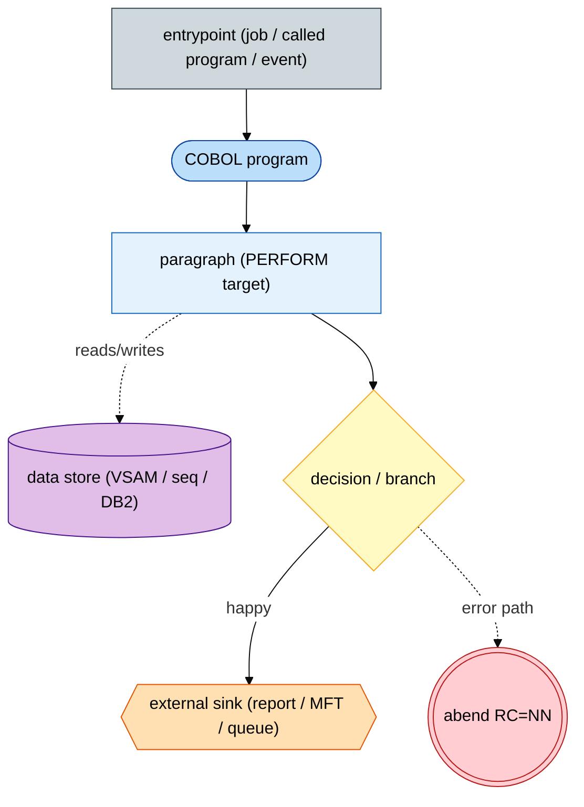

- Rounded `([ ])` = program load module. Cylinder `[( )]` = persisted data store. Hexagon `{{ }}` = external sink. Diamond `{ }` = decision (both branches always shown). Triple-circle = abend end.
- Solid edge = happy/normal flow; dotted edge = error/abend/soft-fail. Edge labels cite `BR-003-xx` where a branch realizes one.

---

## 2. System context

BP-003 spans two unrelated entrypoints with **disjoint interface styles**:

- **`MCCST19`** — a synchronous **callable vendor-lookup routine**: a client passes a short-name pattern and the program returns a DB2 **result set** (vendor id, legacy/old vendor id, short name). Pure DB2 read; no files, no reports.
- **`MCBSM52J`** — a nightly/operator **batch "vendor load for a new division"** pipeline: ingest a sorted new-vendor file, dedup against vendors already active at the target division, replicate the vendor's setup into five DB2 satellite tables, then emit a BI CSV and ship it by managed file transfer.

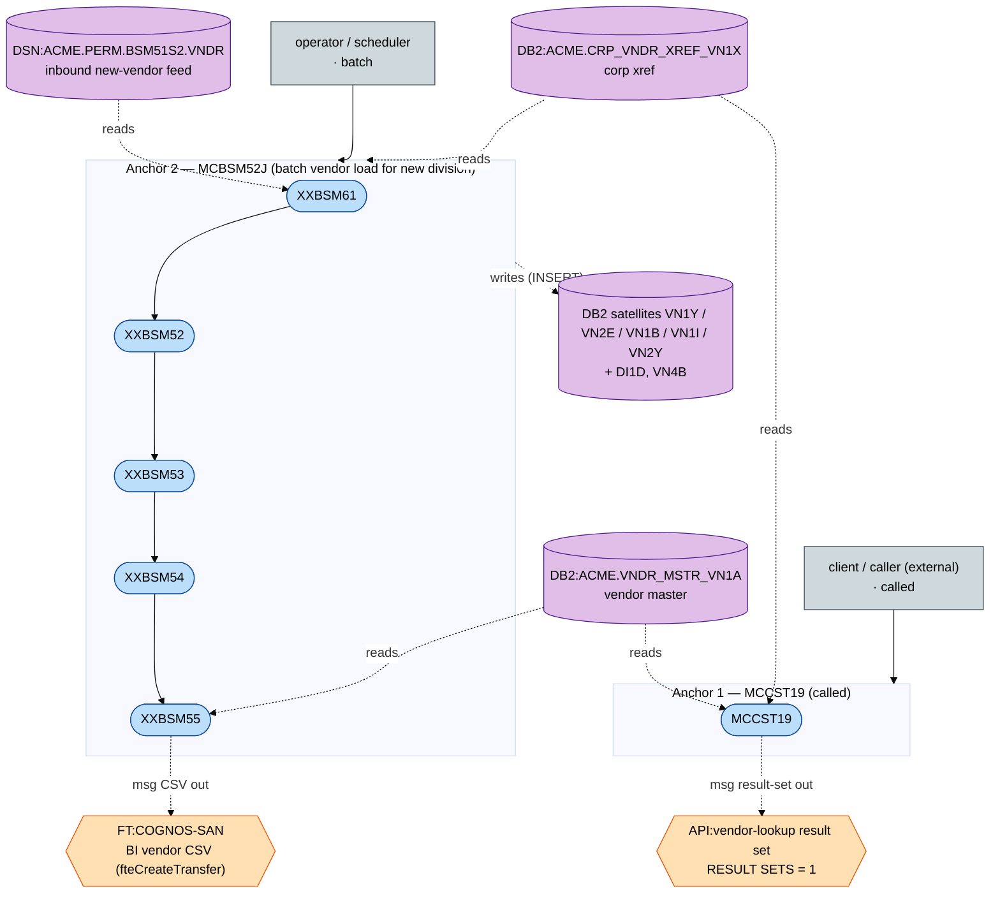

**Anchor types:** `MCCST19` = `called`; `MCBSM52J` = `batch`; `AUTHORKAY`/`AUTHORMCLANE` = `called` (declared, **absent**).

**External-interface classes present vs absent:**

| Class | Present? | Where |
|---|---|---|
| Called subprogram / DB2 result-set (stored-proc style) | **present** | `MCCST19` (`RESULT SETS = 1`, cursor `WITH RETURN`) |
| Batch sequential file ingest | **present** | `MCBSM52J` ← `ACME.PERM.BSM51S2.VNDR` |
| Managed file transfer (MFT/FTE) outbound | **present** | `MFTTRAN1` → `DS.PERM.FTE(MCBSM55C)` → Cognos SAN |
| DB2 as system of record | **present** | all `VN*` tables |
| MQ / event trigger | absent | — |
| CICS online transaction | absent | — |
| Email (XMITIP) | absent | — |
| REST/SOAP API, webhook | absent | — |

---

## 3. Anchor 1 — `MCCST19` (called vendor-lookup routine)

**Purpose:** Return the list of corporate vendors whose short name matches a caller-supplied pattern, joined with the corporate cross-reference so each row carries both the current vendor id and the legacy/old vendor id. Realizes BR-003-01 and BR-003-02 and **resolves** the BR-003-03 inactive-vendor question.

### 3.1 Call interface (entrypoint orchestration)

`MCCST19` is invoked as a subprogram via `CALL 'MCCST19' USING IN-VEND-NM, OUT-RETURN-CD`. It declares `RESULT SETS = 1`: rather than returning rows in the linkage area, it `OPEN`s cursor `VN1A_NM` (declared `WITH HOLD WITH RETURN`) and returns it to the caller to `FETCH`. No in-tree caller exists in this drop, so the client is an external/online consumer (`[SME]`; BP-003 names BP-001 and BP-004 as consumers).

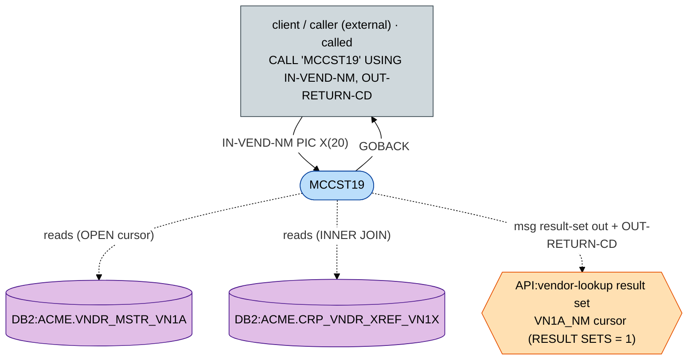

### 3.2 Resource wiring

| Interface | Kind | Resource | Access | Copybook |
|---|---|---|---|---|
| `IN-VEND-NM` | linkage | `PIC X(20)` short-name pattern | input | inline |
| `OUT-RETURN-CD` | linkage | `PIC S9(4) COMP` | output (SQLCODE on error) | inline |
| `VN1A_NM` | DB2 cursor | `ACME.VNDR_MSTR_VN1A` ⋈ `ACME.CRP_VNDR_XREF_VN1X` | `SELECT` (result set) | `DGVN1A`, `DGVN1X` |
| (error) | dynamic `CALL` | `DBDB2ER` | call | `DBDB2ERL` |

### 3.3 DB2 access by paragraph

| Paragraph | SQL | Table(s) | Filter |
|---|---|---|---|
| (declaration) | `DECLARE VN1A_NM CURSOR WITH HOLD WITH RETURN` | `VNDR_MSTR_VN1A` ⋈ `ACME.CRP_VNDR_XREF_VN1X` | `CLS_TRD='DIS' AND STAT='ACT' AND VNDR_SHRT_NM LIKE :VN1A-VNDR-SHRT-NM` |
| `PROCEDURE DIVISION` (main) | `OPEN VN1A_NM` | (above) | opens the result set |
| `0000-GOBACK` | `SET :WS-CURRENT-TS = CURRENT TIMESTAMP` | `SYSIBM` (implicit) | post-open timestamp |
| `9900-DB2-ERROR-ROUTINE` | (no SQL) `CALL 'DBDB2ER'` | — | on any non-zero `SQLCODE` |

> The `SELECT` projects `VN1A.VNDR_ID`, `VN1X.OLD_VNDR_ID`, `VN1A.VNDR_SHRT_NM`. The table in the `FROM` clause is written unqualified (`VNDR_MSTR_VN1A`), relying on `CURRENT SQLID`/packageset to resolve the `ACME` schema; the joined table is fully qualified (`ACME.CRP_VNDR_XREF_VN1X`).

### 3.4 Program flow

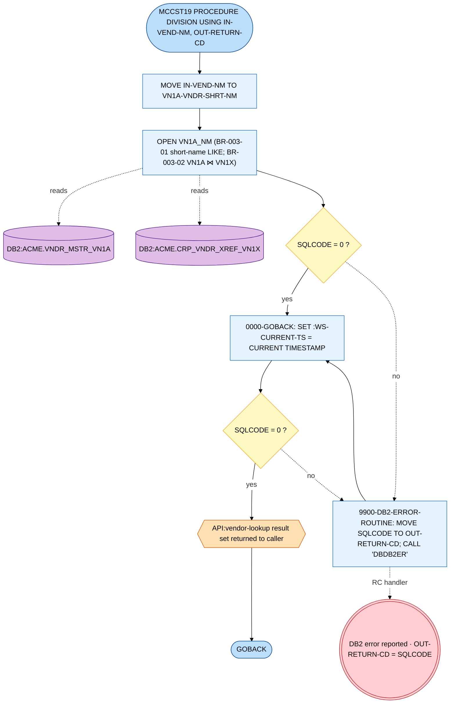

### 3.5 Realized business rules & resolutions

- **BR-003-01** (lookup by vendor short name) — realized by `VNDR_SHRT_NM LIKE :VN1A-VNDR-SHRT-NM`. Matching is `LIKE` over the caller's pattern; COBOL string semantics / case handling are the caller's responsibility (the program does no upper-casing). `TC-003-02` (leading spaces) is therefore caller-pattern-dependent — `[SME]` confirm normalization expectation.
- **BR-003-02** (corporate-vendor view) — realized by `INNER JOIN ACME.CRP_VNDR_XREF_VN1X ON VN1A.VNDR_ID = VN1X.VNDR_ID`, projecting `OLD_VNDR_ID`.
- **BR-003-03** (`[SME]` — does it exclude inactive vendors?) — **RESOLVED in source:** the cursor filters `STAT = 'ACT'` (active) **and** `CLS_TRD = 'DIS'` (distribution trade class). Inactive vendors are excluded — but via the **DB2 column `STAT`**, not the VSAM `VNKY-RECORD-STATUS-CODE` the spec hypothesized. (The `INNER JOIN` also drops any vendor without a `VN1X` cross-reference row.)

### 3.6 Sources / sinks summary

- Sources: `ACME.VNDR_MSTR_VN1A`, `ACME.CRP_VNDR_XREF_VN1X` (DB2, read).
- Sink: one DB2 result set returned to the caller (`API:vendor-lookup`); `OUT-RETURN-CD` carries `SQLCODE` on error.
- Minor finding: `9900-DB2-ERROR-ROUTINE` `DISPLAY`s `'ERROR CALLING MCDCS05'` — a copy-paste artifact from a sibling program; harmless but misleading in logs.

---

## 4. Anchor 2 — `MCBSM52J` (batch vendor load for a new division)

**Purpose:** Replicate an existing vendor's enrolment from a source division to a target division. The job sorts the inbound new-vendor extract, filters out vendors already active at the target division (`XXBSM61`), then for each surviving vendor copies the division cross-reference (`XXBSM52` → `VN1Y`), the division/hold/contact satellites (`XXBSM53` → `VN2E`/`VN1B`/`VN1I`), and the name-override (`XXBSM54` → `VN2Y`), and finally builds a BI CSV (`XXBSM55`) shipped to the Cognos SAN by managed file transfer.

### 4.1 Job-level orchestration (`MCBSM52J`)

The from/to division pair is **data-driven** from input-record fields (`FROM-ACME-DIV` pos 15–16, `TO-ACME-DIV` pos 19–20), resolved to `DIV_PART` through `ACME.DIVMSTRDI1D`. The job header comment "copy vendors from the MI division to MO" is illustrative, not hardcoded. Every COBOL step carries `COND=(4,LT)` (skip all subsequent steps if any prior step returns > 4), and two IDCAMS count-checks gate the insert chain and the file transfer.

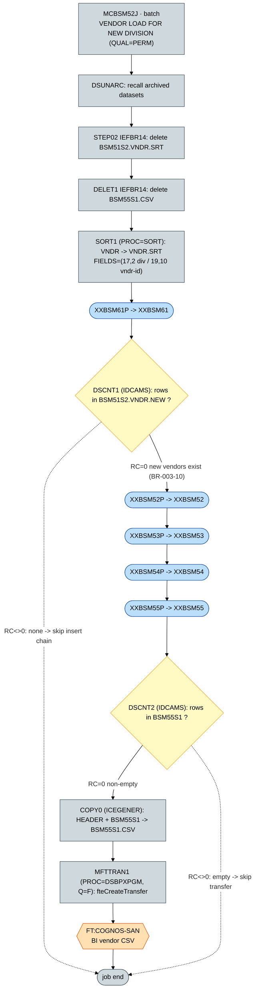

**Orchestration notes**

- `SORT1` (`PROC=SORT`) sorts `ACME.PERM.BSM51S2.VNDR` → `.VNDR.SRT` on `TO-ACME-DIV` (cols 17–18) + `VENDR-ID` (cols 19–28).
- The `IF DSCNT1.RC = 0 THEN … ENDIF` JES construct gates the whole insert chain on whether `BSM51S2.VNDR.NEW` (the dedup output) is non-empty (counted by IDCAMS control member `DS.PERM.RDRPARM(PRTONLY1)`). A nested `IF DSCNT2.RC = 0 THEN …` gates the CSV concat + FTE on a non-empty BI extract.
- `STEP02`/`DELET1` and each proc's `STEP01` pre-delete prior-run instances of the intermediate datasets (idempotent restart).
- `MFTTRAN1` runs `PROC=DSBPXPGM`: an `IKJEFT01` step executes REXX `%FTEREPL`, then an `IKJEFT1B` step runs the generated `BPXBATCH … fteCreateTransfer` against control card `DS.PERM.FTE(MCBSM55C)`. The actual FTE agents / SAN path live in `MCBSM55C` + the FTE STDENV — **not in this drop** (`[GAP]`).

### 4.2 `XXBSM61` — dedup against vendors already active at the target division

`XXBSM61` reads the sorted inbound vendor file and, for each (vendor, target-division) key, probes `ACME.DIV_VNDR_XREF_VN1Y` for an existing non-deleted, **active** enrolment. Only vendors **not** already active at the target division (`SQLCODE +100`) are written to `BSM51S2.VNDR.NEW`.

**File / DD wiring:**

| Logical file | DD | Dataset | Access | Copybook |
|---|---|---|---|---|
| `VNDRIN` | `VNDRIN` | `ACME.&QUAL..BSM51S2.VNDR.SRT` | input, sequential (FB 80) | `BSM51VND` |
| `VNDROUT` | `VNDROUT` | `ACME.&QUAL..BSM51S2.VNDR.NEW` | output, sequential | `BSM51VND` |
| (control) | `SQLBATCH` | `DS.&QUAL..SQLBATCH(SQLINFO)` | DB2 connect info | `[GAP]` |

**DB2 access by paragraph:**

| Paragraph | Cursor/stmt | Table | Op | Filter |
|---|---|---|---|---|
| `5000-SET-DB2-PACKAGE` | `SET CURRENT PACKAGESET='MCBATCH'` | — | — | — |
| `5100-CHECK-VNDR` | `SELECT 'Y' FROM ACME.DIV_VNDR_XREF_VN1Y Y` | `ACME.DIV_VNDR_XREF_VN1Y` | `SELECT` | `DIV_ID = :TO-div, VNDR_ID = :in, DELT_SW='N', VN1A_STAT='ACT'` (active filter added per PIR14188) |

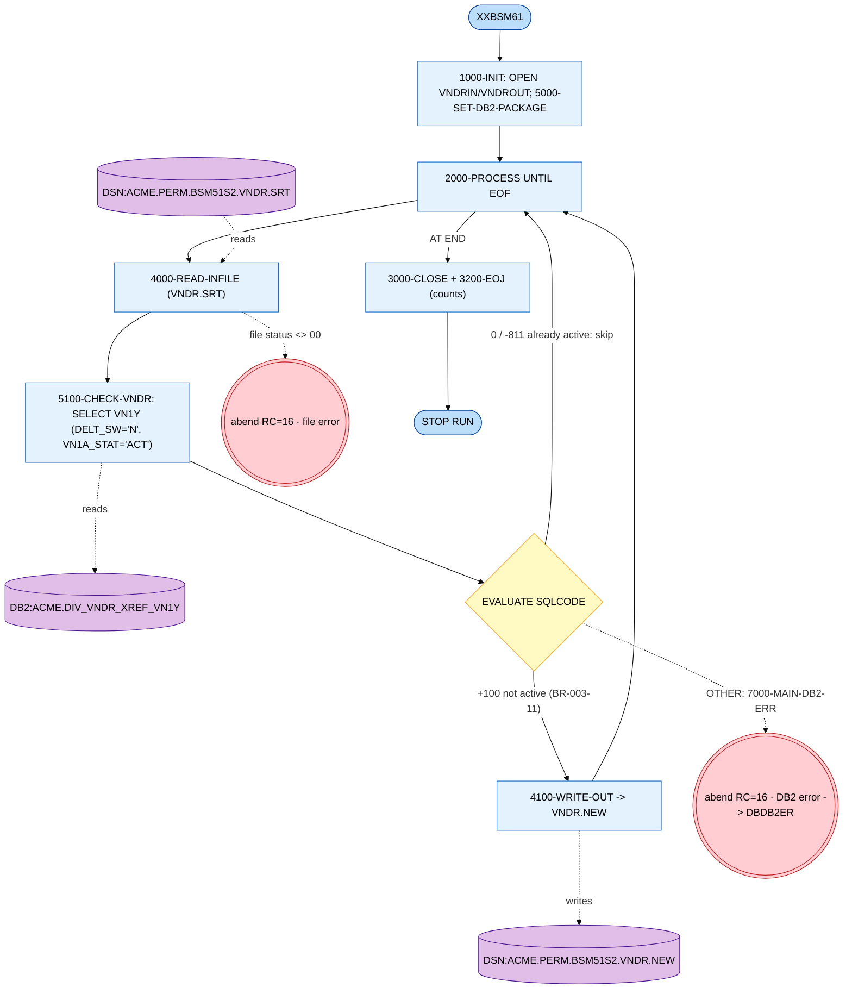

**Rules realized:** BR-003-11 (don't re-create vendors already active at the target division).

### 4.3 `XXBSM52` — build the division ↔ vendor cross-reference (`VN1Y`)

Reads the dedup output, loads the from/to/vendor triples into the scratch table `TEMP.VNDR_ID_DIV_T312`, then fetches the **source-division** `VN1Y` rows (joined to `VN1X`) and **`INSERT`s** a copy at the **target division**, also writing each accepted vendor to the `NEWVNDRS` hand-off file.

**File / DD wiring:**

| Logical file | DD | Dataset | Access | Copybook |
|---|---|---|---|---|
| `VNDRIN` | `VNDRIN` | `ACME.&QUAL..BSM51S2.VNDR.NEW` | input | `BSM51VND` |
| `NEWVNDRS` | `NEWVNDRS` | `ACME.&QUAL..NEWVNDRS` | output | `XXBSM52C` |
| `CORPVNDR` | `CORPVNDR` | inline `N` switch card (proc = `DUMMY`) | input, 1 byte | inline |

**DB2 access by paragraph:**

| Paragraph | Cursor/stmt | Table | Op | Note |
|---|---|---|---|---|
| `1300-DELETE-TEMP-TBL` | `DELETE` | `TEMP.VNDR_ID_DIV_T312` | `DELETE` | purge scratch |
| `1500-INSERT-TEMP` | `INSERT` | `TEMP.VNDR_ID_DIV_T312` | `INSERT` | from/to-div + vendor-id from input |
| `1600-READ-CORPVNDR` | (file read) | — | — | reads the `N`/`Y` switch |
| `3200-FETCH-CURSOR` | `VN1Y-CUR` | `ACME.DIV_VNDR_XREF_VN1Y` ⋈ `ACME.CRP_VNDR_XREF_VN1X` ⋈ `TEMP` | `SELECT` | source-division rows; `X.DELT_SW='N'` |
| `3300-INSERT-VN1Y` | `INSERT INTO DIV_VNDR_XREF_VN1Y` | `ACME.DIV_VNDR_XREF_VN1Y` | `INSERT` | at target `DIV_ID`, `USER_ID='XXBSM52'`; `SQLCODE -803` = duplicate → skip |
| `3500-NEW-VNDRS-WRITE` | (file write) | `NEWVNDRS` | write | hand-off to 53/54/55 |
| `8999-COMMIT` | `COMMIT` | — | — | every 1000 inserts |

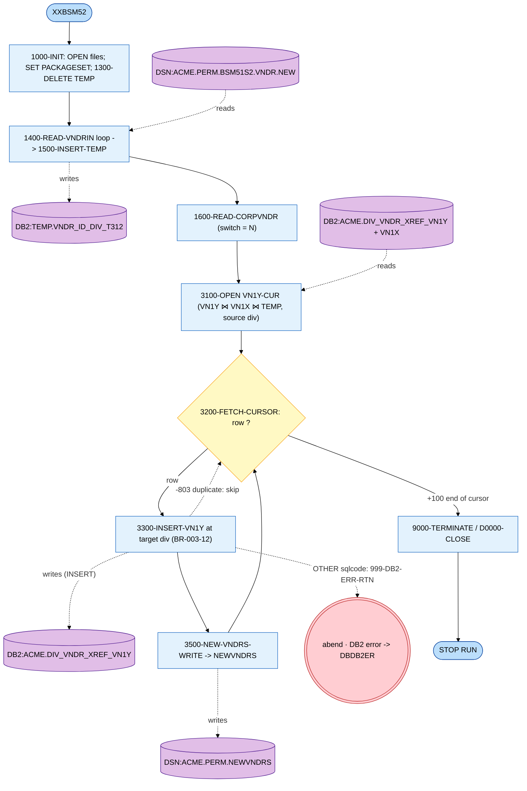

**Rules realized:** BR-003-12 (replicate the vendor's enrolment at the target division). The `CORPVNDR='Y'` branch (substitute corporate `VN1X` old-vendor-id) exists but is dormant in this job (always `N`).

### 4.4 `XXBSM53` — division / hold-reason / contact satellites (`VN2E`, `VN1B`, `VN1I`)

Reads `NEWVNDRS`, reloads `TEMP`, then runs three independent fetch-and-insert chains, each mapping the source division's satellite rows to the target division via `ACME.DIVMSTRDI1D` (`DIV_PART`).

**File / DD wiring:** `NEWVNDRS` (in, `XXBSM52C`); `CORPVNDR` (inline `N` switch).

**DB2 access by paragraph:**

| Paragraph | Cursor/stmt | Table | Op | Note |
|---|---|---|---|---|
| `1300` / `1500` | `DELETE` / `INSERT` | `TEMP.VNDR_ID_DIV_T312` | `DELETE`/`INSERT` | reload scratch from `NEWVNDRS` |
| `3200-FETCH-VN2E` | `VN2E-CUR` | `TEMP` ⋈ `DIVMSTRDI1D`(×2) ⋈ `VNDR_DIV_VN2E` | `SELECT` | `D.MCLANE_DIV=FROM`, `D1.MCLANE_DIV=TO` |
| `3300-INSERT-VN2E` | `INSERT INTO ACME.VNDR_DIV_VN2E` | `ACME.VNDR_DIV_VN2E` | `INSERT` | `DIV_PART=` target; `-803` dup → count & skip |
| `4200-FETCH-VN1B` | `VN1B-CUR` | `TEMP` ⋈ `DIVMSTRDI1D`(×2) ⋈ `VNDR_HLD_RSN_VN1B` | `SELECT` | same FROM/TO mapping |
| `4300-INSERT-VN1B` | `INSERT INTO ACME.VNDR_HLD_RSN_VN1B` | `ACME.VNDR_HLD_RSN_VN1B` | `INSERT` | `-803` dup → count & skip |
| `5200-FETCH-VN1I` | `VN1I-CUR` | `TEMP` ⋈ `DIVMSTRDI1D`(×2) ⋈ `VNDR_CNTCT_VN1I` | `SELECT` | (if `CORPVNDR='Y'`: pre-`SELECT` `VN1Y`⋈`VN1X` for `OLD_VNDR_ID`) |
| `5300-INSERT-VN1I` | `INSERT INTO ACME.VNDR_CNTCT_VN1I` | `ACME.VNDR_CNTCT_VN1I` | `INSERT` | `-803` dup → count & skip |
| `8999` | `COMMIT` | — | — | every 1000 |

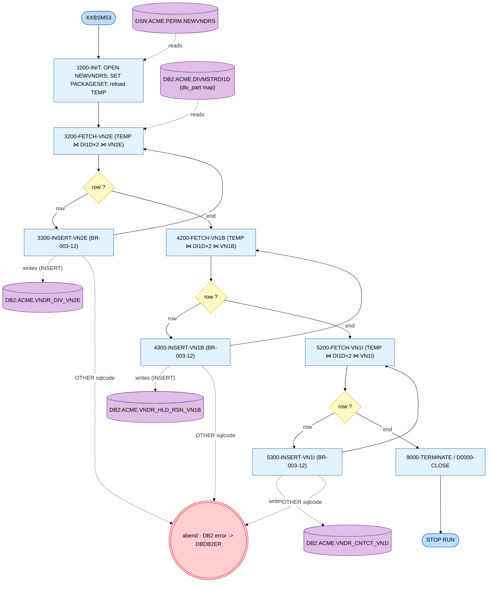

**Rules realized:** BR-003-12 (three more satellites of the new-division enrolment). Duplicate (`-803`) rows are counted and skipped, not fatal.

### 4.5 `XXBSM54` — vendor name-override (`VN2Y`)

Reads `NEWVNDRS`, reloads `TEMP`, fetches the source-division name-override rows and inserts them at the target division.

**File / DD wiring:** `NEWVNDRS` (in, `XXBSM52C`); `CORPVNDR` (inline `N` switch).

**DB2 access by paragraph:**

| Paragraph | Cursor/stmt | Table | Op | Note |
|---|---|---|---|---|
| `1300` / `1500` | `DELETE`/`INSERT` | `TEMP.VNDR_ID_DIV_T312` | — | reload scratch |
| `3200-FETCH-CURSOR` | `VN2Y-CUR` | `ACME.VNDR_NM_OVRRD_VN2Y` ⋈ `TEMP` | `SELECT` | `Y.DIV_ID=T.FROM_DIV, Y.OLD_VNDR_ID=T.DCS_VNDR` |
| `3300-INSERT-VN2Y` | `INSERT INTO ACME.VNDR_NM_OVRRD_VN2Y` | `ACME.VNDR_NM_OVRRD_VN2Y` | `INSERT` | target `DIV_ID`, `USER='XXBSM54'`; `-803` dup → skip; (`CORPVNDR='Y'`: pre-`SELECT` `VN1Y`⋈`VN1X`) |

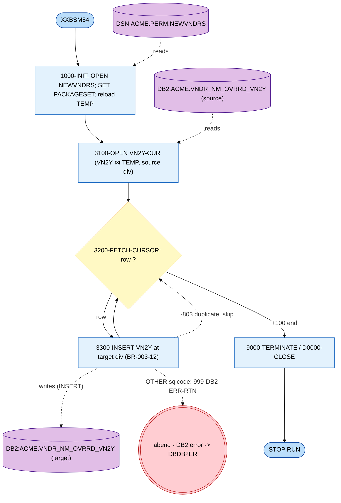

**Rules realized:** BR-003-12.

### 4.6 `XXBSM55` — build the BI vendor CSV

Reads `NEWVNDRS`, reloads `TEMP`, then fetches the newly-enrolled target-division vendors joined to the vendor master (`VN1A`, for the name) and buyer master (`VN4B`), and writes a 5-column CSV body. The name is run through `REPLACE()` to strip commas/quotes/apostrophes so it is CSV-safe.

**File / DD wiring:**

| Logical file | DD | Dataset | Access | Copybook |
|---|---|---|---|---|
| `NEWVNDRS` | `NEWVNDRS` | `ACME.&QUAL..NEWVNDRS` | input | `XXBSM52C` |
| `XXOUT` | `XXOUT` | `ACME.&QUAL..BSM55S1` | output (CSV body) | `XXBSM55C` |

**DB2 access by paragraph:**

| Paragraph | Cursor/stmt | Table | Op | Note |
|---|---|---|---|---|
| `1300` / `1500` | `DELETE`/`INSERT` | `TEMP.VNDR_ID_DIV_T312` | — | reload scratch |
| `3200-FETCH-CURSOR` | `VN1Y-CUR` | `TEMP` ⋈ `DIV_VNDR_XREF_VN1Y` ⋈ `VNDR_MSTR_VN1A` ⋈ `BUYR_MSTR_VN4B` | `SELECT` | `VN1Y.DIV_ID=T.TO_DIV, VN1Y.DELT_SW='N', VN4B.BUYR_ID=VN1A.BUYR_ID`; `REPLACE` name; `GROUP/ORDER BY` to-div, buyer, vendor |
| `3300-WRITE-REPORT` | (file write) | `BSM55S1` | write | 5 cols: FROM-DIV, TO-DIV, BUYER (`DCS_OPER_ID`), VNDR-ID (`DCS_VNDR`), VNDR-NAME + trailing comma |

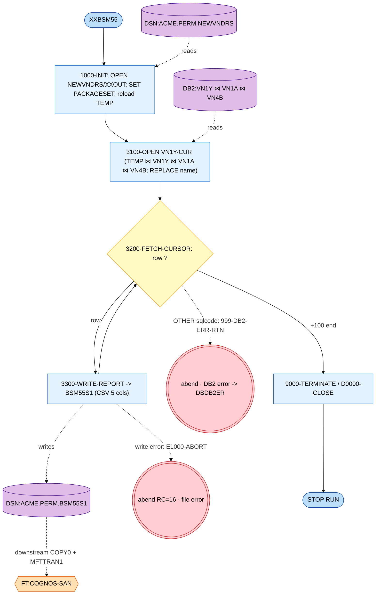

**Rules realized:** BR-003-10 (the CSV — and its transfer — exist only when new vendors were loaded; gated by `DSCNT2`).

### 4.7 Sources / sinks summary (Anchor 2)

- Inbound: `ACME.PERM.BSM51S2.VNDR` (upstream `XXBSM31`/`XXBSM51`) → sorted `.VNDR.SRT` → dedup `.VNDR.NEW`.
- Internal hand-off: `ACME.PERM.NEWVNDRS` (`XXBSM52` → `XXBSM53/54/55`); scratch `TEMP.VNDR_ID_DIV_T312`.
- DB2 written (`INSERT`): `ACME.DIV_VNDR_XREF_VN1Y`, `ACME.VNDR_DIV_VN2E`, `ACME.VNDR_HLD_RSN_VN1B`, `ACME.VNDR_CNTCT_VN1I`, `ACME.VNDR_NM_OVRRD_VN2Y`.
- DB2 read (`SELECT`): `ACME.DIV_VNDR_XREF_VN1Y`, `ACME.CRP_VNDR_XREF_VN1X`, `ACME.DIVMSTRDI1D`, `ACME.VNDR_MSTR_VN1A`, `ACME.BUYR_MSTR_VN4B`.
- Outbound sink: `ACME.PERM.BSM55S1` → `+HEADER` → `BSM55S1.CSV` → `FT:COGNOS-SAN` (BI) via `fteCreateTransfer`.

### 4.8 `AUTHORKAY` / `AUTHORMCLANE` — declared but absent (`[GAP]`)

BP-003 §2 declares `AUTHORKAY` and `AUTHORMCLANE` as per-vendor specialised handlers (BR-003-30/31/32). **Neither exists in this source tree:** `find … -iname 'AUTHOR*'` returns no member, and the literal strings `AUTHORKAY`/`AUTHORMCLANE` appear nowhere. The 362 `AUTHOR` hits in the corpus are all the COBOL `AUTHOR.` identification-division paragraph and change-log banner headers (`DATE  AUTHOR  TYPE OF CHANGE`). No call graph can be drawn; carried as `[GAP]` (see §8). This resolves the search side of BR-003-32: the `AUTHOR*` pattern is **not** enumerable in this drop.

---

## 5. Data dictionary and external-interface inventory

### 5.1 Sequential / VSAM datasets

| Dataset (pattern) | Org | Used by (DD) | Direction | Notes |
|---|---|---|---|---|
| `ACME.PERM.BSM51S2.VNDR` | seq | `SORT1` SORTIN | in | inbound new-vendor feed (upstream `XXBSM31`/`XXBSM51`) |
| `ACME.PERM.BSM51S2.VNDR.SRT` | seq FB 80 | `XXBSM61` `VNDRIN` | in/out | sorted on to-div + vendor-id (`BSM51VND`) |
| `ACME.PERM.BSM51S2.VNDR.NEW` | seq | `XXBSM61` `VNDROUT`, `XXBSM52` `VNDRIN`, `DSCNT1` | in/out | dedup output (not yet at target div) |
| `ACME.PERM.NEWVNDRS` | seq | `XXBSM52` out; `XXBSM53/54/55` in | in/out | inter-program hand-off (`XXBSM52C`) |
| `ACME.PERM.BSM55S1` | seq | `XXBSM55` `XXOUT`, `DSCNT2` | out | BI CSV body (`XXBSM55C`) |
| `ACME.PERM.BSM55S1.HEADER` | seq | `COPY0` SYSUT1 | in | CSV header card |
| `ACME.PERM.BSM55S1.CSV` | seq | `COPY0` out, `MFTTRAN1` | out | header + body → FTE payload |
| `<DIV>.MSTR.VND` | VSAM KSDS | (not touched by anchors) | — | divisional vendor master (`DCSFVND`); see §6 |

### 5.2 DB2 tables

| Table | DCLGEN | Accessed by | Op(s) in BP-003 |
|---|---|---|---|
| `ACME.VNDR_MSTR_VN1A` | `DGVN1A` | `MCCST19`, `XXBSM55` | `SELECT` (read-only here) |
| `ACME.CRP_VNDR_XREF_VN1X` | `DGVN1X` | `MCCST19`, `XXBSM52/53/54` | `SELECT` |
| `ACME.DIV_VNDR_XREF_VN1Y` | `DGVN1Y` | `XXBSM61` (S), `XXBSM52` (I+S), `XXBSM55` (S) | `SELECT` + `INSERT` |
| `ACME.VNDR_DIV_VN2E` | `DGVN2E` | `XXBSM53` | `SELECT` + `INSERT` |
| `ACME.VNDR_HLD_RSN_VN1B` | `DGVN1B` | `XXBSM53` | `SELECT` + `INSERT` |
| `ACME.VNDR_CNTCT_VN1I` | `DGVN1I` | `XXBSM53` | `SELECT` + `INSERT` |
| `ACME.VNDR_NM_OVRRD_VN2Y` | `DGVN2Y` | `XXBSM54` | `SELECT` + `INSERT` |
| `ACME.DIVMSTRDI1D` | `DGDI1D` | `XXBSM53` | `SELECT` (div_part map) |
| `ACME.BUYR_MSTR_VN4B` | `DGVN4B` | `XXBSM55` | `SELECT` (buyer name) |
| `TEMP.VNDR_ID_DIV_T312` | (none) | `XXBSM52/53/54/55` | `DELETE` + `INSERT` + `SELECT` (scratch) |

### 5.3 Record / control copybooks

| Member | Describes | Used by |
|---|---|---|
| `BSM51VND` | sorted inbound vendor record (FB 80) | `XXBSM61` |
| `XXBSM52C` | `NEWVNDRS` hand-off record | `XXBSM52/53/54/55` |
| `XXBSM55C` | BI CSV output record | `XXBSM55` |
| `DGVN1A`…`DGVN4B` | DB2 host structures | per §1.2 |
| `DBDB2ERL` / `DB2ERRP2` | SQL error-handler linkage + routine | all `XXBSM*`, `MCCST19` |
| `DS.PERM.RDRPARM(PRTONLY1)` | IDCAMS print-count control | `DSCNT1`, `DSCNT2` `[GAP]` |
| `DS.PERM.FTE(MCBSM55C)` | `fteCreateTransfer` control card | `MFTTRAN1` `[GAP]` |

### 5.4 External-interface table

| Endpoint | Direction | Style | Sync? | Notes |
|---|---|---|---|---|
| `API:vendor-lookup` (`MCCST19` result set) | out (reply) | request–reply (subprogram call) | sync | `RESULT SETS = 1`; caller `FETCH`es the open cursor; `OUT-RETURN-CD` = `SQLCODE` on error |
| `FT:COGNOS-SAN` (`MCBSM55C`) | out | managed file transfer (`fteCreateTransfer`, prod queue `Q=F`) | async | BI vendor CSV; agents/SAN path in `MCBSM55C` + FTE STDENV `[GAP]` |

---

## 6. Reverse blast-radius maps

Counts computed with ripgrep over `docs/legacy/src`. For DB2 tables the command unions table-name and DCLGEN references over the COBOL members:
`rg -l '<TABLE>|<DCLGEN>' sclm.perm.prod.source | wc -l`. Counts are **COBOL program members**; DCLGEN-only `.cpy` and JCL are reported separately.

| Store | DCLGEN | Programs (fan-in) | Note |
|---|---|---|---|
| `ACME.VNDR_MSTR_VN1A` | `DGVN1A` | **55** | table-name=55, DGVN1A-include=42; 13 programs reference it via inline `INNER JOIN ACME.VNDR_MSTR_VN1A` **without** the DCLGEN — they are missed by a DCLGEN-only scan |
| `ACME.CRP_VNDR_XREF_VN1X` | `DGVN1X` | **28** | corp↔div vendor-number xref; second-most-coupled |
| `ACME.VNDR_DIV_VN2E` | `DGVN2E` | **1** | sole owner `XXBSM53` |
| `ACME.VNDR_HLD_RSN_VN1B` | `DGVN1B` | **1** | sole owner `XXBSM53` |
| `ACME.VNDR_CNTCT_VN1I` | `DGVN1I` | **1** | sole owner `XXBSM53` |
| `ACME.VNDR_NM_OVRRD_VN2Y` | `DGVN2Y` | **2** | `XXBSM54`, `XXCST63` |
| `<DIV>.MSTR.VND` (VSAM) | `DCSFVND` | **37** (copybook) / **60** (record fields) | 17 JCL/proc members allocate `&DI2..MSTR.VND`; 23 `D21xx` programs inline the `VNKY-`/`VNRT-` layout without the copybook |

**VN1A "46 programs" claim (spec §4.1) — refuted.** The verified count is **55** (`rg -l 'VNDR_MSTR_VN1A|DGVN1A' sclm.perm.prod.source | wc -l`). The spec's 46 matches neither the table-name count (55) nor the DCLGEN-include count (42); the 13 inline-SQL joiners (`MCBSM06, MCCAD11, MCCST24, MCDLS14/16/23/31/33, MCRPR08/18/32, XXCAD65, XXDL740`) are genuine references that a DCLGEN-only scan misses. First 15 VN1A referencers (alphabetical): `D8050, DSCST96, MCBSM06, MCCAD02, MCCAD10, MCCAD11, MCCAD20, MCCAD21, MCCIC90, MCCST03, MCCST04, MCCST05, MCCST06, MCCST08, MCCST09`.

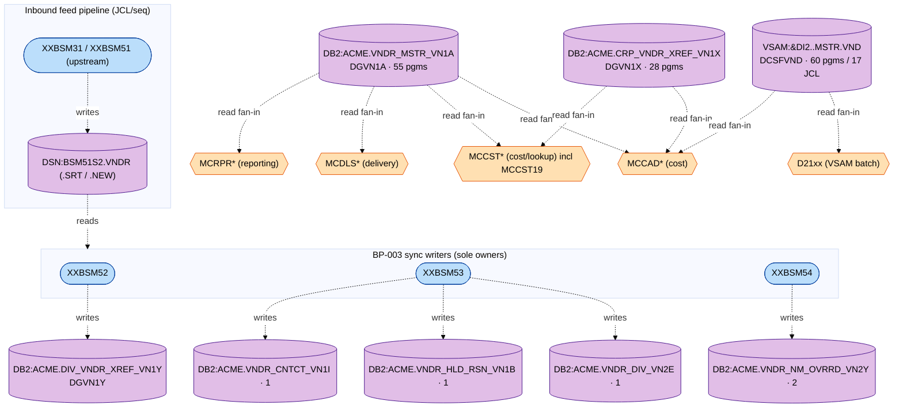

**Modernization implications.**

- `VN1A` (55) — the highest-fan-in DB2 master; expose as a read API / event-sourced master. The 13 inline-SQL joiners must be found by **table-name** scan, not DCLGEN, or they will be missed in migration.
- `VN1X` (28) — the corp↔div integration seam; extract as a vendor-number mapping service.
- `VN1Y`/`VN2E`/`VN1B`/`VN1I`/`VN2Y` — narrow fan-in, written by the `XXBSM5*` family only; safe to migrate atomically with the new-division load function (fold satellites into the vendor aggregate).
- `<DIV>.MSTR.VND` VSAM (60 programs / 17 JCL) — the true blast-radius epicentre, with 23 programs inlining the record layout; needs a copybook-normalization pass before any replatform.

---

## 7. End-to-end resolution summary

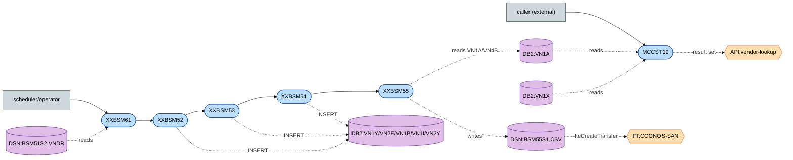

**Universal fail/propagation conventions.**

- **Batch (`MCBSM52J`):** any COBOL file-status `≠ 00` or unexpected `SQLCODE` → `DISPLAY` + close + `RETURN-CODE 16`; the job's `COND=(4,LT)` then bypasses every downstream step. SQL errors funnel through `DB2ERRP2` → dynamic `CALL DBDB2ER` (+ `DSWTO` console message). Duplicate-key inserts (`SQLCODE -803`) are **soft** — counted and skipped, not fatal. Empty-extract checks (`DSCNT1`/`DSCNT2` RC≠0) are **soft skips**, not errors.
- **Called (`MCCST19`):** any non-zero `SQLCODE` on `OPEN`/timestamp → `9900-DB2-ERROR-ROUTINE` moves `SQLCODE` to `OUT-RETURN-CD`, calls `DBDB2ER`, and returns to the caller (no abend — the client inspects `OUT-RETURN-CD`).

---

## 8. Assumptions, gaps & open questions

### 8.1 Resolved (with the source that resolved each)

- **BR-003-03** (`[SME]`: does `MCCST19` exclude inactive vendors?) — **Yes.** `MCCST19.cbl` cursor `VN1A_NM` filters `STAT='ACT'` and `CLS_TRD='DIS'` at the DB2 level (not via the VSAM `VNKY-RECORD-STATUS-CODE`).
- **BR-003-01 / BR-003-02** — realized in `MCCST19.cbl` (`VNDR_SHRT_NM LIKE :param`; `VN1A ⋈ VN1X` projecting `OLD_VNDR_ID`).
- **Spec §3.2 sync targets** — `MCBSM52J` does **not** write `VN1A`/`VN1X`. It is a *new-division load* that `INSERT`s into `VN1Y`, `VN2E`, `VN1B`, `VN1I`, `VN2Y` (`XXBSM52/53/54.cbl`). BR-003-10 = the `DSCNT1`/`DSCNT2` non-empty gates; BR-003-11 = `XXBSM61` active-dedup; BR-003-12 = the satellite `INSERT` set keyed to the target division.
- **`NEWVNDRS` / `CORPVNDR` identity** — `NEWVNDRS` is the internal `ACME.PERM.NEWVNDRS` hand-off file; `CORPVNDR` is a 1-byte inline `N` switch card, not a feed (`MCBSM52J.jcl`, procs `XXBSM5*P.jcl`).
- **VN1A fan-in count** — **55**, not the spec's 46 (`rg` over `sclm.perm.prod.source`).
- **BR-003-32 (enumerability of `AUTHOR*`)** — `AUTHOR*` is **not** present in this tree; the pattern is not enumerable from source here.

### 8.2 Still open (tagged)

- `[GAP]` `AUTHORKAY` / `AUTHORMCLANE` (BR-003-30/31) — declared in the spec but **no member or literal reference exists** in `docs/legacy/src`. Source is external or the names are placeholders.
- `[GAP]` Upstream producer `XXBSM31`/`XXBSM51` of `BSM51S2.VNDR` — referenced but outside this anchor; not traced.
- `[GAP]` Control members not in drop: `DS.PERM.RDRPARM(PRTONLY1)`, `DS.PERM.FTE(MCBSM55C)`, `FTEREPL` REXX, `SQLBATCH(SQLINFO)`, `BSM55S1.HEADER`, and the `SORT` system proc.
- `[GAP]` Dynamically-called `DBDB2ER` and `DSWTO` — no source in drop.
- `[SME]` Who calls `MCCST19`? (no in-tree caller; spec names BP-001/BP-004 consumers; likely an online/stored-proc client.) Confirm the result-set client and expected short-name normalization (`TC-003-02` leading spaces).
- `[SME]` The `CORPVNDR='Y'` branch (substitute corporate `VN1X` old-vendor-id) in `XXBSM52/53/54` is dormant here (always `N`); confirm whether another job drives it `Y`.
- `[SME]` FTE destination agent / SAN path / BI consumer of `BSM55S1.CSV` (defined in `MCBSM55C` + FTE STDENV).
- `[SME]` BP-003 §3.2 BR-003-12 ("consistency across corporate and divisional masters") — the source enforces consistency only at the **division-enrolment satellites**, not by writing the corporate master; confirm the intended invariant.
- `[CODMOD]` Spec's "32 divisional `<DIV>.MSTR.VND`" vs the DB2 `VN*` model — the VSAM master (60-program fan-in) and the DB2 division satellites coexist; map which is authoritative (resolves the spec's source-of-truth open question).
- `[CODMOD]` Unqualified table names (`INSERT INTO DIV_VNDR_XREF_VN1Y` in `XXBSM52`, `FROM DIV_VNDR_XREF_VN1Y` in `XXBSM54`) rely on `CURRENT SQLID`/packageset `MCBATCH` resolving the `ACME` schema.

---

## 9. Source index

| Artifact | Type | Path under `docs/legacy/src` |
|---|---|---|
| `MCCST19` | COBOL (called) | `sclm.perm.prod.source/MCCST19.cbl` |
| `MCBSM52J` | JCL job | `acme.perm.jcl/MCBSM52J.jcl` |
| `XXBSM61` | COBOL | `sclm.perm.prod.source/XXBSM61.cbl` |
| `XXBSM52` | COBOL | `sclm.perm.prod.source/XXBSM52.cbl` |
| `XXBSM53` | COBOL | `sclm.perm.prod.source/XXBSM53.cbl` |
| `XXBSM54` | COBOL | `sclm.perm.prod.source/XXBSM54.cbl` |
| `XXBSM55` | COBOL | `sclm.perm.prod.source/XXBSM55.cbl` |
| `XXBSM61P` | proc | `ds.perm.proclib/XXBSM61P.jcl` |
| `XXBSM52P` | proc | `ds.perm.proclib/XXBSM52P.jcl` |
| `XXBSM53P` | proc | `ds.perm.proclib/XXBSM53P.jcl` |
| `XXBSM54P` | proc | `ds.perm.proclib/XXBSM54P.jcl` |
| `XXBSM55P` | proc | `ds.perm.proclib/XXBSM55P.jcl` |
| `DSBPXPGM` | proc (MFT) | `ds.perm.proclib/DSBPXPGM.jcl` |
| `DGVN1A` | DCLGEN | `DB2P.PERM.DCLGEN/DGVN1A.cpy` |
| `DGVN1X` | DCLGEN | `DB2P.PERM.DCLGEN/DGVN1X.cpy` |
| `DGVN1Y` | DCLGEN | `DB2P.PERM.DCLGEN/DGVN1Y.cpy` |
| `DGVN2E` | DCLGEN | `DB2P.PERM.DCLGEN/DGVN2E.cpy` |
| `DGVN1B` | DCLGEN | `DB2P.PERM.DCLGEN/DGVN1B.cpy` |
| `DGVN1I` | DCLGEN | `DB2P.PERM.DCLGEN/DGVN1I.cpy` |
| `DGVN2Y` | DCLGEN | `DB2P.PERM.DCLGEN/DGVN2Y.cpy` |
| `DGDI1D` | DCLGEN | `DB2P.PERM.DCLGEN/DGDI1D.cpy` |
| `DGVN4B` | DCLGEN | `DB2P.PERM.DCLGEN/DGVN4B.cpy` |
| `AUTHORKAY` / `AUTHORMCLANE` | — | **absent (`[GAP]`)** |

---

### Diagram extraction & render status

All 12 diagrams are extracted to standalone `.mmd` files in the `diagrams/` subfolder (template §4 naming):
`BP-003-legend`, `-context`, `-MCCST19-entry`, `-MCCST19`, `-MCBSM52J-entry`, `-XXBSM61`, `-XXBSM52`,
`-XXBSM53`, `-XXBSM54`, `-XXBSM55`, `-blast-radius`, `-e2e` (each `*-call-graph.mmd`).

**Syntax validation:** all 12 `.mmd` files parse **clean** under the Mermaid v11 grammar
(`mermaid.parse`, the same parser `mmdc` uses) — verified offline.

**SVG render:** *pending a browser-capable host.* `mmdc` requires a headless Chromium; this sandbox is
`aarch64`/Ubuntu 26.04, where no compatible browser is obtainable (apt ships chromium as snap-only;
Playwright has no arm64 Ubuntu-26.04 build; the puppeteer-bundled Chrome is x86-64 only). On any host
with a working Chromium, render the pair set with:

```sh
for f in diagrams/BP-003-*-call-graph.mmd; do mmdc -i "$f" -o "${f%.mmd}.svg"; done
```
