# BP-003 — Vendor Data Management: Business-Process Graph

**Status:** Draft — structured-BPMN process graph derived from the extracted business logic.
**Conforms to:** [process-graph-meta-model.md](../../../../../reference/process-graph-meta-model.md) (the canonical meta-model: element vocabulary, purity axioms, rule→element taxonomy, and the FSM-projection definition).
**Companion to:** [BP-003 business logic](BP-003-vendor-data-management-business-logic.md), [BP-003 call graph](BP-003-vendor-data-management-call-graph.md), and [BP-003 overview](../BP-003-vendor-data-management.md).
**Scope:** The two independent BP-003 processes — Process A (Vendor Lookup by Short Name, called routine `MCCST19`, `BL-003-01..05`) and Process B (Vendor Load for a New Division, batch job `MCBSM52J`, `BL-003-10..27`) — re-expressed as pure BPMN processes with a derived finite-state-machine projection. The spec-declared per-vendor handlers `AUTHORKAY` / `AUTHORMCLANE` are absent from the source drop and carry no rules (see §5 and the business-logic spec §8.2).

---

## 1. Meta-model (reference)

This graph is a faithful re-projection of the companion business-logic rules (`BL-003-MM`) into the **structured BPMN** meta-model defined in [process-graph-meta-model.md](../../../../../reference/process-graph-meta-model.md). That reference is authoritative; only a working summary is repeated here.

- **Governing axiom (separation).** Work and routing are disjoint: Activities never branch (one in / one out), Gateways never do work and own no data, and a branch condition lives on the sequence flow leaving a gateway.
- **Execution semantics.** The token (Petri-net) game of §2 of the meta-model; each model is sound and block-structured, which is what makes the FSM projection (§2.3, §3.8) well-defined.
- **Element legend (Mermaid rendering, per meta-model §3.4):**

| Element | Shape | Meaning |
|---|---|---|
| Event | `(( ))` circle | Start / End / Intermediate milestone; Error End is red |
| Task | `[ ]` rectangle | a unit of work (`Script` / `Service` / `Business Rule` / `Send`) |
| Gateway | `{ }` rhombus | routing only (`XOR`); condition on outgoing flows |
| Sub-Process | `[[ ]]` | iteration (`Loop` / `Multi-Instance`), e.g. per-record / per-vendor loops |
| Data | `[( )]` cylinder | Data Object (transient) / Data Store (persistent); typed id (`DSN:`/`DB2:`/`WS:`) or `[derived]`/`[sink]` per §3.3.1 |
| External participant | `{{ }}` hexagon | external integration endpoint (`API:`/`FT:`), reached only by Message Flow (dotted `msg ▷ out / ◁ in`), per §3.5 |

- **Coverage rule.** Every `BL-003-MM` maps to **exactly one** flow node (see the conformance tables in §2.2 and §3.7).
- **Shape of each process.** Process A is a single synchronous read pipeline with one interrupting error boundary whose handler ends in a **None End (soft return)**. Process B is a **sequential** job-step chain (legacy `COND=(4,LT)` step guards) — there is **no concurrency** (no `AND`/`IOR`); its two write-gates (`BL-003-11`, `BL-003-25`) are matched XOR split/join SESE blocks.
- **Shared conventions modelled once.** Process B's `BL-003-21` (duplicate-key soft-skip) and `BL-003-27` (hard-fail) are each modelled once (§4.1, §4.2) and referenced by the five replication loops and every data-access task respectively. Process A's `BL-003-05` is a deliberately contrasting **soft** return (§4.3).
- **FSM.** Each process carries a derived Mealy projection (§2.3, §3.8) per meta-model §7.

Standalone self-contained Mermaid sources are kept in the `diagrams/` subfolder at `diagrams/BP-003-A-process-graph.mmd` and `diagrams/BP-003-B-process-graph.mmd`.

---

## 2. Process A — Vendor Lookup by Short Name (`MCCST19`)

`MCCST19` is a synchronous callable routine — a single linear pipeline (Start → 01 → 02 → 03 → 04 → result-set End) with one interrupting Error Boundary on the data-access region whose handler ends in a **None End (soft return)**, deliberately contrasting with Process B's hard-fail (Error End). It is small enough for one orchestration diagram. It accepts a short-name pattern, selects the active distribution-trade vendors matching it, enriches each with its legacy/old vendor id, and exposes the matched rows as a single held result set; any data-access error is reported back through the return code without abending.

### 2.1 Orchestration / single-stage diagram

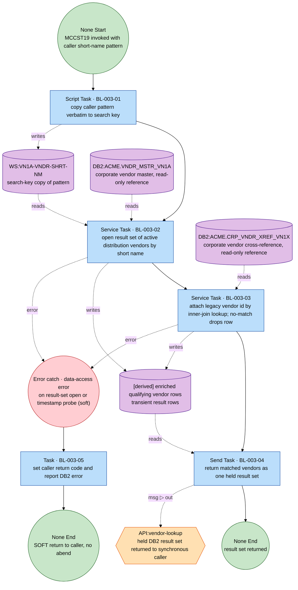

**Modelling notes**

- **Axiom of separation (§2.2).** Every Activity has one-in / one-out sequence flow; there is no gateway in the happy path — the routine is a straight pipeline. All branching is the exception path (an event, not a gateway), satisfying P8.
- **One shared data-access error catch covers both failure points.** The post-`OPEN` `CURRENT TIMESTAMP` probe is implementation; its only business-relevant effect is its status check, which folds into BL-003-05. Both the result-set `OPEN` (BL-003-02) and the enrichment join (BL-003-03) can raise the data-access fault, so their dotted error flows converge on a single shared error-catch event `eb` (the same multi-source convention the meta-model §6.4 / BP-001 §4 use, where several data-access Tasks converge on one error event). The rule id `BL-003-05` sits on the single handler Task `t05`, which reaches a **None End** — the soft return: no abend, no RC16, contrasting with Process B's Error End (§4.3 vs §4.2). `t05` keeps a single incoming sequence flow (P2); `eb`, being an event, may have several incoming error flows.
- **Data (§3.3.1).** `WS:VN1A-VNDR-SHRT-NM` written by 01 / read by 02; `[derived] enriched qualifying vendor rows` written by 02/03 / read by 04. `DB2:ACME.VNDR_MSTR_VN1A` and `DB2:ACME.CRP_VNDR_XREF_VN1X` are read-only **reference masters** (inputs, not process-owned stores).
- **Integration (§3.5).** `API:vendor-lookup` is a black-box external Participant reached **only** by Message Flow (dotted) from the Send Task `t04` — never a Data node, never a Sequence Flow. Direction OUT; style request–reply (the caller synchronously invoked the routine and reads the held cursor); sync; delivery = single held result set (`RESULT SETS = 1`); failure policy = on data-access fault the caller return code carries the status (the BL-003-05 soft-return), no retry / dead-letter.

### 2.2 Process A — rule → element conformance

| BL-003 | Title | Logic type | BPMN element | Diagram |
|---|---|---|---|---|
| 01 | Accept caller's short-name search pattern | transformation (normalisation) | Script Task (verbatim copy to `WS:VN1A-VNDR-SHRT-NM`) | §2.1 |
| 02 | Select active distribution vendors by short name | selection (set selection) | Service Task (result-set `OPEN` against `DB2:…VN1A`) | §2.1 |
| 03 | Attach legacy vendor id from corp xref | enrichment | Service Task (inner-join lookup against `DB2:…VN1X`; no-match drops row) | §2.1 |
| 04 | Return matched vendors as a single result set | reporting | Send Task → `API:vendor-lookup` via Message Flow, then None End | §2.1 |
| 05 | On data-access error, soft-return code to caller | error-handling (operational) | Shared error catch (off the data-access region) → Task "set return code + report DB2 error" (carries the id) → **None End (soft return — not Error End)** | §2.1, §4.3 |

Total coverage: all 5 rules map to exactly one flow node; none added or dropped.

### 2.3 Process A — derived FSM projection (Mealy)

Anchors `A = {START, RESULT_RETURNED (None End), SOFT_RETURN (None End)}`. No concurrency (purely sequential pipeline). Guards over the single decision variable `dataAccessOK` (true iff both the result-set `OPEN` and the folded timestamp-probe status are success); mutually exclusive and exhaustive.

```
START --[dataAccessOK]   / {01, 02, 03, 04} --> RESULT_RETURNED
START --[¬dataAccessOK]  / {01, 02|03, 05}  --> SOFT_RETURN
```

- Effect `ω` is the ordered list of `BL-003` ids fired on the branch.
- The happy path fires 01→02→03→04 then halts at `RESULT_RETURNED` (an empty result set is still this branch — empty ≠ error, per BL-003-04).
- The fault branch: `02|03` denotes the data-access step at which the fault surfaced (the `OPEN` or the enrichment join / folded timestamp probe); the interrupting boundary fires handler `05` and halts at `SOFT_RETURN`. The routine does not abend and does not raise RC16.
- Determinism/totality: `dataAccessOK ∨ ¬dataAccessOK` is exhaustive and the two branches disjoint (P4).

---

## 3. Process B — Vendor Load for a New Division (`MCBSM52J`)

Six logical stages run as one sequential chain: Stage 0 orchestration (sort + survivor gate), Stage 1 dedup against vendors already active at the target division (`XXBSM61`), Stage 2 division↔vendor xref `VN1Y` (`XXBSM52`), Stage 3 the partition-keyed satellites `VN2E`/`VN1B`/`VN1I` (`XXBSM53`), Stage 4 the name-override `VN2Y` (`XXBSM54`), and Stage 6 the BI CSV build and ship (`XXBSM55` + MFT). The job replicates an existing vendor's enrolment from a **source** division to a **target** division.

### 3.1 Orchestration

```mermaid
%%{init: {'theme': 'base'}}%%
flowchart TD
  classDef ev fill:#c8e6c9,stroke:#1b5e20,color:#000;
  classDef task fill:#bbdefb,stroke:#0d47a1,color:#000;
  classDef gw fill:#fff9c4,stroke:#f9a825,color:#000;
  classDef err fill:#ffcdd2,stroke:#b71c1c,color:#000;
  classDef data fill:#e1bee7,stroke:#4a148c,color:#000;
  classDef sub fill:#d7ccc8,stroke:#3e2723,color:#000;
  classDef ext fill:#ffe0b2,stroke:#e65100,color:#000;

  st(("None Start<br/>MCBSM52J invoked")):::ev
  t10["Script Task · BL-003-10<br/>sort feed by target div and vendor"]:::task
  dd[["Loop Sub-Process · BL-003-12<br/>dedup per sorted inbound record"]]:::sub
  g11{"XOR · BL-003-11<br/>any new vendors survived dedup?"}:::gw

  t13["Business Rule Task · BL-003-13<br/>recognise corporate-substitution switch"]:::task
  s14[["Loop Sub-Process · BL-003-14<br/>replicate VN1Y per accepted vendor"]]:::sub
  t16["Service Task · BL-003-16<br/>map source and target div partitions"]:::task
  s17[["Loop Sub-Process · BL-003-17<br/>replicate VN2E per accepted vendor"]]:::sub
  s18[["Loop Sub-Process · BL-003-18<br/>replicate VN1B per accepted vendor"]]:::sub
  s19[["Loop Sub-Process · BL-003-19<br/>replicate VN1I per accepted vendor"]]:::sub
  s20[["Loop Sub-Process · BL-003-20<br/>replicate VN2Y per accepted vendor"]]:::sub
  t22["Service Task · BL-003-22<br/>select newly-enrolled target-div vendors for BI"]:::task
  bi[["Loop Sub-Process · BI build<br/>BL-003-23 sanitise then BL-003-24 build record"]]:::sub
  g25{"XOR · BL-003-25<br/>BI extract non-empty?"}:::gw
  t26["Send Task · BL-003-26<br/>ship BI CSV by managed transfer"]:::task
  cognos{{"FT:COGNOS-SAN<br/>BI vendor CSV destination"}}:::ext
  j25{"XOR join · transfer gate closed"}:::gw

  j11{"XOR join · survivor gate closed"}:::gw
  enOk(("None End<br/>job complete")):::ev
  enSkip(("None End<br/>nothing to do")):::ev

  st --> t10 --> dd --> g11
  g11 -- "no survivors (soft skip)" --> enSkip
  g11 -- "yes survivors" --> t13
  t13 --> s14 --> t16 --> s17 --> s18 --> s19 --> s20 --> t22 --> bi --> g25
  g25 -- "non-empty BI extract" --> t26 --> j25
  g25 -- "empty extract (soft skip)" --> j25
  t26 -. "msg ▷ out" .-> cognos
  j25 --> j11 --> enOk
```

> The two skip outcomes are ordinary soft XOR branches (P8), distinct from the `BL-003-27` hard-fail. The `BL-003-25` region (`g25 … j25`) is a SESE block nested inside the `BL-003-11` "yes" branch; `j25 → j11` closes both regions in proper nesting order. `BL-003-15` (hand-off write) and `BL-003-21` (dup-skip) live inside the loop bodies (§3.3.1, §4.1); `BL-003-27` wraps every data-access task (§4.2).

### 3.2 Stage 0/1 — Sort and dedup (`SORT1` + `XXBSM61`, BL-003-10/12/11)

The sort (10) runs once at entry. Dedup (12) is a Loop Sub-Process over the sorted feed; its body is the classify-and-seed 3-way status XOR (§3.2.1). The survivor gate (11) is a write-gate over the de-duplicated feed row count.

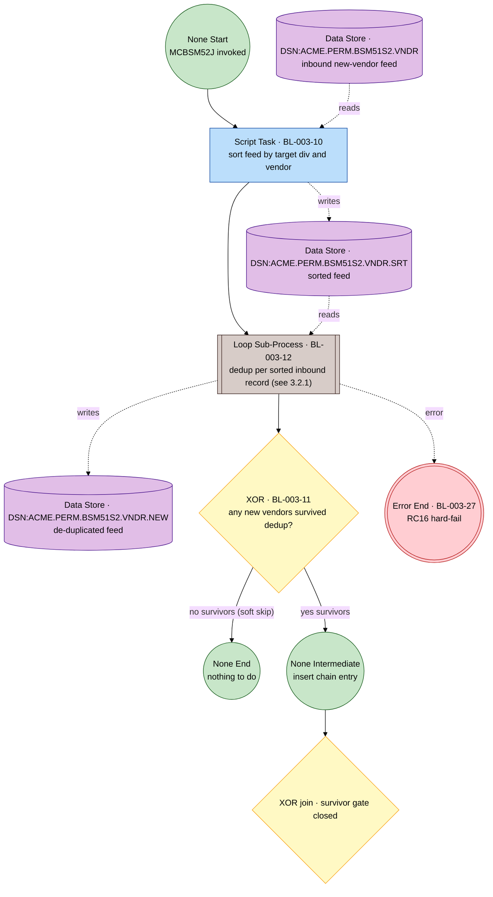

> `chain` is a milestone anchor for the FSM only (carries no logic); `j11` closes the survivor region after the insert chain. The full insert chain between `chain` and `j11` is shown in §3.1 and the stage diagrams §3.3–§3.6. The survivor gate `g11` carries only the row-count guard on its outgoing flows (P3 — a gateway owns no data); the de-duplicated feed `DSN:…VNDR.NEW` is read by the Stage-2 replication (`s14`, where `XXBSM52` loads the scratch driver from it), shown in §3.3 / the standalone `.mmd`.

#### 3.2.1 Stage 1 — dedup loop body (BL-003-12, classify-and-seed)

Per the classify-and-seed convention (meta-model §5.2): the XOR carries the rule id `BL-003-12`; the emit-to-NEW-feed task is its branch effect, not a separate rule. The probe is a Service Task; the "other status" branch escalates to the hard-fail (`BL-003-27`).

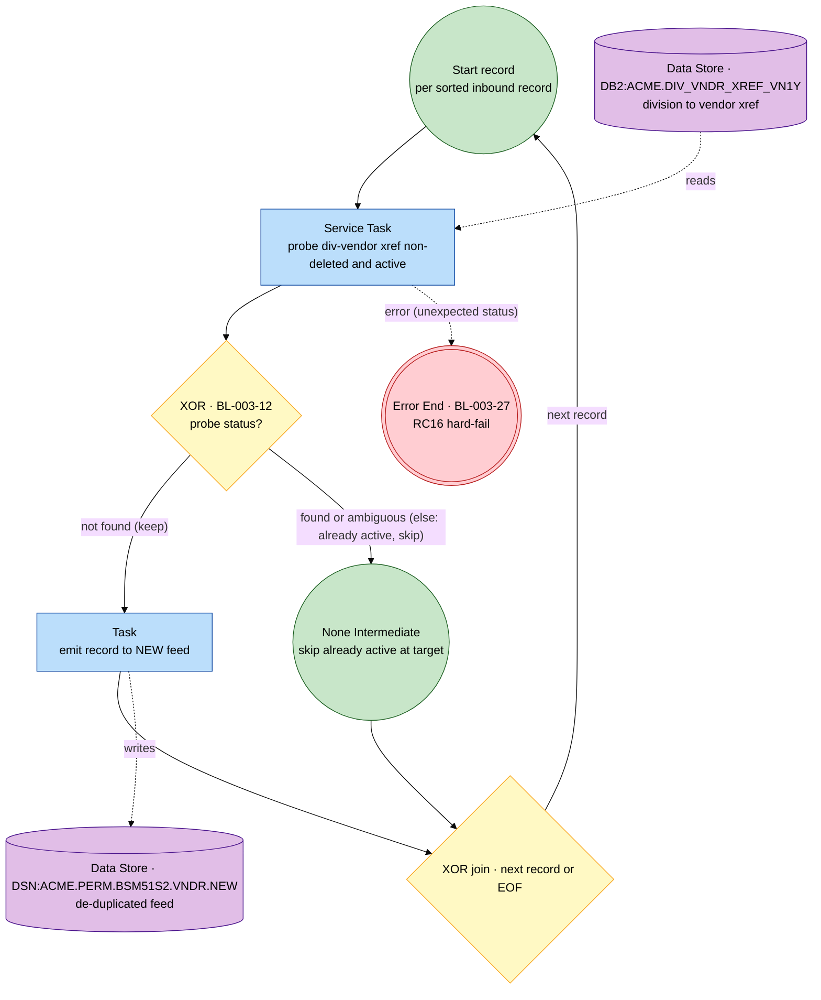

> Source decision map (business-logic §5.B): "not found" = keep → emit; "found" / "ambiguous match" = already active → skip. These two are the soft outcomes; the XOR `g12` is total over them (the second is the `else` branch), satisfying P4. The "any other status" = unexpected case is **not** an XOR branch — it is the hard-fail exception (`BL-003-27`, §4.2) raised off the data-access task `probe` as a dotted error flow to the shared `Error End` (the §6.4 / BP-001 §2.2 convention), keeping exceptions as events (P8). `probe` reads `VN1Y` filtered on `DELT_SW=N AND VN1A_STAT=ACT`.

### 3.3 Stage 2 — Division↔vendor xref VN1Y (`XXBSM52`, BL-003-13/14/15)

The substitution switch (13) is recognised once at entry as a `[derived]` data object (the `Y`/substitution branch is **dormant** — always `N` this job). The xref replication (14) is a Loop Sub-Process per accepted vendor / per source row; its body clones+rekeys to the target division, stamps user `XXBSM52`, inserts-or-skips-dup (21), then records the accepted vendor for downstream (15).

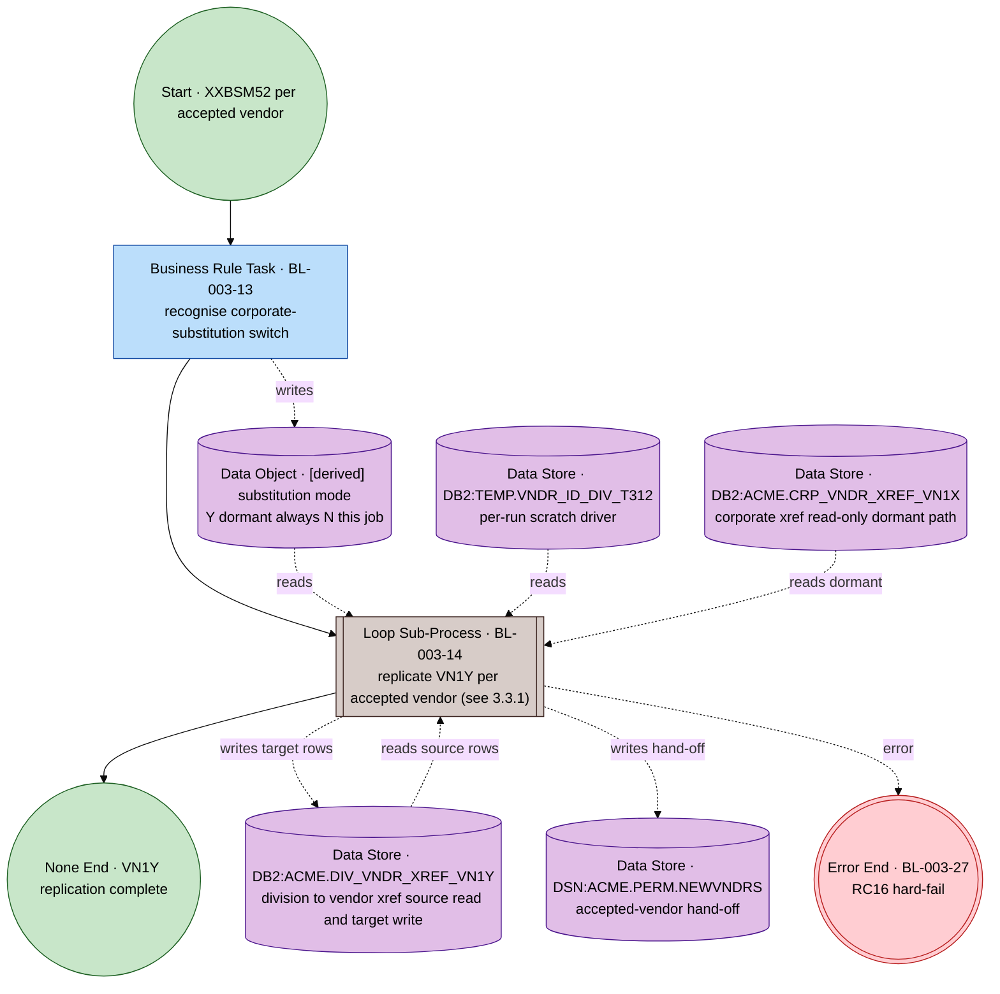

#### 3.3.1 Stage 2 — VN1Y replication loop body (BL-003-14 with BL-003-15 and BL-003-21)

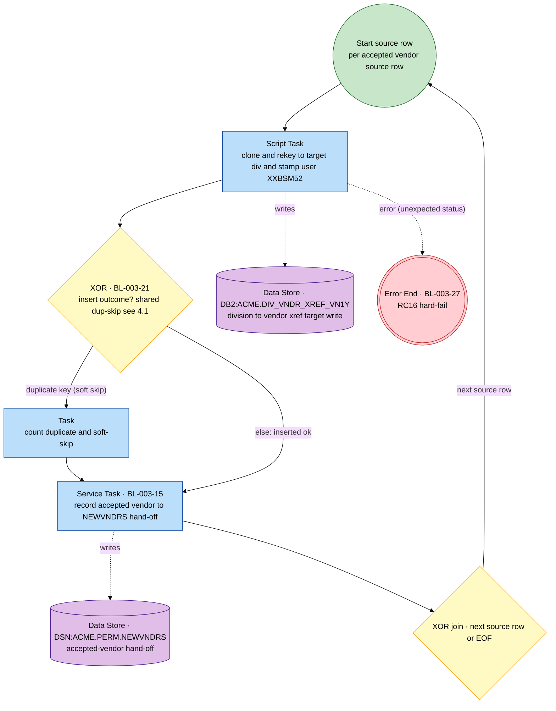

> The `g21` dup-skip XOR is total over the two soft outcomes (duplicate / inserted-ok, the latter the `else`); the unexpected-status case is the hard-fail exception (`BL-003-27`) raised off the insert task `clone` as a dotted error flow to the shared `Error End`, not an XOR branch (P8). `BL-003-15` runs once per replicated source row (the source pseudocode places `RECORD-ACCEPTED` inside the `VN1Y` loop). The dup-skip gateway `g21` is the shared `BL-003-21` convention rendered inline here; the same convention is referenced by §3.4 / §3.5 loops without re-counting the rule.

### 3.4 Stage 3 — Partition-keyed satellites VN2E / VN1B / VN1I (`XXBSM53`, BL-003-16/17/18/19)

The division-partition map (16) runs once at Stage-3 entry (two `DIVMSTRDI1D` lookups → source + target partitions) and feeds the three partition-keyed loops, which run sequentially (17 → 18 → 19). Each loop body is the canonical clone+rekey → insert-or-skip-dup (21) shape (§3.4.1).

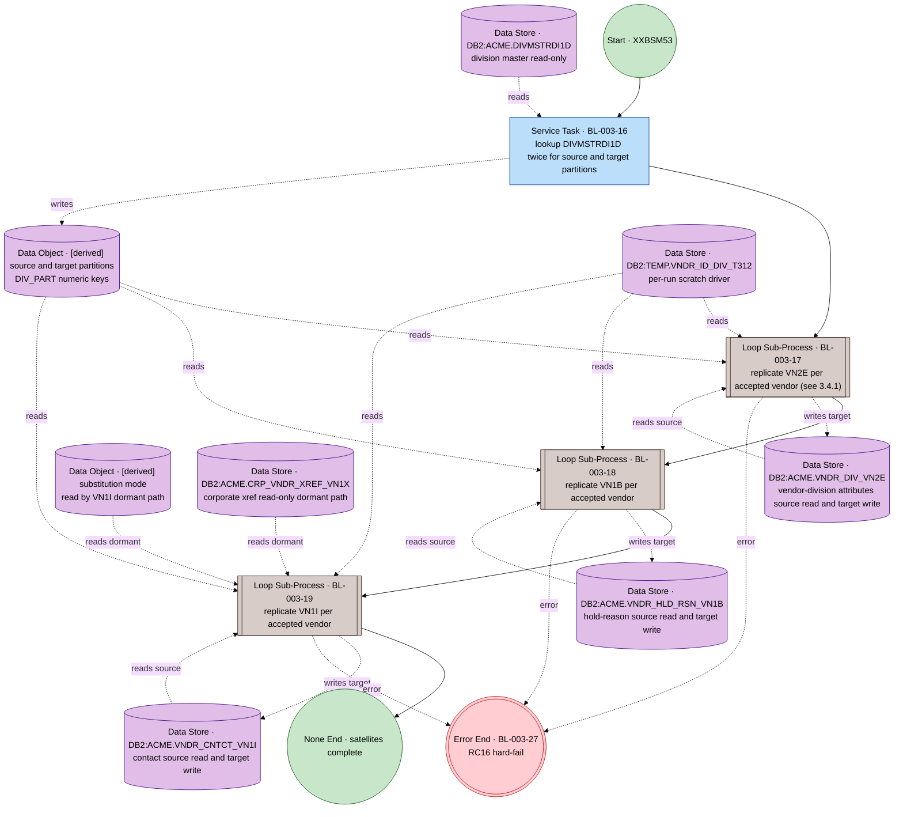

#### 3.4.1 Stage 3 — representative satellite replication loop body (BL-003-17; identical shape for 18/19)

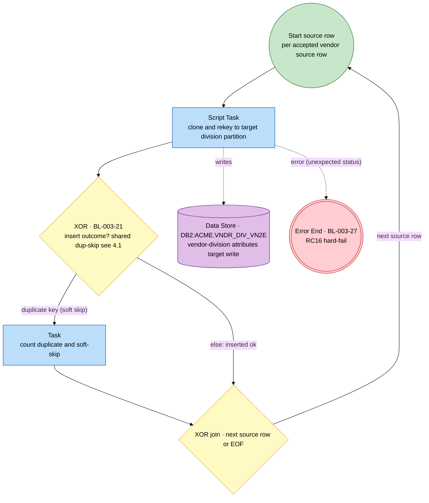

> The `g21` XOR is total over the two soft outcomes; the unexpected-status hard-fail (`BL-003-27`) is the dotted error flow off `clone` to the shared `Error End` (P8), not an XOR branch. `BL-003-18` (`VN1B`) and `BL-003-19` (`VN1I`) have the identical body — only the target Data Store differs (`VN1B` / `VN1I`); `VN1I` additionally has the dormant substitution pre-lookup (`mode` + `VN1X`) feeding the clone step.

### 3.5 Stage 4 — Name-override VN2Y (`XXBSM54`, BL-003-20)

A single Loop Sub-Process per accepted vendor; the body clones+rekeys to the target division, stamps user `XXBSM54`, and inserts-or-skips-dup (21). The dormant substitution path reads `mode` + `VN1X`.

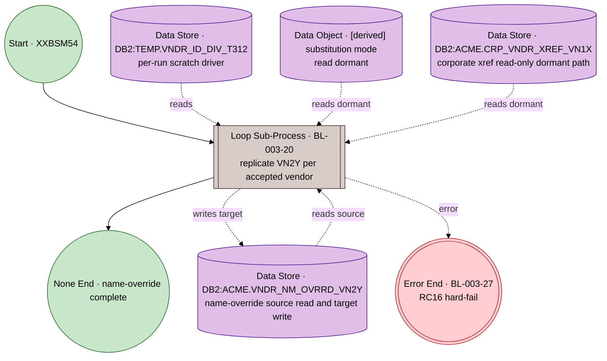

> The `BL-003-20` loop body is the §3.4.1 shape with an extra `stamp user XXBSM54` step on the clone Task and target store `VN2Y`; the shared `BL-003-21` gateway governs its insert outcome.

### 3.6 Stage 6 — BI CSV build and ship (`XXBSM55` + MFT, BL-003-22/23/24/25/26)

The BI selection (22) runs once (join `TEMP ⋈ VN1Y ⋈ VN1A ⋈ VN4B`, grouped/ordered). The build is a Loop Sub-Process per selected row: sanitise the name (23) then build the five-column record (24). The transfer gate (25) is a write-gate over the BI body row count; on non-empty, assemble header+body and ship (26) to `FT:COGNOS-SAN` via Message Flow.

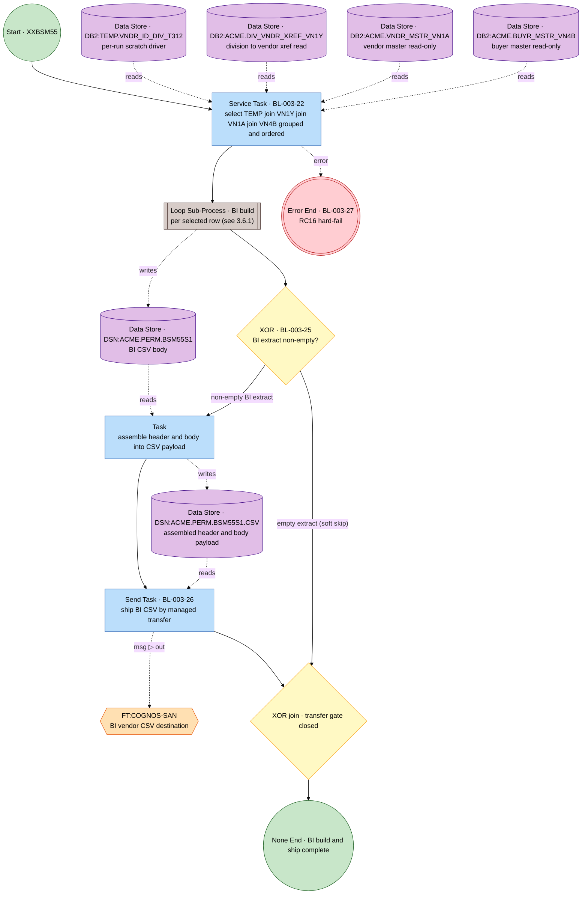

> The `asm` Task (header+body concatenation, `COPY0`/`ICEGENER`) is implementation gated by `BL-003-25` (business-logic §6.3); it carries no rule but is shown so the BI body store is read by a Task (not the gateway), the payload store has a writer, and the Send Task `t26` reads data-at-rest. The gate `g25` carries only the non-empty row-count guard on its outgoing flows (P3 — a gateway owns no data).

#### 3.6.1 Stage 6 — BI build loop body (BL-003-23 then BL-003-24)

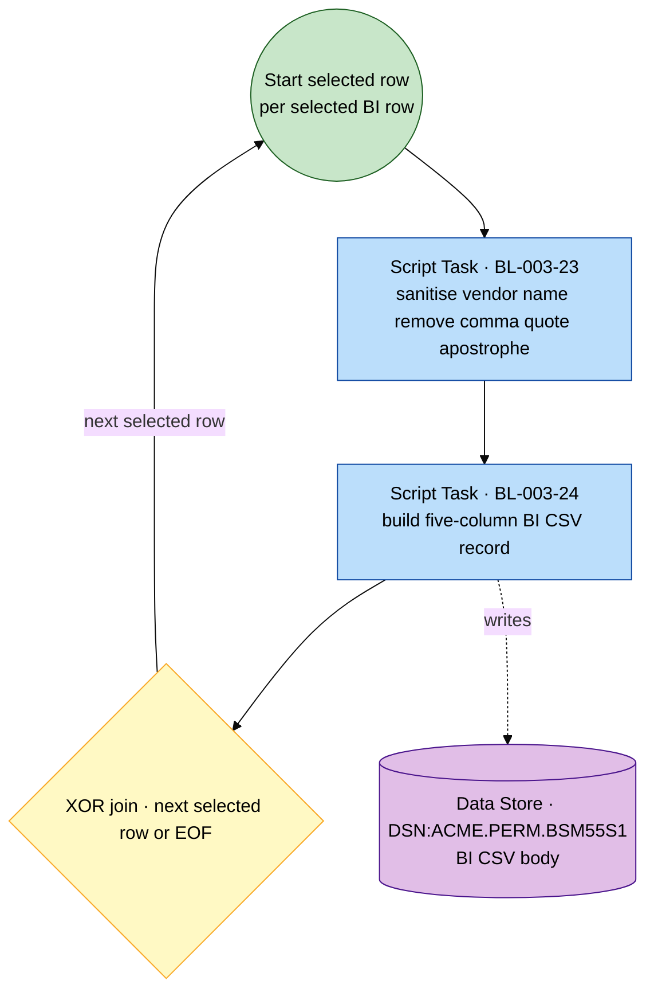

### 3.7 Process B — rule → element conformance

| BL-003 | Title | Logic type | BPMN element | Where |
|---|---|---|---|---|
| 10 | Order feed by target division + vendor | transformation (normalisation) | Script Task (sort) | §3.2 |
| 11 | Gate insert chain on surviving vendors | validation (write-gate) | XOR Gateway (b1, over dedup-feed row count) + soft-skip branch → join | §3.1 / §3.2 |
| 12 | Keep only vendors not active at target div | validation (filter) | Loop Sub-Process + body 3-way classify-and-seed XOR | §3.2.1 |
| 13 | Recognise corporate-substitution switch | classification | Business Rule Task → `[derived]` substitution mode (Y branch dormant) | §3.3 |
| 14 | Replicate VN1Y at target | transformation | Loop Sub-Process; body clone+rekey+stamp `XXBSM52` → 21 → 15 | §3.3 / §3.3.1 |
| 15 | Record each accepted vendor downstream | control (distribution) | Service Task (write `NEWVNDRS`), inside the 14 loop body | §3.3.1 |
| 16 | Map division code → division partition | enrichment | Service Task (lookup `DIVMSTRDI1D` ×2) at Stage-3 entry | §3.4 |
| 17 | Replicate VN2E at target | transformation | Loop Sub-Process; body clone+rekey → 21 | §3.4 / §3.4.1 |
| 18 | Replicate hold-reason VN1B at target | transformation | Loop Sub-Process; body clone+rekey → 21 | §3.4 |
| 19 | Replicate contact VN1I at target | transformation | Loop Sub-Process; body clone+rekey → 21 | §3.4 |
| 20 | Replicate name-override VN2Y at target | transformation | Loop Sub-Process; body clone+rekey+stamp `XXBSM54` → 21 | §3.5 |
| 21 | Soft-skip duplicate-key inserts | validation (filter) | XOR Gateway, modelled ONCE (shared canonical, §4.1); referenced by 14/17/18/19/20 | §4.1 |
| 22 | Select newly-enrolled target-div vendors for BI | selection (set selection) | Service Task (`TEMP ⋈ VN1Y ⋈ VN1A ⋈ VN4B`) | §3.6 |
| 23 | Sanitise vendor name for CSV | transformation (normalisation) | Script Task, inside BI build loop | §3.6.1 |
| 24 | Build five-column BI CSV record | reporting | Script Task, inside BI build loop | §3.6.1 |
| 25 | Gate transfer on non-empty BI extract | validation (write-gate) | XOR Gateway (b1, over BI body row count) + soft-skip branch → join | §3.1 / §3.6 |
| 26 | Ship BI CSV to Cognos SAN | control (distribution) | Send Task → `FT:COGNOS-SAN` (Message Flow) | §3.6 |
| 27 | Hard-fail / propagate-skip on errors | error-handling (operational) | Error Boundary → Error End, modelled ONCE (§4.2); referenced by every data-access task | §4.2 / all stages |

All 18 Process B rules map to exactly one flow node; none dropped or duplicated.

### 3.8 Process B — derived FSM projection (Mealy)

**There is no concurrency.** Process B is a strictly sequential job-step chain (`COND=(4,LT)` guards); the business-logic triggers state the ordering explicitly. No `IOR`/`AND` region exists, so every transition effect `ω` is an ordered list (no big-step set-effect needed).

**Orchestration** — anchors `A = {START, SURVIVORS_GATED, ENROLMENT_REPLICATED, BI_BUILT, END_complete, END_nothing_to_do}`:

```
START                --[true]                    / {10, 12-dedup-loop}                                       --> SURVIVORS_GATED
SURVIVORS_GATED      --[rowCount(VNDR.NEW) = 0]   / {11}                                                      --> END_nothing_to_do  (soft skip)
SURVIVORS_GATED      --[rowCount(VNDR.NEW) > 0]   / {11, 13, 14-loop, 16, 17-loop, 18-loop, 19-loop, 20-loop} --> ENROLMENT_REPLICATED
ENROLMENT_REPLICATED --[true]                     / {22, 23/24-BI-build-loop}                                 --> BI_BUILT
BI_BUILT             --[rowCount(BSM55S1) > 0]    / {25, 26-ship}                                             --> END_complete
BI_BUILT             --[rowCount(BSM55S1) = 0]    / {25}                                                      --> END_complete  (soft skip, transfer skipped)
```

> The `BL-003-25` region is a SESE block nested inside the `SURVIVORS_GATED → … → BI_BUILT → END_complete` path (the `BL-003-11` "yes" branch). Guards on each XOR split are mutually exclusive and exhaustive. `15` and `21` fire inside the loops; they appear in the per-vendor FSM below, not as orchestration anchors.

**Per-record FSM — dedup loop (`BL-003-12`)** — states `{REC_READ, REC_DONE}` (`REC_DONE` loops to `REC_READ` until EOF → `SURVIVORS_GATED`):

```
REC_READ --[probe = NOT-FOUND]          / {12, emit-to-NEW}  --> REC_DONE  (kept)
REC_READ --[probe = FOUND ∨ AMBIGUOUS]  / {12}               --> REC_DONE  (skipped, already active)
REC_READ --[probe = OTHER]              / {12, 27}           --> (Error End · RC16)
```

**Per-vendor FSM — a replication loop (`BL-003-14`, representative; 17/18/19/20 identical minus the 15 effect)** — states `{ROW_READ, ROW_DONE}` (`ROW_DONE` loops to `ROW_READ` until EOF → next stage):

```
ROW_READ --[insert = OK]             / {14, 15}      --> ROW_DONE
ROW_READ --[insert = DUPLICATE-KEY]  / {14, 21, 15}  --> ROW_DONE  (soft-skip duplicate, still recorded)
ROW_READ --[insert = OTHER]          / {14, 27}      --> (Error End · RC16)
```

> For `17/18/19/20` the per-vendor FSM is the same but the effect drops `15` (the hand-off write is only in the `14` body): `{17|18|19|20}` on OK, `{17|18|19|20, 21}` on duplicate, `{…, 27}` on OTHER. Guards mutually exclusive and exhaustive (deterministic Mealy). The exact reachability-graph FSM `RG(N)` (meta-model §7.1) is a simple chain with the two binary gate branchings — no interleaving product, as the model is acyclic at the orchestration level and has no concurrent regions.

---

## 4. Cross-cutting conventions

### 4.1 Process B — duplicate-key soft-skip (`BL-003-21`)

The five replication loops (`BL-003-14/17/18/19/20`) each route their insert outcome through this one canonical XOR. A duplicate key is counted and soft-skipped (idempotent re-runs); any other unexpected status escalates to the hard-fail (`BL-003-27`). Rendered once here and referenced inline (`g21`) by each loop body.

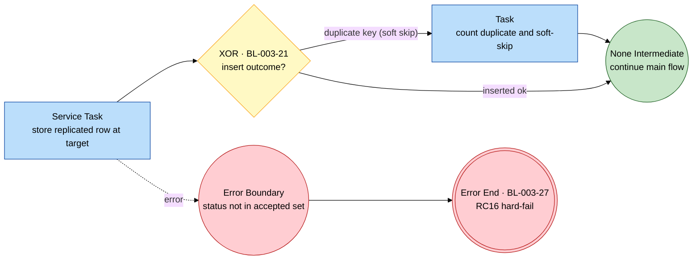

> `OK` and `DUPLICATE` are ordinary soft outcomes; only an unexpected status raises the Error caught by the boundary → `Error End` (P8). Duplicate is not a failure.

### 4.2 Process B — operational hard-fail (`BL-003-27`)

Every data-access Task in Process B (the dedup probe, the five replications, the BI select, the satellite reads/writes) is guarded by the reusable hard-fail boundary (meta-model §6.4). `NOT-FOUND` and `DUPLICATE` are soft outcomes (handled by `BL-003-12` / `BL-003-21`); any other unexpected file/DB2 status raises an Error caught by an Error Boundary Event → `Error End · RC16`, which the job-level `COND=(4,LT)` guard turns into a pipeline stop bypassing all remaining steps. Modelled once, referenced everywhere.

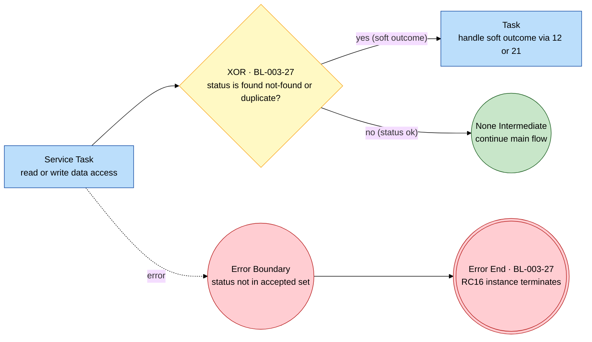

### 4.3 Process A — soft return-to-caller (`BL-003-05`)

In contrast to Process B's hard-fail, Process A's data-access fault convention is a **soft** return: the routine sets the caller return code, calls the shared diagnostic handler, and returns **normally** (None End — no abend, no RC16). The caller inspects the return code (non-zero = "lookup failed"; zero with empty result set = "no matches"). This is modelled in §2.1 as a shared data-access error catch (the dotted error flows from the `OPEN` and the enrichment join converge on one error event) → handling Task (carrying `BL-003-05`) → None End. The structural difference from §4.2 (None End vs Error End) is the faithful expression of "called-routine soft return" vs "batch hard-fail with `COND=(4,LT)` propagation".

---

## 5. Conformance and traceability

This graph conforms to [process-graph-meta-model.md](../../../../../reference/process-graph-meta-model.md):

- **Total coverage.** All 23 rules map to exactly one flow node — §2.2 (`BL-003-01..05`) and §3.7 (`BL-003-10..27`). Shared conventions `BL-003-21` and `BL-003-27` are each modelled once and referenced; `BL-003-15` and the dormant-substitution `BL-003-13` are first-class nodes inside the chain.
- **Purity (P1–P9).** Each diagram is block-structured (matched same-type split/join gateways), Activities are 1-in/1-out, gateways route only (conditions on outgoing flows), loops are confined to Loop/MI sub-processes (no arbitrary back-edges), XOR guards are mutually exclusive and exhaustive (the skip/soft branches give totality), exceptions exit via an Error End (Process B) or a None End soft-return (Process A), and every path reaches an End from a single Start — so each process is sound (P3 + P4 + P5 ⇒ P6).
- **Concurrency.** **None.** Process A is a linear pipeline; Process B is a sequential job-step chain (the legacy `COND=(4,LT)` ordering and the business-logic triggers are explicit) — no `AND`/`IOR` region is introduced. The logically-independent satellites are modelled in their stated execution order, claiming no false concurrency.
- **Data identity & no-orphan (§3.3.1).** Every Data node carries a typed id (`DSN:`/`DB2:`/`WS:`) or `[derived]`. The five Process B satellites (`VN1Y`/`VN2E`/`VN1B`/`VN1I`/`VN2Y`) each have both a reader (source-division rows) and a writer (target-division rows); the intermediate datasets (`…VNDR.SRT`, `…VNDR.NEW`, `NEWVNDRS`, `BSM55S1`, `BSM55S1.CSV`) and the scratch driver (`TEMP.VNDR_ID_DIV_T312`) each have both. The corporate/reference masters (`VN1A`, `VN1X`, `DIVMSTRDI1D`, `VN4B`) are read-only inputs, explicitly annotated as reference masters.
- **Integration identity (§3.5).** Both external endpoints are black-box Participants reached **only** by Message Flow: Process A's `API:vendor-lookup` (out, request–reply, single held result set; §2.1) and Process B's `FT:COGNOS-SAN` (out, fire-and-forget, async managed file transfer `fteCreateTransfer`, at-least-once, full-snapshot overwrite, failure via the job-level hard-fail; §3.6). Neither is modelled as a Data node.
- **FSM.** Derived Mealy projections are in §2.3 (Process A) and §3.8 (Process B, with per-record and per-vendor sub-machines); the exact reachability-graph FSM is obtainable per meta-model §7.1.
- **Source artifacts.** Standalone Mermaid sources are in the `diagrams/` subfolder at `diagrams/BP-003-A-process-graph.mmd` and `diagrams/BP-003-B-process-graph.mmd`; every Mermaid block (both `.mmd` sources and all embedded diagrams) parses clean under mermaid 11.x. SVG rasterization was not run in the extraction sandbox (no compatible headless-Chrome build for its CPU architecture); render on a host with a browser via `mmdc -i diagrams/BP-003-A-process-graph.mmd -o diagrams/BP-003-A-process-graph.svg -b transparent -t forest` (and likewise for `-B`).
- **Gaps (carried from the business-logic spec §8.2, not affecting rule placement).** The `FT:COGNOS-SAN` FTE agents / SAN path live in `DS.PERM.FTE(MCBSM55C)` + the FTE STDENV (`[GAP]`); the scratch driver `TEMP.VNDR_ID_DIV_T312` column names are inferred (no DCLGEN); the `CORPVNDR='Y'` substitution branch is dormant (`[SME]`); the `MCCST19` result-set client(s) are external to the drop (`[SME]`); `AUTHORKAY` / `AUTHORMCLANE` are absent from source (`[GAP]`), so they contribute no rules and no nodes.
