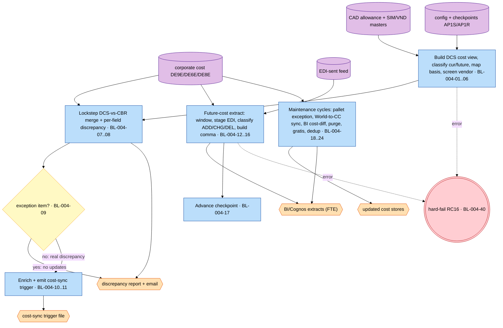
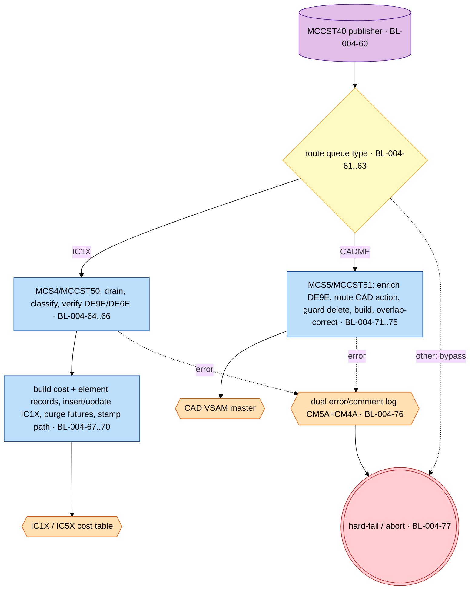
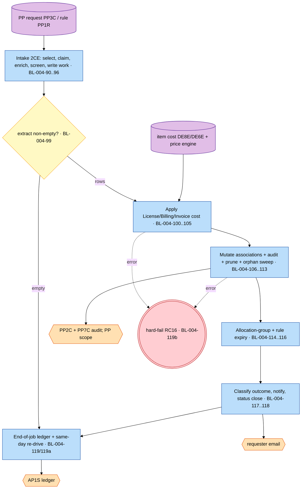
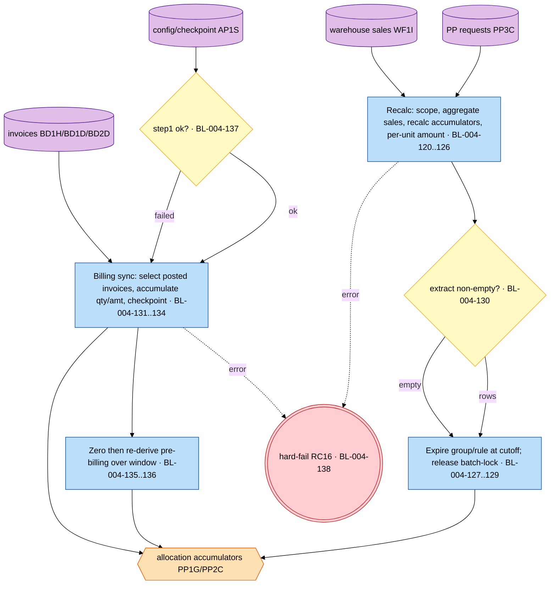
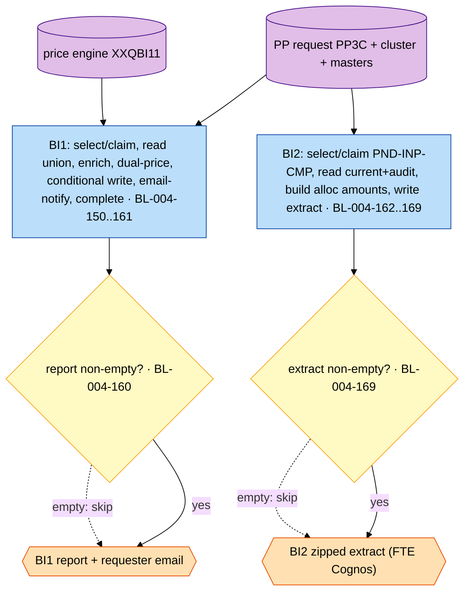
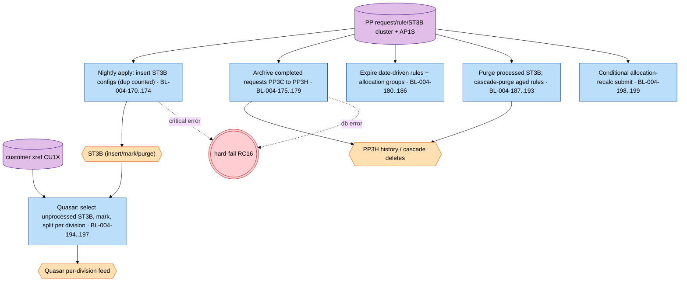
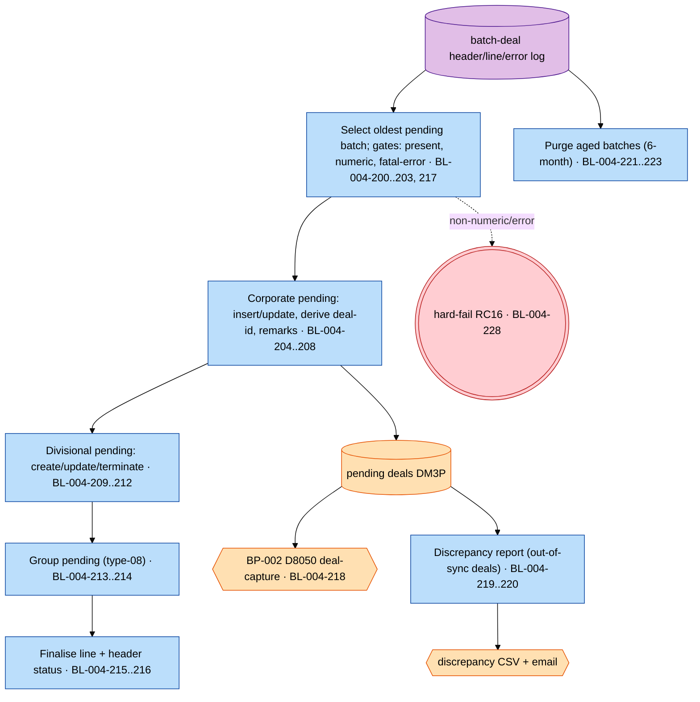
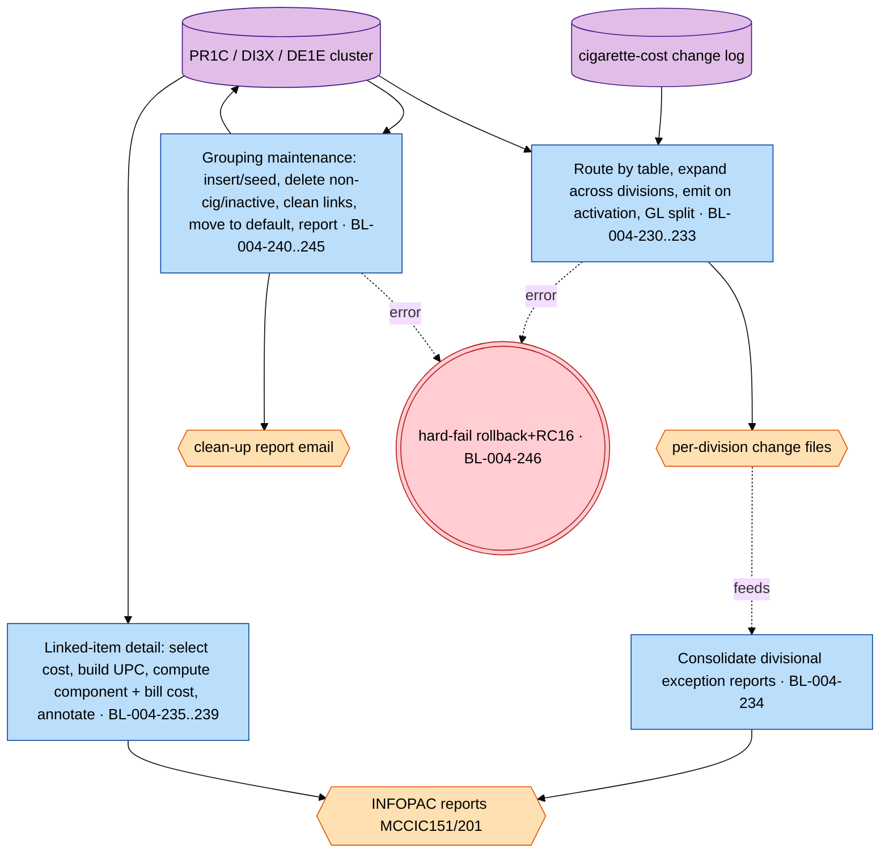
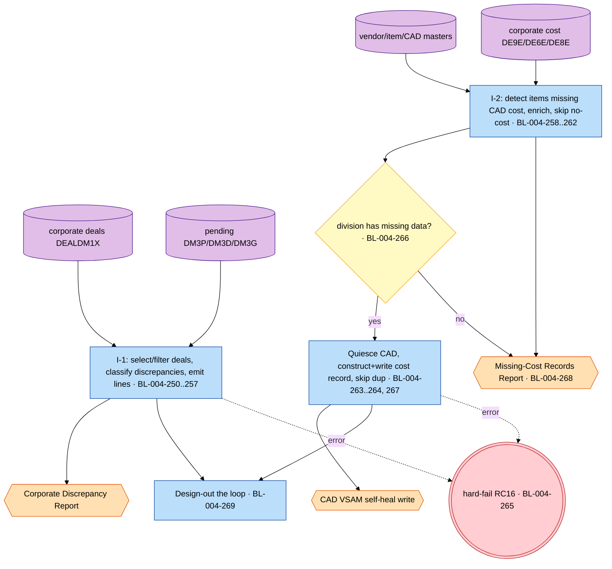

# BP-004 — Costing & Price Protection: Extracted Business Logic

**Status:** Draft — business-logic extraction derived from the call-dependency graph, grounded in mainframe source under `docs/legacy/src` (source consulted only to resolve ambiguity; cited inline per rule).
**Companion to:** [`BP-004-costing-and-price-protection-call-graph.md`](BP-004-costing-and-price-protection-call-graph.md) (primary input) and [`BP-004-costing-and-price-protection.md`](../BP-004-costing-and-price-protection.md) (overview spec).
**Conforms to:** [`business-logic-template.md`](../../../../../reference/business-logic-template.md); logic types cross-walk to [`process-graph-meta-model.md`](../../../../../reference/process-graph-meta-model.md) §5.
**Scope:** the nine independent end-to-end processes of BP-004, expressed as **207** discrete, fully-attributed business rules (`BL-004-MM`):

| § | Process | Anchor(s) | BL band |
|---|---|---|---|
| 4 | A — Costing batch (validation, future-cost extract, maintenance cycles) | `MCCAD65J`, `MCCST24J`, `MCCST5x/6x/7x/96J` | BL-004-01..40 |
| 5 | B — CICS/MQ online cost | `MCCST55`→`MCCST50`/`MCCST51` | BL-004-60..77 |
| 6 | C — Price Protection main pipeline | `MCRPR50J` | BL-004-90..119(+a/b) |
| 7 | D — Price Protection allocation & expiry | `MCRPR71J`, `MCRPR74J` | BL-004-120..138 |
| 8 | E — Price Protection modeler reports | `MCRPR55J`, `MCRPR85J` | BL-004-150..169 |
| 9 | F — Price Protection rule lifecycle | `MCRPR56/58/59/65/77/86/99J` | BL-004-170..199 |
| 10 | G — Cigarette deals batch | `MCCBT*` | BL-004-200..228 |
| 11 | H — Cigarette cost (CIC) | `MCCIC*` | BL-004-230..247 |
| 12 | I — Data-integrity / self-heal reconciliation | `MCM9014J`, `MCM9091J` | BL-004-250..269 |

---

## 1. Purpose, scope, and method

This document re-expresses the nine BP-004 pipelines as **business logic** — the *what* — separated from language/environment mechanics (the *how*). The **primary input is the call-dependency graph**; the mainframe source was consulted only to resolve an ambiguous datum (an exact field width, a numeric constant, a branch predicate, a formula), and each such consultation is cited inline in the rule's **Derives from**.

**What is captured as rules** (the *what*): validations, classifications, transformations, code mappings, set selections, match/merge, enrichment lookups, routing/distribution decisions, aggregations, defaulting, and — the single promoted mechanic — the operational hard-fail convention (return-code-16 / abend, or the online log-and-return). **What is deferred to §13.2 implementation notes** (the *how*): file/cursor open-close & key positioning, file-status / `SQLCODE` interrogation, `SET CURRENT PACKAGESET`, multi-row rowset buffering, `GET DIAGNOSTICS`, commit cadence, display/logging, report pagination/headers, sort/zip/FTE/email step plumbing, and job-step return-code propagation (`COND=`).

**Conventions** (defined once in the template, applied throughout):
- **Pseudocode** — every block uses the CLRS 4th-edition convention (template §2): indentation for blocks; `=` assignment, `==`/`≠`/`≤`/`≥` comparison, `and`/`or`/`not`; `//` comments; `if`/`elseif`/`else`, `while`, `repeat…until`, `for…to`, `return`, `error "…"`; `CAPS-HYPHEN` procedure names; dot attributes. No COBOL/SQL/JCL tokens leak into a fence (template §2.1).
- **Identifier translation** (template §3) — every cryptic identifier appears in plain English with the original in parentheses on first use in a rule and in every schema row; the master glossary is §3.
- **Logical types** (template §4) used in schemas: `string(n)`, `integer(n)`, `amount(i.f)`, `date-iso`, `date-julian`, `timestamp`, `code(n)`, `flag`.
- **Logic types** (closed set, template §5) — each rule carries exactly one PRIMARY type so it maps to one downstream process-graph element: `validation`, `classification`, `transformation`, `selection`, `data-load`, `enrichment`, `match-merge`, `aggregation`, `routing`, `control`, `reporting`, `error-handling` (optional parenthetical subtype).
- **Rule attributes** (template §6, in order): **Logic type**, **Maps to** (the coarse companion `BR-004-xx`, or `new (reason)`), **Derives from** (call-graph node id(s) + any cited source member), **Trigger**, **Input schema**, **Description**, **Pseudocode**, **Output schema**.

**Sentinel constants** referenced in pseudocode: `FAR_FUTURE_DATE` (the `'2999-01-01'` / `9999365` "no value present" date the legacy code uses), `STAMP_GROUP_ID = 19999` (cigarette-tax-stamp item-group id), the `'1900-01-01-…'` ST3B "unprocessed" timestamp sentinel, and per-process retry/retention caps noted at their rules.

> **Grounding corrections carried from the call graph** (see §15): the spec's `PP_ALLOC_DTL_PP4D`/`PP4S`/`PP4H` and `PRC_CMPNT_ITM_ADTC`/`PRC_COMP_DTC` tables do not exist (real targets are `PP_ALLOC_PP2A`/`PP_ALLOC_HIST_PP2H` and the `PP7C` audit); `MCCST50J` (batch) runs `XXCST50`, not the CICS `MCCST50`; `MCCBT03` is a **purge**, not customer billing; `BR-004-59-05` (dup-key suppress-delete) is **not implemented**; several called sub-programs (`XXQBI11`, `XXDIV50`, `M901402`, …) and the cigarette `XXCBT0nP` procs are absent from the export.
---

## 2. End-to-end process maps

One lightweight orientation map per process — the *what* path (sources → stage activities annotated with their `BL-004-MM` range → gates → sinks), free of file/cursor mechanics. The formal process model is the downstream process-graph artifact.

### 2.A Process A — Costing batch

<!-- mmd:BP-004-costing-business-logic -->


### 2.B Process B — CICS/MQ online cost

<!-- mmd:BP-004-online-cost-business-logic -->


### 2.C Process C — Price Protection main pipeline

<!-- mmd:BP-004-pp-main-business-logic -->


### 2.D Process D — Price Protection allocation & expiry

<!-- mmd:BP-004-pp-allocation-business-logic -->


### 2.E Process E — Price Protection modeler reports

<!-- mmd:BP-004-pp-modeler-business-logic -->


### 2.F Process F — Price Protection rule lifecycle

<!-- mmd:BP-004-pp-lifecycle-business-logic -->


### 2.G Process G — Cigarette deals batch

<!-- mmd:BP-004-cigarette-deals-business-logic -->


### 2.H Process H — Cigarette cost (CIC)

<!-- mmd:BP-004-cigarette-cost-business-logic -->


### 2.I Process I — Data-integrity / self-healing reconciliation

<!-- mmd:BP-004-data-integrity-business-logic -->

---

## 3. Master identifier-translation glossary

Per-process glossary contributions (plain-English name → original → logical type), grouped by the originating process. Shared masters (e.g. `DE9E`/`DE6E`/`DI1D`, the `PP_*` cluster, the deal `DM3*` cluster) recur where a process reads them; the translation is authoritative wherever it first appears and identical across processes.

### 3.A Costing batch (validation, future-cost extract & maintenance cycles) — glossary

| Plain-English name | Original | Logical type | Record / table |
|---|---|---|---|
| item cost control | `ITM_COST_CNTL_DE9E` (DE9E) | record | DB2 `ACME.ITM_COST_CNTL_DE9E` |
| item cost (control) audit | `ITMCOSTCNTLAUDDE9A` (DE9A) | record | DB2 `ACME.ITMCOSTCNTLAUDDE9A` |
| item cost | `ITM_COST_DE8E` (DE8E) | record | DB2 `ACME.ITM_COST_DE8E` |
| item bill cost | `ITM_BILL_COST_DE6E` (DE6E) | record | DB2 `ACME.ITM_BILL_COST_DE6E` |
| UIN item (unique-item master) | `UIN_ITEM_DE6C` (DE6C) | record | DB2 `ACME.UIN_ITEM_DE6C` |
| gratis factor | `GRATIS_FCTOR` | amount(5.4) | DE6C / `UIN_ITEM` |
| division master | `DIVMSTRDI1D` (DI1D) | record | DB2 `ACME.DIVMSTRDI1D` |
| division item-pack | `DIV_ITEM_PACK_DE1I` (DE1I) | record | DB2 `ACME.DIV_ITEM_PACK_DE1I` |
| Acme (world↔CC) cross-reference | `MCLANE_XREF_DI3X` (DI3X) | record | DB2 `ACME.MCLANE_XREF_DI3X` |
| vendor master | `VNDR_MSTR_VN1A` (VN1A) / VSAM `VND` | record | DB2 `ACME.VNDR_MSTR_VN1A` / `<DIV>.MSTR.VND` |
| item authorization | `ITEMAUTHST1A` (ST1A) | record | DB2 `ACME.ITEMAUTHST1A` |
| application system parameter (config/checkpoint) | `APPL_SYS_PARM_AP1S` (AP1S) | record | DB2 `DS.APPL_SYS_PARM_AP1S` |
| application reader parameter | `APPL_RDR_PARM_AP1R` (AP1R) | record | DB2 `DS.APPL_RDR_PARM_AP1R` |
| Computerized Allowance Data (cost/deal) record | `DCSFCAD` / `CDKY`/`CDIC` fields | record | VSAM `<DIV>.MSTR.CAD` |
| item master (SIM) | `DCSFITM` / `ITKY` fields | record | VSAM `<DIV>.MSTR.SIM` |
| future-cost extract last-run checkpoint | `MCCST24_LAST_RUN` | timestamp | AP1S row (`APPL_ID='CAD'`) |
| future-cost look-ahead window (days) | `MCCST24_<cust>` `INTGR_VAL` | integer | AP1S row |
| cost-purge retention years | `COST_PURGE_YEAR` | integer | AP1S row (`APPL_ID='CAD'`) |
| cost-purge commit frequency | `COST_PURGE_COMMIT` | integer | AP1S row |
| cost-out-of-sync exception list | `CAD_OOS_EXCEPT` | code(6) list | AP1R rows (`APPL_ID='CAD'`) |
| active-vendor status | `VNKY-RECORD-STATUS-CODE` | code(1) | VND / VN1A (working storage 88: 'A') |
| vendor cost-control flag | `VNRT-COST-CONTROL-FLAG` / `COST_CNTRL_SW` | flag | VND / VN1A |
| list-amount type | `CDIC-LIST-AMT-TYPE` | code(1) | CAD (DCSFCAD) |
| list cost | `CDIC-LIST-COST` | amount(7.4) | CAD (DCSFCAD) |
| order-start Julian | `CDIC-LIST-ORDER-YYDDD` | date-julian | CAD (DCSFCAD) |
| order-last/expiry Julian | `CDKY-ORDER-LAST-YYDDD` | date-julian | CAD (DCSFCAD) |
| cost-basis code | `DCS-COST-BASIS` / `COST_BASIS_CD` | code(2) | DCS view / DE9E (values ACME/CW/SC) |
| multi-CAD indicator | `DCS-MULT-CAD-SW` | flag | DCS view (value 'M') |
| current-cost-present switch | `WS-CUR-COST-SW` | flag | XXCAD63 working storage |
| future-cost-present switch | `WS-FUT-COST-SW` | flag | XXCAD63 working storage |
| exception-item switch | `WS-EXC-ITEM-SW` | flag | XXCAD65 working storage (per item) |
| exception-report-enabled switch | `WS-AP1R-SW` | flag | XXCAD65 reader record |
| cost-change action | `WS-ACTION` / `OUT-ACTION` | code(3) | MCCST24 (ADD/CHG/DEL) |
| staged hierarchy bill-cost (temp) | `ITEM_BILL_COST_T356` | record | TEMP table `[GAP]` no DCLGEN |
| gratis temp (named in seed) | `T356` | record | `[GAP]` — same temp table; no DCLGEN |
| pallet item / case (component) item | `MRF-PLT-ITEM-*` / `MRF-CASE-*` | record | XXCST50 work area (from DM1X/DE6D/DE6E) |
| world item / CC item | `DI3X-ACME-REF-NUM` / `DI3X-EXT-REF-NUM` | integer(10) | DI3X |
| cost-sync trigger record | `XXCAD66C` (`OUT-*`) | record | seq `ACME.PERM.XXCAD65.OUT` |

---

### 3.B CICS / MQ online cost (MCCST55 → MCCST50 / MCCST51) — glossary

**MQ trigger / dispatch (MCCST55)**
| Plain-English name | Original | Logical type |
|---|---|---|
| Queue type | `COMM-Q-TYPE` | code(5) — `IC1X` \| `CADMF` \| other |
| Cost-change action code | `MQHI-ACT-CD` | code(3) — `'CHG'` |
| Routed transaction id | `WS-TRANSID` | string(4) — `MCS4` \| `MCS5` |
| Routed program name | `WS-PROGRAM` | string(8) — `MCCST50` \| `MCCST51` |
| Debug flag | `COMM-DEBUG` | flag |
| Division | `COMM-DIV` / `WS-QN-DIV` | string(2) |
| Built queue name | `WS-QUEUE-NAME` (`<DIV>.QCOST01.CHG.<TYPE>`) | string(20) |
| Operator menu re-drive txn | `MCS6` | code(4) |
| Division existence | `DI1D-ACME-DIV` on `DIVMSTRDI1D` | string(2) |

**Online cost message (`QCOST01`) and cost stores**
| Plain-English name | Original | Logical type |
|---|---|---|
| Cost-control key — division-part | `CQDR-DE9E-DIV-PART` / `DE9E-DIV-PART` | integer |
| Cost-control key — cost area | `CQDR-DE9E-CLS-TYP` (`'ITMCST'`) | code(6) |
| Cost-control key — cost group | `CQDR-DE9E-CLS-ID` (`'BASCOST'`) | code(10) |
| Catalog (item) number | `CQDR-DE9E-CATLG-NUM` / `DE9E-CATLG-NUM` | integer |
| Bill-effective timestamp | `DE9E-BILL-EFF-TS` | timestamp |
| Purchase-order-effective date | `DE9E-PO-EFF-DT` | date-iso |
| Item cost-control row | `ACME.ITM_COST_CNTL_DE9E` (DE9E) | table |
| Delete switch | `DE9E-DELT-SW` | flag |
| Cost basis code | `DE9E-COST-BASIS-CD` (`'MAC'`/other) | code(3) |
| Base/NIC cost amount | `DE8E-COST-AMT` (DE8E) | amount(11.4) |
| Item bill cost row | `ACME.ITM_BILL_COST_DE6E` (DE6E) | table |
| Freight amount | `DE6E-FRT-AMT` | amount(11.4) |
| Backhaul-equivalent amount | `DE6E-BKHL-EQ-AMT` | amount(11.4) |
| Margin amount | `DE6E-MRGN-AMT` | amount(11.4) |
| Cash-discount-equivalent percent | `DE6E-CASH-DISC-EQ-PCT` | amount(1.4) |
| Item-group class id | `DE1E-CLS-ID` on `ACME.ITEM_GRP_DE1E` (DE1E) | integer |
| Stamp group id | (literal) `19999` | integer |
| Item description (stamp text) | `DE6C-ITEM-DESC` on `ACME.UIN_ITEM_DE6C` (DE6C) | string(10) |
| Item-vendor link | `ACME.ITEM_VNDR_DE6V` (DE6V) | table |
| Vendor cost-control switch | `VN1A-COST-CNTRL-SW` on `ACME.VNDR_MSTR_VN1A` (VN1A) | flag |
| Primary vendor id | `DE1I-OLD-PRIM-VNDR-ID` on `ACME.DIV_ITEM_PACK_DE1I` (DE1I) | integer |
| Buyer / DCS operator id | `VN4B-DCS-OPER-ID` on `ACME.BUYR_MSTR_VN4B` (VN4B) | string |

**Online cost table `INVCOSTIC1X` (IC1X) — from `DGIC1X.cpy`**
| Plain-English name | Original | Logical type |
|---|---|---|
| Catalog (item) number | `IC1X-IITEM2` | integer |
| Cost type | `IC1X-CCSTY0` | code(1) — 3=NIC/base, 8=freight, 1=backhaul-eq, 4=margin, 7=cash-disc-eq%, 5=stamp, 2=license |
| Cost amount (small) | `IC1X-ACSTA3` | amount(3.4) |
| Cost amount (full) | `IC1X-ACSTA9` | amount(7.4) |
| PO-effective date | `IC1X-DIPEFD` | string(6) YYMMDD |
| Bill-effective date | `IC1X-DIBEFD` | string(6) YYMMDD |
| Termination date | `IC1X-DTRMDD` | string(6) YYMMDD |
| Termination time | `IC1X-ETRMT2` | integer |
| User id | `IC1X-IUSER0` | string(8) |
| Stamp factor | `IC1X-ASTMP3` | amount(7.2) |
| Cigarette-stamp text | `IC1X-TCIGS0` | string(10) |
| Cost-source/state flag | `IC1X-SCSCT1` | flag |
| Cost-effective date | `IC1X-DCEFFH` | date-iso |
| Saved cost table | `INVCOSTSAVIC5X` (IC5X) | table |

**Online error/comment logging**
| Plain-English name | Original | Logical type |
|---|---|---|
| Error-domain (code→desc) | `ACME.CMN_ERR_DMN_CM6A` (CM6A) | table |
| Common error log | `ACME.CMN_ERR_CM5A` (CM5A) | table |
| Comment log | `ACME.COMNT_CM4A` (CM4A) | table |
| Error code | `CM6A-ERR-CD`/`CM5A-ERR-CD` | integer |
| Origin system code | `CM6A-ORIG-SYS-CD` (`'CST'`) | code(3) |
| Comment id / sequence | `CM4A-COMNT-ID` / `CM4A-SEQ-LN` | integer |
| Table-creator qualifier | `WS-TBL-CREATOR` (`Z0`/`ACME`) | string(2) |

**CAD master (`<DIV>.MSTR.CAD` VSAM, `DCSFCAD`)**
| Plain-English name | Original | Logical type |
|---|---|---|
| CAD record key | `CDKY-RECORD-KEY` | string(31) |
| Record type (item-cost) | `CDKY-RECORD-TYPE` (`'3'`) | code(1) |
| List-order date (Julian) | `CDIC-LIST-ORDER-YYDDD` | date-julian |
| New effective date (Julian) | `WS-EFFDATE` | date-julian |
| List cost | `CDIC-LIST-COST` | amount |
| List-amount type | `CDIC-LIST-AMT-TYPE` (`'F'`/`'H'`) | code(1) |
| Extract-reason code | `CDKY-EXTRACT-REASON-CODE` (`'1'`/`'4'`) | code(1) |
| Open-ended end date | (literal) `9999365` | date-julian |
| PO-eff→Julian converter | `DC502YP` | subprogram |
| Configuration / checkpoint | `DS.APPL_SYS_AP1P` (AP1P) / `DS.APPL_SYS_PARM_AP1S` (AP1S) | table |
| Retry-cap keys | `AP1S(APPL_ID='CAD', PARM_ID='MCCST50_RETRY_CNT' | 'MCCST51_RETRY_CNT')` | integer |
| MQ subsystem | `MQTA` (DB2T) / `MQPA` (DB2P) | code(4) |

---

### 3.C Price Protection — main pipeline (MCRPR50J) — glossary

(plain-English name → original → logical type)

**Price-protection request (`PP_RQST_PP3C` / DGPP3C)** — request lifecycle table (write-hot)
| Plain English | Original | Logical type |
|---|---|---|
| request id | `PP_RQST_ID` | integer |
| request type | `RQST_TYP` | code(3): `2CE` cost-event, `2CX`→`2CA` cost-allocation, `DWX`→`DW1` downstream-allocation, `BI1`/`BI2` modeler |
| request status | `STAT` | code(3): `PND` pending, `INP` in-progress, `CMP` completed |
| linked rule id | `PP_RULE_ID` | integer |
| action code | `ACTN_CD` | code(3): `ADD`, `DEL`, `RCU` remove-customer, `RIT` remove-item |
| request customer | `CUST_ID` | string(n) |
| request catalog number | `CATLG_NUM` | integer |
| requester id | `RQSTR_ID` | string(8) |
| request timestamp | `RQST_TS` | timestamp |
| completion timestamp | `CMPLTN_TS` | timestamp |

**Price-protection rule (`PP_RULE_PP1R` / DGPP1R)** — rule master
| Plain English | Original | Logical type |
|---|---|---|
| rule id | `PP_RULE_ID` | integer |
| rule status | `STAT` | code(3): `ACT` active, `EXP` expired, `ERR` errored |
| batch-lock switch | `CBATCH_LOCK_SW` | flag (`Y` locked / `N` unlocked) |
| cost component type | `COST_CMPNT_TYP` | code(3): `LIC`, `BIL`, `INV` |
| rule start date | `START_DT` | date-iso |
| rule end date | `END_DT` | date-iso |

**Customer-item association (`PP_CUST_ITEM_PP2C` / DGPP2C)** — customer×item cost assoc
| Plain English | Original | Logical type |
|---|---|---|
| rule id | `PP_RULE_ID` | integer |
| customer | `CUST_ID` | string(n) |
| catalog number | `CATLG_NUM` | integer |
| cost component type | `COST_CMPNT_TYP` | code(3) |
| cost amount | `COST_AMT` | amount(i.f) |
| division part | `DIV_PART` | string(n) |

**Customer-item audit (`PPCUSTITEMAUD_PP7C` / DGPP7C)** — association audit trail
| Plain English | Original | Logical type |
|---|---|---|
| audit reason | `AUD_RSN` | code(3) (= action code, or `EXP`) |
| cost amount | `COST_AMT` | amount(i.f) |

**Allocation definition (`PP_ALLOC_PP2A` / DGPP2A)** & **customer group (`PP_CUST_GRP_PP1G` / DGPP1G)**
| Plain English | Original | Logical type |
|---|---|---|
| allocation method | `PPA_MTHD` | code(3): `AMT` amount, `QTY` quantity, `VOL` volume |
| cutoff quantity | `PPA_CUTOFF_QTY` | integer |
| cutoff amount | `PPA_CUTOFF_AMT` | amount(11.4) |
| accumulated quantity | `ACCUM_QTY` | integer |
| accumulated amount | `ACCUM_AMT` | amount(11.4) |
| group id | `PP_GRP_ID` | integer |
| group status | `STAT` | code(3): `ACT`/`EXP` |
| group expiry date | `EXPIRE_DT` | date-iso |

**Other**
| Plain English | Original | Logical type |
|---|---|---|
| PP customer scope | `PP_CUST_PP1C` (DGPP1C) | table |
| PP item scope | `PP_ITEM_PP1I` (DGPP1I) | table |
| request-type description | `RQST_TYP_PP9G.DESCR` (DGPP9G) | string(30) |
| status reference | `STAT_PP9S` (DGPP9S) | reference table (literals in code) |
| item cost | `ITM_COST_DE8E` (DGDE8E); base-cost class `ITMCST`/`BASCOST` | amount(i.f) |
| item bill cost | `ITM_BILL_COST_DE6E` (DGDE6E) | amount(i.f) |
| customer cross-reference | `CUST_XREF_CU1X` (DGCU1X) | string(n) |
| configuration ledger | `DS.APPL_SYS_PARM_AP1S` (DGAP1S); `CHAR_VAL='CMP'` | character parameter |
| cost-application work file | `ACME.PERM.RPR50S1` | sequential (REC `XXRPR50C`) |
| post-cost work file | `ACME.PERM.RPR51S1` / `RPR51S3` | sequential |
| consolidated status file | `ACME.PERM.RPR.STAT` (per-step `RPR50.STAT`/`RPR51.STAT`/`RPR52.STAT`) | sequential |
| notification file | `ACME.PERM.RPR53.EMAIL` | sequential → email |
| invoice-price engine | `XXQBI11` (called sub-program; helpers `XXDIV50`/`XXGRP50`) | external API |
| comment / console-message stored proc | `SYSPROC.DSCON03` | external procedure |

---

### 3.D Price Protection — allocation & expiry (MCRPR71J / MCRPR74J) — glossary

**Table `ACME.PP_ALLOC_PP2A` — PP allocation (`PP2A`)**

| Plain-English name | Original | Logical type |
|---|---|---|
| allocation id | `ALLOC_ID` | integer(9) |
| rule id | `PP_RULE_ID` | integer(9) |
| allocation method | `PPA_MTHD` | code(3) — `AMT`/`QTY`/`VOL` |
| cost-component type | `PPA_COST_CMPNT_TYP` | code(3) — `LIC`/`BIL`/`INV`/`FLT` |
| cutoff quantity | `PPA_CUTOFF_QTY` | amount(9.0) |
| cutoff amount | `PPA_CUTOFF_AMT` | amount(11.4) |
| flat amount | `FLAT_AMT` | amount(11.4) |
| old effective date | `PP_OLD_DT` | date-iso |
| new effective date | `PPA_NEW_DT` | date-iso |
| status | `STAT` | code(3) — `ACT`/`EXP` |

**Table `ACME.PP_CUST_GRP_PP1G` — PP customer group (`PP1G`)**

| Plain-English name | Original | Logical type |
|---|---|---|
| rule id | `PP_RULE_ID` | integer(9) |
| group id | `PP_GRP_ID` | integer(9) |
| allocation id | `ALLOC_ID` | integer(9) |
| accumulated quantity | `ACCUM_QTY` | amount(9.0) |
| accumulated amount | `ACCUM_AMT` | amount(11.4) |
| pre-bill quantity | `PRE_BILL_QTY` | amount(9.0) |
| pre-bill amount | `PRE_BILL_AMT` | amount(11.4) |
| recalculation-requested switch | `RECALC_RQST_SW` | flag |
| status | `STAT` | code(3) — `ACT`/`EXP` |
| expire date | `EXPIRE_DT` | date-iso |

**Table `ACME.PP_CUST_ITEM_PP2C` — PP customer-item association (`PP2C`)**

| Plain-English name | Original | Logical type |
|---|---|---|
| rule id | `PP_RULE_ID` | integer(9) |
| customer id | `CUST_ID` | string(8) |
| catalog number | `CATLG_NUM` | integer(9) |
| division part | `DIV_PART` | code(n) |
| per-unit allocation amount | `PER_UNIT_ALLOC_AMT` | amount(11.4) |
| accumulated quantity | `ACCUM_QTY` | amount(9.0) |
| pre-bill quantity | `PRE_BILL_QTY` | amount(9.0) |

**Table `ACME.PP_RULE_PP1R` — PP rule (`PP1R`)**

| Plain-English name | Original | Logical type |
|---|---|---|
| rule id | `PP_RULE_ID` | integer(9) |
| batch-lock switch | `CBATCH_LOCK_SW` | flag |
| status | `STAT` | code(3) — `ACT`/`EXP` |

**Table `ACME.PP_RQST_PP3C` — PP request (`PP3C`)** (allocation-relevant columns)

| Plain-English name | Original | Logical type |
|---|---|---|
| request id | `PP_RQST_ID` | integer(9) |
| request type | `RQST_TYP` | code(3) — `DW1`/`DW2`/`2CA`/`PUA`/`PND` |
| status | `STAT` | code(3) — `PND`/`CMP` |
| rule id | `PP_RULE_ID` | integer(9) |

**Table `ACME.INVC_HDR_BD1H` — invoice header (`BD1H`)**

| Plain-English name | Original | Logical type |
|---|---|---|
| invoice number | `INVC_NUM` | integer |
| invoice date | `INVC_DT` | date-iso |
| division part | `DIV_PART` | code(n) |
| customer id | `CUST_ID` | string(8) |
| status | `STAT` | code(3) — `PST` (posted); `BHA`/`BPP`/`BDD` (billing docs) |
| test switch | `TEST_SW` | flag |
| last-change timestamp | `LAST_CHG_TS` | timestamp |

**Tables `ACME.INVC_DTL_COMN_BD1D` / `ACME.INVC_DTL_ITEM_BD2D` — invoice detail (`BD1D`/`BD2D`)**

| Plain-English name | Original | Logical type |
|---|---|---|
| shipped quantity | `SHP_QTY` | amount(9.0) |
| bill item number | `BILL_ITEM_NUM` | integer(9) |
| division part | `DIV_PART` | code(n) |
| line number | `LINE_NUM` | integer |

**Table `DS.APPL_SYS_PARM_AP1S` — config / checkpoint (`AP1S`)** (allocation-relevant keys)

| Plain-English name | Original | Logical type |
|---|---|---|
| application id | `APPL_ID` | code(n) — `RPRIC` |
| parameter id | `PARM_ID` | string — `LAST_RUN_XXRPR74`, `PRE_BILL_DAYS` |
| timestamp value | `TS_VAL` | timestamp |
| integer value | (`AP1S-INTGR-VAL`) | integer |

**Warehouse / UDB source**

| Plain-English name | Original | Logical type |
|---|---|---|
| warehouse invoice sales detail | `WF1I_INVC_SLS_DTL` | table |
| cancel-invoice switch | `CANCL_INVC_SW` | flag |
| document type | `DOC_TYP` | code(1) — `I`/`H` |

**Working datasets (allocation work files)**

| Plain-English name | Original |
|---|---|
| rule scope file | `ACME.PERM.RPR71S1.RULE` |
| item scope file | `ACME.PERM.RPR71S1.ITEMS` |
| customer scope file | `ACME.PERM.RPR71S1.CUSTS` |
| rule aggregation file | `ACME.PERM.RPR721S1` (+ `.SRT`) |
| rule files | `ACME.PERM.RPR72RUL`, `ACME.PERM.RPR73RUL` |

---

### 3.E Price Protection — modeler reports (XXRPR55 / XXRPR85) — glossary

**Table: price-protection request (`PP_RQST_PP3C`, DCLGEN `DGPP3C`)**

| Plain-English name | Original | Logical type |
|---|---|---|
| request type | `RQST_TYP` | code(3) — modeler report = `BI1`, pending extract = `BI2`, main pipeline = `2CE` |
| request status | `STAT` | code(3) — pending = `PND`, in-progress = `INP`, completed = `CMP` |
| records-processed count | `RCD_PRCD` | integer |
| request rule id | `PP3C-PP-RULE-ID` | integer |
| completion timestamp | `CMPLTN_TS` | timestamp |

**Table: rule master (`PP_RULE_PP1R`, `DGPP1R`)**

| Plain-English name | Original | Logical type |
|---|---|---|
| rule id | `PP1R-RULE-ID` / `PP_RULE_ID` | integer |
| rule description | `PP1R-DESC` | string |
| rule start / end date | `PP1R-START-DT` / `PP1R-END-DT` | date-iso |
| allocation switch | `PP1R-ALLOC-SW` | flag |
| cost-component type | `COST_CMPNT_TYP` / `PP1R-CMPNT-TYP` | code |
| component date | `PP1R-CMPNT-DT` | date-iso |

**Table: customer-item association (`PP_CUST_ITEM_PP2C`, `DGPP2C`)**

| Plain-English name | Original | Logical type |
|---|---|---|
| customer id | `PP2C-CUST-ID` / `CUST_ID` | integer |
| accumulated quantity | `ACCUM_QTY` / `PP2C-ACCUM-QTY` | integer(9) |
| pre-bill quantity | `PRE_BILL_QTY` | integer |
| per-unit allocation amount | `PER_UNIT_ALLOC_AMT` | amount(7.4) |
| allocation amount | `PP2C-ALLOC-AMT` | amount(7.4) |

**Table: customer-item audit (`PP_CUST_ITEM_AUD_PP7C`, `DGPP7C`)**

| Plain-English name | Original | Logical type |
|---|---|---|
| audit reason | `AUD_RSN` | code(3) — insert = `INS` (excluded from modeler reads) |
| audit timestamp | `AUD_TS` | timestamp |
| accumulated quantity (audit) | `PP7C.ACCUM_QTY` | integer |
| pre-bill quantity (audit) | `PP7C.PRE_BILL_QTY` | integer |
| per-unit allocation amount (audit) | `PP7C.PER_UNIT_ALLOC_AMT` | amount(7.4) |

**Table: allocation / allocation-method (`PP_ALLOC_PP2A` `DGPP2A`; `PPA_MTHD_PP9M` `DGPP9M`)**

| Plain-English name | Original | Logical type |
|---|---|---|
| allocation id | `PP2A.ALLOC_ID` | integer |
| flat allocation amount | `PP2A.FLAT_AMT` | amount |
| allocation-method description | `PP9M.DESCR` | string |

**Reference tables**

| Plain-English name | Original | Logical type |
|---|---|---|
| status reference / description | `STAT_PP9S` (`PP9S-DESCR`) | code(3) → description |
| cost-component-type reference | `CST_CMPNT_TYP_PP9C` | code |
| customer group | `PP_CUST_GRP_PP1G` (`PP_GRP_ID`, `ALLOC_ID`) | grouping table |

**Price-engine linkage (`XXQBI11`, copybook `LINK-QBI01`) — [GAP] engine source absent**

| Plain-English name | Original | Logical type |
|---|---|---|
| reserve-pricing switch | `LKQBI-RESERVE-PRICING-SW` | flag — reserved = `Y`, current = `N` |
| returned invoice price | `PM1L-AIPC09` | amount(7.4) |
| reserved (price-protection) price | `WS-PP-PRICE` | amount(7.4) |
| current price | `WS-CUR-PRICE` | amount(7.4) — zero literal `'0000000.0000'` |
| price date | `WS-PRICE-DATE` | date-iso |

**Output files**

| Plain-English name | Original | Role |
|---|---|---|
| BI1 modeler report | `RPR55S1` (`ACME.PERM.RPR55S1`) | report output (conditional rows) |
| BI1 email-notify file | `RPR55S2` (`ACME.TEMP.RPR55S2`) | completion-notice staging |
| BI2 pending extract | `RPR85S1` (`ACME.TEMP.RPR85S1`, +`.ZIP`) | consolidated extract |

**Status constants (from `STAT_PP9S`):** `PND` = pending, `INP` = in-progress, `CMP` = completed.

---

### 3.F Price Protection — rule lifecycle (apply/archive/expire/cleanup/purge/Quasar) — glossary

**Pricing-component item — `ACME.PRC_CMPNT_ITM_ST3B` (DGST3B)**

| Plain-English name | Original | Logical type |
|---|---|---|
| pricing-component item table | `PRC_CMPNT_ITM_ST3B` (`ST3B`) | (DB2 table) |
| division-part | `DIV_PART` | integer |
| customer id | `CUST_ID` | string(8) |
| catalog number | `CATLG_NUM` | integer(9) |
| effective date | `EFF_DT` | date-iso |
| reason code | `RSN_CD` | code(2) — `'PP'` = price protection |
| processed timestamp | `PRCS_TS` | timestamp — sentinel `1900-01-01-00.00.00.000000` = not yet processed/fed |
| originating user | `USER_ID` | string(8) |
| last-change timestamp | `LAST_CHG_TS` | timestamp |

**Price-protection request — `ACME.PP_RQST_PP3C` (DGPP3C)** / **history — `ACME.PP_RQST_HIST_PP3H` (DGPP3H)**

| Plain-English name | Original | Logical type |
|---|---|---|
| price-protection request table | `PP_RQST_PP3C` (`PP3C`) | (DB2 table) |
| request-history table | `PP_RQST_HIST_PP3H` (`PP3H`) | (DB2 table) |
| request id | `PP_RQST_ID` | integer(9) |
| rule id | `PP_RULE_ID` | integer |
| request status | `STAT` | code(3) — `'PND'` pending, `'INP'` in-progress, `'CMP'` completed |
| completion timestamp | `CMPLTN_TS` | timestamp |
| request type | `RQST_TYP` | code — e.g. `'DW2'`, `'2CE'`, `'BI1'`, `'BI2'` |
| action code | `ACTN_CD` | code |
| records-processed | `RCD_PRCD` | integer |
| group id | `PP_GRP_ID` | integer |

**Price-protection rule — `ACME.PP_RULE_PP1R` (DGPP1R)**

| Plain-English name | Original | Logical type |
|---|---|---|
| price-protection rule table | `PP_RULE_PP1R` (`PP1R`) | (DB2 table) |
| rule id | `PP_RULE_ID` | integer |
| rule status | `STAT` | code(3) — `'ACT'` active, `'EXP'` expired |
| start date | `START_DT` | date-iso |
| end date | `END_DT` | date-iso |
| allocation switch | `ALLOC_SW` | flag — `'Y'` = allocation-driven |
| description | `DESC` | string |
| last-change timestamp | `LAST_CHG_TS` | timestamp |

**Customer group — `ACME.PP_CUST_GRP_PP1G` (DGPP1G)**

| Plain-English name | Original | Logical type |
|---|---|---|
| customer-group table | `PP_CUST_GRP_PP1G` (`PP1G`) | (DB2 table) |
| group id | `PP_GRP_ID` | integer |
| allocation id | `ALLOC_ID` | integer |
| group status | `STAT` | code(3) — `'ACT'`/`'EXP'` |
| accumulated quantity | `ACCUM_QTY` | amount |
| accumulated amount | `ACCUM_AMT` | amount |
| expiry date | `EXPIRE_DT` | date-iso |

**Allocation — `ACME.PP_ALLOC_PP2A` (DGPP2A)**

| Plain-English name | Original | Logical type |
|---|---|---|
| allocation table | `PP_ALLOC_PP2A` (`PP2A`) | (DB2 table) |
| allocation id | `ALLOC_ID` | integer |
| allocation method | `PPA_MTHD` | code(3) — `'AMT'` amount, `'QTY'` quantity, `'VOL'` volume |
| cutoff quantity | `PPA_CUTOFF_QTY` | amount |
| cutoff amount | `PPA_CUTOFF_AMT` | amount |
| allocation status | `STAT` | code(3) — `'ACT'`/`'EXP'` |

**Customer-item association — `ACME.PP_CUST_ITEM_PP2C` (DGPP2C)**

| Plain-English name | Original | Logical type |
|---|---|---|
| customer-item association table | `PP_CUST_ITEM_PP2C` (`PP2C`) | (DB2 table) |
| customer id | `CUST_ID` | string(8) |
| catalog number | `CATLG_NUM` | integer(9) |
| cost-component type | `COST_CMPNT_TYP` | code |
| cost amount | `COST_AMT` | amount |
| division-part | `DIV_PART` | integer |

**Audit & reference tables**

| Plain-English name | Original | Logical type |
|---|---|---|
| customer-item audit table | `ACME.PPCUSTITEMAUD_PP7C` (`PP7C`, DGPP7C) | (DB2 table) |
| audit timestamp | `AUD_TS` | timestamp |
| audit reason | `AUD_RSN` | code(3) — `'EXP'` = expired |
| customer-group audit table | `ACME.AUD_CUST_GRP_PP5G` (`PP5G`) | (DB2 table) — *discovered in `MCRPR99`; not in §12 dictionary* |
| allocation audit table | `ACME.AUD_ALLOC_PP5A` (`PP5A`) | (DB2 table) — *discovered in `MCRPR99`* |
| item audit table | `ACME.PP_AUD_ITEM_PP4I` (`PP4I`) | (DB2 table) — *discovered in `MCRPR99`* |
| rule audit table | `ACME.PP_RULE_AUD_PP4R` (`PP4R`) | (DB2 table) — *discovered in `MCRPR99`* |
| customer audit table | `ACME.PP_AUD_CUST_PP4C` (`PP4C`) | (DB2 table) — *discovered in `MCRPR99`* |
| rule-comment table | `ACME.PP_COMNT_PP1T` (`PP1T`) | (DB2 table) — *discovered in `MCRPR99`* |
| price-protection item table | `ACME.PP_ITEM_PP1I` (`PP1I`, DGPP1I) | (DB2 table) |
| price-protection customer table | `ACME.PP_CUST_PP1C` (`PP1C`, DGPP1C) | (DB2 table) |
| status master | `ACME.STAT_PP9S` (`PP9S`, DGPP9S) | (DB2 table; literals used in code) |

**Cross-reference / division / config / external**

| Plain-English name | Original | Logical type |
|---|---|---|
| customer cross-reference | `ACME.CUST_XREF_CU1X` (`CU1X`, DGCU1X) | (DB2 table) |
| legacy customer number | `OLD_CUST` | integer |
| delete switch | `DELT_SW` | flag — `'N'` = not deleted |
| customer master | `ACME.CUST_MSTR_CU1A` (`CU1A`, DGCU1A) | (DB2 table) |
| customer class | `ACME.CUST_CLS_CU2A` (`CU2A`, DGCU2A) | (DB2 table) |
| class id / class type | `CLS_ID` / `CLS_TYP` | code — `'PRCCRP'` corporate, `'GRPCDE'` group |
| division master | `ACME.DIVMSTRDI1D` (`DI1D`, DGDI1D) | (DB2 table) |
| Acme division code | `MCLANE_DIV` | code(2) |
| application parameter store | `DS.APPL_SYS_PARM_AP1S` (`AP1S`, DGAP1S) | (DB2 table) |
| parameter integer value | `INTGR_VAL` | integer |
| application id / parameter id / parameter type | `APPL_ID` / `PARM_ID` / `PARM_TYP` | code |
| Quasar price-change feed (master→split) | `ACME.PERM.ST2A.PP` → `<DIV>.PERM.<DIV>ST2A.PP` (copybook `XXST2A`) | (sequential file → FT sink) |
| allocation-request stored procedure | `SYSPROC.MCRPR25` (body absent `[GAP]`) | (external proc → inserts `PP3C`) |

**Sentinel constants**

| Name | Meaning | Literal |
|---|---|---|
| `NOT_PROCESSED_SENTINEL` | pricing-component row not yet fed to Quasar | `1900-01-01-00.00.00.000000` |
| `FAR_FUTURE_DATE` | open-ended effective-to in recalc request | `2999-01-01` |
| `FAR_PAST_DATE` | open-ended effective-from in recalc request | `1900-01-01` |

**Config parameter keys (resolved from source)**

| Program | application id | parameter id | default |
|---|---|---|---|
| XXRPR56 | `RPRIC` | `PRE_BILL_DAYS` (type `DFT`) | 14 |
| XXRPR56 | `RPRIC` | `XXRPR56_COMMIT_FREQ` (type `DFT`) | 100 |
| XXRPR86 | `RPRIC` | `PP_RULE_PURGE_DAYS` | (none — hard-fail) |
| XXRPR86 | `RPRIC` | `XXRPR86_COMMIT_FREQ` | 1000 |
| MCRPR99 | `MCRPR` | `MCRPR99_PURGE_DAYS` | (none — hard-fail) |
| MCRPR99 | `MCRPR` | `MCRPR99_COMMIT_FREQ` | (none — hard-fail) |

---

### 3.G Cigarette deals batch (MCCBT family) — glossary

**Batch-deal control tables**

| Plain-English name | Original | Logical type / notes |
|---|---|---|
| Batch-deal header | `BAT_DEAL_HDR_DM3H` (`DGDM3H`) | table — drives batch selection; carries batch id, deal type, status |
| Batch-deal line | `BAT_DEAL_DM3L` (`DGDM3L`) | table — per-line deal detail; status `'P'/'A'/'T'` |
| Batch-deal fee | `BAT_DEAL_DM3F` (`DGDM3F`) | table — fee rows; purged via header RI cascade (source-confirmed; call graph mislabels as `DM3B`) |
| Batch-deal error log | `BAT_DEALERRLOGDM3B` (`DGDM3B`) | table — per-batch errors; fatal = error type `'F'` |
| Batch id | `BATCH_ID` / `BATCHID` / `DM3H-BATCH-ID` | integer(9) — driving key per run |
| Header status | `STAT` | code(1) — `'P'` pending, `'E'` error/working, completion code on success |
| Deal type | `DEAL_TYP` / `CDLTP2` | code(4) / integer — `'0001'` (1) standard cig deal, `'0008'` (8) group deal |
| Error type | `ERR_TYP` | code(1) — `'F'` = fatal |

**Pending-deal tables (cross-BP feed)**

| Plain-English name | Original | Logical type / notes |
|---|---|---|
| Corporate pending deals | `PENDINGDEALSDM3P` (`DGDM3P`) | table — corporate-level pending deal; feeds BP-002 D8050 |
| Divisional pending deals | `DIVPENDDEALSDM3D` (`DGDM3D`) | table — per-division pending deal status |
| Group pending deals | `GRPPENDDEALDM3G` (`DGDM3G`) | table — customer-group pending deal (type-08 only) |
| Deal remark | `CAD_REMARK_DM3R` (`DGDM3R`) | table — per-deal remarks, keyed by deal create-timestamp |
| Profile-active flag | `SPROF0` | flag — set `'N'` on all maintenance writes |
| Pending-deal status | `CCSST4` | code(1) — `'A'` active, `'P'` pending, `'T'` terminated |
| Pending-deal action | `CACTN0` / `ACTION_CD` / `EX-ACTION-CD` | code(1) — `'A'` add, `'C'` change, `'T'` terminate |
| Deal create-timestamp | `FENTYF` / `EX-CREATE-TS` / `REMARK_ID` | timestamp — deal identity component / remark key |
| Catalogue item number | `IITEM2` / `CATLG_NUM` | item key resolved from UPC |
| Customer-class / group | `ISRPG2` | group key (group pending deals) |

**Deal-master / item-resolution tables**

| Plain-English name | Original | Logical type / notes |
|---|---|---|
| Deal master | `DEALDM1M` (`DGDM1M`) | table — corporate deal id (`ICPDL2`) by UPC triple |
| Deal item | `DEALITEMDM2I` (`DGDM2I`) | table — corporate deal id by catalogue item |
| Corporate deal | `DEALDM1X` (`DGDM1X`) | table — PowerBuilder corporate deal; sync target for MCCBT08 |
| Item-UPC | `ITEM_UPC_DE6Y` (`DGDE6Y`) | table — catalogue number for a retail (`'RTL'`) barcode (`BAR_CD`) |
| Corporate deal id | `ICPDL2` / `WS-MAX-CORPID` | integer(9) — minted as max-across-stores + 1 |
| Master cost amount | `DEAL_MSTRCS_AMT` | amount — part of the MCCBT08 deal-match key |

**Programs (Anchor G)**

| Plain-English name | Original | Role |
|---|---|---|
| Batch-id reader-builder | `MCCBT00` | selects oldest pending batch id for a deal type |
| Type-0001 edit/extract | `MCCBT06` | stage-1 edit & extract (cig standard deals); writes error log |
| Type-0001 pending loader | `MCCBT07` | stage-2 validate/update; corporate+divisional pending; cross-BP feeder |
| Type-0008 edit/extract | `MCCBT01` | stage-1 edit & extract (group deals) |
| Type-0008 pending loader | `MCCBT02` | stage-2; corporate+divisional **+ group** pending |
| Discrepancy reporter | `MCCBT08` | out-of-sync cigarette-deal CSV + email |
| Aged-deal purge | `MCCBT03` | deletes batches whose lines are all ≥ 6 months past deal-end |

**Sentinel constants used in pseudocode:** `'F'` (fatal error type); status codes `'A'/'P'/'T'/'E'`; default scaffolding `399999999` (document number), `99999` (deal id) on group create; 6-month purge window; barcode substring positions 3–13 for retail-UPC resolution.

---

### 3.H Cigarette cost (CIC) cycle (MCCIC family) — glossary

One table per record/table/control member (plain-English → original → logical type).

**Cigarette item cost (`PR1C` = `ACME.CIG_ITEM_COST_PR1C`)** — DCLGEN `DGPR1C`
| Plain-English | Original | Logical type |
|---|---|---|
| Item catalog number | `CATLG_NUM` | `integer` |
| Cost effective timestamp | `EFF_TS` | `timestamp` |
| Division part | `DIV_PART` | `integer` |
| License cost | `LIC` | `amount(5.2)` |
| Margin amount | `MRGN_AMT` | `amount(5.2)` |
| Cash-discount-equivalent percent | `CASH_DISC_EQ_PCT` | `amount(5.4)` |
| Maintenance user id | `USER_ID` | `code(8)` |
| Last-change timestamp | `LAST_CHG_TS` | `timestamp` |
| Logical-delete switch | `DELT_SW` | `flag` |

**Acme cross-reference (`DI3X` = `ACME.MCLANE_XREF_DI3X`)** — DCLGEN `DGDI3X`
| Plain-English | Original | Logical type |
|---|---|---|
| Cross-reference type (cigarette link = `'ITM'`) | `XREF_TYP` | `code(6)` |
| Group type (cigarette cost link = `'CIGCSTLNK'`) | `GRP_TYP` | `code(10)` |
| Group id (the cost-grouping class id) | `GRP_ID` | `code(15)` |
| Link (parent) item number | `MCLANE_REF_NUM` | `integer` |
| Linked (child) item number | `EXT_REF_NUM` | `integer` |

**Item group (`DE1E` = `ACME.ITEM_GRP_DE1E`)** — DCLGEN `DGDE1E`
| Plain-English | Original | Logical type |
|---|---|---|
| Division part | `DIV_PART` | `integer` |
| Class type (cigarette cost = `'CIGCST'`; unit-item dept = `'UINDPT'`) | `CLS_TYP` | `code(6)` |
| Class id (default grouping = `'0000000001'`; stamp threshold `'19999'`) | `CLS_ID` | `code(10)` |
| Item catalog number | `CATLG_NUM` | `integer` |
| Maintenance user id (`'MCCIC90L'` link-broken / `'MCCIC90N'` new / `'MCCIC90X'` insert-marker) | `USER_ID` | `code(8)` |
| Last-change timestamp | `LAST_CHG_TS` | `timestamp` |

**Item UPC (`DE6Y` = `ACME.ITEM_UPC_DE6Y`)** — DCLGEN `DGDE6Y`
| Plain-English | Original | Logical type |
|---|---|---|
| Item catalog number | `CATLG_NUM` | `integer` |
| Pack type | `PCK_TYP` | `code(3)` |
| UPC package indicator | `UPC_PKG_IND` | `code(1)` |
| Base product code | `BASE_PROD_CD` | `integer(12)` |

**Cigarette-cost attribute (`DE2C` = `ACME.CIGCOST_ATRBT_DE2C`)** — DCLGEN `DGDE2C`
| Plain-English | Original | Logical type |
|---|---|---|
| Division part | `DIV_PART` | `integer` |
| Class type | `CLS_TYP` | `code(6)` |
| Class id | `CLS_ID` | `code(10)` |
| Maintainability switch (`'N'` = non-maintainable) | `MAINT_SW` | `flag` |

**Division-item-pack (`DE1I` = `ACME.DIV_ITEM_PACK_DE1I`)** — DCLGEN `DGDE1I`
| Plain-English | Original | Logical type |
|---|---|---|
| Item catalog number | `CATLG_NUM` | `integer` |
| Division part | `DIV_PART` | `integer` |
| Item status code (`'ACT'`/`'DIS'`) | `ITEM_STAT_CD` | `code(3)` |

**Unit-item (UIN) item (`DE6C` = `ACME.UIN_ITEM_DE6C`)**
| Plain-English | Original | Logical type |
|---|---|---|
| Item catalog number | `CATLG_NUM` | `integer` |
| Item description | `ITEM_DESC` | `string(25)` |
| Item pack (full) | `ITEM_PCK` / `ITEM_PCKFUL` | `integer` |
| Item size | `ITEM_SIZE` | `string(8)` |
| Unit-item record status (`'A'`/`' '`) | `SITEM_RCD_STAT` | `code` |

**Vendor master (`VN1A` = `ACME.VNDR_MSTR_VN1A`) / item-vendor (`DE6V` = `ACME.ITEM_VNDR_DE6V`)**
| Plain-English | Original | Logical type |
|---|---|---|
| Vendor company code (business type) | `VNDR_CMPNY_CD` | `code` |
| Vendor id | `VNDR_ID` | `integer` |

**Division master (`DI1D` = `ACME.DIVMSTRDI1D`)**
| Plain-English | Original | Logical type |
|---|---|---|
| Acme division code (corporate = `'ACME'`) | `MCLANE_DIV` | `code(2)` |
| Division part | `DIV_PART` | `integer` |

**Cigarette-cost change-log record (`XXLGA00C`)** — sequential, `LOGANAL.CIGCST.CHGS`
| Plain-English | Original | Logical type |
|---|---|---|
| Source table creator | `INFILE-TABLE-CREATOR` | `string` |
| Source table name | `INFILE-TABLE-NAME` | `code` |
| Change statement type (`'I'`/`'D'`/`'UA'`/`'UB'`) | `INFILE-STMT-UPDT-TYPE` | `code(2)` |
| Changed-row payload | `INFILE-ROW-DATA` | structure |

---

### 3.I Data-integrity / self-healing reconciliation (MCM9 family) — glossary

### Corporate deal — `DEALDM1X` (PowerBuilder corporate deal table)
| Plain-English name | Original | Logical type |
|---|---|---|
| item number | `IITEM2` (`DM1X-IITEM2`) | integer(6) |
| division deal id | `IDEAL2` (`DM1X-IDEAL2`) | integer(5) |
| corporate-deal id | `ICPDL2` (`DM1X-ICPDL2`) | integer(5) |
| deal status | `CDLSB0` (`DM1X-CDLSB0`) | code(1) — e.g. `F` = future |
| deal type | `CDLTP2` (`DM1X-CDLTP2`) | code(2) — `04`/`07` skipped; `08` = group |
| deal buyer-entered date | `DLBUYH` (`DM1X-DLBUYH`) | date-iso |
| deal invoice-entered date | `DLINVH` | date-iso |
| store / RPG group | `ISRPG2` (`DM1X-ISRPG2`) | integer(3) |

### Pending deals — `DM3P` (`ACME.PENDINGDEALSDM3P`)
| Plain-English name | Original | Logical type |
|---|---|---|
| item number | `IITEM2` (`DM3P-IITEM2`) | integer(6) |
| entity-type | `FENTYF` (`DM3P-FENTYF`) | string(26) |
| corporate-deal id | `ICPDL2` (`DM3P-ICPDL2`) | integer(5) |

### Division pending deals — `DM3D` (`ACME.DIVPENDDEALSDM3D`)
| Plain-English name | Original | Logical type |
|---|---|---|
| division | `CC2DV0` (`DM3D-CC2DV0`) | code(2) |
| item number | `IITEM2` (`DM3D-IITEM2`) | integer(6) |
| entity-type | `FENTYF` (`DM3D-FENTYF`) | string(26) |
| division deal id | `IDEAL2` (`DM3D-IDEAL2`) | integer(5) |
| division-pending status | `CCSST4` (`DM3D-CCSST4`) | code(1) |

### Group pending deals — `DM3G` (`ACME.GRPPENDDEALDM3G`)
| Plain-English name | Original | Logical type |
|---|---|---|
| division | `CC2DV0` (`DM3G-CC2DV0`) | code(2) |
| item number | `IITEM2` (`DM3G-IITEM2`) | integer(6) |
| entity-type | `FENTYF` (`DM3G-FENTYF`) | string(26) |
| group division deal id | `IDEAL2` (`DM3G-IDEAL2`) | integer(5) |
| store / RPG group | `ISRPG2` | integer(3) |

### Division master — `DI1D` (`ACME.DIVMSTRDI1D`)
| Plain-English name | Original | Logical type |
|---|---|---|
| Acme division | `MCLANE_DIV` (`DI1D-ACME-DIV`) | code(2) |
| division partition | `DIV_PART` (`DI1D-DIV-PART`) | integer |

### Division item-pack — `DE1I` (`ACME.DIV_ITEM_PACK_DE1I`) / Division item-alt — `DE1A` (`ACME.DIV_ITEM_ALT_DE1A`)
| Plain-English name | Original | Logical type |
|---|---|---|
| catalog number | `CATLG_NUM` (`DE1I-CATLG-NUM`) | integer(6) |
| item status | `ITEM_STAT_CD` | code(3) — `INA` = inactive |
| item-alternate type | `ALT_TYP` | code(2) — `SS` = substitute |
| item-alternate sequence | `SEQ_NUM` | integer |
| cost-class type | `CLS_TYP` | code(6) — `ITMCST` |
| cost-class id | `CLS_ID` | code(7) — `BASCOST`/`LICCOST` |
| deletion switch | `DELT_SW` | flag |

### Division parameter — `AP2S` (`DS.APPL_DIV_PARM_AP2S`)
| Plain-English name | Original | Logical type |
|---|---|---|
| application id | `APPL_ID` | code — `INVDT` |
| parameter id | `PARM_ID` | code — `NEXT_INV_DT` |
| parameter timestamp value (next invoice date) | `TS_VAL` | timestamp |
| division partition | `DIV_PART` | integer |

### Item cost-control — `DE9E` / item bill cost — `DE6E` / item cost — `DE8E` / UIN item — `DE6C`
| Plain-English name | Original | Logical type |
|---|---|---|
| last-change timestamp | `LAST_CHG_TS` | timestamp |
| billing-effective timestamp | `BILL_EFF_TS` | timestamp |
| PO effective date | `PO_EFF_DT` (`WS-PO-EFF-DT`) | date-iso |
| bill cost | `BILL_COST` (`DE6E-BILL-COST`) | amount(5.2) |
| cost amount (next/last) | `COST_AMT` (`WS-NEXT-COST`/`WS-LAST-COST`) | amount |
| item description | `ITEM_DESC` (`DE6C-ITEM-DESC`) | string(25) |
| item size | `ITEM_SIZE` (`DE6C-ITEM-SIZE`) | string(8) |
| item pack | `ITEM_PCK` (`DE6C-ITEM-PCK`) | integer(4) |

### Divisional vendor master — `<DIV>.MSTR.VND` (`DCSFVND`) / vendor-relationship — `<DIV>.MSTR.VRL` (`DCSFVRL`)
| Plain-English name | Original | Logical type |
|---|---|---|
| vendor key / number | `VNKY-RECORD-KEY` | integer(5) |
| grocery-vendor indicator | `VNKY-GROCERY-VENDOR-RECD` | flag |
| vendor cost-control flag | `VNRT-COST-CONTROL-FLAG` (`VNRT-COST-CONTROL-YES`) | flag |
| buyer index | `VNKY-BUYER-IDX` | string(5) |
| division-vendor number | `VRKY-DIVISION-VENDOR-NUM` | integer(5) |
| corporate-vendor number | `VRKY-CORPORATE-VENDOR-NUM` | integer(5) |

### Divisional item master — `<DIV>.MSTR.SIM` (`DCSFITM`)
| Plain-English name | Original | Logical type |
|---|---|---|
| item record key | `ITKY-RECORD-KEY` | integer(6) |
| item vendor number | `ITKY-VENDOR-NBR` | integer(5) |
| active-item indicator | `ITKY-ACTIVE-ITEM` | flag |
| pick-slot warehouse | `ITWH-PICK-SLOT-WHSE` | code(3) |
| current-list cost | `ITCO-CURRENT-LIST` | amount(3.4) |
| current-list type | `ITCO-CURRENT-LIST-TYPE` | code(1) |
| item setup date (Julian) | `ITUS-ITEM-SETUP-YYDDD` | date-julian |

### CAD VSAM master — `<DIV>.MSTR.CAD` (`DCSFCAD`; cost segment `CDIC`, control `CDCR`)
| Plain-English name | Original | Logical type |
|---|---|---|
| CAD record key | `CDKY-RECORD-KEY` | composite |
| CAD record type | `CDKY-RECORD-TYPE` | code(1) — `'3'` = cost, `'0'` = control |
| receiving location | `CDKY-RECEIVING-LOCATION` | code(3) |
| item number | `CDKY-ITEM-NUMBER` | integer(6) |
| vendor number | `CDKY-VENDOR-NUMBER` | integer(5) |
| order-last date (Julian) | `CDKY-ORDER-LAST-YYDDD` | date-julian — sentinel `9999365` |
| next-extract date (Julian) | `CDKY-NEXT-EXTRACT-YYDDD` | date-julian |
| extract-reason code | `CDKY-EXTRACT-REASON-CODE` | code(1) — `'4'` = self-heal |
| entry date (Julian) | `CDKY-ENTRY-YYDDD` | date-julian |
| change-log operator | `CDKY-CHANGE-LOG-OPERATOR(1)` | string(5) — `'M9093'` |
| record control number | `CDKY-RECD-CNTL-NBR` | integer(7) |
| control next-control-number | `CDCR-CTL-NEXT-CNTL-NBR` | integer(7) |
| list cost | `CDIC-LIST-COST` | amount(3.4) |
| list-amount type | `CDIC-LIST-AMT-TYPE` | code(1) |
| vendor-spec date type | `CDIC-LIST-VEND-SPEC-D-TYPE` | code(1) — `'O'` |
| bracket-control type | `CDIC-BRACKET-CTL-TYPE` | code(1) — `'N'` |

### Reconciliation extract / report records
| Plain-English name | Original | Logical type |
|---|---|---|
| discrepancy text | `D01-ERROR` | string(25) — see classifications |
| missing-cost extract record | `OUT-REC` (M9091) / `IN-REC` (M9093/M9092) | fixed record |
| buyer number (report) | `OT-OPNBR` / `H4-BUYER-NUMBER` | integer(5) |
| buyer name (report) | `OT-NAME` / `H4-BUYER-NAME` | string |

### Sentinels
| Sentinel | Meaning |
|---|---|
| `SENTINEL_9999365` | CAD order-last-date placeholder (`9999365`) written by the self-heal. |
| `SENTINEL_010100` | PO-effective-date `01/01/00`, normalised to zero on the missing-cost extract. |
| extract-reason `'4'` | CAD extract-reason code stamped by the `M9093` self-heal. |

---

---

## 4. Process A — Costing batch (validation, future-cost extract & maintenance cycles)

### Stage A1 — DCS cost-view build & vendor/basis validation (XXCAD63)

#### BL-004-01 — Classify each item's cost record as current or future by the order window
- **Logic type:** classification
- **Maps to:** BR-004-03 (refines: cost-record-present split into current vs future)
- **Derives from:** `XXCAD63.2000-PROCESS-PARA`, decision `KAMT`/cur-fut switch; resolved from `XXCAD63.cbl` 2000-PROCESS-PARA (lines 272–327)
- **Trigger:** for each Computerized-Allowance-Data (CAD) cost line read, while still on the same item
- **Input schema:**
  - run date as Julian (`WS-JUL-DATE`): date-julian
  - list order-start Julian (`CDIC-LIST-ORDER-YYDDD`): date-julian
  - order last/expiry Julian (`CDKY-ORDER-LAST-YYDDD`): date-julian
  - list cost (`CDIC-LIST-COST`): amount(7.4)
- **Description:** A CAD allowance line contributes the item's *current* cost when today falls within its order window (order-start ≤ today ≤ order-last); it contributes the item's *future* cost when its order-start is after today. Lines whose order-last is already in the past are ignored. The first qualifying current line sets a current-cost-present marker and seeds the saved current list cost; only the first future line sets the future-cost-present marker.
- **Pseudocode:**
```
CLASSIFY-COST-LINE(line, today)
    if line.orderLast < today
        return "expired"                       // ignore wholly past line
    if today ≥ line.orderStart and today ≤ line.orderLast
        item.currentCostPresent = true
        item.currentCount = item.currentCount + 1
        item.currentCost = line.listCost
        if item.currentCount == 1
            item.savedCurrentCost = line.listCost
        return "current"
    if not item.futureCostPresent and line.orderStart > today
        item.futureCostPresent = true
        item.futureCost = line.listCost
        return "future"
    return "neither"
```
- **Output schema:** current-cost-present (`WS-CUR-COST-SW`): flag · future-cost-present (`WS-FUT-COST-SW`): flag · current list cost (`DCS-CUR-COST`): amount(7.4) · future list cost (`DCS-FUT-COST`): amount(7.4) · classification label: code

#### BL-004-02 — Map the list-amount type to a cost-basis code
- **Logic type:** transformation (code mapping)
- **Maps to:** BR-004-04 / BR-004-05 / BR-004-06
- **Derives from:** `XXCAD63.2000-PROCESS-PARA` decision `KAMT`; resolved from `XXCAD63.cbl` (lines 284–291)
- **Trigger:** when a CAD line is classified as the item's current cost (BL-004-01)
- **Input schema:** list-amount type (`CDIC-LIST-AMT-TYPE`): code(1) — values 'F', '1', other
- **Description:** The vendor list-amount type is translated to the canonical two-character cost-basis code carried on the DCS cost view: list type 'F' → manufacturer cost ('ACME'); list type '1' → case-weight cost ('CW'); any other value → standard cost ('SC').
- **Pseudocode:**
```
MAP-COST-BASIS(listAmtType)
    if listAmtType == 'F'
        return "ACME"                            // manufacturer cost
    elseif listAmtType == '1'
        return "CW"                            // case-weight cost
    else
        return "SC"                            // standard cost
```
- **Output schema:** cost-basis code (`DCS-COST-BASIS`): code(2)

#### BL-004-03 — Flag multiple distinct current costs for one item (multi-CAD)
- **Logic type:** classification
- **Maps to:** new (multi-allowance detection feeding the discrepancy report; not in companion BR set)
- **Derives from:** `XXCAD63.2000-PROCESS-PARA` + `XXCAD63.4100-WRITE-PARA`; resolved from `XXCAD63.cbl` (lines 293–306, 396–408)
- **Trigger:** at end of an item's CAD lines, when more than one current-cost line was seen
- **Input schema:** current-cost line count (`WS-CUR-COST-REC-CNT`): integer · each line's list cost (`CDIC-LIST-COST`): amount(7.4) · saved first list cost (`WS-SAVE-LIST-COST`): amount(7.4) · reader override switch (`WS-RDR-SW`): flag
- **Description:** When an item carries more than one current allowance line, the item is marked as multi-CAD ('M'); its current effective date is forced to the sentinel far-future date and — under reader control — its current cost is zeroed: always zeroed when the reader override is 'Y'; zeroed only when the multiple costs disagree when the override is 'N'. A same-cost indicator records whether all current lines shared one cost.
- **Pseudocode:**
```
FINALIZE-MULTI-CAD(item, readerOverride)
    if item.currentCount > 1
        if readerOverride == 'Y'
            item.currentCost = 0
        elseif item.sameCostIndicator == "differ"
            item.currentCost = 0
        item.currentEffDate = FAR_FUTURE_DATE   // '2999-01-01'
        item.multiCad = 'M'
    return item
```
- **Output schema:** multi-CAD flag (`DCS-MULT-CAD-SW`): flag · current effective date (`DCS-CUR-EFF-DT`): date-iso · current cost (`DCS-CUR-COST`): amount(7.4)

#### BL-004-04 — Default absent current/future cost to the sentinel ("no value")
- **Logic type:** transformation (default)
- **Maps to:** new (sentinel defaulting; mechanics of "no value present")
- **Derives from:** `XXCAD63.4100-WRITE-PARA`; resolved from `XXCAD63.cbl` (lines 410–418)
- **Trigger:** when emitting the DCS cost record for an item that has no current cost and/or no future cost
- **Input schema:** current-cost-present (`WS-CUR-COST-SW`): flag · future-cost-present (`WS-FUT-COST-SW`): flag
- **Description:** When an item has no current cost, its current effective date is set to the far-future sentinel date and its current cost to zero; the same is done independently for a missing future cost. This makes "no cost present" an explicit, comparable value on the DCS view.
- **Pseudocode:**
```
DEFAULT-ABSENT-COSTS(item)
    if not item.currentCostPresent
        item.currentEffDate = FAR_FUTURE_DATE   // '2999-01-01'
        item.currentCost = 0
    if not item.futureCostPresent
        item.futureEffDate = FAR_FUTURE_DATE
        item.futureCost = 0
    return item
```
- **Output schema:** current effective date (`DCS-CUR-EFF-DT`): date-iso · current cost (`DCS-CUR-COST`): amount(7.4) · future effective date (`DCS-FUT-EFF-DT`): date-iso · future cost (`DCS-FUT-COST`): amount(7.4)

#### BL-004-05 — Screen the item against an active item master (SIM)
- **Logic type:** validation (filter)
- **Maps to:** new (active-item screen; precondition for vendor validation)
- **Derives from:** `XXCAD63.4300-READ-SIM-PARA` decision `KSIM`; resolved from `XXCAD63.cbl` (lines 455–478)
- **Trigger:** when the assembled DCS cost record for an item is about to be emitted
- **Input schema:** item key (`ITKY-RECORD-KEY` / `WS-SAVE-ITEM`): integer(6) · item-master found status: code · active-item indicator (`ITKY-ACTIVE-ITEM`): flag
- **Description:** Before a DCS cost record is written, the item is looked up in the divisional item master (SIM). Only an active item proceeds to vendor validation; an item absent from the master is skipped with a "not found" note (no cost record), and any other read failure is an operational hard fail (BL-004-40).
- **Pseudocode:**
```
SCREEN-ITEM-ACTIVE(itemKey)
    status = READ-ITEM-MASTER(itemKey)
    if status == "ok"
        if itemMaster.activeItem
            return "proceed-to-vendor"
        return "skip-inactive"
    elseif status == "not-found"
        return "skip-not-found"               // logged, no cost record
    else
        error "operational hard fail"          // BL-004-40
```
- **Output schema:** decision: proceed-to-vendor XOR skip XOR hard-fail

#### BL-004-06 — Emit the DCS cost view only for active, cost-controlled vendors
- **Logic type:** validation (write-gate)
- **Maps to:** BR-004-01 / BR-004-02
- **Derives from:** `XXCAD63.4400-READ-VND-PARA` decision `KVND`; resolved from `XXCAD63.cbl` (lines 487–509)
- **Trigger:** after an active item passes the SIM screen (BL-004-05)
- **Input schema:** vendor record status (`VNKY-RECORD-STATUS-CODE`): code(1) · vendor cost-control flag (`VNRT-COST-CONTROL-FLAG`): flag
- **Description:** The DCS cost record is written to the DCS extract only when the item's vendor is active (status 'A') and is flagged cost-controlled ('Y'). Vendors that are inactive or not cost-controlled produce no DCS cost record; a vendor missing from the master is noted but not fatal; any other read failure is a hard fail.
- **Pseudocode:**
```
GATE-DCS-WRITE(vendor)
    status = READ-VENDOR-MASTER(vendor.id)
    if status == "ok"
        if vendor.recordStatus == 'A' and vendor.costControlFlag == 'Y'
            WRITE-DCS-COST-RECORD()
        // else: not active or not cost-controlled → no record
    elseif status == "not-found"
        return "skip-not-found"
    else
        error "operational hard fail"          // BL-004-40
```
- **Output schema:** DCS cost record (`DCS-RCD`) written XOR suppressed

> *Note on XXCAD64:* the CBR/DE9E cost view is built by a straight key-ordered cursor read of `ACME.ITM_COST_CNTL_DE9E` joined to division/item/vendor masters (call-graph §3.1, resource table). It performs no business transformation beyond selection/projection, so it is captured as the data-load input to the merge (BL-004-07) rather than as a separate rule.

### Stage A2 — Synchronized DCS-vs-CBR merge-compare & cost-sync trigger (XXCAD65)

#### BL-004-07 — Lockstep-merge the DCS and CBR cost files by item key
- **Logic type:** match-merge
- **Maps to:** BR-004-07 / BR-004-08 (refines: the merge driver behind the discrepancy detection)
- **Derives from:** `XXCAD65.2000-PROCESS-PARA` decisions `KKEY`/`KDATA`; resolved from `XXCAD65.cbl` (lines 394–492, 796–818)
- **Trigger:** for each step of the two key-ordered inputs until both reach end-of-file
- **Input schema:** DCS key (`DCS-KEY` = division+item): string · CBR key (`DE9E-KEY`): string · DCS data block (`DCS-DATA`): record · CBR data block (`DE9E-DATA`): record
- **Description:** The division+item-ordered DCS (vendor-derived) and CBR (corporate `DE9E`-derived) cost files are merged in lockstep. When the keys match and the data blocks are identical, both sides advance with no report line. When the keys match but data differs, the field-level discrepancy check runs (BL-004-08). When one key is lower, that side is "present here / missing there": a CBR key below DCS means the item is not at DCS; a DCS key below CBR means the item is not at CBR — each handled through the exception filter (BL-004-09). End-of-file on either side is represented by a high-value key so the lower side drains.
- **Pseudocode:**
```
MERGE-DCS-CBR(dcsFile, cbrFile)
    dcs = NEXT(dcsFile); cbr = NEXT(cbrFile)
    while not (dcs.eof and cbr.eof)
        if dcs.key == cbr.key
            if dcs.data == cbr.data
                dcs = NEXT(dcsFile); cbr = NEXT(cbrFile)        // in sync
            else
                CHECK-FIELD-DISCREPANCIES(dcs, cbr)             // BL-004-08
                dcs = NEXT(dcsFile); cbr = NEXT(cbrFile)
        elseif dcs.key > cbr.key
            REPORT-MISSING-AT-DCS(cbr)                          // via BL-004-09
            cbr = NEXT(cbrFile)
        else
            REPORT-MISSING-AT-CBR(dcs)                          // via BL-004-09
            dcs = NEXT(dcsFile)
```
- **Output schema:** per-pair routing decision (in-sync / field-check / missing-at-DCS / missing-at-CBR)

#### BL-004-08 — Detect per-field cost discrepancies between DCS and CBR
- **Logic type:** validation (filter)
- **Maps to:** BR-004-07 / BR-004-08
- **Derives from:** `XXCAD65.2100-CHECK-DATA-PARA`; resolved from `XXCAD65.cbl` (lines 517–731)
- **Trigger:** when DCS and CBR rows share a key but their data blocks differ (BL-004-07)
- **Input schema (each present-switch from the reader record):**
  - check current eff-date? (`WS-CUR-EFF-DT-SW`): flag; DCS (`DCS-CUR-EFF-DT`) vs CBR (`DE9E-CUR-EFF-DT`): date-iso
  - check current cost? (`WS-CUR-COST-SW`): flag; DCS (`DCS-CUR-COST`) vs CBR (`DE9E-CUR-COST`): amount(7.4)
  - check future eff-date? (`WS-FUT-EFF-DT-SW`): flag; DCS (`DCS-FUT-EFF-DT`) vs CBR (`DE9E-FUT-EFF-DT`): date-iso
  - check future cost? (`WS-FUT-COST-SW`): flag; DCS (`DCS-FUT-COST`) vs CBR (`DE9E-FUT-COST`): amount(7.4)
  - check cost basis? (`WS-COST-BASIS-SW`): flag; DCS (`DCS-COST-BASIS`) vs CBR (`DE9E-COST-BASIS`): code(2)
- **Description:** For a key-matched pair, each of five attributes is compared **only if its reader switch is on**: current effective date, current cost, future effective date, future cost, and cost basis. Each unequal attribute produces one discrepancy report line labelled with the field name ("CURRENT EFFECTIVE DATE", "CURRENT COST", "FUTURE EFFECTIVE DATE", "FUTURE COST", "COST BASIS") carrying both the DCS value and the CBR value (and the multi-CAD flag on the current-cost line). Any single discrepancy marks the item for a cost-sync trigger (BL-004-11). Exception items short-circuit to the exception line (BL-004-09).
- **Pseudocode:**
```
CHECK-FIELD-DISCREPANCIES(dcs, cbr)
    wrote = false
    for each field in [curEffDate, curCost, futEffDate, futCost, costBasis]
        if field.switch is on and dcs[field] ≠ cbr[field]
            if IS-EXCEPTION-ITEM(dcs.item)                     // BL-004-09
                EMIT-EXCEPTION-LINE-ONCE(dcs.item)
            else
                EMIT-DISCREPANCY-LINE(field.label, dcs[field], cbr[field])
                wrote = true
    if wrote
        EMIT-COST-SYNC-TRIGGER(dcs.item)                       // BL-004-11
```
- **Output schema:** discrepancy report lines (`XXRPT-REC`) · write-trigger marker (`WS-WRITE-SW`): flag

#### BL-004-09 — Suppress updates for exception items ("ITEM EXCEPTION - NO UPDATES")
- **Logic type:** classification
- **Maps to:** BR-004-09
- **Derives from:** `XXCAD65.1000-INITIALIZE` (`AP1R_CSR` load) + `XXCAD65.2000`/`2100` exception branches; resolved from `XXCAD65.cbl` (lines 284–292, 416–435, 513–537)
- **Trigger:** when a key-mismatch or a field discrepancy involves an item present on the exception list and exception reporting is enabled
- **Input schema:** item number: integer(6) · exception-item membership (`WS-EXC-ITEM-SW(item)`): flag (loaded from reader-parm list `CAD_OOS_EXCEPT`) · exception-report-enabled switch (`WS-AP1R-SW`): flag
- **Description:** An item appearing on the cost-out-of-sync exception list (configuration `APPL_ID='CAD'`, `PARM_ID='CAD_OOS_EXCEPT'`) is never treated as a real discrepancy: when exception reporting is enabled, a single "ITEM EXCEPTION - NO UPDATES" line is written for the item (values blanked) and no cost-sync trigger is emitted for it; when exception reporting is disabled, the exception item produces no line at all. A non-exception key mismatch instead prints "ITEM NOT FOUND AT DCS" or "ITEM NOT FOUND AT CBR".
- **Pseudocode:**
```
HANDLE-EXCEPTION-OR-MISMATCH(item, side, exceptionReportEnabled)
    if IS-EXCEPTION-ITEM(item)
        if exceptionReportEnabled and not already-written(item)
            EMIT-LINE("ITEM EXCEPTION - NO UPDATES", blank, blank)
        return "no-sync-trigger"
    else
        if side == "missing-at-DCS"
            EMIT-LINE("ITEM NOT FOUND AT DCS", blank, blank)
        else
            EMIT-LINE("ITEM NOT FOUND AT CBR", blank, blank)
        return "reported-mismatch"
```
- **Output schema:** exception/mismatch report line · sync-trigger suppression decision

#### BL-004-10 — Enrich the cost-sync trigger from the corporate cost row
- **Logic type:** enrichment (with fallback)
- **Maps to:** new (sync-trigger payload assembly)
- **Derives from:** `XXCAD65.5200-GET-DATA-PARA` / `5300-CUR-DATE-PARA` decision `KSQL`; resolved from `XXCAD65.cbl` (lines 928–1022)
- **Trigger:** when an item has at least one real (non-exception) discrepancy (BL-004-08 set the write marker)
- **Input schema:** division (`WS-ACME-DIV`): code(2) · item/catalog number (`WS-CATLG-NUM`): integer(9)
- **Description:** For an item flagged for sync, the trigger row is enriched with the corporate cost key fields — purchase-order effective date, billing effective timestamp, and the last-change timestamp **plus one microsecond** — fetched from the corporate cost row (`DE9E` joined to division/item-pack/vendor masters, restricted to active item-pack, cost-controlled vendor, base-cost class, not deleted, most-recent by PO/bill date). If no corporate row exists, the trigger falls back to current date / current timestamp (and timestamp + 1 microsecond) so a trigger is still emitted.
- **Pseudocode:**
```
ENRICH-SYNC-TRIGGER(division, item)
    row = FETCH-CORP-COST-KEY(division, item)
    if row found
        trigger.poEffDate   = row.poEffDate
        trigger.billEffTs   = row.billEffTs
        trigger.lastChgTs   = row.lastChgTs + 1 microsecond
    else                                                       // no corporate row
        trigger.poEffDate   = CURRENT-DATE()
        trigger.billEffTs   = CURRENT-TIMESTAMP()
        trigger.lastChgTs   = CURRENT-TIMESTAMP() + 1 microsecond
    return trigger
```
- **Output schema:** division part (`OUT-DIV-PART`): integer · item (`OUT-ITEM-NUM`): integer(9) · PO eff date (`OUT-PO-EFF-DT`): date-iso · bill eff ts (`OUT-BILL-EFF-TS`): timestamp · last-change ts (`OUT-LAST-CHG-TS`): timestamp

#### BL-004-11 — Emit the cost-sync trigger record
- **Logic type:** routing
- **Maps to:** new (cost-sync-trigger emission — the downstream sync handoff)
- **Derives from:** `XXCAD65.4400-WRITE-OUT-PARA`; resolved from `XXCAD65.cbl` (lines 733–740, 846–858)
- **Trigger:** after a non-exception discrepancy is detected and the trigger is enriched (BL-004-10)
- **Input schema:** enriched trigger row (`OUT-RCD`): record
- **Description:** Each item with a genuine DCS-vs-CBR discrepancy emits exactly one cost-sync trigger record to the sync-trigger file (`ACME.PERM.XXCAD65.OUT`), which drives downstream re-synchronisation of the corporate cost; the human-readable discrepancy lines are emitted in parallel to the emailed report (`ACME.PERM.XXCAD65.REPORT`). Exception items emit no trigger.
- **Pseudocode:**
```
EMIT-COST-SYNC-TRIGGER(item)
    if item.writeMarker == 'Y'                  // non-exception discrepancy
        trigger = ENRICH-SYNC-TRIGGER(item.division, item.number)   // BL-004-10
        SEND-TO-SYNC-TRIGGER-FILE(trigger)
```
- **Output schema:** cost-sync trigger record routed to sync-trigger sink

### Stage A3 — Future-cost-change extract, checkpointed (MCCST24)

#### BL-004-12 — Read the future-cost checkpoint to bound the filter window
- **Logic type:** selection (set selection)
- **Maps to:** BR-004-53
- **Derives from:** `MCCST24.4100-GET-TS-PARA` + `5250-GET-PARMID`; resolved from `MCCST24.cbl` (lines 789–817, 922–958)
- **Trigger:** at job start, before extracting future cost changes
- **Input schema:** checkpoint key (`APPL_ID='CAD'`, `PARM_ID='MCCST24_LAST_RUN'`) → last-run timestamp (`AP1S-TS-VAL`): timestamp · window-days parm (`MCCST24_<cust>` integer value `AP1S-INTGR-VAL`): integer · customer (`PARM-CUST`): code(3)
- **Description:** The run's selection window is bracketed by the persisted checkpoint: the lower bound is the last successful run timestamp (`MCCST24_LAST_RUN`); the upper bound is the current time plus a per-customer look-ahead window (days), read from a customer-specific parameter key. The checkpoint read is mandatory — its absence is an operational hard fail.
- **Pseudocode:**
```
GET-EXTRACT-WINDOW(customer)
    lastRun = READ-CHECKPOINT("CAD", "MCCST24_LAST_RUN")        // mandatory
    if not found
        error "operational hard fail"                          // BL-004-40
    windowDays = READ-PARM("CAD", "MCCST24_" + customer)        // look-ahead
    windowStart = lastRun
    windowEnd   = CURRENT-TIMESTAMP() + windowDays days
    return (windowStart, windowEnd, windowDays)
```
- **Output schema:** window start: timestamp · window end: timestamp · look-ahead days: integer

#### BL-004-13 — Stage hierarchy billing-cost overrides from the EDI feed
- **Logic type:** data-load (lookup build)
- **Maps to:** new (hierarchy bill-cost staging used to enrich the extract)
- **Derives from:** `MCCST24.5100-READ-EDISENT`; resolved from `MCCST24.cbl` (lines 856–911)
- **Trigger:** at job start, before the future-cost cursor is driven
- **Input schema:** EDI sent record (`XXEPBAPP`): division (`IN-ACME-DIV`): code(2), item (`IN-ITM-NUM`): integer(9), new billing cost (`IN-ITM-BILL-COST-NEW`): amount(11.4), record effective date (`IN-REC-EFF-DT`): date-iso
- **Description:** Each row of the EDI-sent feed is staged into a temporary item-billing-cost table keyed by division, item, and effective date. The future-cost cursor later joins this table to pick the latest hierarchy billing cost effective on or before each cost change's billing date, supplying a hierarchy bill-cost / hierarchy-division override on the extract.
- **Pseudocode:**
```
STAGE-EDI-BILL-COSTS(ediFeed)
    truncate STAGED-BILL-COST                   // fresh per run
    for each row in ediFeed
        INSERT-STAGED-BILL-COST(row.division, row.item, row.newBillCost, row.effDate)
```
- **Output schema:** staged hierarchy bill-cost rows (`TEMP.ITEM_BILL_COST_T356`) — `[GAP]` no DCLGEN

#### BL-004-14 — Classify each authorized cost change as ADD, CHG, or DEL
- **Logic type:** classification
- **Maps to:** BR-004-07 / BR-004-08 (refines: ADD/CHG/DEL action on the future-cost extract)
- **Derives from:** `MCCST24.5350-FETCH-ITM-CUR` action expression + `ITM-CUR`; resolved from `MCCST24.cbl` (lines 275–285, 398–406)
- **Trigger:** for each authorized item whose corporate cost-control audit shows a change with billing effective date inside the window
- **Input schema:** delete switch (`DE9E.DELT_SW`): flag · cost last-change timestamp (`DE9E.LAST_CHG_TS`): timestamp · audit insert timestamp (`DE9A.AUD_TS`): timestamp
- **Description:** Each qualifying cost change is labelled by comparing the cost row's last-change timestamp to its audit-insert timestamp: a deleted cost row → 'DEL'; a cost whose last change equals its original audit insert (never since changed) → 'ADD'; a cost changed after its insert and not deleted → 'CHG'. Rows that fit none of these (blank action) are not extracted.
- **Pseudocode:**
```
CLASSIFY-COST-ACTION(costRow, auditRow)
    if costRow.deleteSwitch == 'Y'
        return "DEL"
    elseif costRow.lastChgTs == auditRow.insertTs
        return "ADD"
    elseif costRow.lastChgTs ≠ auditRow.insertTs and costRow.deleteSwitch == 'N'
        return "CHG"
    else
        return ""                               // not extracted
```
- **Output schema:** action code (`WS-ACTION` / `OUT-ACTION`): code(3) — {ADD, CHG, DEL, blank}

#### BL-004-15 — Select cost changes whose price-protection gap is positive within the window
- **Logic type:** selection (set selection)
- **Maps to:** new (the future-cost selection predicate behind the extract)
- **Derives from:** `MCCST24.ITM-CUR` predicate; resolved from `MCCST24.cbl` (lines 389–396, 517–524, 301–312)
- **Trigger:** while fetching authorized cost changes for the extract
- **Input schema:** audit billing eff timestamp (`DE9A.BILL_EFF_TS`): timestamp · audit insert ts (`DE9A.AUD_TS`): timestamp · cost last-change ts (`DE9E.LAST_CHG_TS`): timestamp · window start (`AP1S-TS-VAL`): timestamp · look-ahead days (`WS-DAYS`): integer · item authorization (`ST1A`): present
- **Description:** Only authorized items (positive authorization code, latest authorization on/before today) with a base-cost audit row whose billing effective timestamp falls in the window [last-run, now + look-ahead days] are considered, and only when the price-protection gap is positive — i.e. (relevant change date + look-ahead days) − billing-effective date > 0. The price-protection-days value and gap are derived per row from these dates.
- **Pseudocode:**
```
SELECT-FUTURE-COST-CHANGE(row, windowStart, windowEnd, lookAheadDays)
    if not ITEM-AUTHORIZED(row.item)
        return "skip"
    if not (windowStart ≤ row.billEffTs ≤ windowEnd)
        return "skip"
    changeDate = (row.lastChgTs == row.auditInsertTs) ? row.auditInsertTs : row.lastChgTs
    gap = days-between(changeDate + lookAheadDays, row.billEffDate)
    if gap > 0
        return "include"
    return "skip"
```
- **Output schema:** include/skip decision · price-protection days (`OUT-PP-DAYS`): date-iso · gap (`OUT-GAP`): integer

#### BL-004-16 — Write the comma-delimited future-cost extract row
- **Logic type:** reporting
- **Maps to:** new (the comma-extract build / Cognos feed payload)
- **Derives from:** `MCCST24.5360-WRITE-OUTFILE-PARA` (+ header at `1000-START-UP`); resolved from `MCCST24.cbl` (lines 593–594, 1075–1127)
- **Trigger:** for each fetched cost change with a non-blank action (BL-004-14)
- **Input schema:** action (`WS-ACTION`): code(3) · division (`WS-DIV`): code(2) · item (`WS-UIN`): integer(9) · cost-basis description (`WS-COST-BASIS`): string(40) · billing cost (`WS-BILL-COST`): amount(11.4) · net-item cost (`WS-NIC`): amount(11.4) · plus vendor, dates, buyer, hierarchy fields (per layout)
- **Description:** Each selected cost change is written as one comma-delimited line (header row written first) carrying the action code, division, item, item description, cost basis, billing/net cost components, status, PO/invoice effective dates, price-protection days, gap, audit create/change stamps, vendor and buyer identity, and the hierarchy billing-cost override. This file is the future-cost-change extract transferred to the BI/Cognos consumer.
- **Pseudocode:**
```
WRITE-EXTRACT-ROW(change)
    line = JOIN-WITH-COMMAS(
        change.action, change.division, change.item, change.itemDesc,
        change.costBasis, change.billCost, change.netItemCost, ...,
        change.ppDays, change.gap, change.createStamp, change.changeStamp,
        change.vendorId, change.buyerNum, change.hierBillCost )
    APPEND-TO-EXTRACT(line)
```
- **Output schema:** comma-delimited extract record (`OUT-REC` → `ACME.PERM.MCCST24.<cust>`)

#### BL-004-17 — Advance the future-cost checkpoint on successful completion
- **Logic type:** control
- **Maps to:** BR-004-53
- **Derives from:** `MCCST24.4000-UPDATE-AP1S-PARA`; resolved from `MCCST24.cbl` (lines 754–786)
- **Trigger:** after the full future-cost cursor has been drained (extract complete)
- **Input schema:** checkpoint key (`APPL_ID='CAD'`, `PARM_ID='MCCST24_LAST_RUN'`)
- **Description:** Once the extract is fully produced, the run's last-successful-run checkpoint (`MCCST24_LAST_RUN`) is set to the current timestamp, so the next run's lower window bound begins exactly where this run ended (idempotent, no-gap incremental extraction).
- **Pseudocode:**
```
ADVANCE-CHECKPOINT()
    SET-CHECKPOINT("CAD", "MCCST24_LAST_RUN", CURRENT-TIMESTAMP())
```
- **Output schema:** updated checkpoint timestamp (`AP1S.TS_VAL`)

### Stage A4 — Costing maintenance cycles

#### BL-004-18 — Detect pallet-vs-component cost/deal exceptions (XXCST50)
- **Logic type:** validation (filter)
- **Maps to:** new (pallet/component cost-exception detection; cycle program)
- **Derives from:** `XXCST50.2200-COMP-COST-DEAL`; resolved from `XXCST50.cbl` (lines 676–687)
- **Trigger:** while comparing each pallet item to its component (case-level) items
- **Input schema:** pallet-item cost (`MRF-PLT-ITEM-COST`): amount(11.4) · case-item cost (`MRF-CASE-ITM-COST`): amount(11.4) · pallet total deal amount (`MRF-PLT-TOTAL-DEALAMT`): amount(6.2) · case total deal amount (`MRF-CASE-TOTAL-DEALAMT`): amount(6.2)
- **Description:** A pallet item and its case-level component items must agree on bill cost and on total deal amount. An exception is flagged when the pallet item's bill cost differs from the component's bill cost, or — when costs agree — when their total deal amounts differ. Flagged pallet/component groups are written to the cost-exception CSV (emailed / BI-transferred). More than the supported number of case items or deals for one pallet item is itself an annotation/hard-fail condition.
- **Pseudocode:**
```
DETECT-PALLET-EXCEPTION(palletItem, componentItem)
    if palletItem.billCost ≠ componentItem.billCost
        return "exception"
    elseif palletItem.totalDealAmt ≠ componentItem.totalDealAmt
        return "exception"
    else
        return "ok"
```
- **Output schema:** exception-found (`WS-EXCEPTION-FOUND`): flag · exception CSV detail (`XXEXCP-REC`)

#### BL-004-19 — Trigger Consolidated-Center cost sync on new cascade/link (XXCST62)
- **Logic type:** classification
- **Maps to:** new (World→CC cost-sync trigger condition; cycle program)
- **Derives from:** `XXCST62.3200-FETCH-DI3X-CURSOR`; resolved from `XXCST62.cbl` (lines 513–533)
- **Trigger:** for each active world→consolidated-center item cross-reference (DI3X), per division
- **Input schema:** component new-item date (`DE1I-NEW-ITEM-DT`): date-iso · cross-ref last-change date (`DI3X-LAST-CHG-TS`): timestamp · run/reader date (`WS-RDR-DATE`): date-iso
- **Description:** A consolidated-center (CC) item's cost is synchronised from its linked "world" item only when the link is newly established as of the run date — i.e. the CC item-pack's new-item date equals the reader-supplied run date, or the cross-reference's last-change date equals the run date. Otherwise the cross-reference row is skipped.
- **Pseudocode:**
```
SHOULD-SYNC-CC-COST(xref, runDate)
    if xref.componentNewItemDate == runDate
        return true
    elseif date-of(xref.lastChgTs) == runDate
        return true
    else
        return false
```
- **Output schema:** sync / skip decision

#### BL-004-20 — Clone world-item cost onto the CC item (delete current/future, reinsert) (XXCST62)
- **Logic type:** transformation (normalisation)
- **Maps to:** new (World→CC cost clone: delete+reinsert DE9E, delete DE8E/DE6E)
- **Derives from:** `XXCST62.4000-SYNC-COST` + `5575-FETCH-WORLD-CSR`; resolved from `XXCST62.cbl` (lines 562–805)
- **Trigger:** when a cross-reference qualifies for sync (BL-004-19)
- **Input schema:** world item (`DI3X-ACME-REF-NUM`): integer(10) · CC item (`DI3X-EXT-REF-NUM`): integer(10) · world current bill-eff timestamp (`WS-BILL-EFF-TS`): timestamp · world cost rows (`DE9E` base-cost): records
- **Description:** To synchronise, the program first finds the world item's current cost effective billing timestamp (latest base cost effective before now). It then clears the CC item's current and future cost by deleting its item-cost-control (`DE9E`), item-cost (`DE8E`), and item-bill-cost (`DE6E`) rows with billing-effective timestamp at or after that point, and reinserts each of the world item's current+future cost-control rows retargeted to the CC item's catalog number, stamping the maintenance user and current timestamp. If the world item has no current cost, no clone occurs.
- **Pseudocode:**
```
CLONE-WORLD-COST-TO-CC(worldItem, ccItem)
    worldEffTs = FIND-WORLD-CURRENT-EFF-TS(worldItem)
    if worldEffTs not found
        return                                  // nothing to clone
    DELETE-CC-COST(ccItem, "DE9E", from = worldEffTs)   // base cost-control
    DELETE-CC-COST(ccItem, "DE8E", from = worldEffTs)   // item cost
    DELETE-CC-COST(ccItem, "DE6E", from = worldEffTs)   // item bill cost
    for each row in WORLD-COST-ROWS(worldItem, from = worldEffTs)
        row.item = ccItem
        row.userId = "XXCST62"; row.lastChgTs = CURRENT-TIMESTAMP()
        INSERT-CC-COST-CONTROL(row)
```
- **Output schema:** CC item cost rows replaced in `DE9E` (delete+insert), cleared in `DE8E`/`DE6E`; CC cost-sync report line

#### BL-004-21 — Build the BI cost-difference extract (XXCST63)
- **Logic type:** reporting
- **Maps to:** new (BI cost-diff extract; cycle program)
- **Derives from:** call-graph §3.3 (`XXCST63` COST-CUR → OUTFILE; resource-wiring table)
- **Trigger:** scheduled run of the BI cost-diff extract job
- **Input schema:** corporate cost/master join (`AP1R`,`DI1D`,`DI3X`,`DE1I`,`DE6E`,`DE6C`,`DE6V`,`VN1A`,`VN2Y`): records
- **Description:** The job selects current item bill-cost data across the division/item/vendor masters and writes a cost-difference extract dataset (`DS.PERM.CST63S1.EXTRACT`) that is file-transferred to the BI/Cognos consumer for downstream cost-difference analysis. (Read-only; no cost mutation.)
- **Pseudocode:**
```
BUILD-BI-COST-DIFF-EXTRACT()
    for each costRow in SELECT-COST-WITH-MASTERS()
        APPEND-TO-EXTRACT(PROJECT-COST-DIFF-FIELDS(costRow))
    HANDOFF-TO-BI(extract)
```
- **Output schema:** BI cost-diff extract file (`DS.PERM.CST63S1.EXTRACT`) → managed file transfer

#### BL-004-22 — Purge aged item cost-control rows by retention years (XXCST70)
- **Logic type:** selection (set selection)
- **Maps to:** new (purge-by-age with retention parm; cycle program — DE9E + DE9A)
- **Derives from:** `XXCST70.A500-GET-DEL-YEARS` + `DE9E-DEL` cursor + `DELETE-DE9E`; resolved from `XXCST70.cbl` (lines 195–228, 486–516, 636–707)
- **Trigger:** scheduled purge run for the corporate cost-control table
- **Input schema:** retention years parm (`COST_PURGE_YEAR`, default 7): integer · commit-frequency parm (`COST_PURGE_COMMIT`, default 100): integer · cost PO eff date (`DE9E.PO_EFF_DT`): date-iso · cost bill-eff timestamp (`DE9E.BILL_EFF_TS`): timestamp
- **Description:** The program reads the retention horizon (years) from configuration (default 7 years) and deletes item cost-control (`DE9E`) rows whose PO effective date is older than today minus the retention years **and** whose billing-effective timestamp is older than the most-recent within-retention cost for the same item/class — so the latest retained cost is never purged. Each deleted `DE9E` row's matching cost-control audit (`DE9A`) row is deleted too, and every deletion is logged to the purge report. (`XXCST71`/`XXCST72` are the analogous purgers for item cost `DE8E` and item bill cost `DE6E` respectively, per call-graph §3.3.)
- **Pseudocode:**
```
PURGE-AGED-COST-CONTROL()
    retentionYears = READ-PARM("CAD", "COST_PURGE_YEAR", default = 7)
    cutoffDate = TODAY() - retentionYears years
    for each row in COST-ROWS-OLDER-THAN(cutoffDate)
            where row.billEffTs < latest-retained-billEffTs(row.item, retentionYears)
        REPORT-PURGE(row)
        DELETE-COST-CONTROL-ROW(row)            // DE9E
        DELETE-COST-CONTROL-AUDIT(row)          // DE9A
```
- **Output schema:** purged `DE9E` + `DE9A` rows · DE9E cost-deletion report (`MCCST701`)

#### BL-004-23 — Recompute and update the cigarette gratis factor (DSCST96)
- **Logic type:** transformation (calculation)
- **Maps to:** new (gratis-factor recompute + update DE6C; cycle program)
- **Derives from:** `DSCST96.2000-PROCESS-PARA` + `4000-UPDATE-DE6C-PARA` + `OTP_CUR`; resolved from `DSCST96.cbl` (lines 175–246, 321–341, 387–393)
- **Trigger:** for each active OTP (over-the-promotion) promo→parent item cross-reference
- **Input schema:** parent per-stick cost (`WS-PARENT-COST`): amount(5.4) · promo per-stick cost (`WS-PROMO-COST`): amount(5.4) · stored gratis factor (`DE6C-GRATIS-FCTOR`): amount(5.4) — where each per-stick cost = `ROUND(bill cost / (actual pack × package count), 4)`
- **Description:** For each active promo/parent cigarette item pair, the gratis factor is recomputed as **(parent per-stick cost − promo per-stick cost) ÷ parent per-stick cost**, where each per-stick cost is the item's latest billing cost divided by (actual pack × package count). When the recomputed factor differs from the stored value, the item's gratis factor (`DE6C.GRATIS_FCTOR`) is updated; otherwise it is left unchanged. A factor too large for the column is reported (NOTES) and not stored, but is not fatal; the run is also reported to the BI feed.
- **Pseudocode:**
```
RECOMPUTE-GRATIS-FACTOR(pair)
    promoStick  = ROUND(pair.promoBillCost  / (pair.promoActualPack  * pair.promoPkgCnt), 4)
    parentStick = ROUND(pair.parentBillCost / (pair.parentActualPack * pair.parentPkgCnt), 4)
    gratisFactor = ROUND((parentStick - promoStick) / parentStick, 4)
    if gratisFactor ≠ pair.storedGratisFactor
        UPDATE-GRATIS-FACTOR(pair.promoItem, gratisFactor)      // DE6C
    return gratisFactor
```
- **Output schema:** updated gratis factor (`DE6C.GRATIS_FCTOR`): amount(5.4) · gratis-factor report row

#### BL-004-24 — De-duplicate item-cost rows, keeping only first and last (XXCST64)
- **Logic type:** selection (set selection)
- **Maps to:** new (DE8E first/last dedup; cycle program)
- **Derives from:** `XXCST64.3300-LOAD-TAB` + `4000-DE8E-DELETE-PARA` + `COST-CSR`; resolved from `XXCST64.cbl` (lines 167–183, 300–305, 388–406, 431–453)
- **Trigger:** for each division+item+cost-amount group of item-cost rows of an RDRPARM-driven class (e.g. license cost, freight cost)
- **Input schema:** division part (`DI1D-DIV-PART`): integer · catalog number (`MRF-CATLG-NUM`): integer(9) · cost amount (`MRF-COST-AMT`): amount(11.4) · billing-effective timestamp (`MRF-BILL-EFF-TS`): timestamp · class type/id (`DE8E-CLS-TYP`/`DE8E-CLS-ID`): code (RDRPARM-driven)
- **Description:** Within a single division+item+identical-cost-amount group (cost rows ordered by item, billing-effective timestamp, cost amount), when more than two rows share the same cost amount, all the middle occurrences are deleted — only the earliest and the latest billing-effective rows for that repeated cost are kept. The cost class processed (e.g. license/freight cost) is driven by the reader parameter.
- **Pseudocode:**
```
DEDUP-ITEM-COST-GROUP(group)            // group = same div+item+costAmt, time-ordered
    if count(group) > 2
        firstTs = group[1].billEffTs
        lastTs  = group[count(group)].billEffTs
        DELETE-ITEM-COST-ROWS(group.div, group.item, group.class,
                              billEffTs > firstTs and billEffTs < lastTs)
```
- **Output schema:** middle `DE8E` rows deleted (first + last retained)

### Stage A5 — Operational hard-fail (all Anchor A programs)

#### BL-004-40 — Abend with return code 16 on any unrecoverable I/O or DB2 error
- **Logic type:** error-handling (operational rule)
- **Maps to:** BR-004-10
- **Derives from:** `XXCAD63.{1000,4300,4400,4500}`, `XXCAD65.7000-MAIN-DB2-ERR`, `MCCST24.7000-MAIN-DB2-ERR`, `XXCST62.999-DB2-ERR-RTN`, `XXCST70.9999-DB2-ERR-RTN`, `XXCST64.9999-DB2-ERR-RTN`, `DSCST96.7000-MAIN-DB2-ERR`; resolved from the cited members (e.g. `XXCAD63.cbl` 189–197/216–225/468–478/499–509, `XXCAD65.cbl` 876–888)
- **Trigger:** an unexpected file status (open/read/write not in the program's accepted set, e.g. '23'/'10' or non-'00'/'97') or an unexpected `SQLCODE` (other than +0 / expected +100) in any Anchor A program
- **Input schema:** file status: code(2) · SQLCODE: integer
- **Description:** Across every Anchor A program, any unrecoverable file-I/O failure or unexpected database error is a hard fail: the program reports the error, runs its DB2 error routine where applicable, sets the job return code to 16, and stops — so the orchestrating job's `COND` gating halts the downstream steps rather than propagating bad cost data. (An item or vendor merely "not found" on a master is *not* a hard fail; it is logged and skipped.)
- **Pseudocode:**
```
ON-UNRECOVERABLE-ERROR(context)
    if context.fileStatus not in ACCEPTED-STATUSES
       or context.sqlcode not in {0, EXPECTED-100}
        REPORT-ERROR(context)
        RUN-DB2-ERROR-ROUTINE-IF-DB2(context)
        SET-RETURN-CODE(16)
        STOP
```
- **Output schema:** job return code = 16; abnormal termination

---

---

## 5. Process B — CICS / MQ online cost (MCCST55 → MCCST50 / MCCST51)

#### BL-004-60 — Publish cost-change events: IC1X always, CADMF only for cost-controlled items
- **Logic type:** routing
- **Maps to:** BR-004-60, BR-004-69 (publisher side)
- **Derives from:** `MCCST40.4000-PROCESS-MQ`, `MCCST40.4050-MQ-PUT`, `MCCST40.6100-CHECK-COST-CONTROL`, `MCCST40.5000-GET-DB2-SUBSYSTEM`; message layout `QCOST01.cpy`
- **Trigger:** a cost-control row commit drives the cost-change publisher (stored proc `MCCST40`); not bypassed (`BYPASS-MQ` false)
- **Input schema:** item cost-control key (`DE9E-*`: division-part `DE9E-DIV-PART` integer, cost-area `DE9E-CLS-TYP` code(6), cost-group `DE9E-CLS-ID` code(10), catalog number `DE9E-CATLG-NUM` integer, bill-effective timestamp `DE9E-BILL-EFF-TS` timestamp, purchase-order-effective date `DE9E-PO-EFF-DT` date-iso); Acme division (`DI1D-ACME-DIV`) string(2); cost-control switch (`VN1A.COST_CNTRL_SW`) flag
- **Description:** Every cost change publishes a message to the online-cost queue type `IC1X`. Additionally, if the item's vendor is cost-controlled, the same change is published to the CAD-master queue type `CADMF`. The target MQ subsystem is chosen from the live DB2 server: test server selects subsystem `MQTA`, production selects `MQPA`. The queue object name is composed at runtime as `<division>.QCOST01.CHG.<type>`.
- **Pseudocode:**
```
PUBLISH-COST-CHANGE(de9eKey, division):
    subsystem = SELECT-MQ-SUBSYSTEM()          // BL-004-69
    queueBase = division + ".QCOST01.CHG."
    PUT-MESSAGE(subsystem, queueBase + "IC1X", de9eKey)
    if ITEM-IS-COST-CONTROLLED(de9eKey.catalogNumber)   // vendor cost-control switch = yes
        PUT-MESSAGE(subsystem, queueBase + "CADMF", de9eKey)

SELECT-MQ-SUBSYSTEM():
    if currentDb2Server == "DB2T"
        return "MQTA"
    else
        return "MQPA"
```
- **Output schema:** 1–2 queue messages, each carrying the DE9E key (division-part, cost-area, cost-group, catalog number, bill-effective timestamp, PO-effective date) + filler; destination = `<division>.QCOST01.CHG.{IC1X|CADMF}`

#### BL-004-61 — Route queue type to transaction/program; bypass unknown types
- **Logic type:** routing
- **Maps to:** BR-004-60/61/62/63 (consolidated dispatcher routing)
- **Derives from:** `MCCST55` (`0500-VALIDATE-START-DATA`, `2100-ENTER-KEY`, `3000-START-ASYNC`)
- **Trigger:** dispatcher `MCCST55` invoked by MQ trigger (CICS START), by operator menu transaction `MCS6`, or by the menu screen `MCCSM55`
- **Input schema:** queue type (`COMM-Q-TYPE`) code(5) ∈ {`IC1X`, `CADMF`, other}; debug flag (`COMM-DEBUG`) flag; division (`COMM-DIV`) string(2)
- **Description:** The dispatcher selects the downstream worker by queue type: `IC1X` routes to transaction `MCS4` / program `MCCST50` (online-cost DB2 table maintenance); `CADMF` routes to transaction `MCS5` / program `MCCST51` (CAD VSAM master maintenance). Any other queue type is a documented bypass — control returns to CICS with no work performed. (No CICS RDO/CSD member exists in the export, so these transaction→program bindings live only in `MCCST55`. [GAP])
- **Pseudocode:**
```
ROUTE-QUEUE(commQType):
    if commQType == "IC1X"
        transaction = "MCS4";  program = "MCCST50"
    elseif commQType == "CADMF"
        transaction = "MCS5";  program = "MCCST51"
    else
        return BYPASS                       // documented no-op exit
    return (transaction, program)
```
- **Output schema:** routed transaction id (`WS-TRANSID`) string(4); routed program name (`WS-PROGRAM`) string(8); or bypass decision

#### BL-004-62 — Start the routed worker asynchronously (debug = direct transfer)
- **Logic type:** control (distribution)
- **Maps to:** new (operational dispatch boundary refining BR-004-60)
- **Derives from:** `MCCST55.3000-START-ASYNC`; decision `COMM-DEBUG='N'`
- **Trigger:** queue type resolved to a valid worker (BL-004-61)
- **Input schema:** routed transaction id (`WS-TRANSID`) string(4); routed program (`WS-PROGRAM`) string(8); debug flag (`COMM-DEBUG`) flag; trigger message (`MQM-TRIGGER-MESSAGE`) with userdata=division and built queue name
- **Description:** In normal mode the dispatcher starts the routed transaction asynchronously, handing it the trigger message (which carries the division and the runtime-built queue name). In debug mode it instead transfers control directly to the routed program in the same task (so a developer can trace it). This is the boundary that fans the event out to the worker; the actual cost logic is in the worker.
- **Pseudocode:**
```
DISPATCH(transaction, program, debugFlag, triggerMsg):
    triggerMsg.queueName = division + ".QCOST01.CHG." + commQType
    if debugFlag == "N"
        START-TRANSACTION-ASYNC(transaction, triggerMsg)
    else
        TRANSFER-CONTROL-TO(program, triggerMsg)   // in-line debug path
```
- **Output schema:** an asynchronously started worker transaction (or an in-line program transfer); effect = one drain cycle scheduled

#### BL-004-63 — Validate division before dispatch (menu path)
- **Logic type:** validation
- **Maps to:** new (operational precondition; not in companion BR set)
- **Derives from:** `MCCST55.4000-CHECK-DIVISION`, `MCCST55.2100-ENTER-KEY`; division master `DB2:DIVMSTRDI1D`
- **Trigger:** dispatcher entered via the operator menu screen (a 2-char division + exactly one queue type entered)
- **Input schema:** entered division (`DIVI`→`DI1D-ACME-DIV`) string(2); queue-type selections (`IC1XI`, `CADI`) flags
- **Description:** On the operator-driven path, the entered division must exist on the division master, and exactly one queue type must be selected (not zero, not both). A non-existent division or an invalid queue-type selection re-displays the menu with an error and performs no dispatch. (The MQ-triggered path does not re-validate the division — it trusts the publisher's division in the trigger userdata.)
- **Pseudocode:**
```
VALIDATE-MENU-INPUT(division, ic1xSelected, cadSelected):
    if division is blank or not EXISTS-ON-DIVISION-MASTER(division)
        error "DIVISION NOT FOUND ON DIVISION MSTR"
    if (not ic1xSelected) and (not cadSelected)
        error "YOU DID NOT SELECT A QUEUE TYPE"
    if ic1xSelected and cadSelected
        error "YOU CAN ONLY SELECT ONE QUEUE TYPE"
    // any error → redisplay menu, no dispatch
```
- **Output schema:** accept (proceed to BL-004-61) or reject (menu redisplay with message)

#### BL-004-64 — Drain the queue: one message at a time, classify each item (stamp vs cost-change), one drain per invocation
- **Logic type:** control (aggregation boundary)
- **Maps to:** BR-004-66
- **Derives from:** `MCCST50.A2000-PROCESS-MQ-MESSAGES`, `MCCST50.A2005-GET-Q-MSSG`, `MCCST50.A6000-RETURN-TO-CICS`; analogous `MCCST51.2000-PROCESS-PARA`, `MCCST51.2100-GET-MSG-PARA`
- **Trigger:** worker transaction (`MCS4`/`MCCST50` or `MCS5`/`MCCST51`) started; queue opened in input mode
- **Input schema:** queue messages (`WS-MQ-RECORD` ← `QCOST01`): each a DE9E key (division-part, cost-area, cost-group, catalog number, bill-effective ts, PO-effective date)
- **Description:** The worker repeatedly gets the next message with no-wait until the queue is empty, then closes the queue and returns to CICS — it does not re-drive itself. Within `MCCST50` only, a catalog number already processed in this drain is skipped (in-memory processed-item set keyed by catalog number) to avoid reprocessing duplicate messages for the same item. Each unprocessed item is classified before any write (see BL-004-65).
- **Pseudocode:**
```
DRAIN-QUEUE():
    message = GET-NEXT-NOWAIT()
    while message is present
        item = parse(message)
        if not already-processed(item.catalogNumber)        // MCCST50 only
            PROCESS-ITEM(item)
            mark-processed(item.catalogNumber)
        message = GET-NEXT-NOWAIT()
    CLOSE-QUEUE()
    return-to-CICS()                                          // no loop / no re-drive
```
- **Output schema:** processed-item set; queue drained for this invocation; control returned to CICS

#### BL-004-65 — Classify item: stamp (group id 19999) vs ordinary cost change (MCCST50)
- **Logic type:** classification
- **Maps to:** new (refines BR-004-64; routes between stamp path and cost-change path)
- **Derives from:** `MCCST50.A2010-SELECT-CLS-ID`, `MCCST50.A2000` decision `DE1E-CLS-ID = 19999`; item-group `DB2:ITEM_GRP_DE1E`
- **Trigger:** an unprocessed `IC1X` message in `MCCST50`
- **Input schema:** catalog number (`DE9E-CATLG-NUM`) integer; item-group class id (`DE1E-CLS-ID`, selected where `CLS_TYP='UINDPT'` and `DIV_PART=0`) integer
- **Description:** The item's UIN-department group id is looked up. If it equals the stamp group id (19999) the item is a stamp (cigarette-tax stamp) item and follows the stamp-cost path (BL-004-70); otherwise it is an ordinary cost-controlled item and follows the verify-then-cost-change path (BL-004-66 → BL-004-68).
- **Pseudocode:**
```
CLASSIFY-ITEM(catalogNumber):
    groupId = LOOKUP-ITEM-GROUP(catalogNumber, area="UINDPT", divPart=0)
    if groupId == STAMP_GROUP_ID            // 19999
        return STAMP
    else
        return COST_CHANGE
```
- **Output schema:** classification ∈ {STAMP, COST_CHANGE} (drives downstream path)

#### BL-004-66 — Mandatory pre-write verification of DE9E + DE6E with bounded retry (MCCST50)
- **Logic type:** validation (write-gate)
- **Maps to:** BR-004-65, BR-004-67
- **Derives from:** `MCCST50.A2007-VERIFY-DE9E-DATA`, `MCCST50.A2009-VERIFY-DE6E-DATA`, `MCCST50.A2012-REVERIFY-DE9E`, `MCCST50.B1100-GET-MAX-RETRY`; cost-control `DB2:DE9E`(+DE8E), bill-cost `DB2:DE6E`; retry-cap key `AP1S(APPL_ID='CAD', PARM_ID='MCCST50_RETRY_CNT')`
- **Trigger:** ordinary (non-stamp) `IC1X` item in `MCCST50`, before any IC1X write
- **Input schema:** DE9E key fields; delete switch (`DE9E.DELT_SW`) flag; retry cap (`AP1S-INTGR-VAL`, default 3) integer
- **Description:** Before applying a cost change, the worker confirms the source rows actually exist: the cost-control row (DE9E joined to cost DE8E) and the bill-cost row (DE6E) for the same key. If a row is not yet present (asynchronous timing vs the committing publisher), it waits 30 seconds and re-checks, up to the configured retry cap (default 3, overridable via `AP1S` key `MCCST50_RETRY_CNT`). On exhaustion it logs error 45 (DE9E) or 46 (DE6E) and aborts that message. A special case: if DE6E is still missing after retries but a re-check shows the DE9E row is now flagged deleted, the item is treated as a delete and verification is allowed to pass. If the DE9E row is present and not deleted, processing proceeds; if present and deleted, the cost-change path will perform deletes only.
- **Pseudocode:**
```
VERIFY-BEFORE-WRITE(key, retryCap):
    attempt = 0
    repeat
        de9e = SELECT-DE9E-WITH-DE8E(key)
        if de9e present
            if de9e.deleteSwitch == "N"
                if VERIFY-DE6E(key, retryCap)   // same 30s/retryCap pattern
                    return PASS
            else
                return PASS                      // deleted item: deletes only
        attempt = attempt + 1
        if attempt >= retryCap
            log-error(45);  abort-message()
        delay(30 seconds)
    // DE6E exhaustion branch: re-check DE9E; if now deleted → PASS, else log-error(46), abort
```
- **Output schema:** verification PASS (proceed) / abort-this-message (error 45 or 46 logged via BL-004-68)

#### BL-004-67 — Apply ordinary cost change: rebuild IC1X cost + element records from current/future DE-cost rows (MCCST50)
- **Logic type:** transformation (calculation)
- **Maps to:** BR-004-64
- **Derives from:** `MCCST50.A2020-COST-CHANGE-PROCESSING`, `C1000/C1500 ITEM-DETAIL-CUR`, `C2000-PROCESS-CATLG-NUM`, `C2005-BUILD-IC1X-BASE-REC`, `C2010-CREATE-COST-RECORD`, `C2015-CREATE-ELEMENT-RECORDS`, `A2024-COST-CONTROL-ITEMS`; cost stores `DB2:DE9E/DE8E/DE6E/DE6C/DE6V/VN1A`; sink `DB2:INVCOSTIC1X`. IC1X layout from `DGIC1X.cpy`
- **Trigger:** verification passed for a non-stamp, non-deleted item
- **Input schema:** per current/future cost row — base cost (`DE8E-COST-AMT`) amount(7.4)/(11.4); freight (`DE6E-FRT-AMT`) amount(11.4); backhaul-equivalent (`DE6E-BKHL-EQ-AMT`) amount(11.4); margin (`DE6E-MRGN-AMT`) amount(11.4); cash-discount-equivalent percent (`DE6E-CASH-DISC-EQ-PCT`) amount(1.4); bill-eff ts, PO-eff date, user id, last-change ts, "new cost" flag (`WS-NEW-CST` = PO date ≥ today)
- **Description:** The worker determines the anchor cost timestamp (the most recent cost effective before today; if none, the earliest future cost) and reads all cost rows for the item from that point forward, ordered by last-change/bill-eff/PO-eff. For the first (current) record it writes a full set of cost-element records into the online cost table IC1X; for later (future) records it writes only the elements whose value changed versus the prior record, but always writes the base (NIC) cost record. Each record is one cost type (see mapping). Money amounts are stored in both `ACSTA3` (dec 7,4) and `ACSTA9` (dec 11,4); the bill/PO dates are stored as 6-char YYMMDD; the current date is stamped into the cost-effective date. The IC1X cost-type mapping (grounded in `C2010`/`C2015`) is:

  | Cost type (`CCSTY0`) | Meaning | Source field |
  |---|---|---|
  | `3` | NIC / base cost (always written) | `DE8E-COST-AMT` |
  | `8` | freight | `DE6E-FRT-AMT` |
  | `1` | backhaul-equivalent | `DE6E-BKHL-EQ-AMT` |
  | `4` | margin | `DE6E-MRGN-AMT` |
  | `7` | cash-discount-equivalent % | `DE6E-CASH-DISC-EQ-PCT` |
  | `5` | stamp cost (BL-004-70 only) | `DE9E-COST-AMT` |
  | `2` | (license/LIC — preserved, never deleted; see BL-004-69) | — |

- **Pseudocode:**
```
APPLY-COST-CHANGE(item):
    anchorTs = MAX(billEffTs where billEffTs < today and active)
    if anchorTs not found
        anchorTs = MIN(billEffTs where active)
    rows = FETCH-COST-ROWS(item, from=anchorTs, order by lastChg, billEff, poEff)
    first = true
    for each row in rows where row.deleteSwitch == "N"
        base = BUILD-IC1X-BASE(row)              // item, dates, user, current date
        if first and row.isNewCost
            WRITE-COST(base, type=3, amount=row.baseCost)
            WRITE-COST(base, type=8, amount=row.freight)
            WRITE-COST(base, type=1, amount=row.backhaulEq)
            WRITE-COST(base, type=4, amount=row.margin)
            WRITE-COST(base, type=7, amount=row.cashDiscEqPct)
        else
            WRITE-COST(base, type=3, amount=row.baseCost)   // always NIC
            for each element in {8:freight, 1:backhaulEq, 4:margin, 7:cashDiscEqPct}
                if element.value != savedPrior(element)
                    WRITE-COST(base, type=element.type, amount=element.value)
        first = false
```
- **Output schema:** IC1X rows written (one per changed cost type) via BL-004-68; saved prior-element values updated in memory

#### BL-004-68 — Insert IC1X, treating duplicate-key as an update (insert-then-(-803)-update)
- **Logic type:** transformation (default) — create-vs-update resolution
- **Maps to:** BR-004-64
- **Derives from:** `MCCST50.I1000-INSERT-IC1X`, `MCCST50.I1100-UPDATE-IC1X`; decision `SQLCODE = -803`; sink `DB2:INVCOSTIC1X`, saved-cost `DB2:INVCOSTSAVIC5X`
- **Trigger:** each cost-type record built by BL-004-67 or BL-004-71
- **Input schema:** IC1X record (catalog number `IITEM2` integer; cost type `CCSTY0` code(1); cost amount `ACSTA3`/`ACSTA9`; PO-eff date `DIPEFD` string(6); bill-eff date `DIBEFD` string(6); cost-eff date `DCEFFH` date)
- **Description:** Each cost record is inserted into IC1X. There is no explicit create/update flag in the message; the create-vs-update decision is made by the database: if the insert hits a duplicate key (SQL -803), the worker instead updates the existing row's cost amounts and dates (keyed by catalog number + cost type + cost-effective date). Any other insert failure is error 34; any update failure is error 41. Before each insert, the corresponding saved-cost row in IC5X is deleted so the cost can be re-applied cleanly. ([SME] there is no literal `COMM-ACTION` field — create/update is exactly this insert/-803/update mechanism.)
- **Pseudocode:**
```
WRITE-COST(record):
    DELETE-SAVED-COST(record.item, record.poEffDate, record.billEffDate)   // IC5X
    rc = INSERT-IC1X(record)
    if rc == OK
        return
    elseif rc == DUPLICATE_KEY            // SQL -803
        UPDATE-IC1X(set amounts, dates where item, costType, costEffDate)  // error 41 on failure
    else
        log-error(34); abort-message()
```
- **Output schema:** one IC1X row inserted or updated; preceding IC5X saved-cost row removed

#### BL-004-69 — Purge/rebuild IC1X & IC5X for the item; mark superseded DE9E futures deleted (MCCST50)
- **Logic type:** transformation (normalisation) — set maintenance
- **Maps to:** BR-004-64 (the delete side of create/update)
- **Derives from:** `MCCST50.D1000-DELETE-CC-IC1X`, `D2000-DELETE-IC1X`, `D3000-DELETE-IC5X`, `D5000-DELETE-OTHER-FUTURES`/`D5200`/`D5400-UPDATE-DE9E`, `A2024` delete branch; stores `DB2:INVCOSTIC1X`, `INVCOSTSAVIC5X`, `DB2:DE9E`
- **Trigger:** cost-change processing of a cost-controlled item; or a future cost row whose DE9E delete switch is set
- **Input schema:** catalog number (`DE9E-CATLG-NUM`); cost type (`CCSTY0`); PO-eff/bill-eff dates (`IC1X-DIPEFD`/`DIBEFD`); DE9E last-change ts vs saved last-change ts
- **Description:** Before rebuilding, all existing IC1X records for the item are deleted **except license cost (type `2`)** — license cost-change records are deliberately preserved to prevent variances (the 12/13/2010 fix). When a DE9E row is flagged deleted, the corresponding saved-cost (IC5X) entry for that PO-eff/bill-eff date is removed, and any other future DE9E rows that are not the just-processed change are marked deleted (`DELT_SW='Y'`) so stale futures cannot resurface. The net effect is that IC1X is the rebuilt projection of the live DE-cost rows.
- **Pseudocode:**
```
PURGE-AND-MARK(item, currentLastChgTs):
    DELETE-IC1X where item and costType != '2'          // preserve license cost
    for each futureRow in DE9E where billEffTs > now and active:
        if futureRow.lastChgTs != currentLastChgTs
            UPDATE-DE9E set deleteSwitch='Y' for futureRow
    // IC5X saved-cost rows removed per-record in WRITE-COST (BL-004-68)
```
- **Output schema:** IC1X cleared of non-license rows for the item; IC5X saved-cost rows removed; superseded DE9E futures marked deleted

#### BL-004-70 — Stamp-cost path: replace the single stamp cost record in IC1X (MCCST50)
- **Logic type:** transformation (calculation)
- **Maps to:** new (stamp-item special case of BR-004-64)
- **Derives from:** `MCCST50.A2015-STAMP-PROCESSING`, `S1000-CHECK-IC1X`, `S1500-CREATE-NEW-STAMP-COST`, `S2000-INSERT-NEW-STAMP-COST`; cost-control `DB2:DE9E`, item-desc `DB2:DE6C`; sink `DB2:INVCOSTIC1X`
- **Trigger:** item classified as stamp (group id 19999, BL-004-65)
- **Input schema:** latest non-deleted stamp cost (`DE9E-COST-AMT` for `MAX(BILL_EFF_TS)` where `CLS_TYP='ITMCST'`, `CLS_ID='BASCOST'`); item description (`DE6C-ITEM-DESC`) string(10) → cigarette-stamp field `TCIGS0`; user id; bill-eff ts
- **Description:** For stamp items the worker takes the most recent (max bill-effective) non-deleted base cost, deletes the existing stamp cost record (cost type `5`) from IC1X, and inserts a fresh stamp record carrying that cost, the item description (into the cigarette-stamp text field), the current date as termination/effective dates, and a PO-effective date of `'000000'`. There are no element records on the stamp path — a stamp has a single cost record.
- **Pseudocode:**
```
APPLY-STAMP-COST(item):
    cost = SELECT-DE9E-COST(item, billEffTs = MAX(billEffTs where active, area=ITMCST, group=BASCOST))
    DELETE-IC1X where item and costType == '5'
    rec = BUILD-STAMP-RECORD(item, cost, description=LOOKUP-ITEM-DESC(item), poEffDate='000000')
    INSERT-IC1X(rec)            // cost type 5
```
- **Output schema:** one IC1X stamp record (type `5`) replaced for the item

#### BL-004-71 — Route CAD-master maintenance by effective-date vs current list order (MCCST51)
- **Logic type:** routing
- **Maps to:** new (CAD-master action selection; companion BR-004 names only MCCST51's existence)
- **Derives from:** `MCCST51.2200-PROCESS-ITEM-COST-PARA`, `4300-READ-CAD-GTEQ-PARA`; CAD VSAM `<DIV>CADMF`; key conversion via `DC502YP` (PO-eff date → list-order Julian `WS-EFFDATE`)
- **Trigger:** a `CADMF` message in `MCCST51` after DE9E enrichment (BL-004-73)
- **Input schema:** new effective date (`WS-EFFDATE` Julian, from PO-eff date) date-julian; current CAD list-order date (`CDIC-LIST-ORDER-YYDDD`) date-julian; DE9E delete switch (`DE9E-DELT-SW`) flag; CAD existence (item-cost record found for item+vendor)
- **Description:** The worker reads the CAD master (greater-or-equal on the item-cost key) and chooses an action: (a) if no matching cost record exists and the change is not a delete → create a new CAD record; (b) if the change is a delete → remove the CAD record (guarded, BL-004-72); (c) if the new effective date equals the current list-order date → update in place; (d) if the new effective date is later than the current list order → correct the late overlap then create new; (e) if earlier → correct the early overlap then create new. This is the CAD analogue of the IC1X create/update decision.
- **Pseudocode:**
```
ROUTE-CAD(item, newEffDate, isDelete):
    cad = READ-CAD-GTEQ(item, vendor, recordType='3')
    if cad not found for this item+vendor
        if isDelete: return            // nothing to do
        else: CREATE-NEW-CAD(item, newEffDate); return
    if isDelete:
        REMOVE-CAD(item)               // BL-004-72 (guarded)
        if removed: return
    if newEffDate == cad.listOrderDate
        UPDATE-CAD-IN-PLACE(item, newEffDate)
    else:
        if newEffDate > cad.listOrderDate
            CORRECT-LATE-OVERLAP(item, newEffDate)
        else
            CORRECT-EARLY-OVERLAP(item, newEffDate)
        CREATE-NEW-CAD(item, newEffDate)
```
- **Output schema:** CAD VSAM record created / updated / removed / overlap-corrected; effect on `<DIV>.MSTR.CAD`

#### BL-004-72 — Guard CAD delete: do not delete if a non-deleted DE9E row shares the PO-effective date (MCCST51)
- **Logic type:** validation (write-gate)
- **Maps to:** new (correctness guard; not in companion BR set)
- **Derives from:** `MCCST51.4400-REMOVE-CAD-PARA`, `MCCST51.4410-CHECK-OK-TO-DELETE`; cost-control `DB2:DE9E`
- **Trigger:** a `CADMF` delete change (BL-004-71 path b)
- **Input schema:** DE9E key (division-part, catalog number, cost-area, cost-group, PO-eff date); count of non-deleted DE9E rows matching that PO-eff date
- **Description:** Because two DE9E rows can share the same PO-effective date but only one CAD record exists for it, the worker must not delete the CAD record if any non-deleted DE9E row still references that PO-effective date. Only when no such row remains is the delete allowed; deletion also re-derives the prior CAD record's end date so the cost timeline stays contiguous.
- **Pseudocode:**
```
REMOVE-CAD(item):
    if EXISTS-DE9E(item, poEffDate, active)        // a live row still uses this date
        return NOT_REMOVED                          // suppress delete
    EXTEND-PRIOR-RECORD-END-DATE(item)              // keep timeline contiguous
    DELETE-CAD-RECORD(item)
    return REMOVED
```
- **Output schema:** delete suppressed, or CAD record deleted (with prior record's end date extended)

#### BL-004-73 — Enrich CAD change from DE9E with bounded retry (MCCST51)
- **Logic type:** enrichment
- **Maps to:** BR-004-65 (verification analogue on the CADMF path), BR-004-67 (retry)
- **Derives from:** `MCCST51.5300-GET-DE9E-DATA-PARA`, `MCCST51.1100-GET-MAX-RETRY`; cost-control `DB2:DE9E` joined to `DE6V/DE1I/VN1A/VN4B`; retry-cap key `AP1S(APPL_ID='CAD', PARM_ID='MCCST51_RETRY_CNT')`
- **Trigger:** each `CADMF` message, before CAD routing
- **Input schema:** DE9E key; resolved attributes — cost amount (`DE9E-COST-AMT`) amount; delete switch (`DE9E-DELT-SW`) flag; cost basis code (`DE9E-COST-BASIS-CD`) code(3); primary vendor (`DE1I-OLD-PRIM-VNDR-ID`); buyer/DCS operator id (`VN4B-DCS-OPER-ID`); retry cap (default 3) integer
- **Description:** Before maintaining CAD, the worker enriches the change by reading the DE9E cost row and joining vendor/division-pack/buyer masters to obtain the cost amount, delete flag, cost basis, primary vendor number, and buyer/DCS operator id. If the row is not yet present it waits 30 seconds and retries up to the configured cap (default 3, key `MCCST51_RETRY_CNT`), then logs error 44 and aborts the message. These attributes feed the CAD write (BL-004-74).
- **Pseudocode:**
```
ENRICH-FROM-DE9E(key, retryCap):
    attempt = 0
    repeat
        row = SELECT-DE9E-JOIN-VENDOR-BUYER(key)
        if row present: return row
        attempt = attempt + 1
        if attempt >= retryCap: log-error(44); abort-message()
        delay(30 seconds)
```
- **Output schema:** enriched change (cost amount, delete switch, cost basis, primary vendor, buyer id) for BL-004-74

#### BL-004-74 — Build CAD record: list-amount-type from cost basis; extract-reason from future/current (MCCST51)
- **Logic type:** transformation (code mapping)
- **Maps to:** new (CAD write field derivation; distinct from XXCAD63 basis rules BR-004-04..06)
- **Derives from:** `MCCST51.2700-CREATE-NEW-CAD-PARA`, `MCCST51.4550-UPDATE-CAD-PARA`; CAD record `DCSFCAD`
- **Trigger:** CAD create or update (BL-004-71 paths a/c/d/e)
- **Input schema:** cost basis code (`DE9E-COST-BASIS-CD`) code(3); cost amount (`DE9E-COST-AMT`) amount → `CDIC-LIST-COST`; new effective Julian (`WS-EFFDATE`) date-julian; entry date (`EIBDATE`+1900000) date-julian; buyer (`VN4B-DCS-OPER-ID`)
- **Description:** When writing a CAD record, the list-amount type is derived from the cost basis: basis `'MAC'` → list-amount type `'F'` (markup), any other basis → `'H'` (handling). The extract-reason code is `'1'` when the new effective date is in the future versus the entry date, else `'4'` (current). The buyer, list cost, list-order/member/vendor-spec dates, and an open-ended end date (`9999365`, or the overlap-adjusted end date) are stamped onto the record. (Note: this CAD-write basis mapping is a separate rule from the Anchor-A XXCAD63 mapping `'F'→ACME / '1'→CW / other→SC`.)
- **Pseudocode:**
```
BUILD-CAD-RECORD(change, newEffDate, entryDate):
    if change.costBasis == "MAC"
        listAmountType = "F"
    else
        listAmountType = "H"
    if newEffDate > entryDate
        extractReason = "1"          // future
    else
        extractReason = "4"          // current
    record.listCost = change.costAmount
    record.buyer    = change.buyerId
    record.endDate  = adjustedEndDate or FAR_FUTURE_JULIAN   // 9999365
    return record
```
- **Output schema:** populated CAD record (`DCSFCAD`) ready to write/rewrite

#### BL-004-75 — Correct CAD cost-period overlap on insert (early/late) (MCCST51)
- **Logic type:** transformation (calculation)
- **Maps to:** new (timeline-continuity maintenance)
- **Derives from:** `MCCST51.2500-CORRECT-LATE-OVERLAP-PARA`, `MCCST51.2600-COR-EARLY-OVERLAP-PARA` (with leap-year day adjustment)
- **Trigger:** new effective date ≠ current list order (BL-004-71 paths d/e)
- **Input schema:** new effective Julian (`WS-EFFDATE`); current list-order Julian (`CDIC-LIST-ORDER-YYDDD`)
- **Description:** When the new cost's effective date does not align with the existing record's list-order date, the adjacent record's end date is adjusted so the two cost periods do not overlap and leave no gap. For a later new date, the existing record is re-keyed to end the day before the new date (delete/rewrite because the end date is part of the key), and the following record's end is bounded. For an earlier new date, the new record's end date is set to the day before the current list-order date. Day-before arithmetic rolls the year and accounts for leap years.
- **Pseudocode:**
```
DAY-BEFORE(julian):
    j = julian - 1
    if day-of-year(j) == 0
        prevYear = year(julian) - 1
        j = set-to-last-day(prevYear)        // 366 if leap, else 365
    return j

CORRECT-LATE-OVERLAP(item, newEffDate):
    DELETE-CAD(currentRecord)
    currentRecord.endDate = DAY-BEFORE(newEffDate)
    WRITE-CAD(currentRecord)
    bound following record's end date

CORRECT-EARLY-OVERLAP(item, newEffDate):
    newRecord.endDate = DAY-BEFORE(currentListOrderDate)
```
- **Output schema:** adjacent CAD record end dates adjusted to a contiguous, non-overlapping cost timeline

#### BL-004-76 — Dual error logging: common error log (CM5A) + comment log (CM4A) via error-domain lookup (MCCST50 & MCCST51)
- **Logic type:** reporting
- **Maps to:** BR-004-68
- **Derives from:** `MCCST50.9000/9100-PROCESS-ERROR`, `5400-GET-ERROR-MSG`, `5500-INSERT-ERR-CM5A`, `5600-INSERT-ERR-CM4A`, `5100-GET-NEXT-COMNT-ID`, `5200-GET-TBL-CREATOR`; identical `MCCST51.9000/9100/5400/5500/5600`; stores `DB2:CM6A`(read), `DB2:CM5A`(insert), `DB2:CM4A`(insert)
- **Trigger:** any operational error in either online worker (MQ failure, table lock, missing source row past retry, SQL failure, VSAM failure)
- **Input schema:** error code (`CM6A-ERR-CD`) integer; origin system (`CM6A-ORIG-SYS-CD` = `'CST'`) code(3); resolved description (`CM6A-DESC`) from error-domain table; user id; division/item/timestamp context
- **Description:** On any error, the worker looks up the human-readable description for the error code in the error-domain table (CM6A), inserts a row into the common error log (CM5A) linked to a new comment id, and inserts one or more comment lines into the comment log (CM4A): line 1 = the description, then lines carrying the SQL/VSAM detail and the division/item/timestamp that failed. The table-creator qualifier for the comment-id sequence is chosen from the live server (DB2T→`Z0`, DB2P→`ACME`). After fatal errors the worker closes the queue and returns to CICS (this message is abandoned). Observed error codes (origin `'CST'`): 1 startcode, 2/3 MQ open, 4 MQ get, 21 MQ close, 22 packageset, 23/24 IC1X lock, 25 group-id select, 26/27/28 cost-timestamp select, 29/30/31 cursor open/fetch/close, 32/33 IC1X/IC5X delete, 34 IC1X insert, 41 IC1X update, 35/36/37 stamp, 38 timestamp, 39 no-data, 42 debug-config, 45 DE9E verify exhausted, 46 DE6E verify exhausted; MCCST51: 5–20 CAD VSAM ops, 40 delete-guard, 44 DE9E enrich exhausted.
- **Pseudocode:**
```
LOG-ERROR(errCode, context):
    description = LOOKUP-ERROR-DOMAIN(errCode, origin="CST")     // CM6A
    commentId   = NEXT-COMMENT-ID(tableCreator)                  // Z0/ACME by server
    INSERT-COMMON-ERROR-LOG(origin, errCode, commentId)          // CM5A
    INSERT-COMMENT(commentId, seq=1, text=description)           // CM4A
    INSERT-COMMENT(commentId, seq=2, text=sqlOrVsamDetail)
    INSERT-COMMENT(commentId, seq=3, text=division+item+timestamp)
    CLOSE-QUEUE(); return-to-CICS()                              // abandon message (fatal)
```
- **Output schema:** one CM5A error row + ≥1 CM4A comment rows; message abandoned; control returned to CICS

#### BL-004-77 — Operational hard-fail / precondition aborts (online workers)
- **Logic type:** error-handling (operational rule)
- **Maps to:** new (operational rule; online analogue of batch RC16 BR-004-10)
- **Derives from:** `MCCST50.A0000` (startcode `SD/TD` check, `A1000-CHECK-TABLE-LOCKS` via `DB502XP`, MQOPEN check), `A4100-NO-DATA`; `MCCST51.1000` (startcode, `3300-FILES-AVAILABLE-CHECK`, MQOPEN check); lock copybook `LKCF1S`/`CF1S`
- **Trigger:** worker started by a means other than MQ trigger/transaction-start; IC1X table locked; CAD master unavailable; MQ open fails; no trigger data on retrieve
- **Input schema:** CICS start code (`W00-STARTCODE`) code(2); IC1X lock status (`CF1S-STABU0`) code(1); CAD availability (read status); MQ completion/reason codes
- **Description:** Before draining, each worker enforces operational preconditions and hard-fails (logs the error, closes/returns) rather than processing: it must have been started by the trigger monitor or transaction start (`SD`/`TD`); for `MCCST50` the IC1X table must not be locked (checked via `DB502XP`); for `MCCST51` the CAD master must be readable (availability probe); the MQ queue must open successfully. Any precondition failure logs the appropriate error (BL-004-76) and returns to CICS without draining. Unlike batch (RC=16 abend), the online convention is "log + clean MQ close + RETURN".
- **Pseudocode:**
```
PRECONDITIONS():
    if startCode not in {"SD","TD"}: log-error(1); return-to-CICS()
    if worker == MCCST50 and IC1X-locked: log-error(23/24); return-to-CICS()
    if worker == MCCST51 and CAD-not-readable: return-to-CICS()
    if MQOPEN failed: log-error(2 or 3) + queue/division detail; return-to-CICS()
    if no trigger data retrieved: log-error(39); return-to-CICS()
```
- **Output schema:** abort-before-drain decision (error logged, control returned to CICS)

---

---

## 6. Process C — Price Protection — main pipeline (MCRPR50J)

#### BL-004-90 — Select pending price-protection cost requests linked to live rules
- **Logic type:** selection (set selection)
- **Maps to:** BR-004-30 / BR-004-50-01
- **Derives from:** `XXRPR50` · `XXRPR50.ORQ` (REQUEST_CURSOR, call-graph §5 node `ORQ`); data `DB2:PP_RQST_PP3C`, `DB2:PP_RULE_PP1R`. Predicate resolved from `XXRPR50` REQUEST_CURSOR (lines 245–270).
- **Trigger:** job start, intake step.
- **Input schema:**
  - request type (`PP3C.RQST_TYP`): code(3)
  - request status (`PP3C.STAT`): code(3)
  - request customer (`PP3C.CUST_ID`): string(n)
  - request catalog number (`PP3C.CATLG_NUM`): integer
  - rule status (`PP1R.STAT`): code(3)
- **Description:** Choose the price-protection requests to process this run: only requests of type cost-event (`'2CE'`) in pending status (`'PND'`) whose linked pricing rule is not expired (`PP1R.STAT ≠ 'EXP'`). Two arms are unioned: customer/catalog-scoped requests (customer present or catalog number > 0), and one rule-level request per rule that carries neither a customer nor a catalog number (first row only) — the latter represents a whole-rule action.
- **Pseudocode:**
```
SELECT-PP-REQUESTS()
  selected = empty list
  for each request r joined to its rule on rule id
    if r.requestType == COST_EVENT_TYPE and r.status == PENDING
       and r.rule.status ≠ EXPIRED
      if r.customer ≠ blank or r.catalogNumber > 0
        append r to selected                      // scoped request
      else
        append first-such r per rule to selected  // whole-rule request
  return selected
```
- **Output schema:** selected request stream (request id (`PP3C.PP_RQST_ID`): integer; rule id (`PP_RULE_ID`): integer; action code (`ACTN_CD`): code(3); component type (`COST_CMPNT_TYP`): code(3); requester id (`RQSTR_ID`): string(8))

---

#### BL-004-91 — Mark selected request in-progress
- **Logic type:** transformation (default)
- **Maps to:** BR-004-30 (status side-effect of intake)
- **Derives from:** `XXRPR50.UPD3C` (node `UPD3C`, `5300-UPD-PP3C`); data `DB2:PP_RQST_PP3C`. Literal `'INP'` confirmed at `XXRPR50` line 906.
- **Trigger:** a request row is dequeued from the selection set for processing.
- **Input schema:** request id (`PP3C.PP_RQST_ID`): integer
- **Description:** When intake begins working a request, set its lifecycle status to in-progress (`'INP'`) so concurrent/queued status checks see the request as claimed.
- **Pseudocode:**
```
CLAIM-REQUEST(request)
  request.status = IN_PROGRESS    // 'INP'
```
- **Output schema:** request status (`PP3C.STAT`) = in-progress (`'INP'`)

---

#### BL-004-92 — Enrich request with customer, item, and division detail
- **Logic type:** enrichment
- **Maps to:** BR-004-50-02
- **Derives from:** `XXRPR50.ODTL`/`PDTL` (DETAIL_CURSOR, nodes `ODTL`,`PDTL`); data `DB2:PP_CUST_PP1C`, `PP_ITEM_PP1I`, `CU1A`, `DI1D`, `CU2A`, `CU1Q`, `DE1I` (call-graph §5 wiring table).
- **Trigger:** for each in-progress request, before producing work-file lines.
- **Input schema:**
  - rule id (`PP_RULE_ID`): integer
  - request customer (`CUST_ID`): string(n)
  - request catalog number (`CATLG_NUM`): integer
- **Description:** Expand each request into one detail line per associated customer×item, attaching the customer's Acme division and division-part (`DI1D.MCLANE_DIV`, `DI1D.DIV_PART`) and item-pack attributes from the related master tables. These enriched lines are the unit of cost application downstream.
- **Pseudocode:**
```
ENRICH-REQUEST(request)
  lines = empty list
  for each customer×item in scope of request
    line = build detail line(request, customer, item)
    line.division     = lookup division(customer)
    line.divisionPart = lookup division part(customer)
    attach item-pack attributes(line, item)
    append line to lines
  return lines
```
- **Output schema:** enriched detail line (component type (`OUT-CMPNT-TYP`): code(3); customer (`CUST_ID`): string(n); catalog number (`CATLG_NUM`): integer; division part (`DIV_PART`): string(n); action code (`ACTN_CD`): code(3))

---

#### BL-004-93 — Apply national-price-customer division check for non-invoice components
- **Logic type:** validation (filter)
- **Maps to:** new (component-type-conditioned enrichment screen; refines BR-004-50-02)
- **Derives from:** `XXRPR50.KINV`/`NPC` (decision `KINV`, `5600-CHECK-NPC-DIV`); data `DB2:CUSPRIPLNBU5P` (DGBU5P), `ITMPRIPLNBU3P` (DGBU3P). Gate predicate resolved from `XXRPR50` lines 610–613.
- **Trigger:** producing a detail line whose component type is not invoice price (`OUT-CMPNT-TYP ≠ 'INV'`).
- **Input schema:** component type (`OUT-CMPNT-TYP`): code(3); customer pricing-plan key (`BU5P-*`/`BU3P-*`): string(n)
- **Description:** For License and Billing component lines (i.e. any non-invoice component), verify the customer/item against the national-price-customer pricing-plan tables before the line is written. Invoice-price lines bypass this check (their price is resolved by the external engine downstream).
- **Pseudocode:**
```
SCREEN-NPC(line)
  if line.componentType ≠ INVOICE_PRICE       // 'INV'
    verify customer pricing plan(line)
    verify item pricing plan(line)
```
- **Output schema:** screened detail line (or status row on failure)

---

#### BL-004-94 — Write enriched detail line to cost-application work file
- **Logic type:** transformation (normalisation)
- **Maps to:** BR-004-50-02
- **Derives from:** `XXRPR50.WOUT` (`4000-WRITE-OUTREC`); data `DSN:ACME.PERM.RPR50S1` (REC layout `XXRPR50C`).
- **Trigger:** each screened detail line.
- **Input schema:** screened detail line (as BL-004-92/93 output)
- **Description:** Emit each enriched, screened detail line to the intermediate cost-application work file (`RPR50S1`) in the fixed layout consumed by the cost step. (The mechanical sort step to `RPR50S1.SRT` is impl-mechanics, BR-004-50-03.)
- **Pseudocode:**
```
EMIT-WORK-LINE(line)
  append line to costApplicationWorkFile     // RPR50S1
```
- **Output schema:** cost-application work record (`RPR50S1` line)

---

#### BL-004-95 — Log per-request intake status
- **Logic type:** reporting
- **Maps to:** BR-004-50-02
- **Derives from:** `XXRPR50.WSTAT` (`4100-WRITE-STAT`); data `DSN:ACME.PERM.RPR50.STAT`.
- **Trigger:** per processed request/detail, and on any handled intake error.
- **Input schema:** request id (`RQST_ID`): integer; program name (`RPT-PROGRAM`): string(8); status (`RPT-STATUS`): code; message (`RPT-MESSAGE`): string(n)
- **Description:** Record an outcome row (program, request id, status text such as `'ERROR'`, message, sort sequence) into the consolidated status file. These rows are later merged and consumed by the notification step to classify each rule as succeeded or failed.
- **Pseudocode:**
```
LOG-STATUS(requestId, program, status, message)
  append status row(program, requestId, status, message) to statusFile  // RPR50.STAT
```
- **Output schema:** status row (`RPR50.STAT`)

---

#### BL-004-96 — Classify end-of-rule outcome: request allocation vs mark rule complete
- **Logic type:** classification
- **Maps to:** BR-004-30 (rule-lifecycle branch at intake)
- **Derives from:** `XXRPR50.KRULE` (decision `KRULE`, `WS-RULE-ROW-CTR`); §5 nodes `ALLOC`,`SW`. Counter logic resolved from `XXRPR50` lines 418–422, 506–510, 721.
- **Trigger:** at each rule boundary (rule id changes, and at end of input).
- **Input schema:** rule output-row count (`WS-RULE-ROW-CTR`): integer
- **Description:** Decide what to do with each rule after its detail lines are emitted. If the rule produced at least one output line, route it to allocation handling (BL-004-97). If it produced no lines (e.g. all items inactive at the customers' divisions), route it to no-output completion (BL-004-98).
- **Pseudocode:**
```
CLASSIFY-RULE-OUTCOME(rule)
  if rule.outputLineCount > 0
    REQUEST-ALLOCATION(rule)        // BL-004-97
  else
    COMPLETE-RULE-NO-OUTPUT(rule)   // BL-004-98
```
- **Output schema:** routing decision {request-allocation | complete-no-output}

---

#### BL-004-97 — Reclassify request type to its allocation variant
- **Logic type:** transformation (code mapping)
- **Maps to:** BR-004-30
- **Derives from:** `XXRPR50.ALLOC` (`5360-SET-ALLOC-REQUEST`); data `DB2:PP_RQST_PP3C`. Mappings resolved from `XXRPR50` lines 1016–1086.
- **Trigger:** a rule that produced output lines (from BL-004-96), for its still-pending requests.
- **Input schema:** rule id (`WS-PREV-RULE-ID`): integer; request type (`RQST_TYP`): code(3); request status (`STAT`): code(3)
- **Description:** For a rule that yielded work, hand its pending companion requests to the allocation pipeline by remapping their request type: cost-allocation-pending (`'2CX'`) → cost-allocation (`'2CA'`), and downstream-allocation-pending (`'DWX'`) → downstream-allocation (`'DW1'`). Only pending (`'PND'`) requests for that rule are remapped.
- **Pseudocode:**
```
REQUEST-ALLOCATION(rule)
  for each pending request q of rule
    if q.requestType == COST_ALLOC_PENDING       // '2CX'
      q.requestType = COST_ALLOC                  // '2CA'
    if q.requestType == DOWNSTREAM_ALLOC_PENDING  // 'DWX'
      q.requestType = DOWNSTREAM_ALLOC            // 'DW1'
```
- **Output schema:** request type (`RQST_TYP`) updated to allocation variant

---

#### BL-004-98 — Complete a rule that produced no output and release its batch lock
- **Logic type:** transformation (default)
- **Maps to:** BR-004-30
- **Derives from:** `XXRPR50.SW` (`5350-SET-BATCH-SWITCH`); data `DB2:PP_RULE_PP1R`, `DB2:PP_RQST_PP3C`. Resolved from `XXRPR50` lines 937–1013.
- **Trigger:** a rule that produced zero output lines (from BL-004-96).
- **Input schema:** rule id (`WS-PREV-RULE-ID`): integer; rule batch-lock switch (`CBATCH_LOCK_SW`): flag; request status (`STAT`): code(3)
- **Description:** When a rule yields no work (typically all its items were inactive at the customers' divisions), release the rule's batch-processing lock (`CBATCH_LOCK_SW = 'N'`) and mark all of that rule's pending/in-progress requests completed (`'CMP'`), since there is nothing further to process.
- **Pseudocode:**
```
COMPLETE-RULE-NO-OUTPUT(rule)
  rule.batchLockSwitch = UNLOCKED                  // 'N'
  for each request q of rule with status in {PENDING, IN_PROGRESS}
    q.status = COMPLETED                           // 'CMP'
```
- **Output schema:** rule lock released; request status (`PP3C.STAT`) = completed (`'CMP'`)

---

#### BL-004-99 — Gate the notification/distribution block on a non-empty extract
- **Logic type:** control (gate)
- **Maps to:** BR-004-50-08 (pipeline gating; `[RAG]` role now grounded)
- **Derives from:** `MCRPR50J` decision `GATE` (`MCCNT1` IDCAMS record-count check on `RPR50S1`); §5 entrypoint orchestration.
- **Trigger:** after intake, before the sort→cost→…→notify distribution block.
- **Input schema:** cost-application work file (`RPR50S1`): record set
- **Description:** Only run the downstream cost/mutation/notification block if intake produced at least one work record. If the extract is empty, skip straight to the unconditional end-of-job ledger step (BL-004-117/118) so an empty cycle does not run the heavy pipeline or send a spurious notification.
- **Pseudocode:**
```
GATE-PIPELINE()
  if costApplicationWorkFile has ≥ 1 record
    run cost-mutation-notify block
  else
    skip to end-of-job ledger step      // BL-004-117/118
```
- **Output schema:** gate decision {run-block | skip-to-ledger}

---

#### BL-004-100 — Dispatch cost computation by component type
- **Logic type:** classification
- **Maps to:** BR-004-31 / BR-004-50-04
- **Derives from:** `XXRPR51` `2100-POULATE-AMOUNT` (call-graph §5 program XXRPR51). Dispatch resolved from `XXRPR51` lines 406–430.
- **Trigger:** each sorted work line entering the cost step.
- **Input schema:** component type (`IN-CMPNT-TYP`): code(3)
- **Description:** Route each line to one of three cost computations based on its component type: License (`'LIC'`) → BL-004-101; Billing (`'BIL'`) → BL-004-102; Invoice price (`'INV'`) → BL-004-103. Any other component type is an operational hard-fail (BL-004-119).
- **Pseudocode:**
```
DISPATCH-COST(line)
  if line.componentType == LICENSE          // 'LIC'
    COMPUTE-LICENSE-COST(line)
  elseif line.componentType == BILLING      // 'BIL'
    COMPUTE-BILLING-COST(line)
  elseif line.componentType == INVOICE      // 'INV'
    COMPUTE-INVOICE-PRICE(line)
  else
    error "invalid component type"          // BL-004-119
```
- **Output schema:** routing decision {license | billing | invoice | hard-fail}

---

#### BL-004-101 — Compute License cost (net-item-cost preferred, base cost fallback)
- **Logic type:** enrichment (with fallback)
- **Maps to:** BR-004-31 / BR-004-50-04
- **Derives from:** `XXRPR51.2200-PROC-LIC`/`5100-GET-LIC-NIC`; data `DB2:ITM_COST_DE8E`. Formula resolved from `XXRPR51` lines 984–1026 (`COALESCE(NIC.COST_AMT, LIC.COST_AMT)`, class `ITMCST`/`BASCOST`).
- **Trigger:** a work line classified License by BL-004-100.
- **Input schema:** division part (`DIV_PART`): string(n); catalog number (`WS-CATLG-NUM`): integer
- **Description:** Resolve the License cost for the line from the item-cost store: use the net-item-cost amount when present, otherwise fall back to the base-cost amount for the same item/division (base-cost class `ITMCST`/`BASCOST`, active rows only).
- **Pseudocode:**
```
COMPUTE-LICENSE-COST(line)
  netCost  = lookup net item cost(line.divisionPart, line.catalogNumber)
  baseCost = lookup base item cost(line.divisionPart, line.catalogNumber)
  line.amount = netCost if present else baseCost
```
- **Output schema:** line cost amount (`IN-AMOUNT`/`OUT-COST-AMT`): amount(i.f)

---

#### BL-004-102 — Compute Billing cost
- **Logic type:** enrichment
- **Maps to:** BR-004-31 / BR-004-50-04
- **Derives from:** `XXRPR51.2300-PROC-BIL`; data `DB2:ITM_BILL_COST_DE6E` (call-graph §5 wiring; header lines 21–22).
- **Trigger:** a work line classified Billing by BL-004-100.
- **Input schema:** division part (`DIV_PART`): string(n); catalog number (`CATLG_NUM`): integer
- **Description:** Resolve the Billing cost for the line from the item bill-cost store for the matching item/division.
- **Pseudocode:**
```
COMPUTE-BILLING-COST(line)
  line.amount = lookup item bill cost(line.divisionPart, line.catalogNumber)
```
- **Output schema:** line cost amount (`OUT-COST-AMT`): amount(i.f)

---

#### BL-004-103 — Compute Invoice price via external price engine
- **Logic type:** enrichment
- **Maps to:** BR-004-31 / BR-004-50-04
- **Derives from:** `XXRPR51.2400-PROC-INV`/`2500-CALL-XXQBI11` (+ `CALL XXDIV50`/`XXGRP50`); external `API:XXQBI11` (call-graph §5 wiring + `[GAP]`). Resolved from `XXRPR51` lines 517–643.
- **Trigger:** a work line classified Invoice by BL-004-100.
- **Input schema:** customer (`CUST_ID`): string(n); division record (`DIV-REC`); group record (`GRP-REC`); catalog number (`CATLG_NUM`): integer
- **Description:** Resolve the Invoice price for the line by calling the external invoice-price engine, supplying customer, division, and customer-group context (division/group context first populated via the division and group lookup helpers). The engine returns the invoice price applied to the line; an engine error or bad return is an operational hard-fail (BL-004-119).
- **Pseudocode:**
```
COMPUTE-INVOICE-PRICE(line)
  populate division context(line.customer)
  populate group context(line.customer)
  result = call invoice-price engine(line.customer, divisionCtx, groupCtx, line.catalogNumber)
  if result failed
    error "invoice price engine error"     // BL-004-119
  line.amount = result.invoicePrice
```
- **Output schema:** line cost amount (`OUT-COST-AMT`): amount(i.f)

---

#### BL-004-104 — Resolve customer cross-reference for cost application
- **Logic type:** enrichment
- **Maps to:** BR-004-31 / BR-004-50-04
- **Derives from:** `XXRPR51` (`CUST_XREF_CU1X` SELECT, call-graph §5 wiring table).
- **Trigger:** during cost application for a work line needing the canonical customer key.
- **Input schema:** request customer (`CUST_ID`): string(n)
- **Description:** Look up the customer cross-reference to translate the request's customer identifier into the canonical customer key used to retrieve costs/prices, so cost lookups resolve against the correct customer record.
- **Pseudocode:**
```
RESOLVE-CUSTOMER(line)
  line.canonicalCustomer = lookup customer cross-reference(line.customer)
```
- **Output schema:** canonical customer key (`CU1X` xref value): string(n)

---

#### BL-004-105 — Write costed line and log cost-step status
- **Logic type:** transformation (normalisation)
- **Maps to:** BR-004-50-04
- **Derives from:** `XXRPR51` outputs `DSN:ACME.PERM.RPR51S1`, `DSN:…RPR51.STAT` (`4300-WRITE-STAT`).
- **Trigger:** each line after its cost is computed (and on cost-step errors).
- **Input schema:** costed work line (component type, customer, catalog number, line cost amount)
- **Description:** Emit each line with its computed cost to the post-cost work file (`RPR51S1`) for the mutation step, and record a cost-step outcome row (including any `'ERROR'`) into the cost-step status file for later notification merging. (Sort to `RPR51S1.SRT`/`RPR51S3.SRT` is impl-mechanics, BR-004-50-05.)
- **Pseudocode:**
```
EMIT-COSTED-LINE(line)
  append line to mutationWorkFile             // RPR51S1
  append status row('XXRPR51', line.requestId, line.status, line.message) to costStatusFile
```
- **Output schema:** costed work record (`RPR51S1`); cost-step status row (`RPR51.STAT`)

---

#### BL-004-106 — Dispatch association mutation by request action code
- **Logic type:** classification
- **Maps to:** BR-004-32 / BR-004-50-06
- **Derives from:** `XXRPR52.KACT` (`2000-PROCESS-PARA`, decision `KACT`). Action set resolved from `XXRPR52` lines 372–396.
- **Trigger:** each sorted costed line entering the mutation step.
- **Input schema:** action code (`IN-ACTN-CD`): code(3); request error count (`IN-ERR-CTR`): integer
- **Description:** Route each line by its action code: add (`'ADD'`) → upsert association (BL-004-107) but only when the request carries no prior errors; delete (`'DEL'`), remove-customer (`'RCU'`), remove-item (`'RIT'`) → audited delete path (BL-004-109). Any other action code is an operational hard-fail (BL-004-119).
- **Pseudocode:**
```
DISPATCH-MUTATION(line)
  if line.actionCode == ADD            // 'ADD'
    if line.requestErrorCount == 0
      UPSERT-ASSOCIATION(line)         // BL-004-107
  elseif line.actionCode in {DELETE, REMOVE_CUST, REMOVE_ITEM}   // 'DEL','RCU','RIT'
    DELETE-ASSOCIATION(line)           // BL-004-109
  else
    error "invalid request action"     // BL-004-119
```
- **Output schema:** routing decision {upsert | audited-delete | hard-fail}

---

#### BL-004-107 — Insert customer-item cost association
- **Logic type:** transformation
- **Maps to:** BR-004-32 / BR-004-50-06
- **Derives from:** `XXRPR52.INS` (`2100-PROC-INSERT-PP2C`/`5100-INS-UPD-PP2C`); data `DB2:PP_CUST_ITEM_PP2C`. Fields resolved from `XXRPR52` lines 420–431.
- **Trigger:** an `'ADD'` line on an error-free request (from BL-004-106).
- **Input schema:** rule id (`IN-RULE-ID`): integer; customer (`IN-CUST-ID`): string(n); catalog number (`IN-CATLG-NUM`): integer; component type (`IN-CMPNT-TYP`): code(3); cost amount (`IN-AMOUNT`): amount(i.f); division part (`IN-DIV-PART`): string(n)
- **Description:** Create the customer×item cost-protection association carrying the computed cost amount and component type for the rule. A duplicate-key collision is not an error but a signal to update the existing association (BL-004-108).
- **Pseudocode:**
```
UPSERT-ASSOCIATION(line)
  insert association(line.rule, line.customer, line.catalog,
                     line.componentType, line.amount, line.divisionPart)
  if duplicate key
    UPDATE-ASSOCIATION(line)      // BL-004-108
```
- **Output schema:** customer-item association row (`PP2C`) inserted

---

#### BL-004-108 — Update existing association on duplicate (idempotent upsert)
- **Logic type:** transformation
- **Maps to:** BR-004-32 / BR-004-50-06
- **Derives from:** `XXRPR52.KDUP`/`UPD` (decision `KDUP` SQLCODE −803, `5110-UPD-PP2C`); data `DB2:PP_CUST_ITEM_PP2C`.
- **Trigger:** insert in BL-004-107 returns a duplicate-key condition.
- **Input schema:** rule id, customer, catalog number, component type, cost amount (as BL-004-107)
- **Description:** When the association already exists, update it in place with the new cost amount/attributes — making the add operation idempotent (re-runs converge to the latest cost rather than failing).
- **Pseudocode:**
```
UPDATE-ASSOCIATION(line)
  set association(line.rule, line.customer, line.catalog).amount = line.amount
```
- **Output schema:** customer-item association row (`PP2C`) updated

---

#### BL-004-109 — Audit then delete association (audit-before-delete)
- **Logic type:** transformation
- **Maps to:** BR-004-32 / BR-004-50-06
- **Derives from:** `XXRPR52.INS7`/`DEL2` (`2200-PROC-DELETE-PP2C` → `5200-INS-PP7C`, `5300-DEL-PP2C`); data `DB2:PPCUSTITEMAUD_PP7C`, `PP_CUST_ITEM_PP2C`. Resolved from `XXRPR52` lines 443–458.
- **Trigger:** a `'DEL'`/`'RCU'`/`'RIT'` line (from BL-004-106).
- **Input schema:** rule id, customer, catalog number, component type, cost amount, action code (`IN-ACTN-CD` → `PP7C.AUD-RSN`)
- **Description:** Before removing a customer×item association, write an audit row capturing the association's values and the action code as the audit reason; then delete the association. The audit trail records every removal with its cause.
- **Pseudocode:**
```
DELETE-ASSOCIATION(line)
  record audit row(line.rule, line.customer, line.catalog,
                  line.componentType, line.amount, reason = line.actionCode)
  delete association(line.rule, line.customer, line.catalog)
  if line.actionCode == REMOVE_CUST                 // 'RCU'
    PRUNE-CUSTOMER(line)                            // BL-004-110
  if line.actionCode == REMOVE_ITEM                 // 'RIT'
    PRUNE-ITEM(line)                                // BL-004-111
```
- **Output schema:** audit row (`PP7C`) inserted; association row (`PP2C`) deleted

---

#### BL-004-110 — Prune customer on remove-customer action
- **Logic type:** transformation
- **Maps to:** BR-004-32 / BR-004-50-06
- **Derives from:** `XXRPR52.DELC` (`5400-DEL-PP1C`, upd+del); data `DB2:PP_CUST_PP1C`. Gate resolved from `XXRPR52` lines 460–463.
- **Trigger:** action code is remove-customer (`'RCU'`) within BL-004-109.
- **Input schema:** rule id (`IN-RULE-ID`): integer; customer (`IN-CUST-ID`): string(n)
- **Description:** For a remove-customer action, remove the customer's participation in the rule's price-protection customer scope (the rule no longer applies to that customer).
- **Pseudocode:**
```
PRUNE-CUSTOMER(line)
  remove customer(line.rule, line.customer) from rule customer scope
```
- **Output schema:** customer scope row (`PP1C`) updated/deleted

---

#### BL-004-111 — Prune item on remove-item action
- **Logic type:** transformation
- **Maps to:** BR-004-32 / BR-004-50-06
- **Derives from:** `XXRPR52.DELI` (`5500-DEL-PP1I`, upd+del); data `DB2:PP_ITEM_PP1I`. Gate resolved from `XXRPR52` lines 465–468.
- **Trigger:** action code is remove-item (`'RIT'`) within BL-004-109.
- **Input schema:** rule id (`IN-RULE-ID`): integer; catalog number (`IN-CATLG-NUM`): integer
- **Description:** For a remove-item action, remove the item from the rule's price-protection item scope (the rule no longer applies to that item).
- **Pseudocode:**
```
PRUNE-ITEM(line)
  remove item(line.rule, line.catalog) from rule item scope
```
- **Output schema:** item scope row (`PP1I`) updated/deleted

---

#### BL-004-112 — Sweep orphaned items at end of mutation
- **Logic type:** selection (set selection)
- **Maps to:** BR-004-32 / BR-004-50-06
- **Derives from:** `XXRPR52.ORPH` (`ORPHAN-ITEM` cursor, `2400-PROCESS-ORPHANS`); data `DB2:PP_ITEM_PP1I`, `PP_CUST_ITEM_PP2C`, `PP_RQST_PP3C`, audit `PP7C`. Predicate resolved from `XXRPR52` lines 205–220.
- **Trigger:** end of mutation input (all lines processed).
- **Input schema:** request id (`PP3C.PP_RQST_ID`): integer
- **Description:** After all mutations, find items in a rule's item scope that no longer have any customer×item association (`NOT EXISTS` a matching association) and remove them, writing the orphan removal to the audit trail. This keeps the item scope free of dangling entries.
- **Pseudocode:**
```
SWEEP-ORPHAN-ITEMS(request)
  for each item in rule item scope of request
    if no association exists for (item.rule, item.catalog)
      record audit row(orphan item removal)
      remove item from item scope
```
- **Output schema:** orphan item rows (`PP1I`) deleted; audit rows (`PP7C`) inserted

---

#### BL-004-113 — Sweep orphaned customers at end of mutation
- **Logic type:** selection (set selection)
- **Maps to:** BR-004-32 / BR-004-50-06
- **Derives from:** `XXRPR52.ORPH` (`ORPHAN-CUST` cursor, `2410-PROCESS-ORPHAN-CUS`); data `DB2:PP_CUST_PP1C`, `PP_CUST_ITEM_PP2C`, `PP_RQST_PP3C`, audit `PP7C`. Predicate resolved from `XXRPR52` lines 225–240.
- **Trigger:** end of mutation input (all lines processed).
- **Input schema:** request id (`PP3C.PP_RQST_ID`): integer
- **Description:** After all mutations, find customers in a rule's customer scope that no longer have any customer×item association and remove them, writing each orphan removal to the audit trail.
- **Pseudocode:**
```
SWEEP-ORPHAN-CUSTOMERS(request)
  for each customer in rule customer scope of request
    if no association exists for (customer.rule, customer.id)
      record audit row(orphan customer removal)
      remove customer from customer scope
```
- **Output schema:** orphan customer rows (`PP1C`) deleted; audit rows (`PP7C`) inserted

---

#### BL-004-114 — Select active allocation groups eligible for cutoff evaluation
- **Logic type:** selection (set selection)
- **Maps to:** BR-004-34 / BR-004-50-08
- **Derives from:** `XXRPR57` `ALLOC_CURSOR` (call-graph §5/§8.1); data `DB2:PP_RULE_PP1R⋈PP_CUST_GRP_PP1G⋈PP_ALLOC_PP2A`. Predicate resolved from `XXRPR57` lines 163–181.
- **Trigger:** allocation-expiry step (nested in the 70-series `CHK72` gate per call-graph §5 note).
- **Input schema:** rule status (`PP1R.STAT`): code(3); rule start date (`START_DT`): date-iso; rule end date (`END_DT`): date-iso; group status (`PP1G.STAT`): code(3)
- **Description:** Choose allocation groups to evaluate for expiry: active rules (`'ACT'`) currently in their effective window (start date within two days of today, end date after today) whose group is active, joined to their allocation definition. (The two-day start-window is the legacy literal `CURRENT DATE + 2 DAYS`.)
- **Pseudocode:**
```
SELECT-ALLOCATION-GROUPS()
  groups = empty list
  for each rule⋈group⋈allocation
    if rule.status == ACTIVE and rule.startDate < today + 2 days
       and rule.endDate > today and group.status == ACTIVE
      append (rule, group, allocation) to groups
  return groups
```
- **Output schema:** allocation-group stream (method (`PPA_MTHD`): code(3); cutoff qty (`PPA_CUTOFF_QTY`): integer; cutoff amt (`PPA_CUTOFF_AMT`): amount(i.f); accumulated qty (`ACCUM_QTY`): integer; accumulated amt (`ACCUM_AMT`): amount(i.f))

---

#### BL-004-115 — Expire allocation group when cutoff reached (by method)
- **Logic type:** classification
- **Maps to:** BR-004-34 / BR-004-50-08
- **Derives from:** `XXRPR57.2100-PROC-ALLOC-CUR` + `5300-UPDATE-PP1G` (decision on `PPA_MTHD`); data `DB2:PP_CUST_GRP_PP1G`. Predicates/literals resolved from `XXRPR57` lines 270–293, 500–536.
- **Trigger:** each eligible allocation group from BL-004-114.
- **Input schema:** allocation method (`PP2A-PPA-MTHD`): code(3); accumulated amount (`ACCUM_AMT`): amount(i.f); accumulated quantity (`ACCUM_QTY`): integer; cutoff amount (`PPA_CUTOFF_AMT`): amount(i.f); cutoff quantity (`PPA_CUTOFF_QTY`): integer
- **Description:** Decide whether an allocation group has consumed its allocation and must be expired, using the group's method: amount-based (`'AMT'`) expires when accumulated amount ≥ cutoff amount; quantity-based (`'QTY'`) and volume-based (`'VOL'`) both expire when accumulated quantity ≥ cutoff quantity. On expiry, set the group expired (`'EXP'`) with today's expiry date.
- **Pseudocode:**
```
EVALUATE-ALLOCATION-GROUP(g)
  expire = false
  if g.method == AMOUNT                              // 'AMT'
    if g.accumulatedAmount ≥ g.cutoffAmount
      expire = true
  elseif g.method == QUANTITY or g.method == VOLUME  // 'QTY' / 'VOL'
    if g.accumulatedQuantity ≥ g.cutoffQuantity
      expire = true
  if expire
    g.status = EXPIRED                               // 'EXP'
    g.expiryDate = today
    EXPIRE-RULE-IF-LAST-GROUP(g)                     // BL-004-116
```
- **Output schema:** group status (`PP1G.STAT`) = expired (`'EXP'`), expiry date set; expire decision

---

#### BL-004-116 — Expire the rule when its last active group expires
- **Logic type:** transformation (default)
- **Maps to:** BR-004-34 / BR-004-50-08
- **Derives from:** `XXRPR57.5650-VALIDATE-EXP-SW` → `5800-UPDATE-PP1R`; data `DB2:PP_CUST_GRP_PP1G`, `PP_RULE_PP1R`. Predicate resolved from `XXRPR57` lines 549–568. (PP2A update at `5750` is dead code — commented out, lines 565–566; matches call-graph `[CODMOD]`.)
- **Trigger:** an allocation group was just expired (from BL-004-115).
- **Input schema:** rule id (`PP1R-PP-RULE-ID`): integer; group status (`PP1G.STAT`): code(3); group id (`PP_GRP_ID`): integer
- **Description:** After a group is expired, check whether any other active group (group id ≠ 0) still remains for the rule. If none remains, expire the whole rule (`'EXP'`) — the rule's allocation is fully consumed.
- **Pseudocode:**
```
EXPIRE-RULE-IF-LAST-GROUP(g)
  if no active group (group id ≠ 0) remains for g.rule
    g.rule.status = EXPIRED        // 'EXP'
```
- **Output schema:** rule status (`PP1R.STAT`) = expired (`'EXP'`) when last group consumed

---

#### BL-004-117 — Classify each rule's notification outcome (succeeded vs errored)
- **Logic type:** classification
- **Maps to:** BR-004-33 / BR-004-50-07
- **Derives from:** `XXRPR53` `2000-PROCESS-PARA`/`2130-LOAD-RQST-TABLE`/`2210-SRCH-RQST-TABLE`/`5300-UPD-PP1R`; data `DSN:ACME.PERM.RPR.STAT`, `DB2:PP_RULE_PP1R`. Resolved from `XXRPR53` lines 356–359, 422–426, 459–475, 798–815.
- **Trigger:** notification step, per request line in the post-cost feed (`RPR51S3.SRT`), after loading the consolidated status file.
- **Input schema:** consolidated status rows (`RPT-STATUS`: code; `RPT-RQST-ID`: integer); rule id (`IN-RULE-ID`): integer
- **Description:** Build an error set of request ids that appear with status `'ERROR'` in the consolidated status file. For each request's rule, set the rule active (`'ACT'`) if its request id is absent from the error set, otherwise errored (`'ERR'`); also release the rule's batch lock. This is the final success/failure verdict per rule.
- **Pseudocode:**
```
CLASSIFY-NOTIFICATION-OUTCOME(statusRows, requestLine)
  errorSet = { row.requestId : row in statusRows where row.status == ERROR }
  if requestLine.requestId in errorSet
    requestLine.rule.status = ERRORED      // 'ERR'
  else
    requestLine.rule.status = ACTIVE       // 'ACT'
  requestLine.rule.batchLockSwitch = UNLOCKED
```
- **Output schema:** rule status (`PP1R.STAT`) = active (`'ACT'`) or errored (`'ERR'`); rule lock released

---

#### BL-004-118 — Build requester notification payload
- **Logic type:** reporting
- **Maps to:** BR-004-33 / BR-004-50-07
- **Derives from:** `XXRPR53.2110-POPULATE-MAIL-HEADER`/`2120-POPULATE-MAIL-DETAIL`/`5200-SELECT-HEADER-INFO`; data `DB2:RQST_TYP_PP9G`, `DSN:ACME.PERM.RPR53.EMAIL`; sink `MAIL:` requester. Resolved from `XXRPR53` lines 380–413, 758–772.
- **Trigger:** per request, while emitting the notification file (and the downstream EMAIL/XMITIP distribution step).
- **Input schema:** request id (`PP3C.PP_RQST_ID`): integer; rule id (`PP3C.PP_RULE_ID`): integer; request-type description (`PP9G.DESCR`): string(30); requester id (`RQSTR_ID`): string(8); per-program status (`RPT-STATUS`): code; per-program message (`RPT-MESSAGE`): string(n)
- **Description:** Compose the requester email payload: a header per request carrying the request id, the request-type description, the rule id, and the requester id; and detail lines giving each stage's outcome with the program rendered as a friendly stage name (extraction `'XXRPR50'`→"RULE EXTRACTION", cost `'XXRPR51'`→"COST CALCULATION", creation `'XXRPR52'`→"RULE CREATION"), the status, and the message. The payload thus carries the request identifier and resulting per-stage status.
- **Pseudocode:**
```
BUILD-NOTIFICATION(request, statusRows)
  header.requestId       = request.id
  header.requestTypeDesc = lookup request-type description(request.type)
  header.ruleId          = request.ruleId
  header.requesterId     = request.requester
  emit header
  for each status row of request
    detail.stage   = friendly name(row.program)   // mapping above
    detail.status  = row.status
    detail.message = row.message
    emit detail
```
- **Output schema:** notification file (`RPR53.EMAIL`) header + detail records → requester email

---

#### BL-004-119 — Mark per-job completion in the configuration ledger
- **Logic type:** transformation (default)
- **Maps to:** BR-004-34
- **Derives from:** `XXRPR54.0020-UPDATE-AP1S-STAT` (call-graph §5 program XXRPR54, unconditional step); data `DB2:DS.APPL_SYS_PARM_AP1S`. Resolved from `XXRPR54` lines 186–213.
- **Trigger:** end of job, unconditionally (runs even when the gate BL-004-99 skipped the main block).
- **Input schema:** parameter id (`RDR-PARM-ID` → `AP1S.PARM_ID`): string(20); application id (`'MCRPR'`); column type (`'CHAR'`)
- **Description:** At end of job, set the job's configuration-ledger row (application `'MCRPR'`, the parameter id supplied via the reader) to completed (character value `'CMP'`), stamping the user and change timestamp. This single ledger entry signals the cycle finished so a downstream trigger/scheduler can react.
- **Pseudocode:**
```
MARK-JOB-COMPLETE(parmId)
  set ledger row(application = 'MCRPR', parameter = parmId, type = CHAR)
      .characterValue = COMPLETED        // 'CMP'
      .changeTimestamp = now
```
- **Output schema:** ledger row (`AP1S.CHAR_VAL`) = completed (`'CMP'`)

> Note: two more rules were needed than the band end (BL-004-119 already used). To keep within **BL-004-90..119** and one-rule-per-node, the **same-day rule-modification console message** and the **operational hard-fail** are folded as the two rules below, renumbered to stay in-band — see GAPS for the numbering reconciliation. They are presented as **BL-004-119a/119b** placeholders and should be assigned the next free ids by the orchestrator if the band is extended.

#### BL-004-119a — Detect same-day rule modification and raise a re-drive console message
- **Logic type:** routing
- **Maps to:** BR-004-34
- **Derives from:** `XXRPR54.0010-INIT-VALUES` (same-day SELECT) + `0030-ISSUE-CONSOLE-MSG` (`CALL SYSPROC.DSCON03`); data `DB2:PP_RQST_PP3C⋈PP_RULE_PP1R`, comment store via stored proc. Resolved from `XXRPR54` lines 145–175, 218–237.
- **Trigger:** end of job, after the ledger update.
- **Input schema:** request status (`PP3C.STAT`): code(3); request timestamp (`RQST_TS`): timestamp; the two job request types (`WS-RQST-TYP-1`,`WS-RQST-TYP-2`): code(3); comment id (`RDR-COMNT-ID`): integer
- **Description:** Determine whether any rule was modified today: a request still pending (`'PND'`) whose request timestamp is today, of either of the job's two request types, linked to a non-expired rule. If so, raise a console message (via the comment stored procedure, when a comment id is supplied) so the scheduler can force the dependent job to run again. If none, do nothing.
- **Pseudocode:**
```
SIGNAL-SAME-DAY-RULE-MOD(jobTypes, commentId)
  ruleModifiedToday = exists pending request r where
        date(r.requestTimestamp) == today
        and r.requestType in jobTypes
        and r.rule.status ≠ EXPIRED
  if ruleModifiedToday and commentId > 0
    raise console message(commentId, application = 'MCRPR', value = 'CMP')
```
- **Output schema:** console message raised (re-drive signal) or no-op

#### BL-004-119b — Operational hard-fail convention (Anchor C)
- **Logic type:** error-handling (operational rule)
- **Maps to:** BR-004-10 (shared abend convention)
- **Derives from:** `XXRPR50.ERR` (`7000-MAIN-DB2-ERR`, RC16), `XXRPR51` `2100`/`2500` invalid-type & engine-error, `XXRPR52` `2000` invalid-action, `XXRPR53.5300`, `XXRPR54.9900-DB2-ERROR-ROUTINE` (ROLLBACK + RC16), `XXRPR57.7000`. (Generic +100 "no rows" at intake is a normal end, not a fail — `XXRPR50` line 866.)
- **Trigger:** an unexpected database error, an invalid component type (BL-004-100), an invalid action code (BL-004-106), an invoice-engine failure (BL-004-103), or a mandatory update returning an unexpected condition.
- **Input schema:** database status code (`SQLCODE`): integer; offending value (component type / action code)
- **Description:** On any unrecoverable error the program logs the diagnostic, writes an `'ERROR'` status row where applicable, rolls back uncommitted work, and terminates the step with return code 16, failing the job so no partial result propagates. (A "no rows to process" condition at intake is the one benign exception and ends the job normally.)
- **Pseudocode:**
```
HARD-FAIL(context)
  log diagnostic(context)
  if status file is available
    record status row('ERROR', context.message)
  roll back uncommitted work
  set return code = 16
  terminate step          // job fails
```
- **Output schema:** return code 16; job abended; uncommitted changes rolled back

---

---

## 7. Process D — Price Protection — allocation & expiry (MCRPR71J / MCRPR74J)

#### BL-004-120 — Select recalc-request scope (rule / item / customer)
- **Logic type:** selection (set selection)
- **Maps to:** BR-004-71-01
- **Derives from:** call-graph §6 `XXRPR71` (REQUEST/RULE/CUST/ITM cursors; OUT `RPR71S1.{RULE,ITEMS,CUSTS,READER}`); predicate resolved from `XXRPR71.cbl` 5xxx REQUEST_CURSOR lines 256-266
- **Trigger:** MCRPR71J step 1 runs (XXRPR70→XXRPR71); a pending recalc request exists
- **Input schema:**
  - price-protection request type (`PP3C.RQST_TYP`): code(3) — recalc types `'DW1'`,`'DW2'`
  - request status (`PP3C.STAT`): code(3) — `'PND'` (pending)
  - rule id (`PP3C.PP_RULE_ID`): integer(9)
  - customer id (`PP3C.CUST_ID`): string(8); catalog number (`PP3C.CATLG_NUM`): integer(9); group id (`PP3C.PP_GRP_ID`): integer(9)
- **Description:** Identify pending price-protection recalculation requests (types `'DW1'`/`'DW2'`, status pending) and expand each into its in-scope rule, customer, and item rows. The three scope sets become the work files that drive the rest of the allocation pipeline. Requests outside this type/status set are not in scope for this job.
- **Pseudocode:**
```
SELECT-RECALC-SCOPE()
    scopeRule = empty; scopeItems = empty; scopeCusts = empty
    for each request r in price-protection requests
        if r.requestType in {DW1, DW2} and r.status == PENDING
            append r.rule to scopeRule
            append in-scope items of r to scopeItems
            append in-scope customers of r to scopeCusts
    return (scopeRule, scopeItems, scopeCusts)
```
- **Output schema:** rule scope file (`RPR71S1.RULE`), item scope file (`RPR71S1.ITEMS`), customer scope file (`RPR71S1.CUSTS`) — each a set of in-scope keys

---

#### BL-004-121 — Mark recalc requests complete after extraction
- **Logic type:** transformation (default)
- **Maps to:** new (status side-effect of extraction, observed in call graph but not in companion BR)
- **Derives from:** call-graph §6 resource table `XXRPR71` ("`PP_RQST_PP3C` UPD 'CMP'")
- **Trigger:** a recalc request has been extracted into the scope files
- **Input schema:** request id (`PP3C.PP_RQST_ID`): integer(9); current status (`PP3C.STAT`): code(3)
- **Description:** Once a recalculation request has been captured into the allocation scope work files, mark that request completed so it is not re-extracted on a later run.
- **Pseudocode:**
```
COMPLETE-EXTRACTED-REQUEST(request)
    request.status = COMPLETED      // 'CMP'
```
- **Output schema:** request status (`PP3C.STAT`) set to `'CMP'`

---

#### BL-004-122 — Aggregate warehouse sales quantities into recalc session sets
- **Logic type:** aggregation (control break)
- **Maps to:** BR-004-71-01
- **Derives from:** call-graph §6 `XXRPR72` (UDB warehouse join `WF1I_INVC_SLS_DTL`, qual `PDWHROW`; writes `SESSION.*` temp tables; OUT `RPR721S1`,`RPR72RUL`); predicate/aggregate resolved from `XXRPR72.cbl` lines 300-340 (`SUM(WF1I.SHP_QTY)`, filters, `GROUP BY`)
- **Trigger:** scope files from BL-004-120 are non-empty; aggregation phase runs
- **Input schema:**
  - warehouse invoice sales detail (`WF1I_INVC_SLS_DTL`): rows with shipped quantity (`SHP_QTY`): amount(9.0), cancel switch (`CANCL_INVC_SW`): flag, document type (`DOC_TYP`): code(1) — kept values `'I'`,`'H'`
  - rule start date (`RULE_START_DT`): date-iso; in-scope rule/customer/item sets (SESSION tables)
- **Description:** Sum shipped quantities from the warehouse (UDB) invoice-sales detail for the in-scope rules, customers, and items, excluding cancelled invoices and counting only invoice/credit document types with positive shipped quantity, grouped to rule and customer level. The aggregated quantities are staged for the recalculation step.
- **Pseudocode:**
```
AGGREGATE-WAREHOUSE-SALES(scope)
    for each sales line s in warehouse invoice sales detail joined to scope
        if s.cancelSwitch == NO and s.shippedQty > 0 and s.docType in {I, H}
            key = (s.rule, s.customer, s.item)
            agg[key].shippedQty = agg[key].shippedQty + s.shippedQty
    return agg grouped to rule and customer level
```
- **Output schema:** session aggregation sets (`SESSION.*`), rule recalc work file (`RPR721S1`), rule file (`RPR72RUL`) — summed shipped quantities per rule/customer/item

---

#### BL-004-123 — Recalculate group/customer-item accumulators (add vs replace)
- **Logic type:** aggregation
- **Maps to:** BR-004-71-01
- **Derives from:** call-graph §6 `XXRPR73` (in `RPR721S1.SRT`; `PP1G` SEL/UPD `RECALC_RQST_SW`,ACCUM; `PP2C` UPD ACCUM); add/replace + switch resolved from `XXRPR73.cbl` 5400-UPDATE-PP1G lines 623-640 and 1200-LOAD-ACCUM-SW lines 298-306
- **Trigger:** sorted aggregation file (`RPR721S1.SRT`) is processed; per rule the accumulate switch is known
- **Input schema:**
  - recalculated group quantity (`WS-PP1G-QTY` → `PP1G.ACCUM_QTY`): amount(9.0); group amount (`WS-PP1G-AMT` → `PP1G.ACCUM_AMT`): amount(11.4)
  - per-rule accumulate switch (`RDR-ACCUM-SW` / `WS-ACCUM-SW`): flag — `'Y'` = add to existing, else replace
  - customer-item shipped quantity (`IN-SHP-QTY` → `PP2C.ACCUM_QTY`): amount(9.0)
- **Description:** Fold the freshly aggregated warehouse quantities into the customer-group and customer-item accumulators. When the rule's accumulate switch is set, the new totals are added to the existing accumulators; otherwise the accumulators are replaced with the new totals. In all cases the group's "recalculation requested" flag is cleared.
- **Pseudocode:**
```
RECALC-ACCUMULATORS(rule, group, custItem, accumulateSwitch)
    if accumulateSwitch == YES
        group.accumQty = group.accumQty + rule.newGroupQty
        group.accumAmt = group.accumAmt + rule.newGroupAmt
    else
        group.accumQty = rule.newGroupQty
        group.accumAmt = rule.newGroupAmt
    group.recalcRequestedSwitch = NO        // 'N'
    custItem.accumQty = custItem.newShippedQty
```
- **Output schema:** group accumulators (`PP1G.ACCUM_QTY`/`ACCUM_AMT`), recalc flag (`PP1G.RECALC_RQST_SW='N'`), customer-item accumulator (`PP2C.ACCUM_QTY`)

---

#### BL-004-124 — Classify allocation cost-component type (per-unit calc routing)
- **Logic type:** classification
- **Maps to:** new (precondition/routing for BL-004-125; not in companion BR)
- **Derives from:** call-graph §6 `XXRPR70` (11-table ALLOC_CURSOR; `PP2C` UPD `PER_UNIT_ALLOC_AMT`); resolved from `XXRPR70.cbl` 2400 dispatcher lines 576-588 and cursor predicate line 354 (`PPA_COST_CMPNT_TYP IN ('LIC','BIL','INV','FLT')`)
- **Trigger:** XXRPR70 fetches an allocation row whose method is `'AMT'`
- **Input schema:** allocation cost-component type (`PP2A.PPA_COST_CMPNT_TYP`): code(3) — `'LIC'`,`'BIL'`,`'INV'`,`'FLT'`
- **Description:** Recognise which cost basis an amount-method allocation uses so the per-unit compensation can be computed from the correct cost source: license cost (`'LIC'`), billing cost (`'BIL'`), invoice price (`'INV'`), or a fixed flat amount (`'FLT'`).
- **Pseudocode:**
```
CLASSIFY-COST-COMPONENT(allocation)
    if allocation.costComponentType == LIC   return LICENSE
    elseif allocation.costComponentType == BIL   return BILLING
    elseif allocation.costComponentType == INV   return INVOICE-PRICE
    elseif allocation.costComponentType == FLT   return FLAT
    else   return UNHANDLED        // row not selected (selection restricts to the four)
```
- **Output schema:** cost-basis label used to route BL-004-125

---

#### BL-004-125 — Compute per-unit allocation amount (cost increase, floored at zero)
- **Logic type:** transformation (calculation)
- **Maps to:** new (allocation-amount derivation; companion BR names allocation only at job level)
- **Derives from:** call-graph §6 `XXRPR70.5900-UPDATE-PP2C-ALLOC`; formulas resolved from `XXRPR70.cbl` 2410-PROCESS-LIC (628-638), 2420-PROCESS-BIL (689-699), 2430-PROCESS-INV (793-800, XXQBI11 call), 2440-PROCESS-FLT (890-891)
- **Trigger:** an amount-method allocation row classified by BL-004-124
- **Input schema:**
  - old effective date (`PP2A.PP_OLD_DT`): date-iso; new effective date (`PP2A.PPA_NEW_DT`): date-iso
  - license cost at a date (`DE8E` via `5310-GET-LIC-AMT-1`): amount(11.4); billing cost at a date (`DE6E` via `5410-GET-BILLCOST-1`): amount(11.4); invoice price at a date (`XXQBI11` → `PM1L-AIPC09`): amount(11.4); flat amount (`PP2A.FLAT_AMT`): amount(11.4)
  - bad-amount indicator (`WS-BAD-LIC-AMT`/`WS-BAD-BIL-AMT`): flag
- **Description:** For an amount-method allocation, the per-unit compensation is the **increase** in the chosen cost between the old and new effective dates (license, billing, or invoice price), never negative; flat-type allocations take the configured fixed amount directly. A negative difference is set to zero (price protection never charges back), and a cost lookup flagged bad yields zero.
- **Pseudocode:**
```
COMPUTE-PER-UNIT-ALLOC(allocation, basis)
    if basis == FLAT
        perUnit = allocation.flatAmount
    else
        oldCost = COST-AT(basis, allocation, allocation.oldEffectiveDate)
        newCost = COST-AT(basis, allocation, allocation.newEffectiveDate)
        perUnit = newCost - oldCost
        if perUnit < 0
            perUnit = 0
        if basis in {LICENSE, BILLING} and costLookupBad
            perUnit = 0
    return perUnit
// COST-AT(INVOICE-PRICE, …) is the external price engine (XXQBI11) [GAP]
```
- **Output schema:** per-unit allocation amount (`PP2C.PER_UNIT_ALLOC_AMT`): amount(11.4)

---

#### BL-004-126 — Mark per-unit-amount requests complete
- **Logic type:** transformation (default)
- **Maps to:** new (status side-effect; observed in call graph)
- **Derives from:** call-graph §6 resource table `XXRPR70` ("`PP3C` UPD 'CMP'")
- **Trigger:** XXRPR70 has computed per-unit amounts for a request's allocations
- **Input schema:** request id (`PP3C.PP_RQST_ID`): integer(9); status (`PP3C.STAT`): code(3) — selected from `'2CA'`/`'PUA'`/`'PND'`
- **Description:** After per-unit allocation amounts are written for a request, mark that request completed so it is not reprocessed.
- **Pseudocode:**
```
COMPLETE-ALLOC-AMOUNT-REQUEST(request)
    request.status = COMPLETED      // 'CMP'
```
- **Output schema:** request status (`PP3C.STAT`) set to `'CMP'`

---

#### BL-004-127 — Expire an allocation group at its cutoff
- **Logic type:** validation (set selection)
- **Maps to:** BR-004-71-01
- **Derives from:** call-graph §6 `XXRPR57` (ALLOC_CURSOR `PP1R⋈PP1G⋈PP2A`; `PP1G` UPD 'EXP'); predicate resolved from `XXRPR57.cbl` 2100-PROC-ALLOC-CUR lines 270-293 and 5300-UPDATE-PP1G lines 504-512
- **Trigger:** allocation expiry phase runs (MCRPR71J after recalc; also reused by MCRPR50J / MCRPR56J per call-graph §5/§8); a fetched rule⋈group⋈allocation row is examined
- **Input schema:**
  - allocation method (`PP2A.PPA_MTHD`): code(3) — `'AMT'`,`'QTY'`,`'VOL'`
  - cutoff quantity (`PP2A.PPA_CUTOFF_QTY`): amount(9.0); cutoff amount (`PP2A.PPA_CUTOFF_AMT`): amount(11.4)
  - accumulated quantity (`PP1G.ACCUM_QTY`): amount(9.0); accumulated amount (`PP1G.ACCUM_AMT`): amount(11.4)
- **Description:** A price-protection allocation group is expired once it reaches its cutoff: for amount-method allocations when accumulated amount reaches the cutoff amount; for quantity- or volume-method allocations when accumulated quantity reaches the cutoff quantity. Expiring the group stamps it expired with the current date. An unrecognised method is logged and the group is left active.
- **Pseudocode:**
```
EXPIRE-GROUP-AT-CUTOFF(rule, group, allocation)
    expire = NO
    if allocation.method == AMT
        if group.accumAmt >= allocation.cutoffAmt
            expire = YES
    elseif allocation.method in {QTY, VOL}
        if group.accumQty >= allocation.cutoffQty
            expire = YES
    else
        log "invalid allocation method" for rule, allocation   // stays active
    if expire == YES
        group.status = EXPIRED          // 'EXP'
        group.expireDate = CURRENT-DATE
        TRY-EXPIRE-RULE(rule)           // BL-004-128
```
- **Output schema:** group status (`PP1G.STAT='EXP'`), expire date (`PP1G.EXPIRE_DT`); decision to evaluate rule-level expiry

---

#### BL-004-128 — Expire the rule when no active group remains
- **Logic type:** validation (set selection)
- **Maps to:** BR-004-71-01
- **Derives from:** call-graph §6 `XXRPR57` ("`PP1R` UPD 'EXP'; PP2A update commented out"); resolved from `XXRPR57.cbl` 5650-VALIDATE-EXP-SW lines 549-568 and 5800-UPDATE-PP1R lines 640-646
- **Trigger:** a group has just been expired (BL-004-127)
- **Input schema:** rule id (`PP1R.PP_RULE_ID`): integer(9); remaining group statuses for the rule (`PP1G.STAT`, `PP_GRP_ID <> 0`): code(3)
- **Description:** After expiring a group, expire the whole price-protection rule only if it has no remaining active group. If any active group still exists for the rule, the rule stays active.
- **Pseudocode:**
```
TRY-EXPIRE-RULE(rule)
    if exists group g where g.rule == rule and g.groupId <> 0 and g.status == ACTIVE
        return                          // an active group remains; rule stays active
    rule.status = EXPIRED               // 'EXP'
    // legacy also intended to expire the allocation rows (PP2A) here — that step is dead code
```
- **Output schema:** rule status (`PP1R.STAT='EXP'`) when fully expired

---

#### BL-004-129 — Release the rule batch-lock switch
- **Logic type:** transformation (default)
- **Maps to:** BR-004-71-01
- **Derives from:** call-graph §6 `XXRPR78` (in `RPR73RUL`/`RPR72RUL`; `PP1R` UPD `CBATCH_LOCK_SW='N'`); resolved from `XXRPR78.cbl` lines 215-217
- **Trigger:** MCRPR71J recalc/expiry phases finished; XXRPR78 runs (twice — once per rule file)
- **Input schema:** rule id from processed rule file (`RPR73RUL`/`RPR72RUL` → `PP1R.PP_RULE_ID`): integer(9)
- **Description:** Clear the batch-processing lock on every rule that this allocation run touched, releasing it for subsequent processing.
- **Pseudocode:**
```
RELEASE-RULE-LOCKS(processedRuleFile)
    for each ruleId in processedRuleFile
        rule[ruleId].batchLockSwitch = NO      // 'N'
```
- **Output schema:** rule batch-lock switch (`PP1R.CBATCH_LOCK_SW='N'`)

---

#### BL-004-130 — Gate recalc/expiry phases on non-empty extract
- **Logic type:** control (soft-fail)
- **Maps to:** BR-004-71-01
- **Derives from:** call-graph §6 orchestration diagram decisions `CHK71` (RPR71S1.RULE empty?) and `CHK72` (RPR721S1 empty?)
- **Trigger:** completion of an extract phase in MCRPR71J
- **Input schema:** rule extract file (`RPR71S1.RULE`): record set; sorted aggregation file (`RPR721S1`): record set
- **Description:** Each downstream phase runs only when its upstream extract produced records. If the rule extract is empty, skip the sort/aggregate/recalc/expire block and go straight to lock release; if the aggregation file is empty, skip the expiry program. Empty input is a normal no-work outcome, not an error.
- **Pseudocode:**
```
GATE-ALLOCATION-PHASES()
    if rule extract is empty
        skip to RELEASE-RULE-LOCKS()
    else
        run sort + AGGREGATE-WAREHOUSE-SALES + RECALC-ACCUMULATORS
        if aggregation file is empty
            skip EXPIRE-GROUP-AT-CUTOFF
        else
            run EXPIRE-GROUP-AT-CUTOFF
        run RELEASE-RULE-LOCKS()
```
- **Output schema:** control decision — proceed vs skip-to-unlock

---

#### BL-004-131 — Select posted invoices changed since the last accumulation run
- **Logic type:** selection (set selection)
- **Maps to:** BR-004-74-01
- **Derives from:** call-graph §6 `XXRPR74.5200-OPEN-ALLOC-CURSOR`; predicate resolved from `XXRPR74.cbl` ALLOC-CURSOR lines 202-254 (9-table join incl. `BD2D`)
- **Trigger:** MCRPR74J step 1 (XXRPR74) runs
- **Input schema:**
  - rule status (`PP1R.STAT`) / group status (`PP1G.STAT`): code(3) — `'ACT'`/`'EXP'`
  - group pre-bill quantity/amount (`PP1G.PRE_BILL_QTY`/`PRE_BILL_AMT`): amount
  - invoice header status (`BD1H.STAT`): code(3) — `'PST'` (posted); test switch (`BD1H.TEST_SW`): flag; last-change timestamp (`BD1H.LAST_CHG_TS`): timestamp
  - last-run checkpoint (`AP1S.TS_VAL` for `PARM_ID='LAST_RUN_XXRPR74'`): timestamp
  - invoice detail shipped quantity (`BD1D.SHP_QTY`): amount(9.0)
- **Description:** Select posted, non-test invoice lines that changed since the last accumulation run, for active rule/group allocations (or expired ones that still carry pre-billing residue), with positive shipped quantity. Restricting to invoices changed after the stored checkpoint makes the run incremental.
- **Pseudocode:**
```
SELECT-POSTED-INVOICE-LINES(lastRunTs)
    for each (rule, group, allocation, custItem, invoiceHdr, invoiceDtl)
        activeAlloc   = (rule.status == ACT and group.status == ACT)
        expiredResidue = ((group.preBillQty > 0 or group.preBillAmt > 0)
                          and (rule.status == EXP or group.status == EXP))
        if (activeAlloc or expiredResidue)
           and group.groupId <> 0 and group.allocId <> 0
           and invoiceHdr.status == POSTED            // 'PST'
           and invoiceHdr.testSwitch == NO
           and invoiceHdr.lastChangeTs > lastRunTs
           and invoiceDtl.shippedQty > 0
            yield row
```
- **Output schema:** in-memory rowset of (rule, group, customer, item, method, per-unit amount, shipped qty)

---

#### BL-004-132 — Accumulate shipped quantity into the customer-item allocation
- **Logic type:** aggregation
- **Maps to:** BR-004-74-01
- **Derives from:** call-graph §6 `XXRPR74.5650-UPDATE-PP2C`; resolved from `XXRPR74.cbl` 5650-UPDATE-PP2C-PARA lines 759-760
- **Trigger:** each selected invoice line (BL-004-131)
- **Input schema:** invoice shipped quantity (`BD1D.SHP_QTY`): amount(9.0); customer-item key (`PP2C` rule/cust/catalog/div-part)
- **Description:** For every selected invoice line, add its shipped quantity to that customer-item allocation's accumulated quantity.
- **Pseudocode:**
```
ACCUMULATE-CUSTOMER-ITEM(custItem, shippedQty)
    custItem.accumQty = custItem.accumQty + shippedQty
```
- **Output schema:** customer-item accumulator (`PP2C.ACCUM_QTY` += shipped qty)

---

#### BL-004-133 — Accumulate shipped quantity and allocation amount into the customer group at key break
- **Logic type:** aggregation (control break)
- **Maps to:** BR-004-74-01
- **Derives from:** call-graph §6 `XXRPR74` (`UPDATE-PP1G ACCUM_QTY/AMT +=`; rule/group key break); resolved from `XXRPR74.cbl` 2100-PROCESS-ALLOC-CURSOR lines 353-393 and 5600-UPDATE-PP1G-PARA lines 708-712
- **Trigger:** the running rule/group key changes (and once more at end of rows)
- **Input schema:** running accumulated quantity (`WS-ACCUM-QTY`): amount(9.0); running accumulated amount (`WS-ACCUM-AMT`): amount(7.4); allocation method (`MRF-PPA-MTHD`): code(3); per-unit allocation amount (`MRF-PER-UNIT-ALLOC-AMT`): amount(7.4); shipped quantity (`MRF-SHP-QTY`): amount(9.0)
- **Description:** Maintain a running total of shipped quantity, and of allocation dollars (shipped quantity times per-unit allocation amount, only for amount-method allocations with a positive per-unit amount), across the lines of one customer group. When the rule/group key changes, post the running totals to that group's accumulators and reset. The dollar accumulation is intentionally limited to amount-method allocations.
- **Pseudocode:**
```
ACCUMULATE-GROUP(rowset)
    runningQty = 0; runningAmt = 0; prevKey = none
    for each row in rowset
        currKey = (row.rule, row.group)
        if prevKey != none and currKey != prevKey
            FLUSH-GROUP(prevGroup, runningQty, runningAmt)
            runningQty = 0; runningAmt = 0
        ACCUMULATE-CUSTOMER-ITEM(row.custItem, row.shippedQty)   // BL-004-132
        runningQty = runningQty + row.shippedQty
        if row.method == AMT and row.perUnitAllocAmt > 0
            runningAmt = runningAmt + row.shippedQty * row.perUnitAllocAmt
        prevKey = currKey; prevGroup = row.group
    FLUSH-GROUP(prevGroup, runningQty, runningAmt)   // final group

FLUSH-GROUP(group, qty, amt)
    group.accumQty = group.accumQty + qty
    group.accumAmt = group.accumAmt + amt
```
- **Output schema:** group accumulators (`PP1G.ACCUM_QTY`/`ACCUM_AMT` += running totals)

---

#### BL-004-134 — Record the accumulation run timestamp (checkpoint)
- **Logic type:** control
- **Maps to:** BR-004-74-01
- **Derives from:** call-graph §6 `XXRPR74.5700-UPDATE-AP1S` ("`TS_VAL=CURRENT TS (LAST_RUN_XXRPR74)`"); resolved from `XXRPR74.cbl` 5700-UPDATE-AP1S-PARA lines 809-812
- **Trigger:** XXRPR74 finished accumulating all selected invoice lines
- **Input schema:** checkpoint parameter (`AP1S`, `APPL_ID='RPRIC'`, `PARM_ID='LAST_RUN_XXRPR74'`, `COL_TYP='TS'`)
- **Description:** After accumulation completes, stamp the configuration store with the current timestamp as this program's last-run marker, so the next run only picks up invoices changed afterward (this is the only checkpoint in the MCRPR74J pair).
- **Pseudocode:**
```
RECORD-RUN-CHECKPOINT()
    config[RPRIC, LAST_RUN_XXRPR74].timestampValue = CURRENT-TIMESTAMP
```
- **Output schema:** checkpoint timestamp (`AP1S.TS_VAL` for `LAST_RUN_XXRPR74`)

---

#### BL-004-135 — Zero existing pre-billing quantities before re-derivation
- **Logic type:** transformation (default)
- **Maps to:** BR-004-74-02
- **Derives from:** call-graph §6 `XXRPR75` ("PP2C/PP1G zero-phase cursors"); resolved from `XXRPR75.cbl` 2200-PROCESS-PP2C-CUR (468-485)→5550-UPDATE-PP2C (1079-1080), 2300-PROCESS-PP1G-CUR (495-508)→5650-UPDATE-PP1G (1181-1183), ordering at 1000-INITIALIZE lines 348-368
- **Trigger:** MCRPR74J step 2 (XXRPR75) starts; runs before any re-derivation
- **Input schema:** customer-item pre-bill quantity (`PP2C.PRE_BILL_QTY > 0`): amount(9.0); group pre-bill quantity/amount (`PP1G.PRE_BILL_QTY`/`PRE_BILL_AMT > 0`): amount
- **Description:** Before recomputing pre-billing figures, reset every customer-item and customer-group pre-billing quantity (and group pre-billing amount) that currently holds a positive value back to zero, so the subsequent re-derivation starts from a clean slate.
- **Pseudocode:**
```
ZERO-PRE-BILLING()
    for each custItem where custItem.preBillQty > 0
        custItem.preBillQty = 0
    for each group where group.preBillQty > 0 or group.preBillAmt > 0
        group.preBillQty = 0
        group.preBillAmt = 0
```
- **Output schema:** customer-item (`PP2C.PRE_BILL_QTY=0`) and group (`PP1G.PRE_BILL_QTY=0`, `PRE_BILL_AMT=0`) pre-bill fields cleared

---

#### BL-004-136 — Re-derive pre-billing quantities over a rolling window
- **Logic type:** aggregation (control break)
- **Maps to:** BR-004-74-02
- **Derives from:** call-graph §6 `XXRPR75` ("BILLING-CUR (8-table, AP1S `PRE_BILL_DAYS` window); UPD `PP2C`/`PP1G` `PRE_BILL_*`"); resolved from `XXRPR75.cbl` billing window lines 283-296, 5500-UPDATE-PP2C-PRE-BILL (1026-1027), 5600-UPDATE-PP1G-PRE-BILL (1129-1131), window-days read `5180-GET-AP1S-INTGR-VAL` / `PRE_BILL_DAYS` line 984
- **Trigger:** zero-phase (BL-004-135) complete; rolling-window days read from config
- **Input schema:**
  - pre-bill window days (`AP1S` `PARM_ID='PRE_BILL_DAYS'`, `AP1S-INTGR-VAL`): integer
  - invoice header status (`BD1H.STAT`): code(3) — `'BHA'`,`'BPP'`,`'BDD'`; test switch (`BD1H.TEST_SW`): flag; last-change timestamp (`BD1H.LAST_CHG_TS`): timestamp
  - invoice detail shipped quantity (`BD1D.SHP_QTY > 0`): amount(9.0); allocation method (`PPA_MTHD`) and per-unit amount for the amount accumulation
- **Description:** Recompute pre-billing figures from billing invoices whose change timestamp falls within the rolling window (today minus the configured pre-bill days), restricted to the relevant billing-document statuses, non-test, positive shipped quantity. Each line sets the customer-item pre-bill quantity to its shipped quantity, and the group's pre-bill quantity/amount accumulate (amount only for amount-method allocations with positive per-unit amount) and post at each rule/group key break.
- **Pseudocode:**
```
REDERIVE-PRE-BILLING(windowDays)
    cutoff = CURRENT-TIMESTAMP - windowDays days
    runningQty = 0; runningAmt = 0; prevKey = none
    for each billing line b where
            b.header.lastChangeTs > cutoff
            and b.header.status in {BHA, BPP, BDD}
            and b.header.testSwitch == NO
            and b.detail.shippedQty > 0
        currKey = (b.rule, b.group)
        if prevKey != none and currKey != prevKey
            FLUSH-PRE-BILL(prevGroup, runningQty, runningAmt)
            runningQty = 0; runningAmt = 0
        b.custItem.preBillQty = b.detail.shippedQty
        runningQty = runningQty + b.detail.shippedQty
        if b.method == AMT and b.perUnitAllocAmt > 0
            runningAmt = runningAmt + b.detail.shippedQty * b.perUnitAllocAmt
        prevKey = currKey; prevGroup = b.group
    FLUSH-PRE-BILL(prevGroup, runningQty, runningAmt)

FLUSH-PRE-BILL(group, qty, amt)
    group.preBillQty = group.preBillQty + qty
    group.preBillAmt = group.preBillAmt + amt
```
- **Output schema:** customer-item pre-bill quantity (`PP2C.PRE_BILL_QTY`), group pre-bill quantity/amount (`PP1G.PRE_BILL_QTY`/`PRE_BILL_AMT`)

---

#### BL-004-137 — Enforce strict billing→allocation step order
- **Logic type:** control (operational rule)
- **Maps to:** BR-004-74-03
- **Derives from:** call-graph §6 orchestration ("`XXRPR75 bypassed if step1 RC>=4`"; "MCRPR74J has no job-level COND — ordering is sequential + per-proc COND")
- **Trigger:** MCRPR74J runs its two steps in sequence
- **Input schema:** step-1 (XXRPR74) completion return code: integer
- **Description:** The pre-billing re-derivation (step 2) runs only after the accumulation step (step 1) completes acceptably. If step 1 fails (return code 4 or higher), step 2 is bypassed, so allocation accumulation and pre-billing never run out of order.
- **Pseudocode:**
```
RUN-BILLING-ALLOCATION-SYNC()
    rc1 = run accumulation step (XXRPR74)
    if rc1 >= 4
        bypass pre-billing re-derivation
    else
        run pre-billing re-derivation (XXRPR75)
```
- **Output schema:** control decision — run vs bypass step 2

---

#### BL-004-138 — Hard-fail on unrecoverable data error (operational convention)
- **Logic type:** error-handling (operational rule)
- **Maps to:** BR-004-10 (operational hard-fail convention)
- **Derives from:** call-graph §6 abend nodes across `XXRPR57`/`70`/`71`/`72`/`73`/`74`/`75`/`78` ("SQLCODE other → 7000 RC16"); call-graph §14 universal fail convention
- **Trigger:** any unexpected data-access error in an Anchor D program
- **Input schema:** data-access status/`SQLCODE` of the failing operation: integer
- **Description:** When an allocation program hits an unexpected, unrecoverable data error, it terminates the job hard (return code 16) after rolling back the in-flight unit of work, rather than continuing with partial allocation results. Expected "no rows" / end-of-data outcomes are normal and do not trigger this.
- **Pseudocode:**
```
ON-UNRECOVERABLE-ERROR(op)
    if op.status is not success and op.status is not end-of-data
        roll back current unit of work
        log diagnostics
        terminate job with return code 16
```
- **Output schema:** job terminated, return code 16 (hard-fail)

---

---

## 8. Process E — Price Protection — modeler reports (XXRPR55 / XXRPR85)

### Process E1 — BI1 Modeler Report (program `XXRPR55`, job `MCRPR55J`)

Stage narrative: select the single pending BI1 modeler request; claim it (`PND→INP`); read every qualifying customer×item association (current + audit, 18-table union); enrich per division/group via the external price/division/group engines; for each active customer-active item line compute a reserved price and a current price; write a report line only when at least one price is non-zero; stage an email-completion notice; mark the request complete (`INP→CMP`); the job then gates distribution on a non-empty report before sort/header/managed-file-transfer.

#### BL-004-150 — Select the single pending BI1 modeler request
- **Logic type:** selection (set selection)
- **Maps to:** BR-004-55-01
- **Derives from:** `XXRPR55.5100-SELECT-RULE-ID`; data `DB2:PP_RQST_PP3C` (`DGPP3C`); call-graph node `SEL`/`KBI1` in `BP-004-XXRPR55-call-graph`. Resolved from `XXRPR55.cbl` 5100 (`WHERE PP3C.RQST_TYP = 'BI1' AND PP3C.STAT = 'PND'`, fetch first row only).
- **Trigger:** the modeler report job runs.
- **Input schema:** price-protection request (`PP_RQST_PP3C`): rows, each with request type (`RQST_TYP`): code(3) and request status (`STAT`): code(3) — pending = `PND`.
- **Description:** The program processes exactly one work item: the pending modeler-report request. It selects the request whose request type is the modeler-report type (`BI1`) and whose status is pending (`PND`). If no such request exists, the run ends normally with nothing produced (no error). Only the `BI1` type is in scope here — this distinguishes the modeler report from the main pipeline's `2CE` and from the `BI2` extract.
- **Pseudocode:**

```
SELECT-BI1-REQUEST()
    request = FIND-REQUEST(type = 'BI1', status = 'PND')   // at most one
    if request is NONE
        return NORMAL-END                                  // +100: nothing to do
    return request
```

- **Output schema:** selected request key (`PP3C-PP-RULE-ID`): integer, or normal-end-with-no-output.

#### BL-004-151 — Claim the request: pending → in-progress
- **Logic type:** transformation (default)
- **Maps to:** BR-004-85-02 (the shared PND→INP→CMP lifecycle; XXRPR55 applies the same machine)
- **Derives from:** `XXRPR55.5200-UPD-PP3C-INP`; data `DB2:PP_RQST_PP3C`; node `INP`. Resolved from `XXRPR55.cbl` 5200 (`SET STAT = 'INP'`).
- **Trigger:** a pending `BI1` request was selected (BL-004-150 returned a request).
- **Input schema:** selected request status (`STAT`): code(3).
- **Description:** Immediately after selection and before any report work, the request status is advanced from pending (`PND`) to in-progress (`INP`). This claims the request so it is not picked up again and records that work has begun.
- **Pseudocode:**

```
CLAIM-REQUEST(request)
    request.status = 'INP'        // in-progress
    return request
```

- **Output schema:** request status set to `INP`.

#### BL-004-152 — Read all qualifying customer×item associations (current + audit union)
- **Logic type:** selection (set selection)
- **Maps to:** BR-004-55-02
- **Derives from:** `XXRPR55.5300-OPEN`/`5400-FETCH-DTL-CUR` (`DETAIL_CURSOR`); data `DB2:PP1R/PP9S/PP9C/PP2C/PP1C/PP1I/PP7C` + masters `CU1A/CU2A/CU4V/CU4G/CU1Q/DI1D/DE6C/DE6V/DE6Y/VN1A/VN4B`; node `CUR`. Resolved from `XXRPR55.cbl` 315/403/443 (UNION of a current branch over customer-item association (`PP2C`) and an audit branch over customer-item audit (`PP7C`) with `PP7C.AUD_RSN <> 'INS'`).
- **Trigger:** the request has been claimed (BL-004-151).
- **Input schema:** rule master (`PP_RULE_PP1R`); customer-item association (`PP_CUST_ITEM_PP2C`); customer-item audit (`PP_CUST_ITEM_AUD_PP7C`) with audit reason (`AUD_RSN`): code(3); status reference (`STAT_PP9S`); component-type reference (`CST_CMPNT_TYP_PP9C`); PP customer/item scope (`PP_CUST_PP1C`/`PP_ITEM_PP1I`); customer/division/vendor/item masters (above).
- **Description:** The report's row set is the union of two populations of customer×item lines: (a) **currently associated** lines from the live customer-item association, and (b) **historically associated** lines from the customer-item audit, excluding pure insert audit rows (audit reason ≠ insert). Each line is enriched in the same read with rule, status description, component type, customer name/store/class-of-trade, corporate/group, vendor, and item pack/size/description/repack/GTIN attributes drawn from the PP cluster and the customer/division/vendor/item masters. This is one logical selection; the two branches differ only in their source of the association and date.
- **Pseudocode:**

```
READ-BI1-LINES(request)
    current = LINES-FROM-ASSOCIATION(request)              // PP2C branch
    historical = LINES-FROM-AUDIT(request)                 // PP7C, audit reason != 'INS'
    lines = current ∪ historical                           // single union result set
    for each line in lines
        ENRICH-FROM-MASTERS(line)                          // rule, customer, vendor, item attrs
    return lines
```

- **Output schema:** enriched modeler lines (`MRF-*` row image): array of association rows, each carrying rule, customer, vendor, and item attributes.

#### BL-004-153 — Per-division enrichment via division and group engines
- **Logic type:** enrichment
- **Maps to:** BR-004-55-02
- **Derives from:** `XXRPR55.2350-XXDIV50-CALL`, `XXRPR55.4400-GET-GROUP`; nodes `KDIV`/`DIV`; external `CALL XXDIV50` / `CALL XXGRP50` ([GAP] — sources absent). Resolved from `XXRPR55.cbl` 640–648.
- **Trigger:** processing reaches a new division within the ordered line set (a division break).
- **Input schema:** current division (`MRF-DI1D-DIV`): code; line customer/group keys.
- **Description:** When the line stream crosses into a new division, the program refreshes division-aware context by calling the external division-enrichment service and the group-lookup routine, and records the new division as the active one. The internals of these external services are out of scope (engines absent from source); the business rule is the enrichment-on-division-break itself.
- **Pseudocode:**

```
ENRICH-ON-DIVISION-BREAK(line, activeDivision)
    if line.division != activeDivision
        ENRICH-DIVISION(line)        // external division engine (XXDIV50)
        ENRICH-GROUP(line)           // group lookup (XXGRP50 / 4400-GET-GROUP)
        activeDivision = line.division
    return activeDivision
```

- **Output schema:** division/group-enriched line context; updated active division.

#### BL-004-154 — Gate pricing on active customer and active item
- **Logic type:** classification
- **Maps to:** BR-004-55-02 (precondition to the BR-004-55-03 conditional output)
- **Derives from:** `XXRPR55.2100-PROCESS-CUR` decision `KACT`; resolved from `XXRPR55.cbl` 651–675 (`IF MRF-CUST-STAT = 'ACT' AND MRF-ITM-STAT = 'ACT'`).
- **Trigger:** evaluating each enriched line before pricing.
- **Input schema:** customer status (`MRF-CUST-STAT`): code(3) — active = `ACT`; item status (`MRF-ITM-STAT`): code(3) — active = `ACT`.
- **Description:** Prices are computed only for lines whose customer is active **and** whose item is active. For any line failing this test, both prices are forced to zero (which, by BL-004-156, suppresses the output line). This is the eligibility label that determines whether the price engine is consulted at all.
- **Pseudocode:**

```
IS-PRICEABLE(line)
    return line.customerStatus == 'ACT' and line.itemStatus == 'ACT'
```

- **Output schema:** priceable indicator (drives BL-004-155 vs zero-fill).

#### BL-004-155 — Compute reserved price and current price (dual price-engine call)
- **Logic type:** transformation (calculation)
- **Maps to:** BR-004-55-05 (paragraph `2300-GET-PRICE-AMT`)
- **Derives from:** `XXRPR55.2300-GET-PRICE-AMT` → `2400-CALL-XXQBI11`; node `PRICE`/`X_QBI`; external price engine `XXQBI11` ([GAP] — source absent). Resolved from `XXRPR55.cbl` 656–668 (two calls: reserve-pricing switch `'Y'` → reserved price, then `'N'` → current price; both read returned amount `PM1L-AIPC09`).
- **Trigger:** the line is priceable (BL-004-154 true).
- **Input schema:** division (`LKQBI-ACME-DIV`): code; customer (`LKQBI-ACME-CUST`): integer; catalog item (`LKQBI-CATLG-ITEM`): string; price date (`WS-PRICE-DATE`): date-iso; reserve-pricing switch (`LKQBI-RESERVE-PRICING-SW`): flag.
- **Description:** For a priceable line the external price engine is called **twice for the same customer/item/date**: first with reserved-pricing requested (switch = yes), yielding the **reserved price** (the price-protection price, `WS-PP-PRICE`); then with reserved-pricing not requested (switch = no), yielding the **current price** (`WS-CUR-PRICE`). The returned invoice price (`PM1L-AIPC09`) from each call is captured. The price engine internals are out of scope. A bad return from the engine triggers the hard-fail convention (BL-004-161).
- **Pseudocode:**

```
COMPUTE-PRICES(line)
    if not IS-PRICEABLE(line)
        line.reservedPrice = 0
        line.currentPrice = 0
        return line
    line.reservedPrice = PRICE-ENGINE(line, reserved = TRUE)    // XXQBI11, switch 'Y'
    line.currentPrice  = PRICE-ENGINE(line, reserved = FALSE)   // XXQBI11, switch 'N'
    return line
```

- **Output schema:** reserved price (`WS-PP-PRICE`): amount(7.4); current price (`WS-CUR-PRICE`): amount(7.4).

#### BL-004-156 — Conditional output: write a report line only if a price is non-zero
- **Logic type:** validation (write-gate)
- **Maps to:** BR-004-55-03
- **Derives from:** `XXRPR55.2100-PROCESS-CUR` decision `KZERO` → `4100-WRITE-OUTREC`; node `WOUT`/`D_OUT`. Resolved from `XXRPR55.cbl` 678–684 (`IF (WS-CUR-PRICE = '0000000.0000') AND (WS-PP-PRICE = '0000000.0000') NEXT SENTENCE ELSE write`).
- **Trigger:** after prices are computed (or zero-filled) for a line.
- **Input schema:** reserved price (`WS-PP-PRICE`): amount(7.4); current price (`WS-CUR-PRICE`): amount(7.4); formatted modeler line (`MRF-*`).
- **Description:** A modeler-report record is written to the report file (`RPR55S1`) only when **at least one** of the two prices is non-zero. If both the reserved price and the current price are zero, the line is skipped entirely. (Because non-priceable lines were zero-filled in BL-004-155, they are skipped here too.) This is the rule that keeps zero-priced noise out of the report.
- **Pseudocode:**

```
EMIT-LINE-IF-PRICED(line)
    if line.reservedPrice == 0 and line.currentPrice == 0
        return                              // skip — no price to report
    WRITE-REPORT-LINE(line)                 // RPR55S1
```

- **Output schema:** modeler-report record appended to report (`RPR55S1`), or no output for that line.

#### BL-004-157 — Format the modeler-report line
- **Logic type:** transformation (normalisation)
- **Maps to:** BR-004-55-02
- **Derives from:** `XXRPR55.2200-FORMAT-OUTREC`. Resolved from `XXRPR55.cbl` 695–751.
- **Trigger:** a line passes the write-gate (BL-004-156).
- **Input schema:** enriched line attributes (`MRF-PP1R-*`, `MRF-CU*`, `MRF-VN*`, `MRF-DE6*`, `MRF-PP2C-*`).
- **Description:** The report record is assembled from the enriched line: rule id, rule status description, rule description, start/end dates, allocation switch, component type and date, class-of-trade, corporate, division, group, customer id/name/store/status/date, vendor id/name, buyer, catalog number, item status/date, item pack/size/description/repack, and GTIN. This is a flat field-by-field projection of the row image to the report layout (copybook `XXRPR55C`).
- **Pseudocode:**

```
FORMAT-MODELER-LINE(line)
    record.ruleId = line.ruleId
    record.ruleStatus = line.ruleStatusDescription
    record.dates = (line.startDate, line.endDate)
    record.classOfTrade = line.classOfTrade
    record.customer = (line.customerId, line.customerName, line.store, line.customerStatus)
    record.vendor = (line.vendorId, line.vendorName, line.buyer)
    record.item = (line.catalogNumber, line.itemStatus, line.pack, line.size,
                   line.description, line.repack, line.gtin)
    return record
```

- **Output schema:** formatted report record (layout `XXRPR55C`).

#### BL-004-158 — Stage the email-completion notification file
- **Logic type:** reporting
- **Maps to:** BR-004-55-04
- **Derives from:** `XXRPR55.2500-POPULATE-EMAIL` → `4200-WRITE-EMAIL`; node `EMAIL`/`D_EML`. Resolved from `XXRPR55.cbl` 861–872 (two records: rule id, then processed-record count).
- **Trigger:** after all lines have been processed (end of the line set), before the request is completed.
- **Input schema:** request rule id (`PP3C-PP-RULE-ID`): integer; processed-record count (`WS-RCD-CTR`): integer.
- **Description:** A second, small output file (`RPR55S2`) is staged so a downstream job step can email the requester that the modeler report is complete. The notice carries the request's rule id and the count of records processed. This file is always staged regardless of whether any report line was written.
- **Pseudocode:**

```
STAGE-COMPLETION-EMAIL(request, processedCount)
    WRITE-EMAIL-LINE(request.ruleId)          // RPR55S2 record 1
    WRITE-EMAIL-LINE(processedCount)          // RPR55S2 record 2
```

- **Output schema:** email-notification file (`RPR55S2`) with rule id and processed count.

#### BL-004-159 — Complete the request: in-progress → completed (record processed count)
- **Logic type:** transformation (default)
- **Maps to:** BR-004-85-02 (shared lifecycle)
- **Derives from:** `XXRPR55.5700-UPD-PP3C-CMP`; node `CMP`. Resolved from `XXRPR55.cbl` 1424–1433 (`SET STAT = 'CMP', RCD_PRCD = :PP3C-RCD-PRCD`).
- **Trigger:** all lines processed and the email file staged (successful finish).
- **Input schema:** request status (`STAT`): code(3); processed-record count (`WS-RCD-CTR` → `RCD_PRCD`): integer.
- **Description:** On successful completion the request status is advanced from in-progress (`INP`) to completed (`CMP`) and the count of records processed (`RCD_PRCD`) is recorded on the request. This closes the lifecycle for this modeler-report run.
- **Pseudocode:**

```
COMPLETE-REQUEST(request, processedCount)
    request.status = 'CMP'                  // completed
    request.recordsProcessed = processedCount
    return request
```

- **Output schema:** request status set to `CMP`; records-processed count persisted.

#### BL-004-160 — Gate report distribution on a non-empty report
- **Logic type:** control (distribution)
- **Maps to:** BR-004-55-06 (caller `MCRPR55J`) — new mapping refinement; closest companion is the caller rule
- **Derives from:** call-graph `BP-004-modeler-entry-call-graph` nodes `E55` (`EMPTCHK1 · RPR55S1 non-empty?`), `G55`, `F55`, `M55`.
- **Trigger:** the program has finished and the report file exists; job-level distribution step.
- **Input schema:** report file (`RPR55S1`): record set.
- **Description:** The job distributes the report only if the report file is non-empty (a record-count check, `EMPTCHK1`). When non-empty, the report is sorted, a header is generated, and it is sent to Cognos/BI by managed file transfer; the requester email (from the staged `RPR55S2`) is also sent. When empty, distribution is skipped. (The email-notify path is staged unconditionally by BL-004-158 but is only meaningful alongside a delivered report.)
- **Pseudocode:**

```
DISTRIBUTE-BI1-REPORT(report)
    if IS-EMPTY(report)                      // EMPTCHK1
        return                               // skip distribution
    sorted = SORT-WITH-HEADER(report)
    SEND-MANAGED-FILE-TRANSFER(sorted)       // -> Cognos/BI
    SEND-REQUESTER-EMAIL()                   // from RPR55S2
```

- **Output schema:** report delivered to `FT:` Cognos/BI and `MAIL:` requester, or distribution skipped.

#### BL-004-161 — Operational hard-fail convention (BI1)
- **Logic type:** error-handling (operational rule)
- **Maps to:** new (operational hard-fail convention; platform-wide BR-004-10 analog)
- **Derives from:** `XXRPR55` error nodes `ERR` (OPEN/SQL/price-engine error → RC16) and normal-end node `NORM` (+100 no BI1 → RC0). Resolved from `XXRPR55.cbl` DB2-error routing (`D2ER-TSQPP0` set per paragraph).
- **Trigger:** a file-open failure, an unexpected database fault, or a bad return from the external price engine.
- **Input schema:** operation outcome (file/database/price-engine status).
- **Description:** Any unrecoverable fault — file open failure, an unexpected database error during selection/read/update, or a bad return code from the price engine — stops the run hard with return code 16 (abend), so no partial or corrupt report is distributed. The one non-error terminal condition is "no pending BI1 request found", which is a normal end (return code 0). "Row found"/"no row found" on a query is a normal business answer, never a fault.
- **Pseudocode:**

```
GUARD(outcome)
    if outcome == NO-BI1-REQUEST
        return NORMAL-END                    // RC 0
    if outcome in {FILE-OPEN-FAIL, DB-FAULT, PRICE-ENGINE-BAD-RC}
        error "hard-fail RC=16"              // abend; no distribution
```

- **Output schema:** normal end (RC 0) or hard abend (RC 16); pipeline halts.

---

### Process E2 — BI2 Pending Extract (program `XXRPR85`, job `MCRPR85J`)

Stage narrative: select the single pending BI2 request; claim it (`PND→INP`); read the current customer-item population (22-table inner join) **and**, separately, the audit population (audit reason ≠ insert); for every row compute consolidated allocation amounts (accumulated×per-unit and pre-bill×per-unit, plus the flat allocation amount); write each as a consolidated extract row; mark complete (`INP→CMP`); the job then gates on a non-empty extract before sort → zip → GDG backup → managed file transfer.

#### BL-004-162 — Select the single pending BI2 request
- **Logic type:** selection (set selection)
- **Maps to:** BR-004-85-01
- **Derives from:** `XXRPR85.5100-SELECT-RULE-ID`; data `DB2:PP_RQST_PP3C`; node `SEL`/`KBI2`. Resolved from `XXRPR85.cbl` 783–796 (`WHERE PP3C.RQST_TYP = 'BI2' AND PP3C.STAT = 'PND'`).
- **Trigger:** the pending-extract job runs.
- **Input schema:** price-protection request (`PP_RQST_PP3C`): rows with request type (`RQST_TYP`): code(3) and status (`STAT`): code(3).
- **Description:** The program selects exactly one work item: the request whose request type is the pending-extract type (`BI2`) **and** whose status is pending (`PND`). If none exists, the run ends normally with no output. Only `BI2`+pending is in scope.
- **Pseudocode:**

```
SELECT-BI2-REQUEST()
    request = FIND-REQUEST(type = 'BI2', status = 'PND')
    if request is NONE
        return NORMAL-END
    return request
```

- **Output schema:** selected request key (`PP3C-PP-RULE-ID`): integer, or normal-end-with-no-output.

#### BL-004-163 — Claim the request: pending → in-progress
- **Logic type:** transformation (default)
- **Maps to:** BR-004-85-02
- **Derives from:** `XXRPR85.5200-UPD-PP3C-INP`; node `INP`. Resolved from `XXRPR85.cbl` 837–843 (`SET STAT = 'INP'`).
- **Trigger:** a pending `BI2` request was selected (BL-004-162).
- **Input schema:** selected request status (`STAT`): code(3).
- **Description:** Before any extract work, the request status is advanced from pending (`PND`) to in-progress (`INP`), claiming the request and marking that work has begun.
- **Pseudocode:**

```
CLAIM-REQUEST(request)
    request.status = 'INP'
    return request
```

- **Output schema:** request status set to `INP`.

#### BL-004-164 — Read the current customer-item population (22-table join)
- **Logic type:** selection (set selection)
- **Maps to:** BR-004-85-03
- **Derives from:** `XXRPR85.5300/5400` (`RULE_CURSOR`); data `DB2:PP1R/PP9S/PP9C/PP2C/PP1C/PP1G/PP2A/PP9M` + masters; node `OC1`/`D_PPX`. Resolved from `XXRPR85.cbl` 273–293 (inner joins incl. allocation `PP2A` and allocation-method `PP9M`).
- **Trigger:** the request has been claimed (BL-004-163).
- **Input schema:** rule master (`PP_RULE_PP1R`); customer-item association (`PP_CUST_ITEM_PP2C`); customer group (`PP_CUST_GRP_PP1G`); allocation (`PP_ALLOC_PP2A`); allocation-method (`PPA_MTHD_PP9M`); status (`STAT_PP9S`); component-type (`CST_CMPNT_TYP_PP9C`); customer/division/vendor/item masters.
- **Description:** The current-population extract reads every currently associated customer×item line for the rule, joined (inner) across the full PP cluster plus the allocation and allocation-method tables and the customer/division/vendor/item masters — a 22-table join. Each row carries rule, status, allocation method, customer, vendor, and item attributes plus the allocation quantities and per-unit amount needed downstream.
- **Pseudocode:**

```
READ-BI2-CURRENT(request)
    rows = JOIN-CURRENT-POPULATION(request)    // PP1R..PP2C..PP1G..PP2A..PP9M + masters
    return rows
```

- **Output schema:** current-population rows (`MRF-*` row image): array.

#### BL-004-165 — Read the audit population (audit-reason variant)
- **Logic type:** selection (set selection)
- **Maps to:** BR-004-85-03
- **Derives from:** `XXRPR85.5301/5401` (`RUL1_CURSOR`); data `DB2:PP_CUST_ITEM_AUD_PP7C`; node `OC2`/`D_PP7C`. Resolved from `XXRPR85.cbl` 386–388 (`INNER JOIN PP7C ... AND PP7C.AUD_RSN <> 'INS'`); item status derived `CASE WHEN PP1I.LAST_CHG_TS IS NULL THEN 'DEL' ELSE 'ACT'`.
- **Trigger:** after the current population is read (separate cursor over the same request).
- **Input schema:** customer-item audit (`PP_CUST_ITEM_AUD_PP7C`) with audit reason (`AUD_RSN`): code(3) and audit timestamp (`AUD_TS`): timestamp; allocation (`PP_ALLOC_PP2A`, left-outer); rule/status/masters as in BL-004-164.
- **Description:** A second, separate population is read from the customer-item **audit**, excluding pure insert audit rows (audit reason ≠ insert). For audit rows the item status is derived — deleted (`DEL`) when the item has no last-change timestamp, otherwise active (`ACT`) — and the allocation flat amount defaults to zero when absent. This is the audit-table variant that captures historically-associated lines the current join would miss. Both populations feed the same formatting/output path.
- **Pseudocode:**

```
READ-BI2-AUDIT(request)
    rows = JOIN-AUDIT-POPULATION(request)      // PP7C, audit reason != 'INS'
    for each row in rows
        row.itemStatus = (row.itemLastChange is NONE) ? 'DEL' : 'ACT'
        row.flatAllocAmount = COALESCE(row.flatAllocAmount, 0)
    return rows
```

- **Output schema:** audit-population rows (`MRF-*` row image): array.

#### BL-004-166 — Build consolidated allocation amounts
- **Logic type:** transformation (calculation)
- **Maps to:** BR-004-85-03
- **Derives from:** `XXRPR85.2200-FORMAT-OUTREC` + `RULE_CURSOR`/`RUL1_CURSOR` computed columns. Resolved from `XXRPR85.cbl` 267–272 and 379–384 (`ACCUM_QTY * PER_UNIT_ALLOC_AMT`; `PRE_BILL_QTY * PER_UNIT_ALLOC_AMT`; flat amount `PP2A.FLAT_AMT`).
- **Trigger:** for each row of either population (BL-004-164, BL-004-165).
- **Input schema:** accumulated quantity (`ACCUM_QTY`): integer(9); pre-bill quantity (`PRE_BILL_QTY`): integer; per-unit allocation amount (`PER_UNIT_ALLOC_AMT`): amount(7.4); flat allocation amount (`FLAT_AMT` / `PP2C-ALLOC-AMT`): amount.
- **Description:** For each row two consolidated allocation amounts are computed as flat (non-grouped) products: the **accumulated allocation amount** = accumulated quantity × per-unit allocation amount, and the **pre-bill allocation amount** = pre-bill quantity × per-unit allocation amount. The row also carries the flat allocation amount from the allocation table. These are simple per-row multiplications — there is no control-break or running total.
- **Pseudocode:**

```
BUILD-ALLOCATION-AMOUNTS(row)
    row.accumAllocAmount = row.accumQty * row.perUnitAllocAmount
    row.preBillAllocAmount = row.preBillQty * row.perUnitAllocAmount
    // row.flatAllocAmount carried as-is from allocation table
    return row
```

- **Output schema:** accumulated allocation amount: amount; pre-bill allocation amount: amount; flat allocation amount: amount.

#### BL-004-167 — Format and write the consolidated extract row
- **Logic type:** reporting
- **Maps to:** BR-004-85-03
- **Derives from:** `XXRPR85.2200-FORMAT-OUTREC` → `4100-WRITE-OUTREC`; node `FMT`/`D_OUT` (`RPR85S1`). Resolved from `XXRPR85.cbl` 571–650 (layout copybook `XXRPR85C`).
- **Trigger:** a row from either population has its allocation amounts built (BL-004-166).
- **Input schema:** enriched row attributes (`MRF-PP1R-*`, allocation method/switch, customer, vendor, item, allocation amounts).
- **Description:** Each row (current or audit) is projected to the structured extract layout and written to the extract file (`RPR85S1`): rule, allocation switch and method, customer, vendor, item, the allocation quantities and per-unit amount, and the consolidated allocation amounts. Unlike the BI1 report, **every** qualifying row is written — there is no price-based write-gate.
- **Pseudocode:**

```
WRITE-EXTRACT-ROW(row)
    record.rule = (row.ruleId, row.allocSwitch, row.allocMethod)
    record.customer = (row.customerId, row.customerName, ...)
    record.item = (row.catalogNumber, row.itemStatus, ...)
    record.allocation = (row.accumQty, row.preBillQty, row.perUnitAllocAmount,
                         row.accumAllocAmount, row.preBillAllocAmount, row.flatAllocAmount)
    APPEND-EXTRACT(record)                  // RPR85S1
```

- **Output schema:** consolidated extract record appended to `RPR85S1`.

#### BL-004-168 — Complete the request: in-progress → completed
- **Logic type:** transformation (default)
- **Maps to:** BR-004-85-02
- **Derives from:** `XXRPR85.5700-UPD-PP3C-CMP`; node `CMP`. Resolved from `XXRPR85.cbl` 1254–1261 (`SET STAT = 'CMP'`).
- **Trigger:** both populations processed and written (successful finish).
- **Input schema:** request status (`STAT`): code(3).
- **Description:** On successful completion the request status is advanced from in-progress (`INP`) to completed (`CMP`), closing the lifecycle for this extract run.
- **Pseudocode:**

```
COMPLETE-REQUEST(request)
    request.status = 'CMP'
    return request
```

- **Output schema:** request status set to `CMP`.

#### BL-004-169 — Gate extract distribution on a non-empty extract; package and transfer
- **Logic type:** control (distribution)
- **Maps to:** BR-004-85-07
- **Derives from:** call-graph `BP-004-modeler-entry-call-graph` nodes `E85` (`EMPTCHK1 · RPR85S1 non-empty?`), `G85` (SORT → ICEGENER → PKZIP → GDG backup → MFTTRAN1), `F85`. Companion BR-004-85-07 (MQ-FTE packaging via `&&TEMPFTE`).
- **Trigger:** the program has finished and the extract file exists; job-level distribution step.
- **Input schema:** extract file (`RPR85S1`): record set.
- **Description:** The job distributes the extract only if it is non-empty (`EMPTCHK1`). When non-empty, the extract is sorted, compressed (zipped), backed up to a generation dataset, and shipped to Cognos/BI by managed file transfer (via the `&&TEMPFTE` package). When empty, distribution is skipped.
- **Pseudocode:**

```
DISTRIBUTE-BI2-EXTRACT(extract)
    if IS-EMPTY(extract)                     // EMPTCHK1
        return                               // skip distribution
    sorted = SORT(extract)
    archive = ZIP-AND-BACKUP(sorted)         // PKZIP + GDG(+1)
    SEND-MANAGED-FILE-TRANSFER(archive)      // -> Cognos/BI via &&TEMPFTE
```

- **Output schema:** zipped extract delivered to `FT:` Cognos/BI and backed up to GDG, or distribution skipped.

---

---

## 9. Process F — Price Protection — rule lifecycle (apply/archive/expire/cleanup/purge/Quasar)

### Stage F1 — Nightly rule application → ST3B (XXRPR58 / `MCRPR58J`)

#### BL-004-170 — Select customer-item configurations effective on the run date
- **Logic type:** selection (set selection)
- **Maps to:** BR-004-58-01, BR-004-58-02
- **Derives from:** `XXRPR58` `5100-OPEN-CURSOR`/`5200-FETCH-CURSOR`, call-graph node `BP-004-XXRPR58-call-graph` (`OPEN`/`FET`/`D_SRC`); reader datum from `BR-004-58-01`. Three-arm UNION resolved from `XXRPR58` `RULE_CURSOR` (lines 161-203).
- **Trigger:** nightly batch run; the run-date parameter (`RDR-DATE`) is read from the reader file in `%%C1-%%M1-%%D1` form (one record).
- **Input schema:**
  - run date (`WS-RDR-DATE`): date-iso
  - price-protection rule (`PP_RULE_PP1R`): start date (`START_DT`): date-iso; end date (`END_DT`): date-iso; rule status (`STAT`): code(3) — only `'ACT'`
  - customer-item association (`PP_CUST_ITEM_PP2C`): customer id (`CUST_ID`): string(8); catalog number (`CATLG_NUM`): integer(9)
  - customer master (`CUST_MSTR_CU1A`): customer id (`CUST_ID`): string(8)
  - division master (`DIVMSTRDI1D`): division-part (`DIV_PART`): integer
  - price-protection audit (`PPCUSTITEMAUD_PP7C`): audit timestamp (`AUD_TS`): timestamp; audit reason (`AUD_RSN`): code(3) — only `'EXP'`
- **Description:** Build the set of (division, customer, catalog, effective-date) tuples whose price-protection configuration becomes effective on the run date. A tuple qualifies three ways: (a) an active rule whose **start date** equals the run date; (b) an active rule whose **end date** equals the run date; (c) an expiration **audit** row whose audit date equals the run date and whose reason is "expired". The three arms are unioned (duplicates removed), and the rule's start- or end-date — or the audit date — becomes the configuration's effective date.
- **Pseudocode:**
```
SELECT-EFFECTIVE-CONFIGS(runDate)
    starts = { (di.divPart, pc.custId, pc.catlgNum, r.startDt)
               for rule r joined to assoc pc, customer cu, division di
               where r.startDt == runDate and r.status == ACTIVE }
    ends   = { (di.divPart, pc.custId, pc.catlgNum, r.endDt)
               for rule r joined to assoc pc, customer cu, division di
               where r.endDt == runDate and r.status == ACTIVE }
    expiries = { (di.divPart, a.custId, a.catlgNum, date(a.auditTs))
                 for audit a joined to customer cu, division di
                 where date(a.auditTs) == runDate and a.auditReason == EXPIRED }
    return starts ∪ ends ∪ expiries          // set union: duplicates collapse
```
- **Output schema:** candidate configuration rows, each: division-part (`DIV_PART`): integer; customer id (`CUST_ID`): string(8); catalog number (`CATLG_NUM`): integer(9); effective date (`EFF_DT`): date-iso.

#### BL-004-171 — Insert each effective configuration into the pricing-component table with a not-yet-processed sentinel
- **Logic type:** transformation (default)
- **Maps to:** BR-004-58-03
- **Derives from:** `XXRPR58` `5400-INSERT-ST3B` (lines 591-609); call-graph node `INS`/`D_ST3B`. Constant values resolved from source.
- **Trigger:** one candidate configuration row produced by BL-004-170.
- **Input schema:** candidate configuration row (division-part, customer id, catalog number, effective date) as above.
- **Description:** Write each effective configuration as a new pricing-component item row. The reason code is fixed to "price protection" (`'PP'`); the processed-timestamp is stamped with the **sentinel far-past value** meaning "not yet fed to Quasar"; the originating user is the program name and the last-change time is now.
- **Pseudocode:**
```
INSERT-PRICING-COMPONENT(cfg)
    row.divPart      = cfg.divPart
    row.custId       = cfg.custId
    row.catlgNum     = cfg.catlgNum
    row.effDt        = cfg.effDt
    row.reasonCode   = "PP"                      // price protection
    row.processedTs  = NOT_PROCESSED_SENTINEL    // 1900-01-01-00.00.00.000000
    row.userId       = "XXRPR58"
    row.lastChangeTs = NOW
    attempt insert row into pricing-component table   // outcome handled by BL-004-172
```
- **Output schema:** one new pricing-component item row (`PRC_CMPNT_ITM_ST3B`) — or a duplicate outcome routed to BL-004-172.

#### BL-004-172 — Treat a duplicate customer-item-effective-date as a skip, not an error
- **Logic type:** validation (filter)
- **Maps to:** BR-004-58-04
- **Derives from:** `XXRPR58` `5400-INSERT-ST3B` SQLCODE handling (lines 611-635: `+0` → inserted; `-803` → not-inserted; OTHER → abend).
- **Trigger:** the BL-004-171 insert returns a duplicate-key condition.
- **Input schema:** insert outcome code (`SQLCODE`): integer; running counts (`WS-ST3B-INS-TOT`, `WS-NOT-INS-TOT`): integer.
- **Description:** If a pricing-component row already exists for the same (division, customer, catalog, effective-date), the duplicate insert is **skipped and counted as "record not inserted"** — this is a normal, expected condition and does **not** fail the job. A successful insert increments the inserted count. Any other insert failure is a hard error (see BL-004-199).
- **Pseudocode:**
```
CLASSIFY-INSERT-OUTCOME(outcome)
    if outcome == SUCCESS
        insertedCount = insertedCount + 1
    elseif outcome == DUPLICATE_KEY
        notInsertedCount = notInsertedCount + 1     // skip; NOT an error
    else
        HARD-FAIL("error inserting pricing-component row")   // BL-004-199
```
- **Output schema:** updated inserted / not-inserted counts; decision {inserted | skipped | hard-fail}.

#### BL-004-173 — Terminate normally when the run-date reader is empty
- **Logic type:** validation (filter)
- **Maps to:** new (operational precondition — no companion BR; documents the empty-input normal exit)
- **Derives from:** `XXRPR58` `4000-READ-READER` (lines 374-393: status 10 → normal end) and `5200-FETCH-CURSOR` `+100` with zero total (lines 495-504).
- **Trigger:** the reader file holds no run-date record, or the selection returns zero rows.
- **Input schema:** reader file-status (`WS-RDR-STATUS`): code(2); total fetched (`WS-TOTAL-FETCH`): integer.
- **Description:** An empty reader file (or a run date matching no configurations) is a **normal** outcome: the job logs "terminated normally" and ends with success, performing no inserts.
- **Pseudocode:**
```
GUARD-RUN-DATE-INPUT()
    if readerEmpty
        log "reader empty — normal termination"; return SUCCESS
    if totalFetched == 0
        log "no records fetched — normal termination"; return SUCCESS
```
- **Output schema:** decision {normal-empty-exit | proceed}.

---

### Stage F2 — Completed-request archival PP3C → PP3H (XXRPR59 / `MCRPR59J`)

#### BL-004-174 — Derive the archival cutoff date from retention days
- **Logic type:** transformation (calculation)
- **Maps to:** BR-004-59-01, BR-004-59-02
- **Derives from:** `XXRPR59` `4000-READ-READER` (`RDR-DAY`) + `5100-CALCULATE-DATE` (lines 435-467: `DATE(CURRENT DATE) - :WS-RDR-DAY DAYS`).
- **Trigger:** start of the archival run; retention-days value read from the reader file (`RPR59R1`).
- **Input schema:** retention days (`RDR-DAY` / `WS-RDR-DAY`): integer; today's date (`CURRENT DATE`): date-iso.
- **Description:** Compute the archival cutoff (`target date`) as today minus the configured retention days. Requests completed on or after this date are retained in the active table; older ones are archived.
- **Pseudocode:**
```
CALC-ARCHIVAL-CUTOFF(retentionDays)
    return TODAY - retentionDays days
```
- **Output schema:** archival cutoff date (`WS-MOVE-DATE`): date-iso.

#### BL-004-175 — Select completed/in-progress requests older than the cutoff
- **Logic type:** selection (set selection)
- **Maps to:** BR-004-59-03
- **Derives from:** `XXRPR59` `REQUEST_CURSOR` (lines 174-194); call-graph node `BP-004-XXRPR59-call-graph` (`FET`/`D_PP3C`).
- **Trigger:** archival cutoff established (BL-004-174).
- **Input schema:** price-protection request (`PP_RQST_PP3C`): request status (`STAT`): code(3) — `'CMP'` (completed) or `'INP'` (in-progress); completion timestamp (`CMPLTN_TS`): timestamp; cutoff date (`WS-MOVE-DATE`): date-iso.
- **Description:** Select all price-protection requests whose status is **completed** or **in-progress** and whose completion date is **before** the cutoff. These are the requests to move to history. The cursor is opened for update so each selected row can be positioned and deleted after it is copied.
- **Pseudocode:**
```
SELECT-ARCHIVABLE-REQUESTS(cutoff)
    return { req : req.status in {COMPLETED, IN_PROGRESS}
                   and date(req.completionTs) < cutoff }
```
- **Output schema:** set of archivable request rows (full request payload).

#### BL-004-176 — Copy each archivable request into the request-history table
- **Logic type:** transformation (normalisation)
- **Maps to:** BR-004-59-04
- **Derives from:** `XXRPR59` `5500-INSERT-PP3H` (lines 646-678, 15-column copy).
- **Trigger:** one archivable request row from BL-004-175.
- **Input schema:** archivable request row — request id (`PP_RQST_ID`), rule id (`PP_RULE_ID`), customer id (`CUST_ID`), catalog number (`CATLG_NUM`), start/end dates, request type (`RQST_TYP`), requester (`RQSTR_ID`), request/start/completion timestamps, action code (`ACTN_CD`), status (`STAT`), records-processed (`RCD_PRCD`), group id (`PP_GRP_ID`).
- **Description:** Insert a faithful copy of the request (all 15 attributes) into the request-history table. A successful copy increments the archived count; a duplicate is counted (see BL-004-177); any other failure is a hard error.
- **Pseudocode:**
```
ARCHIVE-REQUEST(req)
    histRow = copy-all-attributes(req)
    attempt insert histRow into request-history table   // outcome → BL-004-177
```
- **Output schema:** one request-history row (`PP_RQST_HIST_PP3H`); archived / not-archived counts.

#### BL-004-177 — Delete the active request after archival — duplicate-key suppression is NOT implemented `[CODMOD]`
- **Logic type:** transformation (calculation)
- **Maps to:** BR-004-59-04, BR-004-59-05 (**spec mandates suppression; code does not implement it**)
- **Derives from:** `XXRPR59` fetch loop (lines 540-571) → `5500-INSERT-PP3H` (`-803` only counts, sets no switch, lines 683-684) → unconditional `5600-DELETE-PP3C` `WHERE CURRENT OF` (lines 717-720).
- **Trigger:** a rowset of archivable requests has been copied (BL-004-176).
- **Input schema:** request-history insert outcome (`SQLCODE`): integer; positioned active request (current cursor row).
- **Description:** After copying, the active request is deleted at the current cursor position. **Companion rule BR-004-59-05 requires that a duplicate-key on the history insert suppress the active-table delete (the record should stay in the active table).** The code does **not** do this: the duplicate path (`-803`) merely increments a counter and falls through; the positioned delete then runs for the whole rowset regardless, so a duplicated request is still **removed from the active table**. This is a confirmed gap between spec and code.
- **Pseudocode:**
```
FINALISE-ARCHIVAL(rowset)
    for each req in rowset
        outcome = ARCHIVE-REQUEST(req)          // BL-004-176
        // BR-004-59-05 intent (NOT in code):
        //   if outcome == DUPLICATE_KEY: skip delete; keep req active
    delete current positioned request(s) from active table   // runs unconditionally
```
- **Output schema:** active request rows deleted (`PP_RQST_PP3C`); deleted count. **Side effect divergence:** duplicated requests are deleted, contradicting BR-004-59-05.

---

### Stage F3 — Date-driven rule expiry (XXRPR56 / `MCRPR56J`)

#### BL-004-178 — Bulk-expire every rule past its end date
- **Logic type:** transformation (calculation)
- **Maps to:** BR-004-36
- **Derives from:** `XXRPR56` `3100-UPDATE-PP1R` (lines 301-308: `END_DT < CURRENT DATE AND STAT <> 'EXP'`), invoked first in `2000-PROCESS-PARA` (line 277).
- **Trigger:** start of the rule-expiry run (runs before per-rule cleanup).
- **Input schema:** price-protection rule (`PP_RULE_PP1R`): end date (`END_DT`): date-iso; rule status (`STAT`): code(3).
- **Description:** In one bulk operation, set the status of **every** rule whose end date is before today and that is not already expired to "expired" (`'EXP'`), stamping the change user (`XXRPR56`) and time. This is the unconditional date-driven expiry; the per-rule cleanup that follows handles the customer-item and allocation side-effects for the subset still carrying associations.
- **Pseudocode:**
```
BULK-EXPIRE-RULES()
    for each rule where rule.endDt < TODAY and rule.status ≠ EXPIRED
        rule.status       = EXPIRED
        rule.lastChangeTs = NOW
        rule.userId       = "XXRPR56"
```
- **Output schema:** rule rows updated to expired; updated count (`WS-PP1R-UPD-TOT`).

#### BL-004-179 — Select expired rules still carrying customer-item associations (with a pre-bill grace window)
- **Logic type:** selection (set selection)
- **Maps to:** BR-004-36
- **Derives from:** `XXRPR56` `RULE_CURSOR` (lines 183-197): `END_DT < DATE(CURRENT DATE - :WS-PREBILL-DAYS DAYS) AND EXISTS (PP2C rows)`; pre-bill days from `5010-GET-PREBILL-DAYS` (`APPL_ID='RPRIC', PARM_ID='PRE_BILL_DAYS', PARM_TYP='DFT'`, default 14, lines 423-436).
- **Trigger:** after the bulk expiry (BL-004-178).
- **Input schema:** rule (`PP_RULE_PP1R`): rule id (`PP_RULE_ID`): integer; description (`DESC`): string; allocation switch (`ALLOC_SW`): flag; end date (`END_DT`): date-iso. Pre-bill days (`PRE_BILL_DAYS` / `WS-PREBILL-DAYS`): integer (default 14). Customer-item association (`PP_CUST_ITEM_PP2C`) existence.
- **Description:** Select rules to clean up: those whose end date is older than (today − pre-bill grace days) **and** that still have at least one customer-item association. The pre-bill window holds associations open long enough to finish pre-billing before they are archived and removed.
- **Pseudocode:**
```
SELECT-RULES-FOR-CLEANUP(preBillDays)
    cutoff = TODAY - preBillDays days
    return { rule : rule.endDt < cutoff
                    and exists association where association.ruleId == rule.id }
```
- **Output schema:** set of (rule id, description, allocation switch) needing per-rule cleanup.

#### BL-004-180 — Re-affirm each selected rule as expired
- **Logic type:** transformation (calculation)
- **Maps to:** BR-004-36
- **Derives from:** `XXRPR56` `5200-UPDATE-PP1R` (lines 661-669, keyed on rule id + description + allocation switch).
- **Trigger:** one rule from BL-004-179.
- **Input schema:** rule id (`PP_RULE_ID`): integer; description (`DESC`): string; allocation switch (`ALLOC_SW`): flag.
- **Description:** For each rule entering cleanup, set its status to "expired" (idempotent with the bulk update), stamping user `XXRPR56` and the current time. (Identity match on rule id + description + allocation switch.)
- **Pseudocode:**
```
EXPIRE-RULE(rule)
    set rule.status = EXPIRED, rule.lastChangeTs = NOW, rule.userId = "XXRPR56"
        where rule.id == rule.ruleId and rule.desc == rule.description
              and rule.allocSw == rule.allocationSwitch
```
- **Output schema:** rule row confirmed expired.

#### BL-004-181 — Expire the rule's allocation groups and allocations when it is allocation-driven
- **Logic type:** transformation (calculation)
- **Maps to:** BR-004-36
- **Derives from:** `XXRPR56` `4250-CHECK-ALLOC-SW` (lines 371-378) → `5300-UPDATE-PP1G` (lines 711-718) + `5350-UPDATE-PP2A` (lines 758-764).
- **Trigger:** the rule from BL-004-180 has its allocation switch set to "yes".
- **Input schema:** rule id (`PP_RULE_ID`): integer; allocation switch (`ALLOC_SW`): flag.
- **Description:** When the expiring rule is allocation-driven (allocation switch = "yes"), expire all of its customer groups and allocations: set each group's status to "expired" with an expiry date of today, and set each allocation's status to "expired"; both stamp user `XXRPR56` and the time.
- **Pseudocode:**
```
EXPIRE-RULE-ALLOCATIONS(rule)
    if rule.allocationSwitch == YES
        for each group where group.ruleId == rule.id
            group.status = EXPIRED; group.expireDt = TODAY
            group.lastChangeTs = NOW; group.userId = "XXRPR56"
        for each allocation where allocation.ruleId == rule.id
            allocation.status = EXPIRED
            allocation.lastChangeTs = NOW; allocation.userId = "XXRPR56"
```
- **Output schema:** customer-group rows expired (`PP_CUST_GRP_PP1G`); allocation rows expired (`PP_ALLOC_PP2A`); updated counts.

#### BL-004-182 — Archive each customer-item association to the audit table, then delete it
- **Logic type:** transformation (normalisation)
- **Maps to:** BR-004-36
- **Derives from:** `XXRPR56` `5500-PROCESS-CUST-CSR`→`5600-FETCH-CUST-CSR`→`5610-INSERT-PP7C` (AUD_RSN='EXP', lines 962-982) + `5620-DELETE-PP2C` (lines 1027-1034).
- **Trigger:** a rule selected for cleanup (BL-004-179) has customer-item associations.
- **Input schema:** customer-item association (`PP_CUST_ITEM_PP2C`): customer id (`CUST_ID`): string(8); catalog number (`CATLG_NUM`): integer(9); cost-component type (`COST_CMPNT_TYP`): code; cost amount (`COST_AMT`): amount; user id (`USER_ID`): string; division-part (`DIV_PART`): integer. Rule id (`PP_RULE_ID`): integer.
- **Description:** For each customer-item association of the expiring rule, write an audit row (`PP_CUST_ITEM_AUD_PP7C`) capturing the rule id, customer, catalog, cost-component type, cost amount, division, originating user, an audit timestamp of now, and an **audit reason of "expired"** (`'EXP'`); then delete the live association. The audit row is what BL-004-170 arm (c) later re-detects on the run date to push the expiration into ST3B.
- **Pseudocode:**
```
ARCHIVE-AND-REMOVE-ASSOCIATIONS(rule)
    for each assoc where assoc.ruleId == rule.id
        record audit row {
            auditTs = NOW, ruleId = rule.id, custId = assoc.custId,
            catlgNum = assoc.catlgNum, costComponentType = assoc.costCmpntTyp,
            costAmt = assoc.costAmt, auditReason = EXPIRED,
            userId = assoc.userId, divPart = assoc.divPart }
        delete assoc by (ruleId, custId, catlgNum, divPart)
```
- **Output schema:** audit rows inserted (`PP7C`, reason `'EXP'`); associations deleted (`PP2C`); inserted/deleted counts. **Note `[CODMOD]`:** in the rowset loop the per-row audit insert runs for every row but the association delete (post-`PIR0426TK` refactor) is invoked once per rowset using the last-fetched row's keys — a latent rowset-indexing concern flagged below (Gaps).

---

### Stage F4 — Allocation-group cutoff expiry (XXRPR57 / `MCRPR56J` step 2)

#### BL-004-183 — Select active allocation groups within their rule window
- **Logic type:** selection (set selection)
- **Maps to:** BR-004-36 (allocation-group expiry arm)
- **Derives from:** `XXRPR57` `ALLOC_CURSOR` (lines 162-183): `PP1R.STAT='ACT' AND START_DT < CURRENT DATE + 2 DAYS AND END_DT > CURRENT DATE`, joined to active `PP1G` and active `PP2A`.
- **Trigger:** allocation-expiry run.
- **Input schema:** rule (`PP_RULE_PP1R`): rule id, status (`'ACT'`), start date, end date. Customer group (`PP_CUST_GRP_PP1G`): group id (`PP_GRP_ID`), status, accumulated quantity (`ACCUM_QTY`): amount, accumulated amount (`ACCUM_AMT`): amount. Allocation (`PP_ALLOC_PP2A`): method (`PPA_MTHD`): code(3), cutoff quantity (`PPA_CUTOFF_QTY`): amount, cutoff amount (`PPA_CUTOFF_AMT`): amount, status.
- **Description:** Select all active allocation groups belonging to active, in-window rules (start date before the day-after-tomorrow and end date after today), joining the group's accumulators to its allocation's method and cutoff thresholds. These are evaluated for cutoff-driven expiry.
- **Pseudocode:**
```
SELECT-ACTIVE-ALLOCATION-GROUPS()
    return { (rule, group, allocation)
             : rule.status == ACTIVE
               and rule.startDt < TODAY + 2 days and rule.endDt > TODAY
               and group.status == ACTIVE and allocation.status == ACTIVE
               and group.ruleId == rule.id
               and allocation.ruleId == rule.id and allocation.allocId == group.allocId }
```
- **Output schema:** set of (rule id, group id, method, cutoff qty, cutoff amt, accum qty, accum amt).

#### BL-004-184 — Decide group expiry by allocation method against the cutoff
- **Logic type:** classification
- **Maps to:** BR-004-36 (allocation-group expiry arm)
- **Derives from:** `XXRPR57` `2100-PROC-ALLOC-CUR` method branch (lines 270-286).
- **Trigger:** one allocation-group tuple from BL-004-183.
- **Input schema:** allocation method (`PPA_MTHD`): code(3) — `'AMT'` | `'QTY'` | `'VOL'`; cutoff amount / quantity; accumulated amount / quantity.
- **Description:** Decide whether a group has met its allocation cap: for an **amount** method, expire when accumulated amount ≥ cutoff amount; for a **quantity** or **volume** method, expire when accumulated quantity ≥ cutoff quantity. Any other method value is invalid — it is logged and the group is **not** expired.
- **Pseudocode:**
```
SHOULD-EXPIRE-GROUP(g)
    if g.method == "AMT"
        return g.accumAmt >= g.cutoffAmt
    elseif g.method == "QTY" or g.method == "VOL"
        return g.accumQty >= g.cutoffQty
    else
        log "invalid allocation method" (g.ruleId, g.allocId); return FALSE
```
- **Output schema:** decision {expire-group | keep | invalid-method}.

#### BL-004-185 — Expire the group whose cutoff is met
- **Logic type:** transformation (calculation)
- **Maps to:** BR-004-36 (allocation-group expiry arm)
- **Derives from:** `XXRPR57` `5300-UPDATE-PP1G` (lines 504-512).
- **Trigger:** BL-004-184 returns "expire-group".
- **Input schema:** rule id (`PP_RULE_ID`): integer; group id (`PP_GRP_ID`): integer.
- **Description:** Set the customer group's status to "expired" with an expiry date of today, stamping user `XXRPR57` and the time.
- **Pseudocode:**
```
EXPIRE-GROUP(g)
    set group.status = EXPIRED, group.expireDt = TODAY,
        group.lastChangeTs = NOW, group.userId = "XXRPR57"
        where group.ruleId == g.ruleId and group.groupId == g.groupId
```
- **Output schema:** customer-group row expired (`PP1G`).

#### BL-004-186 — Expire the whole rule once its last active group is gone
- **Logic type:** validation (set selection)
- **Maps to:** BR-004-36, BR-004-91 (ACT → EXP transition)
- **Derives from:** `XXRPR57` `5650-VALIDATE-EXP-SW` (lines 549-568: probe for any sibling group with `PP_GRP_ID <> 0` still `'ACT'`; on `+100` → `5800-UPDATE-PP1R`). Note `5750-UPDATE-PP2A` is dead code (commented at lines 563-566).
- **Trigger:** a group was just expired by BL-004-185.
- **Input schema:** rule id (`PP_RULE_ID`): integer; customer group (`PP_CUST_GRP_PP1G`): group id (`PP_GRP_ID`), status.
- **Description:** After expiring a group, check whether any other active group (group id ≠ 0) remains for that rule. If none remain active, expire the **entire rule** (status → "expired", user `XXRPR57`). If active groups remain, the rule stays active.
- **Pseudocode:**
```
EXPIRE-RULE-IF-LAST-GROUP(ruleId)
    stillActive = exists group where group.ruleId == ruleId
                                  and group.groupId ≠ 0 and group.status == ACTIVE
    if not stillActive
        set rule.status = EXPIRED, rule.lastChangeTs = NOW, rule.userId = "XXRPR57"
            where rule.id == ruleId
```
- **Output schema:** rule row conditionally expired (`PP1R`); decision {expire-rule | keep-rule-active}.

---

### Stage F5 — ST3B cleanup / purge (XXRPR86 / `MCRPR86J`)

#### BL-004-187 — Derive the ST3B purge cutoff and commit cadence from configuration
- **Logic type:** data-load (lookup build)
- **Maps to:** BR-004-86-01
- **Derives from:** `XXRPR86` `5100-GET-PURGE-DAYS` (`APPL_ID='RPRIC', PARM_ID='PP_RULE_PURGE_DAYS'`, lines 243-249) + `5150-GET-COMIT-FREQ` (`PARM_ID='XXRPR86_COMMIT_FREQ'`, default 1000, lines 280-292).
- **Trigger:** start of the ST3B cleanup run.
- **Input schema:** configuration parameter store (`APPL_SYS_PARM_AP1S`): integer value (`INTGR_VAL`) for purge-days (`PP_RULE_PURGE_DAYS`) and commit-frequency (`XXRPR86_COMMIT_FREQ`).
- **Description:** Read the pricing-component purge retention (in days) and the commit frequency (rows per commit, defaulting to 1000 if absent) from the application parameter table for application "RPRIC".
- **Pseudocode:**
```
LOAD-ST3B-PURGE-PARAMS()
    purgeDays   = parameter("RPRIC", "PP_RULE_PURGE_DAYS")
    commitFreq  = parameter("RPRIC", "XXRPR86_COMMIT_FREQ") or default 1000
    return (purgeDays, commitFreq)
```
- **Output schema:** purge-days (`AP1S-INTGR-VAL`): integer; commit frequency (`WS-COMMIT-FREQ`): integer.

#### BL-004-188 — Delete only already-processed pricing-component rows older than the purge cutoff
- **Logic type:** selection (set selection)
- **Maps to:** BR-004-86-01, BR-004-86-02
- **Derives from:** `XXRPR86` `ST3B_CUR` (lines 115-123: `EFF_DT < (CURRENT DATE - :purge DAYS) AND PRCS_TS <> sentinel`, FOR UPDATE) → `5300-DEL-ST3B-TBL` `WHERE CURRENT OF` (lines 440-443).
- **Trigger:** purge parameters loaded (BL-004-187).
- **Input schema:** pricing-component item (`PRC_CMPNT_ITM_ST3B`): effective date (`EFF_DT`): date-iso; processed timestamp (`PRCS_TS`): timestamp; purge-days: integer.
- **Description:** Delete pricing-component rows whose effective date is older than (today − purge-days) **and** that have **already been processed** — i.e., whose processed timestamp is **not** the not-yet-processed sentinel. This protects rows still pending the Quasar feed (BL-004-190): a row inserted by BL-004-171 is never purged until BL-004-194 has stamped it processed. This realises the insert→purge pairing invariant (BR-004-86-02).
- **Pseudocode:**
```
PURGE-PROCESSED-PRICING-ROWS(purgeDays, commitFreq)
    cutoff = TODAY - purgeDays days
    for each row where row.effDt < cutoff
                     and row.processedTs ≠ NOT_PROCESSED_SENTINEL
        delete row (positioned)
        deletedCount = deletedCount + 1
        if rowsSinceCommit >= commitFreq: commit; reset counter
```
- **Output schema:** pricing-component rows deleted (`ST3B`); deleted count, fetched count.

---

### Stage F6 — Quasar price-change feed (XXRPR65 / `MCRPR65J`)

#### BL-004-189 — Select unprocessed pricing-component rows for non-deleted customers, with corporate & group classes
- **Logic type:** selection (set selection)
- **Maps to:** BR-004-65-05, BR-004-65-06
- **Derives from:** `XXRPR65` `ST2A-CSR` (lines 171-198): 5-table join `ST3B⋈DI1D⋈CU1X⋈CU2A(CORP)⋈CU2A(GRUP)`, `CU1X.DELT_SW='N'`, `ST3B.PRCS_TS = sentinel`, corp class `DIV_PART=0/CLS_TYP='PRCCRP'`, group class `DIV_PART=ST3B.DIV_PART/CLS_TYP='GRPCDE'`.
- **Trigger:** Quasar feed run.
- **Input schema:** pricing-component item (`PRC_CMPNT_ITM_ST3B`): division-part, customer id, catalog number, effective date, processed timestamp (`PRCS_TS`); division master (`DIVMSTRDI1D`): Acme division (`MCLANE_DIV`): code(2); customer cross-reference (`CUST_XREF_CU1X`): legacy customer number (`OLD_CUST`): integer, delete switch (`DELT_SW`): flag; customer class (`CUST_CLS_CU2A`): class id (`CLS_ID`), class type (`CLS_TYP`).
- **Description:** Select pricing-component rows that are **still unprocessed** (processed timestamp = sentinel) and belong to **non-deleted** customer cross-references (`DELT_SW='N'`), joining each to its Acme division, its legacy customer number, its **corporate** class (class type `PRCCRP`, division-part 0) and its **group** class (class type `GRPCDE`, matching the row's division-part). These rows feed the external Quasar price-change file.
- **Pseudocode:**
```
SELECT-QUASAR-CANDIDATES()
    return { (r, div.mcLaneDiv, xref.oldCust, corp.classId, grp.classId)
             : r.processedTs == NOT_PROCESSED_SENTINEL
               and xref.custId == r.custId and xref.divId == div.mcLaneDiv
               and xref.deleteSwitch == NO
               and div.divPart == r.divPart
               and corp.custId == r.custId and corp.divPart == 0 and corp.classType == "PRCCRP"
               and grp.custId == r.custId and grp.divPart == r.divPart and grp.classType == "GRPCDE" }
```
- **Output schema:** set of Quasar-bound tuples (division code, item, legacy customer, group class, corporate class, effective date).

#### BL-004-190 — Build and write the Quasar price-change master record
- **Logic type:** transformation (normalisation)
- **Maps to:** BR-004-65-01, BR-004-65-02
- **Derives from:** `XXRPR65` `2100-MOVE-DATA` (lines 301-320) + `4000-WRITE-ST2A-REC` (lines 397-415); copybook `XXST2A`.
- **Trigger:** one tuple from BL-004-189.
- **Input schema:** Quasar tuple (division code, legacy customer, item, group class, corporate class, effective date).
- **Description:** Format each selected tuple into a Quasar price-change record and append it to the master feed file (`ACME.PERM.ST2A.PP`): map Acme division → division code, catalog → item number, **legacy customer number** → customer number, group/corporate class ids, and effective date; tag the record with source system "PRC PROT", file id "PP", and program/user "XXRPR65".
- **Pseudocode:**
```
WRITE-QUASAR-RECORD(t)
    rec.divisionCode  = t.mcLaneDiv
    rec.itemNumber    = t.catlgNum
    rec.customerNumber= t.oldCust
    rec.groupNumber   = t.groupClassId
    rec.corpNumber    = t.corpClassId
    rec.effectiveDate = t.effDt
    rec.sourceSystem  = "PRC PROT";  rec.fileId = "PP"
    rec.programId = "XXRPR65";  rec.userId = "XXRPR65"
    append rec to Quasar master feed
```
- **Output schema:** one Quasar feed record written (`DSN: ACME.PERM.ST2A.PP`, copybook `XXST2A`); output count.

#### BL-004-191 — Stamp the pricing-component row as processed
- **Logic type:** transformation (calculation)
- **Maps to:** BR-004-37
- **Derives from:** `XXRPR65` `5400-UPDATE-ST3B-REC` (lines 612-619) + `5500-GET-TIMESTAMP`.
- **Trigger:** a Quasar record was written for the tuple (BL-004-190).
- **Input schema:** pricing-component key (division-part, customer id, catalog number, effective date); current timestamp.
- **Description:** After writing each Quasar record, stamp the originating pricing-component row's processed timestamp with the current time (replacing the sentinel). This both prevents re-feeding on the next run and makes the row eligible for purge by BL-004-188.
- **Pseudocode:**
```
MARK-ROW-PROCESSED(t)
    set row.processedTs = NOW
        where row.divPart == t.divPart and row.custId == t.custId
              and row.catlgNum == t.catlgNum and row.effDt == t.effDt
```
- **Output schema:** pricing-component row updated (`ST3B.PRCS_TS = now`).

#### BL-004-192 — Split the Quasar master feed into per-division files
- **Logic type:** routing
- **Maps to:** BR-004-65-03, BR-004-65-07
- **Derives from:** call-graph §8 orchestration node `SPLIT` (ICETOOL) + §12.2 (`ACME.PERM.ST2A.PP → <DIV>.PERM.<DIV>ST2A.PP`); BR-004-65-03/07. (Downstream JCL/ICETOOL step, not in the COBOL.)
- **Trigger:** the master feed file has been written and the program has ended successfully.
- **Input schema:** Quasar master feed (`ACME.PERM.ST2A.PP`); per-division naming pattern `<DIV>.PERM.<DIV>ST2A.PP`.
- **Description:** Split the single master price-change file into one output file per division (e.g. `MS.PERM.MSST2A.PP`, `MN.PERM.MNST2A.PP`, …), preserving the fixed Quasar layout and cadence. The Quasar boundary is a frozen external interface (BR-004-65-04) and out of scope to modernize.
- **Pseudocode:**
```
SPLIT-QUASAR-FEED(masterFile)
    for each division d present in masterFile
        record rows-for(d) → file named "<d>.PERM.<d>ST2A.PP"
```
- **Output schema:** per-division Quasar files (`FT: <DIV>.PERM.<DIV>ST2A.PP`).

---

### Stage F7 — Conditional allocation recalculation (XXRPR77 / `MCRPR77J`)

#### BL-004-193 — Run allocation recalc only when the prior step succeeded
- **Logic type:** control (gate)
- **Maps to:** BR-004-77-01
- **Derives from:** call-graph §8 (`J77` "recalc (COND<4)") and BR-004-77-01 (`COND=(4,LT)`). Job-step condition (JCL), promoted as the documented run-gate.
- **Trigger:** scheduler reaches the recalc step.
- **Input schema:** prior step return code: integer.
- **Description:** The allocation-recalc step executes only when the preceding step's return code is **below 4** (`COND=(4,LT)`); otherwise it is bypassed. (This is the one job-control mechanic captured as a rule because it gates a business action.)
- **Pseudocode:**
```
GATE-RECALC(priorReturnCode)
    if priorReturnCode >= 4: skip recalc step
    else: run recalc step
```
- **Output schema:** decision {run-recalc | skip}.

#### BL-004-194 — Submit an allocation request for each rule starting today
- **Logic type:** selection (set selection)
- **Maps to:** BR-004-77-01
- **Derives from:** `XXRPR77` `RULE-CSR` (lines 120-128: `STAT='ACT' AND ALLOC_SW='Y' AND START_DT = CURRENT DATE`) and the per-row `CALL SYSPROC.MCRPR25(... 'DW2','ADD' ...)` (lines 188-218). Stored-proc body absent `[GAP]`.
- **Trigger:** recalc step runs (BL-004-193) and finds active allocation-driven rules starting today.
- **Input schema:** rule (`PP_RULE_PP1R`): rule id (`PP_RULE_ID`): integer; status (`'ACT'`); allocation switch (`ALLOC_SW`='Y'); start date (`START_DT`): date-iso.
- **Description:** For every active, allocation-driven rule whose start date is **today**, submit an allocation-recalculation request by calling the stored procedure (`SYSPROC.MCRPR25`) with the rule id, the request type **"DW2"**, action **"ADD"**, effective window 1900-01-01..2999-01-01, and user `XXRPR77`. The stored procedure inserts a price-protection request row (`PP3C`). (The same call is issued in both arms of an `if/else` that the 2013 maintenance change "always request DW2 transactions" rendered equivalent — i.e., the call is unconditional once a rule is fetched.)
- **Pseudocode:**
```
SUBMIT-ALLOCATION-RECALCS()
    for each rule where rule.status == ACTIVE
                     and rule.allocationSwitch == YES
                     and rule.startDt == TODAY
        call submit-pp-request(ruleId = rule.id,
                               effFrom = 1900-01-01, effTo = 2999-01-01,
                               requestType = "DW2", action = "ADD",
                               user = "XXRPR77")     // → inserts a PP request
```
- **Output schema:** zero-or-more price-protection request rows inserted via the stored proc (`PP_RQST_PP3C`); rules-processed count. **Discrepancy `[CODMOD]`:** the pre-flight count probe uses `START_DT = CURRENT DATE + 1 DAY` (tomorrow) while the driving cursor uses `START_DT = CURRENT DATE` (today) — the count and the work-set use different days (see Gaps).

---

### Stage F8 — Cascade purge of aged rules (MCRPR99 / `MCRPR99J`)

#### BL-004-195 — Derive the rule-purge cutoff date and audit-purge timestamp
- **Logic type:** transformation (calculation)
- **Maps to:** BR-004-99-01
- **Derives from:** `MCRPR99` AP1S read (lines 231-236: `SELECT INTGR_VAL, CURRENT TIMESTAMP - INTGR_VAL DAYS` for `APPL_ID='MCRPR', PARM_ID='MCRPR99_PURGE_DAYS'`) + commit-freq (`PARM_ID='MCRPR99_COMMIT_FREQ'`, lines 258-262).
- **Trigger:** start of the cascade-purge run.
- **Input schema:** configuration store (`APPL_SYS_PARM_AP1S`): integer value (`INTGR_VAL`) for `MCRPR99_PURGE_DAYS` and `MCRPR99_COMMIT_FREQ`.
- **Description:** Read the rule-purge retention (days) for application "MCRPR" and, in the same read, compute the **audit-purge timestamp** as (current timestamp − retention days). The day count drives the aged-rule selection; the timestamp bounds the audit-table deletes. Also read the commit frequency.
- **Pseudocode:**
```
LOAD-PURGE-CONTROLS()
    purgeDays    = parameter("MCRPR", "MCRPR99_PURGE_DAYS")
    purgeTs      = NOW - purgeDays days
    commitFreq   = parameter("MCRPR", "MCRPR99_COMMIT_FREQ")
    return (purgeDays, purgeTs, commitFreq)
```
- **Output schema:** purge-days (`AP1S-INTGR-VAL`): integer; audit-purge timestamp (`WS-PURGE-TS`): timestamp; commit frequency: integer.

#### BL-004-196 — Select aged rules by last-change date
- **Logic type:** selection (set selection)
- **Maps to:** BR-004-99-01
- **Derives from:** `MCRPR99` `PP1R_CURSOR` (lines 162-167: `DATE(LAST_CHG_TS) < (CURRENT DATE - :purge DAYS)`).
- **Trigger:** purge controls loaded (BL-004-195).
- **Input schema:** rule (`PP_RULE_PP1R`): rule id (`PP_RULE_ID`): integer; last-change timestamp (`LAST_CHG_TS`): timestamp; purge-days: integer.
- **Description:** Select every rule whose last-change date is older than (today − purge-days). Each such rule and all of its dependent data are removed by BL-004-197/198.
- **Pseudocode:**
```
SELECT-AGED-RULES(purgeDays)
    cutoff = TODAY - purgeDays days
    return { rule.id : date(rule.lastChangeTs) < cutoff }
```
- **Output schema:** set of aged rule ids.

#### BL-004-197 — Cascade-delete all rule-keyed dependent data
- **Logic type:** transformation (calculation)
- **Maps to:** BR-004-99-01, BR-004-99-02
- **Derives from:** `MCRPR99` by-rule deletes (lines 449-706): PP3H, PP3C, PP2C, PP2A, PP1T (`ACME.PP_COMNT_PP1T`), PP1I, PP1G, PP1C, PP1R.
- **Trigger:** one aged rule id from BL-004-196.
- **Input schema:** aged rule id (`PP_RULE_ID`): integer.
- **Description:** For each aged rule, delete — keyed by rule id — its request history (`PP3H`), active requests (`PP3C`), customer-item associations (`PP2C`), allocations (`PP2A`), comments (`PP1T`), items (`PP1I`), customer groups (`PP1G`), customers (`PP1C`), and finally the rule itself (`PP1R`). Deletes are committed in batches per the commit frequency.
- **Pseudocode:**
```
PURGE-RULE-KEYED-DATA(ruleId)
    for each table in [requestHistory, activeRequests, custItemAssoc, allocations,
                       comments, items, custGroups, customers, ruleMaster]
        delete from table where table.ruleId == ruleId
        commit-if-due()
```
- **Output schema:** rows deleted across nine rule-keyed tables; deleted counts.

#### BL-004-198 — Cascade-delete aged audit data by rule and audit-timestamp
- **Logic type:** transformation (calculation)
- **Maps to:** BR-004-99-01
- **Derives from:** `MCRPR99` by-rule + `AUD_TS < :WS-PURGE-TS` deletes (lines 737-914): PP7C, PP5G (`ACME.AUD_CUST_GRP_PP5G`), PP5A (`ACME.AUD_ALLOC_PP5A`), PP4I (`ACME.PP_AUD_ITEM_PP4I`), PP4R (`ACME.PP_RULE_AUD_PP4R`), PP4C (`ACME.PP_AUD_CUST_PP4C`).
- **Trigger:** one aged rule id from BL-004-196.
- **Input schema:** aged rule id (`PP_RULE_ID`): integer; audit-purge timestamp (`WS-PURGE-TS`): timestamp.
- **Description:** For each aged rule, delete its audit rows — across the customer-item audit (`PP7C`), customer-group audit (`PP5G`), allocation audit (`PP5A`), item audit (`PP4I`), rule audit (`PP4R`), and customer audit (`PP4C`) tables — but only those whose audit timestamp is **before** the audit-purge timestamp. (Together with BL-004-197 this is the full 15-table cascade.)
- **Pseudocode:**
```
PURGE-RULE-AUDIT-DATA(ruleId, purgeTs)
    for each auditTable in [custItemAud, custGrpAud, allocAud, itemAud, ruleAud, custAud]
        delete from auditTable
          where auditTable.ruleId == ruleId and auditTable.auditTs < purgeTs
        commit-if-due()
```
- **Output schema:** rows deleted across six audit tables; deleted counts.

---

### Cross-cutting

#### BL-004-199 — Hard-fail on any unhandled data error (return-code-16 abend)
- **Logic type:** error-handling (operational rule)
- **Maps to:** BR-004-58-05, BR-004-59-06, BR-004-37 (and the platform-wide RC16 convention)
- **Derives from:** every Anchor-F program's `7000-MAIN-DB2-ERR` + `MOVE +16 TO RETURN-CODE` on file-open/close errors and on any `SQLCODE` outside the handled set (e.g. `XXRPR58` 5400 OTHER; `XXRPR59` 5500/5600 OTHER; `XXRPR56`/`57` updates; `XXRPR65` write/update; `XXRPR86`/`MCRPR99` deletes).
- **Trigger:** a file open/close failure, a package-set failure, or any `SQLCODE` not in a paragraph's expected set (success / no-rows / expected-duplicate).
- **Input schema:** operation outcome (file-status / `SQLCODE`): code.
- **Description:** On any unexpected data-access failure, the program writes diagnostics, invokes the shared DB2 error routine, sets return code 16, and terminates abnormally — halting the pipeline so an operator intervenes. The **expected** duplicate-key paths (BL-004-172 apply, BL-004-177 archival counter) are explicitly excluded from this hard-fail.
- **Pseudocode:**
```
HARD-FAIL(context)
    log diagnostics(context)
    invoke shared DB2 error routine
    set returnCode = 16
    terminate abnormally
```
- **Output schema:** return code 16; abnormal termination (Error End).

---

---

## 10. Process G — Cigarette deals batch (MCCBT family)

### Stage G1 — Batch selection & gating (MCCBT00, MCCBT06/07 startup)

#### BL-004-200 — Select the oldest pending batch header for a deal type
- **Logic type:** selection (set selection)
- **Maps to:** BR-004-MCCBT-03 (refines: "processes deal batch headers"); also underpins BR-004-20
- **Derives from:** call-graph §9 `MCCBT00` node (`P00`, "SELECT BATCH_ID (STAT='P')"), resource table row MCCBT00; resolved from `MCCBT00.cbl` paragraph `5100-GET-BATCH-PARA`
- **Trigger:** a cigarette-deal job (`MCCBT06J` deal type `0001`, or `MCCBT01J` deal type `0008`) starts and must pick which batch to process
- **Input schema:**
  - deal type requested (`DM3H-DEAL-TYP`): `code(4)` — `'0001'` or `'0008'`
  - batch-deal header set (`BAT_DEAL_HDR_DM3H`): rows of {batch id (`BATCH_ID`): `integer(9)`; header status (`STAT`): `code(1)`; deal type (`DEAL_TYP`): `code(4)`}
- **Description:** Among batch-deal headers whose status is *pending* (`'P'`) and whose deal type equals the requested type, choose the single header with the **lowest** batch id — i.e. the oldest unprocessed batch of that type. Its batch id becomes the driver for the rest of the run. If none exists, the job is signalled "no batch to process" (downstream gate BL-004-201 skips work).
- **Pseudocode:**
  ```
  SELECT-OLDEST-PENDING-BATCH(dealType):
      candidates = headers where status == 'P' and dealType matches
      if candidates is empty
          return NONE                       // no pending batch of this type
      return batch id of candidates ordered ascending by batch id, first one
  ```
- **Output schema:** selected batch id (`BATCHID` / `DM3H-BATCH-ID`): `integer(9)`, or sentinel NONE (header not found)

#### BL-004-201 — Gate the pipeline on a present batch id
- **Logic type:** validation (filter)
- **Maps to:** BR-004-20 (refines the two-stage pipeline's entry condition)
- **Derives from:** call-graph §9 entry diagram decision `CNT` ("MCCNT1 · BATCHID present? RC=0"), edges `CNT --RC=0--> P06/P01` and `CNT -.empty→skip.-> SRT`
- **Trigger:** after BL-004-200, before the per-division validate/extract stage runs
- **Input schema:** selected batch id presence indicator: `flag` (present / absent)
- **Description:** The per-division validate/extract and update stages run only when a pending batch id was found. When no pending batch of the requested type exists, the data-bearing steps are skipped (the run completes as a no-op). This is the control gate that prevents processing an empty batch.
- **Pseudocode:**
  ```
  if selected batch id == NONE
      skip validate/extract and update stages   // run is a no-op
  else
      proceed to per-division validate/extract (BL-004-202..)
  ```
- **Output schema:** routing decision: proceed | skip

#### BL-004-202 — Require a numeric batch id (hard gate)
- **Logic type:** validation (write-gate)
- **Maps to:** BR-004-21
- **Derives from:** call-graph §9 `MCCBT07` flow decision `KNUM` ("BATCHID NUMERIC? · BR-004-21") → `ABEND`; resolved from `MCCBT07.cbl` paragraph `9000-STARTUP` (line ~1023, `IF BATCHID NUMERIC`)
- **Trigger:** the update program (`MCCBT07`, and by symmetry `MCCBT02`) reads the batch id from its reader/parameter input at startup
- **Input schema:** batch id from reader parm (`BATCHID`, read into `WS-BATCH-ID`): `string` (must be all-digits)
- **Description:** The update stage reads the batch id it must process from a reader-parameter record. If that value is not entirely numeric, the program cannot trust its driving key and fails the job immediately (operational hard-fail). This protects every downstream insert/update that keys on the batch id.
- **Pseudocode:**
  ```
  batchId = obtain reader-parm record
  if batchId is not all-numeric
      error "invalid batch id from reader"      // hard fail, return code 16
  ```
- **Output schema:** validated numeric batch id, or hard-fail (return code 16) — see BL-004-228

#### BL-004-203 — Halt deal load on fatal batch errors and stamp header in error
- **Logic type:** validation (write-gate)
- **Maps to:** BR-004-22 (extends — the call graph frames this as "informational"; source shows it also halts processing and stamps header status `'E'`)
- **Derives from:** call-graph §9 `MCCBT07` flow `CHK` ("2000-CHK-ERROR-LOG (DM3B ERR_TYP='F')") + `KERR` → `UHE` ("UPDATE DM3H STAT='E'"); resolved from `MCCBT07.cbl` paragraph `2000-CHK-ERROR-LOG`
- **Trigger:** start of the update stage, after the numeric-id gate, before reading the extract
- **Input schema:**
  - current batch id (`BATCHID`): `integer(9)`
  - batch-deal error log (`BAT_DEALERRLOGDM3B`): rows of {batch id (`BATCH_ID`): `integer(9)`; error type (`ERR_TYP`): `code(1)`}
- **Description:** Before loading any pending deals, the update stage checks the batch error log for a *fatal* error (`ERR_TYP = 'F'`) recorded against the current batch. If at least one fatal error exists, it surfaces an informational notice (the detailed errors live in the downstream "DENEB" error-report system), sets the batch header status to *error* (`'E'`), and **does not** process the extract — the run ends without loading deals. The header is set to `'E'` as the working/error status during the check; on the clean path it is later overwritten by the completion status (BL-004-216).
- **Pseudocode:**
  ```
  CHECK-FATAL-ERRORS(batchId):
      fatal = exists error-log row with batchId and errorType == 'F'
      set batch header(batchId) status = 'E'         // working/error stamp
      if fatal
          emit informational "batch has fatal errors; see error report"
          stop deal-load processing                  // skip extract; end job
  ```
- **Output schema:** header status set to `'E'`; decision: halt | continue

---

### Stage G2 — Pending-deal maintenance (MCCBT07 / MCCBT02 shared core)

#### BL-004-204 — Drive deal maintenance by item / create-timestamp break
- **Logic type:** control (aggregation boundary)
- **Maps to:** BR-004-23 (refines — the per-deal grouping that scopes the inserts/updates)
- **Derives from:** call-graph §9 `MCCBT07` flow `MAIN` ("1000-MAIN-PROCESS (item/TS break)"), `GET`/`KRD` extract loop; resolved from `MCCBT07.cbl` paragraph `1000-MAIN-PROCESS`
- **Trigger:** each extract record read from the sorted batch-extract file until end-of-file
- **Input schema:** extract record (`WS-EXTRACT-RECORD`): {item (`EX-ITEM`): `string`; deal create-timestamp (`EX-CREATE-TS`): `timestamp`; division (`EX-ACME-DIV`): `code(2)`; action code (`EX-ACTION-CD`): `code(1)`; …deal attributes}
- **Description:** The update stage walks the sorted extract one record at a time. A *deal* is identified by the combination of item and deal create-timestamp. On a new (item, create-timestamp) pair it performs the corporate-level pending-deal maintenance (BL-004-205..208) once, then the divisional maintenance (BL-004-209..211); for subsequent records of the same deal it performs only the divisional maintenance. This control break ensures corporate rows are written once per deal while divisional rows are written per division line.
- **Pseudocode:**
  ```
  prevItem = prevTs = NONE
  for each extract record r until end-of-file
      if r.item == prevItem and r.createTs == prevTs
          PROCESS-DIVISIONAL-PENDING(r)              // BL-004-209
      else
          PROCESS-CORPORATE-PENDING(r)               // BL-004-205
          PROCESS-DIVISIONAL-PENDING(r)              // BL-004-209
          prevItem = r.item; prevTs = r.createTs
  ```
- **Output schema:** per-deal dispatch to corporate + divisional maintenance

#### BL-004-205 — Maintain the corporate pending deal (insert vs update)
- **Logic type:** control (distribution)
- **Maps to:** BR-004-23
- **Derives from:** call-graph §9 `MCCBT07` `P3P` ("3200/3210/3220 DM3P ins/upd"); resolved from `MCCBT07.cbl` paragraphs `3200-PROCESS-DM3P` / `3210-INSERT-DM3P` / `3220-UPDATE-DM3P`
- **Trigger:** first extract record of each (item, create-timestamp) deal
- **Input schema:** extract record (as BL-004-204); pending-deals table (`PENDINGDEALSDM3P`)
- **Description:** For each corporate deal, the stage either inserts a new pending-deal row or updates the existing one in the corporate pending-deals store, keyed by the deal's identity. The insert path first mints the corporate deal id (BL-004-206) and refreshes deal remarks (BL-004-207).
- **Pseudocode:**
  ```
  PROCESS-CORPORATE-PENDING(r):
      if corporate pending deal for r exists
          update pending-deal row from r
      else
          r.corpDealId = DERIVE-CORP-DEAL-ID(r)      // BL-004-206
          insert pending-deal row from r
      REFRESH-DEAL-REMARKS(r)                         // BL-004-207
  ```
- **Output schema:** corporate pending-deal row inserted/updated in `PENDINGDEALSDM3P`

#### BL-004-206 — Derive the corporate deal id as next-after-max across deal stores
- **Logic type:** transformation (calculation)
- **Maps to:** BR-004-23 (the `DM1M`/`DM2I`/`DE6Y` derivation)
- **Derives from:** call-graph §9 `MCCBT07` `GC` ("3215-GET-CORP-DEALID (MAX via DM1M/DM2I/DE6Y)"); resolved from `MCCBT07.cbl` paragraph `3215-GET-CORP-DEALID`
- **Trigger:** inserting a new corporate pending deal (BL-004-205 insert path)
- **Input schema:**
  - extract UPC parts (`EX-UPC-MFG`/`EX-UPC-CASE`/`EX-UPC-ITEM`, `EX-NSC`): `string`
  - deal master (`DEALDM1M`): corporate deal id (`ICPDL2`): `integer(9)`, keyed by UPC triple (`IUPCM2`/`IUPCC2`/`IUPCI2`)
  - pending deals (`PENDINGDEALSDM3P`): corporate deal id (`ICPDL2`) keyed by catalogue item (`IITEM2`)
  - deal item (`DEALITEMDM2I`): corporate deal id (`ICPDL2`) keyed by catalogue item (`IITEM2`)
  - item-UPC (`ITEM_UPC_DE6Y`): catalogue number (`CATLG_NUM`) for a retail (`PCK_TYP='RTL'`) barcode (`BAR_CD`)
- **Description:** A new corporate deal id is the largest existing corporate deal id seen across three stores, plus one. The maximum is taken from: (a) the deal master rows matching the item's manufacturer/case/item UPC triple; (b) the pending-deals rows whose item resolves (via the item-UPC table, retail pack, barcode positions 3–13) from the extract UPC; (c) the deal-item rows resolved the same way. A store with no match contributes zero (treated via the not-found / temporary-table conditions). The three maxima are compared, the greatest is taken, and one is added to mint the new id.
- **Pseudocode:**
  ```
  DERIVE-CORP-DEAL-ID(r):
      catItem = retail catalogue number for r.upc via item-UPC (pack 'RTL')
      maxMaster  = max corporate deal id in deal master for r.upcTriple, else 0
      maxPending = max corporate deal id in pending deals where item == catItem, else 0
      maxDealItm = max corporate deal id in deal item where item == catItem, else 0
      newId = max(maxMaster, maxPending, maxDealItm) + 1
      return newId
  ```
- **Output schema:** new corporate deal id (`WS-MAX-CORPID`): `integer(9)`

#### BL-004-207 — Refresh deal remarks once per deal (delete then insert non-blank)
- **Logic type:** transformation (normalisation)
- **Maps to:** BR-004-23 (the `CAD_REMARK_DM3R` element)
- **Derives from:** call-graph §9 `MCCBT07` `P3P` ("del+ins remarks") → `D_DM3R`; resolved from `MCCBT07.cbl` (remark block ~lines 469–545, keyed on `EX-CREATE-TS` = `REMARK_ID`)
- **Trigger:** processing the first record of a deal whose create-timestamp differs from the previously-remarked one
- **Input schema:**
  - deal create-timestamp (`EX-CREATE-TS`) used as remark key (`REMARK_ID`): `timestamp`
  - remark texts (`EX-REMARKS1`, `EX-REMARKS2`): `string(25)` each
  - remark store (`CAD_REMARK_DM3R`): {remark id (`REMARK_ID`); sequence (`REMARKS_SEQ`); type (`REMARK_TYPE`); text (`REMARK_TEXT`)}
- **Description:** When a deal's remarks have not yet been refreshed this run (detected by a change in create-timestamp), the stage deletes all existing remark rows for that deal key and re-inserts the current remarks. A remark line is inserted only when its text is non-blank; if both remark texts are blank, no rows are written (the delete still clears stale remarks). This keeps the remark store an exact reflection of the deal's current remarks, written once per deal.
- **Pseudocode:**
  ```
  REFRESH-DEAL-REMARKS(r):
      if r.createTs == lastRemarkedTs
          return                                  // already refreshed this deal
      lastRemarkedTs = r.createTs
      delete all remarks where remarkId == r.createTs
      if r.remark1 is blank and r.remark2 is blank
          return
      if r.remark1 not blank: insert remark(seq 1, r.remark1)
      if r.remark2 not blank: insert remark(seq 2, r.remark2)
  ```
- **Output schema:** remark rows in `CAD_REMARK_DM3R` replaced for the deal

#### BL-004-208 — (corporate pending) reference deal master and deal-item by item
- **Logic type:** enrichment (with fallback)
- **Maps to:** BR-004-23 (the `DM1M`/`DM2I`/`DE6Y` reads that resolve the item/deal identity)
- **Derives from:** call-graph §9 `MCCBT07` resource row ("MAX via `DEALDM1M`/`DEALITEMDM2I`/`ITEM_UPC_DE6Y`"); resolved from `MCCBT07.cbl` `3215-GET-CORP-DEALID` subqueries
- **Trigger:** during corporate deal-id derivation and pending-row construction
- **Input schema:** extract UPC (`EX-UPC*`): `string`; item-UPC (`ITEM_UPC_DE6Y`): catalogue number for a retail barcode; deal master (`DEALDM1M`); deal item (`DEALITEMDM2I`)
- **Description:** The extract carries UPC components, not the internal catalogue item number. The stage resolves the catalogue item number from the item-UPC table for the retail pack (barcode digits 3–13), then uses it to look up the deal master and deal-item rows for corporate-deal-id derivation. The lookup tolerates "no row" (treated as zero contribution) so a brand-new item still produces a valid new corporate id.
- **Pseudocode:**
  ```
  RESOLVE-CATALOGUE-ITEM(upc):
      return catalogue number from item-UPC where retail pack and barcode(3..13) == upc
      // absence ⇒ contributes 0 to corporate-id max (BL-004-206)
  ```
- **Output schema:** resolved catalogue item number; deal-master / deal-item deal ids for max derivation

---

### Stage G3 — Divisional pending-deal status maintenance (MCCBT07 / MCCBT02)

#### BL-004-209 — Maintain divisional pending deal by action code (create / update / terminate)
- **Logic type:** classification
- **Maps to:** BR-004-23 (the `DIVPENDDEALSDM3D` element)
- **Derives from:** call-graph §9 `MCCBT07` `P3D` ("3300/3310/3320/3330 DM3D"); resolved from `MCCBT07.cbl` paragraph `3300-PROCESS-DM3D` dispatch
- **Trigger:** every extract record (per division line of a deal)
- **Input schema:** action code (`EX-ACTION-CD`): `code(1)` — `'A'` add, `'C'` change, other → terminate; divisional pending deals (`DIVPENDDEALSDM3D`)
- **Description:** Each divisional deal line is routed by its action code: *add* (`'A'`) creates the divisional pending row, *change* (`'C'`) updates it, and any other action code terminates it. The routing label (the action) determines which of BL-004-210/211/212 fires.
- **Pseudocode:**
  ```
  PROCESS-DIVISIONAL-PENDING(r):
      if r.action == 'A'      INSERT-DIVISIONAL(r)        // BL-004-210
      elseif r.action == 'C'  UPDATE-DIVISIONAL(r)        // BL-004-211
      else                    TERMINATE-DIVISIONAL(r)     // BL-004-212
  ```
- **Output schema:** dispatch decision: create | update | terminate

#### BL-004-210 — Create divisional pending deal as active (upsert to update if present)
- **Logic type:** transformation (default)
- **Maps to:** BR-004-23
- **Derives from:** call-graph §9 `MCCBT07` `P3D`; resolved from `MCCBT07.cbl` paragraph `3310-INSERT-DM3D`
- **Trigger:** divisional action code `'A'`
- **Input schema:** extract record; divisional pending deals (`DIVPENDDEALSDM3D`): {profile-active (`SPROF0`): `flag`; status (`CCSST4`): `code(1)`; action (`CACTN0`): `code(1)`; item (`IITEM2`); create-ts (`FENTYF`); division (`CC2DV0`)}
- **Description:** Creating a divisional pending deal inserts a new row with profile-active = `'N'`, status = *active* (`'A'`), and action = `'A'`. If a row already exists for the same item/create-timestamp/division (a re-add), the create is converted to an update (status set to *pending* `'P'`) rather than producing a duplicate — an upsert.
- **Pseudocode:**
  ```
  INSERT-DIVISIONAL(r):
      if divisional row exists for (r.item, r.createTs, r.division)
          UPDATE-DIVISIONAL(r)                            // status -> 'P'
      else
          insert divisional row { profileActive='N', status='A', action='A', keys from r }
  ```
- **Output schema:** divisional pending row created (status `'A'`) or updated

#### BL-004-211 — Update divisional pending deal to pending
- **Logic type:** transformation (default)
- **Maps to:** BR-004-23
- **Derives from:** call-graph §9 `MCCBT07` `P3D`; resolved from `MCCBT07.cbl` paragraph `3320-UPDATE-DM3D`
- **Trigger:** divisional action code `'C'` (or upsert from BL-004-210)
- **Input schema:** extract record; divisional pending deals (`DIVPENDDEALSDM3D`)
- **Description:** Updating a divisional pending deal sets profile-active = `'N'`, status = *pending* (`'P'`), and action = the incoming action code, keyed by item/create-timestamp/division. If the target row is absent (a new item added to the brand since the batch was created), it falls back to creating the row.
- **Pseudocode:**
  ```
  UPDATE-DIVISIONAL(r):
      rows = update divisional set { profileActive='N', status='P', action=r.action }
             where (r.item, r.createTs, r.division)
      if rows affected == 0
          INSERT-DIVISIONAL(r)                            // late-added item
  ```
- **Output schema:** divisional pending row updated (status `'P'`)

#### BL-004-212 — Terminate divisional pending deal
- **Logic type:** transformation (default)
- **Maps to:** BR-004-23
- **Derives from:** call-graph §9 `MCCBT07` `P3D`; resolved from `MCCBT07.cbl` paragraph `3330-TERMINATE-DM3D`
- **Trigger:** divisional action code other than `'A'`/`'C'`
- **Input schema:** extract record; divisional pending deals (`DIVPENDDEALSDM3D`)
- **Description:** Terminating a divisional pending deal sets profile-active = `'N'`, status = *terminated* (`'T'`), and action = `'T'`, keyed by item/create-timestamp/division. A "no row" outcome is tolerated (it occurs when a new item was added to the brand after the batch was originally created) and does not fail the run.
- **Pseudocode:**
  ```
  TERMINATE-DIVISIONAL(r):
      update divisional set { profileActive='N', status='T', action='T' }
          where (r.item, r.createTs, r.division)
      // zero rows affected is acceptable (late-added item)
  ```
- **Output schema:** divisional pending row terminated (status `'T'`)

---

### Stage G4 — Group pending-deal maintenance (MCCBT02 only, type 0008)

#### BL-004-213 — Maintain group pending deal by action code (type-08 only)
- **Logic type:** classification
- **Maps to:** BR-004-23 (the type-08 `GRPPENDDEALDM3G` element); BR-004-20 (the `MCCBT01→MCCBT02` branch)
- **Derives from:** call-graph §9 entry note "P02 ... (+DM3G group)" + resource row "MCCBT02 ... + `GRPPENDDEALDM3G` group-level (type-08)"; resolved from `MCCBT02.cbl` paragraph `3400-PROCESS-DM3G`
- **Trigger:** each extract record, in the type-0008 pipeline (`MCCBT02`) only
- **Input schema:** action code (`EX-ACTION-CD`): `code(1)`; group pending deals (`GRPPENDDEALDM3G`): {division (`CC2DV0`); customer-class/group (`ISRPG2`); item (`IITEM2`); create-ts (`FENTYF`); profile-active (`SPROF0`): `flag`; status (`CCSST4`): `code(1)`; action (`CACTN0`): `code(1)`}
- **Description:** In addition to corporate and divisional maintenance, the type-0008 (group-deal) pipeline maintains a customer-group pending-deal store. Each line is routed by action code exactly as the divisional case: *add* (`'A'`) → insert, *change* (`'C'`) → update, other → terminate. This stage is absent from the type-0001 pipeline (`MCCBT07`).
- **Pseudocode:**
  ```
  PROCESS-GROUP-PENDING(r):                                // type 0008 only
      if r.action == 'A'      INSERT-GROUP(r)              // BL-004-214
      elseif r.action == 'C'  UPDATE-GROUP(r)             // status -> 'P'
      else                    TERMINATE-GROUP(r)          // status -> 'T'
  ```
- **Output schema:** dispatch decision for the group pending store

#### BL-004-214 — Create/update/terminate group pending deal with defaulted scaffolding
- **Logic type:** transformation (default)
- **Maps to:** BR-004-23
- **Derives from:** call-graph §9 resource row MCCBT02; resolved from `MCCBT02.cbl` paragraphs `3410-INSERT-DM3G` / `3420-UPDATE-DM3G` / `3430-TERMINATE-DM3G`
- **Trigger:** group action dispatch (BL-004-213)
- **Input schema:** extract record; group pending deals (`GRPPENDDEALDM3G`)
- **Description:** Creating a group pending deal inserts a row with profile-active = `'N'`, status = *pending* (`'P'`), action = `'A'`, and defaulted scaffolding values for document number (`IDCNO4` = `399999999`) and deal id (`IDEAL2` = `99999`) — the customer-group key adds the group/customer-class (`ISRPG2`) to the divisional key. An existing row triggers an update instead (upsert). Update sets status *pending* (`'P'`); terminate sets status *terminated* (`'T'`); both set profile-active = `'N'` and carry the incoming action. Update falls back to insert when the row is absent (late-added item).
- **Pseudocode:**
  ```
  INSERT-GROUP(r):
      if group row exists for (r.division, r.group, r.item, r.createTs)
          UPDATE-GROUP(r)
      else
          insert group row { profileActive='N', status='P', action='A',
                             docNum=399999999, dealId=99999, keys from r }
  UPDATE-GROUP(r):    set status='P', profileActive='N', action=r.action; if none, INSERT-GROUP(r)
  TERMINATE-GROUP(r): set status='T', profileActive='N', action=r.action
  ```
- **Output schema:** group pending row created/updated/terminated in `GRPPENDDEALDM3G`

---

### Stage G5 — Header & line status finalisation; cross-BP handoff

#### BL-004-215 — Finalise batch-deal line statuses (activate / terminate pending lines)
- **Logic type:** transformation (default)
- **Maps to:** BR-004-24
- **Derives from:** call-graph §9 `MCCBT07` `UPST` ("4000-UPDATE-STATUS DM3H + DM3L"); resolved from `MCCBT07.cbl` paragraph `4000-UPDATE-STATUS`
- **Trigger:** end-of-extract, after all deals processed, on the clean (non-fatal) path
- **Input schema:** current batch id (`BATCHID`): `integer(9)`; batch-deal line (`BAT_DEAL_DM3L`): {status (`STATUS`): `code(1)`; action (`ACTION_CD`): `code(1)`}
- **Description:** Once all deals for the batch are loaded, every still-*pending* (`'P'`) batch-deal line is promoted to its final status: lines whose action is **not** terminate become *active* (`'A'`); lines whose action **is** terminate (`'T'`) become *terminated* (`'T'`). Lines not in pending status are left untouched.
- **Pseudocode:**
  ```
  FINALISE-LINES(batchId):
      set line status = 'A' where batchId and status == 'P' and action != 'T'
      set line status = 'T' where batchId and status == 'P' and action == 'T'
  ```
- **Output schema:** batch-deal lines updated to `'A'` / `'T'` in `BAT_DEAL_DM3L`

#### BL-004-216 — Finalise batch-deal header status
- **Logic type:** transformation (default)
- **Maps to:** BR-004-24
- **Derives from:** call-graph §9 `MCCBT07` `UPST` → `D_DM3H`; resolved from `MCCBT07.cbl` paragraph `4000-UPDATE-STATUS` (header `UPDATE` lines ~937–939)
- **Trigger:** end-of-extract, clean path (same point as BL-004-215)
- **Input schema:** current batch id (`BATCHID`): `integer(9)`; batch-deal header (`BAT_DEAL_HDR_DM3H`): status (`STAT`): `code(1)`
- **Description:** On successful completion the batch-deal header status is set to the run's final completion status, replacing the working/error stamp written during the fatal-error check (BL-004-203). The header thus reflects "processed" rather than the interim `'E'`. (The exact completion code is carried in `DM3H-STAT`; its literal value is not independently fixed in the call graph.)
- **Pseudocode:**
  ```
  FINALISE-HEADER(batchId):
      set batch header(batchId) status = completion status   // overwrites interim 'E'
  ```
- **Output schema:** batch-deal header status updated in `BAT_DEAL_HDR_DM3H`

#### BL-004-217 — Record per-batch error-log inserts during edit/extract
- **Logic type:** reporting
- **Maps to:** BR-004-20 (the `MCCBT06`/`MCCBT01` edit stage); BR-004-22 (it populates the log that BL-004-203 reads)
- **Derives from:** call-graph §9 entry diagram `P06 -.INSERT errors.-> HDR`; resource row "MCCBT06/01 ... INSERT `BAT_DEALERRLOGDM3B`"
- **Trigger:** the per-division edit/extract stage detects an error condition while building the extract
- **Input schema:** detected error {batch id (`BATCH_ID`): `integer(9)`; error type (`ERR_TYP`): `code(1)` — including `'F'` fatal}; batch error log (`BAT_DEALERRLOGDM3B`)
- **Description:** The stage-1 edit/extract program records errors it finds while validating and building the sorted extract into the batch error log, classified by error type. Fatal entries (`'F'`) are what the stage-2 update program later gates on (BL-004-203). This is the producer side of the error-log contract.
- **Pseudocode:**
  ```
  on edit/extract error for batchId of type t
      insert error-log row { batchId, errorType = t }     // 'F' = fatal
  ```
- **Output schema:** error-log row(s) in `BAT_DEALERRLOGDM3B`

#### BL-004-218 — Hand off pending deals to BP-002 deal-capture
- **Logic type:** routing
- **Maps to:** BR-004-25
- **Derives from:** call-graph §9 `MCCBT07` `D_DM3P -.feeds.-> X_BP002`; §12.4 "API: D8050 feed (`PENDINGDEALSDM3P`) ... MCCBT07/02 → BP-002"; §13 (`PENDINGDEALSDM3P` fan-in row, "deal-handoff hub")
- **Trigger:** corporate pending-deal rows written by BL-004-205 (both pipelines)
- **Input schema:** corporate pending deals (`PENDINGDEALSDM3P`): rows written this run
- **Description:** The corporate pending-deal rows the update stage writes become the input to BP-002's `D8050` deal-capture polling. The cigarette-deal batch is a *feeder* of the main deal lifecycle, not a sibling pipeline — there is no direct call; the handoff is the shared `PENDINGDEALSDM3P` table, consumed asynchronously by BP-002.
- **Pseudocode:**
  ```
  // implicit data handoff (no direct invocation)
  pending-deals rows written here  --(polled by)-->  BP-002 D8050 deal-capture
  ```
- **Output schema:** pending-deal rows exposed to downstream endpoint `API:D8050` (BP-002)

---

### Stage G6 — Cigarette batch-deal discrepancy report (MCCBT08)

#### BL-004-219 — Select active/future cigarette deals out-of-sync with the corporate deal store
- **Logic type:** match-merge
- **Maps to:** BR-004-MCCBT-02
- **Derives from:** call-graph §9 entry diagram `P08 -.reads active deals.-> DEAL`; resource row MCCBT08 ("DEAL_CSR UNION (CDLTP2 1/8) ... LEFT JOIN `DEALDM1X`"); resolved from `MCCBT08.cbl` header comment (lines 4–8) + DEAL_CSR (lines ~290–385)
- **Trigger:** the discrepancy-report job (`MCCBT08J`) runs
- **Input schema:**
  - batch-deal line (`BAT_DEAL_DM3L`): {status (`STATUS`): `code(1)`; deal-end date (`DEAL_END_DT`): `date-iso`; last-cede date (`LAST_CEDE_DT`): `date-iso`}
  - corporate pending deals (`PENDINGDEALSDM3P`): deal type (`CDLTP2`): `integer` (1 or 8), corporate deal id (`ICPDL2`), item (`IITEM2`)
  - divisional pending deals (`DIVPENDDEALSDM3D`), item enrichment (`UIN_ITEM_DE6C`, `DIV_ITEM_PACK_DE1I`, `ITEM_GRP_DE1E`, `ITEM_CLS_GRP_DE1G`)
  - corporate deal (`DEALDM1X`): deal id (`IDEAL2`), corporate deal id (`ICPDL2`), master cost amount (`DEAL_MSTRCS_AMT`)
- **Description:** The report identifies cigarette batch deals that are *active or future* (batch-deal line status `'A'` and deal-end-date or last-cede-date later than today) but are **out of sync** with the corporate deal store (`DEALDM1X`) — either missing from it or terminated in it. It does this with an outer-join match: active deal lines (joined through pending/divisional deals and item masters) are left-outer-joined to the corporate deal on the full deal key (item, corporate deal id, deal id, master cost amount); a non-match (corporate deal id resolves to 0 / null) or a terminated corporate deal marks the deal as discrepant. Two cigarette deal types are unioned (type `1` and type `8`).
- **Pseudocode:**
  ```
  SELECT-DISCREPANT-CIG-DEALS():
      for each active-or-future cigarette deal line d (status 'A',
              dealEnd > today or lastCede > today), for deal types {1, 8}
          corp = corporate deal matching d on (item, corpDealId, dealId, masterCostAmt)
          if corp is absent or corp is terminated
              emit discrepancy row for d (dealId 0 where corp absent)
  ```
- **Output schema:** discrepancy rows (item, division, deal ids, amounts, dates) selected for the CSV

#### BL-004-220 — Emit the cigarette discrepancy CSV and distribute by email
- **Logic type:** reporting
- **Maps to:** BR-004-MCCBT-02
- **Derives from:** call-graph §9 entry diagram `P08 -.writes.-> COMMA` and `COMMA -.ICEGENER + header → email.-> MAIL`; §12.4 row "MAIL: XMITIP (... MCCBT08J ...)"
- **Trigger:** after BL-004-219 selects the discrepant deals
- **Input schema:** discrepancy rows (from BL-004-219); output file (`MCCBT08O` → `ACME.PERM.MCCBT8S1.COMMA`)
- **Description:** The selected discrepancies are written as a comma-delimited (CSV) file; a header is prepended (utility merge) and the result is emailed to a distribution list (XMITIP). This surfaces terminated / out-of-sync cigarette deals to the business for correction. The report is read-only with respect to the deal data.
- **Pseudocode:**
  ```
  EMIT-DISCREPANCY-REPORT(rows):
      record rows as comma-delimited records to the discrepancy file
      prepend column header
      email the file to the cigarette-deal distribution list
  ```
- **Output schema:** CSV file `DSN:ACME.PERM.MCCBT8S1.COMMA`; email to `MAIL:` distribution

---

### Stage G7 — Purge of aged batch deals (MCCBT03)

#### BL-004-221 — Select a batch for purge only when all its lines are aged ≥ 6 months
- **Logic type:** selection (set selection)
- **Maps to:** BR-004-MCCBT-01 (**correction** — reclassified: `MCCBT03` is a purge, not customer billing)
- **Derives from:** call-graph §9 entry diagram `J03 → P03 -.DELETE aged.-> HDR`; resource row MCCBT03 ("DM3H-CSR1/DM3L-CSR2; DELETE ..."); resolved from `MCCBT03.cbl` header comment (lines 6–70) + `0900-DELETE-DM3H` / delete-rows-flag logic (lines ~513–591)
- **Trigger:** the purge job (`MCCBT03J`) runs; each batch-deal header is read in sequence
- **Input schema:**
  - batch-deal header (`BAT_DEAL_HDR_DM3H`): batch id (`BATCH_ID`): `integer(9)`
  - batch-deal line (`BAT_DEAL_DM3L`): deal-end date (`DEAL_END_DT`): `date-iso`
  - current processing date: `date-iso`
- **Description:** The purge walks batch-deal headers and, for each batch, examines its lines. A batch is eligible for deletion **only when every one of its lines** has a deal-end-date that is 6 months or older than the current processing date. If any line is still within the 6-month window, the whole batch is retained (no rows deleted for that batch). This whole-batch granularity prevents partial deletion of a batch that still has live lines.
- **Pseudocode:**
  ```
  for each batch header h in batch-id order
      cutoff = currentDate - 6 months
      hasFreshLine = exists line of h with dealEndDate > cutoff
      if not hasFreshLine            // all lines aged at/older than cutoff
          mark batch h for deletion  // BL-004-222
  ```
- **Output schema:** per-batch decision: purge | retain

#### BL-004-222 — Audit then delete the aged batch (header + lines + fee rows)
- **Logic type:** transformation (default)
- **Maps to:** BR-004-MCCBT-01 (correction, as BL-004-221)
- **Derives from:** call-graph §9 resource row MCCBT03 ("DELETE `BAT_DEAL_HDR_DM3H` + `BAT_DEALERRLOGDM3B` (DM3L/DM3F by RI cascade)"); resolved from `MCCBT03.cbl` header comment (lines 60–70: audit-then-delete; "all rows ... deleted from the DM3H, DM3F and DM3L tables" via deleting the header) and copybook includes `DGDM3H`/`DGDM3F`/`DGDM3L` (lines 313–315)
- **Trigger:** a batch marked for deletion by BL-004-221
- **Input schema:** batch id (`BATCH_ID`): `integer(9)`; header/line data for audit
- **Description:** For each purgeable batch, the program first writes an audit record (and prints it) capturing the header and line data being removed, then deletes the batch header row. Deleting the header cascades (referential integrity) to remove all related batch-deal lines (`DM3L`) and batch-deal fee rows (`DM3F`), so the entire batch is purged with a single header delete. Running totals of headers and lines deleted are accumulated for the end-of-job report.
- **Pseudocode:**
  ```
  PURGE-BATCH(batchId):
      record + print audit record (header + line data)
      delete batch header where batchId    // cascades to lines (DM3L) and fees (DM3F)
      accumulate deleted-header and deleted-line counts
  ```
- **Output schema:** header/line/fee rows removed; audit file + report rows; deletion counts

#### BL-004-223 — Print purge totals
- **Logic type:** reporting (aggregation output)
- **Maps to:** BR-004-MCCBT-01 (correction)
- **Derives from:** call-graph §9 resource row MCCBT03 ("PRTFILE (SYSOUT)"), entry diagram `P03 -.audit/report.-> RPT`; resolved from `MCCBT03.cbl` end-of-job (totals lines ~296–303, `0500`/`0400` print)
- **Trigger:** end of the purge run, after all headers processed
- **Input schema:** total batches deleted (`WS-TOTAL-DM3H-DELETED`): `integer(9)`; total batch deals deleted (`WS-TOTAL-DM3L-DELETED`): `integer(9)`
- **Description:** At end of job the purge prints the count of batch headers deleted and the count of batch-deal lines deleted, for operational audit.
- **Pseudocode:**
  ```
  PRINT-PURGE-TOTALS():
      print "total batches deleted: " totalHeadersDeleted
      print "total batch deals deleted: " totalLinesDeleted
  ```
- **Output schema:** report lines to `RPT:` (SYSOUT / INFOPAC MCCBT031)

---

### Stage G8 — Operational hard-fail (shared)

#### BL-004-228 — Operational hard-fail on file/SQL error (return code 16 / abend)
- **Logic type:** error-handling (operational rule)
- **Maps to:** BR-004-10 (the platform hard-fail convention, applied to the MCCBT family)
- **Derives from:** call-graph §9 `MCCBT07` flow `ABEND` ("RC16 abend") and `DBERR` ("9200-DB2-ERROR · CALL DBDB2ER + ROLLBACK"); `KRD -.other.-> ABEND`; resolved from `MCCBT07.cbl` `9000-STARTUP` (`MOVE 16 TO RETURN-CODE`) and `9200-DB2-ERROR-ROUTINE`
- **Trigger:** an unexpected file status (other than success/EOF) on the reader-parm or extract file, an OPEN failure, or any unhandled DB2 error (SQLCODE not in the expected set) in any MCCBT program
- **Input schema:** file status / SQLCODE of the failing operation
- **Description:** Across the MCCBT family, an unrecoverable file or database error terminates the job with return code 16 (operational hard-fail). For database errors the program calls the shared DB2-error routine and **rolls back** the in-flight unit of work before abending, so a failed deal load leaves no partial commit. Expected non-error conditions (end-of-file, "row not found" where tolerated, duplicate-key where tolerated) are handled in the rules above and do not trip this fail.
- **Pseudocode:**
  ```
  on unexpected file status or unhandled database error
      log the error context
      roll back the current unit of work        // database errors
      error "MCCBT hard fail"                    // return code 16, abend
  ```
- **Output schema:** job return code 16 (abend); rolled-back unit of work

---

---

## 11. Process H — Cigarette cost (CIC) cycle (MCCIC family)

### Stage A — Change-log split & expansion (`MCCIC01`, BL-004-230..233)

#### BL-004-230 — Route each cigarette-cost change record by its source table name
- **Logic type:** routing
- **Maps to:** BR-CIC-01
- **Derives from:** `MCCIC01.4000-READ-INFILE-PARA` (call-graph §10 "routes by `INFILE-TABLE-NAME`"); resolved from program `MCCIC01` paragraph `4000-READ-INFILE-PARA` (lines 743–756).
- **Trigger:** for each change record read from the cigarette-cost change log.
- **Input schema:** source table name (`INFILE-TABLE-NAME`): `code` (values `'CIG_ITEM_COST_PR1C'`, `'DIV_ITEM_PACK_DE1I'`); change statement type (`INFILE-STMT-UPDT-TYPE`): `code(2)` (insert `'I'`, delete `'D'`, after-image `'UA'`, before-image `'UB'`).
- **Description:** Every record in the consolidated change log carries the name of the table whose change it represents. A record originating from the cigarette item-cost table is treated as a **cost change** and routed to the divisional-expansion handler (BL-004-231). A record originating from the division-item-pack table is treated as an **item status change** and, unless it is a deletion, routed to the status-transition handler (BL-004-232); pack deletions and any other table name are discarded as not relevant to cigarette-cost maintenance.
- **Pseudocode:**
```
ROUTE-CHANGE-RECORD(rec)
    if rec.sourceTableName == "CIG_ITEM_COST_PR1C"
        EXPAND-COST-CHANGE-ACROSS-DIVISIONS(rec)        // BL-004-231
    elseif rec.sourceTableName == "DIV_ITEM_PACK_DE1I"
           and rec.statementType ≠ "D"
        EMIT-COST-ROWS-ON-ACTIVATION(rec)               // BL-004-232
    else
        SKIP(rec)                                       // bypassed as invalid
```
- **Output schema:** the record dispatched to one handler, or skipped.

#### BL-004-231 — Expand a cigarette-cost change across the item's stocking divisions
- **Logic type:** transformation (normalisation)
- **Maps to:** BR-CIC-01
- **Derives from:** `MCCIC01.2100-DE1I-CURSOR-PARA` + `MCCIC01.DE1I-CURSOR`; resolved from program `MCCIC01` paragraph `2100-DE1I-CURSOR-PARA` (lines 530–591) and cursor declaration (lines 431–441).
- **Trigger:** a cost change for an item-cost record (one input record, item-level, with no division part bound).
- **Input schema:** cigarette item-cost change record (`DCLCIG-ITEM-COST-PR1C` from `INFILE-ROW-DATA`): structure; item catalog number (`PR1C-CATLG-NUM` → `DE1I-CATLG-NUM`): `integer`; the item's stocking divisions from the division-item-pack table (`DIV_ITEM_PACK_DE1I`), each with division part (`DIV_PART`): `integer` and item status (`ITEM_STAT_CD`): `code(3)`.
- **Description:** A cigarette item-cost change arrives once at item level but must be applied in every division that actually stocks the item. The handler looks up all division-item-pack rows for the item whose item status is active (`'ACT'`) or discontinued (`'DIS'`), and for each such division emits one output change record carrying the original cost data with that division's part stamped in. Items with no active/discontinued division produce no output (the change is dropped for that item).
- **Pseudocode:**
```
EXPAND-COST-CHANGE-ACROSS-DIVISIONS(rec)
    stockingDivisions = SELECT division-item-pack rows
        where catalogNumber == rec.catalogNumber
          and itemStatus in {"ACT", "DIS"}
    for each div in stockingDivisions
        outRec = CLONE(rec)
        outRec.divisionPart = div.divisionPart
        EMIT(outRec)                                    // one per stocking division
```
- **Output schema:** zero or more per-division cigarette-cost change records (`OUTFILE-LOGANALYZER-REC` with `PR1C-DIV-PART` set).

#### BL-004-232 — Emit cost-row inserts when an item transitions into active status
- **Logic type:** classification
- **Maps to:** BR-CIC-01
- **Derives from:** `MCCIC01.2500-PR1C-CURSOR-PARA` + `MCCIC01.PR1C-CURSOR`; resolved from program `MCCIC01` paragraph `2500-PR1C-CURSOR-PARA` (lines 603–708) and cursor declaration (lines 407–427).
- **Trigger:** a division-item-pack change record that is an insert (`'I'`) or a before/after status image pair (`'UB'`/`'UA'`) for the same item.
- **Input schema:** change statement type (`INFILE-STMT-UPDT-TYPE`): `code(2)`; item status on the change image (`DE1I-ITEM-STAT-CD`): `code(3)`; before-image status (`WS-UB-STAT`) and after-image status (`WS-UA-STAT`): `code(3)`; item catalog number (`DE1I-CATLG-NUM`): `integer`; the item's current active cost rows (`CIG_ITEM_COST_PR1C` where not-deleted and license cost positive).
- **Description:** When a division-item-pack change shows an item **becoming** active, that item's existing cigarette-cost rows must be (re-)published so downstream consumers pick up its cost. An activation is recognised when the before-image status is not active and the after-image status is active, or when the record is a fresh insert whose status is active. On recognising an activation, the handler reads every current cigarette-cost row for the item that is not logically deleted and whose license cost is greater than zero, and emits each as a synthetic **insert** change record for the cigarette item-cost table, one per stocking division. Status changes that are not activations produce nothing.
- **Pseudocode:**
```
EMIT-COST-ROWS-ON-ACTIVATION(rec)
    if rec.catalogNumber ≠ savedCatalogNumber       // new item: reset image cache
        savedCatalogNumber = rec.catalogNumber
        beforeStatus = UNKNOWN
        afterStatus  = UNKNOWN
    if rec.statementType == "UA"   afterStatus  = rec.itemStatus
    if rec.statementType == "UB"   beforeStatus = rec.itemStatus

    activated = (beforeStatus is known and afterStatus is known
                 and beforeStatus ≠ "ACT" and afterStatus == "ACT")
    if (rec.statementType == "I" and rec.itemStatus == "ACT") or activated
        costRows = SELECT cigarette-cost rows
            where catalogNumber == rec.catalogNumber
              and deletedSwitch == "N" and licenseCost > 0
        for each cost in costRows
            EMIT cost as INSERT change record for table "CIG_ITEM_COST_PR1C"
```
- **Output schema:** zero or more synthetic cigarette item-cost **insert** change records (`OUTFILE-TABLE-NAME='CIG_ITEM_COST_PR1C'`, `OUTFILE-STMT-UPDT-TYPE='I'`).

#### BL-004-233 — Split the consolidated change stream into per-division files by GL code
- **Logic type:** routing
- **Maps to:** BR-CIC-01
- **Derives from:** call-graph §10 entry diagram (`MCCIC01J` → "31× SORT(`<DIV>CIC010`) + IEBGENER merge"; resource-wiring "OUTFILE `ACME.TEMP.MCCIC01`"); §12.2 (`DS.PERM.LOGANAL.CIGCST.CHGS` → `<DIV>.PERM.…CHGS`).
- **Trigger:** after `MCCIC01` writes the consolidated per-division-stamped output; the job's downstream sort/merge steps run.
- **Input schema:** consolidated cigarette-cost change records each carrying a division part / GL key; per-division split keys (`SORTPARM(<DIV>CIC010)`) — **`[GAP]` not in export**.
- **Description:** The single consolidated change stream produced by the program is fanned out, by divisional general-ledger code, into one permanent generation-data-group file per division (≈31 divisions), so each division consumes only its own cigarette-cost changes. This split is performed by the job's sort/merge utility steps, driven by per-division sort parameter members.
- **Pseudocode:**
```
SPLIT-BY-DIVISION(consolidatedChanges)
    for each division d in CONFIGURED-DIVISIONS         // ≈31
        divisionChanges = SELECT recs from consolidatedChanges
            where recs.glDivisionKey matches d          // keys per SORTPARM [GAP]
        APPEND divisionChanges to permanent file <d>.PERM.LOGANAL.CIGCST.CHGS
```
- **Output schema:** ≈31 per-division cigarette-cost change generation-data-group files.

---

### Stage B — Divisional exception-report consolidation (`MCCIC02J` utility, BL-004-234)

#### BL-004-234 — Consolidate divisional cigarette-cost exception reports for printing
- **Logic type:** reporting
- **Maps to:** BR-CIC-02
- **Derives from:** call-graph §10 (`MCCIC02J` → "ICEGENER consolidate 25× CIC15RPT" → `RPT: INFOPAC MCCIC151`); §10 narrative ("`MCCIC02J` is utility-only … no COBOL").
- **Trigger:** scheduled run of the exception-report consolidation job after divisional cigarette-cost processing.
- **Input schema:** up to ~25 per-division cigarette-cost exception report files (`CIC15RPT`).
- **Description:** Each division produces its own cigarette-cost exception report; this step concatenates those divisional reports into a single consolidated dataset and routes it to the print/report distribution channel as one corporate exception report. There is no business decision here beyond gather-and-emit — it is a utility consolidation, captured as a rule because the consolidated exception report is a business output.
- **Pseudocode:**
```
CONSOLIDATE-EXCEPTION-REPORTS(divisionReports)
    consolidated = EMPTY
    for each report in divisionReports                  // ~25 divisions
        APPEND report to consolidated
    EMIT consolidated to report-distribution            // INFOPAC MCCIC151
```
- **Output schema:** one consolidated cigarette-cost exception report (`RPT: INFOPAC MCCIC151`).

---

### Stage C — Linked-item cost-component detail report (`MCCIC20`, BL-004-235..239)

#### BL-004-235 — Select current and next cost effective dates for each linked cigarette item
- **Logic type:** selection (set selection)
- **Maps to:** BR-CIC-03
- **Derives from:** `MCCIC20.REPORT_CURSOR` (call-graph §10 resource-wiring "8-table join … with correlated MAX/MIN-EFF_TS"); resolved from program `MCCIC20` cursor declaration (lines 681–776).
- **Trigger:** building each report row for a cigarette cost-link cross-reference.
- **Input schema:** cigarette cost-link cross-reference (`MCLANE_XREF_DI3X` where cross-reference type (`XREF_TYP`) = `'ITM'` and group type (`GRP_TYP`) = `'CIGCSTLNK'`): with link item number (`MCLANE_REF_NUM`): `integer` and linked item number (`EXT_REF_NUM`): `integer`; cost effective timestamp (`EFF_TS`): `timestamp`; license cost (`LIC`): `amount(5.2)`; logical-delete switch (`DELT_SW`): `flag`.
- **Description:** The report pairs each cigarette "link" (parent) item with its "linked" (child) item via the cigarette cost-link cross-reference, restricted to item-type links of group `'CIGCSTLNK'`. For each pairing it reports two cost snapshots: the **currently effective** cost (the latest cost row whose effective timestamp is at or before now) and the **next pending** cost (the earliest cost row whose effective timestamp is after now). Only cost rows that are not logically deleted and have a positive license cost qualify as either snapshot. The parent and child cost snapshots are aligned on the same effective timestamp and same division part.
- **Pseudocode:**
```
SELECT-LINKED-ITEM-COST-ROWS()
    for each link in cigaretteCostLinks                 // XREF_TYP="ITM", GRP_TYP="CIGCSTLNK"
        currentParent = parent cost row where
            effectiveTs == MAX(effectiveTs ≤ NOW
                               and deletedSwitch == "N" and licenseCost > 0)
        nextParent    = parent cost row where
            effectiveTs == MIN(effectiveTs > NOW
                               and deletedSwitch == "N" and licenseCost > 0)
        for each parentSnapshot in {currentParent, nextParent}
            childSnapshot = child cost row aligned on
                            same effectiveTs and same divisionPart
            EMIT (link, parentSnapshot, childSnapshot)
```
- **Output schema:** ordered stream of (link item, linked item, cost snapshot) rows ordered by link item, effective date, delete flag, division.

#### BL-004-236 — Construct the display UPC from package indicator and base product code
- **Logic type:** transformation (calculation)
- **Maps to:** BR-CIC-03
- **Derives from:** `MCCIC20.REPORT_CURSOR` UPC `CASE` expression; resolved from program `MCCIC20` cursor declaration (lines 687–692 parent, 705–710 child).
- **Trigger:** producing the UPC field for each reported item (both link and linked items).
- **Input schema:** UPC package indicator (`UPC_PKG_IND` from item-UPC table `ITEM_UPC_DE6Y`): `code(1)`; base product code (`BASE_PROD_CD`): `integer(12)`.
- **Description:** The displayed Universal Product Code is built by concatenating the one-character package indicator with the zero-filled 12-digit base product code. When the package indicator is blank, a literal `'0'` is used as the leading character in its place; otherwise the package indicator itself leads. The base product code is always rendered as its full fixed-width digit string (leading zeros preserved).
- **Pseudocode:**
```
BUILD-UPC(packageIndicator, baseProductCode)
    if packageIndicator == " "
        leadChar = "0"
    else
        leadChar = packageIndicator
    return leadChar + ZERO-FILLED-DIGITS(baseProductCode)   // 12-digit fixed width
```
- **Output schema:** display UPC (`WS-UPC` / `WS-SUB-UPC`): `string(14)`.

#### BL-004-237 — Compute the cost-component (cash-discount-equivalent) amount with rounding
- **Logic type:** transformation (calculation)
- **Maps to:** BR-CIC-03
- **Derives from:** `MCCIC20.2010-PROCESS-DATA`; resolved from program `MCCIC20` paragraph `2010-PROCESS-DATA` (lines 868–869 parent, 890–891 child).
- **Trigger:** computing the cost-component amount for each reported item (both link and linked items).
- **Input schema:** license cost (`PR1C-LIC` / `PR1C-LIC1`): `amount(5.2)`; cash-discount-equivalent percent (`PR1C-CASH-DISC-EQ-PCT` / `…-PCT1`): `amount(5.4)`.
- **Description:** The cost-component ("CDE") amount is the license cost multiplied by the cash-discount-equivalent percentage, with a half-cent rounding constant (`0.005`) added before the result is truncated to two decimal places for display. The identical formula is applied to both the parent (link) item and the child (linked) item.
- **Pseudocode:**
```
COMPUTE-COMPONENT-AMOUNT(licenseCost, cashDiscEqPct)
    return (licenseCost × cashDiscEqPct) + 0.005        // +0.005 = half-cent round
```
- **Output schema:** cost-component amount (`WS-CDE-AMT` / `WS-SUB-CDE-AMT`): `amount(5.2)`.

#### BL-004-238 — Compute the bill cost as license + margin + cost-component
- **Logic type:** transformation (calculation)
- **Maps to:** BR-CIC-03
- **Derives from:** `MCCIC20.2010-PROCESS-DATA`; resolved from program `MCCIC20` paragraph `2010-PROCESS-DATA` (lines 873–874 parent, 895–896 child).
- **Trigger:** computing the bill cost for each reported item (both link and linked items), after BL-004-237.
- **Input schema:** license cost (`PR1C-LIC` / `PR1C-LIC1`): `amount(5.2)`; margin amount (`PR1C-MRGN-AMT` / `…-AMT1`): `amount(5.2)`; cost-component amount (`WS-CDE-AMT-CAL` / `WS-SUB-CDE-AMTC`): `amount(5.2)`.
- **Description:** The bill cost reported for a cigarette item is the sum of its license cost, its margin amount, and its cost-component amount (computed in BL-004-237). The identical formula is applied to both the parent (link) item and the child (linked) item.
- **Pseudocode:**
```
COMPUTE-BILL-COST(licenseCost, marginAmount, componentAmount)
    return licenseCost + marginAmount + componentAmount
```
- **Output schema:** bill cost (`WS-BILL-COST` / `WS-SUB-BILL-COST`): `amount(5.2)`.

#### BL-004-239 — Tag each reported item with delete and division annotations
- **Logic type:** classification
- **Maps to:** BR-CIC-03
- **Derives from:** `MCCIC20.2010-PROCESS-DATA`; resolved from program `MCCIC20` paragraph `2010-PROCESS-DATA` (lines 847–859).
- **Trigger:** formatting each report row.
- **Input schema:** logical-delete switch (`PR1C-DELT-SW`): `flag`; Acme division (`DI1D-ACME-DIV` from division master `DIVMSTRDI1D`): `code(2)`.
- **Description:** Each report row is annotated for readability: a `'DELETED'` tag is shown when the cost row is logically deleted, otherwise blank; and a `'DIVISION:'` label plus the division code is shown unless the division is the corporate division `'ACME'`, in which case both are blank (corporate is the default and left unlabelled).
- **Pseudocode:**
```
ANNOTATE-REPORT-ROW(deletedSwitch, division)
    deleteTag   = (deletedSwitch == "Y") ? "DELETED" : ""
    if division == "ACME"
        divisionTag = "" ; divisionCode = ""
    else
        divisionTag = "DIVISION:" ; divisionCode = division
    return (deleteTag, divisionTag, divisionCode)
```
- **Output schema:** delete tag (`WS-DEL-TAG`): `string(7)`; division tag (`WS-DIV-TAG`): `string(10)`; division code (`WS-DIV-CODE`): `code(2)`.

---

### Stage D — Grouping maintenance & cleanup (`MCCIC90`, BL-004-240..245)

#### BL-004-240 — Insert newly-eligible cigarette items into the default cost grouping
- **Logic type:** selection (set selection)
- **Maps to:** BR-CIC-04
- **Derives from:** `MCCIC90.4000-INSERT-PARA` (call-graph §10 program flow node `INS`); resolved from program `MCCIC90` paragraph `4000-INSERT-PARA` (lines 697–760).
- **Trigger:** scheduled maintenance run, first maintenance step.
- **Input schema:** unit-item-number grouping rows (`ITEM_GRP_DE1E` where class type (`CLS_TYP`) = `'UINDPT'`, class id (`CLS_ID`) `< '19999'`, division part 0): with catalog number (`CATLG_NUM`): `integer`; existing cigarette-cost groupings (`ITEM_GRP_DE1E` class type `'CIGCST'`); division-item-pack status (`DIV_ITEM_PACK_DE1I.ITEM_STAT_CD`): `code(3)`; unit-item record status (`UIN_ITEM_DE6C.SITEM_RCD_STAT`): `code`.
- **Description:** Cigarette items that belong to a real (non-stamp) unit-item department grouping but are not yet present in any cigarette-cost grouping, and that are genuinely in use (either stocked in an active/discontinued division or carrying an active unit-item record status), are inserted into the **default** cigarette-cost grouping (class id `'0000000001'`) and stamped with the "new item" maintenance user (`'MCCIC90X'`). Stamp items (class id `≥ '19999'`) are excluded.
- **Pseudocode:**
```
INSERT-NEW-CIGARETTE-ITEMS(now)
    candidates = SELECT unit-item grouping rows where
        divisionPart == 0 and classId < "19999" and classType == "UINDPT"
        and NOT EXISTS cigarette-cost grouping for same catalogNumber
        and ( EXISTS division-item-pack row with status in {"ACT","DIS"}
              or EXISTS unit-item record with status in {"A"," "} )
    for each c in candidates
        INSERT into item grouping
            (divisionPart=0, classId="0000000001", classType="CIGCST",
             catalogNumber=c.catalogNumber, userId="MCCIC90X", lastChangeTs=now)
```
- **Output schema:** new default-grouping rows in `ITEM_GRP_DE1E` (count → `WS-INSERT-COUNT`); these rows carry user `'MCCIC90X'` as a marker for BL-004-241/245.

#### BL-004-241 — Seed a zero-cost row for each newly-inserted cigarette item
- **Logic type:** transformation (default)
- **Maps to:** BR-CIC-04
- **Derives from:** `MCCIC90.4000-INSERT-PARA` (call-graph §10 node `INS` "INSERT $0 cost"); resolved from program `MCCIC90` paragraph `4000-INSERT-PARA` (lines 763–814).
- **Trigger:** immediately after BL-004-240, for the just-inserted items (those marked with user `'MCCIC90X'`).
- **Input schema:** the just-inserted default-grouping rows (`ITEM_GRP_DE1E` class type `'CIGCST'`, user `'MCCIC90X'`, class id `'0000000001'`): with catalog number (`CATLG_NUM`): `integer`; current timestamp truncated to date (`WS-TIMESTAMP-WOTIME`): `timestamp`.
- **Description:** Every cigarette item newly added to the default grouping is given a placeholder cigarette-cost row so it has a cost record to maintain: license cost, margin amount, cash-discount-equivalent percent, and division part are all zero, the effective timestamp is today's date at midnight, the logical-delete switch is "not deleted", and the row is stamped with maintenance user `'MCCIC90'`. After the zero-cost rows are written, the grouping marker is advanced from `'MCCIC90X'` to `'MCCIC90N'` ("new item") so these rows are recognised as new items by the report stage (BL-004-245).
- **Pseudocode:**
```
SEED-ZERO-COST-ROWS(today, now)
    newlyInserted = SELECT item grouping rows where
        divisionPart == 0 and classType == "CIGCST"
        and userId == "MCCIC90X" and classId == "0000000001"
    for each n in newlyInserted
        INSERT into cigarette item cost
            (catalogNumber=n.catalogNumber, effectiveTs=today-at-midnight,
             divisionPart=0, licenseCost=0, marginAmount=0,
             cashDiscEqPct=0, userId="MCCIC90", lastChangeTs=now, deletedSwitch="N")
    UPDATE those grouping rows SET userId = "MCCIC90N"   // mark as new item
```
- **Output schema:** zero-cost rows in `CIG_ITEM_COST_PR1C`; grouping marker advanced `'MCCIC90X'` → `'MCCIC90N'`.

#### BL-004-242 — Delete non-cigarette, stamp, and inactive items from cost groupings
- **Logic type:** selection (set selection)
- **Maps to:** BR-CIC-04
- **Derives from:** `MCCIC90.4200-DELETE-PARA` (call-graph §10 node `DEL`); resolved from program `MCCIC90` paragraph `4200-DELETE-PARA` (lines 846–932).
- **Trigger:** scheduled maintenance run, after the insert step.
- **Input schema:** cigarette-cost grouping rows (`ITEM_GRP_DE1E` class type `'CIGCST'`); unit-item stamp groupings (`ITEM_GRP_DE1E` class type `'UINDPT'`, class id `≥ '19999'`); division-item-pack status (`DIV_ITEM_PACK_DE1I.ITEM_STAT_CD`): `code(3)`; unit-item record status (`UIN_ITEM_DE6C.SITEM_RCD_STAT`): `code`; cigarette item-cost rows (`CIG_ITEM_COST_PR1C`).
- **Description:** Three deletions purge stale membership. (1) Cigarette-cost grouping rows whose item is actually a stamp item (it has a unit-item grouping with class id `≥ '19999'`) are removed — stamps do not belong in cost groupings. (2) Cigarette-cost grouping rows whose item is no longer in use — neither stocked in any active/discontinued division nor carrying an active unit-item record status — are removed as inactive. (3) Cigarette item-cost rows whose item no longer belongs to any cigarette-cost grouping are removed as orphaned cost data (their child price-protection rows cascade-delete via a database rule, see BL-004-247 gap). "No rows found" is treated as success for each deletion.
- **Pseudocode:**
```
DELETE-STALE-GROUPING-MEMBERSHIP()
    DELETE cigarette-cost grouping rows where           // (1) stamp items
        EXISTS unit-item grouping (same div/catalog) with
               classId ≥ "19999" and classType == "UINDPT"
    DELETE cigarette-cost grouping rows where           // (2) inactive items
        NOT EXISTS division-item-pack with status in {"ACT","DIS"}
        and NOT EXISTS unit-item record with status in {"A"," "}
    DELETE cigarette item-cost rows where               // (3) orphaned cost data
        NOT EXISTS cigarette-cost grouping for same divisionPart and catalogNumber
```
- **Output schema:** deleted grouping rows (counts → `WS-DEL-COUNT-DE1E-NONCIG`, `WS-DEL-COUNT-DE1E-INA`) and deleted cost rows (count → `WS-DEL-COUNT-PR1C`).

#### BL-004-243 — Clean orphaned cigarette cost-link cross-references
- **Logic type:** selection (set selection)
- **Maps to:** BR-CIC-04
- **Derives from:** `MCCIC90.4450-CLEAN-DI3X` (call-graph §10 node `CLEAN`); resolved from program `MCCIC90` paragraph `4450-CLEAN-DI3X` (lines 1015–1068).
- **Trigger:** scheduled maintenance run, after the delete step and before the update step.
- **Input schema:** cigarette cost-link cross-references (`MCLANE_XREF_DI3X` where cross-reference type (`XREF_TYP`) = `'ITM'`, group type (`GRP_TYP`) = `'CIGCSTLNK'`): with link item number (`MCLANE_REF_NUM`): `integer` and linked item number (`EXT_REF_NUM`): `integer`; cigarette-cost grouping rows (`ITEM_GRP_DE1E` class type `'CIGCST'`).
- **Description:** A cigarette cost-link cross-reference is meaningful only while both its parent (link) and child (linked) items still belong to the cigarette-cost grouping set. Two deletions remove links that have become orphaned: any link whose **parent** item is no longer in a cigarette-cost grouping, and any link whose **child** item is no longer in a cigarette-cost grouping. This runs before the non-maintainable-item reassignment (BL-004-244) so that reassignment sees a clean link set.
- **Pseudocode:**
```
CLEAN-ORPHANED-LINKS()
    DELETE cost-link cross-references where              // parent purged
        crossRefType == "ITM" and groupType == "CIGCSTLNK"
        and NOT EXISTS cigarette-cost grouping with catalogNumber == link.parentItem
    DELETE cost-link cross-references where              // child purged
        crossRefType == "ITM" and groupType == "CIGCSTLNK"
        and NOT EXISTS cigarette-cost grouping with catalogNumber == link.childItem
```
- **Output schema:** deleted cross-reference rows in `MCLANE_XREF_DI3X`.

#### BL-004-244 — Move non-maintainable orphaned linked items to the default grouping
- **Logic type:** selection (set selection)
- **Maps to:** BR-CIC-04
- **Derives from:** `MCCIC90.4400-UPDATE-PARA` (call-graph §10 node `UPD`); resolved from program `MCCIC90` paragraph `4400-UPDATE-PARA` (lines 952–996).
- **Trigger:** scheduled maintenance run, after the link cleanup.
- **Input schema:** cigarette-cost grouping rows (`ITEM_GRP_DE1E` class type `'CIGCST'`, class id not `'0000000001'`): with class id (`CLS_ID`): `code(10)` and catalog number (`CATLG_NUM`): `integer`; cigarette-cost-attribute maintainability switch (`CIGCOST_ATRBT_DE2C.MAINT_SW`): `flag`; cigarette cost-link cross-references (`MCLANE_XREF_DI3X` group type `'CIGCSTLNK'`, group id (`GRP_ID`): `code(15)`).
- **Description:** When a cigarette item sits in a **non-maintainable** cost grouping (its grouping's attribute row says maintainability switch = "no") and is no longer the linked (child) member of any surviving cost-link cross-reference for that grouping, it is reassigned to the **default** cost grouping (class id `'0000000001'`) and stamped with the "link broken" maintenance user (`'MCCIC90L'`). This rescues items stranded when their link parent was purged. Only items already outside the default grouping are considered.
- **Pseudocode:**
```
MOVE-ORPHANED-NONMAINTAINABLE-ITEMS(now)
    UPDATE cigarette-cost grouping rows
        SET classId = "0000000001", userId = "MCCIC90L", lastChangeTs = now
        WHERE divisionPart == 0 and classType == "CIGCST"
          and classId ≠ "0000000001"
          and EXISTS attribute row (same div/type/classId) with maintSwitch == "N"
          and NOT EXISTS cost-link cross-reference with
              groupType=="CIGCSTLNK" and groupId==classId and childItem==catalogNumber
```
- **Output schema:** reassigned grouping rows (count → `WS-UPDATE-COUNT`); these rows carry user `'MCCIC90L'` as a marker for BL-004-245.

#### BL-004-245 — Classify and emit each maintained item to the detail report
- **Logic type:** reporting
- **Maps to:** BR-CIC-04
- **Derives from:** `MCCIC90.DISPLAY_DE1E` cursor + `MCCIC90.5000-MOVE-TO-OUTPUT-PARA` + `5200-WRITE-REPORT-PARA` (call-graph §10 nodes `CUR`/`KREASON`/`MOVE`/`WRITE`); resolved from program `MCCIC90` cursor declaration (lines 534–555) and paragraph `5000-MOVE-TO-OUTPUT-PARA` (lines 1178–1191).
- **Trigger:** after all maintenance DML, iterating the default-grouping items that were touched this run.
- **Input schema:** default-grouping rows touched this run (`ITEM_GRP_DE1E` class type `'CIGCST'`, class id `'0000000001'`, user (`USER_ID`) in {`'MCCIC90L'`,`'MCCIC90N'`}) joined to item description/pack/size (`UIN_ITEM_DE6C`) and vendor company code (`VNDR_MSTR_VN1A.VNDR_CMPNY_CD`); maintenance user (`DE1E-USER-ID`): `code(8)`.
- **Description:** The run reports every item it moved into the default cigarette-cost grouping, classifying each by the maintenance marker it was stamped with: items stamped `'MCCIC90L'` are reported with reason **`'LINK BROKEN'`** (reassigned because their link was orphaned, BL-004-244), and items stamped `'MCCIC90N'` are reported with reason **`'NEW ITEM'`** (newly inserted, BL-004-241). Each row carries item number, pack, size, description, and vendor business type. The resulting detail report is written to a file and emailed.
- **Pseudocode:**
```
REPORT-MAINTAINED-ITEMS()
    touched = SELECT default-grouping rows where
        classType == "CIGCST" and classId == "0000000001"
        and userId in {"MCCIC90L", "MCCIC90N"}          // joined to item + vendor
    for each item in touched
        if item.userId == "MCCIC90L"
            reason = "LINK BROKEN"
        else
            reason = "NEW ITEM"
        EMIT report row (item.number, item.pack, item.size,
                          item.description, item.vendorBusinessType, reason)
    EMIT report file to email distribution               // XMITIP MCCIGCST
```
- **Output schema:** detail report rows (`DETAIL-LINE` → `ACME.PERM.MCCIC90.DEFAULT`, emailed; counts → `WS-REP-LINK-COUNT`, `WS-REP-NEW-COUNT`).

---

### Cross-cutting (BL-004-246, BL-004-247)

#### BL-004-246 — Hard-fail on cigarette-cost processing error (rollback + abend)
- **Logic type:** error-handling (operational rule)
- **Maps to:** new (operational hard-fail convention; the single mechanic promoted to a rule per template §1.2)
- **Derives from:** `MCCIC01.7000-MAIN-DB2-ERR`/`7400-PROC-DB2-STD-MSG`; `MCCIC20.7000`/`7400`; `MCCIC90.7000`/`7400`; the `OPEN`-status guards in each program; call-graph §10 node `ABEND` ("RC16 (ROLLBACK on OTHER/AL)"). Resolved from program `MCCIC90` lines 989–1001 and `MCCIC20` lines 1427–1439.
- **Trigger:** any unhandled database error, or a file open/close status not `'00'`/`'97'`, in any `MCCIC*` program.
- **Input schema:** database return status (`SQLCODE`): `integer`; file status (`WS-STATUS-*`): `code(2)`; classified error type (`WSDB-ABEND-TY`, e.g. `'AL'`/`'OT'`): `code(2)`.
- **Description:** The cigarette-cost programs follow the platform hard-fail convention: on any unexpected database error or file open/close failure, the program rolls back the current unit of work (for the writer programs `MCCIC01`/`MCCIC90` — the report-only `MCCIC20` has nothing to undo), terminates with return code 16, and the job stops the pipeline. No partial cigarette-cost maintenance is committed. The writer programs issue no explicit commit; success is committed implicitly at normal end-of-run, and rollback occurs only on this error path. (Carries business meaning: cigarette-cost groupings/costs are maintained all-or-nothing.)
- **Pseudocode:**
```
ON-FATAL-ERROR(context)
    LOG-DIAGNOSTICS(context)
    if errorType == "AL" or sqlCodeType == "OTHER"
        ROLLBACK-UNIT-OF-WORK()        // writers only; report program has none
    set returnCode = 16
    STOP-PIPELINE()
```
- **Output schema:** rolled-back transaction; return code 16; pipeline halt.

#### BL-004-247 — Keep the cigarette-cost (CIC) domain distinct from the cigarette-deals (CBT) domain
- **Logic type:** classification
- **Maps to:** BR-CIC-05
- **Derives from:** call-graph §10 narrative ("distinct from the `MCCBT*` cigarette-*deals* family"); §12.1 anchors `ACME.CIG_ITEM_COST_PR1C` / `ACME.MCLANE_XREF_DI3X` to the `MCCIC*` writers only.
- **Trigger:** design-time partitioning of the cigarette domain (no runtime branch).
- **Input schema:** program family prefix (`MCCIC*` vs `MCCBT*`); anchor tables (`CIG_ITEM_COST_PR1C`, `MCLANE_XREF_DI3X` for CIC; `PENDINGDEALSDM3P`/`DM3*` for deals).
- **Description:** Cigarette is a first-class business domain with two separate families: cigarette **cost** (the `MCCIC*` programs of this anchor, anchored on the cigarette item-cost and Acme cross-reference tables) and cigarette **deals** (the `MCCBT*` programs in Anchor G / BP-002). The two must not be conflated: cost maintenance and deal capture own different tables and pipelines. Captured as a classification rule because it governs how downstream design partitions the domain.
- **Pseudocode:**
```
CLASSIFY-CIGARETTE-PROGRAM(program)
    if program matches "MCCIC*"   return COST-DOMAIN     // PR1C / DI3X
    if program matches "MCCBT*"   return DEALS-DOMAIN    // DM3* (BP-002)
```
- **Output schema:** domain label (cost vs deals) — a design-partition decision.

---

---

## 12. Process I — Data-integrity / self-healing reconciliation (MCM9 family)

### Process I-1 — Corporate deal-vs-pending reconciliation (`M901401`)

#### BL-004-250 — Select corporate deals recently bought or invoiced
- **Logic type:** selection (set selection)
- **Maps to:** BR-M9-01
- **Derives from:** `M901401` cursor `C1` / `M901401.110-CURSOR-FETCH`; call-graph node `DB2:DEALDM1X`; resolved from `M901401.cbl` lines 155-161, 356.
- **Trigger:** the corporate deal reconciliation runs for one corporate/division entity (≈40 entities driven by the job).
- **Input schema:** deal buyer-entered date (`DLBUYH`): date-iso; deal invoice-entered date (`DLINVH`): date-iso; today (`CURR-DATE`): date-iso.
- **Description:** Only corporate deals (`DEALDM1X`) whose buyer-entered date OR invoice-entered date is on or after today are read for reconciliation. This restricts the comparison to current/future deals — those that *should* still be reflected in the pending-deal (CAD PowerBuilder) tables — rather than historical deals. The comparison key fields fetched per deal are item number (`IITEM2`), division deal id (`IDEAL2`), corporate-deal id (`ICPDL2`), deal status (`CDLSB0`), deal type (`CDLTP2`), buyer-entered date (`DLBUYH`), and store/RPG group (`ISRPG2`).
- **Pseudocode:**
```
SELECT-CORPORATE-DEALS(today)
    return { deal in CORPORATE-DEALS :
                deal.buyerEnteredDate ≥ today
                or deal.invoiceEnteredDate ≥ today }
```
- **Output schema:** stream of candidate corporate-deal rows (item number, division deal id, corporate-deal id, deal status, deal type, buyer-entered date, store group).

#### BL-004-251 — Skip non-reconcilable deal types and headerless deals
- **Logic type:** validation (filter)
- **Maps to:** BR-M9-01
- **Derives from:** `M901401.000-PROCESS` (deal-type/corp-id guards); resolved from `M901401.cbl` lines 197-206.
- **Trigger:** for each fetched corporate-deal row.
- **Input schema:** deal type (`CDLTP2`): code(2); corporate-deal id (`ICPDL2`): integer(5).
- **Description:** A corporate-deal row is excluded from reconciliation when its deal type is `04` or `07` (deal categories that are not expected to be distributed to the CAD pending tables), or when it carries no corporate-deal id (corporate-deal id not greater than zero). Only rows that survive both filters proceed to item-validity and discrepancy checking.
- **Pseudocode:**
```
IS-RECONCILABLE-DEAL(deal)
    if deal.dealType == "04" or deal.dealType == "07"
        return FALSE                              // not distributed to CAD tables
    if deal.corporateDealId ≤ 0
        return FALSE                              // no corporate deal to reconcile
    return TRUE
```
- **Output schema:** decision — reconcile this deal, or skip to the next deal.

#### BL-004-252 — Require an active division item before reconciling
- **Logic type:** validation (filter)
- **Maps to:** new (companion precondition to BR-M9-01)
- **Derives from:** `M901401.200-READ-ITEM`; call-graph node `DB2:DE1I`+`DE1A`; resolved from `M901401.cbl` lines 389-418.
- **Trigger:** a reconcilable deal row whose item must be validated against the corporate item catalog.
- **Input schema:** item / catalog number (`IITEM2`/`CATLG_NUM`): integer(6); division partition (`DIV_PART`): integer; item status (`ITEM_STAT_CD`): code(3); item-alternate type (`ALT_TYP`): code(2); item-alternate sequence (`SEQ_NUM`): integer.
- **Description:** The deal's item is looked up in the division item-pack (`DE1I`) joined to the division item-alternate (`DE1A`) for the entity's partition. The item qualifies only if it is not inactive (`ITEM_STAT_CD` ≠ `INA`), its primary alternate (sequence 1) is not a substitute (`ALT_TYP` ≠ `SS`). If the item is not found, the deal is skipped (no discrepancy emitted). A "multiple rows" condition (`-811`) is treated as found, not an error.
- **Pseudocode:**
```
ITEM-IS-VALID(deal, divisionPartition)
    row = LOOKUP-ITEM-PACK-AND-ALT(deal.itemNumber, divisionPartition)
    if row is NOT-FOUND
        return FALSE                              // skip deal, no discrepancy
    return row.itemStatus ≠ "INA"
       and row.primaryAlternateType ≠ "SS"
```
- **Output schema:** decision — proceed to discrepancy checks, or skip this deal.

#### BL-004-253 — Classify a deal missing its pending-deal record
- **Logic type:** classification
- **Maps to:** BR-M9-01
- **Derives from:** `M901401.000-PROCESS` (DM3P probe); call-graph node `DB2:DM3P`; resolved from `M901401.cbl` lines 212-238.
- **Trigger:** a reconcilable deal with a valid item; the pending-deal (`DM3P`) table is probed by item number + corporate-deal id.
- **Input schema:** item number (`IITEM2`): integer(6); corporate-deal id (`ICPDL2`): integer(5); pending-deal match outcome: code.
- **Description:** The deal is matched against the pending-deals table (`DM3P`) on item number and corporate-deal id. If no pending-deal record exists, the deal is classified **"NO DM3P DEAL RECORD"** — a discrepancy. (A match, or a "multiple rows" `-811`, is treated as present and the deal proceeds to the division-level checks.) The pending-deal's entity-type field (`FENTYF`) captured on a match is carried forward as the key for the division/group probes.
- **Pseudocode:**
```
CLASSIFY-PENDING-DEAL(deal)
    match = MATCH-PENDING-DEAL(deal.itemNumber, deal.corporateDealId)
    if match is FOUND or match is MULTIPLE
        carry forward match.entityType
        return PRESENT
    return discrepancy "NO DM3P DEAL RECORD"
```
- **Output schema:** classification — present (carry entity-type forward) OR typed discrepancy "NO DM3P DEAL RECORD".

#### BL-004-254 — Classify a deal missing its division pending record
- **Logic type:** classification
- **Maps to:** BR-M9-01
- **Derives from:** `M901401.000-PROCESS` (non-08 and 08 branches) + `M901401.SELECT-DM3D`; call-graph node `DB2:DM3D`; resolved from `M901401.cbl` lines 240-250, 274-284, 290-302.
- **Trigger:** a deal present in the pending-deals table; the division-pending (`DM3D`) table is probed by division, item number, and entity-type.
- **Input schema:** division (`CC2DV0`): code(2); item number (`IITEM2`): integer(6); entity-type (`FENTYF`): string(26); division-pending match outcome: code.
- **Description:** The deal is matched against the division-pending-deals table (`DM3D`) on division, item number, and the entity-type carried from the pending-deal record. If no division-pending record exists, the deal is classified **"NO DM3D DIV RECORD FOUND"** — a discrepancy. This check is applied to every deal regardless of deal type (both the non-`08` and the `08` paths perform the same division probe and emit the same classification on absence).
- **Pseudocode:**
```
CLASSIFY-DIVISION-PENDING(deal, division)
    match = MATCH-DIVISION-PENDING(division, deal.itemNumber, deal.entityType)
    if match is FOUND or match is MULTIPLE
        return PRESENT                            // proceed to status check (BL-004-255)
    return discrepancy "NO DM3D DIV RECORD FOUND"
```
- **Output schema:** classification — present OR typed discrepancy "NO DM3D DIV RECORD FOUND".

#### BL-004-255 — Detect a division-status mismatch (report suppressed)
- **Logic type:** classification
- **Maps to:** BR-M9-01
- **Derives from:** `M901401.000-PROCESS` (DM3D status compare); call-graph `[note]` "DIVISION STATUS MISMATCH branch detected but print commented out"; resolved from `M901401.cbl` lines 252-266 (`PERFORM 999-PRINT-LINE` commented at line 264).
- **Trigger:** a deal whose division-pending record was found; the division-pending status is compared to the corporate-deal status.
- **Input schema:** corporate-deal status (`CDLSB0`): code(1); division-pending status (`CCSST4`): code(1); deal buyer-entered date (`DLBUYH`): date-iso; today: date-iso.
- **Description:** When the division-pending status (`CCSST4`) does not equal the corporate-deal status (`CDLSB0`), the deal is recognised as a **"DIVISION STATUS MISMATCH"** — *except* a future deal (corporate status `F`) whose buyer-entered date is after today is tolerated as not-yet-active and is not a mismatch. **Operational note:** although the mismatch is detected and the discrepancy line is fully built, its emission is **disabled in the legacy code** (the print statement is commented out), so this classification produces no report line today. It is captured as a rule because the detection logic is intact and meaningful for modernization; whether to re-enable it is `[SME]`.
- **Pseudocode:**
```
CLASSIFY-DIVISION-STATUS(deal, divisionStatus, today)
    if divisionStatus == deal.corporateStatus
        return MATCHED
    if deal.corporateStatus == "F" and deal.buyerEnteredDate > today
        return MATCHED                            // future deal not yet active — tolerated
    return discrepancy "DIVISION STATUS MISMATCH"   // [note] emission disabled in legacy
```
- **Output schema:** classification — matched OR (suppressed) discrepancy "DIVISION STATUS MISMATCH".

#### BL-004-256 — Reconcile group deals against the group-pending table (type 08)
- **Logic type:** classification
- **Maps to:** BR-M9-01
- **Derives from:** `M901401.000-PROCESS` (08 path) + `M901401.SELECT-DM3G`; call-graph node `DB2:DM3G`; resolved from `M901401.cbl` lines 285-336.
- **Trigger:** a group deal (deal type `08`) that survived the pending/division checks; the group-pending (`DM3G`) table is probed by division, item number, entity-type, and store group.
- **Input schema:** division (`CC2DV0`): code(2); item number (`IITEM2`): integer(6); entity-type (`FENTYF`): string(26); store/RPG group (`ISRPG2`): integer(3); corporate division deal id (`IDEAL2`): integer(5); group-pending division deal id (`DM3G-IDEAL2`): integer(5).
- **Description:** Group deals carry a second reconciliation against the group-pending table (`DM3G`). Two distinct discrepancies are recognised: (a) a group-pending record exists but its division deal id does not equal the corporate deal's division deal id → **"DM3G DEAL # DO NOT MATCH"**; (b) no group-pending record exists at all → **"NO DM3G GROUP RECORD"**. This check applies only to deal type `08`.
- **Pseudocode:**
```
CLASSIFY-GROUP-PENDING(deal, division)            // only where deal.dealType == "08"
    match = MATCH-GROUP-PENDING(division, deal.itemNumber, deal.entityType, deal.storeGroup)
    if match is FOUND and match.divisionDealId ≠ deal.divisionDealId
        return discrepancy "DM3G DEAL # DO NOT MATCH"
    if match is NOT-FOUND
        return discrepancy "NO DM3G GROUP RECORD"
    return MATCHED
```
- **Output schema:** classification — matched OR discrepancy "DM3G DEAL # DO NOT MATCH" OR discrepancy "NO DM3G GROUP RECORD".

#### BL-004-257 — Emit a typed discrepancy line
- **Logic type:** reporting
- **Maps to:** BR-M9-01
- **Derives from:** `M901401.999-PRINT-LINE` → file `XX901401`; SORT (`M9014X10`) → `M901402` → `RPT: Corporate Discrepancy (MCM90141)`; resolved from `M901401.cbl` lines 66-76, 420-422.
- **Trigger:** any discrepancy classification fires (BL-004-253/254/256; BL-004-255 is built but suppressed).
- **Input schema:** corporate-deal id (`D01-CORP-DEAL`): integer(5); item number (`D01-ITEMNO`): integer(6); division (`D01-DIVISION`): code(2); division deal id (`D01-DEAL-ID`): integer(5); store group (`D01-ISRPG2`): integer(3); entity-type (`D01-FENTYF`): string(26); deal type (`D01-CDLTP2`): code(2); group deal id (`D01-DEAL-G`): integer(5); discrepancy text (`D01-ERROR`): string(25).
- **Description:** For each detected discrepancy a fixed-format reconciliation record is written carrying the deal identifiers and the discrepancy text. Per-entity outputs are downstream merge-sorted (`M901402`, source `[GAP]`) into the corporate "Corporate Discrepancy Report" distributed to print. This rule abstracts the *emit* step shared by all the I-1 classifications; it performs no decision of its own.
- **Pseudocode:**
```
EMIT-DISCREPANCY-LINE(deal, discrepancyText)
    line.corporateDealId = deal.corporateDealId
    line.itemNumber      = deal.itemNumber
    line.division        = deal.division
    line.divisionDealId  = deal.divisionDealId
    line.storeGroup      = deal.storeGroup
    line.entityType      = deal.entityType
    line.dealType        = deal.dealType
    line.discrepancyText = discrepancyText
    APPEND-TO-DISCREPANCY-EXTRACT(line)           // → sort → Corporate Discrepancy Report
```
- **Output schema:** one discrepancy record on the corporate-discrepancy extract (`DATA-REC`, ddname `XX901401`).

### Process I-2 — Divisional missing-cost detection (`M9091`)

#### BL-004-258 — Select grocery, cost-controlled vendors
- **Logic type:** validation (filter)
- **Maps to:** BR-M9-02
- **Derives from:** `M9091.1000-PROCESS-INPUT`; call-graph node `DSN:<DIV>.MSTR.VND`; resolved from `M9091.cbl` lines 278-288.
- **Trigger:** sequential pass over the divisional vendor master for the parameter division.
- **Input schema:** vendor grocery-record indicator (`VNKY-GROCERY-VENDOR-RECD`): flag; vendor cost-control flag (`VNRT-COST-CONTROL-FLAG` / `VNRT-COST-CONTROL-YES`): flag.
- **Description:** Missing-cost detection is restricted to vendors that are grocery vendors and have cost control enabled. All other vendors are skipped. This scopes the self-heal to the cost-controlled grocery population whose items must carry a CAD cost record.
- **Pseudocode:**
```
VENDOR-IN-SCOPE(vendor)
    return vendor.isGroceryVendor and vendor.costControlEnabled
```
- **Output schema:** decision — process this vendor's items, or advance to the next vendor.

#### BL-004-259 — Restrict to active items of the vendor
- **Logic type:** validation (filter)
- **Maps to:** BR-M9-02
- **Derives from:** `M9091.1000-PROCESS-INPUT` (SIM walk); call-graph node `DSN:<DIV>.MSTR.SIM`; resolved from `M9091.cbl` lines 290-332.
- **Trigger:** for an in-scope vendor, the item master (`SIM`) is positioned at the vendor and walked while the item's vendor equals the current vendor.
- **Input schema:** item vendor number (`ITKY-VENDOR-NBR`): integer(5); vendor key (`VNKY-RECORD-KEY`): integer(5); item active indicator (`ITKY-ACTIVE-ITEM`): flag.
- **Description:** Within a vendor, only active items are checked for a missing cost record; inactive items are skipped. If the vendor has no items on the item master (positioning returns "not found"), the vendor is skipped. The walk stops when the item's vendor no longer matches the current vendor.
- **Pseudocode:**
```
ITEMS-IN-SCOPE-FOR-VENDOR(vendor)
    POSITION-ITEM-MASTER-AT(vendor.key)
    if positioning is NOT-FOUND
        return                                    // vendor has no items — skip
    for each item while item.vendorNumber == vendor.key
        if item.isActive
            CHECK-FOR-MISSING-COST(item, vendor)  // BL-004-260
```
- **Output schema:** the set of active items per in-scope vendor, each forwarded to the missing-cost check.

#### BL-004-260 — Detect an item lacking a CAD cost record
- **Logic type:** validation (set selection)
- **Maps to:** BR-M9-02
- **Derives from:** `M9091.1010-CAD-PROCESSING` + `M9091.1020-READNEXT-CAD`; call-graph nodes `DSN:<DIV>.MSTR.CAD VSAM`, decisions `KCAD`/`KKEY`; resolved from `M9091.cbl` lines 337-397.
- **Trigger:** an active item of an in-scope vendor; the CAD master is positioned at a cost-record key (item number + vendor number + record type `'3'`).
- **Input schema:** item number (`CDKY-ITEM-NUMBER`): integer(6); vendor number (`CDKY-VENDOR-NUMBER`): integer(5); CAD record type (`CDKY-RECORD-TYPE`): code(1); CAD positioning/read outcome (`CAD-STATUS`): code(2).
- **Description:** An item is "missing a cost record" when the CAD master has no type-`'3'` (cost) record for that item and vendor. Two situations qualify: (a) positioning at the cost key returns "not found" (status `23`) — no record at all; or (b) positioning succeeds but the next CAD record read does not match the item, vendor, and record-type `'3'`. A genuine match means the item already has a cost record and is *not* missing. Any other CAD access status is an unrecoverable error (BL-004-264).
- **Pseudocode:**
```
CHECK-FOR-MISSING-COST(item, vendor)
    POSITION-CAD-AT-COST-KEY(item, vendor, recordType = "3")
    if positioning is NOT-FOUND                   // status 23
        ENRICH-AND-EMIT-MISSING(item, vendor)     // BL-004-261
        return
    next = READ-NEXT-CAD()
    if next is END or next is NOT-FOUND
        ENRICH-AND-EMIT-MISSING(item, vendor)
    elseif not (next.itemNumber == item and next.vendorNumber == vendor
                and next.recordType == "3")
        ENRICH-AND-EMIT-MISSING(item, vendor)     // mismatch ⇒ no cost record
    // else: cost record present ⇒ item not missing
```
- **Output schema:** decision — item is missing a CAD cost record (forward to enrichment) OR item already has a cost record (skip).

#### BL-004-261 — Enrich a missing item with its current corporate cost
- **Logic type:** enrichment
- **Maps to:** BR-M9-02
- **Derives from:** `M9091.1030-PRINT-LINE` (CBR cost query) + VRL read; call-graph nodes `DB2:DE9E/DE6E/DE8E/DE6C/DE1I/AP2S`, `DSN:<DIV>.MSTR.VND` (rel); resolved from `M9091.cbl` lines 399-554.
- **Trigger:** an item determined to be missing a CAD cost record.
- **Input schema:** catalog number (`DE1I-CATLG-NUM`): integer(6); division partition (`DI1D-DIV-PART`): integer; next-invoice-date parameter (`AP2S` `INVDT`/`NEXT_INV_DT` → `TS_VAL`): timestamp; bill cost (`DE6E-BILL-COST`): amount(5.2); next item cost (`WS-NEXT-COST`): amount; last item cost (`WS-LAST-COST`): amount; PO effective date (`WS-PO-EFF-DT`): date-iso; item description (`DE6C-ITEM-DESC`): string(25); item size (`DE6C-ITEM-SIZE`): string(8); item pack (`DE6C-ITEM-PCK`): integer(4); corporate vendor number (`VRKY-CORPORATE-VENDOR-NUM`): integer(5).
- **Description:** For a missing item, the current corporate cost picture is assembled from the corporate cost tables: the next/base item cost effective on or after the division's next-invoice date (driven by the `AP2S` `NEXT_INV_DT` parameter), the current bill cost, the last item cost, the PO effective date, plus item descriptive attributes (description, size, pack). The corporate vendor number is attached from the vendor-relationship master, defaulting to zero when no relationship exists. A PO effective date that resolves to the sentinel `01/01/00` is normalised to zero. This enrichment produces the data the self-heal (`M9093`) will write into the new CAD cost record.
- **Pseudocode:**
```
ENRICH-AND-EMIT-MISSING(item, vendor)
    cost = QUERY-CURRENT-CORPORATE-COST(item.catalogNumber, divisionPartition, nextInvoiceDate)
    if cost is NOT-FOUND                           // SQLCODE +100 "ROW NOT FOUND IN CBR"
        return                                     // BL-004-262: skip, do not emit
    corpVendor = LOOKUP-CORP-VENDOR(division, vendor.key)
    if corpVendor is NOT-FOUND
        corpVendor = 0                             // documented fallback
    if cost.poEffectiveDate == SENTINEL_010100
        cost.poEffectiveDate = 0
    EMIT-MISSING-COST-RECORD(item, vendor, corpVendor, cost)   // → M9091S1 extract
```
- **Output schema:** one missing-cost extract record (`OUT-REC`, ddname `XXOUT` → `<DIV>.TEMP.M9091S1`) with buyer, corporate vendor, division vendor, item, division, description, size, pack, repack, inventory/bill/next/last costs, PO-effective date, setup date.

#### BL-004-262 — Skip a missing item that has no corporate cost
- **Logic type:** validation (filter)
- **Maps to:** new (data-quality guard supporting BR-M9-02)
- **Derives from:** `M9091.1030-PRINT-LINE` SQLCODE `+100` branch; resolved from `M9091.cbl` lines 499-503.
- **Trigger:** the corporate cost query for a missing item returns no row.
- **Input schema:** corporate-cost query outcome (`SQLCODE`): code; catalog number (`DE1I-CATLG-NUM`): integer(6).
- **Description:** If an item flagged as missing has no corporate cost row in the cost tables ("row not found in CBR"), no missing-cost extract record is produced for it — the item is simply skipped, not treated as an error. This prevents the self-heal from fabricating a CAD cost record with no cost basis. (Any cost-query failure other than "not found" is the hard-fail in BL-004-264.)
- **Pseudocode:**
```
ON-COST-QUERY-RESULT(outcome)
    if outcome == NOT-FOUND
        LOG("row not found in CBR")
        return SKIP                               // emit nothing for this item
    if outcome == OK
        return CONTINUE
    HARD-FAIL()                                    // BL-004-264
```
- **Output schema:** decision — skip this item (no extract record) OR continue to emit.

### Process I-2 — CAD self-heal write (`M9093`)

#### BL-004-263 — Construct and write a missing CAD cost record (self-heal)
- **Logic type:** transformation (default)
- **Maps to:** BR-M9-02, BR-M9-03
- **Derives from:** `M9093.2000-PROCESS-PARA`, `M9093.2200-POPULATE-VSAM`, `M9093.4100-PROCESS-CAD`, `M9093.4400-WRITE-CAD-RECORD`; call-graph nodes `DSN:<DIV>.TEMP.M9091S1`, `DSN:<DIV>.MSTR.SIM`, `DSN:<DIV>.MSTR.CAD VSAM (I-O)`; resolved from `M9093.cbl` lines 264-334, 479-589.
- **Trigger:** for each missing-cost extract record, after its item is confirmed present on the divisional item master (item not on SIM → skip).
- **Input schema:** extract item (`IN-ITEM`): integer(6); extract vendor (`IN-VENDOR`): integer(5); extract buyer (`IN-BUYER`): string(5); item pick-slot warehouse (`ITWH-PICK-SLOT-WHSE`): code(3); item current-list cost (`ITCO-CURRENT-LIST`): amount(3.4); item current-list type (`ITCO-CURRENT-LIST-TYPE`): code(1); today (Julian) (`CURRENT-DATE-JUL`): date-julian; CAD control next-control-number (`CDCR-CTL-NEXT-CNTL-NBR`): integer(7).
- **Description:** The self-heal builds a new CAD cost record for the missing item and writes it into the divisional CAD master. The record is a cost record (record type `'3'`) keyed by receiving location (the item's pick-slot warehouse), item number, and vendor number, stamped with an order-last date sentinel (`9999365`), today's Julian date for next-extract / entry / change-log dates, **extract-reason code `'4'`**, and **change-log operator `'M9093'`** (so the self-heal is traceable). The cost body carries the item's buyer, current list cost and list-amount type, today's list-order / vendor-spec / member dates, vendor-spec date type `'O'`, and bracket-control type `'N'`. Before writing, the CAD control record (record type `'0'`) is read and its next-control-number is incremented and rewritten; that control number stamps the new record's control-number key fields. This is the compensating write that "heals" the divisional CAD so the item carries a cost record.
- **Pseudocode:**
```
SELF-HEAL-WRITE(extract)
    item = READ-ITEM-MASTER(extract.item)
    if item is NOT-FOUND
        LOG("input item not found in SIM"); return     // skip
    rec = NEW-CAD-COST-RECORD
    rec.receivingLocation = item.pickSlotWarehouse
    rec.itemNumber        = extract.item
    rec.vendorNumber      = item.vendorNumber
    rec.recordType        = "3"
    rec.orderLastDate     = SENTINEL_9999365
    rec.nextExtractDate   = today
    rec.extractReasonCode = "4"
    rec.entryDate         = today
    rec.changeLogDate[1]  = today
    rec.changeLogOperator[1] = "M9093"
    rec.buyer             = extract.buyer
    rec.listCost          = item.currentListCost
    rec.listAmountType    = item.currentListType
    rec.listOrderDate = rec.vendorSpecDate = rec.memberDate = today
    rec.vendorSpecDateType = "O"
    rec.bracketControlType = "N"
    control = READ-CAD-CONTROL-RECORD(recordType = "0")
    control.nextControlNumber = control.nextControlNumber + 1
    REWRITE-CAD-CONTROL-RECORD(control)
    rec.controlNumber = control.nextControlNumber
    WRITE-INTO-CAD(rec)                                  // BL-004-265 handles duplicate / error
```
- **Output schema:** one new type-`'3'` cost record in the divisional CAD master (`DCSFCAD`, ddname `XXCADMF`), plus the incremented CAD control record.

#### BL-004-264 — Skip a duplicate self-heal write
- **Logic type:** validation (filter)
- **Maps to:** new (idempotency guard supporting BR-M9-02)
- **Derives from:** `M9093.4400-WRITE-CAD-RECORD` (status `02` branch); resolved from `M9093.cbl` lines 568-584.
- **Trigger:** the write of a constructed CAD cost record returns a duplicate-key condition.
- **Input schema:** CAD write outcome (`WS-XXCADMF-STATUS`): code(2); item number (`CDKY-ITEM-NUMBER`): integer(6).
- **Description:** If the self-heal attempts to write a cost record whose key already exists (duplicate key, status `02`), the write is skipped and logged rather than failing — the item is already covered, so healing is unnecessary. This makes the self-heal idempotent and safe to re-run. Any write status other than success or duplicate is the hard-fail (BL-004-265).
- **Pseudocode:**
```
ON-CAD-WRITE-RESULT(outcome, item)
    if outcome == OK
        increment writtenCount; return
    if outcome == DUPLICATE-KEY                   // status 02
        LOG("duplicate key — item already present", item)
        return                                    // skip, not an error
    HARD-FAIL()                                    // BL-004-265
```
- **Output schema:** decision — record written, or duplicate skipped (no error).

### Process I-1 + I-2 — shared report & operational rules

#### BL-004-265 — Hard-fail on unrecoverable access errors
- **Logic type:** error-handling (operational rule)
- **Maps to:** BR-004-10
- **Derives from:** `M901401.XXX-TERM` (CALL `UT503XP`, RC16), `M9091` abend branches (open/start/readnext/CBR), `M9093` open/read/rewrite/write RC16 branches; call-graph nodes `ABEND RC16 (CALL UT503XP)` / `END RC16`; resolved from `M901401.cbl` 433-441, `M9091.cbl` 296-308/344-356/368-387/499-509/579-640, `M9093.cbl` 213-250/443-466/514-584.
- **Trigger:** any file open/start/read/rewrite/write returns a status outside the accepted set (`00`/`97`, plus the soft "not found" `23`/`10` handled as skips), or any DB2 access fails with a code other than `+0`/`-811`/`+100`.
- **Input schema:** file status (`VENDOR-STATUS`, `SIM-STATUS`, `CAD-STATUS`, `VRL-STATUS`, `WS-XXCADMF-STATUS`, …): code(2); DB2 status (`SQLCODE`): code.
- **Description:** Any genuinely unexpected access failure terminates the program with return code 16 (a DB2 program first calls the standard diagnostic routine and rolls back), which via the job-step guard stops the pipeline. "Record/row not found" is **not** a hard fail — it is the soft skip in BL-004-252/253/254/256 (item/deal absence) and BL-004-260/262 (CAD/cost absence), and an empty self-heal input file ends `M9093` cleanly with return code 0 (BL-004-266).
- **Pseudocode:**
```
CHECK-ACCESS-STATUS(status)
    if status in {OK, OK_DUP_AVAIL}               // file 00/97
        return OK
    if status in {NOT-FOUND, END}                 // 23/10 — soft skip elsewhere
        return NOT-FOUND
    RUN-DB2-DIAGNOSTIC-AND-ROLLBACK()             // DB2 programs only
    SET-RETURN-CODE(16)
    error "unrecoverable access"
```
- **Output schema:** return code 16 on hard fail; otherwise control continues.

#### BL-004-266 — Skip a division with no missing-cost data (count gate)
- **Logic type:** control
- **Maps to:** new (job-level orchestration of `MCM9091J`)
- **Derives from:** call-graph §11 orchestration node `<DIV>CNT1 IDCAMS · M9091S1 has rows? RC=0` (`CNT` decision) gating `CLOSE`/`M9093`/`OPEN`; corroborated by `M9093.4000-READ-INFILE` empty-file RC0 (`M9093.cbl` 446-456). The IDCAMS count member is `[GAP]` (`<DIV>.PERM.JCL` absent).
- **Trigger:** per division, after the missing-cost extract (`M9091S1`) is produced and before the self-heal block.
- **Input schema:** missing-cost extract row count (`M9091S1` record count): integer.
- **Description:** The self-heal block (CAD quiesce → `M9093` write → CAD re-open) runs for a division only when the division's missing-cost extract contains at least one record. If the extract is empty, the whole self-heal block is bypassed — the division has nothing to heal, and the cost-owning CAD file is not needlessly taken offline. As a backstop, `M9093` itself ends cleanly with return code 0 if handed an empty input.
- **Pseudocode:**
```
GATE-SELF-HEAL(division)
    if COUNT-MISSING-COST-EXTRACT(division) == 0
        return SKIP                               // bypass quiesce + M9093 + reopen
    QUIESCE-CAD(division)                          // BL-004-267
    SELF-HEAL-WRITE-ALL(division)                 // BL-004-263
    REOPEN-CAD(division)                           // BL-004-267
```
- **Output schema:** decision — run the self-heal block for this division, or skip it.

#### BL-004-267 — Quiesce the CICS-owned CAD file around the batch self-heal
- **Logic type:** control (distribution)
- **Maps to:** BR-M9-03
- **Derives from:** call-graph §11 orchestration nodes `<DIV>CADCLO · CEMTBAT close CAD` and `<DIV>CADOPE · CEMTBAT open CAD` bracketing `M9093`; `[GAP]` CEMTBAT procs / `<DIV>.PERM.JCL(<DIV>CAD01C/O)` absent.
- **Trigger:** a division that passed the count gate (BL-004-266), immediately before and after the batch self-heal write.
- **Input schema:** division (`<DIV>`): code(2); CAD file CICS ownership state: code.
- **Description:** Because the CAD master is normally owned by CICS, the batch self-heal must take exclusive control of it: the division's CAD file is closed in CICS before `M9093` opens it for update, and re-opened in CICS afterwards. This bracketing is the operational mechanism that lets a batch program safely write to an online-owned VSAM file. The exact CEMTBAT/JCL members are absent from the export `[GAP]`; the bracketing intent is grounded in the orchestration graph and BR-M9-03.
- **Pseudocode:**
```
QUIESCE-CAD(division)
    TAKE-CAD-OFFLINE-IN-CICS(division)            // CEMTBAT take-offline
REOPEN-CAD(division)
    BRING-CAD-ONLINE-IN-CICS(division)            // CEMTBAT bring-online
```
- **Output schema:** CAD file transitioned offline-in-CICS for the batch write, then back online.

#### BL-004-268 — Emit the Missing-Cost Records report
- **Logic type:** reporting (aggregation output)
- **Maps to:** BR-M9-02
- **Derives from:** SORT (`M9091X10`) `M9091S1`→`M9091S2`; `M9092` (`INFILE` `M9091S2`, `BUYERS` VSAM, `PRINTER1`) → `RPT: Missing Cost Records (MCM90921)`; resolved from `M9092.cbl` lines 342-466 (control breaks + buyer-name lookup).
- **Trigger:** after the per-division missing-cost extracts are merge-sorted; the report formatter runs.
- **Input schema:** missing-cost extract record (`IN-REC`: corp vendor, vendor, item, description, size, pack, costs, dates): mixed; buyer number (`IN-BUYER-NUMBER` / `OT-OPNBR`): integer(5); buyer name (`OT-NAME`): string.
- **Description:** The sorted missing-cost extract is formatted into the "Missing Cost Records" report, grouped by corporate vendor, item, and buyer, with per-buyer page headings. The buyer heading is enriched with the buyer's name looked up from the buyer master (`BUYERS` VSAM), defaulting to "INVALID BUYER NUMBER" when the buyer is not found. The report is informational — it lists exactly the items the self-heal addressed (or would address) for operator visibility; it makes no data changes. (Pagination and header/line emission are §6.3 mechanics.)
- **Pseudocode:**
```
EMIT-MISSING-COST-REPORT(sortedExtract)
    for each record in sortedExtract grouped by (corpVendor, item, buyer)
        on new page or buyer change
            buyerName = LOOKUP-BUYER-NAME(record.buyerNumber)
            if buyerName is NOT-FOUND
                buyerName = "INVALID BUYER NUMBER"
            EMIT-PAGE-HEADING(record.buyerNumber, buyerName)
        EMIT-DETAIL-LINE(record)
```
- **Output schema:** the Missing-Cost Records print report (`MCM90921` → INFOPAC/print).

#### BL-004-269 — Self-healing loop is a compensation to be designed out
- **Logic type:** control (operational rule)
- **Maps to:** BR-M9-03
- **Derives from:** call-graph §11 narrative ("compensating loop for legacy distribution inconsistencies"); whole-anchor intent across `M901401`/`M9091`/`M9093`; BR-M9-03.
- **Trigger:** design-time consideration for the whole MCM9 anchor (not a runtime branch).
- **Input schema:** none (design-intent rule).
- **Description:** The entire MCM9 anchor exists to *compensate* for the legacy platform's lack of transactional integrity between corporate DB2 deal/cost data and the divisional CAD VSAM: I-1 detects-and-reports the corporate↔pending divergence, and I-2 detects-and-repairs missing divisional cost records. The documented business intent (BR-M9-03) is that a modern platform should guarantee this consistency by construction (one transactional source of truth), making both the detection report and the self-heal write unnecessary — i.e., this loop should be *designed out*, not re-implemented. Captured as an explicit rule so the intent is not lost in modernization.
- **Pseudocode:**
```
// Design-intent (no runtime algorithm):
// In the target platform, corporate deal/cost and divisional cost are one
// transactionally-consistent store. Therefore:
//   - the I-1 discrepancy report has nothing to report, and
//   - the I-2 missing-cost self-heal has nothing to heal.
// Do not reproduce M901401 / M9091 / M9093; replace with integrity-by-construction.
```
- **Output schema:** design constraint — eliminate the reconciliation/self-heal loop in the target architecture.

---

---

## 13. Data sources, sinks & implementation notes

### 13.1 Entry points, sources and sinks

| Process | Entry / type | Principal sources | Principal sinks |
|---|---|---|---|
| A | scheduler · batch | CAD VSAM + SIM/VND masters; corporate cost `DE9E`/`DE6E`/`DE8E`; EDI-sent feed; config/checkpoints `AP1S`/`AP1R` | discrepancy report (email) + cost-sync trigger; future-cost & cost-diff & gratis BI extracts (FTE); updated cost stores |
| B | MQ trigger (event) + CICS | cost-change queues `IC1X`/`CADMF` (published by MCCST40); cost masters `DE9E`/`DE6E`/`DE1E` | online cost table `INVCOSTIC1X`; CAD VSAM master; dual error/comment log `CM5A`/`CM4A` |
| C | scheduler · batch | PP request store `PP3C`, rule store `PP1R`; item/bill cost `DE8E`/`DE6E`; price engine `XXQBI11` | PP associations `PP2C`/audit `PP7C`, scope `PP1C`/`PP1I`; requester email; AP1S ledger |
| D | scheduler · batch | PP rule/alloc cluster; invoices `BD1H`/`BD1D`/`BD2D`; warehouse sales `WF1I` | allocation accumulators `PP1G`/`PP2C`; AP1S checkpoint (`LAST_RUN_XXRPR74`) |
| E | scheduler · batch | PP cluster + customer/division/vendor/item masters; price engine | BI1 modeler report + email notify; BI2 zipped extract (FTE to Cognos) |
| F | scheduler · batch | PP request/rule/`ST3B` cluster; customer xref `CU1X`; config `AP1S` | `ST3B` (insert/mark/purge); history `PP3H`; Quasar per-division feed; cascade purge |
| G | scheduler · batch | batch-deal header/line/error log `DM3H`/`DM3L`/`DM3B`; deal masters `DM1M`/`DM2I`/`DE6Y` | pending-deal cluster `DM3P`/`DM3D`/`DM3G`/`DM3R` → BP-002 `D8050`; discrepancy CSV + email; purge |
| H | scheduler · batch | cigarette change log; `PR1C`/`DI3X`/`DE1E`/`DE6C` cluster | per-division change files; INFOPAC reports; cigarette-cost groupings (`DE1E`/`PR1C`); email |
| I | scheduler · batch | corporate deals `DEALDM1X` vs pending `DM3P`/`DM3D`/`DM3G`; corporate cost; CAD VSAM/SIM/VND | Corporate Discrepancy & Missing-Cost reports; CAD VSAM self-heal writes |

### 13.2 Implementation mechanics deliberately excluded from the rules (the *how*)

Per template §1.2, the following are environment mechanics summarised here, not modelled as rules (the sole promoted mechanic is each process's operational hard-fail). Collected per process:

**Process A — Costing batch**

- File/cursor lifecycle: OPEN/CLOSE of CAD/SIM/VND/RDR/OUT/RPT files; cursor declare/open/fetch/close for `DE9E-DEL`, `COST-CSR`, `OTP_CUR`, `ITM-CUR`, `AP1R_CSR`, `CURR_COST`, `WORLD_CSR`, `DI3X_CSR`.
- File-status / `SQLCODE` interrogation after each I/O (the accepted-set checks '00'/'97'/'04', +0/+100); `GET DIAGNOSTICS` condition loops (XXCAD65 5500).
- `SET CURRENT PACKAGESET` (DB2 package binding) in every program (`5000`/`A300`/`1100`/`1100-DB2-SET-PACKAGE`).
- Rowset/multi-row buffering: `WITH ROWSET POSITIONING`, `FETCH NEXT ROWSET FOR 100 ROWS`, `SQLERRD(3)` row counts (XXCAD65, XXCST70, XXCST64).
- Commit cadence driven by commit-frequency parms (`COST_PURGE_COMMIT`, `DSCST96_COMMIT_FREQ`) and per-N-row `COMMIT WORK`.
- Temp-table truncation (`DELETE FROM TEMP.ITEM_BILL_COST_T356`) and session-table inserts as a staging mechanism.
- Reader-parm (`XXRDR`/`READER`/`READER1`) open + comment-line ('*') skipping; reader-switch validity check ('Y'/'N').
- Julian↔calendar date conversion (`INTEGER-OF-DAY`/`DATE-OF-INTEGER`); `CURRENT TIMESTAMP`/`CURRENT DATE` fetches; "+1 MICROSECOND" timestamp nudge as a mechanic.
- Display/logging of counters and error banners; report header/pagination (60-line / 56-line / 54-line breaks, page advance).
- HIGH-VALUES key sentinel on EOF to drive the merge drain (mechanic supporting BL-004-07).
- Per-item "already written" suppression switches (`WS-EXC-WRITE-SW`, `WS-WRITE-SW`) — bookkeeping behind BL-004-08/09.
- Job-step `COND=(4,LT)` gating and IDCAMS record-count gates (`CHK1`) that skip email/distribution when the report/trigger file is empty.
- Managed-file-transfer invocation (`DSBPXPGM`/`BPXBATCH fteCreateTransfer`), XMITIP email step, Page Center (INFOSEND) print step — distribution plumbing.
- GDG backup of the extract (`XXSENT.BKP`).

---

**Process B — CICS / MQ online cost**

- **CICS pseudo-conversational plumbing (MCCST55):** `ASKTIME`/`FORMATTIME`, `RECEIVE`/`SEND MAP MCCSM55`, `HANDLE AID`/`HANDLE CONDITION`, `RETRIEVE` of commarea, `RETURN TRANSID('MCS6')` with commarea — screen lifecycle, not business logic.
- **MQ verb lifecycle:** `MQOPEN`/`MQGET` (no-wait, fail-if-quiescing)/`MQCLOSE` in workers; `MCLMQ01` connect/open/put/close/disconnect wrapper in `MCCST40`. Buffer length 553; trigger message length 684; `MQOD`/`MQMD`/`MQGMO` descriptor setup.
- **DB2 access mechanics:** `SET CURRENT PACKAGESET` (`A0500-SET-PACKAGE`), cursor `OPEN`/`FETCH`/`CLOSE` for `ITEM-DETAIL-CUR` and `DELETE-CUR`, `SQLCODE` interrogation (+0/+100/-305/-803/-811), `GET CURRENT DATE`/`CURRENT TIMESTAMP`/`CURRENT SERVER` from `SYSIBM.SYSDUMMY1`, UDF `UDF.NEXTID` for comment-id allocation.
- **VSAM access mechanics (MCCST51):** `READ`/`READNEXT`/`READPREV`/`STARTBR`/`ENDBR`/`WRITE`/`REWRITE`/`DELETE` on the CAD file via `DCSWORK-RESP-RC` status checks; delete+write to update a key field; control-number maintenance (`CDCR-CTL-NEXT-CNTL-NBR`).
- **Table-lock probe:** `CALL DB502XP` (MCCST50) and PO-date conversion `CALL DC502YP` (MCCST51) — both `[GAP]` (sub-programs absent from export).
- **Debug instrumentation:** `AP1P.DEBUG_DISP_CD` (keys `CST50`/`CST51`) gating `DISPLAY` traces — observability only.
- **In-memory processed-item table:** `WS-ITEM` (occurs 999999) flagging processed catalog numbers within a drain (the mechanism behind BL-004-64's skip).
- **Commit:** no explicit application commit observed in the workers (CICS syncpoint at task end).

---

**Process C — Price Protection — main pipeline**

- **Job-step plumbing:** `COND=(4,LT)` propagation on nearly every step; XXRPR54 runs unconditionally; the IDCAMS record-count gate (`MCCNT1`) is realised as the business gate BL-004-99 but its IDCAMS/`RC=0` mechanics are impl.
- **Sort steps (BR-004-50-03/05):** `SORT1`→`RPR50S1.SRT` (`XXRPR501`), `SORT2`→`RPR51S1.SRT` (`XXRPR511`), `SORT3`→`RPR51S3.SRT` (`XXRPR512`), `SORT3/4` merge → `RPR.STAT`.
- **Email distribution:** the `EMAIL` XMITIP step (`RPREML53`) that transmits `RPR53.EMAIL`; payload construction is the rule (BL-004-118), transport is impl.
- **File handling:** open/close and file-status interrogation (`97`/`00` accepted on open) across XXRPR50–54; empty-reader hard-stop in XXRPR54 `0010` is operational plumbing feeding BL-004-119b.
- **Cursor lifecycle / rowset buffering:** REQUEST/DETAIL cursors (XXRPR50), ORPHAN-ITEM/ORPHAN-CUST cursors (XXRPR52), `ALLOC_CURSOR` 100-row rowset fetch (XXRPR57).
- **DB2 session mechanics:** `SET CURRENT PACKAGESET` (package = program id), `SQLCODE` interrogation, `GET DIAGNOSTICS`/`SQLERRD(3)` row counts, `COMMIT` driven by per-program commit-frequency read from `AP1S`, `ROLLBACK` on failure (XXRPR54 `9900`).
- **Idempotency mechanics:** treating duplicate-key (`-803`) as "update" is surfaced as BL-004-108; the SQLCODE check itself is impl.
- **Counters/displays:** all `DISPLAY` counter dumps (`3200-EJOB-CONTROL`, etc.).
- **The 70-series re-run** physically nested in this job (XXRPR70/71/72/73/78 + SORT7/8/9) is traced under Anchor D; only the XXRPR57 expiry that is gated here (`CHK72`) is captured (BL-004-114..116).

---

**Process D — Price Protection — allocation & expiry**

- **Cursor lifecycle & rowset buffering:** `OPEN`/`FETCH … WITH ROWSET POSITIONING WITH HOLD` (100-row rowsets in XXRPR74/57/75)/`CLOSE`; the `PERFORM VARYING` over the fetched rowset is a buffering mechanic, not business logic.
- **`SQLCODE` interrogation:** `EVALUATE SQLCODE WHEN +0 / +100 / OTHER` after every DB2 op — the `+100` (no/last row) branch is the loop terminator; only the business outcomes are captured as rules.
- **DB2 package switching:** `5000-SET-DB2-PACKAGE` / `5050-RESET-DB2-PACKAGE` bracketing (notably around the XXQBI11 call in XXRPR70).
- **Commit cadence:** `5800/5050-GET-COMMIT-CNT` read of the AP1S commit frequency and `5850/5900-COMMIT` per-count `COMMIT` calls.
- **Counter displays / `DISPLAY` audit lines:** `3200-EJOB-CONTROL` and per-paragraph record-count displays.
- **Sequential work-file I/O:** `OPEN`/`READ`/`WRITE`/`CLOSE` and file-status checks on `RPR71S1.*`, `RPR721S1`, `RPR72RUL`, `RPR73RUL`; sort steps `SORT7/8/9`.
- **Host-variable moves:** `MOVE`s of fetched columns into host vars / accumulators (e.g. into `WS-ACCUM-QTY`).
- **Job-step return-code propagation:** `COND=(4,LT)` at proc-EXEC level; sequential ordering in MCRPR74J — promoted to a rule only as the step-order/bypass intent (BL-004-137).
- **Error subroutine plumbing:** `7000-MAIN-DB2-ERR` (`CALL DBDB2ER`/`UT503XP` + `ROLLBACK` + `MOVE +16 TO RETURN-CODE`) — the business intent is the single hard-fail rule (BL-004-138).
- **External price-engine call:** `CALL XXQBI11` linkage population in `2435-CALL-XXQBI11` (XXRPR70) is a mechanic; its price result feeds BL-004-125. (`XXDIV50`/`XXGRP50`/`XXQBI11` sources `[GAP]`.)

---

**Process E — Price Protection — modeler reports**

- File OPEN/CLOSE and file-status interrogation for the report/email/extract sequential files (`RPR55S1`, `RPR55S2`, `RPR85S1`) → hard-fail wiring is the only promoted rule (BL-004-161).
- DB2 package binding bracket: `5000-SET-DB2-PACKAGE` / `5050-RESET-DB2-PACKAGE` (set/reset `CURRENT PACKAGESET`) around the price-engine call in XXRPR55.
- Cursor lifecycle and **multi-row rowset FETCH** buffering: XXRPR55 `DETAIL_CURSOR` (declared `WITH HOLD WITH RETURN`, rowset fetch into the `MRF-*` array, `SQLERRD(3)` row counts); XXRPR85 `RULE_CURSOR` + `RUL1_CURSOR` (host-array fetch).
- `SQLCODE` interrogation (+0 / +100 end / other → error routine), DB2 error subroutine wiring (`D2ER-TSQPP0` paragraph stamping for diagnostics).
- Record-count `DISPLAY` statements (e.g. `* REC FETCHED FROM DETAIL CUR`, processed counters).
- Job-step orchestration mechanics: SORT, `ICEGENER`/`ICETOOL`, HEADER generation, `PKZIP`, GDG(+1) backup, `BPXBATCH`/`DSBPXPGM fteCreateTransfer` (MQ FTE), `&&TEMPFTE` temp dataset, `IDCAMS`/`EMPTCHK1` record-count check, `COND=(4,LT)` return-code propagation. (The *business* decision these realise — gate distribution on non-empty output — is promoted to BL-004-160 / BL-004-169; the step plumbing itself is mechanics.)
- The external CALL transport itself (`CALL XXQBI11`/`XXDIV50`/`XXGRP50` linkage population of `LINK-QBI01`) — the *enrichment/price intent* is promoted (BL-004-153, BL-004-155); the linkage-area field-by-field population is mechanics.

---

**Process F — Price Protection — rule lifecycle**

- **Multi-row (rowset) cursors & buffering.** `XXRPR58`/`56`/`57`/`65`/`86` fetch 100-row rowsets (`XXRPR59` fetches 2 rows) into `OCCURS 100` host-variable arrays and iterate `SQLERRD(3)`; rowset size, array indexing, and the per-rowset fetch/`+100`-EOC loop are mechanics. (One genuine **business** consequence of the buffering — the per-rowset positioned delete in `XXRPR56`/`59` — is captured in BL-004-177 / BL-004-182, not here.)
- **Cursor lifecycle.** `OPEN`/`FETCH NEXT ROWSET`/`CLOSE`, `WITH HOLD`, `WITH RETURN`, `WITH ROWSET POSITIONING`, `FOR UPDATE`, and `WHERE CURRENT OF` positioning are access mechanics.
- **`SQLCODE`/file-status interrogation.** Branching on `+0`/`+100`/`-803`/OTHER and file status `00`/`10`/non-zero is mechanics (the *business* outcomes — skip-on-duplicate, normal-empty-exit, hard-fail — are BL-004-172/173/177/199).
- **Package binding.** `SET CURRENT PACKAGESET = 'MCBATCH '` in every program's `5000`-paragraph.
- **`GET DIAGNOSTICS`.** `99991`/`99995` diagnostic-condition loops (`DB2GDW1`/`DB2GDP1`) feeding the error routine.
- **Commit cadence.** `COMMIT WORK` every *N* rows (`XXRPR56`/`86`/`MCRPR99` commit-frequency counters; `XXRPR57` commits per row) is a checkpoint mechanic; the *parameter read* that sets N is business (BL-004-187/195) only where it bounds a purge.
- **Display/logging & end-of-job counters.** All `DISPLAY` banners and `3200`/`3100`-EJOB-CONTROL count reports.
- **File open/close & record I/O.** `OPEN`/`CLOSE`/`READ`/`WRITE` of the reader and the Quasar `XXST2APP` file; record-clearing (`INITIALIZE`, `MOVE SPACES TO ST2A(57:183)`).
- **Stored-proc linkage plumbing.** The `WS-MCRPR25` length-prefixed name structure and the duplicated `if/else` `CALL` arms in `XXRPR77` (made equivalent by the 2013 "always DW2" change) — the *call* is business (BL-004-194); the linkage form is mechanics.
- **Job-step `COND=`.** Generally mechanics; the single exception promoted to a rule is `MCRPR77J`'s `COND=(4,LT)` gate (BL-004-193).
- **The per-division ICETOOL split** is downstream-JCL mechanics from the COBOL's perspective, but is a real routing of the business output, so it is captured as BL-004-192.

---

**Process G — Cigarette deals batch**

- File OPEN/CLOSE and file-status interrogation for the reader-parm and extract files (`EXT-STATUS`, `RDR-STATUS`, success values `00`/`97`); OPEN-failure → return code 16 (the hard-fail itself is BL-004-228).
- `SET CURRENT PACKAGESET` / DB2 package binding at startup (`MCCBT07` ~line 210).
- Cursor open/fetch/close and multi-row rowset handling: MCCBT00 `FETCH FIRST ROW ONLY`; MCCBT03 `DM3H-CSR1`/`DM3L-CSR2` sequential fetch; MCCBT08 `DIV_CSR`/`DEAL_CSR` host-array fetch (`OCCURS 100`).
- SQLCODE interrogation idioms: `+0`/`+100`/`-305` (no-row/null-indicator) tolerated in corporate-id derivation; `-811` (multiple rows) treated same as found in the fatal-error check; `0 OR 100` tolerated on status updates.
- `ACCEPT … FROM DATE` and `SELECT CURRENT DATE FROM SYSIBM.SYSDUMMY1` for the processing date.
- ROLLBACK + `CALL 'DBDB2ER'`/`9200-DB2-ERROR-ROUTINE` plumbing (the business effect — roll back, then fail — is in BL-004-228; the call mechanics are mechanics).
- JCL/proc orchestration: `MCCNT1` IDCAMS record-count gate (the *decision* is BL-004-201; the IDCAMS step is mechanics), `SORT1` step between stage-1 and stage-2, `ICEGENER`/header-merge before email, `COND=` step gating.
- DISPLAY/logging of informational and abend banners.
- Host-variable barcode arithmetic (`SUBSTR(DIGITS(BAR_CD),3,11)`) — the *intent* (resolve retail catalogue item from UPC) is BL-004-208; the SUBSTR/DIGITS expression is mechanics.
- Working-storage upsert scaffolding (re-SELECT before INSERT to decide insert-vs-update) — the business upsert is captured in the rules; the pre-select probe is mechanics.

---

**Process H — Cigarette cost**

These are summarised once and deliberately **not** turned into rules (template §1.2). All apply to the `MCCIC*` programs:

- File open/close and file-status interrogation (`WS-STATUS-IN/OUT/REP`, the `'00'`/`'97'` acceptance) — except the hard-fail outcome, which is BL-004-246.
- DB2 cursor open/fetch/close mechanics and the `SQLCODE` `+0`/`+100`/other interrogation loops (`DE1I-CURSOR`, `PR1C-CURSOR`, `REPORT_CURSOR`, `DISPLAY_DE1E`).
- The `SET :WS-TIMESTAMP = CURRENT TIMESTAMP` capture and its truncation to date (`WS-TIMESTAMP-WOTIME`) — a mechanism serving BL-004-241's "today at midnight".
- `INSERT … SELECT` set-at-a-time DML mechanics and the `SQLCODE = +0 OR +100 OR -803` (duplicate-key tolerated) acceptance in `MCCIC90.4000-INSERT-PARA`.
- The DB2 error subroutine wiring (`CALL 'DBDB2ER'`, `DBDB2ERL` include, `DSNTIAR`/`DSWTO` diagnostic line emission, `7000`/`7100`/`7200`/`7300`/`7400` paragraphs).
- Record-count display lines (`DISPLAY` of insert/delete/update/report counters at close).
- Report pagination/header/sub-header emission and line-count management (`MCCIC20.4010`/`4020`/`4060`/`4300`; `MCCIC90.5200` first-write headers); `CALL 'DATETIME'`.
- Job-step orchestration: the SORT/IEBGENER/ICEGENER utility steps, GDG (+1) allocation, INFOPAC writers (`MCCIC151`/`MCCIC201`), and XMITIP email step (`MCCIGCST`). The business outputs of these steps are captured (BL-004-233/234/245); the utility plumbing is not.
- `INFILE-STMT-UPDT-TYPE`'s before/after image caching plumbing (`WS-UA-STAT`/`WS-UB-STAT` reset on catalog-number change) — the *intent* (activation detection) is BL-004-232.

---

**Process I — Data-integrity / self-healing reconciliation**

- File open/close and key positioning: OPEN/CLOSE of VND, VRL, SIM, CAD, OUT, M9091S1, XXSIMMF, XXCADMF; CAD/SIM START/positioning; sequential vendor/SIM walks. (`M901401`/`M9091`/`M9093`)
- File-status / `SQLCODE` interrogation against accepted sets (`00`/`97`/`23`/`10`; `+0`/`-811`/`+100`) — the *interrogation* is mechanics; the resulting business skip/hard-fail are rules (BL-004-260/262/265).
- DB2 cursor and package mechanics: `SET CURRENT PACKAGESET`, cursor `C1` open/fetch/close (`M901401`), the multi-join/CTE corporate-cost query execution (`M9091.1030`).
- `GET DIAGNOSTICS` / diagnostic routine plumbing: `CALL UT503XP` (DB2 error formatter) and `ROLLBACK` on abend — `[GAP]` external; the RC16 outcome is the rule.
- Date plumbing: `CALL DATETIME` / `DC502YP` (`[GAP]` external) Julian↔calendar conversions used to stamp dates.
- Display/logging: all `DISPLAY` abend banners and counts (records read / written / not found).
- Report pagination & header emission: `M9092` page/line counting (`WS-LINE-NUMBER`/`WS-MAX-LINE-NUMBER`), `WRITE … AFTER ADVANCING` header/column lines.
- SORT steps: `M9014X10` (M901401→M901402 input) and `M9091X10` (M9091S1→M9091S2) — `[GAP]` SORTPARM members; ordering is mechanics, the report is the rule.
- CEMTBAT CICS quiesce/re-open commands themselves are mechanics; the *bracketing intent* is BL-004-267. IDCAMS row-count step is the mechanism behind BL-004-266.
- Job-step return-code propagation (`COND=`) across the orchestration.

---

---

## 14. Rule index & traceability

| Rule | Title | Logic type | Maps to |
|---|---|---|---|
| BL-004-01 | Classify each item's cost record as current or future by the order window | classification | BR-004-03 (refines: cost-record-present split into current vs future) |
| BL-004-02 | Map the list-amount type to a cost-basis code | transformation (code mapping) | BR-004-04 / BR-004-05 / BR-004-06 |
| BL-004-03 | Flag multiple distinct current costs for one item (multi-CAD) | classification | new (multi-allowance detection feeding the discrepancy report; not in companion BR set) |
| BL-004-04 | Default absent current/future cost to the sentinel ("no value") | transformation (default) | new (sentinel defaulting; mechanics of "no value present") |
| BL-004-05 | Screen the item against an active item master (SIM) | validation (filter) | new (active-item screen; precondition for vendor validation) |
| BL-004-06 | Emit the DCS cost view only for active, cost-controlled vendors | validation (write-gate) | BR-004-01 / BR-004-02 |
| BL-004-07 | Lockstep-merge the DCS and CBR cost files by item key | match-merge | BR-004-07 / BR-004-08 (refines: the merge driver behind the discrepancy detection) |
| BL-004-08 | Detect per-field cost discrepancies between DCS and CBR | validation (filter) | BR-004-07 / BR-004-08 |
| BL-004-09 | Suppress updates for exception items ("ITEM EXCEPTION - NO UPDATES") | classification | BR-004-09 |
| BL-004-10 | Enrich the cost-sync trigger from the corporate cost row | enrichment (with fallback) | new (sync-trigger payload assembly) |
| BL-004-11 | Emit the cost-sync trigger record | routing | new (cost-sync-trigger emission — the downstream sync handoff) |
| BL-004-12 | Read the future-cost checkpoint to bound the filter window | selection (set selection) | BR-004-53 |
| BL-004-13 | Stage hierarchy billing-cost overrides from the EDI feed | data-load (lookup build) | new (hierarchy bill-cost staging used to enrich the extract) |
| BL-004-14 | Classify each authorized cost change as ADD, CHG, or DEL | classification | BR-004-07 / BR-004-08 (refines: ADD/CHG/DEL action on the future-cost extract) |
| BL-004-15 | Select cost changes whose price-protection gap is positive within the window | selection (set selection) | new (the future-cost selection predicate behind the extract) |
| BL-004-16 | Write the comma-delimited future-cost extract row | reporting | new (the comma-extract build / Cognos feed payload) |
| BL-004-17 | Advance the future-cost checkpoint on successful completion | control | BR-004-53 |
| BL-004-18 | Detect pallet-vs-component cost/deal exceptions (XXCST50) | validation (filter) | new (pallet/component cost-exception detection; cycle program) |
| BL-004-19 | Trigger Consolidated-Center cost sync on new cascade/link (XXCST62) | classification | new (World→CC cost-sync trigger condition; cycle program) |
| BL-004-20 | Clone world-item cost onto the CC item (delete current/future, reinsert) (XXCST62) | transformation (normalisation) | new (World→CC cost clone: delete+reinsert DE9E, delete DE8E/DE6E) |
| BL-004-21 | Build the BI cost-difference extract (XXCST63) | reporting | new (BI cost-diff extract; cycle program) |
| BL-004-22 | Purge aged item cost-control rows by retention years (XXCST70) | selection (set selection) | new (purge-by-age with retention parm; cycle program — DE9E + DE9A) |
| BL-004-23 | Recompute and update the cigarette gratis factor (DSCST96) | transformation (calculation) | new (gratis-factor recompute + update DE6C; cycle program) |
| BL-004-24 | De-duplicate item-cost rows, keeping only first and last (XXCST64) | selection (set selection) | new (DE8E first/last dedup; cycle program) |
| BL-004-40 | Abend with return code 16 on any unrecoverable I/O or DB2 error | error-handling (operational rule) | BR-004-10 |
| BL-004-60 | Publish cost-change events: IC1X always, CADMF only for cost-controlled items | routing | BR-004-60, BR-004-69 (publisher side) |
| BL-004-61 | Route queue type to transaction/program; bypass unknown types | routing | BR-004-60/61/62/63 (consolidated dispatcher routing) |
| BL-004-62 | Start the routed worker asynchronously (debug = direct transfer) | control (distribution) | new (operational dispatch boundary refining BR-004-60) |
| BL-004-63 | Validate division before dispatch (menu path) | validation | new (operational precondition; not in companion BR set) |
| BL-004-64 | Drain the queue: one message at a time, classify each item (stamp vs cost-change), one drain per invocation | control (aggregation boundary) | BR-004-66 |
| BL-004-65 | Classify item: stamp (group id 19999) vs ordinary cost change (MCCST50) | classification | new (refines BR-004-64; routes between stamp path and cost-change path) |
| BL-004-66 | Mandatory pre-write verification of DE9E + DE6E with bounded retry (MCCST50) | validation (write-gate) | BR-004-65, BR-004-67 |
| BL-004-67 | Apply ordinary cost change: rebuild IC1X cost + element records from current/future DE-cost rows (MCCST50) | transformation (calculation) | BR-004-64 |
| BL-004-68 | Insert IC1X, treating duplicate-key as an update (insert-then-(-803)-update) | transformation (default) — create-vs-update resolution | BR-004-64 |
| BL-004-69 | Purge/rebuild IC1X & IC5X for the item; mark superseded DE9E futures deleted (MCCST50) | transformation (normalisation) — set maintenance | BR-004-64 (the delete side of create/update) |
| BL-004-70 | Stamp-cost path: replace the single stamp cost record in IC1X (MCCST50) | transformation (calculation) | new (stamp-item special case of BR-004-64) |
| BL-004-71 | Route CAD-master maintenance by effective-date vs current list order (MCCST51) | routing | new (CAD-master action selection; companion BR-004 names only MCCST51's existence) |
| BL-004-72 | Guard CAD delete: do not delete if a non-deleted DE9E row shares the PO-effective date (MCCST51) | validation (write-gate) | new (correctness guard; not in companion BR set) |
| BL-004-73 | Enrich CAD change from DE9E with bounded retry (MCCST51) | enrichment | BR-004-65 (verification analogue on the CADMF path), BR-004-67 (retry) |
| BL-004-74 | Build CAD record: list-amount-type from cost basis; extract-reason from future/current (MCCST51) | transformation (code mapping) | new (CAD write field derivation; distinct from XXCAD63 basis rules BR-004-04..06) |
| BL-004-75 | Correct CAD cost-period overlap on insert (early/late) (MCCST51) | transformation (calculation) | new (timeline-continuity maintenance) |
| BL-004-76 | Dual error logging: common error log (CM5A) + comment log (CM4A) via error-domain lookup (MCCST50 & MCCST51) | reporting | BR-004-68 |
| BL-004-77 | Operational hard-fail / precondition aborts (online workers) | error-handling (operational rule) | new (operational rule; online analogue of batch RC16 BR-004-10) |
| BL-004-90 | Select pending price-protection cost requests linked to live rules | selection (set selection) | BR-004-30 / BR-004-50-01 |
| BL-004-91 | Mark selected request in-progress | transformation (default) | BR-004-30 (status side-effect of intake) |
| BL-004-92 | Enrich request with customer, item, and division detail | enrichment | BR-004-50-02 |
| BL-004-93 | Apply national-price-customer division check for non-invoice components | validation (filter) | new (component-type-conditioned enrichment screen; refines BR-004-50-02) |
| BL-004-94 | Write enriched detail line to cost-application work file | transformation (normalisation) | BR-004-50-02 |
| BL-004-95 | Log per-request intake status | reporting | BR-004-50-02 |
| BL-004-96 | Classify end-of-rule outcome: request allocation vs mark rule complete | classification | BR-004-30 (rule-lifecycle branch at intake) |
| BL-004-97 | Reclassify request type to its allocation variant | transformation (code mapping) | BR-004-30 |
| BL-004-98 | Complete a rule that produced no output and release its batch lock | transformation (default) | BR-004-30 |
| BL-004-99 | Gate the notification/distribution block on a non-empty extract | control (gate) | BR-004-50-08 (pipeline gating; `[RAG]` role now grounded) |
| BL-004-100 | Dispatch cost computation by component type | classification | BR-004-31 / BR-004-50-04 |
| BL-004-101 | Compute License cost (net-item-cost preferred, base cost fallback) | enrichment (with fallback) | BR-004-31 / BR-004-50-04 |
| BL-004-102 | Compute Billing cost | enrichment | BR-004-31 / BR-004-50-04 |
| BL-004-103 | Compute Invoice price via external price engine | enrichment | BR-004-31 / BR-004-50-04 |
| BL-004-104 | Resolve customer cross-reference for cost application | enrichment | BR-004-31 / BR-004-50-04 |
| BL-004-105 | Write costed line and log cost-step status | transformation (normalisation) | BR-004-50-04 |
| BL-004-106 | Dispatch association mutation by request action code | classification | BR-004-32 / BR-004-50-06 |
| BL-004-107 | Insert customer-item cost association | transformation | BR-004-32 / BR-004-50-06 |
| BL-004-108 | Update existing association on duplicate (idempotent upsert) | transformation | BR-004-32 / BR-004-50-06 |
| BL-004-109 | Audit then delete association (audit-before-delete) | transformation | BR-004-32 / BR-004-50-06 |
| BL-004-110 | Prune customer on remove-customer action | transformation | BR-004-32 / BR-004-50-06 |
| BL-004-111 | Prune item on remove-item action | transformation | BR-004-32 / BR-004-50-06 |
| BL-004-112 | Sweep orphaned items at end of mutation | selection (set selection) | BR-004-32 / BR-004-50-06 |
| BL-004-113 | Sweep orphaned customers at end of mutation | selection (set selection) | BR-004-32 / BR-004-50-06 |
| BL-004-114 | Select active allocation groups eligible for cutoff evaluation | selection (set selection) | BR-004-34 / BR-004-50-08 |
| BL-004-115 | Expire allocation group when cutoff reached (by method) | classification | BR-004-34 / BR-004-50-08 |
| BL-004-116 | Expire the rule when its last active group expires | transformation (default) | BR-004-34 / BR-004-50-08 |
| BL-004-117 | Classify each rule's notification outcome (succeeded vs errored) | classification | BR-004-33 / BR-004-50-07 |
| BL-004-118 | Build requester notification payload | reporting | BR-004-33 / BR-004-50-07 |
| BL-004-119 | Mark per-job completion in the configuration ledger | transformation (default) | BR-004-34 |
| BL-004-119a | Detect same-day rule modification and raise a re-drive console message | routing | BR-004-34 |
| BL-004-119b | Operational hard-fail convention (Anchor C) | error-handling (operational rule) | BR-004-10 (shared abend convention) |
| BL-004-120 | Select recalc-request scope (rule / item / customer) | selection (set selection) | BR-004-71-01 |
| BL-004-121 | Mark recalc requests complete after extraction | transformation (default) | new (status side-effect of extraction, observed in call graph but not in companion BR) |
| BL-004-122 | Aggregate warehouse sales quantities into recalc session sets | aggregation (control break) | BR-004-71-01 |
| BL-004-123 | Recalculate group/customer-item accumulators (add vs replace) | aggregation | BR-004-71-01 |
| BL-004-124 | Classify allocation cost-component type (per-unit calc routing) | classification | new (precondition/routing for BL-004-125; not in companion BR) |
| BL-004-125 | Compute per-unit allocation amount (cost increase, floored at zero) | transformation (calculation) | new (allocation-amount derivation; companion BR names allocation only at job level) |
| BL-004-126 | Mark per-unit-amount requests complete | transformation (default) | new (status side-effect; observed in call graph) |
| BL-004-127 | Expire an allocation group at its cutoff | validation (set selection) | BR-004-71-01 |
| BL-004-128 | Expire the rule when no active group remains | validation (set selection) | BR-004-71-01 |
| BL-004-129 | Release the rule batch-lock switch | transformation (default) | BR-004-71-01 |
| BL-004-130 | Gate recalc/expiry phases on non-empty extract | control (soft-fail) | BR-004-71-01 |
| BL-004-131 | Select posted invoices changed since the last accumulation run | selection (set selection) | BR-004-74-01 |
| BL-004-132 | Accumulate shipped quantity into the customer-item allocation | aggregation | BR-004-74-01 |
| BL-004-133 | Accumulate shipped quantity and allocation amount into the customer group at key break | aggregation (control break) | BR-004-74-01 |
| BL-004-134 | Record the accumulation run timestamp (checkpoint) | control | BR-004-74-01 |
| BL-004-135 | Zero existing pre-billing quantities before re-derivation | transformation (default) | BR-004-74-02 |
| BL-004-136 | Re-derive pre-billing quantities over a rolling window | aggregation (control break) | BR-004-74-02 |
| BL-004-137 | Enforce strict billing→allocation step order | control (operational rule) | BR-004-74-03 |
| BL-004-138 | Hard-fail on unrecoverable data error (operational convention) | error-handling (operational rule) | BR-004-10 (operational hard-fail convention) |
| BL-004-150 | Select the single pending BI1 modeler request | selection (set selection) | BR-004-55-01 |
| BL-004-151 | Claim the request: pending → in-progress | transformation (default) | BR-004-85-02 (the shared PND→INP→CMP lifecycle; XXRPR55 applies the same machine) |
| BL-004-152 | Read all qualifying customer×item associations (current + audit union) | selection (set selection) | BR-004-55-02 |
| BL-004-153 | Per-division enrichment via division and group engines | enrichment | BR-004-55-02 |
| BL-004-154 | Gate pricing on active customer and active item | classification | BR-004-55-02 (precondition to the BR-004-55-03 conditional output) |
| BL-004-155 | Compute reserved price and current price (dual price-engine call) | transformation (calculation) | BR-004-55-05 (paragraph `2300-GET-PRICE-AMT`) |
| BL-004-156 | Conditional output: write a report line only if a price is non-zero | validation (write-gate) | BR-004-55-03 |
| BL-004-157 | Format the modeler-report line | transformation (normalisation) | BR-004-55-02 |
| BL-004-158 | Stage the email-completion notification file | reporting | BR-004-55-04 |
| BL-004-159 | Complete the request: in-progress → completed (record processed count) | transformation (default) | BR-004-85-02 (shared lifecycle) |
| BL-004-160 | Gate report distribution on a non-empty report | control (distribution) | BR-004-55-06 (caller `MCRPR55J`) — new mapping refinement; closest companion is the caller rule |
| BL-004-161 | Operational hard-fail convention (BI1) | error-handling (operational rule) | new (operational hard-fail convention; platform-wide BR-004-10 analog) |
| BL-004-162 | Select the single pending BI2 request | selection (set selection) | BR-004-85-01 |
| BL-004-163 | Claim the request: pending → in-progress | transformation (default) | BR-004-85-02 |
| BL-004-164 | Read the current customer-item population (22-table join) | selection (set selection) | BR-004-85-03 |
| BL-004-165 | Read the audit population (audit-reason variant) | selection (set selection) | BR-004-85-03 |
| BL-004-166 | Build consolidated allocation amounts | transformation (calculation) | BR-004-85-03 |
| BL-004-167 | Format and write the consolidated extract row | reporting | BR-004-85-03 |
| BL-004-168 | Complete the request: in-progress → completed | transformation (default) | BR-004-85-02 |
| BL-004-169 | Gate extract distribution on a non-empty extract; package and transfer | control (distribution) | BR-004-85-07 |
| BL-004-170 | Select customer-item configurations effective on the run date | selection (set selection) | BR-004-58-01, BR-004-58-02 |
| BL-004-171 | Insert each effective configuration into the pricing-component table with a not-yet-processed sentinel | transformation (default) | BR-004-58-03 |
| BL-004-172 | Treat a duplicate customer-item-effective-date as a skip, not an error | validation (filter) | BR-004-58-04 |
| BL-004-173 | Terminate normally when the run-date reader is empty | validation (filter) | new (operational precondition — no companion BR; documents the empty-input normal exit) |
| BL-004-174 | Derive the archival cutoff date from retention days | transformation (calculation) | BR-004-59-01, BR-004-59-02 |
| BL-004-175 | Select completed/in-progress requests older than the cutoff | selection (set selection) | BR-004-59-03 |
| BL-004-176 | Copy each archivable request into the request-history table | transformation (normalisation) | BR-004-59-04 |
| BL-004-177 | Delete the active request after archival — duplicate-key suppression is NOT implemented `[CODMOD]` | transformation (calculation) | BR-004-59-04, BR-004-59-05 (**spec mandates suppression; code does not implement it**) |
| BL-004-178 | Bulk-expire every rule past its end date | transformation (calculation) | BR-004-36 |
| BL-004-179 | Select expired rules still carrying customer-item associations (with a pre-bill grace window) | selection (set selection) | BR-004-36 |
| BL-004-180 | Re-affirm each selected rule as expired | transformation (calculation) | BR-004-36 |
| BL-004-181 | Expire the rule's allocation groups and allocations when it is allocation-driven | transformation (calculation) | BR-004-36 |
| BL-004-182 | Archive each customer-item association to the audit table, then delete it | transformation (normalisation) | BR-004-36 |
| BL-004-183 | Select active allocation groups within their rule window | selection (set selection) | BR-004-36 (allocation-group expiry arm) |
| BL-004-184 | Decide group expiry by allocation method against the cutoff | classification | BR-004-36 (allocation-group expiry arm) |
| BL-004-185 | Expire the group whose cutoff is met | transformation (calculation) | BR-004-36 (allocation-group expiry arm) |
| BL-004-186 | Expire the whole rule once its last active group is gone | validation (set selection) | BR-004-36, BR-004-91 (ACT → EXP transition) |
| BL-004-187 | Derive the ST3B purge cutoff and commit cadence from configuration | data-load (lookup build) | BR-004-86-01 |
| BL-004-188 | Delete only already-processed pricing-component rows older than the purge cutoff | selection (set selection) | BR-004-86-01, BR-004-86-02 |
| BL-004-189 | Select unprocessed pricing-component rows for non-deleted customers, with corporate & group classes | selection (set selection) | BR-004-65-05, BR-004-65-06 |
| BL-004-190 | Build and write the Quasar price-change master record | transformation (normalisation) | BR-004-65-01, BR-004-65-02 |
| BL-004-191 | Stamp the pricing-component row as processed | transformation (calculation) | BR-004-37 |
| BL-004-192 | Split the Quasar master feed into per-division files | routing | BR-004-65-03, BR-004-65-07 |
| BL-004-193 | Run allocation recalc only when the prior step succeeded | control (gate) | BR-004-77-01 |
| BL-004-194 | Submit an allocation request for each rule starting today | selection (set selection) | BR-004-77-01 |
| BL-004-195 | Derive the rule-purge cutoff date and audit-purge timestamp | transformation (calculation) | BR-004-99-01 |
| BL-004-196 | Select aged rules by last-change date | selection (set selection) | BR-004-99-01 |
| BL-004-197 | Cascade-delete all rule-keyed dependent data | transformation (calculation) | BR-004-99-01, BR-004-99-02 |
| BL-004-198 | Cascade-delete aged audit data by rule and audit-timestamp | transformation (calculation) | BR-004-99-01 |
| BL-004-199 | Hard-fail on any unhandled data error (return-code-16 abend) | error-handling (operational rule) | BR-004-58-05, BR-004-59-06, BR-004-37 (and the platform-wide RC16 convention) |
| BL-004-200 | Select the oldest pending batch header for a deal type | selection (set selection) | BR-004-MCCBT-03 (refines: "processes deal batch headers"); also underpins BR-004-20 |
| BL-004-201 | Gate the pipeline on a present batch id | validation (filter) | BR-004-20 (refines the two-stage pipeline's entry condition) |
| BL-004-202 | Require a numeric batch id (hard gate) | validation (write-gate) | BR-004-21 |
| BL-004-203 | Halt deal load on fatal batch errors and stamp header in error | validation (write-gate) | BR-004-22 (extends — the call graph frames this as "informational"; source shows it also halts processing and stamps header status `'E'`) |
| BL-004-204 | Drive deal maintenance by item / create-timestamp break | control (aggregation boundary) | BR-004-23 (refines — the per-deal grouping that scopes the inserts/updates) |
| BL-004-205 | Maintain the corporate pending deal (insert vs update) | control (distribution) | BR-004-23 |
| BL-004-206 | Derive the corporate deal id as next-after-max across deal stores | transformation (calculation) | BR-004-23 (the `DM1M`/`DM2I`/`DE6Y` derivation) |
| BL-004-207 | Refresh deal remarks once per deal (delete then insert non-blank) | transformation (normalisation) | BR-004-23 (the `CAD_REMARK_DM3R` element) |
| BL-004-208 | (corporate pending) reference deal master and deal-item by item | enrichment (with fallback) | BR-004-23 (the `DM1M`/`DM2I`/`DE6Y` reads that resolve the item/deal identity) |
| BL-004-209 | Maintain divisional pending deal by action code (create / update / terminate) | classification | BR-004-23 (the `DIVPENDDEALSDM3D` element) |
| BL-004-210 | Create divisional pending deal as active (upsert to update if present) | transformation (default) | BR-004-23 |
| BL-004-211 | Update divisional pending deal to pending | transformation (default) | BR-004-23 |
| BL-004-212 | Terminate divisional pending deal | transformation (default) | BR-004-23 |
| BL-004-213 | Maintain group pending deal by action code (type-08 only) | classification | BR-004-23 (the type-08 `GRPPENDDEALDM3G` element); BR-004-20 (the `MCCBT01→MCCBT02` branch) |
| BL-004-214 | Create/update/terminate group pending deal with defaulted scaffolding | transformation (default) | BR-004-23 |
| BL-004-215 | Finalise batch-deal line statuses (activate / terminate pending lines) | transformation (default) | BR-004-24 |
| BL-004-216 | Finalise batch-deal header status | transformation (default) | BR-004-24 |
| BL-004-217 | Record per-batch error-log inserts during edit/extract | reporting | BR-004-20 (the `MCCBT06`/`MCCBT01` edit stage); BR-004-22 (it populates the log that BL-004-203 reads) |
| BL-004-218 | Hand off pending deals to BP-002 deal-capture | routing | BR-004-25 |
| BL-004-219 | Select active/future cigarette deals out-of-sync with the corporate deal store | match-merge | BR-004-MCCBT-02 |
| BL-004-220 | Emit the cigarette discrepancy CSV and distribute by email | reporting | BR-004-MCCBT-02 |
| BL-004-221 | Select a batch for purge only when all its lines are aged ≥ 6 months | selection (set selection) | BR-004-MCCBT-01 (**correction** — reclassified: `MCCBT03` is a purge, not customer billing) |
| BL-004-222 | Audit then delete the aged batch (header + lines + fee rows) | transformation (default) | BR-004-MCCBT-01 (correction, as BL-004-221) |
| BL-004-223 | Print purge totals | reporting (aggregation output) | BR-004-MCCBT-01 (correction) |
| BL-004-228 | Operational hard-fail on file/SQL error (return code 16 / abend) | error-handling (operational rule) | BR-004-10 (the platform hard-fail convention, applied to the MCCBT family) |
| BL-004-230 | Route each cigarette-cost change record by its source table name | routing | BR-CIC-01 |
| BL-004-231 | Expand a cigarette-cost change across the item's stocking divisions | transformation (normalisation) | BR-CIC-01 |
| BL-004-232 | Emit cost-row inserts when an item transitions into active status | classification | BR-CIC-01 |
| BL-004-233 | Split the consolidated change stream into per-division files by GL code | routing | BR-CIC-01 |
| BL-004-234 | Consolidate divisional cigarette-cost exception reports for printing | reporting | BR-CIC-02 |
| BL-004-235 | Select current and next cost effective dates for each linked cigarette item | selection (set selection) | BR-CIC-03 |
| BL-004-236 | Construct the display UPC from package indicator and base product code | transformation (calculation) | BR-CIC-03 |
| BL-004-237 | Compute the cost-component (cash-discount-equivalent) amount with rounding | transformation (calculation) | BR-CIC-03 |
| BL-004-238 | Compute the bill cost as license + margin + cost-component | transformation (calculation) | BR-CIC-03 |
| BL-004-239 | Tag each reported item with delete and division annotations | classification | BR-CIC-03 |
| BL-004-240 | Insert newly-eligible cigarette items into the default cost grouping | selection (set selection) | BR-CIC-04 |
| BL-004-241 | Seed a zero-cost row for each newly-inserted cigarette item | transformation (default) | BR-CIC-04 |
| BL-004-242 | Delete non-cigarette, stamp, and inactive items from cost groupings | selection (set selection) | BR-CIC-04 |
| BL-004-243 | Clean orphaned cigarette cost-link cross-references | selection (set selection) | BR-CIC-04 |
| BL-004-244 | Move non-maintainable orphaned linked items to the default grouping | selection (set selection) | BR-CIC-04 |
| BL-004-245 | Classify and emit each maintained item to the detail report | reporting | BR-CIC-04 |
| BL-004-246 | Hard-fail on cigarette-cost processing error (rollback + abend) | error-handling (operational rule) | new (operational hard-fail convention; the single mechanic promoted to a rule per template §1.2) |
| BL-004-247 | Keep the cigarette-cost (CIC) domain distinct from the cigarette-deals (CBT) domain | classification | BR-CIC-05 |
| BL-004-250 | Select corporate deals recently bought or invoiced | selection (set selection) | BR-M9-01 |
| BL-004-251 | Skip non-reconcilable deal types and headerless deals | validation (filter) | BR-M9-01 |
| BL-004-252 | Require an active division item before reconciling | validation (filter) | new (companion precondition to BR-M9-01) |
| BL-004-253 | Classify a deal missing its pending-deal record | classification | BR-M9-01 |
| BL-004-254 | Classify a deal missing its division pending record | classification | BR-M9-01 |
| BL-004-255 | Detect a division-status mismatch (report suppressed) | classification | BR-M9-01 |
| BL-004-256 | Reconcile group deals against the group-pending table (type 08) | classification | BR-M9-01 |
| BL-004-257 | Emit a typed discrepancy line | reporting | BR-M9-01 |
| BL-004-258 | Select grocery, cost-controlled vendors | validation (filter) | BR-M9-02 |
| BL-004-259 | Restrict to active items of the vendor | validation (filter) | BR-M9-02 |
| BL-004-260 | Detect an item lacking a CAD cost record | validation (set selection) | BR-M9-02 |
| BL-004-261 | Enrich a missing item with its current corporate cost | enrichment | BR-M9-02 |
| BL-004-262 | Skip a missing item that has no corporate cost | validation (filter) | new (data-quality guard supporting BR-M9-02) |
| BL-004-263 | Construct and write a missing CAD cost record (self-heal) | transformation (default) | BR-M9-02, BR-M9-03 |
| BL-004-264 | Skip a duplicate self-heal write | validation (filter) | new (idempotency guard supporting BR-M9-02) |
| BL-004-265 | Hard-fail on unrecoverable access errors | error-handling (operational rule) | BR-004-10 |
| BL-004-266 | Skip a division with no missing-cost data (count gate) | control | new (job-level orchestration of `MCM9091J`) |
| BL-004-267 | Quiesce the CICS-owned CAD file around the batch self-heal | control (distribution) | BR-M9-03 |
| BL-004-268 | Emit the Missing-Cost Records report | reporting (aggregation output) | BR-M9-02 |
| BL-004-269 | Self-healing loop is a compensation to be designed out | control (operational rule) | BR-M9-03 |

**Total rules:** 207 across 9 end-to-end processes.

---

## 15. Assumptions, gaps & open questions

Collected per process (tags: `[GAP]` absent-in-source · `[SME]` needs subject-matter expert · `[CODMOD]` needs code-mod analysis · `[RAG]` needs broader retrieval).

### 15.A Costing batch

- **[GAP] `TEMP.ITEM_BILL_COST_T356` (a.k.a. `T356` gratis-temp seed) has no DCLGEN** — the staged hierarchy bill-cost table (BL-004-13) and the seed's "gratis temp" both refer to this ungrounded temp table; its DDL/field widths are outside this drop. *Resolves with:* the DB2 DDL or a DCLGEN for `TEMP.ITEM_BILL_COST_T356`.
- **[GAP] XXCST71 / XXCST72 internals not source-read** — captured as the DE8E / DE6E analogues of the DE9E purge (BL-004-22) from call-graph §3.3 only; their exact per-table retention predicates were not individually verified. *Resolves with:* reading `XXCST71.cbl` / `XXCST72.cbl` (present in the source tree).
- **[GAP] XXCST50 deeper masters absent** — `AP1D` (`DGAP1D`) and `PALLET_ITEM_DE6D` (`DGDE6D`) used in code but ungrounded (no DCLGEN), per call-graph §12; the pallet→component join keys are inferred from working-storage names. *Resolves with:* DCLGENs for `DS.APPL_DIV_SYS_AP1D` and `ACME.PALLET_ITEM_DE6D`.
- **[GAP] XXCST63 extract field list** — the BI cost-diff extract payload (BL-004-21) is captured at the level of "current cost across masters" from the call-graph resource table; exact projected columns/sort not source-verified. *Resolves with:* reading `XXCST63.cbl` + `XXCST96C`/extract copybook.
- **[SME] Authoritative cost source on conflict** — call-graph §15.1 states corporate `DE9E` is the comparison authority and the DCS (vendor/CAD) and online `IC1X` coexist; XXCAD65 emits a *trigger* not an update, so the actual reconciliation winner is decided downstream of Anchor A. *Resolves with:* SME confirmation of what consumes `ACME.PERM.XXCAD65.OUT` and which side it overwrites (the trigger consumer is not in the Anchor A slice).
- **[SME] XXCST62 reader-date semantics** — the World→CC sync trigger (BL-004-19) keys off a single reader-supplied run date matched against new-item-date / xref last-change-date; whether operations always pass "today" vs a back-dated catch-up date is a run-control policy, not in code. *Resolves with:* SME/JCL confirmation of how `READER` (`RDR-DATE`) is populated for `MCCST62J`.
- **[CODMOD] XXCAD65 exception-item table sizing** — exception membership is held in a `WS-EXC-ITEM-SW` array dimensioned to 999,999 item slots and indexed directly by item number; correctness depends on item numbers staying within that bound. Flag for modernization (sparse map). *Resolves with:* code-mod review against the live item-number range.

---

**Coverage note:** Every business-relevant Anchor A call-graph node/branch in §3 is realised by exactly one rule — XXCAD63 (BL-004-01..06), XXCAD65 merge/discrepancy/exception/sync (BL-004-07..11), MCCST24 checkpoint/stage/classify/select/extract (BL-004-12..17), the six maintenance cycles (BL-004-18..24), and the shared RC16 hard-fail (BL-004-40). Mechanics (cursor/file lifecycle, SQLCODE/file-status checks, package set, commit, pagination, COND gating, FTE/email/print plumbing) are deferred to the §3 mechanics list per template §1.2. Ids consumed: BL-004-01..24 and BL-004-40, all within the allocated 01..59 band (25..39 left free for any reconciliation against sibling slices).
agentId: ac60bcbac1f0b013e (use SendMessage with to: 'ac60bcbac1f0b013e' to continue this agent)
<usage>subagent_tokens: 291552
tool_uses: 21
duration_ms: 395286</usage>

### 15.B CICS / MQ online cost

- **[GAP] No CICS RDO/CSD in export** — `MCS4`/`MCS5`/`MCS6` transaction→program bindings and the MQ trigger-monitor/queue definitions are grounded only in `MCCST55` code. Online entrypoint type is event(MQ)+CICS; no RDO to confirm trigger attachment.
- **[GAP] Called sub-programs absent** — `DB502XP` (IC1X lock probe, MCCST50), `DC502YP` (PO-date→list-order Julian conversion, MCCST51), `MCLMQ01` (MQ wrapper, MCCST40), `DBDB2ER` (error handler). Their internal logic cannot be grounded; BL-004-71/74/75 depend on `DC502YP`'s date conversion semantics.
- **[SME] BR-004-64 has no literal `COMM-ACTION`** — create-vs-update is the insert/-803/update mechanism (BL-004-68) plus the cursor-count first-vs-later-record distinction (BL-004-67), not an explicit action flag. The companion BR-004-64 wording ("based on `COMM-ACTION`") is inaccurate; confirm with SME.
- **[SME] MQ subsystem topology (BR-004-69)** — `MQTA`(DB2T)/`MQPA`(DB2P) selection is grounded in `MCCST40.5000`, but production failover/topology between the two is not in source.
- **[CODMOD] License cost (type `2`) preservation** — the `CCSTY0 <> '2'` delete guard (12/13/2010 fix) means IC1X license rows are never rebuilt by this flow; whether license cost is maintained elsewhere is not visible in Anchor B.
- **[CODMOD] DE6E-missing-but-DE9E-deleted bypass** — the 08/12/2022 `A2012-REVERIFY-DE9E` branch lets verification pass when DE6E is absent but DE9E is now deleted; a latent timing-dependent path worth review.
- **[GAP] Retry-cap config rows** — `AP1S(APPL_ID='CAD', PARM_ID='MCCST50_RETRY_CNT'/'MCCST51_RETRY_CNT')` are read but the configured values are not in the export (default 3 used as fallback).
- **[GAP] `IC1X-SCSCT1` / `IC1X-ASTMP3` business meaning** — set to literal flags/`0` in code (`SCSCT1`='N'/'Y', stamp factor 0); precise downstream semantics not derivable from Anchor B.

### 15.C Price Protection — main pipeline

- **`[CODMOD]` XXRPR53 PP3C `'CMP'` close — relocated, NOT dead (corrected 2026-06).** The `5400-UPD-PP3C` call is **commented at its old site** (`XXRPR53` line 446, in `2200-PROC-INPUT-REC`) but was **relocated and is live** at `4100-READ-RPR51S3-FILE` (`XXRPR53.cbl:637`), running once per costed-line (`RPR51S3`) record: `UPDATE ACME.PP_RQST_PP3C SET STAT='CMP', RCD_PRCD=…, CMPLTN_TS=CURRENT TIMESTAMP` (`XXRPR53.cbl:854–894`). So in the normal success path a worked request **does** reach `'CMP'` (driven by XXRPR53), alongside the rule reaching `'ACT'`/`'ERR'` (BL-004-117) and the no-output close in XXRPR50 (`5350`/BL-004-98). The CAST writer-map and call-graph §5 listing of XXRPR53 as a PP3C writer is therefore correct. An earlier reading flagged this as dead code from the commented line 446 alone; that conclusion is **withdrawn** — BL-004-117's notify stage completes the request (PP3C `'CMP'`) in addition to the PP1R verdict. (The companion process-graph §4a + §12.6 carry the matching correction.)
- **`[CODMOD]` XXRPR57 PP2A expiry is dead code** (`5750-UPDATE-PP2A` commented out, lines 565–566) — matches call-graph §5/§15.2. BL-004-116 expires PP1G + PP1R only; the allocation row itself is not stamped `'EXP'` here.
- **`[GAP]` Invoice-price engine `XXQBI11` internals** are out of scope (sub-program not in the traced member set; call-graph `[GAP]`). BL-004-103 treats it as a black-box enrichment; the exact price formula is inside XXQBI11.
- **`[GAP]` XXRPR51 cost-table predicates beyond License.** Billing (`2300-PROC-BIL`) and the per-component default/effective-date selection were not opened to statement level (only the dispatch and the License COALESCE formula were cited). BL-004-102 is grounded on the wiring table (`DE6E` SELECT) and header comment; the effective-date predicate is unconfirmed.
- **`[SME]` Notification retry semantics (BR-004-39).** Whether the requester email (BL-004-118) is fire-and-forget or retried on transport failure is unresolved (call-graph §15.2).
- **`[GAP]` Id-band overflow.** The brief allocates **BL-004-90..119** (30 ids) but the captured business-relevant nodes yield **32 rules** (incl. the same-day console message and the hard-fail convention, both explicitly requested in the brief). I numbered the two surplus as **BL-004-119a/119b**. Resolution: either extend the band to **BL-004-121** (assign 120/121) or merge — but merging would violate one-rule-per-primary-type (routing vs error-handling are distinct from BL-004-119's transformation). Recommend extending the band by two.
- **`[note]` XXRPR57 coupling.** The allocation-expiry step is physically nested in the 70-series `CHK72` gate (call-graph §5 note), so BL-004-114..116 fire only when the 70-series allocation block runs in the same job; the rules are written to be independent of that plumbing.

### 15.D Price Protection — allocation & expiry

- **[GAP] Spec phantom tables.** `PP_ALLOC_DTL_PP4D` / `PP_ALLOC_SUM_PP4S` / `PP_ALLOC_HIST_PP4H` (BR-004-74-01/02, BP-spec §4.1) have no DCLGEN and no code reference (call-graph §12.1, §15.1/§15.2). Real targets are `PP_ALLOC_PP2A` / `PP_CUST_GRP_PP1G` / `PP_CUST_ITEM_PP2C`. No PP4* rules were authored. *Resolves with:* DDL for the real PP tables (already DCLGEN-confirmed) and a spec correction.
- **[CODMOD] Dead allocation-history insert.** `PP_ALLOC_HIST_PP2H` INSERT is commented out in XXRPR74 (`XXRPR74.cbl` 380-381) and absent in XXRPR73 — no live writer (call-graph §12.1, §15.2). The narrated history write does not occur; no BL rule emits to PP2H. *Resolves with:* confirmation that allocation history is intentionally not maintained, or a defect ticket.
- **[CODMOD] Dead PP2A expiry.** `XXRPR57.5750-UPDATE-PP2A` (set `STAT='EXP'` on the allocation rows) is present but its call is commented out (`XXRPR57.cbl` 565-566); expiry touches only PP1G and PP1R. Captured in BL-004-128 as a note. *Resolves with:* SME decision on whether allocation rows should also be expired.
- **[GAP] External price engine.** Invoice-price basis in BL-004-125 depends on `XXQBI11` (plus `XXDIV50`/`XXGRP50`); sources absent (call-graph §15.2). The exact price derivation is opaque. *Resolves with:* retrieval of `XXQBI11` source / interface contract.
- **[GAP] Ungrounded UDB DCLGENs.** XXRPR72's warehouse aggregation reads `WF1I_INVC_SLS_DTL` / `WF4I_INVC_SLS_HDR` whose DCLGENs (`DGWF1IU`/`DGWF4IU`) are absent (call-graph §6 resource table). Field semantics for the SUM are inferred from the SELECT. *Resolves with:* UDB DCLGEN/DDL.
- **[GAP] `PRE_BILL_DAYS` / commit-frequency values.** The rolling-window length (BL-004-136) and commit cadence come from `AP1S` rows not in the export (`RDRPARM`/`AP1S` data not present, call-graph §15.2). Logic is grounded; the literal window length is not. *Resolves with:* the AP1S parameter data.
- **[SME] Cross-job `RPR721S1.SRT` sharing.** MCRPR71J and MCRPR50J each rebuild `RPR721S1.SRT`; BR-004-71-03 implies a cross-job handoff but each job consumes its own copy (call-graph §6 "Realized rules", §15.2). BL-004-122/123 treat it as intra-job. *Resolves with:* SME confirmation of intended sharing.
- **[GAP] Sort-card key orders.** `SORT7/8/9` (between extract and recalc/expiry) sort parms are absent (`SORTPARM` not in export, call-graph §15.2); the control-break key order assumed in BL-004-123/133/136 (rule, then group) is inferred from the program break logic, not the sort cards. *Resolves with:* the SORTPARM members.

---

**Coverage note:** every business-relevant Anchor D node is realised exactly once — XXRPR71 (120/121), XXRPR72 (122), XXRPR73 (123), XXRPR70 (124/125/126), XXRPR57 (127/128), XXRPR78 (129), the MCRPR71J gates (130), XXRPR74 (131/132/133/134), XXRPR75 (135/136), MCRPR74J step order (137), and the shared hard-fail convention (138). All 19 ids fall within the allocated band BL-004-120..149. No PP4* rules invented; dead-code paths flagged, not modelled as live rules.

### 15.E Price Protection — modeler reports

- **[GAP] Price engine `XXQBI11` internals.** The reserved-vs-current price is whatever the engine returns (`PM1L-AIPC09`) under reserve switch `Y`/`N`; the engine source is absent (call graph §7 + §15). BL-004-155 treats the call as a black-box transformation. *Resolves with:* `[CODMOD]` retrieval of `XXQBI11`.
- **[GAP] Division/group enrichment `XXDIV50` / `XXGRP50` internals.** Sources absent; BL-004-153 captures the enrichment-on-division-break intent only. *Resolves with:* `[CODMOD]` retrieval of `XXDIV50`/`XXGRP50`.
- **[GAP] Companion rules `BR-004-85-04/05/06` do not exist.** The BP spec defines only `BR-004-85-01/02/03` (`-04` is "Caller", `-07` is MQ-FTE). BL-004-164 (current join), BL-004-165 (audit population), BL-004-166 (allocation amounts) are all mapped to the umbrella `BR-004-85-03`; the current/audit split and the explicit allocation formulas are finer than any single companion rule. *Resolves with:* `[SME]` confirmation that the two-cursor split + the two consolidated allocation products are intended (both grounded in `XXRPR85.cbl` 267–272 / 379–388).
- **[GAP] `EMPTCHK1` distribution gate (BL-004-160 / BL-004-169) has no fine companion BR.** Mapped via the caller rules (`BR-004-55-06`, `BR-004-85-07`). The non-empty check is grounded only in the JCL orchestration nodes in the call graph (no COBOL antecedent). *Resolves with:* confirmation against `MCRPR55J`/`MCRPR85J` JCL (not in the read set; listed present in §16 source index).
- **[GAP] BI1 email-notify is staged unconditionally (BL-004-158) but BL-004-160 shows the empty-report path still routing to `MAIL:`.** The call-graph edge `E55 -. "empty → skip" .-> M55` is ambiguous about whether an empty report still emails the requester. Source (`XXRPR55.cbl` 861–872) writes `RPR55S2` unconditionally inside the program; the *job-step* send decision is JCL-level. *Resolves with:* `MCRPR55J` JCL inspection / `[SME]`.
- **[SME] Reserved vs current price business meaning.** Source comments label switch `Y` as "RESERVED PRICING" and `N` as "WITHOUT RESERVED PRICING"; the captured fields are price-protection price (`WS-PP-PRICE`) and current price (`WS-CUR-PRICE`). The precise business distinction (what "reserved" pricing means to the modeler) is a domain question, not derivable from code. *Resolves with:* `[SME]`.
- **[GAP] `CMPLTN_TS` (completion timestamp) in the glossary seed is not written by XXRPR55/85.** The completion update sets `STAT='CMP'` and `RCD_PRCD` only (`XXRPR55.cbl` 1424–1433; `XXRPR85.cbl` 1254–1261); no `CMPLTN_TS` assignment was found in these two programs. Kept in the glossary per the seed but flagged as not-set-here. *Resolves with:* confirmation of whether another program stamps it.

---

**Coverage check:** all 20 ids BL-004-150..169 used, contiguous, disjoint across the two processes (E1 = 150–161, E2 = 162–169). Every business branch from call-graph §7 is realised exactly once: BI1/BI2 selection, PND→INP and INP→CMP transitions (both programs), union/dual-population reads, division/group enrichment, active-active pricing gate, dual price call, conditional vs unconditional write, email staging, allocation-amount computation, and both `EMPTCHK1` distribution gates, plus one promoted hard-fail rule per process family (BL-004-161). Mechanics (cursor/rowset fetch, package bracket, SORT/ZIP/FTE/COND plumbing) are confined to the IMPL-MECHANICS LIST.

### 15.F Price Protection — rule lifecycle

- **`[CODMOD]` BR-004-59-05 not implemented (confirmed).** `XXRPR59` `5500-INSERT-PP3H` treats a history-insert duplicate (`-803`) as a counted no-op and sets no suppression switch; `5300-FETCH-CURSOR` then calls `5600-DELETE-PP3C` (`WHERE CURRENT OF`) **unconditionally** per rowset. So a duplicate-keyed request **is** deleted from the active table — contradicting the spec's "suppress delete; record stays active." *Resolve by:* deciding whether the new platform should keep the spec behaviour (skip delete on dup) or the code behaviour (always archive-and-remove).
- **`[CODMOD]` XXRPR77 count/cursor day mismatch.** The pre-flight `5050-GET-RULE-COUNT` counts rules with `START_DT = CURRENT DATE + 1 DAY` (tomorrow), but the driving `RULE-CSR` selects `START_DT = CURRENT DATE` (today) — the count probe and the work-set are computed for different days (the original `+1 DAY` cursor predicate was commented out, tag `JEFF`). Also the `if/else` around the stored-proc `CALL` has identical arms (2013 "always DW2" change). *Resolve by:* SME confirmation of the intended start-date (today vs tomorrow) for recalc submission.
- **`[CODMOD]` XXRPR56 per-rowset association delete indexing.** After the 0426TK refactor, `5600-FETCH-CUST-CSR` runs the `5610-INSERT-PP7C` audit insert in a per-row loop but invokes `5620-DELETE-PP2C` **once per rowset**, keyed by the host variables left at the loop's terminal index; the `WHERE CURRENT OF` was replaced by explicit-key deletes. This is a latent rowset-correctness concern. *Resolve by:* code-mod review of whether every association in a rowset is reliably deleted (vs only one).
- **`[GAP]` Stored procedure `SYSPROC.MCRPR25` body absent.** The recalc request insert (BL-004-194) and the row it writes into `PP3C` are inferred from the `CALL` signature only; the proc source is not in the export. *Resolve by:* retrieving `MCRPR25` to confirm inserted columns, request status, and any validation.
- **`[GAP]` BR-004-58-03 audit tables not referenced.** The spec's `PRC_CMPNT_ITM_ADTC` / `PRC_CMPNT_ITM_PR1C` / `PRC_COMP_DTC` are **not** touched by `XXRPR58`; its only audit input is `PP7C` (the EXP-audit arm of `RULE_CURSOR`). Recorded as a spec-vs-code discrepancy (call-graph §8 already flags it).
- **`[GAP]` Five MCRPR99 audit/comment tables undocumented in §12.** `PP1T`, `PP5G`, `PP5A`, `PP4I`, `PP4R`, `PP4C` appear only in `MCRPR99` and have no DCLGEN row in the call-graph data dictionary (§12.1). Added to the glossary as source-discovered; *resolve by:* confirming their DCLGENs/layouts for the modernized schema.
- **`[GAP]` `ACME.PP_ALLOC_HIST_PP2H` has no live writer.** §12 notes the allocation-history insert is dead code; none of the Anchor-F expiry programs write `PP2H` (XXRPR56/57 update `PP2A` in place to `'EXP'`; XXRPR57's `5750-UPDATE-PP2A` is also dead code). No allocation-history rule is emitted. *Resolve by:* SME confirmation that allocation history is intentionally unused.
- **`[SME]` ST3B purge "irrelevance" criteria.** BR-004-86-01 hints at extra purge criteria ("status codes, irrelevance"); the code's only predicate is `EFF_DT < cutoff AND processed`. No status/irrelevance filter exists in `XXRPR86`. Captured as the actual rule (BL-004-188); flag if the spec implies more.
- **`[SME]` Status master `PP9S` is reference-only.** All programs use status **literals** (`'ACT'`/`'EXP'`/`'CMP'`/`'INP'`/`'PND'`); `STAT_PP9S` is never read in Anchor F. BR-004-90's "programs reference statuses by symbolic name" is realized as hard-coded literals, not a lookup — no data-load rule is warranted.

---

**Provenance note:** All eight Anchor-F COBOL members were read end-to-end or by targeted SQL extraction to resolve cursor predicates, sentinel constants, config keys, and the three flagged code-mods; the call-graph §8/§12 supplied the structure and the BR cross-walk. Source paths (all under `/Users/duncan/projects/external/acme/acme-paradigm/docs/legacy/src/sclm.perm.prod.source/`): `XXRPR58.cbl`, `XXRPR59.cbl`, `XXRPR56.cbl`, `XXRPR57.cbl`, `XXRPR86.cbl`, `XXRPR65.cbl`, `XXRPR77.cbl`, `MCRPR99.cbl`. No files were written or edited.
agentId: a3b5cc60b740ccb55 (use SendMessage with to: 'a3b5cc60b740ccb55' to continue this agent)
<usage>subagent_tokens: 202121
tool_uses: 30
duration_ms: 464134</usage>

### 15.G Cigarette deals batch

- **[GAP] Driving procs absent.** `XXCBT01P / XXCBT02P / XXCBT03P / XXCBT06P / XXCBT07P` and `MCCBT07J` JCL are not in the export (call-graph §9 note + §15.2). The COBOL programs `MCCBT06`/`MCCBT07` exist but are not wired by any available JCL (`MCCBT07` stage-2 is invoked via `MCCBT06J` calling the missing `XXCBT07P`). Program→DD/dataset wiring for `MCCBT01/02/03/06/07` is inferable only from COBOL `SELECT/ASSIGN`; the extract dataset name (`EXTRACT` DD) and `MCCBT03` `AUDFILE` DSN are ungrounded. Resolution: retrieve the proc/JCL members.
- **[GAP] Spec rule BR-004-MCCBT-01 is wrong.** The companion spec (§3.7c, and §2.1 rows for `MCCBT03J`) describes `MCCBT03` as **customer billing** (CUSTOMER.MASTER.FILE → BILLING.STATEMENTS). Source (`MCCBT03.cbl` header) confirms it is an **aged-batch-deal purge** (deletes `DM3H`/`DM3F`/`DM3L`). BL-004-221..223 reclassify it. The spec's `CUSTOMER.MASTER.FILE`/`TRANSACTION.FILE`/`BILLING.STATEMENTS` datasets do not appear in `MCCBT03.cbl`. Resolution: SME confirm + correct the companion spec.
- **[GAP] Table-name discrepancy DM3B vs DM3F.** The call graph (§9 resource row MCCBT03) says the purge deletes `BAT_DEAL_HDR_DM3H` + `BAT_DEALERRLOGDM3B` with "DM3L/DM3F by RI cascade". Source (`MCCBT03.cbl` header + copybook includes `DGDM3H`/`DGDM3F`/`DGDM3L`) says the deleted family is **DM3H / DM3F / DM3L** (header, fee, line) via cascade and does not mention the error log `DM3B`. BL-004-222 follows the source (DM3F). Resolution: confirm whether the error log `DM3B` is also purged (it may be cleared by `MCCBT03` separately, or aged-out elsewhere).
- **[GAP] Header completion-status literal.** BL-004-216 sets the header to a completion status on success (overwriting the interim `'E'` from BL-004-203), but the specific literal moved into `DM3H-STAT` in `4000-UPDATE-STATUS` is set upstream in working storage and not fixed by the call graph; the visible literals are `'P'` (pending, pre-run) and `'E'` (error/working). Resolution: trace the `DM3H-STAT` assignment feeding `4000-UPDATE-STATUS` to name the success code.
- **[GAP / SME] Deal-type → pipeline routing.** Which deals are routed to type `'0001'` (`MCCBT06/07`) vs `'0008'` (`MCCBT01/02`, group-bearing) is driven by the deal type on the batch header (BL-004-200 predicate), but where that type is *assigned* upstream (item-carried vs deal-carried) is the open `[SME]` question already in the companion spec §7 ("is the category code carried on the item or on the deal"). Affects BL-004-213 applicability.
- **[GAP] Stage-1 edit rules (MCCBT06/MCCBT01) under-specified.** The call graph captures the stage-1 programs only as "BATCH-INFO/PEND/OI cursors over `DM3H/DE1E/DM3G/DM3D`; reads `DI1D/DE8E/DE1I/DE1A/CU2E`; INSERT `DM3B`; UPDATE `DM3L`" with `[GAP]` extract DSN. The specific *edit/validation* predicates that classify a line as fatal (`'F'`) vs non-fatal — i.e. the content of BL-004-217's error detection — are not in the call graph and were not within this read's source scope (the call graph is the primary input; stage-1 edit logic would need its own targeted source pass). Resolution: extract `MCCBT06.cbl`/`MCCBT01.cbl` edit paragraphs if these validations must be captured as discrete rules.
- **[CODMOD] Upsert race / "late-added item" tolerance.** BL-004-210/211/214 implement upsert via re-SELECT-then-INSERT and tolerate SQLCODE 100 on terminate (commented "new item added to the brand since the batch was created"). This is a known legacy pattern; a modernized DAL should make the upsert atomic. Flagged for modernization design, not a logic gap.

Sources: `docs/legacy/03-technical/specs/BP-004/BP-004-costing-and-price-protection-call-graph.md` (§9, §12, §13, §15); `docs/legacy/03-technical/specs/BP-004-costing-and-price-protection.md` (§3.2, §3.7c, §4.3); `docs/legacy/src/sclm.perm.prod.source/{MCCBT00,MCCBT02,MCCBT03,MCCBT07,MCCBT08}.cbl` (cited per rule).

### 15.H Cigarette cost

- **`[GAP]`** Per-division GL split keys for BL-004-233 live in `SORTPARM(<DIV>CIC010)`, **not in the export** (confirmed call-graph §10 and §12.3). The rule captures the intent (one file per division by GL code); the exact key columns and the division count (≈31) cannot be verified. *Resolves with:* the sort-parameter members.
- **`[GAP]`** The email distribution list for BL-004-245 is in `RDRPARM(MCCIGCST)`, **not in the export** (call-graph §10/§12.3). Recipients unknown. *Resolves with:* the reader-parameter member.
- **`[GAP]`** BL-004-242's third deletion notes that child price-protection rows (`PR1F`) cascade-delete when a cigarette item-cost row is deleted; this is a **DB2 referential-integrity rule, not in program code** (call-graph §10 note; `MCCIC90` comment lines 837–838). The cascade target table `PR1F` is not otherwise traced. *Resolves with:* the DB2 RI/DDL catalog.
- **`[GAP]`** `MCCIC02J` (BL-004-234) is utility-only with **no COBOL**; the consolidation is grounded in the call-graph's JCL trace (ICEGENER + INFOPAC `MCCIC151`), so the input-file count (~25) and any selection within the consolidation cannot be confirmed from source. *Resolves with:* the `MCCIC02J` JCL/SORT control cards.
- **`[SME]`** The business significance of the unit-item record-status values `'A'`/`' '` (treated as "in use" in BL-004-240/242) and the stamp-class threshold `'19999'` are used as literals; their canonical meaning is inferred from comments ("non-cigarette and cigarette stamp items"). *Resolves with:* item-master SME confirmation.
- **`[note]`** Neither writer (`MCCIC01`, `MCCIC90`) issues an explicit commit; success commits implicitly at normal end-of-run and rollback occurs only on error (BL-004-246). This matches the call-graph §10 `[note]`.

---

**Provenance summary:** All rules ground in call-graph §10 (Anchor H) program-flow nodes and §12 data dictionary. Source was read only to resolve the four flagged ambiguities — UPC construction (`MCCIC20` `REPORT_CURSOR` lines 687–710), cost formulas (`MCCIC20.2010` lines 868–896), table-name routing (`MCCIC01.4000` lines 743–756), and the activation predicate (`MCCIC01.2500` lines 616–639) — plus schema field types from DCLGENs `DGPR1C`/`DGDI3X`/`DGDE6Y`. No structure was re-derived from source. 16 rules emitted in band BL-004-230..245; 4 ids (246–249) of the allotted band: 246–247 used for cross-cutting rules, 248–249 unused/reserved.

### 15.I Data-integrity / self-healing reconciliation

- **`[GAP]` `M901402.cbl` absent.** The Corporate Discrepancy Report formatter/sort-output program is not in the export. BL-004-257 grounds the *emit* of discrepancy records from `M901401`; the report layout, any aggregation/totals, and final formatting in `M901402` are unverified. Resolution: retrieve `M901402` source.
- **`[GAP]` SORT / CEMTBAT procs & parm members absent.** `SORTPARM(M9014X10/M9091X10)`, the CEMTBAT close/open procs, `<DIV>.PERM.JCL(<DIV>CAD01C/<DIV>CAD01O)`, `RDRPARM(PRTCNT)` not in export. BL-004-266 (count gate) and BL-004-267 (CAD quiesce) are grounded in the §11 orchestration graph + `M9093` empty-file handling, but the exact gate predicate (IDCAMS count member) and CEMTBAT command sequence are unverified. Resolution: retrieve the division JCL/proc members.
- **`[GAP]` external subroutines `UT503XP` / `DC502YP` / `DATETIME` absent.** DB2-error formatting (`UT503XP`) and Julian/calendar date conversion (`DC502YP`/`DATETIME`) are called but not in source. Treated as mechanics (§3); only their effects (RC16 abend; stamped dates) are captured. Resolution: confirm behavior with SME or retrieve.
- **`[note]/[SME]` BL-004-255 emission disabled.** The "DIVISION STATUS MISMATCH" discrepancy is detected and built in `M901401` but its print is commented out (`M901401.cbl` line 264). Captured as a rule (logic intact) but it produces no report line today. Resolution `[SME]`: confirm whether this suppression is intentional and whether modernization should re-enable it.
- **`[SME]` MCM9014J job JCL not located.** `MCM9014J.jcl` was not found alongside `MCM9091J.jcl` (only `M901401.cbl`/proc-side members present); the per-entity (≈40) driving loop and SORT step for I-1 are described from §11, not from the job. Resolution: locate the I-1 job member to confirm the entity-iteration driver.
- **`[GAP]` `M9091` cost query depends on `AP2S NEXT_INV_DT`.** BL-004-261's "current corporate cost" is anchored to the division's next-invoice-date parameter (`AP2S`/`INVDT`/`NEXT_INV_DT`). If that parameter is stale, the enriched cost (and thus the self-healed CAD record) is computed against the wrong invoice date — a data-quality dependency, not a code gap. Resolution `[SME]`: confirm `AP2S` maintenance cadence.

---

### Summary of what was produced
- **20 fully-attributed rule blocks** BL-004-250..269 covering Anchor I end-to-end: corporate deal-vs-pending reconciliation (I-1: select/filter → 4 discrepancy classifications incl. the suppressed status-mismatch → emit) and divisional missing-cost detection + CAD self-heal (I-2: vendor/item filters → missing detection → cost enrichment with skip-on-no-cost → count-gate → CICS quiesce → construct/write with duplicate-skip → report), plus the shared hard-fail and the BR-M9-03 "design-it-out" rule.
- Each rule has one PRIMARY logic type from the closed §5 set, `Maps to` (BR-M9-01/02/03, BR-004-10, or `new (reason)`), `Derives from` call-graph nodes + cited source members, trigger, plain-English-translated input/output schemas, and CLRS pseudocode with **no banned tokens**.
- **Glossary additions** for all 17 record/table layouts named in the seed plus sentinels; **impl-mechanics list** (the *how*); a **mechanics-free, BL-annotated Mermaid §2 map** with safe ids; and **6 tagged gaps**.

Key load-bearing source findings (resolved from `docs/legacy/src/sclm.perm.prod.source/`):
- `M901401.cbl`: deal-type skip is `CDLTP2 = 04`/`07` (lines 197-201); corp-deal-id present is `ICPDL2 > 0` (203); group checks (`DM3G`) gated on `CDLTP2 = 08` (285-286); **DIVISION STATUS MISMATCH print is commented out** (264) with a future-deal (`CDLSB0='F'` & `DLBUYH>today`) tolerance (256).
- `M9091.cbl`: missing = no type-`'3'` CAD record (status `23` or key mismatch, 343-395); `+100` corporate-cost → "ROW NOT FOUND IN CBR" skip, no extract (499-503).
- `M9093.cbl`: self-heal record stamps record-type `'3'`, **extract-reason `'4'`**, **operator `'M9093'`** (312-321), increments the CAD control record's next-control-number before writing (488-497), and **skips duplicate-key (status `02`)** writes (571-573); empty input ends RC0 (446-456).

I did not write or edit any file (read-only role).

### 15.X Cross-process id-band note

- `[note]` Process C's rule count (32) exceeded its pre-allocated band (`BL-004-90..119`); the two overflow rules are numbered `BL-004-119a` / `BL-004-119b` (unique, traceable) rather than renumbered into Process D's band (`120..`).
- `[note]` Each process reserves its operational hard-fail at/near its band end and may leave intervening ids unused: Process A skips 25–39 (hard-fail `BL-004-40`); Process G skips 224–227 (hard-fail `BL-004-228`); Process H leaves 248–249 unused (within its 230–249 allocation). All rule ids are unique and disjoint across processes; the only suffixed ids are C's `119a/119b`.
- `[GAP]` **Process D — missing PND→INP claim rule.** `XXRPR70` issues both a `'INP'` claim (`5140-UPDATE-PP3C`) and the `'CMP'` completion (`5980`), but only the completion is modelled (`BL-004-126`) — the call graph's §6 resource row omitted the `'INP'` write, so the extraction faithfully covered what the graph exposed. The claim is grounded in source (`XXRPR70.cbl`) and should be added (e.g. as `BL-004-139`, in D's free band) alongside a call-graph correction, to mirror the explicit claim rules in Processes C/E/F (`BL-004-91/151/163`).

