# BP-004 — Costing & Price Protection: Code Call-Dependency Graph

**Status:** Derived artifact — mechanical call-dependency map (first of the extraction chain: call graph → business logic → process graph → design specs).
**Companion BP spec:** [`BP-004-costing-and-price-protection.md`](../BP-004-costing-and-price-protection.md)
**Conforms to:** [`reference/call-graph-template.md`](../../../../../reference/call-graph-template.md) (shared data/endpoint id prefixes per `reference/process-graph-meta-model.md` §3.3.1/§3.5).

**Anchor entrypoints (resolved by type).** BP-004 is the platform's largest BP — six sub-pipelines mixing **batch**, **CICS/MQ online**, and **event** initiation:

| # | Sub-pipeline | Type | Entrypoints (grounded) |
|---|---|---|---|
| A | Costing — validation & extract | `batch` | `MCCAD65J`→XXCAD63/64/65; `MCCST24J`→MCCST24 |
| A′| Costing — other cycles | `batch` | `MCCST50J`→XXCST50, `MCCST62J`→XXCST62, `MCCST63J`→XXCST63, `MCCST70J`→XXCST70/71/72, `MCCST96J`→DSCST96, `XXCST64J`/`SWCST64J`→XXCST64 |
| B | Costing — online cost | `event`+`online` | MQ trigger → `MCCST55` dispatcher → **TXN `MCS4`/MCCST50** (`IC1X`), **TXN `MCS5`/MCCST51** (`CADMF`) |
| C | Price Protection — main | `batch` | `MCRPR50J`→XXRPR50/51/52/53/54/57 (+70-series) |
| D | Price Protection — allocation | `batch` | `MCRPR71J`→XXRPR70/71/72/73/78/57; `MCRPR74J`→XXRPR74/75 |
| E | Price Protection — modeler reports | `batch` | `MCRPR55J`→XXRPR55 (`BI1`); `MCRPR85J`→XXRPR85 (`BI2`) |
| F | Price Protection — rule lifecycle | `batch` | `MCRPR58J`→XXRPR58, `MCRPR59J`→XXRPR59, `MCRPR56J`→XXRPR56/57, `MCRPR86J`→XXRPR86, `MCRPR99J`→MCRPR99, `MCRPR65J`→XXRPR65 (Quasar), `MCRPR77J`→XXRPR77 |
| G | Cigarette deals — batch | `batch` | `MCCBT06J`/`MCCBT01J`→MCCBT00; `MCCBT08J`→MCCBT08; `MCCBT02J`/`MCCBT03J`; MCCBT06/MCCBT07 (`[GAP]` driving procs absent) |
| H | Cigarette cost (CIC) | `batch` | `MCCIC01J`→MCCIC01, `MCCIC02J` (utility), `MCCIC20J`→MCCIC20, `MCCIC90J`→MCCIC90 |
| I | Data-integrity (MCM9) | `batch` | `MCM9014J`→M901401/M901402; `MCM9091J`→M9091/M9092/M9093 |

**Scope:** forward call graph (entrypoint → proc → program → paragraph → data/sink) for every grounded anchor, plus reverse blast-radius for the shared data stores. Mapping is *the code as written*; business semantics are deferred to the downstream business-logic artifact.

---

## 1. Methodology & notation

**Grounding.** Every node/edge traces to a concrete member under `docs/legacy/src/` (layout: COBOL `sclm.perm.prod.source/*.cbl`; JCL jobs `acme.perm.jcl/*.jcl` + `sw.perm.jcl/`; procs `ds.perm.proclib/*.jcl`; DCLGENs `DB2P.PERM.DCLGEN/DG*.cpy`; reader/parm `acme.perm.rdrparm/*.txt`). Proc→program is 1:1 via each proc's `EXEC PGM=`. Phase-2 tracing was fan-out across ten read-only sub-agents (one per sub-pipeline); this report is the reconciled assembly. No node exists without a source citation; ungroundable paths are tagged `[GAP]`/`[SME]`/`[CODMOD]`/`[RAG]` in §8.

**Diagram scoping (this BP).** With ~35 jobs and ~45 programs in scope, the §4 diagram set is provided as: legend, system context, **one entrypoint-orchestration per anchor sub-pipeline** (near-identical jobs share one orchestration), a **program-flow diagram for the rule-bearing anchor program of each sub-pipeline** (and the highest-edge programs), blast-radius, and end-to-end. Every *other* traced program is fully captured in the per-section **resource-wiring** and **DB2-access-by-paragraph** tables and node/edge inventory; its control flow is described in prose. This scoping is called out so coverage is not overstated.

**Verified DCLGEN → DB2-table map** (every table below confirmed from its `EXEC SQL DECLARE … TABLE` DCLGEN copybook — never inferred from the spec):

| DCLGEN | DB2 table | DCLGEN | DB2 table |
|---|---|---|---|
| `DGPP1R` | `ACME.PP_RULE_PP1R` | `DGPP3C` | `ACME.PP_RQST_PP3C` |
| `DGPP3H` | `ACME.PP_RQST_HIST_PP3H` | `DGPP1C` | `ACME.PP_CUST_PP1C` |
| `DGPP1I` | `ACME.PP_ITEM_PP1I` | `DGPP2C` | `ACME.PP_CUST_ITEM_PP2C` |
| `DGPP1G` | `ACME.PP_CUST_GRP_PP1G` | `DGPP2A` | `ACME.PP_ALLOC_PP2A` |
| `DGPP2H` | `ACME.PP_ALLOC_HIST_PP2H` | `DGPP7C` | `ACME.PPCUSTITEMAUD_PP7C` |
| `DGPP9S` | `ACME.STAT_PP9S` | `DGPP9C` | `ACME.CST_CMPNT_TYP_PP9C` |
| `DGPP9G` | `ACME.RQST_TYP_PP9G` | `DGPP9M` | `ACME.PPA_MTHD_PP9M` |
| `DGST3B` | `ACME.PRC_CMPNT_ITM_ST3B` | `DGCU1X` | `ACME.CUST_XREF_CU1X` |
| `DGDE9E` | `ACME.ITM_COST_CNTL_DE9E` (DE9E) | `DGDE6E` | `ACME.ITM_BILL_COST_DE6E` (DE6E) |
| `DGDE8E` | `ACME.ITM_COST_DE8E` | `DGDE9A` | `ACME.ITMCOSTCNTLAUDDE9A` |
| `DGIC1X` | `INVCOSTIC1X` (IC1X) | `DGIC5X` | `INVCOSTSAVIC5X` (IC5X) |
| `DGCM4A` | `ACME.COMNT_CM4A` | `DGCM5A` | `ACME.CMN_ERR_CM5A` |
| `DGCM6A` | `ACME.CMN_ERR_DMN_CM6A` | `DGDE1E` | `ACME.ITEM_GRP_DE1E` |
| `DGPR1C` | `ACME.CIG_ITEM_COST_PR1C` | `DGDI3X` | `ACME.MCLANE_XREF_DI3X` |
| `DGDM3P` | `ACME.PENDINGDEALSDM3P` | `DGDM3D` | `ACME.DIVPENDDEALSDM3D` |
| `DGDM3G` | `ACME.GRPPENDDEALDM3G` | `DGDM3B` | `ACME.BAT_DEALERRLOGDM3B` |
| `DGDM3H` | `ACME.BAT_DEAL_HDR_DM3H` | `DGDM3L` | `ACME.BAT_DEAL_DM3L` |
| `DGDM1M` | `ACME.DEALDM1M` | `DGDM1X` | `DEALDM1X` |
| `DGBD1H` | `ACME.INVC_HDR_BD1H` | `DGBD1D` | `ACME.INVC_DTL_COMN_BD1D` |
| `DGAP1P` | `DS.APPL_SYS_AP1P` | `DGAP1S` | `DS.APPL_SYS_PARM_AP1S` |
| `DGAP1R` | `DS.APPL_RDR_PARM_AP1R` | `DGAP2S` | `DS.APPL_DIV_PARM_AP2S` |
| `DGDI1D` | `ACME.DIVMSTRDI1D` | `DGDE1I` | `ACME.DIV_ITEM_PACK_DE1I` |

> **Map-time discrepancies** (resolved against source — see §8): the spec's `PP_ALLOC_DTL_PP4D`/`PP_ALLOC_SUM_PP4S`/`PP_ALLOC_HIST_PP4H` have **no DCLGEN** and are **not referenced in code** — the real allocation tables are `ACME.PP_ALLOC_PP2A` and `ACME.PP_ALLOC_HIST_PP2H`. `TEMP.ITEM_BILL_COST_T356` (MCCST24) and the spec's `PRC_CMPNT_ITM_ADTC`/`PRC_COMP_DTC` (XXRPR58) likewise have no DCLGEN.

**Stable id scheme** — job `<JOB>`, step `<JOB>.<STEP>`, proc `<PROC>`, txn `TXN:<id>`, event `MQ:<queue>`, program `<PROGRAM>`, paragraph `<PROGRAM>.<PARA>`, cursor `<PROGRAM>.<CURSOR>`; data `DSN:` / `DB2:` / `REC:` / `WS:`; sinks `RPT:` / `MAIL:` / `MQ:` / `FT:` / `API:`. Edge labels cite `BR-004-xx` where a branch realizes a business rule. In Mermaid, node ids are plain-alphanumeric; the stable id is carried in the node label.

**Rendering legend** (used verbatim in every diagram):

<!-- mmd:BP-004-legend-call-graph -->
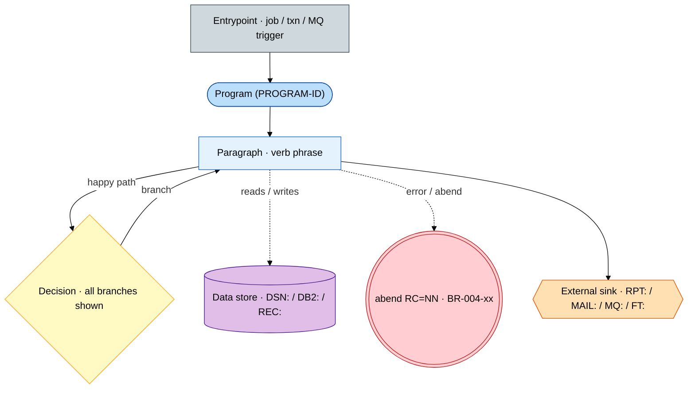
```mermaid
%%{init: {'theme': 'base', 'themeVariables': { 'edgeLabelBackground':'#ffffff' }}}%%
%% BP-004 Costing & Price Protection — call graph — Legend
flowchart TD
  classDef job  fill:#cfd8dc,stroke:#37474f,color:#000;
  classDef prog fill:#bbdefb,stroke:#0d47a1,color:#000;
  classDef para fill:#e3f2fd,stroke:#1565c0,color:#000;
  classDef data fill:#e1bee7,stroke:#4a148c,color:#000;
  classDef ext  fill:#ffe0b2,stroke:#e65100,color:#000;
  classDef dec  fill:#fff9c4,stroke:#f9a825,color:#000;
  classDef err  fill:#ffcdd2,stroke:#b71c1c,color:#000;
  L_job["Entrypoint · job / txn / MQ trigger"]:::job
  L_prog(["Program (PROGRAM-ID)"]):::prog
  L_para["Paragraph · verb phrase"]:::para
  L_data[("Data store · DSN: / DB2: / REC:")]:::data
  L_ext{{"External sink · RPT: / MAIL: / MQ: / FT:"}}:::ext
  L_dec{"Decision · all branches shown"}:::dec
  L_err((("abend RC=NN · BR-004-xx"))):::err
  L_job --> L_prog
  L_prog --> L_para
  L_para -- "happy path" --> L_dec
  L_dec -- "branch" --> L_para
  L_para -. "reads / writes" .-> L_data
  L_para -. "error / abend" .-> L_err
  L_para --> L_ext
```
---

## 2. System context

The cross-anchor view: scheduler-driven batch and MQ-triggered online flows converge on the **cost** stores (`DE9E`/`DE6E`/`DE8E`, CAD VSAM, `IC1X`) and the **Price-Protection** cluster (`PP_*`, `ST3B`), governed by the shared configuration backbone (`AP1P`/`AP1S`). Outbound interfaces are report/email distribution, managed file transfer (Cognos/BI), and the **Quasar** price-change feed.

<!-- mmd:BP-004-context-call-graph -->

```mermaid
%%{init: {'theme': 'base', 'themeVariables': { 'edgeLabelBackground':'#ffffff' }}}%%
%% BP-004 Costing & Price Protection — call graph — System context
flowchart TD
  classDef job  fill:#cfd8dc,stroke:#37474f,color:#000;
  classDef prog fill:#bbdefb,stroke:#0d47a1,color:#000;
  classDef data fill:#e1bee7,stroke:#4a148c,color:#000;
  classDef ext  fill:#ffe0b2,stroke:#e65100,color:#000;
  classDef dec  fill:#fff9c4,stroke:#f9a825,color:#000;

  SCHED["scheduler / operator<br/>· batch"]:::job
  MQPROD["MCCST40 cost-change publisher<br/>MQPUT IC1X / CADMF · event"]:::job
  MQ_IC1X["MQ:&lt;DIV&gt;.QCOST01.CHG.IC1X"]:::ext
  MQ_CADMF["MQ:&lt;DIV&gt;.QCOST01.CHG.CADMF"]:::ext

  subgraph COST ["Costing (batch A/A′ + online B)"]
    A_VAL(["MCCAD65J → XXCAD63/64/65"]):::prog
    A_EXT(["MCCST24J → MCCST24"]):::prog
    A_CYC(["MCCST50/62/63/70/96J · XXCST*/DSCST96"]):::prog
    B_DISP(["MCCST55 → MCCST50 (MCS4) / MCCST51 (MCS5)"]):::prog
  end
  subgraph PP ["Price Protection (C/D/E/F)"]
    C_MAIN(["MCRPR50J → XXRPR50..54/57"]):::prog
    D_ALL(["MCRPR71J / MCRPR74J → XXRPR70-75/78"]):::prog
    E_MOD(["MCRPR55J/85J → XXRPR55/85"]):::prog
    F_LIFE(["MCRPR56/58/59/65/77/86/99J"]):::prog
  end
  subgraph CIG ["Cigarette (G deals / H cost) + integrity (I)"]
    G_DEAL(["MCCBT00/06/07/08 · pending deals"]):::prog
    H_CIC(["MCCIC01/20/90 · cig cost"]):::prog
    I_M9(["MCM9014/9091 · reconciliation"]):::prog
  end

  DB_CFG[("DB2: AP1P / AP1S config (HS-007)")]:::data
  DB_COST[("DB2: DE9E / DE6E / DE8E item cost")]:::data
  DS_CAD[("DSN: &lt;DIV&gt;.MSTR.CAD VSAM")]:::data
  DB_IC1X[("DB2: INVCOSTIC1X (IC1X)")]:::data
  DB_PP[("DB2: PP_* cluster + ST3B + STAT_PP9S")]:::data
  DB_DEAL[("DB2: PENDINGDEALSDM3P / DM3* deal")]:::data
  DB_CIG[("DB2: CIG_ITEM_COST_PR1C / DI3X")]:::data

  X_QUASAR{{"FT: Quasar price-change feed (&lt;DIV&gt;.PERM.&lt;DIV&gt;ST2A.PP)"}}:::ext
  X_COGNOS{{"FT: Cognos / BI (MQ FTE)"}}:::ext
  X_MAIL{{"MAIL: XMITIP distributions"}}:::ext
  X_RPT{{"RPT: INFOPAC / Page Center reports"}}:::ext
  X_BP002{{"BP-002 D8050 deal-capture poll"}}:::ext

  SCHED --> A_VAL & A_EXT & A_CYC & C_MAIN & D_ALL & E_MOD & F_LIFE & G_DEAL & H_CIC & I_M9
  MQPROD -. "publishes" .-> MQ_IC1X & MQ_CADMF
  MQ_IC1X -. "triggers" .-> B_DISP
  MQ_CADMF -. "triggers" .-> B_DISP

  A_VAL -. "reads/writes" .-> DB_COST
  A_VAL -. "reads" .-> DS_CAD
  A_EXT -. "reads cost; checkpoint" .-> DB_CFG
  A_EXT -. "FTE extract" .-> X_COGNOS
  A_EXT -. "reads" .-> DB_COST
  A_CYC -. "purge/sync" .-> DB_COST
  A_CYC -. "reports/FTE" .-> X_COGNOS
  A_CYC -. "reports" .-> X_RPT
  B_DISP -. "writes" .-> DB_IC1X
  B_DISP -. "writes" .-> DS_CAD
  B_DISP -. "reads" .-> DB_COST
  B_DISP -. "error log" .-> DB_PP

  C_MAIN -. "reads/writes" .-> DB_PP
  C_MAIN -. "notify" .-> X_MAIL
  D_ALL -. "reads/writes" .-> DB_PP
  E_MOD -. "reads" .-> DB_PP
  E_MOD -. "report FTE" .-> X_COGNOS
  F_LIFE -. "reads/writes" .-> DB_PP
  F_LIFE -. "Quasar split" .-> X_QUASAR
  C_MAIN -. "config" .-> DB_CFG
  F_LIFE -. "config" .-> DB_CFG

  G_DEAL -. "reads/writes" .-> DB_DEAL
  G_DEAL -. "writes" .-> DS_CAD
  G_DEAL -. "feeds" .-> X_BP002
  G_DEAL -. "report/email" .-> X_MAIL
  H_CIC -. "reads/writes" .-> DB_CIG
  H_CIC -. "report/email" .-> X_MAIL
  I_M9 -. "detect vs" .-> DB_DEAL
  I_M9 -. "self-heal write" .-> DS_CAD
  I_M9 -. "reports" .-> X_RPT
```

**External-interface classes — present vs absent**

| Class | Direction | Present? | Where |
|---|---|---|---|
| MQ trigger (inbound) | in | ✅ | `MCCST55`/`MCCST50`/`MCCST51` `MQGET` on `<DIV>.QCOST01.CHG.{IC1X,CADMF}` (published by `MCCST40`) |
| Managed file transfer (MQ FTE) | out | ✅ | `MCCST24J`, `MCCST63J`, `MCCST96J`, `MCRPR55J`, `MCRPR85J` via `DSBPXPGM`/`BPXBATCH fteCreateTransfer` → Cognos/BI |
| Quasar price-change feed | out | ✅ | `MCRPR65J`/`XXRPR65` → `ACME.PERM.ST2A.PP` → ICETOOL split → per-division `<DIV>.PERM.<DIV>ST2A.PP` |
| Email (XMITIP) | out | ✅ | `MCCAD65J`, `MCRPR50J` (EMAIL step), `MCCBT08J`, `MCCIC90J` |
| Print / report distribution | out | ✅ | INFOPAC writers (`MCCST701-3`, `MCCIC151/201`, `MCM90141/90921`), Page Center (`MCCAD651`) |
| CICS resource definitions (RDO/CSD) | — | ❌ `[GAP]` | No `DEFINE TRANSACTION/PROGRAM` member in export; `MCS4`/`MCS5`/`MCS6` txn→program binding lives only in `MCCST55` code |
| REST/SOAP API | — | ❌ | none observed |
| Webhook (`HOOK:`) | — | ❌ | none observed |
---

## 3. Anchor A — Costing batch (validation, extract & cycles)

### 3.1 `MCCAD65J` — Cost-out-of-sync report (XXCAD63 → XXCAD64 → XXCAD65)

`MCCAD65J` runs, per division (≈33), `XXCAD63P`→`XXCAD63` (build DCS cost view from the filtered `<DIV>.MSTR.CAD` VSAM + `SIM`/`VND`) and `XXCAD64P`→`XXCAD64` (build the CBR/DB2 cost view from `DE9E`). Both per-division outputs are merge-sorted to a common key, then `XXCAD65P`→`XXCAD65` performs a synchronized merge-compare producing a discrepancy report (emailed) plus a cost-sync trigger file. All steps gate `COND=(4,LT)`.

<!-- mmd:BP-004-MCCAD65J-entry-call-graph -->
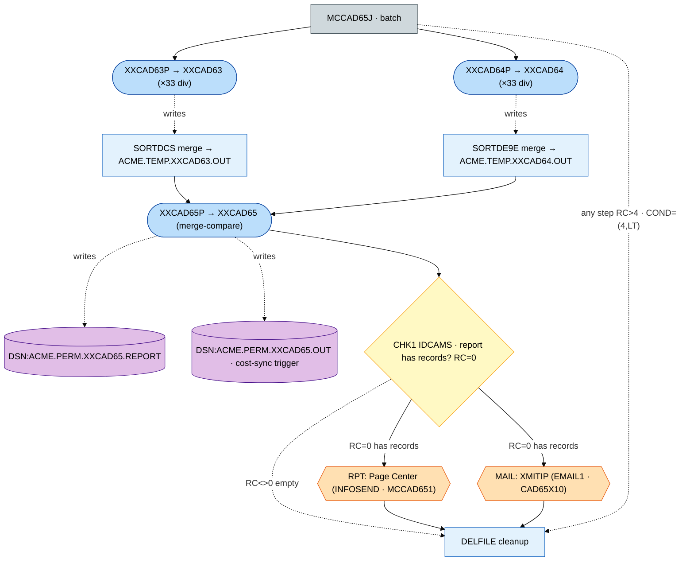
```mermaid
%%{init: {'theme': 'base', 'themeVariables': { 'edgeLabelBackground':'#ffffff' }}}%%
%% BP-004 Costing & Price Protection — call graph — MCCAD65J entrypoint orchestration
flowchart TD
  classDef job  fill:#cfd8dc,stroke:#37474f,color:#000;
  classDef prog fill:#bbdefb,stroke:#0d47a1,color:#000;
  classDef para fill:#e3f2fd,stroke:#1565c0,color:#000;
  classDef data fill:#e1bee7,stroke:#4a148c,color:#000;
  classDef ext  fill:#ffe0b2,stroke:#e65100,color:#000;
  classDef dec  fill:#fff9c4,stroke:#f9a825,color:#000;
  classDef err  fill:#ffcdd2,stroke:#b71c1c,color:#000;

  J["MCCAD65J · batch"]:::job
  P63(["XXCAD63P → XXCAD63 (×33 div)"]):::prog
  P64(["XXCAD64P → XXCAD64 (×33 div)"]):::prog
  S1["SORTDCS merge → ACME.TEMP.XXCAD63.OUT"]:::para
  S2["SORTDE9E merge → ACME.TEMP.XXCAD64.OUT"]:::para
  P65(["XXCAD65P → XXCAD65 (merge-compare)"]):::prog
  RPT[("DSN:ACME.PERM.XXCAD65.REPORT")]:::data
  OUT[("DSN:ACME.PERM.XXCAD65.OUT · cost-sync trigger")]:::data
  CHK{"CHK1 IDCAMS · report has records? RC=0"}:::dec
  PAGE{{"RPT: Page Center (INFOSEND · MCCAD651)"}}:::ext
  MAIL{{"MAIL: XMITIP (EMAIL1 · CAD65X10)"}}:::ext
  DEL["DELFILE cleanup"]:::para

  J --> P63
  J --> P64
  P63 -. "writes" .-> S1
  P64 -. "writes" .-> S2
  S1 --> P65
  S2 --> P65
  P65 -. "writes" .-> RPT
  P65 -. "writes" .-> OUT
  P65 --> CHK
  CHK -- "RC=0 has records" --> PAGE
  CHK -- "RC=0 has records" --> MAIL
  CHK -. "RC<>0 empty" .-> DEL
  PAGE --> DEL
  MAIL --> DEL
  J -. "any step RC>4 · COND=(4,LT)" .-> DEL
```

**`XXCAD63` program flow** — builds the DCS cost record per item and validates vendor/basis-code (BR-004-01..06, 10).

<!-- mmd:BP-004-XXCAD63-call-graph -->
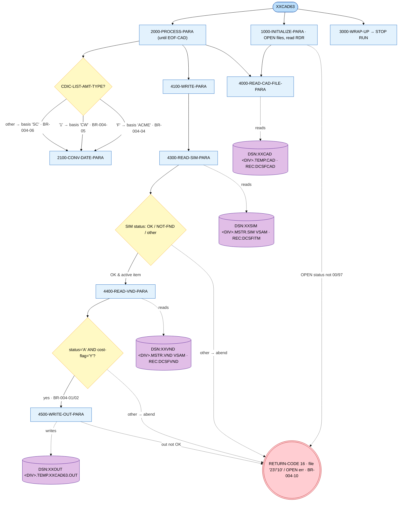
```mermaid
%%{init: {'theme': 'base', 'themeVariables': { 'edgeLabelBackground':'#ffffff' }}}%%
%% BP-004 Costing & Price Protection — call graph — XXCAD63 program flow
flowchart TD
  classDef job  fill:#cfd8dc,stroke:#37474f,color:#000;
  classDef prog fill:#bbdefb,stroke:#0d47a1,color:#000;
  classDef para fill:#e3f2fd,stroke:#1565c0,color:#000;
  classDef data fill:#e1bee7,stroke:#4a148c,color:#000;
  classDef ext  fill:#ffe0b2,stroke:#e65100,color:#000;
  classDef dec  fill:#fff9c4,stroke:#f9a825,color:#000;
  classDef err  fill:#ffcdd2,stroke:#b71c1c,color:#000;

  PG(["XXCAD63"]):::prog
  INIT["1000-INITIALIZE-PARA · OPEN files, read RDR"]:::para
  RCAD["4000-READ-CAD-FILE-PARA"]:::para
  PROC["2000-PROCESS-PARA (until EOF-CAD)"]:::para
  KAMT{"CDIC-LIST-AMT-TYPE?"}:::dec
  CONV["2100-CONV-DATE-PARA"]:::para
  WRITE["4100-WRITE-PARA"]:::para
  RSIM["4300-READ-SIM-PARA"]:::para
  KSIM{"SIM status: OK / NOT-FND / other"}:::dec
  RVND["4400-READ-VND-PARA"]:::para
  KVND{"status='A' AND cost-flag='Y'?"}:::dec
  WOUT["4500-WRITE-OUT-PARA"]:::para
  WRAP["3000-WRAP-UP → STOP RUN"]:::para
  D_CAD[("DSN:XXCAD &lt;DIV&gt;.TEMP.CAD · REC:DCSFCAD")]:::data
  D_SIM[("DSN:XXSIM &lt;DIV&gt;.MSTR.SIM VSAM · REC:DCSFITM")]:::data
  D_VND[("DSN:XXVND &lt;DIV&gt;.MSTR.VND VSAM · REC:DCSFVND")]:::data
  D_OUT[("DSN:XXOUT &lt;DIV&gt;.TEMP.XXCAD63.OUT")]:::data
  ERR((("RETURN-CODE 16 · file '23'/'10' / OPEN err · BR-004-10"))):::err

  PG --> INIT
  INIT -. "OPEN status not 00/97" .-> ERR
  INIT --> RCAD
  RCAD -. "reads" .-> D_CAD
  PG --> PROC
  PROC --> KAMT
  KAMT -- "'F' → basis 'ACME' · BR-004-04" --> CONV
  KAMT -- "'1' → basis 'CW' · BR-004-05" --> CONV
  KAMT -- "other → basis 'SC' · BR-004-06" --> CONV
  PROC --> WRITE
  PROC --> RCAD
  WRITE --> RSIM
  RSIM -. "reads" .-> D_SIM
  RSIM --> KSIM
  KSIM -- "OK & active item" --> RVND
  KSIM -. "other → abend" .-> ERR
  RVND -. "reads" .-> D_VND
  RVND --> KVND
  KVND -- "yes · BR-004-01/02" --> WOUT
  KVND -. "other → abend" .-> ERR
  WOUT -. "writes" .-> D_OUT
  WOUT -. "out not OK" .-> ERR
  PG --> WRAP
```

**`XXCAD65` program flow** — synchronized merge-compare of the DCS vs CBR cost files; emits discrepancy lines (BR-004-07/08/09) and the cost-sync trigger.

<!-- mmd:BP-004-XXCAD65-call-graph -->
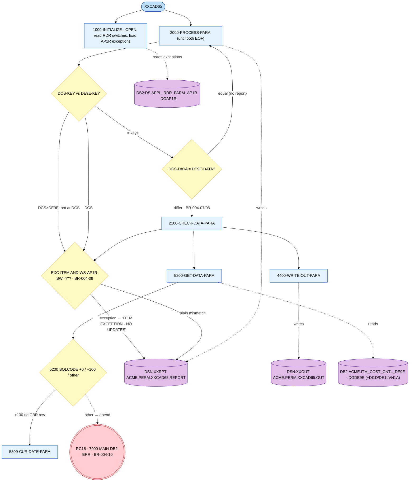
```mermaid
%%{init: {'theme': 'base', 'themeVariables': { 'edgeLabelBackground':'#ffffff' }}}%%
%% BP-004 Costing & Price Protection — call graph — XXCAD65 program flow
flowchart TD
  classDef job  fill:#cfd8dc,stroke:#37474f,color:#000;
  classDef prog fill:#bbdefb,stroke:#0d47a1,color:#000;
  classDef para fill:#e3f2fd,stroke:#1565c0,color:#000;
  classDef data fill:#e1bee7,stroke:#4a148c,color:#000;
  classDef ext  fill:#ffe0b2,stroke:#e65100,color:#000;
  classDef dec  fill:#fff9c4,stroke:#f9a825,color:#000;
  classDef err  fill:#ffcdd2,stroke:#b71c1c,color:#000;

  PG(["XXCAD65"]):::prog
  INIT["1000-INITIALIZE · OPEN, read RDR switches, load AP1R exceptions"]:::para
  PROC["2000-PROCESS-PARA (until both EOF)"]:::para
  KKEY{"DCS-KEY vs DE9E-KEY"}:::dec
  KDATA{"DCS-DATA = DE9E-DATA?"}:::dec
  CHK["2100-CHECK-DATA-PARA"]:::para
  KEXC{"EXC-ITEM AND WS-AP1R-SW='Y'? · BR-004-09"}:::dec
  GDAT["5200-GET-DATA-PARA"]:::para
  KSQL{"5200 SQLCODE +0 / +100 / other"}:::dec
  CDAT["5300-CUR-DATE-PARA"]:::para
  WOUT["4400-WRITE-OUT-PARA"]:::para
  RPT[("DSN:XXRPT ACME.PERM.XXCAD65.REPORT")]:::data
  OUT[("DSN:XXOUT ACME.PERM.XXCAD65.OUT")]:::data
  DB9E[("DB2:ACME.ITM_COST_CNTL_DE9E · DGDE9E (+DI1D/DE1I/VN1A)")]:::data
  DBAP1R[("DB2:DS.APPL_RDR_PARM_AP1R · DGAP1R")]:::data
  ERR((("RC16 · 7000-MAIN-DB2-ERR · BR-004-10"))):::err

  PG --> INIT
  INIT -. "reads exceptions" .-> DBAP1R
  PG --> PROC
  PROC --> KKEY
  KKEY -- "= keys" --> KDATA
  KDATA -- "equal (no report)" --> PROC
  KDATA -- "differ · BR-004-07/08" --> CHK
  KKEY -- "DCS>DE9E: not at DCS" --> KEXC
  KKEY -- "DCS<DE9E: not at CBR" --> KEXC
  KEXC -- "exception → 'ITEM EXCEPTION - NO UPDATES'" --> RPT
  KEXC -- "plain mismatch" --> RPT
  CHK --> KEXC
  CHK --> GDAT
  GDAT -. "reads" .-> DB9E
  GDAT --> KSQL
  KSQL -- "+100 no CBR row" --> CDAT
  KSQL -. "other → abend" .-> ERR
  CHK --> WOUT
  WOUT -. "writes" .-> OUT
  PROC -. "writes" .-> RPT
```

### 3.2 `MCCST24J` — Future-cost-change extract (checkpointed)

<!-- mmd:BP-004-MCCST24J-entry-call-graph -->
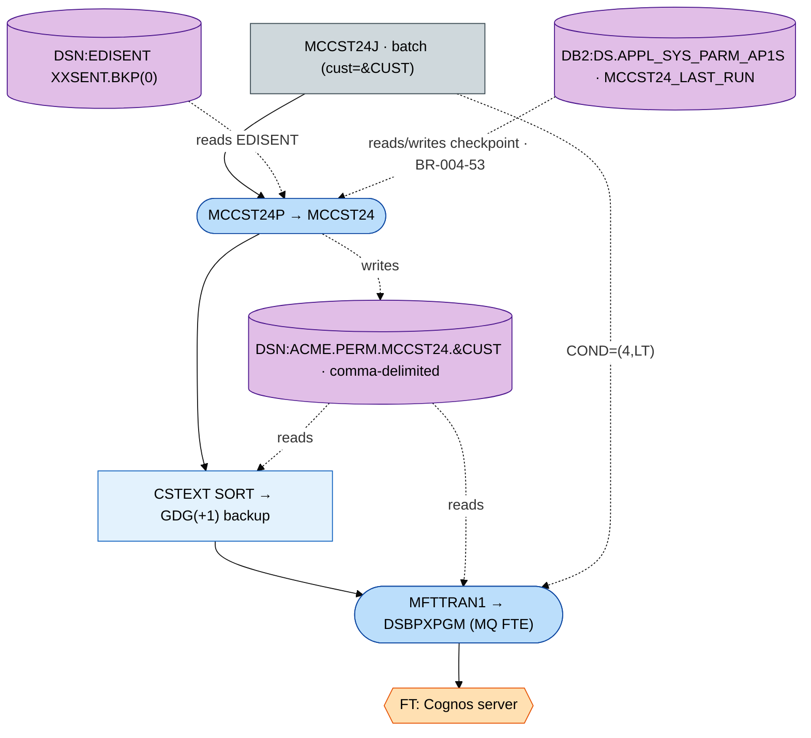
```mermaid
%%{init: {'theme': 'base', 'themeVariables': { 'edgeLabelBackground':'#ffffff' }}}%%
%% BP-004 Costing & Price Protection — call graph — MCCST24J entrypoint orchestration
flowchart TD
  classDef job  fill:#cfd8dc,stroke:#37474f,color:#000;
  classDef prog fill:#bbdefb,stroke:#0d47a1,color:#000;
  classDef para fill:#e3f2fd,stroke:#1565c0,color:#000;
  classDef data fill:#e1bee7,stroke:#4a148c,color:#000;
  classDef ext  fill:#ffe0b2,stroke:#e65100,color:#000;
  classDef dec  fill:#fff9c4,stroke:#f9a825,color:#000;

  J["MCCST24J · batch (cust=&amp;CUST)"]:::job
  P(["MCCST24P → MCCST24"]):::prog
  CST["CSTEXT SORT → GDG(+1) backup"]:::para
  FTE(["MFTTRAN1 → DSBPXPGM (MQ FTE)"]):::prog
  EDI[("DSN:EDISENT XXSENT.BKP(0)")]:::data
  EXT[("DSN:ACME.PERM.MCCST24.&amp;CUST · comma-delimited")]:::data
  AP1S[("DB2:DS.APPL_SYS_PARM_AP1S · MCCST24_LAST_RUN")]:::data
  COG{{"FT: Cognos server"}}:::ext

  J --> P
  EDI -. "reads EDISENT" .-> P
  AP1S -. "reads/writes checkpoint · BR-004-53" .-> P
  P -. "writes" .-> EXT
  P --> CST
  EXT -. "reads" .-> CST
  CST --> FTE
  EXT -. "reads" .-> FTE
  FTE --> COG
  J -. "COND=(4,LT)" .-> FTE
```

**`MCCST24` program flow** — the checkpoint (BR-004-53) brackets the run: read `MCCST24_LAST_RUN` from `AP1S` to derive the filter window, stage `EDISENT` rows into temp table `T356`, drive the future-cost cursor, write the comma extract, then update `MCCST24_LAST_RUN`.

<!-- mmd:BP-004-MCCST24-call-graph -->
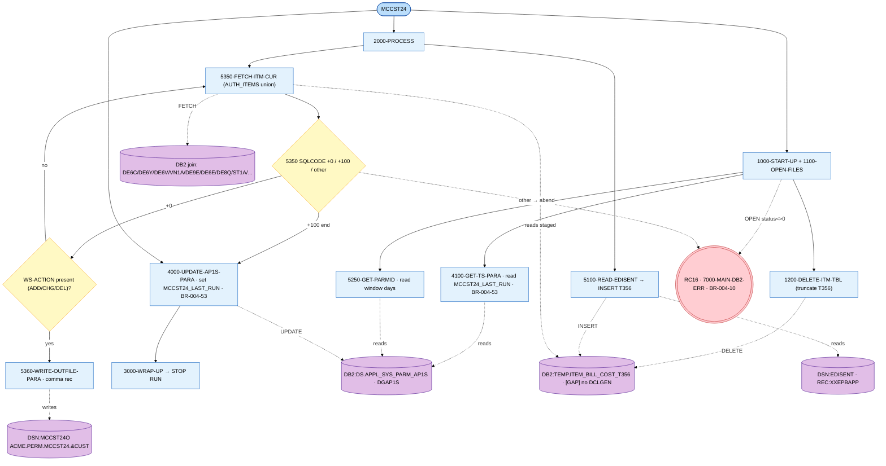
```mermaid
%%{init: {'theme': 'base', 'themeVariables': { 'edgeLabelBackground':'#ffffff' }}}%%
%% BP-004 Costing & Price Protection — call graph — MCCST24 program flow
flowchart TD
  classDef job  fill:#cfd8dc,stroke:#37474f,color:#000;
  classDef prog fill:#bbdefb,stroke:#0d47a1,color:#000;
  classDef para fill:#e3f2fd,stroke:#1565c0,color:#000;
  classDef data fill:#e1bee7,stroke:#4a148c,color:#000;
  classDef ext  fill:#ffe0b2,stroke:#e65100,color:#000;
  classDef dec  fill:#fff9c4,stroke:#f9a825,color:#000;
  classDef err  fill:#ffcdd2,stroke:#b71c1c,color:#000;

  PG(["MCCST24"]):::prog
  START["1000-START-UP + 1100-OPEN-FILES"]:::para
  GTS["4100-GET-TS-PARA · read MCCST24_LAST_RUN · BR-004-53"]:::para
  PARM["5250-GET-PARMID · read window days"]:::para
  DEL["1200-DELETE-ITM-TBL (truncate T356)"]:::para
  PROC["2000-PROCESS"]:::para
  REDI["5100-READ-EDISENT → INSERT T356"]:::para
  FCUR["5350-FETCH-ITM-CUR (AUTH_ITEMS union)"]:::para
  KF{"5350 SQLCODE +0 / +100 / other"}:::dec
  KACT{"WS-ACTION present (ADD/CHG/DEL)?"}:::dec
  WOUT["5360-WRITE-OUTFILE-PARA · comma rec"]:::para
  UPD["4000-UPDATE-AP1S-PARA · set MCCST24_LAST_RUN · BR-004-53"]:::para
  WRAP["3000-WRAP-UP → STOP RUN"]:::para
  AP1S[("DB2:DS.APPL_SYS_PARM_AP1S · DGAP1S")]:::data
  T356[("DB2:TEMP.ITEM_BILL_COST_T356 · [GAP] no DCLGEN")]:::data
  EDI[("DSN:EDISENT · REC:XXEPBAPP")]:::data
  OUT[("DSN:MCCST24O ACME.PERM.MCCST24.&amp;CUST")]:::data
  ITM[("DB2 join: DE6C/DE6Y/DE6V/VN1A/DE9E/DE6E/DE8Q/ST1A/...")]:::data
  ERR((("RC16 · 7000-MAIN-DB2-ERR · BR-004-10"))):::err

  PG --> START
  START -. "OPEN status<>0" .-> ERR
  START --> GTS
  GTS -. "reads" .-> AP1S
  START --> PARM
  PARM -. "reads" .-> AP1S
  START --> DEL
  DEL -. "DELETE" .-> T356
  PG --> PROC
  PROC --> REDI
  REDI -. "reads" .-> EDI
  REDI -. "INSERT" .-> T356
  PROC --> FCUR
  FCUR -. "FETCH" .-> ITM
  FCUR -. "reads staged" .-> T356
  FCUR --> KF
  KF -- "+0" --> KACT
  KACT -- "yes" --> WOUT
  KACT -- "no" --> FCUR
  KF -- "+100 end" --> UPD
  KF -. "other → abend" .-> ERR
  WOUT -. "writes" .-> OUT
  PG --> UPD
  UPD -. "UPDATE" .-> AP1S
  UPD --> WRAP
```

### 3.3 Other costing cycles (`MCCST50J`/`62J`/`63J`/`70J`/`96J`, `XXCST64J`/`SWCST64J`)

These six batch jobs are the cost-table writers and reporters of the costing domain. Note the batch `MCCST50J` runs **`XXCST50`** (a pallet/component cost-exception report) — distinct from the CICS program `MCCST50` (anchor B). `MCCST70J` runs an **ordered purge trio** (`XXCST70`→`71`→`72` over DE9E+DE9A / DE8E / DE6E); `XXCST62` is a notable writer (DELETE+INSERT DE9E, DELETE DE8E/DE6E); `DSCST96` is the sole `DE6C` gratis-factor updater; `XXCST64` removes non-first/non-last duplicate `DE8E` cost rows.

<!-- mmd:BP-004-costing-cycles-entry-call-graph -->

```mermaid
%%{init: {'theme': 'base', 'themeVariables': { 'edgeLabelBackground':'#ffffff' }}}%%
%% BP-004 Costing & Price Protection — call graph — Other costing-cycle jobs orchestration
flowchart TD
  classDef job  fill:#cfd8dc,stroke:#37474f,color:#000;
  classDef prog fill:#bbdefb,stroke:#0d47a1,color:#000;
  classDef para fill:#e3f2fd,stroke:#1565c0,color:#000;
  classDef data fill:#e1bee7,stroke:#4a148c,color:#000;
  classDef ext  fill:#ffe0b2,stroke:#e65100,color:#000;
  classDef dec  fill:#fff9c4,stroke:#f9a825,color:#000;
  classDef err  fill:#ffcdd2,stroke:#b71c1c,color:#000;

  J50["MCCST50J"]:::job --> P50(["XXCST50 · cost-exception report"]):::prog
  J62["MCCST62J"]:::job --> P62(["XXCST62 · World→CC cost sync"]):::prog
  J63["MCCST63J"]:::job --> P63(["XXCST63 · BI cost-diff extract"]):::prog
  J70["MCCST70J"]:::job --> P70(["XXCST70→XXCST71→XXCST72 · purge trio"]):::prog
  J96["MCCST96J"]:::job --> P96(["DSCST96 · gratis-factor update"]):::prog
  J64["XXCST64J / SWCST64J"]:::job --> P64(["XXCST64 ×2 · DE8E dedup"]):::prog

  DB9E[("DB2:DE9E (+audit DE9A)")]:::data
  DB8E[("DB2:DE8E")]:::data
  DB6E[("DB2:DE6E")]:::data
  DB6C[("DB2:UIN_ITEM_DE6C")]:::data
  AP1S[("DB2:AP1S purge/commit parms")]:::data
  RPT{{"RPT: INFOPAC MCCST701/702/703, MCCST621"}}:::ext
  COG{{"FT: Cognos / BI (MCCST63J, MCCST96J)"}}:::ext
  MAIL{{"MAIL: XMITIP (MCCST50J)"}}:::ext

  P50 -. "reads cost/deal; exception CSV" .-> DB6E
  P50 -. "FTE + mail" .-> COG
  P50 -. "mail" .-> MAIL
  P62 -. "DELETE+INSERT" .-> DB9E
  P62 -. "DELETE" .-> DB8E
  P62 -. "DELETE" .-> DB6E
  P62 -. "writes" .-> RPT
  P63 -. "reads cost" .-> DB6E
  P63 -. "FTE" .-> COG
  AP1S -. "commit/year" .-> P70
  P70 -. "DELETE aged" .-> DB9E
  P70 -. "DELETE aged" .-> DB8E
  P70 -. "DELETE aged" .-> DB6E
  P70 -. "writes" .-> RPT
  P96 -. "UPDATE gratis" .-> DB6C
  P96 -. "GDG + FTE" .-> COG
  P64 -. "DELETE dup cost" .-> DB8E
```

**Resource wiring & DB2 access — Anchor A programs** (DD → dataset / table, access, copybook):

| Program | DD / interface | Dataset / DB2 table | Access | Copybook / DCLGEN |
|---|---|---|---|---|
| XXCAD63 | XXCAD / XXSIM / XXVND / XXOUT | `<DIV>.TEMP.CAD` / `.MSTR.SIM` (VSAM) / `.MSTR.VND` (VSAM) / `.TEMP.XXCAD63.OUT` | IN/IN/IN/OUT | DCSFCAD / DCSFITM / DCSFVND / XXCAD65C |
| XXCAD64 | DE9E_CSR | `DB2:ITM_COST_CNTL_DE9E` (+DI1D, DE1I, VN1A) | cursor SELECT | DGDE9E/DGDI1D/DGDE1I/DGVN1A |
| XXCAD65 | XXCAD / XXDE9E / XXRPT / XXOUT; AP1R_CSR; 5200 | merged DCS/CBR seq; report; sync-trigger; `DB2:DS.APPL_RDR_PARM_AP1R`; `DB2:DE9E` | IN/IN/OUT/OUT; cursor; SELECT | XXCAD65C / DGAP1R / DGDE9E |
| MCCST24 | EDISENT / MCCST24O; 4100,4000,5250; 1200,5100,5350 | `XXSENT.BKP(0)`; `ACME.PERM.MCCST24.&CUST`; `DB2:AP1S`; `DB2:TEMP.T356` `[GAP]`; cursor over DE6C/DE6Y/DE6V/VN1A/VN1X/VN4B/DE9A/DE9E/DE8Q/DE6E/ST1A/CU2E/DI1D | IN/OUT; SEL/UPD; DEL/INS/cursor | XXEPBAPP / MCCST24C / DGAP1S / (T356 ungrounded) |
| XXCST50 | XXEXCP; DIV/DEAL/MAIN cursors | `ACME.PERM.XXCST50.EXCP.REPORT.CSV`; `DB2:DEALDM1X`, `AP1D` `[GAP]`, `PALLET_ITEM_DE6D` `[GAP]`, DE6E/DE6C/DE1I; `TEMP.DIV_ITEM_T329` | OUT; SELECT | (DGDM1X; DGAP1D/DGDE6D absent) |
| XXCST62 | DI3X/CURR/WORLD cursors | `DB2:DE9E` (SEL+DEL+INS), `DE8E` (DEL), `DE6E` (DEL), DI3X/DE1I/DI1D | cursor/DML | DGDE9E/DGDE8E/DGDE6E/DGDI3X |
| XXCST63 | COST-CUR; OUTFILE | `DB2:AP1R/DI1D/DI3X/DE1I/DE6E/DE6C/DE6V/VN1A/VN2Y`; `DS.PERM.CST63S1.EXTRACT` | SELECT; OUT | DGAP1R/DGDE6E/... |
| XXCST70/71/72 | DE9E-DEL / DE8E-DEL / DE6E-DEL rowset cursors | `DB2:DE9E`+`DE9A`(DEL) / `DE8E`(DEL) / `DE6E`(DEL); `AP1S` (COST_PURGE_*) | cursor + DELETE | DGDE9E/DGDE9A/DGDE8E/DGDE6E/DGAP1S |
| DSCST96 | OTP_CUR; OUTFILE | `DB2:DE6C`(SEL+UPD GRATIS_FCTOR), DI3X/DE1E/DE2G/DE6E/DE6V/VN1A/DE1I/AP1S; `ACME.PERM.DSCST96.GRATFACT` | cursor/UPD; OUT | DGDE6C/DGDE1E/... |
| XXCST64 | COST-CSR | `DB2:DE8E` (SEL+DELETE dup), DI1D | cursor + DELETE | DGDE8E/DGDI1D |

**Realized rules:** BR-004-01 (`XXCAD63.4400` `VNKY-RECORD-STATUS-CODE='A'`), BR-004-02 (`VNRT-COST-CONTROL-FLAG='Y'`), BR-004-03/04/05/06 (`XXCAD63.2000` cur/fut switch + `CDIC-LIST-AMT-TYPE` EVALUATE → ACME/CW/SC), BR-004-07/08 (`XXCAD65.2100` eff-date/cost-amount discrepancy; also `MCCST24` ADD/CHG/DEL), BR-004-09 (`XXCAD65.2100` exception items via `AP1R_CSR`), BR-004-10 (RC16 abend on file status '23'/'10' / SQL error across all programs), BR-004-53 (`MCCST24` checkpoint read/write `MCCST24_LAST_RUN` in `AP1S`).
---

## 4. Anchor B — CICS / MQ online cost (`MCCST55` → `MCCST50` / `MCCST51`)

Cost-change messages are published by **`MCCST40`** (`MQPUT` to `<DIV>.QCOST01.CHG.IC1X` always, and `…CADMF` for cost-controlled items; subsystem `MQTA` for DB2T / `MQPA` for DB2P — BR-004-69). The MQ-triggered dispatcher **`MCCST55`** routes by `COMM-Q-TYPE` and CICS-`START`s the target transaction (BR-004-60..63). **`MCCST50`** (TXN `MCS4`) drains the `IC1X` queue and maintains the `INVCOSTIC1X` DB2 cost table; **`MCCST51`** (TXN `MCS5`) drains `CADMF` and maintains the **CAD VSAM** master. No CICS RDO/CSD member exists in the export, so the `MCS4`/`MCS5`/`MCS6` txn→program bindings are grounded only in `MCCST55` code (`[GAP]`).

<!-- mmd:BP-004-online-dispatch-entry-call-graph -->
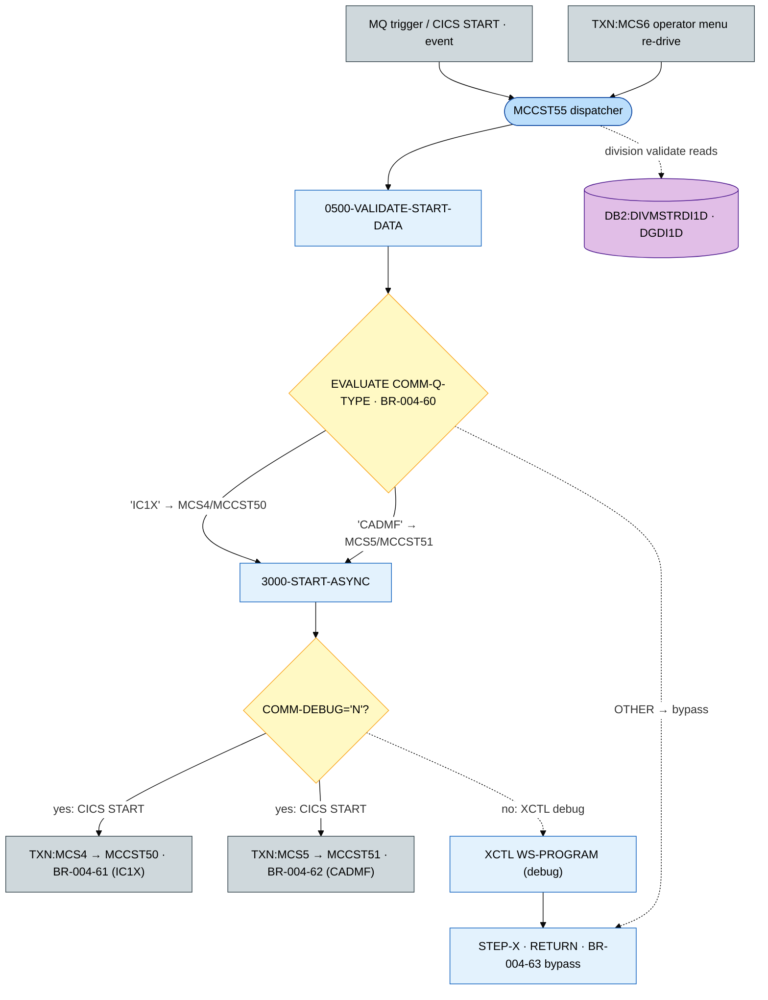
```mermaid
%%{init: {'theme': 'base', 'themeVariables': { 'edgeLabelBackground':'#ffffff' }}}%%
%% BP-004 Costing & Price Protection — call graph — Online MQ dispatch (MCCST55) orchestration
flowchart TD
  classDef job  fill:#cfd8dc,stroke:#37474f,color:#000;
  classDef prog fill:#bbdefb,stroke:#0d47a1,color:#000;
  classDef para fill:#e3f2fd,stroke:#1565c0,color:#000;
  classDef data fill:#e1bee7,stroke:#4a148c,color:#000;
  classDef ext  fill:#ffe0b2,stroke:#e65100,color:#000;
  classDef dec  fill:#fff9c4,stroke:#f9a825,color:#000;
  classDef err  fill:#ffcdd2,stroke:#b71c1c,color:#000;

  TRIG["MQ trigger / CICS START · event"]:::job
  MENU["TXN:MCS6 operator menu re-drive"]:::job
  P55(["MCCST55 dispatcher"]):::prog
  V0500["0500-VALIDATE-START-DATA"]:::para
  QTYPE{"EVALUATE COMM-Q-TYPE · BR-004-60"}:::dec
  ASYNC["3000-START-ASYNC"]:::para
  DEBUG{"COMM-DEBUG='N'?"}:::dec
  T4["TXN:MCS4 → MCCST50 · BR-004-61 (IC1X)"]:::job
  T5["TXN:MCS5 → MCCST51 · BR-004-62 (CADMF)"]:::job
  XCTL["XCTL WS-PROGRAM (debug)"]:::para
  STEPX["STEP-X · RETURN · BR-004-63 bypass"]:::para
  DI1D[("DB2:DIVMSTRDI1D · DGDI1D")]:::data

  TRIG --> P55
  MENU --> P55
  P55 --> V0500
  V0500 --> QTYPE
  QTYPE -- "'IC1X' → MCS4/MCCST50" --> ASYNC
  QTYPE -- "'CADMF' → MCS5/MCCST51" --> ASYNC
  QTYPE -. "OTHER → bypass" .-> STEPX
  P55 -. "division validate reads" .-> DI1D
  ASYNC --> DEBUG
  DEBUG -- "yes: CICS START" --> T4
  DEBUG -- "yes: CICS START" --> T5
  DEBUG -. "no: XCTL debug" .-> XCTL
  XCTL --> STEPX
```

**`MCCST55` program flow** (pseudo-conversational dispatcher).

<!-- mmd:BP-004-MCCST55-call-graph -->
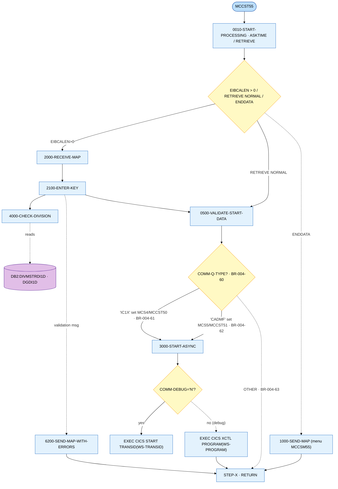
```mermaid
%%{init: {'theme': 'base', 'themeVariables': { 'edgeLabelBackground':'#ffffff' }}}%%
%% BP-004 Costing & Price Protection — call graph — MCCST55 program flow
flowchart TD
  classDef job  fill:#cfd8dc,stroke:#37474f,color:#000;
  classDef prog fill:#bbdefb,stroke:#0d47a1,color:#000;
  classDef para fill:#e3f2fd,stroke:#1565c0,color:#000;
  classDef data fill:#e1bee7,stroke:#4a148c,color:#000;
  classDef ext  fill:#ffe0b2,stroke:#e65100,color:#000;
  classDef dec  fill:#fff9c4,stroke:#f9a825,color:#000;
  classDef err  fill:#ffcdd2,stroke:#b71c1c,color:#000;

  PG(["MCCST55"]):::prog
  P0010["0010-START-PROCESSING · ASKTIME / RETRIEVE"]:::para
  KCAL{"EIBCALEN &gt; 0 / RETRIEVE NORMAL / ENDDATA"}:::dec
  P2000["2000-RECEIVE-MAP"]:::para
  P2100["2100-ENTER-KEY"]:::para
  P4000["4000-CHECK-DIVISION"]:::para
  DI1D[("DB2:DIVMSTRDI1D · DGDI1D")]:::data
  P1000["1000-SEND-MAP (menu MCCSM55)"]:::para
  P0500["0500-VALIDATE-START-DATA"]:::para
  KQ{"COMM-Q-TYPE? · BR-004-60"}:::dec
  P3000["3000-START-ASYNC"]:::para
  KDBG{"COMM-DEBUG='N'?"}:::dec
  STARTT["EXEC CICS START TRANSID(WS-TRANSID)"]:::para
  XCTL["EXEC CICS XCTL PROGRAM(WS-PROGRAM)"]:::para
  P6200["6200-SEND-MAP-WITH-ERRORS"]:::para
  STEPX["STEP-X · RETURN"]:::para

  PG --> P0010 --> KCAL
  KCAL -- "EIBCALEN>0" --> P2000
  KCAL -- "RETRIEVE NORMAL" --> P0500
  KCAL -. "ENDDATA" .-> P1000
  P2000 --> P2100 --> P4000
  P4000 -. "reads" .-> DI1D
  P2100 -. "validation msg" .-> P6200
  P2100 --> P0500
  P0500 --> KQ
  KQ -- "'IC1X' set MCS4/MCCST50 · BR-004-61" --> P3000
  KQ -- "'CADMF' set MCS5/MCCST51 · BR-004-62" --> P3000
  KQ -. "OTHER · BR-004-63" .-> STEPX
  P3000 --> KDBG
  KDBG -- "yes" --> STARTT
  KDBG -. "no (debug)" .-> XCTL
  XCTL --> STEPX
  P1000 --> STEPX
  P6200 --> STEPX
```

**`MCCST50` program flow** (TXN `MCS4`; drains the `IC1X` queue, builds/inserts `INVCOSTIC1X` cost records). Mandatory `DE9E`/`DE6E` verification (BR-004-65), retry cap (BR-004-67), dual error-logging (BR-004-68 analog).

<!-- mmd:BP-004-MCCST50-call-graph -->
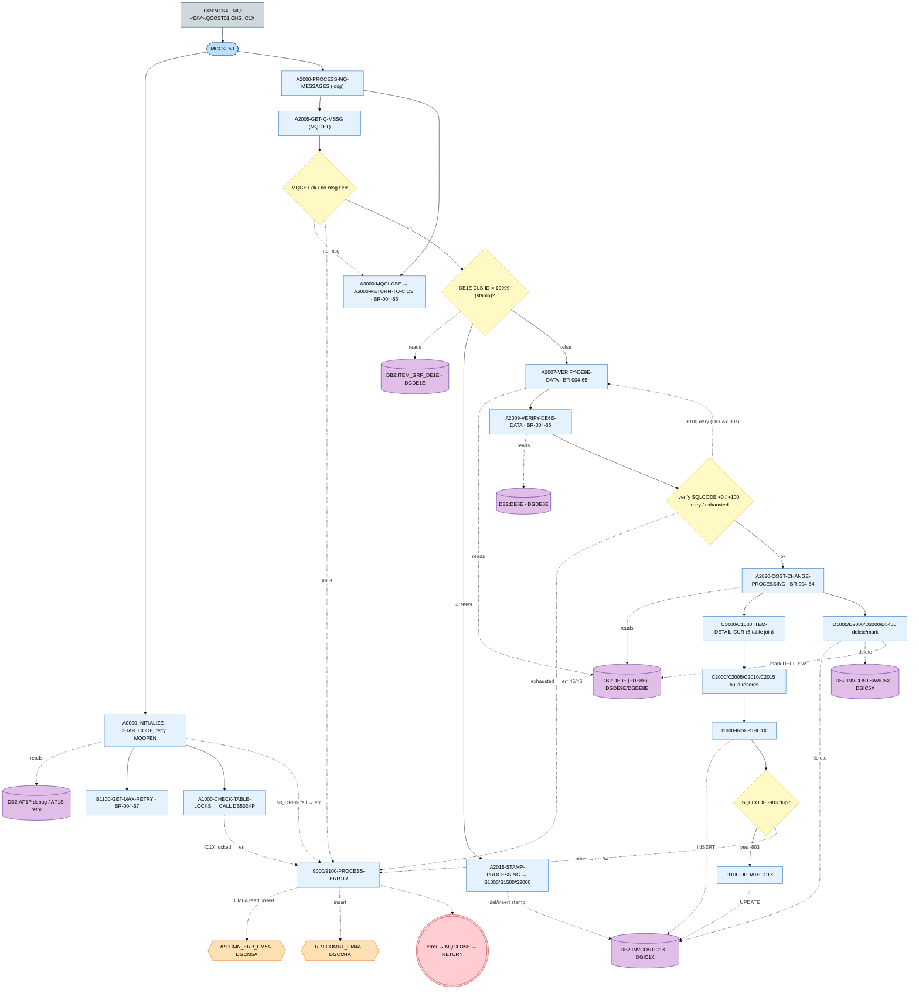
```mermaid
%%{init: {'theme': 'base', 'themeVariables': { 'edgeLabelBackground':'#ffffff' }}}%%
%% BP-004 Costing & Price Protection — call graph — MCCST50 program flow (TXN MCS4)
flowchart TD
  classDef job  fill:#cfd8dc,stroke:#37474f,color:#000;
  classDef prog fill:#bbdefb,stroke:#0d47a1,color:#000;
  classDef para fill:#e3f2fd,stroke:#1565c0,color:#000;
  classDef data fill:#e1bee7,stroke:#4a148c,color:#000;
  classDef ext  fill:#ffe0b2,stroke:#e65100,color:#000;
  classDef dec  fill:#fff9c4,stroke:#f9a825,color:#000;
  classDef err  fill:#ffcdd2,stroke:#b71c1c,color:#000;

  T4["TXN:MCS4 · MQ:&lt;DIV&gt;.QCOST01.CHG.IC1X"]:::job
  PG(["MCCST50"]):::prog
  A0000["A0000-INITIALIZE · STARTCODE, retry, MQOPEN"]:::para
  BRETRY["B1100-GET-MAX-RETRY · BR-004-67"]:::para
  LOCK["A1000-CHECK-TABLE-LOCKS → CALL DB502XP"]:::para
  A2000["A2000-PROCESS-MQ-MESSAGES (loop)"]:::para
  A2005["A2005-GET-Q-MSSG (MQGET)"]:::para
  KGET{"MQGET ok / no-msg / err"}:::dec
  KCLS{"DE1E CLS-ID = 19999 (stamp)?"}:::dec
  STAMP["A2015-STAMP-PROCESSING → S1000/S1500/S2000"]:::para
  A2007["A2007-VERIFY-DE9E-DATA · BR-004-65"]:::para
  A2009["A2009-VERIFY-DE6E-DATA · BR-004-65"]:::para
  KRTY{"verify SQLCODE +0 / +100 retry / exhausted"}:::dec
  A2020["A2020-COST-CHANGE-PROCESSING · BR-004-64"]:::para
  CUR["C1000/C1500 ITEM-DETAIL-CUR (6-table join)"]:::para
  BUILD["C2000/C2005/C2010/C2015 build records"]:::para
  INS["I1000-INSERT-IC1X"]:::para
  KDUP{"SQLCODE -803 dup?"}:::dec
  UPD["I1100-UPDATE-IC1X"]:::para
  DELS["D1000/D2000/D3000/D5400 delete/mark"]:::para
  MQCLOSE["A3000-MQCLOSE → A6000-RETURN-TO-CICS · BR-004-66"]:::para
  ERRP["9000/9100-PROCESS-ERROR"]:::para
  D_DE9E[("DB2:DE9E (+DE8E) · DGDE9E/DGDE8E")]:::data
  D_DE6E[("DB2:DE6E · DGDE6E")]:::data
  D_DE1E[("DB2:ITEM_GRP_DE1E · DGDE1E")]:::data
  D_IC1X[("DB2:INVCOSTIC1X · DGIC1X")]:::data
  D_IC5X[("DB2:INVCOSTSAVIC5X · DGIC5X")]:::data
  D_AP[("DB2:AP1P debug / AP1S retry")]:::data
  S_CM5A{{"RPT:CMN_ERR_CM5A · DGCM5A"}}:::ext
  S_CM4A{{"RPT:COMNT_CM4A · DGCM4A"}}:::ext
  ABEND((("error → MQCLOSE → RETURN"))):::err

  T4 --> PG --> A0000
  A0000 -. "reads" .-> D_AP
  A0000 --> BRETRY
  A0000 --> LOCK
  LOCK -. "IC1X locked → err" .-> ERRP
  A0000 -. "MQOPEN fail → err" .-> ERRP
  PG --> A2000 --> A2005 --> KGET
  KGET -. "no-msg" .-> MQCLOSE
  KGET -. "err 4" .-> ERRP
  KGET -- "ok" --> KCLS
  KCLS -. "reads" .-> D_DE1E
  KCLS -- "=19999" --> STAMP
  STAMP -. "del/insert stamp" .-> D_IC1X
  KCLS -- "else" --> A2007
  A2007 -. "reads" .-> D_DE9E
  A2007 --> A2009
  A2009 -. "reads" .-> D_DE6E
  A2009 --> KRTY
  KRTY -. "+100 retry (DELAY 30s)" .-> A2007
  KRTY -. "exhausted → err 45/46" .-> ERRP
  KRTY -- "ok" --> A2020
  A2020 -. "reads" .-> D_DE9E
  A2020 --> CUR --> BUILD --> INS
  INS -. "INSERT" .-> D_IC1X
  INS --> KDUP
  KDUP -- "yes -803" --> UPD
  UPD -. "UPDATE" .-> D_IC1X
  KDUP -. "other → err 34" .-> ERRP
  A2020 --> DELS
  DELS -. "delete" .-> D_IC1X
  DELS -. "delete" .-> D_IC5X
  DELS -. "mark DELT_SW" .-> D_DE9E
  A2000 --> MQCLOSE
  ERRP -. "CM6A read; insert" .-> S_CM5A
  ERRP -. "insert" .-> S_CM4A
  ERRP -.-> ABEND
```

**`MCCST51` program flow** (TXN `MCS5`; drains `CADMF`, maintains the CAD VSAM master; logs errors to **both** `CMN_ERR_CM5A` and `COMNT_CM4A` — BR-004-68).

<!-- mmd:BP-004-MCCST51-call-graph -->
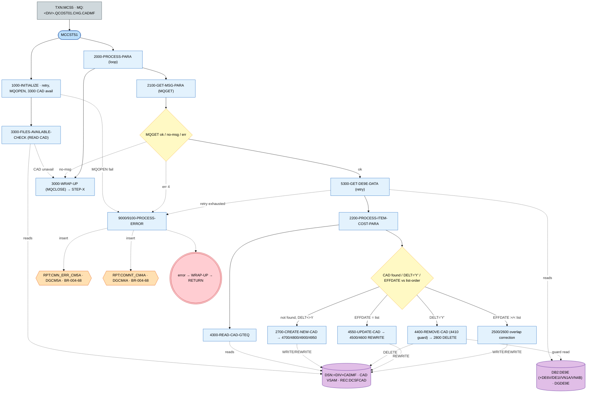
```mermaid
%%{init: {'theme': 'base', 'themeVariables': { 'edgeLabelBackground':'#ffffff' }}}%%
%% BP-004 Costing & Price Protection — call graph — MCCST51 program flow (TXN MCS5)
flowchart TD
  classDef job  fill:#cfd8dc,stroke:#37474f,color:#000;
  classDef prog fill:#bbdefb,stroke:#0d47a1,color:#000;
  classDef para fill:#e3f2fd,stroke:#1565c0,color:#000;
  classDef data fill:#e1bee7,stroke:#4a148c,color:#000;
  classDef ext  fill:#ffe0b2,stroke:#e65100,color:#000;
  classDef dec  fill:#fff9c4,stroke:#f9a825,color:#000;
  classDef err  fill:#ffcdd2,stroke:#b71c1c,color:#000;

  T5["TXN:MCS5 · MQ:&lt;DIV&gt;.QCOST01.CHG.CADMF"]:::job
  PG(["MCCST51"]):::prog
  INIT["1000-INITIALIZE · retry, MQOPEN, 3300 CAD avail"]:::para
  AVAIL["3300-FILES-AVAILABLE-CHECK (READ CAD)"]:::para
  P2000["2000-PROCESS-PARA (loop)"]:::para
  GET["2100-GET-MSG-PARA (MQGET)"]:::para
  KGET{"MQGET ok / no-msg / err"}:::dec
  GDE9E["5300-GET-DE9E-DATA (retry)"]:::para
  P2200["2200-PROCESS-ITEM-COST-PARA"]:::para
  RGTEQ["4300-READ-CAD-GTEQ"]:::para
  KROUTE{"CAD found / DELT='Y' / EFFDATE vs list-order"}:::dec
  CREATE["2700-CREATE-NEW-CAD → 4700/4800/4900/4950"]:::para
  REMOVE["4400-REMOVE-CAD (4410 guard) → 2800 DELETE"]:::para
  UPDATE["4550-UPDATE-CAD → 4500/4600 REWRITE"]:::para
  OVL["2500/2600 overlap correction"]:::para
  WRAP["3000-WRAP-UP (MQCLOSE) → STEP-X"]:::para
  ERRP["9000/9100-PROCESS-ERROR"]:::para
  CAD[("DSN:&lt;DIV&gt;CADMF · CAD VSAM · REC:DCSFCAD")]:::data
  D_DE9E[("DB2:DE9E (+DE6V/DE1I/VN1A/VN4B) · DGDE9E")]:::data
  S_CM5A{{"RPT:CMN_ERR_CM5A · DGCM5A · BR-004-68"}}:::ext
  S_CM4A{{"RPT:COMNT_CM4A · DGCM4A · BR-004-68"}}:::ext
  ABEND((("error → WRAP-UP → RETURN"))):::err

  T5 --> PG --> INIT --> AVAIL
  AVAIL -. "reads" .-> CAD
  AVAIL -. "CAD unavail" .-> WRAP
  INIT -. "MQOPEN fail" .-> ERRP
  PG --> P2000 --> GET --> KGET
  KGET -. "no-msg" .-> WRAP
  KGET -. "err 4" .-> ERRP
  KGET -- "ok" --> GDE9E
  GDE9E -. "reads" .-> D_DE9E
  GDE9E -. "retry exhausted" .-> ERRP
  GDE9E --> P2200 --> RGTEQ
  RGTEQ -. "reads" .-> CAD
  P2200 --> KROUTE
  KROUTE -- "not found, DELT<>Y" --> CREATE
  KROUTE -- "DELT='Y'" --> REMOVE
  KROUTE -- "EFFDATE = list" --> UPDATE
  KROUTE -- "EFFDATE >/< list" --> OVL
  CREATE -. "WRITE/REWRITE" .-> CAD
  REMOVE -. "DELETE" .-> CAD
  REMOVE -. "guard read" .-> D_DE9E
  UPDATE -. "REWRITE" .-> CAD
  OVL -. "WRITE/REWRITE" .-> CAD
  P2000 --> WRAP
  ERRP -. "insert" .-> S_CM5A
  ERRP -. "insert" .-> S_CM4A
  ERRP -.-> ABEND
```

**Resource wiring & DB2 access — Anchor B:**

| Program | Interface | Resource | Access | Copybook/DCLGEN |
|---|---|---|---|---|
| MCCST55 | CICS START/XCTL/RETURN; SEND/RECEIVE MAP `MCCSM55`; `4000` | TXN `MCS4`/`MCS5` (code-bound `[GAP]`); `DB2:DIVMSTRDI1D` | START/XCTL; SELECT | MCCSM55 / DGDI1D |
| MCCST50 | MQOPEN/MQGET/MQCLOSE on `<DIV>.QCOST01.CHG.IC1X`; ITEM-DETAIL-CUR; DELETE-CUR; CALL DB502XP `[GAP]` | `DB2:INVCOSTIC1X` (INS/UPD/DEL), `INVCOSTSAVIC5X` (DEL), `DE9E` (SEL+UPD), `DE8E`/`DE6E`/`DE6C`/`DE6V`/`VN1A` (SEL), `DE1E` (SEL), `AP1P`/`AP1S` (SEL), `CM6A`→`CM5A`+`CM4A` (err log) | MQ; cursor; DML | DGIC1X/DGIC5X/DGDE9E/DGDE6E/DGDE6C/DGDE1E/DGCM5A/DGCM4A |
| MCCST51 | MQOPEN/MQGET/MQCLOSE on `…CADMF`; CICS READ/WRITE/REWRITE/DELETE/STARTBR/READNEXT/READPREV/ENDBR on `CADMF`; CALL DC502YP `[GAP]` | `DSN:<DIV>CADMF` (VSAM R/W); `DB2:DE9E` (+DE6V/DE1I/VN1A/VN4B SEL), `AP1P`/`AP1S` (SEL), `CM6A`→`CM5A`+`CM4A` | MQ; VSAM I/O; SELECT | DCSFCAD/DGDE9E/DGCM5A/DGCM4A |

**Realized rules:** BR-004-60..63 (`MCCST55.0500` routing + bypass), BR-004-64 (`MCCST50` INSERT-then-`-803`-UPDATE create/update), BR-004-65 (`A2007`/`A2009` mandatory DE9E/DE6E verify), BR-004-66 (`A6000-RETURN-TO-CICS`, one drain per invocation), BR-004-67 (`B1100`/`1100-GET-MAX-RETRY`), BR-004-68 (`MCCST51` dual log CM5A+CM4A; MCCST50 same pattern), BR-004-69 (`MCCST40` MQTA/MQPA subsystem selection). `[SME]` BR-004-64: there is no literal `COMM-ACTION` field — create/update is the INSERT/`-803`/UPDATE + cursor-count mechanism.
---

## 5. Anchor C — Price Protection main pipeline (`MCRPR50J`)

`MCRPR50J` ("PROCESS RESERVE PRICING RULES") is the **highest-complexity job on the platform**. It intakes pending `'2CE'` requests (XXRPR50), applies three cost types (XXRPR51), mutates the rule/association tables (XXRPR52), notifies the requester (XXRPR53), and closes the per-job AP1S ledger (XXRPR54 — runs unconditionally). It also re-runs the 70-series allocation programs (traced under Anchor D). A record-count gate (`MCCNT1`) wraps the SORT→XXRPR53→EMAIL distribution block; nearly every step is `COND=(4,LT)`.

<!-- mmd:BP-004-MCRPR50J-entry-call-graph -->
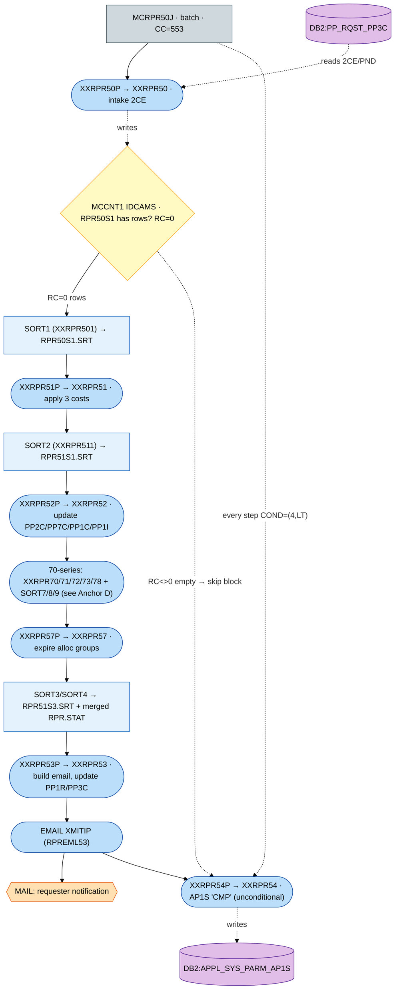
```mermaid
%%{init: {'theme': 'base', 'themeVariables': { 'edgeLabelBackground':'#ffffff' }}}%%
%% BP-004 Costing & Price Protection — call graph — MCRPR50J entrypoint orchestration
flowchart TD
  classDef job  fill:#cfd8dc,stroke:#37474f,color:#000;
  classDef prog fill:#bbdefb,stroke:#0d47a1,color:#000;
  classDef para fill:#e3f2fd,stroke:#1565c0,color:#000;
  classDef data fill:#e1bee7,stroke:#4a148c,color:#000;
  classDef ext  fill:#ffe0b2,stroke:#e65100,color:#000;
  classDef dec  fill:#fff9c4,stroke:#f9a825,color:#000;
  classDef err  fill:#ffcdd2,stroke:#b71c1c,color:#000;

  J["MCRPR50J · batch · CC=553"]:::job
  P50(["XXRPR50P → XXRPR50 · intake 2CE"]):::prog
  GATE{"MCCNT1 IDCAMS · RPR50S1 has rows? RC=0"}:::dec
  S1["SORT1 (XXRPR501) → RPR50S1.SRT"]:::para
  P51(["XXRPR51P → XXRPR51 · apply 3 costs"]):::prog
  S2["SORT2 (XXRPR511) → RPR51S1.SRT"]:::para
  P52(["XXRPR52P → XXRPR52 · update PP2C/PP7C/PP1C/PP1I"]):::prog
  SUB70(["70-series: XXRPR70/71/72/73/78 + SORT7/8/9 (see Anchor D)"]):::prog
  P57(["XXRPR57P → XXRPR57 · expire alloc groups"]):::prog
  S34["SORT3/SORT4 → RPR51S3.SRT + merged RPR.STAT"]:::para
  P53(["XXRPR53P → XXRPR53 · build email, update PP1R/PP3C"]):::prog
  EMAIL(["EMAIL XMITIP (RPREML53)"]):::prog
  MAIL{{"MAIL: requester notification"}}:::ext
  P54(["XXRPR54P → XXRPR54 · AP1S 'CMP' (unconditional)"]):::prog
  D_PP3C[("DB2:PP_RQST_PP3C")]:::data
  D_AP1S[("DB2:APPL_SYS_PARM_AP1S")]:::data

  J --> P50
  D_PP3C -. "reads 2CE/PND" .-> P50
  P50 -. "writes" .-> GATE
  GATE -- "RC=0 rows" --> S1
  GATE -. "RC<>0 empty → skip block" .-> P54
  S1 --> P51 --> S2 --> P52 --> SUB70 --> P57 --> S34 --> P53 --> EMAIL --> MAIL
  EMAIL --> P54
  P54 -. "writes" .-> D_AP1S
  J -. "every step COND=(4,LT)" .-> P54
```

**`XXRPR50` program flow** (intake of `'2CE'` requests; sets `PP3C` `'INP'`; writes the `RPR50S1` work file; at end either requests allocation or marks the rule complete).

<!-- mmd:BP-004-XXRPR50-call-graph -->
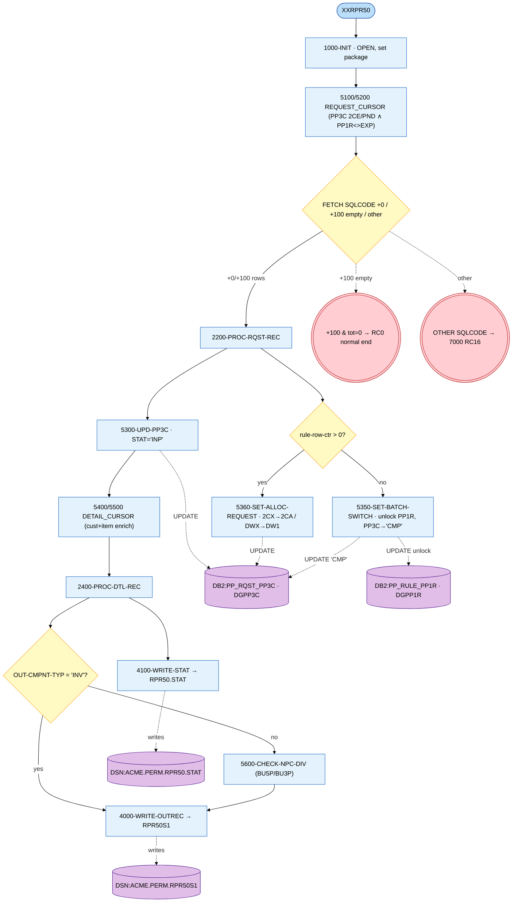
```mermaid
%%{init: {'theme': 'base', 'themeVariables': { 'edgeLabelBackground':'#ffffff' }}}%%
%% BP-004 Costing & Price Protection — call graph — XXRPR50 program flow
flowchart TD
  classDef job  fill:#cfd8dc,stroke:#37474f,color:#000;
  classDef prog fill:#bbdefb,stroke:#0d47a1,color:#000;
  classDef para fill:#e3f2fd,stroke:#1565c0,color:#000;
  classDef data fill:#e1bee7,stroke:#4a148c,color:#000;
  classDef ext  fill:#ffe0b2,stroke:#e65100,color:#000;
  classDef dec  fill:#fff9c4,stroke:#f9a825,color:#000;
  classDef err  fill:#ffcdd2,stroke:#b71c1c,color:#000;

  PG(["XXRPR50"]):::prog
  INIT["1000-INIT · OPEN, set package"]:::para
  ORQ["5100/5200 REQUEST_CURSOR (PP3C 2CE/PND ∧ PP1R<>EXP)"]:::para
  KRQ{"FETCH SQLCODE +0 / +100 empty / other"}:::dec
  PROC["2200-PROC-RQST-REC"]:::para
  UPD3C["5300-UPD-PP3C · STAT='INP'"]:::para
  ODTL["5400/5500 DETAIL_CURSOR (cust+item enrich)"]:::para
  PDTL["2400-PROC-DTL-REC"]:::para
  KINV{"OUT-CMPNT-TYP = 'INV'?"}:::dec
  NPC["5600-CHECK-NPC-DIV (BU5P/BU3P)"]:::para
  WOUT["4000-WRITE-OUTREC → RPR50S1"]:::para
  WSTAT["4100-WRITE-STAT → RPR50.STAT"]:::para
  KRULE{"rule-row-ctr > 0?"}:::dec
  ALLOC["5360-SET-ALLOC-REQUEST · 2CX→2CA / DWX→DW1"]:::para
  SW["5350-SET-BATCH-SWITCH · unlock PP1R, PP3C→'CMP'"]:::para
  D_PP3C[("DB2:PP_RQST_PP3C · DGPP3C")]:::data
  D_PP1R[("DB2:PP_RULE_PP1R · DGPP1R")]:::data
  D_OUT[("DSN:ACME.PERM.RPR50S1")]:::data
  D_STAT[("DSN:ACME.PERM.RPR50.STAT")]:::data
  NORM((("+100 & tot=0 → RC0 normal end"))):::err
  ERR((("OTHER SQLCODE → 7000 RC16"))):::err

  PG --> INIT --> ORQ --> KRQ
  KRQ -- "+0/+100 rows" --> PROC
  KRQ -. "+100 empty" .-> NORM
  KRQ -. "other" .-> ERR
  PROC --> UPD3C
  UPD3C -. "UPDATE" .-> D_PP3C
  UPD3C --> ODTL --> PDTL --> KINV
  KINV -- "no" --> NPC
  KINV -- "yes" --> WOUT
  NPC --> WOUT
  WOUT -. "writes" .-> D_OUT
  PDTL --> WSTAT
  WSTAT -. "writes" .-> D_STAT
  PROC --> KRULE
  KRULE -- "yes" --> ALLOC
  KRULE -- "no" --> SW
  ALLOC -. "UPDATE" .-> D_PP3C
  SW -. "UPDATE unlock" .-> D_PP1R
  SW -. "UPDATE 'CMP'" .-> D_PP3C
```

**`XXRPR52` program flow** (the PP cluster's heaviest mutator — INSERT/UPDATE/DELETE on `PP2C` with `PP7C` audit, plus `PP1C`/`PP1I` pruning and an orphan-sweep at end-of-file).

<!-- mmd:BP-004-XXRPR52-call-graph -->
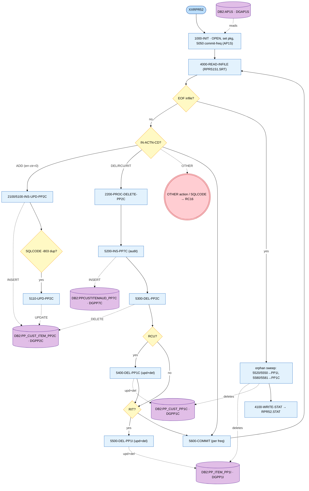
```mermaid
%%{init: {'theme': 'base', 'themeVariables': { 'edgeLabelBackground':'#ffffff' }}}%%
%% BP-004 Costing & Price Protection — call graph — XXRPR52 program flow
flowchart TD
  classDef job  fill:#cfd8dc,stroke:#37474f,color:#000;
  classDef prog fill:#bbdefb,stroke:#0d47a1,color:#000;
  classDef para fill:#e3f2fd,stroke:#1565c0,color:#000;
  classDef data fill:#e1bee7,stroke:#4a148c,color:#000;
  classDef ext  fill:#ffe0b2,stroke:#e65100,color:#000;
  classDef dec  fill:#fff9c4,stroke:#f9a825,color:#000;
  classDef err  fill:#ffcdd2,stroke:#b71c1c,color:#000;

  PG(["XXRPR52"]):::prog
  INIT["1000-INIT · OPEN, set pkg, 5050 commit-freq (AP1S)"]:::para
  READ["4000-READ-INFILE (RPR51S1.SRT)"]:::para
  KEOF{"EOF infile?"}:::dec
  KACT{"IN-ACTN-CD?"}:::dec
  INS["2100/5100-INS-UPD-PP2C"]:::para
  KDUP{"SQLCODE -803 dup?"}:::dec
  UPD["5110-UPD-PP2C"]:::para
  DEL["2200-PROC-DELETE-PP2C"]:::para
  INS7["5200-INS-PP7C (audit)"]:::para
  DEL2["5300-DEL-PP2C"]:::para
  KRCU{"RCU?"}:::dec
  DELC["5400-DEL-PP1C (upd+del)"]:::para
  KRIT{"RIT?"}:::dec
  DELI["5500-DEL-PP1I (upd+del)"]:::para
  CMT["5600-COMMIT (per freq)"]:::para
  ORPH["orphan sweep: 5520/5550→PP1I, 5580/5581→PP1C"]:::para
  WSTAT["4100-WRITE-STAT → RPR52.STAT"]:::para
  D_PP2C[("DB2:PP_CUST_ITEM_PP2C · DGPP2C")]:::data
  D_PP7C[("DB2:PPCUSTITEMAUD_PP7C · DGPP7C")]:::data
  D_PP1C[("DB2:PP_CUST_PP1C · DGPP1C")]:::data
  D_PP1I[("DB2:PP_ITEM_PP1I · DGPP1I")]:::data
  D_AP1S[("DB2:AP1S · DGAP1S")]:::data
  ERR((("OTHER action / SQLCODE → RC16"))):::err

  PG --> INIT
  D_AP1S -. "reads" .-> INIT
  INIT --> READ --> KEOF
  KEOF -- "no" --> KACT
  KACT -- "ADD (err-ctr=0)" --> INS
  INS -. "INSERT" .-> D_PP2C
  INS --> KDUP
  KDUP -- "yes" --> UPD
  UPD -. "UPDATE" .-> D_PP2C
  KACT -- "DEL/RCU/RIT" --> DEL
  KACT -. "OTHER" .-> ERR
  DEL --> INS7
  INS7 -. "INSERT" .-> D_PP7C
  INS7 --> DEL2
  DEL2 -. "DELETE" .-> D_PP2C
  DEL2 --> KRCU
  KRCU -- "yes" --> DELC
  DELC -. "upd+del" .-> D_PP1C
  KRCU -- "no" --> KRIT
  DELC --> KRIT
  KRIT -- "yes" --> DELI
  DELI -. "upd+del" .-> D_PP1I
  KACT --> CMT
  KRIT --> CMT
  CMT --> READ
  KEOF -- "yes" --> ORPH
  ORPH -. "deletes" .-> D_PP1I
  ORPH -. "deletes" .-> D_PP1C
  ORPH --> WSTAT
```

**Resource wiring & DB2 access — Anchor C** (intermediate-dataset chain + DB2 ops):

| Program | Work files (DD → DSN) | DB2 access (table · op · DCLGEN) |
|---|---|---|
| XXRPR50 | RPR50S1 → `ACME.PERM.RPR50S1`; RPRSTAT → `…RPR50.STAT` | `PP_RQST_PP3C` SEL+UPD (DGPP3C); `PP_RULE_PP1R` SEL+UPD (DGPP1R); REQUEST/DETAIL cursors over `PP1C/PP1I/CU1A/DI1D/CU2A/CU1Q/DE1I`; `CUSPRIPLNBU5P`/`ITMPRIPLNBU3P` SEL (DGBU5P/DGBU3P) |
| XXRPR51 | in `RPR50S1.SRT`; out `RPR51S1`, `RPR51.STAT` | `ITM_COST_DE8E` (License/NIC), `ITM_BILL_COST_DE6E` (Billing), `CUST_XREF_CU1X` SEL; invoice price via **CALL XXQBI11** `[GAP]` (+ CALL XXDIV50/XXGRP50) |
| XXRPR52 | in `RPR51S1.SRT`; out `RPR52.STAT` | `PP_CUST_ITEM_PP2C` INS/UPD/DEL (DGPP2C); `PPCUSTITEMAUD_PP7C` INS (DGPP7C); `PP_CUST_PP1C` (DGPP1C) / `PP_ITEM_PP1I` (DGPP1I) upd+del; `AP1S` SEL commit-freq |
| XXRPR53 | in `RPR51S3.SRT`, `RPR.STAT`; out `RPR53.EMAIL` | `PP_RQST_PP3C`+`PP_RULE_PP1R`+`RQST_TYP_PP9G` SEL; `PP_RULE_PP1R` UPD 'ACT'/'ERR'; `PP_RQST_PP3C` UPD 'CMP' |
| XXRPR54 | READER1 `RDRPARM(RPR54X10)` `[GAP]` | `PP_RQST_PP3C`+`PP_RULE_PP1R` SEL; `AP1S` UPD `CHAR_VAL='CMP'`; CALL `SYSPROC.DSCON03` `[GAP]` |
| XXRPR57 | — (DB2 only) | ALLOC_CURSOR `PP1R⋈PP1G⋈PP2A`; `PP1G`/`PP1R` UPD 'EXP' (PP2A update commented out) |

**Realized rules:** BR-004-30/50-01 (`XXRPR50.REQUEST_CURSOR` 2CE/PND), BR-004-50-02 (enrich → `RPR50S1` + `RPR50.STAT`), BR-004-31/50-04 (`XXRPR51` License/Billing/Invoice), BR-004-32/50-06 (`XXRPR52` PP2C/PP7C/PP1C/PP1I), BR-004-33/50-07 (`XXRPR53` email; `RPREML53`), BR-004-34/50-08 (`XXRPR54` AP1S end-of-job, `XXRPR57` alloc-group expiry). CAST writer-map confirmed: `XXRPR50` & `XXRPR53` write `PP_RQST_PP3C`. `[note]` `XXRPR57` step is physically nested in the 70-series `CHK72` gate, coupling the 50- and 70-series.
---

## 6. Anchor D — Price Protection allocation & expiry (`MCRPR71J`, `MCRPR74J`)

`MCRPR71J` extracts rule/item/customer scope (XXRPR70/71/72/73), sorts (SORT7/8/9), recalcs, and **expires** allocations (XXRPR57: `PP1G`/`PP1R` → `'EXP'` on cutoff), releasing batch locks (XXRPR78 ×2). `MCRPR74J` is a strict 2-step billing→allocation sync: XXRPR74 accumulates invoice quantities/amounts into `PP1G`/`PP2C` (and stamps the run into `AP1S`), then XXRPR75 re-derives pre-billing quantities. Both jobs gate at the proc-`EXEC` level with `COND=(4,LT)` (MCRPR74J has **no** job-level COND — ordering is sequential + per-proc COND).

> **Grounding correction (resolved in §8):** the spec's allocation tables `PP_ALLOC_DTL_PP4D`/`PP_ALLOC_SUM_PP4S`/`PP_ALLOC_HIST_PP4H` are **not in code or DCLGEN**. The real targets are `ACME.PP_ALLOC_PP2A`, `ACME.PP_CUST_GRP_PP1G`, `ACME.PP_CUST_ITEM_PP2C` (history `PP_ALLOC_HIST_PP2H`). The narrated `PP2H` INSERT is **dead code** (commented out in XXRPR74; absent in XXRPR73).

<!-- mmd:BP-004-pp-alloc-entry-call-graph -->
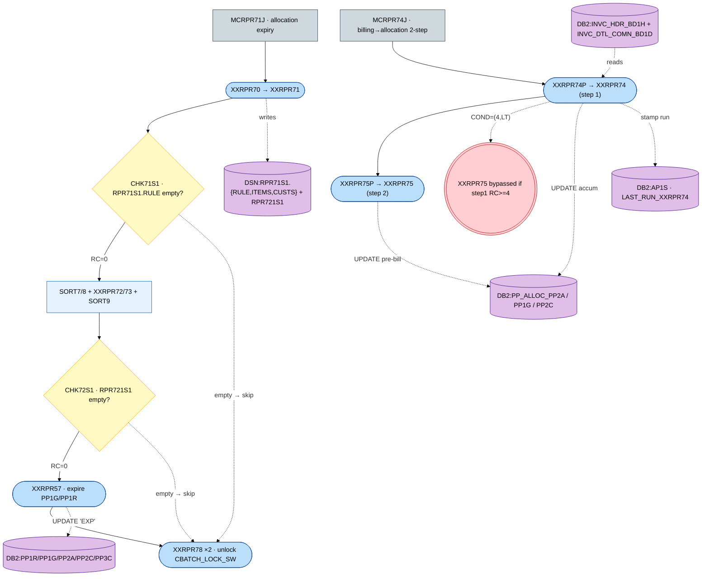
```mermaid
%%{init: {'theme': 'base', 'themeVariables': { 'edgeLabelBackground':'#ffffff' }}}%%
%% BP-004 Costing & Price Protection — call graph — MCRPR71J / MCRPR74J allocation orchestration
flowchart TD
  classDef job  fill:#cfd8dc,stroke:#37474f,color:#000;
  classDef prog fill:#bbdefb,stroke:#0d47a1,color:#000;
  classDef para fill:#e3f2fd,stroke:#1565c0,color:#000;
  classDef data fill:#e1bee7,stroke:#4a148c,color:#000;
  classDef ext  fill:#ffe0b2,stroke:#e65100,color:#000;
  classDef dec  fill:#fff9c4,stroke:#f9a825,color:#000;
  classDef err  fill:#ffcdd2,stroke:#b71c1c,color:#000;

  J71["MCRPR71J · allocation expiry"]:::job
  P70(["XXRPR70 → XXRPR71"]):::prog
  CHK71{"CHK71S1 · RPR71S1.RULE empty?"}:::dec
  SRT78["SORT7/8 + XXRPR72/73 + SORT9"]:::para
  CHK72{"CHK72S1 · RPR721S1 empty?"}:::dec
  P57(["XXRPR57 · expire PP1G/PP1R"]):::prog
  P78(["XXRPR78 ×2 · unlock CBATCH_LOCK_SW"]):::prog
  D_RUL[("DSN:RPR71S1.{RULE,ITEMS,CUSTS} + RPR721S1")]:::data
  D_PP[("DB2:PP1R/PP1G/PP2A/PP2C/PP3C")]:::data

  J71 --> P70 --> CHK71
  CHK71 -- "RC=0" --> SRT78
  CHK71 -. "empty → skip" .-> P78
  SRT78 --> CHK72
  CHK72 -- "RC=0" --> P57
  CHK72 -. "empty → skip" .-> P78
  P57 --> P78
  P70 -. "writes" .-> D_RUL
  P57 -. "UPDATE 'EXP'" .-> D_PP

  J74["MCRPR74J · billing→allocation 2-step"]:::job
  P74(["XXRPR74P → XXRPR74 (step 1)"]):::prog
  P75(["XXRPR75P → XXRPR75 (step 2)"]):::prog
  BYP((("XXRPR75 bypassed if step1 RC>=4"))):::err
  D_INV[("DB2:INVC_HDR_BD1H + INVC_DTL_COMN_BD1D")]:::data
  D_ALLOC[("DB2:PP_ALLOC_PP2A / PP1G / PP2C")]:::data
  D_AP1S[("DB2:AP1S · LAST_RUN_XXRPR74")]:::data

  J74 --> P74 --> P75
  P74 -. "COND=(4,LT)" .-> BYP
  D_INV -. "reads" .-> P74
  P74 -. "UPDATE accum" .-> D_ALLOC
  P74 -. "stamp run" .-> D_AP1S
  P75 -. "UPDATE pre-bill" .-> D_ALLOC
```

**`XXRPR74` program flow** (invoice-driven allocation accumulation; the AP1S timestamp is the only checkpoint in the pair).

<!-- mmd:BP-004-XXRPR74-call-graph -->
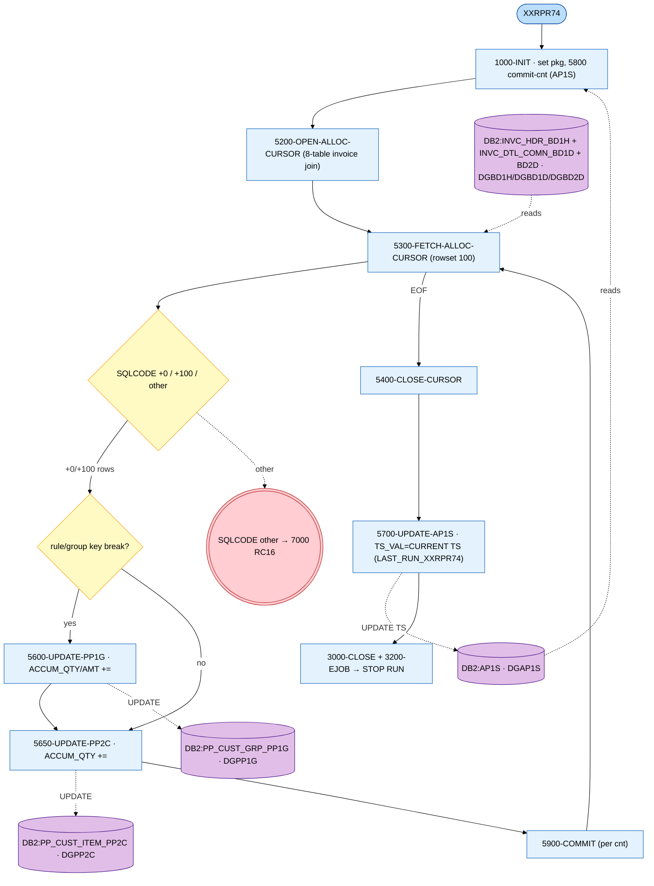
```mermaid
%%{init: {'theme': 'base', 'themeVariables': { 'edgeLabelBackground':'#ffffff' }}}%%
%% BP-004 Costing & Price Protection — call graph — XXRPR74 program flow
flowchart TD
  classDef job  fill:#cfd8dc,stroke:#37474f,color:#000;
  classDef prog fill:#bbdefb,stroke:#0d47a1,color:#000;
  classDef para fill:#e3f2fd,stroke:#1565c0,color:#000;
  classDef data fill:#e1bee7,stroke:#4a148c,color:#000;
  classDef ext  fill:#ffe0b2,stroke:#e65100,color:#000;
  classDef dec  fill:#fff9c4,stroke:#f9a825,color:#000;
  classDef err  fill:#ffcdd2,stroke:#b71c1c,color:#000;

  PG(["XXRPR74"]):::prog
  INIT["1000-INIT · set pkg, 5800 commit-cnt (AP1S)"]:::para
  OPENC["5200-OPEN-ALLOC-CURSOR (8-table invoice join)"]:::para
  FETCH["5300-FETCH-ALLOC-CURSOR (rowset 100)"]:::para
  KF{"SQLCODE +0 / +100 / other"}:::dec
  KBRK{"rule/group key break?"}:::dec
  UPG["5600-UPDATE-PP1G · ACCUM_QTY/AMT += "]:::para
  UPC["5650-UPDATE-PP2C · ACCUM_QTY += "]:::para
  CMT["5900-COMMIT (per cnt)"]:::para
  CLOSE["5400-CLOSE-CURSOR"]:::para
  UPAP["5700-UPDATE-AP1S · TS_VAL=CURRENT TS (LAST_RUN_XXRPR74)"]:::para
  WRAP["3000-CLOSE + 3200-EJOB → STOP RUN"]:::para
  D_IN[("DB2:INVC_HDR_BD1H + INVC_DTL_COMN_BD1D + BD2D · DGBD1H/DGBD1D/DGBD2D")]:::data
  D_PP1G[("DB2:PP_CUST_GRP_PP1G · DGPP1G")]:::data
  D_PP2C[("DB2:PP_CUST_ITEM_PP2C · DGPP2C")]:::data
  D_AP1S[("DB2:AP1S · DGAP1S")]:::data
  ERR((("SQLCODE other → 7000 RC16"))):::err

  PG --> INIT
  D_AP1S -. "reads" .-> INIT
  INIT --> OPENC --> FETCH --> KF
  D_IN -. "reads" .-> FETCH
  KF -- "+0/+100 rows" --> KBRK
  KF -. "other" .-> ERR
  KBRK -- "yes" --> UPG
  KBRK -- "no" --> UPC
  UPG --> UPC
  UPG -. "UPDATE" .-> D_PP1G
  UPC -. "UPDATE" .-> D_PP2C
  UPC --> CMT --> FETCH
  FETCH -- "EOF" --> CLOSE --> UPAP
  UPAP -. "UPDATE TS" .-> D_AP1S
  UPAP --> WRAP
```

**Resource wiring & DB2 access — Anchor D:**

| Program | Work files | DB2 access (verified) |
|---|---|---|
| XXRPR71 | OUT `RPR71S1.{RULE,ITEMS,CUSTS,READER}` | REQUEST/RULE/CUST/ITM cursors over `PP_RQST_PP3C` (DW1/DW2/PND), `PP1R/PP1C/PP1G/PP2A/PP2C/PP1I`; `PP_RQST_PP3C` UPD 'CMP' |
| XXRPR70 | — | REQUEST_CURSOR (2CA/PUA/PND); 11-table ALLOC_CURSOR; `PP2C` UPD `PER_UNIT_ALLOC_AMT`; `PP3C` UPD 'CMP'; CALL XXDIV50/XXQBI11/XXGRP50 `[GAP]` |
| XXRPR72 | OUT `RPR721S1`, `RPR72RUL` | UDB warehouse join (`WF1I_INVC_SLS_DTL` etc., qual `PDWHROW`); writes `SESSION.*` temp tables (DGWD2DU/DGWF4IU absent `[GAP]`) |
| XXRPR73 | in `RPR721S1.SRT`; out `RPR73RUL` | `PP_CUST_ITEM_PP2C` SEL; `PP_CUST_GRP_PP1G` SEL/UPD (`RECALC_RQST_SW`, ACCUM); `PP2C` UPD ACCUM (no PP2H INSERT — `[GAP]`) |
| XXRPR78 | in `RPR73RUL` / `RPR72RUL` | `PP_RULE_PP1R` UPD `CBATCH_LOCK_SW='N'` |
| XXRPR74 | — | ALLOC-CURSOR over `PP1R/PP2A/PP1G/PP1C/PP2C/AP1S/BD1H/BD1D/BD2D`; UPD `PP1G`/`PP2C` accum; UPD `AP1S` `LAST_RUN_XXRPR74` |
| XXRPR75 | — | PP2C/PP1G zero-phase cursors; BILLING-CUR (8-table, AP1S `PRE_BILL_DAYS` window); UPD `PP2C`/`PP1G` `PRE_BILL_*` (no AP1S timestamp — `[GAP]` vs spec) |

**Realized rules:** BR-004-71-01/02 (`MCRPR71J` extract→sort→recalc→expire; working datasets), BR-004-71-03 (note: `RPR721S1.SRT` is consumed by `XXRPR73` *within each job*; `MCRPR50J` **rebuilds** its own copy — not a clean cross-job handoff, `[SME]`), BR-004-74-01 (`XXRPR74` invoice read + `PP1G`/`PP2C` update + AP1S stamp), BR-004-74-02 (`XXRPR75` pre-bill re-derivation; deviates — no execution-timestamp write), BR-004-74-03 (strict step order via sequential EXEC + per-proc COND).
---

## 7. Anchor E — Price Protection modeler reports (`MCRPR55J`/`XXRPR55`, `MCRPR85J`/`XXRPR85`)

Two read-only report generators (the lowest-risk cutover candidates). `XXRPR55` produces the `'BI1'` Modeler Report (conditional output only when a price ≠ 0; second file for email notify). `XXRPR85` extracts `'BI2'` pending requests, enforcing the `PND → INP → CMP` status lifecycle, and ships a zipped extract via MQ FTE. Both jobs gate distribution on an `EMPTCHK1` record-count check.

<!-- mmd:BP-004-modeler-entry-call-graph -->
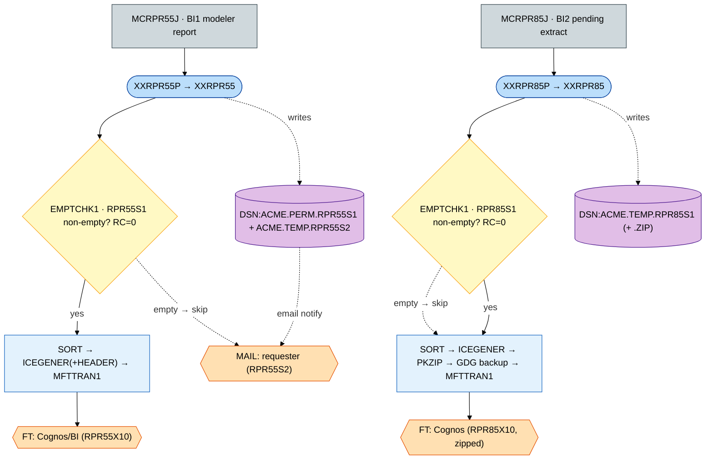
```mermaid
%%{init: {'theme': 'base', 'themeVariables': { 'edgeLabelBackground':'#ffffff' }}}%%
%% BP-004 Costing & Price Protection — call graph — MCRPR55J / MCRPR85J modeler orchestration
flowchart TD
  classDef job  fill:#cfd8dc,stroke:#37474f,color:#000;
  classDef prog fill:#bbdefb,stroke:#0d47a1,color:#000;
  classDef para fill:#e3f2fd,stroke:#1565c0,color:#000;
  classDef data fill:#e1bee7,stroke:#4a148c,color:#000;
  classDef ext  fill:#ffe0b2,stroke:#e65100,color:#000;
  classDef dec  fill:#fff9c4,stroke:#f9a825,color:#000;

  J55["MCRPR55J · BI1 modeler report"]:::job
  P55(["XXRPR55P → XXRPR55"]):::prog
  E55{"EMPTCHK1 · RPR55S1 non-empty? RC=0"}:::dec
  G55["SORT → ICEGENER(+HEADER) → MFTTRAN1"]:::para
  F55{{"FT: Cognos/BI (RPR55X10)"}}:::ext
  M55{{"MAIL: requester (RPR55S2)"}}:::ext
  D55[("DSN:ACME.PERM.RPR55S1 + ACME.TEMP.RPR55S2")]:::data

  J55 --> P55 -. "writes" .-> D55
  P55 --> E55
  E55 -- "yes" --> G55 --> F55
  D55 -. "email notify" .-> M55
  E55 -. "empty → skip" .-> M55

  J85["MCRPR85J · BI2 pending extract"]:::job
  P85(["XXRPR85P → XXRPR85"]):::prog
  E85{"EMPTCHK1 · RPR85S1 non-empty? RC=0"}:::dec
  G85["SORT → ICEGENER → PKZIP → GDG backup → MFTTRAN1"]:::para
  F85{{"FT: Cognos (RPR85X10, zipped)"}}:::ext
  D85[("DSN:ACME.TEMP.RPR85S1 (+ .ZIP)")]:::data

  J85 --> P85 -. "writes" .-> D85
  P85 --> E85
  E85 -- "yes" --> G85 --> F85
  E85 -. "empty → skip" .-> G85
```

**`XXRPR55` program flow** (`'BI1'`; 18-table UNION cursor; conditional write; division/group enrichment via external CALLs).

<!-- mmd:BP-004-XXRPR55-call-graph -->
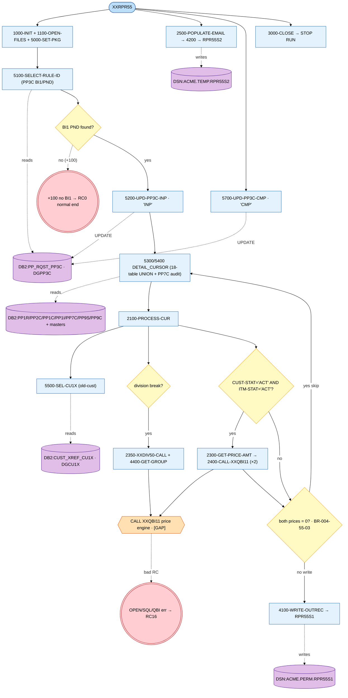
```mermaid
%%{init: {'theme': 'base', 'themeVariables': { 'edgeLabelBackground':'#ffffff' }}}%%
%% BP-004 Costing & Price Protection — call graph — XXRPR55 program flow
flowchart TD
  classDef job  fill:#cfd8dc,stroke:#37474f,color:#000;
  classDef prog fill:#bbdefb,stroke:#0d47a1,color:#000;
  classDef para fill:#e3f2fd,stroke:#1565c0,color:#000;
  classDef data fill:#e1bee7,stroke:#4a148c,color:#000;
  classDef ext  fill:#ffe0b2,stroke:#e65100,color:#000;
  classDef dec  fill:#fff9c4,stroke:#f9a825,color:#000;
  classDef err  fill:#ffcdd2,stroke:#b71c1c,color:#000;

  PG(["XXRPR55"]):::prog
  INIT["1000-INIT + 1100-OPEN-FILES + 5000-SET-PKG"]:::para
  SEL["5100-SELECT-RULE-ID (PP3C BI1/PND)"]:::para
  KBI1{"BI1 PND found?"}:::dec
  INP["5200-UPD-PP3C-INP · 'INP'"]:::para
  CUR["5300/5400 DETAIL_CURSOR (18-table UNION + PP7C audit)"]:::para
  PCUR["2100-PROCESS-CUR"]:::para
  CU1X["5500-SEL-CU1X (old-cust)"]:::para
  KDIV{"division break?"}:::dec
  DIV["2350-XXDIV50-CALL + 4400-GET-GROUP"]:::para
  KACT{"CUST-STAT='ACT' AND ITM-STAT='ACT'?"}:::dec
  PRICE["2300-GET-PRICE-AMT → 2400-CALL-XXQBI11 (×2)"]:::para
  KZERO{"both prices = 0? · BR-004-55-03"}:::dec
  WOUT["4100-WRITE-OUTREC → RPR55S1"]:::para
  EMAIL["2500-POPULATE-EMAIL → 4200 → RPR55S2"]:::para
  CMP["5700-UPD-PP3C-CMP · 'CMP'"]:::para
  WRAP["3000-CLOSE → STOP RUN"]:::para
  D_PP3C[("DB2:PP_RQST_PP3C · DGPP3C")]:::data
  D_PPX[("DB2:PP1R/PP2C/PP1C/PP1I/PP7C/PP9S/PP9C + masters")]:::data
  D_CU1X[("DB2:CUST_XREF_CU1X · DGCU1X")]:::data
  D_OUT[("DSN:ACME.PERM.RPR55S1")]:::data
  D_EML[("DSN:ACME.TEMP.RPR55S2")]:::data
  X_QBI{{"CALL XXQBI11 price engine · [GAP]"}}:::ext
  NORM((("+100 no BI1 → RC0 normal end"))):::err
  ERR((("OPEN/SQL/QBI err → RC16"))):::err

  PG --> INIT --> SEL
  SEL -. "reads" .-> D_PP3C
  SEL --> KBI1
  KBI1 -. "no (+100)" .-> NORM
  KBI1 -- "yes" --> INP
  INP -. "UPDATE" .-> D_PP3C
  INP --> CUR
  CUR -. "reads" .-> D_PPX
  CUR --> PCUR --> CU1X
  CU1X -. "reads" .-> D_CU1X
  PCUR --> KDIV
  KDIV -- "yes" --> DIV
  DIV --> X_QBI
  KACT -- "yes" --> PRICE
  PRICE --> X_QBI
  X_QBI -. "bad RC" .-> ERR
  PCUR --> KACT
  KACT -- "no" --> KZERO
  PRICE --> KZERO
  KZERO -- "yes skip" --> CUR
  KZERO -- "no write" --> WOUT
  WOUT -. "writes" .-> D_OUT
  PG --> EMAIL
  EMAIL -. "writes" .-> D_EML
  PG --> CMP
  CMP -. "UPDATE" .-> D_PP3C
  PG --> WRAP
```

**`XXRPR85` program flow** (`'BI2'`+`'PND'`; two cursors — current `PP2C` + audit `PP7C`; status `PND→INP→CMP`).

<!-- mmd:BP-004-XXRPR85-call-graph -->
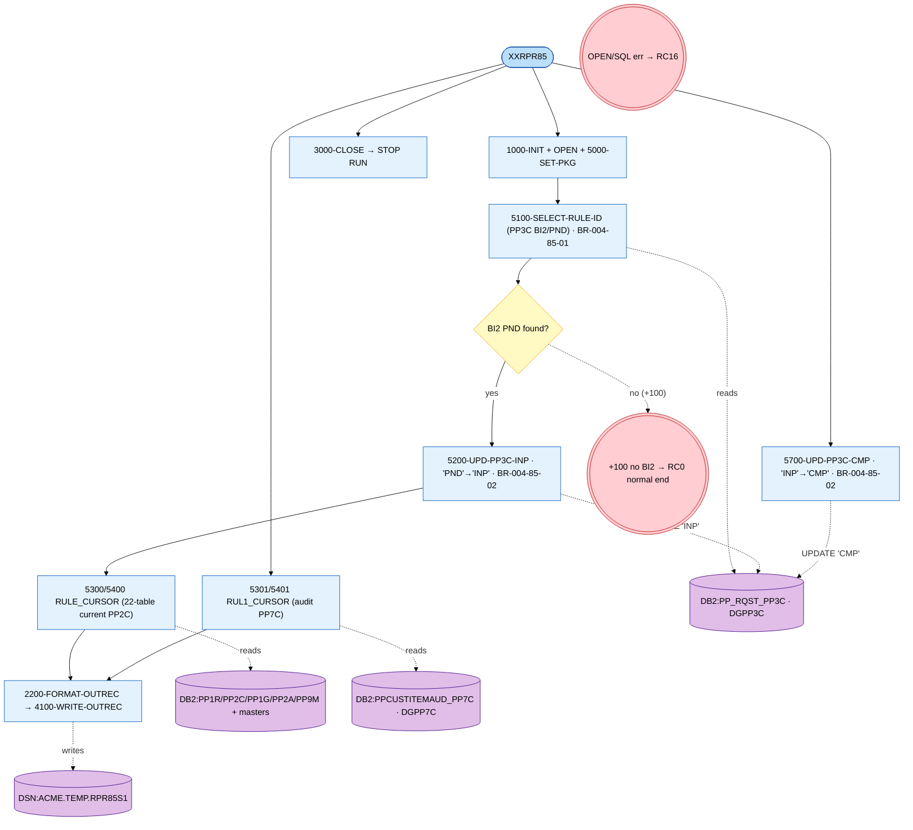
```mermaid
%%{init: {'theme': 'base', 'themeVariables': { 'edgeLabelBackground':'#ffffff' }}}%%
%% BP-004 Costing & Price Protection — call graph — XXRPR85 program flow
flowchart TD
  classDef job  fill:#cfd8dc,stroke:#37474f,color:#000;
  classDef prog fill:#bbdefb,stroke:#0d47a1,color:#000;
  classDef para fill:#e3f2fd,stroke:#1565c0,color:#000;
  classDef data fill:#e1bee7,stroke:#4a148c,color:#000;
  classDef ext  fill:#ffe0b2,stroke:#e65100,color:#000;
  classDef dec  fill:#fff9c4,stroke:#f9a825,color:#000;
  classDef err  fill:#ffcdd2,stroke:#b71c1c,color:#000;

  PG(["XXRPR85"]):::prog
  INIT["1000-INIT + OPEN + 5000-SET-PKG"]:::para
  SEL["5100-SELECT-RULE-ID (PP3C BI2/PND) · BR-004-85-01"]:::para
  KBI2{"BI2 PND found?"}:::dec
  INP["5200-UPD-PP3C-INP · 'PND'→'INP' · BR-004-85-02"]:::para
  OC1["5300/5400 RULE_CURSOR (22-table current PP2C)"]:::para
  FMT["2200-FORMAT-OUTREC → 4100-WRITE-OUTREC"]:::para
  OC2["5301/5401 RUL1_CURSOR (audit PP7C)"]:::para
  CMP["5700-UPD-PP3C-CMP · 'INP'→'CMP' · BR-004-85-02"]:::para
  WRAP["3000-CLOSE → STOP RUN"]:::para
  D_PP3C[("DB2:PP_RQST_PP3C · DGPP3C")]:::data
  D_PPX[("DB2:PP1R/PP2C/PP1G/PP2A/PP9M + masters")]:::data
  D_PP7C[("DB2:PPCUSTITEMAUD_PP7C · DGPP7C")]:::data
  D_OUT[("DSN:ACME.TEMP.RPR85S1")]:::data
  NORM((("+100 no BI2 → RC0 normal end"))):::err
  ERR((("OPEN/SQL err → RC16"))):::err

  PG --> INIT --> SEL
  SEL -. "reads" .-> D_PP3C
  SEL --> KBI2
  KBI2 -. "no (+100)" .-> NORM
  KBI2 -- "yes" --> INP
  INP -. "UPDATE 'INP'" .-> D_PP3C
  INP --> OC1
  OC1 -. "reads" .-> D_PPX
  OC1 --> FMT
  FMT -. "writes" .-> D_OUT
  PG --> OC2
  OC2 -. "reads" .-> D_PP7C
  OC2 --> FMT
  PG --> CMP
  CMP -. "UPDATE 'CMP'" .-> D_PP3C
  PG --> WRAP
```

**Resource wiring & DB2 access — Anchor E:**

| Program | Output / transfer | DB2 access |
|---|---|---|
| XXRPR55 | `RPR55S1` (report) + `RPR55S2` (email); job → SORT → ICEGENER+HEADER → MQ FTE | `PP_RQST_PP3C` SEL+UPD (INP/CMP); `DETAIL_CURSOR` 18-table UNION over `PP1R/PP9S/PP9C/PP2C/PP1C/PP1I/PP7C` + `CU1A/CU2A/CU4V/CU4G/CU1Q/DI1D/DE6C/DE6V/DE6Y/VN1A/VN4B`; `CUST_XREF_CU1X` SEL; CALL `XXQBI11`/`XXDIV50`/`XXGRP50` `[GAP]` |
| XXRPR85 | `RPR85S1`; job → SORT → ICEGENER → PKZIP → GDG backup → MQ FTE (`&&TEMPFTE`) | `PP_RQST_PP3C` SEL+UPD (INP/CMP); `RULE_CURSOR` 22-table INNER join (incl `PP2A/PP9M`); `RUL1_CURSOR` audit over `PP7C` |

**Realized rules:** BR-004-55-01..06 (`XXRPR55` BI1 filter, enrichment, conditional output, email file, paragraphs `2300/2350/4400` + `5000/5050` package bracketing), BR-004-85-01..03/07 (`XXRPR85` BI2/PND filter, PND→INP→CMP, dual cursor, MQ-FTE zip). `[GAP]` price engine `XXQBI11` and `XXDIV50`/`XXGRP50` sources absent — internals `[CODMOD]`.
---

## 8. Anchor F — Price Protection rule lifecycle (apply / archive / expire / cleanup / purge / Quasar)

Seven jobs maintain the rule store and the `ST3B` pricing-component table over its life: `MCRPR58J`/XXRPR58 inserts new effective configs into `ST3B`; `MCRPR86J`/XXRPR86 purges processed `ST3B` rows (the insert/purge pairing); `MCRPR65J`/XXRPR65 produces the **Quasar** feed from unprocessed `ST3B` rows; `MCRPR59J`/XXRPR59 archives completed requests `PP3C → PP3H`; `MCRPR56J`/XXRPR56(+57) expires date-driven rules; `MCRPR99J`/MCRPR99 cascade-purges aged rules across 15 tables; `MCRPR77J`/XXRPR77 (conditional, `COND=(4,LT)`) submits allocation recalcs via `SYSPROC.MCRPR25`.

<!-- mmd:BP-004-pp-lifecycle-entry-call-graph -->
```mermaid
%%{init: {'theme': 'base', 'themeVariables': { 'edgeLabelBackground':'#ffffff' }}}%%
%% BP-004 Costing & Price Protection — call graph — PP rule-lifecycle orchestration (7 jobs)
flowchart TD
  classDef job  fill:#cfd8dc,stroke:#37474f,color:#000;
  classDef prog fill:#bbdefb,stroke:#0d47a1,color:#000;
  classDef para fill:#e3f2fd,stroke:#1565c0,color:#000;
  classDef data fill:#e1bee7,stroke:#4a148c,color:#000;
  classDef ext  fill:#ffe0b2,stroke:#e65100,color:#000;
  classDef dec  fill:#fff9c4,stroke:#f9a825,color:#000;

  J58["MCRPR58J apply"]:::job --> P58(["XXRPR58 · INSERT ST3B"]):::prog
  J86["MCRPR86J cleanup"]:::job --> P86(["XXRPR86 · DELETE processed ST3B"]):::prog
  J65["MCRPR65J Quasar"]:::job --> P65(["XXRPR65 · build ST2A.PP, mark ST3B"]):::prog
  J59["MCRPR59J archive"]:::job --> P59(["XXRPR59 · PP3C→PP3H"]):::prog
  J56["MCRPR56J expire"]:::job --> P56(["XXRPR56 + XXRPR57 · rule/alloc EXP"]):::prog
  J99["MCRPR99J purge"]:::job --> P99(["MCRPR99 · cascade DELETE 15 tbls"]):::prog
  J77["MCRPR77J recalc (COND<4)"]:::job --> P77(["XXRPR77 · CALL MCRPR25"]):::prog

  ST3B[("DB2:PRC_CMPNT_ITM_ST3B")]:::data
  PP3C[("DB2:PP_RQST_PP3C")]:::data
  PP3H[("DB2:PP_RQST_HIST_PP3H")]:::data
  PP1R[("DB2:PP_RULE_PP1R")]:::data
  CU1X[("DB2:CUST_XREF_CU1X")]:::data
  AP1S[("DB2:AP1S retention/commit parms")]:::data
  SPLIT["SPLIT ICETOOL → 31× &lt;DIV&gt;.PERM.&lt;DIV&gt;ST2A.PP"]:::para
  QUASAR{{"FT: Quasar price-change feed"}}:::ext
  MCRPR25{{"SYSPROC.MCRPR25 → INSERT PP3C"}}:::ext

  P58 -. "INSERT (dup→not-inserted)" .-> ST3B
  P58 -. "reads" .-> PP1R
  P86 -. "DELETE processed" .-> ST3B
  AP1S -. "purge/commit" .-> P86
  P65 -. "SELECT unprocessed" .-> ST3B
  P65 -. "filter DELT_SW=N" .-> CU1X
  P65 -. "mark PRCS_TS" .-> ST3B
  P65 --> SPLIT --> QUASAR
  P59 -. "SELECT CMP/INP aged" .-> PP3C
  P59 -. "INSERT then DELETE" .-> PP3H
  P56 -. "UPDATE 'EXP'" .-> PP1R
  P99 -. "cascade DELETE" .-> PP1R
  P99 -. "DELETE" .-> PP3H
  P99 -. "DELETE" .-> PP3C
  AP1S -. "retention" .-> P99
  P77 -. "CALL ADD DW2" .-> MCRPR25
  MCRPR25 -. "INSERT" .-> PP3C
```

**`XXRPR58` program flow** (nightly rule application; dup-key counted, not errored).

<!-- mmd:BP-004-XXRPR58-call-graph -->
```mermaid
%%{init: {'theme': 'base', 'themeVariables': { 'edgeLabelBackground':'#ffffff' }}}%%
%% BP-004 Costing & Price Protection — call graph — XXRPR58 program flow
flowchart TD
  classDef job  fill:#cfd8dc,stroke:#37474f,color:#000;
  classDef prog fill:#bbdefb,stroke:#0d47a1,color:#000;
  classDef para fill:#e3f2fd,stroke:#1565c0,color:#000;
  classDef data fill:#e1bee7,stroke:#4a148c,color:#000;
  classDef ext  fill:#ffe0b2,stroke:#e65100,color:#000;
  classDef dec  fill:#fff9c4,stroke:#f9a825,color:#000;
  classDef err  fill:#ffcdd2,stroke:#b71c1c,color:#000;

  PG(["XXRPR58"]):::prog
  INIT["1000-INIT + OPEN READER (%%C1-%%M1-%%D1)"]:::para
  RDR["4000-READ-READER"]:::para
  KRDR{"RDR-STATUS = 10 empty / 0 / other"}:::dec
  OPEN["5100-OPEN-CURSOR RULE_CURSOR (3-way UNION)"]:::para
  FET["5200-FETCH-CURSOR (rowset 100)"]:::para
  KF{"SQLCODE +0/+100 rows / +100 empty / other"}:::dec
  INS["5400-INSERT-ST3B (PRCS_TS=1900 sentinel)"]:::para
  KINS{"INSERT SQLCODE?"}:::dec
  CNTOK["count inserted"]:::para
  CNTNO["count NOT inserted · BR-004-58-04"]:::para
  CLOSE["5300-CLOSE + 3000 → STOP RUN"]:::para
  D_SRC[("DB2:PP1R/PP2C/CU1A/DI1D + PP7C (EXP audit)")]:::data
  D_ST3B[("DB2:PRC_CMPNT_ITM_ST3B · DGST3B")]:::data
  NORM((("empty / +100 → RC0"))):::err
  ERR((("critical → RC16 · BR-004-58-05"))):::err

  PG --> INIT --> RDR --> KRDR
  KRDR -- "=10 empty" --> NORM
  KRDR -. "other" .-> ERR
  KRDR -- "=0" --> OPEN
  OPEN --> FET
  D_SRC -. "reads" .-> FET
  FET --> KF
  KF -- "+0/+100 rows" --> INS
  KF -- "+100 empty" --> CLOSE
  KF -. "other" .-> ERR
  INS -. "INSERT" .-> D_ST3B
  INS --> KINS
  KINS -- "+0" --> CNTOK --> FET
  KINS -- "-803 dup" --> CNTNO --> FET
  KINS -. "other" .-> ERR
```

**`XXRPR59` program flow** (active→history archival; note the dup-key suppression specified in BR-004-59-05 is **not** implemented — `[CODMOD]`).

<!-- mmd:BP-004-XXRPR59-call-graph -->
```mermaid
%%{init: {'theme': 'base', 'themeVariables': { 'edgeLabelBackground':'#ffffff' }}}%%
%% BP-004 Costing & Price Protection — call graph — XXRPR59 program flow
flowchart TD
  classDef job  fill:#cfd8dc,stroke:#37474f,color:#000;
  classDef prog fill:#bbdefb,stroke:#0d47a1,color:#000;
  classDef para fill:#e3f2fd,stroke:#1565c0,color:#000;
  classDef data fill:#e1bee7,stroke:#4a148c,color:#000;
  classDef ext  fill:#ffe0b2,stroke:#e65100,color:#000;
  classDef dec  fill:#fff9c4,stroke:#f9a825,color:#000;
  classDef err  fill:#ffcdd2,stroke:#b71c1c,color:#000;

  PG(["XXRPR59"]):::prog
  INIT["1000-INIT + READ READER (retention days RPR59R1)"]:::para
  CALC["5100-CALCULATE-DATE · today − retention"]:::para
  OPEN["5200-OPEN REQUEST_CURSOR (FOR UPDATE)"]:::para
  FET["5300-FETCH (PP3C CMP/INP ∧ CMPLTN_TS < target)"]:::para
  KF{"SQLCODE +100 empty / rows / other"}:::dec
  INS["5500-INSERT-PP3H"]:::para
  KINS{"INSERT SQLCODE −803 dup?"}:::dec
  DEL["5600-DELETE-PP3C (WHERE CURRENT OF)"]:::para
  CLOSE["5400-CLOSE → STOP RUN"]:::para
  D_PP3C[("DB2:PP_RQST_PP3C · DGPP3C")]:::data
  D_PP3H[("DB2:PP_RQST_HIST_PP3H · DGPP3H")]:::data
  NORM((("+100 empty → RC0"))):::err
  ERR((("DB2 error → RC16 · BR-004-59-06"))):::err

  PG --> INIT --> CALC --> OPEN --> FET --> KF
  D_PP3C -. "reads" .-> FET
  KF -. "+100 empty" .-> NORM
  KF -. "other" .-> ERR
  KF -- "rows" --> INS
  INS -. "INSERT" .-> D_PP3H
  INS --> KINS
  KINS -- "yes (counts; falls through — does NOT suppress delete)" --> DEL
  KINS -- "no" --> DEL
  DEL -. "DELETE" .-> D_PP3C
  DEL --> FET
  FET -- "EOC" --> CLOSE
```

### 8.1 PP status & ST3B lifecycle (state machine)

Status codes live in `ACME.STAT_PP9S` (reference table; programs use literals). Observed transitions across the cluster:

<!-- mmd:BP-004-pp-status-fsm-call-graph -->
```mermaid
%%{init: {'theme': 'base', 'themeVariables': { 'edgeLabelBackground':'#ffffff' }}}%%
%% BP-004 Costing & Price Protection — call graph — PP request/rule status transitions
flowchart LR
  classDef para fill:#e3f2fd,stroke:#1565c0,color:#000;
  classDef dec  fill:#fff9c4,stroke:#f9a825,color:#000;
  classDef err  fill:#ffcdd2,stroke:#b71c1c,color:#000;
  PND["PND pending"]:::para
  INP["INP in-progress"]:::para
  CMP["CMP completed"]:::para
  HIST["archived → PP3H"]:::para
  PURGE((("purged (MCRPR99)"))):::err
  PND -- "XXRPR50/55/85 start" --> INP
  INP -- "XXRPR53/55/85 finish" --> CMP
  CMP -- "XXRPR59 retention" --> HIST
  INP -- "XXRPR59 (CMP/INP aged)" --> HIST
  CMP -- "MCRPR99 aged rule" --> PURGE
  HIST -- "MCRPR99 / XXRPR99" --> PURGE
  ACT["rule ACT"]:::para
  EXP["rule EXP"]:::para
  ACT -- "XXRPR56 date-driven / XXRPR57 cutoff" --> EXP
```

**Resource wiring & DB2 access — Anchor F:**

| Program | Key DB2 ops (verified via DCLGEN) |
|---|---|
| XXRPR58 | RULE_CURSOR 3-way UNION (`PP1R⋈PP2C⋈CU1A⋈DI1D` start/end date ∪ `PP7C` EXP audit); INSERT `ST3B` (RSN_CD='PP', sentinel `PRCS_TS='1900-…'`); dup `-803`→counted |
| XXRPR59 | REQUEST_CURSOR `PP3C` (CMP/INP ∧ CMPLTN_TS<target) FOR UPDATE; INSERT `PP3H`; positioned DELETE `PP3C` |
| XXRPR56 | bulk `PP1R` UPD 'EXP' (END_DT<today); RULE/CUST cursors; `PP1G`/`PP2A` UPD 'EXP'; `PP7C` INSERT (AUD_RSN='EXP'); `PP2C` DELETE |
| XXRPR57 | ALLOC_CURSOR `PP1R⋈PP1G⋈PP2A`; EVALUATE `PPA_MTHD` AMT/QTY/VOL vs cutoff → `PP1G`/`PP1R` UPD 'EXP' |
| XXRPR86 | ST3B_CUR (EFF_DT<today−purge ∧ PRCS_TS≠sentinel) FOR UPDATE; positioned DELETE `ST3B` |
| XXRPR65 | ST2A-CSR (`ST3B⋈DI1D⋈CU1X⋈CU2A` where PRCS_TS=sentinel ∧ DELT_SW='N'); WRITE `ST2A.PP`; UPD `ST3B` PRCS_TS=now |
| XXRPR77 | RULE-CSR `PP1R` (ACT ∧ ALLOC_SW='Y' ∧ START_DT=today); `EXEC SQL CALL SYSPROC.MCRPR25(…'DW2','ADD'…)` → inserts `PP3C` |
| MCRPR99 | PP1R_CURSOR (LAST_CHG_TS aged); 15 cascade DELETEs: by rule-id `PP3H/PP3C/PP2C/PP1T/PP1I/PP1C/PP1G/PP2A/PP1R`, by purge-TS `PP7C/PP5G/PP5A/PP4I/PP4R/PP4C` |

**Realized rules:** BR-004-36 (date-driven expire), BR-004-37 (`XXRPR65` PRCS_TS mark + RC16), BR-004-58-01..05, BR-004-59-01..04/06, BR-004-65-05..07 (Quasar), BR-004-77-01, BR-004-86-01/02, BR-004-90/91 (status set + transitions above), BR-004-99-01/02. **Corrections (§8):** BR-004-58-03's `PRC_CMPNT_ITM_ADTC`/`PRC_CMPNT_ITM_PR1C`/`PRC_COMP_DTC` are **not referenced** by `XXRPR58` (audit is via `PP7C`); BR-004-59-05 dup-key suppression is **not implemented** (`[CODMOD]`).
---

## 9. Anchor G — Cigarette deals batch (`MCCBT*`)

`MCCBT00` (the batch-id reader-builder) runs under `MCCBT01J` (type `'0008'`) and `MCCBT06J` (type `'0001'`); each job then runs a per-division validate/extract (`MCCBT01`/`MCCBT06`) → SORT → update (`MCCBT02`/`MCCBT07`). `MCCBT08J`/`MCCBT08` produces the comma-delimited cigarette batch-deal discrepancy CSV for email; `MCCBT03J`/`MCCBT03` is a **purge** (deletes aged `DM3H`/`DM3B`/`DM3L`), **not** customer billing. The update programs feed `PENDINGDEALSDM3P`, which becomes input to **BP-002's `D8050`** deal-capture poll (BR-004-25).

> **Grounding `[GAP]` (see §8):** the procs `XXCBT01P/02P/03P/06P/07P` are **absent** from the export, so program→DD wiring for `MCCBT01/02/03/06/07` is inferable from COBOL `SELECT/ASSIGN` only; `MCCBT07J` JCL is also absent (the type-01 stage-2 is wired by `MCCBT06J` invoking the missing `XXCBT07P`). BR-004-MCCBT-01 in the spec is **wrong** — `MCCBT03` purges, it does not bill.

<!-- mmd:BP-004-MCCBT-entry-call-graph -->
```mermaid
%%{init: {'theme': 'base', 'themeVariables': { 'edgeLabelBackground':'#ffffff' }}}%%
%% BP-004 Costing & Price Protection — call graph — Cigarette-deal MCCBT orchestration
flowchart TD
  classDef job  fill:#cfd8dc,stroke:#37474f,color:#000;
  classDef prog fill:#bbdefb,stroke:#0d47a1,color:#000;
  classDef para fill:#e3f2fd,stroke:#1565c0,color:#000;
  classDef data fill:#e1bee7,stroke:#4a148c,color:#000;
  classDef ext  fill:#ffe0b2,stroke:#e65100,color:#000;
  classDef dec  fill:#fff9c4,stroke:#f9a825,color:#000;

  J06["MCCBT06J · DEAL=0001"]:::job
  J01["MCCBT01J · DEAL=0008"]:::job
  P00(["MCCBT00P → MCCBT00 · batch-id"]):::prog
  CNT{"MCCNT1 · BATCHID present? RC=0"}:::dec
  P06(["XXCBT06P → MCCBT06 ×30 div · [GAP proc]"]):::prog
  P01(["XXCBT01P → MCCBT01 ×30 div · [GAP proc]"]):::prog
  SRT["SORT1 → ACME.TEMP.BATCH.MCCBTnn"]:::para
  P07(["XXCBT07P → MCCBT07 · [GAP proc]"]):::prog
  P02(["XXCBT02P → MCCBT02 · [GAP proc]"]):::prog
  DEAL[("DB2:PENDINGDEALSDM3P / DM3D / DM3G / DM3R / DM2I / DM1M")]:::data
  HDR[("DB2:BAT_DEAL_HDR_DM3H / DM3L / DM3B")]:::data
  BP002{{"BP-002 D8050 deal-capture poll"}}:::ext

  J06 --> P00
  J01 --> P00
  P00 -. "SELECT BATCH_ID (STAT='P')" .-> HDR
  P00 --> CNT
  CNT -- "RC=0" --> P06
  CNT -- "RC=0" --> P01
  CNT -. "empty → skip" .-> SRT
  P06 -. "INSERT errors" .-> HDR
  P06 --> SRT --> P07
  P01 --> SRT --> P02
  P07 -. "INSERT/UPDATE" .-> DEAL
  P07 -. "status" .-> HDR
  P07 -. "feeds" .-> BP002
  P02 -. "INSERT/UPDATE (+DM3G group)" .-> DEAL

  J08["MCCBT08J · discrepancy report"]:::job
  P08(["XXCBT08P → MCCBT08"]):::prog
  COMMA[("DSN:ACME.PERM.MCCBT8S1.COMMA")]:::data
  MAIL{{"MAIL: XMITIP (MCCBT081)"}}:::ext
  J08 --> P08 -. "writes" .-> COMMA
  COMMA -. "ICEGENER + header → email" .-> MAIL
  P08 -. "reads active deals" .-> DEAL

  J03["MCCBT03J · purge"]:::job
  P03(["XXCBT03P → MCCBT03 · [GAP proc]"]):::prog
  RPT{{"RPT: PRTFILE MCOUT/INFO (MCCBT031)"}}:::ext
  J03 --> P03 -. "DELETE aged" .-> HDR
  P03 -. "audit/report" .-> RPT
```

**`MCCBT07` program flow** (cigarette pending-deal loader; cross-BP feeder).

<!-- mmd:BP-004-MCCBT07-call-graph -->
```mermaid
%%{init: {'theme': 'base', 'themeVariables': { 'edgeLabelBackground':'#ffffff' }}}%%
%% BP-004 Costing & Price Protection — call graph — MCCBT07 program flow
flowchart TD
  classDef job  fill:#cfd8dc,stroke:#37474f,color:#000;
  classDef prog fill:#bbdefb,stroke:#0d47a1,color:#000;
  classDef para fill:#e3f2fd,stroke:#1565c0,color:#000;
  classDef data fill:#e1bee7,stroke:#4a148c,color:#000;
  classDef ext  fill:#ffe0b2,stroke:#e65100,color:#000;
  classDef dec  fill:#fff9c4,stroke:#f9a825,color:#000;
  classDef err  fill:#ffcdd2,stroke:#b71c1c,color:#000;

  PG(["MCCBT07 · [GAP] driving proc absent"]):::prog
  ST["9000-STARTUP · OPEN RDRPARM, read BATCHID"]:::para
  KNUM{"BATCHID NUMERIC? · BR-004-21"}:::dec
  CHK["2000-CHK-ERROR-LOG (DM3B ERR_TYP='F')"]:::para
  KERR{"fatal errors found? · BR-004-22"}:::dec
  UHE["UPDATE DM3H STAT='E'"]:::para
  GET["3000-GET-EXTRACT (READ NEXT)"]:::para
  KRD{"EXT-STATUS 00 / 10 EOF / other"}:::dec
  MAIN["1000-MAIN-PROCESS (item/TS break)"]:::para
  P3P["3200/3210/3220 DM3P ins/upd · BR-004-23"]:::para
  GC["3215-GET-CORP-DEALID (MAX via DM1M/DM2I/DE6Y)"]:::para
  P3D["3300/3310/3320/3330 DM3D · BR-004-23"]:::para
  UPST["4000-UPDATE-STATUS DM3H + DM3L · BR-004-24"]:::para
  ENDJ["9100-END-JOB → STOP RUN"]:::para
  DBERR["9200-DB2-ERROR · CALL DBDB2ER + ROLLBACK"]:::para
  D_DM3B[("DB2:BAT_DEALERRLOGDM3B · DGDM3B")]:::data
  D_EXT[("DSN:EXTRACT ACME.TEMP.BATCH.MCCBT06")]:::data
  D_DM3P[("DB2:PENDINGDEALSDM3P · DGDM3P")]:::data
  D_DM3R[("DB2:CAD_REMARK_DM3R · DGDM3R")]:::data
  D_DM3D[("DB2:DIVPENDDEALSDM3D · DGDM3D")]:::data
  D_DM3H[("DB2:BAT_DEAL_HDR_DM3H / DM3L")]:::data
  X_BP002{{"BP-002 D8050 poll"}}:::ext
  ABEND((("RC16 abend"))):::err

  PG --> ST
  ST -. "reads" .-> D_EXT
  ST --> KNUM
  KNUM -. "non-numeric" .-> ABEND
  KNUM -- "numeric" --> CHK
  CHK -. "reads" .-> D_DM3B
  CHK --> KERR
  KERR -- "fatal → info msg" --> UHE
  KERR -- "none" --> GET
  UHE -. "writes" .-> D_DM3H
  UHE --> GET
  GET -. "reads" .-> D_EXT
  GET --> KRD
  KRD -. "10 EOF" .-> UPST
  KRD -. "other" .-> ABEND
  KRD -- "00" --> MAIN
  MAIN --> P3P
  P3P --> GC
  P3P -. "ins/upd" .-> D_DM3P
  P3P -. "del+ins remarks" .-> D_DM3R
  D_DM3P -. "feeds" .-> X_BP002
  P3P --> P3D
  P3D -. "ins/upd/term" .-> D_DM3D
  P3D --> GET
  UPST -. "updates" .-> D_DM3H
  UPST --> ENDJ
  ABEND -.-> DBERR
```

**Resource wiring & DB2 access — Anchor G:**

| Program | Files | DB2 access (verified) |
|---|---|---|
| MCCBT00 | RDRFILE → `ACME.TEMP.BATCHID.MCCBTnn` | `BAT_DEAL_HDR_DM3H` SEL (STAT='P', `FETCH FIRST ROW`) |
| MCCBT06/01 | XXSIM/XXVND (VSAM), EXTRACT (out) `[GAP DSN]` | BATCH-INFO/PEND/OI cursors over `DM3H/DE1E/DM3G/DM3D`; reads `DI1D/DE8E/DE1I/DE1A/CU2E`; INSERT `BAT_DEALERRLOGDM3B`; UPDATE `BAT_DEAL_DM3L` |
| MCCBT07 | RDRPARM, EXTRACT (in) | INSERT/UPDATE `PENDINGDEALSDM3P`, `DIVPENDDEALSDM3D`; del+ins `CAD_REMARK_DM3R`; MAX via `DEALDM1M`/`DEALITEMDM2I`/`ITEM_UPC_DE6Y`; UPDATE `BAT_DEAL_HDR_DM3H`/`BAT_DEAL_DM3L` |
| MCCBT02 | RDRPARM, EXTRACT (in) | as MCCBT07 + `GRPPENDDEALDM3G` group-level (type-08) |
| MCCBT08 | MCCBT08O → `MCCBT8S1.COMMA` | DIV_CSR (`DM3L⋈DI1D`); DEAL_CSR UNION (CDLTP2 1/8) over `DM3P/DM3D/DM3G/DE6C/DE1E/DE1I/DE1G` LEFT JOIN `DEALDM1X` |
| MCCBT03 | AUDFILE `[GAP DSN]`, PRTFILE (SYSOUT) | DM3H-CSR1/DM3L-CSR2; DELETE `BAT_DEAL_HDR_DM3H` + `BAT_DEALERRLOGDM3B` (DM3L/DM3F by RI cascade) |

**Realized rules:** BR-004-20 (two-stage MCCBT06→SORT→MCCBT07; type-08 MCCBT01→MCCBT02), BR-004-21 (BATCHID-numeric gate; abend otherwise), BR-004-22 (`DM3B` ERR_TYP='F' informational), BR-004-23 (`DM3P`/`DM3D`/`DM2I`/`DM1M`/`DM3R`/`DE6Y`), BR-004-24 (`DM3H`/`DM3L` status), BR-004-25 (cross-BP `PENDINGDEALSDM3P` → BP-002 `D8050`), BR-004-MCCBT-02/03/04 (MCCBT08 report; MCCBT06/MCCBT01 batch-header; MCCBT00 temp-extract). **Correction:** BR-004-MCCBT-01 reclassified — `MCCBT03` is a purge.
---

## 10. Anchor H — Cigarette cost (CIC) cycle (`MCCIC*`)

A discrete cigarette-cost domain anchored on `ACME.CIG_ITEM_COST_PR1C` and `ACME.MCLANE_XREF_DI3X` (distinct from the `MCCBT*` cigarette-*deals* family). `MCCIC01` splits a cigarette-cost change log into 31 per-division GDGs (SORTPARM-driven GL split); `MCCIC02J` is utility-only (ICEGENER consolidation → INFOPAC exceptions report — no COBOL); `MCCIC20` is a read-only 8-table linked-item cost-component report; `MCCIC90` is the maintenance program performing the real DML (insert/delete/update of `DE1E`/`PR1C`/`DI3X` groupings) with an emailed detail report.

<!-- mmd:BP-004-MCCIC-entry-call-graph -->
```mermaid
%%{init: {'theme': 'base', 'themeVariables': { 'edgeLabelBackground':'#ffffff' }}}%%
%% BP-004 Costing & Price Protection — call graph — Cigarette-cost MCCIC orchestration
flowchart TD
  classDef job  fill:#cfd8dc,stroke:#37474f,color:#000;
  classDef prog fill:#bbdefb,stroke:#0d47a1,color:#000;
  classDef para fill:#e3f2fd,stroke:#1565c0,color:#000;
  classDef data fill:#e1bee7,stroke:#4a148c,color:#000;
  classDef ext  fill:#ffe0b2,stroke:#e65100,color:#000;
  classDef dec  fill:#fff9c4,stroke:#f9a825,color:#000;

  J01["MCCIC01J · process cig-cost txns"]:::job
  P01(["MCCIC01P → MCCIC01"]):::prog
  SPL["31× SORT(<DIV>CIC010) + IEBGENER merge"]:::para
  CHGS[("DSN:&lt;DIV&gt;.PERM.LOGANAL.CIGCST.CHGS GDG")]:::data
  J02["MCCIC02J · exceptions report (utility)"]:::job
  ICE["ICEGENER consolidate 25× CIC15RPT"]:::para
  RPT151{{"RPT: INFOPAC MCCIC151"}}:::ext
  J20["MCCIC20J · linked-item detail"]:::job
  P20(["MCCIC20P → MCCIC20"]):::prog
  RPT201{{"RPT: INFOPAC MCCIC201"}}:::ext
  J90["MCCIC90J · clean-up groupings"]:::job
  P90(["MCCIC90P → MCCIC90"]):::prog
  MAIL{{"MAIL: XMITIP (MCCIGCST)"}}:::ext
  PR1C[("DB2:CIG_ITEM_COST_PR1C · DGPR1C")]:::data
  DE1E[("DB2:ITEM_GRP_DE1E · DGDE1E")]:::data
  DI3X[("DB2:MCLANE_XREF_DI3X · DGDI3X")]:::data
  COSTM[("DB2:DE6C / DE6Y / DI1D / DE1I")]:::data

  J01 --> P01
  P01 -. "reads change log" .-> CHGS
  P01 -. "reads/writes" .-> PR1C
  P01 -. "reads" .-> DE1E
  P01 --> SPL -. "writes" .-> CHGS
  J02 --> ICE --> RPT151
  J20 --> P20
  P20 -. "reads 8-table join" .-> COSTM
  P20 -. "reads" .-> PR1C
  P20 -. "reads" .-> DI3X
  P20 -. "writes" .-> RPT201
  J90 --> P90
  P90 -. "INSERT/DELETE/UPDATE" .-> DE1E
  P90 -. "INSERT/DELETE" .-> PR1C
  P90 -. "DELETE orphan links" .-> DI3X
  P90 -. "detail report email" .-> MAIL
```

**`MCCIC90` program flow** (cigarette-cost grouping maintenance).

<!-- mmd:BP-004-MCCIC90-call-graph -->
```mermaid
%%{init: {'theme': 'base', 'themeVariables': { 'edgeLabelBackground':'#ffffff' }}}%%
%% BP-004 Costing & Price Protection — call graph — MCCIC90 program flow
flowchart TD
  classDef job  fill:#cfd8dc,stroke:#37474f,color:#000;
  classDef prog fill:#bbdefb,stroke:#0d47a1,color:#000;
  classDef para fill:#e3f2fd,stroke:#1565c0,color:#000;
  classDef data fill:#e1bee7,stroke:#4a148c,color:#000;
  classDef ext  fill:#ffe0b2,stroke:#e65100,color:#000;
  classDef dec  fill:#fff9c4,stroke:#f9a825,color:#000;
  classDef err  fill:#ffcdd2,stroke:#b71c1c,color:#000;

  PG(["MCCIC90"]):::prog
  OPEN["1000-OPEN-PARA (DETLREP)"]:::para
  PROC["2000-PROCESS-PARA · SET CURRENT TIMESTAMP"]:::para
  INS["4000-INSERT-PARA · new cig items"]:::para
  DEL["4200-DELETE-PARA · non-cig / inactive"]:::para
  CLEAN["4450-CLEAN-DI3X · orphan links"]:::para
  UPD["4400-UPDATE-PARA · non-maintainable → default grp"]:::para
  CUR["4600/4800 DISPLAY_DE1E cursor"]:::para
  KREASON{"USER_ID='MCCIC90L'?"}:::dec
  MOVE["5000-MOVE-TO-OUTPUT (LINK BROKEN / NEW ITEM)"]:::para
  WRITE["5200-WRITE-REPORT-PARA → DETLREP"]:::para
  WRAP["3000-CLOSE → STOP RUN"]:::para
  ERR["7000-MAIN-DB2-ERR"]:::para
  D_DE1E[("DB2:ITEM_GRP_DE1E · DGDE1E")]:::data
  D_PR1C[("DB2:CIG_ITEM_COST_PR1C · DGPR1C (casc PR1F)")]:::data
  D_DI3X[("DB2:MCLANE_XREF_DI3X · DGDI3X")]:::data
  D_DE2C[("DB2:CIGCOST_ATRBT_DE2C · DGDE2C")]:::data
  D_RO[("DB2 read: DE1I / DE6C / DE6V / VN1A")]:::data
  D_REP[("DSN:ACME.PERM.MCCIC90.DEFAULT")]:::data
  ABEND((("RC16 (ROLLBACK on OTHER/AL)"))):::err

  PG --> OPEN
  OPEN -. "status not 00/97" .-> ABEND
  OPEN --> PROC --> INS
  INS -. "INSERT new" .-> D_DE1E
  INS -. "INSERT $0 cost" .-> D_PR1C
  INS -. "reads" .-> D_RO
  INS --> DEL
  DEL -. "DELETE non-cig/inactive" .-> D_DE1E
  DEL -. "DELETE orphan" .-> D_PR1C
  DEL --> CLEAN
  CLEAN -. "DELETE orphan links" .-> D_DI3X
  CLEAN --> UPD
  UPD -. "UPDATE → default grp" .-> D_DE1E
  UPD -. "reads" .-> D_DE2C
  UPD --> CUR
  CUR -. "reads" .-> D_RO
  CUR --> KREASON
  KREASON -- "yes LINK BROKEN" --> MOVE
  KREASON -- "no NEW ITEM" --> MOVE
  MOVE --> WRITE
  WRITE -. "writes" .-> D_REP
  WRITE --> CUR
  CUR -- "EOF" --> WRAP
  INS -. "SQL err" .-> ERR
  DEL -. "SQL err" .-> ERR
  CLEAN -. "SQL err" .-> ERR
  UPD -. "SQL err" .-> ERR
  ERR --> ABEND
```

**Resource wiring & DB2 access — Anchor H:**

| Program | Files | DB2 access (verified) |
|---|---|---|
| MCCIC01 | INFILE `LOGANAL.CIGCST.CHGS(0)`; OUTFILE `ACME.TEMP.MCCIC01` | `DE1I-CURSOR` (`DIV_ITEM_PACK_DE1I` ACT/DIS), `PR1C-CURSOR` (`CIG_ITEM_COST_PR1C` DELT='N' ∧ LIC>0); routes by `INFILE-TABLE-NAME` |
| MCCIC20 | OUT-FILE → SYSOUT `MCCIC201` | `REPORT_CURSOR` 8-table join (`DI3X`, `DE6C`×2, `DE6Y`×2, `PR1C`×2, `DI1D`) with correlated MAX/MIN-EFF_TS; read-only |
| MCCIC90 | REP-FILE → `ACME.PERM.MCCIC90.DEFAULT` | INSERT `DE1E`+`PR1C`; DELETE `DE1E` (non-cig/inactive)+`PR1C` (orphan, casc PR1F); DELETE `DI3X` orphan links; UPDATE `DE1E` (`DE2C` MAINT_SW='N' → default); `DISPLAY_DE1E` cursor over `DE1E/DE6C/DE6V/VN1A` |

**Realized rules:** BR-CIC-01 (`MCCIC01` GL split → 31 GDGs), BR-CIC-02 (`MCCIC02J` utility consolidation → INFOPAC), BR-CIC-03 (`MCCIC20` linked-item detail + UPC construction + cost calcs), BR-CIC-04 (`MCCIC90` insert/delete/clean/update), BR-CIC-05 (CIC family distinct from MCCBT). `[note]` Neither writer program issues an explicit `COMMIT` (implicit at STOP RUN; `ROLLBACK` only on error). `[GAP]` per-division `SORTPARM(<DIV>CIC010)` split keys and `RDRPARM(MCCIGCST)` mail list not in export; `PR1F` cascade is a DB2 RI rule (not in code).
---

## 11. Anchor I — Data-integrity / self-healing reconciliation (`MCM9014J`, `MCM9091J`)

A compensating loop for legacy distribution inconsistencies between corporate DB2 deal/cost data and the divisional CAD VSAM. `MCM9014J` runs `M901401` per corporate entity (detects `DEALDM1X` vs pending-deal-table discrepancies) → SORT → `M901402` (Corporate Discrepancy Report — **source absent**, `[GAP]`). `MCM9091J` runs `M9091` per division (finds vendor items lacking a CAD cost record) → SORT → `M9092` (Missing-Cost report), then a per-division `IDCAMS`-gated block that **CEMTBAT-closes** the CICS-owned CAD file, runs `M9093` (constructs + writes the missing cost records into CAD VSAM — the self-heal), and **CEMTBAT-reopens** it.

<!-- mmd:BP-004-MCM9-entry-call-graph -->
```mermaid
%%{init: {'theme': 'base', 'themeVariables': { 'edgeLabelBackground':'#ffffff' }}}%%
%% BP-004 Costing & Price Protection — call graph — MCM9014J / MCM9091J orchestration
flowchart TD
  classDef job  fill:#cfd8dc,stroke:#37474f,color:#000;
  classDef prog fill:#bbdefb,stroke:#0d47a1,color:#000;
  classDef para fill:#e3f2fd,stroke:#1565c0,color:#000;
  classDef data fill:#e1bee7,stroke:#4a148c,color:#000;
  classDef ext  fill:#ffe0b2,stroke:#e65100,color:#000;
  classDef dec  fill:#fff9c4,stroke:#f9a825,color:#000;
  classDef err  fill:#ffcdd2,stroke:#b71c1c,color:#000;

  J14["MCM9014J · discrepancy report"]:::job
  P14(["MCM9014P → M901401 ×40 entity"]):::prog
  S14["SORT01 (M9014X10) → ACME.PERM.MC901401"]:::para
  P142(["M901402 (direct PGM)"]):::prog
  R14{{"RPT: Corporate Discrepancy (MCM90141)"}}:::ext
  GAP402((("M901402 source absent · [GAP]"))):::err
  DEAL[("DB2:DEALDM1X + DM3P/DM3D/DM3G + DE1I/DE1A")]:::data

  J14 --> P14
  DEAL -. "reads" .-> P14
  P14 -. "writes per-div" .-> S14
  S14 --> P142
  P142 -. "writes" .-> R14
  P142 -.-> GAP402

  J91["MCM9091J · missing-cost report + self-heal"]:::job
  P91(["XXM9091P → M9091 ×32 div"]):::prog
  S91["SORT1 (M9091X10) → ACME.PERM.M9091S2"]:::para
  P92(["MCM9092P → M9092 · report"]):::prog
  R91{{"RPT: Missing Cost Records (MCM90921)"}}:::ext
  CNT{"<DIV>CNT1 IDCAMS · M9091S1 has rows? RC=0"}:::dec
  CLOSE["<DIV>CADCLO · CEMTBAT close CAD"]:::para
  P93(["XXM9093P → M9093 ×div · self-heal"]):::prog
  OPEN["<DIV>CADOPE · CEMTBAT open CAD"]:::para
  CAD[("DSN:&lt;DIV&gt;.MSTR.CAD VSAM")]:::data
  COSTDB[("DB2:DE9E / DE6E / DE8E / DE6C / AP2S")]:::data

  J91 --> P91
  COSTDB -. "cost query" .-> P91
  CAD -. "read (status 23 = missing)" .-> P91
  P91 -. "writes extract" .-> S91
  S91 --> P92 -. "writes" .-> R91
  J91 --> CNT
  CNT -- "RC=0 data present" --> CLOSE --> P93 --> OPEN
  CNT -. "empty → skip" .-> J91
  P93 -. "WRITE new cost rec" .-> CAD
```

**`M9091` program flow** (missing-cost detection).

<!-- mmd:BP-004-M9091-call-graph -->
```mermaid
%%{init: {'theme': 'base', 'themeVariables': { 'edgeLabelBackground':'#ffffff' }}}%%
%% BP-004 Costing & Price Protection — call graph — M9091 program flow
flowchart TD
  classDef job  fill:#cfd8dc,stroke:#37474f,color:#000;
  classDef prog fill:#bbdefb,stroke:#0d47a1,color:#000;
  classDef para fill:#e3f2fd,stroke:#1565c0,color:#000;
  classDef data fill:#e1bee7,stroke:#4a148c,color:#000;
  classDef ext  fill:#ffe0b2,stroke:#e65100,color:#000;
  classDef dec  fill:#fff9c4,stroke:#f9a825,color:#000;
  classDef err  fill:#ffcdd2,stroke:#b71c1c,color:#000;

  PG(["M9091 (PARM=DIV)"]):::prog
  INIT["9000-INITIALIZATION · OPEN VND/VRL/SIM/CAD/OUT; SELECT DI1D"]:::para
  PI["1000-PROCESS-INPUT · READ VENDOR NEXT"]:::para
  KV{"grocery & cost-control vendor?"}:::dec
  SIM["START/READ SIM (active items)"]:::para
  CAD["1010-CAD-PROCESSING · START CAD type '3'"]:::para
  KCAD{"CAD-STATUS 00 / 23 missing / other"}:::dec
  RNX["1020-READNEXT-CAD"]:::para
  KKEY{"key match?"}:::dec
  PL["1030-PRINT-LINE · DB2 cost query"]:::para
  KCOST{"cost SQLCODE 0 / +100 skip / other"}:::dec
  VRL["READ VND-REL (corp vendor)"]:::para
  WR["WRITE OUT-REC (missing extract)"]:::para
  TERM["9999-TERMINATION → STOP RUN"]:::para
  D_CAD[("DSN:&lt;DIV&gt;.MSTR.CAD VSAM")]:::data
  D_COST[("DB2:DE9E/DE6E/DE8E/DE6C/DE1I/AP2S")]:::data
  D_OUT[("DSN:&lt;DIV&gt;.TEMP.M9091S1")]:::data
  ABEND((("RC16 (CALL UT503XP)"))):::err

  PG --> INIT
  INIT -. "OPEN not 00/97" .-> ABEND
  PG --> PI --> KV
  KV -- "no" --> PI
  KV -- "yes" --> SIM --> CAD
  CAD -. "reads" .-> D_CAD
  CAD --> KCAD
  KCAD -. "other → abend" .-> ABEND
  KCAD -- "23 missing" --> PL
  KCAD -- "00" --> RNX --> KKEY
  KKEY -- "mismatch missing" --> PL
  KKEY -- "match has cost" --> SIM
  PL -. "reads" .-> D_COST
  PL --> KCOST
  KCOST -. "other → abend" .-> ABEND
  KCOST -- "+100 skip" --> SIM
  KCOST -- "0" --> VRL --> WR
  WR -. "writes" .-> D_OUT
  WR --> SIM
  PI -- "EOF vendor" --> TERM
```

**`M9093` program flow** (CAD VSAM self-heal write).

<!-- mmd:BP-004-M9093-call-graph -->
```mermaid
%%{init: {'theme': 'base', 'themeVariables': { 'edgeLabelBackground':'#ffffff' }}}%%
%% BP-004 Costing & Price Protection — call graph — M9093 program flow
flowchart TD
  classDef job  fill:#cfd8dc,stroke:#37474f,color:#000;
  classDef prog fill:#bbdefb,stroke:#0d47a1,color:#000;
  classDef para fill:#e3f2fd,stroke:#1565c0,color:#000;
  classDef data fill:#e1bee7,stroke:#4a148c,color:#000;
  classDef ext  fill:#ffe0b2,stroke:#e65100,color:#000;
  classDef dec  fill:#fff9c4,stroke:#f9a825,color:#000;
  classDef err  fill:#ffcdd2,stroke:#b71c1c,color:#000;

  PG(["M9093 (DI2=div)"]):::prog
  OPEN["1100-OPEN-FILES · IN M9091S1, IN SIM, I-O CAD"]:::para
  READ["4000-READ-INFILE (M9091S1)"]:::para
  KRD{"status 00 / 10 empty / other"}:::dec
  SIM["READ SIM by item"]:::para
  KSIM{"INVALID KEY?"}:::dec
  POP["2200-POPULATE-VSAM (type '3', op 'M9093')"]:::para
  RDC["4200-READ-CAD control rec '0'"]:::para
  REW["4300-REWRITE-CAD control (++cntl-nbr)"]:::para
  WR["4400-WRITE-CAD-RECORD (new cost)"]:::para
  KWR{"WRITE status 00 / 02 dup / other"}:::dec
  WRAP["3000-WRAP-UP → STOP RUN"]:::para
  D_CAD[("DSN:&lt;DIV&gt;.MSTR.CAD VSAM (I-O) · REC:DCSFCAD")]:::data
  D_IN[("DSN:&lt;DIV&gt;.TEMP.M9091S1")]:::data
  END((("RC16 / RC0 empty"))):::err

  PG --> OPEN
  OPEN -. "open fail" .-> END
  OPEN --> READ
  D_IN -. "reads" .-> READ
  READ --> KRD
  KRD -. "10 empty → RC0" .-> END
  KRD -. "other → RC16" .-> END
  KRD -- "00" --> SIM --> KSIM
  KSIM -. "invalid skip" .-> READ
  KSIM -- "found" --> POP --> RDC
  RDC -. "reads ctrl" .-> D_CAD
  RDC --> REW
  REW -. "rewrites ctrl" .-> D_CAD
  REW --> WR
  WR -. "WRITE new cost" .-> D_CAD
  WR --> KWR
  KWR -. "other → RC16" .-> END
  KWR -. "02 dup skip" .-> READ
  KWR -- "00" --> READ
  READ -- "EOF" --> WRAP
```

**Resource wiring & DB2 access — Anchor I:**

| Program | Files | DB2 access (verified) |
|---|---|---|
| M901401 | XX901401 → `<DIV>.PERM.<DIV>901401` | `C1` cursor over `DEALDM1X`; SELECT `DIVMSTRDI1D`, `PENDINGDEALSDM3P`, `DIVPENDDEALSDM3D`, `GRPPENDDEALDM3G`, `DIV_ITEM_PACK_DE1I`+`DIV_ITEM_ALT_DE1A` |
| M901402 | `ACME.PERM.MC901401` (in) → report | `[GAP]` source absent |
| M9091 | XXVND/XXSIM/XXCADMF/XXVRL (VSAM, read); XXOUT → `M9091S1` | `DIVMSTRDI1D` SEL; `1030` cost CTE over `DE9E`/`AP2S` + `DE1I/DE6C/DE6E/DE8E` |
| M9092 | INFILE `M9091S2`; BUYERS (VSAM); PRINTER1 SYSOUT | none (VSAM/seq only) |
| M9093 | M9091S1 (in); XXSIMMF (in); XXCADMF (**I-O**) | none (VSAM only — control-rec bump + new-cost WRITE) |

**Realized rules:** BR-M9-01 (`M901401` `DEALDM1X` vs DM3P/DM3D/DM3G discrepancy rows → sorted report), BR-M9-02 (`M9091` detect missing CAD cost → `M9093` construct + WRITE into CAD VSAM), BR-M9-03 (self-healing loop; CEMTBAT brackets quiesce the CICS-owned CAD file around the batch write). `[GAP]` `M901402.cbl`, `SORT`/`CEMTBAT` procs, `SORTPARM(M9014X10/M9091X10)`, `RDRPARM(PRTCNT)`, `<DIV>.PERM.JCL(<DIV>CAD01C/O)`, external `UT503XP/DC502YP/DATETIME` absent. `[note]` `M901401`'s 'DIVISION STATUS MISMATCH' branch is detected but its print is commented out.
---

## 12. Data dictionary & external-interface inventory

### 12.1 DB2 tables (DCLGEN-verified; access summed across BP-004)

| Table | DCLGEN | Primary BP-004 access | Writers |
|---|---|---|---|
| `ACME.PP_RULE_PP1R` | DGPP1R | rule master | XXRPR50/52/53/56/57/77, MCRPR99 (UPD/DEL) |
| `ACME.PP_RQST_PP3C` | DGPP3C | request lifecycle (write-hot) | XXRPR50/53/55/85 (UPD), XXRPR59/MCRPR99 (DEL), MCRPR25 (INS) |
| `ACME.PP_RQST_HIST_PP3H` | DGPP3H | request archive | XXRPR59 (INS), MCRPR99 (DEL) |
| `ACME.PP_CUST_PP1C` / `ACME.PP_ITEM_PP1I` | DGPP1C/DGPP1I | PP scope | XXRPR52 (upd+del), MCRPR99 (DEL) |
| `ACME.PP_CUST_ITEM_PP2C` | DGPP2C | cust×item assoc | XXRPR52 (INS/UPD/DEL), XXRPR70/73/74/75 (UPD) |
| `ACME.PP_CUST_GRP_PP1G` | DGPP1G | groups / allocation accum | XXRPR56/57/73/74/75 (UPD 'EXP'/accum) |
| `ACME.PP_ALLOC_PP2A` | DGPP2A | allocation | XXRPR56 (UPD 'EXP'); XXRPR57/74 read |
| `ACME.PP_ALLOC_HIST_PP2H` | DGPP2H | allocation history | (no live writer — INSERT is dead code) |
| `ACME.PPCUSTITEMAUD_PP7C` | DGPP7C | PP audit | XXRPR52/56 (INS); read by XXRPR55/85 |
| `ACME.STAT_PP9S` | DGPP9S | status reference | read-only (literals in code) |
| `ACME.PRC_CMPNT_ITM_ST3B` | DGST3B | pricing-component item | XXRPR58 (INS), XXRPR65 (UPD mark), XXRPR86 (DEL) |
| `ACME.ITM_COST_CNTL_DE9E` (DE9E) | DGDE9E | item cost control | XXCAD64/65 read; MCCST50 (UPD); XXCST62/70 (DEL/INS) |
| `ACME.ITM_BILL_COST_DE6E` (DE6E) | DGDE6E | item bill cost | MCCST24/50/51 read; XXCST62/72 (DEL) |
| `ACME.ITM_COST_DE8E` | DGDE8E | item cost | XXRPR51 read; XXCST62/64/71 (DEL) |
| `INVCOSTIC1X` (IC1X) | DGIC1X | online cost table | MCCST50 (INS/UPD/DEL) |
| `INVCOSTSAVIC5X` (IC5X) | DGIC5X | saved cost | MCCST50 (DEL) |
| `ACME.COMNT_CM4A` / `ACME.CMN_ERR_CM5A` | DGCM4A/DGCM5A | online error/comment log | MCCST50/51 (INS) |
| `ACME.CIG_ITEM_COST_PR1C` | DGPR1C | cigarette item cost | MCCIC01/90 (INS/UPD/DEL); MCCIC20 read |
| `ACME.MCLANE_XREF_DI3X` | DGDI3X | cigarette/item xref | MCCIC90 (DEL); MCCIC20/DSCST96/XXCST62 read |
| `ACME.PENDINGDEALSDM3P` (+DM3D/DM3G/DM3R/DM2I/DM1M) | DGDM3P/… | pending deals | MCCBT02/07 (INS/UPD) → BP-002 |
| `ACME.BAT_DEAL_HDR_DM3H`/`DM3L`/`DM3B` | DGDM3H/DGDM3L/DGDM3B | batch-deal control | MCCBT00 read; MCCBT01/06 (INS errlog); MCCBT07/02 (UPD); MCCBT03 (DEL) |
| `DEALDM1X` | DGDM1X | corporate deal (PowerBuilder) | M901401/MCCBT08/XXCST50 read |
| `ACME.INVC_HDR_BD1H` / `ACME.INVC_DTL_COMN_BD1D` | DGBD1H/DGBD1D | invoice (shared w/ BP-005) | XXRPR74/75 read |
| `DS.APPL_SYS_AP1P` / `DS.APPL_SYS_PARM_AP1S` | DGAP1P/DGAP1S | config / checkpoint backbone (HS-007) | MCCST24/XXRPR54/74 (UPD); broad read |
| `ACME.DIVMSTRDI1D` | DGDI1D | division master | read-only across platform |

`[GAP]` tables named in the spec but **not grounded**: `PP_ALLOC_DTL_PP4D`, `PP_ALLOC_SUM_PP4S`, `PP_ALLOC_HIST_PP4H`, `TEMP.ITEM_BILL_COST_T356`, `PRC_CMPNT_ITM_ADTC`, `PRC_COMP_DTC`, `DS.APPL_DIV_SYS_AP1D` (DGAP1D), `ACME.PALLET_ITEM_DE6D` (DGDE6D) — no DCLGEN/code reference.

### 12.2 VSAM / sequential datasets & record copybooks

| Dataset (family) | Role | Access | Copybook |
|---|---|---|---|
| `<DIV>.MSTR.CAD` | Computerized Allowance Data master (VSAM KSDS) | XXCAD63 (filtered read), MCCST51 (R/W), M9091 (read), M9093 (I-O write) | `DCSFCAD` |
| `<DIV>.MSTR.SIM[.PATH2]` | item master (VSAM) | XXCAD63/M9091/M9093 read | `DCSFITM` |
| `<DIV>.MSTR.VND` | vendor master (VSAM) | XXCAD63/M9091 read | `DCSFVND` |
| `ACME.PERM.RPR50S1`/`RPR51S1`/`RPR51S3`/`RPR.STAT`/`RPR53.EMAIL` | PP main intermediate chain | XXRPR50-53 | XXRPR50C / inline |
| `ACME.PERM.RPR71S1.{RULE,ITEMS,CUSTS}`, `RPR721S1`, `RPR72RUL`/`RPR73RUL` | PP allocation work files | XXRPR70-73/78 | XXRPRRUL/CUS/ITM |
| `ACME.PERM.ST2A.PP` → `<DIV>.PERM.<DIV>ST2A.PP` | Quasar price-change feed | XXRPR65 + ICETOOL split | `XXST2A` |
| `ACME.PERM.MCCST24.&CUST` | future-cost extract (comma) | MCCST24 → FTE | MCCST24C |
| `DS.PERM.LOGANAL.CIGCST.CHGS` → `<DIV>.PERM.…CHGS` | cigarette-cost change log | MCCIC01 split | `XXLGA00C` |
| `ACME.PERM.MCCBT8S1.COMMA` | cigarette batch-deal discrepancy CSV | MCCBT08 → email | MCCBT08C |
| `ACME.PERM.XXCAD65.REPORT` / `.OUT` | cost-discrepancy report / sync trigger | XXCAD65 | XXRPT / XXCAD66C |

### 12.3 Control / parameter members & CICS resources

- **Reader/parm:** `ACME.PERM.RDRPARM(MCCAD631/MCCAD651)` (present); `DS.PERM.RDRPARM(RPR58R1/RPR59R1/PRTONLY1/PRTCNT/RPREML53/RPR54X10/MCCIGCST/…)`, `DS.PERM.SORTPARM(XXRPR501/511/512/651/<DIV>CIC010/M9014X10/M9091X10)`, `DS.PERM.FTE(…)`, `DS.PERM.SQLBATCH(SQLINFO)` — **not in export** `[GAP]`.
- **CICS resources:** files `<DIV>CADMF` (CAD VSAM via CICS in MCCST51); TS/maps `MCCSM55`; transactions `MCS4`/`MCS5`/`MCS6` — **no RDO/CSD definition member in export** `[GAP]`; bindings exist only in `MCCST55` code.
- **MQ objects:** `<DIV>.QCOST01.CHG.{IC1X,CADMF}` (object name built at runtime from the trigger message); subsystems `MQTA` (DB2T) / `MQPA` (DB2P).

### 12.4 External-interface table

| Endpoint | Class | Direction | Producer/consumer |
|---|---|---|---|
| `MQ:<DIV>.QCOST01.CHG.IC1X` / `…CADMF` | MQ | in | MCCST40 → MCCST50/MCCST51 |
| `FT:` Quasar (`<DIV>.PERM.<DIV>ST2A.PP`) | managed file | out | XXRPR65 → Quasar (out of scope to modernize) |
| `FT:` Cognos/BI (MQ FTE) | managed file | out | MCCST24/63/96, MCRPR55/85 |
| `MAIL:` XMITIP | email | out | MCCAD65J, MCRPR50J, MCCBT08J, MCCIC90J |
| `RPT:` INFOPAC / Page Center | print | out | XXCST70-72, MCCIC20, MCCBT03, M9092, M901402, MCCAD65J |
| `API:` D8050 feed (`PENDINGDEALSDM3P`) | DB2 handoff | out | MCCBT07/02 → BP-002 |

---

## 13. Reverse blast-radius

**Command (stated):** fan-in is the count of **program members** (`docs/legacy/src/sclm.perm.prod.source/*.cbl`) whose source contains the bare table-name token —
`rg -l '<TOKEN>' docs/legacy/src/sclm.perm.prod.source | wc -l`.
**Include semantics:** counts `EXEC SQL` users **plus** programs that expand the table's host-var copybook (the token appears in DCLGEN-derived working storage). It does **not** count the DCLGEN file itself (under `DB2P.PERM.DCLGEN`, excluded). Counts span the **whole** application, not just BP-004.

| Store | Fan-in (pgms) | Representative referencing programs | Modernization implication |
|---|--:|---|---|
| `ACME.DIVMSTRDI1D` | **138** | D2101, D8050, M901401, M9091, MCCAD*, MCCST*, XXRPR* | Division master is a platform-wide read dependency — any DAL must serve it cheaply/cached. |
| `DS.APPL_SYS_AP1P` | **65** | MCBSM06, MCCAD02/10/11/12, MCCAD20/21 | Config backbone (HS-007); a bad AP1P row fans out across the platform. |
| `DS.APPL_SYS_PARM_AP1S` | **37** | D8050, DSCST96, MCCST17/24, MCCST50/51, XXRPR54/56/58/74 | Parameter/checkpoint store; replace deliberately with a durable equivalent. |
| `ACME.PENDINGDEALSDM3P` | **33** | D8050, M901401, MCCAD04/06, MCCBT01/02/06/07 | The deal-handoff hub linking BP-004 (cigarette) → BP-002 lifecycle. |
| `ACME.ITM_COST_CNTL_DE9E` (DE9E) | **25** | M9091, MCCAD11, MCCST04-09, MCCST50, XXCST70 | Corporate cost-control table; online + batch + reconcile all touch it. |
| `ACME.PP_RULE_PP1R` | **24** | MCRPR02/06/10/11/19/20/25, XXRPR50/52/53/56/57 | PP rule master; the rule-lifecycle hot table. |
| `ACME.ITM_COST_DE8E` | **17** | D8050, M9091, MCCAD02/11, MCCBT01/06, MCCST40/41 | Cost detail used by costing + PP cost application + deals. |
| `ACME.ITM_BILL_COST_DE6E` (DE6E) | **13** | DSCST96, M9091, MCCAD02/11, MCCST24/40/50, XXCST50 | Bill cost shared across cost cycles and online. |
| `ACME.PP_RQST_PP3C` | **12** | MCRPR06/25/99, XXRPR50/52/53/54/55/59/85 | PP request — write-load hot-spot (1,192 UPD / 56 DEL per CAST). |
| `ACME.PP_CUST_ITEM_PP2C` | **12** | MCRPR27/99, XXRPR52/55/56/58/70/71 | PP cust×item — 184 DEL / 122 INS per CAST. |
| `ACME.PP_ALLOC_PP2A` | **12** | MCRPR02/20/23/99, XXRPR56/57/70/71 | Allocation; mutation-heavy under the PP cluster. |
| `ACME.MCLANE_XREF_DI3X` | **8** | DSCST96, MCCIC20/90, MCCST23/42, XXCST62/63 | Cigarette/item cross-reference. |
| `ACME.COMNT_CM4A` | **5** | MCCST50/51, MCRPR05/25/26 | Online comment/error log. |
| `ACME.CIG_ITEM_COST_PR1C` | **4** | MCCIC01/20/90, MCCST41 | Cigarette cost domain anchor. |
| `ACME.PRC_CMPNT_ITM_ST3B` | **3** | XXRPR58, XXRPR65, XXRPR86 | Tight insert(58)/mark(65)/purge(86) triad — modernize as one unit. |
| `ACME.DEALDM1M` | **3** | MCCBT02, MCCBT07, MCDLS21 | Corporate deal master. |
| `ACME.CMN_ERR_CM5A` | **2** | MCCST50, MCCST51 | Online error log (BR-004-68). |
| `ACME.PP_RQST_HIST_PP3H` | **2** | MCRPR99, XXRPR59 | Archive target; paired insert(59)/purge(99). |
| `INVCOSTIC1X` (IC1X) | **1** | MCCST50 | Single-writer legacy online cost table — a clean cutover seam. |

<!-- mmd:BP-004-blast-radius-call-graph -->
```mermaid
%%{init: {'theme': 'base', 'themeVariables': { 'edgeLabelBackground':'#ffffff' }}}%%
%% BP-004 Costing & Price Protection — call graph — Reverse blast radius (shared stores)
flowchart LR
  classDef prog fill:#bbdefb,stroke:#0d47a1,color:#000;
  classDef data fill:#e1bee7,stroke:#4a148c,color:#000;
  classDef dec  fill:#fff9c4,stroke:#f9a825,color:#000;

  D_DI1D[("ACME.DIVMSTRDI1D · 138 pgms")]:::data
  D_AP1P[("DS.APPL_SYS_AP1P · 65")]:::data
  D_AP1S[("DS.APPL_SYS_PARM_AP1S · 37")]:::data
  D_DM3P[("ACME.PENDINGDEALSDM3P · 33")]:::data
  D_DE9E[("ACME.ITM_COST_CNTL_DE9E · 25")]:::data
  D_PP1R[("ACME.PP_RULE_PP1R · 24")]:::data
  D_DE8E[("ACME.ITM_COST_DE8E · 17")]:::data
  D_DE6E[("ACME.ITM_BILL_COST_DE6E · 13")]:::data
  D_PP3C[("ACME.PP_RQST_PP3C · 12 (write-hot)")]:::data
  D_ST3B[("ACME.PRC_CMPNT_ITM_ST3B · 3")]:::data
  D_IC1X[("INVCOSTIC1X · 1 (MCCST50)")]:::data

  COST(["Costing A/A′"]):::prog
  ONLINE(["Online B · MCCST50/51"]):::prog
  PP(["Price Protection C-F"]):::prog
  CIG(["Cigarette G/H"]):::prog
  M9(["Integrity I"]):::prog

  COST --> D_DI1D & D_AP1P & D_AP1S & D_DE9E & D_DE8E & D_DE6E
  ONLINE --> D_DE9E & D_DE6E & D_IC1X & D_AP1S
  PP --> D_PP1R & D_PP3C & D_ST3B & D_AP1S & D_AP1P
  CIG --> D_DM3P & D_DE8E
  M9 --> D_DM3P & D_DE9E & D_DI1D
```

**Implication.** The high-fan-in config (`AP1P`/`AP1S`) and division/cost masters (`DI1D`/`DE9E`/`DE6E`/`DE8E`) are shared with the rest of the platform — they cannot be cut over per-BP. The PP cluster (`PP3C`/`PP2C`/`PP2A`) is the write-load hot-spot; a modernized DAL must support high-throughput writes. `INVCOSTIC1X` (single writer) and the `ST3B` insert/mark/purge triad are the cleanest seams.

---

## 14. End-to-end resolution summary

<!-- mmd:BP-004-e2e-call-graph -->
```mermaid
%%{init: {'theme': 'base', 'themeVariables': { 'edgeLabelBackground':'#ffffff' }}}%%
%% BP-004 Costing & Price Protection — call graph — End-to-end source→program→sink
flowchart LR
  classDef job  fill:#cfd8dc,stroke:#37474f,color:#000;
  classDef prog fill:#bbdefb,stroke:#0d47a1,color:#000;
  classDef data fill:#e1bee7,stroke:#4a148c,color:#000;
  classDef ext  fill:#ffe0b2,stroke:#e65100,color:#000;

  SRC_SCHED["scheduler"]:::job
  SRC_MQ["MQ cost-change (MCCST40)"]:::job
  SRC_BUYER["buyer PP requests"]:::job

  P_COST(["Costing batch · XXCAD63/64/65, MCCST24, XXCST*"]):::prog
  P_ONLINE(["Online · MCCST55→MCCST50/51"]):::prog
  P_PP(["Price Protection · XXRPR50-99 / MCRPR99"]):::prog
  P_CIG(["Cigarette · MCCBT*/MCCIC*"]):::prog
  P_M9(["Integrity · M901401/M9091/M9093"]):::prog

  D_COST[("DB2 cost: DE9E/DE6E/DE8E")]:::data
  D_CAD[("CAD VSAM <DIV>.MSTR.CAD")]:::data
  D_PP[("DB2 PP_* + ST3B")]:::data
  D_DEAL[("DB2 PENDINGDEALSDM3P")]:::data

  X_QUASAR{{"Quasar feed"}}:::ext
  X_COG{{"Cognos / BI (FTE)"}}:::ext
  X_MAIL{{"email / reports"}}:::ext
  X_BP002{{"BP-002 D8050"}}:::ext

  SRC_SCHED --> P_COST --> D_COST
  P_COST --> X_COG
  P_COST --> X_MAIL
  SRC_MQ --> P_ONLINE
  P_ONLINE --> D_COST
  P_ONLINE --> D_CAD
  SRC_BUYER --> P_PP --> D_PP
  P_PP --> X_QUASAR
  P_PP --> X_COG
  P_PP --> X_MAIL
  SRC_SCHED --> P_CIG
  P_CIG --> D_DEAL
  P_CIG --> D_CAD
  P_CIG --> X_BP002
  P_CIG --> X_MAIL
  SRC_SCHED --> P_M9
  P_M9 --> D_DEAL
  P_M9 --> D_CAD
  P_M9 --> X_MAIL
```

**Universal fail/propagation conventions** (observed across all anchors):
- **Batch:** non-zero `SQLCODE` → `7000-MAIN-DB2-ERR`/`9999-DB2-ERROR` (often `CALL DBDB2ER`/`UT503XP` + `ROLLBACK`) → `MOVE +16 TO RETURN-CODE` → `STOP RUN`; file OPEN/IO failures (status not `00`/`97`, or `23`/`10`) → RC16. Step gating is `COND=(4,LT)`; `IDCAMS` record-count gates (`PRTONLY1`/`PRTCNT`) skip distribution/self-heal when an upstream file is empty.
- **Online (CICS/MQ):** errors route to `9000`/`9100-PROCESS-ERROR` → dual log (`CMN_ERR_CM5A` + `COMNT_CM4A`) → `MQCLOSE` → `RETURN`; verification failures retry with `DELAY 30s` up to the `AP1S` retry cap, then abort that message.
- **Idempotency:** `-803` duplicate-key is treated as *update* (MCCST50 IC1X; XXRPR52 PP2C) or *counted-not-error* (XXRPR58 ST3B; XXRPR59 PP3H insert).

---

## 15. Assumptions, gaps & open questions

### 15.1 Resolved (from source)

| BP-spec open question / claim | Resolution (grounding) |
|---|---|
| `MCCST51` full paragraph list `[RAG]` | Enumerated in §4 (1000-INIT … 9100-PROCESS-ERROR, CAD browse set) — `MCCST51.cbl`. |
| PP status state machine `[RAG]` | `PND→INP→CMP`, `CMP/INP→PP3H` archive, `ACT→EXP` (date/cutoff), `→purge` — §8.1 (XXRPR50/53/55/59/85, XXRPR56/57, MCRPR99). |
| Cost-source authority `[SME]` | Online (`MCCST50`) writes `IC1X`; `XXCAD65` reconciles DCS (CAD) vs CBR (DE9E) and emits a sync-trigger — both coexist; corporate `DE9E` is the comparison authority. |
| `MCRPR50J` is the largest job | Confirmed — 11 program-step procs + SORT/gate steps; `acme.perm.jcl/MCRPR50J.jcl`. |
| MQ subsystem topology (BR-004-69) | `MQTA` (DB2T) / `MQPA` (DB2P) selected by CURRENT SERVER in `MCCST40.5000-GET-DB2-SUBSYSTEM`. |
| PP allocation tables `PP4D/PP4S/PP4H` | Do **not** exist — real tables are `PP_ALLOC_PP2A` / `PP_ALLOC_HIST_PP2H` (XXRPR74/75/57). |
| `MCCBT03J` = customer billing (BR-004-MCCBT-01) | **Wrong** — `MCCBT03` purges aged `DM3H`/`DM3B`/`DM3L`; no customer-billing I/O. |
| `MCCST50J` anchor = CICS `MCCST50` | **No** — batch `MCCST50J` runs `XXCST50` (cost-exception report); CICS `MCCST50` is reached via TXN `MCS4`. |

### 15.2 Still open (tagged)

- `[GAP]` **Missing source members:** `M901402` (EXEC PGM in `MCM9014J`, no `.cbl`); cigarette procs `XXCBT01P/02P/03P/06P/07P` and `MCCBT07J` JCL; COBOL `MCCBT06`/`MCCBT07` present but unwired by the available JCL; called subprograms `XXQBI11`, `XXDIV50`, `XXGRP50`, `DB502XP`, `DC502YP`, `DBDB2ER`, `UT503XP`, `DATETIME`, `DSWTO`, `SYSPROC.MCRPR25`, `SYSPROC.DSCON03`.
- `[GAP]` **No CICS RDO/CSD** in export — `MCS4`/`MCS5`/`MCS6` txn→program bindings grounded only in `MCCST55` code; MQ queue definitions / trigger-monitor not present.
- `[GAP]` **Control members absent:** `SORTPARM` (sort keys), `RDRPARM(PRTONLY1/PRTCNT/RPREML53/RPR58R1/RPR59R1/MCCIGCST/…)`, `FTE`, `SQLBATCH(SQLINFO)`, `CEMTBAT`/`SORT` procs, `<DIV>.PERM.JCL(<DIV>CAD01C/O)` — so exact sort orders, retention values, email recipients, and IDCAMS gates are not verifiable.
- `[GAP]` **Tables named in spec, absent in source:** `PP_ALLOC_DTL_PP4D`, `PP_ALLOC_SUM_PP4S`, `PP_ALLOC_HIST_PP4H`, `TEMP.ITEM_BILL_COST_T356`, `PRC_CMPNT_ITM_ADTC`, `PRC_COMP_DTC`, `DS.APPL_DIV_SYS_AP1D`, `ACME.PALLET_ITEM_DE6D` (T356/AP1D/DE6D used in code but no DCLGEN — DDL outside this drop).
- `[CODMOD]` **BR-004-59-05 not implemented** — `XXRPR59` counts the `-803` history-insert dup but falls through to the positioned `PP3C` delete (no suppression). Also the positioned `DELETE WHERE CURRENT OF` after a 2-row rowset fetch deletes only the cursor's current position — a latent correctness concern.
- `[CODMOD]` **Dead code:** `PP_ALLOC_HIST_PP2H` INSERT (XXRPR74/XXRPR73), `XXRPR57.5750-UPDATE-PP2A`, `M901401` 'DIVISION STATUS MISMATCH' print — present but not in the live path.
- `[SME]` `MCRPR50J` vs `MCRPR71J` both regenerate `RPR721S1.SRT` — confirm the intended cross-job sharing of BR-004-71-03.
- `[SME]` BR-004-39 notification retry semantics (`XXRPR53` email — fire-and-forget vs retried); BR-004-64 create/update has no literal `COMM-ACTION` field (mechanism inferred).
- `[RAG]` `XXRPR70`/`72`/`77` deeper logic; `MCRPR50J` SORT-card key orders.

---

## 16. Source index

| Artifact | Path under `docs/legacy/src/` |
|---|---|
| Costing programs | `sclm.perm.prod.source/{XXCAD63,XXCAD64,XXCAD65,MCCST24,XXCST50,XXCST62,XXCST63,XXCST64,XXCST70,XXCST71,XXCST72,DSCST96}.cbl` |
| Online programs | `sclm.perm.prod.source/{MCCST55,MCCST50,MCCST51,MCCST40}.cbl` |
| PP programs | `sclm.perm.prod.source/{XXRPR50..59,XXRPR65,XXRPR70..78,XXRPR85,XXRPR86,MCRPR99}.cbl` |
| Cigarette programs | `sclm.perm.prod.source/{MCCBT00,MCCBT01,MCCBT02,MCCBT03,MCCBT06,MCCBT07,MCCBT08,MCCIC01,MCCIC20,MCCIC90}.cbl` |
| Integrity programs | `sclm.perm.prod.source/{M901401,M9091,M9092,M9093}.cbl` |
| JCL jobs | `acme.perm.jcl/{MCCAD65J,MCCST24J,MCCST50J,MCCST62J,MCCST63J,MCCST70J,MCCST96J,XXCST64J,MCRPR50J,MCRPR55J,MCRPR56J,MCRPR58J,MCRPR59J,MCRPR65J,MCRPR70J,MCRPR71J,MCRPR74J,MCRPR77J,MCRPR85J,MCRPR86J,MCRPR99J,MCCBT01J,MCCBT02J,MCCBT03J,MCCBT06J,MCCBT08J,MCCIC01J,MCCIC02J,MCCIC20J,MCCIC90J,MCM9014J,MCM9091J}.jcl`; `sw.perm.jcl/SWCST64J.jcl` |
| Procs | `ds.perm.proclib/{XXCAD63P,XXCAD64P,XXCAD65P,MCCST24P,DSBPXPGM,XXCST50P,XXCST62P,XXCST63P,XXCST64P,XXCST70P,XXCST71P,XXCST72P,DSCST96P,XXRPR50P..78P,XXRPR85P,XXRPR86P,MCRPR99P,MCCBT00P,XXCBT08P,MCCIC01P,MCCIC20P,MCCIC90P,MCM9014P,XXM9091P,MCM9092P,XXM9093P}.jcl` |
| DCLGENs | `DB2P.PERM.DCLGEN/DG*.cpy` (see §1 map) |
| Record copybooks | `sclm.perm.prod.copy/{DCSFCAD,DCSFITM,DCSFVND,MCCST24C,XXRPR55C,XXRPR85C,MCCBT08C,XXLGA00C,MCCSM55,…}.cpy` |

---

## 17. Diagram extraction & rendering

All **33** diagrams in this report are extracted to standalone `.mmd` files in `diagrams/` (template §4 naming) and rendered to `.svg`. Render command:

```bash
for f in docs/legacy/03-technical/specs/BP-004/diagrams/BP-004-*.mmd; do
  mmdc -i "$f" -o "${f%.mmd}.svg" -b transparent -t forest
done
```

**Validation:** all 33 `.mmd` parse and render **clean** under Mermaid v11 (`mmdc` 11.15.0), `mmdc` exit 0 for each. (This sandbox is `aarch64` with no system Chromium; rendering used a Playwright-supplied arm64 Chromium launched `--no-sandbox` via `mmdc -p <puppeteer.json>` — add that flag if re-rendering here.)

### Conformance checklist (template §6)

- [x] **Grounding** — every node/edge cites a source member; §16 source index complete.
- [x] **DCLGEN map verified** — every DB2 table mapped via its `DG*.cpy` DECLARE (§1), not the spec; PP4D/PP4S/PP4H/T356/ADTC shown to be ungrounded.
- [x] **Anchor types resolved** — batch / online / event identified per sub-pipeline (§ header); `MCCST50J`(batch `XXCST50`) disambiguated from CICS `MCCST50`; no anchor assumed JCL.
- [x] **Resource wiring** — each interface → physical resource (batch DD→dataset / CICS file·TS / MQ object) → access → copybook (per-anchor wiring tables).
- [x] **Exhaustive branches** — `IF`/`EVALUATE`/`AT END`/`SQLCODE` decisions shown with all branches; happy + error/abend paths on every program-flow.
- [x] **Stable ids** — §2 scheme on every node; shared `DSN:`/`DB2:`/`REC:`/`RPT:`/`MAIL:`/`MQ:`/`FT:` prefixes used.
- [x] **Diagram set present** — legend, system context, per-anchor orchestration, anchor program-flows, blast-radius, e2e; 33 `.mmd`+`.svg`, `mmdc` clean.
- [x] **Counts computed** — blast-radius from the stated `rg … | wc -l` command; include semantics noted (§13).
- [x] **Spec reconciliation** — open questions resolved where source allowed (§15.1); residual gaps tagged (§15.2).
- [x] **No invention** — ungroundable paths recorded as `[GAP]`/`[CODMOD]`/`[SME]`/`[RAG]`, not drawn as edges.
- [x] **Legend used** — every Mermaid block uses the §3 header + classDefs.
- [~] **One-diagram-per-program** — provided for the rule-bearing anchor program of each sub-pipeline + highest-edge programs (17 program-flows); remaining traced programs captured in per-anchor wiring + DB2-by-paragraph tables and prose (scoping stated in §1).
