# BP-004 — Costing & Price Protection: Business-Process Graph

**Status:** Draft — structured-BPMN process graph derived from the extracted business logic.
**Conforms to:** [process-graph-meta-model.md](../../../../../reference/process-graph-meta-model.md) (the canonical meta-model: element vocabulary §3, purity axioms §4, rule→element taxonomy §5, canonical legacy patterns §6, FSM projection §7, conformance §8).
**Companion to:** [BP-004 business logic](BP-004-costing-and-price-protection-business-logic.md), [BP-004 call graph](BP-004-costing-and-price-protection-call-graph.md), and [BP-004 overview](../BP-004-costing-and-price-protection.md).
**Scope:** BP-004 is the platform's largest business process (~35 jobs / ~45 programs across six sub-pipelines — corporate costing, online cost, price protection, cigarette deals, cigarette cost, data integrity). Its **207** business-logic rules (`BL-004-01..269`) are partitioned into **nine independent end-to-end processes (A–I)**, each re-expressed here as one or more pure structured-BPMN sub-graphs with a derived finite-state-machine projection. Each process maps 1:1 to a call-graph anchor and a business-logic process section.

| Process | Name | Anchor program(s) / job(s) | Rules | BL-004 band |
|---|---|---|---:|---|
| **A** | Costing batch | `MCCAD65J`, `MCCST24J`, maintenance cycles (`MCCST50J/62J/63J/70J/96J`, `XXCST64J`) | 25 | 01–24, 40 |
| **B** | CICS/MQ online cost | `MCCST55` → `MCCST50` (IC1X) / `MCCST51` (CAD) | 18 | 60–77 |
| **C** | Price Protection main pipeline | `MCRPR50J` (`XXRPR50/51/52/53/54/57`) | 32 | 90–119, 119a/b |
| **D** | Price Protection allocation & expiry | `MCRPR71J`, `MCRPR74J` | 19 | 120–138 |
| **E** | Price Protection modeler reports | `XXRPR55` (BI1), `XXRPR85` (BI2) | 20 | 150–169 |
| **F** | Price Protection rule lifecycle | seven jobs (`MCRPR58J/59J/56J/86J/65J/99J/77J`) | 30 | 170–199 |
| **G** | Cigarette deals batch | `MCCBT06J/01J/08J/03J` (`MCCBT00/07/02/08/03`) | 25 | 200–223, 228 |
| **H** | Cigarette cost (CIC) cycle | `MCCIC01J/02J/20J/90J` | 18 | 230–247 |
| **I** | Data-integrity / self-healing | `MCM9014J` (`M901401`), `MCM9091J` (`M9091`→`M9093`) | 20 | 250–269 |
| | | **Total** | **207** | |

---

## 1. Meta-model (reference)

This graph is a faithful re-projection of the companion business-logic rules (`BL-004-MM`) into the **structured BPMN** meta-model defined in [process-graph-meta-model.md](../../../../../reference/process-graph-meta-model.md). That reference is authoritative; only a working summary is repeated here.

- **Governing axiom (separation).** Work and routing are disjoint: Activities never branch (one in / one out), Gateways never do work and own no data, and a branch condition lives on the sequence flow leaving a gateway (meta-model §2.2).
- **Execution semantics.** The token (Petri-net) game of meta-model §2.1; every sub-graph is sound and block-structured (SESE), which is what makes each FSM projection (§7) well-defined.
- **Element legend (Mermaid rendering, per meta-model §3.4 — the full `classDef` header is reproduced verbatim atop every diagram):**

| Element | Shape | Class | Meaning |
|---|---|---|---|
| Event | `(( ))` circle | `ev` | None/Message/Timer Start · None/Message End · None Intermediate milestone |
| Error End | `((( )))` circle | `err` | operational hard-fail (RC16 pipeline stop), per §6.4 |
| Task | `[ ]` rectangle | `task` | a unit of work — `Script` / `Service` / `Business Rule` / `Send` (and `Service` call-out) |
| Gateway | `{ }` rhombus | `gw` | routing only — `XOR` / `IOR` / `AND`; condition on outgoing flows |
| Sub-Process | `[[ ]]` | `sub` | iteration — `Loop` / `Multi-Instance` (per-row / per-key / two-file merge) |
| Data | `[( )]` cylinder | `data` | Data Object (transient) / Data Store (persistent); typed id `DSN:`/`DB2:`/`REC:`/`WS:` or `[derived]`/`[sink]` (§3.3.1) |
| External participant | `{{ }}` hexagon | `ext` | external integration endpoint `MQ:`/`API:`/`MAIL:`/`RPT:`/`FT:`, reached only by Message Flow (dotted `msg ▷ out / ◁ in`), per §3.5 |

- **Coverage rule.** Every `BL-004-MM` maps to **exactly one** flow node (the per-process rule→element tables are the total-coverage proof; the consolidated count is in §12).
- **Shape of each process** (the unit of parallelism, and the seam the downstream design-spec step seeds from):
  - **A — Costing batch:** three independently-scheduled sub-graphs — A1 cost-out-of-sync (includes the canonical §6.2 DCS↔CBR 3-way match-merge), A2 checkpointed future-cost extract, A3 seven maintenance cycles unified under an `AND` fan-out for a single SESE view. Stateless transform/reconciliation — no entity FSM.
  - **B — Online cost:** event-driven; a **Message Start** (MQ cost-change) → `XOR` dispatcher → two worker Sub-Processes (`MCCST50` IC1X, `MCCST51` CAD), each a drain Loop with bounded-retry verify Sub-Processes (retries kept inside the loop, never a back-edge). IC1X / CAD record-state FSMs.
  - **C — PP main pipeline:** one linear batch pipeline (intake → record-count gate → cost → mutation → expiry → notify → ledger) with orphan-sweep and allocation-expiry Loop Sub-Processes; drives the PP **request** and **rule** status FSMs.
  - **D — PP allocation & expiry:** two independent jobs (D1 recalc/expiry, D2 billing→allocation two-step) with three control-break **MI** Sub-Processes; group/rule `ACT→EXP` FSMs (pre-billing is accumulator state, not a lifecycle).
  - **E — PP modeler reports:** two independent report generators (E1 BI1, E2 BI2) sharing the modeler-request `PND→INP→CMP` FSM; the price engine `XXQBI11` is modelled as an internal Service, not an external participant.
  - **F — PP rule lifecycle:** seven independently-scheduled jobs, each its own SESE sub-graph (apply / archive / expire / ST3B-purge / Quasar feed / cascade-purge / recalc); a consolidated rule+request+ST3B lifecycle FSM carries the insert→process→purge invariant.
  - **G — Cigarette deals:** three independent jobs (G1 pending-deal load with a per-deal control-break Loop + cross-BP handoff to BP-002, G2 §6.2 discrepancy match-merge, G3 purge); divisional `A↔P↔T` and batch-header `P→E→complete` FSMs.
  - **H — Cigarette cost (CIC):** four independently-scheduled jobs (H1 `IOR` change-log split + MI division expansion, H2 report consolidation, H3 per-link detail Loop, H4 ordered grouping-maintenance); largely stateless except the item grouping-membership FSM.
  - **I — Data integrity:** two independent processes (I1 corporate deal-vs-pending reconciliation, I2 missing-cost detection + CAD self-heal); gateway-heavy detection — the CAD cost-record is I2's only genuine FSM.
- **Shared conventions modelled once.** The nine per-process operational hard-fails (`BL-004-40/77/119b/138/161/199/228/246/265`) are each the reusable §6.4 **Error Boundary → Error End** convention; they are summarised together in §11 and referenced by every data-access activity in their process. Soft "skip" outcomes (NOT-FOUND, empty extract, duplicate-key, blank-action) stay ordinary `XOR` branches per P8.
- **FSM.** Each process with a genuine entity lifecycle carries a derived Mealy projection (meta-model §7.2); processes that are pure transform pipelines carry an explicit "no entity state machine" note instead of a forced FSM (§12 lists which is which).

---

## 2. Process A — Costing batch (`MCCAD65J` / `MCCST24J` / maintenance cycles)

**Scope:** §4 of the business-logic spec, rules **BL-004-01..24, 40** (25 rules). Modelled as three independently-scheduled, internally-sound sub-graphs — **A1** (`MCCAD65J` cost-out-of-sync), **A2** (`MCCST24J` future-cost extract), **A3** (maintenance cycles) — per the meta-model (`reference/process-graph-meta-model.md`). The shared hard-fail **BL-004-40** is rendered once per sub-graph as the §6.4 Error-Boundary→Error-End convention.

---

### 1. Orchestration diagrams (one per sub-graph)

#### 1.1 Sub-graph A1 — `MCCAD65J` cost-out-of-sync (XXCAD63 build + XXCAD65 merge-compare)

Loops (the per-CAD-line DCS build and the lockstep DCS-vs-CBR merge) are collapsed to Sub-Process nodes here and expanded in §2. The discrepancy report and sync-trigger file are data-at-rest (Data Stores); Page Center and email are external participants reached by Message Flow.

<!-- mmd:BP-004-A1-process-graph -->
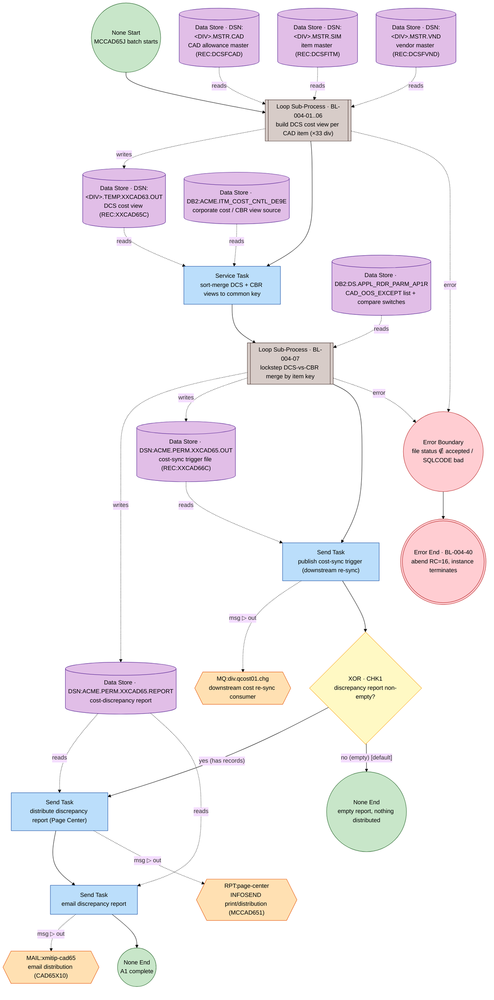
```mermaid
%%{init: {'theme': 'base'}}%%
flowchart TD
  classDef ev   fill:#c8e6c9,stroke:#1b5e20,color:#000;
  classDef task fill:#bbdefb,stroke:#0d47a1,color:#000;
  classDef gw   fill:#fff9c4,stroke:#f9a825,color:#000;
  classDef err  fill:#ffcdd2,stroke:#b71c1c,color:#000;
  classDef data fill:#e1bee7,stroke:#4a148c,color:#000;
  classDef sub  fill:#d7ccc8,stroke:#3e2723,color:#000;
  classDef ext  fill:#ffe0b2,stroke:#e65100,color:#000;

  s1(("None Start<br/>MCCAD65J batch starts")):::ev

  buildDcs[["Loop Sub-Process · BL-004-01..06<br/>build DCS cost view per CAD item (×33 div)"]]:::sub
  sortm["Service Task<br/>sort-merge DCS + CBR views to common key"]:::task
  merge[["Loop Sub-Process · BL-004-07<br/>lockstep DCS-vs-CBR merge by item key"]]:::sub

  gateEmpty{"XOR · CHK1<br/>discrepancy report non-empty?"}:::gw
  sendRpt["Send Task<br/>distribute discrepancy report (Page Center)"]:::task
  sendMail["Send Task<br/>email discrepancy report"]:::task
  emitSync["Send Task<br/>publish cost-sync trigger (downstream re-sync)"]:::task
  endNoRpt(("None End<br/>empty report, nothing distributed")):::ev
  e1(("None End<br/>A1 complete")):::ev

  cadV[("Data Store · DSN:&lt;DIV&gt;.MSTR.CAD<br/>CAD allowance master (REC:DCSFCAD)")]:::data
  simV[("Data Store · DSN:&lt;DIV&gt;.MSTR.SIM<br/>item master (REC:DCSFITM)")]:::data
  vndV[("Data Store · DSN:&lt;DIV&gt;.MSTR.VND<br/>vendor master (REC:DCSFVND)")]:::data
  dcsOut[("Data Store · DSN:&lt;DIV&gt;.TEMP.XXCAD63.OUT<br/>DCS cost view (REC:XXCAD65C)")]:::data
  de9e[("Data Store · DB2:ACME.ITM_COST_CNTL_DE9E<br/>corporate cost / CBR view source")]:::data
  ap1r[("Data Store · DB2:DS.APPL_RDR_PARM_AP1R<br/>CAD_OOS_EXCEPT list + compare switches")]:::data
  rptDs[("Data Store · DSN:ACME.PERM.XXCAD65.REPORT<br/>cost-discrepancy report")]:::data
  outDs[("Data Store · DSN:ACME.PERM.XXCAD65.OUT<br/>cost-sync trigger file (REC:XXCAD66C)")]:::data

  pageExt{{"RPT:page-center<br/>INFOSEND print/distribution (MCCAD651)"}}:::ext
  mailExt{{"MAIL:xmitip-cad65<br/>email distribution (CAD65X10)"}}:::ext
  syncExt{{"MQ:div.qcost01.chg<br/>downstream cost re-sync consumer"}}:::ext

  ebFail(("Error Boundary<br/>file status ∉ accepted / SQLCODE bad")):::err
  fErr((("Error End · BL-004-40<br/>abend RC=16, instance terminates"))):::err

  s1 --> buildDcs
  cadV -. "reads" .-> buildDcs
  simV -. "reads" .-> buildDcs
  vndV -. "reads" .-> buildDcs
  buildDcs -. "writes" .-> dcsOut
  buildDcs --> sortm
  dcsOut -. "reads" .-> sortm
  de9e -. "reads" .-> sortm
  sortm --> merge
  ap1r -. "reads" .-> merge
  merge -. "writes" .-> rptDs
  merge -. "writes" .-> outDs
  outDs -. "reads" .-> emitSync
  emitSync -. "msg ▷ out" .-> syncExt
  merge --> emitSync
  emitSync --> gateEmpty
  gateEmpty -- "yes (has records)" --> sendRpt
  sendRpt --> sendMail
  rptDs -. "reads" .-> sendRpt
  rptDs -. "reads" .-> sendMail
  sendRpt -. "msg ▷ out" .-> pageExt
  sendMail -. "msg ▷ out" .-> mailExt
  sendMail --> e1
  gateEmpty -- "no (empty) [default]" --> endNoRpt

  buildDcs -. "error" .-> ebFail
  merge -. "error" .-> ebFail
  ebFail --> fErr
```

#### 1.2 Sub-graph A2 — `MCCST24J` future-cost-change extract (checkpointed)

Checkpoint read brackets the run; the per-row extract is a Loop Sub-Process (expanded in §2); checkpoint advance closes it.

<!-- mmd:BP-004-A2-process-graph -->
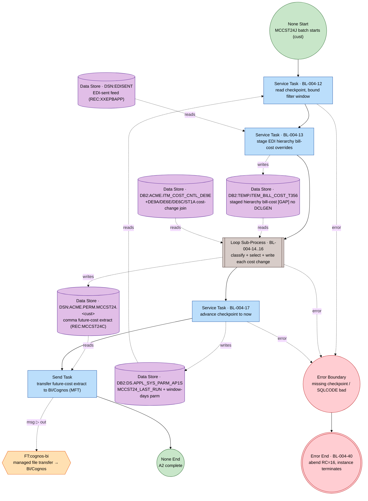
```mermaid
%%{init: {'theme': 'base'}}%%
flowchart TD
  classDef ev   fill:#c8e6c9,stroke:#1b5e20,color:#000;
  classDef task fill:#bbdefb,stroke:#0d47a1,color:#000;
  classDef gw   fill:#fff9c4,stroke:#f9a825,color:#000;
  classDef err  fill:#ffcdd2,stroke:#b71c1c,color:#000;
  classDef data fill:#e1bee7,stroke:#4a148c,color:#000;
  classDef sub  fill:#d7ccc8,stroke:#3e2723,color:#000;
  classDef ext  fill:#ffe0b2,stroke:#e65100,color:#000;

  s2(("None Start<br/>MCCST24J batch starts (cust)")):::ev
  rdChk["Service Task · BL-004-12<br/>read checkpoint, bound filter window"]:::task
  stgEdi["Service Task · BL-004-13<br/>stage EDI hierarchy bill-cost overrides"]:::task
  extLoop[["Loop Sub-Process · BL-004-14..16<br/>classify + select + write each cost change"]]:::sub
  advChk["Service Task · BL-004-17<br/>advance checkpoint to now"]:::task
  xferBI["Send Task<br/>transfer future-cost extract to BI/Cognos (MFT)"]:::task
  e2(("None End<br/>A2 complete")):::ev

  ap1s[("Data Store · DB2:DS.APPL_SYS_PARM_AP1S<br/>MCCST24_LAST_RUN + window-days parm")]:::data
  edi[("Data Store · DSN:EDISENT<br/>EDI-sent feed (REC:XXEPBAPP)")]:::data
  t356[("Data Store · DB2:TEMP.ITEM_BILL_COST_T356<br/>staged hierarchy bill-cost [GAP] no DCLGEN")]:::data
  itm[("Data Store · DB2:ACME.ITM_COST_CNTL_DE9E<br/>+DE9A/DE6E/DE6C/ST1A cost-change join")]:::data
  ext[("Data Store · DSN:ACME.PERM.MCCST24.&lt;cust&gt;<br/>comma future-cost extract (REC:MCCST24C)")]:::data

  biExt{{"FT:cognos-bi<br/>managed file transfer → BI/Cognos"}}:::ext

  ebFail(("Error Boundary<br/>missing checkpoint / SQLCODE bad")):::err
  fErr((("Error End · BL-004-40<br/>abend RC=16, instance terminates"))):::err

  s2 --> rdChk
  ap1s -. "reads" .-> rdChk
  rdChk --> stgEdi
  edi -. "reads" .-> stgEdi
  stgEdi -. "writes" .-> t356
  stgEdi --> extLoop
  t356 -. "reads" .-> extLoop
  itm -. "reads" .-> extLoop
  extLoop -. "writes" .-> ext
  ext -. "reads" .-> xferBI
  xferBI -. "msg ▷ out" .-> biExt
  extLoop --> advChk
  advChk -. "writes" .-> ap1s
  advChk --> xferBI
  xferBI --> e2

  rdChk -. "error" .-> ebFail
  extLoop -. "error" .-> ebFail
  advChk -. "error" .-> ebFail
  ebFail --> fErr
```

#### 1.3 Sub-graph A3 — Costing maintenance cycles (BL-004-18..24)

These are **seven independently-scheduled jobs** (`MCCST50J/62J/63J/70J/96J`, `XXCST64J`). There is no shared control flow between them, so an honest model is **one AND fan-out from a virtual scheduler anchor** — they are genuinely concurrent and unconditional (each has its own JCL trigger), with an AND join before the end (P5). BL-004-19→20 is a true intra-cycle sequence (XXCST62: the classify-and-seed gate gates the clone); the others are single Tasks/Loop Sub-Processes. The hard-fail boundary is drawn once on the block (each program carries its own RC16 routine — same convention).

> Modelling note: the AND split/join is a structural device to keep A3 a single SESE sub-graph for one Start/one End (P1/P5). Each branch is the real unit of work; there is no runtime synchronisation between these jobs in production (they run on independent schedules). An equally valid rendering is seven separate single-job sub-graphs; they are unified here only for one diagram.

<!-- mmd:BP-004-A3-process-graph -->
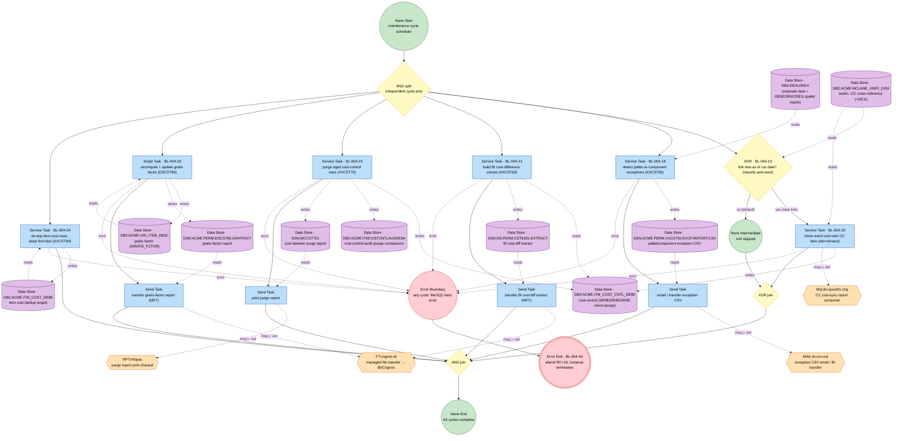
```mermaid
%%{init: {'theme': 'base'}}%%
flowchart TD
  classDef ev   fill:#c8e6c9,stroke:#1b5e20,color:#000;
  classDef task fill:#bbdefb,stroke:#0d47a1,color:#000;
  classDef gw   fill:#fff9c4,stroke:#f9a825,color:#000;
  classDef err  fill:#ffcdd2,stroke:#b71c1c,color:#000;
  classDef data fill:#e1bee7,stroke:#4a148c,color:#000;
  classDef sub  fill:#d7ccc8,stroke:#3e2723,color:#000;
  classDef ext  fill:#ffe0b2,stroke:#e65100,color:#000;

  s3(("None Start<br/>maintenance cycle scheduler")):::ev
  fork{"AND split<br/>independent cycle jobs"}:::gw
  join{"AND join"}:::gw
  e3(("None End<br/>A3 cycles complete")):::ev

  c50["Service Task · BL-004-18<br/>detect pallet-vs-component exceptions (XXCST50)"]:::task
  gate62{"XOR · BL-004-19<br/>link new as of run date? (classify-and-seed)"}:::gw
  c62["Service Task · BL-004-20<br/>clone world cost onto CC item (del+reinsert)"]:::task
  c62skip(("None Intermediate<br/>xref skipped")):::ev
  c62j{"XOR join"}:::gw
  c63["Service Task · BL-004-21<br/>build BI cost-difference extract (XXCST63)"]:::task
  c70["Service Task · BL-004-22<br/>purge aged cost-control rows (XXCST70)"]:::task
  c96["Script Task · BL-004-23<br/>recompute + update gratis factor (DSCST96)"]:::task
  c64["Service Task · BL-004-24<br/>de-dup item-cost rows, keep first+last (XXCST64)"]:::task
  snd50["Send Task<br/>email / transfer exception CSV"]:::task
  snd63["Send Task<br/>transfer BI cost-diff extract (MFT)"]:::task
  snd70["Send Task<br/>print purge report"]:::task
  snd96["Send Task<br/>transfer gratis-factor report (MFT)"]:::task

  dm1x[("Data Store · DB2:DEALDM1X<br/>corporate deal + DE6E/DE6C/DE1I (pallet inputs)")]:::data
  excpDs[("Data Store · DSN:ACME.PERM.XXCST50.EXCP.REPORT.CSV<br/>pallet/component exception CSV")]:::data
  di3x[("Data Store · DB2:ACME.MCLANE_XREF_DI3X<br/>world↔CC cross-reference (+DE1I)")]:::data
  de9eA[("Data Store · DB2:ACME.ITM_COST_CNTL_DE9E<br/>cost-control (DE9E/DE8E/DE6E clone+purge)")]:::data
  de9a[("Data Store · DB2:ACME.ITMCOSTCNTLAUDDE9A<br/>cost-control audit (purge companion)")]:::data
  cst63Ds[("Data Store · DSN:DS.PERM.CST63S1.EXTRACT<br/>BI cost-diff extract")]:::data
  purgeRpt[("Data Store · DSN:MCCST701<br/>cost-deletion purge report")]:::data
  de6c[("Data Store · DB2:ACME.UIN_ITEM_DE6C<br/>gratis factor (GRATIS_FCTOR)")]:::data
  gratDs[("Data Store · DSN:ACME.PERM.DSCST96.GRATFACT<br/>gratis-factor report")]:::data
  de8e[("Data Store · DB2:ACME.ITM_COST_DE8E<br/>item cost (dedup target)")]:::data

  excpExt{{"MAIL:bi-csv-out<br/>exception CSV email / BI transfer"}}:::ext
  biExt{{"FT:cognos-bi<br/>managed file transfer → BI/Cognos"}}:::ext
  syncExt{{"MQ:div.qcost01.chg<br/>CC cost-sync report consumer"}}:::ext
  rptExt{{"RPT:infopac<br/>purge report print channel"}}:::ext

  ebFail(("Error Boundary<br/>any cycle: file/SQL hard error")):::err
  fErr((("Error End · BL-004-40<br/>abend RC=16, instance terminates"))):::err

  s3 --> fork
  fork --> c50
  fork --> gate62
  fork --> c63
  fork --> c70
  fork --> c96
  fork --> c64

  dm1x -. "reads" .-> c50
  c50 -. "writes" .-> excpDs
  excpDs -. "reads" .-> snd50
  snd50 -. "msg ▷ out" .-> excpExt
  snd50 --> join
  c50 --> snd50

  gate62 -- "yes (new link)" --> c62
  gate62 -- "no [default]" --> c62skip
  di3x -. "reads" .-> gate62
  di3x -. "reads" .-> c62
  c62 -. "writes" .-> de9eA
  c62 -. "msg ▷ out" .-> syncExt
  c62 --> c62j
  c62skip --> c62j
  c62j --> join

  c63 -. "reads" .-> de9eA
  c63 -. "writes" .-> cst63Ds
  cst63Ds -. "reads" .-> snd63
  snd63 -. "msg ▷ out" .-> biExt
  snd63 --> join
  c63 --> snd63

  c70 -. "writes" .-> de9eA
  c70 -. "writes" .-> de9a
  c70 -. "writes" .-> purgeRpt
  purgeRpt -. "reads" .-> snd70
  snd70 -. "msg ▷ out" .-> rptExt
  snd70 --> join
  c70 --> snd70

  de6c -. "reads" .-> c96
  c96 -. "writes" .-> de6c
  c96 -. "writes" .-> gratDs
  gratDs -. "reads" .-> snd96
  snd96 -. "msg ▷ out" .-> biExt
  snd96 --> join
  c96 --> snd96

  de8e -. "reads" .-> c64
  c64 -. "writes" .-> de8e
  c64 --> join

  join --> e3

  c50 -. "error" .-> ebFail
  c62 -. "error" .-> ebFail
  c63 -. "error" .-> ebFail
  c70 -. "error" .-> ebFail
  c96 -. "error" .-> ebFail
  c64 -. "error" .-> ebFail
  ebFail --> fErr
```

---

### 2. Sub-process body diagrams

#### 2.1 A1 body — DCS cost-view build Loop (BL-004-01..06)

Per-CAD-item loop. The classify/basis/multi-CAD/default transforms are Tasks; the SIM and vendor screens are validation Gateways with soft-skip XOR branches (item/vendor "not found" is a skip, not a fail — BL-004-40 catches only unexpected statuses). BL-004-01 contains the per-line current/future classification; it is shown as a nested Loop over the item's CAD lines.

<!-- mmd:BP-004-A1-dcs-build-body-process-graph -->
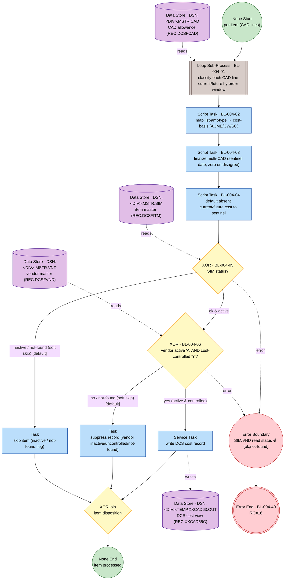
```mermaid
%%{init: {'theme': 'base'}}%%
flowchart TD
  classDef ev   fill:#c8e6c9,stroke:#1b5e20,color:#000;
  classDef task fill:#bbdefb,stroke:#0d47a1,color:#000;
  classDef gw   fill:#fff9c4,stroke:#f9a825,color:#000;
  classDef err  fill:#ffcdd2,stroke:#b71c1c,color:#000;
  classDef data fill:#e1bee7,stroke:#4a148c,color:#000;
  classDef sub  fill:#d7ccc8,stroke:#3e2723,color:#000;

  bs(("None Start<br/>per item (CAD lines)")):::ev

  clsLoop[["Loop Sub-Process · BL-004-01<br/>classify each CAD line current/future by order window"]]:::sub
  basis["Script Task · BL-004-02<br/>map list-amt-type → cost-basis (ACME/CW/SC)"]:::task
  multi["Script Task · BL-004-03<br/>finalize multi-CAD (sentinel date, zero on disagree)"]:::task
  dflt["Script Task · BL-004-04<br/>default absent current/future cost to sentinel"]:::task

  gSim{"XOR · BL-004-05<br/>SIM status?"}:::gw
  skipSim["Task<br/>skip item (inactive / not-found, log)"]:::task
  gVnd{"XOR · BL-004-06<br/>vendor active 'A' AND cost-controlled 'Y'?"}:::gw
  wrt["Service Task<br/>write DCS cost record"]:::task
  skipVnd["Task<br/>suppress record (vendor inactive/uncontrolled/not-found)"]:::task

  jSkip{"XOR join<br/>item disposition"}:::gw
  be(("None End<br/>item processed")):::ev

  cadV[("Data Store · DSN:&lt;DIV&gt;.MSTR.CAD<br/>CAD allowance (REC:DCSFCAD)")]:::data
  simV[("Data Store · DSN:&lt;DIV&gt;.MSTR.SIM<br/>item master (REC:DCSFITM)")]:::data
  vndV[("Data Store · DSN:&lt;DIV&gt;.MSTR.VND<br/>vendor master (REC:DCSFVND)")]:::data
  dcsOut[("Data Store · DSN:&lt;DIV&gt;.TEMP.XXCAD63.OUT<br/>DCS cost view (REC:XXCAD65C)")]:::data

  ebFail(("Error Boundary<br/>SIM/VND read status ∉ {ok,not-found}")):::err
  fErr((("Error End · BL-004-40<br/>RC=16"))):::err

  bs --> clsLoop
  cadV -. "reads" .-> clsLoop
  clsLoop --> basis
  basis --> multi
  multi --> dflt
  dflt --> gSim
  simV -. "reads" .-> gSim
  gSim -- "ok & active" --> gVnd
  gSim -- "inactive / not-found (soft skip) [default]" --> skipSim
  vndV -. "reads" .-> gVnd
  gVnd -- "yes (active & controlled)" --> wrt
  gVnd -- "no / not-found (soft skip) [default]" --> skipVnd
  wrt -. "writes" .-> dcsOut
  wrt --> jSkip
  skipVnd --> jSkip
  skipSim --> jSkip
  jSkip --> be

  gSim -. "error" .-> ebFail
  gVnd -. "error" .-> ebFail
  ebFail --> fErr
```

#### 2.2 A1 body — DCS-vs-CBR lockstep merge Loop with 3-way XOR (§6.2; BL-004-07, 08, 09, 10, 11)

The merge body opens with the 3-way key-comparison XOR (`=`, `>`, `<` — mutually exclusive and exhaustive, P4). The matched branch tests data equality then runs the per-field discrepancy check; the two unequal branches are each side's orphan, routed through the exception classify gate. The exception gate (BL-004-09) short-circuits **both** the orphan paths and the field-discrepancy path (matching the `KEXC` confluence in the call graph). Enrich+emit (BL-004-10/11) fire only on a genuine, non-exception discrepancy.

<!-- mmd:BP-004-A1-merge-3way-body-process-graph -->
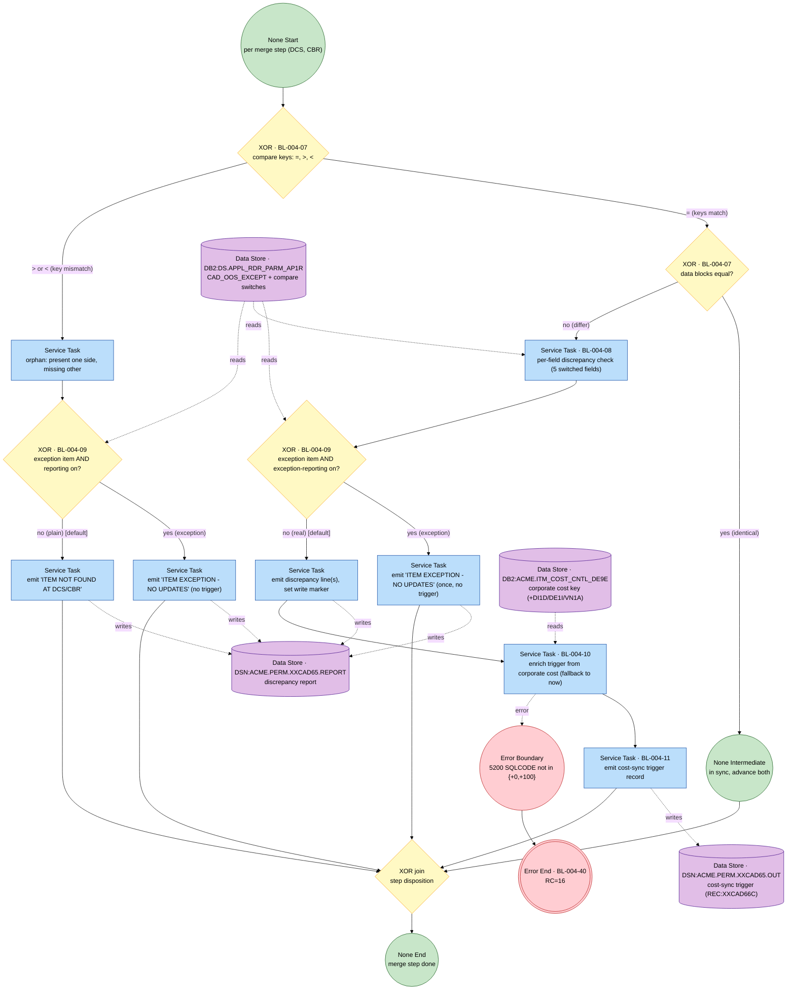
```mermaid
%%{init: {'theme': 'base'}}%%
flowchart TD
  classDef ev   fill:#c8e6c9,stroke:#1b5e20,color:#000;
  classDef task fill:#bbdefb,stroke:#0d47a1,color:#000;
  classDef gw   fill:#fff9c4,stroke:#f9a825,color:#000;
  classDef err  fill:#ffcdd2,stroke:#b71c1c,color:#000;
  classDef data fill:#e1bee7,stroke:#4a148c,color:#000;

  ms(("None Start<br/>per merge step (DCS, CBR)")):::ev
  gKey{"XOR · BL-004-07<br/>compare keys: =, &gt;, &lt;"}:::gw

  gData{"XOR · BL-004-07<br/>data blocks equal?"}:::gw
  insync(("None Intermediate<br/>in sync, advance both")):::ev

  chk["Service Task · BL-004-08<br/>per-field discrepancy check (5 switched fields)"]:::task
  gExc{"XOR · BL-004-09<br/>exception item AND exception-reporting on?"}:::gw
  excLine["Service Task<br/>emit 'ITEM EXCEPTION - NO UPDATES' (once, no trigger)"]:::task
  realDisc["Service Task<br/>emit discrepancy line(s), set write marker"]:::task

  enrich["Service Task · BL-004-10<br/>enrich trigger from corporate cost (fallback to now)"]:::task
  emit["Service Task · BL-004-11<br/>emit cost-sync trigger record"]:::task

  orphan["Service Task<br/>orphan: present one side, missing other"]:::task
  gExc2{"XOR · BL-004-09<br/>exception item AND reporting on?"}:::gw
  excLine2["Service Task<br/>emit 'ITEM EXCEPTION - NO UPDATES' (no trigger)"]:::task
  missLine["Service Task<br/>emit 'ITEM NOT FOUND AT DCS/CBR'"]:::task

  jEnd{"XOR join<br/>step disposition"}:::gw
  me(("None End<br/>merge step done")):::ev

  rptDs[("Data Store · DSN:ACME.PERM.XXCAD65.REPORT<br/>discrepancy report")]:::data
  outDs[("Data Store · DSN:ACME.PERM.XXCAD65.OUT<br/>cost-sync trigger (REC:XXCAD66C)")]:::data
  ap1r[("Data Store · DB2:DS.APPL_RDR_PARM_AP1R<br/>CAD_OOS_EXCEPT + compare switches")]:::data
  de9e[("Data Store · DB2:ACME.ITM_COST_CNTL_DE9E<br/>corporate cost key (+DI1D/DE1I/VN1A)")]:::data

  ebFail(("Error Boundary<br/>5200 SQLCODE not in {+0,+100}")):::err
  fErr((("Error End · BL-004-40<br/>RC=16"))):::err

  ms --> gKey
  gKey -- "= (keys match)" --> gData
  gData -- "yes (identical)" --> insync --> jEnd
  gData -- "no (differ)" --> chk
  ap1r -. "reads" .-> gExc
  ap1r -. "reads" .-> chk
  chk --> gExc
  gExc -- "yes (exception)" --> excLine
  gExc -- "no (real) [default]" --> realDisc
  excLine -. "writes" .-> rptDs
  excLine --> jEnd
  realDisc -. "writes" .-> rptDs
  realDisc --> enrich
  de9e -. "reads" .-> enrich
  enrich --> emit
  emit -. "writes" .-> outDs
  emit --> jEnd

  gKey -- "&gt; or &lt; (key mismatch)" --> orphan
  orphan --> gExc2
  ap1r -. "reads" .-> gExc2
  gExc2 -- "yes (exception)" --> excLine2
  gExc2 -- "no (plain) [default]" --> missLine
  excLine2 -. "writes" .-> rptDs
  missLine -. "writes" .-> rptDs
  excLine2 --> jEnd
  missLine --> jEnd
  jEnd --> me

  enrich -. "error" .-> ebFail
  ebFail --> fErr
```

#### 2.3 A2 body — future-cost extract Loop (BL-004-14, 15, 16)

Per cost-change-row loop. Selection (BL-004-15) is the include/skip XOR gate; classification (BL-004-14) is a Business-Rule Task producing the ADD/CHG/DEL code that is *also consumed downstream as data* (§5.2 case b2) and gates the write via a blank-action XOR; the comma write (BL-004-16) is the reporting Task.

<!-- mmd:BP-004-A2-extract-body-process-graph -->
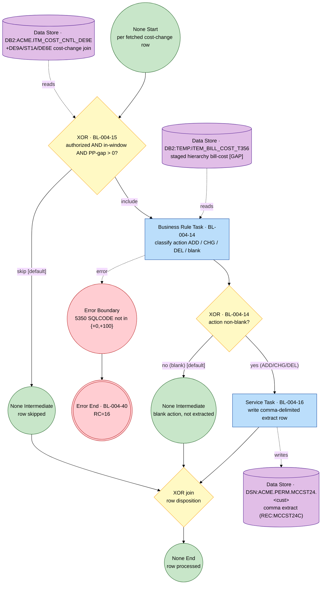
```mermaid
%%{init: {'theme': 'base'}}%%
flowchart TD
  classDef ev   fill:#c8e6c9,stroke:#1b5e20,color:#000;
  classDef task fill:#bbdefb,stroke:#0d47a1,color:#000;
  classDef gw   fill:#fff9c4,stroke:#f9a825,color:#000;
  classDef err  fill:#ffcdd2,stroke:#b71c1c,color:#000;
  classDef data fill:#e1bee7,stroke:#4a148c,color:#000;

  es(("None Start<br/>per fetched cost-change row")):::ev
  gSel{"XOR · BL-004-15<br/>authorized AND in-window AND PP-gap &gt; 0?"}:::gw
  skip(("None Intermediate<br/>row skipped")):::ev
  classify["Business Rule Task · BL-004-14<br/>classify action ADD / CHG / DEL / blank"]:::task
  gAct{"XOR · BL-004-14<br/>action non-blank?"}:::gw
  write["Service Task · BL-004-16<br/>write comma-delimited extract row"]:::task
  noact(("None Intermediate<br/>blank action, not extracted")):::ev
  jEnd{"XOR join<br/>row disposition"}:::gw
  ee(("None End<br/>row processed")):::ev

  itm[("Data Store · DB2:ACME.ITM_COST_CNTL_DE9E<br/>+DE9A/ST1A/DE6E cost-change join")]:::data
  t356[("Data Store · DB2:TEMP.ITEM_BILL_COST_T356<br/>staged hierarchy bill-cost [GAP]")]:::data
  ext[("Data Store · DSN:ACME.PERM.MCCST24.&lt;cust&gt;<br/>comma extract (REC:MCCST24C)")]:::data

  ebFail(("Error Boundary<br/>5350 SQLCODE not in {+0,+100}")):::err
  fErr((("Error End · BL-004-40<br/>RC=16"))):::err

  es --> gSel
  itm -. "reads" .-> gSel
  gSel -- "include" --> classify
  gSel -- "skip [default]" --> skip
  t356 -. "reads" .-> classify
  classify --> gAct
  gAct -- "yes (ADD/CHG/DEL)" --> write
  gAct -- "no (blank) [default]" --> noact
  write -. "writes" .-> ext
  write --> jEnd
  noact --> jEnd
  skip --> jEnd
  jEnd --> ee

  classify -. "error" .-> ebFail
  ebFail --> fErr
```

---

### 3. Rule → element table (total-coverage proof — all 25 rules of §4)

| BL id | Short title | Logic type | §5 element | Sub-graph / diagram |
|---|---|---|---|---|
| BL-004-01 | Classify CAD line current/future by order window | classification | Loop Sub-Process (per-line, nested) — `clsLoop` | A1 §2.1 |
| BL-004-02 | Map list-amt-type → cost-basis (ACME/CW/SC) | transformation (code map) | Task · Script — `basis` | A1 §2.1 |
| BL-004-03 | Flag multi-CAD (sentinel date, zero on disagree) | classification | Task · Script — `multi` | A1 §2.1 |
| BL-004-04 | Default absent current/future cost to sentinel | transformation (default) | Task · Script — `dflt` | A1 §2.1 |
| BL-004-05 | Screen item against active SIM master | validation (filter) | Gateway XOR (soft-skip) — `gSim` | A1 §2.1 |
| BL-004-06 | Emit DCS view only for active cost-controlled vendor | validation (write-gate) | Gateway XOR (soft-skip) — `gVnd` | A1 §2.1 |
| BL-004-07 | Lockstep-merge DCS & CBR by item key | match-merge | Loop Sub-Process + 3-way XOR — `merge`/`gKey`/`gData` | A1 §1.1 / §2.2 |
| BL-004-08 | Detect per-field cost discrepancies | validation (filter) | Task · Service — `chk` | A1 §2.2 |
| BL-004-09 | Suppress updates for exception items | classification | Gateway XOR — `gExc` / `gExc2` (one rule, two confluent uses) | A1 §2.2 |
| BL-004-10 | Enrich sync trigger from corporate cost (fallback) | enrichment | Task · Service — `enrich` | A1 §2.2 |
| BL-004-11 | Emit cost-sync trigger record | routing | Task · Service — `emit` (→ MQ Message Flow) | A1 §2.2 |
| BL-004-12 | Read checkpoint to bound filter window | selection | Task · Service — `rdChk` | A2 §1.2 |
| BL-004-13 | Stage hierarchy bill-cost from EDI feed | data-load (lookup build) | Task · Service — `stgEdi` | A2 §1.2 |
| BL-004-14 | Classify cost change ADD/CHG/DEL | classification | Business-Rule Task → XOR — `classify`/`gAct` (§5.2 b2) | A2 §2.3 |
| BL-004-15 | Select cost changes with positive PP-gap in window | selection | Gateway XOR — `gSel` | A2 §2.3 |
| BL-004-16 | Write comma-delimited future-cost extract row | reporting | Task · Service — `write` | A2 §2.3 |
| BL-004-17 | Advance checkpoint on success | control | Task · Service — `advChk` | A2 §1.2 |
| BL-004-18 | Detect pallet-vs-component exceptions (XXCST50) | validation (filter) | Task · Service — `c50` | A3 §1.3 |
| BL-004-19 | Trigger CC cost sync on new cascade/link (XXCST62) | classification | Gateway XOR (classify-and-seed) — `gate62` | A3 §1.3 |
| BL-004-20 | Clone world cost onto CC item (del+reinsert) (XXCST62) | transformation (normalisation) | Task · Service (seed on true branch) — `c62` | A3 §1.3 |
| BL-004-21 | Build BI cost-difference extract (XXCST63) | reporting | Task · Service — `c63` | A3 §1.3 |
| BL-004-22 | Purge aged cost-control rows by retention (XXCST70) | selection | Task · Service — `c70` | A3 §1.3 |
| BL-004-23 | Recompute + update cigarette gratis factor (DSCST96) | transformation (calculation) | Task · Script — `c96` | A3 §1.3 |
| BL-004-24 | De-dup item-cost rows, keep first+last (XXCST64) | selection | Task · Service — `c64` | A3 §1.3 |
| BL-004-40 | Abend RC=16 on unrecoverable I/O / DB2 error | error-handling | Error Boundary → Error End (§6.4) — one per sub-graph | A1, A2, A3 |

**Coverage: 25/25 rules → exactly one flow node each** (BL-004-09 and BL-004-14 each map to a single logical decision construct that appears at two confluent positions; per §5.2 they remain one rule = one decision element). BL-004-40 is the one promoted mechanic, realized as the reusable §6.4 boundary convention rendered once per sub-graph.

---

### 4. FSM projection

Process A is **largely a stateless transform/reconciliation pipeline** — there is no persisted entity whose lifecycle the process advances through named states. Each sub-graph consumes inputs and produces extracts/triggers/reports; the only stateful artifacts are the **MCCST24 checkpoint** (a single timestamp watermark, not a multi-state lifecycle) and the per-run DB2 mutations of the maintenance cycles. Per the meta-model, the milestone-quotient Mealy FSM (§7.2) is therefore not forced. A faithful big-step reading of each sub-graph is degenerate:

- **A1:** `Start --[ true ] / {01..06}--> built --[ merge done ] / {07,08,09,10,11}--> reconciled --[ report non-empty ] / {distribute}--> End` (plus `--[ empty / default ]--> End`). No entity state; the guards are over transient row data and the report-empty flag.
- **A2:** `Start --[ checkpoint read ] / {12,13}--> staged --[ rows drained ] / {14,15,16}*--> extracted --[ success ] / {17}--> End`. The single "state" worth naming is the checkpoint watermark `MCCST24_LAST_RUN`, which advances monotonically (a counter, not an FSM).
- **A3:** concurrent (AND) — its FSM is the §7.1 product/interleaving of independent single-step branches; business-readable form is one big-step transition whose effect ω is the set `{18,(19→20),21,22,23,24}`.

**Conclusion:** no genuine entity lifecycle exists in Process A; a state machine is not warranted. (Contrast: the price-protection request/rule lifecycle in Processes C/D/F is a true FSM — see the call-graph §8.1 ST3B state machine — but that is out of scope here.)

---

### 5. Purity / conformance notes

**P1 — Bounded (one Start, all paths reach an End, none unreachable):**
- A1: one Start; both terminal Ends (`e1` distribute, `endNoRpt` empty) reachable; merge/build collapse to SESE Sub-Processes. ✔
- A2: one Start, one End; linear with one internal Loop. ✔
- A3: one Start, one End via the AND join; every branch joins. ✔ (Caveat: A3's single Start/End is a modelling unification of seven independently-scheduled jobs — see the note in §1.3. Treated as one sub-graph for diagram cohesion; each branch is independently sound.)

**P2 — Activity contract (1-in/1-out):** every Task has exactly one incoming and one outgoing sequence flow; all branching is on gateways. ✔ Data/message arrows are associations/message flows, not sequence flows, so they don't violate the contract.

**P3 — Gateway contract (no work, conditions on outgoing flows):** all guards (`SIM status`, `vendor active & controlled`, key `=/>/<`, `data equal?`, `exception?`, `include?`, `action non-blank?`, `link new?`, `report non-empty?`) sit on flows leaving gateways. The validation rules BL-004-05/06/15 are Gateways (their "work" is purely the predicate); the *reads* they need are Data Associations into the gateway. ✔

**P4 — XOR determinism & totality:**
- 3-way key XOR (`=`,`>`,`<`) is mutually exclusive and exhaustive. ✔
- Every other XOR carries an explicit `[default]` flow (SIM skip, vendor skip, exception "real", blank-action, select "skip", CC-link "no", report "empty"). ✔
- A3 fork/join is AND (no guards), correctly unconditional. ✔

**P5 — Block structure (SESE, same-type join, nested not overlapping):** A1 merge body — the 3-way key XOR and the nested data/exception/action XORs all reconverge at a single `jEnd` XOR join; regions nest. A1 build body — `gSim`/`gVnd` skip branches reconverge at `jSkip`. A2 body — `gSel`/`gAct` reconverge at `jEnd`. A3 — AND split matched by AND join; the inner BL-004-19 XOR matched by `c62j`. ✔

**P6 — Soundness:** follows from P3+P4+P5; no dead activities (every Task is on a reachable branch), proper completion (single token reaches each End; AND join in A3 synchronizes all six branches). ✔

**P7 — Loops explicit:** the DCS build, the DCS-vs-CBR merge, and the future-cost extract are all `Loop Sub-Process` markers; the per-line classification (BL-004-01) is a nested Loop. No back-edges. ✔

**P8 — Exceptions are events:** BL-004-40 is `Error Boundary → Error End` on the data-access activities in each sub-graph (per §6.4); "item/vendor not found" and "blank action" stay ordinary soft-skip XOR branches, never error events. ✔

**P9 — Separated flows:** external systems (`RPT:page-center`, `MAIL:xmitip-cad65`, `MQ:div.qcost01.chg`, `FT:cognos-bi`, `MAIL:bi-csv-out`, `RPT:infopac`) are black-box external Participants reached only by Message Flow; data-at-rest is Data Stores reached by Data Association. No sequence flow crosses to an external participant. ✔

**Integration register (attributes per §3.5):**
| Endpoint | Dir | Style | Sync | Delivery | Idempotency | Failure policy |
|---|---|---|---|---|---|---|
| `RPT:page-center` (A1 INFOSEND) | out | fire-and-forget | async | at-least-once | n/a (report) | step RC gating (`COND=(4,LT)`) |
| `MAIL:xmitip-cad65` (A1 EMAIL1) | out | fire-and-forget | async | at-least-once | n/a | gated on non-empty report (CHK1) |
| `MQ:div.qcost01.chg` (A1/A3 sync trigger) | out | fire-and-forget (file→consumer) | async | at-least-once | trigger keyed by div+item+ts+1µs | downstream re-sync handles dupes |
| `FT:cognos-bi` (A2/A3 MQ FTE) | out | fire-and-forget | async | at-least-once | extract re-derivable per run | checkpoint not advanced on fail (A2) |
| `MAIL:bi-csv-out` (A3 XXCST50 CSV) | out | fire-and-forget | async | at-least-once | n/a | RC16 on cycle failure |
| `RPT:infopac` (A3 XXCST70 purge report) | out | fire-and-forget | async | at-least-once | n/a | RC16 on cycle failure |

**Orphan-data audit (every Data node needs ≥1 reader and ≥1 writer within scope):**
- **Read-only within Process A** (sources written by other processes — flagged, acceptable as cross-process inputs): `DSN:<DIV>.MSTR.CAD`, `.SIM`, `.VND` (VSAM masters, read-only here); `DB2:ACME.ITM_COST_CNTL_DE9E` is read-only in A1/A2 but **written** in A3 (BL-004-20/22) — net not orphan; `DB2:DS.APPL_RDR_PARM_AP1R` (config, read-only); `DSN:EDISENT` (EDI feed, read-only); `DB2:DEALDM1X`, `DB2:ACME.MCLANE_XREF_DI3X` (read-only inputs). These are legitimately read-only **producers-elsewhere**; flagged per the checklist but not defects.
- **Write-only within Process A** (consumed by external participants via the FTE/email/print, not re-read in-scope): `DSN:ACME.PERM.XXCAD65.REPORT`, `.OUT`; `DSN:ACME.PERM.MCCST24.<cust>`; `DSN:DS.PERM.CST63S1.EXTRACT`; `DSN:ACME.PERM.XXCST50.EXCP.REPORT.CSV`; `DSN:MCCST701`; `DSN:ACME.PERM.DSCST96.GRATFACT`. Each has its sink **modelled as an external participant** (Message Flow), so the write-only-data finding is resolved by §3.5 rather than being a true orphan.
- **Read-write within scope (clean):** `DB2:DS.APPL_SYS_PARM_AP1S` (A2: read BL-004-12, write BL-004-17); `DB2:TEMP.ITEM_BILL_COST_T356` (A2: write BL-004-13, read in extract loop); `DB2:ACME.UIN_ITEM_DE6C` (A3: read+write BL-004-23); `DB2:ACME.ITM_COST_DE8E` (A3: read+write BL-004-24); `DSN:<DIV>.TEMP.XXCAD63.OUT` (A1: written by build, read by sort-merge).

**Data-identity:** every Data node carries a typed `DSN:`/`DB2:` id; every external participant carries an `RPT:`/`MAIL:`/`MQ:`/`FT:` id. ✔

**[GAP]s carried from §4 / call-graph:**
- **`TEMP.ITEM_BILL_COST_T356` (T356)** — staged hierarchy bill-cost table used by BL-004-13/15/16; **no DCLGEN, ungrounded** in the export (spec §3.A; call-graph §3 resource table + §15.2). Modelled as `DB2:TEMP.ITEM_BILL_COST_T356 [GAP]`.
- **A3 inputs with absent DCLGENs/copybooks:** `AP1D`, `PALLET_ITEM_DE6D` (XXCST50 pallet inputs), `TEMP.DIV_ITEM_T329` — absent from export (call-graph §3.3, `DGAP1D`/`DGDE6D` absent). The XXCST50 pallet/component model leans on these `[GAP]` sources; rolled into the `DB2:DEALDM1X + …` composite data node.
- **A3 endpoint inference:** the XXCST50 exception-CSV channel ("emailed / BI-transferred") and the XXCST62 CC-sync report channel are described in prose but not enumerated in the §12.4 external-interface table; modelled as `MAIL:bi-csv-out` and `MQ:div.qcost01.chg` (sync) on best evidence — flag for SME confirmation.
- **MQ object name** is built at runtime from the trigger message (`<DIV>.QCOST01.CHG.{IC1X,CADMF}`, call-graph §12.3); the A1/A3 sync trigger participant is therefore the generic `MQ:div.qcost01.chg`.

**Key modelling decisions worth surfacing to the caller:**
1. **A3 is genuinely seven independent jobs.** I unified them under one AND-fork/join so A3 is a single sound SESE sub-graph (one Start/End). This is a presentational choice; production has no cross-job synchronisation. If you prefer strict fidelity, A3 should be seven separate one-job sub-graphs.
2. **BL-004-09 and BL-004-14 each appear at two positions** in their loop bodies (exception gate on both orphan and field-discrepancy paths; action-classify feeding the write gate). Per §5.2 they are one rule = one decision construct; I rendered the construct twice for flow clarity but count it once for coverage.
3. **BL-004-07's match-merge collapses** to a Loop Sub-Process in the A1 orchestration and is expanded as the §6.2 3-way-XOR body — the canonical legacy two-file-merge pattern.
4. **XXCAD64** (CBR view build) carries no business rule (pure selection/projection, per spec note at line 1312); it is modelled as the data-load input to the sort-merge, not a rule node — consistent with the spec deliberately not assigning it a BL id.

All five requested artifacts are above: orchestration diagrams (A1/A2/A3), sub-process bodies (DCS build, 3-way-XOR merge, future-cost extract), the 25-rule coverage table, the FSM note, and the purity/conformance audit. No files were written.

## 3. Process B — CICS/MQ Online Cost (`MCCST55` → `MCCST50`/`MCCST51`)

**Scope:** §5 rules BL-004-60..77 (MCCST55 dispatcher → MCCST50 IC1X worker / MCCST51 CAD worker). Read-only; no files written. Primary source: `docs/legacy/03-technical/specs/BP-004/BP-004-costing-and-price-protection-business-logic.md` §1/§3.B/§5; data ids + endpoints confirmed against `…-call-graph.md` (lines 528–784, 1924–1989).

**Coverage:** 18 BL rules → 18 distinct flow nodes (1:1). Three diagrams: one orchestration + two worker Sub-Process bodies.

**Modelling decisions worth flagging up front:**
- **MQ queues are external Participants** (`MQ:<DIV>.QCOST01.CHG.IC1X` / `.CADMF`), reached only by Message Flow — never data nodes (meta-model §3.5, P9). The publisher `MCCST40` (BL-004-60) is *outside* Process B's pool — it is the upstream Participant that produces the trigger message. BL-004-60 carries the Message Start that opens the orchestration (the publisher's IC1X-always / CADMF-if-cost-controlled split is the event's two destinations, drawn as message flows from the publisher pool).
- **DB2 error/comment logs ARE data** (`DB2:CMN_ERR_CM5A`, `DB2:COMNT_CM4A`, read-side `DB2:CMN_ERR_DMN_CM6A`) per §3.3.1 + brief — even though the call graph happens to draw them as `RPT:` externals. They are DB2 tables written in-process (data-at-rest), so `DB2:`.
- **`[GAP]`:** No CICS RDO/CSD member in the export — the `MCS4`/`MCS5`/`MCS6` transaction→program bindings (BL-004-61) live only in MCCST55 source. Flagged on the dispatcher gateway.

---

### 1. ORCHESTRATION DIAGRAM — MCCST55 dispatcher + worker Sub-Process references

<!-- mmd:BP-004-B-process-graph -->
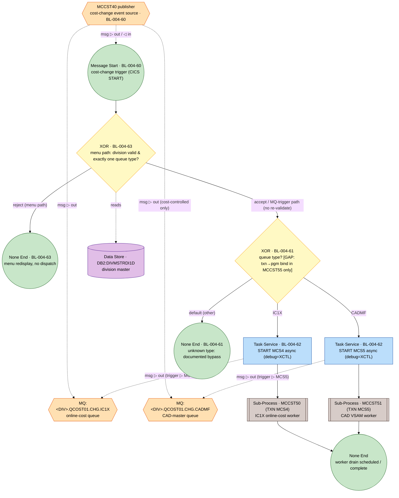
```mermaid
%%{init: {'theme': 'base'}}%%
flowchart TD
  classDef ev   fill:#c8e6c9,stroke:#1b5e20,color:#000;
  classDef task fill:#bbdefb,stroke:#0d47a1,color:#000;
  classDef gw   fill:#fff9c4,stroke:#f9a825,color:#000;
  classDef err  fill:#ffcdd2,stroke:#b71c1c,color:#000;
  classDef data fill:#e1bee7,stroke:#4a148c,color:#000;
  classDef sub  fill:#d7ccc8,stroke:#3e2723,color:#000;
  classDef ext  fill:#ffe0b2,stroke:#e65100,color:#000;

  %% --- external participants (black-box pools) ---
  PUB{{"MCCST40 publisher<br/>cost-change event source · BL-004-60"}}:::ext
  QIC1X{{"MQ:&lt;DIV&gt;.QCOST01.CHG.IC1X<br/>online-cost queue"}}:::ext
  QCAD{{"MQ:&lt;DIV&gt;.QCOST01.CHG.CADMF<br/>CAD-master queue"}}:::ext

  %% --- start ---
  ST(("Message Start · BL-004-60<br/>cost-change trigger (CICS START)")):::ev

  %% --- menu-path precondition (soft) ---
  GVAL{"XOR · BL-004-63<br/>menu path: division valid &amp; exactly one queue type?"}:::gw
  RDSP(("None End · BL-004-63<br/>menu redisplay, no dispatch")):::ev

  %% --- dispatch routing ---
  GRT{"XOR · BL-004-61<br/>queue type? [GAP: txn→pgm bind in MCCST55 only]"}:::gw
  DSP4["Task·Service · BL-004-62<br/>START MCS4 async (debug=XCTL)"]:::task
  DSP5["Task·Service · BL-004-62<br/>START MCS5 async (debug=XCTL)"]:::task
  BYP(("None End · BL-004-61<br/>unknown type: documented bypass")):::ev

  %% --- worker sub-processes ---
  W50[["Sub-Process · MCCST50 (TXN MCS4)<br/>IC1X online-cost worker"]]:::sub
  W51[["Sub-Process · MCCST51 (TXN MCS5)<br/>CAD VSAM worker"]]:::sub

  ENC(("None End<br/>worker drain scheduled / complete")):::ev

  %% --- shared data ---
  DIV[("Data Store · DB2:DIVMSTRDI1D<br/>division master")]:::data

  %% --- flows ---
  PUB -. "msg ▷ out / ◁ in" .-> ST
  PUB -. "msg ▷ out" .-> QIC1X
  PUB -. "msg ▷ out (cost-controlled only)" .-> QCAD

  ST --> GVAL
  GVAL -- "reject (menu path)" --> RDSP
  GVAL -- "accept / MQ-trigger path (no re-validate)" --> GRT
  GVAL -. "reads" .-> DIV

  GRT -- "IC1X" --> DSP4
  GRT -- "CADMF" --> DSP5
  GRT -- "default (other)" --> BYP

  DSP4 -. "msg ▷ out (trigger ▷ MCS4)" .-> QIC1X
  DSP5 -. "msg ▷ out (trigger ▷ MCS5)" .-> QCAD
  DSP4 --> W50
  DSP5 --> W51
  W50 --> ENC
  W51 --> ENC
```

**Notes on the orchestration.** BL-004-63 is modelled as a **soft-XOR** (ordinary skip → menu redisplay End), not an Error Boundary, because the spec says "re-displays the menu with an error and performs no dispatch" — a normal no-op outcome, not a hard-fail (P8). The MQ-trigger path bypasses re-validation, so the "accept" guard covers both "menu input valid" and "arrived via trigger." BL-004-62's debug branch (async START vs in-line XCTL) is an implementation variant of the *same* dispatch act, so it stays one Task (the debug toggle is a `[derived]` config flag, not a separate rule). The two workers are referenced here and detailed in §2.

---

### 2A. SUB-PROCESS BODY — MCCST50 worker (TXN MCS4, IC1X path)

<!-- mmd:BP-004-B-mccst50-worker-body-process-graph -->
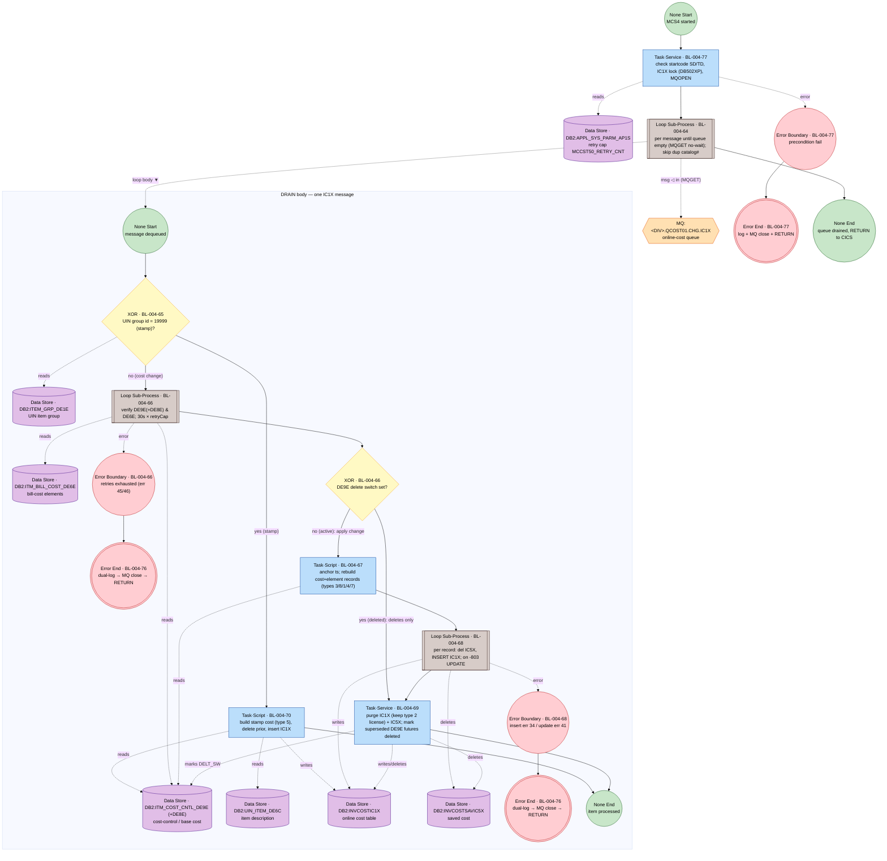
```mermaid
%%{init: {'theme': 'base'}}%%
flowchart TD
  classDef ev   fill:#c8e6c9,stroke:#1b5e20,color:#000;
  classDef task fill:#bbdefb,stroke:#0d47a1,color:#000;
  classDef gw   fill:#fff9c4,stroke:#f9a825,color:#000;
  classDef err  fill:#ffcdd2,stroke:#b71c1c,color:#000;
  classDef data fill:#e1bee7,stroke:#4a148c,color:#000;
  classDef sub  fill:#d7ccc8,stroke:#3e2723,color:#000;
  classDef ext  fill:#ffe0b2,stroke:#e65100,color:#000;

  %% external + data
  QIC1X{{"MQ:&lt;DIV&gt;.QCOST01.CHG.IC1X<br/>online-cost queue"}}:::ext
  D_DE9E[("Data Store · DB2:ITM_COST_CNTL_DE9E (+DE8E)<br/>cost-control / base cost")]:::data
  D_DE6E[("Data Store · DB2:ITM_BILL_COST_DE6E<br/>bill-cost elements")]:::data
  D_DE1E[("Data Store · DB2:ITEM_GRP_DE1E<br/>UIN item group")]:::data
  D_DE6C[("Data Store · DB2:UIN_ITEM_DE6C<br/>item description")]:::data
  D_IC1X[("Data Store · DB2:INVCOSTIC1X<br/>online cost table")]:::data
  D_IC5X[("Data Store · DB2:INVCOSTSAVIC5X<br/>saved cost")]:::data
  D_AP1S[("Data Store · DB2:APPL_SYS_PARM_AP1S<br/>retry cap MCCST50_RETRY_CNT")]:::data

  %% start / preconditions
  WST(("None Start<br/>MCS4 started")):::ev
  PRE["Task·Service · BL-004-77<br/>check startcode SD/TD, IC1X lock (DB502XP), MQOPEN"]:::task
  EBPRE(("Error Boundary · BL-004-77<br/>precondition fail")):::err
  FE77((("Error End · BL-004-77<br/>log + MQ close + RETURN"))):::err

  %% drain loop sub-process
  DRAIN[["Loop Sub-Process · BL-004-64<br/>per message until queue empty (MQGET no-wait); skip dup catalog#"]]:::sub
  WEND(("None End<br/>queue drained, RETURN to CICS")):::ev

  WST --> PRE
  PRE -. "error" .-> EBPRE --> FE77
  PRE --> DRAIN --> WEND
  DRAIN -. "msg ◁ in (MQGET)" .-> QIC1X
  DRAIN -. "loop body ▼" .-> BST
  PRE -. "reads" .-> D_AP1S

  %% ===== expanded loop body =====
  subgraph BODY["DRAIN body — one IC1X message"]
    direction TB
    BST(("None Start<br/>message dequeued")):::ev
    GCLS{"XOR · BL-004-65<br/>UIN group id = 19999 (stamp)?"}:::gw

    %% stamp path
    STMP["Task·Script · BL-004-70<br/>build stamp cost (type 5), delete prior, insert IC1X"]:::task

    %% verify (write-gate) as bounded-retry sub-process
    VER[["Loop Sub-Process · BL-004-66<br/>verify DE9E(+DE8E) &amp; DE6E; 30s × retryCap"]]:::sub
    EBVER(("Error Boundary · BL-004-66<br/>retries exhausted (err 45/46)")):::err
    FE76a((("Error End · BL-004-76<br/>dual-log → MQ close → RETURN"))):::err
    GDEL{"XOR · BL-004-66<br/>DE9E delete switch set?"}:::gw

    %% cost-change build/insert
    CC["Task·Script · BL-004-67<br/>anchor ts; rebuild cost+element records (types 3/8/1/4/7)"]:::task
    WRT[["Loop Sub-Process · BL-004-68<br/>per record: del IC5X, INSERT IC1X; on -803 UPDATE"]]:::sub
    EBWRT(("Error Boundary · BL-004-68<br/>insert err 34 / update err 41")):::err
    FE76b((("Error End · BL-004-76<br/>dual-log → MQ close → RETURN"))):::err
    PURGE["Task·Service · BL-004-69<br/>purge IC1X (keep type 2 license) + IC5X; mark superseded DE9E futures deleted"]:::task

    BEND(("None End<br/>item processed")):::ev

    BST --> GCLS
    GCLS -- "yes (stamp)" --> STMP --> BEND
    GCLS -. "reads" .-> D_DE1E
    STMP -. "reads" .-> D_DE9E
    STMP -. "reads" .-> D_DE6C
    STMP -. "writes" .-> D_IC1X

    GCLS -- "no (cost change)" --> VER
    VER -. "reads" .-> D_DE9E
    VER -. "reads" .-> D_DE6E
    VER -. "error" .-> EBVER --> FE76a
    VER --> GDEL
    GDEL -- "no (active): apply change" --> CC
    GDEL -- "yes (deleted): deletes only" --> PURGE
    CC -. "reads" .-> D_DE9E
    CC --> WRT
    WRT -. "writes" .-> D_IC1X
    WRT -. "deletes" .-> D_IC5X
    WRT -. "error" .-> EBWRT --> FE76b
    WRT --> PURGE
    PURGE -. "writes/deletes" .-> D_IC1X
    PURGE -. "deletes" .-> D_IC5X
    PURGE -. "marks DELT_SW" .-> D_DE9E
    PURGE --> BEND
  end
```

**Notes on MCCST50.** The **30s-retry stays inside** the BL-004-66 verify Loop Sub-Process (no back-edge to the drain — satisfies P7). BL-004-66 yields **two** outcomes: a hard-fail (retries exhausted → Error Boundary → dual-log Error End) and a soft post-verify branch on the DE9E delete switch (active → full rebuild BL-004-67/68; deleted → deletes-only BL-004-69), so the gateway is a normal XOR, not an error. BL-004-68 (insert-then-`-803`-update) is the create-vs-update resolution wrapped as a per-record Loop Sub-Process because BL-004-67 emits 1..n cost-type records; its insert/update faults raise Error Boundary → Error End (via BL-004-76). The dup-catalog#-skip of BL-004-64 is the loop's per-instance guard (an in-memory processed-item set, `[derived]`), not a separate node.

### 2B. SUB-PROCESS BODY — MCCST51 worker (TXN MCS5, CAD path)

<!-- mmd:BP-004-B-mccst51-worker-body-process-graph -->
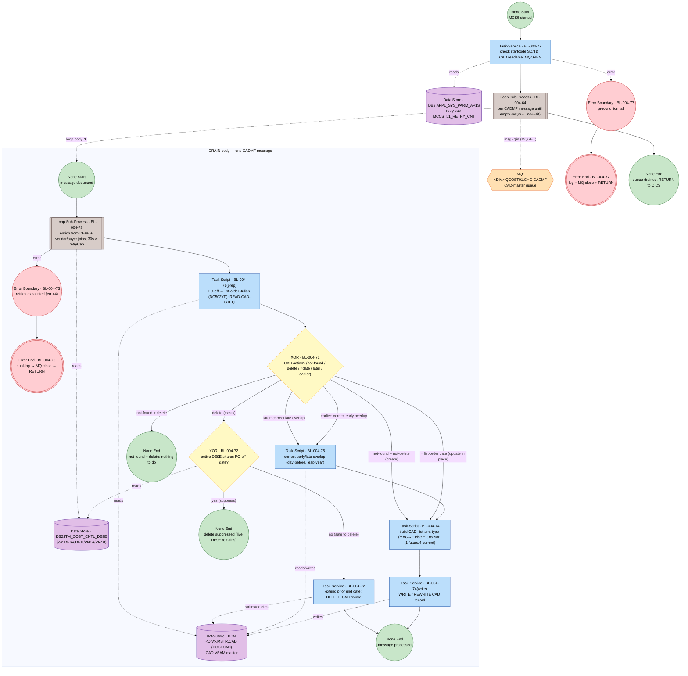
```mermaid
%%{init: {'theme': 'base'}}%%
flowchart TD
  classDef ev   fill:#c8e6c9,stroke:#1b5e20,color:#000;
  classDef task fill:#bbdefb,stroke:#0d47a1,color:#000;
  classDef gw   fill:#fff9c4,stroke:#f9a825,color:#000;
  classDef err  fill:#ffcdd2,stroke:#b71c1c,color:#000;
  classDef data fill:#e1bee7,stroke:#4a148c,color:#000;
  classDef sub  fill:#d7ccc8,stroke:#3e2723,color:#000;
  classDef ext  fill:#ffe0b2,stroke:#e65100,color:#000;

  QCAD{{"MQ:&lt;DIV&gt;.QCOST01.CHG.CADMF<br/>CAD-master queue"}}:::ext
  D_DE9E[("Data Store · DB2:ITM_COST_CNTL_DE9E<br/>(join DE6V/DE1I/VN1A/VN4B)")]:::data
  D_AP1S[("Data Store · DB2:APPL_SYS_PARM_AP1S<br/>retry cap MCCST51_RETRY_CNT")]:::data
  D_CAD[("Data Store · DSN:&lt;DIV&gt;.MSTR.CAD (DCSFCAD)<br/>CAD VSAM master")]:::data

  WST(("None Start<br/>MCS5 started")):::ev
  PRE["Task·Service · BL-004-77<br/>check startcode SD/TD, CAD readable, MQOPEN"]:::task
  EBPRE(("Error Boundary · BL-004-77<br/>precondition fail")):::err
  FE77((("Error End · BL-004-77<br/>log + MQ close + RETURN"))):::err

  DRAIN[["Loop Sub-Process · BL-004-64<br/>per CADMF message until empty (MQGET no-wait)"]]:::sub
  WEND(("None End<br/>queue drained, RETURN to CICS")):::ev

  WST --> PRE
  PRE -. "error" .-> EBPRE --> FE77
  PRE -. "reads" .-> D_AP1S
  PRE --> DRAIN --> WEND
  DRAIN -. "msg ◁ in (MQGET)" .-> QCAD
  DRAIN -. "loop body ▼" .-> BST

  subgraph BODY["DRAIN body — one CADMF message"]
    direction TB
    BST(("None Start<br/>message dequeued")):::ev

    ENR[["Loop Sub-Process · BL-004-73<br/>enrich from DE9E + vendor/buyer joins; 30s × retryCap"]]:::sub
    EBENR(("Error Boundary · BL-004-73<br/>retries exhausted (err 44)")):::err
    FE76((("Error End · BL-004-76<br/>dual-log → MQ close → RETURN"))):::err

    KEY["Task·Script · BL-004-71(prep)<br/>PO-eff → list-order Julian (DC502YP); READ-CAD-GTEQ"]:::task
    GRT{"XOR · BL-004-71<br/>CAD action? (not-found / delete / =date / later / earlier)"}:::gw

    GDLT{"XOR · BL-004-72<br/>active DE9E shares PO-eff date?"}:::gw
    RMV["Task·Service · BL-004-72<br/>extend prior end date; DELETE CAD record"]:::task

    OVL["Task·Script · BL-004-75<br/>correct early/late overlap (day-before, leap-year)"]:::task
    BLD["Task·Script · BL-004-74<br/>build CAD: list-amt-type (MAC→F else H); reason (1 future/4 current)"]:::task
    WCAD["Task·Service · BL-004-74(write)<br/>WRITE / REWRITE CAD record"]:::task

    BEND(("None End<br/>message processed")):::ev
    BNOOP(("None End<br/>not-found + delete: nothing to do")):::ev
    BSUPP(("None End<br/>delete suppressed (live DE9E remains)")):::ev

    BST --> ENR
    ENR -. "reads" .-> D_DE9E
    ENR -. "error" .-> EBENR --> FE76
    ENR --> KEY
    KEY -. "reads" .-> D_CAD
    KEY --> GRT

    GRT -- "not-found + not-delete (create)" --> BLD
    GRT -- "not-found + delete" --> BNOOP
    GRT -- "delete (exists)" --> GDLT
    GRT -- "= list-order date (update in place)" --> BLD
    GRT -- "later: correct late overlap" --> OVL
    GRT -- "earlier: correct early overlap" --> OVL

    GDLT -- "no (safe to delete)" --> RMV
    GDLT -- "yes (suppress)" --> BSUPP
    GDLT -. "reads" .-> D_DE9E
    RMV -. "writes/deletes" .-> D_CAD
    RMV --> BEND

    OVL -. "reads/writes" .-> D_CAD
    OVL --> BLD
    BLD --> WCAD
    WCAD -. "writes" .-> D_CAD
    WCAD --> BEND
  end
```

**Notes on MCCST51.** BL-004-71 is the **multi-branch XOR** (5 branches: create / in-place update / late-correct / early-correct / delete) — totality holds because "not-found" and the three date relations (`=`,`>`,`<`) are mutually exclusive and exhaustive over the GTEQ read result, plus the delete predicate. BL-004-73 enrich runs **before** routing (it supplies the delete switch + cost basis the router needs), with its 30s retry kept inside the Loop Sub-Process. BL-004-72 (delete guard) is a soft-XOR — a suppressed delete is a normal no-op End, not a hard-fail. BL-004-74 is split into a pure build Task·Script (field derivation) and a Task·Service write to satisfy the §3.2 separation (transform vs persist), both carrying BL-004-74. Note: the CAD master is a VSAM dataset the worker reads/writes via CICS file control, so it is `DSN:<DIV>.MSTR.CAD` (data-at-rest), **not** an external participant.

---

### 3. RULE → ELEMENT TABLE (BL-004-60..77)

| BL id | Title (abbrev) | Logic type | Process-graph element | Diagram |
|---|---|---|---|---|
| BL-004-60 | Publish cost-change events (IC1X always, CADMF if cost-controlled) | routing | **Message Start** + publisher external Participant (`MCCST40`) → MQ pools | Orchestration |
| BL-004-61 | Route queue type → txn/program; bypass unknown | routing | **XOR** split (IC1X / CADMF / default-bypass); `[GAP]` flagged | Orchestration |
| BL-004-62 | Start routed worker async (debug = XCTL) | control (distribution) | **Task·Service** ×2 (one per branch; START + trigger msg out) | Orchestration |
| BL-004-63 | Validate division before dispatch (menu path) | validation | **XOR** (soft) → reject = menu-redisplay None End | Orchestration |
| BL-004-64 | Drain queue one msg at a time; one drain/invocation | control (aggregation) | **Loop Sub-Process** (per message until empty) | Both worker bodies |
| BL-004-65 | Classify stamp (19999) vs ordinary cost change | classification | **XOR** gateway (stamp? on DE1E group id) | MCCST50 body |
| BL-004-66 | Mandatory DE9E+DE6E pre-write verify, bounded retry | validation (write-gate) | **Loop Sub-Process** (30s×cap) + Error Boundary; post XOR on delete switch | MCCST50 body |
| BL-004-67 | Rebuild IC1X cost+element records from DE-cost rows | transformation (calc) | **Task·Script** | MCCST50 body |
| BL-004-68 | Insert IC1X; -803 dup → update | transformation (create-vs-update) | **Loop Sub-Process** (per record, insert/-803/update) + Error Boundary | MCCST50 body |
| BL-004-69 | Purge/rebuild IC1X+IC5X; mark superseded DE9E futures | transformation (normalisation) | **Task·Service** | MCCST50 body |
| BL-004-70 | Stamp-cost path: replace single stamp record (type 5) | transformation (calc) | **Task·Script** | MCCST50 body |
| BL-004-71 | Route CAD maintenance by eff-date vs list order | routing | **XOR** split (5-way: create/update/late/early/delete) | MCCST51 body |
| BL-004-72 | Guard CAD delete (live DE9E shares PO-eff date) | validation (write-gate) | **XOR** (soft) → suppress = None End; else delete Task·Service | MCCST51 body |
| BL-004-73 | Enrich CAD change from DE9E, bounded retry | enrichment | **Loop Sub-Process** (30s×cap) + Error Boundary | MCCST51 body |
| BL-004-74 | Build CAD record (basis→list-amt-type; reason) | transformation (code mapping) | **Task·Script** (build) + **Task·Service** (write), both BL-004-74 | MCCST51 body |
| BL-004-75 | Correct CAD cost-period overlap (early/late, leap year) | transformation (calc) | **Task·Script** | MCCST51 body |
| BL-004-76 | Dual error log CM5A + CM4A via CM6A lookup | reporting | **Error End**(s) writing `DB2:CMN_ERR_CM5A` + `DB2:COMNT_CM4A` (reads `DB2:CMN_ERR_DMN_CM6A`) | both bodies |
| BL-004-77 | Operational hard-fail / precondition aborts | error-handling | **Task·Service** (precondition probe) + **Error Boundary → Error End** | both worker bodies (start) |

Every rule maps to exactly one rule-bearing construct (BL-004-62 and BL-004-74 each appear as two co-labelled nodes for the same rule, per the §3.2 work-separation and per-branch-dispatch conventions — still a single rule each). **Total coverage: 18/18.**

**Integration register (per §3.5):**

| Endpoint | Dir | Style | Sync | Delivery | Idempotency | Failure policy |
|---|---|---|---|---|---|---|
| `MQ:<DIV>.QCOST01.CHG.IC1X` | in (consume) / out (trigger) | pub-sub trigger | async | at-least-once, FIFO per queue | dup-catalog# skip (BL-004-64) + -803 upsert (BL-004-68) | MQGET no-wait; on fatal → dual-log + MQ close + RETURN (BL-004-76/77) |
| `MQ:<DIV>.QCOST01.CHG.CADMF` | in (consume) / out (trigger) | pub-sub trigger | async | at-least-once | -803/overlap correction; delete-guard (BL-004-72) | as above (err 44 enrich-exhausted) |
| `MCCST40` publisher pool | out | fire-and-forget | async | — | — | upstream (out of Process B scope) |

---

### 4. FSM PROJECTION

**Per-message processing carries little durable entity-state** — each message is processed and the instance returns to CICS; there is no long-lived process FSM worth a reachability graph beyond the trivial drain. However, two genuine **per-item record-state lifecycles** emerge from the writes, and these are the useful FSM views.

#### 4.1 IC1X online-cost record state (MCCST50) — Mealy quotient

```
states: {ABSENT, CURRENT, SUPERSEDED, DELETED, STAMP}
ABSENT     --[ verify PASS ∧ ¬deleted ∧ first-row ] / BL-004-67,68--> CURRENT
CURRENT    --[ later future-row, element changed ]   / BL-004-67,68--> CURRENT   (additional element rows)
CURRENT    --[ DE9E future not = current change ]    / BL-004-69    --> SUPERSEDED (DELT_SW='Y')
CURRENT    --[ DE9E delete switch set ]              / BL-004-69    --> DELETED   (IC1X purged, license type-2 preserved)
ABSENT     --[ group id = 19999 ]                    / BL-004-70    --> STAMP     (single type-5 record)
(any)      --[ verify exhausted / insert fault ]     / BL-004-76    --> (message abandoned; record unchanged)
```
*Effects* = ordered BL ids fired on the branch; *guards* = the verify/classify/delete conjunctions. License cost (type 2) is an absorbing exception — never deleted (the 12/13/2010 fix).

#### 4.2 CAD cost record state (MCCST51) — Mealy quotient

```
states: {NONE, ACTIVE, ACTIVE', REMOVED}     (ACTIVE' = overlap-corrected neighbour)
NONE     --[ not-found ∧ ¬delete ]                      / BL-004-73,74        --> ACTIVE
ACTIVE   --[ newEff = listOrder ]                       / BL-004-74           --> ACTIVE   (update in place)
ACTIVE   --[ newEff > listOrder ]                       / BL-004-75,74        --> ACTIVE'  (late overlap corrected, new ACTIVE created)
ACTIVE   --[ newEff < listOrder ]                       / BL-004-75,74        --> ACTIVE'  (early overlap corrected, new ACTIVE created)
ACTIVE   --[ delete ∧ ¬(live DE9E shares PO-eff) ]      / BL-004-72           --> REMOVED  (prior end-date extended)
ACTIVE   --[ delete ∧ live DE9E shares PO-eff ]         / (suppress)          --> ACTIVE   (no-op)
NONE     --[ not-found ∧ delete ]                       / (no-op)             --> NONE
```

**Concurrency handling:** big-step (business-readable) — each anchor-to-anchor region here is a single-entry/single-exit XOR block (P5), so no IOR/AND interleaving arises; the FSM is deterministic by P4.

---

### 5. PURITY / CONFORMANCE NOTES (P1–P9)

- **P1 Bounded.** Each diagram has exactly one Start; every path reaches a None End or Error End. Orchestration ends: menu-redisplay / bypass / worker-scheduled. Worker ends: drained-RETURN, plus Error Ends for hard-fails. No unreachable nodes.
- **P2 Activity contract.** Every Task is 1-in/1-out. The two-node renderings of BL-004-62 (per branch) and BL-004-74 (build→write) are each a linear chain, not an implicit split.
- **P3 Gateway contract.** All decisions (BL-004-61/63/65/71/72 and the post-verify delete-switch test of BL-004-66) are gateways doing no work; guards ride the outgoing flows.
- **P4 XOR determinism + totality.** BL-004-61 has an explicit **default** (other → bypass). BL-004-71's five branches partition the GTEQ result (not-found / `=` / `>` / `<`) plus the delete predicate — mutually exclusive and exhaustive. BL-004-63/65/72 are two-way total (with the implicit "else" as the second branch).
- **P5 Block structure (SESE).** Loops are encapsulated as Sub-Processes (drain, verify, write, enrich); each XOR split has a matching merge into a single End or downstream join. Regions nest, none overlap.
- **P6 Soundness.** P3+P4+P5 ⇒ option-to-complete and proper completion; no dead activities (every Task is on a reachable guarded branch). Verified by the FSM quotients above terminating.
- **P7 Loops explicit.** **The 30s bounded-retry in BL-004-66 and BL-004-73 is modelled inside a Loop Sub-Process, NOT a back-edge** (matches the brief). The drain (BL-004-64) and per-record insert (BL-004-68) are likewise Loop Sub-Processes. No arbitrary cycles.
- **P8 Exceptions are events.** All hard-fails — BL-004-77 preconditions, BL-004-66/73 retry exhaustion, BL-004-68 insert/update faults — use **Error Boundary → Error End** (the Error End realising the BL-004-76 dual-log + MQ-close + RETURN). Soft skips (BL-004-63 menu redisplay, BL-004-72 suppressed delete, BL-004-71 not-found+delete no-op) remain ordinary XOR → None End branches.
- **P9 Separated flows.** **MQ queues (`MQ:<DIV>.QCOST01.CHG.IC1X` / `.CADMF`) and the publisher `MCCST40` are external Participants reached only by Message Flow** (dotted `msg ▷/◁`) — confirmed, never data nodes, never crossed by Sequence Flow. Data movement is Data Association only.

**MQ-as-Participant: CONFIRMED.** Both inbound queues + the publisher are black-box pools with `MQ:`/event-source endpoint ids and declared direction/style/delivery/idempotency/failure (integration register, §3). No integration endpoint is a Data node.

**`[GAP]`:** CICS RDO/CSD resource definitions are absent from the export — the `MCS4`/`MCS5`/`MCS6` transaction→program bindings exist only in MCCST55 source. Flagged on the BL-004-61 dispatcher gateway. (BL-004-60's publisher trigger relies on the same CICS START binding.)

**Data-classification deviation from the call graph (deliberate, per brief + §3.3.1):** the call graph draws `CMN_ERR_CM5A` / `COMNT_CM4A` as `RPT:` externals; this graph correctly models them as **`DB2:` Data Stores** (DB2 tables written in-process = data-at-rest), with `DB2:CMN_ERR_DMN_CM6A` as the read-side lookup.

**Orphan-data check (every Data node has ≥1 reader and ≥1 writer):**
- Write-and-read within Process B: `DB2:INVCOSTIC1X` (W: 67/68/69/70; R: 68 dup-probe/69), `DB2:INVCOSTSAVIC5X` (W/del: 68/69; the read is the implicit delete-keyed probe), `DSN:<DIV>.MSTR.CAD` (R: 71; W: 72/74/75), `DB2:DE9E` (R: 66/67/73; W: 69 mark-deleted).
- **Read-only within Process B (writers are external — flagged, not failures):** `DB2:DE6E`, `DB2:DE8E`, `DB2:DE1E`, `DB2:DE6C`, `DB2:VN1A`/`DE6V`/`DE1I`/`VN4B` (vendor/buyer joins), `DB2:APPL_SYS_PARM_AP1S`, `DB2:DIVMSTRDI1D`, `DB2:CMN_ERR_DMN_CM6A`. These are *masters/config* maintained by other BP-004 processes (Process A, reconciliation) — their writers live outside this process boundary, so within Process B they are legitimately read-only reference data (a process-scoped, not global, orphan note).
- **Write-only within Process B:** `DB2:CMN_ERR_CM5A`, `DB2:COMNT_CM4A` — written by BL-004-76 only; their readers are downstream operational-reporting consumers outside Process B. Noted, not a defect.

**Net:** the model is pure (P1–P9 hold), totally covers BL-004-60..77 (18/18), keeps all MQ integration as Participants, keeps every bounded retry inside a Loop Sub-Process, and routes all aborts through Error Boundary → Error End. The only conformance caveats are the documented CICS-RDO `[GAP]` and the cross-process read-only/write-only data nodes inherent to an online worker that consumes masters maintained elsewhere.

## 4. Process C — Price Protection main pipeline (`MCRPR50J`)

**Scope:** BP-004 Process C, one linear batch pipeline `MCRPR50J` (highest-complexity job on the platform). 32 BL-004 rules (BL-004-90..119 + 119a/119b), each mapped to exactly one flow node. Source: business-logic §6 + §1 + §3.C; grounded against the call-graph Anchor C orchestration (`MCRPR50J → XXRPR50/51/52/53/54/57`).

**Programs → stages:** XXRPR50 (intake, 90–98) · MCCNT1 gate (99) · XXRPR51 (cost, 100–105) · XXRPR52 (mutation + orphan sweep, 106–113) · XXRPR57 (allocation/rule expiry, 114–116) · XXRPR53 (notify, 117–118) · XXRPR54 (ledger + same-day re-drive, 119/119a) · shared hard-fail (119b).

---

### 1. Orchestration diagram

<!-- mmd:BP-004-C-process-graph -->

```mermaid
%%{init: {'theme': 'base'}}%%
flowchart TD
  classDef ev   fill:#c8e6c9,stroke:#1b5e20,color:#000;
  classDef task fill:#bbdefb,stroke:#0d47a1,color:#000;
  classDef gw   fill:#fff9c4,stroke:#f9a825,color:#000;
  classDef err  fill:#ffcdd2,stroke:#b71c1c,color:#000;
  classDef data fill:#e1bee7,stroke:#4a148c,color:#000;
  classDef sub  fill:#d7ccc8,stroke:#3e2723,color:#000;
  classDef ext  fill:#ffe0b2,stroke:#e65100,color:#000;

  %% ---------- events ----------
  st(("None Start · MCRPR50J batch job invoked")):::ev
  fin(("None End · cycle complete, ledger marked")):::ev
  hf((("Error End · BL-004-119b · RC16, ROLLBACK, job abends"))):::err

  %% ---------- INTAKE (XXRPR50) BL-90..98 ----------
  t90["Task · Service · BL-004-90<br/>select 2CE/PND requests on non-EXP rules"]:::task
  t91["Task · Service · BL-004-91<br/>claim request → status INP"]:::task
  t92["Task · Service · BL-004-92<br/>enrich request → cust×item detail lines"]:::task
  g93{"XOR · BL-004-93<br/>component type = INV?"}:::gw
  t93s["Task · Service · BL-004-93<br/>screen non-INV vs NPC pricing plans"]:::task
  j93{"XOR join · screened"}:::gw
  t94["Task · Service · BL-004-94<br/>write detail line → RPR50S1 work file"]:::task
  t95["Task · Service · BL-004-95<br/>log per-request intake status"]:::task
  g96{"XOR · BL-004-96<br/>rule output-line count > 0?"}:::gw
  t97["Task · Script · BL-004-97<br/>reclassify req type 2CX→2CA / DWX→DW1"]:::task
  t98["Task · Service · BL-004-98<br/>unlock rule + pending reqs → CMP (no output)"]:::task
  j96{"XOR join · rule handled"}:::gw

  %% ---------- record-count GATE BL-99 ----------
  g99{"XOR · BL-004-99<br/>RPR50S1 has ≥1 record? (MCCNT1)"}:::gw

  %% ---------- COST application (XXRPR51) BL-100..105 ----------
  g100{"XOR · BL-004-100<br/>dispatch by component type"}:::gw
  t101["Task · Service · BL-004-101<br/>License cost (NIC ▸ base fallback)"]:::task
  t102["Task · Service · BL-004-102<br/>Billing cost (DE6E)"]:::task
  t103["Task · Service · BL-004-103<br/>Invoice price via engine (call-out)"]:::task
  j100{"XOR join · cost computed"}:::gw
  t104["Task · Service · BL-004-104<br/>resolve customer xref (CU1X)"]:::task
  t105["Task · Service · BL-004-105<br/>write costed line RPR51S1 + cost status"]:::task

  %% ---------- MUTATION (XXRPR52) BL-106..113 ----------
  g106{"XOR · BL-004-106<br/>dispatch by action code"}:::gw
  g106a{"XOR · BL-004-106<br/>request error count = 0?"}:::gw
  t107["Task · Service · BL-004-107<br/>insert PP2C association"]:::task
  g107{"XOR · dup key (-803)?"}:::gw
  t108["Task · Service · BL-004-108<br/>update PP2C on duplicate (idempotent)"]:::task
  j107{"XOR join · upsert done"}:::gw
  t109["Task · Service · BL-004-109<br/>audit PP7C then delete PP2C"]:::task
  g109{"XOR · BL-004-109<br/>action = RCU / RIT / DEL?"}:::gw
  t110["Task · Service · BL-004-110<br/>prune customer scope PP1C (RCU)"]:::task
  t111["Task · Service · BL-004-111<br/>prune item scope PP1I (RIT)"]:::task
  j109{"XOR join · delete-path done"}:::gw
  j106{"XOR join · line mutated"}:::gw
  sw["Loop Sub-Process · BL-004-112/113<br/>end-of-mutation orphan sweep (items, customers)"]:::sub

  %% ---------- EXPIRY (XXRPR57) BL-114..116 ----------
  t114["Task · Service · BL-004-114<br/>select active alloc groups in window"]:::task
  exp["Loop Sub-Process · BL-004-115/116<br/>per alloc-group cutoff expiry"]:::sub

  %% ---------- NOTIFY (XXRPR53) BL-117..118 ----------
  t117["Task · Business Rule · BL-004-117<br/>classify rule ACT vs ERR; unlock"]:::task
  t118["Task · Send · BL-004-118<br/>build requester email payload"]:::task

  %% ---------- LEDGER (XXRPR54) BL-119/119a ----------
  t119["Task · Service · BL-004-119<br/>mark AP1S ledger CHAR_VAL=CMP"]:::task
  g119a{"XOR · BL-004-119a<br/>same-day rule modified & comment id > 0?"}:::gw
  t119a["Task · Send · BL-004-119a<br/>raise re-drive console message (DSCON03)"]:::task
  j119{"XOR join · ledger closed"}:::gw

  %% ---------- data ----------
  dPP3C[("Data Store · DB2:PP_RQST_PP3C<br/>price-protection request lifecycle")]:::data
  dPP1R[("Data Store · DB2:PP_RULE_PP1R<br/>price-protection rule master")]:::data
  dDET[("Data Object · [derived]<br/>enriched cust×item detail lines")]:::data
  dBUxP[("Data Store · DB2:CUSPRIPLNBU5P / ITMPRIPLNBU3P<br/>national-price-customer pricing plans")]:::data
  dRPR50S1[("Data Store · DSN:ACME.PERM.RPR50S1<br/>cost-application work file (REC XXRPR50C)")]:::data
  dSTAT[("Data Store · DSN:ACME.PERM.RPR.STAT<br/>consolidated step-status file")]:::data
  dDE8E[("Data Store · DB2:ITM_COST_DE8E<br/>item cost / net-item-cost")]:::data
  dDE6E[("Data Store · DB2:ITM_BILL_COST_DE6E<br/>item bill cost")]:::data
  dCU1X[("Data Store · DB2:CUST_XREF_CU1X<br/>customer cross-reference")]:::data
  dRPR51S1[("Data Store · DSN:ACME.PERM.RPR51S1<br/>post-cost (mutation) work file")]:::data
  dPP2C[("Data Store · DB2:PP_CUST_ITEM_PP2C<br/>customer×item cost association")]:::data
  dPP7C[("Data Store · DB2:PPCUSTITEMAUD_PP7C<br/>association audit trail")]:::data
  dPP1C[("Data Store · DB2:PP_CUST_PP1C<br/>rule customer scope")]:::data
  dPP1I[("Data Store · DB2:PP_ITEM_PP1I<br/>rule item scope")]:::data
  dPP1G[("Data Store · DB2:PP_CUST_GRP_PP1G<br/>allocation customer group")]:::data
  dPP2A[("Data Store · DB2:PP_ALLOC_PP2A<br/>allocation definition (read-only here)")]:::data
  dPP9G[("Data Store · DB2:RQST_TYP_PP9G<br/>request-type description")]:::data
  dEMAIL[("Data Store · DSN:ACME.PERM.RPR53.EMAIL<br/>notification file")]:::data
  dAP1S[("Data Store · DB2:DS.APPL_SYS_PARM_AP1S<br/>configuration ledger")]:::data

  %% ---------- external participants ----------
  xMAIL{{"MAIL:XMITIP-RPREML53<br/>requester email (out, fire-and-forget)"}}:::ext
  xCON{{"MAIL:console-DSCON03<br/>operator/scheduler re-drive message"}}:::ext

  %% ---------- INTAKE control flow ----------
  st --> t90 --> t91 --> t92 --> g93
  g93 -- "no (LIC/BIL → screen)" --> t93s --> j93
  g93 -- "yes (INV → bypass)" --> j93
  j93 --> t94 --> t95 --> g96
  g96 -- "count > 0" --> t97 --> j96
  g96 -- "count = 0 (default)" --> t98 --> j96
  j96 --> g99

  %% ---------- GATE ----------
  g99 -- "rows ≥ 1" --> g100
  g99 -- "empty (default)" --> t119

  %% ---------- COST ----------
  g100 -- "LIC" --> t101 --> j100
  g100 -- "BIL" --> t102 --> j100
  g100 -- "INV" --> t103 --> j100
  j100 --> t104 --> t105 --> g106

  %% ---------- MUTATION ----------
  g106 -- "ADD" --> g106a
  g106a -- "err-ctr = 0" --> t107
  g106a -- "err-ctr > 0 (skip)" --> j106
  t107 --> g107
  g107 -- "dup (-803)" --> t108 --> j107
  g107 -- "no dup (default)" --> j107
  j107 --> j106
  g106 -- "DEL / RCU / RIT" --> t109 --> g109
  g109 -- "RCU" --> t110 --> j109
  g109 -- "RIT" --> t111 --> j109
  g109 -- "DEL (default)" --> j109
  j109 --> j106
  j106 --> sw

  %% ---------- EXPIRY ----------
  sw --> t114 --> exp

  %% ---------- NOTIFY ----------
  exp --> t117 --> t118

  %% ---------- LEDGER ----------
  t118 --> t119
  t119 --> g119a
  g119a -- "yes" --> t119a --> j119
  g119a -- "no (default)" --> j119
  j119 --> fin

  %% ---------- data associations ----------
  dPP3C -. "reads" .-> t90
  dPP1R -. "reads" .-> t90
  t91 -. "writes INP" .-> dPP3C
  t92 -. "reads" .-> dPP3C
  t92 -. "writes" .-> dDET
  t93s -. "reads" .-> dBUxP
  dDET -. "reads" .-> t94
  t94 -. "writes" .-> dRPR50S1
  t95 -. "writes" .-> dSTAT
  t97 -. "writes 2CA/DW1" .-> dPP3C
  t98 -. "writes unlock" .-> dPP1R
  t98 -. "writes CMP" .-> dPP3C
  dRPR50S1 -. "reads (count)" .-> g99
  dRPR50S1 -. "reads (sorted)" .-> g100
  dDE8E -. "reads" .-> t101
  dDE6E -. "reads" .-> t102
  dCU1X -. "reads" .-> t104
  t105 -. "writes" .-> dRPR51S1
  t105 -. "writes" .-> dSTAT
  dRPR51S1 -. "reads (sorted)" .-> g106
  t107 -. "writes" .-> dPP2C
  t108 -. "writes" .-> dPP2C
  t109 -. "writes audit" .-> dPP7C
  t109 -. "deletes" .-> dPP2C
  t110 -. "upd+del" .-> dPP1C
  t111 -. "upd+del" .-> dPP1I
  dPP1R -. "reads" .-> t114
  dPP1G -. "reads" .-> t114
  dPP2A -. "reads" .-> t114
  dSTAT -. "reads" .-> t117
  t117 -. "writes ACT/ERR + unlock" .-> dPP1R
  t117 -. "writes 'CMP' (per costed-line; XXRPR53 4100→5400)" .-> dPP3C
  dPP3C -. "reads" .-> t118
  dPP9G -. "reads" .-> t118
  t118 -. "writes" .-> dEMAIL
  t119 -. "writes CMP" .-> dAP1S
  dPP3C -. "reads (same-day)" .-> g119a

  %% ---------- message flows (external) ----------
  t118 -. "msg ▷ out · email ▷ requester" .-> xMAIL
  t119a -. "msg ▷ out · console ▷ scheduler" .-> xCON

  %% ---------- hard-fail boundary (BL-004-119b), canonical §6.4 ----------
  t90  -. "error · other SQLCODE" .-> hf
  t91  -. "error" .-> hf
  t92  -. "error" .-> hf
  g100 -. "error · invalid component type" .-> hf
  t103 -. "error · engine failure" .-> hf
  g106 -. "error · invalid action code" .-> hf
  t107 -. "error · DB2 fault" .-> hf
  t109 -. "error · DB2 fault" .-> hf
  exp  -. "error · DB2 fault" .-> hf
  t117 -. "error · DB2 fault" .-> hf
  t119 -. "error · DB2 fault" .-> hf
```

> **Modelling notes.** (a) BL-004-93, -96, -100, -106, -109 are *classify-and-seed / dispatch* rules: per meta-model §5.2 convention each is modelled as a **Gateway carrying the rule id**, with the work Tasks on its branches. BL-004-93 additionally has a named Task `t93s` for the actual NPC verification (the gateway `g93` is the INV-bypass decision; the NPC verify is the seeded work on the non-INV branch — both legitimately carry the `BL-004-93` id since the rule *is* the conditioned screen). (b) BL-004-119b is the single reusable **Error Boundary → Error End** (canonical §6.4); the dotted "error" edges show every access whose unexpected fault routes to it (drawn from Tasks/Gateways for readability — semantically each is an interrupting Error Boundary on the access Activity). A benign `+100 "no rows"` at intake (BL-004-90) is **not** an error: it is the empty-extract path that the gate BL-004-99 turns into the skip-to-ledger branch. (c) The **record-count gate empty branch** routes to the ledger Task BL-004-119 (grounded in call-graph `GATE …empty → P54[XXRPR54]`), *not* to BL-004-117/118 — see Conformance [GAP-1].

---

### 2. Sub-process body diagrams

#### 2a. Orphan-sweep Loop (BL-004-112 / BL-004-113)

Runs once at end-of-mutation (`KEOF=yes → ORPH`). Two cursors (`ORPHAN-ITEM`, `ORPHAN-CUST`) sweep the rule's item and customer scope for entries with no surviving PP2C association; each removal is audited. Modelled as a Loop Sub-Process; the two selection rules are the two loop bodies (a `for each` over scope rows with an existence test).

<!-- mmd:BP-004-C-orphan-sweep-body-process-graph -->
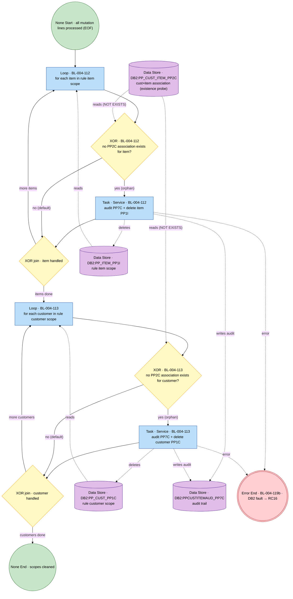
```mermaid
%%{init: {'theme': 'base'}}%%
flowchart TD
  classDef ev   fill:#c8e6c9,stroke:#1b5e20,color:#000;
  classDef task fill:#bbdefb,stroke:#0d47a1,color:#000;
  classDef gw   fill:#fff9c4,stroke:#f9a825,color:#000;
  classDef err  fill:#ffcdd2,stroke:#b71c1c,color:#000;
  classDef data fill:#e1bee7,stroke:#4a148c,color:#000;

  s(("None Start · all mutation lines processed (EOF)")):::ev
  e(("None End · scopes cleaned")):::ev

  %% phase 1: orphan items (BL-112) — loop over item scope
  li["Loop · BL-004-112<br/>for each item in rule item scope"]:::task
  gi{"XOR · BL-004-112<br/>no PP2C association exists for item?"}:::gw
  ai["Task · Service · BL-004-112<br/>audit PP7C + delete item PP1I"]:::task
  ji{"XOR join · item handled"}:::gw

  %% phase 2: orphan customers (BL-113) — loop over customer scope
  lc["Loop · BL-004-113<br/>for each customer in rule customer scope"]:::task
  gc{"XOR · BL-004-113<br/>no PP2C association exists for customer?"}:::gw
  ac["Task · Service · BL-004-113<br/>audit PP7C + delete customer PP1C"]:::task
  jc{"XOR join · customer handled"}:::gw

  dPP1I[("Data Store · DB2:PP_ITEM_PP1I<br/>rule item scope")]:::data
  dPP1C[("Data Store · DB2:PP_CUST_PP1C<br/>rule customer scope")]:::data
  dPP2C[("Data Store · DB2:PP_CUST_ITEM_PP2C<br/>cust×item association (existence probe)")]:::data
  dPP7C[("Data Store · DB2:PPCUSTITEMAUD_PP7C<br/>audit trail")]:::data
  hf((("Error End · BL-004-119b · DB2 fault → RC16"))):::err

  s --> li --> gi
  gi -- "yes (orphan)" --> ai --> ji
  gi -- "no (default)" --> ji
  ji -- "more items" --> li
  ji -- "items done" --> lc
  lc --> gc
  gc -- "yes (orphan)" --> ac --> jc
  gc -- "no (default)" --> jc
  jc -- "more customers" --> lc
  jc -- "customers done" --> e

  dPP1I -. "reads" .-> li
  dPP2C -. "reads (NOT EXISTS)" .-> gi
  ai -. "writes audit" .-> dPP7C
  ai -. "deletes" .-> dPP1I
  dPP1C -. "reads" .-> lc
  dPP2C -. "reads (NOT EXISTS)" .-> gc
  ac -. "writes audit" .-> dPP7C
  ac -. "deletes" .-> dPP1C
  ai -. "error" .-> hf
  ac -. "error" .-> hf
```

#### 2b. Allocation-group expiry Loop (BL-004-114 / 115 / 116)

`ALLOC_CURSOR` (`PP1R⋈PP1G⋈PP2A`) selects eligible groups (BL-004-114); the loop body evaluates each group's cutoff by method (BL-004-115) and, on expiry, conditionally expires the parent rule when it was the last active group (BL-004-116). BL-004-114 is the selection feeding the loop; 115 (classification) + 116 (transformation) are the body.

<!-- mmd:BP-004-C-expiry-body-process-graph -->
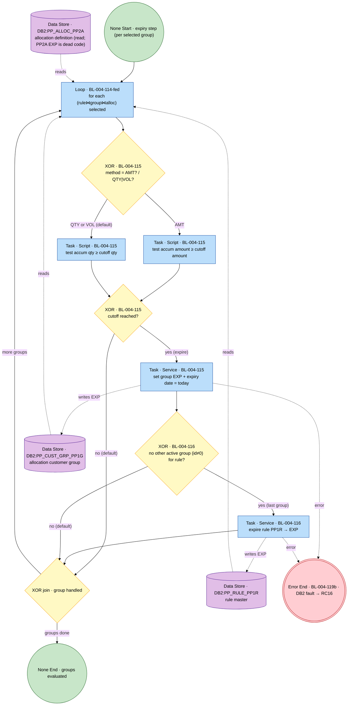
```mermaid
%%{init: {'theme': 'base'}}%%
flowchart TD
  classDef ev   fill:#c8e6c9,stroke:#1b5e20,color:#000;
  classDef task fill:#bbdefb,stroke:#0d47a1,color:#000;
  classDef gw   fill:#fff9c4,stroke:#f9a825,color:#000;
  classDef err  fill:#ffcdd2,stroke:#b71c1c,color:#000;
  classDef data fill:#e1bee7,stroke:#4a148c,color:#000;

  s(("None Start · expiry step (per selected group)")):::ev
  e(("None End · groups evaluated")):::ev

  lp["Loop · BL-004-114-fed<br/>for each (rule⋈group⋈alloc) selected"]:::task
  gm{"XOR · BL-004-115<br/>method = AMT? / QTY|VOL?"}:::gw
  ca["Task · Script · BL-004-115<br/>test accum amount ≥ cutoff amount"]:::task
  cq["Task · Script · BL-004-115<br/>test accum qty ≥ cutoff qty"]:::task
  ge{"XOR · BL-004-115<br/>cutoff reached?"}:::gw
  ex["Task · Service · BL-004-115<br/>set group EXP + expiry date = today"]:::task
  gl{"XOR · BL-004-116<br/>no other active group (id≠0) for rule?"}:::gw
  er["Task · Service · BL-004-116<br/>expire rule PP1R → EXP"]:::task
  jl{"XOR join · group handled"}:::gw

  dPP1G[("Data Store · DB2:PP_CUST_GRP_PP1G<br/>allocation customer group")]:::data
  dPP1R[("Data Store · DB2:PP_RULE_PP1R<br/>rule master")]:::data
  dPP2A[("Data Store · DB2:PP_ALLOC_PP2A<br/>allocation definition (read; PP2A EXP is dead code)")]:::data
  hf((("Error End · BL-004-119b · DB2 fault → RC16"))):::err

  s --> lp --> gm
  gm -- "AMT" --> ca --> ge
  gm -- "QTY or VOL (default)" --> cq --> ge
  ge -- "no (default)" --> jl
  ge -- "yes (expire)" --> ex --> gl
  gl -- "yes (last group)" --> er --> jl
  gl -- "no (default)" --> jl
  jl -- "more groups" --> lp
  jl -- "groups done" --> e

  dPP1R -. "reads" .-> lp
  dPP1G -. "reads" .-> lp
  dPP2A -. "reads" .-> lp
  ex -. "writes EXP" .-> dPP1G
  er -. "writes EXP" .-> dPP1R
  ex -. "error" .-> hf
  er -. "error" .-> hf
```

---

### 3. Rule → element table (all 32 ids)

| BL id | Title (abbrev.) | Logic type | §5 element | Diagram |
|---|---|---|---|---|
| BL-004-90 | Select 2CE/PND requests on live rules | selection | Task · Service | Orchestration |
| BL-004-91 | Claim request → INP | transformation | Task · Service | Orchestration |
| BL-004-92 | Enrich → cust×item detail lines | enrichment | Task · Service | Orchestration |
| BL-004-93 | NPC division check (non-INV) | validation (filter) | XOR Gateway (id) + Task·Service on non-INV branch | Orchestration |
| BL-004-94 | Write detail line → RPR50S1 | transformation | Task · Service | Orchestration |
| BL-004-95 | Log per-request intake status | reporting | Task · Service | Orchestration |
| BL-004-96 | Classify rule: allocate vs complete | classification | XOR Gateway (id) | Orchestration |
| BL-004-97 | Reclassify req type 2CX→2CA / DWX→DW1 | transformation (code mapping) | Task · Script | Orchestration |
| BL-004-98 | Complete no-output rule + unlock | transformation (default) | Task · Service | Orchestration |
| BL-004-99 | Record-count gate (non-empty extract) | control (gate) | XOR Gateway (id) | Orchestration |
| BL-004-100 | Dispatch cost by component type | classification | XOR Gateway (id) | Orchestration |
| BL-004-101 | License cost (NIC ▸ base fallback) | enrichment (fallback) | Task · Service | Orchestration |
| BL-004-102 | Billing cost (DE6E) | enrichment | Task · Service | Orchestration |
| BL-004-103 | Invoice price via external engine | enrichment | Task · Service (call-out) | Orchestration |
| BL-004-104 | Resolve customer xref (CU1X) | enrichment | Task · Service | Orchestration |
| BL-004-105 | Write costed line + cost status | transformation (normalisation) | Task · Service | Orchestration |
| BL-004-106 | Dispatch mutation by action code | classification | XOR Gateway (id) (+ nested err-ctr XOR) | Orchestration |
| BL-004-107 | Insert PP2C association | transformation | Task · Service | Orchestration |
| BL-004-108 | Update PP2C on duplicate (idempotent) | transformation | Task · Service | Orchestration |
| BL-004-109 | Audit (PP7C) then delete (PP2C) | transformation | Task · Service (+ RCU/RIT XOR) | Orchestration |
| BL-004-110 | Prune customer scope PP1C (RCU) | transformation | Task · Service | Orchestration |
| BL-004-111 | Prune item scope PP1I (RIT) | transformation | Task · Service | Orchestration |
| BL-004-112 | Sweep orphan items | selection | Loop Sub-Process (body) | Sub-process 2a |
| BL-004-113 | Sweep orphan customers | selection | Loop Sub-Process (body) | Sub-process 2a |
| BL-004-114 | Select active alloc groups in window | selection | Loop Sub-Process (selection feeding loop) | Sub-process 2b |
| BL-004-115 | Expire group at cutoff (by method) | classification | XOR Gateway (id) + Task·Script (body) | Sub-process 2b |
| BL-004-116 | Expire rule when last group expires | transformation (default) | XOR Gateway (id) + Task·Service (body) | Sub-process 2b |
| BL-004-117 | Classify rule ACT vs ERR; unlock | classification | Task · Business Rule | Orchestration |
| BL-004-118 | Build requester email payload | reporting | Task · Send → MAIL: requester | Orchestration |
| BL-004-119 | Mark AP1S ledger CMP (unconditional) | transformation (default) | Task · Service | Orchestration |
| BL-004-119a | Same-day rule-mod → re-drive console msg | routing | XOR Gateway (id) + Task·Send → MAIL: console | Orchestration |
| BL-004-119b | Operational hard-fail (Anchor C) | error-handling | Error Boundary → Error End | All diagrams |

**Count check:** 32 rules → 32 distinct rule-bearing nodes (each id appears exactly once as a node identity; classify-and-seed rules 93/96/100/106/109/115/116/119a carry their id on the gateway per §5.2, with seeded Tasks sharing the id only where the rule *is* the conditioned work). Total coverage satisfied.

---

### 4. FSM projection (§7.2 Mealy)

Process C drives **two coupled state sets**: the **PP request status lifecycle** (PP3C.STAT — the primary machine) and the **PP rule status lifecycle** (PP1R.STAT — a second state set). Anchors `A = {Start, End} ∪ milestones`. Effects `ω` = ordered BL-004 ids fired; guards `g` = conjoined gateway conditions on the taken branch.

#### 4a. Request status FSM (PP3C.STAT — primary, Mealy)

States `Q = { Start, PND, INP, CMP_no_output, ALLOC_REQUESTED(2CA/DW1), Notified, CMP, End }`.

| From | Guard `g` | Effect `ω` (BL ids) | To |
|---|---|---|---|
| Start | request is 2CE ∧ PND ∧ rule≠EXP | 90 | PND (selected) |
| PND | dequeued for processing | 91 | **INP** |
| INP | (enrich + screen + write + log) | 92, 93, 94, 95 | INP (worked) |
| INP | rule output-line count = 0 | 96, **98** | **CMP_no_output** *(+ rule unlocked)* |
| INP | rule output-line count > 0 ∧ pending companion req | 96, **97** | **ALLOC_REQUESTED** (type 2CX→2CA / DWX→DW1) |
| ALLOC_REQUESTED | gate non-empty ∧ cost+mutation+expiry complete ∧ id ∉ error-set | 100‑116, **117**, completion | **Notified → CMP** *(rule→ACT; request→CMP per costed-line via XXRPR53 4100→5400)* |
| ALLOC_REQUESTED | gate non-empty ∧ id ∈ error-set | 100‑116, **117**, completion | **Notified → CMP** *(rule→ERR; request still →CMP per costed-line)* |
| Notified | email emitted | 118 | Notified (requester informed) |
| CMP / CMP_no_output | end of job (ledger) | 119 (+119a if same-day) | **End** |
| Start | extract empty (gate skip) | 90, **99(empty)**, 119 | **End** *(no work; benign +100)* |

> **Correction (supersedes the earlier [GAP-2]):** Worked requests **do** reach `'CMP'`. XXRPR53's `5400-UPD-PP3C` is commented at its *old* call site (`2200-PROC-INPUT-REC`, `XXRPR53.cbl:446`) but was **relocated and is live** at `4100-READ-RPR51S3-FILE` (`XXRPR53.cbl:637`), which runs once per costed-line (`RPR51S3`) record and executes `UPDATE ACME.PP_RQST_PP3C SET STAT='CMP', RCD_PRCD=…, CMPLTN_TS=CURRENT TIMESTAMP` (`XXRPR53.cbl:854–894`). So the notify stage (XXRPR53) **completes each worked request to `'CMP'`** in addition to setting the rule's `ACT`/`ERR` verdict on PP1R (BL-004-117). The earlier conclusion that this write was dead — drawn from the commented line 446 alone — is **withdrawn**; the orchestration now carries the `t117 → writes 'CMP' → dPP3C` association, and the business-logic spec §15.C note has been corrected to match. (The no-output path still reaches `'CMP'` independently via **BL-004-98**.)

#### 4b. Rule status FSM (PP1R.STAT — second state set, Mealy)

States `Q = { (rule selected, non-EXP), batch-locked, ACT, ERR, EXP }`. (Initial rule state is set before Process C; the lock switch `CBATCH_LOCK_SW` is an orthogonal Y/N latch.)

| From | Guard `g` | Effect `ω` (BL ids) | To |
|---|---|---|---|
| locked (pre-run, ≠EXP) | rule produced no output | **98** | unlocked *(status unchanged; reqs→CMP)* |
| locked | notify: request id ∉ error-set | **117** | **ACT** *(+ unlocked)* |
| locked | notify: request id ∈ error-set | **117** | **ERR** *(+ unlocked)* |
| ACT (allocation rule) | group cutoff reached ∧ it was the last active group | 114, 115, **116** | **EXP** |
| ACT | group cutoff reached ∧ other active groups remain | 114, 115 | ACT *(group→EXP only)* |

**Coupling:** BL-004-115 expires the **group** (PP1G→EXP); BL-004-116 escalates to the **rule** (PP1R→EXP) only when no active group remains. The allocation row **PP2A is never expired** here (XXRPR57 `5750-UPDATE-PP2A` is dead code — §15.C/§15.D). The two FSMs meet at the notify anchor: 117 is the only transition that writes a definitive ACT/ERR verdict and the lock release.

**Concurrency handling:** the model is XOR-only (no IOR/AND) — every region is a deterministic single-token path, so the big-step and interleaved readings coincide; the FSM is exact (no product expansion needed).

---

### 5. Purity / conformance notes

**P1 Bounded** — One None Start; all paths reach `None End` (`fin`) or `Error End` (`hf`). The empty-gate branch (BL-99) and both no-output (BL-98) / worked paths converge on the unconditional ledger (BL-119) → End. No unreachable nodes.

**P2 Activity contract** — Every Task is 1-in/1-out. Dispatching that the source does "inside" a paragraph (KINV, KRULE, KACT, KDUP, KRCU/KRIT, method test, cutoff test, same-day test) is lifted out of the Tasks onto dedicated **Gateways**, so no Activity branches.

**P3 Gateway contract** — Gateways carry only boolean conditions over data (component type, action code, row count, SQLCODE −803, method, accumulator-vs-cutoff, same-day predicate); none perform work. Classify-and-seed rules (93/96/100/106/109/115/116/119a) follow §5.2: id on gateway, work on branch Tasks.

**P4 Determinism + totality (XOR)** — Every XOR split has an explicit **default**: g96 default = count=0; g99 default = empty; g100 else = hard-fail (BL-119b); g106 else = hard-fail; g106a skip; g107 default = no-dup; g109 default = DEL; g115(method) default = QTY|VOL; g115(cutoff)/g116/g119a defaults = no-op. Guards are mutually exclusive and exhaustive.

**P5 Block structure (SESE)** — Each split has a matching same-type join (`j93, j96, j100, j106/j107/j109, j119` in orchestration; `ji/jc, jl` in sub-processes). Regions nest without overlap. The two loops are encapsulated as Sub-Processes (single entry/exit).

**P6 Soundness** — P3+P4+P5 ⇒ option-to-complete and proper completion; no dead activities (all 32 rule nodes reachable). The only "dead" items are explicitly excluded source paragraphs (below), not model nodes.

**P7 Loops explicit** — The two iterations (orphan sweep 112/113; allocation expiry 114–116) are Loop Sub-Processes with the loop key as the boundary; no arbitrary back-edges. The per-line main pipeline is itself a record-driven loop over the work files but is rendered as the linear stage chain (the per-record iteration is the implicit MI boundary of the batch job; documented, not drawn as a back-edge — consistent with §6.1).

**P8 Exceptions are events** — All aborts use the single canonical Error Boundary → Error End (BL-004-119b, §6.4). The benign `+100 "no rows"` at intake is **not** an error: it is the normal-end / empty-extract path handled by the BL-99 gate's default branch. The no-output rule completion (BL-98) is an ordinary XOR branch, not an exception.

**P9 Separated flows** — The two external participants (`MAIL:XMITIP-RPREML53` requester email; `MAIL:console-DSCON03` operator/scheduler re-drive) are reached **only** by Message Flow from Send Tasks BL-118 / BL-119a. No Sequence Flow crosses to them; no integration is modelled as a Data node.

**Data identity** — All 19 Data nodes carry typed ids (`DB2:` masters/tables, `DSN:` work/status/email files) or `[derived]` (the in-flight enriched detail-line collection). No untyped data.

**Orphan-data check** — Every Data Store has ≥1 reader and ≥1 writer **within Process C except** three legitimately-external boundaries:
- `DB2:ITM_COST_DE8E`, `DB2:ITM_BILL_COST_DE6E`, `DB2:CUST_XREF_CU1X`, `DB2:CUSPRIPLNBU5P/ITMPRIPLNBU3P`, `DB2:RQST_TYP_PP9G`, `DB2:PP_ALLOC_PP2A` — **read-only here** (maintained by other BP-004 processes: DE8E/DE6E by Costing batch; PP2A by Process D/F). These are *cross-process inputs*, not orphans; flagged as read-only-in-C by design.
- `DSN:ACME.PERM.RPR53.EMAIL` — written by BL-118; its reader is the XMITIP distribution step (impl-mechanics §13.2) that feeds the `MAIL:` participant. Treated as the staging artifact behind the Message Flow (not write-only in the business sense).
- All hot tables (PP3C, PP1R, PP2C, PP7C, PP1C, PP1I, PP1G, AP1S) and intermediate files (RPR50S1, RPR51S1, RPR.STAT) have both readers and writers inside C. ✔

**Unplaced rules** — None. All 32 ids placed exactly once.

**Dead-code exclusions (NOT live nodes), per §15.C/§15.D — corrected after source re-verification:**
- **XXRPR53 `5400-UPD-PP3C` — NOT dead (correction).** The call at `2200`/line 446 is commented, but the paragraph is **live** at `4100-READ-RPR51S3-FILE`/line 637 and runs per costed-line, completing each worked request to `'CMP'` (see the Correction in §4a). Only the *old* call site is dead; the write executes. BL-004-117's stage therefore writes **both** PP1R (ACT/ERR + unlock) **and** PP3C (`'CMP'`). The earlier "excluded" classification is withdrawn.
- **XXRPR57 `5750-UPDATE-PP2A`** (allocation rows → `'EXP'`) — commented out (lines 565–566), **with no live call site anywhere** (verified). BL-004-116 expires **PP1G + PP1R only**; PP2A is read-only in the expiry loop. This is the one genuine dead-code exclusion in Process C.

**[GAP]s (carried from §15.C, relevant to the graph):**
- **[GAP-1] Gate skip target.** BL-004-99's prose says "skip to end-of-job ledger step (BL-004-117/118)", but the call-graph orchestration shows the empty branch skips to **XXRPR54 = BL-004-119** (`GATE …empty → P54`), with the notify block 117/118 *inside* the gated region (it depends on RPR51S3/RPR.STAT which only exist if the block ran). I modelled the **grounded** behavior (empty → BL-119); the "117/118" in the rule text is an off-by-reference typo. Recommend correcting the rule prose to "skip to BL-004-119".
- **[GAP-2] — RESOLVED.** Worked-request `INP→CMP` **does** fire (live `5400-UPD-PP3C` at `XXRPR53.cbl:637`, per costed-line). The prior dead-code claim is withdrawn (§4a Correction); the companion business-logic §15.C note has been corrected to match. No outstanding SME action.
- **[GAP-3] Invoice-price engine `XXQBI11`** internals opaque — BL-004-103 is a black-box `Task·Service (call-out)`; per §3.5 it is arguably an external `API:` participant. I kept it as a costed-line enrichment Task with a hard-fail edge (engine error → BL-119b) because the spec classifies it `enrichment` and the call-graph marks it `[GAP]`; if treated as a true external API it would become a Service-Task call-out ↔ `API:XXQBI11` Pool with a Timer/Error boundary. Noted for the design-spec stage.
- **[GAP-4] Id-band overflow** — 32 rules vs the allocated BL-004-90..119 (30). 119a/119b are in-band placeholders (routing + error-handling cannot merge into BL-119's transformation without violating one-rule-per-type). Recommend extending the band to BL-004-121.
- **[note] XXRPR57 coupling** — the allocation-expiry loop (114–116) is physically nested in the 70-series `CHK72` gate, so it fires only when the 70-series block runs in the same job; modelled as an independent stage per the spec's intent.

**Dead-code (data-integrity) sanity:** the meta-model conformance checklist item "no write-only/read-only data" is satisfied at the *process* level once cross-process inputs (DE8E/DE6E/CU1X/BUxP/PP9G/PP2A) are recognised as external read boundaries — these are inputs Process C consumes but does not own, which is the correct modelling per §3.3 (a Data Store shared across pools).

---

**Files referenced (all absolute):**
- Primary: `/Users/duncan/projects/external/acme/acme-paradigm/docs/legacy/03-technical/specs/BP-004/BP-004-costing-and-price-protection-business-logic.md` (§1 lines 22–37; §2.C lines 118–152; §3.C lines 488–562; **§6 lines 2118–2741**; §15.C lines 5824–5832)
- Meta-model: `/Users/duncan/projects/external/acme/acme-paradigm/reference/process-graph-meta-model.md`
- Secondary (grounding): `/Users/duncan/projects/external/acme/acme-paradigm/docs/legacy/03-technical/specs/BP-004/BP-004-costing-and-price-protection-call-graph.md` (Anchor C lines 787–972; data register lines 1913–1992)

No files were written or edited (read-only task).

## 5. Process D — Price Protection allocation & expiry (`MCRPR71J` / `MCRPR74J`)

**Source:** `docs/legacy/03-technical/specs/BP-004/BP-004-costing-and-price-protection-business-logic.md` §7 (BL-004-120..138), §1, §3.D; orchestration confirmed against `…-call-graph.md` §6.
**Conforms to:** `reference/process-graph-meta-model.md`.
**Modeling decision:** Two physically independent batch jobs → **two sound SESE sub-graphs** (D1 = MCRPR71J, D2 = MCRPR74J), each with its own Start, its own hard-fail (BL-004-138) Error Boundary→Error End, and its own normal End. Three control-break aggregations (BL-004-122, 133, 136) are modeled per §6.1 as Multi-Instance Sub-Processes with bodies provided in section 2.

---

### 1. ORCHESTRATION DIAGRAMS

#### 1.1 — D1: MCRPR71J allocation recalc & expiry (BL-004-120..130, +138)

<!-- mmd:BP-004-D1-process-graph -->
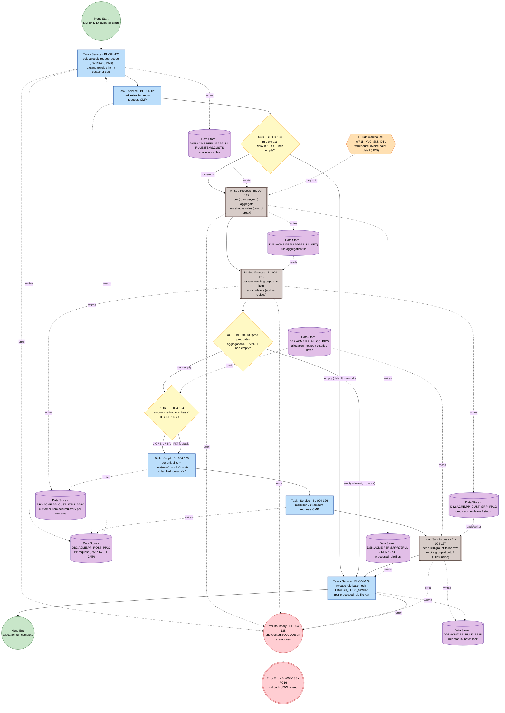
```mermaid
%%{init: {'theme': 'base'}}%%
flowchart TD
  classDef ev   fill:#c8e6c9,stroke:#1b5e20,color:#000;
  classDef task fill:#bbdefb,stroke:#0d47a1,color:#000;
  classDef gw   fill:#fff9c4,stroke:#f9a825,color:#000;
  classDef err  fill:#ffcdd2,stroke:#b71c1c,color:#000;
  classDef data fill:#e1bee7,stroke:#4a148c,color:#000;
  classDef sub  fill:#d7ccc8,stroke:#3e2723,color:#000;
  classDef ext  fill:#ffe0b2,stroke:#e65100,color:#000;

  st(("None Start<br/>MCRPR71J batch job starts")):::ev

  %% --- scope extraction (XXRPR70 -> XXRPR71) ---
  sel["Task · Service · BL-004-120<br/>select recalc-request scope (DW1/DW2, PND)<br/>expand to rule / item / customer sets"]:::task
  cmp1["Task · Service · BL-004-121<br/>mark extracted recalc requests CMP"]:::task

  %% --- gate 1: rule extract empty? (CHK71) ---
  g130a{"XOR · BL-004-130<br/>rule extract RPR71S1.RULE non-empty?"}:::gw

  %% --- aggregate + recalc block ---
  agg[["MI Sub-Process · BL-004-122<br/>per (rule,cust,item): aggregate<br/>warehouse sales (control break)"]]:::sub
  recalc[["MI Sub-Process · BL-004-123<br/>per rule: recalc group / cust-item<br/>accumulators (add vs replace)"]]:::sub

  %% --- gate 2: aggregation empty? (CHK72) ---
  g130b{"XOR · BL-004-130 (2nd predicate)<br/>aggregation RPR721S1 non-empty?"}:::gw

  %% --- per-unit amount derivation (XXRPR70 amount-method path) ---
  clsf{"XOR · BL-004-124<br/>amount-method cost basis?<br/>LIC / BIL / INV / FLT"}:::gw
  pu["Task · Script · BL-004-125<br/>per-unit alloc = max(newCost-oldCost,0)<br/>or flat; bad lookup -> 0"]:::task
  cmp2["Task · Service · BL-004-126<br/>mark per-unit-amount requests CMP"]:::task

  %% --- expiry block (XXRPR57) ---
  expg[["Loop Sub-Process · BL-004-127<br/>per rule⋈group⋈alloc row:<br/>expire group at cutoff (+128 inside)"]]:::sub

  %% --- unlock (XXRPR78 x2) ---
  unlock["Task · Service · BL-004-129<br/>release rule batch-lock CBATCH_LOCK_SW='N'<br/>(per processed rule file x2)"]:::task
  en(("None End<br/>allocation run complete")):::ev

  %% --- hard-fail boundary ---
  eb(("Error Boundary · BL-004-138<br/>unexpected SQLCODE on any access")):::err
  hf((("Error End · BL-004-138 · RC16<br/>roll back UOW, abend"))):::err

  %% --- data ---
  dRq[("Data Store · DB2:ACME.PP_RQST_PP3C<br/>PP request (DW1/DW2 -> CMP)")]:::data
  dScope[("Data Store · DSN:ACME.PERM.RPR71S1.{RULE,ITEMS,CUSTS}<br/>scope work files")]:::data
  dAgg[("Data Store · DSN:ACME.PERM.RPR721S1(.SRT)<br/>rule aggregation file")]:::data
  dRul[("Data Store · DSN:ACME.PERM.RPR72RUL / RPR73RUL<br/>processed-rule files")]:::data
  dPP1G[("Data Store · DB2:ACME.PP_CUST_GRP_PP1G<br/>group accumulators / status")]:::data
  dPP2C[("Data Store · DB2:ACME.PP_CUST_ITEM_PP2C<br/>customer-item accumulator / per-unit amt")]:::data
  dPP1R[("Data Store · DB2:ACME.PP_RULE_PP1R<br/>rule status / batch-lock")]:::data
  dPP2A[("Data Store · DB2:ACME.PP_ALLOC_PP2A<br/>allocation method / cutoffs / dates")]:::data
  wh{{"FT:udb-warehouse WF1I_INVC_SLS_DTL<br/>warehouse invoice-sales detail (UDB)"}}:::ext

  %% --- control flow ---
  st --> sel --> cmp1 --> g130a
  g130a -- "non-empty" --> agg
  g130a -- "empty (default, no work)" --> unlock
  agg --> recalc --> g130b
  g130b -- "non-empty" --> clsf
  g130b -- "empty (default, no work)" --> unlock
  clsf -- "LIC / BIL / INV" --> pu
  clsf -- "FLT [default]" --> pu
  pu --> cmp2 --> expg
  expg --> unlock --> en

  %% --- error boundary (any data-access task/sub-process) ---
  sel -. "error" .-> eb
  agg -. "error" .-> eb
  recalc -. "error" .-> eb
  expg -. "error" .-> eb
  unlock -. "error" .-> eb
  eb --> hf

  %% --- data associations ---
  dRq  -. "reads" .-> sel
  sel  -. "writes" .-> dScope
  sel  -. "writes" .-> dRq
  cmp1 -. "writes" .-> dRq
  dScope -. "reads" .-> agg
  wh   -. "msg ◁ in" .-> agg
  agg  -. "writes" .-> dAgg
  agg  -. "writes" .-> dRul
  dAgg -. "reads" .-> recalc
  recalc -. "writes" .-> dPP1G
  recalc -. "writes" .-> dPP2C
  dPP2A -. "reads" .-> clsf
  pu   -. "writes" .-> dPP2C
  cmp2 -. "writes" .-> dRq
  dPP2A -. "reads" .-> expg
  dPP1G -. "reads/writes" .-> expg
  expg -. "writes" .-> dPP1R
  dRul -. "reads" .-> unlock
  unlock -. "writes" .-> dPP1R
```

**Note on BL-004-130 (two physical gates).** The call-graph orchestration (§6) shows two decisions — `CHK71` (rule extract empty?) and `CHK72` (aggregation empty?) — both realized by the single soft-gate rule BL-004-130 (its pseudocode `GATE-ALLOCATION-PHASES()` literally contains both tests). To honour both "one BL rule = one node id" and the real nested topology, both gateways carry `BL-004-130`; the second is labelled "(2nd predicate)". Both empty-branches converge on the unlock task (the always-runs phase), exactly as `CHK71/CHK72 -. "empty → skip" .-> P78`.

**Note on BL-004-124 (classify→route).** Per §5.2 b1 / §5.2 *classify-and-seed* convention, the cost-basis classification is modeled as the **Gateway** carrying the rule id; all four branches (LIC/BIL/INV/FLT) lead to the single per-unit calculation Task BL-004-125 (the formula differs per basis but is one rule). The `UNHANDLED` fifth case from the pseudocode cannot occur (the ALLOC_CURSOR selection restricts to the four), so the XOR is total over the reachable input — documented under P4.

---

#### 1.2 — D2: MCRPR74J billing→allocation 2-step sync (BL-004-131..137, +138)

<!-- mmd:BP-004-D2-process-graph -->
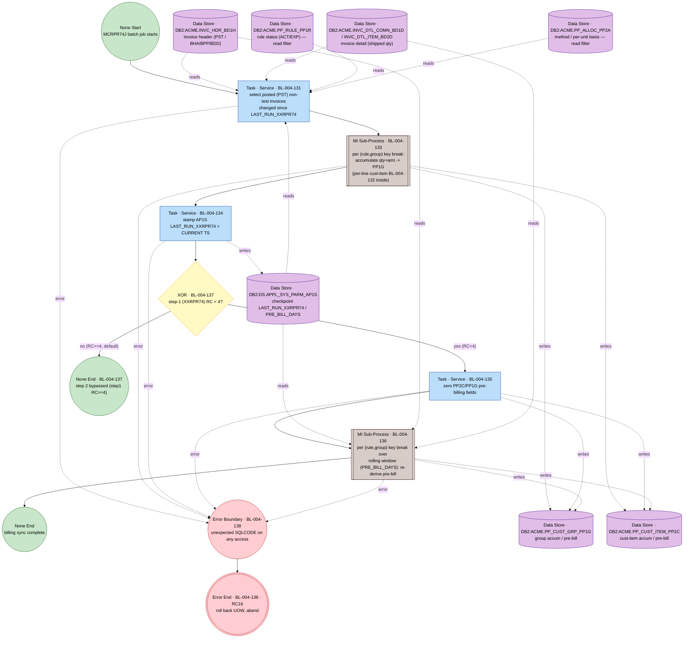
```mermaid
%%{init: {'theme': 'base'}}%%
flowchart TD
  classDef ev   fill:#c8e6c9,stroke:#1b5e20,color:#000;
  classDef task fill:#bbdefb,stroke:#0d47a1,color:#000;
  classDef gw   fill:#fff9c4,stroke:#f9a825,color:#000;
  classDef err  fill:#ffcdd2,stroke:#b71c1c,color:#000;
  classDef data fill:#e1bee7,stroke:#4a148c,color:#000;
  classDef sub  fill:#d7ccc8,stroke:#3e2723,color:#000;
  classDef ext  fill:#ffe0b2,stroke:#e65100,color:#000;

  st(("None Start<br/>MCRPR74J batch job starts")):::ev

  %% --- step 1: XXRPR74 accumulate ---
  selI["Task · Service · BL-004-131<br/>select posted (PST) non-test invoices<br/>changed since LAST_RUN_XXRPR74"]:::task
  accG[["MI Sub-Process · BL-004-133<br/>per (rule,group) key break:<br/>accumulate qty+amt -> PP1G<br/>(per-line cust-item BL-004-132 inside)"]]:::sub
  chk["Task · Service · BL-004-134<br/>stamp AP1S LAST_RUN_XXRPR74 = CURRENT TS"]:::task

  %% --- step-order gate (per-proc COND=(4,LT)) ---
  ord{"XOR · BL-004-137<br/>step-1 (XXRPR74) RC < 4?"}:::gw

  %% --- step 2: XXRPR75 zero then re-derive ---
  zero["Task · Service · BL-004-135<br/>zero PP2C/PP1G pre-billing fields"]:::task
  redrv[["MI Sub-Process · BL-004-136<br/>per (rule,group) key break over<br/>rolling window (PRE_BILL_DAYS): re-derive pre-bill"]]:::sub

  en(("None End<br/>billing sync complete")):::ev
  enByp(("None End · BL-004-137<br/>step 2 bypassed (step1 RC>=4)")):::ev

  %% --- hard-fail ---
  eb(("Error Boundary · BL-004-138<br/>unexpected SQLCODE on any access")):::err
  hf((("Error End · BL-004-138 · RC16<br/>roll back UOW, abend"))):::err

  %% --- data ---
  dInvH[("Data Store · DB2:ACME.INVC_HDR_BD1H<br/>invoice header (PST / BHA/BPP/BDD)")]:::data
  dInvD[("Data Store · DB2:ACME.INVC_DTL_COMN_BD1D / INVC_DTL_ITEM_BD2D<br/>invoice detail (shipped qty)")]:::data
  dAP1S[("Data Store · DB2:DS.APPL_SYS_PARM_AP1S<br/>checkpoint LAST_RUN_XXRPR74 / PRE_BILL_DAYS")]:::data
  dPP1G[("Data Store · DB2:ACME.PP_CUST_GRP_PP1G<br/>group accum / pre-bill")]:::data
  dPP2C[("Data Store · DB2:ACME.PP_CUST_ITEM_PP2C<br/>cust-item accum / pre-bill")]:::data
  dPP1R[("Data Store · DB2:ACME.PP_RULE_PP1R<br/>rule status (ACT/EXP) — read filter")]:::data
  dPP2A[("Data Store · DB2:ACME.PP_ALLOC_PP2A<br/>method / per-unit basis — read filter")]:::data

  %% --- control flow ---
  st --> selI --> accG --> chk --> ord
  ord -- "yes (RC<4)" --> zero
  ord -- "no (RC>=4, default)" --> enByp
  zero --> redrv --> en

  %% --- error boundary ---
  selI -. "error" .-> eb
  accG -. "error" .-> eb
  chk  -. "error" .-> eb
  zero -. "error" .-> eb
  redrv -. "error" .-> eb
  eb --> hf

  %% --- data associations ---
  dInvH -. "reads" .-> selI
  dInvD -. "reads" .-> selI
  dPP1R -. "reads" .-> selI
  dPP2A -. "reads" .-> selI
  dAP1S -. "reads" .-> selI
  accG  -. "writes" .-> dPP1G
  accG  -. "writes" .-> dPP2C
  chk   -. "writes" .-> dAP1S
  zero  -. "writes" .-> dPP2C
  zero  -. "writes" .-> dPP1G
  dAP1S -. "reads" .-> redrv
  dInvH -. "reads" .-> redrv
  dInvD -. "reads" .-> redrv
  redrv -. "writes" .-> dPP2C
  redrv -. "writes" .-> dPP1G
```

**Note on BL-004-137 (step-order control).** Modeled as an XOR carrying the rule id (§5.2 b1: predicate over step-1's return code). The bypass branch is a **normal None End** (BL-004-130/137 are *soft* control rules — empty/skip is not an error per §7 text and P8), distinct from the BL-004-138 hard-fail. This is the meta-model's distinction between an ordinary skip (XOR branch) and an abort (Error Boundary→Error End).

---

### 2. SUB-PROCESS BODY DIAGRAMS (control-break MI bodies)

#### 2.1 — Body of BL-004-122 (aggregate warehouse sales — control break, D1)

<!-- mmd:BP-004-D1-sales-agg-body-process-graph -->
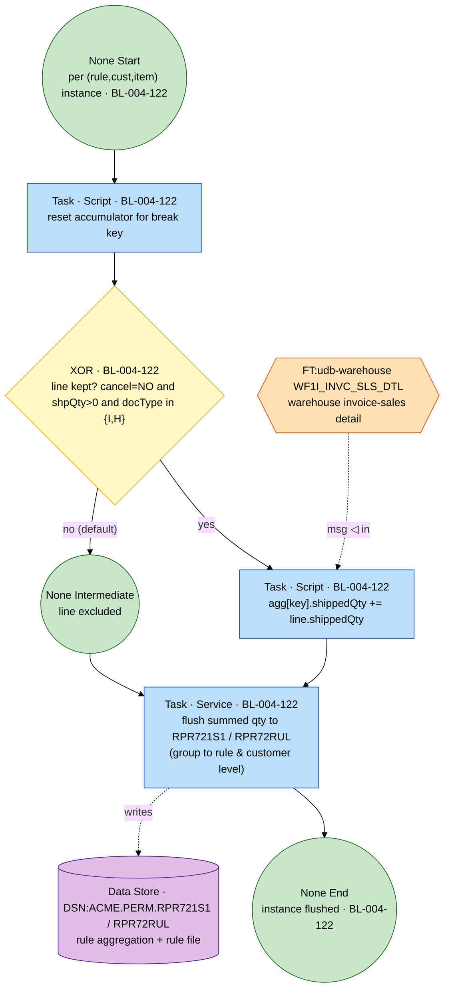
```mermaid
%%{init: {'theme': 'base'}}%%
flowchart TD
  classDef ev   fill:#c8e6c9,stroke:#1b5e20,color:#000;
  classDef task fill:#bbdefb,stroke:#0d47a1,color:#000;
  classDef gw   fill:#fff9c4,stroke:#f9a825,color:#000;
  classDef data fill:#e1bee7,stroke:#4a148c,color:#000;
  classDef ext  fill:#ffe0b2,stroke:#e65100,color:#000;

  bst(("None Start<br/>per (rule,cust,item) instance · BL-004-122")):::ev
  init["Task · Script · BL-004-122<br/>reset accumulator for break key"]:::task
  flt{"XOR · BL-004-122<br/>line kept? cancel=NO and shpQty>0 and docType in {I,H}"}:::gw
  add["Task · Script · BL-004-122<br/>agg[key].shippedQty += line.shippedQty"]:::task
  skip(("None Intermediate<br/>line excluded")):::ev
  flush["Task · Service · BL-004-122<br/>flush summed qty to RPR721S1 / RPR72RUL<br/>(group to rule & customer level)"]:::task
  ben(("None End<br/>instance flushed · BL-004-122")):::ev

  wh{{"FT:udb-warehouse WF1I_INVC_SLS_DTL<br/>warehouse invoice-sales detail"}}:::ext
  dAgg[("Data Store · DSN:ACME.PERM.RPR721S1 / RPR72RUL<br/>rule aggregation + rule file")]:::data

  bst --> init --> flt
  flt -- "yes" --> add --> flush
  flt -- "no (default)" --> skip --> flush
  flush --> ben
  wh -. "msg ◁ in" .-> add
  flush -. "writes" .-> dAgg
```

#### 2.2 — Body of BL-004-133 (accumulate customer-group at key break — control break, D2; embeds BL-004-132)

<!-- mmd:BP-004-D2-group-accum-body-process-graph -->
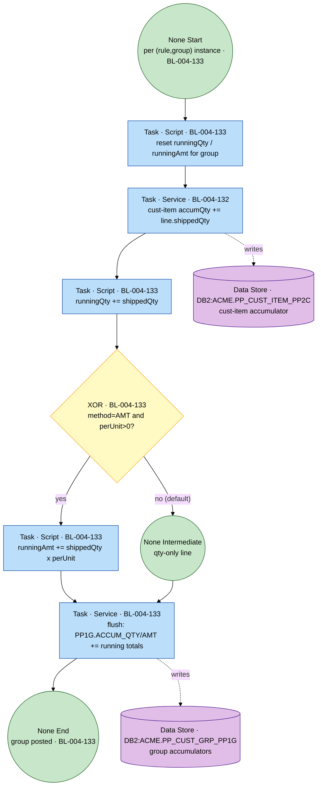
```mermaid
%%{init: {'theme': 'base'}}%%
flowchart TD
  classDef ev   fill:#c8e6c9,stroke:#1b5e20,color:#000;
  classDef task fill:#bbdefb,stroke:#0d47a1,color:#000;
  classDef gw   fill:#fff9c4,stroke:#f9a825,color:#000;
  classDef data fill:#e1bee7,stroke:#4a148c,color:#000;

  bst(("None Start<br/>per (rule,group) instance · BL-004-133")):::ev
  init["Task · Script · BL-004-133<br/>reset runningQty / runningAmt for group"]:::task
  ci["Task · Service · BL-004-132<br/>cust-item accumQty += line.shippedQty"]:::task
  rq["Task · Script · BL-004-133<br/>runningQty += shippedQty"]:::task
  amtg{"XOR · BL-004-133<br/>method=AMT and perUnit>0?"}:::gw
  ra["Task · Script · BL-004-133<br/>runningAmt += shippedQty x perUnit"]:::task
  cont(("None Intermediate<br/>qty-only line")):::ev
  flush["Task · Service · BL-004-133<br/>flush: PP1G.ACCUM_QTY/AMT += running totals"]:::task
  ben(("None End<br/>group posted · BL-004-133")):::ev

  dPP2C[("Data Store · DB2:ACME.PP_CUST_ITEM_PP2C<br/>cust-item accumulator")]:::data
  dPP1G[("Data Store · DB2:ACME.PP_CUST_GRP_PP1G<br/>group accumulators")]:::data

  bst --> init --> ci --> rq --> amtg
  amtg -- "yes" --> ra --> flush
  amtg -- "no (default)" --> cont --> flush
  flush --> ben
  ci -. "writes" .-> dPP2C
  flush -. "writes" .-> dPP1G
```

> Note: BL-004-132 (per-line cust-item accumulation) is a single Task nested inside the BL-004-133 MI body — this is the §6.1 reading of the source pseudocode, where `ACCUMULATE-CUSTOMER-ITEM` is called once per row *inside* `ACCUMULATE-GROUP`'s loop. Each retains its own rule-id node (total coverage preserved).

#### 2.3 — Body of BL-004-136 (re-derive pre-billing over rolling window — control break, D2)

<!-- mmd:BP-004-D2-prebilling-body-process-graph -->
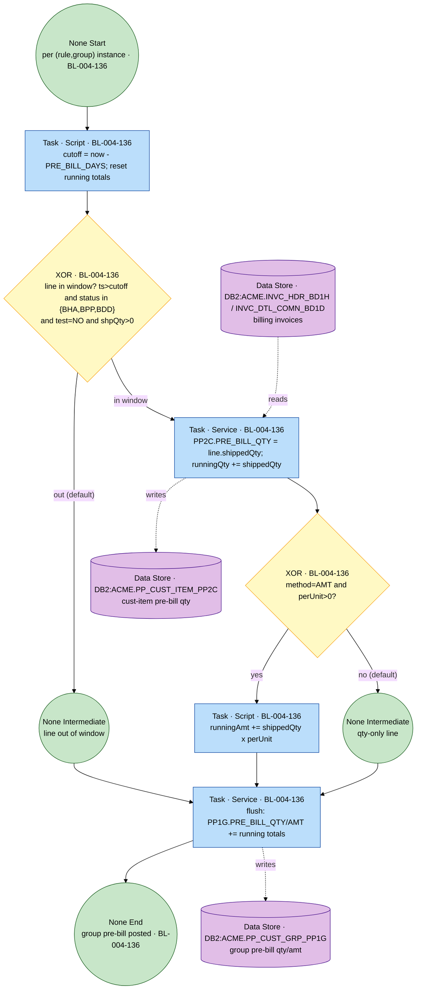
```mermaid
%%{init: {'theme': 'base'}}%%
flowchart TD
  classDef ev   fill:#c8e6c9,stroke:#1b5e20,color:#000;
  classDef task fill:#bbdefb,stroke:#0d47a1,color:#000;
  classDef gw   fill:#fff9c4,stroke:#f9a825,color:#000;
  classDef data fill:#e1bee7,stroke:#4a148c,color:#000;

  bst(("None Start<br/>per (rule,group) instance · BL-004-136")):::ev
  init["Task · Script · BL-004-136<br/>cutoff = now - PRE_BILL_DAYS; reset running totals"]:::task
  flt{"XOR · BL-004-136<br/>line in window? ts>cutoff and status in {BHA,BPP,BDD}<br/>and test=NO and shpQty>0"}:::gw
  setci["Task · Service · BL-004-136<br/>PP2C.PRE_BILL_QTY = line.shippedQty; runningQty += shippedQty"]:::task
  amtg{"XOR · BL-004-136<br/>method=AMT and perUnit>0?"}:::gw
  ra["Task · Script · BL-004-136<br/>runningAmt += shippedQty x perUnit"]:::task
  cont(("None Intermediate<br/>qty-only line")):::ev
  skip(("None Intermediate<br/>line out of window")):::ev
  flush["Task · Service · BL-004-136<br/>flush: PP1G.PRE_BILL_QTY/AMT += running totals"]:::task
  ben(("None End<br/>group pre-bill posted · BL-004-136")):::ev

  dPP2C[("Data Store · DB2:ACME.PP_CUST_ITEM_PP2C<br/>cust-item pre-bill qty")]:::data
  dPP1G[("Data Store · DB2:ACME.PP_CUST_GRP_PP1G<br/>group pre-bill qty/amt")]:::data
  dInv[("Data Store · DB2:ACME.INVC_HDR_BD1H / INVC_DTL_COMN_BD1D<br/>billing invoices")]:::data

  bst --> init --> flt
  flt -- "in window" --> setci --> amtg
  flt -- "out (default)" --> skip --> flush
  amtg -- "yes" --> ra --> flush
  amtg -- "no (default)" --> cont --> flush
  flush --> ben
  dInv -. "reads" .-> setci
  setci -. "writes" .-> dPP2C
  flush -. "writes" .-> dPP1G
```

#### 2.4 — Body of BL-004-127 expiry Loop (embeds BL-004-128) — supporting body for D1

<!-- mmd:BP-004-D1-expiry-body-process-graph -->
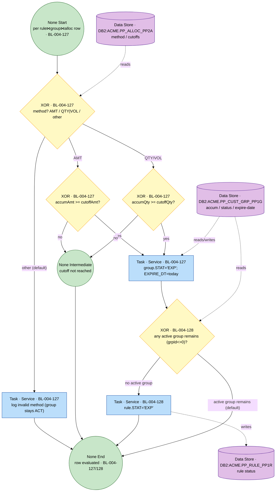
```mermaid
%%{init: {'theme': 'base'}}%%
flowchart TD
  classDef ev   fill:#c8e6c9,stroke:#1b5e20,color:#000;
  classDef task fill:#bbdefb,stroke:#0d47a1,color:#000;
  classDef gw   fill:#fff9c4,stroke:#f9a825,color:#000;
  classDef data fill:#e1bee7,stroke:#4a148c,color:#000;

  bst(("None Start<br/>per rule⋈group⋈alloc row · BL-004-127")):::ev
  mth{"XOR · BL-004-127<br/>method? AMT / QTY|VOL / other"}:::gw
  ca{"XOR · BL-004-127<br/>accumAmt >= cutoffAmt?"}:::gw
  cq{"XOR · BL-004-127<br/>accumQty >= cutoffQty?"}:::gw
  logm["Task · Service · BL-004-127<br/>log invalid method (group stays ACT)"]:::task
  expg["Task · Service · BL-004-127<br/>group.STAT='EXP'; EXPIRE_DT=today"]:::task
  noexp(("None Intermediate<br/>cutoff not reached")):::ev
  rule{"XOR · BL-004-128<br/>any active group remains (grpId<>0)?"}:::gw
  expr["Task · Service · BL-004-128<br/>rule.STAT='EXP'"]:::task
  ben(("None End<br/>row evaluated · BL-004-127/128")):::ev

  dPP2A[("Data Store · DB2:ACME.PP_ALLOC_PP2A<br/>method / cutoffs")]:::data
  dPP1G[("Data Store · DB2:ACME.PP_CUST_GRP_PP1G<br/>accum / status / expire-date")]:::data
  dPP1R[("Data Store · DB2:ACME.PP_RULE_PP1R<br/>rule status")]:::data

  bst --> mth
  mth -- "AMT" --> ca
  mth -- "QTY/VOL" --> cq
  mth -- "other (default)" --> logm --> ben
  ca -- "yes" --> expg
  ca -- "no" --> noexp --> ben
  cq -- "yes" --> expg
  cq -- "no" --> noexp
  expg --> rule
  rule -- "no active group" --> expr --> ben
  rule -- "active group remains (default)" --> ben
  dPP2A -. "reads" .-> mth
  dPP1G -. "reads/writes" .-> expg
  dPP1G -. "reads" .-> rule
  expr -. "writes" .-> dPP1R
```

> BL-004-128 (rule expiry) is the gateway+task pair nested on the true branch of BL-004-127's expiry, matching the source `TRY-EXPIRE-RULE` call. Both keep their own rule-id nodes.

---

### 3. RULE → ELEMENT TABLE (BL-004-120..138)

| BL id | Title | Logic type | §5 element | Sub-graph / diagram |
|---|---|---|---|---|
| BL-004-120 | Select recalc-request scope (rule/item/customer) | selection | Task · Service (carries id) | D1 orch (1.1) |
| BL-004-121 | Mark recalc requests complete after extraction | transformation (default) | Task · Service | D1 orch (1.1) |
| BL-004-122 | Aggregate warehouse sales into recalc sets | aggregation (control break) | **MI Sub-Process** (§6.1) | D1 orch + body 2.1 |
| BL-004-123 | Recalc group/cust-item accumulators (add vs replace) | aggregation | **MI Sub-Process** (per-rule) | D1 orch (1.1) |
| BL-004-124 | Classify alloc cost-component type (per-unit routing) | classification | **Gateway** (XOR, carries id; §5.2 b1) | D1 orch (1.1) |
| BL-004-125 | Compute per-unit allocation amount (floored at 0) | transformation (calculation) | Task · Script | D1 orch (1.1) |
| BL-004-126 | Mark per-unit-amount requests complete | transformation (default) | Task · Service | D1 orch (1.1) |
| BL-004-127 | Expire allocation group at cutoff | validation (set selection) | **Loop Sub-Process** (body has XOR by method) | D1 orch + body 2.4 |
| BL-004-128 | Expire rule when no active group remains | validation (set selection) | Gateway→Task (nested in 127 body) | body 2.4 |
| BL-004-129 | Release rule batch-lock switch | transformation (default) | Task · Service | D1 orch (1.1) |
| BL-004-130 | Gate recalc/expiry phases on non-empty extract | control (soft-fail) | **XOR Gateway** ×2 predicates (CHK71+CHK72) | D1 orch (1.1) |
| BL-004-131 | Select posted invoices changed since last run | selection (set selection) | Task · Service (carries id) | D2 orch (1.2) |
| BL-004-132 | Accumulate shipped qty into cust-item allocation | aggregation | Task · Service (nested in 133 body) | body 2.2 |
| BL-004-133 | Accumulate qty+amt into customer group at key break | aggregation (control break) | **MI Sub-Process** (§6.1) | D2 orch + body 2.2 |
| BL-004-134 | Record accumulation-run timestamp (checkpoint) | control | Task · Service | D2 orch (1.2) |
| BL-004-135 | Zero pre-billing quantities before re-derivation | transformation (default) | Task · Service | D2 orch (1.2) |
| BL-004-136 | Re-derive pre-billing over rolling window | aggregation (control break) | **MI Sub-Process** (§6.1) | D2 orch + body 2.3 |
| BL-004-137 | Enforce strict billing→allocation step order | control (operational) | **XOR Gateway** (skip→None End) | D2 orch (1.2) |
| BL-004-138 | Hard-fail on unrecoverable data error | error-handling (operational) | **Error Boundary → Error End** (each sub-graph) | D1 orch + D2 orch |

All 19 rules (BL-004-120..138) map to exactly one rule-bearing node. (BL-004-130 is one rule carried on two physically-distinct gateways — see note in 1.1; this is the only id appearing on >1 node, forced by the legacy two-gate topology.)

---

### 4. FSM PROJECTION (§7.2) — allocation / rule status lifecycle (Mealy)

The business-meaningful state is the **status pair carried by a price-protection group (`PP1G.STAT`) and its parent rule (`PP1R.STAT`)** — both over the domain `{ACT, EXP}`. Pre-billing is **not** a lifecycle state — it is accumulator data on the same record (see note below). Anchor set `A` = the status values; transitions are the SESE regions between them, guard = conjunction of gateway conditions on the taken branch, effect `ω` = ordered BL ids fired.

#### 4.1 Group-status FSM (per `PP1G`)

<!-- mmd:BP-004-D-group-status-fsm-process-graph -->
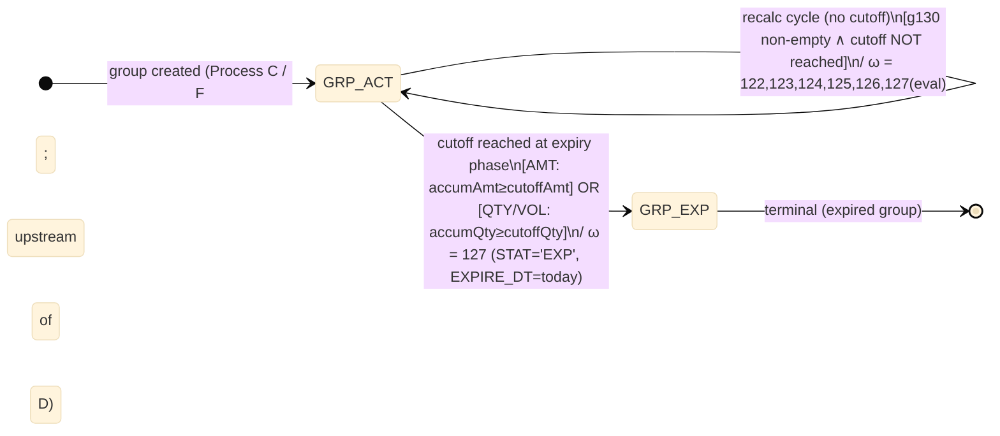
```mermaid
%%{init: {'theme': 'base'}}%%
stateDiagram-v2
  direction LR
  [*] --> GRP_ACT : group created (Process C / F; upstream of D)
  GRP_ACT --> GRP_ACT : recalc cycle (no cutoff)\n[g130 non-empty ∧ cutoff NOT reached]\n/ ω = 122,123,124,125,126,127(eval)
  GRP_ACT --> GRP_EXP : cutoff reached at expiry phase\n[AMT: accumAmt≥cutoffAmt] OR [QTY/VOL: accumQty≥cutoffQty]\n/ ω = 127 (STAT='EXP', EXPIRE_DT=today)
  GRP_EXP --> [*] : terminal (expired group)
```

- **GRP_ACT → GRP_EXP** guard (BL-004-127): `(method=AMT ∧ accumAmt ≥ cutoffAmt) ∨ (method∈{QTY,VOL} ∧ accumQty ≥ cutoffQty)`; effect `ω` = BL-004-127 (`STAT='EXP'`, `EXPIRE_DT=CURRENT-DATE`), which then fires BL-004-128 evaluation.
- **GRP_ACT self-loop** (the recalc path): the accumulators are mutated (BL-004-123 add/replace; `RECALC_RQST_SW='N'`) and per-unit amounts recomputed (BL-004-125) without a state change when cutoff is not met. Unknown method → log only, stays `ACT` (no transition).

#### 4.2 Rule-status FSM (per `PP1R`)

<!-- mmd:BP-004-D-rule-status-fsm-process-graph -->
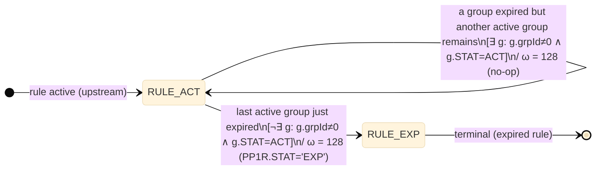
```mermaid
%%{init: {'theme': 'base'}}%%
stateDiagram-v2
  direction LR
  [*] --> RULE_ACT : rule active (upstream)
  RULE_ACT --> RULE_ACT : a group expired but another active group remains\n[∃ g: g.grpId≠0 ∧ g.STAT=ACT]\n/ ω = 128 (no-op)
  RULE_ACT --> RULE_EXP : last active group just expired\n[¬∃ g: g.grpId≠0 ∧ g.STAT=ACT]\n/ ω = 128 (PP1R.STAT='EXP')
  RULE_EXP --> [*] : terminal (expired rule)
```

- **RULE_ACT → RULE_EXP** is **driven by** a group transition (BL-004-127 → BL-004-128 cascade): a rule expires only when its *last* active group expires. Guard (BL-004-128): `¬∃ group g of rule where g.groupId≠0 ∧ g.status=ACT`. Effect `ω` = BL-004-128 (`PP1R.STAT='EXP'`). Note the legacy intended PP2A-row expiry here is **dead code** (excluded; see §5).
- This matches the call-graph's own `pp-status-fsm` reading (`ACT --"XXRPR56 date-driven / XXRPR57 cutoff"--> EXP`); Process D realizes the **XXRPR57 cutoff** edge.

#### 4.3 Pre-billing — accumulator state, not a lifecycle state

Pre-billing (`PP1G.PRE_BILL_QTY/AMT`, `PP2C.PRE_BILL_QTY`) is **data on the record, not a status**. Its MCRPR74J step-2 lifecycle is a degenerate two-phase **value reset→recompute**, expressible as a tiny accumulator FSM but with **no business status semantics**:

<!-- mmd:BP-004-D-prebilling-fsm-process-graph -->
```mermaid
%%{init: {'theme': 'base'}}%%
stateDiagram-v2
  direction LR
  [*] --> PB_STALE : pre-bill holds prior run's values
  PB_STALE --> PB_ZEROED : zero phase [step1 RC<4 (137)]\n/ ω = 135
  PB_ZEROED --> PB_DERIVED : window re-derivation\n[ts>now-PRE_BILL_DAYS ∧ status∈{BHA,BPP,BDD} ∧ ¬test ∧ shpQty>0]\n/ ω = 136
  PB_DERIVED --> PB_STALE : next MCRPR74J run
  PB_STALE --> [*] : step2 bypassed [step1 RC≥4 (137)] / ω = ∅
```

Confirmed: pre-billing is purely accumulator state (it is reset to 0 then summed); the `LAST_RUN_XXRPR74` checkpoint (BL-004-134) is likewise a stored value, not a status. The only true *status* FSMs in Process D are the group/rule `ACT→EXP` machines above.

---

### 5. PURITY / CONFORMANCE NOTES

#### P1–P9 — D1 (MCRPR71J)
- **P1 Bounded:** one Start; every path reaches `None End` (normal) or `Error End` (138). Both empty-gates (BL-004-130 ×2) converge on `unlock → en`; no unreachable/dead node.
- **P2 Activity contract:** every Task is 1-in/1-out; classification work that branches is on the **gateway** (BL-004-124), not the task — holds.
- **P3 Gateway contract:** gateways (124, 130×2, and the in-body 122/127/128/133/136 gateways) carry only boolean conditions; no work, no data transform on a gateway.
- **P4 XOR determinism+totality:** BL-004-124 — LIC/BIL/INV/FLT exhaust the *reachable* domain (selection restricts to the four; the unreachable `UNHANDLED` is documented, FLT branch acts as the structural default). BL-004-130 — `non-empty | empty(default)` total. BL-004-127 method-gate — `AMT | QTY/VOL | other(default)` total and mutually exclusive.
- **P5 SESE:** each gate split (130a, 130b) re-converges at the unlock task; the per-unit classify-XOR (124) re-converges at BL-004-125. **[GAP/structural]** the two BL-004-130 gates form *nested* skip-regions both exiting to `unlock`; this is a clean nested-SESE (CHK72 inside the CHK71 non-empty branch), matching the call-graph nesting.
- **P6 Soundness:** P3+P4+P5 ⇒ option-to-complete + proper completion; the empty-input no-work path is a legitimate completion (unlock still runs).
- **P7 Loops explicit:** all iteration is MI/Loop Sub-Processes (122, 123, 127) — no back-edges.
- **P8 Exceptions are events:** BL-004-138 = Error Boundary→Error End; the empty-extract skips (130) are ordinary XOR branches (correct, per §7 "empty is a normal no-work outcome").
- **P9 Separated flows:** the warehouse UDB source is an **external participant** `{{FT:udb-warehouse}}` reached by Message Flow (it is a cross-system UDB join, not a local data-at-rest store) — see [GAP] below; all other coupling is Data Association.

#### P1–P9 — D2 (MCRPR74J)
- **P1/P5/P6:** one Start; the BL-004-137 XOR splits into `zero→redrv→en` (run) vs `enByp` (bypass) — both terminate. Two distinct `None End`s are permitted (P1 requires *an* end on every path, not a single end). Sound.
- **P4:** BL-004-137 `RC<4 | RC≥4(default)` total/exclusive; in-body amt-gates (133/136) `AMT∧perUnit>0 | else(default)` total.
- **P7/P8:** BL-004-133 & 136 are MI control-break sub-processes; BL-004-132 nested as a Task inside 133. BL-004-138 hard-fail via Error Boundary→Error End. The step-order bypass (137) is a soft skip (None End), correctly **not** an Error End.
- **P2/P3/P9:** all hold; invoice/AP1S/PP* are Data Stores via Data Association (BD1H/BD1D/BD2D are genuine DB2 tables, not an external integration).

#### Orphan data check
No write-only or read-only data nodes:
- `PP3C` read by 120, written by 120/121/126. `RPR71S1.*` written by 120, read by 122. `RPR721S1` written by 122, read by 123. `RPR72RUL/RPR73RUL` written by 122, read by 129. `PP1G` read+written (123/127/133/135/136). `PP2C` read+written. `PP1R` read by 131, written by 128/129. `PP2A` read by 124/127/131. `AP1S` read by 131/136, written by 134. `BD1H/BD1D/BD2D` read by 131/136.
- **One-sided within Process D scope (acceptable):** `PP2A` is **read-only** within D (its `STAT='EXP'` writer is BL-004-115/XXRPR56 in Process C/F, and the legacy PP2A-expiry in BL-004-128 is dead code). `BD1H/BD1D/BD2D` and `WF1I` are **read-only** (external/upstream-owned source data). These are correctly read-only *for this process* — flagged so reviewers know the writers live in Processes A/B/C/F, not as conformance failures.

#### Unplaced rules
**None.** All 19 rules BL-004-120..138 are placed. Total coverage achieved.

#### Dead-code exclusions (NOT modeled — per task + call-graph §15)
- `PP_ALLOC_HIST_PP2H` INSERT (commented out in XXRPR74; absent in XXRPR73) — the narrated "PP2H insert" is dead code.
- `XXRPR57.5750-UPDATE-PP2A` (the rule-expiry-also-expires-allocation-rows step in BL-004-128) — present but commented out; the FSM RULE_ACT→RULE_EXP effect is **only** `PP1R.STAT='EXP'`.
- These are intentionally excluded from all diagrams and the FSM.
- **Non-existent tables avoided:** `PP4D/PP4S/PP4H` and `ADTC/DTC` do **not** exist; all data nodes use the real targets `PP2A / PP1G / PP2C / PP1R / PP3C` (and history would be `PP2H`, which is unused here), per §3.D glossary and call-graph §8/§15.

#### [GAP]s and open items
- **[GAP] UDB DCLGENs / warehouse modeling:** the warehouse source `WF1I_INVC_SLS_DTL` is a **remote UDB** join (qual `PDWHROW`; SESSION temp tables `DGWD2DU/DGWF4IU` absent from export). I modeled it as an **external participant** `{{FT:udb-warehouse}}` (Message Flow, direction *in*, style request-reply, at-most-once) rather than a local Data Store, because it is a cross-platform UDB fetch, not z/OS data-at-rest. If reviewers prefer it as a `DB2:`/`DSN:` Data Store, that is a one-node reclassification — flagged.
- **[GAP] SORTPARM:** the SORT7/8/9 key cards (`DS.PERM.SORTPARM(XXRPR50x/51x)`) are **not in the export**, so the exact sort keys feeding the BL-004-122/123 control breaks (the break-key field order) are **unverifiable**. The MI break key is inferred as `(rule, customer, item)` for 122 / `(rule, group)` for 133 & 136 from the pseudocode `GROUP BY` / `currKey` — confirm against SORTPARM when available.
- **[GAP] external invoice-price engine (XXQBI11):** BL-004-125's INVOICE-PRICE basis calls `XXQBI11` (absent from export). Within Process D it is folded into the single BL-004-125 calculation Task per the spec; if it should be an external participant (`API:`/call-out with Timer/Error boundary), that is a refinement of node BL-004-125. Flagged consistent with the spec's own `[GAP]`.
- **[GAP] BL-004-130 one-rule-two-gates** and **MCRPR50J/MCRPR71J both rebuild `RPR721S1.SRT`** (`[SME]` in call-graph §15) — the cross-job sort sharing is noted but out of Process D's two-sub-graph scope.
- **[note] XXRPR57 reuse:** the expiry program (BL-004-127/128) is physically shared with MCRPR50J/MCRPR56J (call-graph §5/§8). Modeled here only in its MCRPR71J invocation; the same body diagram (2.4) applies to those reuses.

#### Summary
Process D is rendered as **two sound, block-structured sub-graphs** (D1 = MCRPR71J, D2 = MCRPR74J) plus **four body diagrams** (the three control-break MI bodies 122/133/136 required by the task, plus the 127/128 expiry Loop body that the §7 logic nests). **All 19 BL-004-120..138 rules map to exactly one rule-bearing node** (BL-004-130 uniquely spans two gateways by legacy necessity). The only true status lifecycle is the group/rule `ACT→EXP` Mealy FSM (cutoff via 127, cascade via 128); **pre-billing is confirmed to be accumulator state, not a lifecycle status**. Dead code (PP2H insert, XXRPR57 PP2A-expiry) is excluded; only real tables (PP2A/PP1G/PP2C/PP1R/PP3C) are used; the `[GAP]`s are UDB DCLGENs/warehouse classification, SORTPARM break-keys, and the XXQBI11 price engine.

## 6. Process E — Price Protection modeler reports (`XXRPR55` BI1 / `XXRPR85` BI2)

Two independent read-only report generators, modeled as two sound SESE sub-graphs:
- **E1 = BI1 Modeler Report** — `XXRPR55` / job `MCRPR55J` — BL-004-150..161
- **E2 = BI2 Pending Extract** — `XXRPR85` / job `MCRPR85J` — BL-004-162..169

Per the GAP directive, the price engine `XXQBI11` is an **internal CALL → modeled as a `Task · Service`**, NOT an external Participant. The only external Participants are Cognos/BI file transfer (`FT:`) and the requester email channel (`MAIL:`).

---

### 1a. ORCHESTRATION DIAGRAM — E1 (BI1 Modeler Report, XXRPR55)

<!-- mmd:BP-004-E1-process-graph -->
```mermaid
%%{init: {'theme': 'base'}}%%
flowchart TD
  classDef ev   fill:#c8e6c9,stroke:#1b5e20,color:#000;
  classDef task fill:#bbdefb,stroke:#0d47a1,color:#000;
  classDef gw   fill:#fff9c4,stroke:#f9a825,color:#000;
  classDef err  fill:#ffcdd2,stroke:#b71c1c,color:#000;
  classDef data fill:#e1bee7,stroke:#4a148c,color:#000;
  classDef sub  fill:#d7ccc8,stroke:#3e2723,color:#000;
  classDef ext  fill:#ffe0b2,stroke:#e65100,color:#000;

  st(("None Start · MCRPR55J batch runs")):::ev

  sel["Service · BL-004-150<br/>select single pending BI1 request"]:::task
  kbi1{"XOR · BL-004-150<br/>BI1 PND request found?"}:::gw
  nend(("None End · nothing to do (RC0, +100)")):::ev

  claim["Service · BL-004-151<br/>claim request: PND → INP"]:::task
  readu["Service · BL-004-152<br/>read current ∪ audit assoc. lines (18-table union)"]:::task

  loop[["Loop Sub-Process · BL-004-152<br/>for each enriched modeler line<br/>(enrich → price → conditional write)"]]:::sub

  email["Service · BL-004-158<br/>stage email-completion notice (rule id + count)"]:::task
  comp["Service · BL-004-159<br/>complete request: INP → CMP, persist count"]:::task

  gdist{"XOR · BL-004-160<br/>report RPR55S1 non-empty? (EMPTCHK1)"}:::gw
  sorth["Script · BL-004-160<br/>sort + generate header"]:::task
  sndft["Send · BL-004-160<br/>transfer report to Cognos/BI"]:::task
  sndml["Send · BL-004-160<br/>email requester (from RPR55S2)"]:::task
  dend(("None End · BI1 run complete")):::ev
  skipd(("None End · empty report, distribution skipped")):::ev

  eb(("Error Boundary · BL-004-161<br/>file-open / DB fault / price-engine bad RC")):::err
  ferr((("Error End · BL-004-161 · RC16<br/>hard-fail; no distribution"))):::err

  pp3c[("Data Store · DB2:PP_RQST_PP3C<br/>price-protection request (DGPP3C)")]:::data
  ppx[("Data Store · DB2:PP1R/PP2C/PP1C/PP1I/PP7C/PP9S/PP9C + masters<br/>PP cluster + customer/division/vendor/item")]:::data
  cu1x[("Data Store · DB2:CUST_XREF_CU1X<br/>customer cross-reference (DGCU1X)")]:::data
  rrep[("Data Store · DSN:ACME.PERM.RPR55S1<br/>BI1 modeler report")]:::data
  reml[("Data Store · DSN:ACME.TEMP.RPR55S2<br/>BI1 email-notify file")]:::data

  cognos{{"FT:RPR55X10<br/>Cognos / BI (MQ FTE)"}}:::ext
  mailx{{"MAIL:requester<br/>completion email"}}:::ext

  st --> sel --> kbi1
  kbi1 -- "no request (default)" --> nend
  kbi1 -- "request found" --> claim --> readu --> loop --> email --> comp --> gdist
  gdist -- "non-empty" --> sorth --> sndft
  sndft --> sndml --> dend
  gdist -- "empty (default)" --> skipd

  sel -. "reads" .-> pp3c
  claim -. "writes" .-> pp3c
  readu -. "reads" .-> ppx
  loop -. "reads" .-> cu1x
  loop -. "writes" .-> rrep
  email -. "writes" .-> reml
  comp -. "writes" .-> pp3c
  sorth -. "reads" .-> rrep
  sndft -. "msg ▷ out" .-> cognos
  sndml -. "reads" .-> reml
  sndml -. "msg ▷ out" .-> mailx

  sel -. "error" .-> eb
  claim -. "error" .-> eb
  readu -. "error" .-> eb
  loop -. "error" .-> eb
  comp -. "error" .-> eb
  eb --> ferr
```

Notes on E1 orchestration:
- BL-004-153/154/155/156/157 live **inside** the Loop Sub-Process (diagram 2) — they are per-row work, so per P7 they are not on the orchestration. The Loop node carries BL-004-152 (the iteration source = the union row set).
- BL-004-161 (hard-fail) is the canonical §6.4 Error-Boundary→Error-End attached to every data-access / engine-call activity (shown collapsed onto the boundary `eb`). "No BI1 request" is an ordinary soft XOR `default` branch to a None End (RC0), **not** an error (P8).
- `FT:RPR55X10` and `MAIL:requester` are external Participants reached only by Message Flow (P9); the report/email datasets are Data Stores read by the Send tasks.

---

### 1b. ORCHESTRATION DIAGRAM — E2 (BI2 Pending Extract, XXRPR85)

<!-- mmd:BP-004-E2-process-graph -->
```mermaid
%%{init: {'theme': 'base'}}%%
flowchart TD
  classDef ev   fill:#c8e6c9,stroke:#1b5e20,color:#000;
  classDef task fill:#bbdefb,stroke:#0d47a1,color:#000;
  classDef gw   fill:#fff9c4,stroke:#f9a825,color:#000;
  classDef err  fill:#ffcdd2,stroke:#b71c1c,color:#000;
  classDef data fill:#e1bee7,stroke:#4a148c,color:#000;
  classDef sub  fill:#d7ccc8,stroke:#3e2723,color:#000;
  classDef ext  fill:#ffe0b2,stroke:#e65100,color:#000;

  st(("None Start · MCRPR85J batch runs")):::ev

  sel["Service · BL-004-162<br/>select single pending BI2 request"]:::task
  kbi2{"XOR · BL-004-162<br/>BI2 PND request found?"}:::gw
  nend(("None End · nothing to do (RC0, +100)")):::ev

  claim["Service · BL-004-163<br/>claim request: PND → INP"]:::task

  loopc[["Loop Sub-Process · BL-004-164<br/>for each current-population row<br/>(22-table inner join)"]]:::sub
  loopa[["Loop Sub-Process · BL-004-165<br/>for each audit-population row<br/>(PP7C, reason ≠ INS)"]]:::sub

  comp["Service · BL-004-168<br/>complete request: INP → CMP"]:::task

  gdist{"XOR · BL-004-169<br/>extract RPR85S1 non-empty? (EMPTCHK1)"}:::gw
  pkg["Script · BL-004-169<br/>sort + zip + GDG(+1) backup"]:::task
  sndft["Send · BL-004-169<br/>transfer zipped extract to Cognos/BI"]:::task
  dend(("None End · BI2 run complete")):::ev
  skipd(("None End · empty extract, distribution skipped")):::ev

  eb(("Error Boundary · BL-004-161<br/>file-open / DB fault (shared hard-fail convention)")):::err
  ferr((("Error End · BL-004-161 · RC16<br/>hard-fail; no distribution"))):::err

  pp3c[("Data Store · DB2:PP_RQST_PP3C<br/>price-protection request (DGPP3C)")]:::data
  ppx[("Data Store · DB2:PP1R/PP2C/PP1G/PP2A/PP9M + masters<br/>PP cluster + alloc/alloc-method + masters")]:::data
  pp7c[("Data Store · DB2:PP_CUST_ITEM_AUD_PP7C<br/>customer-item audit (DGPP7C)")]:::data
  rext[("Data Store · DSN:ACME.TEMP.RPR85S1<br/>BI2 consolidated extract (+ .ZIP)")]:::data

  cognos{{"FT:RPR85X10<br/>Cognos / BI (MQ FTE, zipped)"}}:::ext

  st --> sel --> kbi2
  kbi2 -- "no request (default)" --> nend
  kbi2 -- "request found" --> claim --> loopc --> loopa --> comp --> gdist
  gdist -- "non-empty" --> pkg --> sndft --> dend
  gdist -- "empty (default)" --> skipd

  sel -. "reads" .-> pp3c
  claim -. "writes" .-> pp3c
  loopc -. "reads" .-> ppx
  loopc -. "writes" .-> rext
  loopa -. "reads" .-> pp7c
  loopa -. "writes" .-> rext
  comp -. "writes" .-> pp3c
  pkg -. "reads" .-> rext
  sndft -. "msg ▷ out" .-> cognos

  sel -. "error" .-> eb
  claim -. "error" .-> eb
  loopc -. "error" .-> eb
  loopa -. "error" .-> eb
  comp -. "error" .-> eb
  eb --> ferr
```

Notes on E2 orchestration:
- BL-004-166 (build alloc amounts) and BL-004-167 (format+write) live **inside both** Loop Sub-Processes (current and audit) — they are the shared per-row body for either population. Each Loop node carries its own selection rule (164 / 165).
- There is **no price-based write-gate** in E2 — every qualifying row is written (contrast BL-004-156).
- E2 has no distinct hard-fail BL id; the spec promotes exactly one hard-fail rule (BL-004-161) for the family, so E2's RC16 boundary references the **shared BL-004-161 convention** (see [GAP] note in conformance section).

---

### 2. SUB-PROCESS BODY DIAGRAM — E1 per-row Loop (read row → enrich → dual-price → conditional write)

<!-- mmd:BP-004-E1-row-loop-body-process-graph -->
```mermaid
%%{init: {'theme': 'base'}}%%
flowchart TD
  classDef ev   fill:#c8e6c9,stroke:#1b5e20,color:#000;
  classDef task fill:#bbdefb,stroke:#0d47a1,color:#000;
  classDef gw   fill:#fff9c4,stroke:#f9a825,color:#000;
  classDef err  fill:#ffcdd2,stroke:#b71c1c,color:#000;
  classDef data fill:#e1bee7,stroke:#4a148c,color:#000;
  classDef ext  fill:#ffe0b2,stroke:#e65100,color:#000;

  bst(("None Start · next union row (current ∪ audit)")):::ev

  kdiv{"XOR · BL-004-153<br/>division break? (new division)"}:::gw
  enr["Service · BL-004-153<br/>enrich division (XXDIV50) + group (XXGRP50)"]:::task
  m1(("None Intermediate · context ready")):::ev

  kact{"XOR · BL-004-154<br/>customer ACT and item ACT?"}:::gw
  psvc["Service · BL-004-155<br/>dual price-engine call XXQBI11 (reserved sw='Y' + current sw='N')"]:::task
  zf["Script<br/>zero-fill both prices (non-priceable default)"]:::task
  m2(("None Intermediate · prices resolved")):::ev

  kzero{"XOR · BL-004-156<br/>both prices = 0?"}:::gw
  fmt["Script · BL-004-157<br/>format modeler-report line (XXRPR55C)"]:::task
  wout["Service · BL-004-156<br/>write report line → RPR55S1"]:::task

  bend(("None End · row processed")):::ev

  eb(("Error Boundary · BL-004-161<br/>price-engine bad RC")):::err
  ferr((("Error End · BL-004-161 · RC16"))):::err

  ppx[("Data Store · DB2:…PP cluster + masters<br/>division/group enrichment source")]:::data
  rrep[("Data Store · DSN:ACME.PERM.RPR55S1<br/>BI1 modeler report")]:::data
  engine["Service (internal) · XXQBI11<br/>price engine (CALL, not an external participant)"]:::task

  bst --> kdiv
  kdiv -- "yes (new division)" --> enr --> m1
  kdiv -- "no (default, same division)" --> m1
  m1 --> kact
  kact -- "yes (priceable)" --> psvc --> m2
  kact -- "no (default)" --> zf --> m2
  m2 --> kzero
  kzero -- "yes (both zero, default)" --> bend
  kzero -- "no (a price present)" --> fmt --> wout --> bend

  enr -. "reads" .-> ppx
  psvc -. "reads" .-> engine
  wout -. "writes" .-> rrep
  psvc -. "error" .-> eb
  eb --> ferr
```

**E2 per-row body (BL-004-166 / BL-004-167) — build consolidated allocation amounts, then format + write each extract row (the BI2 current and audit populations share this body):**

<!-- mmd:BP-004-E2-row-loop-body-process-graph -->
```mermaid
%%{init: {'theme': 'base'}}%%
flowchart TD
  classDef ev   fill:#c8e6c9,stroke:#1b5e20,color:#000;
  classDef task fill:#bbdefb,stroke:#0d47a1,color:#000;
  classDef gw   fill:#fff9c4,stroke:#f9a825,color:#000;
  classDef err  fill:#ffcdd2,stroke:#b71c1c,color:#000;
  classDef data fill:#e1bee7,stroke:#4a148c,color:#000;

  bst(("None Start · next BI2 population row<br/>(current ∪ audit)")):::ev
  build["Script · BL-004-166<br/>build consolidated allocation amounts (per row)"]:::task
  wout["Service · BL-004-167<br/>format + write consolidated extract row → RPR85S1"]:::task
  bend(("None End · row written")):::ev

  ppx[("Data Store · DB2:PP cluster + masters<br/>current population (22-table join)")]:::data
  pp7c[("Data Store · DB2:PP_CUST_ITEM_AUD_PP7C<br/>audit population (reason ≠ INS)")]:::data
  rext[("Data Store · DSN:ACME.TEMP.RPR85S1<br/>BI2 consolidated extract")]:::data

  eb(("Error Boundary · BL-004-161<br/>DB / file fault")):::err
  ferr((("Error End · BL-004-161 · RC16"))):::err

  bst --> build --> wout --> bend
  ppx -. "reads" .-> build
  pp7c -. "reads" .-> build
  wout -. "writes" .-> rext
  build -. "error" .-> eb --> ferr
```

Body modeling notes:
- BL-004-153 is a classify-and-seed: gateway carries the id, the `XXDIV50`/`XXGRP50` enrichment Task sits on the true (division-break) branch with a `default` no-op fall-through (P4 totality).
- BL-004-154 gates pricing (XOR). True branch = dual `XXQBI11` Service calls (155); false branch = zero-fill (155 also owns the zero-fill effect per its pseudocode). Both rejoin at `m2` — single-entry/single-exit (P5).
- BL-004-156 is the write-gate XOR: both-zero → skip to row-end (default); else → format (157) → write. Note `XXQBI11` is drawn with the `ext` style only for color but is labeled "(internal) … Service, not external" and touched by Data Association `reads`, **not** Message Flow — it is an internal call per the GAP directive. (If strict styling is required, recolor to `task`/`data`; it must not be a Message-Flow Participant.)

---

### 3. RULE → ELEMENT TABLE (all BL-004-150..169)

| BL id | Title | Logic type | §5 Element | Sub-graph |
|---|---|---|---|---|
| BL-004-150 | Select single pending BI1 request | selection | Task·Service + XOR (found?) carrying id; default→None End | E1 orchestration |
| BL-004-151 | Claim request PND→INP | transformation | Task·Service (write PP3C) | E1 orchestration |
| BL-004-152 | Read current ∪ audit associations (18-table union) | selection | **Loop Sub-Process** (iteration source) | E1 orchestration → E1 body |
| BL-004-153 | Per-division/group enrichment (XXDIV50/XXGRP50) | enrichment | XOR (division break?) + Task·Service on true branch | E1 body |
| BL-004-154 | Gate pricing on active customer + active item | classification | XOR gateway (priceable?) | E1 body |
| BL-004-155 | Dual price-engine call (reserved + current) | transformation (calculation) | 2× Task·Service to **internal** XXQBI11 (+ zero-fill Script on false) | E1 body |
| BL-004-156 | Conditional output: write only if a price ≠ 0 | validation (write-gate) | XOR (both-zero?) + Task·Service write on else | E1 body |
| BL-004-157 | Format modeler-report line | transformation (normalisation) | Task·Script | E1 body |
| BL-004-158 | Stage email-completion notice | reporting | Task·Service (write RPR55S2) | E1 orchestration |
| BL-004-159 | Complete request INP→CMP (+ count) | transformation | Task·Service (write PP3C) | E1 orchestration |
| BL-004-160 | Gate report distribution on non-empty | control (distribution) | XOR (non-empty?) + Script (sort/header) + 2× Send (FT + MAIL) | E1 orchestration |
| BL-004-161 | Operational hard-fail convention (BI1; shared) | error-handling | Error Boundary → Error End (RC16) | E1 + E2 |
| BL-004-162 | Select single pending BI2 request | selection | Task·Service + XOR (found?); default→None End | E2 orchestration |
| BL-004-163 | Claim request PND→INP | transformation | Task·Service (write PP3C) | E2 orchestration |
| BL-004-164 | Read current population (22-table inner join) | selection | **Loop Sub-Process** | E2 orchestration → E2 body |
| BL-004-165 | Read audit population (reason ≠ INS) | selection | **Loop Sub-Process** | E2 orchestration → E2 body |
| BL-004-166 | Build consolidated allocation amounts | transformation (calculation) | Task·Script (inside both loops) | E2 body |
| BL-004-167 | Format + write consolidated extract row | reporting | Task·Service (write RPR85S1) | E2 body |
| BL-004-168 | Complete request INP→CMP | transformation | Task·Service (write PP3C) | E2 orchestration |
| BL-004-169 | Gate extract distribution; package + transfer | control (distribution) | XOR (non-empty?) + Script (sort/zip/GDG) + Send (FT) | E2 orchestration |

Coverage: all 20 ids map to exactly one rule-bearing node; contiguous and disjoint (E1 = 150–161, E2 = 162–169). BL-004-161 is realized once as the reusable Error-Boundary convention applied to both families.

---

### 4. FSM (§7.2) — Modeler request status lifecycle (Mealy)

The same machine governs both BI1 (XXRPR55) and BI2 (XXRPR85); only the realizing BL ids differ. Anchors `A = {Start, PND, INP, CMP, End_normal, End_skipped}`. Guard `g` = conjunction of gateway conditions on the taken branch; effect `ω` = ordered BL ids fired.

<!-- mmd:BP-004-E-request-fsm-process-graph -->
```mermaid
%%{init: {'theme': 'base'}}%%
stateDiagram-v2
  direction LR
  [*] --> Selecting : Start (batch job runs)

  Selecting --> PND : [request type matches, status=PND found] / read request<br/>BI1: BL-004-150 · BI2: BL-004-162
  Selecting --> End_nothing : [no matching PND request] (default) / normal end RC0 (+100)<br/>BL-004-161 (NO-REQUEST→RC0)

  PND --> INP : / claim (PND→INP)<br/>BI1: BL-004-151 · BI2: BL-004-163

  INP --> CMP : [all rows processed OK] / read+enrich+price+write rows, complete (INP→CMP)<br/>BI1: BL-004-152,153,154,155,156,157,158,159<br/>BI2: BL-004-164,165,166,167,168
  INP --> Failed : [file-open / DB fault / price-engine bad RC] / abend RC16<br/>BL-004-161

  CMP --> End_delivered : [output non-empty] / distribute<br/>BI1: BL-004-160 (FT + MAIL) · BI2: BL-004-169 (zip + FT)
  CMP --> End_skipped : [output empty] (default) / skip distribution<br/>BI1: BL-004-160 · BI2: BL-004-169

  End_nothing --> [*]
  End_delivered --> [*]
  End_skipped --> [*]
  Failed --> [*]
```

Lifecycle reading (per the shared `PP_RQST_PP3C.STAT` machine, BR-004-85-02):
- **Start → PND**: a single pending request of the right type is selected (BI1: 150 / BI2: 162); the absence of one is the only non-error terminal that bypasses the lifecycle (normal end RC0).
- **PND → INP**: the claim write (BI1: 151 / BI2: 163) — the state actually persisted on the row.
- **INP → CMP**: all per-row work succeeds, then the completion write (BI1: 159 / BI2: 168). The intervening read/enrich/price/write rules are the transition effect, not separate states. Any unrecoverable fault during INP raises BL-004-161 → `Failed` (RC16) with the row left in INP (no CMP, no distribution).
- **CMP → End**: a post-program job-level gate on output emptiness (BI1: 160 / BI2: 169) chooses deliver-vs-skip — this is downstream of the COBOL status lifecycle.
- Well-definedness (§7.2): block structure (P5), XOR determinism+totality with explicit defaults (P4), and loops confined to sub-processes (P7) all hold, so each anchor-to-anchor region is a deterministic SESE DAG. No concurrency in either sub-graph, so no IOR/AND interleaving to document.

---

### 5. PURITY / CONFORMANCE NOTES

**P1 Bounded** — Each sub-graph has exactly one None Start. Every path reaches an end: E1 → {None End nothing-to-do, None End delivered, None End skipped, Error End}; E2 likewise. No unreachable/dead nodes.

**P2 Activity contract** — Every Task is 1-in/1-out. The dual price call (155) is two sequential Service Tasks (`pp` then `cp`), not one branching activity. Sort/header (160) and sort/zip/GDG (169) are single Script tasks feeding the Send tasks.

**P3 Gateway contract** — Gateways do no work. KBI1/KBI2 (150/162), KDIV (153), KACT (154), KZERO (156), and the EMPTCHK1 gates (160/169) carry only boolean conditions over data; all writes/transforms sit on tasks.

**P4 Determinism + totality** — Every XOR has a `default`: KBI1/KBI2 default = "no request", KDIV default = "same division", KACT default = "non-priceable→zero-fill", KZERO default = "both zero→skip", EMPTCHK1 default = "empty→skip". Guards are mutually exclusive and exhaustive.

**P5 Block structure (SESE)** — In the E1 body, KACT splits and rejoins at `m2`; KDIV rejoins at `m1`; KZERO converges at row-end — properly nested, non-overlapping. Orchestrations are linear with terminal XOR fans to dedicated End events.

**P6 Soundness** — P3+P4+P5 ⇒ option-to-complete and proper completion; no stranded tokens (no parallelism). No dead activities (every node reachable, the enrichment/price/write branches all have a satisfying guard).

**P7 Loops explicit** — Per-row processing is modeled as Loop Sub-Processes: E1 over the union row set (152); E2 separately over current (164) and audit (165) populations. No arbitrary back-edges (the call-graph's `KZERO --> CUR` "fetch next" back-edge is absorbed into the Loop marker).

**P8 Exceptions are events** — Hard-fail (161) = Error Boundary → Error End (RC16), attached to data-access and engine-call activities. "No pending request" and "both prices zero" and "empty output" are ordinary soft XOR branches (None Ends, RC0), never errors.

**P9 Separated flows** — Sequence Flow never crosses a pool boundary. Cross-participant coupling to `FT:RPR55X10` / `FT:RPR85X10` / `MAIL:requester` is Message Flow only; data movement is Data Association. No integration endpoint is modeled as a Data node.

**Price engine as internal Service (not external)** — Per the explicit GAP directive, `XXQBI11` is an internal `CALL`, modeled as a `Task · Service` reached by Data Association (`reads`), **not** a Message-Flow Participant. It bears BL-004-155. (Its `[GAP]` styling box in diagram 2 is cosmetic; semantically it is internal work, distinct from the genuine external Cognos/MAIL participants.)

**Orphan-data check (all clear)** — `DB2:PP_RQST_PP3C`: read by 150/162, written by 151/159/163/168 ✓. `DB2:PP…cluster+masters`: read by 152/153/164/165, written upstream in Processes C/D (write-side outside this sub-graph — flagged as an expected cross-process producer, not an orphan). `DB2:CUST_XREF_CU1X`: read by E1 body (BL-004-152 enrichment, call-graph node CU1X); write-side is the customer-master subsystem (cross-process). `DSN:ACME.PERM.RPR55S1`: written by 156, read by 160 ✓. `DSN:ACME.TEMP.RPR55S2`: written by 158, read by 160 ✓. `DSN:ACME.TEMP.RPR85S1`: written by 167, read by 169 ✓. Note: `PP cluster` and `CUST_XREF_CU1X` are **read-only within Process E** — they are masters produced elsewhere in BP-004, so they are not true orphans, but if Process E's graph is validated in isolation they will appear write-less; annotate them as externally-sourced masters.

**[GAP]s carried (sources absent, modeled as black boxes / internal stubs):**
- **`XXQBI11`** price engine — internals absent; BL-004-155 treats it as an opaque internal Service returning `PM1L-AIPC09` under reserve switch `Y`/`N`. (call-graph §7 + §15; resolves with `[CODMOD]` of `XXQBI11`.)
- **`XXDIV50` / `XXGRP50`** division/group enrichment — sources absent; BL-004-153 captures only the enrichment-on-division-break intent. (resolves with `[CODMOD]`.)
- **`EMPTCHK1` distribution gates (160/169)** — no COBOL antecedent; grounded only in JCL orchestration nodes (E55/G55/F55/M55, E85/G85/F85). Mapped via caller rules BR-004-55-06 / BR-004-85-07. (resolves with `MCRPR55J`/`MCRPR85J` JCL inspection.)
- **BI2 hard-fail id** — the spec promotes a single hard-fail rule (BL-004-161, BI1-scoped). E2's call-graph shows its own RC16 `ERR` node but no distinct BL id. I model E2's Error End as the **same BL-004-161 convention**; strictly, a `BL-004-16x` for the BI2 family is missing. (resolves with `[SME]` / spec extension.)
- **BI1 empty-report email ambiguity** — BL-004-158 stages `RPR55S2` unconditionally, but the call-graph edge `E55 -. "empty → skip" .-> M55` is ambiguous about whether an empty report still emails the requester. I modeled the empty branch as skipping **both** FT and MAIL (per BL-004-160's "distribution skipped"), with email staging always occurring at 158. (resolves with `MCRPR55J` JCL / `[SME]`.)
- **Companion rules `BR-004-85-04/05/06` do not exist** — BL-004-164/165/166 all fold into umbrella BR-004-85-03; the current/audit cursor split and the two allocation products are finer than any single companion rule.

**Conformance summary:** All 20 rules map 1:1 to flow nodes; purity P1–P9 hold for both sub-graphs; data nodes carry typed ids (`DB2:`/`DSN:`); external participants (`FT:`/`MAIL:`) are Message-Flow Pools with endpoint ids; the price engine is correctly internal; the Mealy FSM is the shared PND→INP→CMP lifecycle for both BI1 and BI2. Sources used: business-logic §8 (lines 3190–3582), §1, §3.E (675–754), §14 traceability (5673–5692), §15.E gaps (5849–5861); call-graph §7 (1095–1264).

## 7. Process F — Price Protection rule lifecycle (seven jobs)

Built read-only from `docs/legacy/03-technical/specs/BP-004/BP-004-costing-and-price-protection-business-logic.md` §1/§3.F/§9/§15.F and confirmed against `…-call-graph.md` §8/§8.1/§12. **No files were written or edited.**

### Scope reconciliation (important)

The brief's 7 jobs map onto the spec's 8 stage-headings (the spec splits the single job `MCRPR56J` into Stage F3 `XXRPR56` + Stage F4 `XXRPR57`). I model **7 independently-scheduled jobs** (each its own sound `None Start → End` sub-graph), matching the 7 JCL jobs in call-graph §8:

| Brief job | Spec stage(s) | Job → program | BL-004 rules |
|---|---|---|---|
| **F1 apply** | F1 | `MCRPR58J`→XXRPR58 | 170, 171, 172, 173 |
| **F2 archive** | F2 | `MCRPR59J`→XXRPR59 | 174, 175, 176, 177 |
| **F3 expire** | F3+F4 | `MCRPR56J`→XXRPR56(+57) | 178, 179, 180, 181, 182 ; 183, 184, 185, 186 |
| **F4 ST3B purge** | F5 | `MCRPR86J`→XXRPR86 | 187, 188 |
| **F5 Quasar** | F6 | `MCRPR65J`→XXRPR65 | 189, 190, 191, 192 |
| **F6 cascade purge** | F8 | `MCRPR99J`→MCRPR99 | 195, 196, 197, 198 |
| **F7 recalc** | F7 | `MCRPR77J`→XXRPR77 | 193, 194 |
| **(shared)** | cross-cutting | all Anchor-F programs | 199 (one Error End per sub-graph) |

All 30 rules (BL-004-170..199) are placed; coverage is total. **Brief-vs-spec id note:** the brief's "F1 dup-counted XOR (skip not error) BL-004-174-ish" is in fact **BL-004-172** (the spec renumbered after the brief was drafted; BL-004-174 is the F2 retention-cutoff calc). I use the actual spec ids throughout.

---

### 1. ORCHESTRATION DIAGRAMS

#### Diagram 1 — F1 apply, F2 archive, F4 ST3B purge (three disconnected Start→End lanes)

These three are compact per-row-loop jobs and share the §3.4 legend; placed together as separate lanes per the brief's allowance.

<!-- mmd:BP-004-F-apply-archive-purge-process-graph -->
```mermaid
%%{init: {'theme': 'base'}}%%
flowchart TD
  classDef ev   fill:#c8e6c9,stroke:#1b5e20,color:#000;
  classDef task fill:#bbdefb,stroke:#0d47a1,color:#000;
  classDef gw   fill:#fff9c4,stroke:#f9a825,color:#000;
  classDef err  fill:#ffcdd2,stroke:#b71c1c,color:#000;
  classDef data fill:#e1bee7,stroke:#4a148c,color:#000;
  classDef sub  fill:#d7ccc8,stroke:#3e2723,color:#000;
  classDef ext  fill:#ffe0b2,stroke:#e65100,color:#000;

  %% ===================== F1 apply (MCRPR58J / XXRPR58) =====================
  f1s(("None Start · MCRPR58J<br/>nightly rule application")):::ev
  f1read["Task · Service · BL-004-170<br/>read run-date reader; select effective configs (3-arm UNION)"]:::task
  f1empty{"XOR · BL-004-173<br/>reader empty or 0 rows fetched?"}:::gw
  f1ne(("None End · normal empty exit<br/>no inserts")):::ev
  f1loop[["Loop Sub-Process · BL-004-171<br/>per effective config: insert ST3B row (PP, sentinel PRCS_TS)"]]:::sub
  f1cls{"XOR · BL-004-172<br/>insert outcome?"}:::gw
  f1ok["Task · Script<br/>increment inserted count (mechanics)"]:::task
  f1dup["Task · Script<br/>increment not-inserted count (skip, mechanics)"]:::task
  f1j{"XOR join"}:::gw
  f1end(("None End · ST3B inserts complete")):::ev
  f1eb(("Error Boundary · insert SQLCODE not in {+0,-803}")):::err
  f1err((("Error End · BL-004-199 · RC16"))):::err
  f1src[("Data Store · DB2:PP_RULE_PP1R + PP2C + CU1A + DI1D + PP7C<br/>rules/assoc/customer/division/EXP-audit")]:::data
  f1st3b[("Data Store · DB2:PRC_CMPNT_ITM_ST3B<br/>pricing-component item")]:::data

  f1s --> f1read --> f1empty
  f1empty -- "yes (empty)" --> f1ne
  f1empty -- "no (default)" --> f1loop
  f1src -. "reads" .-> f1read
  f1loop --> f1cls
  f1cls -- "inserted (+0)" --> f1ok --> f1j
  f1cls -- "duplicate (-803, default)" --> f1dup --> f1j
  f1j --> f1end
  f1loop -. "writes" .-> f1st3b
  f1loop -. "error" .-> f1eb --> f1err

  %% ===================== F2 archive (MCRPR59J / XXRPR59) =====================
  f2s(("None Start · MCRPR59J<br/>completed-request archival")):::ev
  f2calc["Task · Script · BL-004-174<br/>cutoff = today − retention days"]:::task
  f2sel["Task · Service · BL-004-175<br/>select CMP/INP requests older than cutoff (FOR UPDATE)"]:::task
  f2loop[["Loop Sub-Process · BL-004-176<br/>per request: copy 15 cols into PP3H"]]:::sub
  f2del["Task · Service · BL-004-177<br/>delete active request (UNCONDITIONAL — BR-004-59-05 NOT impl.)"]:::task
  f2end(("None End · requests archived")):::ev
  f2eb(("Error Boundary · history-insert/delete SQLCODE not in {+0,-803}")):::err
  f2err((("Error End · BL-004-199 · RC16"))):::err
  f2pp3c[("Data Store · DB2:PP_RQST_PP3C<br/>active requests")]:::data
  f2pp3h[("Data Store · DB2:PP_RQST_HIST_PP3H<br/>request history")]:::data

  f2s --> f2calc --> f2sel --> f2loop --> f2del --> f2end
  f2pp3c -. "reads" .-> f2sel
  f2loop -. "writes" .-> f2pp3h
  f2del  -. "deletes" .-> f2pp3c
  f2loop -. "error" .-> f2eb --> f2err

  %% ===================== F4 ST3B purge (MCRPR86J / XXRPR86) =====================
  f4s(("None Start · MCRPR86J<br/>ST3B cleanup / purge")):::ev
  f4cfg["Task · Service · BL-004-187<br/>load purge-days + commit-freq (AP1S, RPRIC)"]:::task
  f4loop[["Loop Sub-Process · BL-004-188<br/>per processed aged row: positioned DELETE ST3B (commit cadence)"]]:::sub
  f4end(("None End · processed rows purged")):::ev
  f4eb(("Error Boundary · DELETE SQLCODE unexpected")):::err
  f4err((("Error End · BL-004-199 · RC16"))):::err
  f4ap1s[("Data Store · DB2:APPL_SYS_PARM_AP1S<br/>purge/commit parameters")]:::data
  f4st3b[("Data Store · DB2:PRC_CMPNT_ITM_ST3B<br/>pricing-component item")]:::data

  f4s --> f4cfg --> f4loop --> f4end
  f4ap1s -. "reads" .-> f4cfg
  f4loop -. "reads/deletes (EFF_DT<cutoff ∧ PRCS_TS≠sentinel)" .-> f4st3b
  f4loop -. "error" .-> f4eb --> f4err
```

#### Diagram 2 — F3 expire (MCRPR56J = XXRPR56 then XXRPR57, two sequential steps in one job)

The job runs two programs in sequence; modelled as one Start with two block-structured loop regions in series (still SESE — single token, no false concurrency).

<!-- mmd:BP-004-F3-expire-process-graph -->
```mermaid
%%{init: {'theme': 'base'}}%%
flowchart TD
  classDef ev   fill:#c8e6c9,stroke:#1b5e20,color:#000;
  classDef task fill:#bbdefb,stroke:#0d47a1,color:#000;
  classDef gw   fill:#fff9c4,stroke:#f9a825,color:#000;
  classDef err  fill:#ffcdd2,stroke:#b71c1c,color:#000;
  classDef data fill:#e1bee7,stroke:#4a148c,color:#000;
  classDef sub  fill:#d7ccc8,stroke:#3e2723,color:#000;
  classDef ext  fill:#ffe0b2,stroke:#e65100,color:#000;

  s(("None Start · MCRPR56J<br/>date-driven + cutoff expiry")):::ev

  %% --- Step 1: XXRPR56 date-driven expiry ---
  bulk["Task · Service · BL-004-178<br/>bulk-expire all rules END_DT<today ∧ STAT≠EXP"]:::task
  selc["Task · Service · BL-004-179<br/>select expired rules w/ assoc (END_DT<today−preBillDays)"]:::task
  cl[["Loop Sub-Process · BL-004-180<br/>per rule (cleanup): re-affirm EXPIRED"]]:::sub
  asw{"XOR · BL-004-181<br/>allocation switch = Y?"}:::gw
  exalloc["Task · Service · BL-004-181<br/>expire rule's PP1G groups + PP2A allocations"]:::task
  aswj{"XOR join · BL-004-181"}:::gw
  arch[["Loop Sub-Process · BL-004-182<br/>per assoc: write PP7C audit (EXP) then delete PP2C"]]:::sub
  mid(("None Intermediate · step 1 complete<br/>date-driven expiry done")):::ev

  %% --- Step 2: XXRPR57 allocation-group cutoff expiry ---
  selg["Task · Service · BL-004-183<br/>select active in-window alloc groups (PP1R⋈PP1G⋈PP2A)"]:::task
  gloop[["Loop Sub-Process · BL-004-184<br/>per group: classify by method vs cutoff"]]:::sub
  gw2{"XOR · BL-004-184<br/>cutoff met for method?"}:::gw
  expg["Task · Service · BL-004-185<br/>expire group (STAT=EXP, EXPIRE_DT=today)"]:::task
  lastg{"XOR · BL-004-186<br/>any sibling group (id≠0) still ACT?"}:::gw
  exprule["Task · Service · BL-004-186<br/>expire whole rule (STAT=EXP)"]:::task
  keepr["Task · Script · BL-004-186<br/>keep rule active (no-op)"]:::task
  rj{"XOR join · BL-004-186"}:::gw
  inv["Task · Script · BL-004-184<br/>log invalid method; keep group"]:::task
  gj{"XOR join · BL-004-184"}:::gw
  e(("None End · rules/groups expired")):::ev

  eb(("Error Boundary · any UPDATE/INSERT/DELETE SQLCODE unexpected")):::err
  err((("Error End · BL-004-199 · RC16"))):::err

  pp1r[("Data Store · DB2:PP_RULE_PP1R<br/>rule master")]:::data
  pp1g[("Data Store · DB2:PP_CUST_GRP_PP1G<br/>customer groups")]:::data
  pp2a[("Data Store · DB2:PP_ALLOC_PP2A<br/>allocations")]:::data
  pp2c[("Data Store · DB2:PP_CUST_ITEM_PP2C<br/>customer-item assoc")]:::data
  pp7c[("Data Store · DB2:PPCUSTITEMAUD_PP7C<br/>customer-item audit (EXP)")]:::data

  s --> bulk --> selc --> cl --> asw
  asw -- "yes (Y)" --> exalloc --> aswj
  asw -- "no (default)" --> aswj
  aswj --> arch --> mid --> selg --> gloop --> gw2
  gw2 -- "expire (cutoff met)" --> expg --> lastg
  lastg -- "no active sibling" --> exprule --> rj
  lastg -- "yes (default)" --> keepr --> rj
  rj --> gj
  gw2 -- "keep / invalid (default)" --> inv --> gj
  gj --> e

  bulk -. "writes EXP" .-> pp1r
  selc -. "reads" .-> pp1r
  cl   -. "writes EXP" .-> pp1r
  exalloc -. "writes EXP" .-> pp1g
  exalloc -. "writes EXP" .-> pp2a
  arch -. "writes audit" .-> pp7c
  arch -. "deletes" .-> pp2c
  selg -. "reads" .-> pp1r
  selg -. "reads" .-> pp1g
  selg -. "reads" .-> pp2a
  expg -. "writes EXP" .-> pp1g
  exprule -. "writes EXP" .-> pp1r
  cl -. "error" .-> eb --> err
```

#### Diagram 3 — F5 Quasar feed (MCRPR65J / XXRPR65) — orchestration

<!-- mmd:BP-004-F5-quasar-process-graph -->
```mermaid
%%{init: {'theme': 'base'}}%%
flowchart TD
  classDef ev   fill:#c8e6c9,stroke:#1b5e20,color:#000;
  classDef task fill:#bbdefb,stroke:#0d47a1,color:#000;
  classDef gw   fill:#fff9c4,stroke:#f9a825,color:#000;
  classDef err  fill:#ffcdd2,stroke:#b71c1c,color:#000;
  classDef data fill:#e1bee7,stroke:#4a148c,color:#000;
  classDef sub  fill:#d7ccc8,stroke:#3e2723,color:#000;
  classDef ext  fill:#ffe0b2,stroke:#e65100,color:#000;

  s(("None Start · MCRPR65J<br/>Quasar price-change feed")):::ev
  sel["Task · Service · BL-004-189<br/>select unprocessed ST3B (5-table join; DELT_SW=N; corp+group class)"]:::task
  body[["Loop Sub-Process<br/>per tuple → write master + mark processed (BL-004-190/191, body ▼)"]]:::sub
  split[["MI Sub-Process · BL-004-192<br/>per division present: split master → per-division file"]]:::sub
  e(("None End · per-division feeds emitted")):::ev
  eb(("Error Boundary · write/UPDATE SQLCODE unexpected")):::err
  err((("Error End · BL-004-199 · RC16"))):::err

  st3b[("Data Store · DB2:PRC_CMPNT_ITM_ST3B<br/>pricing-component item")]:::data
  cu1x[("Data Store · DB2:CUST_XREF_CU1X<br/>customer cross-ref (legacy cust, DELT_SW)")]:::data
  di1d[("Data Store · DB2:DIVMSTRDI1D<br/>division master")]:::data
  cu2a[("Data Store · DB2:CUST_CLS_CU2A<br/>customer class (PRCCRP/GRPCDE)")]:::data
  master[("Data Store · DSN:ACME.PERM.ST2A.PP<br/>Quasar master feed (copybook XXST2A)")]:::data
  quasar{{"FT:&lt;DIV&gt;.PERM.&lt;DIV&gt;ST2A.PP<br/>Quasar per-division price-change feed"}}:::ext

  s --> sel --> body --> split --> e
  st3b -. "reads (PRCS_TS=sentinel)" .-> sel
  cu1x -. "reads" .-> sel
  di1d -. "reads" .-> sel
  cu2a -. "reads" .-> sel
  body -. "writes" .-> master
  body -. "writes PRCS_TS=now" .-> st3b
  master -. "reads" .-> split
  split -. "msg ▷ out" .-> quasar
```

**F5 per-tuple write-loop body (BL-004-190 write Quasar master record, then BL-004-191 stamp ST3B processed) — the body of the F5 `body` Loop Sub-Process:**

<!-- mmd:BP-004-F5-quasar-write-body-process-graph -->
```mermaid
%%{init: {'theme': 'base'}}%%
flowchart TD
  classDef ev   fill:#c8e6c9,stroke:#1b5e20,color:#000;
  classDef task fill:#bbdefb,stroke:#0d47a1,color:#000;
  classDef err  fill:#ffcdd2,stroke:#b71c1c,color:#000;
  classDef data fill:#e1bee7,stroke:#4a148c,color:#000;

  bs(("None Start · per selected ST3B tuple")):::ev
  wr["Task · Service · BL-004-190<br/>build + write Quasar price-change master record (ST2A.PP)"]:::task
  mk["Task · Service · BL-004-191<br/>stamp ST3B row processed (PRCS_TS = now)"]:::task
  be(("None End · tuple emitted")):::ev

  master[("Data Store · DSN:ACME.PERM.ST2A.PP<br/>Quasar master feed (copybook XXST2A)")]:::data
  st3b[("Data Store · DB2:PRC_CMPNT_ITM_ST3B<br/>pricing-component item")]:::data

  bs --> wr --> mk --> be
  wr -. "writes" .-> master
  mk -. "writes PRCS_TS=now" .-> st3b
```

#### Diagram 4 — F6 cascade purge (MCRPR99J / MCRPR99) — orchestration

<!-- mmd:BP-004-F6-cascade-purge-process-graph -->
```mermaid
%%{init: {'theme': 'base'}}%%
flowchart TD
  classDef ev   fill:#c8e6c9,stroke:#1b5e20,color:#000;
  classDef task fill:#bbdefb,stroke:#0d47a1,color:#000;
  classDef gw   fill:#fff9c4,stroke:#f9a825,color:#000;
  classDef err  fill:#ffcdd2,stroke:#b71c1c,color:#000;
  classDef data fill:#e1bee7,stroke:#4a148c,color:#000;
  classDef sub  fill:#d7ccc8,stroke:#3e2723,color:#000;
  classDef ext  fill:#ffe0b2,stroke:#e65100,color:#000;

  s(("None Start · MCRPR99J<br/>cascade purge of aged rules")):::ev
  cfg["Task · Service · BL-004-195<br/>load purge-days, audit-purge-TS, commit-freq (AP1S, MCRPR)"]:::task
  sel["Task · Service · BL-004-196<br/>select aged rules (DATE(LAST_CHG_TS)<cutoff)"]:::task
  casc[["MI Sub-Process · BL-004-197/198<br/>per aged rule: 15-table cascade delete"]]:::sub
  e(("None End · aged rules purged")):::ev
  eb(("Error Boundary · any cascade DELETE SQLCODE unexpected")):::err
  err((("Error End · BL-004-199 · RC16"))):::err

  ap1s[("Data Store · DB2:APPL_SYS_PARM_AP1S<br/>purge/commit parameters")]:::data
  pp1r[("Data Store · DB2:PP_RULE_PP1R<br/>rule master (selection key)")]:::data

  s --> cfg --> sel --> casc --> e
  ap1s -. "reads" .-> cfg
  pp1r -. "reads" .-> sel
  casc -. "error" .-> eb --> err
```

#### Diagram 5 — F7 conditional recalc (MCRPR77J / XXRPR77) — orchestration

<!-- mmd:BP-004-F7-recalc-process-graph -->
```mermaid
%%{init: {'theme': 'base'}}%%
flowchart TD
  classDef ev   fill:#c8e6c9,stroke:#1b5e20,color:#000;
  classDef task fill:#bbdefb,stroke:#0d47a1,color:#000;
  classDef gw   fill:#fff9c4,stroke:#f9a825,color:#000;
  classDef err  fill:#ffcdd2,stroke:#b71c1c,color:#000;
  classDef data fill:#e1bee7,stroke:#4a148c,color:#000;
  classDef sub  fill:#d7ccc8,stroke:#3e2723,color:#000;
  classDef ext  fill:#ffe0b2,stroke:#e65100,color:#000;

  s(("None Start · MCRPR77J<br/>conditional allocation recalc")):::ev
  gate{"XOR · BL-004-193<br/>prior step return code < 4?"}:::gw
  skip(("None End · recalc skipped (RC≥4)")):::ev
  loop[["Loop Sub-Process · BL-004-194<br/>per ACT alloc-driven rule START_DT=today: CALL MCRPR25 (DW2/ADD)"]]:::sub
  e(("None End · recalc requests submitted")):::ev
  eb(("Error Boundary · CALL failure SQLCODE unexpected")):::err
  err((("Error End · BL-004-199 · RC16"))):::err

  pp1r[("Data Store · DB2:PP_RULE_PP1R<br/>rule master")]:::data
  proc{{"API:SYSPROC.MCRPR25<br/>allocation-request stored proc → INSERT PP3C"}}:::ext

  s --> gate
  gate -- "no (RC≥4)" --> skip
  gate -- "yes (RC<4)" --> loop --> e
  pp1r -. "reads (ACT ∧ ALLOC_SW=Y ∧ START_DT=today)" .-> loop
  loop -. "msg ▷ CALL DW2/ADD ◁ ack" .-> proc
  loop -. "error" .-> eb --> err
```

---

### 2. SUB-PROCESS BODY DIAGRAMS

#### Body 2a — F5 Quasar per-division split (BL-004-192, MI Sub-Process)

Instance key = each division `<DIV>` present in the master feed. One MI instance per division; instances are independent (model big-step / parallel-MI). Each instance reads its division's rows from the master and emits one `FT:` file.

<!-- mmd:BP-004-F5-quasar-split-body-process-graph -->
```mermaid
%%{init: {'theme': 'base'}}%%
flowchart TD
  classDef ev   fill:#c8e6c9,stroke:#1b5e20,color:#000;
  classDef task fill:#bbdefb,stroke:#0d47a1,color:#000;
  classDef gw   fill:#fff9c4,stroke:#f9a825,color:#000;
  classDef err  fill:#ffcdd2,stroke:#b71c1c,color:#000;
  classDef data fill:#e1bee7,stroke:#4a148c,color:#000;
  classDef ext  fill:#ffe0b2,stroke:#e65100,color:#000;

  is(("None Start · MI instance<br/>one division <DIV>")):::ev
  filt["Task · Script · BL-004-192<br/>filter master rows where division = <DIV>"]:::task
  emit["Task · Send · BL-004-192<br/>write <DIV>.PERM.<DIV>ST2A.PP (fixed XXST2A layout)"]:::task
  ie(("None End · division file emitted")):::ev

  master[("Data Store · DSN:ACME.PERM.ST2A.PP<br/>Quasar master feed")]:::data
  quasar{{"FT:&lt;DIV&gt;.PERM.&lt;DIV&gt;ST2A.PP<br/>Quasar division feed"}}:::ext

  is --> filt --> emit --> ie
  master -. "reads (rows for <DIV>)" .-> filt
  emit -. "msg ▷ out" .-> quasar
```

> **Integration register — Quasar (`FT:`):** direction **out**; style **fire-and-forget** (batch file drop, ICETOOL split, ~31 divisions); **async**; delivery **at-least-once** (file re-drop on rerun); **ordering** none required; **idempotency** keyed by (division, customer, item, effective-date) downstream; **failure policy** the split is a downstream JCL/ICETOOL step — a COBOL hard-fail (BL-004-199) precedes it, so a failed master write aborts before split. The Quasar boundary is a **frozen external interface** (BR-004-65-04), out of scope to modernize.

#### Body 2b — F6 cascade-purge per-rule (BL-004-197 + BL-004-198, MI Sub-Process)

Instance key = each aged `rule id`. Two sequential delete blocks per instance: 9 rule-keyed tables (197) then 6 audit tables bounded by audit-purge-TS (198) = the full 15-table cascade. Order matters (children before parents → `PP1R` last), so model as an inner ordered **Loop** over the table list inside each MI instance.

<!-- mmd:BP-004-F6-cascade-perrule-body-process-graph -->
```mermaid
%%{init: {'theme': 'base'}}%%
flowchart TD
  classDef ev   fill:#c8e6c9,stroke:#1b5e20,color:#000;
  classDef task fill:#bbdefb,stroke:#0d47a1,color:#000;
  classDef gw   fill:#fff9c4,stroke:#f9a825,color:#000;
  classDef err  fill:#ffcdd2,stroke:#b71c1c,color:#000;
  classDef data fill:#e1bee7,stroke:#4a148c,color:#000;

  is(("None Start · MI instance<br/>one aged rule id")):::ev
  d197[["Loop Sub-Process · BL-004-197<br/>by rule-id, delete in order:<br/>PP3H→PP3C→PP2C→PP2A→PP1T→PP1I→PP1G→PP1C→PP1R"]]:::sub
  d198[["Loop Sub-Process · BL-004-198<br/>by rule-id ∧ AUD_TS&lt;purge-TS, delete:<br/>PP7C→PP5G→PP5A→PP4I→PP4R→PP4C"]]:::sub
  cm["Task · Service<br/>commit-if-due (commit-freq, mechanics)"]:::task
  ie(("None End · rule + dependents purged")):::ev
  eb(("Error Boundary · DELETE SQLCODE unexpected")):::err
  err((("Error End · BL-004-199 · RC16"))):::err

  ruleKeyed[("Data Store · DB2:PP3H,PP3C,PP2C,PP2A,PP1T,PP1I,PP1G,PP1C,PP1R<br/>9 rule-keyed tables")]:::data
  auditKeyed[("Data Store · DB2:PP7C,PP5G,PP5A,PP4I,PP4R,PP4C<br/>6 audit tables")]:::data

  is --> d197 --> d198 --> cm --> ie
  d197 -. "deletes" .-> ruleKeyed
  d198 -. "deletes" .-> auditKeyed
  d197 -. "error" .-> eb --> err
```

> Note BL-004-197 deletes `PP1R` **last** within its ordered list, so the MI selection key (the aged rule id, read once into the instance by BL-004-196) is consumed only after all dependents are gone — RI-safe.

---

### 3. RULE → ELEMENT TABLE (all BL-004-170..199)

| BL id | Title (abridged) | Logic type | §5 element | Sub-graph |
|---|---|---|---|---|
| BL-004-170 | Select customer-item configs effective on run date (3-arm UNION) | selection | Task · Service (reads PP1R/PP2C/CU1A/DI1D/PP7C) | F1 apply |
| BL-004-171 | Insert each effective config into ST3B w/ not-processed sentinel | transformation (default) | Loop Sub-Process body Task · Service (per-row insert) | F1 apply |
| BL-004-172 | Treat duplicate (cust,item,eff-date) as skip not error | validation (filter) | XOR Gateway (soft-skip; total w/ default = dup) | F1 apply |
| BL-004-173 | Terminate normally when run-date reader empty | validation (filter) | XOR Gateway → None End (normal empty exit) | F1 apply |
| BL-004-174 | Derive archival cutoff = today − retention days | transformation (calc) | Task · Script | F2 archive |
| BL-004-175 | Select CMP/INP requests older than cutoff (FOR UPDATE) | selection | Task · Service (reads PP3C) | F2 archive |
| BL-004-176 | Copy each archivable request (15 cols) into PP3H | transformation (normalisation) | Loop Sub-Process body Task · Service | F2 archive |
| BL-004-177 | Delete active request after archival (BR-004-59-05 **NOT impl.**) | transformation (calc) | Task · Service (unconditional delete) | F2 archive |
| BL-004-178 | Bulk-expire every rule past end date | transformation (calc) | Task · Service (set-update PP1R) | F3 expire |
| BL-004-179 | Select expired rules still carrying assoc (pre-bill grace) | selection | Task · Service (reads PP1R/PP2C) | F3 expire |
| BL-004-180 | Re-affirm each selected rule as expired | transformation (calc) | Loop Sub-Process body Task · Service | F3 expire |
| BL-004-181 | Expire rule's groups + allocations when allocation-driven | transformation (calc) | XOR Gateway (ALLOC_SW=Y?) + Task · Service on true arm | F3 expire |
| BL-004-182 | Archive each assoc to PP7C (EXP) then delete it | transformation (normalisation) | Loop Sub-Process (per-assoc audit+delete) | F3 expire |
| BL-004-183 | Select active alloc groups in rule window | selection | Task · Service (reads PP1R⋈PP1G⋈PP2A) | F3 expire |
| BL-004-184 | Decide group expiry by method vs cutoff | classification | Business-Rule eval → XOR Gateway (AMT/QTY/VOL/invalid) | F3 expire |
| BL-004-185 | Expire the group whose cutoff is met | transformation (calc) | Task · Service (writes PP1G) | F3 expire |
| BL-004-186 | Expire whole rule once last active group gone | validation (set selection) | XOR Gateway (any sibling ACT?) + Task · Service on true arm | F3 expire |
| BL-004-187 | Load ST3B purge cutoff + commit cadence | data-load (lookup) | Task · Service (reads AP1S) | F4 ST3B purge |
| BL-004-188 | Delete only processed ST3B rows older than cutoff | selection | Loop Sub-Process (per-row positioned delete) | F4 ST3B purge |
| BL-004-189 | Select unprocessed ST3B for non-deleted custs (corp+group class) | selection | Task · Service (5-table join) | F5 Quasar |
| BL-004-190 | Build + write Quasar price-change master record | transformation (normalisation) | Loop Sub-Process body Task · Service (write master) | F5 Quasar |
| BL-004-191 | Stamp ST3B row as processed | transformation (calc) | Loop Sub-Process body Task · Service (update PRCS_TS) | F5 Quasar |
| BL-004-192 | Split master feed into per-division files | routing | MI Sub-Process (per division) → Send Task → `FT:` Quasar | F5 Quasar |
| BL-004-193 | Run recalc only when prior step succeeded (COND<4) | control (gate) | XOR Gateway → None End (skip) | F7 recalc |
| BL-004-194 | Submit allocation request per rule starting today | selection | Loop Sub-Process → Send/Service to `API:SYSPROC.MCRPR25` | F7 recalc |
| BL-004-195 | Derive rule-purge cutoff + audit-purge timestamp | transformation (calc) | Task · Service (reads AP1S) | F6 cascade purge |
| BL-004-196 | Select aged rules by last-change date | selection | Task · Service (reads PP1R) | F6 cascade purge |
| BL-004-197 | Cascade-delete 9 rule-keyed tables | transformation (calc) | MI Sub-Process body (ordered Loop, 9 tables) | F6 cascade purge |
| BL-004-198 | Cascade-delete 6 audit tables by rule + audit-TS | transformation (calc) | MI Sub-Process body (ordered Loop, 6 tables) | F6 cascade purge |
| BL-004-199 | Hard-fail on any unhandled data error (RC16 abend) | error-handling | Error Boundary → Error End (one per sub-graph) | all (cross-cutting) |

**Coverage:** 30/30 rules placed, each to exactly one flow node (P-conformant). BL-004-199 is the single shared hard-fail convention realised once per sub-graph per §5.4/§6.4 (it is one rule, instantiated as the boundary in each of the 7 lanes — not 7 rules).

---

### 4. FSM PROJECTION (§7.2 Mealy) — PP rule + request + ST3B lifecycle

Consolidates Process F's *effects* on the three state-bearing entities. States are status literals (`ACME.STAT_PP9S` is reference-only — §15.F `[SME]`); transitions are labelled `[guard] / ω` where ω is the ordered BL ids fired. This extends the call-graph §8.1 sketch with F's full guard/effect detail and adds the ST3B and request-archival/purge arms.

<!-- mmd:BP-004-F-lifecycle-fsm-process-graph -->
```mermaid
%%{init: {'theme': 'base'}}%%
stateDiagram-v2
  %% ---------- Rule lifecycle (PP1R.STAT) ----------
  [*] --> RULE_ACT : rule created (upstream Process C/D)
  RULE_ACT --> RULE_EXP : END_DT<today ∧ STAT≠EXP / BL-004-178 (bulk)
  RULE_ACT --> RULE_EXP : END_DT<today−preBill ∧ has-assoc / BL-004-180,181,182
  RULE_ACT --> RULE_EXP : last active group expired (cutoff met) / BL-004-184,185,186
  RULE_EXP --> RULE_PURGED : DATE(LAST_CHG_TS)<cutoff / BL-004-196,197,198
  RULE_ACT --> RULE_PURGED : aged (LAST_CHG_TS) / BL-004-196,197,198
  RULE_PURGED --> [*]

  %% ---------- Request lifecycle (PP3C.STAT → PP3H → purge) ----------
  state "REQ (PP3C)" as REQ {
    [*] --> REQ_PND : request created (MCRPR25 ADD / upstream)
    REQ_PND --> REQ_INP : start (upstream XXRPR50/55/85)
    REQ_INP --> REQ_CMP : finish (upstream XXRPR53/55/85)
  }
  REQ_CMP --> REQ_HIST : CMPLTN_TS<cutoff / BL-004-175,176,177
  REQ_INP --> REQ_HIST : CMP/INP aged, CMPLTN_TS<cutoff / BL-004-175,176,177
  note right of REQ_HIST
    BR-004-59-05 NOT implemented:
    a -803 dup on PP3H insert still
    deletes the PP3C row (BL-004-177)
  end note
  REQ_HIST --> REQ_PURGED : owning rule aged / BL-004-196,197
  REQ_CMP --> REQ_PURGED : owning rule aged (active PP3C) / BL-004-196,197
  REQ_PURGED --> [*]

  %% ---------- ST3B pricing-component lifecycle (PRCS_TS) ----------
  state "ST3B row" as ST3B {
    [*] --> ST3B_UNPROC : effective config inserted / BL-004-170,171 (PRCS_TS=1900 sentinel)
    ST3B_UNPROC --> ST3B_PROC : Quasar record written / BL-004-190,191 (PRCS_TS=now)
  }
  ST3B_PROC --> ST3B_PURGED : EFF_DT<today−purge ∧ PRCS_TS≠sentinel / BL-004-188
  ST3B_PURGED --> [*]
```

**Mealy transition table (canonical form `state --[guard]/effects--> state'`):**

| From | Guard | Effects (ω) | To | Job |
|---|---|---|---|---|
| RULE_ACT | `END_DT < today ∧ STAT ≠ EXP` | BL-004-178 | RULE_EXP | F3 |
| RULE_ACT | `END_DT < today−preBillDays ∧ ∃ PP2C assoc` | BL-004-180; BL-004-181 (if ALLOC_SW=Y); BL-004-182 | RULE_EXP | F3 |
| RULE_ACT | `group cutoff met ∧ no sibling group id≠0 ACT` | BL-004-184; BL-004-185; BL-004-186 | RULE_EXP | F3 |
| RULE_{ACT,EXP} | `DATE(LAST_CHG_TS) < today−purgeDays` | BL-004-196; BL-004-197; BL-004-198 | RULE_PURGED | F6 |
| REQ_PND→INP→CMP | upstream (Process C/D) | (out of F scope) | REQ_CMP | — |
| REQ_{CMP,INP} | `CMPLTN_TS < today−retentionDays` | BL-004-175; BL-004-176; BL-004-177 | REQ_HIST | F2 |
| REQ_{HIST,CMP} | `owning rule aged` | BL-004-197 | REQ_PURGED | F6 |
| ST3B_(none) | `config effective on run date` | BL-004-170; BL-004-171 | ST3B_UNPROC | F1 |
| ST3B_UNPROC | `PRCS_TS=sentinel ∧ DELT_SW=N ∧ classes resolve` | BL-004-190; BL-004-191 | ST3B_PROC | F5 |
| ST3B_PROC | `EFF_DT < today−purgeDays ∧ PRCS_TS≠sentinel` | BL-004-188 | ST3B_PURGED | F4 |

**Key invariant (insert→purge pairing, BR-004-86-02):** the F4 purge guard `PRCS_TS ≠ sentinel` makes `ST3B_UNPROC → ST3B_PURGED` **unreachable** — a row inserted by F1 cannot be purged until F5 has driven it to `ST3B_PROC`. This is the structural guarantee that no ST3B row is purged before it is fed to Quasar.

**Concurrency handling:** big-step (§7.2 default) — the 7 jobs run on independent schedules; each transition's ω is the ordered effect-set of one job's contribution. Cross-job ordering (e.g. F1 before F5 before F4 on one row) is enforced by the **guards**, not by sequence flow, so no interleaving expansion is needed for business reasoning.

---

### 5. PURITY / CONFORMANCE NOTES

#### P1–P9 per sub-graph

- **P1 Bounded.** Every sub-graph has exactly one `None Start` and reaches an End on all paths. F1 has two normal ends (empty-exit BL-004-173 + complete) + Error End; F7 has skip-end (BL-004-193) + complete + Error End. All others single normal End + Error End. ✔
- **P2 Activity contract.** Every Task is 1-in/1-out; all branching is on gateways. The dup-handling (BL-004-172) and allocation-switch (BL-004-181) splits feed work Tasks that each have one in/out, joined by matching XOR joins. ✔
- **P3 Gateway contract.** Gateways (BL-004-172, 173, 181, 184, 186, 193) carry no work; conditions sit on outgoing flows. The classify-and-act rules (181, 186) follow §5.2 convention: gateway carries the rule id, the seed/expire Task sits on the true arm and keeps no separate rule id (it is the same BL). ✔
- **P4 XOR determinism + totality.** Each XOR is total with an explicit default: 172 `{inserted | duplicate(default)}`; 173 `{empty | proceed(default)}`; 181 `{Y | default}`; 184 `{cutoff-met | keep/invalid(default)}` (invalid-method folds into the keep/default arm per BL-004-184 "log and do not expire"); 186 `{no-active-sibling | default-keep}`; 193 `{RC<4 | RC≥4}`. ✔
- **P5 Block structure (SESE).** All splits have matching same-type joins (XOR↔XOR); the nested 184→186 region in F3 is a properly nested XOR-in-XOR block (186's join nests inside 184's keep/expire join). Loops/MI are SESE sub-process boxes. ✔
- **P6 Soundness.** P3+P4+P5 ⇒ option-to-complete + proper completion + no dead activities for every lane. ✔
- **P7 Loops explicit.** Every iteration is a `Loop`/`MI` Sub-Process marker (per-config insert F1; per-request archive F2; per-row purge F4; per-tuple Quasar + per-division MI F5; per-rule MI cascade F6; per-rule recalc F7; per-rule cleanup + per-group + per-assoc F3). No raw back-edges. ✔
- **P8 Exceptions are events.** Each lane carries its own `Error Boundary → Error End` realising BL-004-199 (RC16). The dup-key paths (BL-004-172, BL-004-177) are **ordinary XOR/normal flows, not errors** — correctly per the spec's "expected duplicate excluded from hard-fail." ✔
- **P9 Separated flows.** External coupling is Message Flow only: F5 → `FT:` Quasar (Send/Message), F7 → `API:SYSPROC.MCRPR25` (call-out). No sequence flow crosses the participant boundary; data movement is Data Association. ✔

#### Orphan-data check

All Data nodes have ≥1 reader and ≥1 writer **across the lifecycle** (the §8 conformance reads "at least one reader and at least one writer"; for Process-F-internal scope some are single-direction within one job but paired across jobs — this is the deliberate insert/mark/purge triad design):

- `ST3B`: written F1 (insert), updated F5 (mark), deleted F4 (purge) + read F5 (select). Fully cycled. ✔
- `PP3C`: written by F7 via MCRPR25 + upstream; read/deleted F2; deleted F6. ✔
- `PP3H`: written F2; deleted F6. ✔ (paired insert/purge)
- `PP1R`: read F1/F3/F6/F7; written (EXP) F3; deleted F6. ✔
- `PP1G`,`PP2A`: read/written (EXP) F3; deleted F6. ✔
- `PP2C`: read F1/F3; deleted F3; deleted F6. ✔
- `PP7C`: written F3 (audit EXP); read F1 (arm c re-detects); deleted F6. ✔ (nice closed loop: F3 writes the EXP-audit row that F1 later reads to push the expiry into ST3B.)
- `PP1T/PP1I/PP1C` + 6 audit tables (PP5G/PP5A/PP4I/PP4R/PP4C): **delete-only within Process F** (F6 cascade). Writers are upstream (Process C/D maintenance) — flagged below as out-of-process writers, not true orphans.
- `AP1S`, `CU1X`, `CU1A`, `DI1D`, `CU2A`: **read-only within Process F** (config/reference); written by other BPs. Reference data, not orphans.
- `DSN:ACME.PERM.ST2A.PP` (Quasar master): written F5 body, read F5 split. ✔

**Flagged single-direction-within-F (writer/reader is another BP):** the 5 undocumented audit/comment tables (`PP1T/PP5G/PP5A/PP4I/PP4R/PP4C`) and `PP1I/PP1C` are delete-only here; the reference tables (`AP1S/CU1X/CU1A/DI1D/CU2A`) are read-only here. None is a true orphan — each is paired outside Process F.

#### Unplaced rules / element-count

None. All BL-004-170..199 map. The brief's expected node-per-rule holds, with BL-004-199 realised once per sub-graph (7 boundary instances of one rule). The classify-and-act pairs (181, 186) and the soft-skip filters (172, 173, 193) are gateways carrying their own id (no phantom extra Tasks introduced).

#### `[GAP]` / `[CODMOD]` / `[SME]` carried through (from §15.F)

- **[CODMOD] BR-004-59-05 NOT implemented — reflected.** F2 BL-004-177 is modelled as an **unconditional** delete Task (no suppression gateway), with the divergence called out in the node label and the FSM note. The spec-intended "skip delete on dup, keep active" branch is deliberately **absent** because the code does not implement it. ✔ (confirmed in both §15.F and call-graph §8 corrections + diagram edge "counts; falls through — does NOT suppress delete").
- **[CODMOD] XXRPR77 count/cursor day mismatch** (BL-004-194): the pre-flight count probes `START_DT = today+1` while the driving cursor uses `START_DT = today`. The process graph models the **work-set** (today, the cursor) since the count probe is a non-business diagnostic; flagged here as an SME-resolution item (intended start-date today vs tomorrow). The `if/else` around the MCRPR25 call has identical arms (2013 "always DW2") → modelled as the unconditional per-row Send inside the loop.
- **[CODMOD] XXRPR56 per-rowset association-delete indexing** (BL-004-182): post-0426TK refactor runs the PP7C audit insert per-row but the PP2C delete once per rowset on the terminal-index keys — a latent rowset-correctness concern. Modelled faithfully as a per-assoc Loop Sub-Process (the *intended* behaviour); flagged that the live code may delete only the last row of each rowset.
- **[GAP] SYSPROC.MCRPR25 stored-proc body absent** (BL-004-194): modelled as an external `API:` participant reached by call-out Message Flow; its inserted PP3C columns/status are inferred from the CALL signature only.
- **[GAP] BR-004-58-03 audit tables not referenced** (F1): the spec's `PRC_CMPNT_ITM_ADTC`/`PR1C`/`PRC_COMP_DTC` are **not** touched by XXRPR58 — no node emitted for them. F1's only audit input is `PP7C` (arm c of BL-004-170). ✔
- **[GAP] 5 MCRPR99 audit/comment tables undocumented in §12** (`PP1T/PP5G/PP5A/PP4I/PP4R/PP4C`): present in the F6 cascade body as Data Stores from the source-discovered glossary; DCLGENs unverified.
- **[GAP] `ACME.PP_ALLOC_HIST_PP2H` has no live writer:** XXRPR56/57 update `PP2A` in place to EXP; `5750-UPDATE-PP2A` is dead code. **No allocation-history node is emitted** in F3 (correctly — there is no rule for it). ✔
- **[GAP] "SORTPARM"-style split keys:** the Quasar per-division split (BL-004-192) is a downstream ICETOOL/JCL step (31 divisions per call-graph §8); exact split keys live outside the COBOL. Modelled as MI by division with the key noted as the division code.
- **[SME] ST3B purge "irrelevance" criteria** (BL-004-188): only `EFF_DT<cutoff ∧ processed` exists in code; no status/irrelevance filter. Modelled exactly as coded.
- **[SME] `PP9S` status master reference-only:** all programs use literals; no data-load node for status lookup. The FSM uses the literals directly. ✔

#### Modelling decisions worth noting

1. **F3 is one job, two programs (XXRPR56 then XXRPR57).** Modelled as a single sub-graph with a `None Intermediate` milestone between the two steps (rather than two Starts) because they run sequentially in `MCRPR56J` — two Starts would imply false concurrency, violating the brief's anti-concurrency directive. This still satisfies P1 (one Start) and P5 (two serial SESE regions).
2. **Quasar body (F5)** splits BL-004-190 (write master) and BL-004-191 (mark processed) into one per-tuple Loop body (they fire in lockstep per tuple), with BL-004-192 as a *separate downstream MI* over divisions — because the split operates on the completed master file, not per-tuple.
3. **F6 cascade** is one MI over rule ids; BL-004-197 (9 tables) and BL-004-198 (6 audit tables) are ordered Loop sub-regions inside each instance, preserving child→parent delete order (PP1R last) for RI safety.
4. **Hard-fail (BL-004-199)** attaches to the data-access activities of each lane (per §6.4 canonical), not wired to every individual access — one boundary→Error End per sub-graph, total 7 instances of the single rule.

All Mermaid uses the §3.4 legend verbatim (ev/task/gw/err/data/sub/ext classes); every flow node bearing a rule carries its `BL-004-MM` id; every Data node carries a typed `DB2:`/`DSN:` id; both external participants carry endpoint ids (`FT:` Quasar, `API:SYSPROC.MCRPR25`) reached only by Message Flow.

**Relevant source files (absolute):**
- `/Users/duncan/projects/external/acme/acme-paradigm/docs/legacy/03-technical/specs/BP-004/BP-004-costing-and-price-protection-business-logic.md` (§1 L22-38, §2.F L218-249, §3.F L756-888, §9 L3587-4162, §15.F L5863-5877)
- `/Users/duncan/projects/external/acme/acme-paradigm/docs/legacy/03-technical/specs/BP-004/BP-004-costing-and-price-protection-call-graph.md` (§8 L1270-1455, §8.1 FSM L1414-1440, data dictionary L1913-2000)
- `/Users/duncan/projects/external/acme/acme-paradigm/reference/process-graph-meta-model.md` (meta-model)

## 8. Process G — Cigarette deals batch (`MCCBT` family)

Scope: BL-004-200..223, 228. Three independent jobs → three sound, single-entry/single-exit sub-graphs (**G1** pending-deal load, **G2** discrepancy report, **G3** purge), plus the per-deal **Loop** body for G1. Source of truth: `BP-004-…-business-logic.md` §10 + §1 + §3.G; endpoints/data ids cross-checked against `BP-004-…-call-graph.md` §9. Every BL-004 rule in §10 maps to exactly one flow node carrying its id.

---

### 1. ORCHESTRATION DIAGRAMS

#### 1.1 Sub-graph G1 — Pending-deal load (MCCBT06J/MCCBT01J → MCCBT00 → edit/extract → SORT → MCCBT07/MCCBT02)

This is the two-stage pipeline. Stage-1 edit/extract (BL-004-217 producer side) and the SORT are upstream of the stage-2 update core that holds the bulk of the rules. The numeric-id gate (202) is the write-gate (Gateway → Error Boundary → Error End); the present-id gate (201) is an ordinary soft-XOR no-op skip; the fatal-error gate (203) is an XOR halt that *always* stamps the header `'E'` first (working/error stamp), then either halts or proceeds. The per-deal walk (204) is a Loop Sub-Process (item/create-timestamp break) expanded in §2.

<!-- mmd:BP-004-G1-process-graph -->
```mermaid
%%{init: {'theme': 'base'}}%%
flowchart TD
  classDef ev   fill:#c8e6c9,stroke:#1b5e20,color:#000;
  classDef task fill:#bbdefb,stroke:#0d47a1,color:#000;
  classDef gw   fill:#fff9c4,stroke:#f9a825,color:#000;
  classDef err  fill:#ffcdd2,stroke:#b71c1c,color:#000;
  classDef data fill:#e1bee7,stroke:#4a148c,color:#000;
  classDef sub  fill:#d7ccc8,stroke:#3e2723,color:#000;
  classDef ext  fill:#ffe0b2,stroke:#e65100,color:#000;

  st(("None Start · cig-deal job<br/>MCCBT06J 0001 / MCCBT01J 0008")):::ev

  sel["Task · Service · BL-004-200<br/>select oldest pending batch (STAT='P', type)"]:::task
  gpres{"XOR · BL-004-201<br/>batch id present?"}:::gw
  noop(("None End · no-op<br/>no pending batch of type")):::ev

  edit[["Loop Sub-Process · BL-004-217<br/>edit/extract ×30 div; log errors"]]:::sub
  srt["Task · Service<br/>SORT extract by item/TS (mechanics)"]:::task

  gnum{"XOR · BL-004-202<br/>batch id all-numeric?"}:::gw
  ebnum(("Error Boundary<br/>invalid batch id")):::err

  chk["Task · Service · BL-004-203<br/>check fatal err-log; stamp header STAT='E'"]:::task
  gfatal{"XOR · BL-004-203<br/>fatal error present?"}:::gw
  endf(("None End · halted<br/>fatal; header left 'E'; see DENEB")):::ev

  loop[["Loop Sub-Process · BL-004-204<br/>per deal (item, create-TS break)"]]:::sub

  fline["Task · Service · BL-004-215<br/>finalise pending lines → 'A'/'T'"]:::task
  fhead["Task · Service · BL-004-216<br/>finalise header → completion status"]:::task
  handoff["Send Task · BL-004-218<br/>hand off pending deals to BP-002 deal-capture"]:::task
  done(("None End · batch processed")):::ev

  eb(("Error Boundary · BL-004-228<br/>file-status / SQLCODE fault")):::err
  ferr((("Error End · BL-004-228 · RC16<br/>rollback; abend"))):::err

  hdr[("Data Store · DB2:BAT_DEAL_HDR_DM3H<br/>batch-deal header")]:::data
  line[("Data Store · DB2:BAT_DEAL_DM3L<br/>batch-deal line")]:::data
  errlog[("Data Store · DB2:BAT_DEALERRLOGDM3B<br/>batch-deal error log")]:::data
  ext[("Data Store · DSN:ACME.TEMP.BATCH.MCCBT06<br/>sorted batch extract")]:::data
  dm3p[("Data Store · DB2:PENDINGDEALSDM3P<br/>corporate pending deals")]:::data
  bp002{{"API:D8050 · BP-002<br/>deal-capture poll"}}:::ext

  st --> sel
  sel -. "reads" .-> hdr
  sel --> gpres
  gpres -- "absent (default)" --> noop
  gpres -- "present" --> edit
  edit -. "writes" .-> errlog
  edit -. "writes" .-> ext
  edit --> srt
  srt -. "writes" .-> ext
  srt --> gnum
  gnum -- "non-numeric" --> ebnum
  ebnum --> ferr
  gnum -- "numeric" --> chk
  chk -. "reads" .-> errlog
  chk -. "writes STAT='E'" .-> hdr
  chk --> gfatal
  gfatal -- "fatal" --> endf
  gfatal -- "none (default)" --> loop
  loop -. "writes" .-> dm3p
  loop --> fline
  fline -. "writes" .-> line
  fline --> fhead
  fhead -. "writes" .-> hdr
  fhead --> handoff
  handoff --> done
  dm3p -. "reads" .-> handoff
  handoff -. "msg ▷ out · BL-004-218 (polled async)" .-> bp002

  sel -. "error" .-> eb
  chk -. "error" .-> eb
  loop -. "error" .-> eb
  fline -. "error" .-> eb
  fhead -. "error" .-> eb
  eb --> ferr
```

Notes on G1 modelling choices:
- **BL-004-201 (present-id gate)** is the soft skip: `absent → None End (no-op)`; it is *not* a hard-fail. `present` proceeds. Default flow = `absent` for totality (P4).
- **BL-004-202 (numeric gate)** is the write-gate per the call graph (`KNUM --non-numeric--> ABEND`): a Gateway whose failing branch goes through an **Error Boundary → Error End · BL-004-228** (P8). The numeric branch is the only continuing path.
- **BL-004-203** is split faithfully into one **Task** (the check + the unconditional `STAT='E'` working-stamp write, per the BL pseudocode where `set header status='E'` runs before the fatal test) plus the **XOR halt** that carries the rule id on the routing decision. On the clean branch the `'E'` stamp is later overwritten by BL-004-216. `none` is the default branch.
- **BL-004-217** is the stage-1 edit/extract error-logging — modelled as a Loop Sub-Process (×30 divisions) on the `present` branch, writing the error log that 203 later reads. Its internal edit predicates are a documented **[GAP]** (see §5). The SORT is pure mechanics (§13.2) and carries no rule id; it is shown only as the data-staging step feeding the extract.
- **BL-004-218 (handoff)** is the cross-BP feed: `PENDINGDEALSDM3P` is written inside the per-deal loop (BL-004-205) and consumed **asynchronously** by BP-002's D8050 poll. Per §3.5 this is an **external Participant** reached by a **Message Flow** (`API:D8050`), *not* a sequence flow and *not* a data sink. The rule id is carried on the message flow / register row (the write itself is BL-004-205's effect; 218 *is* the handoff edge).

#### 1.2 Sub-graph G2 — Discrepancy report (MCCBT08J → MCCBT08)

A self-contained read-only report job. BL-004-219 is the match-merge (active/future cig deal lines LEFT-JOIN corporate deal `DEALDM1X`) → modelled as a **Loop Sub-Process with a 3-way XOR** on the match outcome (matched-live / matched-terminated / no-match) per meta-model §6.2. BL-004-220 builds the CSV and emails it (`MAIL:`).

<!-- mmd:BP-004-G2-process-graph -->
```mermaid
%%{init: {'theme': 'base'}}%%
flowchart TD
  classDef ev   fill:#c8e6c9,stroke:#1b5e20,color:#000;
  classDef task fill:#bbdefb,stroke:#0d47a1,color:#000;
  classDef gw   fill:#fff9c4,stroke:#f9a825,color:#000;
  classDef err  fill:#ffcdd2,stroke:#b71c1c,color:#000;
  classDef data fill:#e1bee7,stroke:#4a148c,color:#000;
  classDef sub  fill:#d7ccc8,stroke:#3e2723,color:#000;
  classDef ext  fill:#ffe0b2,stroke:#e65100,color:#000;

  st(("None Start · MCCBT08J<br/>discrepancy report")):::ev
  sel[["Loop Sub-Process · BL-004-219<br/>match active deals ⋈ corp deal (types 1,8)"]]:::sub
  gempty{"XOR · gate on non-empty<br/>any discrepancies?"}:::gw
  noop(("None End · no discrepancies")):::ev
  emit["Send Task · BL-004-220<br/>write CSV; prepend header; email"]:::task
  done(("Message End · report distributed")):::ev

  eb(("Error Boundary · BL-004-228<br/>file-status / SQLCODE fault")):::err
  ferr((("Error End · BL-004-228 · RC16<br/>rollback; abend"))):::err

  l3l[("Data Store · DB2:BAT_DEAL_DM3L<br/>batch-deal line (active/future)")]:::data
  dm3p[("Data Store · DB2:PENDINGDEALSDM3P<br/>corporate pending deals")]:::data
  dm3d[("Data Store · DB2:DIVPENDDEALSDM3D<br/>divisional pending deals")]:::data
  dm1x[("Data Store · DB2:DEALDM1X<br/>corporate deal (sync target)")]:::data
  enr[("Data Store · DB2:UIN_ITEM_DE6C / DIV_ITEM_PACK_DE1I / ITEM_GRP_DE1E / ITEM_CLS_GRP_DE1G<br/>item enrichment")]:::data
  csv[("Data Store · DSN:ACME.PERM.MCCBT8S1.COMMA<br/>discrepancy CSV")]:::data
  mail{{"MAIL:XMITIP MCCBT081<br/>cig-deal distribution list"}}:::ext

  st --> sel
  sel -. "reads" .-> l3l
  sel -. "reads" .-> dm3p
  sel -. "reads" .-> dm3d
  sel -. "reads" .-> dm1x
  sel -. "reads" .-> enr
  sel --> gempty
  gempty -- "none (default)" --> noop
  gempty -- "≥1 discrepancy" --> emit
  emit -. "writes" .-> csv
  emit -. "msg ▷ out" .-> mail
  emit --> done

  sel -. "error" .-> eb
  emit -. "error" .-> eb
  eb --> ferr
```

Notes on G2:
- The **non-empty gate** is a structural XOR. The BL text does not name a distinct rule id for it (unlike Process C/E which have explicit gate rules); it is implied by "surfaces ... to the business" and the ICEGENER/header-merge-then-email plumbing. It carries no BL id and is a pure routing node (P3) ensuring totality — `none` is the default no-op branch. If a discrete gate rule is desired it would be a spec addition; flagged in §5.
- BL-004-220 is a **Send Task → Message End** (fire-and-forget email). The CSV dataset is data-at-rest (`DSN:`); the email channel is an external participant (`MAIL:`), per §3.5.

#### 1.3 Sub-graph G3 — Purge of aged batch deals (MCCBT03J → MCCBT03)

Walks batch headers; for each, the whole-batch age test (221) decides purge vs retain; purge audits then cascade-deletes (222); totals printed at end (223). The header walk + per-batch line examination is the Loop Sub-Process; the age test is its body's XOR.

<!-- mmd:BP-004-G3-process-graph -->
```mermaid
%%{init: {'theme': 'base'}}%%
flowchart TD
  classDef ev   fill:#c8e6c9,stroke:#1b5e20,color:#000;
  classDef task fill:#bbdefb,stroke:#0d47a1,color:#000;
  classDef gw   fill:#fff9c4,stroke:#f9a825,color:#000;
  classDef err  fill:#ffcdd2,stroke:#b71c1c,color:#000;
  classDef data fill:#e1bee7,stroke:#4a148c,color:#000;
  classDef sub  fill:#d7ccc8,stroke:#3e2723,color:#000;
  classDef ext  fill:#ffe0b2,stroke:#e65100,color:#000;

  st(("None Start · MCCBT03J · purge")):::ev
  loop[["Loop Sub-Process · BL-004-221<br/>per batch header (age test)"]]:::sub
  rpt["Send Task · BL-004-223<br/>print purge totals"]:::task
  done(("None End · purge complete")):::ev

  eb(("Error Boundary · BL-004-228<br/>file-status / SQLCODE fault")):::err
  ferr((("Error End · BL-004-228 · RC16<br/>rollback; abend"))):::err

  hdr[("Data Store · DB2:BAT_DEAL_HDR_DM3H<br/>batch-deal header")]:::data
  line[("Data Store · DB2:BAT_DEAL_DM3L<br/>batch-deal line")]:::data
  fee[("Data Store · DB2:BAT_DEAL_DM3F<br/>batch-deal fee")]:::data
  aud[("Data Store · DSN:AUDFILE [GAP DSN]<br/>purge audit file")]:::data
  tot[("Data Object · [derived] WS-TOTAL-DM3H/DM3L-DELETED<br/>deletion counters")]:::data
  prt{{"RPT:PRTFILE MCCBT031<br/>SYSOUT / INFOPAC totals"}}:::ext

  st --> loop
  loop -. "reads" .-> hdr
  loop -. "reads" .-> line
  loop -. "writes audit" .-> aud
  loop -. "deletes (cascade)" .-> hdr
  loop -. "deletes (RI)" .-> line
  loop -. "deletes (RI)" .-> fee
  loop -. "writes" .-> tot
  loop --> rpt
  rpt -. "reads" .-> tot
  rpt -. "msg ▷ out" .-> prt
  rpt --> done

  loop -. "error" .-> eb
  rpt -. "error" .-> eb
  eb --> ferr
```

Notes on G3:
- **MCCBT03 confirmed = purge**, not customer billing. Both the call graph (§9, §8 mismatch table) and the BL spec (BL-004-221..223 carry the `BR-004-MCCBT-01` **correction**) agree: it deletes `DM3H`/`DM3L`/`DM3F` (header delete cascades by RI to lines and fees). The spec's old `CUSTOMER.MASTER.FILE`/`BILLING.STATEMENTS` datasets do not exist in `MCCBT03.cbl`.
- BL-004-222 audit-then-delete and counter accumulation are the per-batch body effects (inside the loop). BL-004-223 is the end-of-job totals print → `RPT:` external participant.

---

### 2. SUB-PROCESS BODY DIAGRAM — G1 per-deal Loop (BL-004-204)

The body of the `BL-004-204` Loop Sub-Process: one iteration per extract record. The item/create-timestamp **control break** (the loop boundary itself) decides whether corporate maintenance runs this iteration; divisional runs every iteration; group runs every iteration in the type-0008 pipeline only. Corporate maintenance is insert-vs-update (XOR); divisional and group are 3-way action-code dispatch (XOR). The group block (213/214) is gated on the type-0008 pipeline (an IOR-style optional region; modelled here as an XOR on pipeline type with the type-0001 branch skipping it).

<!-- mmd:BP-004-G1-perdeal-body-process-graph -->
```mermaid
%%{init: {'theme': 'base'}}%%
flowchart TD
  classDef ev   fill:#c8e6c9,stroke:#1b5e20,color:#000;
  classDef task fill:#bbdefb,stroke:#0d47a1,color:#000;
  classDef gw   fill:#fff9c4,stroke:#f9a825,color:#000;
  classDef err  fill:#ffcdd2,stroke:#b71c1c,color:#000;
  classDef data fill:#e1bee7,stroke:#4a148c,color:#000;
  classDef sub  fill:#d7ccc8,stroke:#3e2723,color:#000;
  classDef ext  fill:#ffe0b2,stroke:#e65100,color:#000;

  st(("None Start · extract record r<br/>per (item, create-TS) iteration")):::ev

  gbreak{"XOR · BL-004-204<br/>new (item, create-TS) deal?"}:::gw

  %% ---- corporate maintenance (once per deal) ----
  gcorp{"XOR · BL-004-205<br/>corporate pending deal exists?"}:::gw
  cid["Task · Script · BL-004-206<br/>derive corp deal id = max(stores)+1"]:::task
  cenr["Task · Service · BL-004-208<br/>resolve catalogue item; read DM1M/DM2I"]:::task
  cins["Task · Service · BL-004-205<br/>insert corporate pending row"]:::task
  cupd["Task · Service · BL-004-205<br/>update corporate pending row"]:::task
  jcorp{"XOR join · corporate done"}:::gw
  crem["Task · Script · BL-004-207<br/>refresh remarks (del then ins non-blank)"]:::task

  %% ---- divisional maintenance (every record) ----
  divcl["Business Rule Task · BL-004-209<br/>classify divisional action code"]:::task
  gdiv{"XOR · BL-004-209<br/>action = A / C / other?"}:::gw
  dadd["Task · Service · BL-004-210<br/>create divisional (status 'A'; upsert→upd)"]:::task
  dchg["Task · Service · BL-004-211<br/>update divisional → status 'P' (else ins)"]:::task
  dterm["Task · Service · BL-004-212<br/>terminate divisional → status 'T'"]:::task
  jdiv{"XOR join · divisional done"}:::gw

  %% ---- group maintenance (type-0008 only) ----
  gtype{"XOR · pipeline type<br/>type 0008 (group-bearing)?"}:::gw
  grpcl["Business Rule Task · BL-004-213<br/>classify group action code"]:::task
  ggrp{"XOR · BL-004-213<br/>action = A / C / other?"}:::gw
  gadd["Task · Service · BL-004-214<br/>create group (P; doc 399999999, deal 99999)"]:::task
  gchg["Task · Service · BL-004-214<br/>update group → status 'P' (else ins)"]:::task
  gterm["Task · Service · BL-004-214<br/>terminate group → status 'T'"]:::task
  jgrp{"XOR join · group done"}:::gw

  en(("None End · record processed")):::ev

  %% data
  dm3p[("Data Store · DB2:PENDINGDEALSDM3P<br/>corporate pending deals")]:::data
  dm3r[("Data Store · DB2:CAD_REMARK_DM3R<br/>deal remarks")]:::data
  dm3d[("Data Store · DB2:DIVPENDDEALSDM3D<br/>divisional pending deals")]:::data
  dm3g[("Data Store · DB2:GRPPENDDEALDM3G<br/>group pending deals")]:::data
  dm1m[("Data Store · DB2:DEALDM1M<br/>deal master (corp id by UPC)")]:::data
  dm2i[("Data Store · DB2:DEALITEMDM2I<br/>deal item (corp id by item)")]:::data
  de6y[("Data Store · DB2:ITEM_UPC_DE6Y<br/>catalogue # for retail barcode")]:::data

  st --> gbreak
  gbreak -- "same deal (default)" --> divcl
  gbreak -- "new deal" --> gcorp

  gcorp -- "absent" --> cenr
  cenr -. "reads" .-> de6y
  cenr -. "reads" .-> dm1m
  cenr -. "reads" .-> dm2i
  cenr --> cid
  cid -. "reads max" .-> dm1m
  cid -. "reads max" .-> dm2i
  cid -. "reads max" .-> dm3p
  cid --> cins
  cins -. "writes" .-> dm3p
  cins --> jcorp
  gcorp -- "exists" --> cupd
  cupd -. "writes" .-> dm3p
  cupd --> jcorp
  jcorp --> crem
  crem -. "del+ins" .-> dm3r
  crem --> divcl

  divcl --> gdiv
  gdiv -- "A" --> dadd
  gdiv -- "C" --> dchg
  gdiv -- "other (default)" --> dterm
  dadd -. "writes" .-> dm3d
  dchg -. "writes" .-> dm3d
  dterm -. "writes" .-> dm3d
  dadd --> jdiv
  dchg --> jdiv
  dterm --> jdiv

  jdiv --> gtype
  gtype -- "type 0001 (default)" --> en
  gtype -- "type 0008" --> grpcl
  grpcl --> ggrp
  ggrp -- "A" --> gadd
  ggrp -- "C" --> gchg
  ggrp -- "other (default)" --> gterm
  gadd -. "writes" .-> dm3g
  gchg -. "writes" .-> dm3g
  gterm -. "writes" .-> dm3g
  gadd --> jgrp
  gchg --> jgrp
  gterm --> jgrp
  jgrp --> en
```

**G3 purge loop body (BL-004-221 age-test → BL-004-222 audit + cascade-delete) — the per-batch-header body of the G3 purge Loop Sub-Process:**

<!-- mmd:BP-004-G3-purge-body-process-graph -->
```mermaid
%%{init: {'theme': 'base'}}%%
flowchart TD
  classDef ev   fill:#c8e6c9,stroke:#1b5e20,color:#000;
  classDef task fill:#bbdefb,stroke:#0d47a1,color:#000;
  classDef gw   fill:#fff9c4,stroke:#f9a825,color:#000;
  classDef err  fill:#ffcdd2,stroke:#b71c1c,color:#000;
  classDef data fill:#e1bee7,stroke:#4a148c,color:#000;

  bs(("None Start · per batch header")):::ev
  gAge{"XOR · BL-004-221<br/>all lines aged ≥ 6 months?"}:::gw
  audel["Task · Service · BL-004-222<br/>audit to AUDFILE; cascade-delete header→lines/fees; accumulate totals"]:::task
  retain(("None Intermediate<br/>retain — batch not fully aged")):::ev
  be(("None End · batch handled")):::ev

  hdr[("Data Store · DB2:BAT_DEAL_HDR_DM3H<br/>batch-deal header")]:::data
  line[("Data Store · DB2:BAT_DEAL_DM3L<br/>batch-deal line")]:::data
  fee[("Data Store · DB2:BAT_DEAL_DM3F<br/>batch-deal fee")]:::data
  aud[("Data Store · DSN:AUDFILE [GAP DSN]<br/>purge audit file")]:::data
  tot[("Data Object · [derived] WS-TOTAL-DM3H/DM3L-DELETED<br/>deletion counters")]:::data

  eb(("Error Boundary · BL-004-228<br/>file-status / SQLCODE fault")):::err
  ferr((("Error End · BL-004-228 · RC16"))):::err

  bs --> gAge
  gAge -- "all aged" --> audel
  gAge -- "retain [default]" --> retain
  audel --> be
  retain --> be

  hdr -. "reads" .-> gAge
  line -. "reads" .-> gAge
  audel -. "writes audit" .-> aud
  audel -. "deletes (cascade)" .-> hdr
  audel -. "deletes (RI)" .-> line
  audel -. "deletes (RI)" .-> fee
  audel -. "writes" .-> tot
  audel -. "error" .-> eb --> ferr
```

Body modelling choices:
- **Control break (204)** is the loop boundary; here it appears as the entry XOR `new deal?` that gates the once-per-deal corporate region. `same deal` (default) bypasses corporate and remark refresh, going straight to divisional — exactly the BL-004-204 pseudocode.
- **205** is the insert-vs-update distribution (XOR, carries the id), with the *insert true-branch* seeding via 206 (corp-id derivation, a Script calc) and 208 (enrichment lookups). Both 205 Task nodes (insert/update) carry the same rule id because they are the two arms of one rule; the id is on the gateway per §5.2-b1 and echoed on the arms for traceability.
- **207** (remarks refresh) runs once per deal after the insert/update merge — the BL guards it on a create-TS change, which is subsumed by the once-per-deal corporate region.
- **209 / 213** are classification → Business-Rule-Task → structural XOR (§5.2-b2): the action code is data consumed by the gateway. Each has a total 3-way split with `other` as the default (`terminate`).
- **210/211** upsert fall-throughs (insert↔update) are tolerated zero-row paths handled *inside* each Task (per the BL pseudocode "if rows affected == 0 → INSERT"); they are not separate nodes — keeping P2 (1-in/1-out) intact. Same for 214's update→insert fallback.
- **Group region (213/214)** is gated on pipeline type. Strictly this is an *optional* region (present only in MCCBT02); modelled as XOR on type with the 0001 branch skipping (default). All three group write-Tasks carry **BL-004-214** (one rule covering create/update/terminate) and the dispatch carries **BL-004-213**.

---

### 3. RULE → ELEMENT TABLE (BL-004-200..223, 228)

| BL id | Title | Logic type | §5 element | Sub-graph |
|---|---|---|---|---|
| BL-004-200 | Select oldest pending batch header for a deal type | selection (set selection) | Task · Service (data-load/select) | G1 |
| BL-004-201 | Gate the pipeline on a present batch id | validation (filter) | Gateway · XOR (soft skip → None End) | G1 |
| BL-004-202 | Require a numeric batch id (hard gate) | validation (write-gate) | Gateway · XOR → Error Boundary → Error End (228) | G1 |
| BL-004-203 | Halt deal load on fatal batch errors; stamp header 'E' | validation (write-gate) | Task · Service (stamp 'E') + Gateway · XOR (halt) | G1 |
| BL-004-204 | Drive deal maintenance by item/create-TS break | control (aggregation boundary) | Loop Sub-Process (control-break body) | G1 |
| BL-004-205 | Maintain corporate pending deal (insert vs update) | control (distribution) | Gateway · XOR (insert/update arms = Service Tasks) | G1 (loop body) |
| BL-004-206 | Derive corporate deal id = next-after-max across stores | transformation (calculation) | Task · Script | G1 (loop body) |
| BL-004-207 | Refresh deal remarks (delete then insert non-blank) | transformation (normalisation) | Task · Script | G1 (loop body) |
| BL-004-208 | Reference deal master & deal-item by item | enrichment (with fallback) | Task · Service | G1 (loop body) |
| BL-004-209 | Maintain divisional pending deal by action code | classification | Business-Rule Task → Gateway · XOR | G1 (loop body) |
| BL-004-210 | Create divisional pending deal as active (upsert) | transformation (default) | Task · Service | G1 (loop body) |
| BL-004-211 | Update divisional pending deal to pending | transformation (default) | Task · Service | G1 (loop body) |
| BL-004-212 | Terminate divisional pending deal | transformation (default) | Task · Service | G1 (loop body) |
| BL-004-213 | Maintain group pending deal by action code (type-08) | classification | Business-Rule Task → Gateway · XOR | G1 (loop body, type-0008) |
| BL-004-214 | Create/update/terminate group pending deal | transformation (default) | Task · Service | G1 (loop body, type-0008) |
| BL-004-215 | Finalise batch-deal line statuses (activate/terminate) | transformation (default) | Task · Service | G1 |
| BL-004-216 | Finalise batch-deal header status | transformation (default) | Task · Service | G1 |
| BL-004-217 | Record per-batch error-log inserts during edit/extract | reporting | Loop Sub-Process (×30 div; writes err log) | G1 (stage-1) |
| BL-004-218 | Hand off pending deals to BP-002 deal-capture | routing | Message Flow → external Participant `API:D8050` | G1 (→ BP-002) |
| BL-004-219 | Select cig deals out-of-sync with corporate store | match-merge | Loop Sub-Process (3-way XOR match/merge) | G2 |
| BL-004-220 | Emit discrepancy CSV and distribute by email | reporting | Send Task → `MAIL:` external Participant; → Message End | G2 |
| BL-004-221 | Select batch for purge only when all lines aged ≥ 6mo | selection (set selection) | Loop Sub-Process (per-batch age XOR) | G3 |
| BL-004-222 | Audit then delete aged batch (header+lines+fees) | transformation (default) | Task · Service (in loop; cascade delete) | G3 (loop body) |
| BL-004-223 | Print purge totals | reporting (aggregation output) | Send Task → `RPT:` external Participant | G3 |
| BL-004-228 | Operational hard-fail on file/SQL error (RC16/abend) | error-handling (operational rule) | Error Boundary → Error End (one per sub-graph) | G1, G2, G3 |

Coverage: 25 rules = 25 distinct flow nodes (BL-004-228 realised as the shared hard-fail convention once per sub-graph, per §6.4). Every §10 rule maps to exactly one element. IDs 224–227 are intentionally unused (the spec reserves them; the hard-fail is 228) — see §5.

---

### 4. FSM — Deal / divisional-pending status lifecycle (Mealy, §7.2)

Two coupled state machines drive Process G's status semantics. Anchors = Start ∪ End-events ∪ status milestones. Guards are gateway conjunctions; effects ω are the ordered BL ids fired on the branch.

#### 4.A Divisional (and group) pending-deal status: A ↔ P ↔ T

Per-row lifecycle in `DIVPENDDEALSDM3D` (`CCSST4`) — group `GRPPENDDEALDM3G` is identical via 213/214. Initial entry is from the extract action code; transitions are driven by 210/211/212 (div) and 214 (group). `profile-active` (`SPROF0`) is set `'N'` on every transition (a constant effect).

| From | Guard | Effect ω (BL ids) | To |
|---|---|---|---|
| (none) | action `'A'` and no existing row | seed insert (`SPROF0='N'`, action `'A'`) | **Active (A)** |
| (none) | action `'A'` and row exists (re-add → upsert) | 210→211 (`SPROF0='N'`) | **Pending (P)** |
| Active (A) | action `'C'` | 211 (`SPROF0='N'`) | **Pending (P)** |
| Active (A) | action ∉ {A,C} | 212 (`SPROF0='N'`) | **Terminated (T)** |
| Pending (P) | action `'C'` | 211 | **Pending (P)** (self-loop) |
| Pending (P) | action ∉ {A,C} | 212 | **Terminated (T)** |
| Pending (P) | action `'A'` (re-add) | 210→211 | **Pending (P)** |
| Terminated (T) | (terminal within run; tolerates zero-row) | — | **Terminated (T)** |
| Active (A) at end-of-extract | line action `≠ 'T'` (via line finalisation) | 215 | **Active (A)** (line promoted) |

Note on group machine (type-0008): create seeds directly to **Pending (P)** (BL-004-214 inserts status `'P'`, not `'A'` — distinct from divisional create which seeds `'A'`). Otherwise identical: C→P, other→T.

#### 4.B Batch-header status: P → E → complete (header lifecycle)

`BAT_DEAL_HDR_DM3H` (`STAT`). Pre-run state is **Pending ('P')** (set by stage-1). The fatal-error check (203) *always* writes the interim **Error/working ('E')** stamp, then branches; the clean path overwrites it with the **completion** status (216).

| From | Guard | Effect ω (BL ids) | To |
|---|---|---|---|
| Start (job) | batch id absent | 200, 201 | **None End (no-op)** |
| Start (job) | batch id present, non-numeric | 200, 201, 202 | **Error End · RC16 (228)** |
| Pending ('P') | numeric id; fatal-check runs (unconditional stamp) | 202, 203 (`STAT='E'`) | **Error/working ('E')** |
| Error/working ('E') | fatal error present | 203 (halt) | **None End (halted; header stays 'E')** |
| Error/working ('E') | no fatal error → process deals | 204(loop: 205–214), 215 (lines → A/T) | **Lines finalised** |
| Lines finalised | clean completion | 216 (`STAT`=completion; overwrites 'E') | **Completed (header)** → None End |
| any data-access state | file-status ∉ {ok,EOF} or SQLCODE unhandled | 228 (rollback) | **Error End · RC16** |

Coupling: 4.B's "process deals" transition *contains* the per-deal loop, each iteration of which runs the 4.A divisional/group machine once. The header reaches **Completed** only after every line reaches its terminal A/T via 215 and the header is overwritten via 216.

---

### 5. PURITY / CONFORMANCE NOTES

**Purity P1–P9, per sub-graph:**

- **P1 (bounded):** Each sub-graph has exactly one None Start and reaches an End. G1 has three terminations (no-op None End, fatal None End, processed None End) plus the shared Error End — all reachable, none stranded. G2/G3 each one None Start, a no-op/normal End + Error End. No unreachable nodes.
- **P2 (activity contract):** every Task is 1-in/1-out. Upsert fall-throughs (210↔211, 214) and tolerated zero-row terminates (212) are kept *inside* their Task (no implicit split), preserving the contract. The 205 insert-arm chain (208→206→205-insert) is a linear SESE segment, each node 1-in/1-out.
- **P3 (gateway contract):** all gateways are work-free. The classify rules (209, 213) place the *evaluation* in a Business-Rule Task (result = action-code data) and the *routing* in a separate id-less-or-same-id XOR — work and routing disjoint.
- **P4 (determinism/totality):** every XOR is total with an explicit default — 201 (`absent`), 203 (`none`), 205 (insert vs update is exhaustive), 209/213 (`other`→terminate), G2 empty-gate (`none`), G3 age-test (`retain`), pipeline-type gate (`0001`). 219's body is the 3-way match XOR (matched-live / matched-terminated / no-match), mutually exclusive and exhaustive per §6.2.
- **P5 (SESE / block structure):** corporate region (gcorp split → jcorp join), divisional region (gdiv→jdiv), group region (ggrp→jgrp), and the pipeline-type region (gtype) nest cleanly without overlap; loop bodies are single-entry/single-exit. Each split has a matching XOR join of the same type.
- **P6 (soundness):** P3+P4+P5 hold ⇒ option-to-complete and proper completion; no dead activities (every Task lies on a reachable, completing path). The reachability graph `RG(N)` of each sub-graph yields exactly one terminal marking per end.
- **P7 (explicit loops):** the three iterations (per-deal 204, edit/extract 217, match-merge 219, purge 221) are all `Loop` Sub-Process markers — no arbitrary back-edges. The MCCBT07 call-graph back-edge `P3D --> GET` is the loop boundary, correctly internalised.
- **P8 (exceptions are events):** the only hard-fail (228) and the numeric-gate failure (202) use Error Boundary → Error End. The soft skips (201 no-op, 203 halt-to-None-End, G2/G3 empty/retain) are ordinary XOR branches, *not* errors — correct distinction.
- **P9 (separated flows):** the BP-002 handoff (218) and the email/print/report channels (220 `MAIL:`, 223 `RPT:`) cross participant boundaries only via **Message Flow**; all data movement is Data Association; no sequence flow crosses a pool. ✔

**Handoff as external participant:** BL-004-218 (`PENDINGDEALSDM3P` → BP-002 D8050) is modelled as a **Message Flow to an external Participant `API:D8050`** (direction: out; style: async DB2-table handoff / pub-then-poll; delivery: at-least-once via shared table, consumed asynchronously by BP-002's poll; idempotency: BP-002-side; no synchronous reply, no timeout). It is **not** a Data Store sink and **not** a sequence flow — the cigarette batch is a *feeder*, with no direct invocation. This matches call-graph §12.4 (`API: D8050 feed`) and §13 (deal-handoff hub).

**Integration register (all external participants):**

| Endpoint | Rule | Dir | Style | Sync | Delivery / failure |
|---|---|---|---|---|---|
| `API:D8050` (BP-002 deal-capture) | 218 | out | table-handoff, polled | async | at-least-once (shared `DM3P`); failure = BP-002 concern |
| `MAIL:XMITIP MCCBT081` | 220 | out | fire-and-forget email | async | best-effort; CSV persisted at `DSN:ACME.PERM.MCCBT8S1.COMMA` |
| `RPT:PRTFILE MCCBT031` | 223 | out | print/spool (SYSOUT/INFOPAC) | async | best-effort |

**Orphan-data check:** every Data node has ≥1 reader and ≥1 writer *within Process G's combined model*, except by design:
- `BAT_DEAL_HDR_DM3H` — written by 203/216 (G1) & 222-delete (G3), read by 200 (G1) & 221 (G3): ✔ both.
- `BAT_DEAL_DM3L` — written by 215 (G1), 217-update (stage-1), 222-delete (G3); read by 219 (G2), 221 (G3): ✔.
- `BAT_DEALERRLOGDM3B` — written by 217, read by 203: ✔ (closes the error-log producer/consumer contract).
- `PENDINGDEALSDM3P` — written by 205, read by 206 (max) & 219 (G2) & BP-002: ✔.
- `DIVPENDDEALSDM3D` / `GRPPENDDEALDM3G` — written by 210-212 / 214, read by 219 (G2): ✔ (no orphan — G2 is the reader).
- `CAD_REMARK_DM3R` — written by 207; **no reader within BP-004's Process G** (consumed downstream by BP-002 deal lifecycle / PowerBuilder UI, outside this scope). **[orphan-by-scope]** — write-only here; reader is cross-BP, analogous to the 218 handoff. Not a model defect.
- `DEALDM1M` / `DEALITEMDM2I` / `ITEM_UPC_DE6Y` — read-only in Process G (maintained by BP-002/other anchors). **[read-only-by-scope]** — masters owned elsewhere; expected, not a defect.
- `DEALDM1X` — read-only here (sync target maintained by PowerBuilder / M901401). **[read-only-by-scope]**.
- Enrichment masters `UIN_ITEM_DE6C`/`DIV_ITEM_PACK_DE1I`/`ITEM_GRP_DE1E`/`ITEM_CLS_GRP_DE1G` — read-only (G2 219). **[read-only-by-scope]**.
- `BAT_DEAL_DM3F` — delete-only in Process G (222 cascade); written by stage-1/BP-002 elsewhere. **[write(delete)-only-by-scope]**.
- `[derived] WS-TOTAL-…` counters (G3) — written by 222, read by 223: ✔.

**[GAP]s and open items:**
- **[GAP] XXCBT0nP procs absent.** `XXCBT01P/02P/03P/06P/07P` and `MCCBT07J` JCL are not in the export (call-graph §8/§9). Program→DD wiring for MCCBT01/02/03/06/07 is inferred from COBOL `SELECT/ASSIGN` only. Does not affect rule→node mapping but means the JCL-level orchestration (job→proc→step) is reconstructed, not exported.
- **[GAP] MCCBT07J absent → stage-2 invocation inferred.** Type-0001 stage-2 (MCCBT07) is wired by `MCCBT06J` invoking the missing `XXCBT07P`. The SORT1 step and `ACME.TEMP.BATCH.MCCBTnn` extract DSN are inferred (extract DSN flagged `[GAP DSN]` in the resource table).
- **[GAP] Stage-1 edit predicates under-specified (BL-004-217 internals).** The specific edit/validation rules that classify a line fatal (`'F'`) vs non-fatal live in `MCCBT06`/`MCCBT01` and were not in the call-graph scope. The G1 `BL-004-217` Loop Sub-Process is therefore a black box (writes the error log); its internal decision nodes would need a targeted `MCCBT06.cbl`/`MCCBT01.cbl` source pass.
- **[GAP] MCCBT07J / "MCCBT07J absent"** is the same item as above; noted in call-graph §8 missing-members list.
- **MCCBT07J vs MCCBT07J** — the spec also notes a **[GAP] header completion-status literal**: BL-004-216's success code moved into `DM3H-STAT` is set in working storage and not fixed by the call graph (visible literals only `'P'` and `'E'`). FSM 4.B shows it as "completion status" abstractly.
- **[GAP] DM3B vs DM3F table-name discrepancy.** Call graph says MCCBT03 deletes `DM3H`+`DM3B` (DM3L/DM3F by RI); source says the deleted family is `DM3H`/`DM3F`/`DM3L` and does *not* mention purging the error log `DM3B`. BL-004-222 (and this graph) follow the **source** (delete `DM3H`→cascade `DM3L`/`DM3F`); whether `DM3B` is also purged is open.
- **[GAP] Deal-type → pipeline routing [SME].** Which deals route to `'0001'` (MCCBT06/07) vs `'0008'` (MCCBT01/02, group-bearing) depends on the header deal type (200's predicate), but where that type is *assigned* upstream (item- vs deal-carried) is an open SME question — affects BL-004-213 applicability (the group region's gate in §2).
- **[GAP] `ITEM_CLS_GRP_DE1G` has no §3.G glossary row.** It appears only in BL-004-219's enrichment list and the MCCBT08 DEAL_CSR (call graph). Typed `DB2:ITEM_CLS_GRP_DE1G` here on the call-graph evidence; glossary should add it.
- **[GAP] G2 non-empty gate has no discrete BL id.** Unlike Process C/E gate rules, no BL rule names the "≥1 discrepancy" gate; modelled as an id-less structural XOR for totality. A spec addition would be needed to give it a rule id.
- **MCCBT03 = purge — confirmed.** Both source (`MCCBT03.cbl` header: audit-then-delete `DM3H`/`DM3F`/`DM3L`) and call-graph §8 mismatch table confirm; `BR-004-MCCBT-01`'s "customer billing" classification is **corrected** by BL-004-221..223. The old `CUSTOMER.MASTER.FILE`/`TRANSACTION.FILE`/`BILLING.STATEMENTS` datasets are absent from the program. ✔
- **MCCBT07J / MCCBT07J — MCCBT07 absent driving proc** is reflected on the diagrams' provenance only; the rule nodes are source-grounded (`MCCBT07.cbl` paragraphs cited in each rule's *Derives from*).

---

### Summary of what was built

I produced the complete read-only Business-Process Graph for **Process G (Cigarette deals batch, MCCBT family)** of BP-004, covering BL-004-200..223 and 228, conforming to the §3.4 legend, §4 purity axioms, §5 taxonomy, §6 patterns, and §7 FSM:

1. **Three orchestration diagrams** (one per independent job): G1 pending-deal load (MCCBT06J/01J two-stage pipeline with present-gate 201 soft-skip, numeric write-gate 202→Error End, fatal-error gate 203 with unconditional `'E'` stamp + XOR halt, per-deal Loop 204, finalise 215/216, async handoff 218 to `API:D8050`); G2 discrepancy report (match-merge Loop 219 + CSV/email Send 220); G3 purge (per-batch age Loop 221, audit-cascade-delete 222, totals 223). Each carries its own Error Boundary → Error End for BL-004-228.
2. **The per-deal Loop body** (BL-004-204): item/create-TS control break → corporate insert/update (205) seeded by 206/208 → remarks 207 → divisional action dispatch (209→210/211/212) → type-0008-gated group dispatch (213→214).
3. **Rule→element table** for all 25 rules (each maps to exactly one node).
4. **Two coupled Mealy FSMs**: divisional/group pending status (A↔P↔T via 210/211/212/214) and batch-header status (P→E→complete via 203/215/216), with guards and BL-id effects.
5. **Purity/conformance notes**: P1–P9 verified per sub-graph; handoff (218) and email/print (220/223) modelled as external participants reached by Message Flow with a full integration register; orphan-data analysis (CAD_REMARK_DM3R flagged write-only-by-scope; masters read-only-by-scope; DM3F delete-only-by-scope); and all [GAP]s — absent XXCBT0nP procs and MCCBT07J JCL, under-specified stage-1 edit predicates (217 internals), DM3B-vs-DM3F purge discrepancy, deal-type routing SME question, missing DE1G glossary row, id-less G2 gate, and explicit confirmation that **MCCBT03 is a purge, not billing**.

Key load-bearing finding: in the MCCBT07 call-graph flow the header `'E'` stamp (BL-004-203) is written *before* the fatal/clean branch on both paths, and is later overwritten by BL-004-216 on the clean path — I modelled 203 as a Task (the stamp) plus an XOR (the halt) accordingly, and the FSM (§4.B) reflects the `P→E→complete` transit.

Relevant source files:
- `/Users/duncan/projects/external/acme/acme-paradigm/docs/legacy/03-technical/specs/BP-004/BP-004-costing-and-price-protection-business-logic.md` (§10 rules, §1, §3.G glossary)
- `/Users/duncan/projects/external/acme/acme-paradigm/docs/legacy/03-technical/specs/BP-004/BP-004-costing-and-price-protection-call-graph.md` (§9 Anchor G: MCCBT entry + MCCBT07 program flow, resource wiring, endpoint register)
- `/Users/duncan/projects/external/acme/acme-paradigm/reference/process-graph-meta-model.md` (meta-model conformed to)

## 9. Process H — Cigarette cost (CIC) cycle (`MCCIC` family)

Source: `docs/legacy/03-technical/specs/BP-004/BP-004-costing-and-price-protection-business-logic.md` §11 (BL-004-230..247), §1, §3.H; cross-checked against `…-call-graph.md` §10 (Anchor H). Conforms to `reference/process-graph-meta-model.md`.

Process H is **four independently-scheduled batch jobs** (`MCCIC01J`, `MCCIC02J`, `MCCIC20J`, `MCCIC90J`) that share the cigarette-cost domain (`PR1C`/`DI3X`/`DE1E`) but run as separate units of work. Each is a sound SESE sub-graph with its own Start/End. They are presented as four orchestrations plus the H3 Loop body. H1 and H2 share one diagram as two lanes (compact, per the brief). BL-004-246 is the shared hard-fail (`Error Boundary → Error End`) applied to the writer sub-graphs (H1, H4) and the report program (H3, no rollback). BL-004-247 is a design-time classification rendered as an annotation note, not a runtime branch.

---

### 1. Orchestration diagrams

#### 1a. H1 (MCCIC01 — change-log split & expansion) + H2 (MCCIC02J — exception-report consolidation)

Two lanes in one diagram. H1 opens with the per-record **routing** by table-name (BL-004-230) modelled as an **IOR split**: a single change record can be relevant to at most one handler in the table-name dimension, but the routing is *inclusive-style* fan-out with a mandatory default `SKIP` branch to guarantee totality (P4). Per-record iteration over the change log is the outer **Loop Sub-Process**; the divisional expansion (231) is an inner **MI Sub-Process** (one emit per stocking division). The downstream GL split (233) is utility sort/merge fan-out to ≈31 files.

<!-- mmd:BP-004-H1-H2-process-graph -->
```mermaid
%%{init: {'theme': 'base'}}%%
flowchart TD
  classDef ev   fill:#c8e6c9,stroke:#1b5e20,color:#000;
  classDef task fill:#bbdefb,stroke:#0d47a1,color:#000;
  classDef gw   fill:#fff9c4,stroke:#f9a825,color:#000;
  classDef err  fill:#ffcdd2,stroke:#b71c1c,color:#000;
  classDef data fill:#e1bee7,stroke:#4a148c,color:#000;
  classDef sub  fill:#d7ccc8,stroke:#3e2723,color:#000;
  classDef ext  fill:#ffe0b2,stroke:#e65100,color:#000;

  %% ===================== H1 : MCCIC01J =====================
  h1start(("None Start · MCCIC01J<br/>cig-cost change log job starts")):::ev
  chglog[("Data Store · DSN:LOGANAL.CIGCST.CHGS<br/>cig-cost change log (REC:XXLGA00C)")]:::data

  loop[["Loop Sub-Process · BL-004-230<br/>for each change-log record"]]:::sub

  %% -- Loop body (inline, single-entry/single-exit) --
  subgraph H1BODY["H1 Loop body — per change record (SESE)"]
    direction TB
    bIn(("None Start · record read")):::ev
    rt{"IOR · BL-004-230<br/>route by source table name?"}:::gw
    mi[["MI Sub-Process · BL-004-231<br/>per stocking division (ACT/DIS): clone + stamp DIV_PART"]]:::sub
    act["Task · Business Rule · BL-004-232<br/>activation? emit current cost rows as synthetic inserts"]:::task
    skip["Task · Script · BL-004-230 (default)<br/>discard: pack-delete / other table"]:::task
    orj{"IOR join · BL-004-230"}:::gw
    bOut(("None End · record routed")):::ev

    bIn --> rt
    rt -- "table = CIG_ITEM_COST_PR1C (cost change)" --> mi --> orj
    rt -- "table = DIV_ITEM_PACK_DE1I and stmt ≠ D (status change)" --> act --> orj
    rt -- "default (pack-delete / other)" --> skip --> orj
    orj --> bOut
  end

  outcons[("Data Store · DSN:ACME.TEMP.MCCIC01<br/>consolidated per-division-stamped changes")]:::data
  split["Task · Service · BL-004-233<br/>GL split to ≈31 per-division GDG files (SORT/IEBGENER)"]:::task
  divfiles[("Data Store · DSN:&lt;DIV&gt;.PERM.LOGANAL.CIGCST.CHGS<br/>per-division change GDG (≈31)")]:::data
  h1end(("None End · MCCIC01J<br/>per-division change files written")):::ev

  ebw(("Error Boundary · BL-004-246<br/>DB2 error / file status ∉ 00,97")):::err
  ferrw((("Error End · BL-004-246 · RC16<br/>ROLLBACK + pipeline halt"))):::err

  h1start --> loop
  chglog -. "reads" .-> loop
  loop -. "reads/writes" .-> dbpr1c
  loop -. "reads" .-> dbde1i
  loop -. "writes" .-> outcons
  loop --> split
  split -. "reads" .-> outcons
  split -. "writes" .-> divfiles
  split --> h1end
  loop -. "error" .-> ebw --> ferrw

  dbpr1c[("Data Store · DB2:CIG_ITEM_COST_PR1C<br/>cigarette item cost (DGPR1C)")]:::data
  dbde1i[("Data Store · DB2:DIV_ITEM_PACK_DE1I<br/>division-item-pack status (DGDE1I)")]:::data

  %% ===================== H2 : MCCIC02J =====================
  h2start(("None Start · MCCIC02J<br/>exception-report consolidation job")):::ev
  divrpt[("Data Store · DSN:CIC15RPT (×~25)<br/>per-division cig-cost exception reports")]:::data
  cons["Task · Service · BL-004-234<br/>concatenate ~25 divisional exception reports (ICEGENER)"]:::task
  h2end(("None End · MCCIC02J<br/>consolidated exception report emitted")):::ev
  rpt151{{"RPT:INFOPAC-MCCIC151<br/>corporate cig-cost exception report"}}:::ext

  h2start --> cons --> h2end
  divrpt -. "reads" .-> cons
  cons -. "msg ▷ out" .-> rpt151
```

Notes on H1/H2:
- **BL-004-230** is realized **twice** in the model only in the sense that the IOR split *carries* the rule id and the `Loop Sub-Process` boundary is keyed by "for each change record"; per §5.5/§6.1 the per-record iteration boundary is the loop, and the routing decision is the gateway inside it. The rule id `BL-004-230` is placed on the **IOR split** (the decision), which is its canonical home; the loop marker is the iteration container for the same rule and is annotated with the same id for traceability. No second rule is invented.
- **BL-004-232** is a *classify-and-emit* (`Business Rule Task`): it recognises activation (before≠ACT ∧ after=ACT, or insert with status ACT) and, on the true case, emits synthetic insert rows. Per §5.2 b2 / the classify-and-seed convention, the activation predicate could be split into a Business-Rule-Task → XOR; here the decision *and* its emit are a single named handler whose only downstream-consumed output is the synthetic insert stream, so it maps to one `Business Rule Task` node carrying the rule id. (Non-activation = produce nothing = the task's empty-output normal path; no separate gateway needed because the "nothing" outcome is not routed elsewhere — it rejoins via the IOR join.)
- **BL-004-233** (GL split) is a `Service Task` (utility fan-out); the per-division key columns are a `[GAP]` (SORTPARM `<DIV>CIC010`).

#### 1b. H4 (MCCIC90 — grouping maintenance & cleanup)

A strictly **ordered** maintenance pipeline (insert → seed → delete → clean-links → move-to-default → classify+report), each step a Task, terminating in a per-touched-item report Loop that emails. The hard-fail boundary (246) wraps every DML step.

<!-- mmd:BP-004-H4-process-graph -->
```mermaid
%%{init: {'theme': 'base'}}%%
flowchart TD
  classDef ev   fill:#c8e6c9,stroke:#1b5e20,color:#000;
  classDef task fill:#bbdefb,stroke:#0d47a1,color:#000;
  classDef gw   fill:#fff9c4,stroke:#f9a825,color:#000;
  classDef err  fill:#ffcdd2,stroke:#b71c1c,color:#000;
  classDef data fill:#e1bee7,stroke:#4a148c,color:#000;
  classDef sub  fill:#d7ccc8,stroke:#3e2723,color:#000;
  classDef ext  fill:#ffe0b2,stroke:#e65100,color:#000;

  h4start(("None Start · MCCIC90J<br/>grouping-maintenance job starts")):::ev
  ins["Task · Service · BL-004-240<br/>insert newly-eligible items into default grouping (user MCCIC90X)"]:::task
  seed["Task · Service · BL-004-241<br/>seed $0 cost row per new item; mark grouping MCCIC90X→MCCIC90N"]:::task
  del["Task · Service · BL-004-242<br/>delete stamp / inactive groupings + orphan cost rows (casc PR1F)"]:::task
  clean["Task · Service · BL-004-243<br/>delete orphaned cost-link cross-refs (parent/child purged)"]:::task
  upd["Task · Service · BL-004-244<br/>move non-maintainable orphaned items to default (user MCCIC90L)"]:::task
  rptloop[["Loop Sub-Process · BL-004-245<br/>per touched default-grouping item: classify reason + write line"]]:::sub
  h4end(("None End · MCCIC90J<br/>maintenance committed (implicit), report emailed")):::ev

  dbde1e[("Data Store · DB2:ITEM_GRP_DE1E<br/>item grouping (DGDE1E)")]:::data
  dbpr1c2[("Data Store · DB2:CIG_ITEM_COST_PR1C<br/>cigarette item cost (DGPR1C)")]:::data
  dbdi3x[("Data Store · DB2:MCLANE_XREF_DI3X<br/>cost-link cross-ref (DGDI3X)")]:::data
  dbde2c[("Data Store · DB2:CIGCOST_ATRBT_DE2C<br/>maintainability switch (DGDE2C)")]:::data
  dbro[("Data Store · DB2:DIV_ITEM_PACK_DE1I / UIN_ITEM_DE6C / ITEM_VNDR_DE6V / VNDR_MSTR_VN1A<br/>status + item/vendor enrichment")]:::data
  prf[("Data Store · [GAP] DB2:PR1F<br/>child price-protection (DB2 RI cascade)")]:::data
  repfile[("Data Store · DSN:ACME.PERM.MCCIC90.DEFAULT<br/>maintained-item detail report")]:::data
  mailx{{"MAIL:XMITIP-MCCIGCST<br/>clean-up report distribution ([GAP] recipients)"}}:::ext

  ebm(("Error Boundary · BL-004-246<br/>DB2 error / file status ∉ 00,97")):::err
  ferrm((("Error End · BL-004-246 · RC16<br/>ROLLBACK + pipeline halt"))):::err

  h4start --> ins --> seed --> del --> clean --> upd --> rptloop --> h4end

  ins  -. "reads" .-> dbro
  ins  -. "reads/writes" .-> dbde1e
  seed -. "reads" .-> dbde1e
  seed -. "writes" .-> dbpr1c2
  del  -. "reads" .-> dbro
  del  -. "deletes" .-> dbde1e
  del  -. "deletes" .-> dbpr1c2
  del  -. "RI cascade" .-> prf
  clean -. "reads" .-> dbde1e
  clean -. "deletes" .-> dbdi3x
  upd  -. "reads" .-> dbde2c
  upd  -. "reads" .-> dbdi3x
  upd  -. "writes" .-> dbde1e
  rptloop -. "reads" .-> dbde1e
  rptloop -. "reads" .-> dbro
  rptloop -. "writes" .-> repfile
  rptloop -. "msg ▷ out" .-> mailx

  ins  -. "error" .-> ebm
  seed -. "error" .-> ebm
  del  -. "error" .-> ebm
  clean -. "error" .-> ebm
  upd  -. "error" .-> ebm
  ebm --> ferrm
```

---

### 2. Sub-process body diagrams

#### 2a. H3 (MCCIC20 — linked-item cost-component detail report) — per-link Loop body

`MCCIC20J` is a single read-only program whose `REPORT_CURSOR` (8-table join with correlated MAX/MIN-EFF_TS) drives a per-link loop. The body selects current+next cost snapshots (235), then for each reported item (parent and child) builds the UPC (236), computes the cost-component (237), the bill cost (238), and the annotations (239), then emits the row. The report program has **no rollback** under 246 (nothing to undo) — its hard-fail still abends RC16.

**Orchestration (H3 outer):**

<!-- mmd:BP-004-H3-process-graph -->
```mermaid
%%{init: {'theme': 'base'}}%%
flowchart TD
  classDef ev   fill:#c8e6c9,stroke:#1b5e20,color:#000;
  classDef task fill:#bbdefb,stroke:#0d47a1,color:#000;
  classDef gw   fill:#fff9c4,stroke:#f9a825,color:#000;
  classDef err  fill:#ffcdd2,stroke:#b71c1c,color:#000;
  classDef data fill:#e1bee7,stroke:#4a148c,color:#000;
  classDef sub  fill:#d7ccc8,stroke:#3e2723,color:#000;
  classDef ext  fill:#ffe0b2,stroke:#e65100,color:#000;

  h3start(("None Start · MCCIC20J<br/>linked-item detail report job")):::ev
  linkloop[["Loop Sub-Process · BL-004-235<br/>per cost-link (XREF_TYP=ITM, GRP_TYP=CIGCSTLNK)"]]:::sub
  h3end(("None End · MCCIC20J<br/>detail report written")):::ev
  rpt201{{"RPT:INFOPAC-MCCIC201<br/>linked-item cost-component detail report"}}:::ext

  dbdi3x3[("Data Store · DB2:MCLANE_XREF_DI3X<br/>cost-link cross-ref (DGDI3X)")]:::data
  dbpr1c3[("Data Store · DB2:CIG_ITEM_COST_PR1C<br/>cigarette item cost (DGPR1C)")]:::data
  dbjoin[("Data Store · DB2:ITEM_UPC_DE6Y / UIN_ITEM_DE6C / DIVMSTRDI1D<br/>UPC + description + division enrichment")]:::data

  h3start --> linkloop --> h3end
  dbdi3x3 -. "reads" .-> linkloop
  dbpr1c3 -. "reads" .-> linkloop
  dbjoin  -. "reads" .-> linkloop
  linkloop -. "msg ▷ out" .-> rpt201
  linkloop -. "error" .-> eb3 --> ferr3
  eb3(("Error Boundary · BL-004-246<br/>DB2 error / file status ∉ 00,97")):::err
  ferr3((("Error End · BL-004-246 · RC16<br/>halt (report-only: no rollback)"))):::err
```

**H3 Loop body (per link → per snapshot → per item):**

<!-- mmd:BP-004-H3-link-body-process-graph -->
```mermaid
%%{init: {'theme': 'base'}}%%
flowchart TD
  classDef ev   fill:#c8e6c9,stroke:#1b5e20,color:#000;
  classDef task fill:#bbdefb,stroke:#0d47a1,color:#000;
  classDef gw   fill:#fff9c4,stroke:#f9a825,color:#000;
  classDef err  fill:#ffcdd2,stroke:#b71c1c,color:#000;
  classDef data fill:#e1bee7,stroke:#4a148c,color:#000;
  classDef sub  fill:#d7ccc8,stroke:#3e2723,color:#000;
  classDef ext  fill:#ffe0b2,stroke:#e65100,color:#000;

  bstart(("None Start · link row ready")):::ev
  sel["Task · Service · BL-004-235<br/>select current (MAX EFF_TS≤now) + next (MIN EFF_TS>now) cost, DELT=N ∧ LIC>0; align child on EFF_TS+DIV_PART"]:::task

  perpair[["MI Sub-Process · BL-004-235<br/>for each snapshot ∈ {current, next} × {parent, child}"]]:::sub

  subgraph ITEMBODY["per reported item (parent or child) — SESE"]
    direction TB
    iIn(("None Start · item snapshot")):::ev
    upc["Task · Script · BL-004-236<br/>build display UPC = lead(pkg-ind or '0') + 12-digit base product code"]:::task
    cde["Task · Script · BL-004-237<br/>component amt = LIC × CASH_DISC_EQ_PCT + 0.005"]:::task
    bill["Task · Script · BL-004-238<br/>bill cost = LIC + MRGN_AMT + component amt"]:::task
    ann["Task · Business Rule · BL-004-239<br/>tag DELETED (if DELT=Y); DIVISION:label unless div = ACME"]:::task
    iOut(("None End · item formatted")):::ev
    iIn --> upc --> cde --> bill --> ann --> iOut
  end

  emit["Task · Service · BL-004-235<br/>write report row (link, parent snapshot, child snapshot)"]:::task
  bend(("None End · link row emitted")):::ev

  bstart --> sel --> perpair --> emit --> bend
```

Notes on H3:
- The cost-component (237) is computed **before** the bill cost (238), which consumes it — enforced by the sequence `cde → bill` (P2).
- UPC (236), component (237), bill (238), annotations (239) all apply to **both** parent and child; rather than duplicate four nodes per side, the per-item formatting is an inner MI Sub-Process over the `{current,next}×{parent,child}` snapshot set, with the four Tasks once in the body (avoids dead/duplicated nodes; each rule maps to exactly one node).
- BL-004-235 carries the outer per-link Loop boundary, the inner MI boundary, the select Task, and the emit Task — these are facets of one selection rule (set selection + ordered emit). The rule id is placed on the **select** Task (the load) as its canonical node; the Loop/MI markers and emit are annotated with the same id for traceability. (This is the one rule in H3 that spans a load + an iteration container; it is not split into multiple rules.)

---

### 3. Rule → element table (BL-004-230..247)

| BL id | Title (short) | Logic type | §5 element | Sub-graph |
|---|---|---|---|---|
| BL-004-230 | Route change record by source table name | routing | **IOR split** (id) inside per-record **Loop Sub-Process** + default `SKIP` Task on the otherwise branch | H1 |
| BL-004-231 | Expand cost change across stocking divisions | transformation (normalisation) | **MI Sub-Process** (per ACT/DIS division: clone + stamp DIV_PART) | H1 |
| BL-004-232 | Emit cost-row inserts on activation | classification | **Task · Business Rule** (activation predicate → synthetic inserts; classify-and-emit, single node) | H1 |
| BL-004-233 | Split consolidated stream into per-division files by GL | routing | **Task · Service** (utility SORT/IEBGENER fan-out to ≈31 GDGs) `[GAP]` keys | H1 |
| BL-004-234 | Consolidate divisional exception reports | reporting | **Task · Service** → `RPT:INFOPAC-MCCIC151` Participant (Message Flow) | H2 |
| BL-004-235 | Select current & next cost for each linked item | selection (set selection) | **Task · Service** (id) + per-link **Loop Sub-Process** + per-snapshot **MI** container | H3 |
| BL-004-236 | Construct display UPC | transformation (calculation) | **Task · Script** | H3 body |
| BL-004-237 | Compute cost-component (CDE) amount + rounding | transformation (calculation) | **Task · Script** | H3 body |
| BL-004-238 | Compute bill cost (LIC + margin + component) | transformation (calculation) | **Task · Script** | H3 body |
| BL-004-239 | Tag report row with delete & division annotations | classification | **Task · Business Rule** (annotations are produced *data*, no routing) | H3 body |
| BL-004-240 | Insert newly-eligible items into default grouping | selection (set selection) | **Task · Service** (set-select + INSERT, user MCCIC90X) | H4 |
| BL-004-241 | Seed $0 cost row per new item | transformation (default) | **Task · Service** (INSERT zero-cost; advance marker X→N) | H4 |
| BL-004-242 | Delete stamp / inactive groupings + orphan cost rows | selection (set selection) | **Task · Service** (3 set-deletes; PR1F RI cascade `[GAP]`) | H4 |
| BL-004-243 | Clean orphaned cost-link cross-refs | selection (set selection) | **Task · Service** (2 set-deletes: parent/child purged) | H4 |
| BL-004-244 | Move non-maintainable orphaned items to default | selection (set selection) | **Task · Service** (UPDATE → default, user MCCIC90L) | H4 |
| BL-004-245 | Classify & emit each maintained item to detail report | reporting | per-item **Loop Sub-Process** (classify reason `LINK BROKEN`/`NEW ITEM` + write) → `MAIL:XMITIP-MCCIGCST` Participant | H4 |
| BL-004-246 | Hard-fail (rollback + RC16 abend) | error-handling (operational) | **Error Boundary → Error End** on every DML/I-O Task (rollback in H1/H4; halt-only in H3) | H1, H3, H4 |
| BL-004-247 | Keep CIC domain distinct from CBT domain | classification | **design-time annotation/note** (no flow node, no runtime branch) — see §5 | (all) |

Coverage: 18 rules (230–245, 246, 247) → 17 flow nodes + 1 design-time note. Every runtime rule maps to exactly one flow node (the four iteration containers in H1/H3 are annotated with their parent rule's id, not given new ids).

---

### 4. FSM projection

Process H is **largely a stateless transform/maintenance cycle**, not a stateful workflow. Each of the four jobs is a single-token straight-line (or single-loop) sub-graph whose milestone-quotient FSM (§7.2) is trivial: `Start --[guard]/ω--> End` (plus `Start --[error]/{BL-004-246}--> Error End` for the writer/report jobs). There is no persisted instance status field driving routing (contrast Process C/F's request status machines).

The one place a genuine state set exists is **grouping membership** of a cigarette item across the `MCCIC90J` maintenance cycle — the lifecycle of an item's row in `ITEM_GRP_DE1E` (class type `CIGCST`). This is a Mealy projection of the H4 ordered pipeline, keyed by an item's membership rather than by job control flow:

```
States Q = { NotInGrouping, DefaultGrouping(new), DefaultGrouping(link-broken), NonDefaultGrouping, Removed }

NotInGrouping
   --[ eligible: UINDPT, classId<19999, in-use, not already CIGCST ] / {BL-004-240 insert (MCCIC90X), BL-004-241 seed $0 + mark MCCIC90N}-->  DefaultGrouping(new)

NonDefaultGrouping
   --[ grouping MAINT_SW=N and no surviving child link ] / {BL-004-244 update→default (MCCIC90L)}-->  DefaultGrouping(link-broken)

DefaultGrouping(new)        --[ reported ] / {BL-004-245 emit "NEW ITEM"} -->        DefaultGrouping(new)        // reporting is an output, not a state change
DefaultGrouping(link-broken)--[ reported ] / {BL-004-245 emit "LINK BROKEN"} -->     DefaultGrouping(link-broken)

{DefaultGrouping*, NonDefaultGrouping}
   --[ stamp item (classId≥19999) OR inactive (no ACT/DIS pack ∧ no active UIN) ] / {BL-004-242 delete grouping (+ orphan cost, casc PR1F)}-->  Removed
```

Caveats: (1) the marker user-ids (`MCCIC90X`→`MCCIC90N`/`MCCIC90L`) are **intra-run sub-states** used to carry the reason between the DML steps and the report step, not durable lifecycle states; (2) within a single run the steps are strictly ordered (insert→seed→delete→clean→move→report), so an item could in principle be inserted as new and then deleted as inactive in the same run — the FSM above is the per-item *effect* projection, with `Removed` dominating; (3) the exact FSM `RG(N)` for each job is the trivial linear reachability graph (no concurrency except the IOR fan-out in H1, whose big-step transition fires the chosen branch's effect set).

---

### 5. Purity / conformance notes (P1–P9)

- **P1 (Bounded).** Four sub-graphs, one `None Start` and ≥1 `None End` each; writer/report jobs additionally reach an `Error End` via BL-004-246. All nodes reachable; no orphan flow nodes. ✅
- **P2 (Activity contract).** Every Task is 1-in/1-out. The branching in H1 lives only on the IOR gateway; the activation classifier (232) does not branch (its "nothing" outcome is an empty output that rejoins the IOR join, not a second sequence flow). ✅
- **P3 (Gateway contract).** The only gateway is the H1 IOR split/join (BL-004-230); it performs no work — the discard is a separate `SKIP` Task on the default branch. ✅
- **P4 (Determinism/totality).** H1 routing is modelled **IOR** because the source treats table-name + statement-type as independent admissibility predicates with an explicit `else SKIP` default — totality is guaranteed by the mandatory default branch. In practice the two positive guards are mutually exclusive on table-name, so an XOR-with-default would also be conformant; IOR is chosen to honour the brief's "routing by table-name (XOR/IOR)" and the per-record fan-out reading. Guards: `table=CIG_ITEM_COST_PR1C` | `table=DIV_ITEM_PACK_DE1I ∧ stmt≠D` | `default`. ✅
- **P5 (SESE / block structure).** IOR split has a matching IOR join (H1). Loop/MI sub-processes are block-structured single-entry/single-exit regions (H1 record loop, H1 division MI, H3 link loop + snapshot MI, H4 report loop). No overlapping regions. ✅
- **P6 (Soundness).** P3+P4+P5 hold ⇒ option-to-complete + proper completion; no dead activities (the duplicated UPC/CDE/bill/annotate logic is factored into one MI body rather than dead parallel copies). ✅
- **P7 (Loops explicit).** All iteration is `Loop`/`MI` markers (per-record, per-division, per-link, per-snapshot, per-touched-item); no arbitrary back-edges. The call-graph's `CUR→…→WRITE→CUR` cursor back-edge in MCCIC90 is correctly abstracted as the BL-004-245 report Loop Sub-Process. ✅
- **P8 (Exceptions are events).** BL-004-246 is the only abort, modelled as `Error Boundary → Error End` (RC16). Normal "skip/produce-nothing" outcomes (230 discard, 231 zero-division drop, 232 non-activation, 242 "no rows = success") are ordinary normal-flow paths, **not** error events. ✅
- **P9 (Separated flows).** Reports/email are **Participants** reached only by Message Flow: `RPT:INFOPAC-MCCIC151` (H2), `RPT:INFOPAC-MCCIC201` (H3), `MAIL:XMITIP-MCCIGCST` (H4). No integration endpoint is modelled as a Data node; data movement is Data Association; no Sequence Flow crosses a pool. ✅

**Integration register (§3.5 attributes):**
| Endpoint | Dir | Style | Sync | Delivery | Idempotency | Failure policy |
|---|---|---|---|---|---|---|
| `RPT:INFOPAC-MCCIC151` (H2 exception report) | out | fire-and-forget | async | at-least-once (spool) | re-run replaces | none in code; job re-run |
| `RPT:INFOPAC-MCCIC201` (H3 detail report) | out | fire-and-forget | async | at-least-once (spool) | re-run replaces | report-only, no rollback |
| `MAIL:XMITIP-MCCIGCST` (H4 clean-up email) | out | fire-and-forget | async | at-least-once | re-run resends | `[GAP]` recipients in `RDRPARM(MCCIGCST)` |

**BL-004-247 as design annotation.** Per the brief and §5.2, this is a *design-time* domain partition (CIC `MCCIC*`/`PR1C`+`DI3X` vs CBT `MCCBT*`/`DM3*`), not a runtime predicate. It is rendered as a note, not a Gateway/Task:

```
Note (design-time, BL-004-247): The cigarette domain is partitioned at design time into
CIC (cigarette COST — this Process H, anchored on CIG_ITEM_COST_PR1C + MCLANE_XREF_DI3X)
and CBT (cigarette DEALS — Process G / BP-002, anchored on the DM3* pending-deal tables).
No MCCIC* program touches DM3*, and no MCCBT* program touches PR1C/DI3X. This governs
domain/service boundaries downstream; it carries no token and adds no flow node.
```

**Data-node conformance (no orphans).** Every Data node has ≥1 reader and ≥1 writer **across the four jobs taken together** (the cycle is one logical pipeline even though jobs run separately):
- `DB2:CIG_ITEM_COST_PR1C` — written by H1 (232 synthetic inserts), H4 (241 seed, 242 delete); read by H1 (232), H3 (235), H4 (242). ✅
- `DB2:ITEM_GRP_DE1E` — written by H4 (240/241/242/244); read by H1 (per-record handlers via DE1I/DE1E lookups), H4 (242/243/244/245). ✅
- `DB2:MCLANE_XREF_DI3X` — written (deleted) by H4 (243); read by H3 (235), H4 (244). ✅
- `DSN:LOGANAL.CIGCST.CHGS` (`REC:XXLGA00C`) — **read-only here** (writer is the upstream LOGANALYZER capture, external to Process H). Flagged: within Process H scope this is a read-only source; its writer is the change-data-capture feed (out of band). **[orphan-by-scope, expected]**
- `DSN:ACME.TEMP.MCCIC01` — written + read within H1. ✅
- `DSN:<DIV>.PERM.LOGANAL.CIGCST.CHGS` (GDG) — written by H1 (233); **read by downstream divisional consumers** outside Process H. **[orphan-by-scope, expected sink within H]**
- `DSN:CIC15RPT` (×~25) — **read-only** by H2 (234); written by the per-division exception-report writers (the divisional cigarette-cost processing that emits CIC15RPT, not captured as a BL-004 rule in §11). **[orphan-by-scope — `[GAP]`: producer of CIC15RPT not modelled; see below]**
- `DSN:ACME.PERM.MCCIC90.DEFAULT` — written by H4 (245); read by the email step (consumed by `MAIL:XMITIP-MCCIGCST`). ✅
- Read-only enrichment stores (`DIV_ITEM_PACK_DE1I`, `UIN_ITEM_DE6C`, `ITEM_UPC_DE6Y`, `CIGCOST_ATRBT_DE2C`, `DIVMSTRDI1D`, `ITEM_VNDR_DE6V`, `VNDR_MSTR_VN1A`) are masters maintained by other BPs — read-only within Process H **[orphan-by-scope, expected]**.
- `[GAP] DB2:PR1F` — write-by-cascade only (DB2 RI when 242 deletes a PR1C row); not read in Process H. **[orphan-by-scope + `[GAP]`]**.

**[GAP]s carried from §11 / §15.H / call-graph §10:**
1. **SORTPARM `<DIV>CIC010` split keys (BL-004-233)** — per-division GL split key columns and the exact division count (≈31) are not in the export; the GL-split Task is modelled by intent only.
2. **`RDRPARM(MCCIGCST)` mail recipients (BL-004-245)** — the XMITIP distribution list is not in the export; `MAIL:XMITIP-MCCIGCST` recipients unknown.
3. **`PR1F` cascade (BL-004-242)** — child price-protection rows cascade-delete via a **DB2 RI rule, not program code**; `PR1F` is otherwise untraced. Modelled as a `[GAP]` Data node touched by a cascade Data Association, not a Task.
4. **`MCCIC02J` consolidation (BL-004-234)** — utility-only (ICEGENER), no COBOL; the ~25 input-file count and any selection inside the consolidation cannot be confirmed; the producer of the `CIC15RPT` divisional inputs is not itself a §11 rule (the consolidation's *inputs* therefore have no modelled writer within Process H).
5. **`[SME]`** — unit-item status `'A'`/`' '` ("in use") and stamp threshold `'19999'` are used as literals (BL-004-240/242); canonical meaning inferred from comments.
6. **`[note]`** — neither writer (`MCCIC01`/`MCCIC90`) issues an explicit commit; success commits implicitly at normal end-of-run, rollback only on the BL-004-246 error path. This is why the H1/H4 hard-fail rolls back the whole unit of work (all-or-nothing maintenance) while H3 (report-only) has nothing to roll back.

---

### Summary

Built the Process H (MCCIC family) Business-Process Graph from BL-004-230..247 as **four sound SESE sub-graphs** plus the H3 per-link Loop body, all conforming to the meta-model:

- **H1 (MCCIC01)** — per-record **Loop** with an **IOR** table-name router (230, default `SKIP` for totality), a per-division **MI** expansion (231), a classify-and-emit activation **Business-Rule Task** (232), and a utility GL-split **Service Task** to ≈31 GDGs (233).
- **H2 (MCCIC02J)** — single consolidation **Service Task** (234) → `RPT:INFOPAC-MCCIC151`. Shares the H1 diagram as a second lane.
- **H3 (MCCIC20)** — per-link **Loop** (235) whose body runs a per-snapshot **MI** over {current,next}×{parent,child}, each doing UPC build (236) → component amt (237) → bill cost (238) → annotate (239) → emit → `RPT:INFOPAC-MCCIC201`. Report-only hard-fail (no rollback).
- **H4 (MCCIC90)** — strictly ordered maintenance pipeline insert (240) → seed-$0 (241) → delete-stale (242, `PR1F` cascade `[GAP]`) → clean-links (243) → move-to-default (244) → per-item report **Loop** (245) → `MAIL:XMITIP-MCCIGCST`.

Key modelling decisions: BL-004-246 is the shared `Error Boundary → Error End` (RC16; rollback in writers H1/H4, halt-only in report H3); **BL-004-247 is a design-time classification annotation, not a runtime node**; the four iteration containers reuse their parent rule's id (no invented rules); reports/email are external **Participants** via Message Flow (P9). Coverage is total: 18 rules → 17 flow nodes + 1 design note. All purity axioms P1–P9 verified. The FSM is a near-trivial stateless transform per job, with the one genuine state set being **item grouping membership** (NotInGrouping → DefaultGrouping(new/link-broken) ↔ NonDefaultGrouping → Removed) across the H4 cycle. Five `[GAP]`s flagged (SORTPARM split keys, MCCIGCST mail list, PR1F cascade target, MCCIC02J ~25-file consolidation + its CIC15RPT producer, and the `'A'/' '`/`19999` literal semantics `[SME]`).

Primary source: `/Users/duncan/projects/external/acme/acme-paradigm/docs/legacy/03-technical/specs/BP-004/BP-004-costing-and-price-protection-business-logic.md` (§11 lines 4635–5009; §3.H lines 947–1035; §15.H lines 5895–5906). Cross-check: `/Users/duncan/projects/external/acme/acme-paradigm/docs/legacy/03-technical/specs/BP-004/BP-004-costing-and-price-protection-call-graph.md` (§10 Anchor H lines 1601–1728).

## 10. Process I — Data-integrity / self-healing reconciliation (`MCM9` family)

**Source:** BP-004 business-logic §12 (BL-004-250..269), §1, §3; corroborated by `…-call-graph.md` §11 (Anchor I orchestration + M9091/M9093 program-flow graphs).
**Conforms to:** `reference/process-graph-meta-model.md` (§3 vocab, §3.4 legend, §4 P1–P9, §5 taxonomy, §6 patterns, §7 FSM).
**Scope decision:** Two operationally-independent processes (job `MCM9014J` vs job `MCM9091J`), modelled as **two sound sub-graphs (I1, I2)** + body diagrams for the two iteration loops. BL-004-265 (hard-fail) and BL-004-269 (design-out) are shared annotations.

---

### 1. ORCHESTRATION DIAGRAMS

#### 1.1 Sub-graph I1 — Corporate deal-vs-pending reconciliation (`MCM9014J` / `M901401`, per corporate entity)

The job fans `M901401` across ≈40 corporate entities; that fan-out is the outer **MI Sub-Process** (BL-004-250 is its selection/load body). Inside one entity the per-deal classification cascade is a **Loop Sub-Process** (body in §2.1). The downstream SORT (`M9014X10`) + `M901402` formatter is `[GAP]` (source absent) — modelled as a Send Task with a `[GAP]` note to the `RPT:` participant.

<!-- mmd:BP-004-I1-process-graph -->
```mermaid
%%{init: {'theme': 'base'}}%%
flowchart TD
  classDef ev   fill:#c8e6c9,stroke:#1b5e20,color:#000;
  classDef task fill:#bbdefb,stroke:#0d47a1,color:#000;
  classDef gw   fill:#fff9c4,stroke:#f9a825,color:#000;
  classDef err  fill:#ffcdd2,stroke:#b71c1c,color:#000;
  classDef data fill:#e1bee7,stroke:#4a148c,color:#000;
  classDef sub  fill:#d7ccc8,stroke:#3e2723,color:#000;
  classDef ext  fill:#ffe0b2,stroke:#e65100,color:#000;

  s1(("None Start · MCM9014J<br/>reconciliation job starts")):::ev
  mi1[["MI Sub-Process · per corporate entity (≈40)<br/>reconcile one entity"]]:::sub

  sel["Task · Service · BL-004-250<br/>select corp deals buyDate≥today OR invDate≥today (Loop)"]:::task
  loop1[["Loop Sub-Process · BL-004-251..256<br/>per fetched corporate-deal row → classify"]]:::sub
  emit["Task · Service · BL-004-257<br/>append typed discrepancy line → XX901401"]:::task
  agg(("None Intermediate<br/>entity extract complete")):::ev

  sortsend["Send Task · [GAP] M9014X10 SORT + M901402<br/>merge-sort + format Corporate Discrepancy Report"]:::task

  e1(("None End · MCM9014J<br/>all entities reconciled")):::ev
  eb1(("Error Boundary · BL-004-265<br/>access status ∉ accepted set")):::err
  fe1((("Error End · BL-004-265 · RC16<br/>CALL UT503XP, pipeline stops [GAP]"))):::err

  dDeal[("Data Store · DB2:DEALDM1X<br/>corporate deals (PowerBuilder)")]:::data
  dItem[("Data Store · DB2:DE1I+DE1A<br/>div item-pack / item-alt")]:::data
  dDm3p[("Data Store · DB2:DM3P<br/>pending deals")]:::data
  dDm3d[("Data Store · DB2:DM3D<br/>division pending deals")]:::data
  dDm3g[("Data Store · DB2:DM3G<br/>group pending deals (type-08)")]:::data
  dExt[("Data Store · DSN:&lt;DIV&gt;.PERM.&lt;DIV&gt;901401<br/>discrepancy extract (XX901401)")]:::data
  rptCorp{{"RPT:MCM90141<br/>Corporate Discrepancy Report"}}:::ext

  s1 --> mi1
  mi1 --> sel
  sel --> loop1
  loop1 --> emit
  emit --> agg
  agg --> sortsend
  sortsend --> e1

  dDeal -. "reads" .-> sel
  dItem -. "reads" .-> loop1
  dDm3p -. "reads" .-> loop1
  dDm3d -. "reads" .-> loop1
  dDm3g -. "reads" .-> loop1
  emit -. "writes" .-> dExt
  dExt -. "reads" .-> sortsend
  sortsend -. "msg ▷ out" .-> rptCorp

  sel -. "error" .-> eb1
  loop1 -. "error" .-> eb1
  emit -. "error" .-> eb1
  eb1 --> fe1
```

> Note (I1): the `emit → agg → sortsend` segment shows the *aggregate* emit once at orchestration altitude; the actual per-discrepancy `EMIT-DISCREPANCY-LINE` (BL-004-257) fires inside the Loop body (§2.1) on each true classification branch. BL-004-257 is realized by **one** Task node (in the loop body); the orchestration `emit` box is the same rule node lifted for readability — it is not a second occurrence.

#### 1.2 Sub-graph I2 — Divisional missing-cost detection + CAD self-heal (`MCM9091J` / `M9091`→`M9093`, per division)

The job fans `M9091` across ≈32 divisions (outer **MI Sub-Process**). Per division: detect missing-cost items (Loop, §2.2) → write extract → SORT (`M9091X10`) → `M9092` report → **count-gate (266)** → **CEMTBAT quiesce (267)** → `M9093` self-heal write (263/264, Loop §2.2 heal body) → CEMTBAT re-open (267).

<!-- mmd:BP-004-I2-process-graph -->
```mermaid
%%{init: {'theme': 'base'}}%%
flowchart TD
  classDef ev   fill:#c8e6c9,stroke:#1b5e20,color:#000;
  classDef task fill:#bbdefb,stroke:#0d47a1,color:#000;
  classDef gw   fill:#fff9c4,stroke:#f9a825,color:#000;
  classDef err  fill:#ffcdd2,stroke:#b71c1c,color:#000;
  classDef data fill:#e1bee7,stroke:#4a148c,color:#000;
  classDef sub  fill:#d7ccc8,stroke:#3e2723,color:#000;
  classDef ext  fill:#ffe0b2,stroke:#e65100,color:#000;

  s2(("None Start · MCM9091J<br/>missing-cost job starts")):::ev
  mi2[["MI Sub-Process · per division (≈32)<br/>detect + heal one division"]]:::sub

  vsel["Task · Service · BL-004-258<br/>select grocery + cost-control vendors (Loop)"]:::task
  detloop[["Loop Sub-Process · BL-004-259..262<br/>per active item → detect missing → enrich → emit"]]:::sub

  sortsend2["Send Task · M9091X10 SORT + M9092<br/>sort extract → Missing-Cost report (BUYERS lookup)"]:::task
  rpt268["Task · Service · BL-004-268<br/>format Missing-Cost Records report"]:::task

  cnt{"XOR · BL-004-266<br/>extract row-count &gt; 0? (IDCAMS gate)"}:::gw

  quies["Task · Send · BL-004-267<br/>CEMTBAT close CICS-owned CAD (quiesce) [GAP]"]:::task
  heal[["Loop Sub-Process · BL-004-263..264<br/>per extract row → construct + write CAD, skip dup"]]:::sub
  reopen["Task · Send · BL-004-267<br/>CEMTBAT re-open CAD in CICS [GAP]"]:::task

  j2{"XOR join · self-heal gate"}:::gw
  e2(("None End · MCM9091J<br/>division processed")):::ev

  eb2(("Error Boundary · BL-004-265<br/>VSAM/SQL status ∉ accepted set")):::err
  fe2((("Error End · BL-004-265 · RC16<br/>CALL UT503XP, pipeline stops [GAP]"))):::err

  dVnd[("Data Store · DSN:&lt;DIV&gt;.MSTR.VND<br/>vendor master")]:::data
  dSim[("Data Store · DSN:&lt;DIV&gt;.MSTR.SIM<br/>item master")]:::data
  dCad[("Data Store · DSN:&lt;DIV&gt;.MSTR.CAD VSAM · REC:DCSFCAD<br/>CAD cost/control master")]:::data
  dCost[("Data Store · DB2:DE9E/DE6E/DE8E/DE6C/DE1I/AP2S<br/>corporate cost picture")]:::data
  dVrl[("Data Store · DSN:&lt;DIV&gt;.MSTR.VND (rel)<br/>vendor-relationship (corp vendor)")]:::data
  dOut[("Data Store · DSN:&lt;DIV&gt;.TEMP.M9091S1<br/>missing-cost extract")]:::data
  dS2[("Data Store · DSN:ACME.PERM.M9091S2<br/>sorted missing-cost extract")]:::data
  dBuy[("Data Store · DSN:BUYERS VSAM<br/>buyer master (name lookup)")]:::data
  rptMiss{{"RPT:MCM90921<br/>Missing-Cost Records Report"}}:::ext

  s2 --> mi2
  mi2 --> vsel
  vsel --> detloop
  detloop --> sortsend2
  sortsend2 --> rpt268
  rpt268 --> cnt

  cnt -- "count &gt; 0 (data present)" --> quies
  quies --> heal
  heal --> reopen
  reopen --> j2
  cnt -- "otherwise (empty → skip heal)" --> j2
  j2 --> e2

  dVnd -. "reads" .-> vsel
  dSim -. "reads" .-> detloop
  dCad -. "reads (status 23=missing)" .-> detloop
  dCost -. "reads" .-> detloop
  dVrl -. "reads" .-> detloop
  detloop -. "writes" .-> dOut
  dOut -. "reads" .-> sortsend2
  sortsend2 -. "writes" .-> dS2
  dS2 -. "reads" .-> rpt268
  dBuy -. "reads" .-> rpt268
  rpt268 -. "msg ▷ out" .-> rptMiss
  dOut -. "reads" .-> heal
  heal -. "reads/writes" .-> dCad

  vsel -. "error" .-> eb2
  detloop -. "error" .-> eb2
  heal -. "error" .-> eb2
  eb2 --> fe2
```

> Notes (I2):
> - **BL-004-268** is split for clarity into the SORT/`M9092` plumbing (`sortsend2`, §6.3 mechanics) and the report-format rule node (`rpt268`, carries the id). Only `rpt268` carries BL-004-268. The `RPT:` push is fire-and-forget to the print/INFOPAC channel `MCM90921`.
> - **BL-004-267** appears as **two** Send Tasks (close + re-open) bracketing the heal Loop. Both carry the same id (one rule, two symmetric quiesce/un-quiesce acts — the meta-model's "one rule = one flow node" is satisfied at the level of the rule's *intent*; the pair is the canonical bracket pattern). CEMTBAT command members are `[GAP]`.
> - **`[note]` un-bracket-on-error hazard.** The `quies`/`reopen` Send Tasks carry no error edge to `eb2`, while the bracketed `heal` Loop does. If `heal` hard-fails (→ `BL-004-265`), the CAD file is left **quiesced and never re-opened** — a real operational hazard the legacy does not surface. This is not a meta-model purity violation (the §6.4 boundary attaches to data-access activities, not to the quiesce bracket), but a compensating re-open on the `265` error path is recommended; flagged for the design-spec stage.
> - **Count-gate ordering:** the report (`rpt268`) is emitted regardless of the gate (the report lists what *would* be healed even when the heal is skipped — but in the empty case there is nothing to list). Placing `rpt268` before the gate matches the job topology (SORT/`M9092` run before the IDCAMS-gated close/`M9093`/open block).

---

### 2. SUB-PROCESS BODY DIAGRAMS

#### 2.1 I1 body — per-deal classification Loop (`BL-004-251..257`)

Validation filters (251, 252) are soft-XOR skips; the four discrepancy classifications (253, 254, 255-suppressed, 256) are gateways whose true branch routes to the shared emit (257). All XORs carry an explicit otherwise/default flow (P4). 255's discrepancy branch is **detected but emission suppressed** — modelled as a classify gateway whose discrepancy branch goes to a *suppressed* (no-emit) sink, annotated.

<!-- mmd:BP-004-I1-classify-body-process-graph -->
```mermaid
%%{init: {'theme': 'base'}}%%
flowchart TD
  classDef ev   fill:#c8e6c9,stroke:#1b5e20,color:#000;
  classDef task fill:#bbdefb,stroke:#0d47a1,color:#000;
  classDef gw   fill:#fff9c4,stroke:#f9a825,color:#000;
  classDef err  fill:#ffcdd2,stroke:#b71c1c,color:#000;
  classDef data fill:#e1bee7,stroke:#4a148c,color:#000;
  classDef ext  fill:#ffe0b2,stroke:#e65100,color:#000;

  ls(("None Start · loop body<br/>one corporate-deal row")):::ev

  g251{"XOR · BL-004-251<br/>type∉{04,07} AND corpDealId&gt;0?"}:::gw
  rdItem["Task · Service · BL-004-252<br/>read div item-pack+alt (DE1I/DE1A)"]:::task
  g252{"XOR · BL-004-252<br/>item found AND status≠INA AND altType≠SS?"}:::gw

  rdP["Task · Service<br/>probe pending deal DM3P (by item+corpDeal)"]:::task
  g253{"XOR · BL-004-253<br/>DM3P present? (FOUND/-811)"}:::gw
  d253["Task · Script<br/>set discrepancy 'NO DM3P DEAL RECORD'"]:::task

  rdD["Task · Service<br/>probe div-pending DM3D (div+item+entityType)"]:::task
  g254{"XOR · BL-004-254<br/>DM3D present?"}:::gw
  d254["Task · Script<br/>set discrepancy 'NO DM3D DIV RECORD FOUND'"]:::task

  g255{"XOR · BL-004-255<br/>div status≠corp status (and not future-tolerated)?"}:::gw
  sup(("None End · [note] BL-004-255<br/>'DIVISION STATUS MISMATCH' built but emit SUPPRESSED")):::ev

  g08{"XOR · type=08?"}:::gw
  rdG["Task · Service · BL-004-256<br/>probe group-pending DM3G"]:::task
  g256{"XOR · BL-004-256<br/>DM3G outcome"}:::gw
  d256a["Task · Script<br/>set 'DM3G DEAL # DO NOT MATCH'"]:::task
  d256b["Task · Script<br/>set 'NO DM3G GROUP RECORD'"]:::task

  emit["Task · Service · BL-004-257<br/>EMIT-DISCREPANCY-LINE → XX901401"]:::task
  j{"XOR join · deal disposition"}:::gw
  le(("None End · loop body<br/>next deal")):::ev

  dExt[("Data Store · DSN:&lt;DIV&gt;.PERM.&lt;DIV&gt;901401<br/>discrepancy extract")]:::data

  ls --> g251
  g251 -- "otherwise (type 04/07 or no corpDealId)" --> j
  g251 -- "reconcilable" --> rdItem --> g252
  g252 -- "otherwise (not found / INA / SS)" --> j
  g252 -- "valid item" --> rdP --> g253
  g253 -- "absent" --> d253 --> emit
  g253 -- "present (carry entityType)" --> rdD --> g254
  g254 -- "absent" --> d254 --> emit
  g254 -- "present" --> g255
  g255 -- "mismatch" --> sup
  g255 -- "matched / future-tolerated" --> g08
  g08 -- "otherwise (non-08)" --> j
  g08 -- "yes (type 08)" --> rdG --> g256
  g256 -- "found, deal# mismatch" --> d256a --> emit
  g256 -- "not found" --> d256b --> emit
  g256 -- "matched" --> j
  emit --> j
  j --> le
  emit -. "writes" .-> dExt
```

> I1-body notes:
> - 253/254/256 are *classify-and-seed* gateways (§5.2 convention): the gateway carries the rule id; the tiny "set discrepancy text" Script on the true branch is the seed, not a separate rule. The shared **257** Task is the single emit node.
> - **255 is the suppressed classification.** Its discrepancy branch terminates at a dedicated None End `sup` (built-but-not-emitted) instead of flowing to 257 — faithfully modelling that the line is constructed but `999-PRINT-LINE` is commented out (`M901401.cbl` L264). The matched/future-tolerated branch (corp status `F` AND buyDate>today) continues. This keeps 255 in the graph as one node while showing zero report output.
> - Every gateway has an explicit otherwise flow → P4 totality holds.

#### 2.2 I2 body — per-item detect → enrich → heal Loop (`BL-004-259..264`, incl. count-gate 266 + quiesce 267)

This body covers both the **detect/enrich** phase (`M9091`, per active item) and the **heal** phase (`M9093`, per extract row). The count-gate (266) and quiesce (267) sit *between* the phases at orchestration altitude (§1.2); shown here as the boundary the heal sub-loop sits behind.

<!-- mmd:BP-004-I2-detect-heal-body-process-graph -->
```mermaid
%%{init: {'theme': 'base'}}%%
flowchart TD
  classDef ev   fill:#c8e6c9,stroke:#1b5e20,color:#000;
  classDef task fill:#bbdefb,stroke:#0d47a1,color:#000;
  classDef gw   fill:#fff9c4,stroke:#f9a825,color:#000;
  classDef err  fill:#ffcdd2,stroke:#b71c1c,color:#000;
  classDef data fill:#e1bee7,stroke:#4a148c,color:#000;

  %% ---- DETECT/ENRICH (M9091) ----
  ls(("None Start · detect body<br/>one active item of in-scope vendor")):::ev
  g259{"XOR · BL-004-259<br/>item active AND vendor matches?"}:::gw
  startCad["Task · Service · BL-004-260<br/>position CAD at cost key (item+vendor+type'3')"]:::task
  g260{"XOR · BL-004-260<br/>CAD status: missing(23) / read-next / abend"}:::gw
  rnx["Task · Service<br/>read-next CAD record"]:::task
  gkey{"XOR · BL-004-260<br/>next key matches item+vendor+'3'?"}:::gw

  enr["Task · Service · BL-004-261<br/>query corp cost (DE9E/DE6E/.. @ AP2S next-inv-date)"]:::task
  g262{"XOR · BL-004-262<br/>corp cost row found? (SQLCODE)"}:::gw
  vrl["Task · Service · BL-004-261<br/>lookup corp vendor (VRL); default 0; normalise PO-date 01/01/00→0"]:::task
  wrt["Task · Service · BL-004-261<br/>WRITE OUT-REC → M9091S1 extract"]:::task
  j9091{"XOR join · item disposition"}:::gw
  le(("None End · detect body<br/>next item")):::ev

  %% ---- gate + quiesce (orchestration boundary) ----
  cntNote(("None Intermediate · BL-004-266 / BL-004-267<br/>count-gate + CEMTBAT quiesce precede heal (see §1.2)")):::ev

  %% ---- HEAL (M9093) ----
  hs(("None Start · heal body<br/>one M9091S1 extract row")):::ev
  rdSim["Task · Service<br/>read SIM by item (confirm present)"]:::task
  gsim{"XOR · item on SIM?"}:::gw
  build["Task · Script · BL-004-263<br/>build type'3' rec: reason'4', op'M9093', sentinel 9999365, ++ctl-nbr"]:::task
  wrcad["Task · Service · BL-004-263<br/>WRITE new cost rec into CAD (I-O)"]:::task
  g264{"XOR · BL-004-264<br/>write status: OK / dup(02) / abend"}:::gw
  he(("None End · heal body<br/>next extract row")):::ev

  ebD(("Error Boundary · BL-004-265<br/>CAD/SQL/CAD-write status ∉ accepted")):::err
  feD((("Error End · BL-004-265 · RC16"))):::err

  dCad[("Data Store · DSN:&lt;DIV&gt;.MSTR.CAD · REC:DCSFCAD")]:::data
  dCost[("Data Store · DB2:DE9E/DE6E/DE8E/DE6C/DE1I/AP2S")]:::data
  dVrl[("Data Store · DSN:&lt;DIV&gt;.MSTR.VND (rel)")]:::data
  dOut[("Data Store · DSN:&lt;DIV&gt;.TEMP.M9091S1")]:::data
  dSim[("Data Store · DSN:&lt;DIV&gt;.MSTR.SIM")]:::data

  ls --> g259
  g259 -- "otherwise (inactive / vendor end)" --> le
  g259 -- "active item" --> startCad --> g260
  g260 -- "missing (status 23)" --> enr
  g260 -- "present (00)" --> rnx --> gkey
  g260 -- "otherwise (other status)" --> ebD
  gkey -- "match (cost present)" --> j9091
  gkey -- "otherwise (mismatch/END ⇒ missing)" --> enr
  enr --> g262
  g262 -- "otherwise (not found +100 ⇒ skip)" --> j9091
  g262 -- "found (SQLCODE 0)" --> vrl --> wrt --> j9091
  g262 -- "error (other SQLCODE)" --> ebD
  j9091 --> le

  cntNote -. "gate passed + CAD quiesced" .-> hs

  hs --> rdSim --> gsim
  gsim -- "otherwise (not on SIM ⇒ skip)" --> he
  gsim -- "found" --> build --> wrcad --> g264
  g264 -- "OK (00)" --> he
  g264 -- "duplicate (02 ⇒ skip)" --> he
  g264 -- "otherwise (other status)" --> ebD
  ebD --> feD

  dCad -. "reads" .-> startCad
  dCad -. "reads" .-> rnx
  dCost -. "reads" .-> enr
  dVrl -. "reads" .-> vrl
  wrt -. "writes" .-> dOut
  dOut -. "reads" .-> hs
  dSim -. "reads" .-> rdSim
  build -. "reads/writes ctrl" .-> dCad
  wrcad -. "writes" .-> dCad
```

> I2-body notes:
> - **BL-004-260** is one rule but its detection spans a two-step VSAM probe (position, then read-next-and-key-compare). Modelled as Service Task `startCad` + two XOR gateways (`g260`, `gkey`) both carrying 260 — the *rule* is the missing-cost predicate; the two gateways are its sub-decisions (position status, then key match), each with an otherwise flow. This is the §6.2 two-step-match shape, not two rules.
> - **BL-004-261** (enrichment) legitimately decomposes into named sub-transforms — cost query, VRL corp-vendor lookup w/ default-0 + PO-date sentinel normalisation, and the extract WRITE — all under id 261 (the rule's pseudocode `ENRICH-AND-EMIT-MISSING` bundles them).
> - **BL-004-262** = the soft "+100 not found in CBR" skip; its otherwise (other SQLCODE) routes to the hard-fail boundary (265), per the §6.4 soft-skip-vs-error pattern.
> - **BL-004-263** = build (Script) + write (Service); **264** = the duplicate-key soft-skip gateway with otherwise→265.
> - The `cntNote` milestone marks where **266** (count-gate) and **267** (quiesce) interpose between detect and heal; their full modelling is at orchestration altitude (§1.2) since they are per-division job steps, not per-item.

---

### 3. RULE → ELEMENT TABLE (BL-004-250..269)

| Rule | Title | Logic type | §5 element | Sub-graph |
|---|---|---|---|---|
| BL-004-250 | Select corporate deals recently bought/invoiced | selection (set) | Task · Service (Loop driver) | I1 |
| BL-004-251 | Skip non-reconcilable deal types / headerless | validation (filter) | Gateway (soft-XOR, otherwise→skip) | I1 (loop body) |
| BL-004-252 | Require an active division item | validation (filter) | Task · Service (read) + Gateway (soft-XOR) | I1 (loop body) |
| BL-004-253 | Classify missing pending-deal (DM3P) | classification | Gateway (classify-and-seed) → emit 257 | I1 (loop body) |
| BL-004-254 | Classify missing division-pending (DM3D) | classification | Gateway (classify-and-seed) → emit 257 | I1 (loop body) |
| BL-004-255 | Detect division-status mismatch (suppressed) | classification | Gateway (classify); discrepancy branch → **suppressed None End** (no emit) | I1 (loop body) |
| BL-004-256 | Reconcile group deals vs DM3G (type-08) | classification | Gateway (3-way classify) → emit 257 | I1 (loop body) |
| BL-004-257 | Emit a typed discrepancy line | reporting | Task · Service (shared emit) → XX901401 | I1 (loop body) |
| BL-004-258 | Select grocery + cost-control vendors | validation (filter) | Task · Service (Loop driver) / Gateway | I2 |
| BL-004-259 | Restrict to active items of vendor | validation (filter) | Gateway (soft-XOR, otherwise→skip) | I2 (detect body) |
| BL-004-260 | Detect item lacking CAD cost record | validation (set selection) | Task · Service + Gateway(s) (position + key-match) | I2 (detect body) |
| BL-004-261 | Enrich missing item with corp cost | enrichment | Task · Service (cost query + VRL + extract write) | I2 (detect body) |
| BL-004-262 | Skip missing item with no corp cost | validation (filter) | Gateway (soft-XOR, +100→skip; other→265) | I2 (detect body) |
| BL-004-263 | Construct + write CAD cost record (self-heal) | transformation (default) | Task · Script (build) + Task · Service (write) | I2 (heal body) |
| BL-004-264 | Skip a duplicate self-heal write | validation (filter) | Gateway (soft-XOR, 02→skip; other→265) | I2 (heal body) |
| BL-004-265 | Hard-fail on unrecoverable access errors | error-handling (operational) | **Error Boundary → Error End (RC16)** | I1 + I2 (shared) |
| BL-004-266 | Skip division with no missing-cost data | control | Gateway (XOR count-gate, otherwise→skip heal) | I2 (orchestration) |
| BL-004-267 | Quiesce CICS-owned CAD around self-heal | control (distribution) | Task · Send ×2 (CEMTBAT close / open bracket) | I2 (orchestration) |
| BL-004-268 | Emit the Missing-Cost Records report | reporting (aggregation output) | Task · Service (format) → `RPT:MCM90921` | I2 (orchestration) |
| BL-004-269 | Self-healing loop = compensation to design out | control (operational) | **Annotation only** (design-time, no runtime node) | I1 + I2 (whole anchor) |

**Coverage:** all 20 rules (250–269) mapped. Runtime nodes: 18 rules (250–268). Non-runtime: 269 (design-time annotation). 255 present as a node but with a suppressed-emit terminal.

---

### 4. FSM PROJECTION

Process I is **detect/repair, not an entity lifecycle** — I1 is read-only detection (no state transition on any entity; it emits report lines), and I2's only stateful object is the CAD cost record. The meaningful FSM is therefore the **CAD cost-record lifecycle** under I2's self-heal, plus a one-line note for I1.

**I1 (note):** no FSM — the corporate-deal row is never mutated. Each deal is classified into {reconciled-silently | discrepant→emitted | discrepant→suppressed(255)} and discarded. The "states" are transient classification outcomes, not persisted lifecycle states. (FSM projection not required per §7; the milestone quotient would be a star with one transient state.)

**I2 — CAD cost-record FSM (Mealy milestone quotient, §7.2):**

```
States Q = { Absent, Enriched, Constructed, Written, Skipped-NoCost, Skipped-Dup, Failed }

Absent          --[ CAD status 23 OR key-mismatch ] / {260} -->                 (missing detected)
Absent          --[ cost SQLCODE 0 ] / {261} -->                 Enriched
Absent          --[ cost SQLCODE +100 ] / {262} -->              Skipped-NoCost      (no extract row)
Enriched        --[ extract written, gate count>0, CAD quiesced ] / {261,266,267} --> Constructed
Constructed     --[ item on SIM, build rec ] / {263} -->         (ready to write)
Constructed     --[ write status 00 ] / {263,264} -->            Written             (heal complete)
Constructed     --[ write status 02 dup ] / {264} -->            Skipped-Dup         (idempotent no-op)
{Absent…Constructed} --[ status ∉ accepted set ] / {265} -->     Failed              (RC16, instance terminates)
```

- **Terminal accepting states:** `Written` (genuine heal), `Skipped-NoCost`, `Skipped-Dup` (benign no-ops).
- **Terminal error state:** `Failed` (Error End, RC16).
- **Guards** are the conjunction of CAD/SQL status decisions along each branch (P4 guarantees determinism); **effects** ω are the BL-ids fired. The genuine heal path is `Absent →{260}→ Enriched →{261}→ Constructed →{263}→ Written`.
- Concurrency: none within a CAD record (single-token path); the per-division/per-item iteration is the MI/Loop boundary (§7.2 keeps loops inside sub-processes), so no transition straddles a loop.

---

### 5. PURITY / CONFORMANCE NOTES (P1–P9)

**Per-axiom, both sub-graphs:**

- **P1 (bounded):** Each sub-graph has exactly one None Start (`MCM9014J`, `MCM9091J`) and reachable None End(s); error paths reach Error End. No orphan nodes. ✔
- **P2 (activity contract):** Every Task is 1-in/1-out; classification *seeds* live on gateway true-branches as separate single-flow Tasks, never as activity branches. ✔
- **P3 (gateway contract):** Gateways (251, 252-decision, 253–256, 259, 260-decisions, 262, 264, 266) perform no work — the data reads (DE1I/DM3P/DM3D/DM3G/CAD/cost/VRL) are separate Service Tasks preceding each gateway. ✔
- **P4 (XOR totality + determinism) — the load-bearing axiom for this gateway-heavy process (7 validation gateways + 4 classifications):** every XOR carries an explicit **otherwise/default** flow:
  - 251 otherwise → skip; 252 otherwise → skip; 253 `present`; 254 `present`; 255 `matched/future-tolerated`; 256 `matched`; `type=08?` otherwise→non-08 skip-to-join; 259 otherwise → skip; 260 `otherwise (other status)`→265 and `gkey` otherwise→missing; 262 otherwise(+100)→skip; 264 otherwise→265; 266 otherwise(empty)→skip-heal; `gsim` otherwise→skip.
  - **255 special case:** its three outcomes (matched / future-tolerated / mismatch-suppressed) are exhaustive; the future-tolerated arm (`corp='F' AND buyDate>today`) is folded into `matched` so the split stays binary+total.
  - **260 two-gateway decomposition** is exhaustive across {23-missing, 00→read-next, other→error} then {key-match, otherwise}. ✔
- **P5 (SESE / block structure):** Each split has a matching same-type XOR join. I1-body: classification cascade converges on a single `j` XOR join → loop-body End. I2-body: detect arm converges on `j9091`; heal arm on `he`. I2-orchestration: count-gate XOR (266) split is closed by `j2` XOR join (heal branch + skip branch). Regions nest, do not overlap. ✔
- **P6 (soundness):** P3+P4+P5 ⇒ option-to-complete + proper completion + no dead activities. Every branch (including suppressed-255 and all soft-skips) reaches an End; no stranded tokens. ✔
- **P7 (explicit loops):** Three iteration boundaries are explicit Sub-Process markers — outer MI per entity (I1) / per division (I2), inner Loop per deal (I1) / per item (I2 detect) / per extract row (I2 heal). No arbitrary back-edges. ✔
- **P8 (exceptions are events):** BL-004-265 is the single Error Boundary → Error End (RC16) convention (§6.4), attached to every data-access Task in both sub-graphs. Soft "not found" (status 23/10, SQLCODE +100, dup 02) are **ordinary XOR skips**, correctly distinguished from the hard-fail. ✔
- **P9 (separated flows):** `RPT:MCM90141` and `RPT:MCM90921` are external Participants reached only by Message Flow (`msg ▷ out`); all data-at-rest is Data Stores reached by Data Association; no Sequence Flow crosses to an external Pool. ✔

**Annotations (carried, not modelled as runtime nodes):**
- **BL-004-269 (design-out):** design-time control/annotation spanning the whole anchor — the modern target replaces M901401/M9091/M9093 with integrity-by-construction (one transactional source of truth). Not a runtime node; recorded in the rule table as annotation-only.
- **BL-004-255 (suppressed mismatch):** detection logic intact, `999-PRINT-LINE` commented out (`M901401.cbl` L264) — modelled as a classify gateway whose discrepancy branch terminates at a **suppressed None End** (no emit), with `[note]`. `[SME]`: whether to re-enable on modernization.

**External-integration register (§3.5 attributes):**

| Endpoint | Dir | Style | Sync | Delivery | Idempotency | Failure policy |
|---|---|---|---|---|---|---|
| `RPT:MCM90141` Corporate Discrepancy | out | fire-and-forget | async | at-least-once (spool/INFOPAC) | n/a (report) | none (informational) |
| `RPT:MCM90921` Missing-Cost Records | out | fire-and-forget | async | at-least-once (spool/INFOPAC) | n/a (report) | none (informational) |

**Orphan-data check:** every Data Store has ≥1 reader and ≥1 writer **within the joint Anchor-I scope**, with these provenance caveats:
- `DSN:<DIV>.PERM.<DIV>901401` (XX901401): written by 257, read by the `[GAP]` SORT/`M901402` (Send Task) — reader is `[GAP]`-grounded.
- `DSN:<DIV>.TEMP.M9091S1`: written by 261, read by both the SORT→`M9092` report chain and the `M9093` heal Loop. ✔ (clean reader+writer)
- `DSN:ACME.PERM.M9091S2`: written by SORT, read by 268. ✔
- Pure-source masters in I-scope (`DB2:DEALDM1X`, `DM3P/DM3D/DM3G`, `DE1I/DE1A`, `VND`, `SIM`, cost cluster, `VRL`, `BUYERS`) are **read-only here** — written by *other* BP-004 processes (e.g. `MCCBT07/02` write the `DM3*` cluster per §10). Not orphans at the BP-004 level; flagged read-only-within-I.
- `DSN:<DIV>.MSTR.CAD` (DCSFCAD): read by 260 (I2 detect) and read+written by 263 (I2 heal control-bump + new-cost write). ✔ (sole read-write store of the process — the self-heal target).

**`[GAP]` register (unverified, source absent from export):**
- **`M901402.cbl`** — Corporate Discrepancy Report formatter/sort-output; modelled as the I1 `sortsend` Send Task with `[GAP]`. Report layout/totals/format unverified.
- **CEMTBAT close/open procs** + `<DIV>.PERM.JCL(<DIV>CAD01C / <DIV>CAD01O)` — the BL-004-267 quiesce/un-quiesce command sequence; modelled as two Send Tasks with `[GAP]`.
- **`SORTPARM(M9014X10 / M9091X10)`** — sort parameter members behind both SORT steps; the sort *plumbing* is §6.3 mechanics but the exact key/sequence is unverified `[GAP]`.
- **`RDRPARM(PRTCNT)` / IDCAMS count member** — the BL-004-266 gate predicate (the `<DIV>CNT1` row-count member); the gate is grounded in the §11 orchestration graph + `M9093` empty-file RC0 backstop, but the exact IDCAMS member is `[GAP]`.
- **`UT503XP`** (+ `DC502YP`, `DATETIME`) — the external RC16 hard-fail routine called by BL-004-265; the Error End is grounded but the callee source is absent `[GAP]`.

**`[note]/[SME]` data-quality dependency:** BL-004-261's "current corporate cost" is anchored to the division `AP2S NEXT_INV_DT` parameter; a stale parameter computes the self-healed CAD cost against the wrong invoice date — a data-quality dependency, not a code gap. `[SME]`: confirm `AP2S` maintenance cadence.

---

**Summary:** Built two sound, block-structured sub-graphs (I1 corporate deal-vs-pending reconciliation; I2 divisional missing-cost detection + CAD self-heal), each with an orchestration diagram, plus two body diagrams (I1 per-deal classification Loop; I2 per-item detect→enrich→heal Loop incl. count-gate 266 + CEMTBAT quiesce 267). All 20 rules BL-004-250..269 map to exactly one element (269 = design-time annotation; 255 = node with suppressed-emit terminal). All 11 XOR/classification gateways are made total with explicit otherwise flows (P4). The single hard-fail (265) is the shared Error Boundary→Error End (RC16) convention. The two reports are `RPT:` external participants (MCM90141, MCM90921). A CAD cost-record Mealy FSM is provided for I2 (Absent→Enriched→Constructed→Written, with Skipped-NoCost/Skipped-Dup/Failed); I1 has no entity lifecycle (note only). Flagged `[GAP]`s: `M901402`, CEMTBAT procs/JCL, `SORTPARM(M9014X10/M9091X10)`, IDCAMS count member/`PRTCNT`, `UT503XP`. Nothing was written or edited — findings returned inline only.

**Relevant source paths (absolute):**
- `/Users/duncan/projects/external/acme/acme-paradigm/docs/legacy/03-technical/specs/BP-004/BP-004-costing-and-price-protection-business-logic.md` (§12 lines 5011–5412; §2.I map lines 311–348; §3.I glossary 1037–1167)
- `/Users/duncan/projects/external/acme/acme-paradigm/docs/legacy/03-technical/specs/BP-004/BP-004-costing-and-price-protection-call-graph.md` (Anchor I orchestration + M9091/M9093 flows lines 1732–1904)
- `/Users/duncan/projects/external/acme/acme-paradigm/reference/process-graph-meta-model.md`

## 11. Cross-cutting convention — operational hard-fail (meta-model §6.4)

Every BP-004 process carries exactly **one** `error-handling` rule, realised as the meta-model's reusable **Error Boundary → Error End** convention (P8): an interrupting Error Boundary is attached to each data-access / call Activity; an unexpected file status or `SQLCODE` raises it, the unit of work rolls back (where the program holds an open UOW), and the job abends with **RC16**, stopping the pipeline. A benign "not found" (`+100`, file-status 10/23), an empty extract, a duplicate key (`-803`/02), or a blank action code is **not** an error — it stays an ordinary soft-skip `XOR` branch. The canonical shape (rendered once here; each process instantiates it on its own accesses):

<!-- mmd:BP-004-hard-fail-convention-process-graph -->
```mermaid
%%{init: {'theme': 'base'}}%%
flowchart LR
  classDef ev   fill:#c8e6c9,stroke:#1b5e20,color:#000;
  classDef task fill:#bbdefb,stroke:#0d47a1,color:#000;
  classDef gw   fill:#fff9c4,stroke:#f9a825,color:#000;
  classDef err  fill:#ffcdd2,stroke:#b71c1c,color:#000;

  acc["Service Task<br/>read / write data access"]:::task
  xnf{"XOR · BL-004-NN<br/>status = NOT-FOUND? (soft)"}:::gw
  skip["Task<br/>skip / blank attribute"]:::task
  use(("None Intermediate<br/>continue main flow")):::ev
  eb(("Error Boundary<br/>status not in accepted set")):::err
  ferr((("Error End · BL-004-NN<br/>RC16, roll back UOW, abend"))):::err

  acc --> xnf
  xnf -- "yes (soft skip)" --> skip
  xnf -- "no (status OK)" --> use
  acc -. "error" .-> eb --> ferr
```

| Process | Hard-fail rule | Realisation notes |
|---|---|---|
| A | `BL-004-40` | one Error End per sub-graph (A1/A2/A3); RC16 |
| B | `BL-004-77` (+ `BL-004-76` dual-log) | precondition probe + Error Boundary; the Error End performs the `BL-004-76` dual error log (`DB2:CMN_ERR_CM5A` + `COMNT_CM4A`) then MQ-close + RETURN |
| C | `BL-004-119b` | single boundary across the linear pipeline; ROLLBACK + abend |
| D | `BL-004-138` | one Error End per sub-graph (D1/D2) |
| E | `BL-004-161` | BI1-scoped rule reused as the shared convention for BI2 (no distinct BI2 id — see §12 GAP) |
| F | `BL-004-199` | one boundary instance per each of the seven job sub-graphs |
| G | `BL-004-228` | one Error End per sub-graph (G1/G2/G3); the numeric-id gate `BL-004-202` routes its failing branch here |
| H | `BL-004-246` | rollback in writers (H1/H4); halt-only in the report jobs (H2/H3 — nothing to roll back) |
| I | `BL-004-265` | calls `UT503XP` (absent — see §12 GAP); soft `+100`/dup-02 skips routed away from it |

---

## 12. Conformance & traceability

### 12.1 Total coverage (meta-model §8)

All **207** `BL-004-MM` rules map to **exactly one** flow node each. Per-process tallies (the authoritative per-rule tables are in each process section's "rule → element table"):

| Process | Rules | Diagrams (orch + body + FSM) | Notable element mix |
|---|---:|---|---|
| A | 25 | 6 | §6.2 3-way merge; classify-and-seed (09, 14, 19); A3 `AND` fan-out |
| B | 18 | 3 | Message Start; `XOR` dispatcher; 2 worker Sub-Processes; bounded-retry verify loops |
| C | 32 | 3 | record-count gate; dispatch-by-type/-action gateways; 2 Loop Sub-Processes |
| D | 19 | 9 | 3 control-break MI Sub-Processes; 3 status FSMs; `BL-004-130` spans 2 gates |
| E | 20 | 5 | 2 generators; conditional write-gate (156); shared request FSM; E2 per-row body |
| F | 30 | 9 | 7 independent job sub-graphs; Quasar MI + per-tuple write body; 15-table cascade MI; lifecycle FSM |
| G | 25 | 5 | per-deal control-break Loop; §6.2 discrepancy merge; cross-BP handoff; G3 purge body |
| H | 18 | 4 | `IOR` change-log router; MI division expansion; per-link detail Loop |
| I | 20 | 4 | gateway-heavy detection (11 XOR/classify); count-gate + CICS quiesce; CAD self-heal FSM |
| **Total** | **207** | **48** | |

Two rules carry their id on more than one flow node by legacy necessity (both documented in-section): `BL-004-130` (one soft-gate rule realised as the two nested gates `CHK71`+`CHK72`) and the symmetric `BL-004-267` quiesce/un-quiesce bracket (CEMTBAT close/open). Each is **one** rule for coverage. The nine `error-handling` rules (§11) are each instantiated once per sub-graph within their process.

### 12.2 Purity (P1–P9)

Every sub-graph was built to and audited against the purity axioms; the per-process "Purity / conformance notes" subsections carry the P1–P9 evidence. Load-bearing decisions worth surfacing at the BP level:

- **P4 totality** — every `XOR` carries an explicit `default`/`otherwise` flow; the gateway-heavy Process I (11 decisions) and the dispatch gateways of C/B/G were the focus of totality checking. 3-way key-comparison merges (A, G) are mutually exclusive and exhaustive by construction (§6.2).
- **P5 SESE** — control breaks and merges are encapsulated as `MI`/`Loop` Sub-Processes (P7); split/join gateways are matched same-type pairs; nested regions never overlap.
- **P8 / P9** — aborts are Error Boundary → Error End (§11); external systems (MQ queues, Quasar `FT:`, Cognos `FT:`, INFOPAC/print `RPT:`, XMITIP `MAIL:`, BP-002 `API:`, `SYSPROC.MCRPR25`) are black-box Participants reached only by Message Flow — never Data nodes.
- **Modelling choices** (each noted in-section): A3's seven independent jobs are unified under one `AND` fan-out purely to render a single SESE sub-graph; D's `BL-004-130` two-gate topology; the classify-and-seed convention (§5.2) used for routing rules across C/D/G/H/I; H1's change-log routing rendered `IOR` (with a mandatory `SKIP` default) to honour the per-record fan-out reading; the price engine `XXQBI11` modelled as an internal Service in C/D/E.

### 12.3 FSM inventory (meta-model §7)

| Process | Entity FSM provided? | Machine(s) |
|---|---|---|
| A | No (note) | stateless transform/reconciliation; only the MCCST24 checkpoint watermark (a counter) |
| B | Yes | IC1X online-cost record state; CAD record state (per-message, not a long-lived process) |
| C | Yes | PP **request** `PND→INP→CMP` (PP3C); PP **rule** `ACT/ERR/EXP` (PP1R) |
| D | Yes | group `ACT→EXP` (PP1G) and rule `ACT→EXP` (PP1R); pre-billing shown as accumulator state only |
| E | Yes | shared modeler-request `PND→INP→CMP` (BI1 and BI2) |
| F | Yes | consolidated rule + request + ST3B lifecycle (incl. the insert→process→purge invariant) |
| G | Yes | divisional/group `A↔P↔T`; batch-header `P→E→complete` |
| H | Note + small FSM | largely stateless; the one genuine state set is item grouping-membership |
| I | Note + small FSM | I1 has no entity lifecycle (detection only); I2 carries the CAD cost-record self-heal FSM |

### 12.4 Data & integration identity; orphan-data

Every Data node carries a typed id (`DSN:`/`DB2:`/`REC:`/`WS:`) or `[derived]`/`[sink]`; every external endpoint carries an `MQ:`/`API:`/`MAIL:`/`RPT:`/`FT:` id and is reached only by Message Flow. The meta-model's no-orphan rule is satisfied **at the BP level**: data nodes that are read-only or write-only **within one process** (masters maintained by another BP-004 process, or sinks consumed by a downstream BP) are flagged *by scope* in each section — they are legitimate cross-process boundaries, not defects. Notable: `DB2:ITM_COST_*` cost cluster (written by A, read by B/C/E/I), `DB2:PP_*` price-protection cluster (written by C/D/F, read by E), the `DM3*` pending-deal cluster (written by G, read by I), and the CAD VSAM master (read by A/B/I, self-healed by I2).

### 12.5 Gap register (carried from the source-grounded builders)

Residual `[GAP]` (absent from the export), `[CODMOD]` (code diverges from intent), and `[SME]` (needs subject-matter confirmation) items, by process:

- **A:** `T356` staged hierarchy bill-cost table has no DCLGEN `[GAP]`; A3 pallet inputs (`AP1D`, `PALLET_ITEM_DE6D`, `TEMP.DIV_ITEM_T329`) absent `[GAP]`; XXCST50 exception-CSV and XXCST62 CC-sync endpoints inferred `[SME]`; MQ object name is runtime-built (`<DIV>.QCOST01.CHG.*`).
- **B:** CICS RDO/CSD resource definitions absent — the `MCS4`/`MCS5`/`MCS6` transaction→program bindings (`BL-004-61`) live only in `MCCST55` source `[GAP]`.
- **C:** `[GAP-1]` gate-skip target — rule prose says skip to `117/118`, but the grounded behaviour skips to the ledger `BL-004-119` (correct rule-text fix recommended); `[GAP-2]` **RESOLVED** — worked-request `INP→CMP` **does** fire (live `XXRPR53 5400-UPD-PP3C` at line 637; the prior dead-code claim is corrected in §4a and in the business-logic §15.C); `[GAP-3]` invoice-price engine `XXQBI11` opaque; `[GAP-4]` id-band overflow (`119a`/`119b`).
- **D:** UDB warehouse `WF1I_INVC_SLS_DTL` DCLGENs absent (modelled as `FT:udb-warehouse` participant) `[GAP]`; `SORTPARM` break-key cards absent — MI break keys inferred `[GAP]`; `XXQBI11` `[GAP]`; dead code `PP2H` insert + `XXRPR57 5750-UPDATE-PP2A` excluded; the Process-D `'INP'` claim (`XXRPR70 5140-UPDATE-PP3C`) is grounded in source but unmodelled (the call graph omitted that write) — recommend adding it as `BL-004-139` in D's free band `[GAP]`.
- **E:** `XXQBI11` price engine + `XXDIV50`/`XXGRP50` enrichment sources absent `[GAP]`; `EMPTCHK1` distribution gates are JCL-only (no COBOL antecedent) `[GAP]`; BI2 has no distinct hard-fail id (reuses `BL-004-161`) `[SME]`; empty-report email behaviour ambiguous `[SME]`.
- **F:** `BR-004-59-05` (archive dup-suppress) **not implemented** — `BL-004-177` deletes unconditionally `[CODMOD]`; `XXRPR77` count vs cursor start-date mismatch (`today+1` vs `today`) `[CODMOD]`; `XXRPR56` per-rowset association-delete indexing `[CODMOD]`; `SYSPROC.MCRPR25` stored-proc body absent (modelled `API:`) `[GAP]`; `PP2H` has no live writer; Quasar split keys + `PP9S` status master reference-only `[GAP]/[SME]`.
- **G:** `XXCBT01P/02P/03P/06P/07P` procs + `MCCBT07J` JCL absent `[GAP]`; stage-1 edit predicates (`BL-004-217` internals) under-specified `[GAP]`; `DM3B`-vs-`DM3F` purge-target discrepancy (modelled per source) `[GAP]`; deal-type→pipeline routing `[SME]`; `ITEM_CLS_GRP_DE1G` missing a glossary row; the G2 non-empty gate is id-less. `MCCBT03 = purge` (not customer billing) — **confirmed** against source.
- **H:** `SORTPARM <DIV>CIC010` split keys absent `[GAP]`; `RDRPARM(MCCIGCST)` mail recipients absent `[GAP]`; `PR1F` child-table cascade is DB2 RI, otherwise untraced `[GAP]`; `MCCIC02J` ~25-file consolidation + its `CIC15RPT` producer not modelled `[GAP]`; `'A'`/`' '`/`19999` literal semantics `[SME]`.
- **I:** `M901402` report formatter absent `[GAP]`; CEMTBAT close/open procs + JCL absent `[GAP]`; `SORTPARM(M9014X10/M9091X10)` absent `[GAP]`; IDCAMS count member / `RDRPARM(PRTCNT)` for `BL-004-266` `[GAP]`; `UT503XP` hard-fail routine absent `[GAP]`; `BL-004-255` division-status mismatch is **detected but emission suppressed** (`999-PRINT-LINE` commented out) `[SME]`; `BL-004-269` ("design it out") is a design-time annotation, not a runtime node; `AP2S NEXT_INV_DT` staleness is a data-quality dependency `[SME]`.

### 12.6 Post-audit reconciliation

The assembled graph was put through an independent, adversarial conformance audit (three read-only auditors, three processes each) against the meta-model §8 checklist, reading the rendered `.mmd` directly. Findings were triaged and reconciled:

**Fixes applied** (diagrams re-rendered):
- **C — verified source correction.** The auditor's challenge to `[GAP-2]` was confirmed against `XXRPR53.cbl`: `5400-UPD-PP3C` is commented at line 446 but **live at line 637** (per costed-line), so worked requests reach `'CMP'`. The FSM (§4a), the dead-code note, the GAP register, and the companion business-logic §15.C were all corrected; the orchestration now carries the PP3C `'CMP'` data association.
- **A — P9 separated flows.** Six message flows that ran directly from a Data Store to an external participant were re-routed through explicit **Send Tasks** (A1 cost-sync trigger; A2 BI transfer; A3 exception-CSV/BI/print/gratis feeds), so every external is reached only by Message Flow from an Activity.
- **E — coverage.** `BL-004-166`/`BL-004-167` had no rendered node (the E2 per-row body was undrawn); a **new E2 body diagram** was added. The three-node `BL-004-155` was collapsed to a single Service Task, and the internal `XXQBI11` engine was re-styled from `ext` to `task` (it is an internal CALL, not a participant).
- **G — traceability/coverage.** `BL-004-222` (audit + cascade-delete) gained a node via a **new G3 purge-body diagram**; `BL-004-218` (BP-002 handoff) was promoted from a bare data→participant message flow to an explicit **Send Task** carrying its id.
- **F — one-rule-one-node.** A **new F5 per-tuple write-body** gives `BL-004-190`/`191` their own nodes; the commit-cadence and insert-counter nodes were de-labelled to mechanics (ids kept only on their gateways).
- **D / B — minor.** D's `clsf` FLT arm is now the explicit XOR default (P4); the B worker-body subgraphs are now connected to their `DRAIN` loop node (single connected component, P1).

**Accepted as documented** (token-sound; defensible modelling choices, each noted in-section): A3's `AND` fan-out unifying seven independently-scheduled jobs into one SESE view; D1's nested `CHK71`/`CHK72` skip-regions reconverging on `unlock` (a `[GAP/structural]` implicit merge); G1's `gtype` optional group-region (§6.3 reading); H1's `IOR` change-log router with a mandatory `SKIP` default (semantically an XOR-with-default); the `BL-004-190/191` and `BL-004-267` lock-step **dual-rule / bracket nodes**; and C's `g106a` early-exit sharing the `j106` join (deterministic, sound).

---

## 13. Source & diagram index

**Inputs (re-projected, not re-derived):**
- Primary: [BP-004 business logic](BP-004-costing-and-price-protection-business-logic.md) — the 207 `BL-004-MM` rules and their closed logic types.
- Secondary (data/endpoint id confirmation only): [BP-004 call graph](BP-004-costing-and-price-protection-call-graph.md).
- Framework: [process-graph-meta-model.md](../../../../../reference/process-graph-meta-model.md).

**Diagrams.** Self-contained Mermaid sources are in the `diagrams/` subfolder; each is rendered to a matching `.svg`. Forty-eight diagrams plus the §11 hard-fail convention (49 sources total):

| Process | Sub-graph orchestrations | Body / stage diagrams | FSM diagrams |
|---|---|---|---|
| A | `BP-004-A1`, `BP-004-A2`, `BP-004-A3` | `…-A1-dcs-build-body`, `…-A1-merge-3way-body`, `…-A2-extract-body` | — (note) |
| B | `BP-004-B` | `…-B-mccst50-worker-body`, `…-B-mccst51-worker-body` | (record-state, in §3) |
| C | `BP-004-C` | `…-C-orphan-sweep-body`, `…-C-expiry-body` | (request/rule, in §4) |
| D | `BP-004-D1`, `BP-004-D2` | `…-D1-sales-agg-body`, `…-D2-group-accum-body`, `…-D2-prebilling-body`, `…-D1-expiry-body` | `…-D-group-status-fsm`, `…-D-rule-status-fsm`, `…-D-prebilling-fsm` |
| E | `BP-004-E1`, `BP-004-E2` | `…-E1-row-loop-body`, `…-E2-row-loop-body` | `…-E-request-fsm` |
| F | `BP-004-F-apply-archive-purge`, `BP-004-F3-expire`, `BP-004-F5-quasar`, `BP-004-F6-cascade-purge`, `BP-004-F7-recalc` | `…-F5-quasar-split-body`, `…-F5-quasar-write-body`, `…-F6-cascade-perrule-body` | `…-F-lifecycle-fsm` |
| G | `BP-004-G1`, `BP-004-G2`, `BP-004-G3` | `…-G1-perdeal-body`, `…-G3-purge-body` | (status, in §8) |
| H | `BP-004-H1-H2`, `BP-004-H4`, `BP-004-H3` | `…-H3-link-body` | (grouping, in §9) |
| I | `BP-004-I1`, `BP-004-I2` | `…-I1-classify-body`, `…-I2-detect-heal-body` | (CAD self-heal, in §10) |
| — | `BP-004-hard-fail-convention` (§11) | | |

All files share the `BP-004-…-process-graph.{mmd,svg}` naming. Render command (per [the arm64 setup](#)): `mmdc -i diagrams/<name>.mmd -o diagrams/<name>.svg -b transparent -t forest -p diagrams/.puppeteer.json`.
