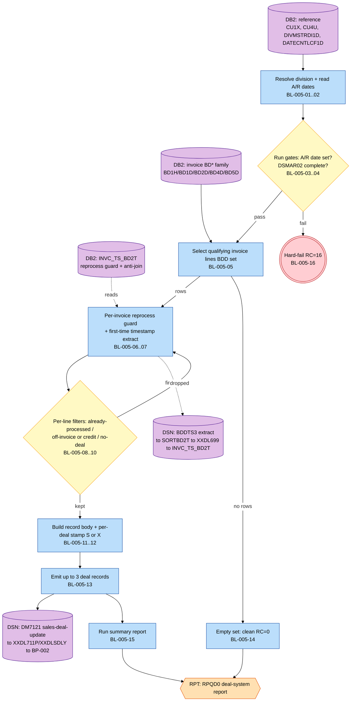
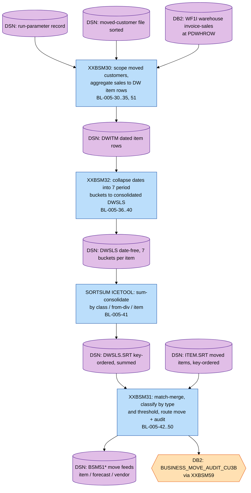
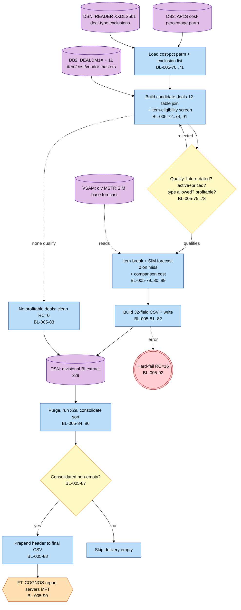

# BP-005 — Sales Transaction Processing: Extracted Business Logic

**Status:** Draft — business-logic extraction derived from the call-dependency graph, grounded in mainframe source under `docs/legacy/src` (consulted only to resolve ambiguous data).
**Companion to:** [BP-005-sales-transaction-processing-call-graph.md](BP-005-sales-transaction-processing-call-graph.md) (primary input) and [../BP-005-sales-transaction-processing.md](../BP-005-sales-transaction-processing.md) (overview spec / companion `BR-005-xx`).
**Scope:** Three independent end-to-end batch processes plus one orphan module —
- **Process A — Invoice-driven deal-sales update** (job `XXDL650J` step `XXDM713P` → `XXDM713`), ids `BL-005-01..16`.
- **Process B — DWSLS sales-consolidation producer** (job `MCBSM50J`, chain `XXBSM30 → XXBSM32 → SORTSUM → XXBSM31`), ids `BL-005-30..50`.
- **Process C — Deal-profitability BI extract** (job `MCDLS50J` → `XXDLS50`, ×29 divisions), ids `BL-005-70..92`.
- **Process D — Deal-suppression module** (`XXDLS01`, **dead code — no caller in source**), ids `BL-005-100..104`.

> The three live planes are joined only by shared reference data (`DIVMSTRDI1D`) and the deal lifecycle — **not** by the `DWSLS` dataset. The overview spec's assumed invoice → DWSLS → `XXDLS50` spine does not exist in source; see §10 and call-graph §8.1.

---

## 1. Purpose, scope, and method

This document re-expresses the BP-005 sales pipelines as **business logic** — the *what* — separated from the *how* (file/cursor mechanics, package binding, diagnostics, JCL plumbing). The **primary input is the call-dependency graph**; the mainframe source was consulted only to resolve exact field semantics, predicates, and literals, and is cited inline where used.

### 1.1 In scope (business logic) vs out of scope (implementation)

Captured as rules (the *what*): data validations, classifications, transformations, code mappings, match/merge logic, enrichment lookups, routing decisions, aggregations, defaulting, and the operational hard-fail convention.

Treated as implementation and summarised once in §8.3 (the *how*): file open/close & VSAM key positioning, file-status / `SQLCODE` interrogation, `SET CURRENT PACKAGESET` / remote `CONNECT`, cursor declare/open/multi-row-fetch/close & rowset buffering, global-temporary-table `DECLARE`/`CREATE INDEX`, `GET DIAGNOSTICS`, display/logging, report pagination/header emission, and job-step return-code propagation (`COND=(4,LT)`). The single mechanic promoted to a rule is the return-code-16 / abend hard-fail convention (`BL-005-16`, `BL-005-50`, `BL-005-92`, `BL-005-104`).

### 1.2 Method and conventions (per `reference/business-logic-template.md`)

- **Grounding (§1).** Every rule cites its originating call-graph node id(s) in **Derives from**; any source member consulted to resolve ambiguity is cited inline. No rule lacks an antecedent.
- **Pseudocode (§2).** All pseudocode follows the CLRS 4th-edition convention: indentation for block structure (no `begin`/`end`); `=` assignment, `==`/`≠`/`≤`/`≥` comparison; `and`/`or`/`not` boolean; `//` comments; `if`/`elseif`/`else`, `while`, `repeat … until`, `for … to`, `return`, `error "…"`. Named business operations are in capitals-with-hyphens (e.g. `READ-ITEM-MASTER`); no COBOL/SQL/JCL tokens appear inside any pseudocode fence (template §2.1).
- **Identifier translation (§3).** Every cryptic identifier is rendered in plain English with the original in parentheses on first use within a rule and in every schema row; the master mapping is in §3.
- **Logical-type vocabulary (§4)** used in all schemas:

| Logical type | Meaning |
|---|---|
| `string(n)` | fixed-length character field of length n |
| `integer` / `integer(n)` | whole number (optionally n digits) |
| `amount(i.f)` | signed decimal money/quantity, i integer + f fractional digits |
| `date-iso` | calendar date `YYYY-MM-DD` |
| `date-julian` | Acme Julian date `CCYYDDD` |
| `timestamp` | date-time to (stated) sub-second precision |
| `code(n)` | enumerated character code of length n (values enumerated in prose) |
| `flag` | single-character yes/no indicator |

- **Logic-type vocabulary (§5, CLOSED).** Each rule carries exactly one PRIMARY logic type from: `validation`, `classification`, `transformation`, `selection`, `data-load`, `enrichment`, `match-merge`, `aggregation`, `routing`, `control`, `reporting`, `error-handling` (optionally refined by a parenthetical subtype). See the template §5 for the cross-walk to the downstream process-graph element taxonomy.
- **Rule attributes (§6).** Each rule lists, in order: **Logic type**; **Maps to** (`BR-005-xx` or `new (reason)`); **Derives from**; **Trigger**; **Input schema**; **Description**; **Pseudocode**; **Output schema**.

---

## 2. End-to-end process maps

Lightweight orientation maps (the formal process graph is the downstream step-3 artifact). Each stage is annotated with its `BL-005-MM` range; file/cursor mechanics are omitted. Process D is a called subroutine, not an end-to-end process, and has no map (see call-graph diagram 11 and §7).

### 2.1 Process A — Invoice-driven deal-sales update (`XXDL650J` / `XXDM713`)



### 2.2 Process B — DWSLS sales-consolidation producer (`MCBSM50J`)



### 2.3 Process C — Deal-profitability BI extract (`MCDLS50J` / `XXDLS50`)



---

## 3. Master identifier-translation glossary

### 3.1 Shared reference data

**Division master — `ACME.DIVMSTRDI1D` (DCLGEN `DGDI1D`)** — used by Processes A, C, D
| Plain-English name | Original | Logical type |
|---|---|---|
| Acme division code | `MCLANE_DIV` / `DI1D-ACME-DIV` | code(2) |
| division partition | `DIV_PART` / `DI1D-DIV-PART` | integer (SMALLINT) |
| user division name | `USER_DIV_NAME` / `DI1D-USER-DIV-NAME` | string |

**Customer cross-ref — `ACME.CUST_XREF_CU1X` (DCLGEN `DGCU1X`)** — used by Processes A, D
| Plain-English name | Original | Logical type |
|---|---|---|
| customer id | `CUST_ID` | string(8) |
| old (legacy) customer number | `OLD_CUST` | integer |
| division id | `DIV_ID` | string(3) |
| deleted switch | `DELT_SW` | flag (`'N'`=active) |

### 3.2 Process A — invoice plane

**Invoice header — `ACME.INVC_HDR_BD1H` (`DGBD1H`)**
| Plain-English name | Original | Logical type |
|---|---|---|
| division partition | `DIV_PART` | integer (SMALLINT) |
| invoice number | `INVC_NUM` | string(10) |
| test-bill switch | `TEST_SW` | flag (`'N'`=live) |
| invoice date | `INVC_DT` | date-iso |
| header status | `STAT` | code(3) (`'BDD'`=billed/built, `'PST'`=posted) |
| customer id | `CUST_ID` | string(8) |

**Invoice common detail — `ACME.INVC_DTL_COMN_BD1D` (`DGBD1D`)**
| Plain-English name | Original | Logical type |
|---|---|---|
| bill item number | `BILL_ITEM_NUM` | integer |
| shipped (sold) quantity | `SHP_QTY` | integer |
| line number | `LINE_NUM` | integer |

**Invoice item detail — `ACME.INVC_DTL_ITEM_BD2D` (`DGBD2D`)**
| Plain-English name | Original | Logical type |
|---|---|---|
| business type | `BUS_TYP` | integer (fetched, unused — see §10) |
| disposition indicator | `DISP_IND` | code(1) (`'C'`=credit) |

**Invoice order detail — `ACME.INVC_DTL_ORDR_BD4D`** (no DCLGEN — name from SQL FROM)
| Plain-English name | Original | Logical type |
|---|---|---|
| pick-slot indicator | `PICK_SLOT` | code(7) (`'OUT'`=off-invoice) |

**Invoice deal-pricing detail — `ACME.INVC_DTL_DLPR_BD5D`** (no DCLGEN — name from SQL FROM)
| Plain-English name | Original | Logical type |
|---|---|---|
| current deal amount | `CURR_DEAL_AMT` | amount(5.4) |
| first / second / third deal id | `DEAL_ID1` / `DEAL_ID2` / `DEAL_ID3` | integer |
| first / second / third deal suppression switch | `DEAL_ID_SUPR_SW1/2/3` | flag (`'Y'`=suppress) |
| state item number | `STATE_ITEM_NUM` | integer (fetched, unused — see §10) |

**Invoice timestamp — `ACME.INVC_TS_BD2T` (`DGBD2T`)**
| Plain-English name | Original | Logical type |
|---|---|---|
| division partition | `DIV_PART` | integer (SMALLINT) |
| invoice number | `INVC_NUM` | string(10) |
| timestamp type | `TS_TYP` | code(3) (`'DL6'`=deal-build, `'BDH'`=header) |
| timestamp | `TS` | timestamp |

**US tax — `ACME.US_TAX_CU4U` (`DGCU4U`)**
| Plain-English name | Original | Logical type |
|---|---|---|
| tax state code | `TAX_ST_CD` | code(2) — fetched but never used (see §10) |

**A/R date control — `DATECNTLCF1D` (`DGCF1D`)**
| Plain-English name | Original | Logical type |
|---|---|---|
| date-control type key | `KDTCF0` | code(8) (`'ARDATES'`) |
| A/R processing date | `DARPDH` | date-iso (unset sentinel `1900-01-01`) |
| DSMAR02 completion timestamp | `FAR020` | timestamp (unset sentinel `1900-01-01-00.00.00.000000`) |

**Sales-deal-update record — `DM7121` / `OL-REC` (copybook `XXDM4XC`, LRECL 65)**
| Plain-English name | Original | Logical type | Notes |
|---|---|---|---|
| bill item number | `OL-IITEM0` | integer(6) | from `BILL_ITEM_NUM` |
| deal id | `OL-IDEAL0` | integer(5) | per-deal (BL-005-12) |
| update-type / suppress flag | `OL-SDTUP0` | code(1) | `'S'`=sales update, `'X'`=suppressed |
| return date | `OL-DDTRET` | integer(6) MMDDYY | reformatted from `INVC_DT` |
| deal amount | `OL-AIDEA5` | amount(5.2) | from `CURR_DEAL_AMT` |
| sold quantity | `OL-QUSOL3` | amount(7) | from `SHP_QTY` |
| on-order / received / purchased quantity | `OL-QUONO3` / `OL-QUREC3` / `OL-QUPUR3` | amount(7) | zeroed (sales-only feed) |
| old customer number | `OL-ICUST0` | integer(6) | from `OLD_CUST` |
| PO number | `OL-IPNUM0` | string(12) | blanked |

**Invoice-timestamp extract — `BDDTS3` (`BDDTS-REC`, FB)**
| Plain-English name | Original | Logical type |
|---|---|---|
| invoice number | `BDDTS-INVC-NUM` | string(10) |

### 3.3 Process B — DWSLS-producer plane

**Warehouse invoice-sales detail — `WF1I_INVC_SLS_DTL` @ `PDWHROW` (`DGWF1IU`)**
| Plain-English name | Original | Logical type |
|---|---|---|
| shipped quantity | `SHP_QTY` | integer |
| invoice price | `INVC_PRICE` | amount(9.4) |
| price-book code switch | `PB_CD_SW` | flag (`'N'`=true product sale) |

**Warehouse dimensions — `WD2D_DT_TBL` (date, inline DECLARE), `WD1D_DIV` (division), `WD1C_CUST` (customer), `WD1I_ITEM` (item)**
| Plain-English name | Original | Logical type | Source |
|---|---|---|---|
| calendar date | `DT` | date-iso | WD2D |
| division-part | `DIV_PART` | integer | WD1D |
| customer id | `CUST_ID` | string(8) | WD1C |
| item number | `ITEM_NUM` | integer | WD1I |

**Moved-customer scope set — `SESSION.CUST_TMP1` (GTT)** · **Moved-customer file — `BSM50CUS`**
| Plain-English name | Original | Logical type | Source |
|---|---|---|---|
| moved-customer id | `CUS-CUST-ID` / `CUST_ID` | string(8) | BSM50CUS / CUST_TMP1 |
| business-move group id (class id) | `CUS-CLS-ID` | string(10) | BSM50CUS |
| division-part | `CUS-DIV-PART` | integer | BSM50CUS |

**Run-parameter record — `BSM50PRM`** (averaging windows / thresholds; values from the absent `BSM50S1.PARM`)
| Plain-English name | Original | Logical type |
|---|---|---|
| cigarette-window days | `PRM-CIG-DAYS` | integer |
| no-sales-window days | `PRM-DAYS-NO-SALES` | integer |
| general-merchandise weeks-to-average | `PRM-GMP-NUM-WK-TO-AVG` | integer |
| logo-window days | `PRM-LOGO-DAYS` | integer |
| other-grocery-window days / units | `PRM-OTH-DAYS` / `PRM-OTH-UNITS` | integer |
| other-product-window days / sales | `PRM-OTP-DAYS` / `PRM-OTP-SALES` | integer |
| forecast weeks-to-average | `PRM-FCST-NUM-WK-TO-AVG` | integer |
| cigarette carton-movement threshold | `PRM-CIG-CARTON-MOVEMENT` | integer |
| days-since-item-setup / days-authorized limits | `PRM-DAYS-ITEM-SETUP` / `PRM-DAYS-AUTHORIZED` | integer |

**DW item record — `BSM30DWI` (DWITM)**
| Plain-English name | Original | Logical type |
|---|---|---|
| business-move group id (class id) | `DWI-CLS-ID` | string(10) |
| warehouse date | `DWI-DATE` | date-iso |
| from-division-part | `DWI-FROM-DIV-PART` | integer |
| item number | `DWI-ITEM-NUM` | amount(9.0) |
| shipped quantity | `DWI-SHP-QTY` | amount(9.0) |
| extended sales | `DWI-SALES` | amount(11.4) |

**DW consolidated-sales record — `BSM30DWS` (DWSLS / DWSLS.SRT)**
| Plain-English name | Original | Logical type |
|---|---|---|
| business-move group id (class id) | `DWS-CLS-ID` (`DWSLS-CLS-ID`) | string(10) |
| from-division-part | `DWS-FROM-DIV-PART` | integer |
| item number | `DWS-ITEM-NUM` | amount(9.0) |
| general-merchandise quantity / sales | `DWS-GMP-QTY` / `DWS-GMP-SALES` | amount(9.0) / amount(11.4) |
| cigarette quantity | `DWS-CIG-QTY` | amount(9.0) |
| other-product sales | `DWS-OTP-SALES` | amount(11.4) |
| other-grocery quantity | `DWS-GRO-QTY` | amount(9.0) |
| logo quantity | `DWS-LOGO-QTY` | amount(9.0) |
| all/no-sales sales | `DWS-ALL-SALES` | amount(11.4) |
| forecast quantity | `DWS-FCST-SALES-QTY` | amount(9.0) |

**Moved-item file — `BSM50ITM` (ITEM.SRT)**
| Plain-English name | Original | Logical type |
|---|---|---|
| class type / class id | `ITM-CLS-TYP` / `ITM-CLS-ID` | string(6) / string(10) |
| from / to division-part | `ITM-FROM-DIV-PART` / `ITM-TO-DIV-PART` | integer |
| item number | `ITM-ITEM-NUM` | integer(6) |
| vendor id | `ITM-VNDR-ID` | integer(10) |
| item type | `ITM-ITEM-TYPE` | code(3): `GMP`/`CIG`/`OTP`/other=grocery |
| limit-authorized switch | `ITM-LIMIT-AUTHZ-SW` | flag |
| item age / authorization age (days) | `ITM-ITEM-AGE` / `ITM-AUTH-AGE` | amount(5.0) |
| exists-at-destination switch | `ITM-EXIST-AT-TO-DIV` | flag |
| vendor status | `ITM-VN1A-STAT` | code(3): `'INA'`=inactive |

**Business-move audit record — `XXCU3B-REC` → `ACME.BUSINESS_MOVE_AUDIT_CU3B` (`DGCU3B`)**
| Plain-English name | Original | Logical type |
|---|---|---|
| division-part | `XXCU3B-DIV-PART` | integer |
| class type / class id | `XXCU3B-CLS-TYP` / `XXCU3B-CLS-ID` | string(6) / string(10) |
| catalog/item number | `XXCU3B-CATLG-NUM` | integer |
| item type | `XXCU3B-ITEM-TYP` | code(3) |
| sales amount / quantity | `XXCU3B-SLS-AMT` / `XXCU3B-SLS-QTY` | amount(11.2) / amount(9.0) |
| exclusion code | `XXCU3B-EXCLSN-CD` | code(3): blank/`NOS`/`INA`/`LOG`/`DAM`/`GMP`/`CIG`/`OTP`/`GRO`/`IAE` |

### 3.4 Process C — deal-profitability plane

**Deal master — `DEALDM1X` (`DGDM1X`)**
| Plain-English name | Original | Logical type |
|---|---|---|
| item number | `IITEM2` | integer(9) |
| deal-list status | `CDLST0` | code(1) (`'T'` excluded — non-live) |
| deal type | `CDLTP2` | code(2) (numeric) |
| deal unit amount | `DEAL_UNIT_AMT` | amount(5.2) |
| master-case / ceded deal amount | `DEAL_MSTRCS_AMT` / `CEDED_DEAL_AMT` | amount(5.2) |
| billback override amount | `DEAL_BILBCK_OV_AMT` | amount(5.2) |
| deal form of payment | `CDFRM0` | code(2) |
| corporate deal id / account number | `ICPDL2` / `ICCRP2` | integer |
| deal last buy / invoice / ship date | `DLBUYH` / `DLINVH` / `DLSHPH` | date-iso |

**Item cost — `ACME.ITM_COST_DE8E` (`DGDE8E`)**
| Plain-English name | Original | Logical type |
|---|---|---|
| cost class type / id | `CLS_TYP` / `CLS_ID` | code(6) (`'ITMCST'`) / code(10) (`'LICCOST'`) |
| bill-effective timestamp | `BILL_EFF_TS` | timestamp (MAX = latest) |
| list item cost | `COST_AMT` (alias `LIC`) | amount(11.4) |
| delete switch | `DELT_SW` | flag (`'N'`) |

**App system parameter — `DS.APPL_SYS_PARM_AP1S` (`DGAP1S`)**
| Plain-English name | Original | Logical type |
|---|---|---|
| application id | `APPL_ID` | code(5) (`'CAD'`) |
| parameter id | `PARM_ID` | code(20) (`'XXDLS50_EXCLUDE_TYP'`) |
| cost-percentage value | `DEC_VAL` (→ `AP1S-DEC-VAL`) | amount(12.4) (profitability multiplier) |

**Item / pack / UPC — `UIN_ITEM_DE6C`, `DIV_ITEM_PACK_DE1I`, `ITEM_UPC_DE6Y`** · **Item on-hand — `ITEM_OH_DE1O`**
| Plain-English name | Original | Logical type |
|---|---|---|
| item pack / size / description / repack | `ITEM_PCK` / `ITEM_SIZE` / `ITEM_DESC` / `ITEM_RPK` | integer / string(8) / string(25) / integer |
| item status code | `DE1I.ITEM_STAT_CD` | code(3) (`'INA'`=inactive) |
| on-order quantity | `DE1I.ON_ORDER_QTY` | amount |
| GTIN / UPC pack type | `DE6Y.GTIN` / `DE6Y.PCK_TYP` | string(14) / code(3) (`'CAS'`=case) |
| on-hand quantity (summed) | `DE1O.QTY` (alias `ON_HAND`) | amount |

**Vendor / buyer — `VNDR_MSTR_VN1A`, `BUYR_MSTR_VN4B`, `DIV_VNDR_XREF_VN1Y`, `CRP_VNDR_XREF_VN1X`, `ITEM_VNDR_DE6V`**
| Plain-English name | Original | Logical type |
|---|---|---|
| vendor short name | `VN1A.VNDR_SHRT_NM` | string(20) (CSV-sanitised) |
| division buyer (operator id) | `VN4B.DCS_OPER_ID` | string(5) |
| division vendor id | `VN1Y.VNDR_ID` | integer(10) |
| corporate vendor id | `VN1X.OLD_VNDR_ID` | integer(10) |

**SIM base forecast — copybook `DCSFITM` (divisional `&DI2..MSTR.SIM`, VSAM KSDS)**
| Plain-English name | Original | Logical type |
|---|---|---|
| SIM record key | `ITKY-RECORD-KEY` | string(10) (program keys the 6-digit item segment) |
| base forecast (avg weekly movement) | `ITBY-BASE-FORECAST` | amount(6.1) (0 on invalid key) |

**Profitable-deal output record — copybook `DLS50S1C` (`OUT-REC`, LRECL 310, 32 comma-separated fields)**
| Plain-English name | Original | Logical type |
|---|---|---|
| division / division buyer | `OUT-ACME-DIV` / `OUT-DIV-BUYER` | code(2) / string(5) |
| division / corporate / division-vendor id | `OUT-DIV-VNDR` / `OUT-CRP-VNDR` / `OUT-DIV-VNDR-ID` | integer(10) |
| vendor short name | `OUT-VNDR-SHRT-NM` | string(20) |
| item number / pack / size / description / repack | `OUT-ITEM-NUMBER` / `OUT-ITEM-PCK` / `OUT-ITEM-SIZE` / `OUT-ITEM-DESC` / `OUT-ITEM-RPK` | integer(6) / integer(4) / string(8) / string(25) / integer(4) |
| deal type / form of payment / corp deal id / corp account / group | `OUT-DEAL-TYPE` / `OUT-DEAL-FORM-OF-PYMT` / `OUT-CORPORATE-DEAL-ID` / `OUT-CORP-ACC-NUM` / `OUT-GROUP-NUM` | code(2) / code(2) / integer(5) / integer(3) / integer(3) |
| unit / master-case / ceded / billback amounts | `OUT-UNIT-DEAL-AMT` / `OUT-MSTRCSE-DEAL-AMT` / `OUT-DEAL-CEDED-AMT` / `OUT-DEAL-BILLB-AMT` | amount(5.2) / amount(7.2) |
| list item cost / comparison cost (threshold) | `OUT-LIC` / `OUT-COMP-LIC` | amount(11.4) / amount(12.4) |
| on-hand / on-order quantity | `OUT-ON-HAND-QTY` / `OUT-ON-ORDER-QTY` | integer(9) |
| base forecast / GTIN | `OUT-BASE-FORECAST` / `OUT-GTIN` | amount(6.1) / string(14) |

**Deal-type exclusion card — `DS.PERM.RDRPARM(XXDLS501)`** (member absent from export)
| Plain-English name | Original | Logical type |
|---|---|---|
| excluded deal type | `RDR-DEAL-TYPE` | code(1) (one per line, ≤9 honoured) |

### 3.5 Process D — deal-suppression module (orphan)

**Linkage record — copybook `DLS01LNK`** (the module's input/output contract)
| Plain-English name | Original | Logical type |
|---|---|---|
| division code | `DLS01-DIV-CODE` | code(2) |
| division partition | `DLS01-DIV-PART` | integer |
| customer number | `DLS01-CUSTOMER-NUM` | integer(6) |
| item number | `DLS01-ITEM-NUM` | integer(6) |
| deal type | `DLS01-DEAL-TYPE` | code(2) |
| form of payment | `DLS01-FORM-OF-PAYMENT` | code(2) |
| invoice date | `DLS01-INVOICE-DATE` | date-iso |
| deal-suppression switch (returned) | `DLS01-DEAL-SUPP-SW` | flag (`'Y'`=suppress, `'N'`=not) |
| return code (returned) | `DLS01-RET-CODE` | integer (`0` ok / `11` DB error / `16` packageset) |

**Suppression-profile tables — `ACME.PROF_HDR_PR1P`, `ACME.PROF_CUS_PR3Q`, `ACME.PROF_ITM_PR5Q`, `ACME.PROF_ITM_GRP_PR3P`** (DCLGENs absent — immaterial, module is dead)
| Plain-English name | Original | Logical type |
|---|---|---|
| profile type | `PR1P.PROF_TYP` | code(3) (`'DLS'`=deal-suppression) |
| profile active switch | `PR1P.OK_TO_ACTIVE_SW` | flag (`'Y'`) |
| profile effective / end date | `PR1P.EFF_DT` / `PR1P.END_DT` | date-iso |
| profile catalog number | `PR5Q.CATLG_NUM` | integer |
| deal-type/payment group class id | `PR3P.CLS_ID` (`CLS_TYP='DLSTYP'`) | code (last-digit-of-deal-type ‖ form-of-payment) |

---

## 4. Process A — Invoice-driven deal-sales update (`XXDL650J` / `XXDM713`)

**Entry point / data sources:** the per-division job `XXDL650J` step `XXDM713P`; the invoice `BD*` family (`BD1H`/`BD1D`/`BD2D`/`BD4D`/`BD5D`), the invoice-timestamp table `BD2T` (reprocess guard + anti-join), the customer cross-ref `CU1X`, US tax `CU4U`, division master `DIVMSTRDI1D`, and A/R date control `DATECNTLCF1D`.
**Data sinks:** the `DM7121` sales-deal-update file (DISP=MOD; consumed by `XXDL711P`/`XXDLSDLY` into the BP-002 deal lifecycle), the `BDDTS3` invoice-timestamp extract (→ `SORTBD2T` → `XXDL699` → `INVC_TS_BD2T` writeback), and the `RPQD0` report.

`XXDM713` ("DM710NP Deal Sales Transactions Build — Grocery Billing") is DB2-in / file-out: it reads the invoice family via one rowset cursor (gated by an A/R control date and a per-invoice reprocess guard) and emits up to three `DM7121` records per qualifying invoice line.

#### BL-005-01 — Resolve division partition and division name
- **Logic type:** enrichment (lookup build)
- **Maps to:** new (operational precondition — establishes the partition key every downstream read/write is scoped by)
- **Derives from:** `XXDM713.5025-GET-DIV-INFO`; data `ACME.DIVMSTRDI1D`; run parameter `PARM-DIV` → `DI1D-ACME-DIV`.
- **Trigger:** program start, once, after the DB2 packageset is set.
- **Input schema:** Acme division code (`DI1D-ACME-DIV` ← `PARM-DIV`): code(2); division master keyed by division code (`ACME.DIVMSTRDI1D`).
- **Description:** Translate the 2-character run-parameter division code into the division's partition number (the physical key scoping every invoice read and the reprocess guard) and its user-division name (for report headers). A missing lookup is an operational hard-fail (BL-005-16).
- **Pseudocode:**

```
RESOLVE-DIVISION(divisionCode)
    divRow = READ-DIVISION-MASTER(divisionCode)        // singleton by division code
    if divRow is NOT-FOUND
        error "division not on master"                 // → BL-005-16
    return (divRow.partitionNumber, divRow.userDivisionName)
```

- **Output schema:** division partition (`DI1D-DIV-PART`): integer; division name (`DI1D-USER-DIV-NAME`): string.

#### BL-005-02 — Read A/R processing-control dates
- **Logic type:** data-load
- **Maps to:** BR-005-04
- **Derives from:** `XXDM713.5100-SELECT-CF1D`; data `DATECNTLCF1D` (key `KDTCF0='ARDATES'`). *(Field types resolved from `DGCF1D`: `DARPDH` DATE, `FAR020` TIMESTAMP.)*
- **Trigger:** start of main processing, once, before the invoice cursor opens.
- **Input schema:** A/R date-control row keyed by the date-control type key (`KDTCF0='ARDATES'`) (`DATECNTLCF1D`).
- **Description:** Fetch the A/R control record supplying (a) the **A/R processing date** (`DARPDH`) that selects which invoices belong to this run, and (b) the **DSMAR02 completion timestamp** (`FAR020`) proving the upstream A/R month-end ran. These feed the two run gates (BL-005-03/04).
- **Pseudocode:**

```
LOAD-AR-CONTROL-DATES()
    ctl = READ-AR-DATE-CONTROL("ARDATES")              // singleton
    return (ctl.arProcessingDate, ctl.dsmar02CompletedTimestamp)
```

- **Output schema:** A/R processing date (`CF1D-DARPDH`): date-iso; DSMAR02 completion timestamp (`CF1D-FAR020`): timestamp.

#### BL-005-03 — Reject the run when the A/R processing date is unset
- **Logic type:** validation (write-gate)
- **Maps to:** BR-005-04
- **Derives from:** `XXDM713.2000-PROCESS-PARA` decision `D_DATE`; `XXDM713.4200-WRITE-ERROR-FILE`. *(Sentinel `'1900-01-01'` confirmed in `XXDM713.cbl` `2000-PROCESS-PARA`.)*
- **Trigger:** immediately after BL-005-02, before the cursor opens.
- **Input schema:** A/R processing date (`CF1D-DARPDH`): date-iso.
- **Description:** The A/R processing date must be a real date. The legacy "no value" sentinel is `1900-01-01`; if present, the A/R cycle has not established a processing date, so the run writes a "processing date not valid" report line and terminates hard (RC=16).
- **Pseudocode:**

```
const AR_DATE_UNSET = "1900-01-01"                     // legacy no-value date sentinel
GATE-AR-PROCESSING-DATE(arProcessingDate)
    if arProcessingDate == AR_DATE_UNSET
        EMIT-REPORT-LINE("processing date not valid")
        error "A/R processing date invalid"            // RC=16, → BL-005-16
```

- **Output schema:** decision — proceed, or terminate with RC=16.

#### BL-005-04 — Reject the run when upstream A/R month-end (DSMAR02) has not completed
- **Logic type:** validation (write-gate)
- **Maps to:** BR-005-04
- **Derives from:** `XXDM713.2000-PROCESS-PARA` decision `D_FAR`; `XXDM713.4200-WRITE-ERROR-FILE`. *(Sentinel `'1900-01-01-00.00.00.000000'` confirmed in `XXDM713.cbl`.)*
- **Trigger:** after BL-005-03 passes, before the cursor opens.
- **Input schema:** DSMAR02 completion timestamp (`CF1D-FAR020`): timestamp.
- **Description:** The deal-sales build must not run until the upstream A/R job (DSMAR02) has stamped its completion timestamp. The "not-run" sentinel is `1900-01-01-00.00.00.000000`; if present, the run writes "must run DSMAR02 before job" and terminates hard (RC=16).
- **Pseudocode:**

```
const DSMAR02_NOT_RUN = "1900-01-01-00.00.00.000000"  // legacy no-value timestamp sentinel
GATE-UPSTREAM-AR-COMPLETE(dsmar02CompletedAt)
    if dsmar02CompletedAt == DSMAR02_NOT_RUN
        EMIT-REPORT-LINE("must run DSMAR02 before job")
        error "upstream A/R not complete"              // RC=16, → BL-005-16
```

- **Output schema:** decision — proceed, or terminate with RC=16.

#### BL-005-05 — Select the run's qualifying invoice lines (BDD set)
- **Logic type:** selection (set selection)
- **Maps to:** BR-005-02
- **Derives from:** `XXDM713.BDD_CUR` (paragraphs `5200/5300`); data `BD1H`/`BD1D`/`BD2D`/`BD4D`/`BD5D`/`CU1X`/`CU4U`, anti-join `BD2T`. *(Predicates and join keys from the `BDD_CUR` declaration in `XXDM713.cbl`; the spec's read set omits `BD1H`/`BD4D`/`BD5D`/the `BD2T` anti-join — call-graph §8.1.)*
- **Trigger:** once per run after both gates pass; the chosen set is iterated line by line.
- **Input schema:** invoice headers (`BD1H`): `STAT`, `TEST_SW`, `INVC_DT`, `DIV_PART`, `INVC_NUM`; common detail (`BD1D`): `BILL_ITEM_NUM`, `SHP_QTY`; item detail (`BD2D`): `BUS_TYP`, `DISP_IND`; order detail (`BD4D`): `PICK_SLOT`; deal-pricing detail (`BD5D`): `DEAL_ID1/2/3`, `CURR_DEAL_AMT`, `DEAL_ID_SUPR_SW1/2/3`; customer cross-ref (`CU1X` where `DELT_SW='N'`): `OLD_CUST`; US tax (`CU4U`): `TAX_ST_CD` (fetched, unused); anti-join timestamps (`BD2T` type `'BDH'`).
- **Description:** Define the population of invoice lines this run considers. A line qualifies when it belongs to **this division partition**, is **not a test bill** (`TEST_SW='N'`), its **invoice date equals the A/R processing date** (`INVC_DT = DARPDH`), and its header status is either **`'BDD'`** or **`'PST'` with no prior `'BDH'` timestamp** (a NOT-EXISTS anti-join on `BD2T`). Each header is expanded to its common/item/order/deal-pricing detail lines (inner joins on division+invoice[+line]) and enriched with the active customer's legacy customer number and US-tax row. Results are ordered by invoice number so the per-invoice guard (BL-005-07) sees lines grouped.
- **Pseudocode:**

```
SELECT-QUALIFYING-INVOICE-LINES(divisionPartition, arProcessingDate)
    lines = empty
    for each header h in INVOICE-HEADERS where
            h.divisionPartition == divisionPartition and
            h.testSwitch == "N" and
            h.invoiceDate == arProcessingDate and
            ( h.status == "BDD"
              or ( h.status == "PST" and not HEADER-TIMESTAMP-EXISTS(h, type = "BDH") ) )
        for each detail line d joined to h on division + invoiceNumber [+ lineNumber]
                across common / item / order / deal-pricing detail,
                with active customer cross-ref (deletedSwitch == "N") and the US-tax row
            append d to lines
    order lines by invoiceNumber
    return lines
```

- **Output schema:** ordered set of qualifying invoice detail lines (header + four detail layouts + old-customer number + tax row), iterated by BL-005-06..13.

#### BL-005-06 — Detect invoice-number change to drive the per-invoice guard
- **Logic type:** control (aggregation boundary)
- **Maps to:** BR-005-06
- **Derives from:** `XXDM713.2110-PROCESS-DETAIL`; working field `SAVE-INVC-NUM`.
- **Trigger:** for each fetched line, before any per-line filtering.
- **Input schema:** current line invoice number (`MRF-INVC-NUM`): string(10); last-seen invoice number (`SAVE-INVC-NUM`): string(10).
- **Description:** Because lines are ordered by invoice number, the first line of each new invoice is the control point at which the reprocess guard (BL-005-07) runs exactly once per invoice. On a break it resets the "already processed" flag, records the new invoice number, and invokes the guard; subsequent lines of the same invoice inherit that decision.
- **Pseudocode:**

```
ON-EACH-LINE(line)
    if line.invoiceNumber ≠ lastInvoiceNumber
        lastInvoiceNumber = line.invoiceNumber
        alreadyProcessed = CHECK-INVOICE-REPROCESS-GUARD(line.invoiceNumber)   // BL-005-07
    // else reuse alreadyProcessed from this invoice's first line
```

- **Output schema:** per-invoice `alreadyProcessed` decision available to BL-005-08; new-invoice boundary signal.

#### BL-005-07 — Per-invoice reprocess guard and first-time extract emission
- **Logic type:** validation (filter) — idempotency guard
- **Maps to:** BR-005-06
- **Derives from:** `XXDM713.2109-BDD-REC-KEY-10`; data `ACME.INVC_TS_BD2T` (`TS_TYP='DL6'`); sink `BDDTS3`. *(`'DL6'` literal and SQLCODE handling from `XXDM713.cbl`; `-811` treated as "already processed".)*
- **Trigger:** once per invoice, at the invoice-number break (BL-005-06).
- **Input schema:** division partition (`BD2T-DIV-PART`): integer; invoice number (`BD2T-INVC-NUM`): string(10); deal-build timestamp rows (`ACME.INVC_TS_BD2T` where `TS_TYP='DL6'`).
- **Description:** Enforce idempotency on the invoice plane. Look for an existing deal-build (`'DL6'`) timestamp for this division+invoice. If one **exists**, the invoice was already applied in a prior run → mark it already-processed so all its lines are skipped. If **none exists** (first time), write the invoice number to the `BDDTS3` extract; that extract is later merged (`SORTBD2T`) and consumed by `XXDL699` to stamp `INVC_TS_BD2T`, closing the idempotency loop.
- **Pseudocode:**

```
CHECK-INVOICE-REPROCESS-GUARD(invoiceNumber)
    result = LOOKUP-DEAL-BUILD-TIMESTAMP(divisionPartition, invoiceNumber, type = "DL6")
    if result == FOUND or result == DUPLICATE-ROWS
        return TRUE                                    // already processed → skip all lines
    elseif result == NONE
        EMIT-INVOICE-EXTRACT(invoiceNumber)            // first time → BDDTS3 → XXDL699 stamp
        return FALSE
    else
        error "BD2T lookup failed"                     // RC=16, → BL-005-16
```

- **Output schema:** decision `alreadyProcessed` (flag); side effect: invoice number appended to `BDDTS3` on first encounter.

#### BL-005-08 — Skip lines of an already-processed invoice
- **Logic type:** validation (filter)
- **Maps to:** BR-005-06
- **Derives from:** `XXDM713.2110-PROCESS-DETAIL` decision `D_DUP`; flag `INVC-ALREADY-PROCESSED`.
- **Trigger:** for every line, after the guard decision is known.
- **Input schema:** already-processed flag (`INVC-PROCESS-SW`): flag.
- **Description:** If the invoice carrying this line was found already processed by BL-005-07, drop the line — preventing double-application of sales onto deals.
- **Pseudocode:**

```
if alreadyProcessed
    skip line                                          // no output record
```

- **Output schema:** decision — skip line, or continue to BL-005-09.

#### BL-005-09 — Skip off-invoice or credit lines
- **Logic type:** validation (filter)
- **Maps to:** BR-005-02
- **Derives from:** `XXDM713.2110-PROCESS-DETAIL` decision `D_FILT`; fields `MRF-BD4D-PICK-SLOT`, `MRF-BD2D-DISP-IND`. *(Literals `'OUT'` and `'C'` from `XXDM713.cbl`.)*
- **Trigger:** for each line that survived BL-005-08.
- **Input schema:** pick-slot indicator (`PICK_SLOT`, BD4D): code(7) — `'OUT'` = off-invoice; disposition indicator (`DISP_IND`, BD2D): code(1) — `'C'` = credit.
- **Description:** Exclude lines that are not normal billable sales: an order pick-slot of `'OUT'` (off-invoice) or a disposition indicator of `'C'` (credit). Such lines do not contribute sales to deals.
- **Pseudocode:**

```
CLASSIFY-AND-FILTER-LINE(line)
    if line.pickSlot == "OUT" or line.dispositionIndicator == "C"
        skip line                                      // off-invoice or credit
```

- **Output schema:** decision — skip line, or continue to BL-005-10.

#### BL-005-10 — Skip lines that carry no deal
- **Logic type:** validation (filter)
- **Maps to:** BR-005-02
- **Derives from:** `XXDM713.2110-PROCESS-DETAIL` decision `D_NODEAL`; fields `MRF-DEAL-ID1/2/3` (BD5D).
- **Trigger:** for each line that survived BL-005-09.
- **Input schema:** first/second/third deal id (`DEAL_ID1`/`DEAL_ID2`/`DEAL_ID3`): integer.
- **Description:** A line participates in deal-sales only if it references at least one deal. If all three deal-id slots are zero, the line carries no deal and is dropped.
- **Pseudocode:**

```
if line.dealId1 == 0 and line.dealId2 == 0 and line.dealId3 == 0
    skip line                                          // no deal on this line
```

- **Output schema:** decision — skip line, or continue to BL-005-11.

#### BL-005-11 — Build the common sales-deal-update record body
- **Logic type:** transformation (calculation)
- **Maps to:** BR-005-02
- **Derives from:** `XXDM713.2110-PROCESS-DETAIL`; record copybook `XXDM4XC` (OL-REC). *(Field set and the explicit zeroing of order quantities / PO from `XXDM713.cbl`; `STATE_ITEM_NUM`/`BUS_TYP` fetched but not placed in OL-REC.)*
- **Trigger:** once per qualifying line (after BL-005-10), before emitting per-deal records.
- **Input schema:** bill item number (`BILL_ITEM_NUM`, BD1D): integer; current deal amount (`CURR_DEAL_AMT`, BD5D): amount(5.4); invoice date (`INVC_DT`, BD1H): date-iso; shipped quantity (`SHP_QTY`, BD1D): integer; old customer number (`OLD_CUST`, CU1X): integer.
- **Description:** Assemble the shared body of the `DM7121` record (LRECL 65) that every per-deal copy for this line inherits: bill item number, current deal amount, sold quantity, legacy customer number, and a **return date** derived by reformatting the invoice date from `YYYY-MM-DD` to `MMDDYY`. The on-order/received/purchased quantities and PO number are explicitly zeroed/blanked — this feed conveys only sold sales. The deal id and suppression flag are set per-deal in BL-005-12.
- **Pseudocode:**

```
BUILD-DEAL-SALES-BODY(line, invoiceDate)
    rec = new deal-sales-update record                 // all fields cleared
    rec.billItemNumber    = line.billItemNumber
    rec.dealAmount        = line.currentDealAmount
    rec.returnDate        = REFORMAT-DATE(invoiceDate, from = "YYYY-MM-DD", to = "MMDDYY")
    rec.soldQuantity      = line.shippedQuantity
    rec.onOrderQuantity   = 0
    rec.receivedQuantity  = 0
    rec.purchasedQuantity = 0
    rec.poNumber          = blank
    rec.oldCustomerNumber = line.oldCustomerNumber
    return rec
```

- **Output schema:** in-memory deal-sales-update record body (`OL-REC`), missing only per-deal id + suppression flag.

#### BL-005-12 — Stamp the per-deal id and resolve the per-deal update/suppress flag
- **Logic type:** transformation (code mapping)
- **Maps to:** BR-005-03 *(partial — XXDM713's own column-level suppression; the external `XXDLS01` module is dead, see §7 / call-graph §8.2)*
- **Derives from:** `XXDM713.2110-PROCESS-DETAIL` per-deal blocks; fields `MRF-DEAL-IDn`, `MRF-DEAL-ID-SUPR-SWn`; OL field `OL-SDTUP0`. *(Per-deal `'Y'→'X' else 'S'` from `XXDM713.cbl`, PIR4502.)*
- **Trigger:** for each non-zero deal id slot (n = 1,2,3) on the qualifying line.
- **Input schema:** deal id n (`DEAL_IDn`): integer; per-deal suppression switch n (`DEAL_ID_SUPR_SWn`, BD5D): flag (`'Y'`=suppress).
- **Description:** For each non-zero deal slot, copy the shared body, set the **deal id**, and set the **update-type flag** (`SDTUP0`): `'X'` when that deal's suppression switch is `'Y'` (a suppressed buy-back deal), otherwise `'S'` (a normal sales update). Downstream consumers use `'X'` vs `'S'` to hold or apply the sales update per deal. This is XXDM713's own per-deal column-level suppression, distinct from the dead external `XXDLS01` module.
- **Pseudocode:**

```
STAMP-PER-DEAL(body, dealId, suppressSwitch)
    rec = duplicate of body
    rec.dealId = dealId
    if suppressSwitch == "Y"
        rec.updateType = "X"                           // suppressed deal
    else
        rec.updateType = "S"                           // normal sales update
    return rec
```

- **Output schema:** one fully-populated record per non-zero deal slot, with `OL-IDEAL0` set and `OL-SDTUP0` ∈ {`'S'`,`'X'`}.

#### BL-005-13 — Emit up to three sales-deal-update records per line
- **Logic type:** routing
- **Maps to:** BR-005-02
- **Derives from:** `XXDM713.2110-PROCESS-DETAIL` + `XXDM713.4100-WRITE-OL-FILE`; sink `DM7121` (DD `DMDLU`, DISP=MOD).
- **Trigger:** after BL-005-11/12, per qualifying line.
- **Input schema:** the up-to-three candidate per-deal records (slots with non-zero deal id).
- **Description:** Write one `DM7121` record for each non-zero deal slot on the line — up to three per line — appending to the deal-sales-update file that downstream `XXDL711P`/`XXDLSDLY` consume into the BP-002 deal lifecycle. A non-`'00'` write status is an operational hard-fail.
- **Pseudocode:**

```
EMIT-DEAL-RECORDS(line, body)
    for n = 1 to 3
        if line.dealId[n] ≠ 0
            rec = STAMP-PER-DEAL(body, line.dealId[n], line.suppressSwitch[n])   // BL-005-12
            APPEND-DEAL-SALES-RECORD(rec)              // → DM7121
            if append status ≠ ok
                error "deal-sales append failed"       // RC=16, → BL-005-16
```

- **Output schema:** 0..3 records appended to `DM7121`; written-count incremented.

#### BL-005-14 — Handle an empty qualifying set gracefully
- **Logic type:** control (soft-fail)
- **Maps to:** new (graceful empty-result handling)
- **Derives from:** `XXDM713.5300-FETCH-BDD-CURSOR` (+100, `WS-TOTAL-FETCH=0`) and `XXDM713.2000-PROCESS-PARA` decision `D_EMPTY`.
- **Trigger:** when the cursor returns no rows for the run's division/date.
- **Input schema:** total fetched count (`WS-TOTAL-FETCH`): integer.
- **Description:** An empty selection is a normal business outcome (no billed invoices for this division on the A/R date), not an error. The program writes a "no records found" report line and ends cleanly (RC=0).
- **Pseudocode:**

```
if totalFetched == 0
    EMIT-REPORT-LINE("no records were found on the BD* tables")
    finish cleanly                                     // RC=0, not a failure
```

- **Output schema:** report line; clean termination (RC=0).

#### BL-005-15 — Emit the run summary / deal-system message report
- **Logic type:** reporting (aggregation output)
- **Maps to:** new (operator run-summary report)
- **Derives from:** `XXDM713.4200-WRITE-ERROR-FILE` + summary block in `2000-PROCESS-PARA`; counters `WS-TOTAL-FETCH`, `WS-OLREC-CNT`; sink `RPT:RPQD0`.
- **Trigger:** at end of processing, and on the gate-failure paths (BL-005-03/04).
- **Input schema:** records-read count (`WS-TOTAL-FETCH`): integer; records-written count (`WS-OLREC-CNT`): integer.
- **Description:** Produce the operator-facing "Deal System" report (`RPQD0`): a processing summary with the count of BD records read and DLU records written, plus any gate-failure or no-records messages, and an "execution completed" footer.
- **Pseudocode:**

```
EMIT-RUN-SUMMARY(recordsRead, recordsWritten)
    EMIT-REPORT-LINE("record processing summary:")
    EMIT-REPORT-LINE("BD record count     = " + recordsRead)
    EMIT-REPORT-LINE("DLU records emitted = " + recordsWritten)
    EMIT-REPORT-LINE("no fatal errors found, execution completed")
```

- **Output schema:** formatted summary lines to `RPT:RPQD0`.

#### BL-005-16 — Operational hard-fail convention (abend RC=16)
- **Logic type:** error-handling (operational rule)
- **Maps to:** new (operational hard-fail convention)
- **Derives from:** `XXDM713.7000-MAIN-DB2-ERR` (DB2ERRP2), `0010-END-PROCESSING`; every file-status check (`1100-OPEN-FILES`, `4100-WRITE-OL-FILE`, `4200-WRITE-ERROR-FILE`, `3000-HOUSE-KEEPING`) and SQLCODE check; JCL `COND=(4,LT)`.
- **Trigger:** any file status ≠ `'00'`, or any unexpected `SQLCODE`, anywhere in the run.
- **Input schema:** file status (`WS-OL-STAT` / `WS-QE-STAT`): code(2); SQL return code (`SQLCODE`): integer.
- **Description:** Any unexpected I/O or DB2 condition is fatal: the program captures diagnostics, sets return code 16, and stops. Because every following job step carries `COND=(4,LT)`, an RC ≥ 4 flushes the rest of the invoice plane (no `BDDTS3` merge, no `INVC_TS_BD2T` writeback), so a partial run cannot half-stamp the idempotency state. The two run gates (BL-005-03/04) and guard/write failures all funnel here.
- **Pseudocode:**

```
ON-FATAL-CONDITION(context)
    CAPTURE-DIAGNOSTICS(context)
    returnCode = 16
    halt                                               // downstream steps are skipped
```

- **Output schema:** RC=16; downstream job steps skipped.

---

## 5. Process B — DWSLS sales-consolidation producer (`MCBSM50J`)

**Entry point / data sources:** the business-move job `MCBSM50J`; warehouse invoice-sales detail `WF1I_INVC_SLS_DTL` at remote location `PDWHROW`, the warehouse date/division/customer/item dimensions, the run-parameter record, and the sorted moved-customer file.
**Data sinks:** the `DWITM` and **`DWSLS`** datasets (the headline consolidation output), the sorted `DWSLS.SRT`, the `BSM51*` business-move feeds, and the `CU3B` audit (→ DB2 `BUSINESS_MOVE_AUDIT_CU3B` via `XXBSM59`); a reject CSV to Cognos.

`MCBSM50J` moves customers/items to a new division; `DWSLS` is produced as part of that pipeline. **Stage order (call-graph correction of the overview spec):** `XXBSM30 → XXBSM32 → SORTSUM → XXBSM31`, and the DWSLS write is `XXBSM32.5000-WRITE-DATA` (not `XXBSM31`). An empty moved-customer input file ends the run cleanly with no `DWSLS` produced (BL-005-51, placed at the end of this section).

### 5.A Stage 1 — Warehouse invoice-sales → DWITM (`XXBSM30`)

#### BL-005-30 — Reject an empty run-parameter file
- **Logic type:** error-handling (operational rule)
- **Maps to:** new (operational precondition)
- **Derives from:** `XXBSM30.1200-PROC-PARM-FILE`, `XXBSM30.0010-BEGIN` empty-parm test; record `BSM30PRM`.
- **Trigger:** after reading the parameter file to end-of-data, the count of parameter records read is zero.
- **Input schema:** parameter-records-read count (`WS-PRM-RECCNT`): integer.
- **Description:** The run-parameter record carries every averaging window and cutoff the consolidation needs; if none is present the run hard-fails rather than produce mis-bucketed sales.
- **Pseudocode:**

```
if parameterRecordsRead == 0
    error "empty parameter file"                       // RC=16
```

- **Output schema:** abend with return code 16.

#### BL-005-31 — Load run parameters (averaging windows, day cutoffs, and movement thresholds)
- **Logic type:** data-load
- **Maps to:** new (parameter ingestion feeding date selection and item classification)
- **Derives from:** `XXBSM30.1200-PROC-PARM-FILE`; record `BSM50PRM`.
- **Trigger:** one parameter record is read at run start.
- **Input schema:** the look-back/averaging windows — cigarette-window days (`PRM-CIG-DAYS`), no-sales-window days (`PRM-DAYS-NO-SALES`), general-merchandise weeks-to-average (`PRM-GMP-NUM-WK-TO-AVG`), logo-window days (`PRM-LOGO-DAYS`), other-grocery-window days (`PRM-OTH-DAYS`), other-product-window days (`PRM-OTP-DAYS`), forecast weeks-to-average (`PRM-FCST-NUM-WK-TO-AVG`); and the movement/age thresholds — cigarette carton-movement (`PRM-CIG-CARTON-MOVEMENT`), other-product sales floor (`PRM-OTP-SALES`), other-grocery units floor (`PRM-OTH-UNITS`), days-since-item-setup (`PRM-DAYS-ITEM-SETUP`), days-authorized (`PRM-DAYS-AUTHORIZED`): all integer.
- **Description:** Capture the full parameter record in one read: the look-back/averaging windows that define how far back each product family's sales window reaches (driving the date-cutoff selection, BL-005-32), and the movement/age thresholds that the downstream match-merge classification consumes by name (BL-005-45/46). *(The record also defines `PRM-GMP-UNITS`/`PRM-GMP-SALES-PER-WK`, which the chain does not reference — see §10.)*
- **Pseudocode:**

```
LOAD-RUN-PARAMETERS(record)
    // look-back / averaging windows (→ BL-005-32, BL-005-37)
    parms.cigDays       = record.cigDays
    parms.noSalesDays   = record.noSalesDays
    parms.gmpWeeks      = record.gmpWeeksToAvg
    parms.logoDays      = record.logoDays
    parms.otherGroDays  = record.otherGroDays
    parms.otherProdDays = record.otherProdDays
    parms.forecastWeeks = record.forecastWeeksToAvg
    // movement / age thresholds (→ BL-005-45, BL-005-46)
    parms.cigCartonMovement = record.cigCartonMovement
    parms.otpSales          = record.otpSales
    parms.othUnits          = record.othUnits
    parms.daysItemSetup     = record.daysItemSetup
    parms.daysAuthorized    = record.daysAuthorized
    return parms
```

- **Output schema:** in-memory run-parameter set (look-back windows + movement/age thresholds).

#### BL-005-32 — Derive the warehouse selection date window
- **Logic type:** selection (set selection)
- **Maps to:** BR-005-01
- **Derives from:** `XXBSM30.1210-SELECTION-DATES` over `WD2D_DT_TBL`.
- **Trigger:** once after parameters are loaded, before customer processing.
- **Input schema:** warehouse date-dimension calendar date (`DT`): date-iso; run parameters from BL-005-31.
- **Description:** From the date dimension, find the oldest calendar date matching any of the seven look-back offsets from today (general-merchandise = today − gmpWeeks×7; cigarette = today − cigDays; other-product = today − otherProdDays; other-grocery = today − otherGroDays; logo = today − logoDays; no-sales = today − noSalesDays; forecast = today − forecastWeeks×7), and capture today. The oldest-of-those and today bound the source-sales scan.
- **Pseudocode:**

```
DERIVE-SELECTION-WINDOW(today, parms)
    candidates = { today - parms.gmpWeeks * 7,  today - parms.cigDays,
                   today - parms.otherProdDays, today - parms.otherGroDays,
                   today - parms.logoDays,      today - parms.noSalesDays,
                   today - parms.forecastWeeks * 7 }
    oldestSelectedDate = earliest date in the date dimension matching any candidate
    return (oldestSelectedDate, today)
```

- **Output schema:** oldest-selected-date (`WS-OLDEST-DATE`): date-iso; current-date (`WS-CD-CURR-DATE`): date-iso.

#### BL-005-33 — Build the moved-customer scope set, broken by business-move group
- **Logic type:** data-load (lookup build)
- **Maps to:** BR-005-01
- **Derives from:** `XXBSM30.1300-PROC-CUST-FILE`, `1400-INSERT-CUST-TEMP-TBL`, `1405-DELETE-FROM-CUST-TMP1`; record `BSM50CUS`, GTT `SESSION.CUST_TMP1`.
- **Trigger:** for each moved-customer record; and at each change of business-move group id after the first record.
- **Input schema:** moved-customer division-part (`CUS-DIV-PART`): integer; moved-customer id (`CUS-CUST-ID`): string(8); business-move group id (`CUS-CLS-ID`): string(10).
- **Description:** The sorted customer file lists, per business-move group, the customers being moved; their ids form the scope set that filters warehouse sales. Each customer id is added to the current scope set (a duplicate id is harmless and ignored). When the group id changes, the just-completed group is processed end-to-end (BL-005-34..35) and the scope set is cleared, so each move is consolidated independently within one run.
- **Pseudocode:**

```
ON-EACH-CUSTOMER(customer)
    if customer.classId ≠ currentClassId and customersRead > 1
        PROCESS-WAREHOUSE-SALES-FOR-GROUP(currentClassId)   // BL-005-34..35
        clear customerScopeSet                              // reset for next group
    currentClassId = customer.classId
    add customer.customerId to customerScopeSet             // duplicate ignored
```

- **Output schema:** moved-customer scope set keyed by customer id; current business-move group id (`WS-BMI-CLS-ID`): string(10).

#### BL-005-34 — Select and aggregate warehouse invoice-sales for the moved customers
- **Logic type:** aggregation
- **Maps to:** BR-005-01
- **Derives from:** `XXBSM30.WHSE_CURSOR` (`1801/1802/1803`) joining `WF1I_INVC_SLS_DTL` (@`PDWHROW`) × `WD2D` × `WD1D` × `WD1C` × `WD1I` × `SESSION.CUST_TMP1`. *(Widths from `DGWF1IU`: `SHP_QTY` INTEGER, `INVC_PRICE` DECIMAL(13,4), `PB_CD_SW` CHAR(1).)*
- **Trigger:** once per business-move group, for warehouse sales-detail rows in the selection window whose division matches the moved customers' division, whose price-book switch is `'N'`, and whose customer is in the scope set.
- **Input schema:** shipped quantity (`SHP_QTY`): integer; invoice price (`INVC_PRICE`): amount(9.4); price-book switch (`PB_CD_SW`): flag; warehouse date (`WD2D.DT`): date-iso; item number (`WD1I.ITEM_NUM`): integer; customer id (`WD1C.CUST_ID`): string(8); division-part (`WD1D.DIV_PART`): integer.
- **Description:** For the customers being moved, accumulate warehouse sales: extended sales is the sum of shipped quantity × invoice price, and shipped quantity the summed quantity, grouped to one row per (date, item). Rows flagged price-book (`PB_CD_SW`≠`'N'`) are excluded so only true product sales count.
- **Pseudocode:**

```
AGGREGATE-WAREHOUSE-SALES(scopeSet, window, divisionPart)
    agg = empty map
    for each salesRow where
            salesRow.priceBookSwitch == "N" and
            salesRow.date in [window.oldest, window.current] and
            salesRow.divisionPart == divisionPart and
            salesRow.customerId in scopeSet
        key = (salesRow.date, salesRow.itemNumber)
        agg[key].shippedQuantity = agg[key].shippedQuantity + salesRow.shippedQuantity
        agg[key].sales           = agg[key].sales + salesRow.shippedQuantity * salesRow.invoicePrice
    return agg
```

- **Output schema:** aggregated rows keyed by (warehouse date, item number) with summed shipped quantity (`SHP_QTY`): integer and summed extended sales (`SALES`): amount(11.4).

#### BL-005-35 — Write a DW item record per aggregated date/item
- **Logic type:** transformation
- **Maps to:** BR-005-01
- **Derives from:** `XXBSM30.1804-WRITE-DATA`; layout `BSM30DWI`.
- **Trigger:** for each row returned by the warehouse aggregation (BL-005-34).
- **Input schema:** business-move group id (`WS-BMI-CLS-ID`): string(10); warehouse date: date-iso; division-part: integer; item number: integer; shipped quantity: integer; extended sales: amount(11.4).
- **Description:** Emit one DW item record per aggregated date/item, stamped with the business-move group id and source division-part, carrying the day's shipped quantity and extended sales. This record still carries a calendar date, which the next stage collapses into period buckets.
- **Pseudocode:**

```
WRITE-DW-ITEM(row, classId, divisionPart)
    dwItem.classId      = classId
    dwItem.date         = row.date
    dwItem.fromDivPart  = divisionPart
    dwItem.itemNumber   = row.itemNumber
    dwItem.shippedQty   = row.shippedQuantity
    dwItem.sales        = row.sales
    APPEND-DW-ITEM(dwItem)                              // → DWITM
```

- **Output schema:** DWITM record (`DSN:BSM30S1.DWITM`).

### 5.B Stage 2 — DWITM → DWSLS period buckets (`XXBSM32`)

#### BL-005-36 — Reject an empty run-parameter file (consolidation stage)
- **Logic type:** error-handling (operational rule)
- **Maps to:** new (operational precondition)
- **Derives from:** `XXBSM32.2000-READ-PRM-FILE`, `0010-BEGIN` empty-parm test.
- **Trigger:** parameter file read to end with zero records.
- **Input schema:** parameter-records-read count (`WS-PRM-CNT`): integer.
- **Description:** Same precondition as BL-005-30, enforced independently because the period-bucket cutoffs depend on the parameters.
- **Pseudocode:**

```
if parameterRecordsRead == 0
    error "empty parameter file"                       // RC=16
```

- **Output schema:** abend with return code 16.

#### BL-005-37 — Derive the period-bucket cutoff dates
- **Logic type:** selection (set selection)
- **Maps to:** BR-005-11
- **Derives from:** `XXBSM32.3000-SELECTION-DATES` over `WD2D_DT_TBL`.
- **Trigger:** once after parameters load, before reading DWITM.
- **Input schema:** run parameters (as BL-005-31); warehouse date-dimension calendar date (`DT`): date-iso.
- **Description:** Compute one cutoff date per product family from today minus that family's window — general-merchandise (today − gmpWeeks×7), cigarette (today − cigDays), other-product (today − otherProdDays), other-grocery (today − otherGroDays), logo (today − logoDays), all/no-sales (today − noSalesDays), forecast (today − forecastWeeks×7) — plus today. Each cutoff is the inclusive lower bound for its bucket (BL-005-38).
- **Pseudocode:**

```
DERIVE-BUCKET-CUTOFFS(today, parms)
    cutoff.gmp       = today - parms.gmpWeeks * 7
    cutoff.cig       = today - parms.cigDays
    cutoff.otherProd = today - parms.otherProdDays
    cutoff.otherGro  = today - parms.otherGroDays
    cutoff.logo      = today - parms.logoDays
    cutoff.all       = today - parms.noSalesDays
    cutoff.forecast  = today - parms.forecastWeeks * 7
    return cutoff
```

- **Output schema:** seven family cutoff dates (`WS-CD-*-DATE`): each date-iso.

#### BL-005-38 — Collapse each DW item's date into period buckets
- **Logic type:** transformation (calculation)
- **Maps to:** BR-005-01
- **Derives from:** `XXBSM32.4000-READ-DWI-FILE` bucket branches; layouts `BSM30DWI` (in), `BSM30DWS` (out).
- **Trigger:** for each DWITM record read.
- **Input schema:** DW item date (`DWI-DATE`): date-iso; DW item shipped quantity (`DWI-SHP-QTY`): amount(9.0); DW item sales (`DWI-SALES`): amount(11.4); the seven cutoff dates (BL-005-37).
- **Description:** A DWITM row carries one date and one (qty, sales) pair; the DWSLS record carries no date but seven period-specific measures. For each family, if the row's date is on/after that family's cutoff the row's measure is placed in that family's bucket, else the bucket is zero and a per-family "outside window" switch is set. Each family takes a specific measure: general-merchandise → both quantity and sales; cigarette → quantity; other-product → sales; other-grocery → quantity; logo → quantity; all/no-sales → sales; forecast → quantity. (This is why XXBSM32 runs before the sum-sort: it converts dated rows into date-free bucketed rows.)
- **Pseudocode:**

```
COLLAPSE-INTO-BUCKETS(dwItem, cutoff)
    for each family f in {gmp, cig, otherProd, otherGro, logo, all, forecast}
        if dwItem.date ≥ cutoff[f]
            bucket[f] = MEASURE-OF(f, dwItem)          // quantity and/or sales per family
            outsideWindow[f] = FALSE
        else
            bucket[f] = 0
            outsideWindow[f] = TRUE
    return (bucket, outsideWindow)                     // gmp populates both quantity and sales
```

- **Output schema:** populated DWSLS buckets (general-merchandise quantity/sales, cigarette quantity, other-product sales, other-grocery quantity, logo quantity, all/no-sales sales, forecast quantity) + seven outside-window switches.

#### BL-005-39 — Skip an item with no sales in any window
- **Logic type:** validation (filter)
- **Maps to:** BR-005-01
- **Derives from:** `XXBSM32.4000-READ-DWI-FILE` seven-switch test.
- **Trigger:** after bucketing a DWITM row, when all seven outside-window switches are set.
- **Input schema:** the seven outside-window switches (BL-005-38).
- **Description:** If the row's date fell before every family's cutoff (every bucket zero), the item contributed nothing; drop it (count as skipped) rather than write an all-zero DWSLS record.
- **Pseudocode:**

```
if outsideWindow[gmp] and outsideWindow[cig] and outsideWindow[otherProd]
   and outsideWindow[otherGro] and outsideWindow[logo] and outsideWindow[all]
   and outsideWindow[forecast]
    skippedCount = skippedCount + 1
    skip this row                                      // no DWSLS record
```

- **Output schema:** decision — row skipped, or proceed to write.

#### BL-005-40 — Write the consolidated DWSLS record (headline output)
- **Logic type:** aggregation
- **Maps to:** BR-005-11
- **Derives from:** `XXBSM32.5000-WRITE-DATA`; layout `BSM30DWS`; key fields from `4000-READ-DWI-FILE`.
- **Trigger:** for each DWITM row not skipped by BL-005-39.
- **Input schema:** class id (`DWI-CLS-ID`): string(10); from-division-part (`DWI-FROM-DIV-PART`): integer; item number (`DWI-ITEM-NUM`): integer; the seven buckets (BL-005-38).
- **Description:** Emit the consolidated DW-sales record keyed by business-move group id, from-division-part, and item number, carrying the seven period-bucket measures. **This is the DWSLS write** — the spec wrongly attributed it to `XXBSM31`; it is `XXBSM32.5000-WRITE-DATA`. The record carries no date (periods are pre-collapsed), which is why it can be sum-sorted next.
- **Pseudocode:**

```
WRITE-DWSLS(dwItem, bucket)
    dwsls.classId     = dwItem.classId
    dwsls.fromDivPart = dwItem.fromDivPart
    dwsls.itemNumber  = dwItem.itemNumber
    dwsls.gmpQty      = bucket.gmp.quantity
    dwsls.gmpSales    = bucket.gmp.sales
    dwsls.cigQty      = bucket.cig
    dwsls.otpSales    = bucket.otherProd
    dwsls.groQty      = bucket.otherGro
    dwsls.logoQty     = bucket.logo
    dwsls.allSales    = bucket.all
    dwsls.forecastQty = bucket.forecast
    APPEND-DWSLS(dwsls)                                 // → DWSLS
```

- **Output schema:** DWSLS record (`DSN:BSM30S1.DWSLS`).

### 5.C Stage 3 — Sum-consolidation (`SORTSUM` ICETOOL)

#### BL-005-41 — Sum-consolidate DWSLS by class / from-division / item
- **Logic type:** aggregation (control break)
- **Maps to:** BR-005-07
- **Derives from:** `MCBSM50J.SORTSUM` (ICETOOL step, control member `SORTPARM(BSM50X20)` — not in export); consumes `DWSLS`, produces `DWSLS.SRT`.
- **Trigger:** once, after XXBSM32 completes, over the whole DWSLS dataset.
- **Input schema:** DWSLS records (key: class id + from-division-part + item number; seven measures) from BL-005-40.
- **Description:** Order DWSLS by the three-part key and sum the seven measures within each key, yielding one consolidated, key-ordered record per (business-move group, from-division, item). This collapses XXBSM32's per-source-date rows into one row per item and produces the key ordering the downstream match-merge depends on. It is a JCL utility step, not a COBOL program — the sole DWSLS consumer.
- **Pseudocode:**

```
SUM-CONSOLIDATE(dwslsRecords)
    sort dwslsRecords by (classId, fromDivPart, itemNumber)
    for each run of records sharing the key
        emit one record with each of the seven measures summed across the run
    emit to DWSLS.SRT in key order
```

- **Output schema:** DWSLS.SRT records (`DSN:BSM31S1.DWSLS.SRT`) — one summed record per key, key-ordered.

### 5.D Stage 4 — Match-merge + business move (`XXBSM31`)

#### BL-005-42 — Reject an empty run-parameter file (match-merge stage)
- **Logic type:** error-handling (operational rule)
- **Maps to:** new (operational precondition)
- **Derives from:** `XXBSM31.1200-READ-FILES`, `1000-INITIALIZE` empty-parm test.
- **Trigger:** parameter file primed with zero records.
- **Input schema:** parameter-records-read count (`WS-PRM-RECCNT`): integer.
- **Description:** The match-merge thresholds (carton movement, sales/unit floors, age limits, averaging weeks) all come from the parameter record; with none present the run hard-fails. *(See §10 — an unreachable second termination follows this path.)*
- **Pseudocode:**

```
if parameterRecordsRead == 0
    error "empty parameter file"                       // RC=16
```

- **Output schema:** abend with return code 16.

#### BL-005-43 — Match-merge moved items against consolidated sales
- **Logic type:** match-merge
- **Maps to:** BR-005-07
- **Derives from:** `XXBSM31.2100-ITM-DWSLS-CHECK`, `2200-DWSLS-FILE-READ`, `2300-ITM-FILE-READ`; keys `WS-ITM-KEY` / `WS-DWSLS-KEY` (class id + from-division-part + item number).
- **Trigger:** loop over the sorted item file until its end; both files primed and read in lockstep, both ordered by the same three-part key.
- **Input schema:** item key — class id (`ITM-CLS-ID`): string(10), from-division-part (`ITM-FROM-DIV-PART`): integer, item number (`ITM-ITEM-NUM`): integer; consolidated-sales key — class id (`DWSLS-CLS-ID`), from-division-part (`DWSLS-FROM-DIV-PART`), item number (`DWSLS-ITEM-NUM`).
- **Description:** Walk the moved-item list and the consolidated-sales list together by key. When keys are equal, the item has sales and goes through validity checks (BL-005-45); both advance. When the item key is lower (no matching sales), record it as a no-sales exclusion (BL-005-44) and advance the item file. When the item key is higher, advance the sales file (a sales row with no moved item is discarded). The loop terminates at item-file end-of-data; any remaining unmatched consolidated-sales rows are simply not read.
- **Pseudocode:**

```
MATCH-MERGE()
    while not endOfItems
        if itemKey == salesKey
            DO-VALIDITY-CHECKS()                       // BL-005-45..47
            advance salesFile; advance itemFile
        elseif itemKey < salesKey
            RECORD-NO-SALES-EXCLUSION()                // BL-005-44
            advance itemFile
        else
            advance salesFile                          // unmatched sales row discarded
```

- **Output schema:** routing decision per item (matched → validity checks; item-only → `'NOS'`; sales-only → discarded).

#### BL-005-44 — Flag a moved item with no consolidated sales as "no sales"
- **Logic type:** classification
- **Maps to:** BR-005-07
- **Derives from:** `XXBSM31.2100-ITM-DWSLS-CHECK` (item-key < sales-key branch), `2400-XXCU3B-MOVE`, `3100-WRITE-XXCU3B`; record `XXCU3B-REC`.
- **Trigger:** item key strictly less than the consolidated-sales key.
- **Input schema:** item class type (`ITM-CLS-TYP`): string(6); item class id (`ITM-CLS-ID`): string(10); item number (`ITM-ITEM-NUM`): integer; item type (`ITM-ITEM-TYPE`): code(3).
- **Description:** A moved item with no sales in the consolidated set is excluded from the move feeds and recorded in the audit file with exclusion code `'NOS'` (no sales), zero sales amount/quantity. (If the item already exists at the destination division, the override in BL-005-48 re-stamps the audit code to `'IAE'`.)
- **Pseudocode:**

```
RECORD-NO-SALES-EXCLUSION(item)
    audit.classType     = item.classType
    audit.classId       = item.classId
    audit.catalogNumber = item.itemNumber
    audit.itemType      = item.itemType
    audit.salesAmount   = 0
    audit.salesQuantity = 0
    audit.exclusionCode = "NOS"
    WRITE-AUDIT(audit)                                 // BL-005-49 (may override to IAE)
```

- **Output schema:** CU3B audit record with exclusion code `'NOS'`.

#### BL-005-45 — Classify a matched item by type and movement threshold
- **Logic type:** classification
- **Maps to:** new (item-type / movement-threshold classification driving routing — refines BR-005-07)
- **Derives from:** `XXBSM31.3000-DO-VALID-CHECKS` decision tree; thresholds from `BSM50PRM`; item attrs from `BSM50ITM`; measures from `BSM30DWS`. *(Predicates resolved from `XXBSM31.cbl`.)*
- **Trigger:** when the item key matches a consolidated-sales key (BL-005-43).
- **Input schema:** vendor status (`ITM-VN1A-STAT`): code(3); limit-authorized switch (`ITM-LIMIT-AUTHZ-SW`): flag; item age / authorization age (`ITM-ITEM-AGE` / `ITM-AUTH-AGE`): amount(5.0); item type (`ITM-ITEM-TYPE`): code(3); consolidated measures (logo qty, all-sales, general-merchandise sales/qty, cigarette qty, other-product sales, grocery qty); thresholds (`PRM-DAYS-ITEM-SETUP`, `PRM-DAYS-AUTHORIZED`, `PRM-GMP-NUM-WK-TO-AVG`, `PRM-CIG-CARTON-MOVEMENT`, `PRM-OTP-SALES`, `PRM-OTH-UNITS`): integer.
- **Description:** Decide whether a matched item qualifies for the move, applying a priority cascade and computing the audit sales/quantity: (1) **inactive vendor** (`'INA'`) → exclude `'INA'`; (2) **limit-authorized item** → measure is logo quantity; qualifies if > 0 else exclude `'LOG'`; (3) **new-but-stale grocery** (item age > days-item-setup AND authorization age < days-authorized AND all-sales = 0) → exclude `'DAM'`; (4) otherwise branch on item type — **general-merchandise** (`'GMP'`) qualifies if averaged quantity > consolidated gmp quantity OR consolidated gmp sales > averaged sales (BL-005-46), else `'GMP'`; **cigarette** (`'CIG'`) qualifies if cigarette quantity > cig-carton-movement else `'CIG'`; **other-product** (`'OTP'`) qualifies if other-product sales > otp-sales floor else `'OTP'`; **grocery** (any other type) qualifies if grocery quantity > oth-units else `'GRO'`. (The per-branch audit sales amount/quantity carried into BL-005-49 is the classification's branch seed; the only non-trivial sub-calculation — the general-merchandise weekly average — is factored out to BL-005-46.)
- **Pseudocode:**

```
CLASSIFY-MATCHED-ITEM(item, sales, parms)
    if item.vendorStatus == "INA"
        return EXCLUDED("INA")
    if item.limitAuthorized == "Y"
        if sales.logoQty > 0   return QUALIFIED(salesQty = sales.logoQty, salesAmt = 0)
        else                   return EXCLUDED("LOG")
    if item.itemAge > parms.daysItemSetup and item.authAge < parms.daysAuthorized
           and sales.allSales == 0
        return EXCLUDED("DAM")
    if item.itemType == "GMP"
        (avgSales, avgQty) = AVERAGE-GM(sales, parms)   // BL-005-46
        if avgQty > sales.gmpQty or sales.gmpSales > avgSales
            return QUALIFIED(salesQty = avgQty, salesAmt = avgSales)
        else return EXCLUDED("GMP")
    elseif item.itemType == "CIG"
        if sales.cigQty > parms.cigCartonMovement
            return QUALIFIED(salesQty = sales.cigQty, salesAmt = 0)
        else return EXCLUDED("CIG")
    elseif item.itemType == "OTP"
        if sales.otpSales > parms.otpSales
            return QUALIFIED(salesQty = 0, salesAmt = sales.otpSales)
        else return EXCLUDED("OTP")
    else                                                // grocery
        if sales.groQty > parms.othUnits
            return QUALIFIED(salesQty = sales.groQty, salesAmt = 0)
        else return EXCLUDED("GRO")
```

- **Output schema:** classification — QUALIFIED (→ BL-005-47) or EXCLUDED with code ∈ {`INA`,`LOG`,`DAM`,`GMP`,`CIG`,`OTP`,`GRO`}; computed audit sales amount (`XXCU3B-SLS-AMT`): amount(11.2) and quantity (`XXCU3B-SLS-QTY`): amount(9.0).

#### BL-005-46 — Compute the general-merchandise weekly averages
- **Logic type:** transformation (calculation)
- **Maps to:** new (per-type averaging used by the classification)
- **Derives from:** `XXBSM31.3000-DO-VALID-CHECKS` general-merchandise branch; `BSM30DWS`, `BSM50PRM`.
- **Trigger:** within BL-005-45 when item type is general-merchandise (`'GMP'`).
- **Input schema:** consolidated general-merchandise sales (`DWS-GMP-SALES`): amount(11.4); consolidated general-merchandise quantity (`DWS-GMP-QTY`): amount(9.0); gmp weeks-to-average (`PRM-GMP-NUM-WK-TO-AVG`): integer.
- **Description:** For general-merchandise items, convert windowed totals to weekly averages by dividing by the configured number of weeks, rounding to audit precision; these averages feed both the qualify test and the audit amounts in BL-005-45.
- **Pseudocode:**

```
AVERAGE-GM(sales, parms)
    averagedSales = round(sales.gmpSales / parms.gmpWeeks)
    averagedQty   = round(sales.gmpQty   / parms.gmpWeeks)
    return (averagedSales, averagedQty)
```

- **Output schema:** averaged general-merchandise sales (`WS-SALES-AVG`): amount(11.2); averaged general-merchandise quantity (`WS-QTY-AVG`): amount(9.0).

#### BL-005-47 — Route a qualifying item to the business-move output feeds
- **Logic type:** routing
- **Maps to:** new (distribution of an accepted moved item to multiple feeds — refines BR-005-07)
- **Derives from:** `XXBSM31.3200-WRITE-OUTFILES`, `3300-WRITE-FST-FILE`; layouts `BSM50ITM`, `BSM51ITM`, `BSM51FST`, `BSM51VND`.
- **Trigger:** when BL-005-45 classifies an item QUALIFIED; the forecast feed is written for every qualifying item, the setup feeds only when the item does not already exist at the destination division (`ITM-EXIST-AT-TO-DIV`≠`'Y'`).
- **Input schema:** item identity (class id/type, from/to division-part and division, item number, vendor id): mixed; item type (`ITM-ITEM-TYPE`): code(3); destination-existence switch (`ITM-EXIST-AT-TO-DIV`): flag; consolidated forecast quantity (`DWS-FCST-SALES-QTY`): amount(9.0).
- **Description:** A qualifying item is distributed to several independent move feeds: a full item-detail feed, an item move feed, a vendor move feed, and a forecast feed carrying the consolidated forecast quantity. The forecast feed is always written for a qualifying item; the item-detail/item/vendor feeds are suppressed when the item already exists at the destination division (nothing to set up there).
- **Pseudocode:**

```
ROUTE-QUALIFYING-ITEM(item, sales)
    emit forecastFeed(item identity, sales.forecastQty)         // always
    if item.existsAtDestination == "Y"
        return                                                  // skip setup feeds
    emit itemDetailFeed(item attributes incl. type, ages, authz switch)
    emit itemMoveFeed(item identity, item.vendorId)
    emit vendorMoveFeed(class/division identity, item.vendorId)
```

- **Output schema:** records appended to `BSM51S1` (item detail), `BSM51S2.ITEM`, `BSM51S2.VNDR`, `BSM51S2.FCST`.

#### BL-005-48 — Override exclusion to "item already exists at destination"
- **Logic type:** transformation (code mapping)
- **Maps to:** new (destination-existence override of the audit code)
- **Derives from:** `XXBSM31.3100-WRITE-XXCU3B` (`ITM-EXIST-AT-TO-DIV='Y'` branch), `2400-XXCU3B-MOVE`.
- **Trigger:** whenever an audit record is about to be written — for **any** item, qualified or excluded — and the item already exists at the destination division (`ITM-EXIST-AT-TO-DIV='Y'`).
- **Input schema:** destination-existence switch (`ITM-EXIST-AT-TO-DIV`): flag; item class type/id/number/type.
- **Description:** Regardless of the item's outcome — no-sales, any threshold exclusion, **or even a qualifying item** — if it already exists at the destination division the audit record is rebuilt with code `'IAE'` (item-already-exists) and zero sales/quantity, discarding the original code (including the blank "qualified" code). Destination existence takes precedence over the original reason in the audit trail. (A qualifying item still receives its forecast feed per BL-005-47; only its audit code becomes `'IAE'` and its setup feeds are suppressed.)
- **Pseudocode:**

```
OVERRIDE-IF-EXISTS-AT-DESTINATION(item, audit)
    if item.existsAtDestination == "Y"
        audit = AUDIT-FROM-IDENTITY(item)              // rebuild from item identity
        audit.salesAmount = 0; audit.salesQuantity = 0
        audit.exclusionCode = "IAE"                    // original code discarded
    return audit
```

- **Output schema:** CU3B audit record with exclusion code `'IAE'`.

#### BL-005-49 — Record every item outcome to the business-move audit
- **Logic type:** reporting (aggregation output)
- **Maps to:** new (audit trail of all move decisions)
- **Derives from:** `XXBSM31.3100-WRITE-XXCU3B`; sink `BSM51S2.XXCU3B` → DB2 `BUSINESS_MOVE_AUDIT_CU3B` via `XXBSM59` (context).
- **Trigger:** for every matched item (qualifying with blank code, or excluded with its code) and every no-sales item.
- **Input schema:** division-part, class type/id, catalog/item number, item type, sales amount/quantity, exclusion code, user id, last-change timestamp (`XXCU3B-*`).
- **Description:** Write one audit record per item processed, carrying its identity, the computed sales amount/quantity, and the exclusion code. The code is **blank** when the item qualified *and is new to the destination*; `'IAE'` when a qualifying (or excluded) item already exists at the destination (BL-005-48); otherwise the relevant exclusion code (`NOS`/`INA`/`LOG`/`DAM`/`GMP`/`CIG`/`OTP`/`GRO`). Downstream, `XXBSM59` inserts these into the DB2 business-move audit table.
- **Pseudocode:**

```
WRITE-AUDIT(audit)
    audit.userId    = "XXBSM31"
    audit.timestamp = currentTimestamp
    APPEND-AUDIT(audit)                                // blank ⇒ qualified+new; IAE ⇒ already-present
```

- **Output schema:** CU3B audit record (`DSN:BSM51S2.XXCU3B`) → DB2 `BUSINESS_MOVE_AUDIT_CU3B`.

#### BL-005-50 — Universal hard-fail on file/DB2 error
- **Logic type:** error-handling (operational rule)
- **Maps to:** new (operational hard-fail convention)
- **Derives from:** `XXBSM30`/`XXBSM32`/`XXBSM31` `E1000-ABORT`/`E1001-ABORT`/`7000-MAIN-DB2-ERR`; JCL `MCBSM50J` `COND=(4,LT)`.
- **Trigger:** any file status ≠ `'00'`, or any unexpected DB2 SQLCODE (other than expected end-of-cursor / duplicate-key).
- **Input schema:** file status (`IOM-STATUS`): code(2); SQL return code (`SQLCODE`): integer.
- **Description:** Every program in the chain treats an unexpected file status or SQLCODE as fatal: it emits diagnostics, releases held files, and ends with return code 16. At the job level `COND=(4,LT)` then flushes all downstream steps, so a single program abend halts the whole DWSLS/business-move plane.
- **Pseudocode:**

```
ON-FATAL-CONDITION(fileStatus, sqlcode)
    if fileStatus ≠ "00" or sqlcode is unexpected
        emit diagnostics
        release any held files
        error "abend"                                  // RC=16; downstream steps flushed
```

- **Output schema:** abend with return code 16; downstream job steps skipped.

#### BL-005-51 — Handle an empty moved-customer file gracefully
- **Logic type:** control (soft-fail)
- **Maps to:** new (graceful empty-input handling)
- **Derives from:** `XXBSM30.0010-BEGIN` / `1300-PROC-CUST-FILE` (`WS-CUS-RECCNT=0` branch); call-graph §4B.3 decision `DEMP` ("CUST count = 0?"). *(Belongs to Stage 1 / `XXBSM30`; numbered 51 as the next free id in the band when added during audit reconciliation.)*
- **Trigger:** the moved-customer file is read to end-of-data with zero customer records.
- **Input schema:** moved-customer-records-read count (`WS-CUS-RECCNT`): integer.
- **Description:** A business move with no customers is a normal outcome, **not** an error (contrast the empty *parameter* file, BL-005-30, which hard-fails): with no moved customers there is no warehouse scan and no `DWITM` produced, so the program notes "empty input customer file" and ends cleanly (RC=0). This mirrors the graceful-empty handling on the other planes (BL-005-14, BL-005-83).
- **Pseudocode:**

```
if movedCustomerRecordsRead == 0
    note "empty moved-customer file"
    finish cleanly                                     // RC=0, no consolidation
```

- **Output schema:** clean termination (RC=0); no `DWITM`/`DWSLS` produced.

---

## 6. Process C — Deal-profitability BI extract (`MCDLS50J` / `XXDLS50`)

**Entry point / data sources:** the job `MCDLS50J` running `XXDLS50` once per division (×29); the deal master `DEALDM1X` joined with eleven item/cost/vendor masters, the cost-percentage parameter `AP1S`, the divisional `MSTR.SIM` forecast file, and the deal-type exclusion card `XXDLS501`.
**Data sinks:** the per-division BI extract `&DI2..TEMP.DLS50S1` (CSV) → consolidated `DLS50S1.SRT` → `MCDLS50J.CSV` → `FT:COGNOS` via managed file transfer.

> **Refutation carried through (BR-005-09):** the overview spec claims `XXDLS50` consumes `DWSLS` via a `SORTSUM` step. This is **false in source** — `MCDLS50J` has no `SORTSUM` step and `XXDLS50` references no DWSLS/BSM30/BSM31 token. Its "profitable deals" are produced entirely from the `DEAL_CUR` cursor over `DEALDM1X` with profitability `deal unit amount > latest item cost × cost-percentage`. The rules below map to BR-005-09 as the **corrected** form; rules with no companion use `new`.

### 6.A Stage 1 — Per-division profitable-deal extract (`XXDLS50`)

#### BL-005-70 — Load the cost-percentage parameter for the profitability threshold
- **Logic type:** data-load
- **Maps to:** new (operational parameter load underpinning the profitability test)
- **Derives from:** `XXDLS50.5100-GET-AP1S`; data `DS.APPL_SYS_PARM_AP1S`. *(Width from `DGAP1S`: `DEC_VAL DECIMAL(16,4)`.)*
- **Trigger:** once per division run, during initialization, before the deal cursor opens.
- **Input schema:** application id (`APPL_ID`): code(5) — `'CAD'`; parameter id (`PARM_ID`): code(20) — `'XXDLS50_EXCLUDE_TYP'`; cost-percentage value (`DEC_VAL`): amount(12.4).
- **Description:** Read the single configured cost-percentage factor that defines how much of the latest item cost a deal's unit amount must exceed to count as "profitable". This factor multiplies list item cost in the profitability test (BL-005-78) and is itself emitted as the comparison cost (BL-005-89). Despite the parameter id naming ("EXCLUDE_TYP"), the value loaded is the decimal cost percentage, not a deal-type list.
- **Pseudocode:**

```
LOAD-COST-PERCENTAGE-PARAMETER()
    costPercentage = READ-SYSTEM-PARAMETER(applicationId = "CAD",
                                            parameterId = "XXDLS50_EXCLUDE_TYP")
    if costPercentage is NOT-FOUND
        error "cost-percentage parameter missing"      // RC=16, → BL-005-92
    return costPercentage
```

- **Output schema:** cost-percentage parameter (`AP1S-DEC-VAL`): amount(12.4).

#### BL-005-71 — Load the deal-type exclusion list from the READER card
- **Logic type:** data-load (lookup build)
- **Maps to:** new (set-up of the deal-type exclusion filter)
- **Derives from:** `XXDLS50.1200-PROCESS-READER`, `4000-READ-READER`; data `DS.PERM.RDRPARM(XXDLS501)`.
- **Trigger:** once per division run, during initialization, looping until end of the READER card.
- **Input schema:** reader deal-type value (`RDR-DEAL-TYPE`): code(1) — one excluded deal type per card line.
- **Description:** Build the in-memory list of deal types to exclude from the extract by reading up to nine deal-type values from the control card. The nine slots are pre-seeded to zero; each card line fills the next slot in order. An empty card leaves all nine at zero (no exclusions). Only the first nine lines are honoured. Feeds the deal-type exclusion filter (BL-005-77).
- **Pseudocode:**

```
LOAD-DEAL-TYPE-EXCLUSIONS()
    for slot = 1 to 9
        excludedDealType[slot] = 0                     // default: nothing excluded
    cardCount = 0
    repeat
        line = next reader-card line
        if at end of card
            return excludedDealType
        cardCount = cardCount + 1
        if cardCount ≤ 9
            excludedDealType[cardCount] = line.dealType
    until at end of card
```

- **Output schema:** excluded deal-type list (`WS-DEAL-TYP1..9`): 9 × code(1).

#### BL-005-72 — Select candidate deals by the 12-table enrichment join
- **Logic type:** selection (set selection)
- **Maps to:** BR-005-09 (corrected: candidate set is built from `DEALDM1X`, not DWSLS)
- **Derives from:** `XXDLS50.DEAL_CUR` (paragraphs `5200/5300/5400`); data `DEALDM1X`, `DIVMSTRDI1D`, `UIN_ITEM_DE6C`, `DIV_ITEM_PACK_DE1I`, `ITEM_UPC_DE6Y`, `ITM_COST_DE8E`, `VNDR_MSTR_VN1A`, `BUYR_MSTR_VN4B`, `DIV_VNDR_XREF_VN1Y`, `ITEM_VNDR_DE6V`, `CRP_VNDR_XREF_VN1X`, `ITEM_OH_DE1O`.
- **Trigger:** after parameter and exclusion-list load, for the one division named in the run parameter.
- **Input schema:** the twelve joined stores (see §3.4), keyed division-scoped on division code, catalogue/item number, division part, and vendor cross-references.
- **Description:** Assemble each candidate deal row by joining, for the run's division, the deal master to: the division master (scoping), the item master / division item-pack / item-UPC (item attributes, screened by BL-005-91), the item-cost table for the latest list item cost (BL-005-73), the vendor/buyer/division-vendor/item-vendor/corporate-vendor cross-references (vendor short name sanitised of commas/quotes for CSV safety), and an on-hand subselect (BL-005-74); the on-order quantity rides the division-item-pack (`DE1I`) leg of this join directly. This is the candidate population that the qualifier filters (BL-005-75..78) narrow to profitable deals; rows are item-ordered to support the item-break enrichment (BL-005-79).
- **Pseudocode:**

```
BUILD-CANDIDATE-DEAL-SET(division)
    candidates = empty list
    for each deal in DEAL-MASTER scoped to division
        item   = ITEM-MASTER row where catalogueNumber == deal.itemNumber
        pack   = DIVISION-ITEM-PACK for (division.part, item.catalogueNumber)
        upc    = ITEM-UPC for item.catalogueNumber
        if not IS-ELIGIBLE-ITEM(item, pack, upc)       // BL-005-91
            continue
        cost   = LATEST-ITEM-COST(division.part, item.catalogueNumber)   // BL-005-73
        vendor = VENDOR-BUYER-XREF-CHAIN(item)
        onHand = TOTAL-ON-HAND(division.part, item.catalogueNumber)      // BL-005-74
        append enriched-row(deal, item, pack, upc, cost, vendor, onHand) to candidates
    order candidates by item number
    return candidates
```

- **Output schema:** candidate enriched deal rows (the `DEAL_CUR` projection that populates the 32-field output record plus the comparison-cost column) feeding the qualifier chain.

#### BL-005-73 — Resolve the latest list item cost (LIC)
- **Logic type:** selection (set selection)
- **Maps to:** new (latest-effective cost resolution feeding the profitability threshold)
- **Derives from:** `XXDLS50.DEAL_CUR` (`ITM_COST_DE8E` ×2 self-join on `MAX(BILL_EFF_TS)`). *(Width from `DGDE8E`: `COST_AMT DECIMAL(15,4)`.)*
- **Trigger:** per candidate item within the join.
- **Input schema:** item-cost rows (`ITM_COST_DE8E`): division part (`DIV_PART`): integer; cost class type (`CLS_TYP`): code(6) = `'ITMCST'`; cost class id (`CLS_ID`): code(10) = `'LICCOST'`; bill-effective timestamp (`BILL_EFF_TS`): timestamp; cost amount (`COST_AMT`): amount(11.4); delete switch (`DELT_SW`): flag = `'N'`.
- **Description:** For each item, pick the single current list item cost: the cost row of class `'ITMCST'`/`'LICCOST'`, not deleted, whose bill-effective timestamp is the maximum among all such non-deleted rows effective before now. This "LIC" is emitted as a field and is the basis of the profitability threshold.
- **Pseudocode:**

```
LATEST-ITEM-COST(divisionPart, catalogueNumber)
    eligible = item-cost rows where divisionPart == divisionPart
                 and catalogueNumber == catalogueNumber
                 and costClassType == "ITMCST" and costClassId == "LICCOST"
                 and not deleted and billEffectiveTimestamp < NOW
    return the row in eligible with the maximum billEffectiveTimestamp
```

- **Output schema:** list item cost (`DE8E.COST_AMT` → `LIC`): amount(11.4).

#### BL-005-74 — Sum divisional on-hand quantity for the item
- **Logic type:** aggregation
- **Maps to:** new (on-hand enrichment aggregate carried into the BI output)
- **Derives from:** `XXDLS50.DEAL_CUR` on-hand subselect (`OHND` over `ITEM_OH_DE1O` joined to `DIVMSTRDI1D`, grouped by division part + catalogue number).
- **Trigger:** per candidate item within the join.
- **Input schema:** item on-hand rows (`ITEM_OH_DE1O`): division part (`DIV_PART`): integer; catalogue number (`CATLG_NUM`): integer; on-hand quantity (`QTY`): amount.
- **Description:** Compute total on-hand units for the item within the run's division by summing the item on-hand rows for that division part and catalogue number. Informational enrichment; does not gate selection.
- **Pseudocode:**

```
TOTAL-ON-HAND(divisionPart, catalogueNumber)
    return sum of quantity over item-on-hand rows
              where divisionPart == divisionPart and catalogueNumber == catalogueNumber
```

- **Output schema:** on-hand quantity (`OHND.QTY` → `ON_HAND`): amount.

#### BL-005-75 — Filter to deals with a future end date (qualifier F1)
- **Logic type:** validation (filter)
- **Maps to:** BR-005-09 (corrected: "future expiration dates" realised over `DEALDM1X`)
- **Derives from:** `XXDLS50.DEAL_CUR` WHERE clause. *(Predicate from `XXDLS50.cbl`; `DLBUYH`/`DLINVH`/`DLSHPH` = DATE per `DGDM1X`.)*
- **Trigger:** evaluated per candidate deal row as a set predicate.
- **Input schema:** deal last buy date (`DLBUYH`), deal last invoice date (`DLINVH`), deal last ship date (`DLSHPH`): date-iso.
- **Description:** Keep only deals still open going forward: at least one of the deal's last-buy, last-invoice, or last-ship dates is later than today. Deals whose buy, invoice and ship windows have all passed are dropped (expired).
- **Pseudocode:**

```
IS-FUTURE-DATED(deal)
    return deal.lastBuyDate > TODAY
        or deal.lastInvoiceDate > TODAY
        or deal.lastShipDate > TODAY
```

- **Output schema:** decision — retain if future-dated, else exclude.

#### BL-005-76 — Validate the deal is active and positively priced (qualifier F2)
- **Logic type:** validation (filter)
- **Maps to:** BR-005-09 (corrected: "unit deal amounts" realised over `DEALDM1X`)
- **Derives from:** `XXDLS50.DEAL_CUR` WHERE clause. *(`DEAL_UNIT_AMT DECIMAL(7,2)`, `CDLST0 CHAR(1)` per `DGDM1X`.)*
- **Trigger:** evaluated per candidate deal row as a set predicate.
- **Input schema:** deal unit amount (`DEAL_UNIT_AMT`): amount(5.2); deal-list status (`CDLST0`): code(1) — `'T'` excluded.
- **Description:** Keep only deals with a positive unit deal amount whose deal-list status is not the excluded status `'T'` (a non-live status; exact enumeration not in source — see §10). Zero/negative-amount and status-`'T'` deals are dropped before the profitability test.
- **Pseudocode:**

```
IS-ACTIVE-DEAL(deal)
    return deal.unitAmount > 0 and deal.listStatus ≠ "T"
```

- **Output schema:** decision — retain if active and positively priced, else exclude.

#### BL-005-77 — Exclude deals of an excluded deal type (qualifier F3)
- **Logic type:** validation (filter)
- **Maps to:** BR-005-09 (corrected: "specific deal types" realised as an exclusion list against `DEALDM1X`)
- **Derives from:** `XXDLS50.DEAL_CUR` WHERE `CDLTP2 NOT IN (:WS-DEAL-TYP1..9)`; exclusion list from BL-005-71. *(`CDLTP2 SMALLINT` per `DGDM1X`.)*
- **Trigger:** evaluated per candidate deal row as a set predicate.
- **Input schema:** deal type (`CDLTP2`): code(2); excluded deal-type list (`WS-DEAL-TYP1..9`): 9 × code(1).
- **Description:** Drop any deal whose deal type appears in the configured exclusion list loaded from the READER card. With an empty card the list is all-zeros, so effectively no exclusion.
- **Pseudocode:**

```
IS-DEAL-TYPE-ALLOWED(deal, excludedDealType[1..9])
    for slot = 1 to 9
        if deal.dealType == excludedDealType[slot]
            return FALSE                               // excluded type
    return TRUE
```

- **Output schema:** decision — retain if deal type not excluded, else exclude.

#### BL-005-78 — Classify the deal as profitable (qualifier F4, with threshold calculation)
- **Logic type:** classification
- **Maps to:** BR-005-09 (corrected & refined: profitability is `deal unit amount > latest item cost × cost percentage`)
- **Derives from:** `XXDLS50.DEAL_CUR` WHERE `DM1X.DEAL_UNIT_AMT > (DE8E.COST_AMT * :AP1S-DEC-VAL)`; threshold from BL-005-70 and BL-005-73. *(Resolved from `XXDLS50.cbl` and program narrative "deals where the unit deal amount is greater than a percentage of the LIC cost".)*
- **Trigger:** evaluated per candidate deal row after qualifiers F1–F3 pass.
- **Input schema:** deal unit amount (`DEAL_UNIT_AMT`): amount(5.2); list item cost (`DE8E.COST_AMT` → `LIC`): amount(11.4); cost-percentage parameter (`AP1S-DEC-VAL`): amount(12.4).
- **Description:** A deal is profitable, and therefore qualifies for the BI extract, when its unit deal amount exceeds the profitability threshold = latest list item cost × the cost-percentage parameter. This single computed comparison is the program's reason for existence; the threshold is preserved on the output as the comparison cost (BL-005-89). Rows failing the test are excluded.
- **Pseudocode:**

```
IS-PROFITABLE-DEAL(deal, listItemCost, costPercentage)
    profitabilityThreshold = listItemCost * costPercentage
    return deal.unitAmount > profitabilityThreshold
```

- **Output schema:** classification — *profitable* (qualifies) vs *below threshold* (excluded); derived `profitabilityThreshold` carried to BL-005-89.

#### BL-005-79 — Detect item-number control break to drive forecast lookup
- **Logic type:** control (aggregation boundary)
- **Maps to:** new (control-break grouping so the forecast lookup runs once per item)
- **Derives from:** `XXDLS50.2110-ITEM-BREAK`; field `WS-SAVE-ITEM`.
- **Trigger:** per qualifying row, in item order, as rows are processed from the fetched buffer.
- **Input schema:** current row item number (`MRF-ITEM-NUM`): integer(9); last-seen item number (`WS-SAVE-ITEM`): integer(9).
- **Description:** Because the candidate rows are item-ordered, recognise when the item number changes from the previous row. On a change (new item group), trigger a fresh base-forecast lookup (BL-005-80) and remember the new item; within the same item group, reuse the held forecast. This avoids a forecast read per row when several deals share an item.
- **Pseudocode:**

```
ON-ITEM-BREAK(row)
    if row.itemNumber ≠ lastSeenItemNumber
        baseForecast = LOOKUP-BASE-FORECAST(row.itemNumber)   // BL-005-80
        lastSeenItemNumber = row.itemNumber
    // else keep current baseForecast
```

- **Output schema:** decision — *new item* (refresh forecast) vs *same item* (reuse).

#### BL-005-80 — Enrich with base sales forecast from the divisional SIM file (with fallback)
- **Logic type:** enrichment (with fallback)
- **Maps to:** BR-005-10 (divisional `&DI2..MSTR.SIM` base-forecast lookup)
- **Derives from:** `XXDLS50.4100-READ-SIM-FILE`; field from `DCSFITM` (`ITBY-BASE-FORECAST` redefining `ITBY-AVG-WKLY-MVMNT`). *(Key construction `WS-MRF-ITEM-NUM(4:6)`; fallback from `XXDLS50.cbl`.)*
- **Trigger:** on an item-number control break (BL-005-79), once per item.
- **Input schema:** item number (`MRF-ITEM-NUM`): integer(9) — digits 4–9 form the 6-digit SIM key; SIM item record base forecast (`ITBY-BASE-FORECAST`): amount(6.1).
- **Description:** Look up the item's base sales forecast (its average weekly movement) in the division's SIM item master, keyed by the 6-digit item-number segment. If the item is not present (invalid key), default the base forecast to zero and continue — a missing forecast is non-fatal and never aborts the run. The resolved (or defaulted) forecast is written to the output and held for all deals of that item.
- **Pseudocode:**

```
LOOKUP-BASE-FORECAST(itemNumber)
    simKey = digits 4..9 of itemNumber                 // 6-digit segment
    simRecord = READ-SIM-ITEM(simKey)
    if simRecord is NOT-FOUND
        return 0                                        // non-fatal fallback
    return simRecord.baseForecast
```

- **Output schema:** base forecast (`ITBY-BASE-FORECAST` → `OUT-BASE-FORECAST`): amount(6.1) (0 on miss).

#### BL-005-81 — Build the 32-field profitable-deal CSV output record
- **Logic type:** transformation
- **Maps to:** new (assembly of the BI extract output record)
- **Derives from:** `XXDLS50.2120-POPULATE-OUT-REC`; copybook `DLS50S1C` (LRECL 310, 32 comma-separated fields).
- **Trigger:** per qualifying (profitable) deal row, after the forecast is resolved.
- **Input schema:** the fetched row fields plus the held base forecast (see §3.4).
- **Description:** Assemble one comma-delimited output line per profitable deal, joining deal identity and economics (division, buyer, vendor ids and short name, item number, deal type, form of payment, corporate deal id/account, group, billback frequency/method, unit/master-case/ceded/billback amounts, deal first/last buy and ceded dates), item attributes (pack, size, description, repack, distribution-only switch), the cost economics (list item cost; comparison cost = threshold), inventory (on-hand, on-order), the base forecast, and the GTIN. Amount fields are rendered as signed display values; the 32 fields are comma-separated.
- **Pseudocode:**

```
BUILD-OUTPUT-RECORD(row, baseForecast)
    rec = new 32-field comma-delimited record
    rec.division ... rec.gtin = corresponding fields of row     // deal + item + vendor + cost
    rec.comparisonCost = row.comparisonCost                     // = threshold, BL-005-89
    rec.baseForecast   = baseForecast
    return rec
```

- **Output schema:** profitable-deal output record (`DLS50S1C` / `OUT-REC`): string(310), 32 comma-separated fields.

#### BL-005-82 — Write the profitable-deal record to the divisional extract
- **Logic type:** routing
- **Maps to:** new (emit qualifying row to the per-division BI sink)
- **Derives from:** `XXDLS50.4200-WRITE-OUT-FILE`; sink `&DI2..TEMP.DLS50S1`.
- **Trigger:** per built output record.
- **Input schema:** profitable-deal output record (`OUT-REC`): string(310).
- **Description:** Append the assembled record to the division's BI extract dataset. A failed write is an operational hard-fail (BL-005-92). This dataset is one of the 29 inputs the job later concatenates.
- **Pseudocode:**

```
EMIT-OUTPUT-RECORD(rec)
    APPEND-DIVISIONAL-EXTRACT(rec)
    if append failed
        error "output append failure"                  // RC=16, → BL-005-92
```

- **Output schema:** record appended to divisional BI extract (`&DI2..TEMP.DLS50S1`).

#### BL-005-83 — Exit cleanly when the division has no profitable deals
- **Logic type:** control (soft-fail)
- **Maps to:** new (graceful empty-result handling per division)
- **Derives from:** `XXDLS50.5300-FETCH-DEAL-CURSOR` no-data branch (`+100 and count=0`). *(`"NO DATA TO PROCESS"`, `RETURN-CODE = 0` from `XXDLS50.cbl`.)*
- **Trigger:** first cursor fetch returns end-of-data with zero rows accumulated.
- **Input schema:** rows fetched this call (`SQLERRD(3)`): integer; cumulative fetched count (`WS-DEAL-FETCH-COUNT`): integer.
- **Description:** If a division yields no qualifying deals, end the program normally with success ("no data to process"), producing an empty divisional extract rather than failing. This empty result is what the downstream count gate (BL-005-87) detects for the whole job.
- **Pseudocode:**

```
ON-FETCH-RESULT(endOfData, rowsThisCall, cumulativeFetched)
    if endOfData and rowsThisCall == 0 and cumulativeFetched == 0
        finish run with success                        // RC=0, empty extract
```

- **Output schema:** decision — clean success exit (RC=0), empty divisional extract.

### 6.B Stage 2 — Job consolidation and delivery (`MCDLS50J`)

#### BL-005-84 — Purge prior-run consolidated and final output files
- **Logic type:** control (orchestration boundary)
- **Maps to:** new (idempotent job-start cleanup)
- **Derives from:** `MCDLS50J.DELETE1` (`IEFBR14` deleting `DLS50S1.SRT` and `MCDLS50J.CSV`).
- **Trigger:** first step of the job, before any division runs.
- **Input schema:** none (dataset-level).
- **Description:** At job start, delete the previous run's consolidated sorted extract and the previous final CSV so the run rebuilds them from scratch (each division's own temp extract is likewise purged at the start of its proc step). This makes the job rerunnable.
- **Pseudocode:**

```
PURGE-PRIOR-RUN-FILES()
    delete consolidated-sorted-extract if present
    delete final-csv if present
```

- **Output schema:** prior consolidated and final files removed.

#### BL-005-85 — Run the extract once per division (×29 fan-out)
- **Logic type:** control (distribution)
- **Maps to:** new (per-division multi-instance execution)
- **Derives from:** `MCDLS50J` fan-out (`SET DI2=… / EXEC PROC=XXDLS50P` ×29); proc `XXDLS50P` (`PGM=XXDLS50,PARM='&DI2'`). *(29 divisions enumerated in `MCDLS50J.jcl`.)*
- **Trigger:** after purge, sequentially for each of the 29 divisions.
- **Input schema:** division code (`DI2` / `PARM-DIV`): code(2) — MO, HP, MD, ME, MI, MN, MK, MP, MS, MW, MY, MZ, NC, NE, NW, SE, SO, SW, SZ, PA, FE, MG, NT, GM, GA, WK, C1, C2, C3.
- **Description:** Execute the profitable-deal extract independently for each of the 29 Acme divisions, each producing its own divisional extract. An abend in any divisional step (RC ≥ 4) stops the remaining steps and downstream delivery.
- **Pseudocode:**

```
RUN-PER-DIVISION(divisions[1..29])
    for each division in divisions
        delete that division's prior temp extract
        RUN-PROFITABLE-DEAL-EXTRACT(division)          // BL-005-70..83
        if step return code ≥ 4
            stop job                                    // skip remaining divisions + delivery
```

- **Output schema:** 29 divisional BI extracts (`&DI2..TEMP.DLS50S1`).

#### BL-005-86 — Consolidate the 29 divisional extracts into one sorted file
- **Logic type:** aggregation
- **Maps to:** BR-005-10 (sort step using `DS.PERM.SORTPARM(DLS50SRT)`)
- **Derives from:** `MCDLS50J.SORTX` (`PGM=SORT`, 29 `SORTIN` DDs → `SORTOUT DLS50S1.SRT`, `SYSIN SORTPARM(DLS50SRT)`).
- **Trigger:** after all divisions complete (skipped if any division abended).
- **Input schema:** 29 divisional BI extracts (`&DI2..TEMP.DLS50S1`): each string(310).
- **Description:** Concatenate and sort the 29 divisional extracts into a single consolidated file using the (external, not-in-export) sort control parameters. This file is the body delivered to Cognos. The exact sort key is in `SORTPARM(DLS50SRT)`, absent from the export (see §10).
- **Pseudocode:**

```
CONSOLIDATE-EXTRACTS(divisionalExtracts[1..29])
    return sort( concatenate(divisionalExtracts) ) by the external sort key
```

- **Output schema:** consolidated sorted extract (`DS.PERM.DLS50S1.SRT`): string(310) records.

#### BL-005-87 — Gate delivery on a non-empty consolidated file
- **Logic type:** validation (write-gate)
- **Maps to:** new (delivery precondition: skip when there is nothing to send)
- **Derives from:** `MCDLS50J.XXCNT1` + decision `IF XXCNT1.RC = 0` (`IDCAMS PRINT … COUNT(1)` over `DLS50S1.SRT`).
- **Trigger:** after consolidation.
- **Input schema:** consolidated sorted extract (`DS.PERM.DLS50S1.SRT`).
- **Description:** Probe the consolidated file; if non-empty (count utility returns success) proceed to header-stamp and deliver. If empty, the utility's non-zero return code skips the header and MFT steps, so an all-divisions-empty run delivers nothing rather than an empty/garbage CSV.
- **Pseudocode:**

```
GATE-ON-NON-EMPTY(consolidated)
    if PROBE-RECORD-COUNT(consolidated) ≥ 1
        proceed to HEADER + DELIVERY                    // BL-005-88, BL-005-90
    else
        skip header and delivery
```

- **Output schema:** decision — *deliver* (non-empty) vs *skip delivery* (empty).

#### BL-005-88 — Prepend the BI header to the consolidated body
- **Logic type:** transformation
- **Maps to:** new (final CSV assembly with header line)
- **Derives from:** `MCDLS50J.ADDHDR` (`ICEGENER` concatenating `DLS50S1.HEADER` + `DLS50S1.SRT` → `MCDLS50J.CSV`).
- **Trigger:** only when the delivery gate passes (BL-005-87).
- **Input schema:** header line (`DS.PERM.DLS50S1.HEADER`): string (column titles; member absent from export); consolidated sorted extract (`DLS50S1.SRT`): string(310).
- **Description:** Produce the final deliverable CSV by placing the column-header line ahead of the consolidated profitable-deal body.
- **Pseudocode:**

```
ASSEMBLE-FINAL-CSV(headerLine, consolidated)
    return headerLine followed by all records of consolidated
```

- **Output schema:** final BI CSV (`DS.PERM.MCDLS50J.CSV`): header + body.

#### BL-005-89 — Emit the profitability comparison cost as a reported field
- **Logic type:** transformation (calculation)
- **Maps to:** new (BI transparency: the profitability threshold is itself reported)
- **Derives from:** `XXDLS50.DEAL_CUR` projected column `(DE8E.COST_AMT * :AP1S-DEC-VAL) AS COMP_LIC`; populated at `2120-POPULATE-OUT-REC`.
- **Trigger:** per qualifying row, during record build (BL-005-81).
- **Input schema:** list item cost (`LIC`): amount(11.4); cost-percentage parameter (`AP1S-DEC-VAL`): amount(12.4).
- **Description:** Compute and carry into the output the comparison cost — latest list item cost × cost-percentage — i.e. the very threshold the deal had to beat (BL-005-78). Reporting it lets the BI consumer see the profitability margin alongside the deal's unit amount.
- **Pseudocode:**

```
COMPARISON-COST(listItemCost, costPercentage)
    return listItemCost * costPercentage
```

- **Output schema:** comparison cost (`COMP_LIC` → `OUT-COMP-LIC`): amount(12.4).

#### BL-005-90 — Deliver the final BI CSV to Cognos by managed file transfer
- **Logic type:** reporting
- **Maps to:** new (outbound BI delivery to the reporting platform)
- **Derives from:** `MCDLS50J.MFTTRAN1` (`DSBPXPGM,Q=F`, `SYSIN FTE(MCDLS501)`); endpoint `FT:COGNOS`.
- **Trigger:** after header assembly, inside the non-empty gate.
- **Input schema:** final BI CSV (`DS.PERM.MCDLS50J.CSV`).
- **Description:** Transmit the final header-plus-body CSV of profitable deals to the Cognos report servers via managed file transfer/FTE, using the (external, not-in-export) transfer control member. This ends the deal-profitability process.
- **Pseudocode:**

```
DELIVER-TO-COGNOS(finalCsv)
    transfer finalCsv to Cognos report servers using transfer profile MCDLS501
```

- **Output schema:** final CSV delivered to `FT:COGNOS`.

#### BL-005-91 — Restrict the item population to live, case-pack, real items
- **Logic type:** validation (set selection)
- **Maps to:** new (item-eligibility predicates embedded in the candidate join)
- **Derives from:** `XXDLS50.DEAL_CUR` WHERE clause (`DE6C.ITEM_SIZE NOT IN ('CONTENT','CONTENTS')`, `DE1I.ITEM_STAT_CD <> 'INA'`, `DE6Y.PCK_TYP = 'CAS'`).
- **Trigger:** evaluated per candidate row as part of the join predicate (within BL-005-72).
- **Input schema:** item size (`DE6C.ITEM_SIZE`): string(8) — not `'CONTENT'`/`'CONTENTS'`; item status (`DE1I.ITEM_STAT_CD`): code(3) — not `'INA'`; UPC pack type (`DE6Y.PCK_TYP`): code(3) — `'CAS'`.
- **Description:** Keep only deals on items that are genuine, active, case-level products: exclude placeholder "content(s)" size rows, exclude inactive items, and take only the case-pack UPC. Screens out non-sellable/structural item rows before profitability is assessed. (Listed separately from BL-005-72 because these are accept/reject screens rather than the join's structural key matching.)
- **Pseudocode:**

```
IS-ELIGIBLE-ITEM(item, pack, upc)
    return item.size not in {"CONTENT", "CONTENTS"}
       and pack.itemStatus ≠ "INA"
       and upc.packType == "CAS"
```

- **Output schema:** decision — retain if item eligible, else exclude from the candidate set.

#### BL-005-92 — Operational hard-fail on unrecoverable error (abend RC=16)
- **Logic type:** error-handling (operational rule)
- **Maps to:** new (operational hard-fail convention)
- **Derives from:** `XXDLS50.7000-MAIN-DB2-ERR` (CALL `DBDB2ER`) and every file-status / `SQLCODE` guard; job-level `COND=(4,LT)`.
- **Trigger:** any unexpected file status (≠ `'00'`) or unexpected `SQLCODE` (≠ 0, and ≠ +100 where +100 is the no-data case).
- **Input schema:** file status (`WS-READER-STATUS` / `WS-SIMFILE-STATUS` / `WS-OUTFILE-STATUS`): code(2); SQL return code (`SQLCODE`): integer.
- **Description:** On any unrecoverable I/O or DB2 error, the program logs the diagnostic, invokes the DB2 error routine where applicable, releases held files, and terminates with return code 16; the job's `COND=(4,LT)` then flushes the consolidation and delivery steps, so one failure stops the whole plane and nothing is delivered to Cognos. (The SIM invalid-key miss is *not* such an error — see BL-005-80.)
- **Pseudocode:**

```
ON-UNRECOVERABLE-ERROR(context)
    log diagnostic for context
    if context is a DB2 error
        invoke DB2-error-routine
    release any held files
    error "abend"                                      // RC=16; downstream steps skipped
```

- **Output schema:** abend with RC=16; downstream job steps skipped.

---

## 7. Process D — Deal-suppression module (`XXDLS01`, orphan / dead code)

> **Status: dead code.** `XXDLS01` ("Deal Suppression Module", NESSTECH 2009, PIR 7756) has **no caller anywhere in `docs/legacy/src`** — its linkage copybook `DLS01LNK` is copied only by `XXDLS01` itself (call-graph §4C.5 / §8.2). It therefore does **not** participate in BP-005's live flow. The overview spec's BR-005-03 / TC-005-03 ("XXDM713 skips deals suppressed by XXDLS01") is **not realized in source**; the only live suppression on the invoice plane is XXDM713's own per-deal `SDTUP0='X'` flag (BL-005-12). The rules below capture the module's *mapped* suppression contract for SME/modernization decisions; every rule's trigger notes that the module never fires in this BP. No §2 process map is provided (a called subroutine is not an end-to-end process; see call-graph diagram 11).

#### BL-005-100 — Resolve the deal-suppression switch for an invoice/deal tuple
- **Logic type:** control
- **Maps to:** BR-005-03
- **Derives from:** `XXDLS01.0000-MAINLINE-PARA`, `2000-PROCESS-PARA`; linkage `DLS01LNK`. **Dead code — no caller in source.**
- **Trigger:** *would* fire when a caller invokes the module with a (division, customer, item, deal-type, form-of-payment, invoice-date) tuple — **but the module has no caller, so it never fires in BP-005.**
- **Input schema:** division code (`DLS01-DIV-CODE`): code(2); division partition (`DLS01-DIV-PART`): integer; customer number (`DLS01-CUSTOMER-NUM`): integer(6); item number (`DLS01-ITEM-NUM`): integer(6); deal type (`DLS01-DEAL-TYPE`): code(2); form of payment (`DLS01-FORM-OF-PAYMENT`): code(2); invoice date (`DLS01-INVOICE-DATE`): date-iso.
- **Description:** A short-circuit cascade that returns whether a specific deal line should be suppressed. The switch defaults to "not suppressed"; the item is checked only if the customer is profiled, and the deal level only if both customer and item are profiled. The result is returned to the caller.
- **Pseudocode:**

```
RESOLVE-DEAL-SUPPRESSION(tuple)
    suppressSwitch = "N"                               // default: not suppressed
    if CUSTOMER-PROFILED(tuple)                        // BL-005-101
        if ITEM-PROFILED(tuple)                        // BL-005-102
            suppressSwitch = DEAL-LEVEL-SUPPRESSED(tuple)   // BL-005-103
    return suppressSwitch
```

- **Output schema:** deal-suppression switch (`DLS01-DEAL-SUPP-SW`): flag (`'Y'`=suppress, `'N'`=not).

#### BL-005-101 — Recognise a deal-suppression-profiled customer
- **Logic type:** classification
- **Maps to:** BR-005-03
- **Derives from:** `XXDLS01.2100-LOAD-CUST-SWITCH`; data `PROF_HDR_PR1P` (`PROF_TYP='DLS'`, `OK_TO_ACTIVE_SW='Y'`), `PROF_CUS_PR3Q`, `DIVMSTRDI1D`, `CUST_XREF_CU1X` (`DELT_SW='N'`, `OLD_CUST`=customer). Dead code.
- **Trigger:** cascade step 1 (would fire only if the module were called).
- **Input schema:** division code (`WS00-DIV-CODE`): code(2); customer number (`WS00-CUST-NUM`): integer(6); customer-profile rows (`PR1P`/`PR3Q`) and active cross-ref (`CU1X`).
- **Description:** Recognise whether the customer is on an active deal-suppression (`'DLS'`) profile for this division: there exists an active profile header linked to a customer-profile row for this customer's active cross-ref in this division. The result is cached per customer number for reuse within the run.
- **Pseudocode:**

```
CUSTOMER-PROFILED(tuple)
    return EXISTS active DLS customer-profile
              for (division = tuple.divisionCode, customer = tuple.customerNumber)
              over an active customer cross-ref
```

- **Output schema:** customer-profiled flag (`WS-CUST-SW`).

#### BL-005-102 — Recognise a deal-suppression-profiled item
- **Logic type:** classification
- **Maps to:** BR-005-03
- **Derives from:** `XXDLS01.2200-LOAD-ITEM-SWITCH`; data `PROF_HDR_PR1P` + `PROF_ITM_PR5Q` (`DIV_PART IN (0, :div)`, `CATLG_NUM`=item). Dead code.
- **Trigger:** cascade step 2 — only if the customer was profiled (BL-005-101).
- **Input schema:** division partition (`WS00-DIV-PART`): integer; item number (`WS00-ITEM-NUM`): integer(6); item-profile rows (`PR1P`/`PR5Q`).
- **Description:** Recognise whether the item is on an active deal-suppression profile for this division (or the enterprise partition 0). The result is cached per item number for reuse within the run.
- **Pseudocode:**

```
ITEM-PROFILED(tuple)
    return EXISTS active DLS item-profile
              for (divisionPart in {0, tuple.divisionPart}, item = tuple.itemNumber)
```

- **Output schema:** item-profiled flag (`WS-ITEM-SW`).

#### BL-005-103 — Confirm deal suppression for the invoice period and deal-type/payment group
- **Logic type:** validation
- **Maps to:** BR-005-03
- **Derives from:** `XXDLS01.2300-LOAD-DEAL-SWITCH`; data `PR1P`+`PR3Q`+`PR5Q`+`CU1X`+`DI1D` with `EFF_DT ≤ invoice-date ≤ END_DT`, LEFT OUTER JOIN to `PROF_ITM_GRP_PR3P` (`CLS_TYP='DLSTYP'`, `DIV_PART=0`). Dead code.
- **Trigger:** cascade step 3 — only if both customer and item were profiled.
- **Input schema:** division code, customer number, item number, invoice date, deal type (`WS-NUM-CDLTP2` — last digit used), form of payment (`WS00-FORM-OF-PYMNT`): mixed; profile effective/end dates (`PR1P.EFF_DT`/`END_DT`): date-iso; deal-type/payment group class id (`PR3P.CLS_ID`).
- **Description:** Confirm suppression at the deal level: there exists an active `'DLS'` profile for this customer+item whose effective period brackets the invoice date, and whose deal-type/payment group either is absent (no group restriction) or matches the concatenation of the last digit of the deal type with the form of payment. If such a profile exists the deal is suppressed (`'Y'`); otherwise not (`'N'`).
- **Pseudocode:**

```
DEAL-LEVEL-SUPPRESSED(tuple)
    match = EXISTS active DLS profile for (division, customer, item)
              where tuple.invoiceDate within [profile.effectiveDate, profile.endDate]
              and ( profile has no deal-type/payment group
                    or profile.group == LAST-DIGIT(tuple.dealType) ‖ tuple.formOfPayment )
    if match
        return "Y"
    else
        return "N"
```

- **Output schema:** deal-suppression switch (`DLS01-DEAL-SUPP-SW`): flag.

#### BL-005-104 — Suppression-module return-code / hard-fail convention
- **Logic type:** error-handling (operational rule)
- **Maps to:** new (operational return-code convention)
- **Derives from:** `XXDLS01.1000-INITIALIZE-PARA` (packageset failure → `RET-CODE=16`), the `WHEN OTHER` branches of `2100`/`2200`/`2300` (unexpected SQLCODE → `RET-CODE=11`, returns `SQLCA`). Dead code.
- **Trigger:** packageset set failure, or any unexpected `SQLCODE` during the cascade (would fire only if the module were called).
- **Input schema:** SQL return code (`SQLCODE`): integer; return code (`DLS01-RET-CODE`): integer.
- **Description:** Unlike the batch programs (which abend RC=16), this callable module signals failure through its return-code field: `16` if the package set could not be established, `11` (with the SQL communication area copied back to the caller) on any unexpected database error during the customer/item/deal lookups; `0` on success. It does not abend the caller — the caller decides what to do.
- **Pseudocode:**

```
ON-SUPPRESSION-ERROR(context)
    if context == PACKAGESET-FAILURE
        returnCode = 16
    else                                               // unexpected database error
        returnCode = 11
        hand diagnostics back to caller
    return to caller                                   // no abend
```

- **Output schema:** return code (`DLS01-RET-CODE`): integer (`0`/`11`/`16`); SQL communication area returned on error.

---

## 8. Data sources, sinks, and implementation notes

### 8.1 Entry points and data sources

| Process | Entry point | Sources (the *what* they supply) |
|---|---|---|
| A | `XXDL650J` step `XXDM713P` (per division) | Invoice `BD*` family (header/common/item/order/deal-pricing); invoice timestamps `BD2T` (reprocess guard + anti-join); customer cross-ref `CU1X`; US tax `CU4U`; division master `DIVMSTRDI1D`; A/R date control `DATECNTLCF1D` |
| B | `MCBSM50J` (business-move job) | Warehouse invoice-sales `WF1I` @ `PDWHROW`; warehouse date/division/customer/item dimensions; run-parameter record; sorted moved-customer file; intermediate `DWITM`, `DWSLS.SRT`, `ITEM.SRT` |
| C | `MCDLS50J` → `XXDLS50P` (per division ×29) | Deal master `DEALDM1X` + 11 item/cost/vendor masters; cost-percentage parameter `AP1S`; divisional `MSTR.SIM` forecast; deal-type exclusion card `XXDLS501` |
| D | *(none — dead module)* | Suppression-profile tables `PR1P`/`PR3Q`/`PR5Q`/`PR3P`; `CUST_XREF_CU1X`; `DIVMSTRDI1D` |

### 8.2 Data sinks

| Process | Sink | Content |
|---|---|---|
| A | `DM7121` sales-deal-update (DISP=MOD) | Up to 3 per-deal records per invoice line (BL-005-11..13); → `XXDL711P`/`XXDLSDLY` → BP-002 deal lifecycle |
| A | `BDDTS3` invoice-timestamp extract | First-time invoice numbers (BL-005-07); → `SORTBD2T` → `XXDL699` → `INVC_TS_BD2T` writeback |
| A | `RPT:RPQD0` report | Run summary / deal-system messages (BL-005-15) |
| B | `DWITM` → `DWSLS` → `DWSLS.SRT` | Per-day item rows → date-free period-bucketed sales → key-ordered summed sales (BL-005-35/40/41) |
| B | `BSM51*` move feeds; `CU3B` audit → DB2 `BUSINESS_MOVE_AUDIT_CU3B` | Qualifying item move feeds (BL-005-47); per-item audit with exclusion codes (BL-005-49) |
| B | `FT:APP_COGRPT` (Cognos) | Reject CSV (`BSM58S1.CSV`) — context sink |
| C | `&DI2..TEMP.DLS50S1` → `DLS50S1.SRT` → `MCDLS50J.CSV` | 29 divisional profitable-deal extracts → consolidated → header-stamped CSV (BL-005-82/86/88) |
| C | `FT:COGNOS` (MFT) | Final profitable-deal CSV (BL-005-90) |
| D | *(linkage)* `DLS01-DEAL-SUPP-SW` | Returned suppress switch (BL-005-100) — never consumed (dead) |

### 8.3 Implementation details deliberately excluded from the rules (the *how*)

The following are environment-specific mechanics, summarised here rather than modelled as business rules: physical file open/close and VSAM key positioning; file-status and `SQLCODE` interrogation; DB2 `SET CURRENT PACKAGESET` and remote `CONNECT TO PDWHROW`/bind/attach; cursor declare/open/multi-row-fetch (100-row rowsets)/close buffering; global-temporary-table `DECLARE`/`CREATE INDEX` and the duplicate-key (−803) swallow (the *population* of the moved-customer set is the rule, BL-005-33); `GET DIAGNOSTICS` condition harvesting and the linked DB2 error subroutines; the current-timestamp banner fetch; record-count display/logging and progress counters; report pagination and header-line emission; CSV-safety comma/quote scrubbing of vendor/size/description strings; the 6-digit SIM-key positioning; the divisional ×29 fan-out plumbing; the JCL utility steps other than the modelled `SORTSUM`/`SORTX` (deletes, sorts, IDCAMS count, ICEGENER copy, FTP/FTE invocation details); and the job-step return-code propagation guard (`COND=(4,LT)`). The one operational convention promoted to rules is the return-code-16 / abend hard-fail (BL-005-16, BL-005-50, BL-005-92) and the callable module's return-code convention (BL-005-104).

---

## 9. Rule index and traceability

| Rule | Title | Logic type | Companion `BR-005` |
|---|---|---|---|
| BL-005-01 | Resolve division partition and name | enrichment | — |
| BL-005-02 | Read A/R processing-control dates | data-load | 04 |
| BL-005-03 | Reject run when A/R date unset | validation | 04 |
| BL-005-04 | Reject run when DSMAR02 not complete | validation | 04 |
| BL-005-05 | Select qualifying invoice lines (BDD) | selection | 02 |
| BL-005-06 | Detect invoice-number change (guard driver) | control | 06 |
| BL-005-07 | Per-invoice reprocess guard + first-time extract | validation | 06 |
| BL-005-08 | Skip already-processed invoice lines | validation | 06 |
| BL-005-09 | Skip off-invoice/credit lines | validation | 02 |
| BL-005-10 | Skip lines with no deal | validation | 02 |
| BL-005-11 | Build common sales-deal-update body | transformation | 02 |
| BL-005-12 | Stamp per-deal id + suppress flag (S/X) | transformation | 03 |
| BL-005-13 | Emit up to 3 records per line | routing | 02 |
| BL-005-14 | Handle empty set gracefully | control | — |
| BL-005-15 | Emit run summary report | reporting | — |
| BL-005-16 | Hard-fail RC=16 | error-handling | — |
| BL-005-30 | Reject empty parm (XXBSM30) | error-handling | — |
| BL-005-31 | Load run parameters | data-load | — |
| BL-005-32 | Derive warehouse selection date window | selection | 01 |
| BL-005-33 | Build moved-customer scope set (break) | data-load | 01 |
| BL-005-34 | Select + aggregate warehouse sales | aggregation | 01 |
| BL-005-35 | Write DW item record (DWITM) | transformation | 01 |
| BL-005-36 | Reject empty parm (XXBSM32) | error-handling | — |
| BL-005-37 | Derive period-bucket cutoffs | selection | 11 |
| BL-005-38 | Collapse date into period buckets | transformation | 01 |
| BL-005-39 | Skip item with no sales in any window | validation | 01 |
| BL-005-40 | Write consolidated DWSLS record | aggregation | 11 |
| BL-005-41 | Sum-consolidate DWSLS (SORTSUM) | aggregation | 07 |
| BL-005-42 | Reject empty parm (XXBSM31) | error-handling | — |
| BL-005-43 | Match-merge items vs sales | match-merge | 07 |
| BL-005-44 | Flag no-sales item (NOS) | classification | 07 |
| BL-005-45 | Classify matched item by type/threshold | classification | 07 (refine) |
| BL-005-46 | Compute GM weekly averages | transformation | — |
| BL-005-47 | Route qualifying item to move feeds | routing | 07 (refine) |
| BL-005-48 | Override exclusion to IAE | transformation | — |
| BL-005-49 | Record every item outcome to audit | reporting | — |
| BL-005-50 | Universal hard-fail RC=16 | error-handling | — |
| BL-005-51 | Handle empty moved-customer file gracefully | control | — |
| BL-005-70 | Load cost-percentage parameter | data-load | — |
| BL-005-71 | Load deal-type exclusion list | data-load | — |
| BL-005-72 | Select candidate deals (12-table join) | selection | 09 (corrected) |
| BL-005-73 | Resolve latest list item cost (LIC) | selection | — |
| BL-005-74 | Sum divisional on-hand | aggregation | — |
| BL-005-75 | Filter to future-dated deals (F1) | validation | 09 (corrected) |
| BL-005-76 | Validate active + priced deal (F2) | validation | 09 (corrected) |
| BL-005-77 | Exclude excluded deal types (F3) | validation | 09 (corrected) |
| BL-005-78 | Classify deal as profitable (F4) | classification | 09 (corrected) |
| BL-005-79 | Detect item-number control break | control | — |
| BL-005-80 | Enrich with SIM base forecast (fallback) | enrichment | 10 |
| BL-005-81 | Build 32-field CSV output record | transformation | — |
| BL-005-82 | Write profitable-deal record | routing | — |
| BL-005-83 | Exit cleanly when no profitable deals | control | — |
| BL-005-84 | Purge prior-run files | control | — |
| BL-005-85 | Run extract per division (×29) | control | — |
| BL-005-86 | Consolidate 29 extracts (sort) | aggregation | 10 |
| BL-005-87 | Gate delivery on non-empty file | validation | — |
| BL-005-88 | Prepend BI header | transformation | — |
| BL-005-89 | Emit profitability comparison cost | transformation | — |
| BL-005-90 | Deliver final CSV to Cognos (MFT) | reporting | — |
| BL-005-91 | Restrict item population (eligibility) | validation | — |
| BL-005-92 | Operational hard-fail RC=16 | error-handling | — |
| BL-005-100 | Resolve deal-suppression switch (cascade) | control | 03 *(dead)* |
| BL-005-101 | Recognise suppression-profiled customer | classification | 03 *(dead)* |
| BL-005-102 | Recognise suppression-profiled item | classification | 03 *(dead)* |
| BL-005-103 | Confirm deal-level suppression | validation | 03 *(dead)* |
| BL-005-104 | Suppression-module return-code convention | error-handling | — *(dead)* |

---

## 10. Assumptions, gaps, and open questions

### 10.1 Spec corrections resolved against source (from call-graph §8.1)

- **BR-005-09 is REFUTED.** `XXDLS50` is **not** a DWSLS consumer: `MCDLS50J` has no `SORTSUM` step and `XXDLS50` references no DWSLS/BSM30/BSM31 token. Its "profitable deals" are produced from `DEALDM1X` via `DEAL_CUR` with profitability `DEAL_UNIT_AMT > COST_AMT × AP1S-DEC-VAL` (BL-005-72/75–78). The spec conflated `MCBSM50J`'s `SORTSUM` (which *does* read DWSLS) with `MCDLS50J`.
- **BR-005-11 DWSLS producer order/attribution corrected.** Real order is `XXBSM30 → XXBSM32 → SORTSUM → XXBSM31` (not 30→31→32); the DWSLS writer is `XXBSM32.5000-WRITE-DATA` (BL-005-40), not `XXBSM31`.
- **BR-005-02 join set widened.** `BDD_CUR` joins seven tables; the spec omitted `BD1H` (driver), `BD4D`, `BD5D` (which supplies the actual `DEAL_IDn`/`CURR_DEAL_AMT`), and the `BD2T` anti-join (BL-005-05).
- **BR-005-07 answered.** DWSLS producer = `XXBSM32` (preceded by `XXBSM30` for DWITM); the only DWSLS reader is the `SORTSUM` JCL step → `XXBSM31` via `.SRT` (BL-005-41); no COBOL program reads DWSLS.
- **Division count = 29** for `MCDLS50J` (not the spec's "~35") (BL-005-85).

### 10.2 Still open (tagged)

- `[SME]` **BR-005-05 tax (Process A).** `CU4U.TAX_ST_CD` is fetched but **never used** in `XXDM713` — tax is not applied to per-deal totals. Confirm tax is intentionally excluded; `[CODMOD]` confirm whether the `CU4U` join (and its row-filtering side effect) can be dropped.
- `[SME]` **`STATE_ITEM_NUM` (BD5D) and `BUS_TYP` (BD2D)** are fetched but unused in `XXDM713` output — likely vestigial. Confirm they can be dropped.
- `[SME]` **`'PST'` status semantics + `'BDH'` anti-join (Process A).** Why only un-header-stamped `'PST'` invoices qualify alongside `'BDD'` is inferred from code; confirm the invoice status code set.
- `[SME]` **`-811` treated as "already processed" (Process A).** `2109-BDD-REC-KEY-10` treats a duplicate-row `'DL6'` guard hit as "already processed"; confirm this is intended and not a data-integrity error.
- `[SME]` **Period-bucket and threshold semantics (Process B).** The seven look-back windows / family cutoffs and every `XXBSM31` threshold (`PRM-CIG-CARTON-MOVEMENT`, `PRM-OTP-SALES`, `PRM-OTH-UNITS`, `PRM-DAYS-ITEM-SETUP`, `PRM-DAYS-AUTHORIZED`, `PRM-GMP-NUM-WK-TO-AVG`) are runtime values from `ACME.PERM.BSM50S1.PARM`, **not in the export**; the formulas are resolved from source but the business *values* and *meanings* are not. `PRM-GMP-UNITS`/`PRM-GMP-SALES-PER-WK` appear in the layout but are unreferenced — possibly dead `[CODMOD]`.
- `[SME]` **Exclusion-code catalogue (Process B).** Codes `NOS`/`INA`/`LOG`/`DAM`/`GMP`/`CIG`/`OTP`/`GRO`/`IAE` are confirmed from source; their authoritative business definitions / downstream Cognos handling are not.
- `[SME]` **`ITM-ITEM-TYPE` domain (Process B).** Source treats grocery as a fall-through `else` after `GMP`/`CIG`/`OTP`; the full enumerated domain is unconfirmed.
- `[CODMOD]` **`XXBSM31` known defects.** The DWSLS read-error path mislabels the failing file as `'ITM-FILE'` (copy-paste); an unreachable termination follows `GO TO 9000-TERMINATE` on the empty-parm path (BL-005-42).
- `[SME]` **`CDLST0` enumeration (Process C).** `DGDM1X` declares deal-list status as `CHAR(1)`; only `'T'` is excluded. `'T'` is interpreted as a non-live status; the full code set needs SME confirmation.
- `[SME]` **SIM `BASE-FORECAST` semantics (Process C).** `ITBY-BASE-FORECAST` redefines `ITBY-AVG-WKLY-MVMNT` (average weekly movement); confirm the two are intended as identical for BI. The 6-digit SIM key (item digits 4–9) assumes no collisions across the dropped high-order digits.
- `[CODMOD]` **Parameter-id misnomer (Process C).** The profitability factor is stored under `PARM_ID='XXDLS50_EXCLUDE_TYP'` yet supplies the cost percentage (`DEC_VAL`), while deal-type exclusions come from the READER card. Flag for cleanup.
- `[GAP]` **Missing control members.** `RDRPARM(XXDLS501)` (deal-type exclusion values), `SORTPARM(BSM50X20, DLS50SRT)`, `DLS50S1.HEADER`, `FTE(MCDLS501)`, `FTP(MCBSM50C)`, `BSM50S1.PARM`, `SQLBATCH(SQLINFO)` are referenced by JCL but absent from the export; their contents cannot be verified here.
- `[GAP]` **Missing DCLGENs.** `BD4D`/`BD5D` (Process A) and `WD2D`/`WD1D` (Process B) have no DCLGEN (names from SQL FROM / inline `DECLARE`); `PR1P`/`PR3Q`/`PR5Q`/`PR3P` (Process D) DCLGENs absent (immaterial — module is dead).
- `[SME]` **Upstream DW feed (Process B).** Origin of `WF1I_INVC_SLS_DTL` rows at remote location `PDWHROW` is outside this source tree (data-warehouse load); refresh cadence unknown.
- `[SME]` **BR-005-03 deal suppression (Process D).** `XXDLS01` is **dead code** (no caller). Confirm whether suppression is enforced elsewhere (CICS / another BP) or was superseded by `XXDM713`'s own per-deal `SDTUP0='X'` flagging (BL-005-12). If re-wiring is intended, BL-005-100..104 capture the contract.
- `[RAG]` **`xxdm713.md` corpus empty.** No narrative for `XXDM713`; this extraction (grounded in the call graph + source) supplies the behavioural contract that replaces `[CORPUS-EMPTY-FOR-XXDM713]`.
- `[RAG]` **Downstream contract for `SDTUP0='X'` (Process A).** The apply/hold behaviour for `'X'` vs `'S'` lives in the `DM7121` consumers (`XXDL711P`/`XXDLSDLY`, BP-002); flagged for the BP-002 extraction.
