# BP-005 — Sales Transaction Processing · Call-Dependency Graph

**Status:** Complete — mechanically traced and source-grounded against `docs/legacy/src`.
**Companion BP spec:** [`../BP-005-sales-transaction-processing.md`](../BP-005-sales-transaction-processing.md)
**Artifact type:** Call-dependency graph (first artifact of the extraction chain: **call graph → business logic → process graph → design specs**). It maps *the code as written* — anchor entrypoint → program → paragraph → data → sink, every branch, happy and error paths. It adds **no** business semantics; abstraction happens downstream.

**Anchor entrypoints (all resolved to `batch` JCL jobs):**

| # | Anchor | Type | Entrypoint member | Program(s) reached | Plane |
|---|---|---|---|---|---|
| **A** | `XXDL650J` step `XXDM713P` | batch | `acme.perm.jcl/XXDL650J.jcl` → `ds.perm.proclib/XXDM713P.jcl` | `XXDM713` | Invoice plane (Deal Sales Transactions Build / Grocery Billing) |
| **B** | `MCBSM50J` | batch | `acme.perm.jcl/MCBSM50J.jcl` → `XXBSM30P`/`XXBSM32P`/`XXBSM31P` | `XXBSM30` → `XXBSM32` → `XXBSM31` | Sales-consolidation (DWSLS) producer, inside a **business-move** job |
| **C** | `MCDLS50J` | batch | `acme.perm.jcl/MCDLS50J.jcl` → `ds.perm.proclib/XXDLS50P.jcl` (×29 divisions) | `XXDLS50` | Deal-profitability BI extract (claimed DWSLS consumer — **refuted**, see §8) |

**Scope:** forward call graph for the three anchors + reverse blast radius of the shared data stores. The orphan **Deal-Suppression Module `XXDLS01`** (named by the spec, BR-005-03/TC-005-03) is documented as a **dead** node (no caller in the tree).

---

## 1. Methodology & notation

Derivation followed `reference/call-graph-template.md` §1 grounding rules:

- **Source-cited nodes.** Every job/proc/program/paragraph/table/dataset/sink below traces to a concrete member located by content signature under `docs/legacy/src` (COBOL `sclm.perm.prod.source/*.cbl`; JCL jobs `acme.perm.jcl/*.jcl`; procs `ds.perm.proclib/*.jcl`; DCLGEN `DB2P.PERM.DCLGEN/DG*.cpy`; copybooks `sclm.perm.prod.copy*`). Paths are listed in §9.
- **Verified DCLGEN → DB2 table map** (§2.1) — read from each `EXEC SQL DECLARE <table> TABLE` copybook, never inferred from the BP spec.
- **Resource wiring** — each COBOL `SELECT … ASSIGN`/`FD` mapped to its JCL `DD` → dataset, with access mode and record copybook (§ per-anchor tables and §5).
- **Counts computed** — blast-radius figures (§6) come from stated `rg -l … | wc -l` commands.
- **Spec reconciliation** — the BP spec's open questions are resolved where source allows; residual items tagged `[GAP]` / `[SME]` / `[CODMOD]` / `[RAG]` (§8). Several spec claims are **corrected** against source (see §8 *Resolved*).
- **No invention** — ungroundable paths are tagged gaps, never speculative edges.

### 2.1 Verified DCLGEN → DB2 table map

| DCLGEN copybook | DB2 table | Used by | Notes |
|---|---|---|---|
| `DGBD1H` | `ACME.INVC_HDR_BD1H` | XXDM713 | invoice header (cursor driver) |
| `DGBD1D` | `ACME.INVC_DTL_COMN_BD1D` | XXDM713 | detail-common (BILL_ITEM_NUM, SHP_QTY); DCLGEN exists, **not** `INCLUDE`d by XXDM713 |
| `DGBD2D` | `ACME.INVC_DTL_ITEM_BD2D` | XXDM713 | detail-item (BUS_TYP, DISP_IND); DCLGEN exists, not `INCLUDE`d |
| *(none)* | `ACME.INVC_DTL_ORDR_BD4D` | XXDM713 | detail-order (PICK_SLOT); **no DCLGEN in export** — name from SQL FROM only `[SME]` |
| *(none)* | `ACME.INVC_DTL_DLPR_BD5D` | XXDM713 | detail deal-pricing (DEAL_ID1/2/3, CURR_DEAL_AMT, SUPR_SW) — supplies the deal data; **no DCLGEN** `[SME]` |
| `DGBD2T` | `ACME.INVC_TS_BD2T` | XXDM713 | invoice timestamp (anti-join + reprocess-guard singleton) |
| `DGCU1X` | `ACME.CUST_XREF_CU1X` | XXDM713, XXDLS01 | customer cross-ref; DCLGEN exists, not `INCLUDE`d by XXDM713 |
| `DGCU4U` | `ACME.US_TAX_CU4U` | XXDM713 | US tax (TAX_ST_CD fetched but **unused** — `[CODMOD]`) |
| `DGDI1D` | `ACME.DIVMSTRDI1D` | XXDM713, XXDLS50, XXDLS01 | division master (enterprise reference; 138-program fan-in) |
| `DGCF1D` | `DATECNTLCF1D` | XXDM713 | A/R date control (run gate) |
| `DGWF1IU` | `PDWHROW.ACME.WF1I_INVC_SLS_DTL` | XXBSM30 | DW invoice-sales detail @ remote location `PDWHROW` (runtime `CONNECT`) |
| `DGWD1CU` | `PDWH01.ACME.WD1C_CUST` | XXBSM30 | DW customer dim |
| `DGWD1IU` | `PDWH01.ACME.WD1I_ITEM` | XXBSM30 | DW item dim |
| *(none)* | `ACME.WD2D_DT_TBL` | XXBSM30, XXBSM32 | DW date dim — **inline `DECLARE` only, no DCLGEN** `[SME]` |
| *(none)* | `ACME.WD1D_DIV` | XXBSM30 | DW division dim — **inline `DECLARE` only, no DCLGEN** `[SME]` |
| *(GTT)* | `SESSION.CUST_TMP1` | XXBSM30 | declared global temporary table (moved-customer list) |
| `DGDM1X` | `DEALDM1X` | XXDLS50 | deal master (cursor anchor; 41-program fan-in, read+update elsewhere) |
| `DGDE8E` | `ACME.ITM_COST_DE8E` | XXDLS50 | item cost (LIC, self-join MAX BILL_EFF_TS) |
| `DGDE1O` | `ACME.ITEM_OH_DE1O` | XXDLS50 | item on-hand (OHND subselect) |
| `DGDE6C` | `ACME.UIN_ITEM_DE6C` | XXDLS50 | item |
| `DGDE1I` | `ACME.DIV_ITEM_PACK_DE1I` | XXDLS50 | division item pack |
| `DGDE6Y` | `ACME.ITEM_UPC_DE6Y` | XXDLS50 | item UPC |
| `DGDE6V` | `ACME.ITEM_VNDR_DE6V` | XXDLS50 | item-vendor |
| `DGVN1A` | `ACME.VNDR_MSTR_VN1A` | XXDLS50 | vendor master |
| `DGVN4B` | `ACME.BUYR_MSTR_VN4B` | XXDLS50 | buyer master |
| `DGVN1Y` | `ACME.DIV_VNDR_XREF_VN1Y` | XXDLS50 | division-vendor xref |
| `DGVN1X` | `ACME.CRP_VNDR_XREF_VN1X` | XXDLS50 | corporate-vendor xref |
| `DGAP1S` | `DS.APPL_SYS_PARM_AP1S` | XXDLS50 | app system parm (cost-percentage `DEC_VAL`) |
| `DGCU3B` | `ACME.BUSINESS_MOVE_AUDIT_CU3B` | XXBSM59 (ctx) | business-move audit (CU3B insert) |
| *(none in export)* | `ACME.PROF_HDR_PR1P`, `ACME.PROF_CUS_PR3Q`, `ACME.PROF_ITM_PR5Q`, `ACME.PROF_ITM_GRP_PR3P` | XXDLS01 (orphan) | profile/suppression tables; DCLGENs not in export `[GAP]` |

### 2.2 Rendering legend (used verbatim in every diagram)

<!-- mmd:BP-005-legend-call-graph -->
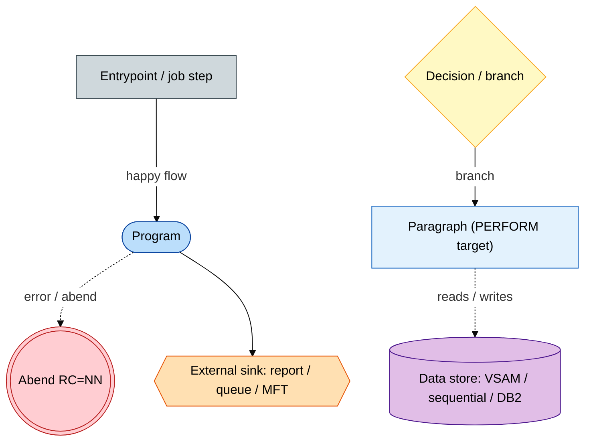

---

## 3. System context

All three anchors are **batch** JCL jobs; there is no online (CICS) or event (MQ) entrypoint in BP-005. External-interface classes present vs absent:

- **Inbound:** none modelled as a BP-005 trigger (jobs are scheduler/operator-submitted). The DW source `WF1I_INVC_SLS_DTL` is reached over a DB2 **remote-location connect** (`PDWHROW`), not a messaging interface.
- **Outbound:** managed file transfer to **Cognos** report servers (`FT:` — FTP from MCBSM50J, MFT/FTE from MCDLS50J); a **print report** (`RPT:` RPQD0) from XXDM713. No REST/SOAP API, no webhook, no email.
- **Cross-BP coupling:** XXDM713's `DM7121` output and `BDDTS3` → `INVC_TS_BD2T` update flow into the BP-002/deal-tracking lifecycle; `DEALDM1X` and `DIVMSTRDI1D` are enterprise stores shared far beyond BP-005 (§6).

<!-- mmd:BP-005-context-call-graph -->
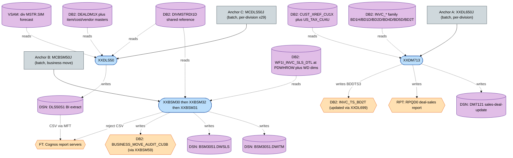

---

## 4. Anchor A — `XXDL650J` / `XXDM713` (invoice plane)

`XXDM713` (program header *"DM710NP Deal Sales Transactions Build — Grocery Billing"*) is step `XXDM713P` of the per-division job `XXDL650J` (`SET DI2='%%DIV'`). The job is a broader **deal-tracking table update**; the sibling steps (`XXDL655P`, `SORT1`, `XXDL652P`, `SORTBD2T`, `XXDL699P`, `IEFBR12`) belong to adjacent deal-tracking flows and are shown as context only. Every step after the first carries `COND=(4,LT)` (skip on prior RC ≥ 4).

`XXDM713` is **DB2-in / file-out**: it reads the invoice `BD*` family via one rowset cursor (gated by A/R control dates and a reprocess guard) and emits the `DM7121` sales-deal-update file, a `BDDTS3` invoice-timestamp extract, and an `RPQD0` report. Its program header explicitly states *"FILES INPUT … NONE"* — there is no flat-file input.

<!-- mmd:BP-005-XXDL650J-entry-call-graph -->
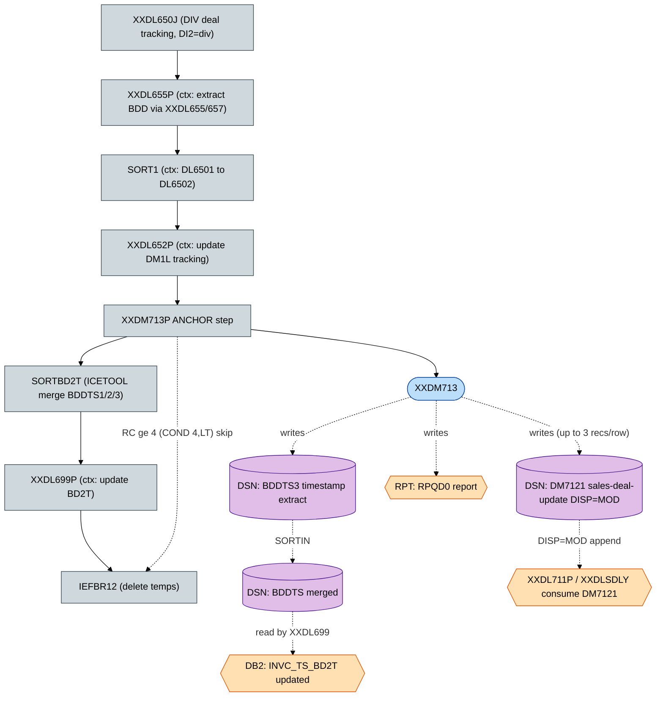

### 4.1 `XXDM713` resource wiring

| Interface (COBOL) | DD | Dataset | Access | Record copybook |
|---|---|---|---|---|
| `OL-FILE` (`SELECT … ASSIGN DMDLU`) | `DMDLU` | `&DI2..PERM.&DI2.DM7121` (DISP=MOD) | OUTPUT seq, append | `OL-REC` = COPY `XXDM4XC` (LRECL 65) |
| `QE-FILE` (`ASSIGN RPQD0`) | `RPQD0` | SYSOUT=(Z,,STD) DEST=ACME&DIV | OUTPUT print | `QE-REC PIC X(133)` |
| `BDDTS` (`ASSIGN TO BDDTS`) | `BDDTS` | `&DI2..TEMP.BDDTS3` (NEW) | OUTPUT seq FB | `BDDTS-REC` (INVC-NUM X(10)+FILLER) |
| DB2 batch attach | `SQLBATCH` | `DS.PERM.SQLBATCH(SQLINFO)` | DB2 plan | — |
| Load libs | `STEPLIB` | `DS.EMER.LINK` / `DS.PERM.LINK` | input | — |

Run parameter: `PARM=&DI2` → linkage `PARM-DIV X(2)` → `DI1D-ACME-DIV`.

### 4.2 `XXDM713` DB2 access by paragraph

| Paragraph | Table(s) | Operation | Cursor / filters |
|---|---|---|---|
| `5000-SET-DB2-PACKAGE` | (PACKAGESET) | `SET CURRENT PACKAGESET` | div + `'BATCH'` |
| `5025-GET-DIV-INFO` | `ACME.DIVMSTRDI1D` | SELECT singleton | by `MCLANE_DIV` → USER_DIV_NAME, DIV_PART |
| `5050-GET-CURR-TIMSTMP` | `SYSIBM.SYSDUMMY1` | SELECT singleton | CURRENT TIMESTAMP |
| `5100-SELECT-CF1D` | `DATECNTLCF1D` | SELECT singleton | `KDTCF0='ARDATES'` → DARPDH, FAR020 |
| `5200/5300/5400` (`BDD_CUR`) | `BD1H`+`BD1D`+`BD2D`+`BD4D`+`BD5D`+`CU1X`+`CU4U` (anti-join `BD2T`) | OPEN / FETCH NEXT ROWSET 100 / CLOSE | see below |
| `2109-BDD-REC-KEY-10` | `ACME.INVC_TS_BD2T` | SELECT singleton | `TS_TYP='DL6'` reprocess guard; +100 → WRITE BDDTS |

**`BDD_CUR` (the program's main read):** `ACME.INVC_HDR_BD1H` (driver) INNER JOIN detail tables `INVC_DTL_COMN_BD1D` / `INVC_DTL_ITEM_BD2D` / `INVC_DTL_ORDR_BD4D` / `INVC_DTL_DLPR_BD5D` (on DIV_PART+INVC_NUM+LINE_NUM) INNER JOIN `CUST_XREF_CU1X` (CUST_ID, DIV_ID, `DELT_SW='N'`) INNER JOIN `US_TAX_CU4U`. **WHERE** `BD1H.DIV_PART=:div AND BD1H.TEST_SW='N' AND (BD1H.STAT='BDD' OR (BD1H.STAT='PST' AND NOT EXISTS (SELECT '1' FROM INVC_TS_BD2T WHERE same invc AND TS_TYP='BDH'))) AND BD1H.INVC_DT=:DARPDH`. **ORDER BY** INVC_NUM.

### 4.3 `XXDM713` program flow

<!-- mmd:BP-005-XXDM713-call-graph -->
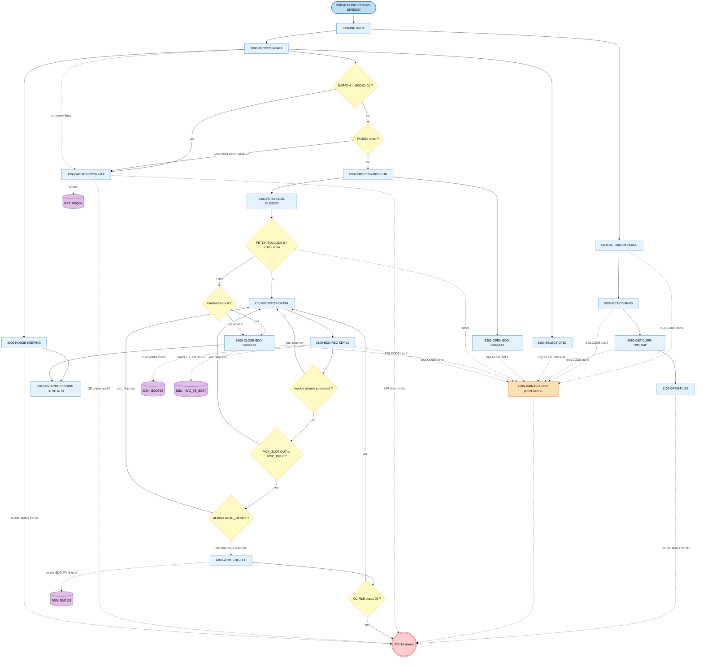

### 4.4 `XXDM713` invoice → sales-deal-update resolution chain

<!-- mmd:BP-005-XXDM713-invoice-resolution-call-graph -->
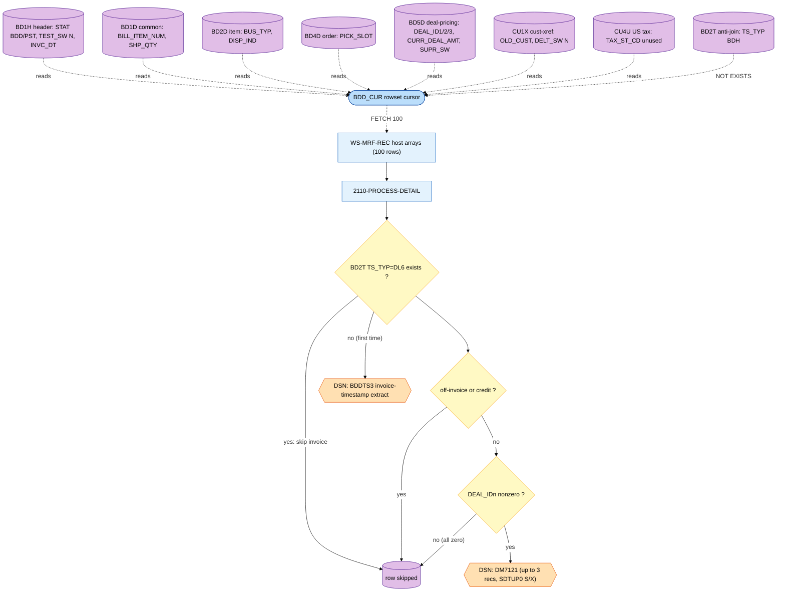

### 4.5 Realized rules & notes (Anchor A)

- **BR-005-02** — invoice-derived sales applied per deal: realized by `BDD_CUR` joining the invoice `BD*` family with `CU1X`/`DI1D` and writing one `DM7121` record per non-zero `DEAL_IDn` (the spec's stated read set is correct but **incomplete** — see §8).
- **BR-005-04** — sales-window timing: `BD1H.INVC_DT` must equal `DATECNTLCF1D.DARPDH` (A/R date); `BD2T` timestamps gate reprocessing. (Operational "which invoices apply to which period" → the A/R control date, no longer `[SME]`-open for the mechanics.)
- **BR-005-06** — idempotency: realized by the `BD2T TS_TYP='DL6'` reprocess guard (skip already-processed invoices; emit `BDDTS3` only first time → `XXDL699` stamps `BD2T`).
- **BR-005-05** — tax inclusion: `CU4U.TAX_ST_CD` is **fetched but never used** → tax is **not** applied to per-deal totals here `[CODMOD]`/`[SME]`.
- **Suppression** — per-deal `SDTUP0='X'` when `DEAL_ID_SUPR_SWn='Y'` (BD5D), else `'S'` (PIR4502). This is XXDM713's own column-level suppression — **not** the external `XXDLS01` module.

---

## 5-context note

(The data-dictionary section is numbered **§5** in the taxonomy and appears after the per-anchor sections; the per-anchor coverage for Anchors B and C continues immediately below as part of §4 "one section per anchor entrypoint".)

## 4B. Anchor B — `MCBSM50J` (DWSLS producer, inside a business-move job)

`MCBSM50J` header: *"EXTRACT BUSINESS MOVE ITEMS AND VENDORS"*. It moves customers/items to a new division; the **DWSLS** dataset is produced as part of that pipeline. **Real step order:** `UNARC → XXBSM50P → DELCUST → SORTCUST → XXBSM30P → XXBSM32P → DELSUM → SORTSUM → DELITM1 → SORTITM → XXBSM31P → XXBSM59P → … → XXBSM58P → CHKBSM58 → IF COPY0 → FTP03`. The DWSLS chain is **XXBSM30 → XXBSM32 → SORTSUM → XXBSM31** (this **refutes** the spec's BR-005-11 ordering of 30→31→32; see §8). Context programs: `XXBSM50` (builds PARM/ITEM/CUST), `XXBSM58` (reject report), `XXBSM59` (CU3B insert).

<!-- mmd:BP-005-MCBSM50J-entry-call-graph -->
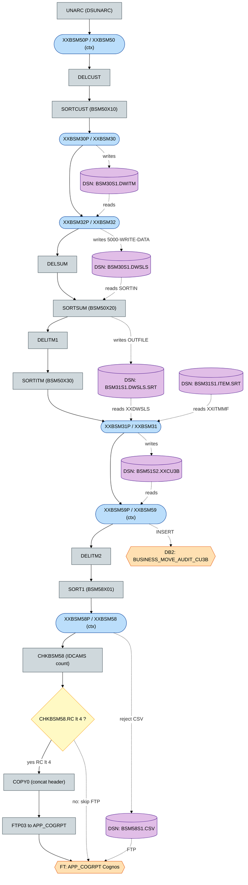

### 4B.1 Resource wiring (DWSLS-chain programs)

| Program | SELECT / FD | DD | Dataset | Mode | Copybook |
|---|---|---|---|---|---|
| **XXBSM30** | PRM-FILE | XXPRMMF | `ACME.PERM.BSM50S1.PARM` | INPUT | `BSM50PRM` |
| | CUS-FILE | XXCUSMF | `ACME.PERM.BSM50S1.CUST.SORT` | INPUT | `BSM50CUS` |
| | OUT-FILE | XXOUTMF | `ACME.PERM.BSM30S1.DWITM` | OUTPUT | `BSM30DWI` |
| **XXBSM32** | PRM-FILE | XXPRMMF | `ACME.PERM.BSM50S1.PARM` | INPUT | `BSM50PRM` |
| | DWI-FILE | DWISRT | `ACME.PERM.BSM30S1.DWITM` | INPUT | `BSM30DWI` |
| | OUT-FILE | XXOUTMF | **`ACME.PERM.BSM30S1.DWSLS`** | OUTPUT | **`BSM30DWS`** |
| **XXBSM31** | PRM-FILE | XXPRMMF | `ACME.PERM.BSM50S1.PARM` | INPUT | `BSM50PRM` |
| | ITM-FILE | XXITMMF | `ACME.PERM.BSM31S1.ITEM.SRT` | INPUT | `BSM50ITM` |
| | DWSLS-FILE | XXDWSLS | `ACME.PERM.BSM31S1.DWSLS.SRT` | INPUT | `BSM30DWS` |
| | OUT/ITEM/FCST/VNDR/CU3B | XXOUTMF/XXITMOUT/XXFCSOUT/XXVNDOUT/XXCU3B | `ACME.PERM.BSM51S1` / `BSM51S2.ITEM` / `.FCST` / `.VNDR` / `.XXCU3B` | OUTPUT | `BSM50ITM`/`BSM51ITM`/`BSM51FST`/`BSM51VND`/inline FD |

DB2 attach (XXBSM30/32): `SQLBATCH=DS.PERM.SQLBATCH(SQLINFO)`; both `CONNECT TO PDWHROW` (PARM='PDWHROW'). XXBSM31 has **no EXEC SQL** (only `CALL 'DATETIME'`). Sort control members `DS.PERM.SORTPARM(BSM50X10/X20/X30)` and FTP control `DS.PERM.FTP(MCBSM50C)` are **not in the export** `[GAP]`.

### 4B.2 DB2 access by paragraph (XXBSM30 / XXBSM32)

| Program.paragraph | Table(s) | Operation | Filters / notes |
|---|---|---|---|
| `XXBSM30.1210-SELECTION-DATES` | `ACME.WD2D_DT_TBL` | SELECT MIN(DT), CURRENT DATE | per-category date cutoffs |
| `XXBSM30.1250-DECLARE-TEMP-TBL1` | `SESSION.CUST_TMP1` (GTT) | DECLARE + CREATE INDEX | moved-customer list |
| `XXBSM30.1400 / 1405` | `SESSION.CUST_TMP1` | INSERT (−803 dup ignored) / DELETE all | per CLS-ID break |
| `XXBSM30.WHSE_CURSOR` (1801/1802/1803) | `WF1I_INVC_SLS_DTL` JOIN `WD2D_DT_TBL` JOIN `WD1D_DIV` (+ `WD1C_CUST`, `WD1I_ITEM`, `SESSION.CUST_TMP1`) | OPEN/FETCH/CLOSE | `WF1I.PB_CD_SW='N'`; `SALES = SUM(SHP_QTY*INVC_PRICE)` |
| `XXBSM32.3000-SELECTION-DATES` | `ACME.WD2D_DT_TBL` | SELECT 9 cutoff dates | drives period buckets |

`XXBSM32` has **no cursor and does not read WF1I** — all DWSLS content derives from the `DWITM` file plus the WD2D date cutoffs (the DWSLS record carries **no date field**; XXBSM32 collapses DWITM dates into period buckets, which is why it must run before the sum-sort).

### 4B.3 Program flows (Anchor B)

<!-- mmd:BP-005-XXBSM30-call-graph -->
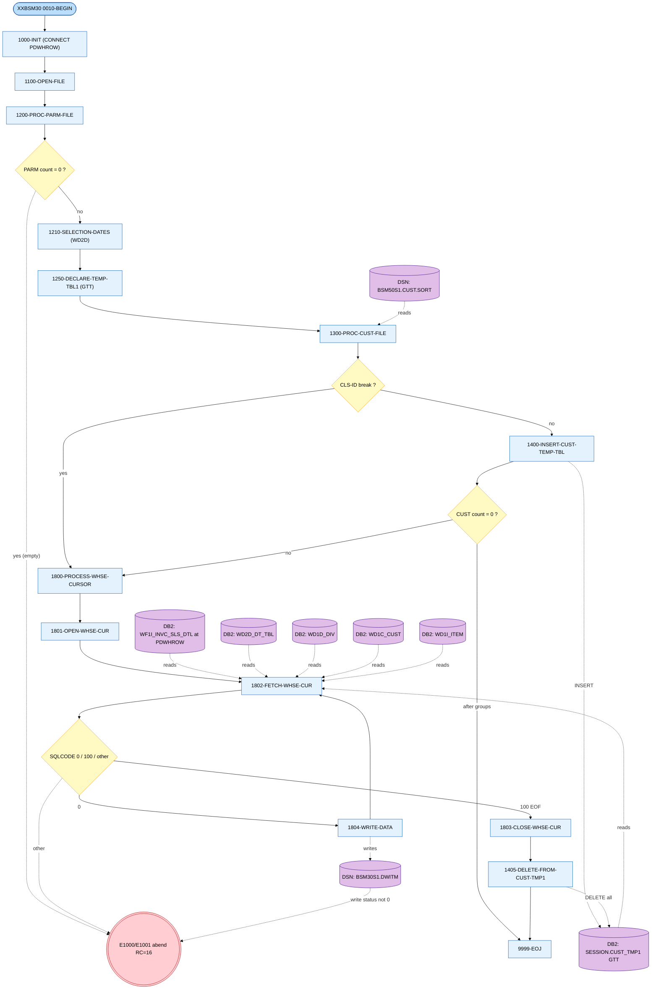

<!-- mmd:BP-005-XXBSM32-call-graph -->
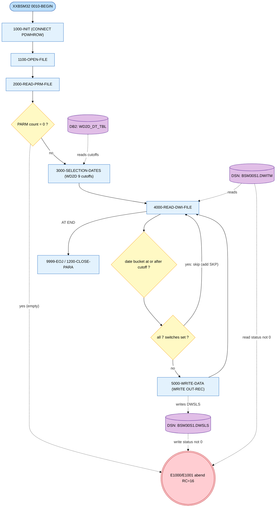

<!-- mmd:BP-005-XXBSM31-call-graph -->
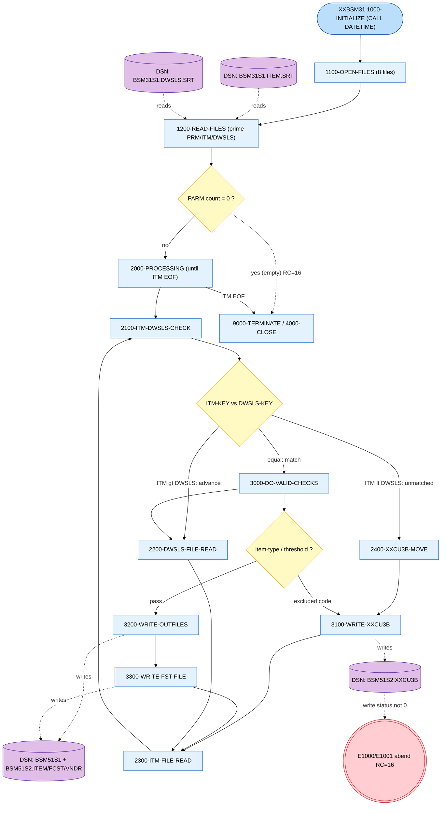

### 4B.4 DWITM → DWSLS → DWSLS.SRT resolution chain

<!-- mmd:BP-005-XXBSM32-dwsls-resolution-call-graph -->
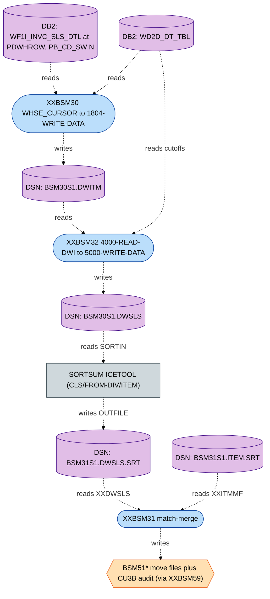

### 4B.5 Realized rules & notes (Anchor B)

- **BR-005-01** — sales aggregated into DWSLS: realized via `XXBSM30` (WF1I → DWITM, sum of `SHP_QTY*INVC_PRICE`, restricted to moving customers via the GTT) then `XXBSM32` (DWITM → DWSLS period buckets).
- **BR-005-11** — DWSLS write: realized in **`XXBSM32.5000-WRITE-DATA`** (paragraph name confirmed). The spec's *ordering* and *program attribution* are wrong (§8).
- In-job DWSLS consumer: **`SORTSUM` → `BSM31S1.DWSLS.SRT` → `XXBSM31`** (business-move matching). No cross-job DWSLS consumer exists (§6).
- `[CODMOD]` XXBSM31 diagnostics mislabel the DWSLS read error as `'ITM-FILE'` (copy-paste); an unreachable `STOP RUN` follows a `GO TO 9000-TERMINATE` on the empty-PARM path.

## 4C. Anchor C — `MCDLS50J` / `XXDLS50` (deal-profitability BI extract)

`MCDLS50J` runs `XXDLS50P` once per division (**29 divisions**, not the spec's "~35"): `DELETE1 → 29× XXDLS50P → SORTX → XXCNT1 → IF (RC=0) ADDHDR → MFTTRAN1`. `XXDLS50` produces a per-division BI extract of **profitable deals**; the divisional files are concatenated, header-stamped, and FTE'd to Cognos.

**`XXDLS50` does not read DWSLS.** Its "profitable deals" are driven entirely by the `DEAL-CUR` cursor over `DEALDM1X` (12-table join), with profitability = `DM1X.DEAL_UNIT_AMT > DE8E.COST_AMT * :AP1S-DEC-VAL`, plus future-date, active-status, and deal-type-exclusion qualifiers. This **refutes** spec BR-005-09 / §5.2 (§8).

<!-- mmd:BP-005-MCDLS50J-entry-call-graph -->
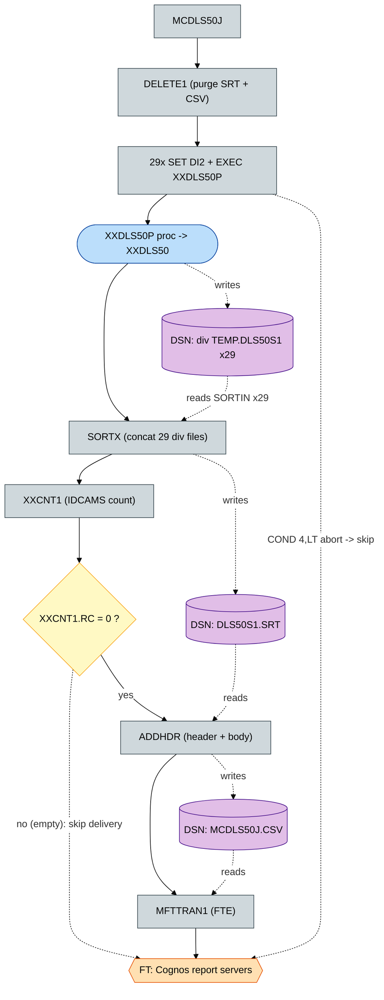

### 4C.1 `XXDLS50` resource wiring

| Interface | DD | Dataset | Access | Copybook |
|---|---|---|---|---|
| `READER` | READER | `DS.PERM.RDRPARM(XXDLS501)` | seq input | deal-type exclusion card — **member not in export** `[GAP]` |
| `SIM-FILE` | XXSIMMF | `&DI2..MSTR.SIM` | INDEXED, RANDOM | COPY `DCSFITM` (ITBY-BASE-FORECAST) |
| `OUT-FILE` | OUTFILE | `&DI2..TEMP.DLS50S1` | seq output | COPY `DLS50S1C` (LRECL 310 CSV, 32 fields) |
| DB2 attach | SQLBATCH | `DS.PERM.SQLBATCH(SQLINFO)` | DB2 plan | — |
| Load libs | STEPLIB | `DS.EMER.LINK` / `DS.PERM.LINK` | input | resolves `DBDB2ER` |

### 4C.2 `XXDLS50` DB2 access by paragraph

| Paragraph | Table(s) | Operation | Filters |
|---|---|---|---|
| `5100-GET-AP1S` | `DS.APPL_SYS_PARM_AP1S` | SELECT singleton | `APPL_ID='CAD'`, `PARM_ID='XXDLS50_EXCLUDE_TYP'` → `:AP1S-DEC-VAL` |
| `5200/5300/5400` (`DEAL_CUR`) | `DEALDM1X` + `DIVMSTRDI1D` + `UIN_ITEM_DE6C` + `DIV_ITEM_PACK_DE1I` + `ITEM_UPC_DE6Y` + `ITM_COST_DE8E` (×2 self-join MAX BILL_EFF_TS) + `VNDR_MSTR_VN1A` + `BUYR_MSTR_VN4B` + `DIV_VNDR_XREF_VN1Y` + `ITEM_VNDR_DE6V` + `CRP_VNDR_XREF_VN1X` + `ITEM_OH_DE1O` (OHND subselect) | OPEN / FETCH ROWSET 100 / CLOSE | future dates, `DEAL_UNIT_AMT>0`, `CDLST0<>'T'`, deal-type exclusions, profitability test |

### 4C.3 `XXDLS50` program flow

<!-- mmd:BP-005-XXDLS50-call-graph -->
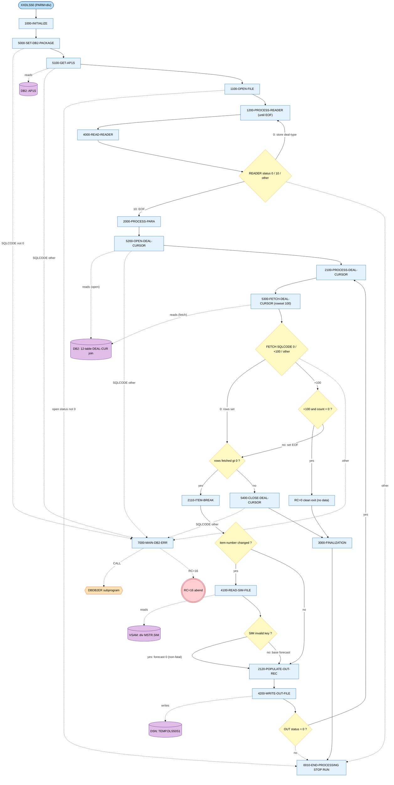

### 4C.4 Deal-profitability resolution chain

<!-- mmd:BP-005-XXDLS50-profitability-resolution-call-graph -->
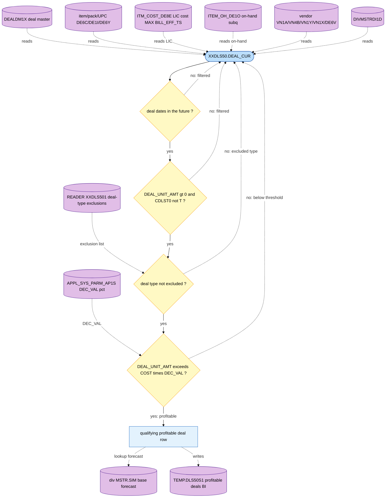

### 4C.5 Orphan module `XXDLS01` (Deal Suppression Module)

`XXDLS01` (PROGRAM-ID `XXDLS01`, *"Deal Suppression Module"*, NESSTECH 2009, PIR 7756) returns a deal-suppress switch for a (division, customer, item, deal-type, FOP, invoice-date) tuple, reading the profile tables `PROF_HDR_PR1P` / `PROF_CUS_PR3Q` / `PROF_ITM_PR5Q` / `PROF_ITM_GRP_PR3P` (+ `CUST_XREF_CU1X`, `DIVMSTRDI1D`) under PACKAGESET `MCSUBS`, via linkage copybook `DLS01LNK`. **It has no caller anywhere in `docs/legacy/src`** — `DLS01LNK` is copied only by `XXDLS01` itself. It therefore does **not** participate in BP-005's live flow; the spec's BR-005-03 / TC-005-03 ("XXDM713 skips deals suppressed by XXDLS01") is **not realized in source** (§8).

<!-- mmd:BP-005-XXDLS01-call-graph -->
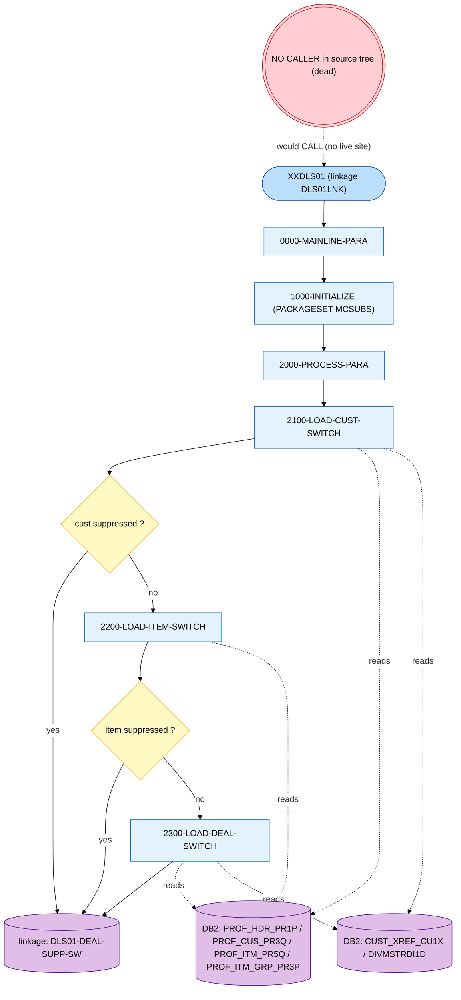

---

## 5. Data dictionary & external-interface inventory

### 5.1 DB2 tables

| Table | DCLGEN | Access | Used by |
|---|---|---|---|
| `ACME.INVC_HDR_BD1H` | DGBD1H | read (cursor driver) | XXDM713 |
| `ACME.INVC_DTL_COMN_BD1D` | DGBD1D | read | XXDM713 |
| `ACME.INVC_DTL_ITEM_BD2D` | DGBD2D | read | XXDM713 |
| `ACME.INVC_DTL_ORDR_BD4D` | *(none)* | read | XXDM713 |
| `ACME.INVC_DTL_DLPR_BD5D` | *(none)* | read | XXDM713 |
| `ACME.INVC_TS_BD2T` | DGBD2T | read (anti-join + guard) | XXDM713 |
| `ACME.CUST_XREF_CU1X` | DGCU1X | read | XXDM713, XXDLS01 |
| `ACME.US_TAX_CU4U` | DGCU4U | read (unused col) | XXDM713 |
| `ACME.DIVMSTRDI1D` | DGDI1D | read | XXDM713, XXDLS50, XXDLS01 |
| `DATECNTLCF1D` | DGCF1D | read (run gate) | XXDM713 |
| `PDWHROW.ACME.WF1I_INVC_SLS_DTL` | DGWF1IU | read (DW) | XXBSM30 |
| `PDWH01.ACME.WD1C_CUST` | DGWD1CU | read (DW dim) | XXBSM30 |
| `PDWH01.ACME.WD1I_ITEM` | DGWD1IU | read (DW dim) | XXBSM30 |
| `ACME.WD2D_DT_TBL` | *(inline)* | read (DW date dim) | XXBSM30, XXBSM32 |
| `ACME.WD1D_DIV` | *(inline)* | read (DW div dim) | XXBSM30 |
| `SESSION.CUST_TMP1` | *(GTT)* | insert/delete/read | XXBSM30 |
| `DEALDM1X` | DGDM1X | read (cursor anchor) | XXDLS50 |
| `ACME.ITM_COST_DE8E` | DGDE8E | read | XXDLS50 |
| `ACME.ITEM_OH_DE1O` | DGDE1O | read | XXDLS50 |
| `ACME.UIN_ITEM_DE6C` | DGDE6C | read | XXDLS50 |
| `ACME.DIV_ITEM_PACK_DE1I` | DGDE1I | read | XXDLS50 |
| `ACME.ITEM_UPC_DE6Y` | DGDE6Y | read | XXDLS50 |
| `ACME.ITEM_VNDR_DE6V` | DGDE6V | read | XXDLS50 |
| `ACME.VNDR_MSTR_VN1A` | DGVN1A | read | XXDLS50 |
| `ACME.BUYR_MSTR_VN4B` | DGVN4B | read | XXDLS50 |
| `ACME.DIV_VNDR_XREF_VN1Y` | DGVN1Y | read | XXDLS50 |
| `ACME.CRP_VNDR_XREF_VN1X` | DGVN1X | read | XXDLS50 |
| `DS.APPL_SYS_PARM_AP1S` | DGAP1S | read (parm) | XXDLS50 |
| `ACME.BUSINESS_MOVE_AUDIT_CU3B` | DGCU3B | insert | XXBSM59 (ctx) |
| `ACME.PROF_HDR_PR1P` / `PROF_CUS_PR3Q` / `PROF_ITM_PR5Q` / `PROF_ITM_GRP_PR3P` | *(none in export)* | read | XXDLS01 (dead) |

### 5.2 Sequential / VSAM datasets

| Dataset | Role | Producer → Consumer |
|---|---|---|
| `&DI2..PERM.&DI2.DM7121` | sales-deal-update (OL-REC, LRECL 65) | XXDM713 (MOD) → XXDL711P / XXDLSDLY (ctx) |
| `&DI2..TEMP.BDDTS3` | invoice-timestamp extract | XXDM713 → SORTBD2T → XXDL699 → `INVC_TS_BD2T` |
| `ACME.PERM.BSM50S1.PARM` | run parm | XXBSM50 → XXBSM30/32/31 |
| `ACME.PERM.BSM50S1.CUST.SORT` | moved-customer list | SORTCUST → XXBSM30 |
| `ACME.PERM.BSM30S1.DWITM` | DW item records | XXBSM30 → XXBSM32 |
| `ACME.PERM.BSM30S1.DWSLS` | **consolidated DW sales** | XXBSM32 → SORTSUM (only) |
| `ACME.PERM.BSM31S1.DWSLS.SRT` | sorted DWSLS | SORTSUM → XXBSM31 |
| `ACME.PERM.BSM31S1.ITEM.SRT` | sorted items | SORTITM → XXBSM31 |
| `ACME.PERM.BSM51S1` / `BSM51S2.ITEM/FCST/VNDR/XXCU3B` | business-move outputs | XXBSM31 → (CU3B → XXBSM59) |
| `ACME.PERM.BSM58S1(.CSV)` | reject report | XXBSM58 / COPY0 → FTP Cognos |
| `&DI2..MSTR.SIM` | divisional SIM forecast (VSAM KSDS) | read by XXDLS50 |
| `&DI2..TEMP.DLS50S1` | per-division BI extract (CSV, LRECL 310) | XXDLS50 → SORTX |
| `DS.PERM.DLS50S1.SRT` / `DS.PERM.MCDLS50J.CSV` | consolidated BI / final CSV | SORTX / ADDHDR → MFTTRAN1 Cognos |

### 5.3 External-interface inventory

| Endpoint id | Class | Direction | Mechanism |
|---|---|---|---|
| `RPT:RPQD0` | print/report | outbound | SYSOUT report (XXDM713 deal-system messages) |
| `FT:APP_COGRPT` | managed file transfer | outbound | FTP of `BSM58S1.CSV` (MCBSM50J, ctrl `DS.PERM.FTP(MCBSM50C)`) |
| `FT:COGNOS` | managed file transfer | outbound | MFT/FTE of `MCDLS50J.CSV` (MCDLS50J, ctrl `DS.PERM.FTE(MCDLS501)`) |
| `DB2:INVC_TS_BD2T` (writeback) | DB2 update | downstream | XXDL699 stamps timestamps from XXDM713's BDDTS3 |
| `DB2:BUSINESS_MOVE_AUDIT_CU3B` | DB2 insert | outbound | XXBSM59 from XXBSM31's CU3B file |

Absent classes: no inbound MQ/event, no CICS/online, no REST/SOAP API, no webhook, no email.

### 5.4 Control / parameter members

`DS.PERM.SQLBATCH(SQLINFO)` (DB2 batch attach) · `DS.PERM.SORTPARM(BSM50X10/X20/X30, BSM58X01, DLS50SRT)` · `DS.PERM.RDRPARM(XXDLS501)` · `ACME.PERM.BSM50S1.PARM` · `DS.PERM.FTP(MCBSM50C)` · `DS.PERM.FTE(MCDLS501)` · `DS.PERM.DLS50S1.HEADER` / `BSM58S1.HEADER`. The `SORTPARM`, `RDRPARM`, `FTP`, `FTE`, `HEADER`, and `SQLBATCH` PDS members are **not present in this export** `[GAP]` (referenced by JCL only).

---

## 6. Reverse blast-radius maps

Counts from `rg -l '<literal>' docs/legacy/src | wc -l` (whole tree) and `… docs/legacy/src/sclm.perm.prod.source | wc -l` (programs only), ripgrep 15.1.

| Store | command literal | count (all) | count (programs) | includes definition? | notes |
|---|---|---|---|---|---|
| `ACME.PERM.BSM30S1.DWSLS` | `ACME\.PERM\.BSM30S1\.DWSLS` | 2 | 0 | n/a (DSN) | only `XXBSM32P.jcl` + `MCBSM50J.jcl`; **no program reads it** |
| `ACME.PERM.BSM30S1.DWITM` | `ACME\.PERM\.BSM30S1\.DWITM` | 2 | 0 | n/a | `XXBSM30P.jcl` + `XXBSM32P.jcl` (point-to-point) |
| `ACME.PERM.BSM31S1.DWSLS.SRT` | `…DWSLS\.SRT` | 2 | 0 | n/a | `XXBSM31P.jcl` + `MCBSM50J.jcl` |
| `DWSLS` (substring, programs) | `DWSLS` | 4 | 1 | n/a | the single program hit is `XXBSM31.cbl` (its internal `DWSLS-FILE`/copybook tokens, reading the `.SRT`) |
| `ACME.WF1I_INVC_SLS_DTL` | `WF1I_INVC_SLS_DTL` | 3 | 2 | yes (DGWF1IU) | programs: `XXBSM30`, `XXRPR72` |
| `ACME.INVC_HDR_BD1H` | `INVC_HDR_BD1H` | 6 | 5 | yes (DGBD1H) | `XXDL655`, `XXDL657`, `XXDM713`, `XXRPR74`, `XXRPR75` |
| `ACME.INVC_TS_BD2T` | `INVC_TS_BD2T` | 5 | 4 | yes (DGBD2T) | `XXDL655`, `XXDL657`, `XXDL699`, `XXDM713` |
| `DEALDM1X` | `DEALDM1X` | 42 | 41 | yes (DGDM1X) | enterprise deal master; read **and update** (e.g. XXDEAL2) |
| `ACME.DIVMSTRDI1D` | `DIVMSTRDI1D` | 141 | 138 | yes (DGDI1D, +2 copyprocs) | enterprise division reference |
| `DATECNTLCF1D` | `DATECNTLCF1D` | 4 | 3 | yes (DGCF1D) | `XXDL655`, `XXDL657`, `XXDM713` |

**DWSLS reader verdict:** `ACME.PERM.BSM30S1.DWSLS` is read by **no COBOL program** — its only consumer is the JCL `SORTSUM` ICETOOL step in `MCBSM50J`; its only producer is `XXBSM32`. `XXDLS50.cbl` references none of DWSLS/DWITM/BSM30/BSM31. Union of distinct programs touching the six BP-005 DB2 tables: **145** (dominated by the shared `DIVMSTRDI1D`/`DEALDM1X`, not the XXBSM3x family).

<!-- mmd:BP-005-blast-radius-call-graph -->
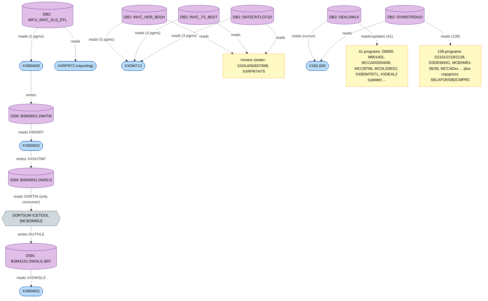

**Modernization implications:** DWSLS / DWITM / DWSLS.SRT are point-to-point staging with a *single* producer and a *single* (utility) consumer each — replacing the dataset + sort with a sorted table/materialized view eliminates them with **zero COBOL readers** to refactor (the JCL SORT step must be modelled as a first-class node). `WF1I_INVC_SLS_DTL` has narrow fan-in (XXBSM30 + one report) — a contained migration. The invoice cluster (`BD1H`/`BD2T`/`CF1D`) should migrate as a unit to preserve joins. `DEALDM1X` (mutable, 41 programs) and `DIVMSTRDI1D` (138 programs) are enterprise stores demanding a strangler-fig/reference-data service well beyond BP-005.

---

## 7. End-to-end resolution summary

Three independent batch planes, joined only by shared reference data and the deal lifecycle — **not** by the DWSLS dataset (the spec's assumed invoice→DWSLS→XXDLS50 spine does not exist in source).

<!-- mmd:BP-005-e2e-call-graph -->
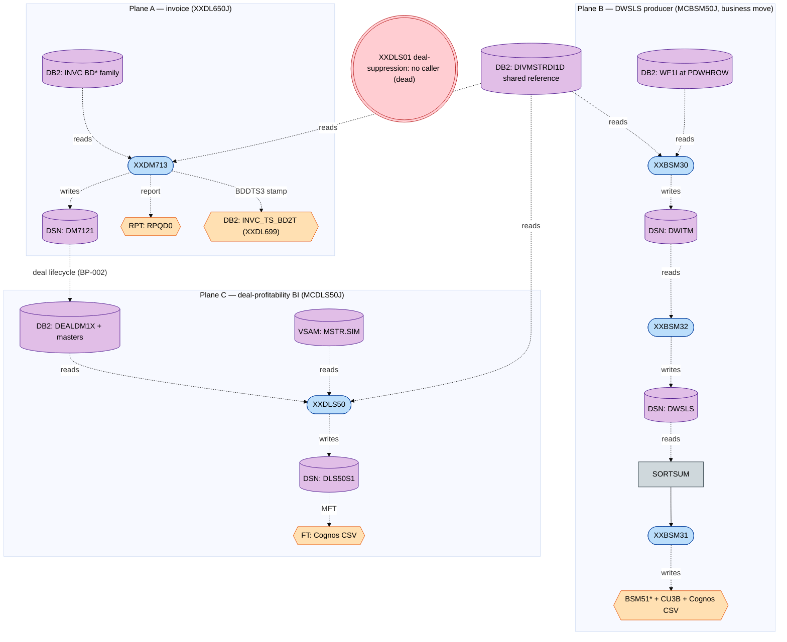

**Universal fail / propagation conventions:** every COBOL OPEN/READ/WRITE/CLOSE status `≠ '00'` and every unexpected `SQLCODE` routes to an abend paragraph (`0010-END-PROCESSING` / `E1000`/`E1001` / `7000-MAIN-DB2-ERR`) setting **RC=16**; JCL `COND=(4,LT)` then flushes downstream steps, so a single program abend stops its plane. Empty-input is handled gracefully (XXDM713 "NO RECORDS", XXDLS50 "NO DATA TO PROCESS" RC=0; MCDLS50J `XXCNT1` gate skips the Cognos delivery when the sorted file is empty).

---

## 8. Assumptions, gaps & open questions

### 8.1 Resolved (with the source that resolved each)

- **BR-005-09 / §5.2 — `XXDLS50` is NOT a DWSLS consumer.** `MCDLS50J` has no `SORTSUM` step and `XXDLS50` references no DWSLS/BSM30/BSM31 token (whole-program grep clean). The "profitable deals" are produced from `DEALDM1X` via `DEAL-CUR` with profitability `DEAL_UNIT_AMT > COST_AMT * AP1S-DEC-VAL` (XXDLS50.cbl) — the spec conflated MCBSM50J's `SORTSUM` (which *does* read DWSLS) with MCDLS50J. **Spec should be corrected.**
- **BR-005-11 — DWSLS producer order/attribution corrected.** Real order is `XXBSM30 → XXBSM32 → SORTSUM → XXBSM31` (not 30→31→32). The DWSLS writer is **`XXBSM32.5000-WRITE-DATA`** (paragraph name correct; the spec wrongly attributed the write to XXBSM31). `XXBSM31` consumes the *sorted* DWSLS (`DWSLS.SRT`) for business-move matching (`MCBSM50J.jcl`, `XXBSM3x.cbl`).
- **BR-005-02 — XXDM713 join set widened.** Source `BDD_CUR` joins **seven** tables: the spec's `BD1D`/`BD2D`/`CU1X`/`CU4U` are all real, but the spec **omits** `INVC_HDR_BD1H` (driver), `INVC_DTL_ORDR_BD4D`, `INVC_DTL_DLPR_BD5D` (which supplies the actual `DEAL_IDn`/`CURR_DEAL_AMT`), and the `INVC_TS_BD2T` anti-join (`XXDM713.cbl`).
- **BR-005-07 / Open-Q "enumerate every DWSLS reader/writer" — answered.** Producer: `XXBSM32` (writes) preceded by `XXBSM30` (DWITM). Reader: **none in COBOL**; sole consumer is the `SORTSUM` JCL step → `XXBSM31` (via `.SRT`). Blast radius computed in §6.
- **BR-005-06 — idempotency mechanism identified.** XXDM713's `INVC_TS_BD2T` `TS_TYP='DL6'` reprocess guard + `BDDTS3`→`XXDL699` timestamp writeback (PIR9222) prevent double-application on the invoice plane.
- **MCBSM50J is a business-move job**, not a pure sales-consolidation producer — DWSLS is a by-product of moving customers/items to a new division (`MCBSM50J.jcl` header + XXBSM50/31/58/59 roles).
- **Division count = 29** for MCDLS50J (`SET DI2`/`EXEC` count), not the spec's "~35".
- **Anchor types** — all three anchors are `batch` JCL jobs; none online/event (resolved via §0 type table).

### 8.2 Still open (tagged)

- `[SME]` **BR-005-05 tax** — `CU4U.TAX_ST_CD` is fetched but unused in XXDM713; confirm tax is intentionally excluded from per-deal totals (and whether CU4U should be dropped — `[CODMOD]`).
- `[SME]` **Period semantics** — XXBSM32's 7/9 DW date-bucket cutoffs (GMP/CIG/OTP/GRO/LOGO/FCST) and XXBSM31's exclusion codes (NOS/INA/LOG/DAM/IAE …) carry no in-source business definition; thresholds come from the (absent) `BSM50S1.PARM`.
- `[SME]` **BR-005-03 deal suppression** — `XXDLS01` (Deal Suppression Module) is **dead code** in this export (no caller). Confirm whether suppression is enforced elsewhere (CICS/another BP) or was superseded by XXDM713's own per-deal `SDTUP0='X'` flagging.
- `[GAP]` **Missing control members** — `RDRPARM(XXDLS501)` (deal-type exclusion values), `SORTPARM(BSM50X10/X20/X30, BSM58X01, DLS50SRT)`, `FTP(MCBSM50C)`, `FTE(MCDLS501)`, `*.HEADER`, `SQLBATCH(SQLINFO)`, `BSM50S1.PARM` are referenced by JCL but not in the source export; their contents can't be verified here.
- `[GAP]` **Missing DCLGENs** — `BD4D`/`BD5D` (XXDM713) and `WD2D`/`WD1D` (XXBSM30/32) have no DCLGEN copybook (names taken from the SQL FROM clause / inline `DECLARE`); `PR1P`/`PR3Q`/`PR5Q`/`PR3P` (XXDLS01) DCLGENs absent (immaterial — module is dead).
- `[SME]` **Upstream DW feed** — origin of `WF1I_INVC_SLS_DTL` rows at remote location `PDWHROW` is outside this source tree (data-warehouse load).
- `[CODMOD]` **XXBSM31 defects** — DWSLS read-error diagnostics mislabel the file as `'ITM-FILE'`; unreachable `STOP RUN` after `GO TO 9000-TERMINATE`.
- `[RAG]` **`xxdm713.md` corpus empty** — narrative for XXDM713 remains absent; this call graph now supplies the grounded behavioural contract to replace `[CORPUS-EMPTY-FOR-XXDM713]`.

---

## 9. Source index

| Artifact | Type | Path under `docs/legacy/src/` |
|---|---|---|
| `XXDL650J` | JCL job | `acme.perm.jcl/XXDL650J.jcl` |
| `MCBSM50J` | JCL job | `acme.perm.jcl/MCBSM50J.jcl` |
| `MCDLS50J` | JCL job | `acme.perm.jcl/MCDLS50J.jcl` |
| `XXDM713P` | proc | `ds.perm.proclib/XXDM713P.jcl` |
| `XXBSM30P` / `XXBSM32P` / `XXBSM31P` | procs | `ds.perm.proclib/XXBSM30P.jcl`, `XXBSM32P.jcl`, `XXBSM31P.jcl` |
| `XXDLS50P` | proc | `ds.perm.proclib/XXDLS50P.jcl` |
| `XXDL699P` | proc (ctx, BD2T sink) | `ds.perm.proclib/XXDL699P.jcl` |
| `XXDM713` | COBOL | `sclm.perm.prod.source/XXDM713.cbl` |
| `XXBSM30` / `XXBSM32` / `XXBSM31` | COBOL | `sclm.perm.prod.source/XXBSM30.cbl`, `XXBSM32.cbl`, `XXBSM31.cbl` |
| `XXDLS50` | COBOL | `sclm.perm.prod.source/XXDLS50.cbl` |
| `XXDLS01` | COBOL (orphan) | `sclm.perm.prod.source/XXDLS01.cbl` |
| `XXBSM59` | COBOL (ctx, CU3B) | `sclm.perm.prod.source/XXBSM59.cbl` |
| Record copybooks | copy | `sclm.perm.prod.copy/{XXDM4XC,BSM30DWI,BSM30DWS,BSM50CUS,BSM50ITM,BSM50PRM,BSM51ITM,BSM51FST,BSM51VND,DCSFITM,DLS50S1C,DLS01LNK}.cpy` |
| DCLGEN copybooks | DCLGEN | `DB2P.PERM.DCLGEN/{DGBD1H,DGBD1D,DGBD2D,DGBD2T,DGCU1X,DGCU4U,DGDI1D,DGCF1D,DGWF1IU,DGWD1CU,DGWD1IU,DGDM1X,DGDE8E,DGDE1O,DGDE6C,DGDE1I,DGDE6Y,DGDE6V,DGVN1A,DGVN4B,DGVN1Y,DGVN1X,DGAP1S,DGCU3B}.cpy` |
| Error/diag copyprocs | copyproc | `sclm.perm.prod.copyproc/{DB2ERRP2,DB2GDP1,SELAP1R,DB2CMPRC}.cpy` |

---

### Diagram set (extracted to `diagrams/`, rendered to `.svg`)

| # | File (`.mmd` / `.svg`) | Diagram |
|---|---|---|
| 1 | `BP-005-legend-call-graph` | Legend |
| 2 | `BP-005-context-call-graph` | System context |
| 3 | `BP-005-XXDL650J-entry-call-graph` | Anchor A orchestration |
| 4 | `BP-005-MCBSM50J-entry-call-graph` | Anchor B orchestration |
| 5 | `BP-005-MCDLS50J-entry-call-graph` | Anchor C orchestration |
| 6 | `BP-005-XXDM713-call-graph` | XXDM713 program flow |
| 7 | `BP-005-XXBSM30-call-graph` | XXBSM30 program flow |
| 8 | `BP-005-XXBSM32-call-graph` | XXBSM32 program flow |
| 9 | `BP-005-XXBSM31-call-graph` | XXBSM31 program flow |
| 10 | `BP-005-XXDLS50-call-graph` | XXDLS50 program flow |
| 11 | `BP-005-XXDLS01-call-graph` | XXDLS01 orphan module |
| 12 | `BP-005-XXDM713-invoice-resolution-call-graph` | Invoice → sales-deal-update chain |
| 13 | `BP-005-XXBSM32-dwsls-resolution-call-graph` | DWITM → DWSLS → DWSLS.SRT chain |
| 14 | `BP-005-XXDLS50-profitability-resolution-call-graph` | Deal-profitability chain |
| 15 | `BP-005-blast-radius-call-graph` | Reverse blast radius |
| 16 | `BP-005-e2e-call-graph` | End-to-end summary |
