# BP-005 — Sales Transaction Processing: Business-Process Graph

**Status:** Draft — the structured-BPMN process graph (with FSM projection) for BP-005, re-projected from the companion business-logic rules (`BL-005-MM`). Third artifact of the extraction chain: call graph → business logic → **process graph** → design specs.
**Conforms to:** [`reference/process-graph-meta-model.md`](../../../../../reference/process-graph-meta-model.md) — the authoritative meta-model (element vocabulary §3, purity axioms §4, rule→element taxonomy §5, canonical patterns §6, FSM projection §7, conformance §8). Where this document and the meta-model disagree, the meta-model governs.
**Companion to:**
- [BP-005-sales-transaction-processing-business-logic.md](BP-005-sales-transaction-processing-business-logic.md) — **primary input** (the `BL-005-MM` rules + their closed logic types).
- [BP-005-sales-transaction-processing-call-graph.md](BP-005-sales-transaction-processing-call-graph.md) — data-node / endpoint id confirmation only.
- [../BP-005-sales-transaction-processing.md](../BP-005-sales-transaction-processing.md) — overview spec / companion `BR-005-xx`.

**Scope.** Four sub-graphs, one per business-logic process, covering **all 66 rules** `BL-005-01..16, 30..51, 70..92, 100..104`:

| Sub-graph | Process | Job / program | Rules |
|---|---|---|---|
| **A** | Invoice-driven deal-sales update | `XXDL650J` step `XXDM713P` → `XXDM713` | `BL-005-01..16` (16) |
| **B** | DWSLS sales-consolidation producer | `MCBSM50J` (`XXBSM30 → XXBSM32 → SORTSUM → XXBSM31`) | `BL-005-30..51` (22) |
| **C** | Deal-profitability BI extract | `MCDLS50J` → `XXDLS50` (×29 divisions) | `BL-005-70..92` (23) |
| **D** | Deal-suppression module (**dead code**) | `XXDLS01` (no caller in source) | `BL-005-100..104` (5) |

> The three live planes (A, B, C) are joined only by shared reference data (`DIVMSTRDI1D`) and the deal lifecycle — **not** by the `DWSLS` dataset (business-logic §10.1 / call-graph §8.1). Sub-graph **D** is dead code, modelled solely to satisfy total-coverage and to capture the suppression contract for modernization.

Each sub-graph is also emitted as a self-contained Mermaid source under [`diagrams/`](diagrams/) and rendered to SVG (see §7.4).

---

## 1. Meta-model (working reference)

This is a one-screen summary; `reference/process-graph-meta-model.md` is authoritative.

### 1.1 The Axiom of separation (§2.2)

> **Work and routing are disjoint.** An **Activity** never branches (exactly one incoming and one outgoing sequence flow). A **Gateway** never performs work and owns no data transformation. A branch **condition** lives on the sequence flow leaving a gateway — never inside an Activity, never as a free annotation.

This axiom is what makes the model pure and the FSM projection (§7 of the meta-model) a theorem rather than an aspiration.

### 1.2 Token semantics (§2.1)

The graph is a 1-safe Petri net: one token at the Start; **XOR** emits on exactly one outgoing flow (the guard that holds); **AND** emits on every outgoing flow and joins on all; **IOR** emits on every flow whose guard holds (1..n) and joins exactly the set that fired; the instance completes when no token remains (all reached End events).

### 1.3 Element legend (§3.4 — used verbatim in every diagram)

Every Mermaid block below carries this header:

```
%%{init: {'theme': 'base'}}%%
flowchart TD
  classDef ev   fill:#c8e6c9,stroke:#1b5e20,color:#000;
  classDef task fill:#bbdefb,stroke:#0d47a1,color:#000;
  classDef gw   fill:#fff9c4,stroke:#f9a825,color:#000;
  classDef err  fill:#ffcdd2,stroke:#b71c1c,color:#000;
  classDef data fill:#e1bee7,stroke:#4a148c,color:#000;
  classDef sub  fill:#d7ccc8,stroke:#3e2723,color:#000;
  classDef ext  fill:#ffe0b2,stroke:#e65100,color:#000;
```

| BPMN element | Mermaid shape | Class | Label convention |
|---|---|---|---|
| Event (start/end/intermediate) | `(("…"))` circle | `ev` | `None Start · <trigger>` / `None End · <outcome>` |
| Error End | `((("…")))` | `err` | `Error End · <RULE-ID> · <code>` |
| Task | `["…"]` rectangle | `task` | `<sub-type> · <RULE-ID><br/><verb phrase>` |
| Gateway | `{"…"}` rhombus | `gw` | `<XOR/IOR/AND> · <RULE-ID><br/><question?>` |
| Sub-Process | `[["…"]]` subroutine | `sub` | `<Loop/MI> Sub-Process · <RULE-ID><br/><what it iterates>` |
| Data Object / Store | `[("…")]` cylinder | `data` | `<PREFIX:id><br/><name>` (id per §3.3.1) |
| External participant | `{{"…"}}` hexagon | `ext` | `<ENDPOINT:id><br/><name>` (id per §3.5) |
| Sequence flow | `-->` | — | unconditional advance |
| Conditional flow | `-- "guard" -->` | — | guard expression leaving a gateway |
| Message flow | `-. "msg ▷ out / ◁ in" .->` | — | dotted; Activity ↔ External participant only |
| Data association | `-. "reads"/"writes" .->` | — | dotted; Activity ↔ Data |

### 1.4 Rule → element taxonomy (§5), in one line

Non-branching work → **Task** (Script / Service / Send / Receive); predicate over existing data → **Gateway (XOR)** (b1); decision producing data used downstream → **Business Rule Task → structural Gateway** (b2); independent fan-out → one **IOR** split/join; control break / per-item|key|group → **Multi-Instance / Loop Sub-Process**; two-file match/merge → **Loop Sub-Process** opening with a 3-way XOR; operational hard-fail → the shared **Error Boundary → Error End** convention (§6.4), modelled once. *Classify-and-seed* decisions (branch **and** write on the true branch) are a Gateway carrying the rule id with the seed Task on the true branch.

### 1.5 Total coverage and data-treatment conventions

- **Total coverage.** Every `BL-005-MM` rule maps to **exactly one** flow node. The per-process rule→element tables (§2.4, §3.4, §4.4, §5.3) plus the master index (§7.1) are the evidence.
- **Data identity (§3.3.1).** Every Data node carries a typed id — `DB2:` (table), `DSN:` (dataset; VSAM KSDS noted inline), `REC:` (copybook/record), `WS:` (working storage) — or `[derived]` for an in-flight computed value. No `[sink]` was needed.
- **Read-only source masters (assembly convention).** The meta-model's *no-orphan-data* axiom forbids write-only or read-only **transient/derived** objects (accumulators, in-progress records, computed values). **Inbound master / reference stores** (e.g. `DB2:ACME.DIVMSTRDI1D`, the `BD*` family, the `WD*` warehouse dimensions, `DEALDM1X` + its masters, the `PR*` profile tables) and **externally-maintained control members** (e.g. `DSN:DS.PERM.DLS50S1.HEADER`) are *read-only within a sub-graph* because their writers are the owning processes / upstream loads, out of BP-005 scope. They are conformant inputs, not orphans.
- **Terminal output sinks (assembly convention).** Symmetrically, datasets **written in-scope but read out-of-scope** — `DSN:DM7121` and `DSN:BDDTS3` (A; consumed by `XXDL711P`/`XXDLSDLY`/`XXDL699` and BP-002), the `DSN:BSM51*` move feeds and the `DSN:BSM51S2.XXCU3B` audit (B; consumed by the move targets / loaded to DB2 by the context program `XXBSM59`), and the final `DSN:DS.PERM.MCDLS50J.CSV` (C; delivered by MFT) — are legitimate **output sinks**, not write-only orphans: each has a real downstream reader outside BP-005. The no-orphan axiom is therefore enforced on **transient/derived** objects only — every transient/derived Data node and every *intermediate* dataset in this document has ≥1 reader **and** ≥1 writer in-view.
- **Integration identity (§3.5).** Only three external endpoints exist in BP-005 (call-graph §3: "No REST/SOAP API, no webhook, no email"): `RPT:RPQD0` (A), `FT:COGNOS` (C), and the *context-only* `FT:APP_COGRPT` (B reject CSV — no `BL` rule, **not modelled**). Each modelled endpoint is a black-box Participant reached only by Message Flow. The DB2 audit `BUSINESS_MOVE_AUDIT_CU3B` is loaded by the **context** program `XXBSM59` (out of scope); B's in-scope sink is the `DSN:BSM51S2.XXCU3B` dataset.

---

## 2. Sub-graph A — Invoice-driven deal-sales update (`XXDL650J` / `XXDM713`)

`XXDM713` ("Deal Sales Transactions Build — Grocery Billing") is DB2-in / file-out: it reads the invoice `BD*` family via one rowset cursor (gated by an A/R control date and a per-invoice reprocess guard) and emits up to three `DM7121` sales-deal-update records per qualifying invoice line, a `BDDTS3` invoice-timestamp extract, and the `RPQD0` operator report. Rules `BL-005-01..16`.

### 2.1 Orchestration

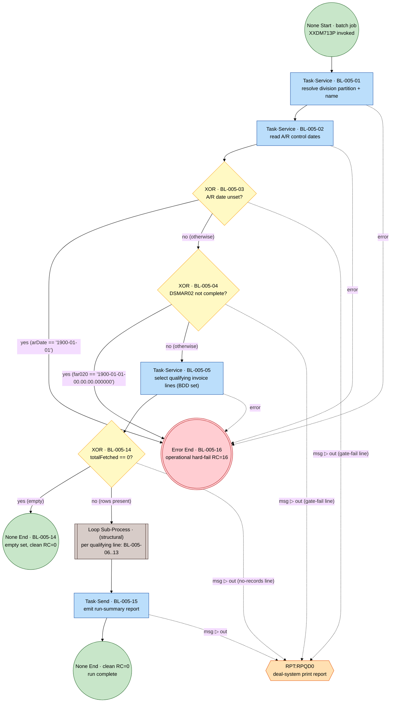

Per `BL-005-03/04` pseudocode, each gate writes its own report line to `RPQD0` before funnelling into the shared Error End; likewise the empty-exit line (`BL-005-14`). The **run-summary node `BL-005-15` is single**, on the success path.

### 2.2 Stages

#### (a) Init + gates — `BL-005-01..04`

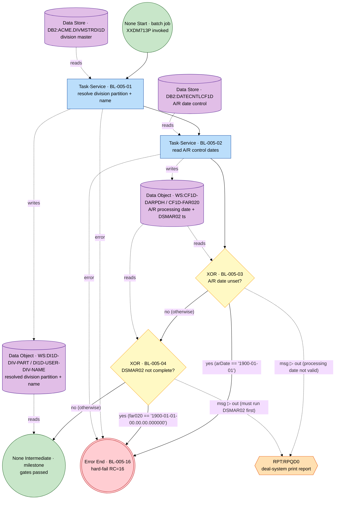

#### (b) Selection + empty gate — `BL-005-05`, `BL-005-14`

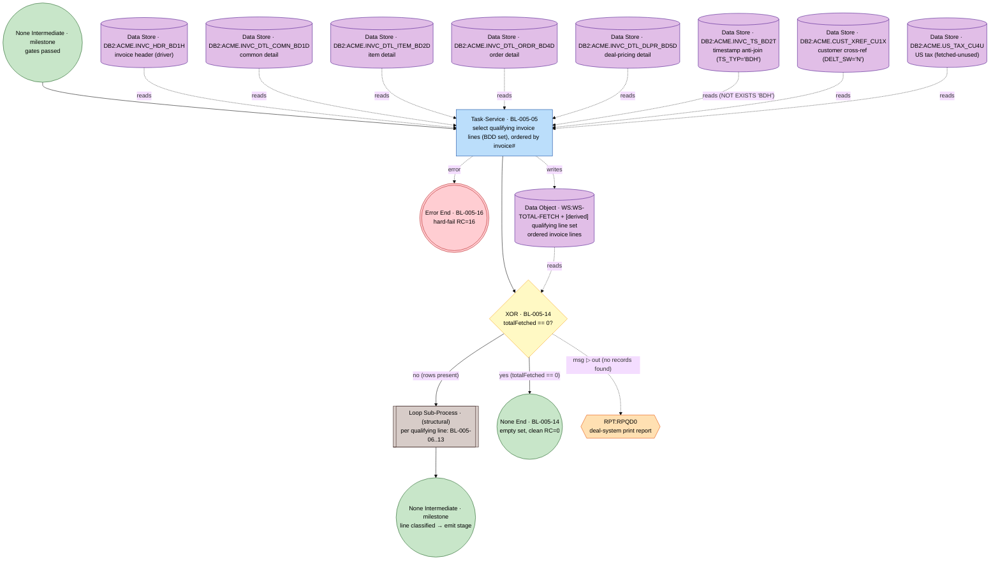

#### (c) Per-line loop body — `BL-005-06..10` (new-invoice break, reprocess guard, per-line filters)

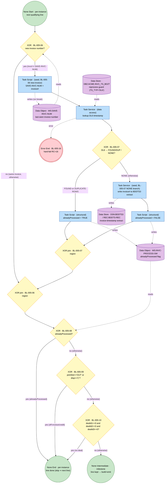

Block structure: `c_g06`→`c_j06` brackets the guard region; nested inside, the two-way `c_g07`→`c_j07` closes first — regions nest, never overlap (P5). The DL6 lookup is a data-access **Task** (`c_lk07`) carrying the §6.4 Error Boundary (the I/O fault, not a gateway branch); the `SAVE-INVC-NUM` write is a **seed Task** on the new-invoice branch (`c_svset`) and the `BDDTS3` seed is a Task on the NONE branch (§5.2) — so the gateways own no data write and do no I/O (P3). Skip branches of 08/09/10 converge to the single per-instance exit (SESE).

#### (d) Build + per-deal emit — `BL-005-11..13` (MI sub-process body = `BL-005-12` + append)

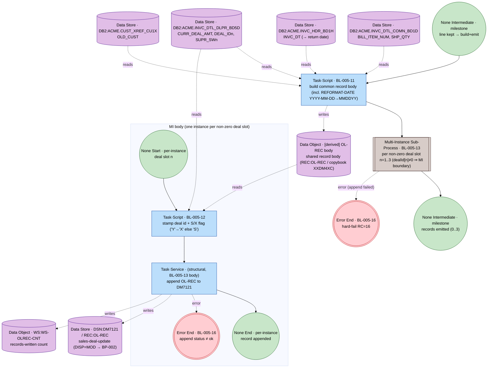

The per-deal-slot `dealId[n]≠0` predicate disappears into the Multi-Instance boundary (§6.1); 0..3 instances run. `BL-005-12` lives inside the MI body; the append (and its hard-fail) realize `BL-005-13`'s emit.

#### (e) Shared §6.4 hard-fail (`BL-005-16`) + run-summary report (`BL-005-15`)

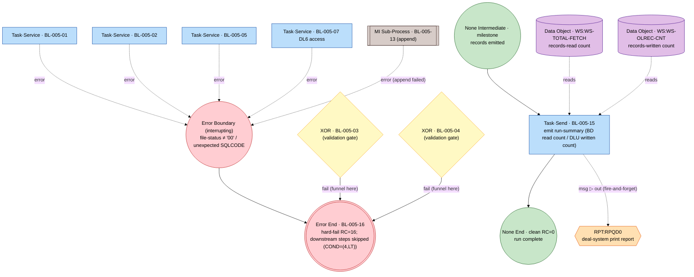

**`RPT:RPQD0` integration attributes (§3.5):** direction **out**; style **fire-and-forget**; **async**; delivery **at-most-once** (SYSOUT spool, `DEST=ACME&DIV`); idempotency n/a; **failure policy** none (no retry/dead-letter). Reached **only** by Message Flow.

### 2.3 Derived FSM (§7.2)

Two-level reading (the per-line loop is an explicit sub-process, P7). **Anchors** `A = { S=Start, E0=None End clean, EΦ=None End empty, E16=Error End RC=16, M1=gates passed, M2=line kept, M3=records emitted }`.

**Outer machine (run-level):**

| From | Guard | / ω (ordered BL ids) | To |
|---|---|---|---|
| S | `arDate=='1900-01-01'` | / 01,02,**03** | E16 |
| S | `arDate≠unset ∧ far020 unset` | / 01,02,03,**04** | E16 |
| S | `arDate≠unset ∧ far020≠unset` | / 01,02,03,04 | **M1** |
| M1 | `totalFetched==0` | / 05,**14** | EΦ |
| M1 | `totalFetched>0` | / 05 | (enter per-line loop) |
| M3 | loop drained | / **15** | E0 |
| *(any region with a data-access node 01/02/05/07/13)* | I/O or SQL fault | / (diagnostics) | E16 |

**Inner machine (one per line; SESE loop body):** sub-states `L0=line entry, M2=line kept, LX=line done`.

| From | Guard | / ω | To |
|---|---|---|---|
| L0 | `invc#≠SAVE ∧ DL6 FOUND/DUP` | / 06,07 (alreadyProcessed=TRUE) | pre-filter |
| L0 | `invc#≠SAVE ∧ DL6 NONE` | / 06,07 (+BDDTS3 seed; =FALSE) | pre-filter |
| L0 | `invc#≠SAVE ∧ DL6 error` | / 06,07 | E16 |
| L0 | `invc#==SAVE` | / 06 (reuse flag) | pre-filter |
| pre-filter | `alreadyProcessed` | / 08 | LX (skip) |
| pre-filter | `¬already ∧ (pickSlot=='OUT' ∨ disp=='C')` | / 08,09 | LX (skip) |
| pre-filter | `… ∧ all 3 deal ids == 0` | / 08,09,10 | LX (skip) |
| pre-filter | `… ∧ ¬all-skips` | / 08,09,10 | M2 |
| M2 | (always) | / 11, then MI region | (per-deal) |
| M2 | per-deal MI | / **13**{ per slot: 12, append } | M3 |
| *(any append)* | `append status ≠ ok` | / 12,13 | E16 |

**Concurrency (MI region, `BL-005-13`).** *Big-step (canonical):* one transition `M2 --[line kept] / { 11 ; ⨁_{n: dealId[n]≠0} (12, append) }--> M3`, effect ω = the **set** of per-slot firings (0..3) plus the one-time 11. *Interleaved (§7.1):* the up-to-three MI instances are independent (each appends its own `OL-REC`); the exact reachability graph is their product automaton — interleavings differ only in physical `DM7121` append order / counter increments, which carry no business meaning, so the big-step set reading is canonical.

```mermaid
%%{init: {'theme': 'base'}}%%
stateDiagram-v2
  [*] --> S
  S  : Start (XXDM713P)
  M1 : gates passed
  M3 : records emitted (loop drained)
  E0 : None End clean (RC=0)
  EPhi : None End empty (RC=0)
  E16 : Error End (RC=16)
  S --> E16 : arDate unset / 01,02,03
  S --> E16 : DSMAR02 not complete / 01,02,03,04
  S --> M1 : gates pass / 01,02,03,04
  M1 --> EPhi : totalFetched==0 / 05,14
  M1 --> M3 : rows>0 / 05 ; loop{06..13}*
  M3 --> E0 : / 15
  M1 --> E16 : I/O or SQL fault / (diag)
  M3 --> E16 : append fault / 12,13
```

### 2.4 Rule → element conformance (Process A)

| Rule | Title | Logic type | BPMN element | Diagram |
|---|---|---|---|---|
| BL-005-01 | Resolve division partition + name | enrichment | Task·Service (reads DB2:DIVMSTRDI1D) + Error Boundary | 2.1, 2.2a, 2.2e |
| BL-005-02 | Read A/R control dates | data-load | Task·Service (reads DB2:DATECNTLCF1D) + Error Boundary | 2.1, 2.2a, 2.2e |
| BL-005-03 | Reject if A/R date unset | validation | Gateway (XOR); fail → Error End BL-005-16 | 2.1, 2.2a, 2.2e |
| BL-005-04 | Reject if DSMAR02 not complete | validation | Gateway (XOR); fail → Error End BL-005-16 | 2.1, 2.2a, 2.2e |
| BL-005-05 | Select qualifying invoice lines (BDD) | selection | Task·Service (7-table join + BD2T anti-join) + Error Boundary | 2.1, 2.2b, 2.2e |
| BL-005-06 | Detect invoice-number change | control | Gateway (XOR) "new invoice?" + seed Task (SAVE-INVC-NUM) on the break branch | 2.2c |
| BL-005-07 | Reprocess guard + first-time extract | validation | Gateway (XOR) on the DL6 lookup result; access is a Task (carries Error Boundary); NONE branch seeds BDDTS3 | 2.2c, 2.2e |
| BL-005-08 | Skip already-processed lines | validation | Gateway (XOR) | 2.2c |
| BL-005-09 | Skip off-invoice / credit | validation | Gateway (XOR) | 2.2c |
| BL-005-10 | Skip no-deal lines | validation | Gateway (XOR) | 2.2c |
| BL-005-11 | Build common record body | transformation | Task·Script (inline REFORMAT-DATE) | 2.2d |
| BL-005-12 | Stamp per-deal id + S/X flag | transformation | Task·Script, inside MI body of BL-005-13 | 2.2d |
| BL-005-13 | Emit up to 3 records per line | routing | Multi-Instance Sub-Process (writes DSN:DM7121); append-fail→Error End | 2.1, 2.2d, 2.2e |
| BL-005-14 | Empty-set graceful exit | control | Gateway (XOR) → None End RC=0 | 2.1, 2.2b |
| BL-005-15 | Run-summary report | reporting | Task·Send → Message Flow → RPT:RPQD0 (single node) | 2.1, 2.2e |
| BL-005-16 | Operational hard-fail RC=16 | error-handling | Error Boundary → Error End (shared §6.4); gates 03/04 funnel here | 2.1, 2.2a–e |

Structural (id-less) nodes: per-line Loop Sub-Process; the DL6 access Task (`c_lk07`, with Error Boundary); the `SAVE-INVC-NUM` seed Task (`c_svset`, BL-005-06 break effect); the BDDTS3 seed Task and the `alreadyProcessed` set Tasks (BL-005-07 branch effects); the append Task (BL-005-13 body); XOR joins matching the 06/07 splits; milestone intermediate events (FSM anchors only). Full coverage: 16/16.

---

## 3. Sub-graph B — DWSLS sales-consolidation producer (`MCBSM50J`)

`MCBSM50J` moves customers/items to a new division; the `DWSLS` dataset is produced as part of that pipeline. **Stage order (call-graph correction of the overview spec): `XXBSM30 → XXBSM32 → SORTSUM → XXBSM31`**, and the DWSLS write is `XXBSM32.5000-WRITE-DATA` (not `XXBSM31`). An empty moved-customer input ends the run cleanly with no `DWSLS`; an empty *parameter* file hard-fails. Rules `BL-005-30..51`. **No external participant has a `BL` rule** — the reject CSV to `FT:APP_COGRPT` (XXBSM58) and the DB2 audit load via `XXBSM59` are context, so B's sinks are all data-at-rest.

### 3.1 Orchestration

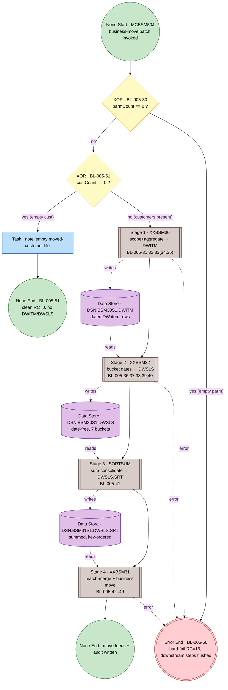

`g30` (parm) gates *before* `g51` (cust): the empty-parm hard-fail is the higher-precedence precondition. Per-stage hard-fail boundaries (30/36/42 + every data-access node) all funnel into the single `BL-005-50` Error End (§6.4).

### 3.2 Stages

#### Stage 1 — `XXBSM30` (warehouse sales → DWITM): `BL-005-51,30,31,32,33` + body `34,35`

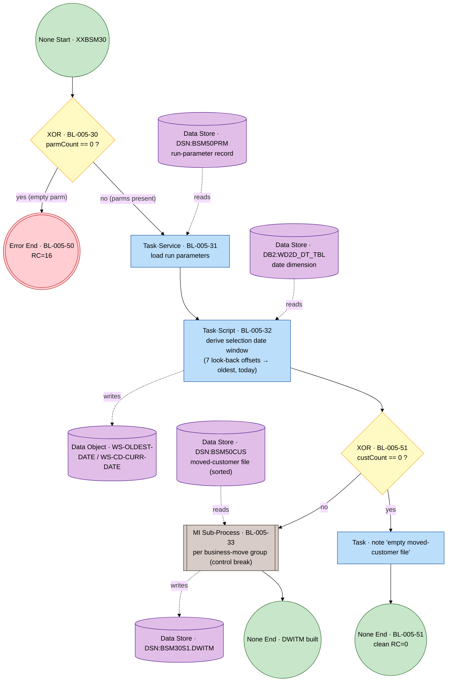

**`BL-005-33` MI body (one instance per business-move group; contains `34`, `35`):**

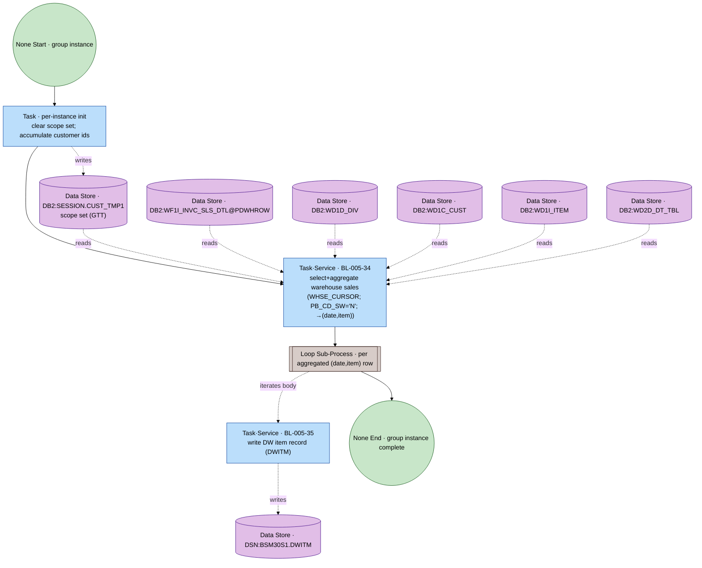

The control-break boundary (CLS-ID change) of `1300-PROC-CUST-FILE` disappears into the MI key (§6.1). Per-instance init = clear scope set + accumulate ids; body = `34` (aggregate) then the structural per-row Loop around `35`.

#### Stage 2 — `XXBSM32` (DWITM → DWSLS period buckets): `BL-005-36,37` + per-DWITM body `38,39,40`

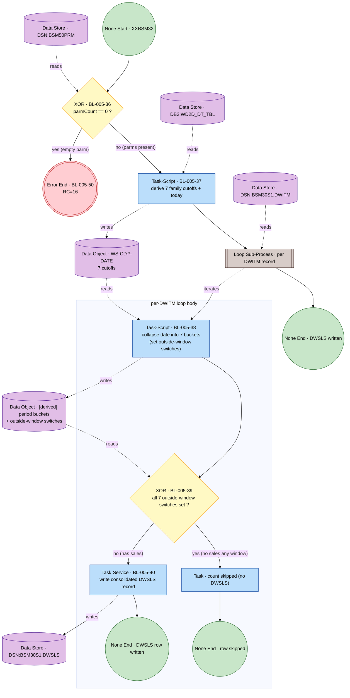

#### Stage 3 — `SORTSUM` (ICETOOL sum-consolidation): `BL-005-41`

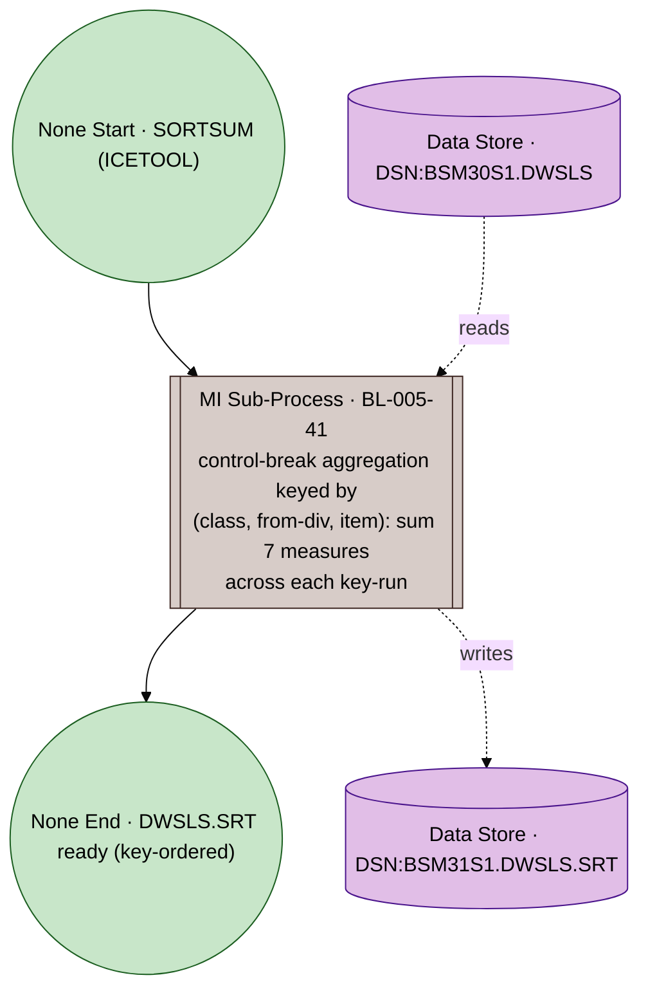

#### Stage 4 — `XXBSM31` (match-merge + business move): `BL-005-42` + merge body `43,44,45,46,47,48,49`

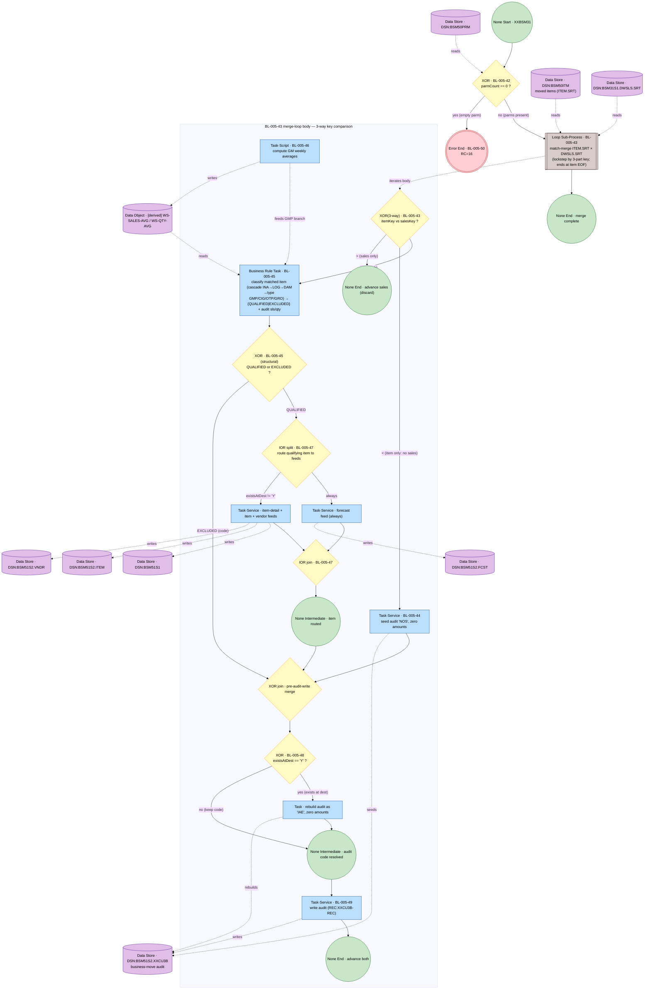

The 3-way key XOR (`==`,`<`,`>`) is mutually exclusive and exhaustive (§6.2/P4). The IAE override (`BL-005-48`) sits on the **common path before the audit write**, so it applies to any item — matched-qualified (after the IOR join), matched-excluded, and no-sales (`t44 → g48`) — mirroring `3100-WRITE-XXCU3B`. A qualifying item still gets its forecast feed when its audit code becomes IAE (the IOR `always` branch fires before `g48`); only the setup feeds are suppressed (IOR guard `existsAtDest != 'Y'`).

#### Shared §6.4 hard-fail — `BL-005-50`

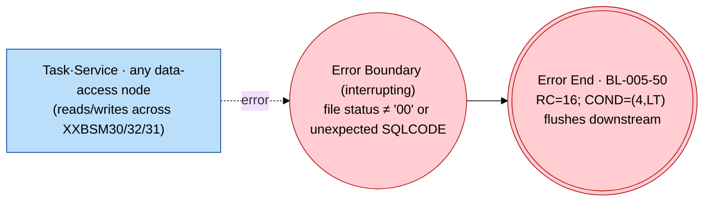

Attached (interrupting) to every data-access node in the chain and to the three empty-parm gates (30/36/42 fail branches). Expected end-of-cursor (`+100`) and duplicate-key (`-803`/`-811`) are not faults (the GTT duplicate swallow is §8.3 mechanics). The §10.2 `[CODMOD]` unreachable second termination after `GO TO 9000-TERMINATE` on the `BL-005-42` path is correctly **not** modelled.

### 3.3 Derived FSM (§7.2)

**Anchors** `A = { Start, None End clean (empty-cust), Error End RC=16, M:DWITM built, M:DWSLS written, M:DWSLS.SRT ready, M:merge complete }`. ω = ordered fired BL ids; loops/MI are explicit sub-processes (P7), so no cycle straddles an anchor transition — each collapses to a single big-step effect (annotated `*`).

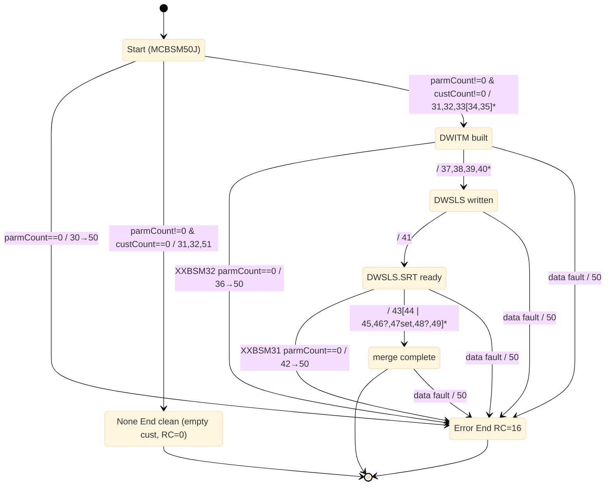

**Concurrency.** The MI sub-processes (`33` keyed by move-group; `41` keyed by the 3-part key), the two structural loops (per-row around `35`; per-DWITM around `38–40`) and the match-merge Loop (`43`) are all block-structured and fully contained — they collapse to big-step effects. The **IOR region (`47`)** uses the **big-step (business-readable)** reading: ω(47) = `{ forecast } ∪ (existsAtDest≠'Y' ? { item-detail, item, vendor } : ∅)`; the IOR join synchronizes exactly the fired set (no false serialization). The interleaved (§7.1) product is available if the relative write-order of the forecast vs setup feeds must be reasoned about, but they are independent writes, so the set reading is faithful.

### 3.4 Rule → element conformance (Process B)

| Rule | Title | Logic type | BPMN element | Diagram |
|---|---|---|---|---|
| BL-005-30 | Empty parm ⇒ hard-fail (XXBSM30) | error-handling | Gateway (XOR) → Error End BL-005-50 | 3.1, Stage 1 |
| BL-005-31 | Load run parameters | data-load | Task·Service (reads DSN:BSM50PRM) | Stage 1 |
| BL-005-32 | Derive selection date window | selection | Task·Script (reads DB2:WD2D) | Stage 1 |
| BL-005-33 | Build moved-customer scope set (group break) | data-load | Multi-Instance Sub-Process (control break §6.1) | Stage 1 + MI body |
| BL-005-34 | Select+aggregate warehouse sales | aggregation | Task·Service (WHSE_CURSOR; PB_CD_SW='N') | MI body |
| BL-005-35 | Write DW item record | transformation | Task·Service (writes DSN:BSM30S1.DWITM), per-row Loop | MI body |
| BL-005-36 | Empty parm ⇒ hard-fail (XXBSM32) | error-handling | Gateway (XOR) → Error End BL-005-50 | Stage 2 |
| BL-005-37 | Derive period-bucket cutoffs | selection | Task·Script (reads DB2:WD2D) | Stage 2 |
| BL-005-38 | Collapse date into 7 buckets | transformation | Task·Script, per-DWITM Loop Sub-Process | Stage 2 body |
| BL-005-39 | Skip item with no sales any window | validation | Gateway (XOR) all-7-switches-set | Stage 2 body |
| BL-005-40 | Write consolidated DWSLS record | aggregation | Task·Service (writes DSN:BSM30S1.DWSLS) | Stage 2 body |
| BL-005-41 | Sum-consolidate by key (SORTSUM) | aggregation (control break) | Multi-Instance Sub-Process (§6.1) → DWSLS.SRT | Stage 3 |
| BL-005-42 | Empty parm ⇒ hard-fail (XXBSM31) | error-handling | Gateway (XOR) → Error End BL-005-50 | Stage 4 |
| BL-005-43 | Match-merge items vs sales | match-merge | Loop Sub-Process (§6.2), body opens 3-way XOR | Stage 4 body |
| BL-005-44 | Flag no-sales item (NOS) | classification | Task·Service (seed audit 'NOS'), item<sales branch | Stage 4 body |
| BL-005-45 | Classify matched item by type/threshold | classification | Business Rule Task (b2) → structural Gateway {QUALIFIED\|EXCLUDED} | Stage 4 body |
| BL-005-46 | Compute GM weekly averages | transformation | Task·Script (sub-transform feeding BRT 45) | Stage 4 body |
| BL-005-47 | Route qualifying item to move feeds | routing | Inclusive (IOR) split/join (§6.3) | Stage 4 body |
| BL-005-48 | Override audit code to IAE | transformation | Gateway (XOR) classify-and-seed (`existsAtDest=='Y'`) | Stage 4 body |
| BL-005-49 | Record every item outcome to audit | reporting | Task·Service (writes DSN:BSM51S2.XXCU3B) | Stage 4 body |
| BL-005-50 | Universal hard-fail RC=16 | error-handling | Error Boundary → Error End (shared §6.4) | Hard-fail |
| BL-005-51 | Empty moved-customer file ⇒ graceful exit | control | Gateway (XOR) → None End clean RC=0 | 3.1, Stage 1 |

Structural (id-less) nodes: per-aggregated-row Loop (around 35); per-DWITM Loop (around 38–40); the BL-005-45 structural routing gateway; the **pre-audit-write XOR join** (merges the qualified-routed, excluded, and no-sales paths so the BL-005-48 gateway is a pure split, P5); the IAE-rebuild seed Task (BL-005-48 branch effect); the empty-customer note Task. Full coverage: 22/22. **`BL-005-46` placement choice:** modelled as a precursor sub-transform Task with a data association feeding the BRT (`45`) — its averages are consumed by the classification predicate itself and become the audit amounts, so it logically precedes the decision (cleaner SESE; the data-assoc edge keeps the Axiom of separation).

---

## 4. Sub-graph C — Deal-profitability BI extract (`MCDLS50J` / `XXDLS50`)

`MCDLS50J` runs `XXDLS50` once per division (**29 divisions**): `DELETE1 → 29× XXDLS50P → SORTX → XXCNT1 → IF (RC=0) ADDHDR → MFTTRAN1`. `XXDLS50` produces a per-division extract of **profitable deals** entirely from the `DEALDM1X` cursor (profitability `deal unit amount > latest item cost × cost-percentage`); the divisional files are concatenated, header-stamped, and FTE'd to Cognos. **Refutation carried through (BR-005-09):** `XXDLS50` is **not** a DWSLS consumer (business-logic §10.1). Rules `BL-005-70..92`.

### 4.1 Orchestration (job `MCDLS50J`)

The ×29 fan-out is the single MI Sub-Process `BL-005-85`; its body is shown once in §4.2.

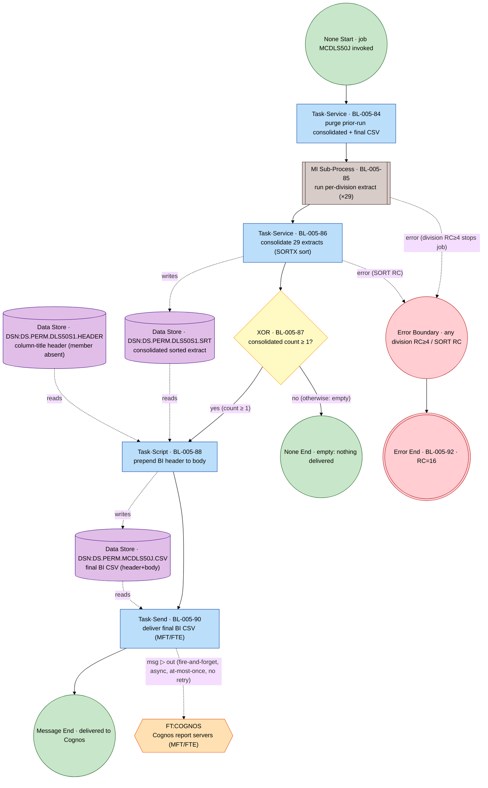

Job order confirmed against call-graph diagram 4C. The MI `BL-005-85` is sequential over the 29 divisions; a step `RC≥4` aborts the job (`COND=(4,LT)`) → the shared `BL-005-92` Error End.

### 4.2 Stages

#### Per-division extract body (= MI-`85` body, `XXDLS50`): `BL-005-70..83, 89, 91`

```mermaid
%%{init: {'theme': 'base'}}%%
flowchart TD
  classDef ev   fill:#c8e6c9,stroke:#1b5e20,color:#000;
  classDef task fill:#bbdefb,stroke:#0d47a1,color:#000;
  classDef gw   fill:#fff9c4,stroke:#f9a825,color:#000;
  classDef err  fill:#ffcdd2,stroke:#b71c1c,color:#000;
  classDef data fill:#e1bee7,stroke:#4a148c,color:#000;
  classDef sub  fill:#d7ccc8,stroke:#3e2723,color:#000;

  estart(("None Start · division extract (PARM=&DI2)")):::ev
  t70["Task·Service · BL-005-70<br/>load cost-% parameter"]:::task
  t71["Task·Service · BL-005-71<br/>load deal-type exclusion list (≤9)"]:::task
  t72["Task·Service · BL-005-72<br/>select candidate deals (12-table join)"]:::task
  t73["Task·Service · BL-005-73<br/>resolve latest LIC (MAX bill-eff-ts)"]:::task
  t74["Task·Service · BL-005-74<br/>sum divisional on-hand"]:::task
  s89["Task·Script · BL-005-89<br/>comparison cost = LIC × cost%"]:::task
  g91{"XOR · BL-005-91<br/>item live/case-pack/real?"}:::gw
  g75{"XOR · BL-005-75 (F1)<br/>future-dated?"}:::gw
  g76{"XOR · BL-005-76 (F2)<br/>active + priced?"}:::gw
  g77{"XOR · BL-005-77 (F3)<br/>deal-type allowed?"}:::gw
  g78{"XOR · BL-005-78 (F4)<br/>profitable? (unitAmt > comparisonCost)"}:::gw
  creject(("None Intermediate · row rejected → drop")):::ev
  cexit(("None Intermediate · candidates built/qualified")):::ev
  g83{"XOR · BL-005-83<br/>first fetch EOD & count == 0?"}:::gw
  cleanend(("None End · clean RC=0 (empty extract)")):::ev
  loop[["Loop Sub-Process · per qualifying row (item-ordered)<br/>BL-005-79,80,81,82"]]:::sub
  loopend(("None End · division extract written (RC=0)")):::ev

  estart --> t70 --> t71 --> t72 --> t73 --> t74 --> s89 --> g91
  g91 -- "yes (eligible)" --> g75
  g91 -- "no (otherwise)" --> creject
  g75 -- "yes" --> g76
  g75 -- "no (otherwise)" --> creject
  g76 -- "yes" --> g77
  g76 -- "no (otherwise)" --> creject
  g77 -- "yes" --> g78
  g77 -- "no (otherwise)" --> creject
  g78 -- "yes (profitable)" --> cexit
  g78 -- "no (otherwise)" --> creject
  creject --> cexit --> g83
  g83 -- "yes (no rows)" --> cleanend
  g83 -- "no (otherwise: rows)" --> loop --> loopend
```

**Loop body (within the loop sub-process), `BL-005-79,80,81,82` — note the soft SIM fallback:**

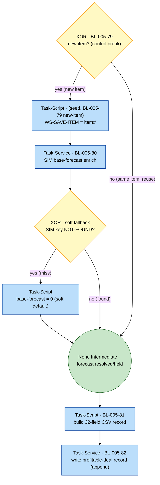

The qualifier chain `91→75→76→77→78` are sequential accept/reject gateways whose reject branch drops the row (converging at `cexit`). In source these and `72/73/74/89` are one `DEAL_CUR` cursor; the graph shows the *logical* order (build candidates → qualify → per-item enrich → build+write). The SIM miss (`BL-005-80`) is a **soft** `→ 0` default, **not** a hard-fail.

#### Shared §6.4 operational hard-fail — `BL-005-92`

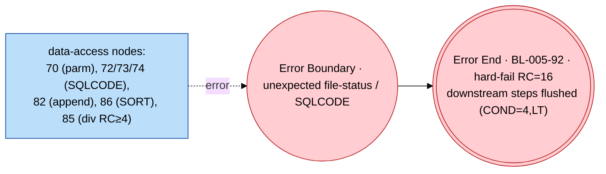

The SIM invalid-key miss (`BL-005-80`) is **not** wired here — it is the soft `→ 0` fallback in the loop body.

### 4.3 Derived FSM (§7.2)

**Anchors** `A = { S0 Start; EClean None End clean (no-profitable / empty-delivery); EMsg Message End (delivered); EErr Error End RC=16; M1 params loaded; M2 candidates built; M4 division extract written; M5 consolidated; M6 gated }`.

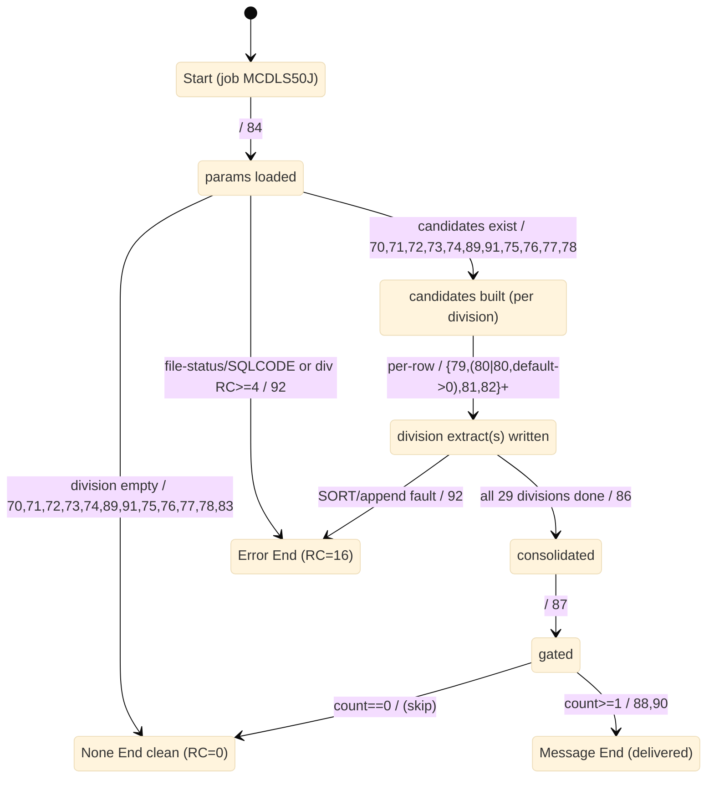

**×29 MI quotient (big-step).** The MI region `M1→M4` collapses to one transition per division instance; the 29 instances are sequential (`RC≥4` aborts → `EErr`), so the job-level reading is `M1 →(×29 sequential)→ M4` with the fan-out summarised as the single effect `{BL-005-85 over body 70–83,89,91}`. The per-row loop stays inside its sub-process (P7); its effect is the Kleene-plus `{79,(80|80+default),81,82}^+` on `M2→M4`. The milestone "deal qualified" (`M3`) is realised by qualifier-chain acceptance inside `M1→M2`. There are two distinct clean ends (per-division empty `BL-005-83`; job empty-delivery skip `BL-005-87` no-branch), both quotiented to `EClean`.

### 4.4 Rule → element conformance (Process C)

| Rule | Title | Logic type | BPMN element | Diagram |
|---|---|---|---|---|
| BL-005-70 | Load cost-% parameter | data-load | Task·Service (+Error Boundary) | 4.2 |
| BL-005-71 | Load deal-type exclusion list | data-load | Task·Service (+Error Boundary, READER file-status) | 4.2 |
| BL-005-72 | Select candidate deals (12-table join) | selection | Task·Service (+Error Boundary) | 4.2 |
| BL-005-73 | Resolve latest LIC (MAX bill-eff-ts) | selection | Task·Service (+Error Boundary) | 4.2 |
| BL-005-74 | Sum divisional on-hand | aggregation | Task·Service (+Error Boundary) | 4.2 |
| BL-005-75 | Future-dated? (F1) | validation | Gateway (XOR) | 4.2 |
| BL-005-76 | Active + priced? (F2) | validation | Gateway (XOR) | 4.2 |
| BL-005-77 | Deal-type allowed? (F3) | validation | Gateway (XOR) | 4.2 |
| BL-005-78 | Profitable? (F4) | classification | Gateway (XOR) (guard uses BL-005-89 threshold) | 4.2 |
| BL-005-79 | Item-number control break | control | Gateway (XOR) + seed Task (WS-SAVE-ITEM) on the new-item branch | 4.2 loop |
| BL-005-80 | SIM base-forecast enrich (fallback 0) | enrichment | Task·Service (+ soft XOR, not Error) | 4.2 loop |
| BL-005-81 | Build 32-field CSV record | transformation | Task·Script | 4.2 loop |
| BL-005-82 | Write profitable-deal record | routing | Task·Service (+Error Boundary) | 4.2 loop |
| BL-005-83 | No profitable deals ⇒ clean exit | control | Gateway (XOR) → None End | 4.2 |
| BL-005-84 | Purge prior-run files | control | Task·Service | 4.1 |
| BL-005-85 | Run extract per division (×29) | control | Multi-Instance Sub-Process | 4.1 |
| BL-005-86 | Consolidate 29 extracts (sort) | aggregation | Task·Service (+Error Boundary) | 4.1 |
| BL-005-87 | Gate delivery on non-empty | validation | Gateway (XOR) | 4.1 |
| BL-005-88 | Prepend BI header | transformation | Task·Script | 4.1 |
| BL-005-89 | Comparison cost = LIC × cost% | transformation | Task·Script | 4.2 |
| BL-005-90 | Deliver final CSV to Cognos (MFT) | reporting | Task·Send → Message Flow → FT:COGNOS, then Message End | 4.1 |
| BL-005-91 | Restrict item population (eligibility) | validation | Gateway (XOR) | 4.2 |
| BL-005-92 | Operational hard-fail RC=16 | error-handling | Error Boundary → Error End (shared §6.4) | 4.2 |

Structural (id-less) nodes: per-qualifying-row Loop Sub-Process (79–82); the `WS-SAVE-ITEM` seed Task on the `79` new-item branch (the break effect, kept off the gateway per §5.2); the soft-fallback XOR inside `80`; qualifier-chain reject/built intermediates. Full coverage: 23/23. **`BL-005-89`/`BL-005-78` note:** both rest on the same SQL expression `DEAL_UNIT_AMT > COST_AMT × AP1S-DEC-VAL`; `89` is the Task computing the `[derived]` comparison cost, `78` the Gateway testing it — a faithful Axiom-of-separation split of one cursor predicate + projected column. **`FT:COGNOS` attributes (§3.5):** out · fire-and-forget · async · at-most-once · no retry.

---

## 5. Sub-graph D — Deal-suppression module (`XXDLS01`, dead code)

> ⚠️ **DEAD CODE.** `XXDLS01` ("Deal Suppression Module") has **no caller anywhere in `docs/legacy/src`** — its linkage copybook `DLS01LNK` is copied only by itself (business-logic §7; call-graph §4C.5 / §8.2). It **never fires in BP-005**. The overview spec's `BR-005-03` ("XXDM713 skips deals suppressed by XXDLS01") is **not realized in source**; the only live invoice-plane suppression is XXDM713's own per-deal `SDTUP0='X'` flag (`BL-005-12`). Sub-graph D is modelled **only** to satisfy total-coverage of `BL-005-100..104` and to capture the suppression contract for modernization. Dead-code status is **expected, not a gap**.

The module is a callable subroutine (linkage contract `REC:DLS01LNK`), modelled as a single SESE process: **Start (invoked) → 100 default → 101 → 102 → 103 → None End (return switch)**, with the `BL-005-104` Error Boundary → Error End that **returns** RC 11/16 via linkage (no abend).

### 5.1 Module diagram

```mermaid
%%{init: {'theme': 'base'}}%%
flowchart TD
  classDef ev   fill:#c8e6c9,stroke:#1b5e20,color:#000;
  classDef task fill:#bbdefb,stroke:#0d47a1,color:#000;
  classDef gw   fill:#fff9c4,stroke:#f9a825,color:#000;
  classDef err  fill:#ffcdd2,stroke:#b71c1c,color:#000;
  classDef data fill:#e1bee7,stroke:#4a148c,color:#000;
  classDef sub  fill:#d7ccc8,stroke:#3e2723,color:#000;
  classDef ext  fill:#ffe0b2,stroke:#e65100,color:#000;

  start(("Message Start · module invoked<br/>(DEAD — no caller in BP-005)<br/>reads REC:DLS01LNK")):::ev
  r100["Task·Script · BL-005-100<br/>seed default DLS01-DEAL-SUPP-SW='N'; own return via linkage<br/>(short-circuit cascade wrapper)"]:::task
  g101{"XOR · BL-005-101<br/>customer profiled?<br/>(EXISTS active 'DLS' cust-profile)"}:::gw
  seed101["Task·Service · (seed, BL-005-101 yes)<br/>cache WS-CUST-SW='Y'"]:::task
  g102{"XOR · BL-005-102<br/>item profiled?<br/>(EXISTS active 'DLS' item-profile)"}:::gw
  seed102["Task·Service · (seed, BL-005-102 yes)<br/>cache WS-ITEM-SW='Y'"]:::task
  r103["Task·Business Rule · BL-005-103<br/>deal-level suppressed? compute 'Y'/'N'<br/>(eff-date brackets invoice dt AND group absent|matches)"]:::task
  done(("None End · return suppress switch<br/>writes REC:DLS01LNK (DLS01-DEAL-SUPP-SW)")):::ev
  eb(("Error Boundary (interrupting)<br/>packageset fail | unexpected SQLCODE")):::err
  ferr((("Error End · BL-005-104<br/>set linkage DLS01-RET-CODE = 16 (packageset) / 11 (+SQLCA)<br/>returns to caller — NO abend (≠ batch RC=16)"))):::err

  lnk[("Data Object · REC:DLS01LNK<br/>linkage I/O contract")]:::data
  pr1p[("Data Store · DB2:ACME.PROF_HDR_PR1P<br/>profile hdr (PROF_TYP='DLS',OK_TO_ACTIVE_SW='Y')")]:::data
  pr3q[("Data Store · DB2:ACME.PROF_CUS_PR3Q<br/>customer profile")]:::data
  pr5q[("Data Store · DB2:ACME.PROF_ITM_PR5Q<br/>item profile (CATLG_NUM)")]:::data
  pr3p[("Data Store · DB2:ACME.PROF_ITM_GRP_PR3P<br/>deal-type/payment group (CLS_TYP='DLSTYP')")]:::data
  cu1x[("Data Store · DB2:ACME.CUST_XREF_CU1X<br/>customer cross-ref (DELT_SW='N')")]:::data
  di1d[("Data Store · DB2:ACME.DIVMSTRDI1D<br/>division master")]:::data
  wcsw[("Data Object · WS:WS-CUST-SW<br/>cached customer-profiled flag")]:::data
  wisw[("Data Object · WS:WS-ITEM-SW<br/>cached item-profiled flag")]:::data

  start --> r100 --> g101
  g101 -- "no (not profiled) → default 'N' [otherwise]" --> done
  g101 -- "yes (customer profiled)" --> seed101 --> g102
  g102 -- "no (not profiled) → default 'N' [otherwise]" --> done
  g102 -- "yes (item profiled)" --> seed102 --> r103
  r103 --> done

  g101 -. "error (packageset / SQLCODE)" .-> eb
  g102 -. "error (packageset / SQLCODE)" .-> eb
  r103 -. "error (packageset / SQLCODE)" .-> eb
  eb --> ferr

  lnk -. "reads (tuple in)" .-> start
  r100 -. "writes (default switch='N')" .-> lnk
  g101 -. "reads" .-> pr1p
  g101 -. "reads" .-> pr3q
  g101 -. "reads" .-> cu1x
  g101 -. "reads" .-> di1d
  seed101 -. "writes" .-> wcsw
  g102 -. "reads" .-> pr1p
  g102 -. "reads" .-> pr5q
  seed102 -. "writes" .-> wisw
  r103 -. "reads" .-> pr1p
  r103 -. "reads" .-> pr3q
  r103 -. "reads" .-> pr5q
  r103 -. "reads" .-> pr3p
  r103 -. "reads" .-> cu1x
  r103 -. "reads" .-> di1d
  r103 -. "reads" .-> wcsw
  r103 -. "reads" .-> wisw
  done -. "writes (switch out)" .-> lnk
```

`Start` is a Message Start (a subroutine `CALL` is the inbound-message analogue), reading the linkage tuple. `BL-005-100` seeds `switch='N'` and owns the return. `101`/`102` are pure-predicate XOR gateways whose "no" branch is the `otherwise`/default that leaves `'N'` intact and short-circuits to the single return. `103` is a Business Rule Task because its computed `'Y'`/`'N'` *is* the returned data. The cascade is purely sequential (no AND/IOR, no loops).

> **`BL-005-104` distinction (load-bearing):** batch `BL-005-16/50/92` = `Error End` that **abends RC=16 and stops the pipeline**; `BL-005-104` = `Error End` that **writes `DLS01-RET-CODE` (16 = packageset / 11 = unexpected SQLCODE, with `SQLCA` copied back) into the linkage and returns to the caller — no abend.** The caller decides what to do.

### 5.2 Derived FSM (§7.2)

**Anchors** `A = { Start (invoked), None End (return switch RC=0), Error End (RC 11/16) }`. No concurrency (purely sequential cascade).

```mermaid
%%{init: {'theme': 'base'}}%%
stateDiagram-v2
  [*] --> S
  S : Start (module invoked · DEAD)
  R : None End (return suppress switch · RC=0)
  E : Error End (RC=16 packageset / RC=11 SQLCODE)
  S --> R : not custProfiled / 100,101
  S --> R : custProfiled & not itemProfiled / 100,101,102
  S --> R : cust & item & dealSuppressed / 100,101,102,103 (switch='Y')
  S --> R : cust & item & not dealSuppressed / 100,101,102,103 (switch='N')
  S --> E : packagesetFail or unexpectedSQLCODE / 100,104
  R --> [*]
  E --> [*]
```

The `'Y'` and `'N'` deal-evaluated paths share ω `(100,101,102,103)` and the same anchor `R`, differing only in the linkage switch value; listed separately because the business outcome differs. Guards over the boolean predicates are mutually exclusive and exhaustive; the error escape is orthogonal.

### 5.3 Rule → element conformance (Process D)

| Rule | Title | Logic type | Case | BPMN element | Diagram |
|---|---|---|---|---|---|
| BL-005-100 | Resolve deal-suppression switch (cascade) | control | wrapper/default | Task·Script (seed 'N'; own return) | 5.1 |
| BL-005-101 | Customer profiled? | classification | b1 | Gateway (XOR) (reads PR1P/PR3Q/CU1X/DI1D) | 5.1 |
| BL-005-102 | Item profiled? | classification | b1 | Gateway (XOR) (reads PR1P/PR5Q) | 5.1 |
| BL-005-103 | Deal-level suppressed? | validation | b2 | Business Rule Task (result = returned switch) | 5.1 |
| BL-005-104 | Return-code / hard-fail convention | error-handling | §6.4 (adapted) | Error Boundary → Error End (returns RC 11/16, no abend) | 5.1 |

Full coverage: 5/5. Structural (id-less) nodes: the seed Tasks on the `101`/`102` "yes" branches that write the cached `WS-CUST-SW`/`WS-ITEM-SW` flags (the §5.2 classify-and-seed effect kept off the gateways, P3). External participants: **none** (returns through the linkage record). Transient data — `REC:DLS01LNK` (read by Start, default `'N'` seeded by `100`, switch written at the None End), `WS:WS-CUST-SW`/`WS:WS-ITEM-SW` (written by the seed Tasks, read by `103`) — each have a reader and a writer; the profile/reference tables are read-only sources.

---

## 6. Cross-cutting convention — operational hard-fail (§6.4)

Every data-access Activity in BP-005 inherits the meta-model's canonical hard-fail convention (§6.4), modelled **once per sub-graph** and referenced by all data-access nodes: an `Error Boundary (interrupting)` on the access raises an unexpected file-status / `SQLCODE` to an `Error End`. `NOT-FOUND`/`+100` "no data" and duplicate-key (`-803`/`-811`) are *not* faults — they are ordinary soft-skip XOR branches or the §8.3 mechanics. Canonical shape:

```mermaid
%%{init: {'theme': 'base'}}%%
flowchart LR
  classDef ev   fill:#c8e6c9,stroke:#1b5e20,color:#000;
  classDef task fill:#bbdefb,stroke:#0d47a1,color:#000;
  classDef gw   fill:#fff9c4,stroke:#f9a825,color:#000;
  classDef err  fill:#ffcdd2,stroke:#b71c1c,color:#000;

  acc["Service Task<br/>read / write data access"]:::task
  xnf{"XOR · soft<br/>status = NOT-FOUND? (e.g. +100)"}:::gw
  skip["Task<br/>skip / soft default"]:::task
  use(("None Intermediate<br/>continue main flow")):::ev
  eb(("Error Boundary<br/>status not in accepted set")):::err
  ferr((("Error End<br/>hard-fail, instance terminates"))):::err

  acc --> xnf
  xnf -- "yes (soft skip)" --> skip
  xnf -- "no (status OK)" --> use
  acc -. "error" .-> eb --> ferr
```

**Realized hard-fail rule ids, by sub-graph:**

| Sub-graph | Hard-fail rule | Behaviour | Funnels in |
|---|---|---|---|
| A | `BL-005-16` | abend RC=16; `COND=(4,LT)` skips downstream invoice-plane steps (no `BDDTS3` merge / `INVC_TS_BD2T` writeback) | validation gates `03`,`04`; data-access `01`,`02`,`05`,`07`,`13` |
| B | `BL-005-50` | abend RC=16; `COND=(4,LT)` flushes the whole DWSLS/business-move plane | empty-parm gates `30`,`36`,`42`; every data-access node in `XXBSM30/32/31` |
| C | `BL-005-92` | abend RC=16; `COND=(4,LT)` flushes consolidation + delivery (nothing to Cognos) | `70` (param missing), `72/73/74` (SQLCODE), `82` (append), `86` (SORT), `85` (division `RC≥4`) |
| D | `BL-005-104` | **returns** `DLS01-RET-CODE` 16 (packageset) / 11 (+`SQLCA`) via linkage — **no abend** | `101`,`102`,`103` (unexpected SQLCODE), packageset setup |

The soft "produce nothing" outcomes are deliberately **not** hard-fails: `BL-005-14` (A, empty invoice set), `BL-005-51` (B, empty moved-customer file), `BL-005-83` (C, no profitable deals) and `BL-005-87`-no (C, empty consolidated → skip delivery) are ordinary clean `None End` terminations (RC=0); `BL-005-80` (C, SIM key miss) is a soft `→ 0` default.

---

## 7. Conformance & traceability

### 7.1 Total coverage (every `BL-005-MM` → exactly one flow node)

All **66** rules are realized, each on exactly one rule-bearing node; the per-process tables (§2.4, §3.4, §4.4, §5.3) are the per-rule evidence. Element distribution:

| Sub-graph | Rules | Task | Gateway (XOR) | IOR | Business-Rule Task | MI/Loop Sub-Process | Error Boundary→End |
|---|---|---|---|---|---|---|---|
| A (`01..16`) | 16 | 01,02,05,11,12,15 (6) | 03,04,06,07,08,09,10,14 (8) | — | — | 13 (1) | 16 (1) |
| B (`30..51`) | 22 | 31,32,34,35,37,38,40,44,46,49 (10) | 30,36,39,42,48,51 (6) | 47 (1) | 45 (1) | 33,41,43 (3) | 50 (1) |
| C (`70..92`) | 23 | 70,71,72,73,74,80,81,82,84,86,88,89,90 (13) | 75,76,77,78,79,83,87,91 (8) | — | — | 85 (1) | 92 (1) |
| D (`100..104`) | 5 | 100 (1) | 101,102 (2) | — | 103 (1) | — | 104 (1) |
| **Total** | **66** | **30** | **24** | **1** | **2** | **5** | **4** |

(30 + 24 + 1 + 2 + 5 + 4 = 66.) Structural id-less nodes — Loop wrappers, XOR joins, classify-and-seed branch Tasks, milestone events — are added per sub-graph and justified in each section; they carry no rule id, consistent with "every *rule-bearing* node carries its id."

### 7.2 Purity (P1–P9)

- **P1 Bounded.** Each sub-graph has exactly one Start; every path reaches an End (clean `None End`, `Message End`, or `Error End`); no unreachable nodes. ✔
- **P2 Activity contract.** Every Task/Sub-Process has one in / one out; branching is only on gateways. ✔
- **P3 Gateway contract.** Gateways carry guards over Data and do no work; the b2 Business-Rule Tasks (45, 103) carry the *computation*, their following structural gateway only routes. ✔
- **P4 Determinism + totality.** Every XOR split has an explicit `otherwise`/default companion branch (incl. the 3-way merge XOR `=`/`<`/`>` in B and the three-way FOUND/NONE/error guard in A's `07`); IOR (`47`) guards are independent; no AND used. ✔
- **P5 Block structure (SESE).** Splits pair with same-type joins (A's `06`/`07` nest; B's `47` IOR split/join; the qualifier chains converge to a single exit); regions nest, never overlap. ✔
- **P6 Soundness.** P3+P4+P5 ⇒ option-to-complete + proper completion, no dead activities (witnessed by the per-process FSMs). ✔
- **P7 Explicit loops.** All iteration is in Loop/MI sub-processes (A per-line + per-deal MI; B per-group MI `33`, per-row/per-DWITM loops, SORTSUM MI `41`, match-merge Loop `43`; C ×29 MI `85` + per-row loop); no arbitrary back-edges. ✔
- **P8 Exceptions as events.** Hard-fail via Error Boundary → Error End (16/50/92/104); "skip"/"empty" outcomes are ordinary XOR branches / clean ends. ✔
- **P9 Separated flows.** External coupling (RPQD0, COGNOS) is Message Flow only; data movement is Data Association; no Sequence Flow crosses to an external participant. ✔

### 7.3 Concurrency choices

The only genuinely concurrent region is **B's IOR fan-out `BL-005-47`** (forecast feed always; item-detail/item/vendor feeds when `existsAtDest≠'Y'`), read **big-step**: one transition whose effect is the *set* of feeds that fired; the IOR join synchronizes exactly that set (no false serialization). **A's per-deal MI `BL-005-13`** (0..3 independent appends) is likewise big-step; its interleaved §7.1 product differs only in physical append order / counter increments (no business meaning). **No `Parallel (AND)` gateway is used anywhere** — every fork in BP-005 is either exclusive (XOR), inclusive (IOR `47`), or an MI/Loop collection. All MI/Loop sub-processes are quotiented to single big-step effects in the FSMs (P5+P7 guarantee no cycle straddles an anchor).

### 7.4 External integrations register (§3.5)

| Endpoint | Sub-graph | Touched by | Direction | Style | Sync | Delivery | Idempotency | Failure policy |
|---|---|---|---|---|---|---|---|---|
| `RPT:RPQD0` | A | `BL-005-15` Send Task (+ gate/empty report lines) | out | fire-and-forget | async | at-most-once (SYSOUT spool, `DEST=ACME&DIV`) | n/a (operator report) | none (no retry/dead-letter) |
| `FT:COGNOS` | C | `BL-005-90` Send Task → Message End | out | fire-and-forget | async | at-most-once (MFT/FTE, member `MCDLS501`) | n/a | none (job-level RC gate) |

No inbound integration, no request–reply, no pub-sub, no API/webhook/email (call-graph §3). The DB2 audit `BUSINESS_MOVE_AUDIT_CU3B` (B) is loaded by the **context** program `XXBSM59` — modelled as the data-at-rest sink `DSN:BSM51S2.XXCU3B`, **not** an external participant. The context reject CSV to `FT:APP_COGRPT` (B, `XXBSM58`) has no `BL` rule and is not modelled.

### 7.5 Conformance checklist (meta-model §8)

- [x] **Purity:** P1–P9 hold (§7.2).
- [x] **Total coverage:** all 66 `BL-005-MM` → exactly one flow node; per-process rule→element tables included (§7.1).
- [x] **No orphan data:** every transient/derived Data Object and every intermediate dataset has ≥1 reader and ≥1 writer in-view; inbound master/reference stores are read-only inputs by convention (§1.5).
- [x] **Data identity:** every Data node carries a typed id (`DB2:`/`DSN:`/`REC:`/`WS:`) or `[derived]`; no `[sink]` needed.
- [x] **Integration identity:** the two endpoints are Pools reached only by Message Flow with full attributes (§7.4); no endpoint modelled as Data.
- [x] **Traceability:** every rule-bearing node carries its `BL-005-MM` id; tables complete (§2.4/§3.4/§4.4/§5.3).
- [x] **Soundness:** reachability (per-process FSMs, §2.3/§3.3/§4.3/§5.2) yields option-to-complete + proper completion, no dead activities.
- [x] **Rendering:** every Mermaid block uses the §3.4 legend; all four sub-graphs extracted to `.mmd` and rendered to `.svg` (§7.6), `mmdc` clean.
- [x] **FSM projection:** a derived Mealy FSM is provided per sub-graph with concurrency handling stated (§7.3).

### 7.6 Diagram sources

Self-contained Mermaid sources and renders (one per sub-graph) under [`diagrams/`](diagrams/):

| Sub-graph | Source | Render |
|---|---|---|
| A | `BP-005-A-process-graph.mmd` | `BP-005-A-process-graph.svg` |
| B | `BP-005-B-process-graph.mmd` | `BP-005-B-process-graph.svg` |
| C | `BP-005-C-process-graph.mmd` | `BP-005-C-process-graph.svg` |
| D | `BP-005-D-process-graph.mmd` | `BP-005-D-process-graph.svg` |

### 7.7 Assumptions, gaps, and notes (graph-relevant)

Carried from business-logic §10 and the builders; none affects coverage or topology:

- **Sub-graph D is dead code** (no caller in source) — modelled for total coverage and as a captured contract only. The call-graph §4C.5 wires the cascade "yes" branch differently; the authoritative business-logic §7 pseudocode governs ("yes" deepens, "no" short-circuits to default `'N'`). `[SME]` to confirm during modernization.
- **Read-only inputs flagged** (not orphans): A's source masters (`BD*`, `CU1X`, `CU4U`, `DIVMSTRDI1D`, `DATECNTLCF1D`); B's warehouse dimensions (`WF1I@PDWHROW`, `WD*`) and inbound sorted files (`BSM50CUS`, `BSM50ITM`, `BSM50PRM`); C's `DEALDM1X` + 11 masters and the externally-maintained `DLS50S1.HEADER`; D's profile/ref tables — all have out-of-scope writers (owning processes / upstream loads / PDS members).
- **Values absent from export** (topology firm, literals unverifiable): B's seven look-back/cutoff window values and `XXBSM31` thresholds (`BSM50S1.PARM`), the `SORTPARM`/`FTE`/`HEADER`/`RDRPARM` members in B and C. `[GAP]`/`[SME]`.
- **Fetched-but-unused fields** (modelled within their source stores, no separate nodes): A's `CU4U.TAX_ST_CD`, `BD2D.BUS_TYP`, `BD5D.STATE_ITEM_NUM`. `[SME]`/`[CODMOD]`.
- **Known source defects** correctly not modelled: B's `BL-005-42` unreachable second termination and the `XXBSM31` DWSLS read-error mislabel (`[CODMOD]`); C's `PARM_ID='XXDLS50_EXCLUDE_TYP'` misnomer that actually carries the cost-% `DEC_VAL` (`[CODMOD]`).

### 7.8 Audit reconciliation (post-build)

Each sub-graph was audited (read-only) against §8 after the first render; the canonical `.mmd`/`.svg` sources were then corrected and re-rendered (`mmdc` clean). Fixes applied:

- **P3 — gateways own no data write.** Control-break / cache "seed" writes were moved off the gateways onto **seed Tasks** on the true branch (§5.2): A `SAVE-INVC-NUM` (BL-005-06), C `WS-SAVE-ITEM` (BL-005-79), D `WS-CUST-SW`/`WS-ITEM-SW` (BL-005-101/102). Gateways now only *read* data for their guards.
- **P3/P8 — gateway doing I/O (A).** The DL6 reprocess-guard lookup (BL-005-07) was split into a data-access **Task** (`LK07`, carrying the §6.4 Error Boundary) followed by a pure XOR on the lookup result.
- **P1/P6 — soundness (B).** The four stages are now wired with **sequence flows** (`S1→S2→S3→S4→end`); the intermediate datasets (`DWITM`/`DWSLS`/`DWSLS.SRT`) remain Data Stores coupled by data-associations. The empty-parm gates (30/36/42) route their fail branch **directly** to the shared Error End (the spurious per-gate Error-Boundary nodes were removed); inter-stage `None End`s were demoted to milestones.
- **P5 — merge/split separation (B).** A **pre-audit-write XOR join** now merges the qualified-routed, excluded, and no-sales paths before the BL-005-48 split, so no gateway both merges and splits.
- **No-orphan data (A).** `WS:DI1D-DIV-PART` (resolved division partition/name) now has readers (it scopes selection BL-005-05 and the report header BL-005-15).
- **Correctness (D).** BL-005-100 now seeds the default `'N'` onto the linkage switch (`REC:DLS01LNK`), not the customer cache; the BL-005-104 Error End label states it sets the linkage `DLS01-RET-CODE` (16/11) and **returns** (no abend), distinct from the batch RC=16.
- **Completeness (C).** The READER load (BL-005-71) now carries an Error Boundary (BL-005-92 names `WS-READER-STATUS`); the §4.4 table annotates 71/72/73/74 as boundary-bearing.

Accepted-as-modelled (documented, not defects):

- **Loop/MI bodies as linked refinements (B, C).** A Loop/MI Sub-Process is a single node in the token flow; its body is drawn as a companion sub-graph linked by a dotted "refines"/"iterates" edge (A nests its bodies inline — both are conformant; the token passes through the Sub-Process node either way).
- **Gate report-line message flows (A).** The BL-005-03/04/14 gate/empty report lines are drawn as message throws from the gateway to `RPT:RPQD0` (their `EMIT-REPORT-LINE` side-effect); the primary RPQD0 interaction (BL-005-15) is a proper Send Task. A stricter form would place each report line on a Send Task on the branch.
- **Qualifier-chain convergence (C).** The accept/reject screens 91→75→76→77→78 are a cascade of single-drop XORs converging on one exit event (rather than one N-way XOR join) — single-entry/single-exit and sound; the per-set empty gate BL-005-83 follows the per-row cascade as a linearization of the single `DEAL_CUR` cursor.

---

> **Scope.** This artifact stops at the process graph + FSM. The design-spec decomposition (seeding design units from these sub-graphs) is the next, separate step.

