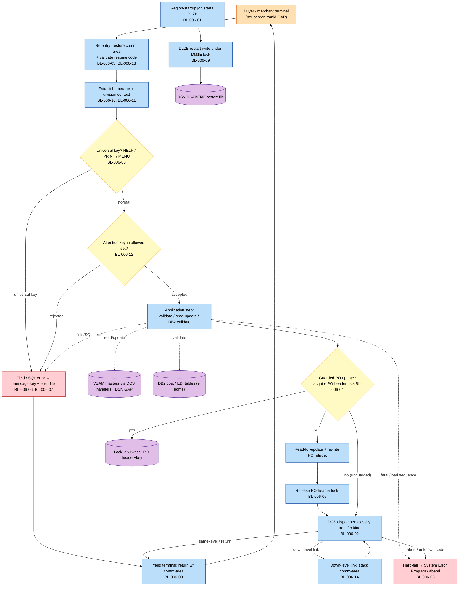
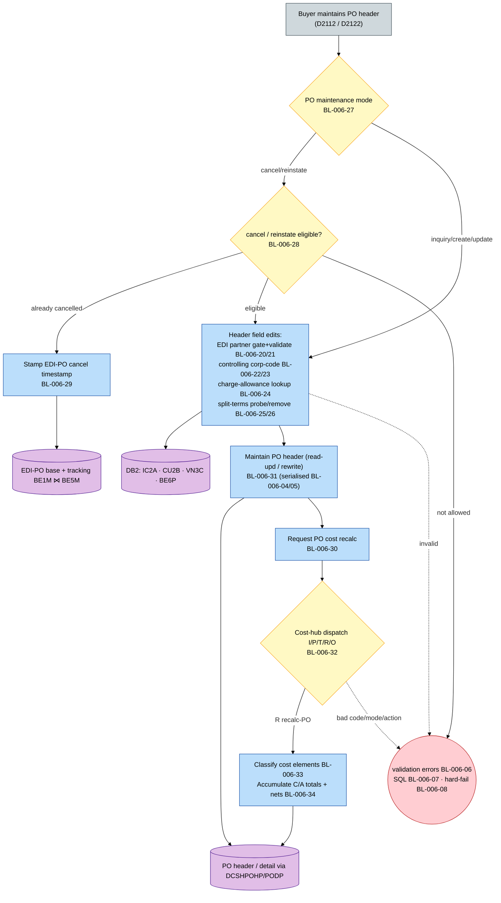
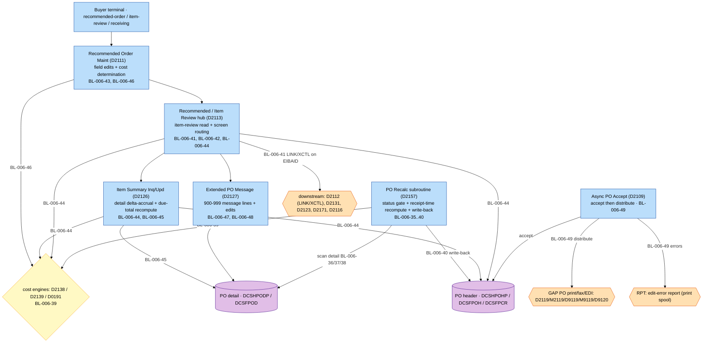
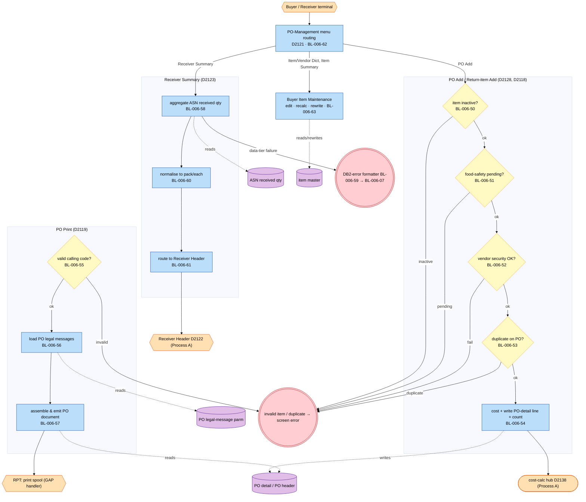
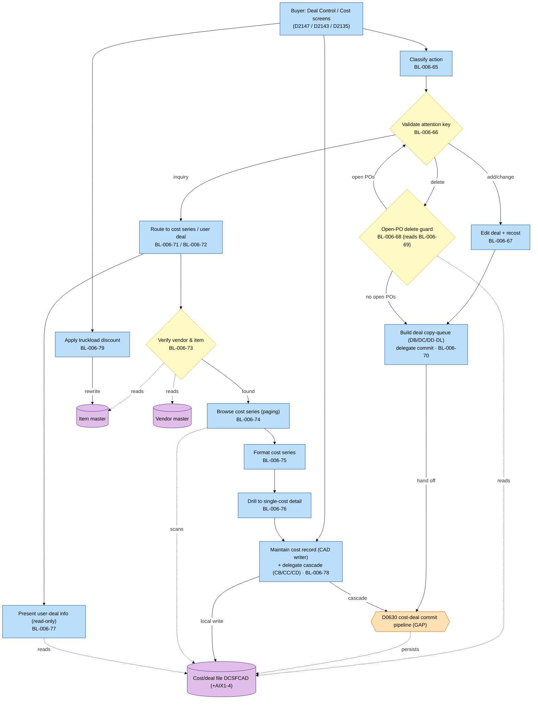
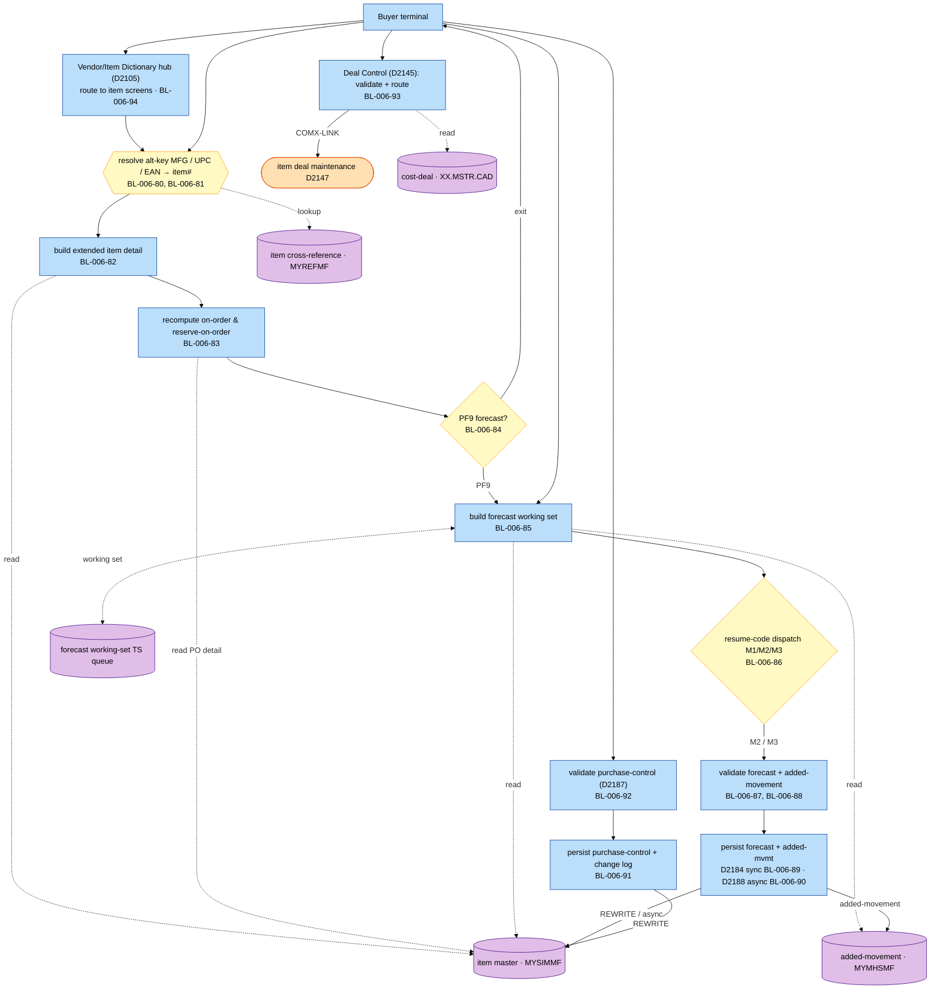
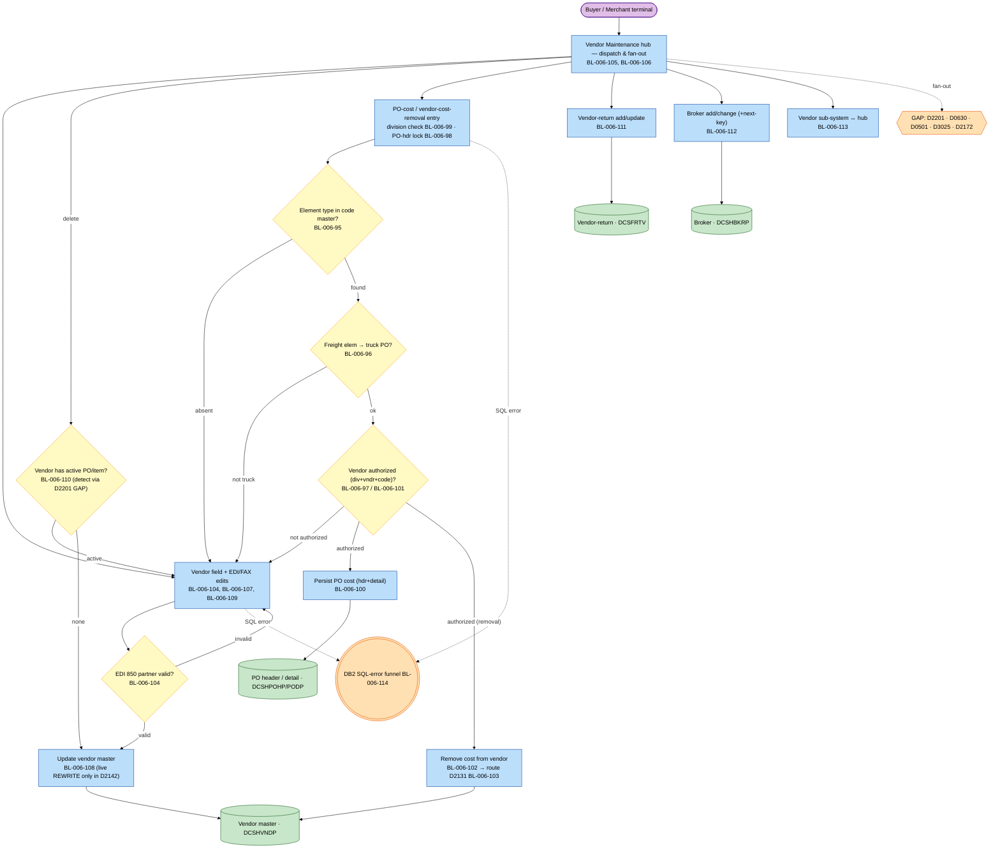
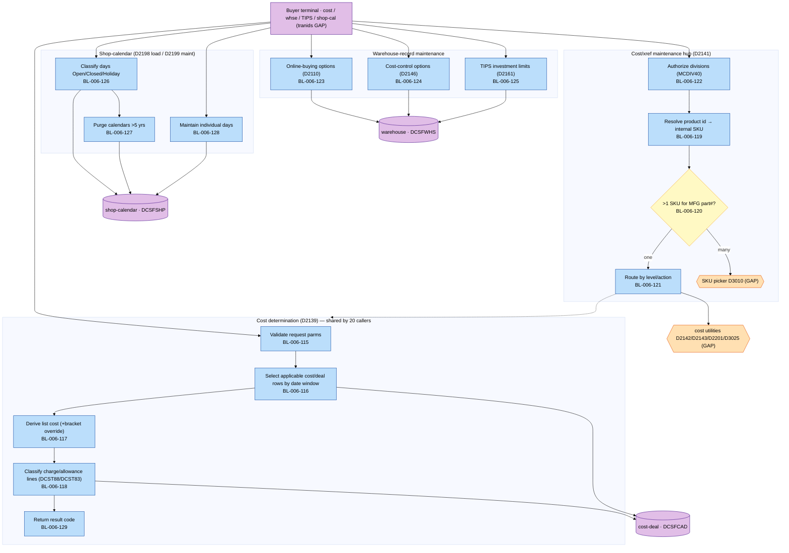

# BP-006 — CICS Online Surface: Extracted Business Logic

**Status:** Draft — business-logic extraction derived from the call-dependency graph, grounded in mainframe source under `docs/legacy/src`
**Companion to:** [BP-006-cics-online-surface-call-graph.md](BP-006-cics-online-surface-call-graph.md) and [BP-006-cics-online-surface.md](../BP-006-cics-online-surface.md)
**Conforms to:** [`business-logic-template.md`](../../../../../reference/business-logic-template.md)
**Scope:** The Marwood-DCS CICS online surface — the batch-initiated `DLZB` anchor plus the 41-program `D21xx` application family (vendor / item / PO / cost / deal / forecast maintenance). Because the surface is a *mesh* of pseudo-conversational maintenance/inquiry screens over one shared framework, the logic is partitioned into a **platform substrate** (Process P) and the call graph's **seven functional clusters** (Processes A–G). The `MCCSM55` screen named in the BP overview is a mis-attribution — it is owned by BP-004's `MCCST55`/`MCS6` cost console — and is carried as a resolved gap (§14), not as rules.

---

## 1. Purpose, scope, and method

This document re-expresses the BP-006 online surface as **business logic** — the *what* — separated from the *how* (CICS dispatch/pseudo-conversation, file-handler and cursor mechanics, screen I/O, SQLCODE/file-status interrogation). The primary input is the call-dependency graph; the mainframe source was consulted only to resolve exact field semantics, code values, predicates, and formulae (each consultation is cited inline in the rule's **Derives from**).

Eight end-to-end units are covered. The first is the cross-cutting platform; the remaining seven are the call graph's functional clusters, each anchored on its screens' (CICS-unbound, `[GAP]`) transaction ids and bounded by its data sources and sinks:

- **Process P — Platform / DCS framework + DLZB anchor.** The shared substrate every screen sits on: the batch-initiated `DLZB` start, dispatcher-mediated inter-program transfer, COMMAREA + resume-code pseudo-conversation, the division/warehouse-scoped PO-header serialisation contract, the screen-message and SQL-error idioms, the operational hard-fail, and the `DLZB` restart-file write. Cluster rules **cite** these rather than restating them.
- **Process A — PO header & EDI maintenance** (`D2112`, `D2122`, cost hub `D2138`).
- **Process B — PO entry & processing** (`D2109`, `D2111`, `D2113`, `D2126`, `D2127`, recalc `D2157`).
- **Process C — PO cross-reference, receiver & item-PO** (`D2118`, `D2119`, `D2121`, `D2123`, `D2128`, `D2175`).
- **Process D — item cost-add & deal control** (`D2105`, `D2135`, `D2143`, `D2147`, `D2149`, `D2162`).
- **Process E — item-master, deal & forecast/BuyEasy** (`D2116`, `D2145`, `D2184`, `D2187`, `D2188`; plus the `D2105` dictionary-hub routing rule).
- **Process F — vendor, broker, returns & charge-allowance** (`D2115`, `D2131`, `D2136`, `D2142`, `D2171`, `D2173`, `D2174`, `D2178`).
- **Process G — small / miscellaneous CICS** (`D2110`, cost-determination hub `D2139`, `D2141`, `D2146`, `D2161`, `D2198`, `D2199`).

### 1.1 What is in scope (business logic) vs out of scope (implementation)

Captured as rules (the *what*): field and cross-field validations, eligibility/authorization gates, classifications, transformations and cost calculations, code mappings, set selections (cost/deal/legal-message retrieval), enrichment lookups (alternate-key resolution), aggregations (PO totals, received quantity, on-order recompute), routing/navigation decisions, the cost-determination algorithm, output/report builds, and the operational fail conventions.

Treated as implementation and **not** turned into rules (the *how*), summarised once in §12.3: the DCS dispatcher's physical `XCTL`/`LINK`, the temporary-storage stack that backs the pseudo-conversation, BMS `SEND`/`RECEIVE MAP`, `HANDLE CONDITION` / `RESP` interrogation, the file-handler (`DCSH*`/`DCSK*`/`DCSF*`) call convention, cursor `OPEN`/`FETCH`/`CLOSE` and browse `STARTBR`/`READNEXT`/`ENDBR`, `SQLCODE`/file-status testing, `SET CURRENT PACKAGESET`, decimal/date utility routines, and length/addressability bookkeeping. The mechanics promoted to rules are the operational conventions: the screen-message + error-file idiom (BL-006-06), the shared SQL-error idiom (BL-006-07), and the hard-fail/abort (BL-006-08).

### 1.2 Rule attributes

Each rule lists, in order: **Logic type** (one primary type from the closed §5 vocabulary of the template, optional parenthetical subtype); **Maps to** (the coarse companion rule `BR-006-xx`, or `new` with a one-clause reason — most cluster rules are `new` because the overview spec enumerated only the coarse CICS/concurrency infrastructure, never the domain logic the call graph resolved); **Derives from** (the originating call-graph node id(s), plus any source member consulted); **Trigger**; **Input schema**; **Description** (the *what*, no mechanics); **Pseudocode** (CLRS 4th-edition convention); **Output schema**.

### 1.3 Pseudocode convention (CLRS 4th edition)

- Indentation denotes block structure; there are no `begin`/`end` brackets.
- `=` is assignment; `==`, `≠`, `≤`, `≥` are comparisons; `and`, `or`, `not` are boolean (short-circuiting).
- `//` begins a comment.
- Keywords: `if` / `elseif` / `else`, `while`, `repeat … until`, `for … to` / `downto`, `return`, `error "…"`.
- Procedures are named in capitals with hyphens, e.g. `ACQUIRE-PO-HEADER-LOCK`; object attributes use dot notation, e.g. `row.listCost`.
- No COBOL, SQL, or JCL verb appears as a bare word in any pseudocode block; all identifiers are plain-English. A *named* business operation may be hyphenated (e.g. `READ-ITEM-MASTER` as one token); the bare verb is not. The originating mnemonic is given in the schema and prose, per §1.4.
- Sentinel: `FAR_FUTURE_DATE` denotes the legacy "no value / open-ended" Julian date `9999365` used for open-ended cost/deal windows.

### 1.4 Identifier-translation rule

Every cryptic or mnemonic identifier is rendered in plain English with the original in parentheses on first use within a rule and in every schema row, e.g. *charge-allowance code (`CHRG_ALWC_CD`)*, *resume code (`MCAPSEQ`)*, *PO-header dataset (`DATASET-PO-HEADER`)*. The master mapping is §3.

### 1.5 Logical type vocabulary (used in all schemas)

| Logical type | Meaning |
|---|---|
| `string(n)` | fixed-length character field of length n |
| `integer` / `integer(n)` | whole number (optionally n digits) |
| `amount(i.f)` | signed decimal money/quantity, i integer digits and f fractional digits |
| `date-iso` | calendar date as `YYYY-MM-DD` text |
| `date-julian` | Julian date `CCYYDDD` (century/year + day-of-year) |
| `timestamp` | date-time to (stated) sub-second precision |
| `code(n)` | enumerated character code of length n (values enumerated in prose) |
| `flag` | single-character yes/no indicator |

### 1.6 Logic-type vocabulary and id bands

Every rule carries exactly one primary logic type from the template §5 closed set (`validation`, `classification`, `transformation`, `selection`, `data-load`, `enrichment`, `match-merge`, `aggregation`, `routing`, `control`, `reporting`, `error-handling`), optionally refined by a parenthetical subtype. Rule ids are pre-allocated in disjoint, contiguous per-process bands:

| Process | Section | Band |
|---|---|---|
| P — Platform / DCS framework + DLZB anchor | §4 | BL-006-01 … 14 |
| A — PO header & EDI maintenance | §5 | BL-006-20 … 34 |
| B — PO entry & processing | §6 | BL-006-35 … 49 |
| C — PO xref, receiver & item-PO | §7 | BL-006-50 … 63 |
| D — item cost-add & deal control | §8 | BL-006-65 … 79 |
| E — item-master, deal & forecast/BuyEasy | §9 | BL-006-80 … 94 |
| F — vendor, broker, returns & charge-allowance | §10 | BL-006-95 … 114 |
| G — small / miscellaneous CICS | §11 | BL-006-115 … 129 |

Inter-band gaps (15–19, 64) are unused slack. `D2138` (PO cost hub) is owned by Process A; `D2139` (cost determination) by Process G; both are cited by their callers. `D2105` (Vendor/Item Dictionary hub) is documented with the item cluster as BL-006-94.

---

## 2. End-to-end process maps

These are lightweight orientation maps (the *what* path), not the formal process graph. Each is extracted to `diagrams/BP-006-<slug>-business-logic.mmd` and rendered to `.svg`.

### 2.1 Process P — Platform request lifecycle

<!-- mmd:BP-006-platform-business-logic -->


### 2.2 Process A — PO header & EDI maintenance

<!-- mmd:BP-006-po-header-edi-business-logic -->


### 2.3 Process B — PO entry & processing

<!-- mmd:BP-006-po-entry-business-logic -->


### 2.4 Process C — PO cross-reference, receiver & item-PO

<!-- mmd:BP-006-po-xref-receiver-business-logic -->


### 2.5 Process D — item cost-add & deal control

<!-- mmd:BP-006-cost-add-deal-business-logic -->


### 2.6 Process E — item-master, deal & forecast/BuyEasy

<!-- mmd:BP-006-item-forecast-business-logic -->


### 2.7 Process F — vendor, broker, returns & charge-allowance

<!-- mmd:BP-006-vendor-charge-allow-business-logic -->


### 2.8 Process G — small / miscellaneous CICS

<!-- mmd:BP-006-small-misc-business-logic -->


---

## 3. Master identifier-translation glossary

One table per record layout / table / control member. Shared records are defined once here and reused by every process. VSAM physical DSNs are `[GAP]` (no FCT in the export); logical ddnames are shown.

### 3.1 Marwood Control Area — comm-area (`DCSMCA`)

| Plain-English name | Original | Logical type |
|---|---|---|
| program step / resume code | `MCAPSEQ` | code(1) — per-program state-machine selector on re-entry |
| dispatcher calling code | `COMX-CODE` | code(1) — R return, X transfer-same-level, L link-down, C cancel-up, S security, U/F/P/N initiate-async, M menu, T terminate, B subroutine, K ask-time, I inquiry, A abort, Q format-rc-abort |
| current program being executed | `MCAPCPGM` | string(8) — physical XCTL target |
| return-to program (one level up) | `MCAPRPGM` | string(8) |
| requested target program | `COMX-PROGRAM` | string(8) |
| main sign-on / menu program | `SYSTEM-PROGRAM` | string(8) |
| main transaction code | `SYSTEM-TRANSID` | code(4) — used on pseudo-conv re-entry |
| conversation-stack queue key | `MCAPCOMX` (terminal + level) | string(8) |
| conversation nesting level | `MCAPDLV` | code(1) |
| operating division | `ACME-ACME-DIV` | code(2) — ENQ scope component |
| terminal location / warehouse | `ACME-TERMINAL-LOCATION` (div `X(1)` + whse `X(2)`) | string(3) — ENQ scope component |
| requested action | `ACME-ACTION` | code(1) — 1 add, 2 change, 3 delete, 4 inquiry, 5 add-to-multi |
| operator-context-loaded switch | `ACME-WHSE-OCT-LOADED-SW` | flag |
| screen error-message id | `MCAETMSG` (within key `MCAETKEY` = `MCAETPRE`+`MCAETMSG`+`MCAETSUF`) | code(6) — keys the error file |
| effective date | `ACME-EFFECTIVE-DATE` | date-julian |
| vendor-level-changed indicator | `ACME-VEND-LEVEL-CHANGED-IND` | flag |
| saved CICS exec-interface diagnostics | `MCASSIA` (from `DFHEIBLK`) | structured — saved on abort |

### 3.2 Work / constants / ENQ resource (`DCSWORK`), linkage (`DCSLINK`), dispatcher (`DCSCOMX`)

| Plain-English name | Original | Logical type |
|---|---|---|
| lock resource buffer | `DCS-ENQ-RESOURCE` = division `X(2)` + warehouse `X(3)` + name `X(46)` | string(51) — PO-header serialisation contract |
| lock resource length | `DCS-ENQ-RESOURCE-LENGTH` | integer — value +51 |
| transfer-kind constants | `COMX-RETURN`/`COMX-XCTL`/`COMX-LINK`/`COMX-CANCEL`/`COMX-ABORT`/`COMX-MENU` (R/X/L/C/A/M) | code(1) each |
| good / bad return constants | `COMX-GOOD-RETURN` / `COMX-BAD-RETURN` (' ' / 'X') | code(1) |
| PO-header dataset name | `DATASET-PO-HEADER` | string(8) — stamped into the lock resource |
| PO-detail dataset name | `DATASET-PO-DETAIL` | string(8) |
| common dispatch exit | `COMMON-EXIT` | paragraph — classifies `COMX-CODE`, default → abort |
| real transfer primitive | `COMX-CICS-XCTL` | paragraph — transfer on `MCAPCPGM` |
| acquire / release lock | `COMX-ENQ` / `COMX-DEQ` | paragraph |
| re-entry restore | `BEGIN` | paragraph — restore comm-area; trap HELP/PRINT/MENU |

### 3.3 Error / DB2-error idiom

| Plain-English name | Original | Logical type |
|---|---|---|
| error-message file | `DCSFERR` (`XX.MSTR.ERR`) | record store — resolved-text lookup by message key |
| DB2-error linkage | `DBDB2ERL` (+ `DB2ERRP2` / `DB2GDP1`) | structured — shared SQL-error capture |
| DB2-error formatter program | `DBDB2ERT` (`'DBDB2ER'`) | program — absent `[GAP]` |
| System Error Program (SEP) | `D0107` | program — absent `[GAP]`; terminal abort handler |
| extended-msg / dictionary / print utilities | `D0007` / `D0325` / `D0703` | programs — all absent `[GAP]` |

### 3.4 DLZB anchor restart (`D8050`)

| Plain-English name | Original | Logical type |
|---|---|---|
| restart-control file | `DSABEMF` (ddname `WS-DM1E-DDNAME`; record `DM1E`, length 450) | record store — VSAM restart |
| restart lock resource | `DM1E` | code(4) — CICS ENQ resource, distinct from the PO-header lock |
| restart record key | `DM1E-KABEN0` | string |
| restart-write OK switch | `WS-WRITE-DM1E-OK-SW` | flag |

### 3.5 PO header / detail (records `DCSFPOH`/`DCSHPOHP`, `DCSFPOD`/`DCSHPODP`; ddnames `XX.MSTR.POH`/`POD`)

| Plain-English name | Original | Logical type |
|---|---|---|
| PO record key | `POKY-RECORD-KEY` / `D2138P-PORT-RECORD-KEY` | string(12) |
| PO status code | `PORT-PO-STATUS-CODE` (88s: recommended, purchased, advanced, arrived, confirmed, received, cancelled, rejected) | code(1) |
| PO cost-control flag | `PORT-COST-CONTROL-YES` | flag |
| PO transport method = truck | `POSH-TRANSMETHD-TRUCK` | flag |
| PO print/transmission method | `POBY-PO-PRINT-EDI` / `-VMI` / `-SAT`; `D2109P-PO-PRINT-FAX`/`-EDI`/`-SAT` | code — electronic = EDI/VMI/Saturn |
| special-distribution type | `POFF-SPECIAL-DIST-TYP` | code(1) — blank none; H/C/E/V/N/S/M |
| controlling corporate code | `POUS-CTRL-CORP-CODE` | code(3) |
| PO cost-element type codes | `POCO-CHG-ALLOW-TYPE-CODE(1..5)` | code(3) |
| PO cost-element amounts | `POCO-CHG-ALLOW-AMT(1..5)` | amount(i.f) |
| total list cost received | `PORE-TOTAL-LIST-RCVD` | amount(7.2) |
| total invoice net received (reused for total payment) | `PORE-TOTAL-INVOICE-NET-RCVD` | amount(7.2) |
| total ship-cases / vendor-cases / weight / cube received | `PORE-TOTAL-SHIP-CASES-RCVD` / `-VENDOR-CASES-RCVD` / `-WEIGHT-RCVD` / `-CUBE-RCVD` | integer(5)/amount |
| due totals (≈20: ship-cases, items, PO-lines, inventory-net, list, invoice-net, weight, cube, vendor-cases, pallets, dozens, points, gallons, promo-cases) | `POSH-TOTAL-*-DUE` (recomputed by D0191) | amounts/integers |
| advanced-receipt date | `PORE-CURRENT-ADV-RCV-YYDDD` | date-julian |
| detail record key / item number | `PDKY-RECORD-KEY` / `PDKY-ITEM-NUMBER` | string(12)/string |
| not-due indicator | `PDKY-NOT-DUE` | flag |
| current list cost | `PDCO-CURRENT-LIST` | amount |
| ship item-pack / ship case weight | `PDRT-SHIP-ITEM-PACK` / `PDRT-SHIP-CASE-WEIGHT` | integer/amount |
| extended-messages marker / receiving-correction status | `PDRT-EXTENDED-MESSAGES` / `PDRT-STATUS-RCVD-CORRECTION` | flag |
| received / purchased total cases | `PDRE-TOTAL-CASES-RCVD` / `PDBY-TOTAL-CASES-PRCHSD` | integer |
| detail-line vendor number | `PDRT-VENDOR-NUMBER` | string |
| deal flag / actual order qty (per line) | `PDBY-DEAL(n)` / `PDBY-ACTUAL-ORDER-QTY(n)` | flag/amount |
| PO message line number / suffix | `PMRT-PO-LINE-NBR` / `-SUFFIX` (900-999 band) | integer(3)/integer(2) |
| PO control record (next key) | `DCSFPCR` | record |

### 3.6 Vendor master (`DCSHVNDP`/`DCSFVND`, `MYVNDMF`), vendor-return (`DCSFRTV`), broker (`DCSHBKRP`)

| Plain-English name | Original | Logical type |
|---|---|---|
| vendor record key / number | `VNKY-RECORD-KEY` / `WS-VENDOR-NUM` / `ITKY-VENDOR-NBR` | string/integer |
| vendor status (active/inactive) | `VNUS-VENDOR-STATUS` (`-ACTIVE`/`-INACTIVE`) | code(1) |
| vendor local/corp scope | `VNUS-LOCAL-CORP-SW` / user scope `ACME-CORP-LOCAL-SW` | code(1) |
| vendor Oracle-purchasing flag | `VNUS-ORACLE-PURCH` | flag |
| vendor ship-to location | `VNSH-SHIPTO-LOCATION` | code |
| vendor charge/allowance type codes | `VNUS-CHG-ALLOW-TYPE-CODE(n)` | code(3) |
| handler calling-code | `DCSHVNDP-CALLING-CODE` (RD/RU/RW/UN) | code(2) |
| vendor-return record / update mode | `DCSFRTV-03-LEVEL` / `WS-RTV-UPDATE-FLAG` (A add, U update) | record / code(1) |
| broker record key / number | `VBRT-RECORD-KEY` / `B0RT-RECORD-KEY` | integer |
| broker control: next-available key / records-used | `B0RT-VB-NEXT-AVAILABLE-KEY` / `B0RT-VB-RECORDS-USED` | integer |

### 3.7 Item master (`DCSHITMP`/`DCSFITM`, `MYSIMMF`), cross-reference (`DCSHXRFP`, `MYREFMF`), added-movement (`DCSHADMP`, `MYMHSMF`)

| Plain-English name | Original | Logical type |
|---|---|---|
| internal item number | `ITKY-RECORD-KEY` / `WS-ITKY-RECORD-KEY` | string(10) |
| buying-system / on-BuyEasy flag | `ITBY-BUYING-SYSTEM-FL` | code(1) — Y/N/S/A |
| base (normal) forecast | `ITBY-BASE-FORECAST` | amount(6.1) |
| forecast type | `ITBY-FORECAST-TYPE` | code(1) — N normal, I in-season, O out-of-season, 6/7 other |
| seasonal forecast start / end | `ITBY-SEAS-FCST-START-YYDDD` / `-END-YYDDD` | date-julian |
| forecast suspension weeks | `ITBY-FCST-SUSPENSION-WEEKS` | integer(1) |
| profile code / group | `ITBY-PROFILE-CODE` / `ITBY-PROFILE-GROUP` | code(1)/string(10) |
| daily-demand pattern code / percentages | `ITBY-DD-PATTERN-CODE` / `ITBY-DD-PATTERN-PCT`(7) | code(1)/amount(1.4) |
| added-movement present flag | `ITBY-ADDED-MOVEMENT-FLAG` | flag |
| temporary out-of-stock flag | `ITBY-TEMP-OUT-OF-STOCK-FL` | code(1) — space/A/Z/B |
| buying multiple / guide | `ITBY-BUYING-MULTIPLE` / `ITBY-MULTIPLE-GUIDE` | integer(5) |
| buffer-stock qty / first / last date | `ITBY-BUFFER-STOCK` / `-BUFFER-STK-FIRST-YYDDD` / `-LAST-YYDDD` | integer/date-julian |
| deal-order first / last date | `ITBY-DEAL-ORD-FIRST-YYDDD` / `-LAST-YYDDD` | date-julian |
| auto-deal substitute-item flag / sub-from item | `ITBY-AUTO-DEAL-SUB-ITEM` / `ITSP-SUB-FROM-ITEM` | flag/string |
| vendor repack factor | `ITVN-REPACK-FACTOR` | integer |
| truckload discount amount / type | `ITBY-LOAD-DISC-AMOUNT` / `ITBY-LOAD-DISC-TYPE` | amount/code(1) |
| load group number / group load size / units | `ITBY-LOAD-GROUP-NBR` / `ITBY-GROUP-LOAD-SIZE` / `ITBY-GROUP-LOAD-UNITS` | integer/integer/code |
| item change-log operator / date (3-deep) | `ITKY-CHANGE-LOG-OPERATOR` / `-YYDDD` | string(5)/date-julian |
| cross-reference record type | `DCSHXRFP-RECORD-TYPE` | code(2) — 01 SKU, 02 MFG, 03 UPC-retail, 04 UPC-case |
| resolved internal item number (SKU) | `DCSHXRFP-SKU` | string(10) |
| cross-ref duplicates-present indicator | `DCSHXRFP-DUPS-PRESENT` (RC +96) | flag |
| manufacturer / UPC / EAN key translators | `DCSKMFGP` / `DCSKUPCP` / `DCSKEANP` (external ↔ internal) | code mapping |
| added-movement record type / item / date | `AMKY-RECORD-TYPE` ('A') / `AMKY-ITEM-NUMBER` / `AMKY-DATE-YYDDD` | code(1)/string(10)/date-julian |
| added-movement entries (3) | `AMRT-ADDED-MVMT-ARRAY` — amount `AMRT-ADDED-MVMT-AMOUNT`, type `-TYPE` (1 units, 2 percent), major/minor reason `-MAJOR/-MINOR-REASON-CODE` | record set |

### 3.8 Cost/deal file (`DCSFCAD`, `DATASET-CD-COST-DEAL`, `XX.MSTR.CAD`, primary + AIX1-4)

| Plain-English name | Original | Logical type |
|---|---|---|
| record kind | `CDKY-RECORD-TYPE` | code(1) — 0 control, 1 vendor-cost, 3 item-cost, 4 item-deal; A/C/D discount variants |
| item number / vendor number (key) | `CDKY-ITEM-NUMBER` / `CDKY-VENDOR-NUMBER` | string(10) |
| effective-end date (key) | `CDKY-ORDER-LAST-YYDDD` | date-julian — row window upper bound |
| item-cost / item-deal / vendor-cost first-order date | `CDIC-LIST-ORDER-YYDDD` / `CDID-ORDER-FIRST-YYDDD` / `CDVC-ORDER-FIRST-YYDDD` | date-julian — window lower bounds |
| deal control number / sequence number | `CDKY-RECD-CNTL-NBR` / `CDKY-RECD-SEQ-NBR` | integer(7)/integer(3) — AIX-3 = control + sequence |
| next control number (allocator) | `CDCR-CTL-NEXT-CNTL-NBR` | integer(7) |
| list cost / list amount basis | `CDIC-LIST-COST` / `CDIC-LIST-AMT-TYPE` | amount(7.4) / code(1) (1 per-CWT, 2 per-cube, 3 per-ship-case…) |
| bracket list cost / minimum / unit / control | `CDIC-LIST-COST-BRACKET`(6) / `-BRACKET-MINIMUM`(6) / `-BRACKET-TYPE`(6) / `CDIC-BRACKET-CTL-TYPE` | amount(7.4)/integer/code(1)(C/L/B/P/Z/G)/code(1)(N/V/I) |
| charge/allowance type index / amount | `CDIC-C-A-TYPE-IDX` / `CDVC-C-A-TYPE-IDX`; `CDIC-AMOUNT` / `CDVC-AMOUNT` | integer(3)/amount(4.3) |
| deal payment method / OI type / BB type | `CDID-PAYMENT-METHOD` (BB/OI/ND) / `CDID-OI-TYPE` / `CDID-BB-TYPE` | code(2)/code(1)/code(1) |
| price-protection code | `CDIC-PRICE-PROTECTION-CODE` | code(1) |
| deal copy major codes (TFL = temporary-transaction list) | `TFL-MAJOR-CODE` / `D0630P-MAJOR-CODE` — deal DB/DC/DD/DI; cost CB/CC/CD | code(2) |
| deal copy minor code | `TFL-MINOR-CODE` — DL deal-list (`DCSTDBDL`) | code(2) |

### 3.9 DB2 cost / EDI tables (verified DCLGEN→table map)

| Plain-English name | Original (column · table · DCLGEN) | Logical type |
|---|---|---|
| charge-allowance code | `CHRG_ALWC_CD` · `ACME.CHGALLWIC2A` · `DGIC2A` | code(3) |
| charge-allowance type / freight flag / short desc | `CHRG_ALWC_TYP` / `FRT_CHRG_ALWC` / `CHRG_ALWC_SHRT_DSC` | code(1)/flag/string(10) |
| charge-allowance tolerance amount / pct / active | `CHRG_ALWC_TOL_AMT` / `_TOL_PCT` / `ACTV_CHRG_ALWC` | amount(4.2)/amount(0.3)/flag |
| vendor charge-allowance authorization key | `MCLANE_DIV` + `VNDR_NUM` + `CHRG_ALWC_CD` · view `ACME.VCHGALWIC3C` (base DCLGEN `DGIC3C`=`COSTATRCVIC3C`; view DDL `[GAP]`) | code(2)+integer+code(3) |
| class/group: division-partition / class-type / class-id | `DIV_PART` (0=all-div) / `CLS_TYP` ('CRPCDE'=corp) / `CLS_ID` · `ACME.CLS_GRP_DESC_CU2B` · `DGCU2B` | integer/code(6)/code(10) |
| PO split-terms: PO / term-type / sequence | `PO_NUM` / `TRM_TYP` ('SPT') / `SEQ_NUM` · `ACME.PO_SPLT_TRM_VN3C` · `DGVN3C` | string(12)/code(3)/integer |
| universal item FSVP status | `ITEM_FSVP_STAT` ('PND'=pending) / `CATLG_NUM` · `ACME.UIN_ITEM_DE6C` · `DGDE6C` | code(3)/integer |
| division master: code / partition | `MCLANE_DIV` / `DIV_PART` · `ACME.DIVMSTRDI1D` · `DGDI1D` | code(2)/integer |
| division item-pack status | `ITEM_STAT_CD` ('INA'=inactive) / `CATLG_NUM` / `DIV_PART` · `ACME.DIV_ITEM_PACK_DE1I` · `DGDE1I` | code(3)/integer |
| PO legal-message parm: appl / div-part / parm-id / seq / text | `APPL_ID` ('DCS') / `DIV_PART` (0) / `PARM_ID` ('PO_LEGAL_MSG') / `SEQ_NUM` / `RDR_PARM_TXT` · `DS.APPL_RDR_PARM_AP1R` · `DGAP1R` | code(5)/integer/string(20)/integer/string(80) |
| ASN received qty: catalog / PO / qty / UOM | `CATLG_NUM` / `PO_NUM` / `QTY` / `QTY_UOM` ('EA') · `DS.ASN_ITEM_BE3B` · `DGBE3B` | integer/string(22)/integer/code(2) |
| EDI-PO base (cursor): timestamp / PO / division | `FCURRF` / `IBPON5` / `CBDIV0` · `ACME.MARWOODEDIPOBE1M` · `DGBE1M` | timestamp/string(22)/code(2) |
| EDI-PO tracking: timestamp / division / vendor-PO cancel ts | `CUR_TS` / `MCLANE_DIV` / `VNDR_PO_CANCL_TS` · `ACME.EDI_PO_TRK_BE5M` · `DGBE5M` | timestamp/code(2)/timestamp |
| EDI-850 partner: name / doc-id / direction | `TTPNA0` / `IEDID0` ('850') / `CEDID0` ('O') · `DS.EDIPARTNERSBE6P` (DCLGEN `DGBE6P` absent `[GAP]`; from inline `DCLEDIPARTNERSBE6P`) | string(15)/code(3)/code(1) |

### 3.10 Warehouse (`DCSFWHS`, `XX.MSTR.WN2`) & shop-calendar (`DCSFSHP`/`DCSHCALP`)

| Plain-English name | Original | Logical type |
|---|---|---|
| warehouse number (key) | `WHKY-WAREHOUSE` (`WHKY-DIV-CODE`+`WHKY-WH-CODE`) | string(3) |
| warehouse option-control fields | `WHOC-*` (e.g. `WHOC-INVEST-PURCHASE-OPTION`, `WHOC-PO-PRINT-NO`, `WHOC-ONORDER-RECALC`, `WHOC-FOD-YES`, `WHOC-MFG-YES`, `WHOC-UPC`, `WHOC-EAN`) | code/flag |
| TIPS location / annual interest rate | `WHTP-LOCATION` / `WHTP-ANNUAL-INTEREST-RATE` | code(3)/amount(2.2) |
| TIPS inside / outside storage cost | `WHTP-INSIDE-STORAGE-COST` / `WHTP-OUTSIDE-STGE-CHGE` | amount(3.4) |
| TIPS max / min weeks; weeks-after-deal protection | `WHTP-MAXS-WKS-PER-ITEM` / `WHTP-MINIMUM-WEEKS` / `WHTP-WKS-AFT-DEAL-CUST-PROTX` | integer(2) |
| TIPS standard ROI min / benchmark ROI / forward-buy case ROI | `WHTP-STD-ROI-PCT-MIN-LIM` / `WHTP-BENCHMARK-ROI` / `WHTP-FWD-BUY-CASE-ROI` | amount(3.2)/amount(3.2)/amount(4.2) |
| calendar month (key) | `SHOP-DATE` (`SHOP-CENTURY`+`SHOP-YEAR`+`SHOP-MONTH`) | date |
| calendar day-of-week / holiday flag / work-day code | `CALENDAR-DAY-OF-WEEK` (1 Mon … 7 Sun) / `CALENDAR-DAY-TYPE` (H) / `CALENDAR-WORK-DAY-CODE` (O/C) | code(1)/flag/code(1) |

### 3.11 Control tables & subroutine interfaces

| Plain-English name | Original | Logical type |
|---|---|---|
| charge/allowance control table (46 entries) | `DCST88` — type index `DCST88-CHG-ALLOW-TYPE-IDX`, type code `-TYPE`, subtype `-SUBTYPE` (C charge/A allowance), discrepancy `-DISCREPANCY-CODE`, abbrev invoice-cost `-INVOICE-COST-CODE` | table |
| invoice-cost-code table (5 entries) | `DCST83` — code `DCST83-INVC-COST-CODE` (0 not-on-invoice…4 billback), abbrev `-ABBREV` | table |
| deal-type table | `DCST87` — valid deal types validated by D2145 (BL-006-93) | table |
| cost-hub interface (D2138) | `D2138P` — calling code `D2138P-CALLING-CODE` (I/P/T/R/O), action `-ACTION` (P/U), mode `-MODE` (U/I), PO key `-PORT-RECORD-KEY`, amount `-AMOUNT` (+charge/−allowance), totals `-TOTAL-LIST`/`-TOTAL-VEND-INVOICE`, return code `-RETURN-CODE` (' ', 1 bad code, 2 bad mode, 3 bad action, 4-9 PO file) | interface |
| cost-determination interface (D2139) | `D2139P` — assemble mode `D2139P-CALLING-CODE` (I/V/B/S/O/C), effective date `-EFFECTIVE-DATE`, list cost `-LIST-COST`, deal counts `-NBR-CURRENT/PAST/FUTURE-DEALS`, first/last date in effect `-FIRST/LAST-DATE-IN-EFFECT`, return code `-RETURN-CODE` (' ', 1-9) | interface |
| cost-deal commit pipeline interface (D0630) | `D0630P` — request codes, TS queue name `-TTS-QNAME`, update program id (`D3365` deals, `D3180` costs), cascade indicator `-CASCADE-INDICATOR`, region list | interface — program `[GAP]` |
| division-security interface (MCDIV40) | `LNK40-CALLING-PGM` / `LNK40-INCL-MCDIV-SW` / `LNK40-XXDIV-STRING` / `LNK40-RC` | interface — program `[GAP]` |

---

## 4. Process P — Platform / DCS framework + DLZB anchor

**Entry points / data sources:** the region-startup job that starts `DLZB`; every terminal entry into a `D21xx` screen (transaction ids `[GAP]`); the shared comm-area (`DCSMCA`); the division/warehouse-scoped PO-header lock; the error-message file (`DCSFERR`); the DB2-error linkage (`DBDB2ERL`).
**Data sinks:** the DLZB restart file (`DSN:DSABEMF` under `ENQ DM1E`); the screen; control transfers to other programs.

The platform is the substrate every `D21xx` screen runs on. A screen is a resume-code (`MCAPSEQ`) state machine re-entered through a stacked comm-area; all inter-program transfer, serialisation, error display, and abort flow through the shared dispatcher copybook. Cluster rules in §5–§11 **cite** these rules rather than restating them. The deal-capture body of `D8050` belongs to BP-002; only its DLZB entry/concurrency wiring (BL-006-01, BL-006-09) is documented here.

#### BL-006-01 — Start the DLZB transaction from a region-startup batch job
- **Logic type:** control (distribution)
- **Maps to:** BR-006-01
- **Derives from:** call-graph §4.A `JOB:DLZBSTRT` → `TXN:DLZB`; resolved from `acme.perm.jcl/DLZBTRAN.jcl` and `D8050.cbl` (`WS-TRAN-ID VALUE 'DLZB'`).
- **Trigger:** CICS region / application-group startup runs the restart job stream.
- **Input schema:** target application group (`@APPLGRP` = `CIF0`): code(4); transaction id to start (`DLZB`): code(4).
- **Description:** The deal-capture poll is brought up as a batch-initiated online transaction: a startup job submits a master-terminal "start transaction" command for transaction `DLZB` in application group `CIF0`. This is the only externally-grounded binding of `DLZB`; the transaction→program mapping (`DLZB`→`D8050`) is inferred because no resource definition (CSD/PCT) is present in the export.
- **Pseudocode:**
```
START-DLZB-FROM-JOB(applGroup, tranId)        // "CIF0", "DLZB"
    submit-master-terminal-command(applGroup, START-TRANSACTION, tranId)
    return tranId-now-active-in-region
```
- **Output schema:** decision/effect — transaction `DLZB` active in the CICS region (deal-capture poll dispatched).

#### BL-006-02 — Route every inter-program transfer through the DCS dispatcher
- **Logic type:** control (distribution)
- **Maps to:** BR-006-03
- **Derives from:** call-graph §4.B (`DCSCOMX` dispatcher; `COMX-CICS-XCTL`, `COMMON-EXIT`); resolved from `DCSCOMX.cpy` (`COMMON-EXIT` code dispatch; `COMX-CICS-XCTL` transfer on `MCAPCPGM`); calling-code constants in `DCSMCA`/`DCSWORK`.
- **Trigger:** an application program needs to hand control to another program (next screen, callable server, or return target).
- **Input schema:** target program name (`COMX-PROGRAM`): string(8); transfer kind (`COMX-CODE`): code(1); shared control area (`MCACOMMAREA`): structured.
- **Description:** No application program issues its own transfer primitive. A program names a target and a transfer kind, then jumps to the shared dispatcher's common exit. The dispatcher classifies the kind and performs the matching control action; an ordinary same-level transfer moves the target into the current-program field and transfers control to it, carrying the comm-area. An unrecognised transfer kind is treated as a hard abort (BL-006-08). The physical transfer is always to a fixed framework entry; the logical target travels in the comm-area's current-program field.
- **Pseudocode:**
```
DISPATCH(targetProgram, transferKind, comm)
    install-bad-program-trap()
    if transferKind == TRANSFER-SAME-LEVEL
        comm.resumeCode = FRESH                 // MCAPSEQ = 0
        comm.currentProgram = targetProgram
        return TRANSFER-CONTROL-TO(comm.currentProgram, comm)
    elseif transferKind == LINK-DOWN-LEVEL
        return LINK-DOWN-A-LEVEL(targetProgram, comm)     // BL-006-03, BL-006-14
    elseif transferKind == CANCEL-UP-LEVEL
        return POP-ONE-LEVEL(comm)                         // BL-006-03
    elseif transferKind == RETURN-TO-TERMINAL
        return YIELD-TERMINAL(comm)                        // BL-006-03
    elseif transferKind == INITIATE-ASYNC
        return START-ASYNC-TASK(targetProgram, comm)
    elseif transferKind == ABORT
        return HARD-FAIL(comm)                             // BL-006-08
    else
        return HARD-FAIL(comm)                             // unknown kind ⇒ abort
```
- **Output schema:** decision/effect — control transferred to the target program (or to the error/abort path); comm-area current-program updated.

#### BL-006-03 — Maintain pseudo-conversational state via comm-area + resume code
- **Logic type:** control (orchestration boundary)
- **Maps to:** BR-006-02
- **Derives from:** call-graph §4.B (`COMX-RETURN`, `BEGIN`, `MCAPSEQ` resume; "surface is COMMAREA-driven, 0 RETRIEVE"); resolved from `DCSCOMX.cpy` (return-with-comm-area; link/cancel level handling; `BEGIN` restore) and `DCSMCA.cpy` (`MCAPSEQ`, `SYSTEM-TRANSID`, stack-queue key).
- **Trigger:** a screen program finishes a turn and must yield the terminal, or is re-entered after the operator presses a key.
- **Input schema:** shared comm-area (`MCACOMMAREA`): structured; resume code (`MCAPSEQ`): code(1); main transaction id (`SYSTEM-TRANSID`): code(4); conversation-stack key (`MCAPCOMX`): string(8).
- **Description:** Conversational continuity is achieved without holding a task between operator keystrokes. To yield, the framework re-suspends the transaction with the comm-area attached so the same transaction id restarts on the next key. To descend a level (logical "link"), it stacks the current comm-area (BL-006-14) and bumps a level counter (bounded ~10 levels, escalating to the error program on overflow); to ascend (cancel), it restores the stacked comm-area and pops the level. On every re-entry the framework restores the saved comm-area, clears per-cycle status fields, and the resumed program branches on its resume code. Input data is never recovered from start-data — the surface is comm-area-driven (the recover-start-data primitive is effectively absent).
- **Pseudocode:**
```
YIELD-TERMINAL(comm)
    comm.currentProgram = comm.targetProgram
    suspend-transaction-awaiting-input(MAIN-TRANSID, comm)   // re-entry keeps comm
LINK-DOWN-A-LEVEL(targetProgram, comm)
    STACK-COMMAREA-FOR-DOWN-LEVEL(comm)                      // BL-006-14
    comm.returnProgram  = comm.currentProgram
    comm.currentProgram = targetProgram
    comm.resumeCode     = FRESH
    comm.level          = comm.level + 1
    if comm.level exceeds MAX-LEVELS
        return ESCALATE-TO-ERROR-PROGRAM(comm)
    return TRANSFER-CONTROL-TO(comm.currentProgram, comm)
ON-RE-ENTRY(comm)                                            // BEGIN
    restore comm from linkage; clear per-cycle status
    if last-transfer == CANCEL-UP-LEVEL
        restore stacked comm; discard stack entry
    branch on comm.resumeCode                                // each program's step table
```
- **Output schema:** decision/effect — terminal yielded or control descended/ascended a level; comm-area state preserved across turns; resumed program selects its step by resume code.

#### BL-006-04 — Acquire the division/warehouse-scoped PO-header lock before a guarded update
- **Logic type:** validation (write-gate)
- **Maps to:** BR-006-04, BR-006-05, BR-006-20
- **Derives from:** call-graph §4.B serialisation (`COMX-ENQ`, `DCS-ENQ-RESOURCE` = div + whse + PO-header dataset + key; 12 programs); resolved from `DCSCOMX.cpy` (`COMX-ENQ` stamps div + whse, acquires lock, length 51), `DCSWORK.cpy` (resource layout: division `X(2)` + warehouse `X(3)` + name `X(46)`), `DCSLINK.cpy` (`DATASET-PO-HEADER`).
- **Trigger:** a PO-bearing screen is about to read-for-update / rewrite the PO-header (and detail) record.
- **Input schema:** operator division (`ACME-ACME-DIV`): code(2); operator warehouse (`ACME-TERMINAL-LOCATION`): string(3); PO-header dataset (`DATASET-PO-HEADER`): string(8); PO key: string; lock-resource buffer (`DCS-ENQ-RESOURCE`): string(51).
- **Description:** The platform's single serialisation contract is the PO-header record, scoped per division and warehouse. Before a guarded PO update the caller composes a lock-resource name from the PO-header dataset and PO key; the framework prepends the operator's division and warehouse and acquires an exclusive lock on that composite. Two operators (or an online operator and a batch writer) contending for the same division+warehouse+PO serialise — the second waits. Vendor, item, cost-deal, and calendar updates are deliberately **not** guarded by this contract (a known concurrency gap, §14).
- **Pseudocode:**
```
ACQUIRE-PO-HEADER-LOCK(comm, poHeaderDataset, poKey)
    resource.name     = poHeaderDataset + poKey       // caller-stamped (46 chars)
    resource.division = comm.division                  // framework-stamped (2)
    resource.whse     = comm.terminalLocation          // framework-stamped (3)
    acquire-exclusive-lock(resource, length = 51)       // blocks if held
    return resource                                     // held until released
```
- **Output schema:** decision/effect — exclusive lock held on `{division, warehouse, PO-header, PO-key}`; guarded update may proceed.

#### BL-006-05 — Release the PO-header lock (explicit release or task-end syncpoint)
- **Logic type:** control (orchestration boundary)
- **Maps to:** BR-006-04, BR-006-20
- **Derives from:** call-graph §4.B (`COMX-DEQ`; explicit release only in D2131/D2171, others rely on syncpoint at task end); resolved from `DCSCOMX.cpy` (`COMX-DEQ`).
- **Trigger:** a guarded PO update has completed (rewrite committed), or the task ends.
- **Input schema:** operator division (`ACME-ACME-DIV`): code(2); operator warehouse (`ACME-TERMINAL-LOCATION`): string(3); lock-resource buffer (`DCS-ENQ-RESOURCE`): string(51).
- **Description:** A held PO-header lock is released either explicitly once the update finishes, or implicitly when the task reaches its syncpoint at end of turn. Only two programs release explicitly; the rest depend on automatic release at task end. The release re-derives the same division/warehouse-scoped resource name so it targets exactly the lock that was acquired.
- **Pseudocode:**
```
RELEASE-PO-HEADER-LOCK(comm, resource)
    resource.division = comm.division
    resource.whse     = comm.terminalLocation
    release-lock(resource, length = 51)
    // if not released here, the lock falls at task-end syncpoint
```
- **Output schema:** decision/effect — PO-header lock released; resource available to other tasks.

#### BL-006-06 — Surface field/validation errors via the message-key + error-file idiom
- **Logic type:** error-handling (operational rule)
- **Maps to:** BR-006-06, BR-006-10, BR-006-11, BR-006-12
- **Derives from:** call-graph §4.B error idiom (`MCAETMSG` 6-char key → `DCSFERR`; HELP→D0007/D0325, PRINT→D0703, all absent `[GAP]`); resolved from `DCSMCA.cpy` (`MCAETKEY` = prefix + `MCAETMSG` + suffix), `DCSCOMX.cpy` (HELP→D0007; field-help→D0325; PRINT→D0703).
- **Trigger:** an application program rejects an input field or hits a recoverable error, or the operator presses HELP or PRINT.
- **Input schema:** error-message id (`MCAETMSG`): code(6); attention key (`EIBAID`): code(1); error-message file (`DCSFERR`, `XX.MSTR.ERR`): record store.
- **Description:** Field and validation failures are reported uniformly: the program sets a six-character message id, which the framework uses to key the shared error-message file and redisplay the screen with the resolved text. Pressing HELP escalates to the extended-error-message program; HELP on a field escalates to the data-dictionary program; PRINT routes to the print program. All three escalation utilities are absent from the export, so only the on-screen six-character-keyed message path is realisable here.
- **Pseudocode:**
```
REPORT-FIELD-ERROR(comm, messageId)               // 6 chars
    comm.errorMessageId = messageId
    resolvedText = lookup-error-text(ERROR-FILE, key = prefix + messageId + suffix)
    redisplay-screen-with(resolvedText)
ON-ATTENTION-KEY(comm, attentionKey)
    if attentionKey == HELP and screen-position-outside-body
        if comm.currentProgram not in {EXT-MSG-PGM, DICT-PGM}
            transfer-via-handler(EXT-MSG-PGM)     // D0007 [absent]
    elseif attentionKey == FIELD-HELP
        transfer-via-handler(DICT-PGM)            // D0325 [absent]
    elseif attentionKey == PRINT
        transfer-via-handler(PRINT-PGM)           // D0703 [absent]
```
- **Output schema:** decision/effect — screen redisplayed with resolved message text, or control escalated to the extended-message / dictionary / print utility (the latter three `[GAP]`).

#### BL-006-07 — Route DB2 access errors through the shared SQL-error idiom (direct embedded SQL)
- **Logic type:** error-handling (operational rule)
- **Maps to:** BR-006-21 (refutation)
- **Derives from:** call-graph §4.B (`EXEC SQL INCLUDE DBDB2ERL` + `DB2ERRP2`/`DB2GDP1`), §2/§8 (BR-006-21 refuted — online uses direct embedded static SQL, not `SYSPROC.DSCON03`); shared linkage copybook `DBDB2ERL`.
- **Trigger:** any of the 9 DB2-touching online programs receives a non-success SQL outcome (error or warning) on an embedded statement.
- **Input schema:** SQL outcome code (`SQLCODE`): integer; DB2-error linkage area (`DBDB2ERL`/`DB2ERRP2`/`DB2GDP1`): structured; on-screen message id (`MCAETMSG`): code(6).
- **Description:** Online DB2 access is direct embedded static SQL (refuting the companion claim that online access goes through the batch stored procedure). Every DB2-bearing program registers the shared SQL-error linkage so an unexpected SQL error or warning is captured into a common diagnostic area and surfaced through the same on-screen message idiom (BL-006-06). Expected "no rows" (the not-found outcome) is a business decision handled locally by the calling rule, not an error route.
- **Pseudocode:**
```
ON-SQL-OUTCOME(sqlOutcome, comm)
    if sqlOutcome == SUCCESS
        return CONTINUE
    elseif sqlOutcome == NO-ROWS-FOUND
        return NOT-FOUND            // business branch, owned by caller's rule
    else
        capture-into(SHARED-SQL-ERROR-AREA, sqlOutcome)
        comm.errorMessageId = DB2-ERROR-MESSAGE-ID
        return REPORT-FIELD-ERROR(comm, comm.errorMessageId)   // BL-006-06
```
- **Output schema:** decision/effect — control continues, branches to a not-found path, or surfaces a DB2 error via the shared idiom.

#### BL-006-08 — Operational hard-fail / abort convention
- **Logic type:** error-handling (operational rule)
- **Maps to:** new (operational rule)
- **Derives from:** call-graph §4.B/§7 (`COMX-ABORT` → SEP `D0107` `[GAP]`), §4.C/§4.E (`COMX-ABORT (fatal CICS)`); resolved from `DCSCOMX.cpy` (`COMMON-EXIT-ABORT`: save EIB diagnostics; if already in SEP then abend, else link to SEP; unknown calling code falls through to abort).
- **Trigger:** an unrecoverable CICS error, an explicit abort request, an unrecognised dispatcher calling code, or a conversation-level overflow.
- **Input schema:** current/requesting program (`MCAPCPGM`): string(8); saved CICS execution state (`DFHEIBLK` → `MCASSIA`): diagnostic block; System Error Program name (`D0107`): string(8).
- **Description:** Fatal conditions converge on a single convention. The framework first preserves the CICS diagnostic state, then routes the abort to the System Error Program for centralised handling; if the failing program **is** the System Error Program, it abends the task outright. The same convention catches unrecognised dispatch codes and excessive conversation nesting. The System Error Program (`D0107`, the SEP) is absent from the export, so the terminal step is unresolved.
- **Pseudocode:**
```
HARD-FAIL(comm)                                   // COMX-ABORT
    save-cics-diagnostic-state-into(comm.savedEibArea)
    if comm.requestingProgram == SYSTEM-ERROR-PROGRAM
        abend-task()                              // unrecoverable end
    else
        comm.badProgram = comm.requestingProgram
        transfer-via-handler(SYSTEM-ERROR-PROGRAM, comm)   // D0107 [absent]
```
- **Output schema:** decision/effect — task abended, or control handed to the System Error Program for centralised abort handling.

#### BL-006-09 — Serialise the DLZB restart-file write at the D8050 entry
- **Logic type:** validation (write-gate)
- **Maps to:** BR-006-04, BR-006-20
- **Derives from:** call-graph §4.A `D8050.C01000-WRITE-DM1E` (ENQ → WRITE → DEQ; restart file `DSN:DSABEMF`, resource `DM1E`); resolved from `D8050.cbl` (`C01000-WRITE-DM1E`: acquire `DM1E` lock → persist restart record → on bad response set fail switch + error → release `DM1E` lock; "IF DM1E WRITE ERROR, PROGRAM WILL STOP").
- **Trigger:** the DLZB deal-capture poll has built a restart-control record and must persist it.
- **Input schema:** restart-file ddname (`WS-DM1E-DDNAME` = `DSABEMF`): string(8); restart lock resource (`DM1E`): code(4); restart record (length 450): record; restart record key (`DM1E-KABEN0`): string; write-result switch (`WS-WRITE-DM1E-OK-SW`): flag.
- **Description:** The deal-capture poll serialises writes to its VSAM restart-control file under a dedicated lock resource named for the restart file. It acquires the lock, persists the restart record keyed by its restart key, and releases the lock. A failed write is a hard operational failure: the program records the failure and the error path stops processing (rollback + stop) so the restart file cannot be left inconsistent. This is the one live concurrency primitive at the DLZB entry; it is distinct from the PO-header lock (BL-006-04). The poll's deal-capture body (pending-deal reads, deal-tran inserts) is owned by BP-002 and not documented here.
- **Pseudocode:**
```
WRITE-RESTART-RECORD-SERIALISED(restartFile, restartRecord, restartKey)
    acquire-exclusive-lock(RESTART-LOCK-RESOURCE)           // "DM1E"
    outcome = persist-record(restartFile, restartKey, restartRecord)
    if outcome == SUCCESS
        writeOk = true
    else
        writeOk = false
        HARD-STOP-WITH-ROLLBACK()                            // rollback + stop the poll
    release-exclusive-lock(RESTART-LOCK-RESOURCE)
    return writeOk
```
- **Output schema:** restart-write success indicator (`WS-WRITE-DM1E-OK-SW`): flag; effect — restart record persisted under exclusive lock, or poll stopped on failure.

#### BL-006-10 — Establish operator warehouse/security context before maintenance
- **Logic type:** enrichment (with fallback)
- **Maps to:** new (operational precondition — warehouse-security preamble)
- **Derives from:** call-graph §4.D `D2113.STEP-A2 "load OCT (D0402)"`, §4.F `D2147.STEP-A1 "whse setup (D0402)"`, `D2135.STEP-A "LINK D0402 whse"`, §4.I `D2141.STEP-A1 "D0402R security"`; warehouse-security copybooks `D0402P`/`D0402R`. Target program `D0402` absent `[GAP]`.
- **Trigger:** a maintenance/inquiry program begins a fresh turn and has not yet loaded operator context for this conversation.
- **Input schema:** operator terminal (`ACME-TERMINAL-LOCATION`): string(3); operator-context-loaded switch (`ACME-WHSE-OCT-LOADED-SW`): flag; warehouse-security parameter area (`D0402P`/`D0402R`): structured.
- **Description:** Before presenting or updating data, the platform programs load the operator's warehouse/operator-control context via the shared warehouse-security routine, establishing the division/warehouse scope that later governs the lock contract (BL-006-04) and screen authorisation. The framework tracks whether this context is already loaded for the conversation to avoid reloading each cycle. The security routine itself is absent, so the precise authorisation predicate is unresolved.
- **Pseudocode:**
```
ENSURE-OPERATOR-CONTEXT(comm)
    if comm.operatorContextLoaded == YES
        return                                  // already established this turn
    context = load-warehouse-security-context(comm.operatorTerminal)   // via D0402
    comm.division         = context.division
    comm.terminalLocation = context.warehouse
    comm.operatorContextLoaded = YES
```
- **Output schema:** operator division/warehouse context populated in the comm-area; effect — subsequent locking and authorisation are correctly scoped.

#### BL-006-11 — Validate the operating division before maintenance proceeds
- **Logic type:** validation
- **Maps to:** new (operational precondition — division gate)
- **Derives from:** call-graph §4.H `D2131.A "read DIV-REC"` → `ERRX-DIVISION-NOTFND`, `D2135.A "CALL MCDIV40"`, §4.I `D2141 "CALL MCDIV40"`; `DB2:ACME.DIVMSTRDI1D`. Division routine `MCDIV40` absent `[GAP]`.
- **Trigger:** a division-scoped maintenance program starts and must confirm the operator's division is valid.
- **Input schema:** operating division (`ACME-ACME-DIV`): code(2); division master (`DB2:ACME.DIVMSTRDI1D` / division record): table/record.
- **Description:** Division-scoped screens confirm the operating division against the division master (directly, or via the shared division routine) before doing work. An invalid or unreadable division is a precondition failure. Most screens report it as a soft screen error and resend the map; a few escalate to the hard-fail (BL-006-08) — the division is foundational to record scoping and locking.
- **Pseudocode:**
```
VALIDATE-DIVISION(division)
    record = lookup-division(DIVISION-MASTER, division)
    if record not found or unreadable
        return DIVISION-INVALID            // screen error (or BL-006-08 where escalated)
    return DIVISION-VALID
```
- **Output schema:** decision — division valid (proceed) or precondition failure (screen error / abort).

#### BL-006-12 — Validate the operator's screen attention key against the allowed set
- **Logic type:** validation (filter)
- **Maps to:** new (operational rule — uniform attention-key gate)
- **Derives from:** call-graph §4.F `D2147.AK → ERRX-INVALID-ATTEN-KEY (AK0001)`, §4.G `D2188 → ERRX (AK0001)`; framework key names in `DCSWORK`; `EIBAID` interrogation in `DCSCOMX.cpy`.
- **Trigger:** an operator submits a screen with an attention key (Enter/PF/PA).
- **Input schema:** attention key pressed (`EIBAID`): code(1); requested action (`ACME-ACTION`): code(1); program's allowed key/action set: enumerated set.
- **Description:** Each program accepts only a defined set of attention keys/actions for the current screen state. The framework first intercepts the universal HELP/PRINT/MENU keys (BL-006-06); remaining keys are validated against the program's allowed set, and an out-of-context key is rejected with a uniform "invalid attention key" message and redisplay rather than being processed.
- **Pseudocode:**
```
VALIDATE-ATTENTION-KEY(comm, attentionKey, allowedSet)
    if attentionKey in UNIVERSAL-KEYS                 // HELP / PRINT / MENU
        return ON-ATTENTION-KEY(comm, attentionKey)   // BL-006-06
    if attentionKey not in allowedSet
        return REPORT-FIELD-ERROR(comm, INVALID-ATTENTION-KEY-ID)   // BL-006-06
    return KEY-ACCEPTED
```
- **Output schema:** decision — attention key accepted (proceed with action) or rejected (redisplay with message).

#### BL-006-13 — Validate the program-step resume code on re-entry
- **Logic type:** validation (filter)
- **Maps to:** new (operational rule — pseudo-conversational state-machine integrity)
- **Derives from:** call-graph §4.D `D2113.A3 → "other" → ERR`, §4.F `D2147.A2 → ERRX-INVALID-MCAPSEQ (S00001)`, §4.G `D2116/D2188 dispatch → "else" → ERRX (S00001)`; resume-code field `MCAPSEQ` in `DCSMCA.cpy`.
- **Trigger:** a program is re-entered (after yield/link/cancel) and reads its resume code to pick up where it left off.
- **Input schema:** resume code (`MCAPSEQ`): code(1); program's valid resume-code set: enumerated set.
- **Description:** Because each screen is a resume-code-keyed state machine, re-entry dispatches on the saved resume code. A resume code outside the program's known set indicates a corrupted or out-of-sequence conversation and is rejected with a uniform "invalid sequence" failure rather than executing an arbitrary step — protecting the integrity of the pseudo-conversational state machine.
- **Pseudocode:**
```
DISPATCH-ON-RESUME-CODE(comm, validCodes)
    code = comm.resumeCode
    if code not in validCodes
        return REPORT-FIELD-ERROR(comm, INVALID-SEQUENCE-ID)   // S00001 (BL-006-06)
    return GO-TO-STEP(code)            // program-specific step table
```
- **Output schema:** decision — resume to the indicated step, or reject as an invalid sequence.

#### BL-006-14 — Stack the comm-area to temporary storage on a down-level call
- **Logic type:** control (orchestration boundary)
- **Maps to:** BR-006-03
- **Derives from:** call-graph §4.B ("a logical LINK is implemented as XCTL + stack-the-ACME-to-TSQ (`MCAPCOMX`)"); resolved from `DCSCOMX.cpy` (two stack-writes: system portion then user portion; paired restore-then-discard on cancel).
- **Trigger:** the dispatcher processes a down-level "link" transfer (BL-006-02 with kind = link-down-level).
- **Input schema:** comm-area system portion (`MCACOMMAREA`): structured; comm-area user portion (`MCAUSER`): structured; per-conversation stack key (`MCAPCOMX` = terminal + level): string(8).
- **Description:** A logical down-level call is not a true subroutine link; control is transferred (same primitive as a same-level transfer) but the caller's state is first preserved by stacking the comm-area's system and user portions into a per-conversation temporary queue keyed by terminal and nesting level. On the matching cancel (ascent), exactly those two stacked items are restored and the queue entry discarded (BL-006-03). This is what lets a deep maintenance flow unwind cleanly back to its caller.
- **Pseudocode:**
```
STACK-COMMAREA-FOR-DOWN-LEVEL(comm)
    stack-key = comm.terminal + comm.level
    push-to-conversation-stack(stack-key, comm.systemPortion)   // item 1
    push-to-conversation-stack(stack-key, comm.userPortion)     // item 2
    // ascent later restores items 1 & 2 then discards the entry (BL-006-03)
```
- **Output schema:** decision/effect — caller's comm-area preserved on the conversation stack; down-level program entered with a fresh resume code.

---

## 5. Process A — PO header & EDI maintenance (D2112, D2122, D2138)

**Entry points / data sources:** the PO-header maintenance/inquiry screens `D2112` (EDI/special-dist variant) and `D2122` (inquiry/maint + EDI-PO cancel); the PO header/detail (via `D2138`/`DCSHPOHP`/`DCSHPODP`); DB2 tables `CHGALLWIC2A`, `CLS_GRP_DESC_CU2B`, `PO_SPLT_TRM_VN3C`, `EDIPARTNERSBE6P`, and the EDI-PO pair `MARWOODEDIPOBE1M ⋈ EDI_PO_TRK_BE5M`.
**Data sinks:** the rewritten PO header/detail; the EDI-PO tracking cancel timestamp; recomputed PO cost totals.

`D2112` and `D2122` are near-twins for the four shared DB2 edits; `D2122` additionally owns the EDI-PO cancel logic. `D2138` is the surface's most-shared subroutine (15 callers) — a commarea-driven PO record-access + cost/charge-allowance accumulation hub. Shared dispatch/pseudo-conv/ENQ/error mechanics are cited to BL-006-02/03/04/05/06/07/08.

#### BL-006-20 — Validate the EDI 850 trading partner against the partner directory
- **Logic type:** validation
- **Maps to:** new (EDI trading-partner edit; not enumerated in the overview)
- **Derives from:** call-graph `D2112` (STEP-D2 `EDIT-PARTNER`), `D2122` (STEP-D2 `PART`), `DB2:DS.EDIPARTNERSBE6P`; predicate resolved from `D2112.cbl`/`D2122.cbl` `EDIT-PARTNER`; columns from inline `DCLEDIPARTNERSBE6P` (`DGBE6P` absent `[GAP]`).
- **Trigger:** PO-header edit reaches the trading-partner field with a non-blank partner present (after the print-method gate BL-006-21 passes it through).
- **Input schema:** trading-partner name on PO (`ACME-PO-EDI-PARTNER`): string(15); EDI document-type filter (`IEDID0`): code(3) — `'850'`; communication direction (`CEDID0`): code(1) — `'O'`.
- **Description:** A purchase order routed to a trading partner must name a partner that exists in the EDI-850 outbound trading-partner directory. If the named partner has no outbound 850 directory entry, the partner is invalid and the edit is rejected.
- **Pseudocode:**
```
PARTNER-VALID(partnerName)
    match = probe EDI-850-PARTNERS where
                name == partnerName and docType == '850' and direction == 'O'
    if match is absent
        error "EDI partner invalid"            // ERRX-EDI-INVALID, resend map
    return VALID
```
- **Output schema:** decision — VALID (continue) or invalid → screen error key (BL-006-06), map resent.

#### BL-006-21 — Gate the EDI-partner requirement by PO print/transmission method
- **Logic type:** validation
- **Maps to:** new (print-method ↔ partner consistency rule)
- **Derives from:** call-graph `D2112`/`D2122` STEP-D2 (EDIT-PARTNER pre-SQL gates); resolved from `D2112.cbl`/`D2122.cbl`.
- **Trigger:** PO-header edit, immediately before partner-directory validation (BL-006-20).
- **Input schema:** PO print/transmission method (`POBY-PO-PRINT-EDI`/`-VMI`/`-SAT`): flag set — electronic = EDI / vendor-managed-inventory / Saturn; trading-partner name (`ACME-PO-EDI-PARTNER`): string(15).
- **Description:** Consistency rule binding the chosen transmission method to the partner field. If the order is sent electronically a trading partner is mandatory; if the method is not electronic, a partner must not be supplied. Only when an electronic method has a non-blank partner does partner-directory validation (BL-006-20) run.
- **Pseudocode:**
```
EDI-PARTNER-GATE(printMethod, partnerName)
    isElectronic   = printMethod in {EDI, VMI, SATURN}
    partnerPresent = partnerName not blank
    if isElectronic and not partnerPresent
        error "EDI partner required"           // ERRX-EDI-REQUIRED
    if not isElectronic and partnerPresent
        error "EDI partner not allowed"        // ERRX-EDI-NOT-ALLOWED
    if isElectronic and partnerPresent
        return RUN-PARTNER-VALIDATION          // BL-006-20
    return SKIP-PARTNER-VALIDATION             // blank + non-electronic: accept
```
- **Output schema:** decision — required-error / not-allowed-error / run BL-006-20 / skip (accept).

#### BL-006-22 — Validate the controlling corporate code against the class/group directory
- **Logic type:** validation
- **Maps to:** new (controlling corp-code edit)
- **Derives from:** call-graph `D2112` `CTLCC` (SELECT `CU2B`); resolved from `D2112.cbl`/`D2122.cbl` `EDIT-CONTROLLING-CORP`; table `DB2:ACME.CLS_GRP_DESC_CU2B` (`DGCU2B`).
- **Trigger:** PO-header edit where a controlling-corp-code field is keyed.
- **Input schema:** controlling corporate code keyed (`M2CTLCCI` → `CU2B-CLS-ID(1:3)`): code(3); class-type filter (`CLS_TYP`): code(6) — `'CRPCDE'`; division-partition filter (`DIV_PART`): integer — `0`.
- **Description:** A controlling corporate code entered on a PO header must be numeric and must exist as a corporate-code (`CRPCDE`) class entry at the all-division level. A non-numeric entry, or one with no matching directory row, is rejected; a valid code is stored on the PO user segment.
- **Pseudocode:**
```
CORP-CODE-VALID(corpCode)
    if corpCode not numeric
        error "controlling corp-code invalid"  // ERRX-CTLCC
    match = probe CLASS-GROUP-DIRECTORY where
                classType == 'CRPCDE' and divPartition == 0 and classId == corpCode
    if match is present
        poControllingCorpCode = corpCode
        return VALID
    error "controlling corp-code not valid"     // ERRX-NOTVALID-CTRLCC
```
- **Output schema:** controlling corporate code stored (`POUS-CTRL-CORP-CODE`) or invalid → screen error, map resent.

#### BL-006-23 — Enforce special-distribution ↔ controlling-corp-code coupling
- **Logic type:** validation
- **Maps to:** new (cross-field integrity)
- **Derives from:** call-graph `D2112`/`D2122` STEP-D2 edits; resolved from `D2112.cbl`/`D2122.cbl` `CHECK-SPECDIST-AND-CTLCC`.
- **Trigger:** after the controlling-corp-code edit (BL-006-22), during header field validation.
- **Input schema:** special-distribution type (`POFF-SPECIAL-DIST-TYP`): code(1) — blank none; else H/C/E/V/N/S/M; controlling corporate code (`POUS-CTRL-CORP-CODE`): code(3).
- **Description:** Couples the special-distribution method to the controlling corporate code. When no special-distribution type is set, the controlling corp code is forced to zero (not applicable). When a special-distribution type is set, a controlling corp code is mandatory — a blank/zero code is rejected.
- **Pseudocode:**
```
SPECDIST-CORP-COUPLING(specialDistType, corpCode)
    if specialDistType is blank
        corpCode = 0                           // not applicable
        return OK
    if corpCode is blank or corpCode == 0
        error "corp-code required for special distribution"   // ERRX-POUS
    return OK
```
- **Output schema:** controlling corp code normalised (zeroed) or mandatory-error → map resent.

#### BL-006-24 — Look up charge-allowance code attributes
- **Logic type:** enrichment
- **Maps to:** new (charge-allowance code lookup)
- **Derives from:** call-graph `D2112`/`D2122` (SELECT `IC2A`); resolved from `D2112.cbl`/`D2122.cbl` `READ-IC2A`; table `DB2:ACME.CHGALLWIC2A` (`DGIC2A`).
- **Trigger:** during PO-header cost/charge-allowance formatting, when a charge-allowance code must be resolved to its master attributes.
- **Input schema:** charge-allowance code (`CHRG_ALWC_CD` / `WS-CHRG-ALWC-CD`): code(3).
- **Description:** Resolves a charge-allowance (WIC) code to its master attributes — type, descriptions, freight indicator, print/total flags, calculation-base flag, tolerance amount/percent, active flag — so the header screen and downstream cost logic apply the correct semantics. `D2112` reads the freight-relevant subset; `D2122` reads the full attribute row.
- **Pseudocode:**
```
CHARGE-ALLOWANCE-ATTRS(caCode)
    row = probe CHARGE-ALLOWANCE-MASTER where code == caCode
    // attributes: type, short/long description, freightIndicator, printOnPO,
    //   poTotalFlag, calcBaseFlag, toleranceAmount, tolerancePercent, activeFlag
    return row
```
- **Output schema:** charge-allowance attributes (`IC2A-*`: type code(1), freight indicator flag, short desc string(10), tolerance amount(4.2), tolerance pct amount(0.3), active flag) attached in memory.

#### BL-006-25 — Probe whether PO split-payment terms exist (PO-accept gate)
- **Logic type:** validation
- **Maps to:** new (split-terms presence precondition)
- **Derives from:** call-graph `D2112` `9999-SELECT-VN3C` / `D2122` split-terms select; resolved from `D2112.cbl`/`D2122.cbl`; table `DB2:ACME.PO_SPLT_TRM_VN3C` (`DGVN3C`).
- **Trigger:** PO-accept / header-commit path that requires split payment terms to be present.
- **Input schema:** PO number (`VN3C-PO-NUM`): string(12); term-type filter (`TRM_TYP`): code(3) — `'SPT'`; sequence filter (`SEQ_NUM`): integer — `1`.
- **Description:** Before accepting a PO whose terms require splitting, confirm at least the first split-terms row exists for that PO. If none exists, the PO cannot be accepted (accept switch cleared, error raised).
- **Pseudocode:**
```
SPLIT-TERMS-PRESENT(poNumber)
    match = probe PO-SPLIT-TERMS where
                poNum == poNumber and termType == 'SPT' and sequence == 1
    if match is present
        return PRESENT
    poAcceptSwitch = OFF
    error "no split terms entered"             // ERRX-NO-SPLIT-TERMS-ENTERED
```
- **Output schema:** decision — PRESENT (accept may proceed) or absent → accept blocked, error raised.

#### BL-006-26 — Remove a PO's split-payment terms
- **Logic type:** transformation
- **Maps to:** new (split-terms maintenance/removal)
- **Derives from:** call-graph `D2112` `9999-DELETE-VN3C` / `D2122` split-terms delete; resolved from `D2112.cbl`/`D2122.cbl` `9999-DELETE-SPL-TERMS`; table `DB2:ACME.PO_SPLT_TRM_VN3C` (`DGVN3C`).
- **Trigger:** PO-header maintenance path that supersedes/clears the PO's split payment terms.
- **Input schema:** PO number (`VN3C-PO-NUM`): string(12); term-type filter (`TRM_TYP`): code(3) — `'SPT'`.
- **Description:** Clears all split-payment-terms rows for a PO so the terms can be re-derived or removed. Clearing zero rows is acceptable (idempotent); any other failure routes to the shared SQL-error idiom (BL-006-07).
- **Pseudocode:**
```
REMOVE-SPLIT-TERMS(poNumber)
    clear all PO-SPLIT-TERMS rows where poNum == poNumber and termType == 'SPT'
    if removalStatus in {ok, none-matched}
        return OK
    route to SQL-error handling                // BL-006-07
```
- **Output schema:** PO split-terms rows cleared (0..n) or SQL error → BL-006-07.

#### BL-006-27 — Classify the PO maintenance mode
- **Logic type:** classification
- **Maps to:** new (mode dispatch for PO maintenance)
- **Derives from:** call-graph `D2122` STEP-C/C2 (`cancel / reinstate mode?`); resolved from `D2122.cbl` STEP-C2 (`D2122P-INQUIRY/CREATE/CANCEL-PO/REINSTATE-PO/UPDATE`).
- **Trigger:** entry to PO-header processing after the header record is read (BL-006-31).
- **Input schema:** requested action / calling code (`D2122P-CALLING-CODE`): code(1) — inquiry, create, update, cancel, reinstate.
- **Description:** Recognises which PO-maintenance operation the buyer requested. The label selects the downstream path: inquiry/create go straight to screen formatting; cancel and reinstate enter their eligibility checks (BL-006-28); update requires an open PO.
- **Pseudocode:**
```
CLASSIFY-PO-MODE(callingCode)
    if callingCode in {INQUIRY, CREATE}   return FORMAT-SCREEN
    if callingCode == CANCEL              return CANCEL-ELIGIBILITY      // BL-006-28
    if callingCode == REINSTATE           return REINSTATE-ELIGIBILITY   // BL-006-28
    if callingCode == UPDATE              return UPDATE-ELIGIBILITY
    return UNKNOWN
```
- **Output schema:** mode label routing to the cancel / reinstate / update / inquiry path.

#### BL-006-28 — Screen PO cancel/reinstate eligibility by PO status
- **Logic type:** validation
- **Maps to:** new (cancel/reinstate eligibility)
- **Derives from:** call-graph `D2122` STEP-C2; resolved from `D2122.cbl` STEP-C2 status tests + `STEP-C2-REINSTATE`.
- **Trigger:** PO maintenance classified as cancel or reinstate (BL-006-27).
- **Input schema:** PO status (`PORT-PO-STATUS-*`): code — recommended/purchased/advanced/arrived/confirmed/received/cancelled/rejected; advanced-receipt date (`PORE-CURRENT-ADV-RCV-YYDDD`): date-julian; non-staged/labels-printed indicator (`PORE-RCVNG-LABELS-PRINTED`): flag.
- **Description:** Guards which PO statuses may be cancelled or reinstated. A PO may be **cancelled** only while Recommended or Purchased — never once advanced-received, non-staged with labels printed, arrived, delivery-confirmed, or received (those force inquiry mode with an explanatory message). A PO may be **reinstated** only when its status is Cancelled or Rejected. Ineligible requests are demoted to inquiry with "desired action is not allowed".
- **Pseudocode:**
```
CANCEL-REINSTATE-ELIGIBLE(mode, status, advRecvDate, nonStaged)
    if mode == CANCEL
        if advRecvDate > 0            return DEMOTE-INQUIRY    // advanced
        if nonStaged                  return DEMOTE-INQUIRY    // labels printed
        if status in {ARRIVED, CONFIRMED, RECEIVED}  return NOT-ALLOWED
        if status in {RECOMMENDED, PURCHASED}        return FORMAT-SCREEN
        if status in {CANCELLED, REJECTED}           return ALREADY-CANCELLED  // BL-006-29
        return NOT-ALLOWED
    if mode == REINSTATE
        if status in {CANCELLED, REJECTED}  return FORMAT-SCREEN
        return NOT-ALLOWED
```
- **Output schema:** decision — eligible (format screen) / already-cancelled (→ BL-006-29) / not-allowed / demote-to-inquiry with message.

#### BL-006-29 — Stamp the vendor-PO cancellation timestamp on the EDI-PO tracking record
- **Logic type:** transformation
- **Maps to:** new (EDI-PO cancel timestamp)
- **Derives from:** call-graph `D2122` STEP-C2 (`OPEN/FETCH PO cursor; UPDATE cancel-ts`), `DB2:MARWOODEDIPOBE1M ⋈ EDI_PO_TRK_BE5M`; resolved from `D2122.cbl` `BE5M-UPDATE-TIMESTAMP` + cursor `DECLARE PO-NUM`; tables `DGBE1M`, `DGBE5M`.
- **Trigger:** cancel mode on a PO whose status is already Cancelled or Rejected (the "has been cancelled" confirmation path, BL-006-28).
- **Input schema:** division (`ACME-COMPANY-SHORT-NAME` → `CBDIV0`/`MCLANE_DIV`): code(2); PO number (`POKY-PO-NBR` → `IBPON5`): string(22); effective timestamp (`FCURRF` ⋈ `CUR_TS`): timestamp.
- **Description:** When an EDI-originated PO is cancelled, record the cancellation moment on the EDI-PO tracking record so downstream EDI/vendor processing sees the cancellation. The matching EDI-PO base row is located by division + PO number, joined to its tracking row on division + effective timestamp; the tracking row's vendor-PO-cancel timestamp is set to the current time.
- **Pseudocode:**
```
STAMP-EDI-PO-CANCEL(division, poNumber)
    baseRow = first EDI-PO base row joined to EDI-PO tracking on
                  base.division == track.division and base.effTs == track.curTs,
                  filtered by base.division == division and base.poNumber == poNumber
    if baseRow is present
        set EDI-PO-TRACKING.vendorPoCancelTs = CURRENT-TIMESTAMP
            for row where division == baseRow.division and curTs == baseRow.effTs
    // not-found: no tracking row to stamp (no error)
```
- **Output schema:** EDI-PO tracking cancel timestamp set (`VNDR_PO_CANCL_TS`) or no matching row → no-op.

#### BL-006-30 — Trigger full PO cost recalculation after header maintenance
- **Logic type:** routing
- **Maps to:** new (post-edit cost recalc handoff)
- **Derives from:** call-graph `D2112`/`D2122` `LINK D2138` + STEP-D2-C/D2D (rewrite header via D2138); resolved from `D2112.cbl`/`D2122.cbl` (`D2138P-C-RECALC-PO`, action PO-DRIVEN, mode UPDATE).
- **Trigger:** after PO-header field edits pass and the header is to be persisted.
- **Input schema:** PO key (`D2112P-PO-KEY`/`D2122P-PO-KEY` → `D2138P-PORT-RECORD-KEY`): string(12); cost-calc directive: calling-code RECALC-PO ('R'), action PO-DRIVEN ('P'), mode UPDATE ('U').
- **Description:** Once a PO header is maintained, the screen hands the PO off to the shared cost hub to recompute and persist all PO cost totals, so header changes (vendor, freight basis, charge-allowances, transport method) are reflected in stored costs. The handoff is PO-driven update mode keyed only by the PO number.
- **Pseudocode:**
```
REQUEST-PO-RECALC(poKey)
    directive.callingCode = RECALC-PO          // 'R'
    directive.action      = PO-DRIVEN          // 'P'
    directive.mode        = UPDATE             // 'U'
    directive.poKey       = poKey
    hand off to COST-HUB(directive)            // BL-006-32; transfer = BL-006-02
    if cost-hub return not good
        hard-fail                              // BL-006-08
```
- **Output schema:** cost-recalc request issued to `D2138`; PO cost totals refreshed, or bad return → BL-006-08.

#### BL-006-31 — Maintain the PO header (read-for-update / rewrite) via the record-access hub
- **Logic type:** transformation
- **Maps to:** BR-006-13 (D2112 PO-header maintenance), BR-006-14 (D2122 PO-header maint/inquiry)
- **Derives from:** call-graph `D2112` STEP-D2-C, `D2122` STEP-D2D/STEP-C3 (read/build/rewrite header via D2138), hub `D2138` `READ-PO-HEADER`/`READ-PO-HEADER-UPDATE`/`REWRITE-PO-HEADER`; resolved from `D2138.cbl`.
- **Trigger:** PO-header screen needs to read the current header to build the screen, or to persist edited header fields.
- **Input schema:** PO record key (`D2138P-PORT-RECORD-KEY`): string(12); header field edits (vendor, broker, carrier, buyer, transport method, messages, terms): mixed.
- **Description:** The PO header is the authoritative order record and is maintained as a unit — read to populate the maintenance screen, then rewritten with the validated edits. The PO-header record is serialised while held for update (BL-006-04/05). The concrete record-access mechanics are delegated to the hub and excluded from the rules (§12.3).
- **Pseudocode:**
```
MAINTAIN-PO-HEADER(poKey, edits)
    header = READ-PO-HEADER-FOR-UPDATE(poKey)   // serialised per BL-006-04
    apply validated edits to header             // BL-006-20..26
    REWRITE-PO-HEADER(header)
    // lock released at task end / DEQ per BL-006-05
```
- **Output schema:** PO header record persisted with validated edits.

#### BL-006-32 — Classify and route the cost-hub request by calling code
- **Logic type:** routing
- **Maps to:** new (cost-hub dispatcher; D2138 has no overview rule)
- **Derives from:** call-graph `D2138` (commarea-driven dispatcher on `D2138P-CALLING-CODE` I/P/T/R/O); resolved from `D2138PDA.cpy`/`D2138P.cpy` (codes and return-codes).
- **Trigger:** any caller LINKs `D2138` with a calling code (Process A enters via RECALC-PO from BL-006-30).
- **Input schema:** calling code (`D2138P-CALLING-CODE`): code(1) — I initiate, P process-item, T terminate, R recalc-PO, O total-PO; calling action (`D2138P-CALLING-ACTION`): code(1) — P PO-driven, U user-driven; calling mode (`D2138P-CALLING-MODE`): code(1) — U update, I inquiry.
- **Description:** The cost hub is a commarea-driven subroutine that first screens the request (calling code, action, mode must be in their valid sets; total-PO is only legal PO-driven), then dispatches to the matching phase: initiate (save vendor-level data), process-item (item cost), terminate (final vendor invoice / header totals), recalc-PO/total-PO (browse PO detail and recompute). An out-of-set code returns a bad-calling-code condition.
- **Pseudocode:**
```
COST-HUB-DISPATCH(callingCode, action, mode)
    if callingCode not in {I,P,T,R,O}   return BAD-CALLING-CODE     // 1
    if action not in {P,U}              return BAD-ACTION           // 3
    if mode not in {U,I}                return BAD-CALLING-MODE     // 2
    if callingCode == TOTAL-PO and action != PO-DRIVEN  return BAD-ACTION
    if callingCode == INITIATE          return PHASE-INITIATE
    if callingCode == PROCESS-ITEM      return PHASE-PROCESS-ITEM
    if callingCode == TERMINATE         return PHASE-TERMINATE
    if callingCode in {RECALC-PO, TOTAL-PO}  return PHASE-RECALC
    return BAD-CALLING-CODE
```
- **Output schema:** dispatch to the I/P/T/R/O phase, or a validation return code (1 bad code, 2 bad mode, 3 bad action).

#### BL-006-33 — Classify each cost element as charge or allowance and whether it applies
- **Logic type:** classification
- **Maps to:** new (cost-element charge/allowance + use classification)
- **Derives from:** call-graph `D2138` (cost/charge-allowance accumulation, "set use flag per cost element"); resolved from `D2138.cbl` calc paragraphs and element semantics in `D2138P.cpy` (amount sign convention; reflected/included flags).
- **Trigger:** during cost calculation for an item (process-item phase) and PO recalculation, for each charge/allowance element in the 10-element table.
- **Input schema:** charge/allowance amount (`D2138P-AMOUNT`): amount(4.3) — positive = charge, negative = allowance; charge-type index (`D2138P-CHARGE-TYPE-IDX`): integer — e.g. +1/+2 freight, +5/+6 backhaul, +13 off-invoice deal, +14 billback deal; net-reflection codes (`D2138P-INVENTORY-NET-CODE`, inclusion-sequence flags): code(1); freight/backhaul applicability (`D2138P-FREIGHT-FLAG`, `D2138P-BACKHAUL-FLAG`): flag.
- **Description:** Each cost element on a PO is labelled by sign (positive = charge to the buyer; negative = allowance/credit) and by type (freight, backhaul, off-invoice deal, billback deal, etc.). A per-element "use" flag records whether the element applies to the current item given the freight/backhaul situation and which nets (inventory, sell, basis, invoice) it is reflected in. These labels drive which accumulation each element feeds (BL-006-34).
- **Pseudocode:**
```
CLASSIFY-COST-ELEMENT(element, freightOn, backhaulOn)
    element.kind = (element.amount >= 0) ? CHARGE : ALLOWANCE
    element.use  = APPLIES-GIVEN(element.chargeType, freightOn, backhaulOn)
    element.feedsInventory = element.use and element.invtReflected and element.invtIncluded
    element.feedsSell      = element.use and element.sellReflected and element.sellIncluded
    element.feedsBasis     = element.use and element.basisReflected and element.basisIncluded
    return element
```
- **Output schema:** per-element labels — kind (charge|allowance), use flag, and which nets the element feeds.

#### BL-006-34 — Accumulate charge/allowance totals and net costs by type
- **Logic type:** aggregation
- **Maps to:** new (cost/charge-allowance accumulation)
- **Derives from:** call-graph `D2138` (cost/charge-allowance accumulation, PO totals); resolved from `D2138.cbl` accumulation paragraphs and net calc; total fields in `D2138P.cpy`.
- **Trigger:** within the process-item, terminate, and recalc phases, after each cost element is classified (BL-006-33).
- **Input schema:** cost per shipping unit (`D2138P-COST-PER-SHIP-UNIT`): amount(7.4); total cases (`D2138P-TOTAL-CASES`): amount(5.0); charge-type index (`D2138P-CHARGE-TYPE-IDX`): integer; working net (`D2138P-WORK-NET`): amount(7.4).
- **Description:** Accumulates each applicable cost element into running totals grouped by charge/allowance type, and into the item/PO net costs (inventory, sell, basis, invoice). Per-type totals sum cost-per-ship-unit × cases for like-signed elements of the same type; the nets add the element's per-unit cost (or its deal-sale override) when the element is reflected and included. Specific allowance types (codes +26/+27/+31) roll into a total-allowance bucket. The result is the set of PO header/total costs the header maintenance ultimately stores (via BL-006-30).
- **Pseudocode:**
```
ACCUMULATE-CA(element, totalCases)
    bucket = find-or-create CA-TOTAL bucket for element.chargeType matching sign
    bucket.shipUnits += totalCases
    bucket.amount    += element.costPerShipUnit * totalCases
    if element.chargeType in {26, 27, 31}
        totalAllowanceAmount += bucket.amount        // roll into allowance total
    if element.feedsInventory  workNet += element.costPerShipUnit
    if element.feedsSell       workNet += (element.dealSaleAmt != 0 ? element.dealSaleAmt
                                                                    : element.costPerShipUnit)
    if element.feedsBasis      workNet += (element.dealSaleAmt != 0 ? element.dealSaleAmt
                                                                    : element.costPerShipUnit)
    return (bucket, workNet)
```
- **Output schema:** PO/item totals (`D2138P-TOTAL-*`: total list, vendor invoice, inventory cost, sell, basis, billback, total-allowance) and per-type C/A totals accumulated.

---

## 6. Process B — PO entry & processing (D2109, D2111, D2113, D2126, D2127, D2157)

**Entry points / data sources:** recommended-order / item-review / receiving screens (`D2111`, `D2113` hub, `D2126`, `D2127`) and the callable subroutines `D2157` (PO recalc) and `D2109` (async PO accept); PO header/detail via DCS handlers + direct VSAM (`DCSFPOH`/`DCSFPOD`/`DCSFPCR`); cost engines `D2138`/`D2139`/`D0191`.
**Data sinks:** rewritten PO header/detail; the print/fax/EDI channel; the edit-error report spool. No DB2 in this cluster.

`D2113` is the item-review hub; `D2157` is the receipt-time PO total recompute subroutine; `D2109` distributes the accepted PO. Shared mechanics cite BL-006-02/03/04/05/06/08.

#### BL-006-35 — Gate PO recalculation on purchased-or-received status
- **Logic type:** validation (write-gate)
- **Maps to:** new (domain precondition for receipt-time recalculation)
- **Derives from:** call-graph `D2157` (`RDH`/`STEP-C1`); resolved from `D2157.cbl` STEP-C1-B and `DCSFPOH.cpy` (status 88-levels).
- **Trigger:** `D2157` invoked (CICS-LINK subroutine) with a PO key, after the PO header is retrieved.
- **Input schema:** PO record key (`D2157P-PORT-RECORD-KEY`): string(12); PO status code (`PORT-PO-STATUS-CODE`, 88s `PORT-STATUS-PURCHASED`/`-RCVD`): code(1).
- **Description:** The PO cost-recalculation subroutine proceeds only for a PO whose status is purchased or received. Any other status returns a status-error code to the caller and performs no recomputation. (PO-header serialisation around the later update is governed by BL-006-04.)
- **Pseudocode:**
```
RECALC-GATE(poKey)
    header = locate-po-header(poKey)
    if header is absent
        return PO-HEADER-NOT-FOUND
    if not (header.status is PURCHASED or header.status is RECEIVED)
        return PO-STATUS-ERROR
    // else continue to the recompute (BL-006-36)
```
- **Output schema:** decision — proceed to recompute, or return-code `PO-STATUS-ERROR`/`PO-H-NOTFND` to caller.

#### BL-006-36 — Recompute PO totals by accumulating over received detail lines
- **Logic type:** aggregation
- **Maps to:** new (receipt-time PO total recomputation)
- **Derives from:** call-graph `D2157.CALC` + `D2157`→`D2138` LINK; resolved from `D2157.cbl` STEP-C2..STEP-C4.
- **Trigger:** PO passed the status gate (BL-006-35).
- **Input schema:** PO header received subtotals (`PORE-TOTAL-SHIP-CASES-RCVD`, `-VENDOR-CASES-RCVD`, `-WEIGHT-RCVD`, `-CUBE-RCVD`): integer(5)/amount; each PO detail line (item number `PDKY-ITEM-NUMBER`, list cost `PDCO-CURRENT-LIST`, pack `PDRT-SHIP-ITEM-PACK`, weight/cube, received cases/weight `PDRE-*`): mixed; per-line not-due indicator (`PDKY-NOT-DUE`): flag.
- **Description:** Recomputes the PO's monetary and quantity totals at receipt time by driving the shared cost engine across the PO: an initiate pass with header-level shipment data, a per-detail-line process-item pass that accumulates costs, then a terminate pass that yields the accumulated totals. The accumulation lives in the cost engine; this rule is the aggregation-over-detail orchestration. (Per-line filtering = BL-006-37; per-line quantity basis = BL-006-38; the engine contract = BL-006-39.)
- **Pseudocode:**
```
RECOMPUTE-PO-TOTALS(poKey, header)
    cost-engine-initiate(header.receivedCases, header.receivedVendorCases,
                         header.receivedWeight, header.receivedCube)
    for each detailLine in po-detail-lines(poKey) in key order
        if SKIP-DETAIL-LINE(detailLine)            // BL-006-37
            continue
        basis = QUANTITY-BASIS(detailLine)          // BL-006-38
        cost-engine-process-item(detailLine, basis)
    cost-engine-terminate()
    return engine.totalList, engine.totalVendInvoice
```
- **Output schema:** accumulated total list cost (`D2138P-TOTAL-LIST`): amount(7.4) and total vendor invoice (`D2138P-TOTAL-VEND-INVOICE`): amount(7.4) (consumed by BL-006-40).

#### BL-006-37 — Exclude break, extended-message, and receiving-correction lines from recalc
- **Logic type:** validation (filter)
- **Maps to:** new (detail-line eligibility for cost recompute)
- **Derives from:** call-graph `D2157.BR`; resolved from `D2157.cbl` STEP-C3-C.
- **Trigger:** each PO detail line read during the recalc scan (BL-006-36).
- **Input schema:** detail line key vs header key (`PDKY-PORT-RECORD-KEY` vs `POKY-RECORD-KEY`): string(12); extended-message marker (`PDRT-EXTENDED-MESSAGES`): flag; receiving-correction status (`PDRT-STATUS-RCVD-CORRECTION`): flag.
- **Description:** While scanning detail lines for a PO: stop the scan when the line key no longer belongs to this PO or the line is an extended-message line (900-999, BL-006-47); and skip — without ending the scan — any line that is a receiving-record correction, so corrections do not double-count.
- **Pseudocode:**
```
SKIP-DETAIL-LINE(line)
    if line.poKey ≠ currentPoKey or line.isExtendedMessage
        end-scan                       // PO break — stop accumulating
    if line.isReceivingCorrection
        return TRUE                    // bypass this line, keep scanning
    return FALSE
```
- **Output schema:** decision — end-scan / skip-line / include-line.

#### BL-006-38 — Choose per-line quantity basis: received-when-not-due else purchased
- **Logic type:** selection
- **Maps to:** new (per-line quantity sourcing)
- **Derives from:** call-graph `D2157.CALC`; resolved from `D2157.cbl` STEP-C3-D.
- **Trigger:** an eligible detail line is about to be submitted to the cost engine (BL-006-36).
- **Input schema:** not-due indicator (`PDKY-NOT-DUE`): flag; received cases / weight (`PDRE-TOTAL-CASES-RCVD`, `PDRE-TOTAL-WEIGHT-RCVD`): integer/amount; purchased cases (`PDBY-TOTAL-CASES-PRCHSD`): integer; item case weight (`PDRT-SHIP-CASE-WEIGHT`): amount.
- **Description:** For each line fed to the cost engine, the quantity basis depends on receipt state. If the line is not yet due, use the received cases and received weight as-is (a non-numeric received weight is treated as zero). Otherwise use the purchased cases, and derive the weight as purchased-cases × item-case-weight.
- **Pseudocode:**
```
QUANTITY-BASIS(line)
    if line.receivedWeight is not numeric
        line.receivedWeight = 0
    if line.notDue
        return (cases: line.receivedCases, weight: line.receivedWeight)
    else
        return (cases: line.purchasedCases,
                weight: line.purchasedCases * line.itemCaseWeight)
```
- **Output schema:** per-line `(cases, weight)` basis passed to the cost engine.

#### BL-006-39 — Invoke the shared cost-calculation engine and hard-stop on its failure
- **Logic type:** routing
- **Maps to:** BR-006-13 (D2138 is the cited shared utility; here the PO-recalc caller)
- **Derives from:** call-graph `D2157`→`D2138` and `D2109`/`D2111` cost-engine edges; resolved from `D2157.cbl` and `D2138P.cpy` calling-code constants.
- **Trigger:** each cost-engine pass (recalc-init, initiate, process-item, terminate) within BL-006-36.
- **Input schema:** cost-engine calling code (`D2138P-CALLING-CODE` ∈ {recalc-PO, initiate, process-item, terminate}): code; action/mode (`D2138P-CALLING-ACTION`/`-MODE`): code; return status (`D2138P-GOOD-RETURN`): flag.
- **Description:** PO recalculation delegates all cost arithmetic to the shared cost engine through a four-phase calling protocol (recalc-PO, then user-driven initiate, per-item process, terminate). If any phase returns a non-good status, recalculation abandons and surfaces a calling-code error to the caller with the engine's id as the error-message key. (Transfer mechanism = BL-006-02; abort convention = BL-006-08.)
- **Pseudocode:**
```
CALL-COST-ENGINE(phase, payload)
    status = invoke-cost-engine(phase, payload)
    if status ≠ GOOD
        set error-message-key to "D2138"
        return BAD-CALLING-CODE          // unwind recompute
    return GOOD
```
- **Output schema:** engine accumulators updated, or return-code `BAD-CALLING-CODE` + message key.

#### BL-006-40 — Persist recomputed list cost and vendor-invoice total back to the PO header
- **Logic type:** transformation (calculation)
- **Maps to:** new (write-back of recomputed PO totals)
- **Derives from:** call-graph `D2157.REW`; resolved from `D2157.cbl` STEP-C5-A..C5-C and `DCSFPOH.cpy`.
- **Trigger:** cost engine terminated successfully (BL-006-36 complete).
- **Input schema:** accumulated total list cost (`D2138P-TOTAL-LIST`): amount(7.4); accumulated total vendor invoice (`D2138P-TOTAL-VEND-INVOICE`): amount(7.4).
- **Description:** After recomputation, re-read the PO header under lock and overwrite its received totals: the recomputed total list cost goes into *total list received*, and the recomputed total payment/vendor-invoice amount is stored into *total invoice net received* — a deliberate field reuse documented in the source because the PO header has no dedicated total-payment field. The header is then rewritten. (Acquiring the lock first = BL-006-04.) The engine carries 4 decimals; the header fields hold 2 — a precision truncation on store.
- **Pseudocode:**
```
PERSIST-RECOMPUTED-TOTALS(poKey, totalList, totalVendInvoice)
    header = re-read-po-header-for-update(poKey)        // under lock (BL-006-04)
    header.totalListReceived       = totalList
    header.totalInvoiceNetReceived = totalVendInvoice   // documented field reuse
    store-po-header(header)
```
- **Output schema:** PO header with updated total list received (`PORE-TOTAL-LIST-RCVD`): amount(7.2) and total invoice net received (`PORE-TOTAL-INVOICE-NET-RCVD`): amount(7.2).

#### BL-006-41 — Route from the item-review hub to the receiver-header screen (LINK vs XCTL)
- **Logic type:** routing
- **Maps to:** BR-006-03 (refines the dispatcher transfer with a business branch)
- **Derives from:** call-graph `D2113` STEP-G ("→ D2112 (LINK if RCVR-HDR else XCTL)"); resolved from `D2113.cbl` STEP-G and `KEY-RECEIVER-HEADER VALUE '5'`.
- **Trigger:** within `D2113`, the buyer's attention key resolves to the receiver-header path (resume to STEP-G).
- **Input schema:** attention key (`EIBAID`, vs `KEY-RECEIVER-HEADER` = PF '5'): code; detail-updated flag (`DETAIL-UPDATED`): flag.
- **Description:** The item-review hub navigates to the receiver-header maintenance screen (`D2112`) in one of two ways: if the buyer explicitly pressed the receiver-header key, transfer down a level (LINK) so control returns to the hub afterward; if the hub is auto-advancing after the last page, transfer up a level (XCTL). If detail was updated, header totals are recomputed first (BL-006-44). (Dispatch on resume code and the physical XCTL/LINK = BL-006-03/02.)
- **Pseudocode:**
```
ROUTE-TO-RECEIVER-HEADER(attnKey)
    if detailUpdated
        RECOMPUTE-DUE-HEADER-TOTALS()        // BL-006-44
    if attnKey == RECEIVER-HEADER-KEY
        transferMode = LINK-DOWN             // return to hub after
    else
        transferMode = XCTL-UP               // auto-advance, go up a level
    transfer-control-to "D2112" using transferMode
```
- **Output schema:** control transfer to `D2112` in LINK (down) or XCTL (up) mode.

#### BL-006-42 — Read PO detail/item for the item-review display
- **Logic type:** data-load
- **Maps to:** new (item-review read)
- **Derives from:** call-graph `D2113.D` ("STEP-D…D4 item-review · read PODET/ITM via handlers"); resolved from `D2113.cbl` §C/§D narrative and STEP-D1.
- **Trigger:** the review screen is built or paged (resume '1' → STEP-D; page keys).
- **Input schema:** PO detail key (`PDKY-RECORD-KEY`): string(12); item master records via item handler (`DCSHITMP`): record.
- **Description:** The hub assembles the item-review screen by reading the PO's detail lines and enriching each with item-master descriptive data, formatting a page of review lines for the buyer. Add-item, recalculate, page, cancel, and downstream-screen keys are handled as routing branches off this review (cross-screen branches are BL-006-41 and framework dispatch BL-006-03).
- **Pseudocode:**
```
BUILD-ITEM-REVIEW-PAGE(poKey, pageKey)
    lines = read-po-detail-page(poKey, pageKey)
    for each line in lines
        line.descriptive = read-item-master(line.itemNumber)
    format-review-screen(lines)
```
- **Output schema:** formatted item-review screen page (in-memory display structure).

#### BL-006-43 — Validate recommended-order maintenance entry fields
- **Logic type:** validation
- **Maps to:** BR-006-06 (screen field validations)
- **Derives from:** call-graph `D2111` ("Recommended Order Maint"); resolved from `D2111.cbl` EDIT-VENDOR-DATA…EDIT-ACTION-SCREEN + STEP-D2A.
- **Trigger:** buyer submits the recommended-order maintenance entry screen.
- **Input schema:** vendor number/name (`M1VNUMI`/`M1VNAMEI`): string; vendor ship-to location (`VNSH-SHIPTO-LOCATION`) and Oracle-purchasing flag (`VNUS-ORACLE-PURCH`): code/flag; PO number (`M1POI`): string(12); operator division (`ACME-ACME-DIV`) and standalone-region flag (`ACME-STANDALONE-REGION`): code/flag; buyer number (`M1BUYI`): string; warehouse/location (`M1LOCI`): code; action code (`M1ACTNI`): code(1).
- **Description:** The recommended-order screen enforces a chain of field edits before any update: vendor must exist (when supplied) and must not be Oracle-purchasing nor have ship-to location '01'; a supplied PO number may not begin with "ACME" on a create action and, on create in a non-standalone region, its embedded division code must match the operator's; a supplied buyer number must exist on the operator file; the warehouse/location must pass warehouse-security; and the action code must be '1' (create) or '7' (review). Each failure surfaces a specific screen error. (Warehouse security is delegated to D0402, a framework lookup, BL-006-10.)
- **Pseudocode:**
```
EDIT-RECOMMENDED-ORDER-ENTRY(scr)
    if scr.vendor supplied
        if not vendor-exists(scr.vendor)          error "vendor not on file"
        if vendor.oraclePurchasing == 'Y'         error "vendor is Oracle-purchasing"
        if vendor.shipToLocation == '01'          error "invalid vendor location"
    if scr.po supplied
        if scr.po begins-with "ACME" and scr.action == CREATE   error "PO first-letter"
        if scr.action == CREATE and not standaloneRegion
               and scr.po.divisionCode ≠ operator.division    error "division code"
    if scr.buyer supplied and not buyer-on-operator-file(scr.buyer)   error "buyer number"
    if not warehouse-security-ok(scr.location)    error "invalid warehouse"
    if scr.action not in {CREATE, REVIEW}         error "action code"
```
- **Output schema:** accepted entry (proceed) or a specific field-validation error.

#### BL-006-44 — Recompute and persist DUE-side PO header totals after detail changes
- **Logic type:** aggregation
- **Maps to:** new (due-side header total recompute)
- **Derives from:** call-graph `D2113`→`D0191` and `D2126`→`D0191` ("LINK D0191 update"); resolved from `D2113.cbl` UPDATE-HEADER-TOTALS and `D2126.cbl` UPDATE-HEADER-RECORD.
- **Trigger:** within `D2113` or `D2126`, after PO detail records were changed — skipped if no detail changed.
- **Input schema:** PO key (`D2113P-PO-KEY`/`POKY-RECORD-KEY`): string(12); pallet-totalling control (`POBY-PALLET-TOTALLING-CTRL`): code; cost-control switch (`WS-PO-COST-CTRL-SW`): flag; the ~20 due totals returned by `D0191` (`D0191P-TOTAL-*-DUE`): amounts/integers.
- **Description:** When a buyer changes PO detail lines, the program recomputes the PO header's due-side totals by invoking the due-totalling engine (`D0191`) over the PO, then copies its full set of recomputed due totals into the PO header and rewrites the header under lock. It also adjusts derived counts (export-item, buy-in, new-item) and reconciles a ship-cases-each adjustment. If no detail changed, the header is untouched. (Lock first = BL-006-04.)
- **Pseudocode:**
```
RECOMPUTE-DUE-HEADER-TOTALS(poKey)
    if no-details-changed
        return
    dueTotals = due-totalling-engine(poKey, palletCtrl, costControl)  // D0191
    if dueTotals is bad
        error "D0191 due-totals failure"
    header = read-po-header-for-update(poKey)       // under lock (BL-006-04)
    assign every dueTotal field into header.<…>Due
    if export-items-present  header.exportItemCount += 1
    if buyin-present         header.buyinCount      += 1
    if new-item-present      header.newItemCount    += 1
    reconcile header.shipCasesDueEach
    store-po-header(header)
```
- **Output schema:** PO header with refreshed `*-due` totals and counts, or D0191 error.

#### BL-006-45 — Accrue PO detail line deltas and rewrite the detail record
- **Logic type:** transformation (calculation)
- **Maps to:** new (item-summary detail update)
- **Derives from:** call-graph `D2126` ("Item Summary Inq/Upd"); resolved from `D2126.cbl` EDIT-READ-UPDATE and REWRITE-RECORD.
- **Trigger:** buyer changes one or more of quantity/cost/buy-multiple/distribution on an item-summary line and submits (non-inquiry mode).
- **Input schema:** changed line fields: quantity (`MQTYI`/`WS-QUANTITY-INPUT`), cost (`MCOSTI`/`WS-COST-INPUT`), buy-multiple (`MBI`), distribution (`MDISTI`): amounts/integers; existing PO detail record (`DCSFPOD` via `DCSHPODP`): record.
- **Description:** On the item-summary screen, only lines whose entry fields actually changed are updated. For each such line the program reads the PO detail record for update, subtracts the old field value from the new to obtain the change, accrues those deltas (so the PO header totals can subsequently be updated — BL-006-44), writes the new field values onto the detail record, and rewrites it. Inquiry-only mode suppresses all entry and performs no update.
- **Pseudocode:**
```
UPDATE-ITEM-SUMMARY-LINE(line)
    if no entry field on this line changed
        return
    detail = read-po-detail-for-update(line.key)
    if detail is absent
        error "not on PO file"
    accruedDelta += (line.newValues − detail.oldValues)   // for header totals
    detail.applyNewValues(line.newValues)
    store-po-detail(detail)
```
- **Output schema:** updated PO detail record + accrued header-total deltas (feed BL-006-44).

#### BL-006-46 — Determine vendor cost when cost-control is enabled
- **Logic type:** enrichment
- **Maps to:** new (cost determination on recommended order)
- **Derives from:** call-graph `D2111`→`D2139` ("LINK D2139"); resolved from `D2111.cbl` STEP-D3 cost-determination block. (The `D2139` algorithm itself is BL-006-115..118, Process G.)
- **Trigger:** within `D2111`, when both the option-control cost switch and the PO-level cost-control switch are "yes".
- **Input schema:** option-control cost switch (`WHOC-COST-CONTROL-YES`) and PO cost-control (`PORT-COST-CONTROL-YES`): flags; vendor number (`VNKY-RECORD-KEY`): string; effective date (`D2139P-EFFECTIVE-DATE`): date-julian.
- **Description:** For a cost-controlled PO, the recommended-order program determines vendor cost by invoking the cost-determination engine (`D2139`, "assemble vendor") for the vendor as of the effective date, then attaches the resulting vendor charge/allowance type-codes and amounts to the PO's cost record. When either cost-control switch is off, cost determination is skipped.
- **Pseudocode:**
```
DETERMINE-VENDOR-COST(po, vendor)
    if not (optionCostControl and po.costControl)
        return                                    // no cost determination
    result = cost-determination-engine(vendor, effectiveDate)   // D2139 assemble-vendor
    for i in 1..5
        po.cost.chgAllowTypeCode[i] = vendor.chgAllowTypeCode[i]
        po.cost.chgAllowAmount[i]   = vendor.amount[i]
```
- **Output schema:** PO cost record enriched with vendor charge/allowance codes (`POCO-CHG-ALLOW-TYPE-CODE`) and amounts (`POCO-CHG-ALLOW-AMT`).

#### BL-006-47 — Maintain extended PO messages as detail lines 900-999
- **Logic type:** classification
- **Maps to:** new (extended-message numbering scheme)
- **Derives from:** call-graph `D2113`→`D2127` ("LINK D2127"); resolved from `D2127.cbl` narrative + STEP-D4 key build + line-range check.
- **Trigger:** buyer maintains extended messages for a PO through `D2127`.
- **Input schema:** extended-message number suffix (`M1MSG0I` → `WS-MESG-SUFFIX`): integer(2); PO message record-number constant (`WS-PO-MESG-RECORD` = 900): integer(3).
- **Description:** Extended PO messages are stored as additional PO detail lines whose line number is the message number, in the reserved range 900-999. The leading digit (9) is system-supplied and fixed; the buyer supplies the trailing two digits. Each message is free-format text of at most six lines, each individually maintained. A detail line below 900 is not an extended-message line.
- **Pseudocode:**
```
EXTENDED-MESSAGE-LINE-NUMBER(userSuffix)
    lineNumber = 900-series-record + userSuffix    // 900..999, system leading 9
    return lineNumber
// a PO detail line with lineNumber < 900 is an ordinary line, not a message
```
- **Output schema:** PO detail line key in the 900-999 message band (`PMRT-PO-LINE-NBR` = 900 + suffix).

#### BL-006-48 — Validate extended-message add: number, line, and text
- **Logic type:** validation
- **Maps to:** BR-006-06 (screen field validations)
- **Derives from:** call-graph `D2113`→`D2127`; resolved from `D2127.cbl` STEP-D3-A maintenance-type edit and STEP-D4 add edits.
- **Trigger:** buyer submits an extended-message maintenance row.
- **Input schema:** maintenance type (`M1TYP0I` → `WS-TYPE-MAINT`, '1'/'2'/'3'): code(1); message number (`M1MSG0I`): integer(2); message line number (`M1LIN0I` → `WS-MESG-LINE-NBR`): integer(1); lines-per-message limit (`WS-LINES-IN-MESSAGE-CONST` = 6): integer; message text (`M1TXT0I`): string.
- **Description:** Each row must carry a maintenance type of '1' (add), '2' (change), or '3' (delete); any other value is rejected, and the type routes to the corresponding handler. On an add, the message number is required and numeric; the line number is required, numeric, in 1..6; and message text must be present. Each failure surfaces a specific screen error.
- **Pseudocode:**
```
EDIT-EXTENDED-MESSAGE-ROW(row)
    if row.maintType not in {ADD, CHANGE, DELETE}    error "invalid maintenance type"
    route by row.maintType                            // ADD→D4, CHANGE→D6, DELETE→D5
    if row.maintType == ADD
        if row.messageNumber missing                  error "message number required"
        if row.messageNumber not numeric              error "invalid message number"
        if row.lineNumber missing                     error "line number missing"
        if row.lineNumber not numeric                 error "invalid line number"
        if row.lineNumber > 6 or row.lineNumber == 0  error "invalid line number"
        if row.text missing                            error "no message text"
```
- **Output schema:** accepted add (proceed) or a specific field-validation error; maintenance-type routing decision.

#### BL-006-49 — Distribute the accepted PO to its print/fax/EDI channel; else emit the error report
- **Logic type:** routing
- **Maps to:** new (asynchronous PO document distribution)
- **Derives from:** call-graph `D2109` ("INITIATE → [GAP] PO print: D2119/M2119/D9119/M9119/D9120"); resolved from `D2109.cbl` STEP-C..STEP-C2.
- **Trigger:** `D2109` (Async PO Accept) has run the accept routine on a PO.
- **Input schema:** accept return status (`D2109P-GOOD-RETURN`) and report-started flag (`WS-DCSPRNT-START`): flags; warehouse PO-print option (`WHOC-PO-PRINT-NO`): flag; print method (`D2109P-PO-PRINT-FAX`/`-EDI`/`-SAT`): code; PO cost-control flag (`PORT-COST-CONTROL-YES`): flag.
- **Description:** After accepting a PO, the program distributes the document to exactly one downstream channel, started asynchronously: if the accept succeeded with no edit errors, it routes to a channel selected by print method — paper print (`D2119`, or `M2119` when cost-controlled), fax (`D9119`, or `M9119` when cost-controlled), or EDI/SAT transmit (`D9120`) — unless the warehouse has on-line PO printing off, in which case nothing is printed. If the accept failed or edits found errors, it instead emits an edit-error report to the print spool. All print/transmit targets are absent from the export `[GAP]`.
- **Pseudocode:**
```
DISTRIBUTE-ACCEPTED-PO(po)
    if accept failed or edit-errors-found
        emit edit-error-report to print spool      // RPT channel
        return
    if warehouse.poPrint == OFF
        return                                       // no document
    if po.printMethod == FAX
        start-async (po.costControl ? "M9119" : "D9119")
    elseif po.printMethod in {EDI, SAT}
        start-async "D9120"
    else
        start-async (po.costControl ? "M2119" : "D2119")
```
- **Output schema:** an asynchronous start of one print/fax/EDI module, or an error report to `RPT:` spool.

---

## 7. Process C — PO cross-reference, receiver & item-PO (D2118, D2119, D2121, D2123, D2128, D2175)

**Entry points / data sources:** the PO-management control (`D2121`), Receiver Summary (`D2123`), Buyer-Item Maintenance (`D2175`), and the callable servers `D2118` (Return-item Add), `D2119` (PO Print), `D2128` (PO Add); DB2 tables `DIV_ITEM_PACK_DE1I`⋈`DIVMSTRDI1D`, `UIN_ITEM_DE6C`, `APPL_RDR_PARM_AP1R`, `ASN_ITEM_BE3B`; PO/item/vendor handlers.
**Data sinks:** new PO-detail lines; the PO-print document spool; the rewritten item-master record. The surface's DB2 concentrates here.

Shared mechanics cite BL-006-02/03/04/05/06/07/08. The `D2138` cost-calc body is owned by Process A; this cluster only records that an added line is costed (BL-006-54). Band 50-63 used; 64 unused.

#### BL-006-50 — Reject an inactive division-item when adding it to a PO
- **Logic type:** validation (write-gate)
- **Maps to:** new (item-eligibility precondition for PO add)
- **Derives from:** call-graph `D2128.CHK-ITEM-DE1I` and `D2118` item-status branch (cluster node `DIDE`); code/predicate resolved from `D2128.cbl` `CHK-ITEM-DE1I` (change C0023, "prevent inactive items") and `D2118.cbl`.
- **Trigger:** the callable PO-add server (`D2128`) or return-item-add server (`D2118`) is asked to add a catalogue item to a PO detail, after the item record reads good.
- **Input schema:** division code (`DI1D-ACME-DIV`/`ACME-ACME-DIV`): code(2); catalogue number (`DE1I-CATLG-NUM`): integer; division-item status code (`DE1I-ITEM-STAT-CD`): code(3) — `INA` = inactive.
- **Description:** Before a catalogue item may be added to a PO for a division, the system probes the item's division-level status (matching the division master to the division item-pack record by division partition and catalogue number). If the matched status is inactive (`INA`), the item is rejected. A missing division-item row is treated as not-inactive and allowed to proceed.
- **Pseudocode:**
```
PROBE-DIVISION-ITEM-STATUS(division, catalogNumber)
    status = lookup-division-item-status(division, catalogNumber)  // join div-master ⋈ div item-pack
    if lookup encountered an unexpected data-tier failure
        raise hard CICS error          // BL-006-08
    if status == "INA"
        return INVALID-ITEM
    return CONTINUE
```
- **Output schema:** decision — CONTINUE (to FSVP gate BL-006-51) or INVALID-ITEM; data-tier failure → BL-006-08.

#### BL-006-51 — Reject an item whose food-safety (FSVP) status is pending
- **Logic type:** validation (write-gate)
- **Maps to:** new (food-safety verification precondition)
- **Derives from:** call-graph `D2128`/`D2118` FSVP branch (node `DE6C`); resolved from `D2128.cbl`/`D2118.cbl`.
- **Trigger:** an item passed the inactive-status gate (BL-006-50) during a PO add.
- **Input schema:** catalogue number (`DE1I-CATLG-NUM`): integer; item food-safety status (`DE6C-ITEM-FSVP-STAT`): code(3) — `PND` = pending.
- **Description:** A catalogue item whose Foreign-Supplier-Verification-Program (food-safety) status is pending (`PND`) may not be added to a purchase order. The system reads the item's food-safety status by catalogue number; pending rejects the item. No food-safety row → allowed. Any other data-tier failure is a hard CICS error.
- **Pseudocode:**
```
PROBE-ITEM-FOOD-SAFETY(catalogNumber)
    result = retrieve-item-food-safety-status(catalogNumber)
    if result is a row
        if result.foodSafetyStatus == "PND"
            return INVALID-ITEM
    elseif result is "no row found"
        skip                                     // not pending → allowed
    else
        raise hard CICS error                    // BL-006-08
    return CONTINUE
```
- **Output schema:** decision — CONTINUE (to vendor-security gate BL-006-52) or INVALID-ITEM; other outcome → BL-006-08.

#### BL-006-52 — Enforce vendor corporate/local security match on item add
- **Logic type:** validation (write-gate)
- **Maps to:** new (corporate/local authorisation precondition)
- **Derives from:** call-graph `D2128` node `SEC` ("DCSHVNDP LINK vendor security"); resolved from `D2128.cbl` (change C0013) and `D2118.cbl` (change C0012).
- **Trigger:** an item passed the food-safety gate (BL-006-51) and is not the special "all-9s" placeholder (ship-pack 9999, item-size 99999999, which bypasses this check).
- **Input schema:** item's vendor number (`ITKY-VENDOR-NBR`): integer; user corporate/local indicator (`ACME-CORP-LOCAL-SW`): code(1); vendor corporate/local indicator (`VNUS-LOCAL-CORP-SW`): code(1); conversation mode (`ACME-CONV-INQUIRY`): flag.
- **Description:** When adding an item, the system verifies the item's owning vendor is one the user is authorised to act on. It reads the vendor master for the item's vendor; if the vendor cannot be read, the item is rejected. If the user's corporate/local scope does not match the vendor's, the item is rejected unless the session is a read-only inquiry. The all-nines placeholder bypasses vendor security.
- **Pseudocode:**
```
ENFORCE-VENDOR-SECURITY(itemVendorNumber, userScope, conversationMode)
    if item is the all-nines placeholder
        return CONTINUE                          // security bypassed
    vendor = retrieve-vendor-master(itemVendorNumber)
    if vendor retrieval did not succeed
        return INVALID-ITEM
    if userScope ≠ vendor.corporateLocalScope and conversationMode ≠ INQUIRY
        return INVALID-ITEM
    return CONTINUE
```
- **Output schema:** decision — CONTINUE (to duplicate check BL-006-53) or INVALID-ITEM.

#### BL-006-53 — Reject a duplicate item already on the same PO
- **Logic type:** validation (write-gate)
- **Maps to:** new (PO-detail uniqueness precondition)
- **Derives from:** call-graph `D2128` node `RPD` ("READ-PO-DETAILS dup check"); resolved from `D2128.cbl` `READ-PO-DETAILS` (change C0006).
- **Trigger:** an item passed the vendor-security gate (BL-006-52) during a PO add.
- **Input schema:** target PO number (`D2128P-C-PO-NUMBER`): string(8); candidate item number (`D2128P-C-ITEM-NUMBER`): string; existing PO-detail line keys (`PDKY-PORT-RECORD-KEY`, `PDKY-ITEM-NUMBER`): string.
- **Description:** An item may appear only once on a given purchase order. The system scans the existing PO-detail lines for the target PO; if a line already carries the same PO number and item number, the candidate is a duplicate and is rejected. As a side effect, the same scan establishes the next available PO-detail line number for the eventual write.
- **Pseudocode:**
```
CHECK-PO-DETAIL-DUPLICATE(poNumber, candidateItem)
    duplicate = false
    nextLineNumber = 0
    for each existingLine in detail-lines-of(poNumber)
        nextLineNumber = nextLineNumber + 1
        if existingLine.poNumber == poNumber and existingLine.itemNumber == candidateItem
            duplicate = true
    if duplicate
        return DUPLICATE-ITEM
    return (CONTINUE, nextLineNumber)
```
- **Output schema:** decision — CONTINUE with next-line-number (to write BL-006-54) or DUPLICATE-ITEM.

#### BL-006-54 — Write the PO-detail line, cost it, and count the item added
- **Logic type:** transformation (calculation)
- **Maps to:** new (PO-detail creation; cost-calc transfer = BL-006-02)
- **Derives from:** call-graph `D2128` nodes `WR`/`D2138`/`OK`; resolved from `D2128.cbl` STEP-E/STEP-E1 and `D2118.cbl`.
- **Trigger:** an item passed all four gates (BL-006-50..53).
- **Input schema:** assembled PO-detail record (built from item, vendor, quantity, line-number): record; PO-detail key (`PDKY-RECORD-KEY`): string; running items-added counter (`D2128P-R-ITEMS-ADDED`/`D2118P-R-ITEMS-ADDED`): integer.
- **Description:** For an eligible item the system computes the line's cost, assembles the PO-detail record, and adds it as a new detail line. Each successful add increments the count returned to the caller. A storage-full, duplicate-record, or I/O failure on the add is a hard CICS error.
- **Pseudocode:**
```
ADD-PO-DETAIL-LINE(poDetailRecord, itemsAdded)
    compute-line-cost(poDetailRecord)         // delegated to cost hub D2138 — BL-006-02
    assemble-po-detail(poDetailRecord)
    outcome = persist-new-po-detail-line(poDetailRecord)
    if outcome is storage-full or duplicate-record or input-output-error
        raise hard CICS error                 // BL-006-08
    itemsAdded = itemsAdded + 1
    return GOOD-RETURN with itemsAdded
```
- **Output schema:** new PO-detail line persisted; items-added counter (`D2128P-R-ITEMS-ADDED`): integer; first-added PO key (`D2128P-R-PO-KEY`): string.

#### BL-006-55 — Reject a PO-print request with an invalid calling code
- **Logic type:** validation (filter)
- **Maps to:** new (callable-contract precondition)
- **Derives from:** call-graph `D2119` node `BCC`/`EBCC` (STEP-A2 ⇒ ERRX-BAD-CALLING-CODE); resolved from `D2119.cbl` STEP-A2.
- **Trigger:** the callable PO-print formatter `D2119` is invoked.
- **Input schema:** caller's request code (`D2119P-CALLING-CODE`, 88-level `D2119P-VALID-CALLING-CODES`): code(n).
- **Description:** The asynchronous PO-print module accepts work only for a recognised set of calling codes. If the caller's request code is not one of them, the request is rejected as a bad calling code before any printing begins.
- **Pseudocode:**
```
VALIDATE-PRINT-CALLING-CODE(requestCode)
    if requestCode is not one of the recognised print request codes
        return BAD-CALLING-CODE
    return CONTINUE
```
- **Output schema:** decision — CONTINUE (to legal-message load BL-006-56) or BAD-CALLING-CODE.

#### BL-006-56 — Load the PO legal messages for print
- **Logic type:** data-load
- **Maps to:** new (PO-print content assembly)
- **Derives from:** call-graph `D2119` nodes `OPEN`/`LOOP`/`DEC`/`CLOSE` (over AP1R, `PO_LEGAL_MSG`); resolved from `D2119.cbl` cursor declaration + `5010-LOAD-LEGAL-MSG` (change C0028, "converted to DB2 and added AP1R").
- **Trigger:** a PO-print request passed the calling-code gate (BL-006-55).
- **Input schema:** application id (`AP1R-APPL-ID`): code(5) — `DCS`; division partition (`AP1R-DIV-PART`): integer — `0`; parameter id (`AP1R-PARM-ID`): string(20) — `PO_LEGAL_MSG`; sequence number (`AP1R-SEQ-NUM`): integer; reader-parameter text (`AP1R-RDR-PARM-TXT`): string(80).
- **Description:** Before a PO is printed, the system assembles the legal-message lines that print at its foot. It reads the application-reader-parameter rows tagged as PO legal messages for the DCS application (division-partition zero), in sequence order, accumulating each up-cased line and counting them. End of rows ends the load; any data-tier failure routes to the SQL-error idiom (BL-006-07).
- **Pseudocode:**
```
LOAD-PO-LEGAL-MESSAGES()
    begin-legal-message-set(application="DCS", divisionPartition=0,
                            parameterId="PO_LEGAL_MSG", ordered by sequence)
    if begin did not succeed
        route to SQL-error idiom               // BL-006-07
    legalMessages = empty list
    repeat
        row = next-legal-message-line()
        if row is a line
            append up-cased row.text to legalMessages
        elseif row is "end of set"
            stop
        else
            route to SQL-error idiom           // BL-006-07
    until end of set
    end-legal-message-set()
    return legalMessages, count(legalMessages)
```
- **Output schema:** legal-message lines (`LEGAL-MSG`): list of string(80); message count (`LEGAL-MSG-CTR`): integer.

#### BL-006-57 — Assemble and emit the PO-print document
- **Logic type:** reporting
- **Maps to:** BR-006-12 (refines the print-copy contract; the print-handler program is `[GAP]`)
- **Derives from:** call-graph `D2119` nodes `BODY`/`PRT` (`RPT: DCSPRNT document build`); resolved from `D2119.cbl` print-spool calls and PO header/detail reads.
- **Trigger:** the legal messages are loaded (BL-006-56).
- **Input schema:** PO header (via PO-header handler, key `DCSKPOHP`): record; PO detail lines (via `DCSHPODP`): record; vendor/warehouse/buyer context: record; legal-message lines (from BL-006-56): list of string(80).
- **Description:** The module builds the printable purchase-order document — header block (vendor, terms, buyer), the body of ordered detail lines, and the legal messages at the foot — and emits it to the print spool for the requested copies and output terminal. A failure to start or end the spool returns a bad-print code.
- **Pseudocode:**
```
EMIT-PO-PRINT-DOCUMENT(poHeader, poDetailLines, legalMessages, copies, outputTerminal)
    build-header-block(poHeader, vendor, buyer)
    for each line in poDetailLines
        build-detail-line(line)
    place legalMessages at foot of document
    start-print-spool(copies, outputTerminal, linesPerPage=66)
    if spool did not start cleanly
        return BAD-PRINT-START
    emit document to spool
    end-print-spool()
    if spool did not end cleanly
        return BAD-PRINT-END
    return GOOD-RETURN
```
- **Output schema:** print document to `RPT:` print spool (handler `[GAP]`); return code (`D2119P-RETURN-CODE`).

#### BL-006-58 — Aggregate the ASN received quantity for a PO line
- **Logic type:** aggregation
- **Maps to:** new (receiver reconciliation)
- **Derives from:** call-graph `D2123` node `BE3B` ("SELECT SUM qty"); resolved from `D2123.cbl` (change C0026).
- **Trigger:** `D2123` formats a Receiver-Summary detail line for an item on a PO (per line displayed).
- **Input schema:** catalogue number (`BE3B-CATLG-NUM`): integer; PO number (`BE3B-PO-NUM`): string(22); advance-ship-notice line quantity (`BE3B-QTY`): integer; quantity unit-of-measure (`BE3B-QTY-UOM`): code(2) — `EA` = eaches.
- **Description:** For each item line on the Receiver-Summary screen, the system totals the quantity already received against that PO/item from the advance-ship-notice item records, grouped by unit of measure. A PO/item with no ASN rows shows zero. Any other data-tier failure routes to the DB2-error formatter (BL-006-59 → BL-006-07).
- **Pseudocode:**
```
AGGREGATE-RECEIVED-QTY(catalogNumber, poNumber)
    result = sum-asn-quantity(catalogNumber, poNumber) grouped by unitOfMeasure
    if result is a row
        receivedQty   = result.totalQty
        unitOfMeasure = result.unitOfMeasure
    elseif result is "no rows"
        receivedQty = 0
    else
        record failing operation "BE3B-SELECT"
        route to DB2-error idiom               // BL-006-59 / BL-006-07
    return (receivedQty, unitOfMeasure)
```
- **Output schema:** received quantity (`WS-QTY` → `BE3B-QTY`): integer; unit of measure (`BE3B-QTY-UOM`): code(2). (Pack/each conversion is BL-006-60.)

#### BL-006-59 — Format a DB2 access error via the DB2-error formatter
- **Logic type:** error-handling (operational rule)
- **Maps to:** BR-006-21 (refines the DB2-error path; companion BL-006-07 is the shared idiom)
- **Derives from:** call-graph `D2123` node `DBERT` ("[GAP] DBDB2ERT DB2-error fmt"); resolved from `D2123.cbl` `ERRX-DB2-ERROR`.
- **Trigger:** any DB2 access in `D2123` (the ASN SUM, BL-006-58) returns an unexpected SQL outcome.
- **Input schema:** SQL communication area (`SQLCA` → `LINK-SQLCA`): structured; failing-operation tag (`WS-PARAGRAPH`, e.g. `BE3B-SELECT`): string.
- **Description:** When a DB2 operation in the Receiver-Summary screen fails unexpectedly, the system hands the DB2 status to the shared DB2-error formatter program, then surfaces a generic EDI-domain error message and returns through the dispatcher. (This is the only use of the dedicated formatter program in the cluster; that program is absent `[GAP]`.)
- **Pseudocode:**
```
FORMAT-DB2-ERROR(sqlStatus, failingOperation)
    hand sqlStatus to the DB2-error-formatter program     // DBDB2ERT — absent [GAP]
    set screen error-message key = "EDI004"
    return to dispatcher (redisplay)
```
- **Output schema:** screen error-message key (`MCAETMSG`) = `EDI004`; control returned to dispatcher.

#### BL-006-60 — Convert received ASN quantity to the displayed pack/each unit
- **Logic type:** transformation (calculation)
- **Maps to:** new (unit-of-measure normalisation for display)
- **Derives from:** call-graph `D2123` (received-qty handling around node `BE3B`); resolved from `D2123.cbl` (change C0026/C0027).
- **Trigger:** an ASN received quantity has been aggregated (BL-006-58) for a Receiver-Summary line.
- **Input schema:** received quantity (`WS-QTY`): integer; unit of measure (`BE3B-QTY-UOM`): code(2) — `EA` eaches else case/pack; item pack (`WS-PACK`/`RCVR-SCR-PAK`): integer; retail pack (`WS-RPK`/`RCVR-SCR-RPAK`): integer.
- **Description:** The received quantity returned in eaches or in packs is normalised for display. If expressed in eaches, divide by the item's pack size (when numeric) to express in packs; otherwise multiply by the retail-pack factor (when numeric). The normalised quantity is shown in the received column.
- **Pseudocode:**
```
NORMALISE-RECEIVED-QTY(receivedQty, unitOfMeasure, pack, retailPack)
    if unitOfMeasure == "EA"
        if pack is numeric
            displayQty = receivedQty / pack
        else
            displayQty = receivedQty
    else
        if retailPack is numeric
            displayQty = retailPack × receivedQty
        else
            displayQty = receivedQty
    return displayQty
```
- **Output schema:** displayed received quantity (`RCVR-SCR-QTY1`): integer.

#### BL-006-61 — Route to the Receiver Header automatically or on demand
- **Logic type:** routing
- **Maps to:** new (receiver workflow navigation; transfer mechanics = BL-006-02)
- **Derives from:** call-graph `D2123` "LINK or XCTL" → D2122; resolved from `D2123.cbl`.
- **Trigger:** the user requests the Receiver Header from the Receiver Summary, or the last summary page is reached with auto-advance configured.
- **Input schema:** navigation request / last-page-reached condition: flag; PO key (`SAVE-PO-KEY` → `D2122P-PO-KEY`): string; calling mode / security level (`D2123P-CALLING-MODE`, `D2123P-SECURITY-LEVEL`): code.
- **Description:** From the Receiver-Summary screen the system transfers control to the Receiver-Header program (`D2122`), carrying the PO key, mode, and security level. When reached automatically after the last page, the transfer is a down-level call (so the summary is returned to afterwards); when requested explicitly it is a plain transfer.
- **Pseudocode:**
```
ROUTE-TO-RECEIVER-HEADER(autoAfterLastPage, poKey, mode, securityLevel)
    hand off (poKey, mode, securityLevel) to the Receiver-Header program   // D2122
    if autoAfterLastPage
        transfer as down-level call (return here afterwards)               // BL-006-02
    else
        transfer outright                                                  // BL-006-02
```
- **Output schema:** control transferred to Receiver Header (`COMX-PROGRAM='D2122'`, `COMX-CODE`=link|xctl).

#### BL-006-62 — Route a PO-management menu selection to its module
- **Logic type:** routing
- **Maps to:** new (menu dispatch; transfer mechanics = BL-006-02)
- **Derives from:** call-graph `D2121` edges (LINK→D2123, LINK→D2128, + `[GAP]` targets); resolved from `D2121.cbl` overview and dispatch sites.
- **Trigger:** a buyer selects an option on the PO-Management menu (or returns from a downstream module).
- **Input schema:** menu selection / returned option: code; selected item context (`D2123P-ITEM-NUMBER`, `D2123P-CALLING-MODE` inquiry/update/create): code.
- **Description:** The PO-Management screen is the control hub for the receiving workflow. Based on the buyer's selection it dispatches to the appropriate module — Receiver Summary, PO Add, Item Summary, Item/Vendor Dictionary, and other PO functions — setting the downstream calling mode appropriately, and handles the return from each. A bad return from the PO-Add module raises a module-specific error.
- **Pseudocode:**
```
ROUTE-PO-MANAGEMENT-OPTION(selection)
    target, mode = map-selection-to-module(selection)
        // Receiver Summary (D2123), PO Add (D2128), Item Summary (D2126),
        // Item/Vendor Dictionary (D2103/D2105), … some targets absent [GAP]
    set downstream calling mode = mode        // inquiry | update | create
    hand off to target module                 // BL-006-02
    on return, if target was PO-Add and return is bad
        raise PO-Add return error
```
- **Output schema:** control transferred to the selected module with calling mode set; error path on bad PO-Add return.

#### BL-006-63 — Edit, recalculate and rewrite the buyer's item-master record
- **Logic type:** transformation (calculation)
- **Maps to:** BR-006-13 (item-maintenance behaviour to preserve); field edits also touch BR-006-06
- **Derives from:** call-graph §4.E node `D2175` (Buyer Item Maint; reached via PCT tran-id, `D2175 -. LINK .-> GAPT`, not from D2123); resolved from `D2175.cbl` overview ("maintains a product master on-line item file"; "REWRITE an updated item file record").
- **Trigger:** a buyer enters or changes item data on the Buyer-Item-Maintenance screen and submits an update.
- **Input schema:** entered item number and attributes (dimensions weight/cube/height/length/width, costs): record; request mode (inquiry vs update): code; buyer authority level (full update / transaction-record-only / no-change): code.
- **Description:** The Buyer-Item-Maintenance screen maintains the on-line product item-master. It edits the data entered, reads the item record, and — on an update within the buyer's authority — recalculates the item's purchase brackets/dimensions, writes an item-transaction record, and rewrites the updated item-master record. Buyer authority is enforced at three levels: full update, transaction-record-only (changes captured but item not rewritten), and no-change-allowed.
- **Pseudocode:**
```
MAINTAIN-BUYER-ITEM(enteredItem, requestMode, buyerAuthority)
    edit-entered-item-fields(enteredItem)        // field validations — BR-006-06
    item = retrieve-item-master(enteredItem.itemNumber)
    if requestMode == INQUIRY
        return item for display
    if buyerAuthority == NO-CHANGE
        return NOT-AUTHORISED
    recalculate-purchase-brackets-and-dimensions(item, enteredItem)
    record item-transaction(item)
    if buyerAuthority == FULL-UPDATE
        store-item-master(item)                  // persist
    // transaction-record-only: changes captured, master not stored
    return GOOD-RETURN
```
- **Output schema:** rewritten item-master record (via `DCSHITMP`/`DCSFITM`); item-transaction record; or NOT-AUTHORISED.

---

## 8. Process D — item cost-add & deal control (D2105, D2135, D2143, D2147, D2149, D2162)

**Entry points / data sources:** Deal Control (`D2147`), Item Cost Maintenance (`D2143`, the CAD writer), Cost Series inquiry (`D2135`), User Deal (`D2149`), TIPS Truckload Discount (`D2162`); the cost-add file `DCSFCAD` (`DATASET-CD-COST-DEAL`, primary + AIX1-4); item/vendor masters.
**Data sinks:** the cost-deal file (direct, by `D2143`); the cost-deal copy/commit pipeline `D0630` (`[GAP]`, load-bearing); the item master (`D2162`). No DB2 in this cluster.

`D2147` builds a temporary copy queue and delegates the commit to `D0630`; `D2143` is the only direct CAD writer. The Vendor/Item Dictionary navigation hub `D2105` is documented with the item cluster as BL-006-94 (§9). Cost/deal writes are **not** PO-header-ENQ guarded — a concurrency gap (§14). Shared mechanics cite BL-006-02/03/06/08.

#### BL-006-65 — Classify the requested deal-maintenance action
- **Logic type:** classification
- **Maps to:** new (deal-action recognition)
- **Derives from:** call-graph `D2147` (STEP-D1 / "ACME-ACTION / attention key?"); resolved from `D2147.cbl` action 88-levels (1 add, 2 change, 3 delete, 4 inquiry, 5 add-item-to-multi).
- **Trigger:** Deal Control screen entered or resumed; the inbound action indicator carries the requested operation.
- **Input schema:** requested action (`ACME-ACTION`): code(1) — 1 add, 2 change, 3 delete, 4 inquiry, 5 add-to-multi.
- **Description:** Recognise which deal-maintenance operation the buyer requested, producing an action label that drives every downstream branch (edit-and-recost, open-PO delete guard, inquiry hand-off, and the copy-queue major code).
- **Pseudocode:**
```
CLASSIFY-DEAL-ACTION(requestedAction)
    if requestedAction == ADD or requestedAction == ADD-TO-MULTI
        return "ADD"                  // copy-queue major code DB
    elseif requestedAction == CHANGE
        return "CHANGE"               // copy-queue major code DC
    elseif requestedAction == DELETE
        return "DELETE"               // copy-queue major code: deal-delete
    elseif requestedAction == INQUIRY
        return "INQUIRY"              // copy-queue major code DI
    else
        error "INVALID-ACTION"
```
- **Output schema:** deal-action label: code — {ADD, CHANGE, DELETE, INQUIRY} (drives BL-006-66..70).

#### BL-006-66 — Validate the attention key against the active action
- **Logic type:** validation
- **Maps to:** BR-006-06 (screen field validations)
- **Derives from:** call-graph `D2147.CHECK-ADD/CHECK-CHANGE/CHECK-DELETE/CHECK-INQUIRY` + `ERRX-INVALID-ATTEN-KEY`; resolved from `D2147.cbl` CHECK-INQUIRY..CHECK-ADD-TO-MULTI.
- **Trigger:** after the action is classified, the operator presses an attention/function key.
- **Input schema:** deal-action label: code; attention key (`EIBAID`): code(1) — ENTER, COMPLETE, DELETE, CANCEL, PAGE-FORWARD, PF4/5/6/7/8/9.
- **Description:** Accept only the attention keys legal for the current action (e.g. on DELETE only the DELETE key proceeds to the open-PO guard; on INQUIRY, PF4/PF5 reach the cost series and PF6 the user-deal screen; ENTER/COMPLETE on ADD/CHANGE proceed to the deal edit). Any other key is rejected as an invalid-attention-key error.
- **Pseudocode:**
```
VALIDATE-ATTENTION-KEY(action, key)
    if key == CANCEL                                       return CANCEL-FLOW
    if action == ADD and key in {ENTER, COMPLETE, PF7}     return EDIT-DEAL      // BL-006-67
    if action == CHANGE and key in {ENTER, COMPLETE, PF7, PF8}  return EDIT-DEAL // BL-006-67
    if action == DELETE and key == DELETE                 return OPEN-PO-GUARD  // BL-006-68
    if action == INQUIRY and key in {PF4, PF5}            return COST-SERIES    // BL-006-71
    if action == INQUIRY and key == PF6                   return USER-DEAL      // BL-006-72
    error "INVALID-ATTENTION-KEY"
```
- **Output schema:** routing decision: code, or invalid-attention-key error to screen.

#### BL-006-67 — Edit deal entry and derive cost figures (add/change)
- **Logic type:** transformation (calculation)
- **Maps to:** new (deal cost derivation for display/validation)
- **Derives from:** call-graph `D2147` STEP-D3 "edit deal; LINK D2138 cost-calc"; resolved from `D2147.cbl` `CALL-D2138`/STEP-D3.
- **Trigger:** action is add or change and a valid completion key was pressed.
- **Input schema:** entered deal fields (`TFL-D1/D2/D3…`); item charge/allowance & sale tables (`D2139P-ITEM-TABLE`, `D2139P-ITEM-SALE-TABLE`); vendor tables (`D2139P-VEND-TABLE`); list cost (`D2139P-LIST-COST`): amount(7.4); item pack/weight/cube/freight-basis attributes.
- **Description:** Validate the entered deal and compute the resulting cost picture by invoking the cost engine twice: first to initialise it with the vendor/item charge-allowance and sale tables, then to process the item and obtain the inventory-net amount from list cost, pack, case weight/cube, pallet quantity and freight basis. A bad return aborts the action; a good return populates the deal screen with derived cost figures.
- **Pseudocode:**
```
EDIT-AND-RECOST-DEAL(deal, item, vendorTables)
    EDIT-DEAL-FIELDS(deal)                       // date/spec/type field edits
    costEngine = INITIATE-COST-CALC(vendorTables.chgAllowances, vendorTables.saleAmounts,
                                    item.freightBasis, item.transportMethod)
    if not costEngine.ok
        error "BAD-RETURN"
    netAmounts = PROCESS-ITEM-COST(item.listCost, item.pack, item.caseWeight,
                                   item.caseCube, item.palletQuantity, item.glAccount)
    if not netAmounts.ok
        error "BAD-RETURN"
    deal.inventoryNet = netAmounts.inventoryNet
    return deal
```
- **Output schema:** recosted deal with derived inventory-net amount; or bad-return → cancel flow.

#### BL-006-68 — Guard deal delete against open purchase orders
- **Logic type:** validation (write-gate)
- **Maps to:** new (referential-integrity precondition on delete)
- **Derives from:** call-graph `D2147` STEP-D1-C/D "open-PO check; read CAD AIX3; LINK D2131"; resolved from `D2147.cbl` STEP-D1-D…STEP-D1-J.
- **Trigger:** action is delete and the DELETE key was pressed.
- **Input schema:** deal control number (`ACME-DEAL-CNTL-NUMB`): integer(7); multi-item indicator (`ACME-MULT-ITEMS-YES`): flag; for each item on the deal: item number (`CDKY-ITEM-NUMBER`): string(10), vendor number (`CDKY-VENDOR-NUMBER`): string(10).
- **Description:** A deal may not be deleted while any open purchase order still references it. For each item on the deal (located by reading the cost/deal rows under the deal's control number), ask PO Cost Maintenance whether an open PO-detail line references the deal. If none is found for any item, the delete is allowed to proceed to the copy/commit pipeline; if any open PO references the deal, the delete is blocked and control returns to PO Cost Maintenance so the buyer can remove the deal from those POs first.
- **Pseudocode:**
```
GUARD-DELETE-AGAINST-OPEN-POS(deal)
    openPoFound = false
    for each item in DEAL-ITEMS(deal.controlNumber)        // CAD rows via AIX-3 (BL-006-69)
        poResult = CHECK-PO-COST-FOR-DELETE(item.itemNumber, item.vendorNumber,
                                            deal.controlNumber)
        if poResult == CANCELLED
            return CANCEL-FLOW
        if poResult ≠ PO-DETAIL-NOT-FOUND
            openPoFound = true          // still referenced by a live PO
    if openPoFound
        return RE-ENTER-PO-COST-MAINT   // block; let user clear deal off POs
    return PROCEED-TO-COMMIT            // BL-006-70
```
- **Output schema:** delete-allowed decision: {PROCEED-TO-COMMIT, RE-ENTER-PO-COST-MAINT, CANCEL}.

#### BL-006-69 — Gather all cost/deal rows belonging to one deal (AIX-3)
- **Logic type:** selection (set selection)
- **Maps to:** new (deal-membership enumeration)
- **Derives from:** call-graph `D2147`/`D2149` "READ CAD AIX3"; resolved from `D2147.cbl` `GET-NEXT-MULTI-ITEM` reading `DATASET-CD-COST-DEAL-AIX3`; key layout `DCSFCAD.cpy` (`CDKY-AIX-3` = control number + sequence number).
- **Trigger:** a multi-item deal must be enumerated (for delete guard, or to build the copy queue).
- **Input schema:** deal control number (`CDKY-RECD-CNTL-NBR`): integer(7); deal sequence number (`CDKY-RECD-SEQ-NBR`): integer(3).
- **Description:** Select every cost/deal row belonging to a given deal by reading the cost file on the control-number alternate index (AIX-3 = control number + sequence number), incrementing the sequence number until no further rows exist. Each row yields one item number associated with the deal.
- **Pseudocode:**
```
DEAL-ITEMS(controlNumber)
    items = []
    seq = 0
    repeat
        seq = seq + 1
        row = INGEST-COST-DEAL-ROW-BY-CONTROL(controlNumber, seq)   // AIX-3
        if row not present
            break
        append row.itemNumber to items
    until row not present
    return items
```
- **Output schema:** list of item numbers (and keys) on the deal.

#### BL-006-70 — Build the deal copy-subroutine queue and delegate the commit
- **Logic type:** transformation
- **Maps to:** new (deal persistence hand-off)
- **Derives from:** call-graph `D2147` "WG-CALL-COPY-SUBROUTINE; build TFL queue (DB/DC/DD)" + "delegate commit to D0630 [GAP]"; resolved from `D2147.cbl` `GET-NEXT-MULTI-ITEM`/`WG-CALL-COPY-SUBROUTINE`.
- **Trigger:** an add/change deal edit completed, or a delete cleared the open-PO guard.
- **Input schema:** deal-action label: code; deal items (BL-006-69); warehouse (`D2147P-WAREHOUSE`): string(3); corporate-invocation flag (`WS-CORPORATE-INVOCATION`): flag.
- **Description:** Assemble a temporary-transaction work queue of the deal's items, tagged with the deal copy major code matching the action (add → `DB`, change → `DC`, delete → `DD`, inquiry → `DI`) and minor code `DL` (deal-list), in batches of up to 20 items. Hand the queue to the cost-deal copy/commit pipeline (`D0630`), which performs the cost-file persistence and, for a corporate invocation, cascades the change to additional warehouses. The Deal Control program itself performs no cost-file writes.
- **Pseudocode:**
```
BUILD-DEAL-COPY-QUEUE-AND-COMMIT(action, items, warehouse, corporate)
    majorCode = MAJOR-FOR-ACTION(action)     // per action: add / change / delete / inquiry
    queue = NEW-TFL-QUEUE(majorCode, minor="DL", maxPerBlock=20)
    for each item in items
        APPEND-TO-QUEUE(queue, item)         // flush each full block
    FLUSH-QUEUE(queue)
    request = {callingCode: COPY-UPDATE, queueName: queue.name, majorCode: majorCode,
               updateProgram: "D3365", cascadeToOtherWarehouses: corporate,
               pertinentLocation: warehouse}
    return DELEGATE-TO-COST-DEAL-PIPELINE(request)   // D0630 [GAP]
```
- **Output schema:** commit request handed to cost-deal pipeline (`D0630`); deal-result code (deal-deleted / -added / -changed).

#### BL-006-71 — Hand off to the cost series for deal inquiry
- **Logic type:** routing
- **Maps to:** new (inquiry navigation)
- **Derives from:** call-graph `D2147` "STEP-J/K LINK D2135"; resolved from `D2147.cbl` STEP-J/STEP-JA/STEP-K/STEP-K1.
- **Trigger:** Deal Control in inquiry mode, PF4 (single/multi-vendor or multi-warehouse) or PF5 (multi-date) pressed.
- **Input schema:** item number (`WS-ITEMINT`): integer; vendor number (`WS-VNUMINT`): integer; effective date (`ACME-EFFECTIVE-DATE`): date-julian; warehouse (`D2147P-WAREHOUSE`): string(3); inquiry variant (multi-vendor / multi-warehouse / multi-date): code.
- **Description:** From the deal-inquiry screen, route the buyer to the Cost Series inquiry, passing item, vendor, effective date and warehouse, choosing the cost-series presentation variant (across vendors, warehouses, or dates) by the function key pressed.
- **Pseudocode:**
```
ROUTE-TO-COST-SERIES(key, item, vendor, effectiveDate, warehouse)
    if key == PF4 and corporate   variant = MULTI-WAREHOUSE
    elseif key == PF4             variant = MULTI-VENDOR
    elseif key == PF5             variant = MULTI-DATE
    return INVOKE-COST-SERIES(variant, item, vendor, effectiveDate, warehouse)
```
- **Output schema:** navigation to Cost Series (BL-006-73..76).

#### BL-006-72 — Hand off to the user-deal screen for inquiry
- **Logic type:** routing
- **Maps to:** new (inquiry navigation)
- **Derives from:** call-graph `D2147` "STEP-O LINK D2149"; resolved from `D2147.cbl` STEP-O/STEP-O1/STEP-O3.
- **Trigger:** Deal Control, PF6 pressed.
- **Input schema:** vendor number (`D2147P-VENDOR-NUMBER`): integer; item number (`D2147P-ITEM-NUMBER`): integer; deal type (`D2147P-DEAL-TYPE`): code; deal control number (`ACME-DEAL-CNTL-NUMB`): integer(7); action (`ACME-ACTION`): code.
- **Description:** Route the buyer to the user-customizable User Deal screen, passing item/vendor/deal identity and a calling mode of inquiry (when the parent action is inquiry) or update; for multi-item deals the in-progress copy queue name is passed through.
- **Pseudocode:**
```
ROUTE-TO-USER-DEAL(action, vendor, item, dealType, controlNumber)
    mode = (action == INQUIRY) ? INQUIRY : UPDATE
    return INVOKE-USER-DEAL(mode, vendor, item, dealType, controlNumber)
```
- **Output schema:** navigation to User Deal (BL-006-77).

#### BL-006-73 — Verify vendor and item exist before a cost inquiry
- **Logic type:** validation
- **Maps to:** BR-006-06 (screen field validations)
- **Derives from:** call-graph `D2135` "901-READ-VENDOR / 902-READ-ITEM ⇒ found?"; resolved from `D2135.cbl` `901-READ-HVND` (setting `VENDOR-ITEM-SWITCH`).
- **Trigger:** Cost Series request screen submitted with a vendor and/or item number.
- **Input schema:** vendor number (`VNKY-RECORD-KEY`): string(10); item number (`ITKY-RECORD-KEY`): string(10).
- **Description:** Before presenting a cost series, confirm the requested vendor record and item record exist. If either lookup fails, reject the request with a no-vendor-record / no-item-record error rather than browsing the cost file.
- **Pseudocode:**
```
VERIFY-VENDOR-AND-ITEM(vendorKey, itemKey)
    if not VENDOR-EXISTS(vendorKey)
        error "NO-VENDOR-RECORD"
    if not ITEM-EXISTS(itemKey)
        error "NO-ITEM-RECORD"
    return OK
```
- **Output schema:** accept (proceed to browse) or no-record error to screen.

#### BL-006-74 — Browse the cost series for an item with paging
- **Logic type:** selection (set selection)
- **Maps to:** new (cost-series retrieval)
- **Derives from:** call-graph `D2135` "STARTBR + READNEXT/READPREV filter item#/date"; resolved from `D2135.cbl` browse paragraphs (filter `CDKY-ITEM-NUMBER ≠ D2135P-ITEM-NUMBER`).
- **Trigger:** vendor/item verified; a page-forward or page-back key requests the next/prior screen of cost rows.
- **Input schema:** item number (`D2135P-ITEM-NUMBER`): integer; effective/start date (`D2135P-EFFECTIVE-DATE`): date-julian; page direction: code.
- **Description:** Retrieve the cost/deal rows for the requested item in date order, paging forward or backward from a positioning key. Rows are accumulated until the item number changes (end of this item's series) or the page is full; reaching the start or end of the series with no more rows yields a paging-limit message.
- **Pseudocode:**
```
BROWSE-COST-SERIES(itemNumber, startKey, direction)
    page = []
    POSITION-COST-FILE(startKey)
    while page not full
        row = NEXT-COST-ROW(direction)
        if row not present or row.itemNumber ≠ itemNumber
            note "PAGE-LIMIT"
            break
        append row to page
    return page
```
- **Output schema:** a page of cost rows for the item; or paging-limit note.

#### BL-006-75 — Format the cost series for display
- **Logic type:** reporting
- **Maps to:** new (inquiry presentation)
- **Derives from:** call-graph `D2135` "STEP-D format cost series"; resolved from `D2135.cbl` STEP-D region.
- **Trigger:** a page of cost rows has been retrieved.
- **Input schema:** cost rows (record type `CDKY-RECORD-TYPE`: code(1) — 1 vendor-cost, 3 item-cost, 4 item-deal; list cost `CDIC-LIST-COST`: amount(7.4); effective/ending dates: date-julian).
- **Description:** Present each retrieved cost/deal row as a line of the cost series — record type, cost amount and its unit-of-measure, and effective/ending dates — so the buyer can review past, present and future costs and deals for the item across the requested dimension (vendor, warehouse, or date).
- **Pseudocode:**
```
FORMAT-COST-SERIES(rows)
    for i = 1 to rows.length
        line[i].type      = COST-TYPE-LABEL(rows[i].recordType)
        line[i].amount    = rows[i].listCost
        line[i].amountUom = rows[i].listAmountType
        line[i].fromDate  = rows[i].effectiveDate
        line[i].toDate    = rows[i].endingDate
    return line
```
- **Output schema:** formatted cost-series display lines.

#### BL-006-76 — Drill to single-cost detail
- **Logic type:** routing
- **Maps to:** new (inquiry navigation)
- **Derives from:** call-graph `D2135` "STEP-E2-A LINK D2143 (detail)"; resolved from `D2135.cbl` (`D2143P-PROGRAM-NAME` → COMX-PROGRAM).
- **Trigger:** the buyer selects one row of the cost series for detail.
- **Input schema:** selected cost row key (item, vendor, record type, ending date, control number).
- **Description:** From the cost series, route the buyer into Item Cost Maintenance positioned on the selected cost record so its full detail can be viewed (inquiry) or maintained.
- **Pseudocode:**
```
DRILL-TO-COST-DETAIL(selectedRowKey)
    return INVOKE-ITEM-COST-MAINT(selectedRowKey)   // D2143
```
- **Output schema:** navigation to Item Cost Maintenance (BL-006-78..79).

#### BL-006-77 — Present user-deal information (read-only)
- **Logic type:** reporting
- **Maps to:** new (user-customizable deal display)
- **Derives from:** call-graph `D2149` "READ AIX3"; resolved from `D2149.cbl` ("FILES OUTPUT: NONE"; AIX3 read).
- **Trigger:** User Deal screen entered from Deal Control (BL-006-72).
- **Input schema:** vendor number (`D2149P-VENDOR-NUMBER`): integer; item number (`D2149P-ITEM-NUMBER`): integer; deal control number (`D2149P-DEAL-CNTL-NUMBER`): integer(7); deal sequence (`D2149P-DEAL-SEQ-NUMBER`): integer(3); calling mode (`D2149P-CALLING-MODE`): code.
- **Description:** Read the cost/deal record (via the control-number index) plus item and vendor masters and format a "user deal information" screen. As shipped, this module is a user-customizable display skeleton that produces no file output — it presents deal data drawn from Marwood and customer-defined sources for inquiry.
- **Pseudocode:**
```
PRESENT-USER-DEAL(vendor, item, controlNumber, sequence)
    dealRow = INGEST-COST-DEAL-ROW-BY-CONTROL(controlNumber, sequence)   // AIX-3
    itemRec = INGEST-ITEM(item)
    vendRec = INGEST-VENDOR(vendor)
    screen  = FORMAT-USER-DEAL-SCREEN(dealRow, itemRec, vendRec)         // user-defined fields
    return screen        // no persistence in the shipped skeleton
```
- **Output schema:** user-deal display screen (no data store written).

#### BL-006-78 — Maintain a cost/deal record (the CAD writer)
- **Logic type:** transformation
- **Maps to:** new (cost-record maintenance)
- **Derives from:** call-graph `D2143` "WRITE/REWRITE/DELETE/READ CAD" + "LINK D0630 commit"; resolved from `D2143.cbl` write/rewrite/delete-cost-record + `WG-CALL-COPY-SUBROUTINE`.
- **Trigger:** Item Cost Maintenance completes an add, change, or remove of a cost record.
- **Input schema:** maintenance action (`WS-ACT-ADD`/`-CHANGE`/`-DELETE`): code; cost/deal record (`DCSFCAD`); record key (`CDKY-RECORD-KEY` = item + vendor + record type + ending date + control number); warehouse (`D2143P-WAREHOUSE`): string(3); corporate-invocation flag.
- **Description:** Persist the buyer's cost-record maintenance to the cost file for the local warehouse — adding, updating, or removing a cost record — and then hand the same change to the cost-deal copy pipeline so it can be propagated (and, for a corporate invocation, cascaded to additional warehouses). The copy request is tagged with the cost major code matching the action (add → `CB`, change → `CC`, delete → `CD`).
- **Pseudocode:**
```
MAINTAIN-COST-RECORD(action, record, key, warehouse, corporate)
    if action == ADD
        EMIT-COST-RECORD(key, record)               // new cost row
    elseif action == CHANGE
        existing = INGEST-COST-RECORD-FOR-UPDATE(key)
        REPLACE-COST-RECORD(existing, record)        // updated cost row
    elseif action == DELETE
        REMOVE-COST-RECORD(key)
    majorCode = {ADD:"CB", CHANGE:"CC", DELETE:"CD"}[action]
    request = {callingCode: COPY-UPDATE, queueName: WS-QUEUE-2143, majorCode: majorCode,
               updateProgram: "D3180", cascadeToOtherWarehouses: corporate,
               pertinentLocation: warehouse}
    return DELEGATE-TO-COST-DEAL-PIPELINE(request)   // D0630 [GAP]
```
- **Output schema:** cost record persisted to cost file (local) + copy/cascade request to pipeline (`D0630`).

#### BL-006-79 — Apply a truckload discount to an item
- **Logic type:** transformation
- **Maps to:** new (TIPS truckload-discount maintenance)
- **Derives from:** call-graph `D2162` "REWRITE (DCSHITMP)"; resolved from `D2162.cbl` `1500-READ-ITEM-UPDATE`/`1600-REWRITE-ITEM` and the discount fields.
- **Trigger:** TIPS Truckload Discount Maintenance screen submitted with a discount (or a delete of the discount group) for an item or group of items.
- **Input schema:** vendor number (`ITKY-VENDOR-NBR`): integer; item key (`ITKY-RECORD-KEY`); truckload discount amount (`ITBY-LOAD-DISC-AMOUNT`): amount; discount type (`ITBY-LOAD-DISC-TYPE`): code(1); load group number (`ITBY-LOAD-GROUP-NBR`): integer; group load size (`ITBY-GROUP-LOAD-SIZE`): integer; group load units (`ITBY-GROUP-LOAD-UNITS`): code.
- **Description:** Maintain the truckload (TIPS) discount on the item master: read the item for update, set the truckload-discount amount, type, load-group number and group load size/units (or zero/blank them when removing the discount group), and persist the updated item record. Applies to a single item or to every item in a selected load group.
- **Pseudocode:**
```
APPLY-TRUCKLOAD-DISCOUNT(itemKey, discount, remove)
    item = INGEST-ITEM-FOR-UPDATE(itemKey)
    if item not present
        error "ITEM-NOT-ON-FILE"
    if remove
        item.loadDiscountAmount = 0
        item.loadGroupNumber    = 0
        item.groupLoadSize      = 0
        item.loadDiscountType   = BLANK
        item.groupLoadUnits     = BLANK
    else
        item.loadDiscountAmount = discount.amount
        item.loadDiscountType   = discount.type
        item.loadGroupNumber    = discount.groupNumber
        item.groupLoadSize      = discount.loadSize
        item.groupLoadUnits     = discount.loadUnits
    REPLACE-ITEM(itemKey, item)
```
- **Output schema:** item master updated with (or cleared of) the truckload discount.

---

## 9. Process E — item-master maintenance, deal & forecast/BuyEasy (D2116, D2145, D2184, D2187, D2188, D2105)

**Entry points / data sources:** Extended Item Detail (`D2116`, inquiry/xref resolver), Deal Control front (`D2145`), Forecast Management BuyEasy (`D2184`, `D2188`), BuyEasy Purchase Control (`D2187`), and the Vendor/Item Dictionary hub (`D2105`); item master (`DCSHITMP`), added-movement (`DCSHADMP`), cross-reference (`DCSHXRFP`), cost-deal (`DCSFCAD`), and a CICS Temp-Storage forecast working set.
**Data sinks:** item-master REWRITE (forecast / purchase-control / on-order), added-movement WRITE/REWRITE, the forecast working-set TS queue. No SQL, no ENQ, no XCTL in this cluster — every transfer is a logical LINK. Item REWRITEs are **un-ENQ-guarded** (concurrency gap, §14).

Shared mechanics cite BL-006-02/03/06/08. `D2116`'s former link to `D2187` is commented out (replaced by `D0600`, `[GAP]`). `D2188` persists asynchronously (via `D2413`/`D2294`, `[GAP]`); `D2184` is its synchronous twin.

#### BL-006-80 — Resolve a manufacturer part number to the internal item number
- **Logic type:** transformation (code mapping)
- **Maps to:** new (alternate-key resolution for item inquiry)
- **Derives from:** call-graph §4.G `D2116` node `KEYS` (DCSK* resolve UPC/EAN/MFG → item#); resolved from `D2116.cbl` STEP-C3-C1/C3-C2 and `DCSHXRFP.cpy` (record-type 02 = MFG).
- **Trigger:** the buyer enters a manufacturer part number (`M1MFGI`) on the Extended Item Detail request screen and the warehouse profile enables manufacturer-part inquiry (`WHOC-MFG-YES`).
- **Input schema:** external manufacturer part number (`M1MFGI`): string(15); manufacturer justify/format option (`WHOC-MFG-FORMAT` → `DCSKMFGP-JUSTIFY-CODE`): code(1); cross-reference warehouse (`WS-WAREHOUSE`): string(3).
- **Description:** Normalise the keyed manufacturer part number into its internal canonical form via the manufacturer key-translator, then look it up in the item cross-reference under the manufacturer record type to obtain the internal item number (SKU). If the part maps to several SKUs, defer to multi-manufacturer "prime" selection; if to none, reject as not found.
- **Pseudocode:**
```
RESOLVE-ITEM-BY-MFG-PART(externalMfgPart, justifyCode, warehouse)
    internalMfgPart = TRANSLATE-MFG-PART-TO-INTERNAL(externalMfgPart, justifyCode)
    if not internalMfgPart.formatOk
        error "invalid manufacturer part format"
    xref = LOOKUP-XREF(recordType = MANUFACTURER, warehouse, internalMfgPart)
    if xref.found
        return xref.itemNumber                       // DCSHXRFP-SKU
    if xref.duplicatesPresent
        return DEFER-TO-MULTI-MFG-SELECTION          // STEP-Q (D3010) [GAP]
    error "manufacturer part not found"
```
- **Output schema:** internal item number (`WS-USER-ITEM-RECORD-KEY` ← `DCSHXRFP-SKU`): string(10); or routing to multi-manufacturer selection; or a rejection.

#### BL-006-81 — Resolve a UPC or EAN number to the internal item number
- **Logic type:** transformation (code mapping)
- **Maps to:** new (alternate-key resolution for item inquiry)
- **Derives from:** call-graph §4.G `D2116` node `KEYS`; resolved from `D2116.cbl` STEP-C3-D1/C3-D2 and `DCSHXRFP.cpy` (record-type 03 = UPC-retail).
- **Trigger:** the buyer enters a numeric UPC/EAN value (`M1UPCI`) and the warehouse profile selects UPC mode (`WHOC-UPC`) or EAN mode (`WHOC-EAN`).
- **Input schema:** external UPC/EAN number (`M1UPCI`): integer; encoding mode (`WHOC-UPC`/`WHOC-EAN`): code(1); cross-reference warehouse (`WS-WAREHOUSE`): string(3).
- **Description:** Require the keyed value to be numeric, normalise it through the appropriate UPC or EAN key-translator, then look it up in the item cross-reference under the UPC-retail record type to obtain the internal item number (SKU). Reject if the translator rejects the format or the cross-reference has no matching entry.
- **Pseudocode:**
```
RESOLVE-ITEM-BY-UPC-OR-EAN(externalCode, mode, warehouse)
    if not IS-NUMERIC(externalCode)
        error "invalid UPC/EAN format"
    internal = (mode == UPC) ? TRANSLATE-UPC-TO-INTERNAL(externalCode)
                             : TRANSLATE-EAN-TO-INTERNAL(externalCode)
    if not internal.formatOk
        error "invalid UPC/EAN format"
    xref = LOOKUP-XREF(recordType = UPC-RETAIL, warehouse, internal)
    if not xref.found
        error "UPC/EAN not found"
    return xref.itemNumber                            // DCSHXRFP-SKU
```
- **Output schema:** internal item number (`WS-USER-ITEM-RECORD-KEY` ← `DCSHXRFP-SKU`): string(10); or a rejection.

#### BL-006-82 — Build the extended item detail view
- **Logic type:** data-load
- **Maps to:** new (inquiry assembly)
- **Derives from:** call-graph §4.G `D2116` node `F` ("build detail, on-order recalc") and node `RD` (100-READ-ITEM-A); resolved from `D2116.cbl` (PROGRAM TYPE = INQUIRY, NO FILE MAINTENANCE).
- **Trigger:** an internal item number has been resolved (keyed directly or via BL-006-80/81) and the buyer requests the detail screen.
- **Input schema:** internal item number (`WS-ITKY-RECORD-KEY`): string(10); item master record (`DCSHITMP`, ddname `MYSIMMF`): record; vendor / PO-header / PO-detail / cross-reference records: records.
- **Description:** Read the item master for the resolved item and assemble a read-only review-order view combining item attributes, vendor data, movement history and purchase-order data. This is an inquiry only — the program performs no item maintenance. (On-order recomputation, when enabled, is BL-006-83.)
- **Pseudocode:**
```
BUILD-EXTENDED-ITEM-DETAIL(itemNumber)
    item = READ-ITEM-MASTER(itemNumber)
    if not item.found
        error "item not found"
    view = ASSEMBLE-REVIEW-ORDER-VIEW(item, vendor, poHeader, poDetail, history)
    if warehouseOption.onOrderRecalc                  // BL-006-83
        view.dueInCases     = RECOMPUTE-ON-ORDER(itemNumber)
        view.reserveOnOrder = RECOMPUTE-RESERVE-ON-ORDER(itemNumber)
    return view                                       // displayed read-only
```
- **Output schema:** assembled extended-item-detail view (screen `D2116M2`): record (read-only).

#### BL-006-83 — Recompute on-order and reserve-on-order quantities from open PO detail
- **Logic type:** aggregation
- **Maps to:** new (derived inventory-position calculation)
- **Derives from:** call-graph §4.G `D2116` node `F`; resolved from `D2116.cbl` `200-RECALC-ONORDER-QTY` (change C0012) and `300-RECALC-RESV-ONORDER`; gate `WHOC-ONORDER-RECALC`.
- **Trigger:** the extended-item-detail build runs and the warehouse profile enables on-order recalculation.
- **Input schema:** internal item number (`WS-ITKY-RECORD-KEY`): string(10); item's primary vendor (`WS-SAVE-ITEM-VENDOR`): string; open (purchased) PO-detail lines for the item (`DCSHPODP`): record set; per-line purchased cases (`PDBY-TOTAL-CASES-PRCHSD`): amount; per-line vendor (`PDRT-VENDOR-NUMBER`): string; per-line deal flag and actual order qty (`PDBY-DEAL(n)`, `PDBY-ACTUAL-ORDER-QTY(n)`): flag/amount.
- **Description:** Browse every open purchased PO-detail line for the item. Accumulate total due-in cases, splitting the running total into cases due from the item's own primary vendor versus other vendors. Separately, for deal-flagged order lines, accumulate the actual order quantities into a total reserve-on-order. These derived totals feed the inquiry display; nothing is persisted.
- **Pseudocode:**
```
RECOMPUTE-ON-ORDER(itemNumber)
    dueThisVendor = 0; dueOtherVendor = 0
    for each poDetailLine in OPEN-PO-DETAIL-FOR-ITEM(itemNumber)
        if not poDetailLine.hasBeenPurchased
            continue
        if poDetailLine.vendor ≠ item.primaryVendor
            dueOtherVendor += poDetailLine.casesPurchased
        else
            dueThisVendor  += poDetailLine.casesPurchased
    return (dueThisVendor, dueOtherVendor)
RECOMPUTE-RESERVE-ON-ORDER(itemNumber)
    reserve = 0
    for each poDetailLine in OPEN-PO-DETAIL-FOR-ITEM(itemNumber)
        if not poDetailLine.hasBeenPurchased
            continue
        for d = 1 to 3
            if poDetailLine.isDeal[d]
                reserve += poDetailLine.actualOrderQty[d]
    return reserve
```
- **Output schema:** total due-in cases this-vendor (`WS-TOTAL-DUE-IN-CASES`): amount; total due-in cases other-vendor (`WS-OTHER-TOTAL-DUE-IN-CASES`): amount; total reserve-on-order (`WS-TOTAL-RESV-ON-ORDER`): amount(7).

#### BL-006-84 — Route the buyer from item detail to forecast control (BuyEasy)
- **Logic type:** routing
- **Maps to:** new (screen-to-screen navigation into forecast maintenance)
- **Derives from:** call-graph §4.G edge `D2116 -->|STEP-H8 LINK| D2188`; resolved from `D2116.cbl` STEP-H dispatch (PF9 gated by `WHOC-FOD-YES`) and STEP-H8 (`D2188P-C-CHANGE`).
- **Trigger:** on the detail screen the buyer presses PF9 and the warehouse profile enables the forecast/forced-order-date option (`WHOC-FOD-YES`).
- **Input schema:** attention key (`EIBAID` = PF9): code; resolved item number (`WS-ITKY-RECORD-KEY` → `D2188P-ITEM-NUMBER`): string(10); forecast option flag (`WHOC-FOD-YES`): flag.
- **Description:** When the buyer requests forecast control from the item detail screen, hand control to the Forecast Management screen in change mode, carrying the current item number, via the framework dispatcher (a logical LINK, BL-006-02).
- **Pseudocode:**
```
ROUTE-TO-FORECAST-CONTROL(item, attentionKey, forecastOptionOn)
    if attentionKey == PF9 and forecastOptionOn
        set target = FORECAST-MANAGEMENT(D2188), mode = CHANGE, item = item
        dispatch via logical-link            // BL-006-02
```
- **Output schema:** control transferred to Forecast Management (`D2188`) with item number and change mode.

#### BL-006-85 — Build the item forecast working set
- **Logic type:** data-load
- **Maps to:** new (forecast build for the BuyEasy maintenance screen)
- **Derives from:** call-graph §4.G `D2188` nodes `I`/`ENT`; resolved from `D2188.cbl` STEP-I narrative + build dispatch.
- **Trigger:** the Forecast Management screen is entered for an item (first-time build, resume code routing to the build path).
- **Input schema:** item number (`D2188P-ITEM-NUMBER`): string(10); item master forecast/BuyEasy segment (`ITBY-` fields): record; item cross-reference, vendor, profile: records; added-movement records for the item (`DCSHADMP`, ddname `MYMHSMF`): record set.
- **Description:** Assemble the forecast working set for an item by reading its item-master forecast-control fields, resolving cross-reference/vendor context, loading any added-movement (promotional uplift) records, and (when requested) running the forecast extrapolation routine. The assembled working set is what the forecast-control and extended-forecast screens display and edit.
- **Pseudocode:**
```
BUILD-FORECAST-WORKING-SET(itemNumber)
    item          = READ-ITEM-MASTER-FORECAST-FIELDS(itemNumber)
    context       = RESOLVE-XREF-AND-VENDOR(itemNumber)
    addedMovement = LOAD-ADDED-MOVEMENT(itemNumber)
    workingSet    = ASSEMBLE-FORECAST(item, context, addedMovement)
    if recalcRequested
        workingSet = EXTRAPOLATE-FORECAST(workingSet)   // D2169R [GAP]
    return workingSet
```
- **Output schema:** forecast working set (forecast-control screen `D2188M2` / extended-forecast `D2188M3`): record.

#### BL-006-86 — Dispatch the forecast screen by resume code (build vs update)
- **Logic type:** control
- **Maps to:** BR-006-02 (refines the MCAPSEQ resume convention for this screen's branch set)
- **Derives from:** call-graph §4.G `D2188` node `DISP`; resolved from `D2188.cbl` STEP-A dispatch table ("M1 build / M2 update / M3 update by MCAPSEQ").
- **Trigger:** re-entry into Forecast Management; the carried resume code (`MCAPSEQ`) selects the processing branch.
- **Input schema:** resume code (`MCAPSEQ`): code(1) — 0 initial, 1 process M1 (build), 4 process M2 forecast-control update, 7 process M3 extended-forecast update, plus recalc/resume codes 2/3/5/6/8/9.
- **Description:** Select the forecast-screen processing path from the carried resume code: the build branch (M1) assembles/displays the forecast (BL-006-85); the M2 and M3 branches are the business update paths that validate edits and persist forecast and added-movement state (BL-006-87, BL-006-88). An unrecognised resume code is a validation failure.
- **Pseudocode:**
```
DISPATCH-FORECAST-SCREEN(resumeCode)
    if resumeCode == BUILD            PROCESS-M1-BUILD()       // 1; BL-006-85
    elseif resumeCode == UPDATE-M2    PROCESS-M2-UPDATE()      // 4; BL-006-87/88
    elseif resumeCode == UPDATE-M3    PROCESS-M3-UPDATE()      // 7; BL-006-87/88
    elseif resumeCode in RECALC-RESUME-CODES  REDISPLAY-FORECAST()   // 2,3,5,6,8,9
    else
        error "invalid resume code"   // ERRX-INVALID-MCAPSEQ (S00001)
```
- **Output schema:** selected processing branch; or validation rejection (`S00001`).

#### BL-006-87 — Validate forecast-control edits before persisting
- **Logic type:** validation
- **Maps to:** new (forecast field-edit gate)
- **Derives from:** call-graph §4.G `D2188` nodes `J`/`N`; resolved from `D2188.cbl` STEP-J6 edits, seasonal/level-off constraints, base-forecast deviation warning (STEP-L10).
- **Trigger:** the buyer submits the forecast-control (M2) or extended-forecast (M3) screen in change mode.
- **Input schema:** new base forecast (`WS-NEW-BASE-FORECAST` ← `ITBY-BASE-FORECAST`): amount(6.1); forecast type (`ITBY-FORECAST-TYPE`): code(1) — N/I/O/6/7; seasonal start/end (`ITBY-SEAS-FCST-START/END-YYDDD`), suspension weeks (`ITBY-FCST-SUSPENSION-WEEKS`): date-julian/integer; in-season/out-season forecast amounts, level-off weeks: amount/integer; added-movement entries (see BL-006-88): records.
- **Description:** Screen the forecast edits before any persistence: an in-season forecast may not be below the base forecast and an out-of-season forecast may not exceed it; seasonal level-off weeks may not exceed the gap between the forecast start and end dates; added-movement lines must satisfy their own field rules (BL-006-88). If the base forecast changes by more than ±25% a non-blocking warning is surfaced on redisplay.
- **Pseudocode:**
```
VALIDATE-FORECAST-EDITS(ws)
    if ws.forecastType == IN-SEASON and ws.inSeasonForecast < ws.baseForecast
        error "in-season forecast below base"
    if ws.forecastType == OUT-OF-SEASON and ws.outSeasonForecast > ws.baseForecast
        error "out-of-season forecast above base"
    if ws.levelOffWeeks > WEEKS-BETWEEN(ws.seasonStart, ws.seasonEnd)
        error "level-off weeks exceed season span"
    VALIDATE-ADDED-MOVEMENT-LINES(ws.addedMovement)    // BL-006-88
    if ABS(ws.baseForecast - ws.oldBaseForecast) > 0.25 * ws.oldBaseForecast
        warn  "base forecast changed > 25%"            // AR002I (non-blocking)
```
- **Output schema:** accept (proceed to persist) or reject with field error; optional ±25% warning.

#### BL-006-88 — Validate and default added-movement (promotional uplift) lines
- **Logic type:** validation
- **Maps to:** new (added-movement entry edit & defaulting gate)
- **Derives from:** call-graph §4.G `D2188` node `J`/`UPD`; resolved from `D2188.cbl` STEP-J6/STEP-N edits and `DCSHADMP.cpy` (`AMRT-` fields).
- **Trigger:** the buyer enters or changes added-movement lines on the forecast-control or extended-forecast screen.
- **Input schema:** per line — added-movement quantity (`AMRT-ADDED-MVMT-AMOUNT`): amount(5.2); movement type (`AMRT-ADDED-MVMT-TYPE`): code(1) — 1 shipping units (default), 2 percent; sign: code(1) — default '+'; reason code (`AMRT-MAJOR-REASON-CODE`/`-MINOR-REASON-CODE`): code(1)+code(1) — P promo (+sub 1..4), I in-store, H holiday, S seasonal, X other; delete indicator: flag.
- **Description:** For each added-movement line: a quantity is always required; movement type defaults to shipping units and sign defaults to positive when omitted; a reason code is required unless the line is being deleted (reason validation bypassed for deletes). These are the promotional/seasonal uplift entries that augment the base forecast.
- **Pseudocode:**
```
VALIDATE-ADDED-MOVEMENT-LINES(lines)
    for each line in lines
        if line.markedForDelete
            continue                                   // skip reason edit
        if line.quantity is blank
            error "added-movement quantity required"
        if line.type is blank
            line.type = SHIPPING-UNITS                 // default
        if line.sign is blank
            line.sign = POSITIVE                       // default
        if line.reason is blank
            error "added-movement reason required"
```
- **Output schema:** validated/defaulted added-movement lines; or field rejection.

#### BL-006-89 — Persist forecast-control & added-movement updates synchronously (D2184)
- **Logic type:** transformation
- **Maps to:** new (forecast-state persistence — synchronous)
- **Derives from:** call-graph §4.G edges `D2184 -->|REWRITE| ITM`, `D2184 -->|WRITE/REWRITE| ADM`; resolved from `D2184.cbl` change C0011 + item/added-movement write paragraphs.
- **Trigger:** validated forecast/added-movement edits accepted (BL-006-87/88) on the `D2184` Forecast Management screen in change mode.
- **Input schema:** item number (`D2184P-ITEM-NUMBER`): string(10); new forecast-control fields (item `ITBY-` segment): base forecast, type, profile, seasonal sale start/end/pct/amount, suspension weeks, mean absolute deviation (`ITBY-MAD`), forecast trend (`ITBY-TREND`), buffer-stock qty + dates, daily-demand pattern + 7 percentages, added-movement flag; new added-movement records (`DCSHADMP` `AMRT-` array): record set.
- **Description:** Apply the accepted forecast-control changes to the item master and persist the added-movement records synchronously, in line. (Change C0011 absorbed the former asynchronous update programs `D2413`/`D2294` into `D2184` directly; consequently the transaction-file-load audit and restart records are no longer written for these updates.) `D2184` is the modern synchronous twin of `D2188` (BL-006-90).
- **Pseudocode:**
```
PERSIST-FORECAST-D2184(itemNumber, newForecastFields, newAddedMovement)
    item = READ-ITEM-MASTER-FOR-UPDATE(itemNumber)
    APPLY-FORECAST-CONTROL-FIELDS(item, newForecastFields)
    EMIT-ITEM-MASTER-UPDATE(item)                      // synchronous rewrite
    for each amRecord in newAddedMovement
        if amRecord.exists
            EMIT-ADDED-MOVEMENT-UPDATE(amRecord)
        else
            EMIT-ADDED-MOVEMENT-INSERT(amRecord)
    // no TFL / restart audit records written (C0011)
```
- **Output schema:** item master forecast fields updated (`MYSIMMF`); added-movement records written/updated (`MYMHSMF`).

#### BL-006-90 — Persist forecast-control & added-movement updates asynchronously (D2188)
- **Logic type:** transformation
- **Maps to:** new (forecast-state persistence — legacy async variant)
- **Derives from:** call-graph §4.G edges `D2188 -->|REWRITE| ITM`, `D2188 -->|WRITE/REWRITE| ADM`, node `UPD`; resolved from `D2188.cbl` STEP-L (6 live `D0501R` sites driving async updaters `D2413` item / `D2294` added-movement; "THE UPDATE IS AN ASYNC PROGRAM").
- **Trigger:** validated forecast/added-movement edits accepted (BL-006-87/88) on the `D2188` Forecast Management screen in change mode (resume codes 4/7).
- **Input schema:** same forecast-control field set and added-movement records as BL-006-89, plus old/new field pairs (`WS-OLD-*`/`WS-NEW-*`) captured for the change record.
- **Description:** Apply the accepted changes by formatting old/new change records and handing them to the transaction-file-load routine, which drives asynchronous update programs (`D2413` for the item/forecast, `D2294` for added-movement) to commit the writes. Because the commit is asynchronous, the screen immediately treats the new values as accepted on redisplay.
- **Pseudocode:**
```
PERSIST-FORECAST-D2188(itemNumber, oldNewForecastPairs, oldNewAddedMovement)
    if forecastChanged
        INITIALIZE-CHANGE-PIPELINE(scope = ITEM-FORECAST)
        STAGE-FORECAST-CHANGE-RECORD(oldNewForecastPairs)   // major 'IM', updater D2413
        SUBMIT-ASYNC-UPDATE()
    if addedMovementChanged
        INITIALIZE-CHANGE-PIPELINE(scope = ADDED-MOVEMENT)
        for each changed line
            STAGE-ADDED-MOVEMENT-CHANGE-RECORD(oldNewAddedMovement)  // major 'AM', updater D2294
        SUBMIT-ASYNC-UPDATE()
    MARK-WORKING-SET-AS-UPDATED()                      // optimistic redisplay
```
- **Output schema:** staged change records submitted to async updaters `D2413`/`D2294`; item master (`MYSIMMF`) and added-movement (`MYMHSMF`) updated asynchronously.

#### BL-006-91 — Persist BuyEasy purchase-control updates to the item master (D2187)
- **Logic type:** transformation
- **Maps to:** new (purchase-control field persistence)
- **Derives from:** call-graph §4.G edge `D2187 -->|REWRITE| ITM`; resolved from `D2187.cbl` `E510-REWRITE-ITEM-FILE` (direct rewrite; conditional TFL via `D0501R` gated by `WHOC-ITEM-TFL-NO`).
- **Trigger:** the buyer accepts purchase-control edits on the BuyEasy Purchase Control screen (`D2187M2`) in change mode.
- **Input schema:** item number (`WK030-HOLD-ITEM-NBR`): string(10); purchase-control fields (item `ITBY-` segment): temp-out-of-stock flag, buying-system flag, buying multiple/guide, buffer-stock qty + dates, deal-order dates, auto-deal-sub-item flag, forced-order qty, order min/max; operator id (`MCAOTNBR`) and current Julian date (`ACME-CJUL`).
- **Description:** Apply accepted purchase-control changes to the item master with a direct synchronous rewrite, after first recording the operator and date into the item's three-deep change-log audit trail (shifting prior entries down). When the warehouse profile enables item transaction-file logging, also emit a change record via the transaction-file-load routine.
- **Pseudocode:**
```
PERSIST-PURCHASE-CONTROL(itemNumber, newControlFields, operator, today)
    item = READ-ITEM-MASTER-FOR-UPDATE(itemNumber)
    APPLY-PURCHASE-CONTROL-FIELDS(item, newControlFields)
    RECORD-CHANGE-LOG(item, operator, today)           // shift [1]->[2]->[3]; new -> [1]
    EMIT-ITEM-MASTER-UPDATE(item)                      // synchronous rewrite
    if warehouseOption.itemTflEnabled
        EMIT-PURCHASE-CONTROL-AUDIT-RECORD(oldNewControlFields)  // D0501R
```
- **Output schema:** item master purchase-control fields updated (`MYSIMMF`) with refreshed change log; optional purchase-control audit record.

#### BL-006-92 — Validate BuyEasy purchase-control date ranges and buy-multiple sync (D2187)
- **Logic type:** validation
- **Maps to:** new (purchase-control field edits)
- **Derives from:** call-graph §4.G `D2187`; resolved from `D2187.cbl` `E500-READ-ITEM-FILE-UPDATE`/`E010-EDIT-FOR-BUY-MULTIPLE`.
- **Trigger:** the buyer submits the purchase-control screen in change mode, before BL-006-91 persists.
- **Input schema:** buffer-stock first/last dates (`ITBY-BUFFER-STK-FIRST/LAST-YYDDD`): date-julian; deal-order first/last dates (`ITBY-DEAL-ORD-FIRST/LAST-YYDDD`): date-julian; buying multiple/guide (`ITBY-MULTIPLE-GUIDE`), vendor repack factor (`ITVN-REPACK-FACTOR`): integer; auto-deal-sub-item flag (`ITBY-AUTO-DEAL-SUB-ITEM`) and substitute-from-item (`ITSP-SUB-FROM-ITEM`): flag/string.
- **Description:** Screen purchase-control edits before persistence: when both buffer-stock dates are present, the last may not precede the first; same for the deal-order date pair; when an explicit buying multiple is given it must divide evenly by the vendor repack factor (else "repack out of sync"); an auto-deal substitution item requires a substitute-from item.
- **Pseudocode:**
```
VALIDATE-PURCHASE-CONTROL(pc)
    if pc.bufferFirst > 0 and pc.bufferLast > 0 and pc.bufferLast < pc.bufferFirst
        error "invalid buffer end date"
    if pc.dealOrdFirst > 0 and pc.dealOrdLast > 0 and pc.dealOrdLast < pc.dealOrdFirst
        error "invalid deal last date"
    if pc.buyMultipleGuide > 0 and (pc.buyMultipleGuide mod pc.vendorRepackFactor) ≠ 0
        error "repack out of sync"
    if pc.autoDealSubItem and pc.substituteFromItem is blank
        error "auto-deal substitute item required"
```
- **Output schema:** accept (proceed to BL-006-91) or reject with field error.

#### BL-006-93 — Validate and route a deal-control request to item deal maintenance (D2145)
- **Logic type:** routing
- **Maps to:** new (deal inquiry/maintenance front-controller)
- **Derives from:** call-graph §4.G edge `D2145 -->|LINK| D2147` and `D2145 --> CAD`; resolved from `D2145.cbl` (FILES OUTPUT = NONE; deal-type edit vs `DCST87`; date-range edit on add; single/multi-item duplicate check over cost-deal; LINK to D2147 / D2201).
- **Trigger:** the buyer submits the deal initial-request screen (`D2145M1`) for an add / change / delete / inquiry of an item-level deal.
- **Input schema:** vendor / item keys (`SAVE-VNDR-NBR`, `SAVE-ITEM-NBR`): string; deal type (`M1DTYPI` validated against `DCST87`): code; effective / end dates (`SAVE-EFFDATE`, `SAVE-DATE`): date-julian; requested action (`SAVE-ACTION`) and single-vs-multi-item indicator (`SAVE-MULT-SCR`): code; existing cost-deal records (`DCSFCAD`): record set.
- **Description:** Coordinate deal inquiry/maintenance. Resolve and validate the vendor/item keys and the deal type against the deal-type table; on add require the effective date not to exceed the end date; enforce the single-vs-multi-item conflict rule (no single-item deal when a multi-item deal already exists for the same vendor/item/end-date/deal-type, and vice versa) by reading the cost-deal file; reject delete of an already-active deal. Then route the request, with action and inquiry/update mode and the resolved keys, to the item-level deal maintenance module (`D2147`); or to the vendor dictionary (`D2201`). `D2145` itself writes nothing.
- **Pseudocode:**
```
ROUTE-DEAL-REQUEST(req)
    RESOLVE-VENDOR-AND-ITEM-KEYS(req)
    if req.dealType not in DEAL-TYPE-TABLE             // DCST87
        error "invalid deal type"
    if req.action == ADD and req.effectiveDate > req.endDate
        error "effective date after end date"
    conflict = FIND-CONFLICTING-DEAL(req.vendor, req.item, req.endDate, req.dealType)
    if req.action == ADD and conflict.singleMultiMismatch
        error "single/multi-item deal conflict"
    if req.action == DELETE and DEAL-IS-ACTIVE(req)
        error "deal active"
    set target = ITEM-DEAL-MAINT(D2147),
        mode = (req.action == INQUIRY) ? INQUIRY : UPDATE,
        keys = (req.vendor, req.item, req.dealType, req.dates, req.action)
    dispatch via logical-link                          // BL-006-02
```
- **Output schema:** control transferred to item deal maintenance (`D2147`) with action/mode/keys; or to vendor dictionary (`D2201`); or a field rejection.

#### BL-006-94 — Route from the Vendor/Item Dictionary hub to the selected screen
- **Logic type:** routing
- **Maps to:** new (item/vendor dictionary navigation hub)
- **Derives from:** call-graph §4.F (`D2105` Vendor/Item Dictionary nav hub, bidirectional with D2116/D2126/D2103; LINK D2143; LINK D2201 `[GAP]`); program body corpus-thin (`[CORPUS-EMPTY]` per overview §2.4) — grounded in the call-graph edges.
- **Trigger:** the buyer selects a navigation option on the Vendor/Item Dictionary screen (or returns from a downstream screen).
- **Input schema:** selected navigation option / attention key: code; current item/vendor context (item number, vendor number): string.
- **Description:** `D2105` is the Vendor/Item Dictionary navigation hub. On a buyer selection it routes to the appropriate item/vendor screen — Extended Item Detail (`D2116`), Item Summary (`D2126`), the item-dictionary detail (`D2103`, `[GAP]`), Item Cost Maintenance (`D2143`), or the vendor/PO dictionary (`D2201`, `[GAP]`) — carrying the current item/vendor context, and handles the return. It performs no domain transformation of its own; the transfer mechanism is the framework dispatcher (BL-006-02).
- **Pseudocode:**
```
ROUTE-DICTIONARY-OPTION(selection, context)
    target = map-selection-to-screen(selection)
        // D2116 item detail, D2126 item summary, D2103 item-dict [GAP],
        // D2143 item-cost, D2201 vendor/PO dictionary [GAP]
    hand off context to target                 // BL-006-02
    on return, resume the dictionary screen
```
- **Output schema:** control transferred to the selected item/vendor screen with context; return handled.

---

## 10. Process F — vendor, broker, returns & charge-allowance (D2115, D2131, D2136, D2142, D2171, D2173, D2174, D2178)

**Entry points / data sources:** PO Cost Maintenance (`D2131`), Vendor-level Cost removal (`D2142`), the Vendor Maintenance hub (`D2171`, 3 screens) and its sub-screens (`D2115`, `D2136`, `D2174`), Broker maintenance (`D2173`), Vendor Return (`D2178`); vendor master (`DCSHVNDP`), broker (`DCSHBKRP`), vendor-return (`DCSFRTV`); DB2 charge-allowance code (`CHGALLWIC2A`) + authorization view (`VCHGALWIC3C`); EDI-850 partners (`EDIPARTNERSBE6P`).
**Data sinks:** rewritten PO header/detail (cost), vendor master, vendor-return, broker.

Two source-vs-call-graph corrections are carried as gaps (§14): in this export the only live vendor-master mutation is `D2142`'s cost-removal rewrite (others are inquiry-only under change C0022), and `D2171`'s inline open-PO delete check is commented out (C0022) — detection is delegated to the absent dictionary `D2201`. `D2131`'s division-read failure is a soft screen error, not an abend. Shared mechanics cite BL-006-02/03/04/05/06/07/08.

#### BL-006-95 — Probe the charge-allowance code master to validate an entered cost-element type
- **Logic type:** validation
- **Maps to:** new (domain validation of a charge-allowance element-type code)
- **Derives from:** call-graph `D2131` (`READ-IC2A`; `IC2A`/`K1`/`E1`), `D2142` (`READ-IC2A`); resolved from `D2131.cbl`/`D2142.cbl`; table `DB2:ACME.CHGALLWIC2A` (`DGIC2A`).
- **Trigger:** the buyer enters/changes a vendor-level cost-element (charge/allowance) type code on the PO-cost (`D2131`) or vendor-cost-removal (`D2142`) screen.
- **Input schema:** entered element-type code (`M1VTYPnI` → `WS-CHRG-ALWC-CD`): code(3).
- **Description:** An entered cost-element type must be a defined charge-allowance code in the charge-allowance code master. If the code is not found, the field is flagged invalid (the screen short-description shows `**INVALID**`) and the entry is rejected. When found, the code's short description is echoed for confirmation.
- **Pseudocode:**
```
VALIDATE-CHARGE-ALLOWANCE-CODE(enteredCode)
    master = probe charge-allowance-master where code == enteredCode    // ACME.CHGALLWIC2A
    if master is absent
        screen.shortDescription = "**INVALID**"
        error "element-type invalid"                                    // ERRX-ELEM-TYPE
    screen.shortDescription = master.shortDescription
    return master
```
- **Output schema:** valid charge-allowance master row, or rejection "element-type invalid"; on success short description (`IC2A-CHRG-ALWC-SHRT-DSC`): string(10).

#### BL-006-96 — Restrict a freight charge-allowance element to truck-transport POs
- **Logic type:** validation
- **Maps to:** new (freight charge-allowance valid only when the PO ships by truck)
- **Derives from:** call-graph `D2131`/`D2142` element edits; resolved from `D2131.cbl`/`D2142.cbl`; attributes from `DGIC2A.cpy`.
- **Trigger:** a validated element-type (BL-006-95) is a freight-type charge-allowance (freight flag `IC2A-FRT-CHRG-ALWC = 'Y'` and type `IC2A-CHRG-ALWC-TYP = 'C'`).
- **Input schema:** charge-allowance freight flag (`IC2A-FRT-CHRG-ALWC`): flag; charge-allowance type (`IC2A-CHRG-ALWC-TYP`): code(1); PO transport method (`POSH-TRANSMETHD-TRUCK`): flag.
- **Description:** When the entered cost element is a freight-related charge-allowance, it is only permitted if the purchase order's transport method is truck; otherwise the entry is rejected ("not truck").
- **Pseudocode:**
```
VALIDATE-FREIGHT-ELEMENT(master, poHeader)
    if master.isFreight and master.type == 'C'
        if not poHeader.shipsByTruck
            error "freight element requires truck transport"     // ERRX-NOT-TRK (D2142D)
```
- **Output schema:** accept, or rejection "freight element requires truck transport".

#### BL-006-97 — Verify the vendor is authorized for the charge-allowance
- **Logic type:** validation
- **Maps to:** new (vendor charge-allowance authorization gate)
- **Derives from:** call-graph `D2131` (`READ-IC3C`; `IC3C`/`K2`/`E2`), `D2142` (`READ-IC3C`); resolved from `D2131.cbl`/`D2142.cbl`; view `DB2:ACME.VCHGALWIC3C` (columns from embedded SQL; view DDL `[GAP]`).
- **Trigger:** an element-type code passed the code-master and freight checks (BL-006-95/96) and is about to be applied.
- **Input schema:** Acme division (`DIV-TWOCHAR-DVCODE` → `IC3C-ACME-DIV`): code(2); vendor number (`WS-VNDR-NUM` → `IC3C-VNDR-NUM`): integer; charge-allowance code (`WS-CHRG-ALWC-CD` → `IC3C-CHRG-ALWC-CD`): code(3).
- **Description:** A charge-allowance may only be applied if the (division, vendor, charge-allowance code) triple exists in the vendor charge-allowance authorization view. Presence = authorized; absence = "charge-allowance not authorized" and the entry is rejected. On success in `D2131` the code is written to the PO cost element and the vendor-level-changed indicator is set.
- **Pseudocode:**
```
VERIFY-CHARGE-ALLOWANCE-AUTHORIZED(division, vendorNumber, code)
    auth = probe vendor-charge-allowance-authorization
               where division == division and vendor == vendorNumber and code == code
    if auth is absent
        error "charge-allowance not authorized"             // ERRX-CA-NOT-AUTHORIZED (D2142E)
    return AUTHORIZED
```
- **Output schema:** AUTHORIZED / "charge-allowance not authorized"; on success (`D2131`) PO cost-element type (`POCO-CHG-ALLOW-TYPE-CODE(n)`): code(3), vendor-level-changed indicator (`ACME-VEND-LEVEL-CHANGED-IND`): flag.

#### BL-006-98 — Acquire the PO-header lock before editing vendor-level PO cost
- **Logic type:** validation (write-gate)
- **Maps to:** BR-006-04 (refines: framework PO-header ENQ applied as the D2131 update precondition)
- **Derives from:** call-graph `D2131` (`PERFORM COMX-ENQ`; `ENQ`→`D3A`); framework rule BL-006-04 (cited).
- **Trigger:** the buyer commits vendor-level charge-allowance changes on the PO-cost screen (`D2131`), before the PO header is read for update.
- **Input schema:** division (`ACME-ACME-DIV`): code(2); warehouse (`ACME-TERMINAL-LOCATION`): code(3); PO key (`DATASET-PO-HEADER` + key): string.
- **Description:** Before updating PO cost, `D2131` holds the division/warehouse-scoped PO-header lock (per BL-006-04) so a concurrent screen or batch writer cannot interleave. The lock is released after the rewrite (BL-006-100 / BL-006-05).
- **Pseudocode:**
```
GATE-PO-COST-UPDATE(division, warehouse, poKey)
    ACQUIRE-PO-HEADER-LOCK(division, warehouse, poKey)      // BL-006-04
    // proceed to read-for-update + rewrite; release on completion (BL-006-05)
```
- **Output schema:** PO-header lock held (effect) — see BL-006-04/05.

#### BL-006-99 — Validate the operating division before PO-cost maintenance
- **Logic type:** validation
- **Maps to:** new (operating-division existence precondition)
- **Derives from:** call-graph `D2131` (`STEP-A1`; `ERRX-DIVISION-NOTFND`); resolved from `D2131.cbl`.
- **Trigger:** entry to the PO-cost maintenance screen (`D2131`), at housekeeping.
- **Input schema:** Acme division code (`ACME-ACME-DIV` → `DIV-TWOCHAR-DVCODE`): code(2).
- **Description:** The buyer's operating division must exist in the division master before any PO-cost work proceeds. A missing division stops the transaction with a screen error (`M3360H`) and the map is resent. (Soft screen error, not an abend — see §14.)
- **Pseudocode:**
```
VALIDATE-DIVISION(divisionCode)
    record = look up division-master where code == divisionCode
    if record is absent
        error "division not found"        // ERRX-DIVISION-NOTFND (M3360H); resend screen
    return record
```
- **Output schema:** division-master record, or rejection "division not found".

#### BL-006-100 — Persist validated vendor-level PO cost to the PO header and detail
- **Logic type:** transformation
- **Maps to:** new (apply authorized charge-allowances to the PO record)
- **Derives from:** call-graph `D2131` (`REWRITE-PO-HEADER`, `REWRITE-PO-DETAIL`; commit/DEQ; `UPD`→`RET`); resolved from `D2131.cbl`.
- **Trigger:** all entered cost elements passed code-master, freight and authorization checks (BL-006-95/96/97) and the PO header is held under lock (BL-006-98).
- **Input schema:** validated PO cost elements (`POCO-CHG-ALLOW-TYPE-CODE(1..5)` + amounts): code(3)/amount; held PO header (`DCSHPOHP`); held PO detail lines (`DCSHPODP`).
- **Description:** Once every vendor-level charge-allowance element is valid and authorized, the recomputed cost is written back to the PO header (and affected detail lines), then the PO-header lock is released (BL-006-05) and control returns to the caller.
- **Pseudocode:**
```
APPLY-PO-COST(poHeader, poDetailLines, validatedElements)
    poHeader.costElements = validatedElements
    emit PO-header update                          // REWRITE-PO-HEADER
    for each line in poDetailLines that carries cost
        emit PO-detail update                      // REWRITE-PO-DETAIL
    RELEASE-PO-HEADER-LOCK()                        // BL-006-05
    return to caller
```
- **Output schema:** updated PO header + PO detail (effect); PO-header lock released.

#### BL-006-101 — Validate the cost-element type for vendor-level cost removal
- **Logic type:** validation
- **Maps to:** new (re-application of the charge-allowance gate in the removal flow)
- **Derives from:** call-graph `D2142` (`READ-IC2A`/`READ-IC3C`; per-element edits); resolved from `D2142.cbl`.
- **Trigger:** the buyer selects vendor-level cost elements to remove from the vendor file (`D2142`).
- **Input schema:** entered/stored element-type codes (`M1VTYPnI`/`VNUS-CHG-ALLOW-TYPE-CODE(n)` → `WS-CHRG-ALWC-CD`): code(3); division: code(2); vendor number: integer.
- **Description:** Vendor-level cost removal applies the same two-step charge-allowance gate as PO-cost maintenance: each element type must exist in the code master (else "element-type invalid") and the (division, vendor, code) triple must be authorized (else "charge-allowance not authorized") before the cost is removed (reuses BL-006-95 and BL-006-97).
- **Pseudocode:**
```
VALIDATE-REMOVAL-ELEMENTS(elements, division, vendorNumber)
    for each e in elements
        master = VALIDATE-CHARGE-ALLOWANCE-CODE(e)                  // BL-006-95
        VERIFY-CHARGE-ALLOWANCE-AUTHORIZED(division, vendorNumber, e)   // BL-006-97
    return VALIDATED
```
- **Output schema:** validated removal set, or rejection.

#### BL-006-102 — Remove the validated cost from the vendor master record
- **Logic type:** transformation
- **Maps to:** new (vendor-level cost removal write-back)
- **Derives from:** call-graph `D2142` (`STEP-E3-UPDATE-VENDOR`/`STEP-E3-REWRITE`: read-for-update then rewrite); resolved from `D2142.cbl`.
- **Trigger:** removal elements validated (BL-006-101) and the buyer confirms the removal.
- **Input schema:** vendor key (`VNKY-RECORD-KEY`): string; vendor record (`DCSHVNDP`); elements to remove: code(3).
- **Description:** The selected vendor-level cost element(s) are cleared from the vendor master record: the vendor record is read for update, the cost fields removed, and the record rewritten. Read or write failure surfaces a vendor-record / vendor-file error.
- **Pseudocode:**
```
REMOVE-VENDOR-COST(vendorKey, elementsToRemove)
    vendor = read-for-update vendor-master where key == vendorKey   // DCSHVNDP read-update
    if vendor is absent
        error "vendor record error"                                // ERRX-VENDOR-RECORD
    clear cost(elementsToRemove) from vendor
    emit vendor-master update                                       // DCSHVNDP rewrite
    if update failed
        error "vendor file error"                                  // ERRX-VENDOR-FILE
```
- **Output schema:** updated vendor master (effect), or vendor-record/vendor-file error.

#### BL-006-103 — Route vendor-level cost-removal commit to the PO-cost module
- **Logic type:** routing
- **Maps to:** BR-006-03 (refines: D2142→D2131 transfer to apply cost changes downstream)
- **Derives from:** call-graph §4.H edge `D2142 -->|LINK| D2131`; framework dispatch BL-006-02 (cited).
- **Trigger:** after a vendor-level cost change in `D2142` that must be reflected in PO cost.
- **Input schema:** vendor/cost change context (`D2131P` linkage parameters): string.
- **Description:** The vendor cost-removal screen hands off to the PO-cost maintenance module (`D2131`) to apply/propagate the resulting cost change, via the standard framework transfer (BL-006-02).
- **Pseudocode:**
```
ROUTE-TO-PO-COST(changeContext)
    target = "PO-cost-maintenance"          // D2131
    transfer-control(target, changeContext) // framework dispatcher, BL-006-02
```
- **Output schema:** control transferred to `D2131` (effect).

#### BL-006-104 — Validate the EDI 850 trade partner on the vendor master
- **Logic type:** validation
- **Maps to:** new (EDI 850 outbound trade-partner existence check)
- **Derives from:** call-graph `D2171` (`EDIT-PARTNER`; `K`/`EDIQ`/`CK`; `ERRX-EDI-INVALID`); resolved from `D2171.cbl` + inline `DCLEDIPARTNERSBE6P` (DCLGEN `DGBE6P` absent `[GAP]`).
- **Trigger:** the buyer enters a PO EDI trade-partner on vendor screen 3 (`D2171M3`), when the PO print method is EDI/spec.
- **Input schema:** entered trade-partner name (`M3TRDPTI` → `WS-TRADE-PARTNER`): string(15); EDI document qualifier (`'850'`): code(3); partner direction (`'O'` outbound): code(1); PO print method (`WS-PO-PRINT-METHOD`): code(1).
- **Description:** If an EDI trade partner is entered, it must exist as an outbound 850 trading partner in the EDI partner table. A non-existent partner is rejected ("EDI invalid"). Related field rules: an EDI/spec print method requires a partner ("EDI required"); a non-EDI method forbids one ("EDI not allowed").
- **Pseudocode:**
```
VALIDATE-EDI-PARTNER(partnerName, poPrintMethod)
    if poPrintMethod in {EDI, SPEC} and partnerName is blank
        error "EDI partner required"                            // ERRX-EDI-REQUIRED (EDI002)
    if poPrintMethod not in {EDI, SPEC} and partnerName is present
        error "EDI partner not allowed"                        // ERRX-EDI-NOT-ALLOWED (EDI003)
    if partnerName is present
        partner = probe edi-partner
            where name == partnerName and documentId == '850' and direction == 'O'
        if partner is absent
            error "EDI partner invalid"                        // ERRX-EDI-INVALID (EDI001)
    return partnerName
```
- **Output schema:** accepted trade-partner (`TFL-V1-N-PO-EDI-PARTNER`): string(15); or one of EDI required / not-allowed / invalid rejections.

#### BL-006-105 — Dispatch the vendor-maintenance multi-screen state machine
- **Logic type:** routing
- **Maps to:** BR-006-02 (refines: D2171 resume dispatch across its 3 screens; cite framework BL-006-03)
- **Derives from:** call-graph `D2171` (`STEP-A3` MCAPSEQ dispatch; `A3`→`B`/`G`/`K`/`POBR`); framework BL-006-03 (cited).
- **Trigger:** each pseudo-conversational re-entry of the vendor-maintenance transaction (`D2171`).
- **Input schema:** resume code (`MCAPSEQ`): code(1).
- **Description:** Vendor Maintenance is a three-screen pseudo-conversational hub; on each re-entry the resume code selects the active stage — screen 1 (key/identify), screens 2/3 (vendor detail + EDI/trade-partner edit), or the delete path — per the framework state-machine convention (BL-006-03).
- **Pseudocode:**
```
DISPATCH-VENDOR-MAINT(resumeCode)
    if resumeCode == screen1                  present/identify vendor
    elseif resumeCode in {screen2, screen3}   detail + EDI edit (BL-006-104) → update (BL-006-108)
    elseif resumeCode == delete               delete gate (BL-006-110)
    else
        error "invalid resume code"
```
- **Output schema:** selected stage (effect).

#### BL-006-106 — Fan out from the vendor hub to the vendor sub-screens
- **Logic type:** routing
- **Maps to:** BR-006-03 (refines: D2171 fan-out; cite framework BL-006-02)
- **Derives from:** call-graph §4.H edges `D2171 -->|LINK| {D2115, D2136, D2174, D2142}` and `-. LINK .-> {D2201, D0630, D0501, D3025, D2172}[GAP]`.
- **Trigger:** the buyer selects a sub-function (cost, screen-6 detail, sub-system, vendor-cost removal, dictionary) from a vendor-maintenance screen.
- **Input schema:** selected sub-function / PF action (`ACME-ACTION` / attention key): code(1).
- **Description:** From the vendor hub, control is routed to the requested vendor sub-screen or utility — vendor cost (`D2115`), vendor screen-6 (`D2136`), vendor sub-system (`D2174`), vendor-cost removal (`D2142`), or the absent dictionary/clone utilities (`D2201`/`D0630`/`D0501`/`D3025`/`D2172` `[GAP]`) — via the framework dispatcher (BL-006-02).
- **Pseudocode:**
```
FAN-OUT-VENDOR(selection)
    target = map selection to one of
        {vendor-cost(D2115), vendor-scr6(D2136), vendor-subsystem(D2174),
         vendor-cost-removal(D2142), dictionary(D2201)[GAP], clone(D0630)[GAP]}
    transfer-control(target)                 // framework dispatcher, BL-006-02
```
- **Output schema:** control transferred to selected target (effect); unresolved targets `[GAP]`.

#### BL-006-107 — Edit vendor master fields on inquiry/maintenance screens
- **Logic type:** validation
- **Maps to:** BR-006-06 (refines: per-field vendor edits on D2115/D2136/D2174/D2171)
- **Derives from:** call-graph `D2115`/`D2136`/`D2174`/`D2171` (vendor reads via `DCSHVNDP`); program headers "DATA INQUIRY AND UPDATE".
- **Trigger:** the buyer keys a vendor number and field values on a vendor inquiry/maintenance screen.
- **Input schema:** vendor key (`VNKY-RECORD-KEY`/`WS-VENDOR-NUM`): integer; vendor master record (`DCSHVNDP`); entered field values: mixed.
- **Description:** The vendor inquiry/maintenance screens read the vendor master by key and apply per-field business edits (status, terms, corp/local flags, diverter, category-manager, etc.) before display or update. Field-level validation specifics depend on the BMS map source `[GAP]`.
- **Pseudocode:**
```
EDIT-VENDOR-FIELDS(vendorKey, enteredFields)
    vendor = load vendor-master where key == vendorKey   // DCSHVNDP retrieval
    if vendor is absent
        error "no vendor record"
    for each editable field f
        validate enteredFields[f] against vendor/business rule   // per-field edits [GAP map]
    return validated vendor view
```
- **Output schema:** validated vendor view for display/update, or "no vendor record" rejection.

#### BL-006-108 — Update the vendor master record
- **Logic type:** transformation
- **Maps to:** BR-006-06 (refines: vendor-master write-back)
- **Derives from:** call-graph §4.H `D2171 -->|read/update| VND`, `D2142 read-upd/rewrite VND`; source-confirmed live mutation only in `D2142.cbl` (others commented under C0022 — §14).
- **Trigger:** validated vendor field changes are committed.
- **Input schema:** vendor key (`VNKY-RECORD-KEY`): integer; updated vendor record (`DCSHVNDP`).
- **Description:** Committed vendor field changes are written back to the vendor master by reading the record for update and rewriting it. In this export only `D2142` exercises a live vendor rewrite (cost removal, BL-006-102); `D2171`/`D2115`/`D2136`/`D2174` vendor-write paths are commented out under C0022 and behave as inquiry (§14).
- **Pseudocode:**
```
UPDATE-VENDOR(vendorKey, updatedVendor)
    held = read-for-update vendor-master where key == vendorKey   // DCSHVNDP read-update
    if held is absent
        error "vendor record error"
    apply updatedVendor fields to held
    emit vendor-master update                                     // DCSHVNDP rewrite
    if failed
        error "vendor file error"
```
- **Output schema:** updated vendor master (effect), or vendor-record/vendor-file error.

#### BL-006-109 — Carry EDI partner / FAX-ID consistency edits on the vendor screen
- **Logic type:** validation
- **Maps to:** new (vendor EDI/FAX delivery-method consistency)
- **Derives from:** call-graph `D2171` (`EDIT-PARTNER` neighbourhood; `ERRX-FAX-ID-NOT-ALLOWED`, `ERRX-EDI-REQUIRED`, `ERRX-EDI-NOT-ALLOWED`); resolved from `D2171.cbl`.
- **Trigger:** vendor screen-3 edit when print/delivery method and partner/fax fields are entered.
- **Input schema:** PO print method (`WS-PO-PRINT-METHOD`): code(1); trade-partner value (`M3TRDPTI`): string(15); fax-id fields: string.
- **Description:** The vendor's PO delivery configuration must be internally consistent: an EDI/spec method requires a trade partner and permits a fax-id per the method, while a non-EDI method forbids a trade partner. Inconsistent combinations are rejected with the corresponding EDI/FAX message.
- **Pseudocode:**
```
EDIT-DELIVERY-CONSISTENCY(printMethod, partner, faxId)
    if printMethod in {EDI, SPEC}
        require partner present                  // else ERRX-EDI-REQUIRED
    else
        forbid partner present                   // else ERRX-EDI-NOT-ALLOWED
        forbid disallowed faxId                  // else ERRX-FAX-ID-NOT-ALLOWED
```
- **Output schema:** accept, or EDI-required / EDI-not-allowed / fax-not-allowed rejection.

#### BL-006-110 — Block vendor deletion while the vendor has active POs or items
- **Logic type:** validation (write-gate)
- **Maps to:** new (referential-integrity gate on vendor delete)
- **Derives from:** call-graph `D2171` (`STEP-C2-1`; `ERRX-DELETE-THRU-D2201`; `ERRX-ACTIVE` msg `D2171O`); switches `WS-ACTIVE-PO-ERROR-SW`/`WS-ACTIVE-ITEM-ERROR-SW`. Inline PO browse commented out under C0022 — detection delegated to `D2201` `[GAP]` (§14).
- **Trigger:** the buyer requests deletion of a vendor (maintenance type `'D'`).
- **Input schema:** vendor key (`WS-USER-RECORD-KEY`): integer; active-PO indicator (`WS-ACTIVE-PO-ERROR`): flag; active-item indicator (`WS-ACTIVE-ITEM-ERROR`): flag.
- **Description:** A vendor may not be deleted while it still has active purchase orders or active items. If an active PO or item is detected, the deletion is refused and the screen reports the vendor is `ACTIVE`. In this export the detection is delegated to the absent dictionary `D2201` (the inline PO-header browse is commented out under C0022).
- **Pseudocode:**
```
GATE-VENDOR-DELETE(vendorKey)
    activePo, activeItem = check-vendor-activity(vendorKey)    // delegated to D2201 [GAP]
    if activePo or activeItem
        error "vendor is ACTIVE — cannot delete"              // ERRX-ACTIVE (D2171O)
    proceed with delete
```
- **Output schema:** delete permitted, or "vendor is ACTIVE" rejection.

#### BL-006-111 — Write or update the vendor-return (RTV) record
- **Logic type:** transformation
- **Maps to:** new (vendor-return record persistence)
- **Derives from:** call-graph §4.H `D2178 -->|write/rewrite| RTV`; resolved from `D2178.cbl` (`UPDATE-RTV-RECORD`, `WRITE-RTV-RECORD`, `REWRITE-RTV-RECORD`).
- **Trigger:** the buyer adds (`WS-RTV-UPDATE-FLAG='A'`) or changes (`='U'`) a vendor-return on the RTV screen.
- **Input schema:** RTV update mode (`WS-RTV-UPDATE-FLAG`): code(1) — `A` add, `U` update; vendor-return record (`DCSFRTV-03-LEVEL`).
- **Description:** A vendor-return (RTV) entry is persisted to the vendor-return file: in add mode a new RTV record is written; in update mode the existing record is read for update and rewritten. On success the pseudo-conversation advances and the saved RTV image is retained.
- **Pseudocode:**
```
PERSIST-VENDOR-RETURN(mode, rtvRecord)
    if mode == ADD
        emit new vendor-return record                      // WRITE-RTV-RECORD
    elseif mode == UPDATE
        held = read-for-update vendor-return where key == rtvRecord.key
        apply rtvRecord to held
        emit vendor-return update                           // REWRITE-RTV-RECORD
    return UPDATE-COMPLETE
```
- **Output schema:** written/updated vendor-return record (effect); saved image (`WS-SAVE-RTV-DATA`).

#### BL-006-112 — Read and rewrite the broker record
- **Logic type:** transformation
- **Maps to:** new (broker record persistence)
- **Derives from:** call-graph §4.H `D2173 -->|read/rewrite| BKR`; resolved from `D2173.cbl` (broker rewrite/write; control-record rewrite; header "BROKER INQUIRY AND MAINT").
- **Trigger:** the buyer adds or changes a broker on the broker inquiry/maintenance screen (`D2173`).
- **Input schema:** broker key (`VBRT-RECORD-KEY`/`B0RT-RECORD-KEY`): integer; broker record (`DCSHBKRP`); broker control record (next-available-key counter `B0RT-VB-NEXT-AVAILABLE-KEY`).
- **Description:** Broker records are maintained over the broker file (which shares the vendor master VSAM). Adding a broker allocates the next-available broker number from the broker control record (incrementing its counter and rewriting it) before writing the new broker record; changes rewrite the existing record.
- **Pseudocode:**
```
PERSIST-BROKER(mode, broker)
    if mode == ADD
        broker.number = control.nextAvailableKey
        control.nextAvailableKey += 1
        control.recordsUsed += 1
        emit broker-control update                          // rewrite control record
        emit new broker record                              // emit broker
    elseif mode == CHANGE
        emit broker update                                  // rewrite broker
```
- **Output schema:** written/updated broker record + updated broker control record (effect).

#### BL-006-113 — Route the vendor sub-system to the vendor-maintenance hub and back
- **Logic type:** routing
- **Maps to:** BR-006-03 (refines: D2174↔D2171 round-trip; cite framework BL-006-02)
- **Derives from:** call-graph §4.H edge `D2174 -->|LINK| D2171`; resolved from `D2174.cbl` (`STEP-G`/`STEP-H`; target literal `'D2171'`).
- **Trigger:** the vendor sub-system needs vendor file maintenance/inquiry (forward LINK), and on return from it (resume).
- **Input schema:** vendor inquiry request (`D2171P-C-INQUIRY`, vendor number `D2171P-C-VENDORS-NUMBER`): integer.
- **Description:** The vendor sub-system (`D2174`) calls into the vendor-maintenance hub (`D2171`) for vendor file work and resumes on return, using the framework transfer mechanism (BL-006-02).
- **Pseudocode:**
```
ROUTE-SUBSYSTEM-TO-VENDOR(vendorNumber)
    request = inquiry(vendorNumber)
    transfer-control("vendor-maintenance" /*D2171*/, request)   // BL-006-02
    // on resume: continue sub-system processing
```
- **Output schema:** control transferred to/from `D2171` (effect).

#### BL-006-114 — Surface vendor/charge-allowance DB2 access failures via the shared SQL-error idiom
- **Logic type:** error-handling (operational rule)
- **Maps to:** BR-006-21 (refines: online charge-allowance/EDI SQL errors route through `DBDB2ERL`; cite framework BL-006-07)
- **Derives from:** call-graph `D2171` (`WHENEVER SQLERROR → ERRX-DB2-ERROR`; `A`→`EDB2`), `D2131`/`D2142` charge-allowance SELECTs; framework BL-006-07 (cited).
- **Trigger:** any non-validation SQL failure on the charge-allowance (`IC2A`/`IC3C`) or EDI-partner (`BE6P`) access (i.e. a true SQL error, distinct from the SQLCODE-100 "not found" validations of BL-006-95/97/104).
- **Input schema:** SQL status (`SQLCODE`/`SQLSTATE`): integer; failing statement context: string.
- **Description:** Genuine DB2 access errors (as opposed to expected "row not found" outcomes that drive validations) are funnelled through the platform's shared SQL-error linkage (`DBDB2ERL` → screen error key), per framework BL-006-07. This is the operational hard-fail surface for the cluster's DB2 layer.
- **Pseudocode:**
```
HANDLE-DB2-ERROR(sqlStatus)
    if sqlStatus indicates a true error (not "row not found")
        route to shared SQL-error handler        // DBDB2ERL — see BL-006-07
        set screen error key and resend / abort
```
- **Output schema:** SQL-error message surfaced (effect) — see BL-006-07.

---

## 11. Process G — small / miscellaneous CICS (D2110, D2139, D2141, D2146, D2161, D2198, D2199)

**Entry points / data sources:** the cost-determination subroutine (`D2139`, 20 callers — the surface's shared cost-resolution algorithm), the cost/cross-ref maintenance hub (`D2141`), warehouse-option screens (`D2110`, `D2146`), TIPS investment-limit screens (`D2161`), and the shop-calendar load/maintain screens (`D2198`, `D2199`); the cost-deal file (`DCSFCAD`), warehouse record (`DCSFWHS`), shop-calendar (`DCSFSHP`), control tables `DCST83`/`DCST88`.
**Data sinks:** warehouse record updates; shop-calendar records; cost-determination results returned to callers.

`D2110`, `D2141`, `D2146`, `D2161`, `D2198`, `D2199` have no traced transfer-in (reached only via `[GAP]` PCT tran ids) — they are **orphan-in-export, not dead** (their rules are live; §14). Warehouse/calendar updates are **un-ENQ-guarded** (concurrency gap, §14). Shared mechanics cite BL-006-02/03/06/08.

#### BL-006-115 — Validate the cost-determination request parameters
- **Logic type:** validation (write-gate)
- **Maps to:** new (subroutine entry precondition)
- **Derives from:** call-graph `D2139` STEP-A; resolved from `D2139PDA.cpy` STEP-A1/CHECK-DATE/STEP-A3, `D2139P.cpy` calling-code & return-code 88-levels.
- **Trigger:** any caller LINKs the cost-determination subroutine (`D2139`, interface `D2139P`).
- **Input schema:** assemble mode (`D2139P-CALLING-CODE`): code(1) — I item, V vendor, B both, S sell, O initiate, C terminate; division (`D2139P-ACME-DIV`): string(2); item number (`D2139P-ITEM-NUMBER`): string(10); vendor number (`D2139P-VENDOR-NUMBER`): string(10); effective date (`D2139P-EFFECTIVE-DATE`): date-julian.
- **Description:** Before resolving cost, confirm the request is well-formed: the calling code must be in the source valid set `{item, vendor, both, initiate, terminate}` (the `D2139P-VALID-CALLING-CODES` 88-level — initiate and terminate are the setup/teardown calls); item mode requires a non-zero item number; vendor mode a non-zero vendor number; both-mode both; and the effective date must be numeric. If any check fails, return the bad-parameters code and do nothing else. (Sell-mode `S`, present in the calling-code enumeration, is dispatched to a separate sell-structure assembly path not traced here — see §14.)
- **Pseudocode:**
```
RESOLVE-COST(request)
    request.returnCode = GOOD
    if request.mode not in {ITEM, VENDOR, BOTH, INITIATE, TERMINATE}   // valid set per source 88-level
        return error "bad calling parameters" (code 1)
    if request.mode == VENDOR and request.vendorNumber is empty
        return error "bad calling parameters" (code 1)
    if request.mode == ITEM and request.itemNumber is empty
        return error "bad calling parameters" (code 1)
    if request.mode == BOTH and (request.vendorNumber empty or request.itemNumber empty)
        return error "bad calling parameters" (code 1)
    if request.effectiveDate is not a number
        return error "bad calling parameters" (code 1)
    // else continue to BL-006-116
```
- **Output schema:** request return code (`D2139P-RETURN-CODE`): code(1) — ' ' good, '1' bad parms; or pass-through to selection.

#### BL-006-116 — Select the applicable cost/deal rows for an item/vendor on a date
- **Logic type:** selection (set selection)
- **Maps to:** new (cost-resolution algorithm — the surface's shared cost lookup)
- **Derives from:** call-graph `D2139` (browse `DATASET-CD-COST-DEAL`); resolved from `D2139PDA.cpy` STEP-B2/B2C/B2E4 (item-deal), STEP-B3/B3C (item-cost), STEP-C3/C3C (vendor-cost); record/key from `DCSFCAD.cpy`.
- **Trigger:** request parameters valid (BL-006-115).
- **Input schema:** cost-deal rows (`DCSFCAD`), each keyed by item (`CDKY-ITEM-NUMBER`) + vendor (`CDKY-VENDOR-NUMBER`) + record kind (`CDKY-RECORD-TYPE`: '1' vendor-cost, '3' item-cost, '4' item-deal) + effective-end-date (`CDKY-ORDER-LAST-YYDDD`): code/date-julian; row effective-start dates (`CDID-ORDER-FIRST-YYDDD`, `CDIC-LIST-ORDER-YYDDD`, `CDVC-ORDER-FIRST-YYDDD`): date-julian; requested effective date (`D2139P-EFFECTIVE-DATE`): date-julian.
- **Description:** Scan the cost-deal rows for the requested item/vendor in three passes ordered by record kind: (1) item deals (kind '4'), (2) the qualifying item-cost row (kind '3'), then (3) the qualifying vendor-cost row (kind '1'). A row qualifies for the requested date when its effective window brackets that date (first-effective on or before, ending on or after). Item deals are additionally classified into past / current / future buckets to derive deal counts and next/previous deal dates. Discount-only key variants ('A'/'C'/'D') are skipped.
- **Pseudocode:**
```
SELECT-APPLICABLE-COST(itemNo, vendorNo, effDate)
    for each dealRow with key(itemNo, vendorNo, kind = ITEM-DEAL) in ending-date order
        if dealRow is a discount-only variant
            skip
        if dealRow.firstOrderDate <= effDate <= dealRow.endingDate
            mark CURRENT; accumulate first/last-in-effect window; count current deals
        elseif dealRow.endingDate < effDate
            mark PAST; remember most-recent past deal
        else
            mark FUTURE; remember earliest future deal and its next-deal date
    itemCost = first row with key(itemNo, vendorNo, kind = ITEM-COST)
               where firstOrderDate <= effDate <= endingDate
    if no such row
        set itemCostError (code 3)
    vendorCost = row with key(vendorNo, kind = VENDOR-COST)
                 where firstOrderDate <= effDate <= endingDate
    if no such row and itemCostError
        return error "no cost on file" (code 5)
    return {itemCost, vendorCost, dealBuckets}
```
- **Output schema:** chosen item-cost row, chosen vendor-cost row, deal classification buckets (`D2139P-NBR-CURRENT/PAST/FUTURE-DEALS`); first/last date in effect (`D2139P-FIRST/LAST-DATE-IN-EFFECT`): date-julian; resolution code (`D2139P-RETURN-CODE`): code(1) (3 item-cost-error, 4 vendor-cost-error, 5 no-cost-on-file).

#### BL-006-117 — Derive the applicable list cost (with bracket-price override)
- **Logic type:** transformation (calculation)
- **Maps to:** new (cost derivation)
- **Derives from:** call-graph `D2139` STEP-B3E/B3E-3/B3E-4/B3F; resolved from `D2139PDA.cpy` (bracket scan), `DCSFCAD.cpy` (`CDIC-LIST-COST`, `CDIC-LIST-COST-BRACKET`, `CDIC-BRACKET-MINIMUM`, `CDIC-BRACKET-TYPE`, `CDIC-BRACKET-CTL-TYPE`).
- **Trigger:** a qualifying item-cost row was selected (BL-006-116) in item/both mode.
- **Input schema:** base list cost (`CDIC-LIST-COST`): amount(7.4); list amount basis (`CDIC-LIST-AMT-TYPE`): code(1); bracket table (`CDIC-BRACKET` ×6): each = bracket list cost (`CDIC-LIST-COST-BRACKET`): amount(7.4), bracket minimum (`CDIC-BRACKET-MINIMUM`): integer, bracket unit (`CDIC-BRACKET-TYPE`): code(1) (C cases, L weight, B cube, P pallet, Z dozens, G gallons); bracket control (`CDIC-BRACKET-CTL-TYPE`): code(1) (N none, V by-vendor, I by-item); order totals (`D2139P-TOTAL-CASES/WEIGHT/CUBE…`): amount.
- **Description:** The applicable cost is the selected item-cost row's primary list cost together with its amount basis. When bracket pricing applies, override the list cost by the bracket that fits the order size: examine brackets from the largest tier downward, choose the unit the bracket is graded in, and select the highest bracket whose minimum the order total meets; that bracket's list cost replaces the primary list cost. If no bracket fits, leave the primary list cost unchanged.
- **Pseudocode:**
```
DERIVE-LIST-COST(itemCost, totals)
    listCost  = itemCost.listCost
    listBasis = itemCost.listAmtType
    if not bracketPricingRequested
        return (listCost, listBasis)
    for tier = 6 downto 1
        if itemCost.bracket[tier].minimum == 0 and itemCost.bracket[tier].unit is blank
            continue                       // empty tier
        qty = totals[ itemCost.bracket[tier].unit ]   // cases/weight/cube/...
        if qty >= itemCost.bracket[tier].minimum
            listCost      = itemCost.bracket[tier].listCost
            actualMinimum = itemCost.bracket[tier].minimum
            break
    return (listCost, listBasis)
```
- **Output schema:** applicable list cost (`D2139P-LIST-COST`): amount(7.4); list amount basis (`D2139P-LIST-AMT-TYPE`): code(1); actual bracket min/max (`D2139P-ACTUAL-MINIMUM/MAXIMUM`): integer.

#### BL-006-118 — Classify each charge/allowance line via the control table
- **Logic type:** classification
- **Maps to:** new (charge/allowance typing)
- **Derives from:** call-graph `D2139` STEP-B2F2/B2F3, STEP-B3D, STEP-C3D; resolved from `D2139PDA.cpy` (DCST88 search; C0003 charge-vs-allowance tie-break), `DCST88.cpy` (type index/code/subtype/discrepancy/invoice-cost code), `DCST83.cpy` (invoice-cost abbrev → code).
- **Trigger:** a deal or cost row contributes a charge/allowance element during selection.
- **Input schema:** deal payment method/type (`CDID-PAYMENT-METHOD`: BB/OI/ND; `CDID-OI-TYPE`, `CDID-BB-TYPE`): code; element charge/allowance type index (`CDIC-C-A-TYPE-IDX`/`CDVC-C-A-TYPE-IDX`): integer(3); charge/allowance control table (`DCST88`, 46 entries): type index/code/subtype (C charge/A allowance)/discrepancy/abbrev invoice-cost code; invoice-cost-code table (`DCST83`, 5 entries): abbrev → 1-char code (0 not-on-invoice…4 billback).
- **Description:** Label every charge/allowance element so downstream net-cost math can apply it. From the deal's payment method, assign the internal charge/allowance type index (e.g. OI-regular → 13, BB → 14, non-deal-promo → 15/16, special-pay-terms → 24). Look that index up in the control table to attach the external type code, the charge-vs-allowance subtype, and the discrepancy code; when one index has both a charge and an allowance entry, a negative amount selects the allowance entry. Translate the abbreviated invoice-cost code through the invoice-cost-code table to the full code carried back to the caller.
- **Pseudocode:**
```
CLASSIFY-CHARGE-ALLOWANCE(element, dealType, amount)
    typeIdx = MAP-PAYMENT-TO-INDEX(dealType)        // OI->13, BB->14, ND->15/16, OI-spec-terms->24
    entry = first DCST88 row where row.typeIdx == typeIdx
    if entry not found
        return error "other error" (code 8)
    element.typeCode = entry.typeCode
    if amount < 0 and entry.subtype == CHARGE and entry.typeIdx == nextEntry.typeIdx
        entry = nextEntry                            // pick the allowance twin
        element.typeCode = entry.typeCode
    if entry.discrepancyCode is not blank
        element.discrepancyCode = entry.discrepancyCode
    element.invoiceCostCode = DCST83 row where abbrev == entry.invoiceCostCodeAbbrev else blank
    return element
```
- **Output schema:** element type (`D2139P-ITEM/VEND-ELEM-TYPE`): integer(3); external charge/allowance type code (`D2139P-CHG-ALLOW-TYPE-CODE`): code(3); discrepancy code (`D2139P-CAP-DISCREPANCIES`): code(2); resolved invoice-cost code (`D2139P-ITEM/VEND-INVOICE-COST-CODE`): code(1).

#### BL-006-119 — Resolve the screen-entered product identifier to an internal SKU
- **Logic type:** enrichment (with fallback)
- **Maps to:** new (identifier resolution)
- **Derives from:** call-graph `D2141` (STEP-C2C item/vendor/xref lookup); resolved from `D2141.cbl` STEP-C2C/C2C1/C2C2 (LINK DCSKITMP, DCSKMFGP, DCSKUPCP/DCSKEANP; read DCSHXRFP cross-ref).
- **Trigger:** user submits the cost-control request screen (`D2141M1`) with a product identifier.
- **Input schema:** entered item number (`M1ITEMI`): string(10); entered MFG part# (`M1MFGI`): string(15); entered UPC/EAN (`M1UPCI`): string(13); MFG-option / warehouse code (`WHOC-MFG-OPTION`, `WS-WHSE-LOCATION`): code/flag; cross-reference file (`DCSHXRFP`) by record kind + warehouse + key.
- **Description:** Translate whichever identifier the buyer keyed into the canonical internal SKU. A direct item number is validated through the item key-in/key-out routine. A MFG part# is normalized then matched in the cross-reference file; a UPC or EAN is normalized (per warehouse UPC/EAN option) and matched in the cross-reference file. Exactly one identifier path may be used at once; conflicting entries are rejected, and an unmatched identifier raises the corresponding not-found error.
- **Pseudocode:**
```
RESOLVE-SKU(screen)
    if screen.itemNumber present
        internalSku = ITEM-KEY-IN-OUT(screen.itemNumber)
    if screen.mfgPart present
        if screen.upc or screen.vendor present
            return error "invalid selection"
        mfgKey = MFG-KEY-IN-OUT(screen.mfgPart)
        xref = READ-CROSS-REF(kind = MFG, warehouse, mfgKey)   // BL-006-120
        internalSku = xref.sku  (or not-found error)
    elseif screen.upc present
        if screen.vendor present
            return error "invalid selection"
        upcKey = UPC-OR-EAN-KEY-IN-OUT(screen.upc)
        xref = READ-CROSS-REF(kind = UPC-RETAIL, warehouse, upcKey)
        internalSku = xref.sku  (or not-found error)
    return internalSku
```
- **Output schema:** internal SKU (`WS-ITEM-INT` → `M1ITEMO`): string(10); or a field-level not-found / invalid-selection error.

#### BL-006-120 — Detect multiple SKUs for one MFG part# and route to disambiguation
- **Logic type:** classification
- **Maps to:** new (ambiguity detection)
- **Derives from:** call-graph `D2141` decision ">1 SKU for MFG-part#"; resolved from `D2141.cbl` (`DCSHXRFP-DUPS-PRESENT` → set link target D3010; resume code 6 → STEP-C2C3).
- **Trigger:** a MFG-part# cross-reference read completes (within BL-006-119).
- **Input schema:** cross-ref read outcome — duplicates-present indicator (`DCSHXRFP-DUPS-PRESENT`): flag; single SKU (`DCSHXRFP-SKU`): string(10).
- **Description:** A MFG part# can map to more than one SKU. If the cross-reference read reports duplicates, the part# is ambiguous: hand off to the SKU-picker utility (`D3010`, `[GAP]`) so the buyer can choose, and on return adopt the chosen SKU. If exactly one SKU exists, adopt it directly. If the picker returns with no SKU chosen, raise the no-SKU-selected error.
- **Pseudocode:**
```
CLASSIFY-MFG-MATCH(xref)
    if xref.dupsPresent
        route to SKU-picker utility (resume code 6)   // BL-006-121 dispatch
        on return: chosenSku = picker.skuInternal
        if chosenSku is empty
            return error "no SKU selected"
        return chosenSku
    return xref.sku            // unambiguous
```
- **Output schema:** ambiguity label + chosen internal SKU (`WS-ITEM-INT`): string(10); or no-SKU-selected error.

#### BL-006-121 — Route the cost request to the correct cost utility by level and action
- **Logic type:** routing
- **Maps to:** BR-006-13 (utility dispatch refinement)
- **Derives from:** call-graph `D2141` (LINK D2201/D3025/D2142/D2143/D3010 `[GAP]`; resume-code dispatch); resolved from `D2141.cbl` STEP-A2 (MCAPSEQ 0–6), STEP-E1/E1A (vendor → D2142), STEP-F (item → D2143), LINK-TO-D3010-PARA (resume 6), D1 (D3025 MFG-sequence).
- **Trigger:** the request has been edited and a SKU/vendor resolved; the buyer's action and cost level determine the target.
- **Input schema:** request level (`VENDOR-REQUEST` vs item): flag; action (`WS-ACT`/`ACTION-*`: inquiry/add/change/delete): code; resume code (`MCAPSEQ`): code(1) — 0 display, 1 process, 2 from-vendor-dict, 3 from-vendor/item-index, 4 from-vendor-cost, 5 from-item-cost, 6 from-SKU-picker.
- **Description:** Cost control is a hub: it dispatches a fully-edited request to one of the cost utilities and resumes processing when each returns. Vendor-level cost requests go to the vendor-cost maintenance utility; item-level requests to the item-cost maintenance utility; an ambiguous MFG part# to the SKU-picker; a vendor lookup by name to the vendor dictionary; a vendor/MFG index browse to the index utility. Each outbound hand-off stamps the resume code so the next entry continues at the matching step. All five targets (`D2201`, `D3025`, `D2142`, `D2143`, `D3010`) are absent from the export `[GAP]`.
- **Pseudocode:**
```
ROUTE-COST-REQUEST(request, resumeCode)
    if resumeCode in {2,3,4,5,6}
        return CONTINUE-AT-RESUME(resumeCode)        // post-utility resume
    if request.level == VENDOR
        target = VENDOR-COST-MAINT (D2142); resumeCode = 4
    else
        target = ITEM-COST-MAINT (D2143);  resumeCode = 5
    if request needs SKU disambiguation
        target = SKU-PICKER (D3010); resumeCode = 6
    if request is vendor-name lookup
        target = VENDOR-DICTIONARY (D2201); resumeCode = 2
    dispatch to target with resumeCode      // via framework BL-006-02
```
- **Output schema:** dispatch decision (target utility + resume code `MCAPSEQ`); routed via framework dispatcher (BL-006-02). Target programs `[GAP]`.

#### BL-006-122 — Authorize the operator's division scope (MCDIV40)
- **Logic type:** validation (write-gate)
- **Maps to:** new (security precondition)
- **Derives from:** call-graph `D2141` (static `CALL 'MCDIV40'`); resolved from `D2141.cbl` (CALL MCDIV40; RC≠0 → return code 16 hard-fail; division string parsed into permitted vendor-location list).
- **Trigger:** `D2141` entry/housekeeping (STEP-A1), before any cost screen action.
- **Input schema:** calling program id (`LNK40-CALLING-PGM`='D2141'), include-MCDIV switch (`LNK40-INCL-MCDIV-SW`='Y'); returns division string (`LNK40-XXDIV-STRING`): string, return code (`LNK40-RC`): integer.
- **Description:** Establish which Acme divisions the signed-on operator may act on by calling the division-security routine. A non-zero result is an operational hard failure (return code 16). On success, the returned division string is parsed into the operator's permitted vendor-location list, which scopes subsequent cost reads/edits.
- **Pseudocode:**
```
AUTHORIZE-DIVISIONS()
    result = DIVISION-SECURITY(callingPgm = "D2141", includeMcdiv = YES)
    if result.returnCode != 0
        set returnCode = 16
        hard-fail                        // BL-006-08
    for each 2-char division in result.divisionString
        append division to permittedVendorLocations
```
- **Output schema:** permitted vendor-location list (`VEND-LOCATION`): string(2) ×n; or hard-fail (code 16).

#### BL-006-123 — Apply warehouse-record option changes (online-buying options)
- **Logic type:** transformation
- **Maps to:** new (warehouse option maintenance)
- **Derives from:** call-graph `D2110` → `REC:DCSFWHS`; resolved from `D2110.cbl` STEP-G3/G5 (read-for-update → rewrite; no `COMX-ENQ`), `DCSFWHS.cpy` key + option-control segment.
- **Trigger:** buyer submits the online-buying-system option screen with changes for a warehouse.
- **Input schema:** warehouse number (`WHKY-WAREHOUSE`): string(3); edited option-control fields (`WHOC-*`, e.g. `WHOC-INVEST-PURCHASE-OPTION`): code/flag.
- **Description:** Maintain the buyer-facing operating options held on the warehouse record (the online-buying-system option set). The buyer's screen edits replace the corresponding option-control fields on the addressed warehouse record. Access is by warehouse number; updates are last-writer-wins (no record lock at this level — §14).
- **Pseudocode:**
```
APPLY-WAREHOUSE-OPTIONS(warehouseNo, editedOptions)
    record = LOAD-WAREHOUSE-FOR-UPDATE(warehouseNo)
    record.optionControl = MERGE(record.optionControl, editedOptions)
    STORE-WAREHOUSE(record)
```
- **Output schema:** updated warehouse record (`DCSFWHS` option-control segment).

#### BL-006-124 — Apply warehouse-record option changes (cost-control options)
- **Logic type:** transformation
- **Maps to:** new (warehouse option maintenance)
- **Derives from:** call-graph `D2146` → `REC:DCSFWHS`; resolved from `D2146.cbl` STEP-G3/G5 (read-for-update → rewrite; no `COMX-ENQ`).
- **Trigger:** buyer submits the cost-control-system option screen with changes for a warehouse.
- **Input schema:** warehouse number (`WHKY-WAREHOUSE`): string(3); edited cost-control option fields (`WHOC-*`): code/flag.
- **Description:** Maintain the cost-control operating options held on the warehouse record. Functionally identical mechanics to BL-006-123 but for the cost-control option subset: screen edits replace the addressed warehouse record's cost-control option fields, keyed by warehouse number, last-writer-wins.
- **Pseudocode:**
```
APPLY-COST-CONTROL-OPTIONS(warehouseNo, editedOptions)
    record = LOAD-WAREHOUSE-FOR-UPDATE(warehouseNo)
    record.costControlOptions = MERGE(record.costControlOptions, editedOptions)
    STORE-WAREHOUSE(record)
```
- **Output schema:** updated warehouse record (`DCSFWHS`).

#### BL-006-125 — Maintain TIPS investment-purchasing parameters on the warehouse record
- **Logic type:** transformation
- **Maps to:** new (investment-limit maintenance)
- **Derives from:** call-graph `D2161` → `REC:DCSFWHS`; resolved from `D2161.cbl` STEP-E3/E5, STEP-H3/H5 (read-for-update → rewrite; no `COMX-ENQ`), `DCSFWHS.cpy` TIPS segment (`WHTP-*`).
- **Trigger:** buyer submits either TIPS parameter screen in update mode for a warehouse/location.
- **Input schema:** location/warehouse (`WHTP-LOCATION`): string(3); TIPS parameters — annual interest rate (`WHTP-ANNUAL-INTEREST-RATE`): amount(2.2); inside/outside storage costs (`WHTP-INSIDE-STORAGE-COST`/`WHTP-OUTSIDE-STGE-CHGE`): amount(3.4); max weeks per item (`WHTP-MAXS-WKS-PER-ITEM`): integer(2); minimum weeks (`WHTP-MINIMUM-WEEKS`): integer(2); weeks-after-deal protection (`WHTP-WKS-AFT-DEAL-CUST-PROTX`): integer(2); standard ROI percent minimum limit (`WHTP-STD-ROI-PCT-MIN-LIM`): amount(3.2); benchmark ROI (`WHTP-BENCHMARK-ROI`): amount(3.2); forward-buy case ROI (`WHTP-FWD-BUY-CASE-ROI`): amount(4.2).
- **Description:** Maintain the investment-purchasing (TIPS) parameters and limits that govern forward-buy economics for a location: interest/storage cost rates, the ROI minimum limit and benchmark/forward-buy ROI thresholds, and the inventory-coverage week limits. The screens double as inquiry. In update mode the entered values replace the TIPS segment of the addressed warehouse record (last-writer-wins; no lock — §14).
- **Pseudocode:**
```
MAINTAIN-TIPS-PARAMETERS(location, enteredParams)
    record = LOAD-WAREHOUSE-FOR-UPDATE(location)
    record.tipsSegment = enteredParams      // rates, ROI limits, week limits
    STORE-WAREHOUSE(record)
```
- **Output schema:** updated warehouse TIPS segment (`DCSFWHS` `WHTP-*`).

#### BL-006-126 — Classify each calendar day as Open, Closed, or Holiday (shop-calendar load)
- **Logic type:** classification
- **Maps to:** new (calendar derivation)
- **Derives from:** call-graph `D2198` → `REC:DCSFSHP`; resolved from `D2198.cbl` narrative (weekends Closed, weekdays Open unless Holiday) + STEP-D2/D3, `DCSFSHP.cpy` (`CALENDAR-DAY-OF-WEEK`, `CALENDAR-DAY-TYPE`, `CALENDAR-WORK-DAY-CODE`).
- **Trigger:** buyer submits the yearly shop-calendar load screen (`D2198M1`).
- **Input schema:** work year + entered holiday dates (`M1HOL…` array); per day: day-of-week (`CALENDAR-DAY-OF-WEEK`: 1 Mon … 7 Sun): code(1).
- **Description:** Build the work-year shop calendar from minimal input. For every day of the year: weekends (Saturday/Sunday) are non-work days coded Closed; all other days are work days coded Open, unless the day was entered as a holiday, in which case it is coded Holiday. The result is one record per month carrying each day's date, day-of-week, holiday flag and open/closed code.
- **Pseudocode:**
```
CLASSIFY-CALENDAR-DAY(date, holidaySet)
    dow = DAY-OF-WEEK(date)
    if date in holidaySet
        return HOLIDAY            // 'H'
    if dow == SATURDAY or dow == SUNDAY
        return CLOSED-DAY         // 'C'
    return OPEN-DAY               // 'O'
```
- **Output schema:** per-day classification — holiday flag (`CALENDAR-DAY-TYPE`): flag; work-day code (`CALENDAR-WORK-DAY-CODE`): code(1) O/C; persisted into the monthly calendar record (`DCSFSHP`).

#### BL-006-127 — Purge shop-calendar records older than five years
- **Logic type:** validation (filter)
- **Maps to:** new (retention rule)
- **Derives from:** call-graph `D2198` → `REC:DCSFSHP`; resolved from `D2198.cbl` narrative ("all records over five years old are automatically removed") + calendar-handler delete.
- **Trigger:** completion of a shop-calendar year load (after BL-006-126 writes the new year).
- **Input schema:** existing calendar records keyed by year/month (`SHOP-DATE` = century+year+month): date; current year.
- **Description:** After a new work-year calendar is loaded, automatically retire stale calendars: any month record more than five years old is removed, bounding the calendar file to a rolling window.
- **Pseudocode:**
```
PURGE-OLD-CALENDARS(currentYear)
    for each calendar record c
        if currentYear - c.year > 5
            remove c
```
- **Output schema:** retained calendar records (within 5 years); removed records (effect).

#### BL-006-128 — Maintain individual shop-calendar days (open/closed/holiday)
- **Logic type:** transformation
- **Maps to:** new (calendar maintenance)
- **Derives from:** call-graph `D2199` → `REC:DCSFSHP`; resolved from `D2199.cbl` narrative ("display each month … open or closed and whether it is a holiday") + calendar-handler read-update/rewrite; `DCSFSHP.cpy` per-day fields.
- **Trigger:** buyer changes day attributes on the monthly calendar maintenance screen (`D2199M1`).
- **Input schema:** month key (`SHOP-DATE`): date; per-day edited attributes — open/closed and holiday indicators (`CALENDAR-WORK-DAY-CODE`, `CALENDAR-DAY-TYPE`): code/flag.
- **Description:** After the bulk load, let the buyer adjust the calendar month-by-month: for any day, override the open/closed status and the holiday indicator. The edited month record replaces the stored one (no record lock at this level — §14).
- **Pseudocode:**
```
MAINTAIN-CALENDAR-MONTH(monthKey, editedDays)
    record = LOAD-CALENDAR-FOR-UPDATE(monthKey)
    for each day in editedDays
        record.day[day.index].workDayCode = day.openClosed
        record.day[day.index].dayType     = day.holidayFlag
    STORE-CALENDAR(record)
```
- **Output schema:** updated monthly calendar record (`DCSFSHP`).

#### BL-006-129 — Surface cost-resolution failures to the caller as a return code
- **Logic type:** error-handling (operational rule)
- **Maps to:** new (operational result contract)
- **Derives from:** call-graph `D2139` STEP-D/ERRX-CICS; resolved from `D2139.cbl` ERRX-CICS-* + `D2139PDA.cpy` return-code moves; `D2139P.cpy` return-code 88-levels.
- **Trigger:** the cost-determination subroutine ends (normally or on a recoverable data condition).
- **Input schema:** internal resolution state — file-not-open, item-cost-missing, vendor-cost-missing, no-cost-on-file, too-many-entries conditions.
- **Description:** The cost subroutine never abends its caller for ordinary data conditions; instead it returns a single result code the caller must inspect: good, bad parameters (1), cost file not open (2), item-cost error (3), vendor-cost error (4), no cost on file (5), too many vendor/item charge-allowance entries (6/7), or other error (8). Only true CICS faults escalate to the framework hard-fail (BL-006-08).
- **Pseudocode:**
```
FINALIZE-RESULT(state)
    if state.fileNotOpen        return code 2
    if state.itemCostMissing    return code 3
    if state.vendorCostMissing  return code 4
    if state.noCostOnFile       return code 5
    if state.tooManyVendEntries return code 6
    if state.tooManyItemEntries return code 7
    if state.otherError         return code 8
    return GOOD (code ' ')
    // unrecoverable CICS fault -> hard-fail (BL-006-08)
```
- **Output schema:** cost-determination return code (`D2139P-RETURN-CODE`): code(1).

---

## 12. Data sources, sinks, and implementation notes

### 12.1 Entry points and data sources

| Process | Entry point(s) | Sources (the "what" they supply) |
|---|---|---|
| P | Region-startup job (`DLZB`); every terminal entry into a `D21xx` screen | The shared comm-area; the PO-header lock; the error-message file; the DB2-error linkage; the DLZB restart file |
| A | PO-header screens `D2112`/`D2122` | PO header/detail (via `D2138`); DB2 `CHGALLWIC2A`, `CLS_GRP_DESC_CU2B`, `PO_SPLT_TRM_VN3C`, `EDIPARTNERSBE6P`, `MARWOODEDIPOBE1M`⋈`EDI_PO_TRK_BE5M` |
| B | Recommended-order / item-review / receiving screens + callable `D2157`/`D2109` | PO header/detail (DCS handlers + VSAM); cost engines `D2138`/`D2139`/`D0191` |
| C | PO-management / receiver / buyer-item screens + callable `D2118`/`D2119`/`D2128` | DB2 `DIV_ITEM_PACK_DE1I`⋈`DIVMSTRDI1D`, `UIN_ITEM_DE6C`, `APPL_RDR_PARM_AP1R`, `ASN_ITEM_BE3B`; PO/item/vendor handlers |
| D | Deal / cost screens `D2147`/`D2143`/`D2135`/`D2149`/`D2162` | Cost-deal file `DCSFCAD` (+AIX1-4); item/vendor masters |
| E | Item-detail / forecast / deal-control screens `D2116`/`D2184`/`D2187`/`D2188`/`D2145`/`D2105` | Item master, added-movement, cross-reference, cost-deal; forecast working-set TS queue |
| F | Vendor / cost / broker / returns screens `D2131`/`D2142`/`D2171`/`D2173`/`D2178`/… | Vendor master, broker, vendor-return; DB2 `CHGALLWIC2A`, `VCHGALWIC3C`, `EDIPARTNERSBE6P` |
| G | Cost-determination subroutine `D2139`; cost-xref hub `D2141`; warehouse/TIPS/calendar screens | Cost-deal file; warehouse record; shop-calendar; control tables `DCST83`/`DCST88` |

### 12.2 Data sinks

| Sink | Content |
|---|---|
| PO header / detail (`DCSHPOHP`/`DCSHPODP`) | Maintained header fields; recomputed cost/received/due totals; vendor-level charge-allowances; new PO-detail lines (BL-006-31/40/44/45/54/100) |
| Cost-deal file (`DCSFCAD`) | Cost-record add/change/delete (`D2143`, BL-006-78); deal copy-queue handed to `D0630` (BL-006-70) |
| Item master (`DCSHITMP`) | Forecast / purchase-control / on-order / truckload-discount updates (BL-006-79/89/90/91); buyer-item maintenance (BL-006-63) |
| Added-movement (`DCSHADMP`) | Promotional-uplift writes/updates (BL-006-89/90) |
| Vendor master / vendor-return / broker | Cost removal (BL-006-102), RTV (BL-006-111), broker (BL-006-112); vendor update mostly inquiry-only in this export (§14) |
| EDI-PO tracking (`EDI_PO_TRK_BE5M`) | Vendor-PO cancel timestamp (BL-006-29) |
| Warehouse record (`DCSFWHS`) / shop-calendar (`DCSFSHP`) | Online-buying / cost-control / TIPS options (BL-006-123/124/125); calendar days (BL-006-126/127/128) |
| `RPT:` print spool | PO-print document (BL-006-57); async print/fax/EDI distribution (BL-006-49) |
| `DSN:DSABEMF` restart file | DLZB restart-control record under `ENQ DM1E` (BL-006-09) |
| DB2 (`PO_SPLT_TRM_VN3C`) | Split-terms removal (BL-006-26) — the only online DB2 write besides the EDI-PO cancel timestamp |

### 12.3 Implementation details deliberately excluded from the rules

The following are environment-specific mechanics (the *how*), summarised here rather than modelled as business rules:

- **Inter-program transfer & pseudo-conversation:** the dispatcher's physical `EXEC CICS XCTL`/`LINK PROGRAM(MCAPCPGM)`, the `COMX-PROGRAM`+`COMX-CODE`→`GO TO COMMON-EXIT` idiom, `RETURN TRANSID`+COMMAREA, the `MCAPSEQ` resume tables, and the temporary-storage stack/restore (`READQ`/`WRITEQ`/`DELETEQ TS` on `MCAPCOMX`) that backs the down-level "link". The *intent* is BL-006-02/03/14.
- **DCS file-handler call convention:** setting `DCSH*`/`DCSK*`/`DCSF*` `-DATASET`/`-RIDFLD`/`-CALLING-CODE` (`RD`/`RU`/`RW`/`WR`/`UN`/`SB`/`RN`/`EB`/`GTEQ`) then `EXEC CICS LINK` to the (absent `[GAP]`) handler subprograms, and testing `-GOOD-RETURN`/`-NOTFND`/`-ENDFILE`. Key in/out translators (`DCSKVNDP`/`DCSKITMP`/`DCSKMFGP`/`DCSKUPCP`/`DCSKEANP`).
- **VSAM browse & update:** `STARTBR`/`READNEXT`/`READPREV`/`ENDBR`, `READ … UPDATE EQUAL`, `REWRITE`, RIDFLD positioning, key-bump arithmetic.
- **Embedded SQL:** `EXEC SQL … INTO :host`, `WHENEVER SQLERROR/SQLWARNING`, `INCLUDE SQLCA`/`DBDB2ERL`, cursor `DECLARE`/`OPEN`/`FETCH`/`CLOSE`, `SET CURRENT PACKAGESET`, `SQLCODE` interrogation. The business `SQLCODE=0`/`=100` tests that drive validations are kept as rules; the generic SQL-error funnel is BL-006-07/114; the DB2-error formatter LINK is BL-006-59.
- **BMS screen I/O:** `SEND`/`RECEIVE MAP`, attribute bytes (`DCSATTRB-*`), cursor positioning, field-length (`…L`) tests, `MAPFAIL`, `HANDLE AID`, the protect/suppress paragraphs.
- **Error/abort plumbing:** `MCAETMSG` assignment + `ERRX-RESEND-MAPn`, `HANDLE CONDITION`, `EXEC CICS ABEND`/`COMX-ABORT`. The conventions are BL-006-06/07/08.
- **Cost-engine commarea marshalling:** `MOVE MCACOMMAREA TO …PPA`, length arithmetic (`ADD MCALNGTH, MCAPPAL …`) before each LINK to `D2138`/`D2139`/`D0191`/`D0402`/`D0501R`/`D0630`.
- **Async update plumbing:** `D0501R` transaction-file-load mode/code setup and the async updater hand-off (`D2413`/`D2294`/`D0630` `[GAP]`). The *intent* is BL-006-70/78/90/91.
- **Print-spool plumbing:** `DCSPRNTP`/`DCSPRNTW` start/line/end calls; the async `COMX-INITIATE-NON-SET-BASED` initiate (class 'A'). The *intent* is BL-006-49/57.
- **Utility routines:** date conversion (`D0173R`, century windowing), decimal edit (`DCSDECR`), table-shift (`DCSSHFT`), cost-element description (`DCSECST`), pagination (`DCSPAGER`), warehouse-security body (`D0402R`), division security body (`MCDIV40`).
- **Per-run scratch / counter mechanics:** TFL block batching (20-item blocks), broker next-key counter arithmetic, scratch-table reloads.

The operational conventions promoted to rules are the screen-message idiom (BL-006-06), the shared SQL-error idiom (BL-006-07/114), the hard-fail/abort (BL-006-08), the DLZB restart serialisation (BL-006-09), and the cost-subroutine result-code contract (BL-006-129).

---

## 13. Rule index and traceability

| Rule | Title | Logic type | Companion `BR-006` |
|---|---|---|---|
| BL-006-01 | Start the DLZB transaction from a region-startup job | control | 01 |
| BL-006-02 | Route inter-program transfer through the DCS dispatcher | control | 03 |
| BL-006-03 | Maintain pseudo-conversational state via comm-area + resume code | control | 02 |
| BL-006-04 | Acquire the division/warehouse-scoped PO-header lock | validation | 04, 05, 20 |
| BL-006-05 | Release the PO-header lock | control | 04, 20 |
| BL-006-06 | Surface field errors via message-key + error-file idiom | error-handling | 06, 10, 11, 12 |
| BL-006-07 | Route DB2 errors through the shared SQL-error idiom | error-handling | 21 |
| BL-006-08 | Operational hard-fail / abort convention | error-handling | — |
| BL-006-09 | Serialise the DLZB restart-file write | validation | 04, 20 |
| BL-006-10 | Establish operator warehouse/security context | enrichment | — |
| BL-006-11 | Validate the operating division | validation | — |
| BL-006-12 | Validate the operator's attention key | validation | — |
| BL-006-13 | Validate the program-step resume code | validation | — |
| BL-006-14 | Stack the comm-area on a down-level call | control | 03 |
| BL-006-20 | Validate the EDI 850 trading partner | validation | — |
| BL-006-21 | Gate EDI-partner requirement by print method | validation | — |
| BL-006-22 | Validate the controlling corporate code | validation | — |
| BL-006-23 | Enforce special-distribution ↔ corp-code coupling | validation | — |
| BL-006-24 | Look up charge-allowance code attributes | enrichment | — |
| BL-006-25 | Probe whether PO split-payment terms exist | validation | — |
| BL-006-26 | Remove a PO's split-payment terms | transformation | — |
| BL-006-27 | Classify the PO maintenance mode | classification | — |
| BL-006-28 | Screen PO cancel/reinstate eligibility | validation | — |
| BL-006-29 | Stamp the vendor-PO cancellation timestamp | transformation | — |
| BL-006-30 | Trigger full PO cost recalculation | routing | — |
| BL-006-31 | Maintain the PO header via the record-access hub | transformation | 13, 14 |
| BL-006-32 | Classify and route the cost-hub request | routing | — |
| BL-006-33 | Classify each cost element as charge or allowance | classification | — |
| BL-006-34 | Accumulate charge/allowance totals and net costs | aggregation | — |
| BL-006-35 | Gate PO recalculation on purchased-or-received status | validation | — |
| BL-006-36 | Recompute PO totals over received detail lines | aggregation | — |
| BL-006-37 | Exclude break/message/correction lines from recalc | validation | — |
| BL-006-38 | Choose per-line quantity basis | selection | — |
| BL-006-39 | Invoke the shared cost engine and hard-stop on failure | routing | 13 |
| BL-006-40 | Persist recomputed totals back to the PO header | transformation | — |
| BL-006-41 | Route hub → receiver-header by attention key | routing | 03 |
| BL-006-42 | Read PO detail/item for the item-review display | data-load | — |
| BL-006-43 | Validate recommended-order maintenance entry | validation | 06 |
| BL-006-44 | Recompute and persist DUE-side header totals | aggregation | — |
| BL-006-45 | Accrue PO detail deltas and rewrite the detail record | transformation | — |
| BL-006-46 | Determine vendor cost when cost-control is enabled | enrichment | — |
| BL-006-47 | Maintain extended PO messages as lines 900-999 | classification | — |
| BL-006-48 | Validate extended-message add | validation | 06 |
| BL-006-49 | Distribute the accepted PO to its channel; else error report | routing | — |
| BL-006-50 | Reject an inactive division-item on PO add | validation | — |
| BL-006-51 | Reject an item whose food-safety status is pending | validation | — |
| BL-006-52 | Enforce vendor corporate/local security on item add | validation | — |
| BL-006-53 | Reject a duplicate item already on the PO | validation | — |
| BL-006-54 | Write the PO-detail line, cost it, count the item | transformation | — |
| BL-006-55 | Reject a PO-print request with an invalid calling code | validation | — |
| BL-006-56 | Load the PO legal messages for print | data-load | — |
| BL-006-57 | Assemble and emit the PO-print document | reporting | 12 |
| BL-006-58 | Aggregate the ASN received quantity for a PO line | aggregation | — |
| BL-006-59 | Format a DB2 access error via the formatter | error-handling | 21 |
| BL-006-60 | Convert received ASN quantity to pack/each | transformation | — |
| BL-006-61 | Route to the Receiver Header automatically or on demand | routing | — |
| BL-006-62 | Route a PO-management menu selection to its module | routing | — |
| BL-006-63 | Edit, recalculate and rewrite the buyer's item record | transformation | 13 |
| BL-006-65 | Classify the requested deal-maintenance action | classification | — |
| BL-006-66 | Validate the attention key against the active action | validation | 06 |
| BL-006-67 | Edit deal entry and derive cost figures | transformation | — |
| BL-006-68 | Guard deal delete against open purchase orders | validation | — |
| BL-006-69 | Gather all cost/deal rows belonging to one deal (AIX-3) | selection | — |
| BL-006-70 | Build the deal copy-subroutine queue and delegate commit | transformation | — |
| BL-006-71 | Hand off to the cost series for deal inquiry | routing | — |
| BL-006-72 | Hand off to the user-deal screen for inquiry | routing | — |
| BL-006-73 | Verify vendor and item exist before a cost inquiry | validation | 06 |
| BL-006-74 | Browse the cost series for an item with paging | selection | — |
| BL-006-75 | Format the cost series for display | reporting | — |
| BL-006-76 | Drill to single-cost detail | routing | — |
| BL-006-77 | Present user-deal information (read-only) | reporting | — |
| BL-006-78 | Maintain a cost/deal record (the CAD writer) | transformation | — |
| BL-006-79 | Apply a truckload discount to an item | transformation | — |
| BL-006-80 | Resolve a manufacturer part number to the item number | transformation | — |
| BL-006-81 | Resolve a UPC or EAN number to the item number | transformation | — |
| BL-006-82 | Build the extended item detail view | data-load | — |
| BL-006-83 | Recompute on-order and reserve-on-order quantities | aggregation | — |
| BL-006-84 | Route the buyer from item detail to forecast control | routing | — |
| BL-006-85 | Build the item forecast working set | data-load | — |
| BL-006-86 | Dispatch the forecast screen by resume code | control | 02 |
| BL-006-87 | Validate forecast-control edits before persisting | validation | — |
| BL-006-88 | Validate and default added-movement lines | validation | — |
| BL-006-89 | Persist forecast/added-movement updates synchronously (D2184) | transformation | — |
| BL-006-90 | Persist forecast/added-movement updates asynchronously (D2188) | transformation | — |
| BL-006-91 | Persist BuyEasy purchase-control updates (D2187) | transformation | — |
| BL-006-92 | Validate purchase-control date ranges and buy-multiple sync | validation | — |
| BL-006-93 | Validate and route a deal-control request (D2145) | routing | — |
| BL-006-94 | Route from the Vendor/Item Dictionary hub (D2105) | routing | — |
| BL-006-95 | Probe the charge-allowance code master | validation | — |
| BL-006-96 | Restrict a freight charge-allowance to truck-transport POs | validation | — |
| BL-006-97 | Verify the vendor is authorized for the charge-allowance | validation | — |
| BL-006-98 | Acquire the PO-header lock before editing vendor cost | validation | 04 |
| BL-006-99 | Validate the operating division before PO-cost maintenance | validation | — |
| BL-006-100 | Persist validated vendor-level PO cost | transformation | — |
| BL-006-101 | Validate the cost-element type for vendor-cost removal | validation | — |
| BL-006-102 | Remove the validated cost from the vendor master | transformation | — |
| BL-006-103 | Route vendor cost-removal commit to PO-cost | routing | 03 |
| BL-006-104 | Validate the EDI 850 trade partner on the vendor master | validation | — |
| BL-006-105 | Dispatch the vendor-maintenance multi-screen state machine | routing | 02 |
| BL-006-106 | Fan out from the vendor hub to sub-screens | routing | 03 |
| BL-006-107 | Edit vendor master fields | validation | 06 |
| BL-006-108 | Update the vendor master record | transformation | 06 |
| BL-006-109 | Carry EDI partner / FAX-ID consistency edits | validation | — |
| BL-006-110 | Block vendor deletion while the vendor has active POs/items | validation | — |
| BL-006-111 | Write or update the vendor-return (RTV) record | transformation | — |
| BL-006-112 | Read and rewrite the broker record | transformation | — |
| BL-006-113 | Route the vendor sub-system to the vendor hub and back | routing | 03 |
| BL-006-114 | Surface vendor/charge-allowance DB2 failures | error-handling | 21 |
| BL-006-115 | Validate the cost-determination request parameters | validation | — |
| BL-006-116 | Select the applicable cost/deal rows by date window | selection | — |
| BL-006-117 | Derive the applicable list cost (bracket override) | transformation | — |
| BL-006-118 | Classify each charge/allowance line via the control table | classification | — |
| BL-006-119 | Resolve the screen-entered product identifier to a SKU | enrichment | — |
| BL-006-120 | Detect multiple SKUs for one MFG part# | classification | — |
| BL-006-121 | Route the cost request to the correct utility | routing | 13 |
| BL-006-122 | Authorize the operator's division scope (MCDIV40) | validation | — |
| BL-006-123 | Apply warehouse online-buying option changes | transformation | — |
| BL-006-124 | Apply warehouse cost-control option changes | transformation | — |
| BL-006-125 | Maintain TIPS investment-purchasing parameters | transformation | — |
| BL-006-126 | Classify each calendar day Open/Closed/Holiday | classification | — |
| BL-006-127 | Purge shop-calendar records older than five years | validation | — |
| BL-006-128 | Maintain individual shop-calendar days | transformation | — |
| BL-006-129 | Surface cost-resolution failures as a return code | error-handling | — |

**Count:** 122 rules (P 14, A 15, B 15, C 14, D 15, E 15, F 20, G 15). Bands are disjoint and contiguous within each process; ids 15–19 and 64 are unused slack.

---

## 14. Assumptions, gaps, and open questions

### 14.1 Resolved against source (carried from the call graph)

- **BR-006-01/02/03/04 (CICS primitives).** Realised by the framework, not per program: `STAR DLZB` starts DLZB (BL-006-01); `XCTL` is the dispatcher (BL-006-02); `ENQ` is the PO-header lock (BL-006-04, 12 programs); `RETRIEVE` (BR-006-02) is **essentially absent** — the surface is COMMAREA-driven (BL-006-03).
- **BR-006-05 (enumerate ENQ resources) — RESOLVED.** One logical resource: the division/warehouse-scoped PO-header record (BL-006-04). `D8050` separately ENQs `DM1E` (restart file, BL-006-09).
- **BR-006-10/11/12 (D0007/D0325/D0703 utilities).** The real mechanism is `MCAETMSG` → `DCSFERR` (BL-006-06); the three utility programs are absent `[GAP]`.
- **BR-006-13 (D2112 common utility).** D2112 is a PO-header maintenance screen (BL-006-31); D2138/D2139 are the genuinely shared cost subroutines.
- **BR-006-14 (D2122 corpus-empty).** D2122 is present and substantial — PO-header inquiry/maintenance + EDI-PO cancel (BL-006-27..31).
- **BR-006-21 (DB2 via `SYSPROC.DSCON03`) — REFUTED for online.** The 41 programs use direct embedded static SQL through `DBDB2ERL` (BL-006-07/114).
- **MCCSM55 spec mis-attribution.** `MCCSM55` is the BMS map of `MCCST55` (transaction `MCS6`), the BP-004 cost-message console — **not** a DLZB deal/back-office screen. No BP-006 rules extracted for it.
- **DCST88 / DCST83 roles — RESOLVED.** `DCST88` is the 46-entry charge/allowance control table (type index → external code + charge/allowance subtype + discrepancy + GL + abbrev invoice-cost); `DCST83` is the 5-entry invoice-cost-code table (BL-006-118). Both are compile-time copybook constant tables, not files.

### 14.2 Still open (tagged)

- `[GAP]` **No CICS CSD/PCT/RDO and no FCT in the export** ⇒ (a) every application transaction id is unknown; (b) `DLZB→D8050` is inferred; (c) every VSAM physical DSN is unknown (only logical ddnames recovered). *Resolved by:* the live CSD/FCT.
- `[GAP]` **Absent utility/transfer targets** (interface copybooks present where noted): the System Error Program `D0107` (terminal step of BL-006-08); `D0007`/`D0325`/`D0703` (HELP/dict/print, BL-006-06); `D0402`/`D0402R`/`MCDIV40` (warehouse/division security, BL-006-10/11/122); **`D0630`** (cost-deal commit pipeline — load-bearing for BL-006-70/78); **`D0191`** (due-totalling engine — BL-006-44); **`D2201`** (vendor/PO dictionary, 18 callers — most-referenced absent target; BL-006-106/110/94); `D3025` (item dictionary, 10 callers); `D3010` (multi-SKU picker, BL-006-120); `D0501`/`D2172`; `DBDB2ERT` (DB2-error formatter, BL-006-59); `D2413`/`D2294` (async forecast/added-movement updaters, BL-006-90); `D0600`/`D0602` (purchase-control pipeline, replacing the D2116→D2187 edge); the PO-print modules `D2119`/`M2119`/`D9119`/`M9119`/`D9120` (BL-006-49); and the DCS file-handler subprograms behind every `DCSH*`/`DCSK*`. *Resolved by:* ingesting these members or SME contracts. The `D2138`/`D2139` cost-arithmetic bodies are partially `[CORPUS-EMPTY]`; their calling protocols are grounded but the full algebra is `[GAP]`.
- `[GAP]` **`DGBE6P` DCLGEN absent** for `DS.EDIPARTNERSBE6P` (BL-006-20/104) — columns recovered from the inline `DCLEDIPARTNERSBE6P`. **`ACME.VCHGALWIC3C` view DDL absent** (BL-006-97) — columns recovered from the embedded `SELECT` (the base DCLGEN `DGIC3C`=`COSTATRCVIC3C` is a different PO/item cost table). *Resolved by:* obtaining the DCLGEN / view definition.
- `[CODMOD]` **Dead DLZB self-reschedule** `D8050.U04100-START-DLZB` and `WS-TRAN-ID VALUE 'DLZB'` are SCLM-excluded (change C0027); the replacement target `DL110Z` is absent. No live DLZB self-perpetuation — not extracted as a rule. *Resolved by:* confirming against the compiled member and locating `DL110Z`.
- `[CODMOD]` **D2171 vendor update and open-PO delete check commented out (change C0022).** In this export the only live vendor-master mutation is `D2142`'s cost-removal rewrite (BL-006-102/108); `D2171`/`D2115`/`D2136`/`D2174` are inquiry-only, and `D2171`'s active-PO/active-item detection is delegated to the absent dictionary `D2201` (BL-006-110). *Resolved by:* confirming against the production member whether vendor update was truly disabled and where vendor edits now persist.
- `[CODMOD]` **Spec-vs-source: D2188 persists asynchronously, not by direct REWRITE.** The call graph shows direct handler REWRITEs for D2188; source shows its direct-write paragraphs are defined but never invoked — persistence is via the `D0501R` TFL pipeline driving async updaters `D2413`/`D2294` (BL-006-90). The direct synchronous REWRITE path is live only in `D2184` (change C0011, BL-006-89). *Resolved by:* SME confirming which screen is current production (both are in the export).
- `[CODMOD]` **BMS map field validations.** Only symbolic-map copybooks are present (the 56 BMS macro sources are absent), so per-field screen edits (BR-006-06; BL-006-43/48/63/107) are grounded in the COBOL edit paragraphs but not the map-level attribute definitions. *Resolved by:* the BMS macro sources or an SME validation baseline.
- `[SME]` **Concurrency contract covers only the PO-header.** Vendor, item, cost-deal, warehouse, and shop-calendar updates (BL-006-78/79/89/90/91/102/123/124/125/128) carry **no** program-level ENQ — either the absent file-handler subprograms enqueue internally, or this is accepted last-writer-wins risk (relates to BR-006-20). *Resolved by:* SME confirmation, or ingesting the handler subprograms.
- `[SME]` **Orphan-in-export programs** `D2110`, `D2141`, `D2146`, `D2161`, `D2198`, `D2199` have no traced transfer-in (reached only via `[GAP]` PCT tran ids) — their rules are carried as **live**, not dead. *Resolved by:* confirming each program's transaction id exists in the live CSD.
- `[SME]` **D2149 / D2105 customer-extension surface.** `D2149` (User Deal) is a display skeleton that writes nothing (BL-006-77); `D2105` is corpus-thin (BL-006-94). *Resolved by:* SME confirmation of any site-specific behaviour.
- `[GAP]` **D2139 sell-mode (`S`) sell-structure assembly.** The cost-determination subroutine's sell-mode drives a separate sell-structure path (`D2139PDB` → `D2139SP`) that was not deep-traced; BL-006-115 validates only the `{item, vendor, both, initiate, terminate}` calling-code set per the `D2139P-VALID-CALLING-CODES` 88-level, and BL-006-116/117 cover the cost-resolution (I/V/B) path. *Resolved by:* tracing `D2139PDB.cpy` if the sell/markup derivation is needed in a later pass.
- `[SME]` Peak concurrent online users; RACF group → screen authorization model; the in-place-CICS vs web-UI modernization decision (per overview §7).

---
