# BP-006 — CICS Online Surface · Call-Dependency Graph

**Status:** Complete — source-grounded forward call graph + reverse blast radius.
**Companion BP spec:** [`BP-006-cics-online-surface.md`](../BP-006-cics-online-surface.md)
**Template:** conforms to `reference/call-graph-template.md`; data/endpoint id prefixes per `reference/process-graph-meta-model.md` §3.3.1/§3.5.
**Scope:** forward graph from the `DLZB` transaction and the 41-program CICS application surface (the `D21**` family) down to paragraph → DCS file-handler / DB2 → sink; plus the reverse fan-in (blast radius) of the shared Marwood-DCS copybooks and DB2 tables across the whole source tree.

---

## 1. Title, anchors & scope

| Anchor (spec) | Resolved type | Grounded as |
|---|---|---|
| CICS transaction `DLZB` (started by `dlzbstrt` JCL) | **online** (batch-initiated) | JCL `acme.perm.jcl/DLZBTRAN.jcl` (job `DLZBSTRT`, `EXEC PROC=CEMTBAT`, `STAR DLZB`) → transaction `DLZB`. The only program referencing `DLZB` is **`D8050`** (`WS-TRAN-ID VALUE 'DLZB'`). **No CSD/PCT in the export**, so `DLZB→D8050` is *inferred* `[GAP]`. **D8050's body is owned by BP-002**; this report covers only the DLZB entry/concurrency wiring. |
| Screen `MCCSM55` | **online** | BMS symbolic-map copybook `MCCSM55.cpy`; copied **only by `MCCST55`** (the BP-004 cost-message dispatcher, transaction `MCS6`). **Spec mis-attribution** — see §3 and §8. |
| `D*` utility family invoked from online code | **online application surface** | The **41 `D21**` CICS programs** (`D2105…D2199` that contain `EXEC CICS`) — vendor / item / PO / cost / deal / forecast maintenance over the Marwood "DCS" framework. |

The online surface is a classic Marwood-DCS CICS pseudo-conversational application: a mesh of maintenance/inquiry programs that transfer control through a shared communication area (`DCSMCA`) and a shared dispatcher copybook (`DCSCOMX`), reach data through file-handler copybooks (`DCSH*`/`DCSK*`/`DCSF*`), and validate against a small set of DB2 cost/EDI tables via direct embedded SQL.

**External-interface classes:** terminal/screen (BMS, inbound+outbound) **present**; DB2 (direct embedded static SQL) **present**; CICS ENQ/DEQ serialisation **present** (narrow); print/report channel **present** (via `DCSPRNT*`, handler program `[GAP]`); MQ/event **absent** in this surface (the MQ cost transactions `MCS4/MCS5` and dispatcher `MCS6/MCCST55` belong to BP-004); batch reconcile **absent** (cross-references only).

---

## 2. Methodology & notation

**Grounding (template §1).** Every node/edge below was traced from source under `docs/legacy/src/` (COBOL `sclm.perm.prod.source/*.cbl`; copybooks `sclm.perm.prod.copy/*.cpy` + `sclm.perm.prod.copyproc/*.cpy`; DCLGEN `DB2P.PERM.DCLGEN/DG*.cpy`; JCL `acme.perm.jcl/*.jcl`). Members were located by content signature, not path. Programs were partitioned by anchor + functional cluster and traced by read-only sub-agents; the orchestrator assembled, de-duplicated, reconciled, and validated.

**Depth.** Exhaustive at the *transaction → program → file-handler/DB2 → sink* altitude: every inter-program transfer edge, every DCS handler→entity binding, every `EXEC SQL` table (by paragraph where applicable), every `COMX-ENQ` serialisation, and the error/abend idiom. Paragraph-level program-flow diagrams are provided for the anchor, the framework, and the most significant / DB2-bearing / hub programs; the long-tail maintenance screens (whose internal paragraph detail is thin in the corpus and adds little to the *dependency* graph) are covered by their cluster-orchestration diagram plus a per-program wiring row. This is faithful to "the mechanical map of the code" while proportionate to a 41-program surface (cf. the BP-004 call graph, which likewise grouped ~45 programs into 33 diagrams).

**Verified DCLGEN → DB2-table map** (read from the `EXEC SQL DECLARE … TABLE` host-structure copybooks, not inferred):

| DB2 table | DCLGEN | Meaning | Online users |
|---|---|---|---|
| `ACME.CHGALLWIC2A` | `DGIC2A` | Charge-allowance (WIC) code master | D2112, D2122, D2131, D2142 |
| `ACME.VCHGALWIC3C` | `DGIC3C` (declares `COSTATRCVIC3C`; `VCHGALWIC3C` is a view) | Vendor charge-allowance authorization | D2131, D2142 |
| `ACME.CLS_GRP_DESC_CU2B` | `DGCU2B` | Class/group description | D2112, D2122 |
| `ACME.PO_SPLT_TRM_VN3C` | `DGVN3C` | PO split-terms by vendor | D2112, D2122 (+ batch D2120) |
| `ACME.UIN_ITEM_DE6C` | `DGDE6C` | Universal item-number FSVP status | D2118, D2128 |
| `ACME.DIVMSTRDI1D` | `DGDI1D` | Division master | D2118, D2128 |
| `ACME.DIV_ITEM_PACK_DE1I` | `DGDE1I` | Division item-pack / item-status | D2118, D2128 |
| `DS.APPL_RDR_PARM_AP1R` | `DGAP1R` | Application reader-parm (PO legal-msg) | D2119 |
| `DS.ASN_ITEM_BE3B` | `DGBE3B` | ASN received-quantity | D2123 |
| `ACME.MARWOODEDIPOBE1M` | `DGBE1M` | Marwood EDI-PO base | D2122 |
| `ACME.EDI_PO_TRK_BE5M` | `DGBE5M` | EDI-PO tracking (cancel timestamp) | D2122 |
| `DS.EDIPARTNERSBE6P` | **DCLGEN absent `[GAP]`** (inline `DCLEDIPARTNERSBE6P`) | EDI 850 trading partners | D2112, D2122, D2171 |

> **Online DB2 ≠ `SYSPROC.DSCON03`.** The spec's BR-006-21 claims online DB2 access goes through the `SYSPROC.DSCON03` stored procedure "used by batch". Source refutes this: `DSCON03` appears in **4 batch programs only** (`XXRPR54`, `MCRPR25`, `XXDLS59`, `MCDLS37`) and **zero** of the 41 online programs. The online surface uses **direct embedded static SQL** with `WHENEVER SQLERROR/SQLWARNING` + `DBDB2ERL`.

**Mermaid legend (template §3)** — every diagram in this report uses this header:

<!-- mmd:BP-006-legend-call-graph -->
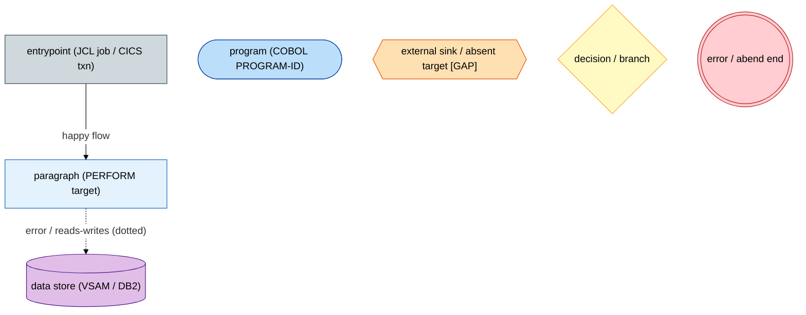
```mermaid
%%{init: {'theme': 'base', 'themeVariables': { 'edgeLabelBackground':'#ffffff' }}}%%
flowchart TD
  classDef job  fill:#cfd8dc,stroke:#37474f,color:#000;
  classDef prog fill:#bbdefb,stroke:#0d47a1,color:#000;
  classDef para fill:#e3f2fd,stroke:#1565c0,color:#000;
  classDef data fill:#e1bee7,stroke:#4a148c,color:#000;
  classDef ext  fill:#ffe0b2,stroke:#e65100,color:#000;
  classDef dec  fill:#fff9c4,stroke:#f9a825,color:#000;
  classDef err  fill:#ffcdd2,stroke:#b71c1c,color:#000;

  L_job["entrypoint (JCL job / CICS txn)"]:::job
  L_prog(["program (COBOL PROGRAM-ID)"]):::prog
  L_para["paragraph (PERFORM target)"]:::para
  L_data[("data store (VSAM / DB2)")]:::data
  L_ext{{"external sink / absent target [GAP]"}}:::ext
  L_dec{"decision / branch"}:::dec
  L_err((("error / abend end"))):::err
  L_job -->|"happy flow"| L_para
  L_para -. "error / reads-writes (dotted)" .-> L_data
```

**Node-id scheme (template §2).** Online entrypoint `TXN:<tranid>` (most tran ids are `[GAP]` — no CSD); program `<PROGRAM>`; paragraph `<PROGRAM>.<PARA>`; DB2 `DB2:<table>`; dataset `DSN:<name>`; record copybook `REC:<copybook>`; working storage `WS:<name>`; sinks `RPT:`/`MAIL:`. Business rules cited as `BR-006-xx` on edges. **No CICS FCT exists in the export**, so the physical cataloged DSN behind every VSAM handler is `[GAP]`; where a copybook header carried a logical ddname/DSN stub (e.g. `MYVNDMF`, `XX.MSTR.CAD`) it is shown as the symbolic name with the physical DSN tagged `[GAP]`.

---

## 3. System context

The DLZB anchor and the 41-program application surface share one substrate (the Marwood DCS framework) and one data tier (VSAM masters via DCS handlers + a thin DB2 cost/EDI layer). The surface is reached from terminals via CICS transaction ids that are **not bound in the export** (`[GAP]` — no CSD/PCT); it transfers internally by `EXEC CICS XCTL`/`LINK` driven through the `DCSCOMX` dispatcher; and it persists through file-handler subprograms (also `[GAP]` — only their copybook interfaces are present).

<!-- mmd:BP-006-context-call-graph -->
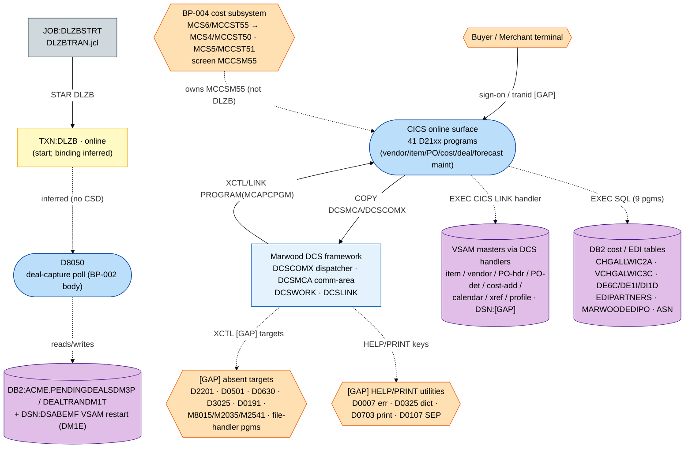
```mermaid
%%{init: {'theme': 'base', 'themeVariables': { 'edgeLabelBackground':'#ffffff' }}}%%
flowchart TD
  classDef job  fill:#cfd8dc,stroke:#37474f,color:#000;
  classDef prog fill:#bbdefb,stroke:#0d47a1,color:#000;
  classDef para fill:#e3f2fd,stroke:#1565c0,color:#000;
  classDef data fill:#e1bee7,stroke:#4a148c,color:#000;
  classDef ext  fill:#ffe0b2,stroke:#e65100,color:#000;
  classDef dec  fill:#fff9c4,stroke:#f9a825,color:#000;
  classDef err  fill:#ffcdd2,stroke:#b71c1c,color:#000;

  TERM{{"Buyer / Merchant terminal"}}:::ext
  JOB["JOB:DLZBSTRT<br/>DLZBTRAN.jcl"]:::job
  TXN["TXN:DLZB · online<br/>(start; binding inferred)"]:::dec
  D8050(["D8050<br/>deal-capture poll (BP-002 body)"]):::prog

  SURF(["CICS online surface<br/>41 D21xx programs<br/>(vendor/item/PO/cost/deal/forecast maint)"]):::prog
  FW["Marwood DCS framework<br/>DCSCOMX dispatcher · DCSMCA comm-area<br/>DCSWORK · DCSLINK"]:::para

  HND[("VSAM masters via DCS handlers<br/>item / vendor / PO-hdr / PO-det / cost-add /<br/>calendar / xref / profile · DSN:[GAP]")]:::data
  DB2[("DB2 cost / EDI tables<br/>CHGALLWIC2A · VCHGALWIC3C · DE6C/DE1I/DI1D<br/>EDIPARTNERS · MARWOODEDIPO · ASN")]:::data
  DEAL[("DB2:ACME.PENDINGDEALSDM3P / DEALTRANDM1T<br/>+ DSN:DSABEMF VSAM restart (DM1E)")]:::data

  GAPP{{"[GAP] absent targets<br/>D2201 · D0501 · D0630 · D3025 · D0191 ·<br/>M8015/M2035/M2541 · file-handler pgms"}}:::ext
  HELP{{"[GAP] HELP/PRINT utilities<br/>D0007 err · D0325 dict · D0703 print · D0107 SEP"}}:::ext
  COST{{"BP-004 cost subsystem<br/>MCS6/MCCST55 → MCS4/MCCST50 · MCS5/MCCST51<br/>screen MCCSM55"}}:::ext

  TERM -->|"sign-on / tranid [GAP]"| SURF
  JOB -->|"STAR DLZB"| TXN
  TXN -. "inferred (no CSD)" .-> D8050
  D8050 -. "reads/writes" .-> DEAL
  SURF -->|"COPY DCSMCA/DCSCOMX"| FW
  FW -->|"XCTL/LINK PROGRAM(MCAPCPGM)"| SURF
  SURF -. "EXEC CICS LINK handler" .-> HND
  SURF -. "EXEC SQL (9 pgms)" .-> DB2
  FW -. "XCTL [GAP] targets" .-> GAPP
  FW -. "HELP/PRINT keys" .-> HELP
  COST -. "owns MCCSM55 (not DLZB)" .-> SURF
```

**Anchor types.** `DLZB` = online (batch-initiated CICS transaction). The 41 application programs = online (each its own CICS transaction, tran ids `[GAP]`). No event/MQ or scheduled anchors in this surface.

---

## 4. Anchor & program-surface trace

### 4.A — DLZB entrypoint (program D8050)

`DLZBTRAN.jcl` (job `DLZBSTRT`) runs `EXEC PROC=CEMTBAT` and feeds SYSIPT `CICS @APPLGRP CIF0` / `STAR DLZB`, starting transaction **DLZB** in CICS appl-group CIF0 at region startup. The only program naming `DLZB` is **D8050** (`05 WS-TRAN-ID … VALUE 'DLZB'`). D8050 is the deal-capture poll whose body is owned by BP-002 (reads pending deals `DB2:ACME.PENDINGDEALSDM3P`, links `CM510ZO`, inserts `DB2:ACME.DEALTRANDM1T`, writes VSAM restart `DSN:DSABEMF` under `EXEC CICS ENQ RESOURCE(DM1E)`).

> **Finding — the DLZB self-reschedule is dead code in this export.** Change **C0027** ("RSSOFTWARE PIR 6103 — REMOVED THE INTERVAL START TASK LOGIC AND ADDED A START TASK FOR DL110Z") SCLM-excluded paragraph `U04100-START-DLZB` (the sole `EXEC CICS START TRANSID(WS-TRAN-ID)`) **and** the `WS-TRAN-ID VALUE 'DLZB'` line; its replacement target **`DL110Z` is absent** from the export. Three `PERFORM U04100-START-DLZB` call sites remain flagged but invoke an excluded paragraph. So the export contains **no live DLZB self-perpetuation** and **no live `EXEC CICS RETRIEVE`** of START data in D8050 (the only `RETRIEVE` in BP-006 scope is in MCCST55/MCS6). The `DLZB→D8050` binding is therefore **inferred and weak** `[GAP]`; treat as a decommissioned/relocated poll pending SME confirmation. The one live concurrency primitive is `ENQ/DEQ RESOURCE(DM1E)` serialising the restart-file write.

<!-- mmd:BP-006-TXN-DLZB-entry-call-graph -->
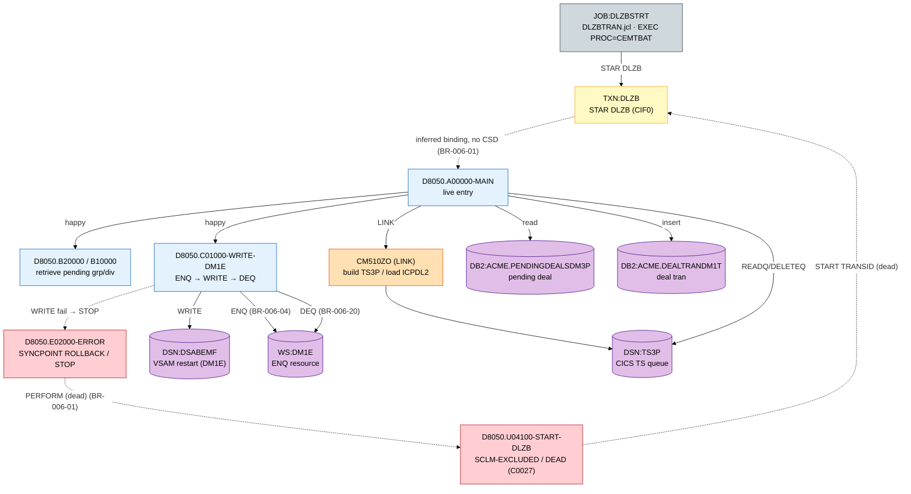
```mermaid
%%{init: {'theme': 'base', 'themeVariables': { 'edgeLabelBackground':'#ffffff' }}}%%
flowchart TD
  classDef job  fill:#cfd8dc,stroke:#37474f,color:#000;
  classDef prog fill:#bbdefb,stroke:#0d47a1,color:#000;
  classDef para fill:#e3f2fd,stroke:#1565c0,color:#000;
  classDef data fill:#e1bee7,stroke:#4a148c,color:#000;
  classDef ext  fill:#ffe0b2,stroke:#e65100,color:#000;
  classDef dec  fill:#fff9c4,stroke:#f9a825,color:#000;
  classDef err  fill:#ffcdd2,stroke:#b71c1c,color:#000;

  JOB["JOB:DLZBSTRT<br/>DLZBTRAN.jcl · EXEC PROC=CEMTBAT"]:::job
  TXN["TXN:DLZB<br/>STAR DLZB (CIF0)"]:::dec
  MAIN["D8050.A00000-MAIN<br/>live entry"]:::para
  GRP["D8050.B20000 / B10000<br/>retrieve pending grp/div"]:::para
  CM["CM510ZO (LINK)<br/>build TS3P / load ICPDL2"]:::ext
  WDM1E["D8050.C01000-WRITE-DM1E<br/>ENQ → WRITE → DEQ"]:::para
  E2["D8050.E02000-ERROR<br/>SYNCPOINT ROLLBACK / STOP"]:::err
  DEAD["D8050.U04100-START-DLZB<br/>SCLM-EXCLUDED / DEAD (C0027)"]:::err

  DM3P[("DB2:ACME.PENDINGDEALSDM3P<br/>pending deal")]:::data
  DM1T[("DB2:ACME.DEALTRANDM1T<br/>deal tran")]:::data
  DSAB[("DSN:DSABEMF<br/>VSAM restart (DM1E)")]:::data
  ENQ[("WS:DM1E<br/>ENQ resource")]:::data
  TS3P[("DSN:TS3P<br/>CICS TS queue")]:::data

  JOB -->|"STAR DLZB"| TXN
  TXN -. "inferred binding, no CSD (BR-006-01)" .-> MAIN
  MAIN -->|"read"| DM3P
  MAIN -->|"happy"| GRP
  MAIN -->|"LINK"| CM
  CM --> TS3P
  MAIN -->|"READQ/DELETEQ"| TS3P
  MAIN -->|"insert"| DM1T
  MAIN -->|"happy"| WDM1E
  WDM1E -->|"ENQ (BR-006-04)"| ENQ
  WDM1E -->|"WRITE"| DSAB
  WDM1E -->|"DEQ (BR-006-20)"| ENQ
  WDM1E -. "WRITE fail → STOP" .-> E2
  E2 -. "PERFORM (dead) (BR-006-01)" .-> DEAD
  DEAD -. "START TRANSID (dead)" .-> TXN
```

| Realized | BR | Evidence |
|---|---|---|
| ENQ serialisation of restart write | BR-006-04 / BR-006-20 | `D8050.C01000-WRITE-DM1E`: `EXEC CICS ENQ RESOURCE(DM1E)` … `DEQ RESOURCE(DM1E)` |
| DLZB start | BR-006-01 | `DLZBTRAN.jcl` `STAR DLZB`; in-program self-start **dead** (C0027) |
| RETRIEVE of START data | BR-006-02 | **not realized in D8050** (`[GAP]`; relocated to `DL110Z` `[GAP]` or removed) |

### 4.B — Marwood DCS framework layer (the shared substrate for all 41 programs)

The cross-cutting backbone is a single procedure-division source book, `sclm.perm.prod.copyproc/DCSCOMX.cpy` (internal `DCSCOMXS`), `COPY`'d into the surface (34/41 copy it directly; **41/41** drive its `COMMON-EXIT`). There are **zero inline `EXEC CICS XCTL`, `ENQ/DEQ`, or `RETRIEVE`** in the 41 application programs — transfer, serialisation, and pseudo-conversation are all delivered by this copybook.

- **Transfer.** A program sets `MOVE '<target>' TO COMX-PROGRAM` + `MOVE COMX-LINK|COMX-XCTL TO COMX-CODE`, then `GO TO COMMON-EXIT`. The dispatcher tests `COMX-CODE` and routes to `COMX-CICS-XCTL`, which issues the real `EXEC CICS XCTL PROGRAM(MCAPCPGM) COMMAREA(MCACOMMAREA)`. The literal target name lives in a `<Dxxxxp>` parameter copybook (`…-PROGRAM-NAME PIC X(8) VALUE 'Dxxxx'`). A logical **"LINK"** (down-level screen call) is implemented as **XCTL + stack-the-ACME-to-TSQ** (`MCAPCOMX`); real `EXEC CICS LINK` is used only to call file-handler / utility subprograms.
- **Pseudo-conversation.** `COMX-RETURN` issues `EXEC CICS RETURN TRANSID(SYSTEM-TRANSID) COMMAREA(MCACOMMAREA)`; on re-entry `BEGIN` reloads the stacked ACME from TS and re-dispatches on the `MCAPSEQ` resume code. The surface is **COMMAREA-driven, not START-data-driven** (0 `RETRIEVE`).
- **Serialisation (resolves BR-006-05).** `COMX-ENQ`/`COMX-DEQ` enqueue `DCS-ENQ-RESOURCE` = `ACME-ACME-DIV(2) + ACME-TERMINAL-LOCATION/WHSE(3) + DATASET-PO-HEADER + PO-key` — i.e. the **division/warehouse-scoped PO-header record**. **12 programs** reference the idiom (D2111, D2112, D2118, D2121, D2122, D2123, D2126, D2128, D2131, D2138, D2157, D2171); explicit `COMX-DEQ` only in D2131 and D2171 (D2171's vendor-level ENQ is commented out per C0022; others rely on syncpoint DEQ at task end). **The platform serialisation contract is a single logical resource: the PO-header record.** Vendor/item/cost/calendar updates are **not** ENQ-guarded — a concurrency gap (see §8).
- **Error idiom.** `MCAETMSG` (a 6-char id in `DCSMCA`, set as `'<pgm><letter>'`, e.g. `'D2147K'`) is the screen error-message key; `DCSFERR` is the VSAM error-message file layout (`XX.MSTR.ERR`); on the HELP key the framework LINKs to `D0007` (extended msg) / `D0325` (data dictionary), and on PRINT to `D0703` — **all absent `[GAP]`**. SQL errors use `EXEC SQL INCLUDE DBDB2ERL` + `DB2ERRP2`/`DB2GDP1`.

**DCS handler → entity map** (handler = copybook interface to a file-handler subprogram; the subprogram **and** the VSAM file are absent — `[GAP]` — only the copybook interface and a logical ddname are present):

| Handler (host / key / file) | Entity | Logical ddname / DSN stub | Physical DSN |
|---|---|---|---|
| `DCSHITMP` / `DCSKITMP` / `DCSFITM` | Item master | `MYSIMMF` (+AIX) | `[GAP]` |
| `DCSHVNDP` / `DCSKVNDP` / `DCSFVND`·`DCSFVNL` | Vendor master / list | `MYVNDMF` | `[GAP]` |
| `DCSHPOHP` / `DCSKPOHP` / `DCSFPOH` | PO header | `MYPOHMF` / `XX.MSTR.POH` | `[GAP]` |
| `DCSHPODP` / `DCSFPOD` | PO detail | `MYPODMF` / `XX.MSTR.POD` | `[GAP]` |
| `DCSFCAD` (direct VSAM) | Cost / deal (cost-add) | `XX.MSTR.CAD` (`DATASET-CD-COST-DEAL` +AIX1-4) | `[GAP]` |
| `DCSHCALP` / `DCSFSHP` | Shop calendar | `MYSHPMF` / `DATASET-SHOPCAL` | `[GAP]` |
| `DCSHCARP` / `DCSKCARP` | Carrier | `MYVNDMF` (shares vendor) | `[GAP]` |
| `DCSHBKRP` / `DCSKBKRP` | Broker | `MYVNDMF` (shares vendor) | `[GAP]` |
| `DCSHXRFP` | Item cross-reference | `MYREFMF` | `[GAP]` |
| `DCSHPROP` | Profile / promo | `MYPROMF` | `[GAP]` |
| `DCSHADMP` | Added-movement | `MYMHSMF` | `[GAP]` |
| `DCSHCCFP` | Company-control file | — | `[GAP]` |
| `DCSHEDDP` | Estimated-delivery-date | — | `[GAP]` |
| `DCSKMFGP` / `DCSKEANP` / `DCSKUPCP` | Mfg-part / EAN / UPC keys | (key translators, no file) | n/a |
| `DCSFWHS` | Warehouse | `XX.MSTR.WN2` | `[GAP]` |
| `DCSFOPR` / `DCSFTRM` | Operator / terminal | `XX.MSTR.OPR` | `[GAP]` |
| `DCSFRTV` | Vendor return | `XX.MSTR.RTV` | `[GAP]` |
| `DCSFERR` | Error message file | `XX.MSTR.ERR` | `[GAP]` |

<!-- mmd:BP-006-dcs-framework-call-graph -->
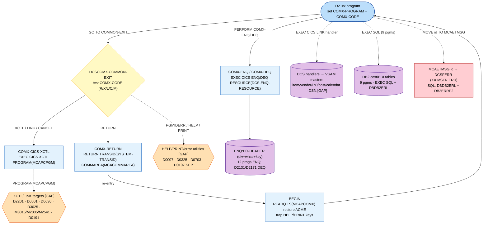
```mermaid
%%{init: {'theme': 'base', 'themeVariables': { 'edgeLabelBackground':'#ffffff' }}}%%
flowchart TD
  classDef job  fill:#cfd8dc,stroke:#37474f,color:#000;
  classDef prog fill:#bbdefb,stroke:#0d47a1,color:#000;
  classDef para fill:#e3f2fd,stroke:#1565c0,color:#000;
  classDef data fill:#e1bee7,stroke:#4a148c,color:#000;
  classDef ext  fill:#ffe0b2,stroke:#e65100,color:#000;
  classDef dec  fill:#fff9c4,stroke:#f9a825,color:#000;
  classDef err  fill:#ffcdd2,stroke:#b71c1c,color:#000;

  SURF(["D21xx program<br/>set COMX-PROGRAM + COMX-CODE"]):::prog
  COMMON{"DCSCOMX.COMMON-EXIT<br/>test COMX-CODE (R/X/L/C/M)"}:::dec
  XCTL["COMX-CICS-XCTL<br/>EXEC CICS XCTL PROGRAM(MCAPCPGM)"]:::para
  RET["COMX-RETURN<br/>RETURN TRANSID(SYSTEM-TRANSID)<br/>COMMAREA(MCACOMMAREA)"]:::para
  BEGINP["BEGIN<br/>READQ TS(MCAPCOMX) restore ACME<br/>trap HELP/PRINT keys"]:::para
  ENQP["COMX-ENQ / COMX-DEQ<br/>EXEC CICS ENQ/DEQ RESOURCE(DCS-ENQ-RESOURCE)"]:::para

  ENQRES[("ENQ:PO-HEADER (div+whse+key)<br/>12 progs ENQ; D2131/D2171 DEQ")]:::data
  HND[("DCS handlers → VSAM masters<br/>item/vendor/PO/cost/calendar · DSN:[GAP]")]:::data
  DB2[("DB2 cost/EDI tables<br/>9 pgms · EXEC SQL + DBDB2ERL")]:::data
  ERR["MCAETMSG id → DCSFERR (XX.MSTR.ERR)<br/>SQL: DBDB2ERL + DB2ERRP2"]:::err

  TARGETS{{"XCTL/LINK targets [GAP]<br/>D2201 · D0501 · D0630 · D3025 ·<br/>M8015/M2035/M2541 · D0191"}}:::ext
  HELP{{"HELP/PRINT/error utilities [GAP]<br/>D0007 · D0325 · D0703 · D0107 SEP"}}:::ext

  SURF -->|"GO TO COMMON-EXIT"| COMMON
  COMMON -->|"XCTL / LINK / CANCEL"| XCTL
  COMMON -->|"RETURN"| RET
  RET -->|"re-entry"| BEGINP
  BEGINP --> SURF
  XCTL -->|"PROGRAM(MCAPCPGM)"| TARGETS
  SURF -->|"PERFORM COMX-ENQ/DEQ"| ENQP
  ENQP --> ENQRES
  SURF -. "EXEC CICS LINK handler" .-> HND
  SURF -. "EXEC SQL (9 pgms)" .-> DB2
  SURF -. "MOVE id TO MCAETMSG" .-> ERR
  COMMON -. "PGMIDERR / HELP / PRINT" .-> HELP
```

### 4.C — Cluster: PO header & EDI maintenance (D2112, D2122, D2138)

Near-twin PO-header maintenance screens over the PO/vendor/carrier/broker handlers plus the shared PO record-access hub **D2138**. Both touch the four shared DB2 cost/class tables; **D2122** additionally owns the EDI-PO cancel logic (cursor over `MARWOODEDIPOBE1M`⋈`EDI_PO_TRK_BE5M`, then `UPDATE … SET VNDR_PO_CANCL_TS = CURRENT TIMESTAMP`). **D2138** is the most-shared subroutine in the surface — **15 callers** (D2101, D2112, D2113, D2116, D2118, D2122, D2128, D2131, D2133, D2135, D2143, D2147, D2160, D2175 + sibling D2138B) — a commarea-driven dispatcher (`D2138P-CALLING-CODE` I/P/T/R/O) wrapping `DCSHPOHP`/`DCSHPODP` record access and cost/charge-allowance accumulation; no SQL, no maps.

<!-- mmd:BP-006-cluster-po-header-edi-call-graph -->
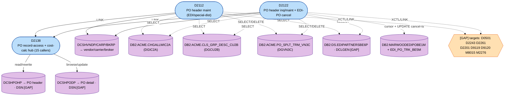
```mermaid
%%{init: {'theme': 'base', 'themeVariables': { 'edgeLabelBackground':'#ffffff' }}}%%
flowchart TD
  classDef job  fill:#cfd8dc,stroke:#37474f,color:#000;
  classDef prog fill:#bbdefb,stroke:#0d47a1,color:#000;
  classDef para fill:#e3f2fd,stroke:#1565c0,color:#000;
  classDef data fill:#e1bee7,stroke:#4a148c,color:#000;
  classDef ext  fill:#ffe0b2,stroke:#e65100,color:#000;
  classDef dec  fill:#fff9c4,stroke:#f9a825,color:#000;
  classDef err  fill:#ffcdd2,stroke:#b71c1c,color:#000;

  D2112(["D2112<br/>PO header maint (EDI/special-dist)"]):::prog
  D2122(["D2122<br/>PO header inq/maint + EDI-PO cancel"]):::prog
  D2138(["D2138<br/>PO record-access + cost-calc hub (15 callers)"]):::prog

  HPOH[("DCSHPOHP → PO header · DSN:[GAP]")]:::data
  HPOD[("DCSHPODP → PO detail · DSN:[GAP]")]:::data
  HVND[("DCSHVNDP/CARP/BKRP → vendor/carrier/broker")]:::data
  IC2A[("DB2:ACME.CHGALLWIC2A (DGIC2A)")]:::data
  CU2B[("DB2:ACME.CLS_GRP_DESC_CU2B (DGCU2B)")]:::data
  VN3C[("DB2:ACME.PO_SPLT_TRM_VN3C (DGVN3C)")]:::data
  BE6P[("DB2:DS.EDIPARTNERSBE6P · DCLGEN:[GAP]")]:::data
  EDI[("DB2:MARWOODEDIPOBE1M + EDI_PO_TRK_BE5M")]:::data
  GAPT{{"[GAP] targets: D0501 D2243 D2261<br/>D2201 D9119 D9120 M8015 M2276"}}:::ext

  D2112 -->|"LINK"| D2138
  D2122 -->|"LINK"| D2138
  D2138 -->|"read/rewrite"| HPOH
  D2138 -->|"browse/update"| HPOD
  D2112 --> HVND
  D2122 --> HVND
  D2112 -. "SELECT" .-> IC2A
  D2112 -. "SELECT" .-> CU2B
  D2112 -. "SELECT/DELETE" .-> VN3C
  D2112 -. "SELECT" .-> BE6P
  D2122 -. "SELECT" .-> IC2A
  D2122 -. "SELECT" .-> CU2B
  D2122 -. "SELECT/DELETE" .-> VN3C
  D2122 -. "SELECT" .-> BE6P
  D2122 -. "cursor + UPDATE cancel-ts" .-> EDI
  D2112 -. "XCTL/LINK" .-> GAPT
  D2122 -. "XCTL/LINK" .-> GAPT
```

<!-- mmd:BP-006-D2122-call-graph -->
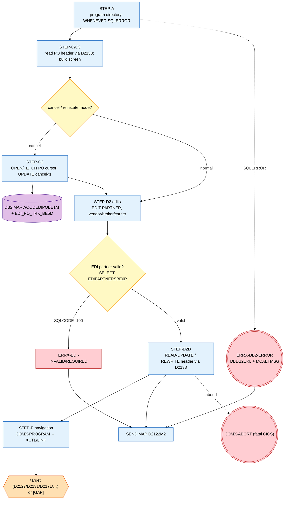
```mermaid
%%{init: {'theme': 'base', 'themeVariables': { 'edgeLabelBackground':'#ffffff' }}}%%
flowchart TD
  classDef job  fill:#cfd8dc,stroke:#37474f,color:#000;
  classDef prog fill:#bbdefb,stroke:#0d47a1,color:#000;
  classDef para fill:#e3f2fd,stroke:#1565c0,color:#000;
  classDef data fill:#e1bee7,stroke:#4a148c,color:#000;
  classDef ext  fill:#ffe0b2,stroke:#e65100,color:#000;
  classDef dec  fill:#fff9c4,stroke:#f9a825,color:#000;
  classDef err  fill:#ffcdd2,stroke:#b71c1c,color:#000;

  A["STEP-A<br/>program directory; WHENEVER SQLERROR"]:::para
  C["STEP-C/C3<br/>read PO header via D2138; build screen"]:::para
  C2{"cancel / reinstate mode?"}:::dec
  CANC["STEP-C2<br/>OPEN/FETCH PO cursor; UPDATE cancel-ts"]:::para
  EDI[("DB2:MARWOODEDIPOBE1M + EDI_PO_TRK_BE5M")]:::data
  D["STEP-D2 edits<br/>EDIT-PARTNER, vendor/broker/carrier"]:::para
  PART{"EDI partner valid?<br/>SELECT EDIPARTNERSBE6P"}:::dec
  UPD["STEP-D2D<br/>READ-UPDATE / REWRITE header via D2138"]:::para
  E["STEP-E navigation<br/>COMX-PROGRAM → XCTL/LINK"]:::para
  EXT{{"target (D2127/D2131/D2171/…) or [GAP]"}}:::ext
  SEND["SEND MAP D2122M2"]:::para
  EDB2((("ERRX-DB2-ERROR<br/>DBDB2ERL + MCAETMSG"))):::err
  EEDI["ERRX-EDI-INVALID/REQUIRED"]:::err
  ABORT((("COMX-ABORT (fatal CICS)"))):::err

  A --> C --> C2
  C2 -->|"cancel"| CANC --> EDI
  C2 -->|"normal"| D
  CANC --> D
  D --> PART
  PART -->|"SQLCODE=100"| EEDI --> SEND
  PART -->|"valid"| UPD --> E --> EXT
  UPD --> SEND
  A -. "SQLERROR" .-> EDB2 --> SEND
  UPD -. "abend" .-> ABORT
```

<!-- mmd:BP-006-D2112-call-graph -->
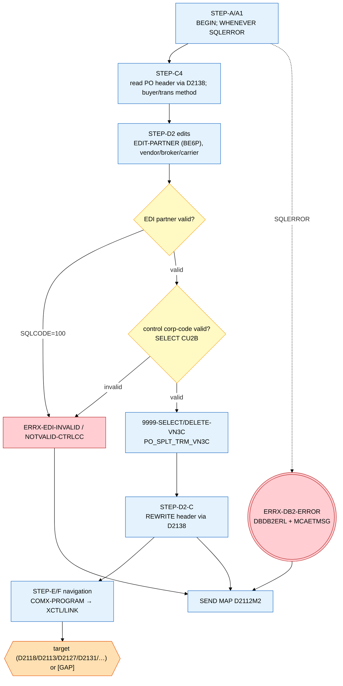
```mermaid
%%{init: {'theme': 'base', 'themeVariables': { 'edgeLabelBackground':'#ffffff' }}}%%
flowchart TD
  classDef job  fill:#cfd8dc,stroke:#37474f,color:#000;
  classDef prog fill:#bbdefb,stroke:#0d47a1,color:#000;
  classDef para fill:#e3f2fd,stroke:#1565c0,color:#000;
  classDef data fill:#e1bee7,stroke:#4a148c,color:#000;
  classDef ext  fill:#ffe0b2,stroke:#e65100,color:#000;
  classDef dec  fill:#fff9c4,stroke:#f9a825,color:#000;
  classDef err  fill:#ffcdd2,stroke:#b71c1c,color:#000;

  A["STEP-A/A1<br/>BEGIN; WHENEVER SQLERROR"]:::para
  C["STEP-C4<br/>read PO header via D2138; buyer/trans method"]:::para
  D["STEP-D2 edits<br/>EDIT-PARTNER (BE6P), vendor/broker/carrier"]:::para
  PART{"EDI partner valid?"}:::dec
  CTLCC{"control corp-code valid?<br/>SELECT CU2B"}:::dec
  SPLT["9999-SELECT/DELETE-VN3C<br/>PO_SPLT_TRM_VN3C"]:::para
  UPD["STEP-D2-C<br/>REWRITE header via D2138"]:::para
  E["STEP-E/F navigation<br/>COMX-PROGRAM → XCTL/LINK"]:::para
  EXT{{"target (D2118/D2113/D2127/D2131/…) or [GAP]"}}:::ext
  SEND["SEND MAP D2112M2"]:::para
  EDB2((("ERRX-DB2-ERROR<br/>DBDB2ERL + MCAETMSG"))):::err
  EEDI["ERRX-EDI-INVALID / NOTVALID-CTRLCC"]:::err

  A --> C --> D --> PART
  PART -->|"SQLCODE=100"| EEDI --> SEND
  PART -->|"valid"| CTLCC
  CTLCC -->|"invalid"| EEDI
  CTLCC -->|"valid"| SPLT --> UPD --> E --> EXT
  UPD --> SEND
  A -. "SQLERROR" .-> EDB2 --> SEND
```

### 4.D — Cluster: PO entry & processing (D2109, D2111, D2113, D2126, D2127, D2157)

Recommended-order / receiving / item-review screens. **D2113** (Recommended Review / Item Review) is the cluster hub (≈9 onward LINK/XCTL targets, incl. the only conditional `LINK`-vs-`XCTL` in the cluster, to D2112 on `EIBAID`). **D2111** (Recommended Order Maintenance) and **D2126** (Item Summary) and **D2157** (PO Recalc, a CICS-LINK subroutine) realize the canonical **ENQ-before-update** pattern on the PO-header record. **D2109** (Async PO Accept) fans out to the (absent) PO-print modules. No DB2 in this cluster — persistence is via DCS handlers + direct VSAM (`DCSFPOH`/`DCSFPOD`/`DCSFPCR`).

<!-- mmd:BP-006-cluster-po-entry-call-graph -->
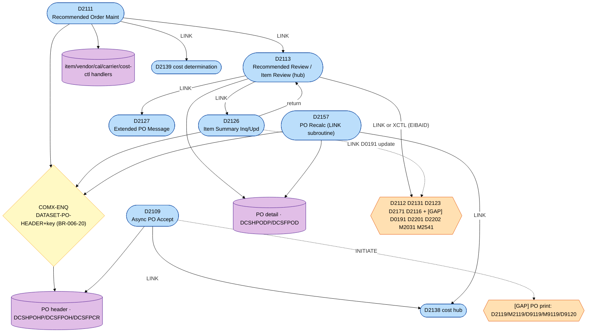
```mermaid
%%{init: {'theme': 'base', 'themeVariables': { 'edgeLabelBackground':'#ffffff' }}}%%
flowchart TD
  classDef job  fill:#cfd8dc,stroke:#37474f,color:#000;
  classDef prog fill:#bbdefb,stroke:#0d47a1,color:#000;
  classDef para fill:#e3f2fd,stroke:#1565c0,color:#000;
  classDef data fill:#e1bee7,stroke:#4a148c,color:#000;
  classDef ext  fill:#ffe0b2,stroke:#e65100,color:#000;
  classDef dec  fill:#fff9c4,stroke:#f9a825,color:#000;
  classDef err  fill:#ffcdd2,stroke:#b71c1c,color:#000;

  D2111(["D2111<br/>Recommended Order Maint"]):::prog
  D2113(["D2113<br/>Recommended Review / Item Review (hub)"]):::prog
  D2126(["D2126<br/>Item Summary Inq/Upd"]):::prog
  D2127(["D2127<br/>Extended PO Message"]):::prog
  D2109(["D2109<br/>Async PO Accept"]):::prog
  D2157(["D2157<br/>PO Recalc (LINK subroutine)"]):::prog

  ENQ{"COMX-ENQ<br/>DATASET-PO-HEADER+key (BR-006-20)"}:::dec
  POH[("PO header · DCSHPOHP/DCSFPOH/DCSFPCR")]:::data
  POD[("PO detail · DCSHPODP/DCSFPOD")]:::data
  AUX[("item/vendor/cal/carrier/cost-ctl handlers")]:::data
  D2138(["D2138 cost hub"]):::prog
  D2139(["D2139 cost determination"]):::prog
  PRINT{{"[GAP] PO print: D2119/M2119/D9119/M9119/D9120"}}:::ext
  OTHER{{"D2112 D2131 D2123 D2171 D2116 + [GAP] D0191 D2201 D2202 M2031 M2541"}}:::ext

  D2111 -->|"LINK"| D2113
  D2113 -->|"LINK"| D2126
  D2113 -->|"LINK"| D2127
  D2113 -->|"LINK or XCTL (EIBAID)"| OTHER
  D2126 -->|"return"| D2113
  D2111 --> ENQ
  D2126 --> ENQ
  D2157 --> ENQ
  ENQ --> POH
  D2113 --> POD
  D2111 --> AUX
  D2109 --> POH
  D2157 --> POD
  D2109 -->|"LINK"| D2138
  D2157 -->|"LINK"| D2138
  D2111 -->|"LINK"| D2139
  D2109 -. "INITIATE" .-> PRINT
  D2126 -. "LINK D0191 update" .-> OTHER
```

<!-- mmd:BP-006-D2113-call-graph -->
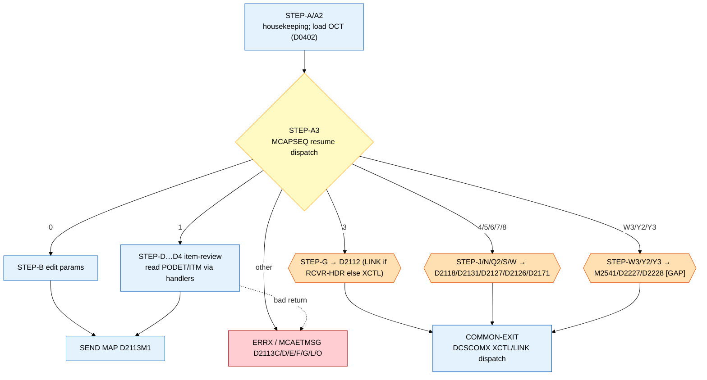
```mermaid
%%{init: {'theme': 'base', 'themeVariables': { 'edgeLabelBackground':'#ffffff' }}}%%
flowchart TD
  classDef job  fill:#cfd8dc,stroke:#37474f,color:#000;
  classDef prog fill:#bbdefb,stroke:#0d47a1,color:#000;
  classDef para fill:#e3f2fd,stroke:#1565c0,color:#000;
  classDef data fill:#e1bee7,stroke:#4a148c,color:#000;
  classDef ext  fill:#ffe0b2,stroke:#e65100,color:#000;
  classDef dec  fill:#fff9c4,stroke:#f9a825,color:#000;
  classDef err  fill:#ffcdd2,stroke:#b71c1c,color:#000;

  A["STEP-A/A2<br/>housekeeping; load OCT (D0402)"]:::para
  A3{"STEP-A3<br/>MCAPSEQ resume dispatch"}:::dec
  B["STEP-B edit params"]:::para
  D["STEP-D…D4 item-review<br/>read PODET/ITM via handlers"]:::para
  SEND["SEND MAP D2113M1"]:::para
  CE["COMMON-EXIT<br/>DCSCOMX XCTL/LINK dispatch"]:::para
  G{{"STEP-G → D2112 (LINK if RCVR-HDR else XCTL)"}}:::ext
  T{{"STEP-J/N/Q2/S/W → D2118/D2131/D2127/D2126/D2171"}}:::ext
  TG{{"STEP-W3/Y2/Y3 → M2541/D2227/D2228 [GAP]"}}:::ext
  ERR["ERRX / MCAETMSG D2113C/D/E/F/G/L/O"]:::err

  A --> A3
  A3 -->|"0"| B --> SEND
  A3 -->|"1"| D --> SEND
  A3 -->|"3"| G --> CE
  A3 -->|"4/5/6/7/8"| T --> CE
  A3 -->|"W3/Y2/Y3"| TG --> CE
  A3 -->|"other"| ERR
  D -. "bad return" .-> ERR
```

<!-- mmd:BP-006-D2157-call-graph -->
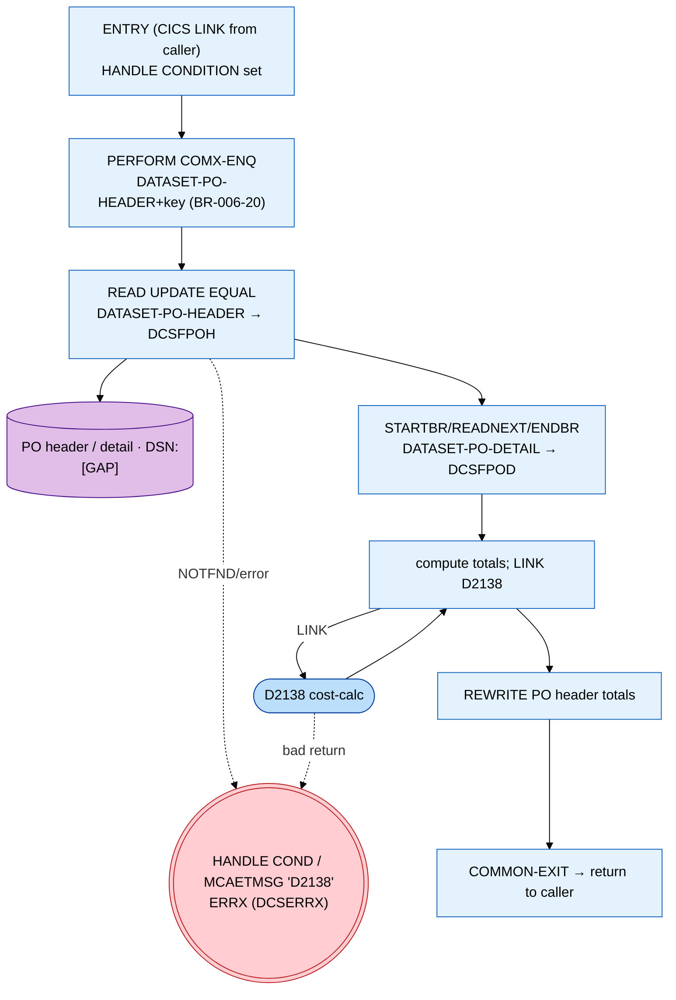
```mermaid
%%{init: {'theme': 'base', 'themeVariables': { 'edgeLabelBackground':'#ffffff' }}}%%
flowchart TD
  classDef job  fill:#cfd8dc,stroke:#37474f,color:#000;
  classDef prog fill:#bbdefb,stroke:#0d47a1,color:#000;
  classDef para fill:#e3f2fd,stroke:#1565c0,color:#000;
  classDef data fill:#e1bee7,stroke:#4a148c,color:#000;
  classDef ext  fill:#ffe0b2,stroke:#e65100,color:#000;
  classDef dec  fill:#fff9c4,stroke:#f9a825,color:#000;
  classDef err  fill:#ffcdd2,stroke:#b71c1c,color:#000;

  ENTRY["ENTRY (CICS LINK from caller)<br/>HANDLE CONDITION set"]:::para
  ENQ["PERFORM COMX-ENQ<br/>DATASET-PO-HEADER+key (BR-006-20)"]:::para
  RDH["READ UPDATE EQUAL<br/>DATASET-PO-HEADER → DCSFPOH"]:::para
  RDHD[("PO header / detail · DSN:[GAP]")]:::data
  BR["STARTBR/READNEXT/ENDBR<br/>DATASET-PO-DETAIL → DCSFPOD"]:::para
  CALC["compute totals; LINK D2138"]:::para
  D2138(["D2138 cost-calc"]):::prog
  REW["REWRITE PO header totals"]:::para
  RET["COMMON-EXIT → return to caller"]:::para
  ERR((("HANDLE COND / MCAETMSG 'D2138'<br/>ERRX (DCSERRX)"))):::err

  ENTRY --> ENQ --> RDH --> RDHD
  RDH --> BR --> CALC -->|"LINK"| D2138
  D2138 --> CALC
  CALC --> REW --> RET
  RDH -. "NOTFND/error" .-> ERR
  D2138 -. "bad return" .-> ERR
```

### 4.E — Cluster: PO cross-reference, receiver & item-PO (D2118, D2119, D2121, D2123, D2128, D2175)

Mixes interactive controllers (D2121 PO-management menu, D2123 Receiver-Summary, D2175 Buyer-Item-Maint) with callable server modules (D2118 Return-item Add, D2119 PO Print, D2128 PO Add). **The DB2 in the surface concentrates here**: item-status/FSVP gating (`DE6C`+`DI1D`+`DE1I` joins in D2118/D2128), the PO-legal-message cursor (`AP1R` in D2119), and the ASN received-quantity aggregate (`BE3B` in D2123). D2123 holds the cluster's only `XCTL` (conditional, to D2122) and the only `DBDB2ERT` (DB2-error formatter) LINK. D2118/D2128 both `LINK` the cost hub **D2138**.

<!-- mmd:BP-006-cluster-po-receiver-call-graph -->
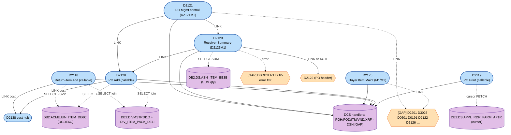
```mermaid
%%{init: {'theme': 'base', 'themeVariables': { 'edgeLabelBackground':'#ffffff' }}}%%
flowchart TD
  classDef job  fill:#cfd8dc,stroke:#37474f,color:#000;
  classDef prog fill:#bbdefb,stroke:#0d47a1,color:#000;
  classDef para fill:#e3f2fd,stroke:#1565c0,color:#000;
  classDef data fill:#e1bee7,stroke:#4a148c,color:#000;
  classDef ext  fill:#ffe0b2,stroke:#e65100,color:#000;
  classDef dec  fill:#fff9c4,stroke:#f9a825,color:#000;
  classDef err  fill:#ffcdd2,stroke:#b71c1c,color:#000;

  D2121(["D2121<br/>PO Mgmt control (D2121M1)"]):::prog
  D2123(["D2123<br/>Receiver Summary (D2123M1)"]):::prog
  D2175(["D2175<br/>Buyer Item Maint (M1/M2)"]):::prog
  D2118(["D2118<br/>Return-item Add (callable)"]):::prog
  D2119(["D2119<br/>PO Print (callable)"]):::prog
  D2128(["D2128<br/>PO Add (callable)"]):::prog
  D2138(["D2138 cost hub"]):::prog

  DE6C[("DB2:ACME.UIN_ITEM_DE6C (DGDE6C)")]:::data
  DIDE[("DB2:DIVMSTRDI1D + DIV_ITEM_PACK_DE1I")]:::data
  AP1R[("DB2:DS.APPL_RDR_PARM_AP1R (cursor)")]:::data
  BE3B[("DB2:DS.ASN_ITEM_BE3B (SUM qty)")]:::data
  HND[("DCS handlers: POH/POD/ITM/VND/XRF · DSN:[GAP]")]:::data
  DBERT{{"[GAP] DBDB2ERT DB2-error fmt"}}:::ext
  GAPT{{"[GAP] D2201 D3025 D0501 D0191 D2122 D2126 …"}}:::ext

  D2121 -->|"LINK"| D2123
  D2121 -->|"LINK"| D2128
  D2123 -->|"LINK or XCTL"| D2122_ext
  D2123 -->|"LINK"| D2128
  D2118 -->|"LINK cost"| D2138
  D2128 -->|"LINK cost"| D2138
  D2118 -. "SELECT FSVP" .-> DE6C
  D2128 -. "SELECT FSVP" .-> DE6C
  D2118 -. "SELECT join" .-> DIDE
  D2128 -. "SELECT join" .-> DIDE
  D2119 -. "cursor FETCH" .-> AP1R
  D2123 -. "SELECT SUM" .-> BE3B
  D2123 -. "error" .-> DBERT
  D2121 --> HND
  D2123 --> HND
  D2175 --> HND
  D2118 --> HND
  D2128 --> HND
  D2119 --> HND
  D2121 -. "LINK" .-> GAPT
  D2175 -. "LINK" .-> GAPT
  D2122_ext{{"D2122 (PO header)"}}:::ext
```

<!-- mmd:BP-006-D2128-call-graph -->
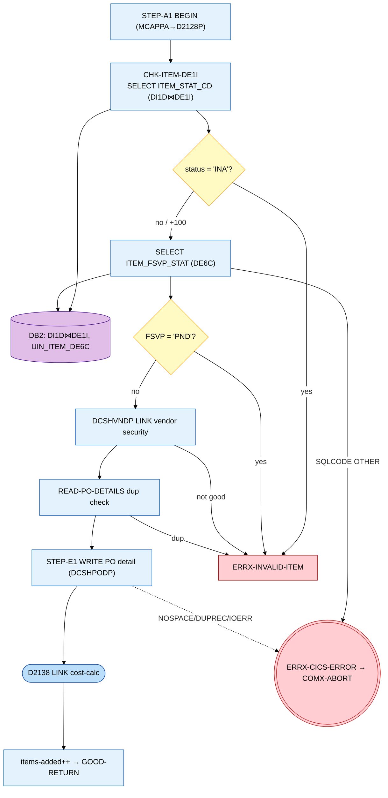
```mermaid
%%{init: {'theme': 'base', 'themeVariables': { 'edgeLabelBackground':'#ffffff' }}}%%
flowchart TD
  classDef job  fill:#cfd8dc,stroke:#37474f,color:#000;
  classDef prog fill:#bbdefb,stroke:#0d47a1,color:#000;
  classDef para fill:#e3f2fd,stroke:#1565c0,color:#000;
  classDef data fill:#e1bee7,stroke:#4a148c,color:#000;
  classDef ext  fill:#ffe0b2,stroke:#e65100,color:#000;
  classDef dec  fill:#fff9c4,stroke:#f9a825,color:#000;
  classDef err  fill:#ffcdd2,stroke:#b71c1c,color:#000;

  A["STEP-A1 BEGIN (MCAPPA→D2128P)"]:::para
  CHK["CHK-ITEM-DE1I<br/>SELECT ITEM_STAT_CD (DI1D⋈DE1I)"]:::para
  D1{"status = 'INA'?"}:::dec
  FSVP["SELECT ITEM_FSVP_STAT (DE6C)"]:::para
  DE[("DB2: DI1D⋈DE1I, UIN_ITEM_DE6C")]:::data
  D2{"FSVP = 'PND'?"}:::dec
  SEC["DCSHVNDP LINK vendor security"]:::para
  RPD["READ-PO-DETAILS dup check"]:::para
  WR["STEP-E1 WRITE PO detail (DCSHPODP)"]:::para
  D2138(["D2138 LINK cost-calc"]):::prog
  OK["items-added++ → GOOD-RETURN"]:::para
  EINV["ERRX-INVALID-ITEM"]:::err
  ECICS((("ERRX-CICS-ERROR → COMX-ABORT"))):::err

  A --> CHK --> DE
  CHK --> D1
  D1 -->|"yes"| EINV
  D1 -->|"no / +100"| FSVP --> DE
  FSVP -->|"SQLCODE OTHER"| ECICS
  FSVP --> D2
  D2 -->|"yes"| EINV
  D2 -->|"no"| SEC
  SEC -->|"not good"| EINV
  SEC --> RPD
  RPD -->|"dup"| EINV
  RPD --> WR --> D2138 --> OK
  WR -. "NOSPACE/DUPREC/IOERR" .-> ECICS
```

<!-- mmd:BP-006-D2119-call-graph -->
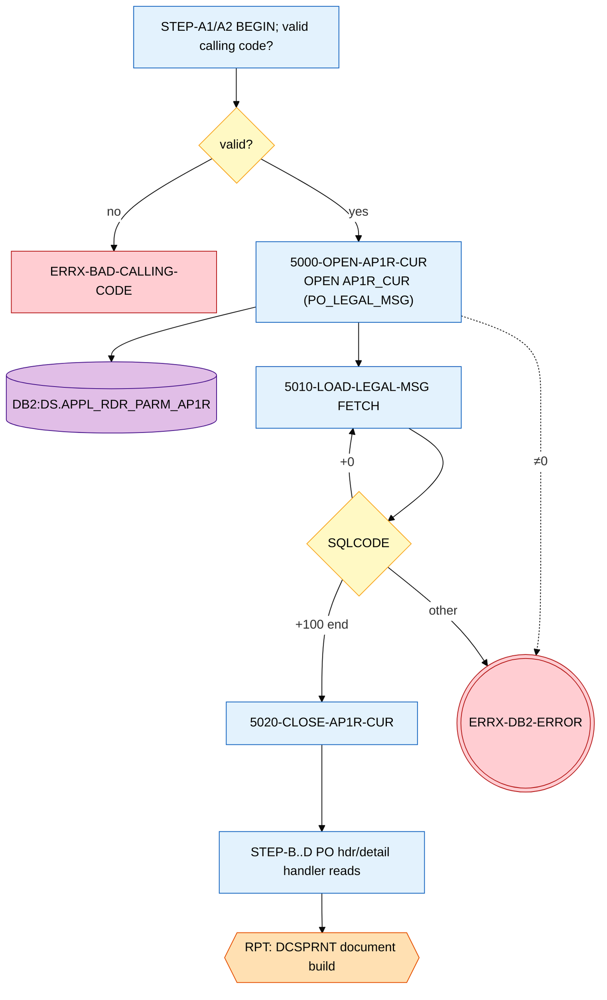
```mermaid
%%{init: {'theme': 'base', 'themeVariables': { 'edgeLabelBackground':'#ffffff' }}}%%
flowchart TD
  classDef job  fill:#cfd8dc,stroke:#37474f,color:#000;
  classDef prog fill:#bbdefb,stroke:#0d47a1,color:#000;
  classDef para fill:#e3f2fd,stroke:#1565c0,color:#000;
  classDef data fill:#e1bee7,stroke:#4a148c,color:#000;
  classDef ext  fill:#ffe0b2,stroke:#e65100,color:#000;
  classDef dec  fill:#fff9c4,stroke:#f9a825,color:#000;
  classDef err  fill:#ffcdd2,stroke:#b71c1c,color:#000;

  A["STEP-A1/A2 BEGIN; valid calling code?"]:::para
  BCC{"valid?"}:::dec
  EBCC["ERRX-BAD-CALLING-CODE"]:::err
  OPEN["5000-OPEN-AP1R-CUR<br/>OPEN AP1R_CUR (PO_LEGAL_MSG)"]:::para
  AP1R[("DB2:DS.APPL_RDR_PARM_AP1R")]:::data
  LOOP["5010-LOAD-LEGAL-MSG FETCH"]:::para
  DEC{"SQLCODE"}:::dec
  CLOSE["5020-CLOSE-AP1R-CUR"]:::para
  BODY["STEP-B..D PO hdr/detail handler reads"]:::para
  PRT{{"RPT: DCSPRNT document build"}}:::ext
  EDB2((("ERRX-DB2-ERROR"))):::err

  A --> BCC
  BCC -->|"no"| EBCC
  BCC -->|"yes"| OPEN --> AP1R
  OPEN -. "≠0" .-> EDB2
  OPEN --> LOOP --> DEC
  DEC -->|"+0"| LOOP
  DEC -->|"+100 end"| CLOSE
  DEC -->|"other"| EDB2
  CLOSE --> BODY --> PRT
```

### 4.F — Cluster: item cost-add & deal control (D2105, D2135, D2143, D2147, D2149, D2162)

The cost/deal heart of the surface, built on the **cost-add file `DCSFCAD`** (`DATASET-CD-COST-DEAL`, +AIX1-4). **D2143** (Item Cost Maintenance) is the only CRUD writer of the cost file (READ/WRITE/REWRITE/DELETE). **D2147** (Item Deal Maintenance / Deal Control — add/change/delete/inquire) and **D2135** (Cost Series inquiry) and **D2149** (User Deal) read it but **delegate the commit to `D0630`** (`[GAP]`, the cost-deal copy/update pipeline). **D2105** is the Vendor/Item Dictionary navigation hub (bidirectional with D2116/D2126/D2103). **D2162** (TIPS Truckload Discount) writes the item record via `DCSHITMP`. No DB2 in this cluster.

<!-- mmd:BP-006-cluster-item-cost-deal-call-graph -->
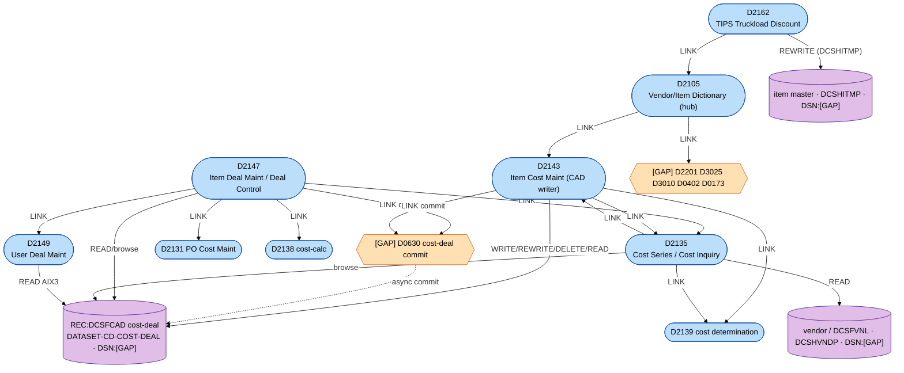
```mermaid
%%{init: {'theme': 'base', 'themeVariables': { 'edgeLabelBackground':'#ffffff' }}}%%
flowchart TD
  classDef job  fill:#cfd8dc,stroke:#37474f,color:#000;
  classDef prog fill:#bbdefb,stroke:#0d47a1,color:#000;
  classDef para fill:#e3f2fd,stroke:#1565c0,color:#000;
  classDef data fill:#e1bee7,stroke:#4a148c,color:#000;
  classDef ext  fill:#ffe0b2,stroke:#e65100,color:#000;
  classDef dec  fill:#fff9c4,stroke:#f9a825,color:#000;
  classDef err  fill:#ffcdd2,stroke:#b71c1c,color:#000;

  D2162(["D2162<br/>TIPS Truckload Discount"]):::prog
  D2105(["D2105<br/>Vendor/Item Dictionary (hub)"]):::prog
  D2147(["D2147<br/>Item Deal Maint / Deal Control"]):::prog
  D2143(["D2143<br/>Item Cost Maint (CAD writer)"]):::prog
  D2135(["D2135<br/>Cost Series / Cost Inquiry"]):::prog
  D2149(["D2149<br/>User Deal Maint"]):::prog
  D2131(["D2131 PO Cost Maint"]):::prog
  D2138(["D2138 cost-calc"]):::prog
  D2139(["D2139 cost determination"]):::prog
  D0630{{"[GAP] D0630 cost-deal commit"}}:::ext
  GAPT{{"[GAP] D2201 D3025 D3010 D0402 D0173"}}:::ext

  CAD[("REC:DCSFCAD cost-deal<br/>DATASET-CD-COST-DEAL · DSN:[GAP]")]:::data
  ITM[("item master · DCSHITMP · DSN:[GAP]")]:::data
  VND[("vendor / DCSFVNL · DCSHVNDP · DSN:[GAP]")]:::data

  D2162 -->|"LINK"| D2105
  D2105 -->|"LINK"| D2143
  D2105 -->|"LINK"| GAPT
  D2147 -->|"LINK"| D2131
  D2147 -->|"LINK"| D2135
  D2147 -->|"LINK"| D2149
  D2147 -->|"LINK commit"| D0630
  D2143 -->|"LINK commit"| D0630
  D2143 -->|"LINK"| D2135
  D2135 -->|"LINK"| D2143
  D2147 -->|"LINK"| D2138
  D2143 -->|"LINK"| D2139
  D2135 -->|"LINK"| D2139
  D2143 -->|"WRITE/REWRITE/DELETE/READ"| CAD
  D0630 -. "async commit" .-> CAD
  D2147 -->|"READ/browse"| CAD
  D2135 -->|"browse"| CAD
  D2149 -->|"READ AIX3"| CAD
  D2162 -->|"REWRITE (DCSHITMP)"| ITM
  D2135 -->|"READ"| VND
```

<!-- mmd:BP-006-D2147-call-graph -->
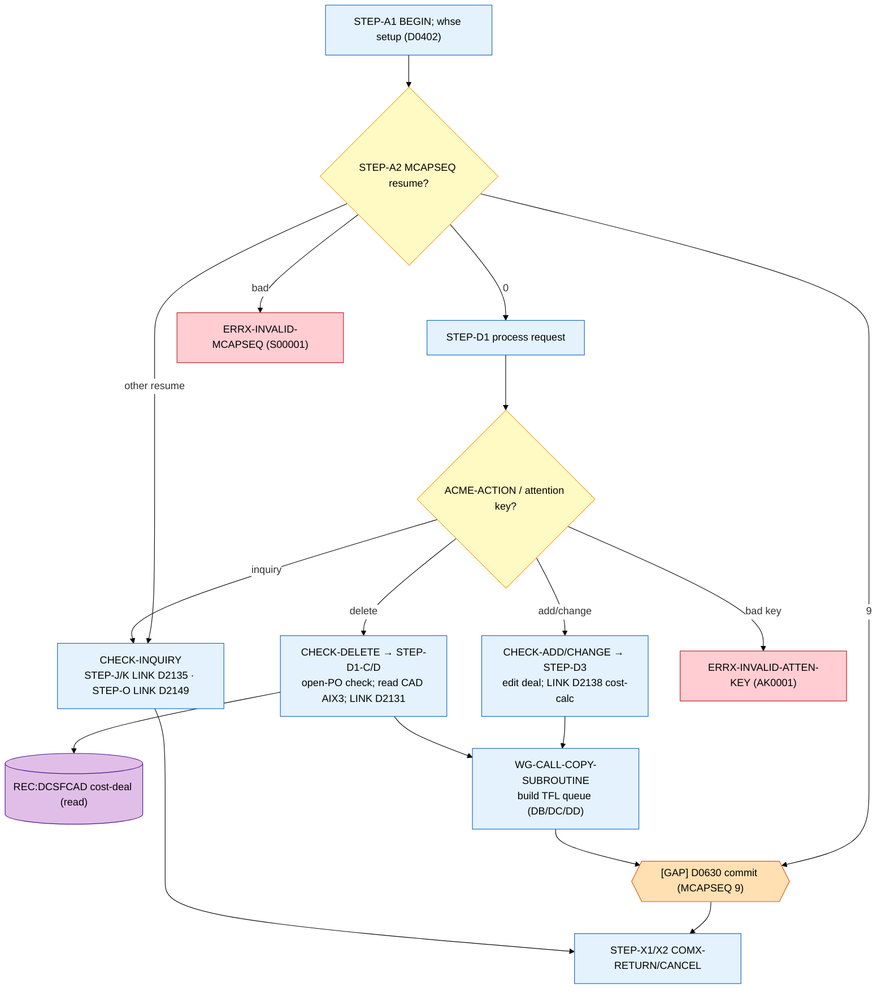
```mermaid
%%{init: {'theme': 'base', 'themeVariables': { 'edgeLabelBackground':'#ffffff' }}}%%
flowchart TD
  classDef job  fill:#cfd8dc,stroke:#37474f,color:#000;
  classDef prog fill:#bbdefb,stroke:#0d47a1,color:#000;
  classDef para fill:#e3f2fd,stroke:#1565c0,color:#000;
  classDef data fill:#e1bee7,stroke:#4a148c,color:#000;
  classDef ext  fill:#ffe0b2,stroke:#e65100,color:#000;
  classDef dec  fill:#fff9c4,stroke:#f9a825,color:#000;
  classDef err  fill:#ffcdd2,stroke:#b71c1c,color:#000;

  A["STEP-A1 BEGIN; whse setup (D0402)"]:::para
  A2{"STEP-A2 MCAPSEQ resume?"}:::dec
  D1["STEP-D1 process request"]:::para
  AK{"ACME-ACTION / attention key?"}:::dec
  ADD["CHECK-ADD/CHANGE → STEP-D3<br/>edit deal; LINK D2138 cost-calc"]:::para
  DEL["CHECK-DELETE → STEP-D1-C/D<br/>open-PO check; read CAD AIX3; LINK D2131"]:::para
  CAD[("REC:DCSFCAD cost-deal (read)")]:::data
  INQ["CHECK-INQUIRY<br/>STEP-J/K LINK D2135 · STEP-O LINK D2149"]:::para
  WG["WG-CALL-COPY-SUBROUTINE<br/>build TFL queue (DB/DC/DD)"]:::para
  D0630{{"[GAP] D0630 commit (MCAPSEQ 9)"}}:::ext
  X["STEP-X1/X2 COMX-RETURN/CANCEL"]:::para
  EMC["ERRX-INVALID-MCAPSEQ (S00001)"]:::err
  EAK["ERRX-INVALID-ATTEN-KEY (AK0001)"]:::err

  A --> A2
  A2 -->|"0"| D1
  A2 -->|"9"| D0630
  A2 -->|"other resume"| INQ
  A2 -->|"bad"| EMC
  D1 --> AK
  AK -->|"add/change"| ADD
  AK -->|"delete"| DEL --> CAD
  AK -->|"inquiry"| INQ
  AK -->|"bad key"| EAK
  ADD --> WG
  DEL --> WG
  WG --> D0630
  D0630 --> X
  INQ --> X
```

<!-- mmd:BP-006-D2135-call-graph -->
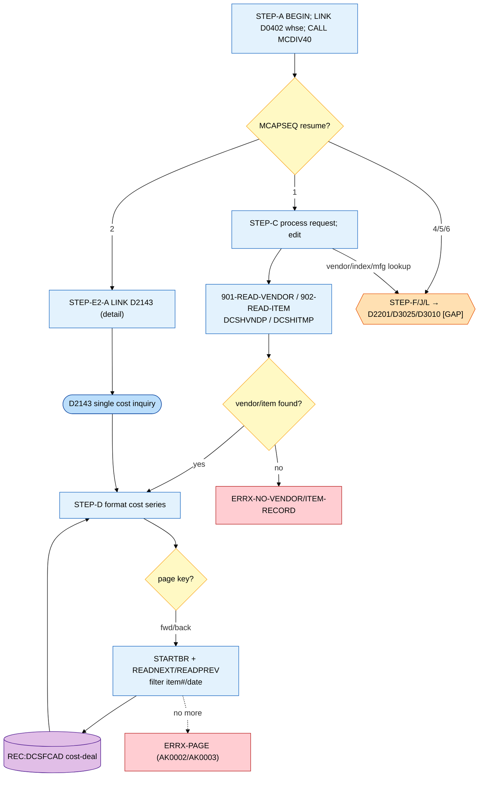
```mermaid
%%{init: {'theme': 'base', 'themeVariables': { 'edgeLabelBackground':'#ffffff' }}}%%
flowchart TD
  classDef job  fill:#cfd8dc,stroke:#37474f,color:#000;
  classDef prog fill:#bbdefb,stroke:#0d47a1,color:#000;
  classDef para fill:#e3f2fd,stroke:#1565c0,color:#000;
  classDef data fill:#e1bee7,stroke:#4a148c,color:#000;
  classDef ext  fill:#ffe0b2,stroke:#e65100,color:#000;
  classDef dec  fill:#fff9c4,stroke:#f9a825,color:#000;
  classDef err  fill:#ffcdd2,stroke:#b71c1c,color:#000;

  A["STEP-A BEGIN; LINK D0402 whse; CALL MCDIV40"]:::para
  A3{"MCAPSEQ resume?"}:::dec
  C["STEP-C process request; edit"]:::para
  RD["901-READ-VENDOR / 902-READ-ITEM<br/>DCSHVNDP / DCSHITMP"]:::para
  V{"vendor/item found?"}:::dec
  D["STEP-D format cost series"]:::para
  PG{"page key?"}:::dec
  BR["STARTBR + READNEXT/READPREV<br/>filter item#/date"]:::para
  CAD[("REC:DCSFCAD cost-deal")]:::data
  E2["STEP-E2-A LINK D2143 (detail)"]:::para
  D2143(["D2143 single cost inquiry"]):::prog
  XFER{{"STEP-F/J/L → D2201/D3025/D3010 [GAP]"}}:::ext
  ENV["ERRX-NO-VENDOR/ITEM-RECORD"]:::err
  EPG["ERRX-PAGE (AK0002/AK0003)"]:::err

  A --> A3
  A3 -->|"1"| C --> RD --> V
  V -->|"no"| ENV
  V -->|"yes"| D --> PG
  PG -->|"fwd/back"| BR --> CAD
  BR -. "no more" .-> EPG
  CAD --> D
  A3 -->|"2"| E2 --> D2143 --> D
  A3 -->|"4/5/6"| XFER
  C -->|"vendor/index/mfg lookup"| XFER
```

### 4.G — Cluster: item-master maintenance, deal & forecast/BuyEasy (D2116, D2145, D2184, D2187, D2188)

Item-detail and BuyEasy forecast/purchase-control screens. **D2116** (Extended Item Detail) is an inquiry/cross-reference resolver (UPC/EAN/MFG → item#). **D2145** (Deal Control) fronts D2147. **D2184**/**D2188** (Forecast Management — BuyEasy) and **D2187** (BuyEasy Purchase Control) **update** the item master (`DCSHITMP` REWRITE) and added-movement file (`DCSHADMP` WRITE/REWRITE), persisting forecast state to a CICS Temp-Storage queue (`D2169P`/`D2188P`). Live intra-cluster edges: D2116→D2188, D2187→D2188 (D2116→D2187 is commented out, replaced by `D0600`). **No SQL, no ENQ, no XCTL** — every transfer is a `COMX-LINK`; the update screens carry no program-level enqueue (concurrency delegated to the file handlers).

<!-- mmd:BP-006-cluster-item-forecast-call-graph -->
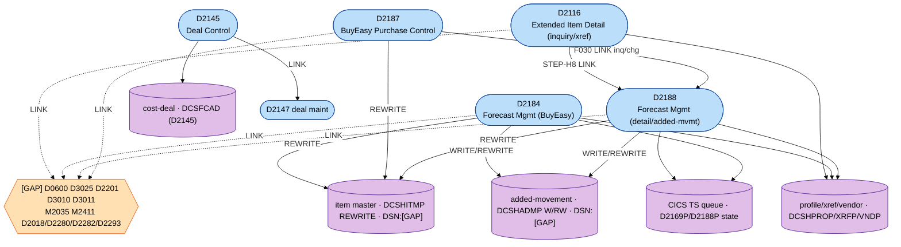
```mermaid
%%{init: {'theme': 'base', 'themeVariables': { 'edgeLabelBackground':'#ffffff' }}}%%
flowchart TD
  classDef job  fill:#cfd8dc,stroke:#37474f,color:#000;
  classDef prog fill:#bbdefb,stroke:#0d47a1,color:#000;
  classDef para fill:#e3f2fd,stroke:#1565c0,color:#000;
  classDef data fill:#e1bee7,stroke:#4a148c,color:#000;
  classDef ext  fill:#ffe0b2,stroke:#e65100,color:#000;
  classDef dec  fill:#fff9c4,stroke:#f9a825,color:#000;
  classDef err  fill:#ffcdd2,stroke:#b71c1c,color:#000;

  D2116(["D2116<br/>Extended Item Detail (inquiry/xref)"]):::prog
  D2145(["D2145<br/>Deal Control"]):::prog
  D2184(["D2184<br/>Forecast Mgmt (BuyEasy)"]):::prog
  D2187(["D2187<br/>BuyEasy Purchase Control"]):::prog
  D2188(["D2188<br/>Forecast Mgmt (detail/added-mvmt)"]):::prog

  ITM[("item master · DCSHITMP REWRITE · DSN:[GAP]")]:::data
  ADM[("added-movement · DCSHADMP W/RW · DSN:[GAP]")]:::data
  AUX[("profile/xref/vendor · DCSHPROP/XRFP/VNDP")]:::data
  CAD[("cost-deal · DCSFCAD (D2145)")]:::data
  TS[("CICS TS queue · D2169P/D2188P state")]:::data
  D2147(["D2147 deal maint"]):::prog
  GAPT{{"[GAP] D0600 D3025 D2201 D3010 D3011<br/>M2035 M2411 D2018/D2280/D2282/D2293"}}:::ext

  D2116 -->|"STEP-H8 LINK"| D2188
  D2187 -->|"F030 LINK inq/chg"| D2188
  D2145 -->|"LINK"| D2147
  D2116 -. "LINK" .-> GAPT
  D2184 -. "LINK"  .-> GAPT
  D2188 -. "LINK"  .-> GAPT
  D2187 -. "LINK"  .-> GAPT
  D2116 --> AUX
  D2145 --> CAD
  D2184 -->|"REWRITE"| ITM
  D2184 -->|"WRITE/REWRITE"| ADM
  D2187 -->|"REWRITE"| ITM
  D2188 -->|"REWRITE"| ITM
  D2188 -->|"WRITE/REWRITE"| ADM
  D2188 --> TS
  D2184 --> TS
  D2184 --> AUX
  D2188 --> AUX
```

<!-- mmd:BP-006-D2116-call-graph -->
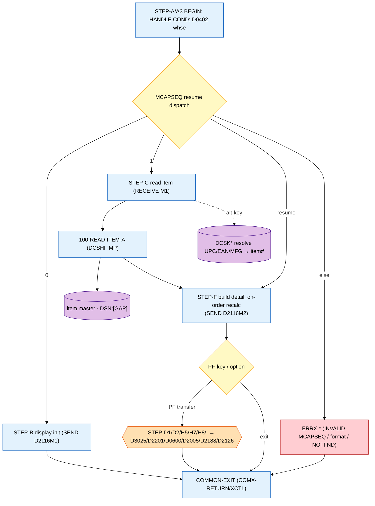
```mermaid
%%{init: {'theme': 'base', 'themeVariables': { 'edgeLabelBackground':'#ffffff' }}}%%
flowchart TD
  classDef job  fill:#cfd8dc,stroke:#37474f,color:#000;
  classDef prog fill:#bbdefb,stroke:#0d47a1,color:#000;
  classDef para fill:#e3f2fd,stroke:#1565c0,color:#000;
  classDef data fill:#e1bee7,stroke:#4a148c,color:#000;
  classDef ext  fill:#ffe0b2,stroke:#e65100,color:#000;
  classDef dec  fill:#fff9c4,stroke:#f9a825,color:#000;
  classDef err  fill:#ffcdd2,stroke:#b71c1c,color:#000;

  A["STEP-A/A3 BEGIN; HANDLE COND; D0402 whse"]:::para
  DISP{"MCAPSEQ resume dispatch"}:::dec
  B["STEP-B display init (SEND D2116M1)"]:::para
  C["STEP-C read item (RECEIVE M1)"]:::para
  RD["100-READ-ITEM-A (DCSHITMP)"]:::para
  ITM[("item master · DSN:[GAP]")]:::data
  KEYS[("DCSK* resolve UPC/EAN/MFG → item#")]:::data
  F["STEP-F build detail, on-order recalc<br/>(SEND D2116M2)"]:::para
  H{"PF-key / option"}:::dec
  XF{{"STEP-D1/D2/H5/H7/H8/I → D3025/D2201/D0600/D2005/D2188/D2126"}}:::ext
  X["COMMON-EXIT (COMX-RETURN/XCTL)"]:::para
  ERR["ERRX-* (INVALID-MCAPSEQ / format / NOTFND)"]:::err

  A --> DISP
  DISP -->|"0"| B --> X
  DISP -->|"1"| C --> RD --> ITM
  C -. "alt-key" .-> KEYS
  RD --> F --> H
  DISP -->|"resume"| F
  DISP -->|"else"| ERR
  H -->|"PF transfer"| XF --> X
  H -->|"exit"| X
  ERR --> X
```

<!-- mmd:BP-006-D2188-call-graph -->
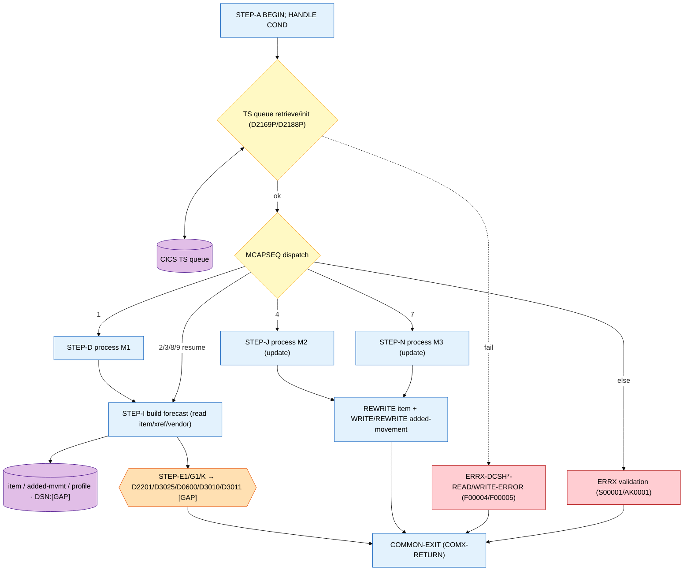
```mermaid
%%{init: {'theme': 'base', 'themeVariables': { 'edgeLabelBackground':'#ffffff' }}}%%
flowchart TD
  classDef job  fill:#cfd8dc,stroke:#37474f,color:#000;
  classDef prog fill:#bbdefb,stroke:#0d47a1,color:#000;
  classDef para fill:#e3f2fd,stroke:#1565c0,color:#000;
  classDef data fill:#e1bee7,stroke:#4a148c,color:#000;
  classDef ext  fill:#ffe0b2,stroke:#e65100,color:#000;
  classDef dec  fill:#fff9c4,stroke:#f9a825,color:#000;
  classDef err  fill:#ffcdd2,stroke:#b71c1c,color:#000;

  A["STEP-A BEGIN; HANDLE COND"]:::para
  TS{"TS queue retrieve/init (D2169P/D2188P)"}:::dec
  TSQ[("CICS TS queue")]:::data
  DISP{"MCAPSEQ dispatch"}:::dec
  D["STEP-D process M1"]:::para
  I["STEP-I build forecast (read item/xref/vendor)"]:::para
  ENT[("item / added-mvmt / profile · DSN:[GAP]")]:::data
  J["STEP-J process M2 (update)"]:::para
  N["STEP-N process M3 (update)"]:::para
  UPD["REWRITE item + WRITE/REWRITE added-movement"]:::para
  XF{{"STEP-E1/G1/K → D2201/D3025/D0600/D3010/D3011 [GAP]"}}:::ext
  X["COMMON-EXIT (COMX-RETURN)"]:::para
  ERRF["ERRX-DCSH*-READ/WRITE-ERROR (F00004/F00005)"]:::err
  ERRV["ERRX validation (S00001/AK0001)"]:::err

  A --> TS
  TS <--> TSQ
  TS -->|"ok"| DISP
  TS -. "fail" .-> ERRF
  DISP -->|"1"| D --> I --> ENT
  DISP -->|"4"| J --> UPD
  DISP -->|"7"| N --> UPD
  DISP -->|"2/3/8/9 resume"| I
  DISP -->|"else"| ERRV
  I --> XF --> X
  UPD --> X
  ERRF --> X
  ERRV --> X
```

### 4.H — Cluster: vendor, broker, returns & charge-allowance (D2115, D2131, D2136, D2142, D2171, D2173, D2174, D2178)

The vendor domain plus the DB2 charge-allowance authorization pair. **D2171** (Vendor Maintenance, ~15k lines, 3 screens) is the cluster hub, fanning out to D2115/D2136/D2142/D2172/D2174 + the dictionary `D2201` `[GAP]`; its only SQL is the EDI-850 partner SELECT (`EDIPARTNERSBE6P`, DCLGEN `[GAP]`). **D2131** (PO Cost Maintenance) and **D2142** (Vendor-level Cost removal) read the charge-allowance tables (`CHGALLWIC2A` code + `VCHGALWIC3C` authorization view) read-only and persist via VSAM rewrite of PO-header/detail (D2131) or vendor (D2142). **D2173** maintains broker via `DCSHBKRP`; **D2178** maintains vendor-return via `DCSFRTV`. `D0630` (vendor copy/clone) is referenced throughout but `[GAP]`.

<!-- mmd:BP-006-cluster-vendor-charge-allow-call-graph -->
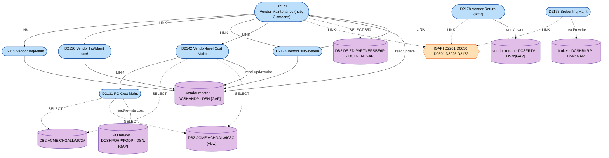
```mermaid
%%{init: {'theme': 'base', 'themeVariables': { 'edgeLabelBackground':'#ffffff' }}}%%
flowchart TD
  classDef job  fill:#cfd8dc,stroke:#37474f,color:#000;
  classDef prog fill:#bbdefb,stroke:#0d47a1,color:#000;
  classDef para fill:#e3f2fd,stroke:#1565c0,color:#000;
  classDef data fill:#e1bee7,stroke:#4a148c,color:#000;
  classDef ext  fill:#ffe0b2,stroke:#e65100,color:#000;
  classDef dec  fill:#fff9c4,stroke:#f9a825,color:#000;
  classDef err  fill:#ffcdd2,stroke:#b71c1c,color:#000;

  D2171(["D2171<br/>Vendor Maintenance (hub, 3 screens)"]):::prog
  D2115(["D2115 Vendor Inq/Maint"]):::prog
  D2136(["D2136 Vendor Inq/Maint scr6"]):::prog
  D2174(["D2174 Vendor sub-system"]):::prog
  D2178(["D2178 Vendor Return (RTV)"]):::prog
  D2173(["D2173 Broker Inq/Maint"]):::prog
  D2142(["D2142 Vendor-level Cost Maint"]):::prog
  D2131(["D2131 PO Cost Maint"]):::prog

  VND[("vendor master · DCSHVNDP · DSN:[GAP]")]:::data
  RTV[("vendor-return · DCSFRTV · DSN:[GAP]")]:::data
  POH[("PO hdr/det · DCSHPOHP/PODP · DSN:[GAP]")]:::data
  BKR[("broker · DCSHBKRP · DSN:[GAP]")]:::data
  IC2A[("DB2:ACME.CHGALLWIC2A")]:::data
  IC3C[("DB2:ACME.VCHGALWIC3C (view)")]:::data
  EDI[("DB2:DS.EDIPARTNERSBE6P · DCLGEN:[GAP]")]:::data
  GAPT{{"[GAP] D2201 D0630 D0501 D3025 D2172"}}:::ext

  D2171 -->|"LINK"| D2115
  D2171 -->|"LINK"| D2136
  D2171 -->|"LINK"| D2174
  D2171 -->|"LINK"| D2142
  D2171 -. "LINK" .-> GAPT
  D2174 -->|"LINK"| D2171
  D2142 -->|"LINK"| D2131
  D2173 -. "LINK" .-> GAPT
  D2178 -. "LINK" .-> GAPT
  D2171 -. "SELECT 850" .-> EDI
  D2142 -. "SELECT" .-> IC2A
  D2142 -. "SELECT" .-> IC3C
  D2131 -. "SELECT" .-> IC2A
  D2131 -. "SELECT" .-> IC3C
  D2171 -->|"read/update"| VND
  D2142 -->|"read-upd/rewrite"| VND
  D2131 -->|"read/rewrite cost"| POH
  D2178 -->|"write/rewrite"| RTV
  D2173 -->|"read/rewrite"| BKR
  D2115 --> VND
  D2136 --> VND
  D2174 --> VND
```

<!-- mmd:BP-006-D2131-call-graph -->
```mermaid
%%{init: {'theme': 'base', 'themeVariables': { 'edgeLabelBackground':'#ffffff' }}}%%
flowchart TD
  classDef job  fill:#cfd8dc,stroke:#37474f,color:#000;
  classDef prog fill:#bbdefb,stroke:#0d47a1,color:#000;
  classDef para fill:#e3f2fd,stroke:#1565c0,color:#000;
  classDef data fill:#e1bee7,stroke:#4a148c,color:#000;
  classDef ext  fill:#ffe0b2,stroke:#e65100,color:#000;
  classDef dec  fill:#fff9c4,stroke:#f9a825,color:#000;
  classDef err  fill:#ffcdd2,stroke:#b71c1c,color:#000;

  A["STEP-A BEGIN; read DIV-REC"]:::para
  C["STEP-C format screen from PO hdr/detail"]:::para
  SEND["SEND/RECEIVE MAP D2131M1"]:::para
  ENQ["PERFORM COMX-ENQ (PO-header)"]:::para
  D3A["STEP-D3-A READ-PO-HEADER-FOR-UPDATE"]:::para
  D3C["STEP-D3-C edit vendor-level CA"]:::para
  IC2A[("DB2:ACME.CHGALLWIC2A — READ-IC2A")]:::data
  IC3C[("DB2:ACME.VCHGALWIC3C — READ-IC3C")]:::data
  K1{"SQLCODE = 0?"}:::dec
  K2{"SQLCODE = 0?"}:::dec
  UPD["REWRITE PO header (DCSHPOHP) + detail (DCSHPODP); COMX-DEQ"]:::para
  RET["COMX-RETURN to caller"]:::para
  E1["ERRX-ELEM-TYPE (**INVALID**)"]:::err
  E2["ERRX-CA-NOT-AUTHORIZED"]:::err
  EDIV((("ERRX-DIVISION-NOTFND / ABEND"))):::err

  A --> C --> SEND --> ENQ --> D3A --> D3C
  D3C --> IC2A --> K1
  K1 -->|"yes"| IC3C --> K2
  K1 -->|"no"| E1 --> SEND
  K2 -->|"yes"| UPD --> RET
  K2 -->|"no"| E2 --> SEND
  A -. "DIV read fail" .-> EDIV
```

<!-- mmd:BP-006-D2171-call-graph -->
```mermaid
%%{init: {'theme': 'base', 'themeVariables': { 'edgeLabelBackground':'#ffffff' }}}%%
flowchart TD
  classDef job  fill:#cfd8dc,stroke:#37474f,color:#000;
  classDef prog fill:#bbdefb,stroke:#0d47a1,color:#000;
  classDef para fill:#e3f2fd,stroke:#1565c0,color:#000;
  classDef data fill:#e1bee7,stroke:#4a148c,color:#000;
  classDef ext  fill:#ffe0b2,stroke:#e65100,color:#000;
  classDef dec  fill:#fff9c4,stroke:#f9a825,color:#000;
  classDef err  fill:#ffcdd2,stroke:#b71c1c,color:#000;

  A["STEP-A BEGIN; WHENEVER SQLERROR → ERRX-DB2-ERROR"]:::para
  A3{"STEP-A3 MCAPSEQ dispatch"}:::dec
  B["STEP-B scr1 (D2171M1)"]:::para
  G["STEP-G scr2 / STEP-I scr3"]:::para
  K["STEP-K EDI/trade-partner edit"]:::para
  EDIQ[("DB2:DS.EDIPARTNERSBE6P (IEDID0='850')")]:::data
  CK{"SQLCODE = 100?"}:::dec
  POBR["browse PO (DCSHPOHP) open-PO check before delete"]:::para
  VUPD["update vendor master (DCSHVNDP)"]:::para
  XFER{"transfer out"}:::dec
  T{{"D2201 / D2142 / D2115 / D2136 / D2174 / D0630 [GAP]"}}:::ext
  EEDI["ERRX-EDI-INVALID"]:::err
  EDB2((("ERRX-DB2-ERROR"))):::err

  A --> A3
  A3 -->|"0"| B --> XFER
  A3 -->|"2/3"| G --> VUPD
  A3 -->|"4..6"| K --> EDIQ --> CK
  A3 -->|"1"| POBR --> VUPD
  CK -->|"yes (100)"| EEDI
  CK -->|"no"| VUPD
  VUPD --> XFER --> T
  EEDI -. "resend" .-> G
  A -. "SQLERROR" .-> EDB2
```

### 4.I — Cluster: small / miscellaneous CICS (D2110, D2139, D2141, D2146, D2161, D2198, D2199)

Smaller utility screens and the cost-determination subroutine. **D2139** (Cost Determination, LINK subroutine) is the real connectivity hub of the surface — **20 callers** (D2101, D2107, D2111, D2112, D2113, D2116, D2118, D2121, D2122, D2123, D2128, D2131, D2133, D2135, D2139B, D2142, D2143, D2147, D2160, D2174) — browsing cost-deal (`DCSFCAD`), reading vendor (`DCSHVNDP`), tables `DCST83`/`DCST88`. **D2141** (Cost/cross-ref Maintenance) is a screen hub LINKing the five `[GAP]` cost utilities (D2201/D3025/D2142/D2143/D3010) + static `CALL 'MCDIV40'`. **D2110**/**D2146** maintain warehouse records; **D2161** TIPS investment limits; **D2198**/**D2199** load/maintain the shop calendar (`DCSHCALP`). **D2110, D2141, D2146, D2161, D2198, D2199 have no observed transfer-in** (reached only via `[GAP]` PCT tran ids) → **suspected orphan-in-export**, *not* dead code.

<!-- mmd:BP-006-cluster-misc-cics-call-graph -->
```mermaid
%%{init: {'theme': 'base', 'themeVariables': { 'edgeLabelBackground':'#ffffff' }}}%%
flowchart TD
  classDef job  fill:#cfd8dc,stroke:#37474f,color:#000;
  classDef prog fill:#bbdefb,stroke:#0d47a1,color:#000;
  classDef para fill:#e3f2fd,stroke:#1565c0,color:#000;
  classDef data fill:#e1bee7,stroke:#4a148c,color:#000;
  classDef ext  fill:#ffe0b2,stroke:#e65100,color:#000;
  classDef dec  fill:#fff9c4,stroke:#f9a825,color:#000;
  classDef err  fill:#ffcdd2,stroke:#b71c1c,color:#000;

  PCT["CICS PCT / tranid (all [GAP])"]:::job
  D2110(["D2110 Whse inq/update (orphan?)"]):::prog
  D2146(["D2146 Whse/vendor-cost (orphan?)"]):::prog
  D2161(["D2161 TIPS invest limits (orphan?)"]):::prog
  D2198(["D2198 Shop-cal LOAD (orphan?)"]):::prog
  D2199(["D2199 Shop-cal MAINT (orphan?)"]):::prog
  D2141(["D2141 Cost/xref maint HUB (orphan?)"]):::prog
  D2139(["D2139 Cost Determination (LINK sub)"]):::prog

  CALLERS(["20 cost callers<br/>D2101/D2111/D2143/…"]):::prog
  WHS[("REC:DCSFWHS warehouse · DSN:[GAP]")]:::data
  CAD[("REC:DCSFCAD cost-deal · DSN:[GAP]")]:::data
  SHP[("REC:DCSFSHP shop-calendar · DSN:[GAP]")]:::data
  GAPT{{"[GAP] D2201 D3025 D2142 D2143 D3010 MCDIV40 D0402R"}}:::ext

  PCT -. "[GAP] tranid" .-> D2110
  PCT -. "[GAP]" .-> D2146
  PCT -. "[GAP]" .-> D2161
  PCT -. "[GAP]" .-> D2198
  PCT -. "[GAP]" .-> D2141
  D2198 -. "subr mode" .-> D2199
  CALLERS -->|"COPY D2139P · LINK"| D2139
  D2141 -. "LINK" .-> GAPT
  D2110 --> WHS
  D2146 --> WHS
  D2161 --> WHS
  D2198 --> SHP
  D2199 --> SHP
  D2139 --> CAD
  D2141 --> CAD
```

<!-- mmd:BP-006-D2141-call-graph -->
```mermaid
%%{init: {'theme': 'base', 'themeVariables': { 'edgeLabelBackground':'#ffffff' }}}%%
flowchart TD
  classDef job  fill:#cfd8dc,stroke:#37474f,color:#000;
  classDef prog fill:#bbdefb,stroke:#0d47a1,color:#000;
  classDef para fill:#e3f2fd,stroke:#1565c0,color:#000;
  classDef data fill:#e1bee7,stroke:#4a148c,color:#000;
  classDef ext  fill:#ffe0b2,stroke:#e65100,color:#000;
  classDef dec  fill:#fff9c4,stroke:#f9a825,color:#000;
  classDef err  fill:#ffcdd2,stroke:#b71c1c,color:#000;

  A["STEP-A1 BEGIN; D0402R security; CALL MCDIV40"]:::para
  A2{"STEP-A2 MCAPSEQ resume?"}:::dec
  B["STEP-B display (SEND D2141M1)"]:::para
  C["STEP-C RECEIVE + field edits"]:::para
  C2C["STEP-C2C item/vendor/xref lookup"]:::para
  CAD[("REC:DCSFCAD cost-deal read")]:::data
  SK{">1 SKU for MFG-part#?"}:::dec
  XF{{"LINK D2201 / D3025 / D2142 / D2143 / D3010 [GAP]"}}:::ext
  X["STEP-X1 return to caller"]:::para
  ERR["ERRX-* + MCAETMSG (resend D2141M1)"]:::err

  A --> A2
  A2 -->|"0"| B --> X
  A2 -->|"1"| C --> C2C --> CAD
  A2 -->|"2/3 resume"| C
  A2 -->|"4 vcost"| XF
  A2 -->|"5 icost"| XF
  A2 -->|"6 D3010"| C2C
  A2 -->|"else"| ERR
  C2C --> SK
  SK -->|"yes"| XF
  SK -->|"no"| XF
  XF --> X
  C -. "MAPFAIL" .-> ERR --> X
```

### 4.J — MCCSM55 screen reconciliation (cost subsystem, BP-004)

`MCCSM55.cpy` is the BMS symbolic map copied **only by `MCCST55`** — the BP-004 cost-message dispatcher running under transaction **`MCS6`** (`EXEC CICS RETURN TRANSID('MCS6')`). On ENTER it `RECEIVE MAP('MCCSM55')`, validates the division against `ACME.DIVMSTR` (`DI1D`), and routes by selected queue type: `IC1X` → `START TRANSID('MCS4')` / program `MCCST50`; `CAD` → `START TRANSID('MCS5')` / program `MCCST51`; DEBUG-mode does an immediate `XCTL` to the worker. **MCCSM55 is the cost-message debug/control console, not a DLZB deal/back-office maintenance screen** — the spec §1/§2.1 attribution is refuted.

| Field | Dir | Meaning |
|---|---|---|
| `PROGID` | out | program-id label (BMS default) |
| `DATIM` | out | formatted current date/time |
| `DIV` | in/out | 2-char division code, validated vs `ACME.DIVMSTR` |
| `IC1X` | in/out | select IC1X queue → MCS4/MCCST50 |
| `CAD` | in/out | select CADMF queue → MCS5/MCCST51 (exactly one of IC1X/CAD) |
| `DEBUG` | in/out | non-blank → XCTL to worker (debug) instead of async START |
| `MSG` | out | error/status line |

---

## 5. Data dictionary & external-interface inventory

**VSAM masters (via DCS handlers; no FCT → physical DSN `[GAP]`):** item (`DCSHITMP`/`MYSIMMF`), vendor (`DCSHVNDP`/`MYVNDMF`), PO header (`DCSHPOHP`/`MYPOHMF`), PO detail (`DCSHPODP`/`MYPODMF`), cost-deal (`DCSFCAD`/`XX.MSTR.CAD`), shop calendar (`DCSHCALP`/`DCSFSHP`), carrier/broker (share `MYVNDMF`), item cross-ref (`DCSHXRFP`/`MYREFMF`), profile (`DCSHPROP`/`MYPROMF`), added-movement (`DCSHADMP`/`MYMHSMF`), warehouse (`DCSFWHS`/`XX.MSTR.WN2`), operator/terminal (`DCSFOPR`/`XX.MSTR.OPR`), vendor-return (`DCSFRTV`/`XX.MSTR.RTV`), error-message file (`DCSFERR`/`XX.MSTR.ERR`).

**DB2 tables:** see the verified DCLGEN→table map in §2 (12 tables; `EDIPARTNERSBE6P` DCLGEN `[GAP]`). Access is read-only validation except: D2122 `UPDATE EDI_PO_TRK_BE5M` (cancel timestamp) and `DELETE PO_SPLT_TRM_VN3C`; D2112 `DELETE PO_SPLT_TRM_VN3C`. All other SQL is singleton `SELECT` or cursor `FETCH`.

**Record/control copybooks:** `DCSMCA` (comm-area), `DCSWORK` (work/constants/ENQ-resource), `DCSLINK`/`DCSLINK2` (linkage), `DCSCOMX` (dispatcher), `DCSFERR`/`DBDB2ERL`/`DB2ERRW2`/`DB2ERRP2`/`DB2GDW1`/`DB2GDP1` (error idiom), `DCST03…DCST102` (Marwood system tables), `D0173P`/`D0173R` (date routine), `D0402P`/`D0402R` (warehouse-security routine), `DCSPRNT`/`DCSPRNTP`/`DCSPRNTW` (print).

**CICS resources:** TS queues — `MCAPCOMX` (ACME stack for pseudo-conversation), per-conversation forecast state queues (`D2169P`/`D2188P`), and (D8050) `TS3P`. Tran ids: `DLZB` (anchor); all 41 application tran ids `[GAP]` (no CSD/PCT).

**External-interface table:**

| Endpoint | Id | Direction | Notes |
|---|---|---|---|
| Terminal / BMS screens | (per-program `DxxxxM*` maps) | in + out | pseudo-conversational; BMS macro source `[GAP]` (only symbolic-map copybooks present) |
| Print / report | `RPT:` via `DCSPRNT*` | out | D2119 PO print; handler program `[GAP]` |
| HELP / data-dictionary / print utilities | `D0007` / `D0325` / `D0703` | out (call) | **all absent `[GAP]`**; invoked by `DCSCOMX` on HELP/PRINT keys |
| MQ / event | — | — | **absent** in this surface (cost MQ transactions belong to BP-004) |

---

## 6. Reverse blast-radius maps

Counts from `rg -l '<pat>' docs/legacy/src/sclm.perm.prod.source | wc -l` (program members), split online (contains `EXEC CICS`) vs batch. Framework copybooks counted by `COPY +<cpy>\b`; **`DBDB2ERL` is pulled via `EXEC SQL INCLUDE`**, so its count uses `COPY|INCLUDE` (the bare `COPY` count of 3 badly understates it).

| Store | program fan-in | online / batch | modernization implication |
|---|--:|---|---|
| `DBDB2ERL` (DB2 error linkage) | **241** | 5 / 236 | Shop-wide SQL-error invariant; broadest of all. Batch-dominated; small online exposure. |
| `DB2:ACME.DIVMSTRDI1D` | **138** | 4 / 134 | Broadest data table (division master); mostly batch. |
| `DB2:ACME.UIN_ITEM_DE6C` | **72** | 4 / 68 | Item-identity; mostly batch. |
| `DCSWORK` | **62** | 43 / 19 | Framework WS skeleton — broadest COBOL `COPY`; touch last. |
| `DCSHVNDP` | **44** | 31 / 13 | Heaviest handler; vendor-master replacement hot spot. |
| `DCSMCA` | **41** | 41 / 0 | **Defines the online surface**; changing the comm-area contract = all-41 edit. |
| `DCSFERR` / `DCSFWHS` / `DCSFOPR` | 41 / 39 / 38 | online-heavy | error / warehouse / operator-context. |
| `DCSHITMP` / `DCSKVNDP` / `DCSKITMP` | 34 / 35 / 27 | online-heavy | item & vendor access paths. |
| `DCSHPOHP` / `DCSHPODP` / `DCSKPOHP` | 18 / 15 / 13 | online-heavy | PO domain. |
| `DCSFCAD` (cost-deal) | 22 | 10 / 12 | cost structure crosses the online↔batch boundary. |
| `DB2:ACME.CHGALLWIC2A` | 4 | 4 / 0 | charge-allowance — fully online; central to cost calc. |
| `DB2:DS.EDIPARTNERSBE6P` | 3 | 3 / 0 | EDI partner; fully online (DCLGEN `[GAP]`). |
| Deal stores: `ACME.PENDINGDEALSDM3P` / `ACME.DEALTRANDM1T` / `DM1E` | 33 / 1 / 1 | 1 / 32 ; 1/0 ; 1/0 | DLZB/D8050 reads DM3P (batch-shared), inserts DM1T, ENQ-writes DM1E (single online producer). |

> `DCSFVND` is **batch-only** (0 CICS): the online surface reaches the vendor master through the `DCSHVNDP` *host* handler, not the `DCSFVND` *record* copybook (which is used by 18 batch programs).

<!-- mmd:BP-006-blast-radius-call-graph -->
```mermaid
%%{init: {'theme': 'base', 'themeVariables': { 'edgeLabelBackground':'#ffffff' }}}%%
flowchart TD
  classDef job  fill:#cfd8dc,stroke:#37474f,color:#000;
  classDef prog fill:#bbdefb,stroke:#0d47a1,color:#000;
  classDef para fill:#e3f2fd,stroke:#1565c0,color:#000;
  classDef data fill:#e1bee7,stroke:#4a148c,color:#000;
  classDef ext  fill:#ffe0b2,stroke:#e65100,color:#000;
  classDef dec  fill:#fff9c4,stroke:#f9a825,color:#000;
  classDef err  fill:#ffcdd2,stroke:#b71c1c,color:#000;

  ONLINE(["Online surface (CICS, 41 pgms)"]):::prog
  BATCH["Batch surface (266 pgms)"]:::job

  DCSWORK[("DCSWORK framework WS · COPY x62")]:::data
  DCSMCA[("DCSMCA comm-area · COPY x41")]:::data
  DBDB2ERL[("DBDB2ERL DB2 err · INCLUDE x241")]:::data
  DCSHVNDP[("DCSHVNDP vendor handler · COPY x44")]:::data
  DCSHITMP[("DCSHITMP item handler · COPY x34")]:::data
  DIVMSTR[("DB2:ACME.DIVMSTRDI1D x138")]:::data
  UINITEM[("DB2:ACME.UIN_ITEM_DE6C x72")]:::data
  CHGALL[("DB2:ACME.CHGALLWIC2A x4 (online)")]:::data
  D8050(["D8050 / TXN:DLZB"]):::prog
  DM3P[("DB2:ACME.PENDINGDEALSDM3P x33")]:::data
  DM1T[("DB2:ACME.DEALTRANDM1T x1")]:::data
  DM1E[("DSN:DSABEMF restart (ENQ DM1E)")]:::data

  ONLINE -->|"x41"| DCSMCA
  ONLINE -->|"x43"| DCSWORK
  ONLINE -->|"x31"| DCSHVNDP
  ONLINE -->|"x21"| DCSHITMP
  ONLINE -->|"x5"| DBDB2ERL
  ONLINE -->|"x4"| DIVMSTR
  ONLINE -->|"x4"| UINITEM
  ONLINE -->|"x4"| CHGALL
  BATCH -->|"x236"| DBDB2ERL
  BATCH -->|"x134"| DIVMSTR
  BATCH -->|"x68"| UINITEM
  BATCH -->|"x19"| DCSWORK
  BATCH -->|"x13"| DCSHVNDP
  BATCH -->|"x32"| DM3P
  D8050 -->|"read x1"| DM3P
  D8050 -->|"INSERT x1"| DM1T
  D8050 -->|"ENQ/WRITE x1"| DM1E
  ONLINE -. "is" .-> D8050
```

---

## 7. End-to-end resolution summary

<!-- mmd:BP-006-e2e-call-graph -->
```mermaid
%%{init: {'theme': 'base', 'themeVariables': { 'edgeLabelBackground':'#ffffff' }}}%%
flowchart LR
  classDef job  fill:#cfd8dc,stroke:#37474f,color:#000;
  classDef prog fill:#bbdefb,stroke:#0d47a1,color:#000;
  classDef para fill:#e3f2fd,stroke:#1565c0,color:#000;
  classDef data fill:#e1bee7,stroke:#4a148c,color:#000;
  classDef ext  fill:#ffe0b2,stroke:#e65100,color:#000;
  classDef dec  fill:#fff9c4,stroke:#f9a825,color:#000;
  classDef err  fill:#ffcdd2,stroke:#b71c1c,color:#000;

  TERM{{"Buyer / Merchant terminal"}}:::ext
  TXN["TXN:[GAP] (per screen)<br/>+ TXN:DLZB (D8050)"]:::dec
  PROG(["D21xx maintenance program<br/>MCAPSEQ pseudo-conv state machine"]):::prog
  COMX["DCSCOMX dispatch<br/>XCTL/LINK · ENQ · RETURN"]:::para
  HND[("VSAM masters via DCS handlers · DSN:[GAP]")]:::data
  DB2[("DB2 cost/EDI tables (9 pgms)")]:::data
  SCR{{"BMS screen out / RPT: print"}}:::ext
  ERR((("MCAETMSG/DCSFERR · DBDB2ERL<br/>COMX-ABORT → D0107 SEP [GAP]"))):::err

  TERM -->|"tranid [GAP]"| TXN --> PROG --> COMX
  COMX -->|"XCTL/LINK next screen"| PROG
  PROG -. "LINK handler (read/update)" .-> HND
  PROG -. "EXEC SQL validate" .-> DB2
  PROG -->|"SEND MAP / print"| SCR --> TERM
  PROG -. "error/abend" .-> ERR
```

**Universal conventions.** (1) Every screen is a `MCAPSEQ`-keyed pseudo-conversational state machine re-entered via `RETURN TRANSID` + COMMAREA(ACME); (2) all inter-program control flow is `DCSCOMX`-mediated XCTL/LINK on `MCAPCPGM`; (3) data access is via DCS file-handler LINKs (VSAM) or direct embedded SQL (DB2); (4) serialisation is a single div/whse-scoped PO-header ENQ (12 programs); (5) errors set `MCAETMSG` and resend the map; fatal errors raise `COMX-ABORT` → `D0107` SEP `[GAP]`; SQL errors route through `DBDB2ERL`.

---

## 8. Assumptions, gaps & open questions

### Resolved against source

- **BR-006-01/02/03/04 (CICS primitives).** `STAR DLZB` starts DLZB (JCL grounded); `XCTL`/`RETRIEVE`/`ENQ` are *framework*-provided via `DCSCOMX`, not coded per program. `XCTL` (BR-006-03) is realized for all transfers; `ENQ` (BR-006-04) by 12 programs on the PO-header; **`RETRIEVE` (BR-006-02) is essentially absent** — the surface is COMMAREA-driven (0 `RETRIEVE` in the 41; D8050's is dead).
- **BR-006-05 (enumerate ENQ resources) — RESOLVED.** One logical resource: the division/warehouse-scoped **PO-header record** (`DCS-ENQ-RESOURCE` = div+whse+`DATASET-PO-HEADER`+key), enqueued via `COMX-ENQ` by D2111, D2112, D2118, D2121, D2122, D2123, D2126, D2128, D2131, D2138, D2157 (+ D2171's vendor ENQ commented out, C0022); explicit `COMX-DEQ` in D2131/D2171. D8050 separately ENQs `DM1E` (restart file).
- **BR-006-10/11/12 (D0007/D0325/D0703 utility contracts) — utilities ABSENT `[GAP]`.** The real error mechanism is `MCAETMSG` (id) → `DCSFERR` (`XX.MSTR.ERR`) → framework LINK to `D0007` on HELP; data-dictionary = `D0325` on HELP-on-field; print = `DCSPRNT*` + `D0703` on PRINT — all three utility programs are absent from the export.
- **BR-006-13 (D2112 common utility).** D2112 is a PO-header maintenance screen (EDI/special-dist variant), present; behaviour grounded.
- **BR-006-14 (D2122 corpus-empty).** D2122 is **present and substantial** (10,340 lines) — PO-header inquiry/maintenance + EDI-PO cancel; the "corpus-empty" status was a RAG artifact, not a source gap. Its DB2 footprint is the richest in the surface.
- **BR-006-21 (DB2 via `SYSPROC.DSCON03`) — REFUTED for online.** The 41 programs use direct embedded static SQL; `DSCON03` is batch-only (4 batch programs).
- **Anchor type.** DLZB is online (batch-initiated); the 41 are online. None is batch.
- **Spec corrections.** MCCSM55 → owned by MCCST55/MCS6 (BP-004 cost console), not DLZB deals (§4.J). Program roles corrected: D2131 = PO Cost Maint; D2184/D2188 = Forecast (BuyEasy); D2187 = BuyEasy Purchase Control; D2143 = Item Cost Maint (CAD writer); D2147 = Deal Control; D2105 = Vendor/Item Dictionary. D2138 has **15** callers (spec said ~11); D2139 has 20.

### Still open

- `[GAP]` **No CICS CSD/PCT/RDO and no FCT in the export** ⇒ (a) every application tran id is unknown; (b) `DLZB→D8050` binding is inferred; (c) the MQ cost mappings `MCS6→MCCST55`, `MCS4→MCCST50`, `MCS5→MCCST51` are inferred from `START/RETURN TRANSID` literals; (d) every VSAM physical DSN is unknown (only logical ddnames recovered).
- `[GAP]` **Absent transfer/utility targets** (interface copybooks present where noted): `D0007`, `D0325`, `D0703`, `D0107` (SEP), `D0501`, `D0630` (cost-deal commit pipeline — load-bearing for D2143/D2147), `D3025` (item dictionary, 10 callers), `D2201` (PO/vendor dictionary, 18 callers — most-referenced absent target), `D0191` (=`'RD16LB42'`), `D0402R`, `D0173`, `D3010`/`D3011`, `D2102`/`D2103`/`D2108`/`D2124`/`D2172`/`D2202`/`D2227`/`D2228`/`D2243`/`D2261`/`D2280`/`D2282`/`D2293`/`D2018`/`D2005`/`D9005`/`D9006`/`D9119`/`D9120`/`M2031`/`M2035`/`M2119`/`M2276`/`M2411`/`M2541`/`M8015`/`M9119`/`M9091`, `MCDIV40`, and the DCS file-handler subprograms behind every `DCSH*`/`DCSK*`. Also `DL110Z` (D8050's relocated START target) and `CM510ZO`.
- `[GAP]` **`DGBE6P` DCLGEN absent** for `DS.EDIPARTNERSBE6P` (verified via inline `DCLEDIPARTNERSBE6P` only).
- `[CODMOD]` **D8050 SCLM-exclusion inconsistency** — `U04100-START-DLZB` and `WS-TRAN-ID` are `"`-excluded yet three `PERFORM`s remain; confirm against the compiled member whether DLZB self-start is truly removed.
- `[CODMOD]` **BMS map enumeration** — only symbolic-map copybooks (`DxxxxM*`) are present; the 56 BMS macro sources are absent. Per-program map field validations (BR-006-06) need the macro source or an SME baseline.
- **Concurrency `[SME]`.** The platform ENQ contract covers **only** the PO-header record. Vendor/item/cost-deal/calendar updates (e.g. D2143 CAD CRUD, D2184/D2187/D2188 item REWRITE, D2198/D2199 calendar) are **not** ENQ-guarded at the program level — confirm whether the absent file-handler subprograms enqueue internally, or whether this is an accepted last-writer-wins risk (BR-006-20).
- **Orphans `[SME]`/`[CODMOD]`.** D2110, D2141, D2146, D2161, D2198, D2199 have no transfer-in in the export — confirm their tran ids exist in the live CSD (suspected orphan-in-export, not dead).
- `[SME]` Peak concurrent online users; RACF group → screen authorization model; in-place CICS modernization vs web-UI migration (per spec §7).

---

## 9. Source index

| Artifact | Path |
|---|---|
| Anchor JCL | `docs/legacy/src/acme.perm.jcl/DLZBTRAN.jcl` |
| Anchor program (BP-002 body) | `docs/legacy/src/sclm.perm.prod.source/D8050.cbl` |
| 41 CICS programs | `docs/legacy/src/sclm.perm.prod.source/{D2105,D2109,D2110,D2111,D2112,D2113,D2115,D2116,D2118,D2119,D2121,D2122,D2123,D2126,D2127,D2128,D2131,D2135,D2136,D2138,D2139,D2141,D2142,D2143,D2145,D2146,D2147,D2149,D2157,D2161,D2162,D2171,D2173,D2174,D2175,D2178,D2184,D2187,D2188,D2198,D2199}.cbl` |
| Cost subroutine siblings | `docs/legacy/src/sclm.perm.prod.source/{D2138B,D2139B}.cbl` |
| Cost console (BP-004) | `docs/legacy/src/sclm.perm.prod.source/MCCST55.cbl` |
| BMS symbolic map | `docs/legacy/src/sclm.perm.prod.copy/MCCSM55.cpy` |
| Framework dispatcher | `docs/legacy/src/sclm.perm.prod.copyproc/DCSCOMX.cpy` |
| Comm-area / work / linkage | `docs/legacy/src/sclm.perm.prod.copy/{DCSMCA,DCSWORK,DCSLINK,DCSLINK2}.cpy` |
| DCS handlers (host/key/file) | `docs/legacy/src/sclm.perm.prod.copy/DCS{H,K,F}*.cpy` |
| Error idiom | `docs/legacy/src/sclm.perm.prod.copy/{DCSFERR,DBDB2ERL,DB2ERRW2}.cpy`; `.../sclm.perm.prod.copyproc/{DB2ERRP2,DB2GDW1,DB2GDP1}.cpy` |
| Program-param copybooks | `docs/legacy/src/sclm.perm.prod.copy/D????P.cpy` (e.g. `D2131P`, `D0630P`, `D0501P`, `M2035P`) |
| Date / whse-security / print | `docs/legacy/src/sclm.perm.prod.copy/{D0173P,D0402P,DCSPRNTP,DCSPRNTW}.cpy`; `.../copyproc/{D0173R,D0402R,DCSPRNT}.cpy` |
| DCLGEN copybooks | `docs/legacy/src/DB2P.PERM.DCLGEN/{DGIC2A,DGIC3C,DGCU2B,DGVN3C,DGDE6C,DGDI1D,DGDE1I,DGAP1R,DGBE3B,DGBE1M,DGBE5M}.cpy` (`DGBE6P` absent) |
| Diagrams | `docs/legacy/03-technical/specs/BP-006/diagrams/*.mmd` + `*.svg` |
