# BP-006 — CICS Online Surface: Business-Process Graph

**Status:** Draft — process-graph re-projection of the extracted business logic (`BL-006-MM`), grounded in the call-dependency graph and mainframe source under `docs/legacy/src`.
**Conforms to:** [`reference/process-graph-meta-model.md`](../../../../../reference/process-graph-meta-model.md) (element vocabulary §3, purity axioms §4, rule→element taxonomy §5, canonical legacy patterns §6, FSM projection §7, conformance §8). That meta-model is **authoritative**; this document applies it.
**Companion to:** [BP-006-cics-online-surface-business-logic.md](BP-006-cics-online-surface-business-logic.md) (the primary input — the `BL-006-MM` rules this graph re-projects) · [BP-006-cics-online-surface-call-graph.md](BP-006-cics-online-surface-call-graph.md) (data-node and endpoint confirmation) · [BP-006-cics-online-surface.md](../BP-006-cics-online-surface.md) (overview).
**Scope:** the Marwood-DCS CICS online surface — the batch-initiated `DLZB` anchor plus the 41-program `D21xx` application family. Because the surface is a *mesh* of pseudo-conversational maintenance/inquiry screens over one shared framework, the graph is partitioned into a **platform substrate** (Process P) and the seven functional clusters (Processes A–G), one sub-graph per end-to-end process. The 123 rules `BL-006-01 … 129` (bands per §1.6 of the business-logic spec) each map to **exactly one** flow node, in its home sub-graph.

---

## 1. Working meta-model summary (the reference is authoritative)

A *business-process graph* re-expresses a process's extracted business logic as a **pure process model**: it strips file/cursor/DB2/CICS mechanics and renders the *what* as a directed graph with formal (Petri-net token) execution semantics, plus a derived FSM. The full rules live in `reference/process-graph-meta-model.md`; the essentials applied here:

- **Axiom of separation (§2.2).** Work and routing are disjoint. An **Activity** never branches (one in / one out); a **Gateway** performs no work and owns no data; a branch **condition** lives on the sequence flow leaving a gateway.
- **Token semantics (§2.1).** One token at the Start; XOR emits on exactly one guarded flow; AND forks/joins all; IOR emits on every flow whose guard holds and the join synchronises exactly the set that fired; the instance completes when no token remains.
- **Total coverage.** Every `BL-006-MM` maps to **exactly one** flow node (Task / Business-Rule Task / Gateway / IOR / MI-or-Loop Sub-Process / Error-Boundary). The per-process rule→element tables (and §11) are the evidence.
- **Purity (§4, P1–P9).** Bounded (one Start/pool, every path reaches an End); activity 1-in/1-out; gateways route-only; XOR guards mutually exclusive + exhaustive (a default/otherwise for totality); SESE block structure (every split has a matching same-type join, nested not overlapping); soundness; loops only inside Loop/MI sub-processes; exceptions as `Error Boundary → Error End`; sequence flow never crosses a pool.
- **Data & integration identity (§3.3.1, §3.5).** Every Data node carries a typed id (`DSN:`/`DB2:`/`REC:`/`WS:`) or `[derived]`/`[sink]`; no orphan transient/derived data. Every external participant is a black-box Pool reached **only** by Message Flow, with an endpoint id (`MQ:`/`API:`/`HOOK:`/`MAIL:`/`RPT:`/`FT:`) and direction/style/delivery/failure attributes.

### 1.1 This surface — modelling stance

This is an **online pseudo-conversational** surface, not a batch pipeline. Two consequences shape every sub-graph:

1. **The platform conventions are realised once, in Process P, and only *cited* by the clusters.** A cluster's soft validation failure ends at the shared screen-error idiom (`BL-006-06`); a genuine DB2 error routes through the shared SQL-error idiom (`BL-006-07`); an operational hard-fault raises the shared §6.4 `Error Boundary → Error End` (`BL-006-08`); inter-program transfer / yield / link-down / cancel-up are the dispatcher outcomes (`BL-006-02/03/14`) and the PO-header lock is `BL-006-04/05`. Clusters reference these as shared Ends / outcome events rather than re-noding them — so each rule is still realised exactly once (in P), and total coverage is exact.
2. **A "process" is the end-to-end maintenance/inquiry flow of a cluster**, composed of several screen/subroutine sub-flows. Each sub-flow is a single-entry/single-exit region with its own Start (a terminal turn or a subroutine LINK) and its own End set; they share the cluster's Data Stores but no control token.

### 1.2 Mermaid rendering legend (§3.4, used verbatim in every block)

```
%%{init: {'theme': 'base'}}%%
flowchart TD
  classDef ev   fill:#c8e6c9,stroke:#1b5e20,color:#000;
  classDef task fill:#bbdefb,stroke:#0d47a1,color:#000;
  classDef gw   fill:#fff9c4,stroke:#f9a825,color:#000;
  classDef err  fill:#ffcdd2,stroke:#b71c1c,color:#000;
  classDef data fill:#e1bee7,stroke:#4a148c,color:#000;
  classDef sub  fill:#d7ccc8,stroke:#3e2723,color:#000;
  classDef ext  fill:#ffe0b2,stroke:#e65100,color:#000;
```

| BPMN element | Mermaid shape | Class | Label convention |
|---|---|---|---|
| Event (start/end/intermediate) | `(("…"))` circle | `ev` | `None Start · <trigger>` / `None End · <outcome>` |
| Error End | `((("…")))` | `err` | `Error End · <RULE-ID> · <code>` |
| Task | `["…"]` rectangle | `task` | `<sub-type> · <RULE-ID><br/><verb phrase>` |
| Gateway | `{"…"}` rhombus | `gw` | `<XOR/IOR/AND> · <RULE-ID><br/><question?>` |
| Sub-Process | `[["…"]]` subroutine | `sub` | `<Loop/MI> Sub-Process · <RULE-ID><br/><what it iterates>` |
| Data Object / Store | `[("…")]` cylinder | `data` | `<PREFIX:id><br/><name>` (§3.3.1) |
| External participant | `{{"…"}}` hexagon | `ext` | `<ENDPOINT:id><br/><name>` (§3.5) |
| Sequence flow | `-->` | — | unconditional advance |
| Conditional flow | `-- "guard" -->` | — | guard leaving a gateway |
| Message flow | `-. "msg ▷ out / ◁ in" .->` | — | Activity ↔ external Pool only |
| Boundary / error flow | `-. "error …" .->` | — | to an Error End |
| Data association | `-. "reads"/"writes" .->` | — | Activity ↔ Data |

### 1.3 Partition (sub-graph letter → process → rule band → `.mmd`)

| Letter | Process | Rule band | Diagram source |
|---|---|---|---|
| **P** | Platform / DCS framework + DLZB anchor | `BL-006-01 … 14` | `diagrams/BP-006-P-process-graph.mmd` |
| **A** | PO header & EDI maintenance | `BL-006-20 … 34` | `diagrams/BP-006-A-process-graph.mmd` |
| **B** | PO entry & processing | `BL-006-35 … 49` | `diagrams/BP-006-B-process-graph.mmd` |
| **C** | PO cross-reference, receiver & item-PO | `BL-006-50 … 63` | `diagrams/BP-006-C-process-graph.mmd` |
| **D** | item cost-add & deal control | `BL-006-65 … 79` | `diagrams/BP-006-D-process-graph.mmd` |
| **E** | item-master, deal & forecast/BuyEasy | `BL-006-80 … 94` | `diagrams/BP-006-E-process-graph.mmd` |
| **F** | vendor, broker, returns & charge-allowance | `BL-006-95 … 114` | `diagrams/BP-006-F-process-graph.mmd` |
| **G** | small / miscellaneous CICS | `BL-006-115 … 129` | `diagrams/BP-006-G-process-graph.mmd` |

Inter-band gaps (15–19, 64) are unused slack. The shared platform Ends `None End · screen redisplayed (BL-006-06)`, `Error/None End · SQL error (BL-006-07)`, and `Error End · hard-fail (BL-006-08)` (the §6.4 convention, §10 below) are drawn in Process P and referenced by every cluster.

## 2. Process P — Platform / DCS framework + DLZB anchor (`BL-006-01 … 14`)

Process P is the substrate every `D21xx` screen runs on, plus the batch-initiated `DLZB` anchor. Unlike the clusters, P is the **home** of the shared platform conventions, so all 14 rules are realised as nodes here. It comprises three SESE regions: **(i)** the DLZB anchor flow (`01`, `09`), **(ii)** the screen request lifecycle (`03 → 13 → 10 → 11 → 12 → [work] → 04/05 → 02 → 14`), and **(iii)** the shared conventions (`06` screen-error idiom, `07` SQL-error idiom, `08` operational hard-fail §6.4). The two entry channels (region-startup batch vs per-keystroke terminal turn) are distinct nets that converge on the shared `06`/`08` terminals.

### 2.1 Orchestration (all three regions inlined)

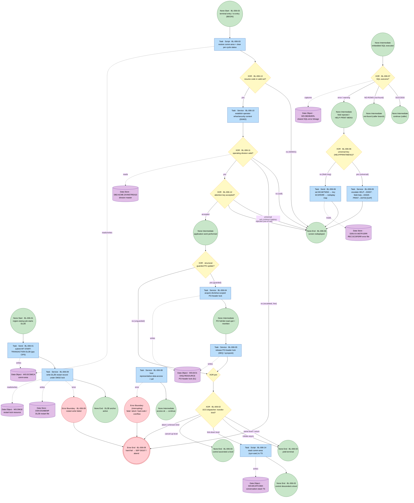
```mermaid
%%{init: {'theme': 'base'}}%%
flowchart TD
  classDef ev   fill:#c8e6c9,stroke:#1b5e20,color:#000;
  classDef task fill:#bbdefb,stroke:#0d47a1,color:#000;
  classDef gw   fill:#fff9c4,stroke:#f9a825,color:#000;
  classDef err  fill:#ffcdd2,stroke:#b71c1c,color:#000;
  classDef data fill:#e1bee7,stroke:#4a148c,color:#000;
  classDef sub  fill:#d7ccc8,stroke:#3e2723,color:#000;
  classDef ext  fill:#ffe0b2,stroke:#e65100,color:#000;

  %% ---------- Region (i): DLZB anchor flow ----------
  s1(("None Start · BL-006-01<br/>region-startup job starts DLZB")):::ev
  t01["Task · Send · BL-006-01<br/>submit MT START-TRANSACTION DLZB (grp CIF0)"]:::task
  t09["Task · Service · BL-006-09<br/>write DLZB restart record under DM1E lock"]:::task
  e09b(("Error Boundary · BL-006-09<br/>restart-write failed")):::err
  end1(("None End · DLZB anchor active")):::ev
  s1 --> t01 --> t09 --> end1
  t09 -. "error" .-> e09b --> fendShared

  %% ---------- Region (ii): screen request lifecycle ----------
  s2(("None Start · BL-006-03<br/>terminal entry / re-entry (BEGIN)")):::ev
  t03["Task · Script · BL-006-03<br/>restore comm-area + clear per-cycle status"]:::task
  g13{"XOR · BL-006-13<br/>resume code in valid set?"}:::gw
  t10["Task · Service · BL-006-10<br/>establish operator whse/security context (D0402)"]:::task
  g11{"XOR · BL-006-11<br/>operating division valid?"}:::gw
  g12{"XOR · BL-006-12<br/>attention key accepted?"}:::gw
  mwork(("None Intermediate<br/>application work performed")):::ev
  gupd{"XOR · structural<br/>guarded PO update?"}:::gw
  t04["Task · Service · BL-006-04<br/>acquire div/whse-scoped PO-header lock"]:::task
  mupd(("None Intermediate<br/>PO hdr/det read-upd + rewritten")):::ev
  t05["Task · Service · BL-006-05<br/>release PO-header lock (DEQ / syncpoint)"]:::task
  jupd{"XOR join"}:::gw
  g02{"XOR · BL-006-02<br/>DCS dispatcher: transfer kind?"}:::gw
  t14["Task · Script · BL-006-14<br/>stack comm-area (sys+user) to TS"]:::task
  endY(("None End · BL-006-03<br/>yield terminal")):::ev
  endL(("None End · BL-006-03<br/>control descended a level")):::ev
  endU(("None End · BL-006-03<br/>control ascended a level")):::ev

  s2 --> t03 --> g13
  g13 -- "no (S00001)" --> sErr
  g13 -- "yes" --> t10 --> g11
  g11 -- "no (soft)" --> sErr
  g11 -- "no (escalated, few)" --> fendShared
  g11 -- "yes" --> g12
  g12 -- "universal HELP/PRINT/MENU" --> sErr
  g12 -- "rejected (out-of-set)" --> sErr
  g12 -- "accepted" --> mwork --> gupd
  gupd -- "yes (guarded)" --> t04 --> mupd --> t05 --> jupd
  gupd -- "no (unguarded)" --> jupd
  jupd --> g02
  g02 -- "same-level / return" --> endY
  g02 -- "initiate-async" --> endY
  g02 -- "link-down level" --> t14 --> endL
  g02 -- "cancel-up level" --> endU
  g02 -- "abort | unknown kind" --> fendShared

  %% ---------- Region (iii): shared conventions (drawn once) ----------
  in6(("None Intermediate<br/>field rejected / HELP·PRINT·MENU")):::ev
  g06{"XOR · BL-006-06<br/>universal key (HELP/PRINT/MENU)?"}:::gw
  t06esc["Task · Service · BL-006-06<br/>escalate HELP→D0007 · field-help→D0325 · PRINT→D0703 [GAP]"]:::task
  t06msg["Task · Send · BL-006-06<br/>set MCAETMSG → key DCSFERR → redisplay map"]:::task
  in6 --> g06
  g06 -- "yes (universal)" --> t06esc --> sErr
  g06 -- "no (field msg)" --> t06msg --> sErr
  acc(("None Intermediate<br/>embedded SQL executed")):::ev
  g07{"XOR · BL-006-07<br/>SQL outcome?"}:::gw
  cont(("None Intermediate<br/>continue (caller)")):::ev
  nf(("None Intermediate<br/>not-found (caller branch)")):::ev
  acc --> g07
  g07 -- "SUCCESS" --> cont
  g07 -- "NO-ROWS (not-found)" --> nf
  g07 -- "error / warning" --> in6
  callT["Task · Service · BL-006-08 host<br/>representative data-access / call"]:::task
  eb8(("Error Boundary (interrupting)<br/>fatal / abort / bad-code / overflow")):::err
  cok(("None Intermediate<br/>access ok → continue")):::ev
  callT --> cok
  callT -. "error" .-> eb8 --> fendShared

  %% ---------- shared terminals ----------
  sErr(("None End · BL-006-06<br/>screen redisplayed")):::ev
  fendShared((("Error End · BL-006-08<br/>hard-fail → SEP D0107 / abend"))):::err

  %% ---------- data ----------
  dMCA[("Data Object · WS:DCSMCA<br/>comm-area")]:::data
  dENQ[("Data Object · WS:DCS-ENQ-RESOURCE<br/>PO-header lock (51)")]:::data
  dTS[("Data Object · WS:MCAPCOMX<br/>conversation-stack TS")]:::data
  dDSAB[("Data Store · DSN:DSABEMF<br/>DLZB restart file")]:::data
  dDM1E[("Data Object · WS:DM1E<br/>restart lock resource")]:::data
  dDI1D[("Data Store · DB2:ACME.DIVMSTRDI1D<br/>division master")]:::data
  derr[("Data Store · DSN:XX.MSTR.ERR<br/>REC:DCSFERR error file")]:::data
  ddb2[("Data Object · WS:DBDB2ERL<br/>shared SQL-error linkage")]:::data
  t01 -. "writes" .-> dMCA
  t03 -. "reads/writes" .-> dMCA
  t14 -. "writes" .-> dTS
  t04 -. "writes" .-> dENQ
  t05 -. "writes" .-> dENQ
  t09 -. "writes" .-> dDSAB
  t09 -. "reads/writes" .-> dDM1E
  g11 -. "reads" .-> dDI1D
  t06msg -. "reads" .-> derr
  g07 -. "captures" .-> ddb2
```

Modelling notes: `BL-006-02` is an XOR (pure routing on `COMX-CODE`); same-level and initiate-async both yield the terminal. The `guarded PO update?` split/join (`gupd`/`jupd`) is a **structural** SESE wrapper (no rule id) around the `04 → 05` lock block. `BL-006-03`'s yield/descend/ascend are `None End` outcome events, not separate nodes. `BL-006-09` folds the `DM1E` ENQ/persist/DEQ into one serialised Service Task whose failed-write hard-throws to the shared `08`. Absent programs (SEP `D0107`, `D0007`/`D0325`/`D0703`, `D0402`, `MCDIV40`) are internal — shown as Task labels + data effects, never external Pools.

### 2.2 Rule → element conformance (P)

| Rule | Title | Logic type | BPMN element |
|---|---|---|---|
| BL-006-01 | Start DLZB transaction from region-startup job | control (distribution) | `Task · Send` (internal MT START; not a Pool) |
| BL-006-02 | Route inter-program transfer via the DCS dispatcher | control (distribution) | `XOR Gateway` (classify transfer-kind; 5 branches incl. `abort\|unknown` default) |
| BL-006-03 | Maintain pseudo-conv state via comm-area + resume code | control (orch. boundary) | `Task · Script` (restore on re-entry; yield/descend/ascend are `None End`s) |
| BL-006-04 | Acquire div/whse-scoped PO-header lock | validation (write-gate) | `Task · Service` (inside structural guarded-update XOR) |
| BL-006-05 | Release the PO-header lock | control (orch. boundary) | `Task · Service` |
| BL-006-06 | Screen field-error idiom (+ universal-key intercept) | error-handling | `Task · Send` + internal universal-key XOR → escalate Task; `None End` |
| BL-006-07 | Shared DB2 SQL-error idiom | error-handling | `XOR Gateway` (SUCCESS / NO-ROWS→not-found / error→06) |
| BL-006-08 | Operational hard-fail / abort convention | error-handling | `Error Boundary (interrupting) → Error End` (§6.4, modelled once) |
| BL-006-09 | Serialise the DLZB restart-file write | validation (write-gate) | `Task · Service` + Error Boundary → 08 |
| BL-006-10 | Establish operator whse/security context | enrichment (fallback) | `Task · Service` |
| BL-006-11 | Validate operating division | validation | `XOR Gateway` (reads DI1D; fail→06 soft, →08 few escalations) |
| BL-006-12 | Validate attention key vs allowed set | validation (filter) | `XOR Gateway` (universal→06 / out-of-set→06 / accepted) |
| BL-006-13 | Validate program-step resume code | validation (filter) | `XOR Gateway` (in-set→step / else→06 S00001) |
| BL-006-14 | Stack comm-area to TS on a down-level call | control (orch. boundary) | `Task · Script` (dispatcher link-down branch) |

14/14 realised. Structural-only nodes (no rule id): `guarded PO update?` split + its join.

### 2.3 Derived Mealy FSM (P)

Anchors `A = {S_job, S_term}` ∪ Ends `{E_anchor, E_yield, E_descend, E_ascend, E_screen(06), E_hardfail(08)}` ∪ milestones `{M_work, M_upd}`. P has **no IOR/AND regions** — every transition is a single-token XOR path (concurrency handling: N/A). The pseudo-conversational "re-entry" is a *fresh* token from `S_term`, not a back-edge (P7 holds).

```
S_job  --[ true ] / ⟨01,09⟩----------------------------------------------> E_anchor
S_job  --[ restart-write ≠ SUCCESS ] / ⟨01,09,08⟩------------------------> E_hardfail
S_term --[ resumeCode ∉ valid ] / ⟨03,13,06⟩----------------------------> E_screen
S_term --[ valid ∧ ¬divisionValid ∧ soft ] / ⟨03,13,10,11,06⟩-----------> E_screen
S_term --[ valid ∧ ¬divisionValid ∧ escalated ] / ⟨03,13,10,11,08⟩------> E_hardfail
S_term --[ valid ∧ divisionValid ∧ key∈universal ] / ⟨03,13,10,11,12,06⟩-> E_screen
S_term --[ valid ∧ divisionValid ∧ key∉allowed ] / ⟨03,13,10,11,12,06⟩--> E_screen
S_term --[ valid ∧ divisionValid ∧ key accepted ] / ⟨03,13,10,11,12⟩----> M_work
M_work --[ guarded update ] / ⟨04⟩--------------------------------------> M_upd
M_work --[ unguarded ] / ⟨⟩--------------------------------------------> (join)
M_upd  --[ true ] / ⟨05⟩----------------------------------------------> (join)
(join) --[ kind = same-level ∨ return ∨ initiate-async ] / ⟨02⟩--------> E_yield
(join) --[ kind = link-down ] / ⟨02,14⟩-------------------------------> E_descend
(join) --[ kind = cancel-up ] / ⟨02⟩----------------------------------> E_ascend
(join) --[ kind = abort ∨ unknown ] / ⟨02,08⟩-------------------------> E_hardfail
(SQL site)  --[ SQLCODE=0 ] / ⟨07⟩-----------------> continue
(SQL site)  --[ SQLCODE=+100 ] / ⟨07⟩--------------> not-found (caller)
(SQL site)  --[ SQL error/warn ] / ⟨07,06⟩---------> E_screen
(data site) --[ fatal / abort / overflow ] / ⟨08⟩--> E_hardfail
```

## 3. Process A — PO header & EDI maintenance (`BL-006-20 … 34`)

Programs `D2112` (EDI/special-dist header variant), `D2122` (inquiry/maint + EDI-PO cancel), and the 15-caller cost/record-access hub `D2138` (internal — this **is** its logic). No §3.5 external participants. Soft validation fails → shared `06`; DB2 SQL errors → shared `07`; data-access hard-faults → Error Boundary → shared `08`.

### 3.1 Orchestration

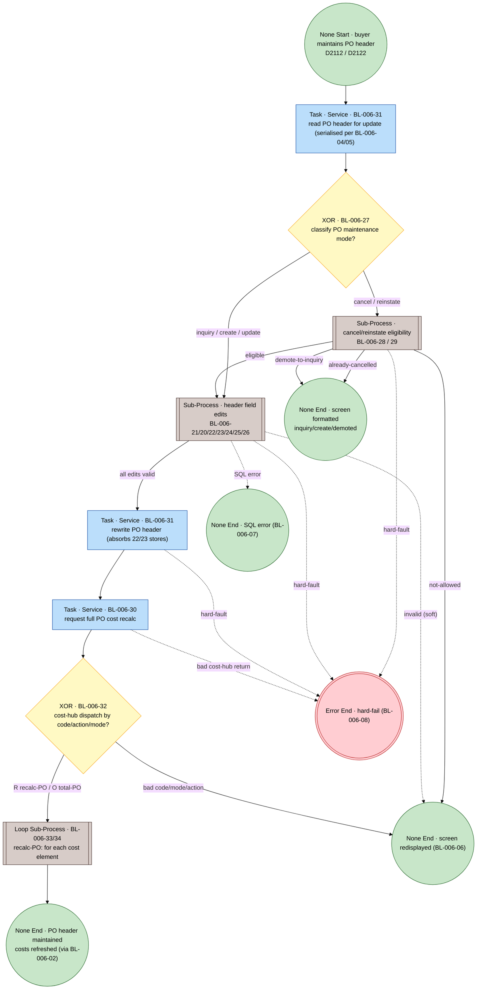
```mermaid
%%{init: {'theme': 'base'}}%%
flowchart TD
  classDef ev   fill:#c8e6c9,stroke:#1b5e20,color:#000;
  classDef task fill:#bbdefb,stroke:#0d47a1,color:#000;
  classDef gw   fill:#fff9c4,stroke:#f9a825,color:#000;
  classDef err  fill:#ffcdd2,stroke:#b71c1c,color:#000;
  classDef data fill:#e1bee7,stroke:#4a148c,color:#000;
  classDef sub  fill:#d7ccc8,stroke:#3e2723,color:#000;
  classDef ext  fill:#ffe0b2,stroke:#e65100,color:#000;

  ST(("None Start · buyer maintains PO header<br/>D2112 / D2122")):::ev
  R31["Task · Service · BL-006-31<br/>read PO header for update (serialised per BL-006-04/05)"]:::task
  G27{"XOR · BL-006-27<br/>classify PO maintenance mode?"}:::gw
  S1[["Sub-Process · cancel/reinstate eligibility<br/>BL-006-28 / 29"]]:::sub
  S2[["Sub-Process · header field edits<br/>BL-006-21/20/22/23/24/25/26"]]:::sub
  T31["Task · Service · BL-006-31<br/>rewrite PO header (absorbs 22/23 stores)"]:::task
  T30["Task · Service · BL-006-30<br/>request full PO cost recalc"]:::task
  G32{"XOR · BL-006-32<br/>cost-hub dispatch by code/action/mode?"}:::gw
  S3[["Loop Sub-Process · BL-006-33/34<br/>recalc-PO: for each cost element"]]:::sub
  ENDOK(("None End · PO header maintained<br/>costs refreshed (via BL-006-02)")):::ev
  ENDINQ(("None End · screen formatted<br/>inquiry/create/demoted")):::ev
  SOFT(("None End · screen redisplayed (BL-006-06)")):::ev
  SQLE(("None End · SQL error (BL-006-07)")):::ev
  HARD((("Error End · hard-fail (BL-006-08)"))):::err

  ST --> R31 --> G27
  G27 -- "cancel / reinstate" --> S1
  G27 -- "inquiry / create / update" --> S2
  S1 -- "already-cancelled" --> ENDINQ
  S1 -- "eligible" --> S2
  S1 -- "not-allowed" --> SOFT
  S1 -- "demote-to-inquiry" --> ENDINQ
  S1 -. "hard-fault" .-> HARD
  S2 -- "all edits valid" --> T31
  S2 -. "invalid (soft)" .-> SOFT
  S2 -. "SQL error" .-> SQLE
  S2 -. "hard-fault" .-> HARD
  T31 --> T30 --> G32
  T31 -. "hard-fault" .-> HARD
  T30 -. "bad cost-hub return" .-> HARD
  G32 -- "R recalc-PO / O total-PO" --> S3
  G32 -- "bad code/mode/action" --> SOFT
  S3 --> ENDOK
```

`BL-006-31` is one rule with two touch-points (entry read `R31`, persist rewrite `T31`); the rule is realised at the rewrite. The corp-code store (22) and special-dist zeroing (23) fold into `T31` (gateways never write, P3).

### 3.2 Stage S1 — cancel / reinstate eligibility (`28`, `29`)

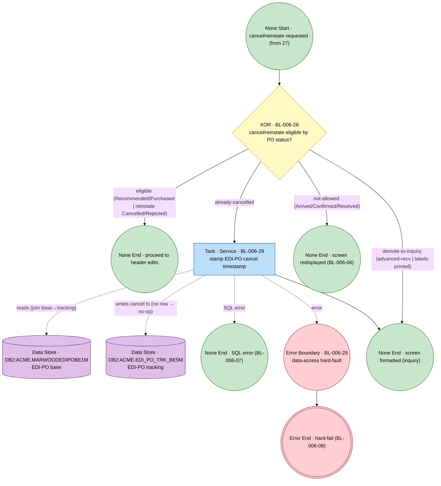
```mermaid
%%{init: {'theme': 'base'}}%%
flowchart TD
  classDef ev   fill:#c8e6c9,stroke:#1b5e20,color:#000;
  classDef task fill:#bbdefb,stroke:#0d47a1,color:#000;
  classDef gw   fill:#fff9c4,stroke:#f9a825,color:#000;
  classDef err  fill:#ffcdd2,stroke:#b71c1c,color:#000;
  classDef data fill:#e1bee7,stroke:#4a148c,color:#000;

  IN(("None Start · cancel/reinstate requested (from 27)")):::ev
  G28{"XOR · BL-006-28<br/>cancel/reinstate eligible by PO status?"}:::gw
  T29["Task · Service · BL-006-29<br/>stamp EDI-PO cancel timestamp"]:::task
  EB29(("Error Boundary · BL-006-29<br/>data-access hard-fault")):::err
  BE1M[("Data Store · DB2:ACME.MARWOODEDIPOBE1M<br/>EDI-PO base")]:::data
  BE5M[("Data Store · DB2:ACME.EDI_PO_TRK_BE5M<br/>EDI-PO tracking")]:::data
  TOEDIT(("None End · proceed to header edits")):::ev
  TOINQ(("None End · screen formatted (inquiry)")):::ev
  SOFT(("None End · screen redisplayed (BL-006-06)")):::ev
  SQLE(("None End · SQL error (BL-006-07)")):::ev
  HARD((("Error End · hard-fail (BL-006-08)"))):::err

  IN --> G28
  G28 -- "eligible (Recommended/Purchased | reinstate Cancelled/Rejected)" --> TOEDIT
  G28 -- "already-cancelled" --> T29
  G28 -- "not-allowed (Arrived/Confirmed/Received)" --> SOFT
  G28 -- "demote-to-inquiry (advanced-recv | labels-printed)" --> TOINQ
  T29 -. "reads (join base↔tracking)" .-> BE1M
  T29 -. "writes cancel ts (no row → no-op)" .-> BE5M
  T29 -. "SQL error" .-> SQLE
  T29 -. "error" .-> EB29 --> HARD
  T29 --> TOINQ
```

### 3.3 Stage S2 — header field edits (`21, 20, 22, 23, 24, 25, 26`)

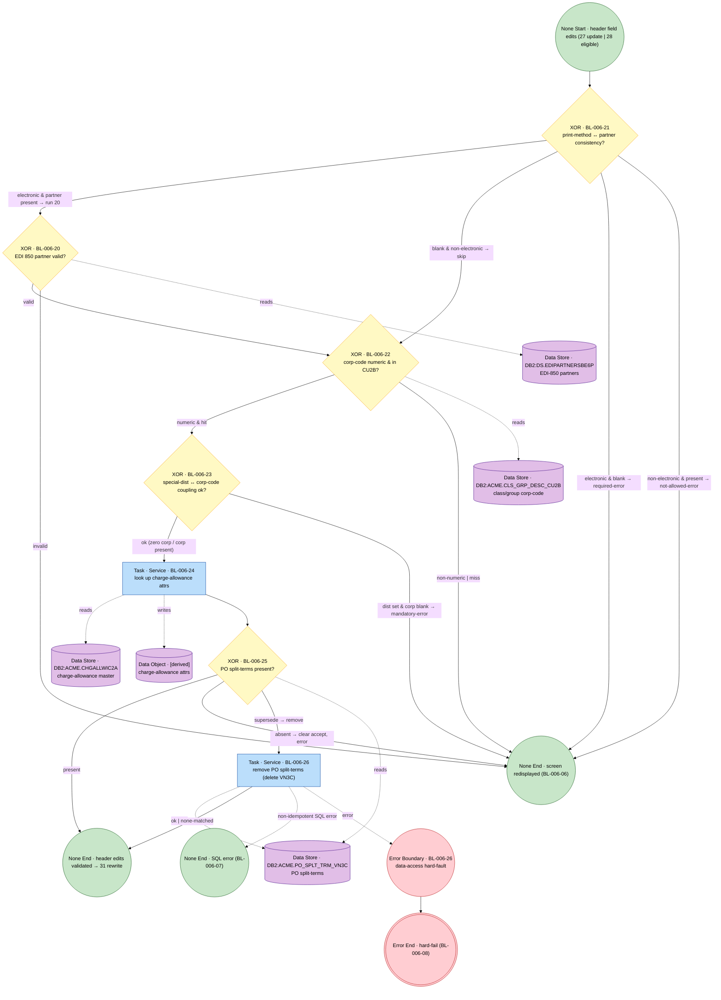
```mermaid
%%{init: {'theme': 'base'}}%%
flowchart TD
  classDef ev   fill:#c8e6c9,stroke:#1b5e20,color:#000;
  classDef task fill:#bbdefb,stroke:#0d47a1,color:#000;
  classDef gw   fill:#fff9c4,stroke:#f9a825,color:#000;
  classDef err  fill:#ffcdd2,stroke:#b71c1c,color:#000;
  classDef data fill:#e1bee7,stroke:#4a148c,color:#000;

  IN(("None Start · header field edits (27 update | 28 eligible)")):::ev
  G21{"XOR · BL-006-21<br/>print-method ↔ partner consistency?"}:::gw
  G20{"XOR · BL-006-20<br/>EDI 850 partner valid?"}:::gw
  G22{"XOR · BL-006-22<br/>corp-code numeric & in CU2B?"}:::gw
  G23{"XOR · BL-006-23<br/>special-dist ↔ corp-code coupling ok?"}:::gw
  T24["Task · Service · BL-006-24<br/>look up charge-allowance attrs"]:::task
  G25{"XOR · BL-006-25<br/>PO split-terms present?"}:::gw
  T26["Task · Service · BL-006-26<br/>remove PO split-terms (delete VN3C)"]:::task
  EB26(("Error Boundary · BL-006-26<br/>data-access hard-fault")):::err
  OUT(("None End · header edits validated → 31 rewrite")):::ev
  SOFT(("None End · screen redisplayed (BL-006-06)")):::ev
  SQLE(("None End · SQL error (BL-006-07)")):::ev
  HARD((("Error End · hard-fail (BL-006-08)"))):::err
  BE6P[("Data Store · DB2:DS.EDIPARTNERSBE6P<br/>EDI-850 partners")]:::data
  CU2B[("Data Store · DB2:ACME.CLS_GRP_DESC_CU2B<br/>class/group corp-code")]:::data
  IC2A[("Data Store · DB2:ACME.CHGALLWIC2A<br/>charge-allowance master")]:::data
  VN3C[("Data Store · DB2:ACME.PO_SPLT_TRM_VN3C<br/>PO split-terms")]:::data
  CAB[("Data Object · [derived]<br/>charge-allowance attrs")]:::data

  IN --> G21
  G21 -- "electronic & partner present → run 20" --> G20
  G21 -- "blank & non-electronic → skip" --> G22
  G21 -- "electronic & blank → required-error" --> SOFT
  G21 -- "non-electronic & present → not-allowed-error" --> SOFT
  G20 -- "valid" --> G22
  G20 -- "invalid" --> SOFT
  G20 -. "reads" .-> BE6P
  G22 -- "numeric & hit" --> G23
  G22 -- "non-numeric | miss" --> SOFT
  G22 -. "reads" .-> CU2B
  G23 -- "ok (zero corp / corp present)" --> T24
  G23 -- "dist set & corp blank → mandatory-error" --> SOFT
  T24 -. "reads" .-> IC2A
  T24 -. "writes" .-> CAB
  T24 --> G25
  G25 -- "present" --> OUT
  G25 -- "absent → clear accept, error" --> SOFT
  G25 -- "supersede → remove" --> T26
  G25 -. "reads" .-> VN3C
  T26 -. "deletes" .-> VN3C
  T26 -- "ok | none-matched" --> OUT
  T26 -. "non-idempotent SQL error" .-> SQLE
  T26 -. "error" .-> EB26 --> HARD
```

### 3.4 Stage S3 — cost-hub dispatch + cost-element Loop (`32, 33, 34`)

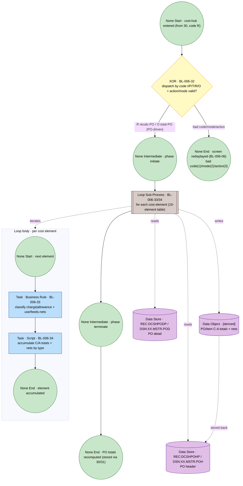
```mermaid
%%{init: {'theme': 'base'}}%%
flowchart TD
  classDef ev   fill:#c8e6c9,stroke:#1b5e20,color:#000;
  classDef task fill:#bbdefb,stroke:#0d47a1,color:#000;
  classDef gw   fill:#fff9c4,stroke:#f9a825,color:#000;
  classDef err  fill:#ffcdd2,stroke:#b71c1c,color:#000;
  classDef data fill:#e1bee7,stroke:#4a148c,color:#000;
  classDef sub  fill:#d7ccc8,stroke:#3e2723,color:#000;

  IN(("None Start · cost-hub entered (from 30, code R)")):::ev
  G32{"XOR · BL-006-32<br/>dispatch by code I/P/T/R/O + action/mode valid?"}:::gw
  MINIT(("None Intermediate · phase initiate")):::ev
  MTERM(("None Intermediate · phase terminate")):::ev
  LOOP[["Loop Sub-Process · BL-006-33/34<br/>for each cost element (10-element table)"]]:::sub
  POH[("Data Store · REC:DCSHPOHP / DSN:XX.MSTR.POH<br/>PO header")]:::data
  POD[("Data Store · REC:DCSHPODP / DSN:XX.MSTR.POD<br/>PO detail")]:::data
  TOT[("Data Object · [derived]<br/>PO/item C-A totals + nets")]:::data
  OUT(("None End · PO totals recomputed (stored via 30/31)")):::ev
  SOFT(("None End · screen redisplayed (BL-006-06)<br/>bad code(1)/mode(2)/action(3)")):::ev

  IN --> G32
  G32 -- "R recalc-PO / O total-PO (PO-driven)" --> MINIT
  G32 -- "bad code/mode/action" --> SOFT
  MINIT --> LOOP --> MTERM --> OUT
  LOOP -. "reads" .-> POD
  LOOP -. "reads" .-> POH
  LOOP -. "writes" .-> TOT
  TOT -. "stored back" .-> POH

  subgraph BODY["Loop body · per cost element"]
    direction TB
    LB(("None Start · next element")):::ev
    B33["Task · Business Rule · BL-006-33<br/>classify charge|allowance + use/feeds-nets"]:::task
    S34["Task · Script · BL-006-34<br/>accumulate C/A totals + nets by type"]:::task
    LE(("None End · element accumulated")):::ev
    LB --> B33 --> S34 --> LE
  end
  LOOP -. "iterates" .-> BODY
```

### 3.5 Rule → element conformance (A)

| Rule | Title | Logic type | BPMN element |
|---|---|---|---|
| BL-006-20 | Validate EDI 850 trading partner | validation | `XOR` (reads BE6P); invalid→06 |
| BL-006-21 | Gate EDI-partner requirement by print method | validation | `XOR` (4-way: required/not-allowed→06, run-20, skip) |
| BL-006-22 | Validate controlling corp-code | validation | `XOR` (reads CU2B); store folds into 31 |
| BL-006-23 | Special-distribution ↔ corp-code coupling | validation | `XOR` (zeroing folds into 31; mandatory-err→06) |
| BL-006-24 | Look up charge-allowance code attributes | enrichment | `Task · Service` (reads IC2A) |
| BL-006-25 | Probe PO split-terms present | validation | `XOR` (reads VN3C); absent→06 |
| BL-006-26 | Remove PO split-payment terms | transformation | `Task · Service` (delete VN3C) + Error Boundary→08; SQL→07 |
| BL-006-27 | Classify PO maintenance mode | classification | `XOR` (5-way) |
| BL-006-28 | Cancel/reinstate eligibility by status | validation | `XOR` (demote-inq / not-allowed→06 / already-cancelled→29 / eligible) |
| BL-006-29 | Stamp EDI-PO cancel timestamp | transformation | `Task · Service` (BE1M⋈BE5M) + Error Boundary→08; SQL→07 |
| BL-006-30 | Trigger full PO cost recalc | routing | `Task · Service` (handoff to cost hub); bad return→08 |
| BL-006-31 | Maintain PO header read-upd / rewrite | transformation | `Task · Service` (writes DCSHPOHP; serialised 04/05) + Error Boundary→08 |
| BL-006-32 | Classify & route cost-hub request | routing | `XOR` (I/P/T/R/O + action/mode; bad-*→06) |
| BL-006-33 | Classify cost element charge\|allowance + use | classification | `Task · Business Rule` [Loop body] |
| BL-006-34 | Accumulate C/A totals + net costs by type | aggregation | `Task · Script` [Loop body] |

15/15 realised. Cited: 02 (transfer on ENDOK), 03, 04/05 (lock note), 06/07/08 (shared Ends).

### 3.6 Derived Mealy FSM (A)

All-XOR/loop (no IOR/AND ⇒ no concurrency choice). The single cycle (cost-element loop) is contained in the Loop Sub-Process (P7).

```
Start           --[ open D2112/D2122 ] / {31:read}                               --> MaintEntry
MaintEntry      --[ mode∈{cancel,reinstate} ] / {27}                             --> ModeRouted_CR
MaintEntry      --[ mode∈{inquiry,create,update} ] / {27}                        --> EditsEntry
ModeRouted_CR   --[ eligible ] / {28}                                            --> EditsEntry
ModeRouted_CR   --[ already-cancelled ] / {28,29}                                --> q_INQ
ModeRouted_CR   --[ not-allowed ] / {28}                                         --> q_06
ModeRouted_CR   --[ demote-to-inquiry ] / {28}                                   --> q_INQ
ModeRouted_CR   --[ 29 SQL fault ] / {28,29}                                     --> q_07
ModeRouted_CR   --[ 29 hard status ] / {28,29}                                   --> q_08
EditsEntry      --[ any edit (21/20/22/23/25) fails ] / {21,(20),(22),(23),(25)} --> q_06
EditsEntry      --[ all edits pass (incl. 24, 26 if supersede) ] / {21,(20),22,23,24,25,(26)} --> EditsValid
EditsEntry      --[ 26 SQL fault ] / {…,26}                                      --> q_07
EditsEntry      --[ 26 hard fault ] / {…,26}                                     --> q_08
EditsValid      --[ rewrite ok ] / {31:rewrite}                                  --> HeaderPersisted
EditsValid      --[ 31 hard fault ] / {31}                                       --> q_08
HeaderPersisted --[ recalc requested ] / {30}                                    --> CostHubRouted
HeaderPersisted --[ 30 bad return ] / {30}                                       --> q_08
CostHubRouted   --[ code R/O valid ] / {32}                                      --> LoopElement
CostHubRouted   --[ bad code/mode/action ] / {32}                                --> q_06
LoopElement     --[ next element ] / {33,34}                                     --> LoopElement
LoopElement     --[ no more elements ] / {}                                      --> q_OK
   q_OK = PO header maintained (transfer via 02) · q_INQ = screen formatted · q_06/07/08 = shared Ends
```

## 4. Process B — PO entry & processing (`BL-006-35 … 49`)

Six independent SESE sub-flows: **D2157** receipt-time recalc subroutine, **D2113** item-review hub, **D2111** recommended-order, **D2126** item-summary, **D2127** extended-message, **D2109** async accept/distribute. Cost engines `D2138`/`D2139`/`D0191` are internal (data effects only). The genuine §3.5 external channels — `RPT:po-print-spool`, `RPT:po-fax`, `FT:po-edi-out`, `RPT:edit-error-report` — appear in D2109 distribution (`49`). No DB2 in this cluster.

### 4.1 Orchestration

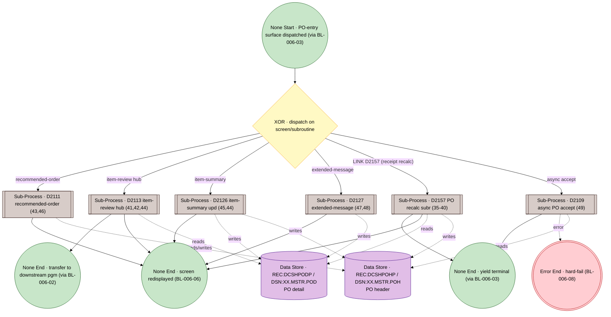
```mermaid
%%{init: {'theme': 'base'}}%%
flowchart TD
  classDef ev   fill:#c8e6c9,stroke:#1b5e20,color:#000;
  classDef task fill:#bbdefb,stroke:#0d47a1,color:#000;
  classDef gw   fill:#fff9c4,stroke:#f9a825,color:#000;
  classDef err  fill:#ffcdd2,stroke:#b71c1c,color:#000;
  classDef data fill:#e1bee7,stroke:#4a148c,color:#000;
  classDef sub  fill:#d7ccc8,stroke:#3e2723,color:#000;
  classDef ext  fill:#ffe0b2,stroke:#e65100,color:#000;

  st(("None Start · PO-entry surface dispatched (via BL-006-03)")):::ev
  disp{"XOR · dispatch on screen/subroutine"}:::gw
  s2111[["Sub-Process · D2111 recommended-order (43,46)"]]:::sub
  s2113[["Sub-Process · D2113 item-review hub (41,42,44)"]]:::sub
  s2126[["Sub-Process · D2126 item-summary upd (45,44)"]]:::sub
  s2127[["Sub-Process · D2127 extended-message (47,48)"]]:::sub
  s2157[["Sub-Process · D2157 PO recalc subr (35-40)"]]:::sub
  s2109[["Sub-Process · D2109 async PO accept (49)"]]:::sub
  endN(("None End · screen redisplayed (BL-006-06)")):::ev
  endY(("None End · yield terminal (via BL-006-03)")):::ev
  endX(("None End · transfer to downstream pgm (via BL-006-02)")):::ev
  endH((("Error End · hard-fail (BL-006-08)"))):::err
  poh[("Data Store · REC:DCSHPOHP / DSN:XX.MSTR.POH<br/>PO header")]:::data
  pod[("Data Store · REC:DCSHPODP / DSN:XX.MSTR.POD<br/>PO detail")]:::data

  st --> disp
  disp -- "recommended-order" --> s2111
  disp -- "item-review hub" --> s2113
  disp -- "item-summary" --> s2126
  disp -- "extended-message" --> s2127
  disp -- "LINK D2157 (receipt recalc)" --> s2157
  disp -- "async accept" --> s2109
  s2111 --> endN
  s2113 --> endX
  s2113 --> endN
  s2126 --> endN
  s2127 --> endN
  s2157 --> endY
  s2157 --> endN
  s2109 --> endY
  s2109 -. "error" .-> endH
  s2111 -. "reads/writes" .-> poh
  s2113 -. "reads" .-> pod
  s2126 -. "writes" .-> pod
  s2126 -. "writes" .-> poh
  s2127 -. "writes" .-> pod
  s2157 -. "reads" .-> pod
  s2157 -. "writes" .-> poh
  s2109 -. "reads" .-> poh
```

### 4.2 D2157 — PO-recalc subroutine (`35 → 36{37,38,39} → 40`)

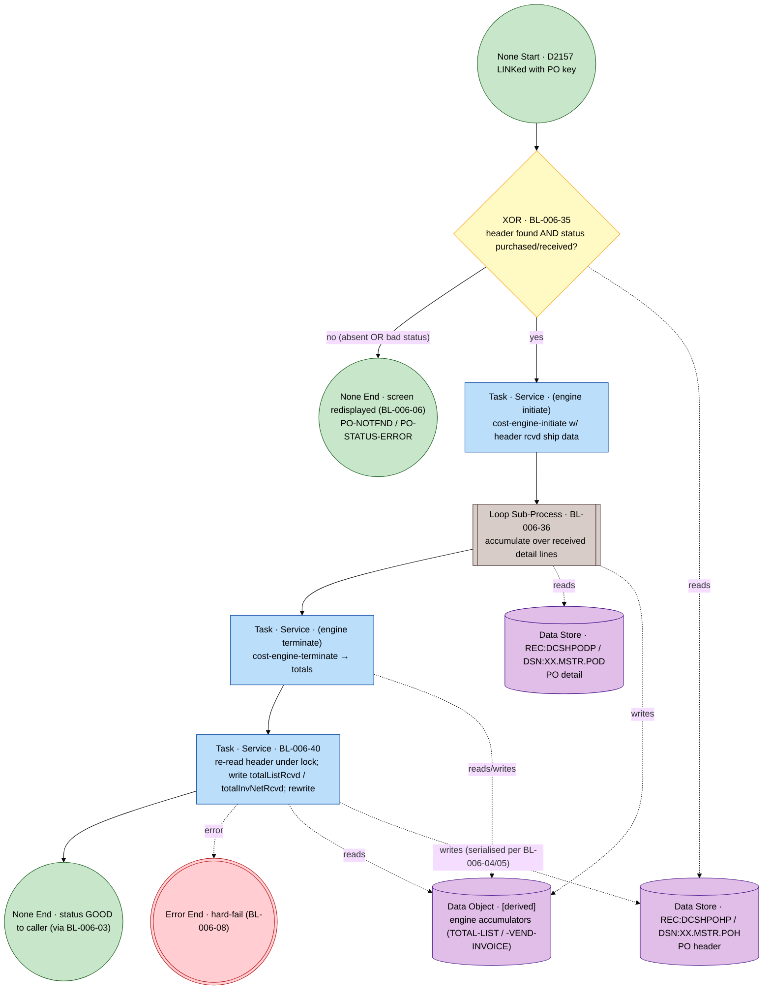
```mermaid
%%{init: {'theme': 'base'}}%%
flowchart TD
  classDef ev   fill:#c8e6c9,stroke:#1b5e20,color:#000;
  classDef task fill:#bbdefb,stroke:#0d47a1,color:#000;
  classDef gw   fill:#fff9c4,stroke:#f9a825,color:#000;
  classDef err  fill:#ffcdd2,stroke:#b71c1c,color:#000;
  classDef data fill:#e1bee7,stroke:#4a148c,color:#000;
  classDef sub  fill:#d7ccc8,stroke:#3e2723,color:#000;

  st(("None Start · D2157 LINKed with PO key")):::ev
  g35{"XOR · BL-006-35<br/>header found AND status purchased/received?"}:::gw
  initE["Task · Service · (engine initiate)<br/>cost-engine-initiate w/ header rcvd ship data"]:::task
  loop[["Loop Sub-Process · BL-006-36<br/>accumulate over received detail lines"]]:::sub
  termE["Task · Service · (engine terminate)<br/>cost-engine-terminate → totals"]:::task
  t40["Task · Service · BL-006-40<br/>re-read header under lock; write totalListRcvd / totalInvNetRcvd; rewrite"]:::task
  okEnd(("None End · status GOOD to caller (via BL-006-03)")):::ev
  softEnd(("None End · screen redisplayed (BL-006-06)<br/>PO-NOTFND / PO-STATUS-ERROR")):::ev
  ebH((("Error End · hard-fail (BL-006-08)"))):::err
  poh[("Data Store · REC:DCSHPOHP / DSN:XX.MSTR.POH<br/>PO header")]:::data
  pod[("Data Store · REC:DCSHPODP / DSN:XX.MSTR.POD<br/>PO detail")]:::data
  acc[("Data Object · [derived]<br/>engine accumulators (TOTAL-LIST / -VEND-INVOICE)")]:::data

  st --> g35
  g35 -- "no (absent OR bad status)" --> softEnd
  g35 -- "yes" --> initE --> loop --> termE --> t40 --> okEnd
  t40 -. "error" .-> ebH
  g35 -. "reads" .-> poh
  loop -. "reads" .-> pod
  loop -. "writes" .-> acc
  termE -. "reads/writes" .-> acc
  t40 -. "reads" .-> acc
  t40 -. "writes (serialised per BL-006-04/05)" .-> poh
```

**BL-006-36 loop body** (per received detail line: `37 → 38 → 39`):

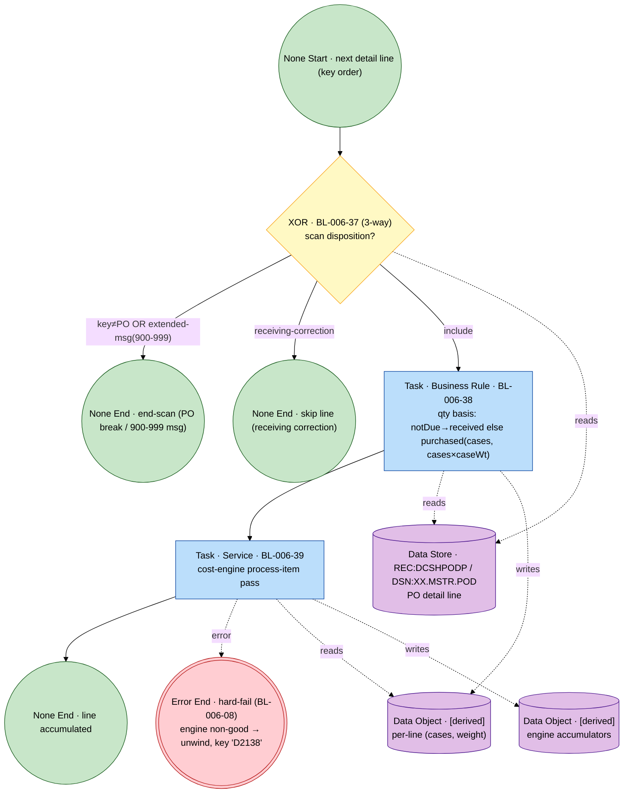
```mermaid
%%{init: {'theme': 'base'}}%%
flowchart TD
  classDef ev   fill:#c8e6c9,stroke:#1b5e20,color:#000;
  classDef task fill:#bbdefb,stroke:#0d47a1,color:#000;
  classDef gw   fill:#fff9c4,stroke:#f9a825,color:#000;
  classDef err  fill:#ffcdd2,stroke:#b71c1c,color:#000;
  classDef data fill:#e1bee7,stroke:#4a148c,color:#000;

  bst(("None Start · next detail line (key order)")):::ev
  g37{"XOR · BL-006-37 (3-way)<br/>scan disposition?"}:::gw
  cont(("None End · end-scan (PO break / 900-999 msg)")):::ev
  skip(("None End · skip line (receiving correction)")):::ev
  t38["Task · Business Rule · BL-006-38<br/>qty basis: notDue→received else purchased(cases, cases×caseWt)"]:::task
  t39["Task · Service · BL-006-39<br/>cost-engine process-item pass"]:::task
  done(("None End · line accumulated")):::ev
  ebH((("Error End · hard-fail (BL-006-08)<br/>engine non-good → unwind, key 'D2138'"))):::err
  pod[("Data Store · REC:DCSHPODP / DSN:XX.MSTR.POD<br/>PO detail line")]:::data
  basis[("Data Object · [derived]<br/>per-line (cases, weight)")]:::data
  acc[("Data Object · [derived]<br/>engine accumulators")]:::data

  bst --> g37
  g37 -- "key≠PO OR extended-msg(900-999)" --> cont
  g37 -- "receiving-correction" --> skip
  g37 -- "include" --> t38 --> t39 --> done
  t39 -. "error" .-> ebH
  g37 -. "reads" .-> pod
  t38 -. "reads" .-> pod
  t38 -. "writes" .-> basis
  t39 -. "reads" .-> basis
  t39 -. "writes" .-> acc
```

### 4.3 D2113 — item-review hub (`42 → 41`; → `44` when detail updated)

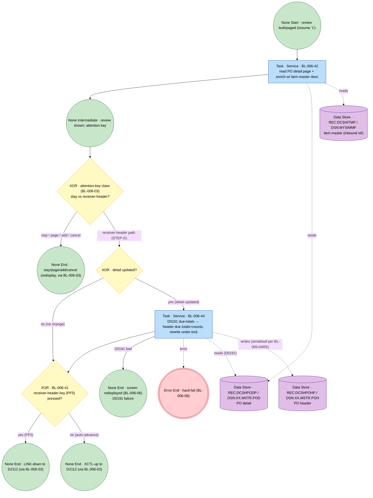
```mermaid
%%{init: {'theme': 'base'}}%%
flowchart TD
  classDef ev   fill:#c8e6c9,stroke:#1b5e20,color:#000;
  classDef task fill:#bbdefb,stroke:#0d47a1,color:#000;
  classDef gw   fill:#fff9c4,stroke:#f9a825,color:#000;
  classDef err  fill:#ffcdd2,stroke:#b71c1c,color:#000;
  classDef data fill:#e1bee7,stroke:#4a148c,color:#000;

  st(("None Start · review built/paged (resume '1')")):::ev
  t42["Task · Service · BL-006-42<br/>read PO detail page + enrich w/ item-master desc"]:::task
  rdy(("None Intermediate · review shown; attention key")):::ev
  gact{"XOR · attention-key class (BL-006-03)<br/>stay vs receiver-header?"}:::gw
  redo(("None End · stay/page/add/cancel (redisplay, via BL-006-03)")):::ev
  gupd{"XOR · detail updated?"}:::gw
  t44["Task · Service · BL-006-44<br/>D0191 due-totals → header due totals+counts; rewrite under lock"]:::task
  g41{"XOR · BL-006-41<br/>receiver-header key (PF5) pressed?"}:::gw
  endLink(("None End · LINK-down to D2112 (via BL-006-02)")):::ev
  endXctl(("None End · XCTL-up to D2112 (via BL-006-02)")):::ev
  softEnd(("None End · screen redisplayed (BL-006-06)<br/>D0191 failure")):::ev
  ebH((("Error End · hard-fail (BL-006-08)"))):::err
  pod[("Data Store · REC:DCSHPODP / DSN:XX.MSTR.POD<br/>PO detail")]:::data
  itm[("Data Store · REC:DCSHITMP / DSN:MYSIMMF<br/>item master (inbound ref)")]:::data
  poh[("Data Store · REC:DCSHPOHP / DSN:XX.MSTR.POH<br/>PO header")]:::data

  st --> t42 --> rdy --> gact
  gact -- "stay / page / add / cancel" --> redo
  gact -- "receiver-header path (STEP-G)" --> gupd
  gupd -- "no (no change)" --> g41
  gupd -- "yes (detail updated)" --> t44 --> g41
  g41 -- "yes (PF5)" --> endLink
  g41 -- "no (auto-advance)" --> endXctl
  t44 -- "D0191 bad" --> softEnd
  t44 -. "error" .-> ebH
  t42 -. "reads" .-> pod
  t42 -. "reads" .-> itm
  t44 -. "reads (D0191)" .-> pod
  t44 -. "writes (serialised per BL-006-04/05)" .-> poh
```

### 4.4 D2111 — recommended-order maint (`43 → 46`)

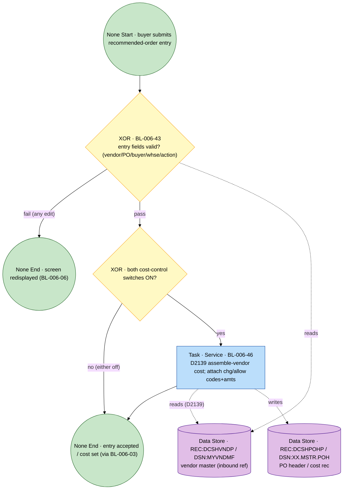
```mermaid
%%{init: {'theme': 'base'}}%%
flowchart TD
  classDef ev   fill:#c8e6c9,stroke:#1b5e20,color:#000;
  classDef task fill:#bbdefb,stroke:#0d47a1,color:#000;
  classDef gw   fill:#fff9c4,stroke:#f9a825,color:#000;
  classDef data fill:#e1bee7,stroke:#4a148c,color:#000;

  st(("None Start · buyer submits recommended-order entry")):::ev
  g43{"XOR · BL-006-43<br/>entry fields valid? (vendor/PO/buyer/whse/action)"}:::gw
  softEnd(("None End · screen redisplayed (BL-006-06)")):::ev
  gcc{"XOR · both cost-control switches ON?"}:::gw
  t46["Task · Service · BL-006-46<br/>D2139 assemble-vendor cost; attach chg/allow codes+amts"]:::task
  okEnd(("None End · entry accepted / cost set (via BL-006-03)")):::ev
  vnd[("Data Store · REC:DCSHVNDP / DSN:MYVNDMF<br/>vendor master (inbound ref)")]:::data
  poh[("Data Store · REC:DCSHPOHP / DSN:XX.MSTR.POH<br/>PO header / cost rec")]:::data

  st --> g43
  g43 -- "fail (any edit)" --> softEnd
  g43 -- "pass" --> gcc
  gcc -- "no (either off)" --> okEnd
  gcc -- "yes" --> t46 --> okEnd
  g43 -. "reads" .-> vnd
  t46 -. "reads (D2139)" .-> vnd
  t46 -. "writes" .-> poh
```

### 4.5 D2126 — item-summary inq/upd (`45 [per changed line] → 44`)

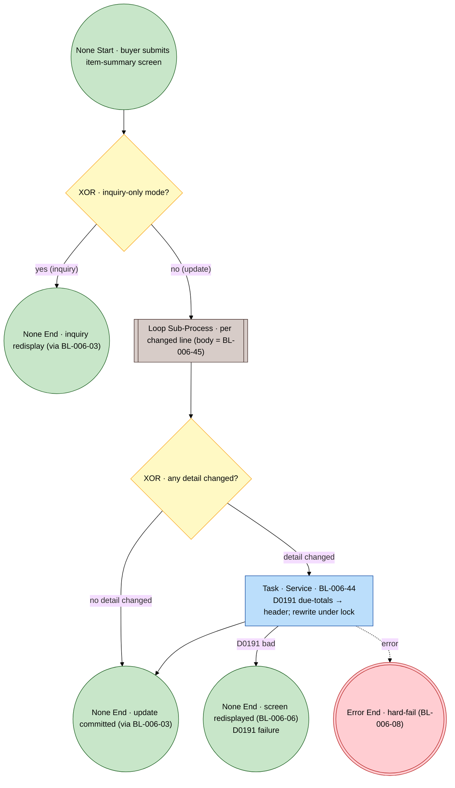
```mermaid
%%{init: {'theme': 'base'}}%%
flowchart TD
  classDef ev   fill:#c8e6c9,stroke:#1b5e20,color:#000;
  classDef task fill:#bbdefb,stroke:#0d47a1,color:#000;
  classDef gw   fill:#fff9c4,stroke:#f9a825,color:#000;
  classDef err  fill:#ffcdd2,stroke:#b71c1c,color:#000;
  classDef sub  fill:#d7ccc8,stroke:#3e2723,color:#000;

  st(("None Start · buyer submits item-summary screen")):::ev
  gmode{"XOR · inquiry-only mode?"}:::gw
  inq(("None End · inquiry redisplay (via BL-006-03)")):::ev
  loop[["Loop Sub-Process · per changed line (body = BL-006-45)"]]:::sub
  gupd{"XOR · any detail changed?"}:::gw
  t44["Task · Service · BL-006-44<br/>D0191 due-totals → header; rewrite under lock"]:::task
  okEnd(("None End · update committed (via BL-006-03)")):::ev
  softEnd(("None End · screen redisplayed (BL-006-06)<br/>D0191 failure")):::ev
  ebH((("Error End · hard-fail (BL-006-08)"))):::err

  st --> gmode
  gmode -- "yes (inquiry)" --> inq
  gmode -- "no (update)" --> loop --> gupd
  gupd -- "no detail changed" --> okEnd
  gupd -- "detail changed" --> t44 --> okEnd
  t44 -- "D0191 bad" --> softEnd
  t44 -. "error" .-> ebH
```

**BL-006-45 loop body** (per changed line):

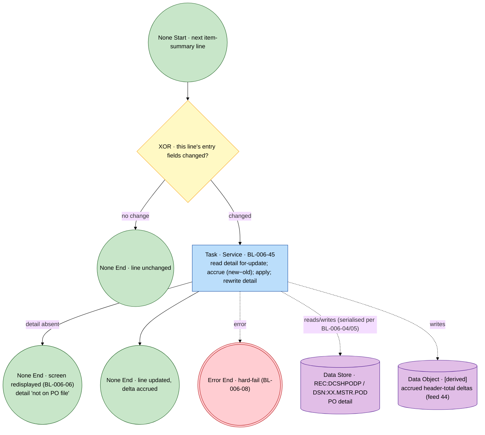
```mermaid
%%{init: {'theme': 'base'}}%%
flowchart TD
  classDef ev   fill:#c8e6c9,stroke:#1b5e20,color:#000;
  classDef task fill:#bbdefb,stroke:#0d47a1,color:#000;
  classDef gw   fill:#fff9c4,stroke:#f9a825,color:#000;
  classDef err  fill:#ffcdd2,stroke:#b71c1c,color:#000;
  classDef data fill:#e1bee7,stroke:#4a148c,color:#000;

  bst(("None Start · next item-summary line")):::ev
  gch{"XOR · this line's entry fields changed?"}:::gw
  skip(("None End · line unchanged")):::ev
  t45["Task · Service · BL-006-45<br/>read detail for-update; accrue (new−old); apply; rewrite detail"]:::task
  done(("None End · line updated, delta accrued")):::ev
  softEnd(("None End · screen redisplayed (BL-006-06)<br/>detail 'not on PO file'")):::ev
  ebH((("Error End · hard-fail (BL-006-08)"))):::err
  pod[("Data Store · REC:DCSHPODP / DSN:XX.MSTR.POD<br/>PO detail")]:::data
  dlt[("Data Object · [derived]<br/>accrued header-total deltas (feed 44)")]:::data

  bst --> gch
  gch -- "no change" --> skip
  gch -- "changed" --> t45
  t45 -- "detail absent" --> softEnd
  t45 --> done
  t45 -. "error" .-> ebH
  t45 -. "reads/writes (serialised per BL-006-04/05)" .-> pod
  t45 -. "writes" .-> dlt
```

### 4.6 D2127 — extended-message maint (`47 → 48`)

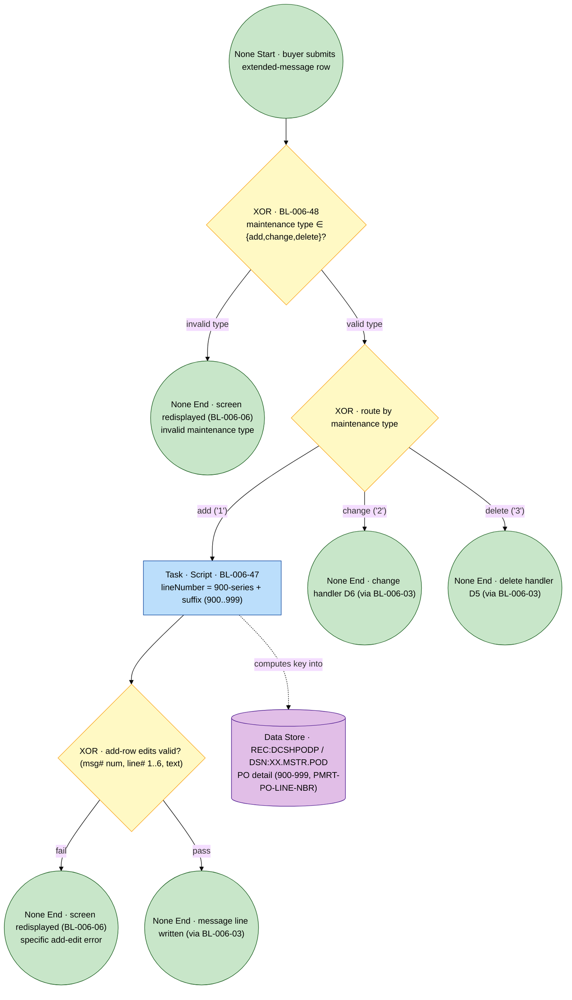
```mermaid
%%{init: {'theme': 'base'}}%%
flowchart TD
  classDef ev   fill:#c8e6c9,stroke:#1b5e20,color:#000;
  classDef task fill:#bbdefb,stroke:#0d47a1,color:#000;
  classDef gw   fill:#fff9c4,stroke:#f9a825,color:#000;
  classDef data fill:#e1bee7,stroke:#4a148c,color:#000;

  st(("None Start · buyer submits extended-message row")):::ev
  g48{"XOR · BL-006-48<br/>maintenance type ∈ {add,change,delete}?"}:::gw
  badtyp(("None End · screen redisplayed (BL-006-06)<br/>invalid maintenance type")):::ev
  groute{"XOR · route by maintenance type"}:::gw
  t47["Task · Script · BL-006-47<br/>lineNumber = 900-series + suffix (900..999)"]:::task
  gadd{"XOR · add-row edits valid? (msg# num, line# 1..6, text)"}:::gw
  addErr(("None End · screen redisplayed (BL-006-06)<br/>specific add-edit error")):::ev
  chg(("None End · change handler D6 (via BL-006-03)")):::ev
  del(("None End · delete handler D5 (via BL-006-03)")):::ev
  okEnd(("None End · message line written (via BL-006-03)")):::ev
  pod[("Data Store · REC:DCSHPODP / DSN:XX.MSTR.POD<br/>PO detail (900-999, PMRT-PO-LINE-NBR)")]:::data

  st --> g48
  g48 -- "invalid type" --> badtyp
  g48 -- "valid type" --> groute
  groute -- "change ('2')" --> chg
  groute -- "delete ('3')" --> del
  groute -- "add ('1')" --> t47 --> gadd
  gadd -- "fail" --> addErr
  gadd -- "pass" --> okEnd
  t47 -. "computes key into" .-> pod
```

### 4.7 D2109 — async PO accept & distribute (`49` fan-out to external channels)

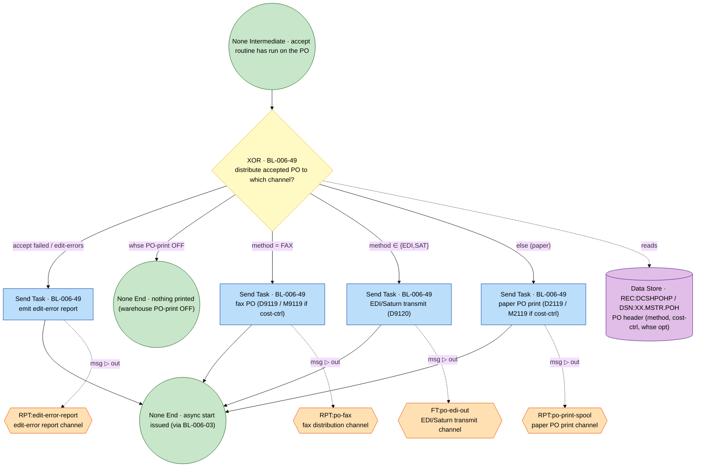
```mermaid
%%{init: {'theme': 'base'}}%%
flowchart TD
  classDef ev   fill:#c8e6c9,stroke:#1b5e20,color:#000;
  classDef task fill:#bbdefb,stroke:#0d47a1,color:#000;
  classDef gw   fill:#fff9c4,stroke:#f9a825,color:#000;
  classDef data fill:#e1bee7,stroke:#4a148c,color:#000;
  classDef ext  fill:#ffe0b2,stroke:#e65100,color:#000;

  acc(("None Intermediate · accept routine has run on the PO")):::ev
  g49{"XOR · BL-006-49<br/>distribute accepted PO to which channel?"}:::gw
  serr["Send Task · BL-006-49<br/>emit edit-error report"]:::task
  none(("None End · nothing printed (warehouse PO-print OFF)")):::ev
  sfax["Send Task · BL-006-49<br/>fax PO (D9119 / M9119 if cost-ctrl)"]:::task
  sedi["Send Task · BL-006-49<br/>EDI/Saturn transmit (D9120)"]:::task
  spap["Send Task · BL-006-49<br/>paper PO print (D2119 / M2119 if cost-ctrl)"]:::task
  doneEnd(("None End · async start issued (via BL-006-03)")):::ev
  poh[("Data Store · REC:DCSHPOHP / DSN:XX.MSTR.POH<br/>PO header (method, cost-ctrl, whse opt)")]:::data
  rspool{{"RPT:po-print-spool<br/>paper PO print channel"}}:::ext
  rerr{{"RPT:edit-error-report<br/>edit-error report channel"}}:::ext
  rfax{{"RPT:po-fax<br/>fax distribution channel"}}:::ext
  fedi{{"FT:po-edi-out<br/>EDI/Saturn transmit channel"}}:::ext

  acc --> g49
  g49 -- "accept failed / edit-errors" --> serr --> doneEnd
  g49 -- "whse PO-print OFF" --> none
  g49 -- "method = FAX" --> sfax --> doneEnd
  g49 -- "method ∈ {EDI,SAT}" --> sedi --> doneEnd
  g49 -- "else (paper)" --> spap --> doneEnd
  g49 -. "reads" .-> poh
  serr -. "msg ▷ out" .-> rerr
  sfax -. "msg ▷ out" .-> rfax
  sedi -. "msg ▷ out" .-> fedi
  spap -. "msg ▷ out" .-> rspool
```

Integration attributes (all four channels): direction **out**, style **fire-and-forget (async)**, delivery **at-least-once**, idempotency **not guaranteed** (re-emit duplicates), failure **edit-error report**. The print/fax/EDI *modules* are internal/absent; the *channels* are the external participants.

### 4.8 Rule → element conformance (B)

| Rule | Title | Logic type | BPMN element | Diagram |
|---|---|---|---|---|
| BL-006-35 | Gate PO recalc on purchased/received status | validation (write-gate) | `XOR` (header-found ∧ status) | §4.2 |
| BL-006-36 | Recompute PO totals over received detail lines | aggregation | `Loop Sub-Process` (bracketed by engine init/term) | §4.2 |
| BL-006-37 | Exclude break/msg/correction lines | validation (filter) | `XOR` (3-way end-scan/skip/include) | §4.2 body |
| BL-006-38 | Per-line quantity basis | selection | `Task · Business Rule` | §4.2 body |
| BL-006-39 | Invoke cost engine 4-phase; hard-stop | routing | `Task · Service` + Error Boundary→08 | §4.2 body |
| BL-006-40 | Persist recomputed totals to header | transformation (calc) | `Task · Service` (re-read under lock 04, rewrite) | §4.2 |
| BL-006-41 | Route hub→receiver-header (LINK vs XCTL) | routing | `XOR` (transfers via BL-006-02) | §4.3 |
| BL-006-42 | Read PO detail/item for item-review | data-load | `Task · Service` | §4.3 |
| BL-006-43 | Validate recommended-order entry fields | validation | `XOR` (edit chain; fail→06) | §4.4 |
| BL-006-44 | Recompute & persist DUE-side header totals (D0191) | aggregation | `Task · Service` (under lock 04; reused by D2113 & D2126) | §4.3 / §4.5 |
| BL-006-45 | Accrue detail deltas + rewrite detail | transformation (calc) | `Task · Service` (per-changed-line, in Loop) + Error Boundary→08 | §4.5 body |
| BL-006-46 | Determine vendor cost when cost-control on (D2139) | enrichment | `Task · Service` (gated by both-switch XOR) | §4.4 |
| BL-006-47 | Extended-message line number = 900 + suffix | classification | `Task · Script` | §4.6 |
| BL-006-48 | Validate extended-message add | validation | `XOR` (maint-type route + add edits; fail→06) | §4.6 |
| BL-006-49 | Distribute accepted PO to channel; else error report | routing | `XOR` + 4 Send Tasks → external participants | §4.7 |

15/15 realised. Cited: 02/03 (transfers/yields), 04/05 (lock notes), 06/08 (shared Ends). `BL-006-44` is one node reused by two callers (reuse, not duplication). Structural-only nodes: dispatch XOR; engine init/term bracket Tasks; skip/mode/changed/both-switch XORs + the 45 Loop marker.

### 4.9 Derived Mealy FSM (B)

All-XOR/loop (no IOR/AND). Loops `36`, `45` are contained in their Sub-Processes (P7). Per-region (each region's shared sinks: `End_06` screen redisplayed, `End_08` hard-fail, transfer/yield via 02/03):

```
# D2157
S_2157 --[ absent ∨ status∉{purch,rcvd} ] / {35} --> End_06
S_2157 --[ found ∧ status ok ] / {35,36,40} --> End_recalc_OK   (36 loop: include/{37,38,39}, skip/{37}, end-scan/{37}; 39 fault → End_08; 40 fault → End_08)
# D2113
S_2113 --[ stay/page/add/cancel ] / {42} --> End_06(redisplay)
S_2113 --[ receiver-hdr ∧ detail-updated ] / {42,44,41} --> End_transfer_D2112   (44 D0191 bad → End_06; 44 fault → End_08)
S_2113 --[ receiver-hdr ∧ ¬updated ] / {42,41} --> End_transfer_D2112
# D2111
S_2111 --[ edit fails ] / {43} --> End_06
S_2111 --[ pass ∧ ¬both switches ] / {43} --> End_accept
S_2111 --[ pass ∧ both switches ] / {43,46} --> End_accept
# D2126
S_2126 --[ inquiry-only ] / {} --> End_inquiry
S_2126 --[ update ] / {45*} --> M_lines   (45 loop: changed/{45}, unchanged/{}, absent/{45}→End_06, fault/{45}→End_08)
M_lines --[ no change ] / {} --> End_OK ; --[ changed ] / {44} --> End_OK ; --[ D0191 bad ] / {44} --> End_06 ; --[ fault ] / {44} --> End_08
# D2127
S_2127 --[ bad type ] / {48} --> End_06 ; --[ change ] / {48} --> End_change ; --[ delete ] / {48} --> End_delete
S_2127 --[ add ∧ edits pass ] / {48,47} --> End_msg_written ; --[ add ∧ edits fail ] / {48,47} --> End_06
# D2109
M_accepted --[ accept failed ∨ edit-errors ] / {49} --> End_async (RPT:edit-error-report)
M_accepted --[ whse print OFF ] / {49} --> End_nothing ; --[ FAX ] / {49} --> End_async (RPT:po-fax)
M_accepted --[ EDI/SAT ] / {49} --> End_async (FT:po-edi-out) ; --[ paper ] / {49} --> End_async (RPT:po-print-spool)
```

## 5. Process C — PO cross-reference, receiver & item-PO (`BL-006-50 … 63`)

Five independent SESE sub-flows: **PO-add chain** (D2128/D2118), **PO-print** (D2119), **Receiver Summary** (D2123), **PO-management menu** (D2121), **Buyer-item maintenance** (D2175). The surface's DB2 concentrates here. The one genuine external channel is `RPT:po-print-spool` (PO-print document, `57`). `BL-006-50` is the canonical §6.4 split (data-tier failure → hard CICS error); `59` is a cluster-local DB2 funnel refining shared `07`.

### 5.1 Orchestration

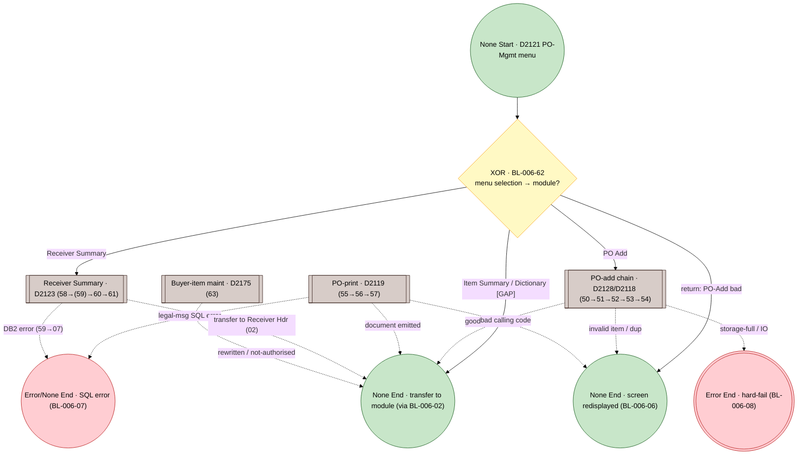
```mermaid
%%{init: {'theme': 'base'}}%%
flowchart TD
  classDef ev   fill:#c8e6c9,stroke:#1b5e20,color:#000;
  classDef gw   fill:#fff9c4,stroke:#f9a825,color:#000;
  classDef err  fill:#ffcdd2,stroke:#b71c1c,color:#000;
  classDef sub  fill:#d7ccc8,stroke:#3e2723,color:#000;
  classDef ev2  fill:#c8e6c9,stroke:#1b5e20,color:#000;

  SOFT(("None End · screen redisplayed (BL-006-06)")):::ev
  SQLE(("Error/None End · SQL error (BL-006-07)")):::err
  HARD((("Error End · hard-fail (BL-006-08)"))):::err
  S62(("None Start · D2121 PO-Mgmt menu")):::ev
  G62{"XOR · BL-006-62<br/>menu selection → module?"}:::gw
  E62R(("None End · transfer to module (via BL-006-02)")):::ev
  ADD[["PO-add chain · D2128/D2118 (50→51→52→53→54)"]]:::sub
  PRT[["PO-print · D2119 (55→56→57)"]]:::sub
  RCV[["Receiver Summary · D2123 (58→(59)→60→61)"]]:::sub
  ITM[["Buyer-item maint · D2175 (63)"]]:::sub

  S62 --> G62
  G62 -- "Receiver Summary" --> RCV
  G62 -- "PO Add" --> ADD
  G62 -- "Item Summary / Dictionary [GAP]" --> E62R
  G62 -- "return: PO-Add bad" --> SOFT
  ADD -. "good add → caller" .-> E62R
  ADD -. "invalid item / dup" .-> SOFT
  ADD -. "storage-full / IO" .-> HARD
  PRT -. "document emitted" .-> E62R
  PRT -. "bad calling code" .-> SOFT
  PRT -. "legal-msg SQL error" .-> SQLE
  RCV -. "transfer to Receiver Hdr (02)" .-> E62R
  RCV -. "DB2 error (59→07)" .-> SQLE
  ITM -. "rewritten / not-authorised" .-> E62R
```

### 5.2 PO-add chain — D2128 / D2118 (`50 → 51 → 52 → 53 → 54`)

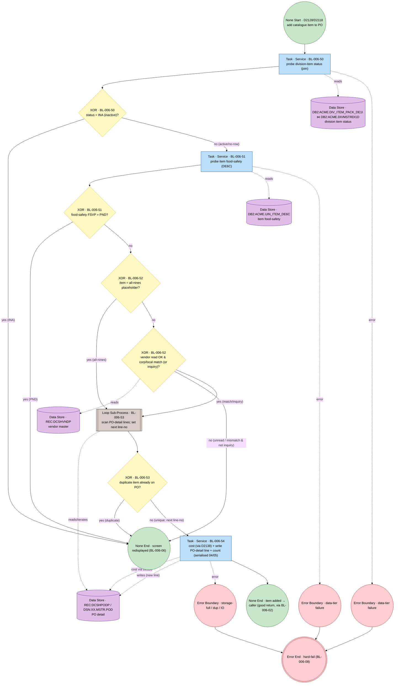
```mermaid
%%{init: {'theme': 'base'}}%%
flowchart TD
  classDef ev   fill:#c8e6c9,stroke:#1b5e20,color:#000;
  classDef task fill:#bbdefb,stroke:#0d47a1,color:#000;
  classDef gw   fill:#fff9c4,stroke:#f9a825,color:#000;
  classDef err  fill:#ffcdd2,stroke:#b71c1c,color:#000;
  classDef data fill:#e1bee7,stroke:#4a148c,color:#000;
  classDef sub  fill:#d7ccc8,stroke:#3e2723,color:#000;

  S(("None Start · D2128/D2118 add catalogue item to PO")):::ev
  T50["Task · Service · BL-006-50<br/>probe division-item status (join)"]:::task
  X50{"XOR · BL-006-50<br/>status = INA (inactive)?"}:::gw
  T51["Task · Service · BL-006-51<br/>probe item food-safety (DE6C)"]:::task
  X51{"XOR · BL-006-51<br/>food-safety FSVP = PND?"}:::gw
  X52G{"XOR · BL-006-52<br/>item = all-nines placeholder?"}:::gw
  X52{"XOR · BL-006-52<br/>vendor read OK & corp/local match (or inquiry)?"}:::gw
  L53[["Loop Sub-Process · BL-006-53<br/>scan PO-detail lines; set next line-no"]]:::sub
  X53{"XOR · BL-006-53<br/>duplicate item already on PO?"}:::gw
  T54["Task · Service · BL-006-54<br/>cost (via D2138) + write PO-detail line + count (serialised 04/05)"]:::task
  EOK(("None End · item added → caller (good return, via BL-006-02)")):::ev
  DDE1I[("Data Store · DB2:ACME.DIV_ITEM_PACK_DE1I ⋈ DB2:ACME.DIVMSTRDI1D<br/>division item status")]:::data
  DDE6C[("Data Store · DB2:ACME.UIN_ITEM_DE6C<br/>item food-safety")]:::data
  DVND[("Data Store · REC:DCSHVNDP<br/>vendor master")]:::data
  DPOD[("Data Store · REC:DCSHPODP / DSN:XX.MSTR.POD<br/>PO detail")]:::data
  SOFT(("None End · screen redisplayed (BL-006-06)")):::ev
  HARD((("Error End · hard-fail (BL-006-08)"))):::err
  EB50(("Error Boundary · data-tier failure")):::err
  EB51(("Error Boundary · data-tier failure")):::err
  EB54(("Error Boundary · storage-full / dup / IO")):::err

  S --> T50 --> X50
  T50 -. "reads" .-> DDE1I
  T50 -. "error" .-> EB50 --> HARD
  X50 -- "yes (INA)" --> SOFT
  X50 -- "no (active/no-row)" --> T51 --> X51
  T51 -. "reads" .-> DDE6C
  T51 -. "error" .-> EB51 --> HARD
  X51 -- "yes (PND)" --> SOFT
  X51 -- "no" --> X52G
  X52G -- "yes (all-nines)" --> L53
  X52G -- "no" --> X52
  X52 -. "reads" .-> DVND
  X52 -- "no (unread / mismatch & not inquiry)" --> SOFT
  X52 -- "yes (match/inquiry)" --> L53
  L53 -. "reads/iterates" .-> DPOD
  L53 --> X53
  X53 -- "yes (duplicate)" --> SOFT
  X53 -- "no (unique; next line-no)" --> T54
  T54 -. "cost via D2138" .-> DPOD
  T54 -. "writes (new line)" .-> DPOD
  T54 -. "error" .-> EB54 --> HARD
  T54 --> EOK
```

The `53` loop body increments `nextLineNumber` per existing line and flags duplicates (the side-effect seeds `54`); the gates' soft outcomes (`INA`, `PND`, mismatch, duplicate) all route to the shared `06`, and every data-tier hard-fault to the shared `08`.

### 5.3 PO-print — D2119 (`55 → 56 → 57`)

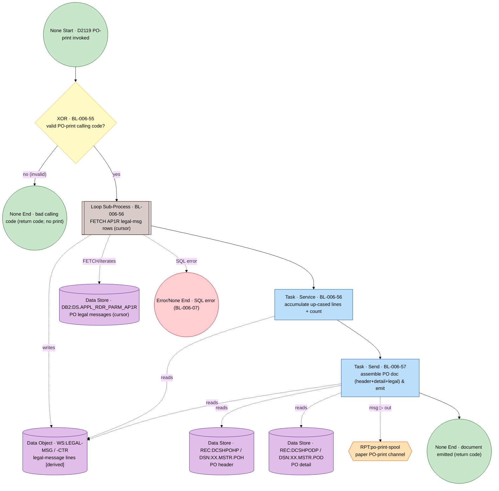
```mermaid
%%{init: {'theme': 'base'}}%%
flowchart TD
  classDef ev   fill:#c8e6c9,stroke:#1b5e20,color:#000;
  classDef task fill:#bbdefb,stroke:#0d47a1,color:#000;
  classDef gw   fill:#fff9c4,stroke:#f9a825,color:#000;
  classDef err  fill:#ffcdd2,stroke:#b71c1c,color:#000;
  classDef data fill:#e1bee7,stroke:#4a148c,color:#000;
  classDef sub  fill:#d7ccc8,stroke:#3e2723,color:#000;
  classDef ext  fill:#ffe0b2,stroke:#e65100,color:#000;

  S(("None Start · D2119 PO-print invoked")):::ev
  X55{"XOR · BL-006-55<br/>valid PO-print calling code?"}:::gw
  EBCC(("None End · bad calling code (return code; no print)")):::ev
  L56[["Loop Sub-Process · BL-006-56<br/>FETCH AP1R legal-msg rows (cursor)"]]:::sub
  T56X["Task · Service · BL-006-56<br/>accumulate up-cased lines + count"]:::task
  T57["Task · Send · BL-006-57<br/>assemble PO doc (header+detail+legal) & emit"]:::task
  EOK(("None End · document emitted (return code)")):::ev
  DAP1R[("Data Store · DB2:DS.APPL_RDR_PARM_AP1R<br/>PO legal messages (cursor)")]:::data
  DLEG[("Data Object · WS:LEGAL-MSG / -CTR<br/>legal-message lines [derived]")]:::data
  DPOH[("Data Store · REC:DCSHPOHP / DSN:XX.MSTR.POH<br/>PO header")]:::data
  DPOD[("Data Store · REC:DCSHPODP / DSN:XX.MSTR.POD<br/>PO detail")]:::data
  SPOOL{{"RPT:po-print-spool<br/>paper PO-print channel"}}:::ext
  SQLE(("Error/None End · SQL error (BL-006-07)")):::err

  S --> X55
  X55 -- "no (invalid)" --> EBCC
  X55 -- "yes" --> L56
  L56 -. "FETCH/iterates" .-> DAP1R
  L56 -. "writes" .-> DLEG
  L56 -. "SQL error" .-> SQLE
  L56 --> T56X --> T57
  T56X -. "reads" .-> DLEG
  T57 -. "reads" .-> DPOH
  T57 -. "reads" .-> DPOD
  T57 -. "reads" .-> DLEG
  T57 -. "msg ▷ out" .-> SPOOL
  T57 --> EOK
```

`57 → RPT:po-print-spool`: direction out, fire-and-forget, at-least-once, failure = bad-print return code (`D2119P-RETURN-CODE`).

### 5.4 Receiver Summary — D2123 (`58 → (59) → 60 → 61`)

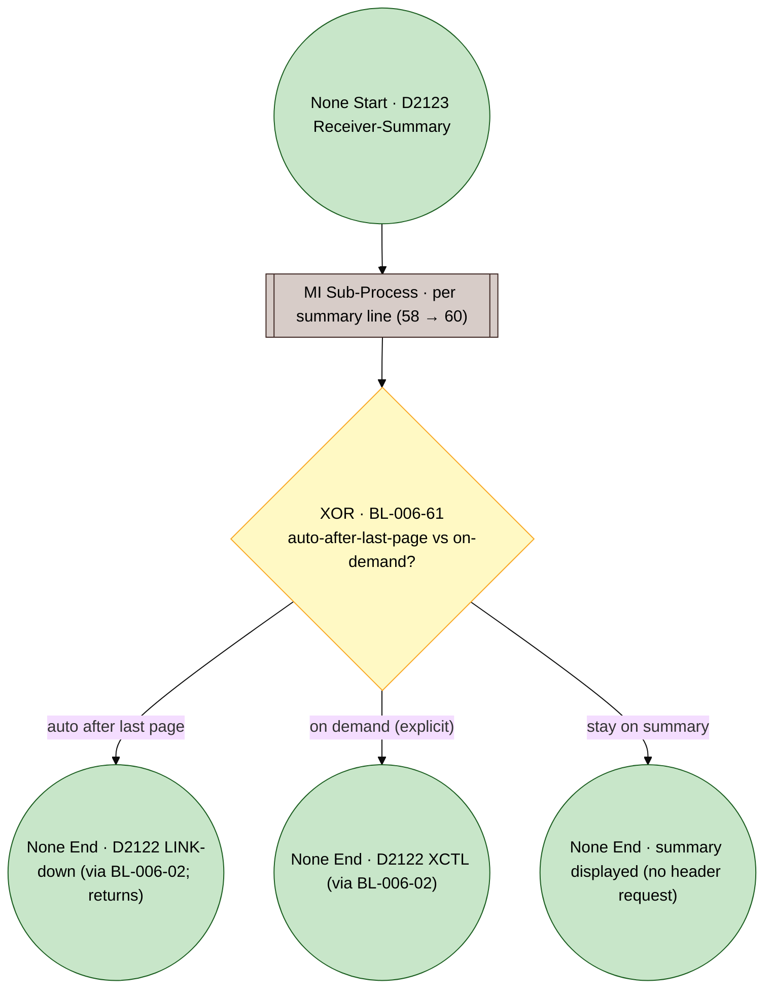
```mermaid
%%{init: {'theme': 'base'}}%%
flowchart TD
  classDef ev   fill:#c8e6c9,stroke:#1b5e20,color:#000;
  classDef task fill:#bbdefb,stroke:#0d47a1,color:#000;
  classDef gw   fill:#fff9c4,stroke:#f9a825,color:#000;
  classDef err  fill:#ffcdd2,stroke:#b71c1c,color:#000;
  classDef data fill:#e1bee7,stroke:#4a148c,color:#000;
  classDef sub  fill:#d7ccc8,stroke:#3e2723,color:#000;
  classDef ext  fill:#ffe0b2,stroke:#e65100,color:#000;

  S(("None Start · D2123 Receiver-Summary")):::ev
  MI[["MI Sub-Process · per summary line (58 → 60)"]]:::sub
  X61{"XOR · BL-006-61<br/>auto-after-last-page vs on-demand?"}:::gw
  E61L(("None End · D2122 LINK-down (via BL-006-02; returns)")):::ev
  E61X(("None End · D2122 XCTL (via BL-006-02)")):::ev
  EDISP(("None End · summary displayed (no header request)")):::ev
  S --> MI --> X61
  X61 -- "auto after last page" --> E61L
  X61 -- "on demand (explicit)" --> E61X
  X61 -- "stay on summary" --> EDISP
```

**MI body** (one summary line: `58` aggregate, `59` DB2 funnel, `60` normalise):

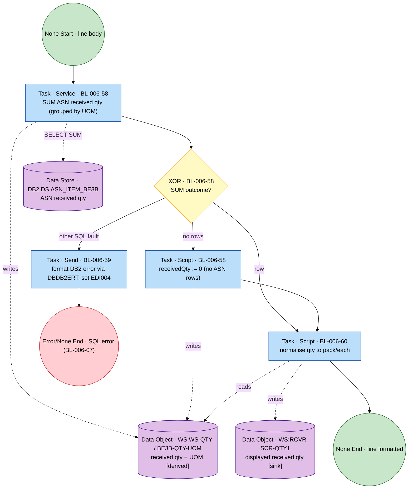
```mermaid
%%{init: {'theme': 'base'}}%%
flowchart TD
  classDef ev   fill:#c8e6c9,stroke:#1b5e20,color:#000;
  classDef task fill:#bbdefb,stroke:#0d47a1,color:#000;
  classDef gw   fill:#fff9c4,stroke:#f9a825,color:#000;
  classDef err  fill:#ffcdd2,stroke:#b71c1c,color:#000;
  classDef data fill:#e1bee7,stroke:#4a148c,color:#000;
  classDef ext  fill:#ffe0b2,stroke:#e65100,color:#000;

  LS(("None Start · line body")):::ev
  T58["Task · Service · BL-006-58<br/>SUM ASN received qty (grouped by UOM)"]:::task
  X58{"XOR · BL-006-58<br/>SUM outcome?"}:::gw
  Z58["Task · Script · BL-006-58<br/>receivedQty := 0 (no ASN rows)"]:::task
  T59["Task · Send · BL-006-59<br/>format DB2 error via DBDB2ERT; set EDI004"]:::task
  T60["Task · Script · BL-006-60<br/>normalise qty to pack/each"]:::task
  LE(("None End · line formatted")):::ev
  DBE3B[("Data Store · DB2:DS.ASN_ITEM_BE3B<br/>ASN received qty")]:::data
  DQTY[("Data Object · WS:WS-QTY / BE3B-QTY-UOM<br/>received qty + UOM [derived]")]:::data
  DDISP[("Data Object · WS:RCVR-SCR-QTY1<br/>displayed received qty [sink]")]:::data
  SQLE(("Error/None End · SQL error (BL-006-07)")):::err

  LS --> T58 --> X58
  T58 -. "SELECT SUM" .-> DBE3B
  X58 -- "row" --> T60
  X58 -- "no rows" --> Z58 --> T60
  X58 -- "other SQL fault" --> T59
  T58 -. "writes" .-> DQTY
  Z58 -. "writes" .-> DQTY
  T59 --> SQLE
  T60 -. "reads" .-> DQTY
  T60 -. "writes" .-> DDISP
  T60 --> LE
```

`59` is the cluster-local DB2 funnel (internal `DBDB2ERT`) refining shared `07` — not a §6.4 hard-fault; `DBDB2ERT` is internal (no Message Flow).

### 5.5 PO-management menu (`62`) and Buyer-item maintenance (`63`)

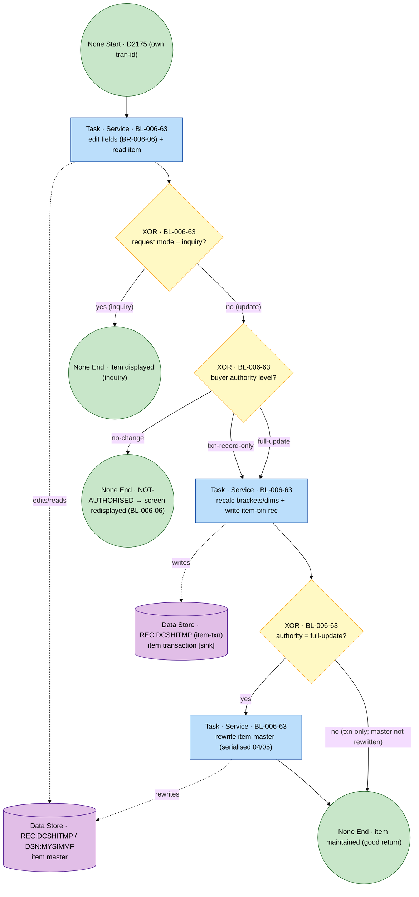
```mermaid
%%{init: {'theme': 'base'}}%%
flowchart TD
  classDef ev   fill:#c8e6c9,stroke:#1b5e20,color:#000;
  classDef task fill:#bbdefb,stroke:#0d47a1,color:#000;
  classDef gw   fill:#fff9c4,stroke:#f9a825,color:#000;
  classDef data fill:#e1bee7,stroke:#4a148c,color:#000;

  S(("None Start · D2175 (own tran-id)")):::ev
  T63E["Task · Service · BL-006-63<br/>edit fields (BR-006-06) + read item"]:::task
  XMODE{"XOR · BL-006-63<br/>request mode = inquiry?"}:::gw
  XAUTH{"XOR · BL-006-63<br/>buyer authority level?"}:::gw
  T63R["Task · Service · BL-006-63<br/>recalc brackets/dims + write item-txn rec"]:::task
  XW{"XOR · BL-006-63<br/>authority = full-update?"}:::gw
  T63W["Task · Service · BL-006-63<br/>rewrite item-master (serialised 04/05)"]:::task
  EDISP2(("None End · item displayed (inquiry)")):::ev
  ENA(("None End · NOT-AUTHORISED → screen redisplayed (BL-006-06)")):::ev
  EOKITM(("None End · item maintained (good return)")):::ev
  DITM[("Data Store · REC:DCSHITMP / DSN:MYSIMMF<br/>item master")]:::data
  DTXN[("Data Store · REC:DCSHITMP (item-txn)<br/>item transaction [sink]")]:::data

  S --> T63E
  T63E -. "edits/reads" .-> DITM
  T63E --> XMODE
  XMODE -- "yes (inquiry)" --> EDISP2
  XMODE -- "no (update)" --> XAUTH
  XAUTH -- "no-change" --> ENA
  XAUTH -- "txn-record-only" --> T63R
  XAUTH -- "full-update" --> T63R
  T63R -. "writes" .-> DTXN
  T63R --> XW
  XW -- "yes" --> T63W
  XW -- "no (txn-only; master not rewritten)" --> EOKITM
  T63W -. "rewrites" .-> DITM
  T63W --> EOKITM
```

`BL-006-62` (PO-management menu) is the single routing XOR shown in §5.1 (`map-selection-to-module`, mode set on the taken branch; some targets `[GAP]`). `BL-006-63` is one rule whose pseudocode decomposes into several `BL-006-63`-tagged nodes (edit/read, mode XOR, authority XOR, recalc+txn, rewrite) — counted once.

### 5.6 Rule → element conformance (C)

| Rule | Title | Logic type | BPMN element | Diagram |
|---|---|---|---|---|
| BL-006-50 | Reject inactive division-item on PO add | validation (write-gate) | `Task · Service` (probe, EB→08) → `XOR` status=INA? | §5.2 |
| BL-006-51 | Reject pending food-safety item | validation (write-gate) | `XOR` (reads DE6C; read EB→08) | §5.2 |
| BL-006-52 | Enforce vendor corp/local security | validation (write-gate) | `XOR` (all-9s bypass + scope match) | §5.2 |
| BL-006-53 | Reject duplicate item on PO | validation (write-gate) | `XOR` over a `Loop Sub-Process` detail scan | §5.2 |
| BL-006-54 | Write PO-detail line, cost it, count | transformation (calc) | `Task · Service` (cost via D2138; EB→08; serialised 04/05) | §5.2 |
| BL-006-55 | Reject invalid PO-print calling code | validation (filter) | `XOR` (bad→bad-calling-code End directly) | §5.3 |
| BL-006-56 | Load PO legal messages | data-load | `Loop Sub-Process` (AP1R cursor) → `Task · Service`; SQL→07 | §5.3 |
| BL-006-57 | Assemble & emit PO-print document | reporting | `Task · Send` → Message Flow → RPT:po-print-spool | §5.3 |
| BL-006-58 | Aggregate ASN received qty | aggregation | `Task · Service` SUM BE3B → `XOR` outcome (row/no-rows→0/fault→59) | §5.4 |
| BL-006-59 | Format DB2 error via DBDB2ERT | error-handling | `Task · Send` internal (sets EDI004) refining 07 | §5.4 |
| BL-006-60 | Normalise received qty to pack/each | transformation (calc) | `Task · Script` | §5.4 |
| BL-006-61 | Route to Receiver Header (auto/on-demand) | routing | `XOR` (LINK-down vs XCTL → D2122 via 02) | §5.4 |
| BL-006-62 | Route PO-management menu selection | routing | `XOR` (selection → module, mode set) | §5.1 |
| BL-006-63 | Edit/recalc/rewrite buyer item-master | transformation (calc) | `Task · Service` + mode/authority XORs (all carry 63) | §5.5 |

14/14 realised (64 unused). Cited: 02/03 (transfers), 04/05 (lock notes), 06/07/08 (shared Ends).

### 5.7 Derived Mealy FSM (C)

Five independent regions; concurrency only in the Receiver-Summary MI (big-step — per-line independent, effect = set `{58,60}`; any line's DB2 fault → `59 → End07`). All others pure XOR/sequence.

```
# PO-add chain
S_ADD --[ status=INA ]/{50} --> End06 ; --[ data-tier fault ]/{50} --> End08 ; --[ active/no-row ]/{50} --> q51
q51 --[ FSVP=PND ]/{51} --> End06 ; --[ fault ]/{51} --> End08 ; --[ ¬pending ]/{51} --> q52
q52 --[ all-nines ]/{52} --> Mdup ; --[ mismatch&¬inq | unread ]/{52} --> End06 ; --[ fault ]/{52} --> End08 ; --[ match/inq ]/{52} --> Mdup
Mdup --[ duplicate ]/{53} --> End06 ; --[ unique ]/{53,54} --> End_addOK ; --[ 54 storage/dup/IO ]/{54} --> End08
# PO-print
S_PRT --[ ¬valid code ]/{55} --> End_badCC ; --[ valid ]/{55,56} --> q56
q56 --[ SQL fault ]/{56} --> End07 ; --[ EOF ]/{56,57} --> End_emitted (→ RPT:po-print-spool)
# Receiver Summary
S_RCV --[ ∀ lines ok ]/{58,60}*N --> M_lines ; --[ ∃ line DB2 fault ]/{58,59} --> End07
M_lines --[ auto after last ]/{61} --> End_rcvHdrLink ; --[ on demand ]/{61} --> End_rcvHdrXctl ; --[ stay ]/{} --> End_summary
# PO-Mgmt menu
S_MENU --[ selection ]/{62} --> End_transfer (mode set, via 02) ; --[ PO-Add bad return ]/{62} --> End06
# Buyer-item maint
S_ITM --[ inquiry ]/{63} --> End_display ; --[ no-change ]/{63} --> End06
S_ITM --[ txn-only ]/{63} --> End_maintOK ; --[ full-update ]/{63} --> End_maintOK
```

## 6. Process D — item cost-add & deal control (`BL-006-65 … 79`)

Five independent SESE sub-flows: **Deal Control** (D2147), **Cost Series inquiry** (D2135), **User Deal** (D2149), **Item Cost Maintenance** (D2143, the CAD writer), **TIPS Truckload Discount** (D2162). No DB2, no external participants. `D0630`/`D2138`/`D2131`/`D2143` are internal subroutines. Cost-deal & item writes are **un-ENQ-guarded** (concurrency gap §14, annotated on `70`/`78`/`79`).

### 6.1 Orchestration

```mermaid
%%{init: {'theme': 'base'}}%%
flowchart TD
  classDef ev   fill:#c8e6c9,stroke:#1b5e20,color:#000;
  classDef task fill:#bbdefb,stroke:#0d47a1,color:#000;
  classDef gw   fill:#fff9c4,stroke:#f9a825,color:#000;
  classDef err  fill:#ffcdd2,stroke:#b71c1c,color:#000;
  classDef data fill:#e1bee7,stroke:#4a148c,color:#000;
  classDef sub  fill:#d7ccc8,stroke:#3e2723,color:#000;

  soft(("None End · screen redisplayed (BL-006-06)")):::ev
  yield(("None End · yield terminal (via BL-006-03)")):::ev
  xferD0630(("None End · transfer to D0630 commit (via BL-006-02)")):::ev
  hard((("Error End · hard-fail (BL-006-08)"))):::err

  s1(("None Start · Deal Control (D2147)")):::ev
  g65{"XOR · BL-006-65<br/>classify deal action?"}:::gw
  g66{"XOR · BL-006-66<br/>attention key valid for action?"}:::gw
  t67["Task · Service · BL-006-67<br/>edit deal + derive cost (2-phase D2138)"]:::task
  sub69[["Loop Sub-Process · BL-006-69<br/>enumerate deal cost rows (AIX-3)"]]:::sub
  g68{"XOR · BL-006-68<br/>any open PO references the deal?"}:::gw
  t70["Task · Service · BL-006-70<br/>build copy-queue (DB/DC/DD·DL) + delegate commit → D0630 (un-ENQ §14)"]:::task
  t71["Task · Service · BL-006-71<br/>hand off to cost series (variant by PF key)"]:::task
  t72["Task · Service · BL-006-72<br/>hand off to user-deal screen"]:::task

  s2(("None Start · Cost Series (D2135)")):::ev
  g73{"XOR · BL-006-73<br/>vendor & item both exist?"}:::gw
  sub74[["Loop Sub-Process · BL-006-74<br/>browse cost series (paging)"]]:::sub
  t75["Task · Script · BL-006-75<br/>format cost series"]:::task
  t76["Task · Service · BL-006-76<br/>drill to single-cost detail (D2143)"]:::task

  s3(("None Start · User Deal (D2149)")):::ev
  t77["Task · Service · BL-006-77<br/>present user-deal info (read-only)"]:::task
  s4(("None Start · Item Cost Maint (D2143)")):::ev
  t78["Task · Service · BL-006-78<br/>maintain CAD (add CB/change CC/delete CD) + cascade → D0630 (un-ENQ §14)"]:::task
  eb78(("Error Boundary · CAD I/O fault")):::err
  s5(("None Start · TIPS Discount (D2162)")):::ev
  t79["Task · Service · BL-006-79<br/>apply/remove truckload discount on item (un-ENQ §14)"]:::task
  eb79(("Error Boundary · item REWRITE fault")):::err
  g67{"XOR · cost-engine return ok?"}:::gw
  j70{"XOR join · proceed to copy-queue"}:::gw

  CAD[("Data Store · REC:DCSFCAD / DSN:XX.MSTR.CAD<br/>cost-deal (+AIX-3)")]:::data
  ITM[("Data Store · REC:DCSHITMP / DSN:MYSIMMF<br/>item master")]:::data
  VND[("Data Store · REC:DCSHVNDP / DSN:MYVNDMF<br/>vendor master (inbound ref)")]:::data
  TSQ[("Data Store · DSN:TS3P<br/>deal copy-queue TS")]:::data

  s1 --> g65
  g65 -- "add/change" --> g66
  g65 -- "delete" --> g66
  g65 -- "inquiry" --> g66
  g65 -- "invalid action" --> soft
  g66 -- "ADD/CHANGE + valid key" --> t67
  g66 -- "DELETE + DELETE key" --> sub69
  g66 -- "INQUIRY + PF4/PF5" --> t71
  g66 -- "INQUIRY + PF6" --> t72
  g66 -- "CANCEL key" --> yield
  g66 -- "invalid attention key" --> soft
  t67 --> g67
  g67 -- "good return" --> j70
  g67 -- "bad return (soft)" --> yield
  sub69 -. "reads" .-> CAD
  sub69 --> g68
  g68 -- "no open PO" --> j70
  g68 -- "open PO / cancelled (soft)" --> yield
  j70 --> t70
  t70 -. "writes" .-> TSQ
  t70 --> xferD0630
  t71 --> yield
  t72 --> yield
  s2 --> g73
  g73 -. "reads" .-> VND
  g73 -. "reads" .-> ITM
  g73 -- "not found" --> soft
  g73 -- "both exist" --> sub74
  sub74 -. "iterates" .-> CAD
  sub74 --> t75 --> t76 --> yield
  s3 --> t77 --> yield
  t77 -. "reads" .-> CAD
  s4 --> t78
  t78 -. "writes" .-> CAD
  t78 --> xferD0630
  t78 -. "error" .-> eb78 --> hard
  s5 --> t79
  t79 -. "reads/writes" .-> ITM
  t79 -- "item not found" --> soft
  t79 -- "applied/removed" --> yield
  t79 -. "error" .-> eb79 --> hard
```

### 6.2 BL-006-69 delete-guard enumeration loop (body checks each item's open-PO via D2131)

```mermaid
%%{init: {'theme': 'base'}}%%
flowchart TD
  classDef ev   fill:#c8e6c9,stroke:#1b5e20,color:#000;
  classDef task fill:#bbdefb,stroke:#0d47a1,color:#000;
  classDef gw   fill:#fff9c4,stroke:#f9a825,color:#000;
  classDef data fill:#e1bee7,stroke:#4a148c,color:#000;

  bin(("None Start · loop body (per sequence#)")):::ev
  read["Task · Service<br/>read next CAD row by control# (AIX-3); seq:=seq+1"]:::task
  gmore{"XOR · loop guard · row present?"}:::gw
  probe["Task · Service<br/>open-PO probe for item (internal D2131)"]:::task
  gpo{"XOR · PO-detail found?"}:::gw
  setflag["Task · Script<br/>openPoFound := true (accumulate)"]:::task
  acc[("Data Object · [derived]<br/>deal items + openPoFound")]:::data
  bout(("None End · loop body complete")):::ev
  cad[("Data Store · REC:DCSFCAD / DSN:XX.MSTR.CAD<br/>cost-deal (AIX-3 = control# + seq#)")]:::data
  pod[("Data Store · REC:DCSHPODP / DSN:XX.MSTR.POD<br/>PO detail (probed via D2131)")]:::data

  bin --> read
  read -. "reads (AIX-3)" .-> cad
  read --> gmore
  gmore -- "no row → exhausted" --> bout
  gmore -- "row present" --> probe
  probe -. "reads" .-> pod
  probe --> gpo
  gpo -- "found → still referenced" --> setflag
  gpo -- "NOT-FOUND → clear (this item)" --> acc
  setflag -. "writes" .-> acc
  setflag --> bout
  acc --> bout
```

### 6.3 BL-006-74 cost-series paging loop

```mermaid
%%{init: {'theme': 'base'}}%%
flowchart TD
  classDef ev   fill:#c8e6c9,stroke:#1b5e20,color:#000;
  classDef task fill:#bbdefb,stroke:#0d47a1,color:#000;
  classDef gw   fill:#fff9c4,stroke:#f9a825,color:#000;
  classDef data fill:#e1bee7,stroke:#4a148c,color:#000;

  bin(("None Start · loop body (positioned at start key)")):::ev
  gfull{"XOR · loop guard · page full?"}:::gw
  nextrow["Task · Service<br/>read next/prev cost row (paged browse)"]:::task
  gend{"XOR · row present AND itemNumber unchanged?"}:::gw
  append["Task · Script<br/>append row to page"]:::task
  note["Task · Script<br/>note PAGE-LIMIT"]:::task
  bout(("None End · page ready")):::ev
  cad[("Data Store · REC:DCSFCAD / DSN:XX.MSTR.CAD<br/>cost-deal (date order)")]:::data
  page[("Data Object · [derived]<br/>accumulated page of cost rows")]:::data

  bin --> gfull
  gfull -- "page full" --> bout
  gfull -- "space remains" --> nextrow
  nextrow -. "reads (READNEXT/READPREV)" .-> cad
  nextrow --> gend
  gend -- "present & same item" --> append
  gend -- "no row OR item changed → end" --> note
  append -. "writes" .-> page
  append --> gfull
  note --> bout
```

(User Deal `77` reads CAD/item/vendor and writes nothing; Item Cost Maint `78` is the only direct CAD writer with the §6.4 boundary; TIPS `79` reads-for-update + REWRITEs the item with a not-found→`06` soft branch — all shown in §6.1.)

### 6.4 Rule → element conformance (D)

| Rule | Title | Logic type | BPMN element |
|---|---|---|---|
| BL-006-65 | Classify the requested deal-maintenance action | classification | `XOR` (add/change/delete/inquiry) |
| BL-006-66 | Validate attention key against active action | validation | `XOR` (edit/guard/inquiry/cancel; invalid→06) |
| BL-006-67 | Edit deal entry & derive cost (add/change) | transformation (calc) | `Task · Service` (2-phase D2138); bad-return = soft branch → cancel |
| BL-006-68 | Guard deal delete against open POs | validation (write-gate) | `XOR` (aggregate openPoFound) |
| BL-006-69 | Gather all cost/deal rows for one deal (AIX-3) | selection | `Loop Sub-Process` (body probes open-PO via D2131) |
| BL-006-70 | Build deal copy-queue + delegate commit | transformation | `Task · Service` (→ D0630; un-ENQ §14) |
| BL-006-71 | Hand off to cost series for deal inquiry | routing | `Task · Service` (variant by PF key) |
| BL-006-72 | Hand off to user-deal screen | routing | `Task · Service` |
| BL-006-73 | Verify vendor & item exist before cost inquiry | validation | `XOR` (reads masters; not-found→06) |
| BL-006-74 | Browse cost series with paging | selection | `Loop Sub-Process` (accumulate page; break = full/item-change) |
| BL-006-75 | Format the cost series for display | reporting | `Task · Script` |
| BL-006-76 | Drill to single-cost detail | routing | `Task · Service` (→ D2143) |
| BL-006-77 | Present user-deal information (read-only) | reporting | `Task · Service` (AIX-3 + masters; no write) |
| BL-006-78 | Maintain cost/deal record (CAD writer) | transformation | `Task · Service` (add/chg/del; cascade D0630) + Error Boundary→08 (un-ENQ §14) |
| BL-006-79 | Apply a truckload discount to an item | transformation | `Task · Service` (read-upd + REWRITE) + not-found→06 + Error Boundary→08 (un-ENQ §14) |

15/15 realised. Cited: 02/03 (transfers/yields), 06/08 (shared Ends). No DB2 (07 N/A), no PO-header lock here.

### 6.5 Derived Mealy FSM (D)

Independent regions; all-XOR (no IOR/AND). Loops `69`, `74` contained in Sub-Processes (P7).

```
# Deal Control (D2147)
S1 --[ action∈{add,change,delete,inquiry} ]/{65} --> M_Classified ; --[ invalid ]/{65} --> SOFT
M_Classified --[ (action,key) legal ]/{66} --> M_KeyChecked ; --[ key invalid ]/{66} --> SOFT ; --[ CANCEL ]/{66} --> YIELD
M_KeyChecked --[ add/chg ∧ good ]/{67} --> M_DealEdited ; --[ add/chg ∧ bad(soft) ]/{67} --> YIELD
M_KeyChecked --[ delete ]/{69} --> M_DealEnumerated ; --[ inquiry∧PF4/5 ]/{71} --> YIELD ; --[ inquiry∧PF6 ]/{72} --> YIELD
M_DealEdited --[ true ]/{70} --> XFER_D0630
M_DealEnumerated --[ ¬openPoFound ]/{68,70} --> XFER_D0630 ; --[ openPoFound ∨ cancelled ]/{68} --> YIELD
# Cost Series (D2135)
S2 --[ both exist ]/{73} --> M_VI ; --[ not found ]/{73} --> SOFT
M_VI --[ true ]/{74} --> M_Page --[ true ]/{75} --> M_Fmt --[ true ]/{76} --> YIELD
# User Deal / Item Cost / TIPS
S3 --[ true ]/{77} --> YIELD
S4 --[ I/O ok ]/{78} --> XFER_D0630 ; --[ CAD fault ]/{78} --> HARD
S5 --[ present ∧ I/O ok ]/{79} --> YIELD ; --[ not on file ]/{79} --> SOFT ; --[ REWRITE fault ]/{79} --> HARD
```

## 7. Process E — item-master, deal & forecast/BuyEasy (`BL-006-80 … 94`)

Five independent SESE sub-flows: **Extended Item Detail** (D2116), **Forecast Management** (D2184 sync / D2188 async), **BuyEasy Purchase Control** (D2187), **Deal Control front** (D2145), **Vendor/Item Dictionary hub** (D2105). No DB2, no XCTL, no external participants — every transfer is a logical LINK. Item REWRITEs (`89/90/91`) are **un-ENQ-guarded** (concurrency gap §14). `D3010`/`D2413`/`D2294`/`D2147`/`D2201`/`D2103` are internal subroutines.

### 7.1 Orchestration

```mermaid
%%{init: {'theme': 'base'}}%%
flowchart TD
  classDef ev   fill:#c8e6c9,stroke:#1b5e20,color:#000;
  classDef task fill:#bbdefb,stroke:#0d47a1,color:#000;
  classDef gw   fill:#fff9c4,stroke:#f9a825,color:#000;
  classDef err  fill:#ffcdd2,stroke:#b71c1c,color:#000;
  classDef data fill:#e1bee7,stroke:#4a148c,color:#000;
  classDef sub  fill:#d7ccc8,stroke:#3e2723,color:#000;

  SOFT(("None End · screen redisplayed (BL-006-06)")):::ev
  HARD((("Error End · hard-fail (BL-006-08)"))):::err
  ITM[("Data Store · REC:DCSHITMP / DSN:MYSIMMF<br/>item master")]:::data
  ADM[("Data Store · REC:DCSHADMP / DSN:MYMHSMF<br/>added-movement")]:::data
  XRF[("Data Store · REC:DCSHXRFP / DSN:MYREFMF<br/>item cross-reference (inbound ref)")]:::data
  POD[("Data Store · REC:DCSHPODP / DSN:XX.MSTR.POD<br/>open PO detail (inbound ref)")]:::data
  CAD[("Data Store · REC:DCSFCAD / DSN:XX.MSTR.CAD<br/>cost-deal (inbound ref)")]:::data
  TS[("Data Store · WS:TS-FORECAST<br/>forecast working-set TS")]:::data
  DCST87[("Data Store · WS:DCST87<br/>deal-type table (inbound ref)")]:::data

  %% Region 1: Extended Item Detail (D2116)
  S1(("None Start · D2116 Extended Item Detail")):::ev
  K1{"XOR · key mode? MFG / UPC-EAN / direct item#"}:::gw
  R80["Task · Service · BL-006-80<br/>resolve MFG part → item# (xref 02)"]:::task
  X80{"XOR · MFG lookup? found/dups/none"}:::gw
  R81["Task · Service · BL-006-81<br/>resolve UPC/EAN → item# (xref 03)"]:::task
  X81{"XOR · UPC/EAN lookup? found/none"}:::gw
  JKEY{"XOR join · item# resolved"}:::gw
  R82["Task · Service · BL-006-82<br/>build extended item detail view"]:::task
  R83[["Loop Sub-Process · BL-006-83<br/>recompute on-order & reserve-on-order"]]:::sub
  R84{"XOR · BL-006-84<br/>PF9 & WHOC-FOD-YES?"}:::gw
  T80dup(("None End · defer to multi-MFG picker D3010 [GAP] (via BL-006-02)")):::ev
  T84(("None End · transfer to Forecast Mgmt D2188 (via BL-006-02)")):::ev
  E1(("None End · item detail displayed (read-only)")):::ev
  S1 --> K1
  K1 -- "MFG" --> R80 --> X80
  K1 -- "UPC/EAN" --> R81 --> X81
  K1 -- "direct item#" --> JKEY
  X80 -- "found" --> JKEY
  X80 -- "duplicates" --> T80dup
  X80 -- "not found" --> SOFT
  X81 -- "found" --> JKEY
  X81 -- "not found / non-numeric" --> SOFT
  JKEY --> R82 --> R83 --> R84
  R84 -- "PF9 forecast" --> T84
  R84 -- "exit / no PF9" --> E1
  R82 -. "error" .-> HARD
  R80 -. "reads" .-> XRF
  R81 -. "reads" .-> XRF
  R82 -. "reads" .-> ITM
  R83 -. "reads open PO detail" .-> POD
  R83 -. "reads item" .-> ITM

  %% Region 2: Forecast Management (D2184 sync / D2188 async)
  S2(("None Start · Forecast Mgmt D2184/D2188")):::ev
  R85["Task · Service · BL-006-85<br/>build forecast working set"]:::task
  R86{"XOR · BL-006-86<br/>dispatch by resume code (M1/M2/M3/recalc)"}:::gw
  R87{"XOR · BL-006-87<br/>forecast-control edits valid?"}:::gw
  R88[["MI Sub-Process · BL-006-88<br/>validate & default added-movement lines"]]:::sub
  X88{"XOR · BL-006-88 lines valid?"}:::gw
  VAR{"XOR · screen variant [GAP/SME]<br/>D2184 sync vs legacy D2188 async"}:::gw
  R89["Task · Service · BL-006-89<br/>persist SYNC (D2184 rewrite) (un-ENQ §14)"]:::task
  R90["Task · Service · BL-006-90<br/>persist ASYNC (D2188→D2413/D2294) (un-ENQ §14)"]:::task
  JPER{"XOR join · forecast persisted"}:::gw
  E2(("None End · forecast saved & redisplayed (±25% warn non-blocking)")):::ev
  S2 --> R85 --> R86
  R86 -- "M1 build (1)" --> E2
  R86 -- "recalc-resume 2/3/5/6/8/9" --> E2
  R86 -- "M2/M3 (4/7)" --> R87
  R86 -- "invalid (S00001)" --> SOFT
  R87 -- "valid" --> R88
  R87 -- "fail" --> SOFT
  R88 --> X88
  X88 -- "valid (defaults applied)" --> VAR
  X88 -- "fail" --> SOFT
  VAR -- "D2184 (sync)" --> R89 --> JPER
  VAR -- "D2188 (async)" --> R90 --> JPER
  JPER --> E2
  R85 -. "reads" .-> ITM
  R85 -. "reads" .-> ADM
  R85 -. "reads" .-> XRF
  R85 -. "writes/reads" .-> TS
  R89 -. "writes (rewrite)" .-> ITM
  R89 -. "writes" .-> ADM
  R90 -. "writes (async)" .-> ITM
  R90 -. "writes (async)" .-> ADM
  R89 -. "error" .-> HARD
  R90 -. "error" .-> HARD

  %% Region 3: BuyEasy Purchase Control (D2187)
  S3(("None Start · D2187 Purchase Control")):::ev
  R92{"XOR · BL-006-92<br/>purchase-control edits valid?"}:::gw
  R91["Task · Service · BL-006-91<br/>persist purchase-control + 3-deep change log (D2187 rewrite) (un-ENQ §14)"]:::task
  E3(("None End · purchase-control saved & redisplayed")):::ev
  S3 --> R92
  R92 -- "valid" --> R91 --> E3
  R92 -- "fail" --> SOFT
  R91 -. "reads/writes (rewrite)" .-> ITM
  R91 -. "error" .-> HARD

  %% Region 4: Deal Control front (D2145)
  S4(("None Start · D2145 deal initial-request")):::ev
  R93{"XOR · BL-006-93<br/>deal-control request valid & route?"}:::gw
  T93a(("None End · transfer to D2147 [GAP] (via BL-006-02)")):::ev
  T93b(("None End · transfer to D2201 [GAP] (via BL-006-02)")):::ev
  S4 --> R93
  R93 -- "valid → D2147" --> T93a
  R93 -- "route → D2201" --> T93b
  R93 -- "fail (type/date/conflict/active)" --> SOFT
  R93 -. "reads" .-> CAD
  R93 -. "reads" .-> DCST87

  %% Region 5: Vendor/Item Dictionary hub (D2105)
  S5(("None Start · D2105 hub selection")):::ev
  R94{"XOR · BL-006-94<br/>dictionary selection → screen?"}:::gw
  T94(("None End · transfer to D2116/D2126/D2103/D2143/D2201 (via BL-006-02)")):::ev
  S5 --> R94 --> T94
```

### 7.2 BL-006-83 on-order / reserve-on-order loop (per open PO-detail line)

```mermaid
%%{init: {'theme': 'base'}}%%
flowchart TD
  classDef ev   fill:#c8e6c9,stroke:#1b5e20,color:#000;
  classDef task fill:#bbdefb,stroke:#0d47a1,color:#000;
  classDef gw   fill:#fff9c4,stroke:#f9a825,color:#000;
  classDef data fill:#e1bee7,stroke:#4a148c,color:#000;

  LS(("None Start · next open PO-detail line")):::ev
  G1{"XOR · line purchased?"}:::gw
  G2{"XOR · line vendor = item primary vendor?"}:::gw
  AThis["Task · Script<br/>dueThisVendor += casesPurchased"]:::task
  AOther["Task · Script<br/>dueOtherVendor += casesPurchased"]:::task
  RES["Task · Script<br/>for d=1..3: if deal[d] reserve += actualOrderQty[d]"]:::task
  JMERGE{"XOR join · line counted"}:::gw
  LE(("None End · line done / flush totals")):::ev
  POD[("Data Store · REC:DCSHPODP / DSN:XX.MSTR.POD<br/>open PO detail (inbound ref)")]:::data

  LS --> G1
  G1 -- "not purchased" --> JMERGE
  G1 -- "purchased" --> G2
  G2 -- "other vendor" --> AOther --> RES
  G2 -- "primary vendor" --> AThis --> RES
  RES --> JMERGE --> LE
  G1 -. "reads" .-> POD
```

### 7.3 BL-006-88 added-movement validate/default (per line, MI)

```mermaid
%%{init: {'theme': 'base'}}%%
flowchart TD
  classDef ev   fill:#c8e6c9,stroke:#1b5e20,color:#000;
  classDef task fill:#bbdefb,stroke:#0d47a1,color:#000;
  classDef gw   fill:#fff9c4,stroke:#f9a825,color:#000;
  classDef data fill:#e1bee7,stroke:#4a148c,color:#000;

  BS(("None Start · one added-movement line")):::ev
  GD{"XOR · line marked for delete?"}:::gw
  GQ{"XOR · quantity present?"}:::gw
  DT["Task · Script<br/>default type→shipping-units if blank"]:::task
  DS["Task · Script<br/>default sign→'+' if blank"]:::task
  GR{"XOR · reason code present?"}:::gw
  OK(("None End · line valid (defaults applied)")):::ev
  BAD(("None End · line invalid → caller fails to BL-006-06")):::ev
  ADM[("Data Store · REC:DCSHADMP / DSN:MYMHSMF<br/>added-movement (AMRT-*)")]:::data

  BS --> GD
  GD -- "delete (skip reason edit)" --> OK
  GD -- "keep" --> GQ
  GQ -- "blank" --> BAD
  GQ -- "present" --> DT --> DS --> GR
  GR -- "blank" --> BAD
  GR -- "present" --> OK
  GD -. "reads/writes" .-> ADM
```

`BL-006-88` is a Business-Rule Task at the parent level (its result — defaulted lines — is data consumed by `89/90`), realised as the MI Sub-Process above. `89` (D2184 sync) and `90` (D2188 async) are alternative persistence paths for two sibling production screens behind the variant-selector XOR (which carries **no** rule id — it is a deployment selector, resolved-by-SME).

### 7.4 Rule → element conformance (E)

| Rule | Title | Logic type | BPMN element |
|---|---|---|---|
| BL-006-80 | Resolve MFG part → internal item# | transformation (code-mapping) | `Task · Service` + result XOR (found/dups→D3010/none→06) |
| BL-006-81 | Resolve UPC/EAN → internal item# | transformation (code-mapping) | `Task · Service` + result XOR (found/none→06) |
| BL-006-82 | Build extended item detail view | data-load | `Task · Service` + Error Boundary→08 |
| BL-006-83 | Recompute on-order & reserve-on-order | aggregation | `Loop Sub-Process` (per open PO line) |
| BL-006-84 | Route item detail → forecast control (PF9) | routing | `XOR` → transfer (BL-006-02) |
| BL-006-85 | Build forecast working set | data-load | `Task · Service` |
| BL-006-86 | Dispatch forecast screen by resume code | control | `XOR` (M1/M2/M3/recalc/invalid→06) |
| BL-006-87 | Validate forecast-control edits | validation | `XOR` (valid→88 / fail→06; ±25% warn) |
| BL-006-88 | Validate & default added-movement lines | validation | `Task · Business Rule` (MI Sub-Process) |
| BL-006-89 | Persist forecast+added-mvmt SYNC (D2184) | transformation | `Task · Service` + Error Boundary→08 (un-ENQ §14) |
| BL-006-90 | Persist forecast+added-mvmt ASYNC (D2188) | transformation | `Task · Service` + Error Boundary→08 (un-ENQ §14) |
| BL-006-91 | Persist BuyEasy purchase-control (D2187) | transformation | `Task · Service` + Error Boundary→08 (un-ENQ §14) |
| BL-006-92 | Validate purchase-control date ranges & buy-mult | validation | `XOR` (valid→91 / fail→06) |
| BL-006-93 | Validate & route deal-control request (D2145) | routing | `XOR` → transfer D2147/D2201 (BL-006-02); fail→06 |
| BL-006-94 | Route Vendor/Item Dictionary hub (D2105) | routing | `XOR` (5 branches → transfer via BL-006-02) |

15/15 realised. Cited: 02/03 (transfers/yields), 06/08 (shared Ends). 04/05 (PO-header lock) and 07 (DB2) are N/A in E (no guarded PO update, no DB2 access).

### 7.5 Derived Mealy FSM (E)

Five independent regions; all-XOR (no IOR/AND). Loops `83`, `88` contained in Sub-Processes (P7).

```
# Extended Item Detail
S1 --[ MFG found ]/⟨80⟩ --> M_key ; --[ MFG dups ]/⟨80⟩ --> T80dup ; --[ MFG none ]/⟨80⟩ --> q_06
S1 --[ UPC/EAN found ]/⟨81⟩ --> M_key ; --[ UPC/EAN none/¬numeric ]/⟨81⟩ --> q_06 ; --[ direct ]/⟨⟩ --> M_key
M_key --[ read ok ]/⟨82,83⟩ --> M_detail ; --[ read fault ]/⟨82⟩ --> q_08
M_detail --[ PF9 ∧ FOD ]/⟨84⟩ --> T84 ; --[ else ]/⟨⟩ --> E1
# Forecast Management
S2 --[ true ]/⟨85⟩ --> M_disp
M_disp --[ M1 ∨ recalc ]/⟨86⟩ --> E2 ; --[ M2/M3 ]/⟨86⟩ --> M_val ; --[ invalid ]/⟨86⟩ --> q_06
M_val --[ fc valid ∧ AM valid ]/⟨87,88⟩ --> M_persist ; --[ fc invalid ∨ AM invalid ]/⟨87,(88)⟩ --> q_06
M_persist --[ D2184 ok ]/⟨89⟩ --> E2 ; --[ D2188 ok ]/⟨90⟩ --> E2 ; --[ write fault ]/⟨89|90⟩ --> q_08
# Purchase Control / Deal front / Dictionary
S3 --[ valid ∧ rewrite ok ]/⟨92,91⟩ --> E3 ; --[ invalid ]/⟨92⟩ --> q_06 ; --[ rewrite fault ]/⟨92,91⟩ --> q_08
S4 --[ valid → maint ]/⟨93⟩ --> T_D2147 ; --[ valid → dict ]/⟨93⟩ --> T_D2201 ; --[ fail ]/⟨93⟩ --> q_06
S5 --[ select ]/⟨94⟩ --> T_screen (D2116/D2126/D2103/D2143/D2201, via 02)
```

## 8. Process F — vendor, broker, returns & charge-allowance (`BL-006-95 … 114`)

Six independent SESE sub-flows: **PO-cost maintenance** (D2131), **vendor-level cost removal** (D2142), **Vendor Maintenance hub** (D2171 + D2115/D2136/D2174), **Vendor Return** (D2178), **Broker** (D2173), **Vendor sub-system** (D2174). No §3.5 external participants (DB2 tables are Data Stores; `D2201`/`DBDB2ERL`/etc. are internal). `BL-006-114` is the cluster DB2-error funnel refining shared `07`. §14 source-corrections honoured: live vendor mutation is only D2142's cost-removal rewrite (`108` inquiry-only elsewhere under C0022); `110` delete-detection delegated to absent D2201; `99` division-read failure is soft.

### 8.1 Orchestration

```mermaid
%%{init: {'theme': 'base'}}%%
flowchart TD
  classDef ev   fill:#c8e6c9,stroke:#1b5e20,color:#000;
  classDef gw   fill:#fff9c4,stroke:#f9a825,color:#000;
  classDef err  fill:#ffcdd2,stroke:#b71c1c,color:#000;
  classDef sub  fill:#d7ccc8,stroke:#3e2723,color:#000;
  classDef ext  fill:#ffe0b2,stroke:#e65100,color:#000;

  st(("None Start · BL-006-105 vendor-domain tran re-entry")):::ev
  disp{"XOR · BL-006-105<br/>resume-code dispatch?"}:::gw
  fan{"XOR · BL-006-106<br/>fan out to which sub-screen?"}:::gw
  s1[["Stage S1 (D2131) · PO-cost maintenance"]]:::sub
  s2[["Stage S2 (D2142) · vendor-level cost removal"]]:::sub
  s3[["Stage S3 (D2171+subs) · vendor maintenance hub"]]:::sub
  s4[["Stage S4 (D2178) · vendor return (RTV)"]]:::sub
  s5[["Stage S5 (D2173) · broker maintenance"]]:::sub
  s6[["Stage S6 (D2174) · vendor sub-system route"]]:::sub
  gapx(("None End · [GAP] absent internal targets<br/>D2201·D0630·D0501·D3025·D2172 (via BL-006-02)")):::ev
  e06(("None End · screen redisplayed (BL-006-06)")):::ev
  e07((("Error End · SQL error (BL-006-07)"))):::err
  e08((("Error End · hard-fail (BL-006-08)"))):::err
  eok(("None End · committed / map advanced")):::ev
  exfer(("None End · transfer to D2131/D2171 (via BL-006-02)")):::ev

  st --> disp
  disp -- "screen1 = PO-cost (D2131)" --> s1
  disp -- "screens2/3 = vendor detail/EDI" --> s3
  disp -- "delete path" --> s3
  disp -- "sub-fn select" --> fan
  fan -- "vendor-cost (D2115)/scr6 (D2136)" --> s3
  fan -- "sub-system (D2174)" --> s6
  fan -- "vendor-cost removal (D2142)" --> s2
  fan -- "RTV (D2178)" --> s4
  fan -- "broker (D2173)" --> s5
  fan -- "dictionary/clone [GAP]" --> gapx
  s1 --> eok
  s1 -. "DB2 SQLERROR" .-> e07
  s1 -. "VSAM fault" .-> e08
  s1 -- "soft fail" --> e06
  s2 --> exfer
  s2 -. "VSAM fault" .-> e08
  s2 -- "soft fail" --> e06
  s3 --> eok
  s3 -. "DB2 SQLERROR" .-> e07
  s3 -. "VSAM fault" .-> e08
  s3 -- "soft fail" --> e06
  s4 --> eok
  s4 -. "VSAM fault" .-> e08
  s5 --> eok
  s5 -. "VSAM fault" .-> e08
  s6 --> exfer
```

`gapx` marks unresolved fan-out destinations (absent **internal** subroutines) via a gap-annotation edge — not a §3.5 participant, no Message Flow.

### 8.2 Stage S1 — PO-cost maintenance (D2131): `99, [95→96→97]×n, 98, 100` (+114 funnel)

```mermaid
%%{init: {'theme': 'base'}}%%
flowchart TD
  classDef ev   fill:#c8e6c9,stroke:#1b5e20,color:#000;
  classDef task fill:#bbdefb,stroke:#0d47a1,color:#000;
  classDef gw   fill:#fff9c4,stroke:#f9a825,color:#000;
  classDef err  fill:#ffcdd2,stroke:#b71c1c,color:#000;
  classDef data fill:#e1bee7,stroke:#4a148c,color:#000;
  classDef sub  fill:#d7ccc8,stroke:#3e2723,color:#000;

  st(("None Start · BL-006-99 enter D2131 PO-cost screen")):::ev
  g99{"XOR · BL-006-99<br/>operating division valid (D2131)?"}:::gw
  mi[["MI Sub-Process · BL-006-95<br/>for each cost element (1..5): 95→96→97"]]:::sub
  t98["Task · Service · BL-006-98<br/>acquire PO-header lock (refines BL-006-04)"]:::task
  t100["Task · Service · BL-006-100<br/>persist PO cost (hdr+detail); release lock (BL-006-05)"]:::task
  funnel["Task · Service · BL-006-114<br/>funnel true SQLERROR → DBDB2ERL (refines BL-006-07)"]:::task
  div[("Data Store · DB2:ACME.DIVMSTRDI1D<br/>division master")]:::data
  poh[("Data Store · REC:DCSHPOHP / DSN:XX.MSTR.POH<br/>PO header")]:::data
  pod[("Data Store · REC:DCSHPODP / DSN:XX.MSTR.POD<br/>PO detail")]:::data
  enq[("Data Object · WS:DCS-ENQ-RESOURCE<br/>PO-header lock")]:::data
  dberl[("Data Object · WS:DBDB2ERL<br/>shared SQL-error linkage")]:::data
  e06(("None End · screen redisplayed (BL-006-06)")):::ev
  e07((("Error End · SQL error (BL-006-07)"))):::err
  e08((("Error End · hard-fail (BL-006-08)"))):::err
  done(("None End · PO cost committed")):::ev
  ebmi(("Error Boundary · true SQLERROR (95/97)")):::err
  eb100(("Error Boundary · VSAM rewrite fault")):::err

  st --> g99
  g99 -- "not found (soft, M3360H)" --> e06
  g99 -- "found" --> mi
  g99 -. "reads" .-> div
  mi --> t98 --> t100 --> done
  mi -- "element invalid / not-truck / not-authorized (soft)" --> e06
  t98 -. "writes" .-> enq
  t100 -. "writes" .-> poh
  t100 -. "writes" .-> pod
  t100 -. "writes (release)" .-> enq
  mi -. "error" .-> ebmi --> funnel
  funnel -. "writes" .-> dberl
  funnel --> e07
  t100 -. "error" .-> eb100 --> e08
```

**MI body — per cost element (`95 → 96 → 97`):**

```mermaid
%%{init: {'theme': 'base'}}%%
flowchart TD
  classDef ev   fill:#c8e6c9,stroke:#1b5e20,color:#000;
  classDef task fill:#bbdefb,stroke:#0d47a1,color:#000;
  classDef gw   fill:#fff9c4,stroke:#f9a825,color:#000;
  classDef err  fill:#ffcdd2,stroke:#b71c1c,color:#000;
  classDef data fill:#e1bee7,stroke:#4a148c,color:#000;

  bst(("None Start · MI instance · element n")):::ev
  t95["Task · Service · BL-006-95<br/>read charge-allowance code master (IC2A)"]:::task
  k1{"XOR · BL-006-95<br/>code in IC2A master?"}:::gw
  kf{"XOR · BL-006-96<br/>freight elem (type C) → truck PO?"}:::gw
  t97["Task · Service · BL-006-97<br/>read vendor CA auth view (IC3C)"]:::task
  k2{"XOR · BL-006-97<br/>(div,vendor,code) authorized?"}:::gw
  ic2a[("Data Store · DB2:ACME.CHGALLWIC2A<br/>charge-allowance code (IC2A)")]:::data
  ic3c[("Data Store · DB2:ACME.VCHGALWIC3C<br/>vendor CA auth view (IC3C)")]:::data
  bok(("None End · element valid (POCO type set)")):::ev
  b06(("None End · screen redisplayed (BL-006-06)")):::ev
  eb95(("Error Boundary · true SQLERROR (IC2A) → BL-006-114")):::err
  eb97(("Error Boundary · true SQLERROR (IC3C) → BL-006-114")):::err

  bst --> t95 --> k1
  t95 -. "reads" .-> ic2a
  k1 -- "absent → **INVALID** (soft)" --> b06
  k1 -- "found" --> kf
  kf -- "freight & type C & not truck (soft)" --> b06
  kf -- "ok / non-freight" --> t97 --> k2
  t97 -. "reads" .-> ic3c
  k2 -- "absent → not authorized (soft)" --> b06
  k2 -- "authorized" --> bok
  t95 -. "error" .-> eb95
  t97 -. "error" .-> eb97
```

### 8.3 Stage S2 — vendor-level cost removal (D2142): `101 → 102 → 103`

```mermaid
%%{init: {'theme': 'base'}}%%
flowchart TD
  classDef ev   fill:#c8e6c9,stroke:#1b5e20,color:#000;
  classDef task fill:#bbdefb,stroke:#0d47a1,color:#000;
  classDef err  fill:#ffcdd2,stroke:#b71c1c,color:#000;
  classDef data fill:#e1bee7,stroke:#4a148c,color:#000;
  classDef sub  fill:#d7ccc8,stroke:#3e2723,color:#000;

  st(("None Start · BL-006-101 select vendor cost elements to remove")):::ev
  l101[["Loop Sub-Process · BL-006-101<br/>each removal elem: reapply BL-006-95 + BL-006-97"]]:::sub
  t102["Task · Service · BL-006-102<br/>remove cost from vendor master (read-upd/rewrite)"]:::task
  t103["Task · Service · BL-006-103<br/>route cost-removal commit to D2131"]:::task
  vnd[("Data Store · REC:DCSHVNDP / DSN:MYVNDMF<br/>vendor master")]:::data
  e06(("None End · screen redisplayed (BL-006-06)")):::ev
  e08((("Error End · hard-fail (BL-006-08)"))):::err
  xfer(("None End · transfer to D2131 (via BL-006-02)")):::ev
  eb(("Error Boundary · vendor VSAM read/write fault")):::err

  st --> l101 --> t102 --> t103 --> xfer
  l101 -- "element invalid / not authorized (soft)" --> e06
  t102 -- "vendor not found (soft)" --> e06
  t102 -. "reads/writes" .-> vnd
  t102 -. "error (ERRX-VENDOR-FILE)" .-> eb --> e08
```

`101` reapplies the `95`/`97` predicates per removal element; those predicate nodes live in S1 (one-node-per-rule), so `101` is the single owning Loop node here.

### 8.4 Stage S3 — Vendor Maintenance hub (D2171 + D2115/D2136/D2174): `107, IOR{104,109}, 108, 110`

```mermaid
%%{init: {'theme': 'base'}}%%
flowchart TD
  classDef ev   fill:#c8e6c9,stroke:#1b5e20,color:#000;
  classDef task fill:#bbdefb,stroke:#0d47a1,color:#000;
  classDef gw   fill:#fff9c4,stroke:#f9a825,color:#000;
  classDef err  fill:#ffcdd2,stroke:#b71c1c,color:#000;
  classDef data fill:#e1bee7,stroke:#4a148c,color:#000;

  st(("None Start · vendor screen entered (via 105/106)")):::ev
  g107{"XOR · BL-006-107<br/>vendor record present & fields valid?"}:::gw
  path{"XOR · BL-006-107<br/>maintenance type?"}:::gw
  iors{"IOR · BL-006-104<br/>independent screen-3 edits"}:::gw
  t104["Task · Service · BL-006-104<br/>read EDI-850 partner (BE6P)"]:::task
  g104{"XOR · BL-006-104<br/>partner valid & required/not-allowed consistent?"}:::gw
  g109{"XOR · BL-006-109<br/>EDI/FAX delivery-method consistent?"}:::gw
  iorj{"IOR join"}:::gw
  t108["Task · Service · BL-006-108<br/>update vendor master (live only D2142; inquiry elsewhere, C0022 §14)"]:::task
  g110{"XOR · BL-006-110<br/>vendor has active PO/item? (detect via D2201 [GAP])"}:::gw
  vnd[("Data Store · REC:DCSHVNDP / DSN:MYVNDMF<br/>vendor master")]:::data
  be6p[("Data Store · DB2:DS.EDIPARTNERSBE6P<br/>EDI-850 partners")]:::data
  funnel["Task · Service · BL-006-114<br/>funnel true SQLERROR → DBDB2ERL"]:::task
  e06(("None End · screen redisplayed (BL-006-06)")):::ev
  e07((("Error End · SQL error (BL-006-07)"))):::err
  e08((("Error End · hard-fail (BL-006-08)"))):::err
  okupd(("None End · vendor change committed")):::ev
  okdel(("None End · delete permitted (vendor mutation delegated/inquiry §14)")):::ev
  ebupd(("Error Boundary · vendor VSAM fault")):::err
  eb104(("Error Boundary · true SQLERROR (BE6P)")):::err

  st --> g107
  g107 -. "reads" .-> vnd
  g107 -- "no vendor record (soft)" --> e06
  g107 -- "found" --> path
  path -- "detail/EDI (screens 2/3)" --> iors
  path -- "delete" --> g110
  iors -- "EDI partner entered" --> t104 --> g104
  iors -- "delivery-method fields" --> g109
  t104 -. "reads" .-> be6p
  g104 -- "required/not-allowed/invalid (soft)" --> e06
  g104 -- "ok" --> iorj
  g109 -- "inconsistent (soft)" --> e06
  g109 -- "consistent" --> iorj
  iorj --> t108
  t108 -. "reads/writes" .-> vnd
  t108 -- "vendor not found (soft)" --> e06
  t108 --> okupd
  t108 -. "error" .-> ebupd --> e08
  t104 -. "error" .-> eb104 --> funnel --> e07
  g110 -- "active (soft, D2171O)" --> e06
  g110 -- "none" --> okdel
```

IOR rationale: on screen 3 the partner-existence edit (`104`) and the delivery-method consistency edit (`109`) are *independent* validations over one submission — an inclusive split/join; both must pass for the update, either may fail independently to `06`.

### 8.5 Stages S4–S6 — vendor return / broker / sub-system (`111`, `112`, `113`)

```mermaid
%%{init: {'theme': 'base'}}%%
flowchart TD
  classDef ev   fill:#c8e6c9,stroke:#1b5e20,color:#000;
  classDef task fill:#bbdefb,stroke:#0d47a1,color:#000;
  classDef err  fill:#ffcdd2,stroke:#b71c1c,color:#000;
  classDef data fill:#e1bee7,stroke:#4a148c,color:#000;

  s4(("None Start · BL-006-111 add/change RTV")):::ev
  t111["Task · Service · BL-006-111<br/>write/rewrite RTV (A=WRITE; U=read-upd+REWRITE)"]:::task
  ok4(("None End · RTV saved")):::ev
  s5(("None Start · BL-006-112 add/change broker")):::ev
  t112["Task · Service · BL-006-112<br/>read/rewrite broker; on add alloc next-key + rewrite control"]:::task
  ok5(("None End · broker saved")):::ev
  s6(("None Start · BL-006-113 sub-system needs vendor work")):::ev
  t113["Task · Service · BL-006-113<br/>route sub-system → vendor hub (D2174→D2171)"]:::task
  xfer6(("None End · transfer to D2171 (via BL-006-02); resume on return")):::ev
  rtv[("Data Store · REC:DCSFRTV<br/>vendor-return")]:::data
  bkr[("Data Store · REC:DCSHBKRP<br/>broker + control next-key")]:::data
  e08((("Error End · hard-fail (BL-006-08)"))):::err
  eb4(("Error Boundary · RTV VSAM fault")):::err
  eb5(("Error Boundary · broker VSAM fault")):::err

  s4 --> t111 --> ok4
  t111 -. "reads/writes" .-> rtv
  t111 -. "error" .-> eb4 --> e08
  s5 --> t112 --> ok5
  t112 -. "reads/writes" .-> bkr
  t112 -. "error" .-> eb5 --> e08
  s6 --> t113 --> xfer6
```

### 8.6 Rule → element conformance (F)

| Rule | Title | Logic type | BPMN element | Diagram |
|---|---|---|---|---|
| BL-006-95 | Probe charge-allowance code master (IC2A) | validation | `XOR` (reads IC2A); not-found→06 | S1 MI |
| BL-006-96 | Restrict freight element to truck-transport PO | validation | `XOR` (reads PO transport method) | S1 MI |
| BL-006-97 | Verify vendor authorized for CA (IC3C) | validation | `XOR` (reads IC3C); not-found→06 | S1 MI |
| BL-006-98 | Acquire PO-header lock before PO-cost edit | validation (write-gate) | `Task · Service` (writes ENQ; refines 04) | S1 |
| BL-006-99 | Validate operating division (DI1D) | validation | `XOR` (reads DI1D); soft→06 | S1 |
| BL-006-100 | Persist PO cost to header+detail; release lock | transformation | `Task · Service` + Error Boundary→08; release 05 | S1 |
| BL-006-101 | Validate cost-element type for vendor cost removal | validation | `Loop Sub-Process` (reapplies 95/97); soft→06 | S2 |
| BL-006-102 | Remove validated cost from vendor master | transformation | `Task · Service` + Error Boundary→08; not-found→06 | S2 |
| BL-006-103 | Route cost-removal commit to PO-cost module | routing | `Task · Service` → transfer D2131 (02) | S2 |
| BL-006-104 | Validate EDI-850 trade partner + consistency | validation | `IOR` split + `XOR` (reads BE6P); soft→06; EB→114 | S3 |
| BL-006-105 | Dispatch vendor-maint multi-screen state machine | routing | `XOR` (resume-code; cites 03) | §8.1 |
| BL-006-106 | Fan out from vendor hub to sub-screens | routing | `XOR` (selection → one sub-screen; cites 02) | §8.1 |
| BL-006-107 | Edit vendor master fields (present & valid) | validation | `XOR` (reads vendor); not-found→06 | S3 |
| BL-006-108 | Update vendor master record | transformation | `Task · Service` + Error Boundary→08 (live only D2142, §14) | S3 |
| BL-006-109 | EDI/FAX delivery-method consistency | validation | `XOR` (inconsistent→06) | S3 |
| BL-006-110 | Block vendor delete with active PO/item | validation (write-gate) | `XOR` (probe delegated to D2201 [GAP]); active→06 | S3 |
| BL-006-111 | Write/update vendor-return (RTV) | transformation | `Task · Service` + Error Boundary→08 | S4 |
| BL-006-112 | Read/rewrite broker (+next-key alloc) | transformation | `Task · Service` + Error Boundary→08 | S5 |
| BL-006-113 | Route vendor sub-system ↔ vendor hub | routing | `Task · Service` → transfer D2171 (02) | S6 |
| BL-006-114 | Funnel true DB2 error → shared SQL idiom | error-handling | `Task · Service` (funnel → DBDB2ERL; refines 07; boundary target for 95/97/104) | S1, S3 |

20/20 realised. Cited: 02/03/04/05/06/07/08. (`114` is realised as `Task · Service`, not `Send`: `DBDB2ERL` is an internal `EXEC SQL INCLUDE` linkage, not an external Pool — a Send Task would need a §3.5 participant that does not exist; see §11.)

### 8.7 Derived Mealy FSM (F)

Anchors per region. Two non-trivial regions: the **S1 MI loop** (`95→96→97` per element — big-step, ordered multiset `MI⟨95,96,97⟩×n`; soft-fail short-circuits to `06`); the **S3 IOR region** `{104,109}` (big-step, effect = set of fired validations; join synchronises before `108`). All other regions are XOR/sequence.

```
Start --[ resumeCode=screen1 ]/{105} --> Dispatch ; --[ scr2/3 | delete ]/{105} --> S3.entry ; --[ sub-fn ]/{105} --> Fan-out
Fan-out --[ D2142 ]/{106} --> S2.entry ; --[ D2178 ]/{106} --> S4 ; --[ D2173 ]/{106} --> S5 ; --[ D2174 ]/{106} --> S6 ; --[ D2115/D2136 ]/{106} --> S3.entry ; --[ dict/clone ]/{106} --> [GAP]
# S1
Dispatch --[ division absent ]/{99} --> End06
Dispatch --[ division ok ∧ all elements valid ]/{99,MI⟨95,96,97⟩×n} --> S1.lockHeld --> [98]
Dispatch --[ division ok ∧ element soft-fail ]/{99,95[,96][,97]} --> End06
Dispatch --[ division ok ∧ true SQLERROR ]/{99,95|97,114} --> End07
S1.lockHeld --[ rewrite ok ]/{98,100} --> End:OK ; --[ VSAM fault ]/{98,100} --> End08
# S2
S2.entry --[ all valid ]/{101,102,103} --> End:Transfer(D2131) ; --[ soft-fail | vendor not-found ]/{101[,102]} --> End06 ; --[ VSAM fault ]/{101,102} --> End08
# S3
S3.entry --[ vendor not-found ]/{107} --> End06 ; --[ found ∧ detail/EDI ]/{107} --> S3.edit ; --[ found ∧ delete ∧ none ]/{107,110} --> End:OK(delete) ; --[ found ∧ delete ∧ active ]/{107,110} --> End06
S3.edit --[ IOR{104,109} pass ]/{104⊕109,108} --> End:OK ; --[ 104|109 soft-fail ]/{104|109} --> End06 ; --[ true SQLERROR 104 ]/{104,114} --> End07 ; --[ VSAM fault 108 ]/{104⊕109,108} --> End08
# S4/S5/S6
S4 --[ — ]/{111} --> End:OK ; --[ RTV fault ]/{111} --> End08
S5 --[ — ]/{112} --> End:OK ; --[ broker fault ]/{112} --> End08
S6 --[ — ]/{113} --> End:Transfer(D2171)
```

## 9. Process G — small / miscellaneous CICS (`BL-006-115 … 129`)

Four genuinely-independent SESE sub-flows: **(a)** the 20-caller cost-determination subroutine (D2139), **(b)** the cost/xref maintenance hub (D2141), **(c)** warehouse-record maintenance (D2110/D2146/D2161), **(d)** shop-calendar (D2198 load / D2199 maintain). No external participants; MCDIV40/D3010/D2201/D3025/D2142/D2143 are internal subroutines. Warehouse/calendar writes are **un-ENQ-guarded** (§14). The cost subroutine returns a **result code to its caller** — its terminal Ends are soft `None End · return code N` (only a true CICS fault → `08`). `BL-006-122` (MCDIV40, RC16) is the one §6.4 hard-fail in G.

### 9.1 Orchestration

```mermaid
%%{init: {'theme': 'base'}}%%
flowchart TD
  classDef ev   fill:#c8e6c9,stroke:#1b5e20,color:#000;
  classDef task fill:#bbdefb,stroke:#0d47a1,color:#000;
  classDef gw   fill:#fff9c4,stroke:#f9a825,color:#000;
  classDef err  fill:#ffcdd2,stroke:#b71c1c,color:#000;
  classDef data fill:#e1bee7,stroke:#4a148c,color:#000;
  classDef sub  fill:#d7ccc8,stroke:#3e2723,color:#000;

  P06(("None End · screen redisplayed (BL-006-06)")):::ev
  P08((("Error End · hard-fail (BL-006-08)"))):::err

  subgraph A_COST["(a) Cost-determination D2139 · 20 callers (LINKed)"]
    aS(("None Start · caller LINKs D2139")):::ev
    a115{"XOR · BL-006-115<br/>request parms valid?"}:::gw
    a116[["Loop Sub-Process · BL-006-116<br/>scan cost/deal rows 3-pass by date window"]]:::sub
    a117["Task · Script · BL-006-117<br/>derive list cost + bracket override"]:::task
    a118[["MI Sub-Process · BL-006-118<br/>classify each charge/allowance line (DCST88/DCST83)"]]:::sub
    a129["Task · Script · BL-006-129<br/>finalize result code (good / 1-8)"]:::task
    aRC1(("None End · BL-006-115 · return code 1 (bad parms)")):::ev
    aEndN(("None End · BL-006-129 · return code N (good/2-8)")):::ev
    aS --> a115
    a115 -- "no (bad parms)" --> aRC1
    a115 -- "yes" --> a116 --> a117 --> a118 --> a129 --> aEndN
  end

  subgraph B_HUB["(b) Cost/xref maintenance hub D2141"]
    bS(("None Start · buyer enters D2141M1")):::ev
    b122["Task · Service · BL-006-122<br/>authorize division scope (MCDIV40)"]:::task
    b119["Task · Service · BL-006-119<br/>resolve product id → internal SKU"]:::task
    b119x{"XOR · BL-006-119 · SKU resolved?"}:::gw
    b120{"XOR · BL-006-120 · >1 SKU for MFG part#?"}:::gw
    b120p["Task · Service · BL-006-120<br/>invoke SKU-picker D3010; adopt chosen"]:::task
    b120x{"XOR · BL-006-120 · SKU chosen?"}:::gw
    b121{"XOR · BL-006-121<br/>route by level/action/resume"}:::gw
    bEB(("Error Boundary · BL-006-122 · MCDIV40 RC16")):::err
    bEnd(("None End · BL-006-121 · dispatched (yield via 02/03)")):::ev
    bS --> b122 --> b119 --> b119x
    b119x -- "yes" --> b120
    b120 -- "no (single)" --> b121
    b120 -- "yes (dups)" --> b120p --> b120x
    b120x -- "yes (chosen)" --> b121
    b121 --> bEnd
  end
  b122 -. "error (RC16)" .-> bEB --> P08
  b119x -- "no (soft)" --> P06
  b120x -- "no SKU chosen (soft)" --> P06

  subgraph C_WHSE["(c) Warehouse-record maintenance"]
    cS1(("None Start · D2110 online-buying")):::ev
    c123["Task · Service · BL-006-123<br/>apply online-buying options (un-ENQ §14)"]:::task
    cE1(("None End · warehouse updated; yield (03)")):::ev
    cS2(("None Start · D2146 cost-control")):::ev
    c124["Task · Service · BL-006-124<br/>apply cost-control options (un-ENQ §14)"]:::task
    cE2(("None End · warehouse updated; yield (03)")):::ev
    cS3(("None Start · D2161 TIPS")):::ev
    c125["Task · Service · BL-006-125<br/>maintain TIPS investment params (un-ENQ §14)"]:::task
    cE3(("None End · warehouse TIPS updated; yield (03)")):::ev
    cS1 --> c123 --> cE1
    cS2 --> c124 --> cE2
    cS3 --> c125 --> cE3
  end

  subgraph D_CAL["(d) Shop-calendar D2198 load / D2199 maintain"]
    dS1(("None Start · D2198M1 yearly load")):::ev
    d126[["MI Sub-Process · BL-006-126<br/>classify each day Open/Closed/Holiday"]]:::sub
    d127["Task · Service · BL-006-127<br/>purge calendar records >5 years"]:::task
    dE1(("None End · loaded + pruned; yield (03)")):::ev
    dS2(("None Start · D2199M1 monthly maintain")):::ev
    d128["Task · Service · BL-006-128<br/>maintain individual days (un-ENQ §14)"]:::task
    dE2(("None End · month updated; yield (03)")):::ev
    dS1 --> d126 --> d127 --> dE1
    dS2 --> d128 --> dE2
  end

  CAD[("Data Store · REC:DCSFCAD / DSN:XX.MSTR.CAD<br/>cost-deal")]:::data
  XRF[("Data Store · REC:DCSHXRFP / DSN:MYREFMF<br/>item cross-reference")]:::data
  WHS[("Data Store · REC:DCSFWHS / DSN:XX.MSTR.WN2<br/>warehouse record")]:::data
  SHP[("Data Store · REC:DCSFSHP<br/>shop-calendar")]:::data
  T88[("Data Store · WS:DCST88<br/>charge/allow control (46)")]:::data
  T83[("Data Store · WS:DCST83<br/>invoice-cost code (5)")]:::data
  a116 -. "reads" .-> CAD
  a118 -. "reads" .-> T88
  a118 -. "reads" .-> T83
  b119 -. "reads" .-> XRF
  c123 -. "reads/writes" .-> WHS
  c124 -. "reads/writes" .-> WHS
  c125 -. "reads/writes" .-> WHS
  d126 -. "writes" .-> SHP
  d127 -. "deletes" .-> SHP
  d128 -. "reads/writes" .-> SHP
```

### 9.2 BL-006-116 3-pass cost/deal scan loop body

```mermaid
%%{init: {'theme': 'base'}}%%
flowchart TD
  classDef ev   fill:#c8e6c9,stroke:#1b5e20,color:#000;
  classDef task fill:#bbdefb,stroke:#0d47a1,color:#000;
  classDef gw   fill:#fff9c4,stroke:#f9a825,color:#000;
  classDef data fill:#e1bee7,stroke:#4a148c,color:#000;

  s(("None Start · per cost-deal row (ending-date order)")):::ev
  kind{"XOR · BL-006-116<br/>record kind? '4'/'3'/'1'/'A','C','D'"}:::gw
  win4{"XOR · BL-006-116 · deal date window vs effDate?"}:::gw
  cur["Task · Script · BL-006-116<br/>mark CURRENT; accumulate window; count"]:::task
  past["Task · Script · BL-006-116<br/>mark PAST; most-recent past deal"]:::task
  fut["Task · Script · BL-006-116<br/>mark FUTURE; earliest future + next date"]:::task
  ic{"XOR · BL-006-116 · item-cost row brackets effDate?"}:::gw
  icSel["Task · Script · BL-006-116<br/>select item-cost row"]:::task
  icErr["Task · Script · BL-006-116<br/>set itemCostError (→code 3)"]:::task
  vc{"XOR · BL-006-116 · vendor-cost row brackets effDate?"}:::gw
  vcSel["Task · Script · BL-006-116<br/>select vendor-cost row"]:::task
  vcErr["Task · Script · BL-006-116<br/>set noCostOnFile if itemCostError (→code 5)"]:::task
  skip["Task · Script · BL-006-116<br/>skip discount-only variant"]:::task
  j{"XOR join · row processed"}:::gw
  e(("None End · row classified / next row")):::ev
  CAD[("Data Store · REC:DCSFCAD / DSN:XX.MSTR.CAD<br/>cost-deal rows")]:::data

  s --> kind
  kind -- "'4' item-deal" --> win4
  win4 -- "current" --> cur --> j
  win4 -- "past" --> past --> j
  win4 -- "future" --> fut --> j
  kind -- "'3' item-cost" --> ic
  ic -- "yes" --> icSel --> j
  ic -- "no" --> icErr --> j
  kind -- "'1' vendor-cost" --> vc
  vc -- "yes" --> vcSel --> j
  vc -- "no" --> vcErr --> j
  kind -- "'A'/'C'/'D' disc-only" --> skip --> j
  j --> e
  kind -. "reads" .-> CAD
```

### 9.3 BL-006-118 per-element charge/allowance classification (MI body) & BL-006-126 per-day classification (MI body)

```mermaid
%%{init: {'theme': 'base'}}%%
flowchart TD
  classDef ev   fill:#c8e6c9,stroke:#1b5e20,color:#000;
  classDef task fill:#bbdefb,stroke:#0d47a1,color:#000;
  classDef gw   fill:#fff9c4,stroke:#f9a825,color:#000;
  classDef data fill:#e1bee7,stroke:#4a148c,color:#000;

  s(("None Start · BL-006-118 · one C/A element")):::ev
  idx["Task · Script · BL-006-118<br/>map payment → type index (OI→13/BB→14/ND→15-16/OI-spec→24)"]:::task
  look{"XOR · BL-006-118 · DCST88 entry found?"}:::gw
  miss["Task · Script · BL-006-118<br/>set otherError (→code 8)"]:::task
  br["Task · Business Rule · BL-006-118<br/>attach type code + subtype + discrepancy"]:::task
  tie{"XOR · BL-006-118 · amount<0 AND charge twin?"}:::gw
  twin["Task · Script · BL-006-118<br/>pick allowance twin"]:::task
  inv["Task · Script · BL-006-118<br/>translate abbrev → invoice-cost (DCST83) else blank"]:::task
  j{"XOR join · element labelled"}:::gw
  e(("None End · element classified")):::ev
  T88[("Data Store · WS:DCST88")]:::data
  T83[("Data Store · WS:DCST83")]:::data
  s --> idx --> look
  look -- "no" --> miss --> j
  look -- "yes" --> br --> tie
  tie -- "yes" --> twin --> inv
  tie -- "no" --> inv
  inv --> j --> e
  idx -. "reads" .-> T88
  inv -. "reads" .-> T83

  ks(("None Start · BL-006-126 · one day of work year")):::ev
  khol{"XOR · BL-006-126 · day in holiday set?"}:::gw
  kwkd{"XOR · BL-006-126 · Sat or Sun?"}:::gw
  kh["Task · Script · BL-006-126<br/>code HOLIDAY 'H'"]:::task
  kc["Task · Script · BL-006-126<br/>code CLOSED 'C'"]:::task
  ko["Task · Script · BL-006-126<br/>code OPEN 'O'"]:::task
  kj{"XOR join · day classified"}:::gw
  ke(("None End · day coded")):::ev
  SHP[("Data Store · REC:DCSFSHP")]:::data
  ks --> khol
  khol -- "yes" --> kh --> kj
  khol -- "no" --> kwkd
  kwkd -- "yes (weekend)" --> kc --> kj
  kwkd -- "no (weekday)" --> ko --> kj
  kj --> ke
  kh -. "writes" .-> SHP
  kc -. "writes" .-> SHP
  ko -. "writes" .-> SHP
```

The cost subroutine's internal error codes (3/4/5 set in `116`, 8 set in `118`) are carried in resolution state and emitted by `129` — they are not terminal Ends inside the loops. `D2141`'s `122` is the §6.4 split (CALL MCDIV40 + Error Boundary RC16 → `08`); `115` fails directly to its return-code End (no boundary, validation hard-fail gate).

### 9.4 Rule → element conformance (G)

| Rule | Title | Logic type | BPMN element |
|---|---|---|---|
| BL-006-115 | Validate cost-determination request parameters | validation (write-gate) | `XOR` (FAIL → soft return-code End; no §6.4) |
| BL-006-116 | Select applicable cost/deal rows by date window | selection | `Loop Sub-Process` (3-pass; body 3-way XOR + deal buckets) |
| BL-006-117 | Derive applicable list cost (bracket override) | transformation (calc) | `Task · Script` |
| BL-006-118 | Classify each charge/allowance line (DCST88/DCST83) | classification | `MI Sub-Process` (body uses a Business-Rule Task) |
| BL-006-119 | Resolve product id → internal SKU | enrichment (fallback) | `Task · Service` → XOR (not-found/conflict→06) |
| BL-006-120 | Detect multiple SKUs for MFG part# | classification | `XOR` (dups?) + picker Task + chosen? XOR |
| BL-006-121 | Route cost request to utility by level/action | routing | `XOR` |
| BL-006-122 | Authorize operator division scope (MCDIV40) | validation (write-gate) | `Task · Service` + Error Boundary→08 then XOR (RC=0?) |
| BL-006-123 | Apply warehouse online-buying option changes | transformation | `Task · Service` (un-ENQ §14) |
| BL-006-124 | Apply warehouse cost-control option changes | transformation | `Task · Service` (un-ENQ §14) |
| BL-006-125 | Maintain TIPS investment-purchasing parameters | transformation | `Task · Service` (un-ENQ §14) |
| BL-006-126 | Classify each calendar day Open/Closed/Holiday | classification | `MI Sub-Process` (per day; body nested XOR) |
| BL-006-127 | Purge shop-calendar records >5 years | validation (filter) | `Task · Service` (delete-effect) |
| BL-006-128 | Maintain individual shop-calendar days | transformation | `Task · Service` (un-ENQ §14) |
| BL-006-129 | Finalize cost-determination result code | error-handling | `Task · Script` (soft return-code Ends; CICS fault→08) |

15/15 realised. Cited: 02/03 (transfers/yields), 06 (soft screen), 08 (hard-fail). 04/05/07 N/A in G.

### 9.5 Derived Mealy FSM (G)

Four independent machines; XOR/loop only (no IOR/AND; loop/MI bodies §7.1-internal to their Sub-Process, P7).

```
# (a) Cost-determination D2139
S_a --[ parms invalid ]/[115] --> Bad(return code 1)
S_a --[ parms valid ]/[115,116,117,118,129] --> Done(return code N)   (116 sets codes 3/4/5; 118 sets code 8 in state; 129 emits)
# (b) Cost/xref hub D2141
S_b --[ MCDIV40 RC16 ]/[122] --> Hard(08)
S_b --[ RC=0 ∧ SKU not-found/conflict ]/[122,119] --> Soft(06)
S_b --[ RC=0 ∧ SKU ok ∧ single ]/[122,119,120,121] --> Disp
S_b --[ RC=0 ∧ SKU ok ∧ dups ∧ none chosen ]/[122,119,120] --> Soft(06)
S_b --[ RC=0 ∧ SKU ok ∧ dups ∧ chosen ]/[122,119,120,121] --> Disp
# (c) Warehouse maintenance (3 single-transition machines)
S_c1 --[ submit ]/[123] --> End_c1 ; S_c2 --[ submit ]/[124] --> End_c2 ; S_c3 --[ submit ]/[125] --> End_c3
# (d) Shop-calendar
S_d1 --[ submit ]/[126,127] --> End_d1 ; S_d2 --[ submit ]/[128] --> End_d2
```

## 10. Cross-cutting operational conventions (modelled once in Process P, referenced everywhere)

The platform realises three shared conventions as nodes in Process P (§2.1, region iii); every cluster *references* them rather than re-noding, which is what keeps total coverage exact.

### 10.1 Operational hard-fail boundary (§6.4) — `BL-006-08`

The canonical pattern: a data-access or call Activity carries an interrupting **Error Boundary** that fires on a non-accepted status (fatal CICS error, explicit abort, unrecognised dispatch code, conversation-level overflow) and routes to a single **`Error End · hard-fail (BL-006-08)`** (save EIB diagnostics → System Error Program `D0107`; if already in the SEP, abend). Modelled once; referenced by:

```mermaid
%%{init: {'theme': 'base'}}%%
flowchart LR
  classDef task fill:#bbdefb,stroke:#0d47a1,color:#000;
  classDef err  fill:#ffcdd2,stroke:#b71c1c,color:#000;
  classDef ev   fill:#c8e6c9,stroke:#1b5e20,color:#000;
  acc["Task · Service<br/>any data-access / call (representative)"]:::task
  eb(("Error Boundary (interrupting)<br/>status not in accepted set")):::err
  ferr((("Error End · BL-006-08<br/>hard-fail → SEP D0107 / abend"))):::err
  use(("None Intermediate · continue main flow")):::ev
  acc --> use
  acc -. "error" .-> eb --> ferr
```

| Cluster | Rules whose data-access/call references the shared `08` boundary |
|---|---|
| P | `09` (restart-write fail), `02` (abort/unknown dispatch), `11` (few division escalations), the `08` host |
| A | `26`, `29`, `30`, `31` |
| B | `39`, `40`, `44`, `45`, `49`-region faults |
| C | `50`, `51`, `52`, `54` (data-tier failures) |
| D | `78`, `79` (CAD/item I/O faults) |
| E | `82`, `89`, `90`, `91` |
| F | `100`, `102`, `108`, `111`, `112` (VSAM faults) |
| G | `122` (MCDIV40 RC16); `129` only on a true CICS fault |

A validation hard-fail gate (empty-parm / bad-date / bad-calling-code: e.g. `115`, the `32`/`55` bad-code branches, `99`) routes its FAIL **directly** to a soft error/return-code End — **not** wrapped in the §6.4 boundary (that boundary is for I/O faults only).

### 10.2 Screen field/validation error idiom — `BL-006-06`

Every soft validation failure across the surface terminates at the shared **`None End · screen redisplayed (BL-006-06)`** (set 6-char `MCAETMSG` → key `DSN:XX.MSTR.ERR` (`REC:DCSFERR`) → resend map; the universal HELP/PRINT/MENU intercept is part of `06`). Referenced by the soft-fail branch of every cluster gate (`20`-`23`, `25`, `27`-`28`, `32`, `35`, `37`, `43`, `48`, `50`-`53`, `55`, `62`-`63`, `65`-`66`, `68`, `73`, `79`, `86`-`88`, `92`-`94`, `95`-`97`, `99`, `101`, `104`, `107`, `109`-`110`, `115`, `119`-`120`).

### 10.3 Shared DB2 SQL-error idiom — `BL-006-07` (and cluster refinements `59`, `114`)

DB2-bearing access (Processes A, C, F) routes a genuine SQL error (distinct from the `SQLCODE=+100` not-found business branches) through the shared **`Error/None End · SQL error (BL-006-07)`** via `DBDB2ERL`. Two clusters add a local funnel that refines `07`: `BL-006-59` (Process C, the `DBDB2ERT` formatter setting `EDI004`) and `BL-006-114` (Process F, the charge-allowance/EDI DB2 funnel). Both are realised nodes in their cluster; `07` itself is realised once in P.

---

## 11. Conformance & traceability

### 11.1 Total coverage — every `BL-006-MM` → exactly one flow node

All 123 rules in the companion business-logic spec map to exactly one rule-bearing node, each in its home sub-graph. The per-process rule→element tables (§§2.2, 3.5, 4.8, 5.6, 6.4, 7.4, 8.6, 9.4) are the evidence.

| Sub-graph | Band | Rules | Nodes realised |
|---|---|---|---|
| P | `01 … 14` | 14 | 14 (8 Tasks, 5 Gateways, 1 Error-End §6.4) |
| A | `20 … 34` | 15 | 15 (7 Tasks incl. 1 Business-Rule, 7 Gateways, 1 Loop Sub-Process) |
| B | `35 … 49` | 15 | 15 (7 Tasks, 6 Gateways, 1 Loop Sub-Process, 1 Business-Rule Task) |
| C | `50 … 63` | 14 | 14 (Tasks/Gateways + 1 Loop + 1 MI body host) |
| D | `65 … 79` | 15 | 15 (8 Tasks, 3 Gateways, 2 Loop Sub-Processes, 2 reporting Tasks) |
| E | `80 … 94` | 15 | 15 (Tasks/Gateways + 1 Loop + 1 MI Business-Rule Sub-Process) |
| F | `95 … 114` | 20 | 20 (Tasks/Gateways + 1 MI + 1 Loop + 1 IOR region) |
| G | `115 … 129` | 15 | 15 (Tasks/Gateways + 1 Loop + 2 MI Sub-Processes) |
| **Total** | | **123** | **123** (one node per rule; gaps 15–19, 64 unused) |

Platform rules `02/03/04/05/06/07/08/14` are realised **only** in P and cited (as shared Ends / outcome events / lock notes) by the clusters — no rule is realised twice.

### 11.2 Purity (P1–P9)

- **P1 Bounded** — each sub-flow is a SESE region with one Start and every path reaching an End; the shared `06`/`07`/`08` Ends are the convergence terminals. (One documented multi-Start case: Process P models two genuinely distinct entry channels — batch region-startup and per-keystroke terminal turn — as two coordinated nets in one section; if strict one-Start-per-pool is enforced, split P into pools `P-anchor` and `P-lifecycle`. Flagged for the auditor.)
- **P2 Activity contract** — every Task has one in / one out; multi-way work is decomposed (e.g. `BL-006-63`).
- **P3 Gateway contract** — gateways do no work and own no data transformation; all writes/seeds (corp-code store `22`, zeroing `23`, basis `38`, permitted-locations `122`, etc.) ride on Tasks/true branches. **Guard-read convention:** a validation/lookup gateway may carry a `-. reads .->` association to the store its predicate tests — this denotes the guard's data dependency (P3 permits guards "over Data"), not work. Where the access can **hard-fault** (an Error Boundary), the access is instead modelled as a `Task` carrying the boundary per §6.4 (e.g. C `50/51`, F `95/97/104`, G `122`), since boundaries attach only to Activities.
- **P4 Determinism + totality** — every XOR split is mutually exclusive with an explicit `else`/soft-fail arm to `06` (or a return-code End for subroutine contracts). IOR guards (`F:104/109`) are independent; AND is unused.
- **P5 Block structure (SESE)** — every split has a matching same-type join; structural XOR joins inserted where a gateway would otherwise fan-in and decide (e.g. P `gupd/jupd`, the loop-body merges).
- **P6 Soundness** — option-to-complete + proper completion follow from P3+P4+P5; no dead activities.
- **P7 Explicit loops** — all iteration is a Loop/MI Sub-Process: cost-element accumulation (`A:33/34`), received-detail recompute (`B:36`), PO-detail dup scan (`C:53`), ASN per-line (`C:58/60`), deal enumeration (`D:69`), cost-series paging (`D:74`), on-order scan (`E:83`), added-movement (`E:88`), per-element CA gate (`F:95-97`, `F:101`), 3-pass cost scan (`G:116`), CA classification (`G:118`), per-day calendar (`G:126`). No arbitrary back-edges; the pseudo-conversational re-entry is a fresh token, not a cycle.
- **P8 Exceptions as events** — operational hard-fails use `Error Boundary → Error End (08)` (§10.1); ordinary "skip"/not-found outcomes remain XOR branches.
- **P9 Separated flows** — sequence flow never crosses a pool; the only Message Flows are to the external print/fax/EDI channels (§11.4); inter-program transfer is the `02/03` dispatcher (outcome events).

### 11.3 Concurrency choices

The surface is overwhelmingly sequential XOR. The only concurrency regions, all handled **big-step** (business-readable; effect = the set/multiset of fired branches):
- **`F:104/109` IOR** — independent screen-3 vendor edits (partner existence ∥ delivery-method consistency); join synchronises before `108`.
- **Multi-Instance loop bodies** whose instances are mutually independent: `C` Receiver-Summary per-line (`58/60`), `F` per-element CA gate (`95-97`), `G` per-element CA classification (`118`) and per-day calendar (`126`), `E` added-movement (`88`). No AND fork/join is used anywhere.

### 11.4 External integrations (§3.5)

The surface has **no MQ/event/API** integration (the MQ cost transactions belong to BP-004). The only external participants are the PO distribution channels, reached **only** by Message Flow from a Send/reporting Task:

| Endpoint | Touching rule | Direction / style / delivery / failure |
|---|---|---|
| `RPT:po-print-spool` | `B:49` (paper), `C:57` (PO document) | out / fire-and-forget (async) / at-least-once / bad-print RC or edit-error report |
| `RPT:po-fax` | `B:49` (fax) | out / fire-and-forget / at-least-once / edit-error report |
| `FT:po-edi-out` | `B:49` (EDI/Saturn transmit) | out / fire-and-forget / at-least-once / edit-error report |
| `RPT:edit-error-report` | `B:49` (accept failed / edit errors) | out / fire-and-forget / at-least-once / — |

All other "external-looking" absent programs (`D0107`, `D0630`, `D0191`, `D2201`, `D3010`, `D3025`, `MCDIV40`, `D0402`, `D2413`, `D2294`, `DBDB2ERT`, the `DCSH*`/`DCSK*` handlers, the print modules' internal logic) are **internal** CICS subroutines — modelled via data effects, never as Pools or Message Flows.

### 11.5 Data identity & no-orphan

Every Data node carries a typed id (`REC:`/`DSN:`/`DB2:`/`WS:`) or `[derived]`/`[sink]`. The no-orphan axiom is applied to transient/derived + intermediate data only: inbound master/reference stores read in-scope (e.g. `REC:DCSHVNDP` in D/E, `REC:DCSHPODP` probed in D, `WS:DCST87`/`WS:DCST88`/`WS:DCST83` tables, `DB2:*` masters) and terminal output sinks written in-scope (e.g. the item-transaction `[sink]`, `DSN:TS3P` handoff) are annotated as such, not flagged as orphans.

### 11.6 FSM availability

A derived Mealy FSM (§7.2) is provided per process (§§2.3, 3.6, 4.9, 5.7, 6.5, 7.5, 8.7, 9.5) with concurrency handling stated (big-step for the IOR/MI regions of §11.3; all other regions are deterministic XOR/sequence DFAs). Well-definedness follows from P4 (deterministic+total guards), P5 (SESE regions), and P7 (loops inside sub-processes).

### 11.7 Rendering & sources

Each sub-graph is extracted to a self-contained `diagrams/BP-006-<LETTER>-process-graph.mmd` (orchestration + stages inlined, §3.4 legend header) and rendered to `.svg` with `mmdc` (all eight render clean):

`BP-006-P-process-graph` · `BP-006-A-process-graph` · `BP-006-B-process-graph` · `BP-006-C-process-graph` · `BP-006-D-process-graph` · `BP-006-E-process-graph` · `BP-006-F-process-graph` · `BP-006-G-process-graph` (`.mmd` + `.svg` each, under `docs/legacy/03-technical/specs/BP-006/diagrams/`).

The eight `.mmd` files are the **canonical, conformance-checked** sources; the diagrams embedded in §§2–9 are readability views of the same models (a sub-graph's full data-association detail lives in its `.mmd`).

### 11.8 Carried gaps (from the business-logic spec §14; not graph defects)

- **Absent internal targets** (`[GAP]`): `D0107` SEP (terminal of `08`), `D0630` cost-deal commit (load-bearing for `70/78`), `D0191` due-totalling (`44`), `D2201` vendor/PO dictionary (`94/106/110`), `D3010` SKU picker (`80/120`), `D3025`, `D2413`/`D2294` async updaters (`90`), `DBDB2ERT` (`59`), the PO-print modules (`49`), the `DCSH*`/`DCSK*` handlers, `MCDIV40`/`D0402` security. Modelled via data effects / outcome events; resolved by ingesting the members or SME contracts.
- **Concurrency contract covers only the PO-header** (`04/05`). Vendor, item, cost-deal, warehouse and shop-calendar updates (`78/79/89/90/91/102/123/124/125/128`) carry no program-level ENQ — annotated last-writer-wins (`[SME]`).
- **Spec-vs-source `[CODMOD]`**: `89` (D2184 sync) vs `90` (D2188 async) are sibling persistence paths behind a deployment-variant selector; live vendor mutation is only `102` (D2142, others inquiry under C0022); `D2139` sell-mode (`S`) sell-structure path not deep-traced (`115` validates the I/V/B/O/C set).
- **Process P multi-Start** modelling note (§11.2): two entry channels in one section.
- **`BL-006-114` sub-type**: realised `Task · Service` (not `Send`) because `DBDB2ERL` is an internal SQL-linkage copybook, not a §3.5 external Pool.

### 11.9 Audit resolution (per-process adversarial review)

Each sub-graph was audited read-only against the §8 checklist; the resolved conformance fixes (applied to both the `.mmd` and the embedded views):

- **§3.5 integration identity** — `DBDB2ERT` (C, `59`) and the `[GAP]` fan-out marker (F, `106`) were re-shaped from external `{{Pool}}:::ext` to internal forms (a `None End` outcome / internal Task effect): they are internal CICS subroutines, not §3.5 endpoints.
- **§6.4 boundary-on-Activity** — where a guard gateway both read a store and could hard-fault, the read was moved to a `Task` carrying the Error Boundary: C `51`, F `95/97/104`. C `52`'s vendor-unread is a *soft* reject, so its spurious boundary was removed.
- **P2 activity contract** — D `67` (two out-flows) gained a result XOR; D `70` (two in-flows) gained an XOR join.
- **P7 explicit loops** — F's per-element cost-allowance iteration was re-expressed as an MI Sub-Process (no raw back-edge); C's Receiver-Summary per-line work was wrapped as an MI Sub-Process.
- **Data identity** — D `acc69` was taken off the sequence-flow path (data nodes connect only by association) and given its aggregate reader; write-only `[derived]` outputs were retagged `[sink]` (C `DCNT`/`DDISP`); G `VLOC` gained a reader; E reference stores (`XRF`/`POD`/`CAD`/`DCST87`) were annotated *inbound ref*; an `ITM`/`DCSHPODP` id collision in E's on-order loop was corrected to `POD`.
- **G `122`** — the no-op, non-total `RC=0?` gateway was removed (RC16 is the boundary; RC=0 is the sole normal continuation), and the boundary→`Error End` made a solid flow.
- **Accepted as disclosed** (not defects): the multi-outcome screen-lifecycle XOR splits that terminate at distinct Ends rather than re-converging at a join (inherent to pseudo-conversational turns, §11.2 P1/P5 note); the guard-read convention (§11.2 P3); Process P's two entry channels (§11.2 P1).

---

*End of BP-006 process graph. This artifact stops at the process graph + FSM; the design-spec decomposition (which seeds design units from these sub-graphs) is the next, separate step.*

